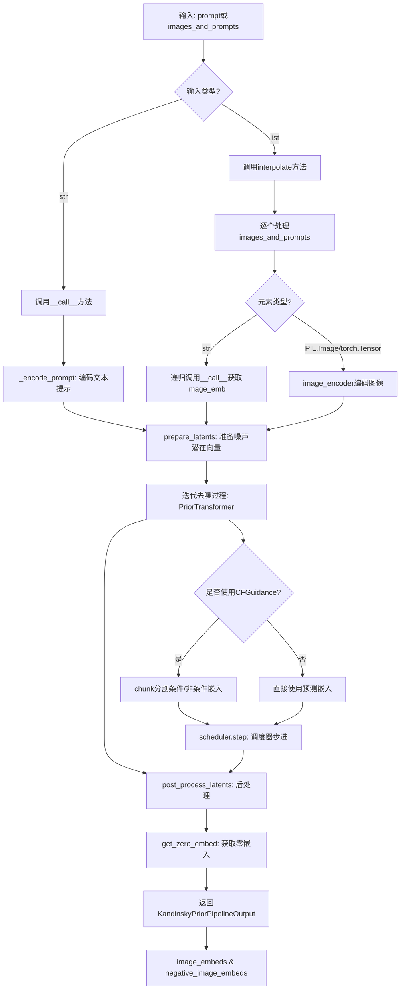
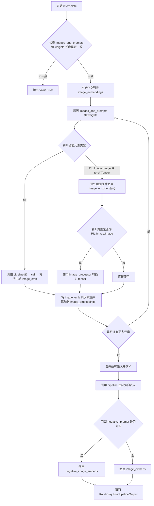
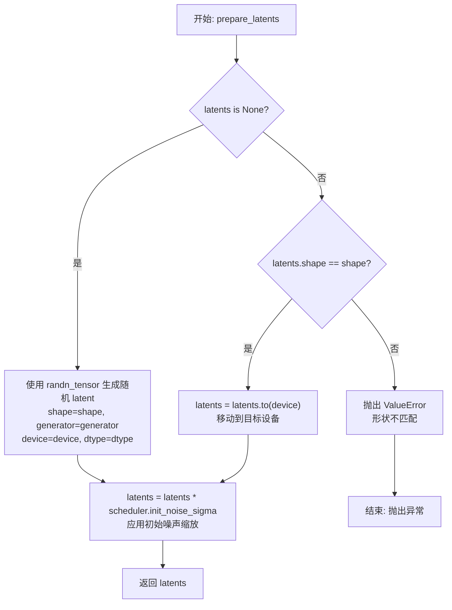
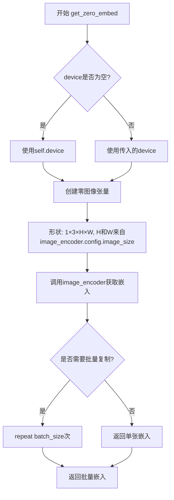

```mermaid
flowchart TD
    A[开始 __call__] --> B{检查 prompt 类型}
    B -->|str| C[转换为 list]
    B -->|list| D[类型检查通过]
    B -->|其他| E[抛出 ValueError]
    
    C --> D
    D --> F{检查 negative_prompt 类型}
    F -->|str| G[转换为 list]
    F -->|list| H[检查 None]
    F -->|其他| I[抛出 ValueError]
    
    G --> H
    H --> J{negative_prompt 不为 None}
    J -->|是| K[合并 prompt 和 negative_prompt]
    J -->|否| L[继续]
    
    K --> L
    L --> M[获取执行设备 device]
    M --> N[计算 batch_size]
    N --> O[调用 _encode_prompt 编码提示]
    
    O --> P[设置调度器时间步]
    P --> Q[调用 prepare_latents 准备潜在向量]
    
    Q --> R[迭代去噪过程]
    R --> S{是否使用分类器自由引导}
    S -->|是| T[扩展 latent_model_input]
    S -->|否| U[直接使用 latents]
    
    T --> V[调用 prior 预测图像嵌入]
    U --> V
    V --> W{do_classifier_free_guidance}
    W -->|是| X[计算引导后的嵌入]
    W -->|否| Y[直接使用预测嵌入]
    
    X --> Z[调用 scheduler.step 更新 latents]
    Y --> Z
    Z --> AA{是否是最后一步}
    AA -->|否| R
    AA -->|是| AB[调用 post_process_latents]
    
    AB --> AC{negative_prompt 为 None}
    AC -->|是| AD[调用 get_zero_embed 获取零嵌入]
    AC -->|否| AE[从 latents 中分离嵌入]
    
    AD --> AF[释放模型钩子]
    AE --> AG{存在 final_offload_hook}
    AG -->|是| AH[卸载 prior]
    AG -->|否| AF
    
    AF --> AI{output_type 检查}
    AH --> AI
    AI -->|pt| AJ[保持为 Tensor]
    AI -->|np| AK[转换为 NumPy]
    
    AJ --> AL{return_dict}
    AK --> AL
    AL -->|是| AM[返回 KandinskyPriorPipelineOutput]
    AL -->|否| AN[返回元组]
    
    AM --> AO[结束]
    AN --> AO
```

# `diffusers\src\diffusers\pipelines\kandinsky\pipeline_kandinsky_prior.py` 详细设计文档

Kandinsky先验管道，用于将文本提示和图像转换为图像嵌入向量，为后续Kandinsky主图像生成pipeline提供条件嵌入。该pipeline结合了CLIP文本/图像编码器和PriorTransformer扩散模型，实现从文本到图像嵌入的先验学习。

## 整体流程



## 类结构

```
DiffusionPipeline (基类)
└── KandinskyPriorPipeline
    └── KandinskyPriorPipelineOutput (输出数据类)
```

## 全局变量及字段


### `logger`
    
模块日志记录器，用于记录运行时信息

类型：`logging.Logger`
    


### `EXAMPLE_DOC_STRING`
    
示例文档字符串，包含Kandinsky管道的使用示例

类型：`str`
    


### `EXAMPLE_INTERPOLATE_DOC_STRING`
    
插值示例文档字符串，包含图像和文本插值的使用示例

类型：`str`
    


### `XLA_AVAILABLE`
    
XLA可用性标志，指示是否支持PyTorch XLA加速

类型：`bool`
    


### `KandinskyPriorPipelineOutput.image_embeds`
    
CLIP图像嵌入，用于文本提示的图像编码表示

类型：`torch.Tensor | np.ndarray`
    


### `KandinskyPriorPipelineOutput.negative_image_embeds`
    
无条件图像嵌入，用于无分类器引导扩散

类型：`torch.Tensor | np.ndarray`
    


### `KandinskyPriorPipeline.prior`
    
先验Transformer模型，用于从文本嵌入预测图像嵌入

类型：`PriorTransformer`
    


### `KandinskyPriorPipeline.text_encoder`
    
CLIP文本编码器，用于将文本提示编码为嵌入向量

类型：`CLIPTextModelWithProjection`
    


### `KandinskyPriorPipeline.tokenizer`
    
CLIP分词器，用于将文本分割为token序列

类型：`CLIPTokenizer`
    


### `KandinskyPriorPipeline.scheduler`
    
去噪调度器，用于控制扩散过程中的噪声调度

类型：`UnCLIPScheduler`
    


### `KandinskyPriorPipeline.image_encoder`
    
CLIP图像编码器，用于将图像编码为嵌入向量

类型：`CLIPVisionModelWithProjection`
    


### `KandinskyPriorPipeline.image_processor`
    
图像处理器，用于预处理输入图像

类型：`CLIPImageProcessor`
    


### `KandinskyPriorPipeline._exclude_from_cpu_offload`
    
CPU卸载排除列表，指定哪些模块不进行CPU卸载

类型：`list`
    


### `KandinskyPriorPipeline.model_cpu_offload_seq`
    
模型卸载顺序，定义模型组件的CPU卸载优先级

类型：`str`
    
    

## 全局函数及方法


### `KandinskyPriorPipeline.__init__`

这是 KandinskyPriorPipeline 类的构造函数，负责初始化管道的所有核心组件，包括 prior 模型、图像编码器、文本编码器、分词器、调度器和图像处理器，并通过父类注册所有模块。

参数：

- `prior`：`PriorTransformer`，unCLIP 先验模型，用于从文本嵌入近似图像嵌入
- `image_encoder`：`CLIPVisionModelWithProjection`，冻结的图像编码器
- `text_encoder`：`CLIPTextModelWithProjection`，冻结的文本编码器
- `tokenizer`：`CLIPTokenizer`，CLIP 分词器
- `scheduler`：`UnCLIPScheduler`，与 prior 结合使用生成图像嵌入的调度器
- `image_processor`：`CLIPImageProcessor`，CLIP 图像处理器

返回值：无（`None`），构造函数不返回任何值，仅初始化对象状态

#### 流程图

```mermaid
flowchart TD
    A[开始 __init__] --> B[调用 super().__init__ 初始化父类]
    B --> C[调用 self.register_modules 注册所有模块]
    C --> D[结束]
    
    C -->|注册模块| C1[prior: PriorTransformer]
    C -->|注册模块| C2[text_encoder: CLIPTextModelWithProjection]
    C -->|注册模块| C3[tokenizer: CLIPTokenizer]
    C -->|注册模块| C4[scheduler: UnCLIPScheduler]
    C -->|注册模块| C5[image_encoder: CLIPVisionModelWithProjection]
    C -->|注册模块| C6[image_processor: CLIPImageProcessor]
```

#### 带注释源码

```python
def __init__(
    self,
    prior: PriorTransformer,                              # unCLIP 先验模型，用于从文本嵌入生成图像嵌入
    image_encoder: CLIPVisionModelWithProjection,         # CLIP 图像编码器，用于编码图像
    text_encoder: CLIPTextModelWithProjection,            # CLIP 文本编码器，用于编码文本
    tokenizer: CLIPTokenizer,                             # CLIP 分词器，用于文本分词
    scheduler: UnCLIPScheduler,                           # unCLIP 调度器，用于扩散过程
    image_processor: CLIPImageProcessor,                  # CLIP 图像处理器，用于图像预处理
):
    # 调用父类 DiffusionPipeline 的 __init__ 方法
    # 初始化基础管道功能，如设备管理、内存管理等
    super().__init__()

    # 使用 register_modules 方法注册所有子模块
    # 这些模块将通过管道属性访问，并可用于设备移动、内存卸载等
    self.register_modules(
        prior=prior,                    # 注册先验模型
        text_encoder=text_encoder,      # 注册文本编码器
        tokenizer=tokenizer,            # 注册分词器
        scheduler=scheduler,           # 注册调度器
        image_encoder=image_encoder,    # 注册图像编码器
        image_processor=image_processor,# 注册图像处理器
    )
```


### `KandinskyPriorPipeline.interpolate`

该函数用于在多个图像和文本提示之间进行插值生成图像嵌入。通过接受混合的图像和文本提示列表及对应权重，计算加权平均的图像嵌入，并生成对应的负向嵌入用于无分类器自由引导。

参数：

- `images_and_prompts`：`list[str | PIL.Image.Image | torch.Tensor]`，要引导图像生成的提示和图像列表
- `weights`：`list[float]`，对应每个条件的权重列表
- `num_images_per_prompt`：`int`，可选，每个提示生成的图像数量，默认为 1
- `num_inference_steps`：`int`，可选，去噪步数，默认为 25
- `generator`：`torch.Generator | list[torch.Generator] | None`，可选，随机生成器，用于确保可重复性
- `latents`：`torch.Tensor | None`，可选，预生成的噪声 latents
- `negative_prior_prompt`：`str | None`，可选，不引导 prior 扩散过程的提示
- `negative_prompt`：`str`，可选，不引导图像生成的提示，默认为空字符串
- `guidance_scale`：`float`，可选，guidance scale，默认为 4.0
- `device`：可选，计算设备

返回值：`KandinskyPriorPipelineOutput`，包含 `image_embeds`（插值后的图像嵌入）和 `negative_image_embeds`（负向图像嵌入）

#### 流程图



#### 带注释源码

```python
@torch.no_grad()
@replace_example_docstring(EXAMPLE_INTERPOLATE_DOC_STRING)
def interpolate(
    self,
    images_and_prompts: list[str | PIL.Image.Image | torch.Tensor],
    weights: list[float],
    num_images_per_prompt: int = 1,
    num_inference_steps: int = 25,
    generator: torch.Generator | list[torch.Generator] | None = None,
    latents: torch.Tensor | None = None,
    negative_prior_prompt: str | None = None,
    negative_prompt: str = "",
    guidance_scale: float = 4.0,
    device=None,
):
    """
    Function invoked when using the prior pipeline for interpolation.

    Args:
        images_and_prompts (`list[str | PIL.Image.Image | torch.Tensor]`):
            list of prompts and images to guide the image generation.
        weights: (`list[float]`):
            list of weights for each condition in `images_and_prompts`
        num_images_per_prompt (`int`, *optional*, defaults to 1):
            The number of images to generate per prompt.
        num_inference_steps (`int`, *optional*, defaults to 25):
            The number of denoising steps. More denoising steps usually lead to a higher quality image at the
            expense of slower inference.
        generator (`torch.Generator` or `list[torch.Generator]`, *optional*):
            One or a list of [torch generator(s)](https://pytorch.org/docs/stable/generated/torch.Generator.html)
            to make generation deterministic.
        latents (`torch.Tensor`, *optional*):
            Pre-generated noisy latents, sampled from a Gaussian distribution, to be used as inputs for image
            generation. Can be used to tweak the same generation with different prompts. If not provided, a latents
            tensor will be generated by sampling using the supplied random `generator`.
        negative_prior_prompt (`str`, *optional*):
            The prompt not to guide the prior diffusion process. Ignored when not using guidance (i.e., ignored if
            `guidance_scale` is less than `1`).
        negative_prompt (`str` or `list[str]`, *optional*):
            The prompt not to guide the image generation. Ignored when not using guidance (i.e., ignored if
            `guidance_scale` is less than `1`).
        guidance_scale (`float`, *optional*, defaults to 4.0):
            Guidance scale as defined in [Classifier-Free Diffusion
            Guidance](https://huggingface.co/papers/2207.12598). `guidance_scale` is defined as `w` of equation 2.
            of [Imagen Paper](https://huggingface.co/papers/2205.11487). Guidance scale is enabled by setting
            `guidance_scale > 1`. Higher guidance scale encourages to generate images that are closely linked to
            the text `prompt`, usually at the expense of lower image quality.

    Examples:

    Returns:
        [`KandinskyPriorPipelineOutput`] or `tuple`
    """

    # 确定计算设备，默认为 self.device
    device = device or self.device

    # 检查输入列表长度一致性
    if len(images_and_prompts) != len(weights):
        raise ValueError(
            f"`images_and_prompts` contains {len(images_and_prompts)} items and `weights` contains {len(weights)} items - they should be lists of same length"
        )

    # 初始化存储图像嵌入的列表
    image_embeddings = []
    
    # 遍历每个条件元素（文本提示或图像）
    for cond, weight in zip(images_and_prompts, weights):
        # 如果是文本字符串，使用 prior pipeline 生成图像嵌入
        if isinstance(cond, str):
            image_emb = self(
                cond,
                num_inference_steps=num_inference_steps,
                num_images_per_prompt=num_images_per_prompt,
                generator=generator,
                latents=latents,
                negative_prompt=negative_prior_prompt,
                guidance_scale=guidance_scale,
            ).image_embeds

        # 如果是图像（PIL.Image 或 torch.Tensor）
        elif isinstance(cond, (PIL.Image.Image, torch.Tensor)):
            # 如果是 PIL 图像，先进行预处理
            if isinstance(cond, PIL.Image.Image):
                cond = (
                    self.image_processor(cond, return_tensors="pt")
                    .pixel_values[0]
                    .unsqueeze(0)
                    .to(dtype=self.image_encoder.dtype, device=device)
                )

            # 使用图像编码器获取图像嵌入
            image_emb = self.image_encoder(cond)["image_embeds"]

        # 类型不支持，抛出异常
        else:
            raise ValueError(
                f"`images_and_prompts` can only contains elements to be of type `str`, `PIL.Image.Image` or `torch.Tensor`  but is {type(cond)}"
            )

        # 将嵌入乘以权重并添加到列表中
        image_embeddings.append(image_emb * weight)

    # 合并所有加权的图像嵌入并求和
    image_emb = torch.cat(image_embeddings).sum(dim=0, keepdim=True)

    # 生成负向嵌入（用于无分类器自由引导）
    out_zero = self(
        negative_prompt,
        num_inference_steps=num_inference_steps,
        num_images_per_prompt=num_images_per_prompt,
        generator=generator,
        latents=latents,
        negative_prompt=negative_prior_prompt,
        guidance_scale=guidance_scale,
    )
    
    # 根据 negative_prompt 是否为空选择负向嵌入
    zero_image_emb = out_zero.negative_image_embeds if negative_prompt == "" else out_zero.image_embeds

    # 返回包含图像嵌入和负向嵌入的输出对象
    return KandinskyPriorPipelineOutput(image_embeds=image_emb, negative_image_embeds=zero_image_emb)
```


### `KandinskyPriorPipeline.prepare_latents`

该方法用于准备扩散模型的潜在变量（latents）。如果未提供预生成的 latents，则使用随机张量生成；否则验证其形状并移动到指定设备。最后根据调度器的初始噪声 sigma 对 latents 进行缩放，以适配扩散过程的初始状态。

参数：

- `shape`：`tuple`，潜在变量的目标形状
- `dtype`：`torch.dtype`，潜在变量的数据类型
- `device`：`torch.device`，潜在变量应放置的设备
- `generator`：`torch.Generator | list[torch.Generator] | None`，用于确保生成可重复性的随机数生成器
- `latents`：`torch.Tensor | None`，可选的预生成潜在变量
- `scheduler`：`UnCLIPScheduler`，用于获取初始噪声 sigma 的调度器

返回值：`torch.Tensor`，准备好的潜在变量

#### 流程图



#### 带注释源码

```python
def prepare_latents(self, shape, dtype, device, generator, latents, scheduler):
    """
    准备扩散模型的潜在变量（latents）
    
    如果未提供 latents，则随机生成；否则验证形状并移动到指定设备。
    最后根据调度器的 init_noise_sigma 进行缩放。
    """
    # 判断是否需要生成新的 latents
    if latents is None:
        # 使用 randn_tensor 生成随机张量作为初始潜在变量
        # shape: 潜在变量的形状
        # generator: 随机生成器，确保可重复性
        # device: 目标设备
        # dtype: 数据类型
        latents = randn_tensor(shape, generator=generator, device=device, dtype=dtype)
    else:
        # 验证传入的 latents 形状是否与预期形状匹配
        if latents.shape != shape:
            raise ValueError(f"Unexpected latents shape, got {latents.shape}, expected {shape}")
        # 将 latents 移动到指定设备
        latents = latents.to(device)

    # 根据调度器的初始噪声 sigma 对 latents 进行缩放
    # 这用于控制扩散过程的初始噪声水平
    latents = latents * scheduler.init_noise_sigma
    
    return latents
```


### `KandinskyPriorPipeline.get_zero_embed`

生成零图像的嵌入向量，用于在无正向prompt引导时作为负向嵌入（negative embedding）。

参数：

- `batch_size`：`int`，默认为1，要生成的零图像嵌入的批量大小
- `device`：`torch.device | None`，默认为None，执行设备，如果为None则使用self.device

返回值：`torch.Tensor`，返回批量化的零图像嵌入向量

#### 流程图



#### 带注释源码

```python
def get_zero_embed(self, batch_size=1, device=None):
    """
    生成零图像的嵌入向量，用于无正向prompt引导时的负向嵌入。
    
    Args:
        batch_size: 生成的零图像嵌入的批量大小，默认为1
        device: 执行设备，默认为None（使用self.device）
    
    Returns:
        torch.Tensor: 批量化的零图像嵌入向量
    """
    # 确定执行设备：优先使用传入的device，否则使用self.device
    device = device or self.device
    
    # 创建零图像张量
    # 形状: (1, 3, image_size, image_size)
    # image_size来自image_encoder的配置
    zero_img = torch.zeros(
        1, 
        3, 
        self.image_encoder.config.image_size, 
        self.image_encoder.config.image_size
    ).to(device=device, dtype=self.image_encoder.dtype)
    
    # 通过image_encoder获取零图像的嵌入向量
    # 返回的形状为 (1, embedding_dim)
    zero_image_emb = self.image_encoder(zero_img)["image_embeds"]
    
    # 将嵌入向量按batch_size进行复制
    # 从 (1, embedding_dim) 扩展为 (batch_size, embedding_dim)
    zero_image_emb = zero_image_emb.repeat(batch_size, 1)
    
    return zero_image_emb
```


### `KandinskyPriorPipeline._encode_prompt`

该方法负责将文本提示词（prompt）编码为文本嵌入向量（text embeddings），供后续的图像生成流程使用。它支持批量处理、每提示词多图生成以及无分类器自由引导（Classifier-Free Guidance）机制，能够同时处理正向提示词和负向提示词，并将结果整合后返回。

参数：

- `prompt`：`str | list[str]`，用户输入的文本提示词，可以是单个字符串或字符串列表
- `device`：`torch.device`，执行计算的设备（如CPU或CUDA）
- `num_images_per_prompt`：`int`，每个提示词需要生成的图像数量，用于扩展嵌入维度
- `do_classifier_free_guidance`：`bool`，是否启用无分类器自由引导，若为True则需要同时处理负向提示词
- `negative_prompt`：`str | list[str] | None`，可选的负向提示词，用于引导模型避免生成相关内容

返回值：`tuple[torch.Tensor, torch.Tensor, torch.Tensor]`

- 第一个元素为`prompt_embeds`（`torch.Tensor`），编码后的文本嵌入向量
- 第二个元素为`text_encoder_hidden_states`（`torch.Tensor`），文本编码器的隐藏状态
- 第三个元素为`text_mask`（`torch.Tensor`），用于指示有效token的注意力掩码

#### 流程图

```mermaid
flowchart TD
    A[开始 _encode_prompt] --> B[计算 batch_size]
    B --> C{prompt 是 list?}
    C -->|Yes| D[batch_size = len(prompt)]
    C -->|No| E[batch_size = 1]
    D --> F[调用 tokenizer 处理 prompt]
    E --> F
    F --> G[获取 text_input_ids 和 attention_mask]
    G --> H[检查是否需要截断]
    H --> I[调用 text_encoder 获取输出]
    I --> J[提取 prompt_embeds 和 last_hidden_state]
    J --> K[重复嵌入 num_images_per_prompt 次]
    K --> L{do_classifier_free_guidance?}
    L -->|No| M[直接返回结果]
    L -->|Yes| N{处理 negative_prompt}
    N --> O[negative_prompt 为空?]
    O -->|Yes| P[使用空字符串]
    O -->|No| Q[验证类型和batch size]
    P --> R[tokenizer 处理 uncond_tokens]
    Q --> R
    R --> S[获取 uncond 嵌入]
    S --> T[重复 negative 嵌入 num_images_per_prompt 次]
    T --> U[拼接 prompt_embeds 和 negative_prompt_embeds]
    U --> V[拼接 hidden_states 和 text_mask]
    V --> M
    M --> W[返回 prompt_embeds, text_encoder_hidden_states, text_mask]
```

#### 带注释源码

```python
def _encode_prompt(
    self,
    prompt,                          # str | list[str]: 输入的文本提示词
    device,                         # torch.device: 计算设备
    num_images_per_prompt,          # int: 每个提示词生成的图像数量
    do_classifier_free_guidance,   # bool: 是否启用无分类器引导
    negative_prompt=None,          # str | list[str] | None: 负向提示词
):
    # 步骤1: 确定批量大小
    batch_size = len(prompt) if isinstance(prompt, list) else 1
    
    # 步骤2: 使用tokenizer将文本转换为token ID序列
    # 填充到最大长度，截断超长序列，返回PyTorch张量
    text_inputs = self.tokenizer(
        prompt,
        padding="max_length",
        max_length=self.tokenizer.model_max_length,
        truncation=True,
        return_tensors="pt",
    )
    text_input_ids = text_inputs.input_ids          # token ID序列
    text_mask = text_inputs.attention_mask.bool().to(device)  # 注意力掩码
    
    # 步骤3: 检查是否发生截断
    # 获取未截断的tokenizer输出用于比较
    untruncated_ids = self.tokenizer(prompt, padding="longest", return_tensors="pt").input_ids
    
    # 如果未截断序列长度大于截断后长度，且两者不一致，说明发生了截断
    if untruncated_ids.shape[-1] >= text_input_ids.shape[-1] and not torch.equal(text_input_ids, untruncated_ids):
        # 解码被截断的部分用于日志警告
        removed_text = self.tokenizer.batch_decode(untruncated_ids[:, self.tokenizer.model_max_length - 1 : -1])
        logger.warning(
            "The following part of your input was truncated because CLIP can only handle sequences up to"
            f" {self.tokenizer.model_max_length} tokens: {removed_text}"
        )
        # 保留tokenizer支持的最大长度
        text_input_ids = text_input_ids[:, : self.tokenizer.model_max_length]
    
    # 步骤4: 通过文本编码器获取文本嵌入
    text_encoder_output = self.text_encoder(text_input_ids.to(device))
    
    # 提取文本嵌入和最后一层隐藏状态
    prompt_embeds = text_encoder_output.text_embeds           # [batch_size, embed_dim]
    text_encoder_hidden_states = text_encoder_output.last_hidden_state  # [batch_size, seq_len, hidden_dim]
    
    # 步骤5: 扩展嵌入以匹配 num_images_per_prompt
    # 在batch维度上重复每个嵌入
    prompt_embeds = prompt_embeds.repeat_interleave(num_images_per_prompt, dim=0)
    text_encoder_hidden_states = text_encoder_hidden_states.repeat_interleave(num_images_per_prompt, dim=0)
    text_mask = text_mask.repeat_interleave(num_images_per_prompt, dim=0)
    
    # 步骤6: 如果启用无分类器自由引导，处理负向提示词
    if do_classifier_free_guidance:
        uncond_tokens: list[str]
        
        # 处理负向提示词为空的情况
        if negative_prompt is None:
            uncond_tokens = [""] * batch_size
        # 类型检查：负向提示词类型必须与正向提示词一致
        elif type(prompt) is not type(negative_prompt):
            raise TypeError(
                f"`negative_prompt` should be the same type to `prompt`, but got {type(negative_prompt)} !="
                f" {type(prompt)}."
            )
        # 单个字符串转为列表
        elif isinstance(negative_prompt, str):
            uncond_tokens = [negative_prompt]
        # batch size不匹配检查
        elif batch_size != len(negative_prompt):
            raise ValueError(
                f"`negative_prompt`: {negative_prompt} has batch size {len(negative_prompt)}, but `prompt`:"
                f" {prompt} has batch size {batch_size}. Please make sure that passed `negative_prompt` matches"
                " the batch size of `prompt`."
            )
        else:
            uncond_tokens = negative_prompt
        
        # 对负向提示词进行tokenize
        uncond_input = self.tokenizer(
            uncond_tokens,
            padding="max_length",
            max_length=self.tokenizer.model_max_length,
            truncation=True,
            return_tensors="pt",
        )
        uncond_text_mask = uncond_input.attention_mask.bool().to(device)
        
        # 获取负向提示词的文本编码器输出
        negative_prompt_embeds_text_encoder_output = self.text_encoder(uncond_input.input_ids.to(device))
        
        # 提取负向嵌入
        negative_prompt_embeds = negative_prompt_embeds_text_encoder_output.text_embeds
        uncond_text_encoder_hidden_states = negative_prompt_embeds_text_encoder_output.last_hidden_state
        
        # 步骤7: 复制无条件嵌入以匹配每个prompt的生成数量
        # 使用mps兼容的方式进行处理
        seq_len = negative_prompt_embeds.shape[1]
        negative_prompt_embeds = negative_prompt_embeds.repeat(1, num_images_per_prompt)
        negative_prompt_embeds = negative_prompt_embeds.view(batch_size * num_images_per_prompt, seq_len)
        
        seq_len = uncond_text_encoder_hidden_states.shape[1]
        uncond_text_encoder_hidden_states = uncond_text_encoder_hidden_states.repeat(1, num_images_per_prompt, 1)
        uncond_text_encoder_hidden_states = uncond_text_encoder_hidden_states.view(
            batch_size * num_images_per_prompt, seq_len, -1
        )
        uncond_text_mask = uncond_text_mask.repeat_interleave(num_images_per_prompt, dim=0)
        
        # 步骤8: 拼接无条件嵌入和条件嵌入
        # 这是为了在单次前向传播中同时计算条件和无条件输出
        prompt_embeds = torch.cat([negative_prompt_embeds, prompt_embeds])
        text_encoder_hidden_states = torch.cat([uncond_text_encoder_hidden_states, text_encoder_hidden_states])
        
        # 拼接注意力掩码
        text_mask = torch.cat([uncond_text_mask, text_mask])
    
    # 步骤9: 返回编码后的嵌入向量、隐藏状态和掩码
    return prompt_embeds, text_encoder_hidden_states, text_mask
```


### `KandinskyPriorPipeline.__call__`

该方法是Kandinsky先验管道的核心调用接口，用于将文本提示转换为图像嵌入向量（image embeddings）。它通过编码文本提示、在潜在空间中进行去噪迭代（使用UnCLIPScheduler和PriorTransformer），并返回生成的图像嵌入和负面图像嵌入，供后续的Kandinsky主 pipeline 生成最终图像。

参数：

- `prompt`：`str | list[str]`，要引导图像生成的文本提示或提示列表
- `negative_prompt`：`str | list[str] | None`，可选的不引导图像生成的负面提示，用于无分类器引导
- `num_images_per_prompt`：`int`，默认为 1，每个提示生成的图像数量
- `num_inference_steps`：`int`，默认为 25，去噪迭代的步数，步数越多通常图像质量越高但推理越慢
- `generator`：`torch.Generator | list[torch.Generator] | None`，可选的随机数生成器，用于确保生成的可重复性
- `latents`：`torch.Tensor | None`，可选的预生成噪声潜在向量，若不提供则使用随机生成
- `guidance_scale`：`float`，默认为 4.0，分类器自由引导（Classifier-Free Guidance）的比例，值越大生成的图像与文本提示越相关
- `output_type`：`str | None`，默认为 "pt"，输出格式，可选 "pt"（PyTorch张量）或 "np"（NumPy数组）
- `return_dict`：`bool`，默认为 True，是否返回KandinskyPriorPipelineOutput对象而非元组

返回值：`KandinskyPriorPipelineOutput | tuple`，返回包含image_embeds（图像嵌入）和negative_image_embeds（负面图像嵌入）的输出对象，或按output_type格式的张量元组

#### 流程图



#### 带注释源码

```python
@torch.no_grad()
@replace_example_docstring(EXAMPLE_DOC_STRING)
def __call__(
    self,
    prompt: str | list[str],
    negative_prompt: str | list[str] | None = None,
    num_images_per_prompt: int = 1,
    num_inference_steps: int = 25,
    generator: torch.Generator | list[torch.Generator] | None = None,
    latents: torch.Tensor | None = None,
    guidance_scale: float = 4.0,
    output_type: str | None = "pt",
    return_dict: bool = True,
):
    """
    Function invoked when calling the pipeline for generation.

    Args:
        prompt (`str` or `list[str]`):
            The prompt or prompts to guide the image generation.
        negative_prompt (`str` or `list[str]`, *optional*):
            The prompt or prompts not to guide the image generation. Ignored when not using guidance (i.e., ignored
            if `guidance_scale` is less than `1`).
        num_images_per_prompt (`int`, *optional*, defaults to 1):
            The number of images to generate per prompt.
        num_inference_steps (`int`, *optional*, defaults to 25):
            The number of denoising steps. More denoising steps usually lead to a higher quality image at the
            expense of slower inference.
        generator (`torch.Generator` or `list[torch.Generator]`, *optional*):
            One or a list of [torch generator(s)](https://pytorch.org/docs/stable/generated/torch.Generator.html)
            to make generation deterministic.
        latents (`torch.Tensor`, *optional*):
            Pre-generated noisy latents, sampled from a Gaussian distribution, to be used as inputs for image
            generation. Can be used to tweak the same generation with different prompts. If not provided, a latents
            tensor will be generated by sampling using the supplied random `generator`.
        guidance_scale (`float`, *optional*, defaults to 4.0):
            Guidance scale as defined in [Classifier-Free Diffusion
            Guidance](https://huggingface.co/papers/2207.12598). `guidance_scale` is defined as `w` of equation 2.
            of [Imagen Paper](https://huggingface.co/papers/2205.11487). Guidance scale is enabled by setting
            `guidance_scale > 1`. Higher guidance scale encourages to generate images that are closely linked to
            the text `prompt`, usually at the expense of lower image quality.
        output_type (`str`, *optional*, defaults to `"pt"`):
            The output format of the generate image. Choose between: `"np"` (`np.array`) or `"pt"`
            (`torch.Tensor`).
        return_dict (`bool`, *optional*, defaults to `True`):
            Whether or not to return a [`~pipelines.ImagePipelineOutput`] instead of a plain tuple.

    Examples:

    Returns:
        [`KandinskyPriorPipelineOutput`] or `tuple`
    """

    # ====== 步骤1: 输入验证和类型标准化 ======
    # 如果 prompt 是单个字符串，转换为列表；否则检查是否为列表类型
    if isinstance(prompt, str):
        prompt = [prompt]
    elif not isinstance(prompt, list):
        raise ValueError(f"`prompt` has to be of type `str` or `list` but is {type(prompt)}")

    # 如果 negative_prompt 是字符串，转换为列表；如果是 None 则保留；否则检查是否为列表
    if isinstance(negative_prompt, str):
        negative_prompt = [negative_prompt]
    elif not isinstance(negative_prompt, list) and negative_prompt is not None:
        raise ValueError(f"`negative_prompt` has to be of type `str` or `list` but is {type(negative_prompt)}")

    # ====== 步骤2: 批处理大小调整 ======
    # 如果定义了 negative_prompt，则将 batch size 加倍，以便直接获取负面提示嵌入
    # 这是为了实现无分类器引导（Classifier-Free Guidance）
    if negative_prompt is not None:
        prompt = prompt + negative_prompt
        negative_prompt = 2 * negative_prompt

    # 获取执行设备（CPU/CUDA等）
    device = self._execution_device

    # 计算最终的批处理大小：原始 prompt 数量 × 每prompt生成的图像数量
    batch_size = len(prompt)
    batch_size = batch_size * num_images_per_prompt

    # ====== 步骤3: 确定是否使用分类器自由引导 ======
    # 当 guidance_scale > 1.0 时启用 CFG
    do_classifier_free_guidance = guidance_scale > 1.0

    # ====== 步骤4: 编码文本提示 ======
    # 调用内部方法 _encode_prompt 将文本转换为嵌入向量
    # 返回：prompt_embeds（文本嵌入）、text_encoder_hidden_states（隐藏状态）、text_mask（注意力掩码）
    prompt_embeds, text_encoder_hidden_states, text_mask = self._encode_prompt(
        prompt, device, num_images_per_prompt, do_classifier_free_guidance, negative_prompt
    )

    # ====== 步骤5: 设置调度器时间步 ======
    # 配置 UnCLIPScheduler 的去噪时间步
    self.scheduler.set_timesteps(num_inference_steps, device=device)
    prior_timesteps_tensor = self.scheduler.timesteps

    # ====== 步骤6: 准备潜在向量 ======
    # 获取 prior 模型的嵌入维度
    embedding_dim = self.prior.config.embedding_dim

    # 调用 prepare_latents 初始化或验证潜在向量
    # 如果未提供 latents，则使用 randn_tensor 生成随机噪声
    latents = self.prepare_latents(
        (batch_size, embedding_dim),
        prompt_embeds.dtype,
        device,
        generator,
        latents,
        self.scheduler,
    )

    # ====== 步骤7: 去噪迭代循环 ======
    # 遍历每个时间步进行去噪
    for i, t in enumerate(self.progress_bar(prior_timesteps_tensor)):
        # 如果使用 CFG，则复制 latents 以同时处理条件和非条件预测
        latent_model_input = torch.cat([latents] * 2) if do_classifier_free_guidance else latents

        # 调用 PriorTransformer 预测图像嵌入
        # 输入：潜在向量、时间步、提示嵌入、文本编码器隐藏状态、注意力掩码
        predicted_image_embedding = self.prior(
            latent_model_input,
            timestep=t,
            proj_embedding=prompt_embeds,
            encoder_hidden_states=text_encoder_hidden_states,
            attention_mask=text_mask,
        ).predicted_image_embedding

        # ====== 步骤8: 应用分类器自由引导 ======
        if do_classifier_free_guidance:
            # 将预测的嵌入拆分为非条件部分和条件部分
            predicted_image_embedding_uncond, predicted_image_embedding_text = predicted_image_embedding.chunk(2)
            # 应用引导公式：uncond + scale * (text - uncond)
            predicted_image_embedding = predicted_image_embedding_uncond + guidance_scale * (
                predicted_image_embedding_text - predicted_image_embedding_uncond
            )

        # ====== 步骤9: 计算前一个时间步 ======
        if i + 1 == prior_timesteps_tensor.shape[0]:
            # 如果是最后一步，设置 prev_timestep 为 None
            prev_timestep = None
        else:
            prev_timestep = prior_timesteps_tensor[i + 1]

        # ====== 步骤10: 调度器步进 ======
        # 使用调度器根据预测的图像嵌入更新 latents
        latents = self.scheduler.step(
            predicted_image_embedding,
            timestep=t,
            sample=latents,
            generator=generator,
            prev_timestep=prev_timestep,
        ).prev_sample

        # ====== 步骤11: XLA 设备优化 ======
        # 如果使用 PyTorch XLA，进行标记步骤以优化 TPU 性能
        if XLA_AVAILABLE:
            xm.mark_step()

    # ====== 步骤12: 后处理潜在向量 ======
    # 对最终的潜在向量进行后处理
    latents = self.prior.post_process_latents(latents)

    # 获取处理后的图像嵌入
    image_embeddings = latents

    # ====== 步骤13: 处理负面嵌入 ======
    # 如果没有定义 negative_prompt，则生成零嵌入作为负面嵌入
    if negative_prompt is None:
        # 生成零图像嵌入（用于无提示引导的情况）
        zero_embeds = self.get_zero_embed(latents.shape[0], device=latents.device)

        # 释放模型钩子（如果使用了 CPU offload）
        self.maybe_free_model_hooks()
    else:
        # 如果有 negative_prompt，从图像嵌入中分离出负面嵌入
        image_embeddings, zero_embeds = image_embeddings.chunk(2)

        # 如果存在最终卸载钩子，卸载 prior
        if hasattr(self, "final_offload_hook") and self.final_offload_hook is not None:
            self.prior_hook.offload()

    # ====== 步骤14: 输出格式转换 ======
    # 检查输出类型是否有效
    if output_type not in ["pt", "np"]:
        raise ValueError(f"Only the output types `pt` and `np` are supported not output_type={output_type}")

    # 如果需要 NumPy 格式，则转换
    if output_type == "np":
        image_embeddings = image_embeddings.cpu().numpy()
        zero_embeds = zero_embeds.cpu().numpy()

    # ====== 步骤15: 返回结果 ======
    # 根据 return_dict 决定返回格式
    if not return_dict:
        return (image_embeddings, zero_embeds)

    # 返回包含图像嵌入和负面图像嵌入的输出对象
    return KandinskyPriorPipelineOutput(image_embeds=image_embeddings, negative_image_embeds=zero_embeds)
```

## 关键组件


### 张量索引与惰性加载

在`prepare_latents`方法中实现，支持延迟加载潜在张量，仅在需要时通过`randn_tensor`生成随机张量，避免提前占用大量内存。

### 反量化支持

虽然代码中没有显式的反量化操作，但通过`dtype`参数和`to(device, dtype=...)`方法支持不同精度张量的转换处理。

### 量化策略

代码依赖外部传入的`torch_dtype`参数（如`torch.float16`）来支持半精度推理，但未实现内置的动态量化或量化感知训练策略。

### 图像编码器（image_encoder）

Frozen的CLIP视觉模型，用于从图像或像素值提取图像嵌入向量。

### 文本编码器（text_encoder）

Frozen的CLIP文本模型，用于将文本提示转换为文本嵌入和隐藏状态。

### 先验变换器（prior）

PriorTransformer模型，用于根据文本嵌入生成图像嵌入，是Kandinsky 2.1的核心组件。

### 调度器（scheduler）

UnCLIPScheduler调度器，用于控制去噪过程中的时间步长和噪声调度。

### 插值方法（interpolate）

支持将多个图像和文本提示按权重插值融合，生成混合的图像嵌入，可用于创意图像生成。

### 零嵌入生成（get_zero_embed）

生成全零图像的嵌入向量，用于无条件和负向提示的引导生成。


## 问题及建议


### 已知问题

-   **`interpolate` 方法参数错误**：调用 `self(...)` 时，参数 `negative_prompt` 被错误地设置为 `negative_prior_prompt`，而 `negative_prior_prompt` 参数本身未被使用，这会导致混淆和潜在的功能错误。
-   **`get_zero_embed` 硬编码图像尺寸**：使用硬编码的 `self.image_encoder.config.image_size`，如果配置中的图像尺寸与实际使用不匹配，可能导致运行时错误。
-   **缺少类型注解**：`interpolate` 方法缺少返回类型注解，降低了代码的可读性和 IDE 支持。
-   **`__call__` 方法参数处理逻辑复杂**：`negative_prompt` 的批处理处理逻辑（行 `prompt = prompt + negative_prompt` 和 `negative_prompt = 2 * negative_prompt`）容易出错且难以维护。
-   **`_encode_prompt` 方法冗余**：存在重复的 `repeat_interleave` 操作和重复的文本处理逻辑。
-   **未使用的参数**：`interpolate` 方法的 `latents` 参数在方法内部被传递但从未实际用于条件生成，每次调用 `self(...)` 都会创建新的 latents。
-   **资源释放逻辑问题**：在 `__call__` 方法中，当 `negative_prompt` 不为 None 时，调用了 `self.prior_hook.offload()` 而不是 `self.final_offload_hook.offload()`，这可能是一个 bug。

### 优化建议

-   **修复 `interpolate` 方法参数**：修正 `negative_prompt` 参数的传递，确保 `negative_prior_prompt` 被正确使用或移除该参数。
-   **添加类型注解**：为 `interpolate` 方法添加明确的返回类型注解 `-> KandinskyPriorPipelineOutput`。
-   **提取公共方法**：将 `_encode_prompt` 中的重复逻辑提取为辅助方法，减少代码冗余。
-   **优化 `get_zero_embed`**：添加动态尺寸检测或使用配置中的实际图像尺寸参数。
-   **简化 `__call__` 方法**：重构 negative_prompt 的批处理逻辑，使其更清晰易懂。
-   **修复资源释放逻辑**：将 `self.prior_hook.offload()` 改为 `self.final_offload_hook.offload()`。
-   **文档完善**：为关键方法和参数添加更详细的文档说明，特别是关于 `latents` 和 `generator` 的使用方式。

## 其它


### 设计目标与约束

本Pipeline的设计目标是实现Kandinsky 2.1模型的先验管道（Prior Pipeline），将文本提示转换为图像嵌入向量，为后续的图像生成提供条件特征。核心约束包括：1) 依赖CLIP模型进行文本和图像编码，必须使用HuggingFace Transformers库；2) 使用UnCLIPScheduler进行扩散采样，支持Classifier-Free Guidance；3) 必须继承DiffusionPipeline基类以保持与diffusers库的一致性；4) 输出格式支持PyTorch张量和NumPy数组两种形式。

### 错误处理与异常设计

代码中的错误处理主要通过ValueError和TypeError异常实现。具体包括：1) `interpolate`方法中检查`images_and_prompts`和`weights`长度必须一致；2) 检查输入类型是否为str、PIL.Image或torch.Tensor；3) `__call__`方法中验证prompt类型必须为str或list；4) 验证negative_prompt类型必须为str、list或None；5) 验证output_type只支持"pt"和"np"两种；6) 在`prepare_latents`中检查latents形状是否匹配预期形状；7) 在`_encode_prompt`中检查negative_prompt与prompt的类型一致性及batch size匹配。

### 数据流与状态机

Pipeline的数据流如下：1) 输入阶段：接收prompt（str或list）、negative_prompt、num_images_per_prompt等参数；2) 编码阶段：调用`_encode_prompt`将文本转换为prompt_embeds和text_encoder_hidden_states；3) 初始化阶段：调用`prepare_latents`生成或验证latents；4) 循环阶段：对每个timestep执行prior前向传播，使用scheduler.step更新latents；5) 后处理阶段：调用`post_process_latents`处理潜在向量；6) 输出阶段：生成image_embeds和negative_image_embeds。状态转换由UnCLIPScheduler管理，通过set_timesteps设置推理步骤，通过step方法推进状态。

### 外部依赖与接口契约

主要外部依赖包括：1) transformers库：CLIPTextModelWithProjection、CLIPVisionModelWithProjection、CLIPTokenizer、CLIPImageProcessor；2) diffusers库：PriorTransformer、UnCLIPScheduler、DiffusionPipeline、BaseOutput；3) PyTorch：核心计算框架；4) PIL：图像处理；5) NumPy：数组操作。接口契约方面：`__call__`方法接收prompt、negative_prompt等参数，返回KandinskyPriorPipelineOutput对象；`interpolate`方法支持混合文本和图像输入，返回加权融合的图像嵌入；所有方法均支持torch.no_grad装饰器以禁用梯度计算。

### 性能考虑与优化空间

当前实现存在以下性能优化空间：1) 重复计算：`_encode_prompt`中对unconditional embeddings的复制操作可使用更高效的向量化操作；2) 内存占用：classifier-free guidance时复制latents两次，可考虑in-place操作；3) XLA支持：已包含torch_xla的mark_step调用，但可进一步优化TPU性能；4) 批处理：interpolate方法中每个condition单独调用pipeline，可改为批量处理；5) 模型卸载：已实现CPU offload机制（model_cpu_offload_seq），可进一步优化显存使用。

### 安全性考虑

代码中的安全措施包括：1) 使用torch.no_grad装饰器防止梯度存储；2) 文本截断处理：CLIPTokenizer有model_max_length限制，超长文本会被截断并警告；3) 类型检查：防止类型不匹配导致的运行时错误；4) 设备管理：通过self._execution_device统一管理设备，避免设备不匹配；5) XLA兼容：使用条件导入避免在非TPU环境下出错。

### 兼容性考虑

版本兼容性方面：1) Python类型注解使用|语法（Python 3.10+），需注意旧版本Python兼容性问题；2) torch.Generator参数支持单个或列表形式；3) 输出支持"pt"和"np"两种格式以兼容不同下游任务；4) 与diffusers库的DiffusionPipeline基类保持接口一致；5) 支持HuggingFace Hub模型加载方式（from_pretrained）。

### 配置管理与模型加载

Pipeline配置通过register_modules方法统一管理，包含六个核心模块：prior（PriorTransformer）、text_encoder（CLIPTextModelWithProjection）、tokenizer（CLIPTokenizer）、scheduler（UnCLIPScheduler）、image_encoder（CLIPVisionModelWithProjection）、image_processor（CLIPImageProcessor）。模型加载采用from_pretrained方式从HuggingFace Hub获取预训练权重，支持torch_dtype参数指定精度（float16等），支持to(device)进行设备迁移。

### 并发与异步处理

当前实现为同步执行，尚未包含异步处理机制。XLA支持部分考虑了TPU场景的并发优化（xm.mark_step），但整体pipeline为顺序执行。可能的优化方向：1) 支持async/await模式进行异步推理；2) 在interpolate方法中并行处理多个condition；3) 支持torch.compile加速；4) 支持分布式推理。

### 日志记录与可观测性

日志记录通过`logging.get_logger(__name__)`实现，关键日志点包括：1) 文本截断警告：当输入文本超过CLIP最大token长度时发出警告；2) 进度条：使用self.progress_bar(prior_timesteps_tensor)显示推理进度；3) 设备信息：通过self.device获取当前执行设备；4) XLA设备标记：TPU推理时使用xm.mark_step()进行设备同步。

### 测试策略建议

建议补充的测试用例包括：1) 单元测试：验证每个方法的输入输出类型和形状；2) 集成测试：与KandinskyPipeline联合测试完整图像生成流程；3) 性能测试：测量不同batch size和num_inference_steps下的推理时间；4) 边界测试：测试空prompt、极长prompt、单batch与多batch等边界情况；5) 插值测试：验证interpolate方法对文本和图像混合输入的处理；6) 设备测试：验证CPU、CUDA、TPU不同设备上的运行结果一致性。


    