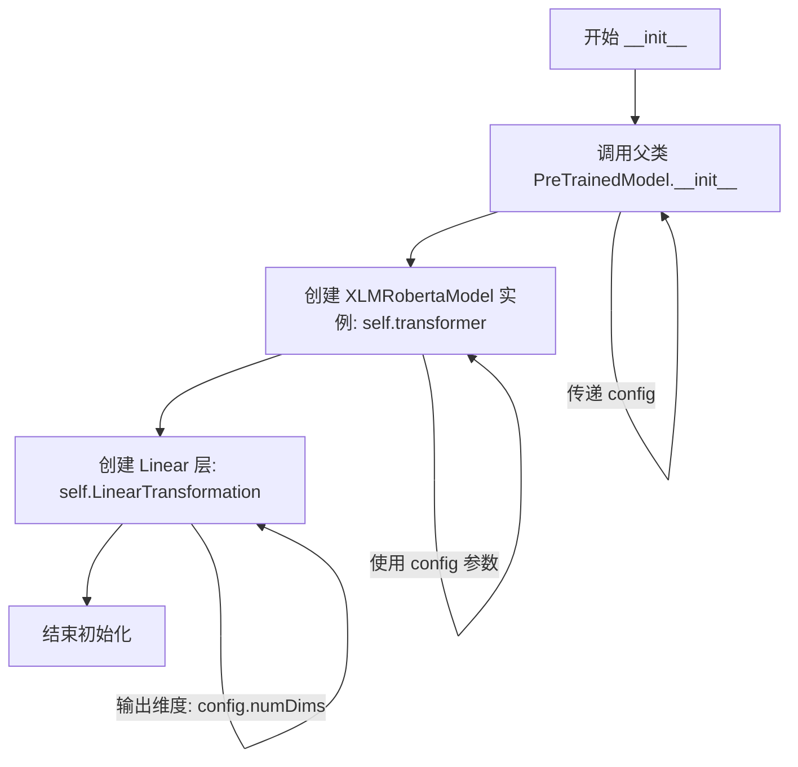

# `diffusers\src\diffusers\pipelines\kandinsky\text_encoder.py` 详细设计文档

M-CLIP（多语言CLIP）模型的PyTorch实现，基于XLM-RoBERTa架构，通过自定义配置类扩展Transformer参数，并使用线性变换将Transformer输出的文本嵌入映射到指定图像维度空间，实现多语言文本编码功能。

## 整体流程

```mermaid
graph TD
A[开始 forward 方法] --> B[调用 XLMRobertaModel 编码文本]
B --> C[获取序列嵌入 embs]
C --> D[使用 attention_mask 加权求和计算句子嵌入 embs2]
D --> E[LinearTransformation 将嵌入投影到图像维度]
E --> F[返回 (投影后的嵌入, 原始嵌入)]
```

## 类结构

```
XLMRobertaConfig (HuggingFace 基类)
└── MCLIPConfig (自定义配置类)
PreTrainedModel (HuggingFace 基类)
└── MultilingualCLIP (主模型类)
```

## 全局变量及字段


### `MCLIPConfig.model_type`
    
模型类型标识，值为'M-CLIP'

类型：`str`
    


### `MCLIPConfig.transformerDimensions`
    
Transformer隐藏层维度

类型：`int`
    


### `MCLIPConfig.numDims`
    
图像嵌入维度

类型：`int`
    


### `MultilingualCLIP.config_class`
    
配置类引用，指向MCLIPConfig

类型：`class`
    


### `MultilingualCLIP.transformer`
    
XLM-RoBERTa编码器

类型：`XLMRobertaModel`
    


### `MultilingualCLIP.LinearTransformation`
    
线性变换层

类型：`torch.nn.Linear`
    
    

## 全局函数及方法


### `MCLIPConfig.__init__`

该方法是 M-CLIP 模型的配置类 `MCLIPConfig` 的初始化方法，用于配置多语言 CLIP 模型的 Transformer 维度、图像维度等关键参数，并继承 XLMRobertaConfig 的配置能力。

参数：

- `transformerDimSize`：`int`，Transformer 模型的隐藏层维度大小，默认为 1024，用于指定多语言 Transformer 的输出维度。
- `imageDimSize`：`int`，图像嵌入的维度大小，默认为 768，用于指定图像特征的维度，与 CLIP 图像编码器维度对齐。
- `**kwargs`：`dict`，可变关键字参数，用于传递 XLMRobertaConfig 的其他配置参数，如 vocab_size、hidden_size 等。

返回值：`None`，该方法为构造函数，不返回任何值，仅初始化对象属性。

#### 流程图

```mermaid
flowchart TD
    A[开始 __init__] --> B[接收参数 transformerDimSize, imageDimSize, **kwargs]
    B --> C[设置 self.transformerDimensions = transformerDimSize]
    C --> D[设置 self.numDims = imageDimSize]
    D --> E[调用父类 super().__init__(**kwargs)]
    E --> F[结束]
    
    style A fill:#e1f5fe
    style F fill:#e8f5e8
```

#### 带注释源码

```python
def __init__(self, transformerDimSize=1024, imageDimSize=768, **kwargs):
    """
    初始化 MCLIPConfig 配置类
    
    参数:
        transformerDimSize: Transformer 模型的隐藏层维度，默认为 1024
        imageDimSize: 图像嵌入的维度，默认为 768（与 CLIP 图像编码器对齐）
        **kwargs: 传递给父类 XLMRobertaConfig 的其他配置参数
    """
    # 设置 Transformer 的输出维度，用于后续 MultilingualCLIP 中的线性变换
    self.transformerDimensions = transformerDimSize
    
    # 设置图像维度，用于后续 MultilingualCLIP 中线性变换的目标维度
    self.numDims = imageDimSize
    
    # 调用父类 XLMRobertaConfig 的初始化方法，继承 XLM-RoBERTa 的配置能力
    # 传递 **kwargs 以支持父类的所有配置参数（如 vocab_size, max_position_embeddings 等）
    super().__init__(**kwargs)
```


### MultilingualCLIP.__init__

该方法是 `MultilingualCLIP` 类的构造函数，负责初始化模型的核心组件：继承 PreTrainedModel 的基础配置，创建 XLM-RoBERTa 预训练语言模型作为特征提取器，并定义一个线性变换层将语言模型的输出维度映射到图像嵌入空间（768维），从而实现多语言 CLIP 的跨模态表示能力。

参数：

- `self`：`MultilingualCLIP`，类实例本身
- `config`：`MCLIPConfig`，模型配置文件，继承自 XLMRobertaConfig，包含 `transformerDimensions`（transformer输出维度）和 `numDims`（图像嵌入维度）两个关键参数
- `*args`：可变位置参数，传递给父类 PreTrainedModel
- `**kwargs`：可变关键字参数，传递给父类 PreTrainedModel

返回值：`None`（`__init__` 方法无返回值，初始化过程通过修改实例属性完成）

#### 流程图



#### 带注释源码

```python
def __init__(self, config, *args, **kwargs):
    """
    初始化 MultilingualCLIP 模型
    
    参数:
        config: MCLIPConfig 模型配置对象
        *args: 可变位置参数
        **kwargs: 可变关键字参数
    """
    # 调用父类 PreTrainedModel 的初始化方法
    # 负责加载配置、初始化基础模型参数等
    super().__init__(config, *args, **kwargs)
    
    # 创建 XLM-RoBERTa 预训练语言模型作为文本编码器
    # 使用 config 中的配置参数初始化模型结构
    self.transformer = XLMRobertaModel(config)
    
    # 创建线性变换层，用于将 transformer 输出的高维向量映射到图像嵌入空间
    # in_features: transformer 的输出维度 (默认 1024)
    # out_features: 图像嵌入维度 (默认 768)
    self.LinearTransformation = torch.nn.Linear(
        in_features=config.transformerDimensions, 
        out_features=config.numDims
    )
```


### `MultilingualCLIP.forward`

该方法执行多语言CLIP模型的前向传播，将输入的token IDs通过Transformer编码后，使用注意力掩码进行加权平均，最后通过线性变换将嵌入维度映射到图像维度，输出文本嵌入向量和原始嵌入。

参数：

- `self`：隐式参数，MultilingualCLIP实例本身
- `input_ids`：`torch.Tensor`，形状为(batch_size, sequence_length)，表示输入文本的token IDs
- `attention_mask`：`torch.Tensor`，形状为(batch_size, sequence_length)，用于指示哪些位置是有效token（1表示有效，0表示padding）

返回值：`Tuple[torch.Tensor, torch.Tensor]`，返回一个元组：
- 第一个元素：经过LinearTransformation维度变换后的文本嵌入向量，形状为(batch_size, imageDimSize)
- 第二个元素：未经变换的原始嵌入向量，形状为(batch_size, sequence_length, hidden_size)

#### 流程图

```mermaid
flowchart TD
    A[开始 forward] --> B[输入 input_ids 和 attention_mask]
    B --> C[调用 self.transformer 获取 last_hidden_state]
    C --> D[使用 attention_mask.unsqueeze(2) 扩展维度]
    D --> E[执行加权求和: embs * attention_mask.unsqueeze(2)]
    E --> F[按序列长度求平均: sum / attention_mask.sum(dim=1)[:, None]]
    G[调用 self.LinearTransformation 进行维度变换]
    F --> G
    G --> H[返回变换后的嵌入和原始嵌入]
    H --> I[结束 forward]
```

#### 带注释源码

```python
def forward(self, input_ids, attention_mask):
    """
    MultilingualCLIP 模型的前向传播方法
    
    参数:
        input_ids: 输入文本的token IDs，形状为 (batch_size, seq_len)
        attention_mask: 注意力掩码，形状为 (batch_size, seq_len)，用于标识有效token
    
    返回:
        tuple: (变换后的嵌入, 原始嵌入)
            - 变换后嵌入: (batch_size, imageDimSize)
            - 原始嵌入: (batch_size, seq_len, hidden_size)
    """
    # 步骤1: 通过Transformer编码器获取隐藏状态
    # transformer输出包含多个元素，[0]取last_hidden_state
    # 形状: (batch_size, sequence_length, hidden_size)
    embs = self.transformer(input_ids=input_ids, attention_mask=attention_mask)[0]
    
    # 步骤2: 使用注意力掩码进行加权平均
    # unsqueeze(2) 将attention_mask从 (batch_size, seq_len) 扩展为 (batch_size, seq_len, 1)
    # 这样可以与embs逐元素相乘，实现对padding位置的屏蔽
    # 形状: (batch_size, sequence_length, 1)
    masked_embs = embs * attention_mask.unsqueeze(2)
    
    # 步骤3: 按序列维度求和，然后除以有效token数量得到平均嵌入
    # sum(dim=1) 对序列维度求和，形状变为 (batch_size, hidden_size)
    # attention_mask.sum(dim=1) 计算每句话的有效token数量，形状变为 (batch_size)
    # [:, None] 将其扩展为 (batch_size, 1)，用于广播除法
    # 最终 embs2 形状: (batch_size, hidden_size)
    embs2 = masked_embs.sum(dim=1) / attention_mask.sum(dim=1)[:, None]
    
    # 步骤4: 通过线性变换将Transformer维度映射到图像嵌入维度
    # 输入维度: transformerDimensions (默认1024)
    # 输出维度: numDims/imageDimSize (默认768)
    # 返回形状: (batch_size, imageDimSize)
    transformed_embs = self.LinearTransformation(embs2)
    
    # 返回变换后的嵌入用于与图像对比学习，以及原始嵌入用于其他用途
    return transformed_embs, embs
```


## 关键组件


### MCLIPConfig配置类

继承自XLMRobertaConfig的M-CLIP模型配置类，用于定义模型的基本参数，包括transformer维度大小和图像嵌入维度大小。

### MultilingualCLIP主模型类

继承自PreTrainedModel的核心模型类，负责多语言文本到图像嵌入空间的转换，包含transformer编码器和线性变换层。

### transformer组件

XLMRobertaModel实例，作为模型的编码器主体，用于将输入token编码为上下文相关的隐藏状态序列。

### LinearTransformation组件

torch.nn.Linear线性变换层，将transformer输出的高维嵌入（默认1024维）投影到图像嵌入空间（默认768维）。

### forward前向传播方法

接收input_ids和attention_mask参数，经过transformer编码、注意力掩码加权求和、线性投影后返回图像嵌入和原始transformer嵌入。

### 张量索引与惰性加载

通过attention_mask.unsqueeze(2)扩展维度并结合索引操作实现掩码加权求和，仅对有效token进行聚合计算。

### 维度转换逻辑

通过.sum(dim=1)/attention_mask.sum(dim=1)[:, None]实现序列嵌入到单一嵌入的聚合，支持变长输入处理。


## 问题及建议


### 已知问题

- **变量命名不符合Python规范**：`LinearTransformation`使用PascalCase命名，应使用snake_case（如`linear_transformation`）
- **缺少类型注解**：所有方法都缺少参数和返回值的类型注解，降低了代码可读性和IDE支持
- **forward方法返回值设计不规范**：继承自`PreTrainedModel`但返回两个张量（tuple），这与HuggingFace的标准接口不完全一致，可能导致与其他HuggingFace组件集成时出现问题
- **除零风险**：`forward`方法中`attention_mask.sum(dim=1)[:, None]`，当batch中存在空序列时会导致除零错误
- **缺少文档字符串**：类和方法都没有文档字符串，降低了代码可维护性
- **forward方法灵活性不足**：仅支持`input_ids`和`attention_mask`两个参数，缺少对`token_type_ids`、`position_ids`等标准参数的支持
- **配置类设计冗余**：`MCLIPConfig`继承自`XLMRobertaConfig`但只是简单包装，没有利用继承多态性，且参数`transformerDimSize`和`imageDimSize`与父类参数命名风格不一致

### 优化建议

- 将`LinearTransformation`重命名为`linear_transformation`，遵循PEP8命名规范
- 为所有方法添加类型注解和文档字符串
- 修改forward方法返回格式，建议只返回一个张量或使用`BaseModelOutput`封装两个返回值
- 在计算平均值前添加`attention_mask.sum(dim=1).clamp(min=1)`防止除零
- 扩展forward方法参数，支持`token_type_ids`、`position_ids`等标准参数
- 考虑使用`@property`或`init_weights`方法管理权重初始化，使代码更符合HuggingFace设计模式

## 其它


### 设计目标与约束

该代码实现M-CLIP（Multilingual CLIP）模型，核心目标是将多语言Transformer模型（XLM-RoBERTa）的输出嵌入映射到图像嵌入空间，实现跨语言的图像-文本对齐能力。设计约束包括：必须继承PreTrainedModel以兼容HuggingFace生态；输入必须包含input_ids和attention_mask；输出维度由config.numDims决定（默认768，与CLIP图像编码器兼容）。

### 错误处理与异常设计

代码本身未包含显式错误处理，建议添加：1）输入维度验证（input_ids与attention_mask形状一致性检查）；2）空输入处理（attention_mask全为0时的除零保护）；3）config参数有效性检查（transformerDimensions和numDims必须为正整数）；4）设备兼容性检查（确保模型与输入在同一设备上）。

### 数据流与状态机

数据流：input_ids和attention_mask → XLMRobertaModel编码 → 注意力掩码加权求和 → LinearTransformation投影 → 输出(映射后的嵌入, 原始嵌入)。无显式状态机，模型为纯前向传播无状态设计（transformer和LinearTransformation参数即为状态）。

### 外部依赖与接口契约

依赖：torch、transformers、XLMRobertaConfig、XLMRobertaModel。接口契约：forward方法接受input_ids（LongTensor，形状[batch, seq_len]）和attention_mask（LongTensor，形状[batch, seq_len]），返回tuple(映射后的嵌入FloatTensor[batch, numDims], 原始嵌入FloatTensor[batch, seq_len, hidden_dim])。

### 性能考虑与优化点

1）可添加torch.no_grad()用于推理；2）attention_mask.sum(dim=1)[:, None]可预先计算避免重复；3）可使用@torch.jit.script优化计算图；4）批量大小建议8-32以平衡显存与吞吐量；5）序列长度超过512时需考虑梯度checkpointing。

### 安全性考虑

当前代码无用户输入验证，建议添加：1）input_ids值域检查（需在tokenizer词汇表范围内）；2）attention_mask值域检查（仅0或1）；3）最大序列长度限制（防止DoS攻击）；4）模型加载时的config验证。

### 测试策略

建议测试用例：1）标准前向传播（batch=1, seq=10）；2）批量前向传播（batch=32, seq=128）；3）梯度反向传播；4）与HuggingFace模型集成；5）不同config参数组合；6）设备迁移（CPU/GPU）；7）序列化/反序列化。

### 部署注意事项

1）模型导出需保存config.json和权重文件；2）推理时推荐使用torch.compile或ONNX导出；3）需配合对应tokenizer使用；4）多语言支持需确保tokenizer词汇表覆盖目标语言；5）显存占用约1.5-2GB（batch=1）。

### 版本兼容性

代码依赖transformers>=4.0.0，torch>=1.9.0。XLMRobertaConfig需与XLMRobertaModel版本匹配。建议固定具体版本号以避免API变更。config.json中的model_type="M-CLIP"需在transformers注册。

### 配置参数详细说明

transformerDimSize：Transformer隐藏层维度，默认1024，对应XLM-RoBERTa-large。imageDimSize：输出图像嵌入维度，默认768，匹配CLIP ViT-L/14。kwargs：继承XLMRobertaConfig的所有参数（如vocab_size、max_position_embeddings、hidden_size等）。

    