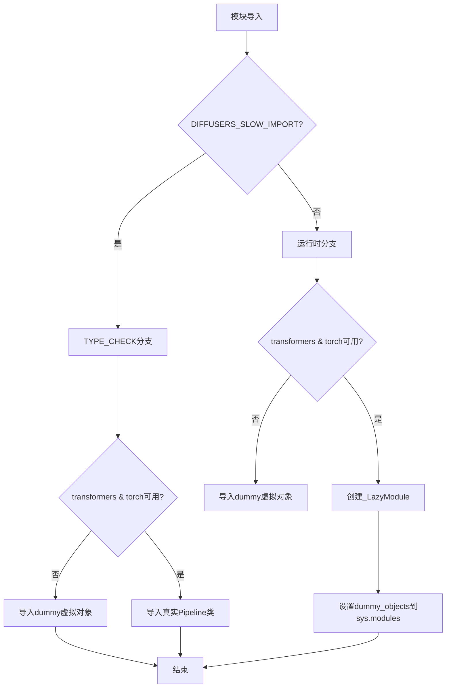
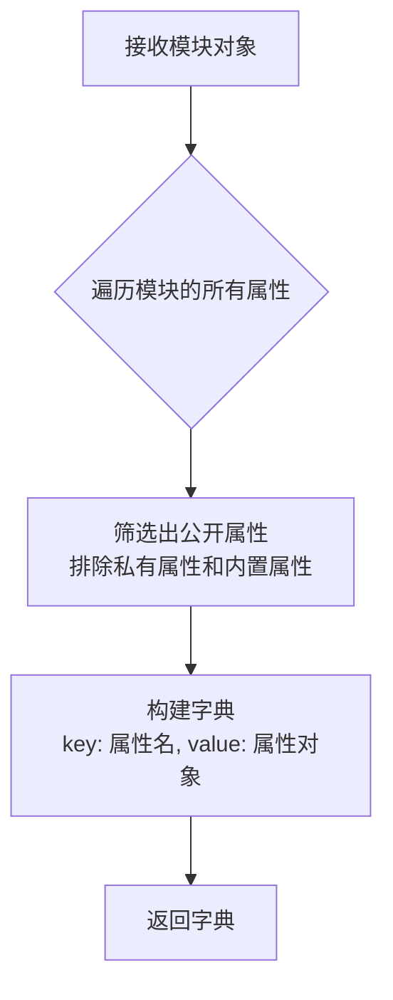
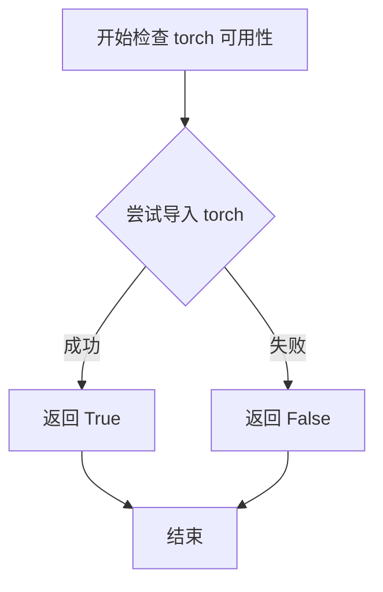
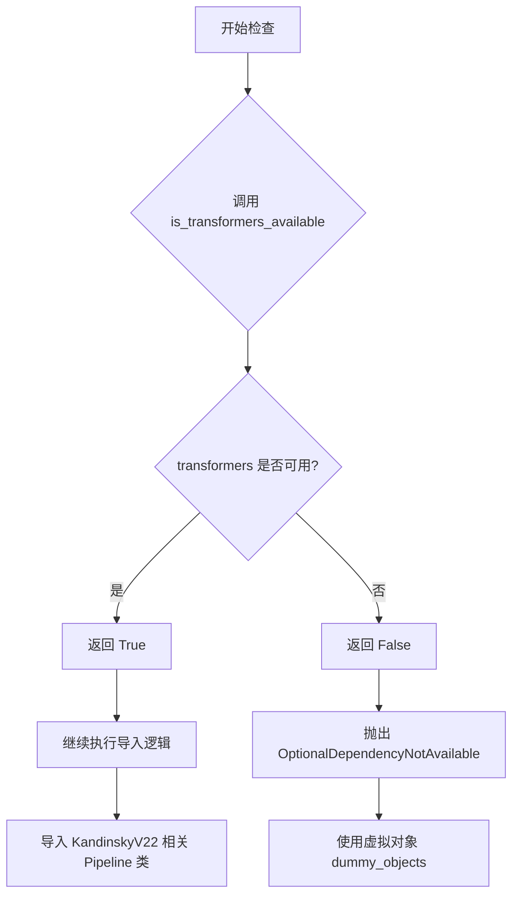
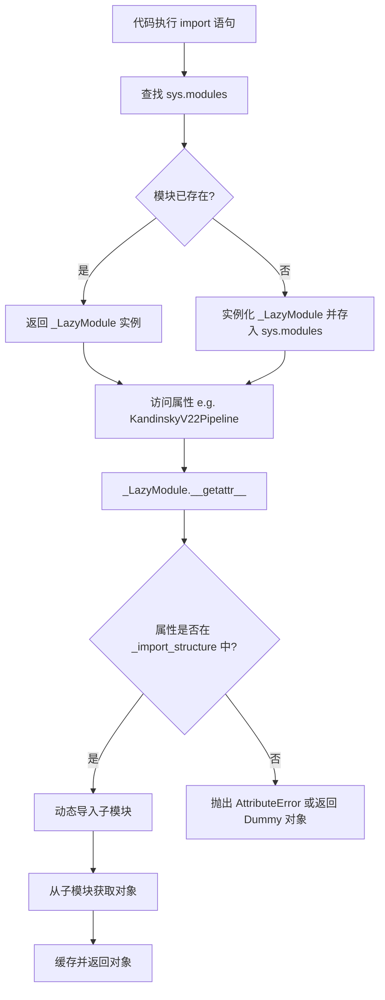
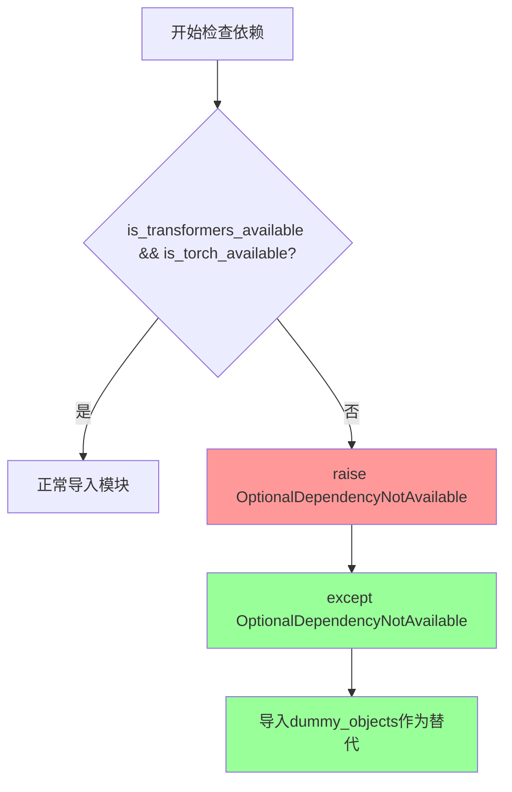

# `diffusers\src\diffusers\pipelines\kandinsky2_2\__init__.py` 详细设计文档

这是一个延迟加载（Lazy Loading）模块，用于在Diffusers库中动态导入Kandinsky 2.2系列扩散模型管道。该文件通过_LazyModule机制实现可选依赖（torch和transformers）的按需加载，在不满足依赖条件时提供虚拟对象替代，确保模块结构的完整性同时避免运行时导入错误。

## 整体流程



## 类结构

```
diffusers.models.kandinsky2_2 (包)
├── __init__.py (当前文件 - 延迟加载器)
├── pipeline_kandinsky2_2.py (KandinskyV22Pipeline)
├── pipeline_kandinsky2_2_combined.py (Combined pipelines)
├── pipeline_kandinsky2_2_controlnet.py (ControlNet pipeline)
├── pipeline_kandinsky2_2_controlnet_img2img.py
├── pipeline_kandinsky2_2_img2img.py
├── pipeline_kandinsky2_2_inpainting.py
├── pipeline_kandinsky2_2_prior.py
└── pipeline_kandinsky2_2_prior_emb2emb.py
```

## 全局变量及字段


### `_dummy_objects`
    
存储虚拟对象，用于依赖不可用时的替代

类型：`dict`
    


### `_import_structure`
    
定义模块的导入结构映射表

类型：`dict`
    


### `TYPE_CHECKING`
    
类型检查标志（从typing导入）

类型：`bool`
    


### `DIFFUSERS_SLOW_IMPORT`
    
延迟导入配置标志

类型：`bool`
    


    

## 全局函数及方法


### `get_objects_from_module`

获取指定模块中所有的对象（如类、函数、变量），并返回一个以对象名称为键、对象本身为值的字典。用于在懒加载机制中，当可选依赖不可用时，从dummy模块中获取虚拟对象以便在代码中引用。

参数：

- `module`：模块对象（`module`），需要从中提取所有导出对象的模块

返回值：`Dict[str, Any]`，键为对象名称（字符串），值为模块中对应的对象

#### 流程图



#### 带注释源码

```python
def get_objects_from_module(module):
    """
    从给定模块中提取所有公开对象，构建名称到对象的映射字典。
    
    参数:
        module: Python模块对象，从中获取所有非下划线开头的属性
    
    返回:
        dict: {属性名: 属性对象} 的映射字典
    """
    # 初始化结果字典
    objects = {}
    
    # 遍历模块的所有属性
    for attr_name in dir(module):
        # 跳过私有属性（下划线开头的属性）
        if attr_name.startswith('_'):
            continue
        
        # 获取属性值并添加到结果字典
        attr_value = getattr(module, attr_name)
        objects[attr_name] = attr_value
    
    return objects
```

#### 在上下文中的使用

```python
# 初始化空字典用于存储dummy对象
_dummy_objects = {}

try:
    # 检查transformers和torch是否同时可用
    if not (is_transformers_available() and is_torch_available()):
        raise OptionalDependencyNotAvailable()
except OptionalDependencyNotAvailable:
    # 依赖不可用时，导入dummy模块作为占位符
    from ...utils import dummy_torch_and_transformers_objects
    
    # 核心用法：从dummy模块获取所有对象并更新到_dummy_objects
    # 这使得在没有实际依赖时，代码仍能引用这些类（虽然实际调用会失败）
    _dummy_objects.update(get_objects_from_module(dummy_torch_and_transformers_objects))
```


### `is_torch_available`

该函数是外部依赖检查函数，用于检查当前环境中 PyTorch (torch) 库是否可用。这是_diffusers_库中常见的依赖检查模式，用于实现可选依赖的延迟加载，避免在未安装相关依赖时导致导入失败。

参数：

- （无参数）

返回值：`bool`，返回 `True` 表示 torch 可用，返回 `False` 表示 torch 不可用。

#### 流程图



#### 带注释源码

```
# is_torch_available 的典型实现方式（位于 ...utils 模块中）
def is_torch_available() -> bool:
    """
    检查 PyTorch 是否已安装且可用。
    
    Returns:
        bool: 如果 torch 可以被导入则返回 True，否则返回 False。
    """
    try:
        import torch
        return True
    except ImportError:
        return False

# 在当前代码中的使用方式：
# 用于条件性地导入 Kandinsky 2.2 相关管道类
# 仅当 torch 和 transformers 都可用时才导入真实类，否则使用虚拟对象

try:
    if not (is_transformers_available() and is_torch_available()):
        raise OptionalDependencyNotAvailable()
except OptionalDependencyNotAvailable:
    # 导入虚拟对象（用于保持接口一致性）
    from ...utils import dummy_torch_and_transformers_objects
    _dummy_objects.update(get_objects_from_module(dummy_torch_and_transformers_objects))
else:
    # 当 torch 和 transformers 都可用时，导入真实管道类
    _import_structure["pipeline_kandinsky2_2"] = ["KandinskyV22Pipeline"]
    _import_structure["pipeline_kandinsky2_2_combined"] = [
        "KandinskyV22CombinedPipeline",
        "KandinskyV22Img2ImgCombinedPipeline",
        "KandinskyV22InpaintCombinedPipeline",
    ]
    # ... 其他管道类
```


### `is_transformers_available`

该函数用于检查当前环境中是否安装了 `transformers` 库，并返回布尔值以表示该依赖是否可用。

参数： 无

返回值： `bool`，返回 `True` 表示 `transformers` 库可用，返回 `False` 表示不可用。

#### 流程图



#### 带注释源码

```python
# 从 utils 模块导入 is_transformers_available 函数
# 该函数用于检测 transformers 库是否已安装可用
from ...utils import (
    DIFFUSERS_SLOW_IMPORT,
    OptionalDependencyNotAvailable,
    _LazyModule,
    get_objects_from_module,
    is_torch_available,
    is_transformers_available,  # <-- 目标函数：检查 transformers 是否可用
)

# 初始化空字典用于存储虚拟对象和导入结构
_dummy_objects = {}
_import_structure = {}

# 尝试检查 transformers 和 torch 是否同时可用
try:
    # 调用 is_transformers_available() 检查 transformers 是否可用
    # 同时调用 is_torch_available() 检查 torch 是否可用
    if not (is_transformers_available() and is_torch_available()):
        # 如果任一依赖不可用，抛出 OptionalDependencyNotAvailable 异常
        raise OptionalDependencyNotAvailable()
except OptionalDependencyNotAvailable:
    # 捕获异常，导入虚拟对象模块（占位符）
    from ...utils import dummy_torch_and_transformers_objects  # noqa F403
    # 更新虚拟对象字典
    _dummy_objects.update(get_objects_from_module(dummy_torch_and_transformers_objects))
else:
    # 如果依赖可用，定义实际的导入结构
    _import_structure["pipeline_kandinsky2_2"] = ["KandinskyV22Pipeline"]
    _import_structure["pipeline_kandinsky2_2_combined"] = [
        "KandinskyV22CombinedPipeline",
        "KandinskyV22Img2ImgCombinedPipeline",
        "KandinskyV22InpaintCombinedPipeline",
    ]
    # ... 其他 Pipeline 类映射
```


### `_LazyModule`

`_LazyModule` 是 `diffusers` 库中用于实现延迟加载（Lazy Loading）的核心类。它封装了模块的导入过程，通过拦截属性访问（`__getattr__`）来按需加载子模块和对象，从而显著减少库在首次导入时的时间和内存开销。在此代码中，它被用于封装 `kandinsky2_2` 管道相关的多个类，实现可选依赖（PyTorch 和 Transformers）的延迟加载。

参数：

- `name`：`str`，当前模块的完全限定名称（通常为 `__name__`）。
- `file`：`str`，当前模块对应的源代码文件路径（通常为 `globals()["__file__"]`）。
- `import_structure`：`dict`，定义了模块的导入结构，键为子模块路径（如 `pipeline_kandinsky2_2`），值为该子模块导出的对象名称列表（如 `["KandinskyV22Pipeline"]`）。
- `module_spec`：`ModuleSpec` 或 `None`，模块的规范对象，包含模块的元数据（通常为 `__spec__`）。

返回值：`_LazyModule` 实例。该实例被设置为 `sys.modules[__name__]` 的值，从而接管后续的属性访问。

#### 流程图



#### 带注释源码

```python
import sys

# ... 前置代码定义 _import_structure 和 _dummy_objects ...

# 使用 _LazyModule 替换当前模块，实现延迟加载
sys.modules[__name__] = _LazyModule(
    __name__,                # 参数1: 模块名称 (e.g. 'diffusers.pipelines.kandinsky2_2')
    globals()["__file__"],  # 参数2: 模块文件路径
    _import_structure,      # 参数3: 导入结构字典，定义了哪些类可以被延迟导入
    module_spec=__spec__    # 参数4: 模块规范，提供了模块的导入上下文
)

# 填充虚拟对象（用于可选依赖不可用的情况）
# 这些对象会在被访问时抛出具体的错误，提示用户安装依赖
for name, value in _dummy_objects.items():
    setattr(sys.modules[__name__], name, value)
```


### `OptionalDependencyNotAvailable`

可选依赖不可用异常类，用于在可选依赖（如 torch 和 transformers）不可用时抛出异常，以便优雅地处理模块的延迟导入和虚拟对象填充。

参数：

- 该异常类在代码中使用默认无参数构造函数实例化

返回值：异常被抛出后不返回任何值，流程转入异常处理分支

#### 流程图



#### 带注释源码

```python
# 从 typing 模块导入 TYPE_CHECKING，用于类型检查时的导入
from typing import TYPE_CHECKING

# 从上级包的 utils 模块导入多个工具函数和类
from ...utils import (
    DIFFUSERS_SLOW_IMPORT,          # 控制是否启用慢速导入的标志
    OptionalDependencyNotAvailable,  # 可选依赖不可用异常类
    _LazyModule,                     # 懒加载模块类
    get_objects_from_module,         # 从模块获取对象的函数
    is_torch_available,              # 检查 torch 是否可用的函数
    is_transformers_available,       # 检查 transformers 是否可用的函数
)

# 初始化空字典，用于存储虚拟对象和导入结构
_dummy_objects = {}
_import_structure = {}

# 尝试检查 torch 和 transformers 是否同时可用
try:
    # 如果两个依赖中有任何一个不可用，则抛出异常
    if not (is_transformers_available() and is_torch_available()):
        raise OptionalDependencyNotAvailable()
# 捕获异常，表示可选依赖不可用
except OptionalDependencyNotAvailable:
    # 导入虚拟对象模块，用于提供替代的不可用对象
    from ...utils import dummy_torch_and_transformers_objects  # noqa F403
    # 将虚拟对象更新到 _dummy_objects 字典中
    _dummy_objects.update(get_objects_from_module(dummy_torch_and_transformers_objects))
# 如果依赖可用，则正常定义导入结构
else:
    # 定义具体的 Kandinsky 2.2 管道类导入结构
    _import_structure["pipeline_kandinsky2_2"] = ["KandinskyV22Pipeline"]
    _import_structure["pipeline_kandinsky2_2_combined"] = [
        "KandinskyV22CombinedPipeline",
        "KandinskyV22Img2ImgCombinedPipeline",
        "KandinskyV22InpaintCombinedPipeline",
    ]
    _import_structure["pipeline_kandinsky2_2_controlnet"] = ["KandinskyV22ControlnetPipeline"]
    _import_structure["pipeline_kandinsky2_2_controlnet_img2img"] = ["KandinskyV22ControlnetImg2ImgPipeline"]
    _import_structure["pipeline_kandinsky2_2_img2img"] = ["KandinskyV22Img2ImgPipeline"]
    _import_structure["pipeline_kandinsky2_2_inpainting"] = ["KandinskyV22InpaintPipeline"]
    _import_structure["pipeline_kandinsky2_2_prior"] = ["KandinskyV22PriorPipeline"]
    _import_structure["pipeline_kandinsky2_2_prior_emb2emb"] = ["KandinskyV22PriorEmb2EmbPipeline"]


# TYPE_CHECKING 模式下或 DIFFUSERS_SLOW_IMPORT 为真时的类型导入处理
if TYPE_CHECKING or DIFFUSERS_SLOW_IMPORT:
    try:
        # 再次检查依赖可用性
        if not (is_transformers_available() and is_torch_available()):
            raise OptionalDependencyNotAvailable()

    except OptionalDependencyNotAvailable:
        # 导入类型检查用的虚拟对象
        from ...utils.dummy_torch_and_transformers_objects import *
    else:
        # 导入实际的管道类用于类型检查
        from .pipeline_kandinsky2_2 import KandinskyV22Pipeline
        from .pipeline_kandinsky2_2_combined import (
            KandaninskyV22CombinedPipeline,
            KandinskyV22Img2ImgCombinedPipeline,
            KandinskyV22InpaintCombinedPipeline,
        )
        from .pipeline_kandinsky2_2_controlnet import KandinskyV22ControlnetPipeline
        from .pipeline_kandinsky2_2_controlnet_img2img import KandinskyV22ControlnetImg2ImgPipeline
        from .pipeline_kandinsky2_2_img2img import KandinskyV22Img2ImgPipeline
        from .pipeline_kandinsky2_2_inpainting import KandinskyV22InpaintPipeline
        from .pipeline_kandinsky2_2_prior import KandinskyV22PriorPipeline
        from .pipeline_kandinsky2_2_prior_emb2emb import KandinskyV22PriorEmb2EmbPipeline

else:
    # 非类型检查模式下，设置懒加载模块
    import sys

    # 将当前模块替换为懒加载模块
    sys.modules[__name__] = _LazyModule(
        __name__,
        globals()["__file__"],
        _import_structure,
        module_spec=__spec__,
    )

    # 将虚拟对象设置到模块中，提供替代实现
    for name, value in _dummy_objects.items():
        setattr(sys.modules[__name__], name, value)
```

## 关键组件


### 惰性加载模块（_LazyModule）

通过 `_LazyModule` 实现模块的惰性加载，避免在导入时立即加载所有子模块，提升首次导入速度并减少内存占用。

### 可选依赖检查机制

使用 `is_torch_available()` 和 `is_transformers_available()` 检查 torch 和 transformers 库的可用性，通过 `OptionalDependencyNotAvailable` 异常处理依赖缺失情况。

### 虚拟对象占位符（_dummy_objects）

当可选依赖不可用时，使用 `_dummy_objects` 字典存储从 `dummy_torch_and_transformers_objects` 获取的虚拟对象，确保模块结构完整但功能受限。

### 导入结构映射（_import_structure）

`_import_structure` 字典定义了模块的导入结构，将字符串键映射到具体的 Pipeline 类名，实现模块的延迟绑定。

### Kandinsky 2.2 Pipeline 系列

包含多个图像生成 Pipeline：
- KandinskyV22Pipeline（基础生成）
- KandinskyV22Img2ImgPipeline（图像到图像）
- KandinskyV22InpaintPipeline（图像修复）
- KandinskyV22PriorPipeline（先验模型）
- KandinskyV22PriorEmb2EmbPipeline（嵌入到嵌入先验）
- KandinskyV22ControlnetPipeline（控制网络）
- KandinskyV22ControlnetImg2ImgPipeline（控制网络图像到图像）
- KandinskyV22CombinedPipeline（组合管线）
- KandinskyV22Img2ImgCombinedPipeline（组合图像到图像）
- KandinskyV22InpaintCombinedPipeline（组合图像修复）

### TYPE_CHECKING 条件导入

通过 `TYPE_CHECKING` 标志实现类型提示时的完整导入，同时在运行时保持惰性加载，优化开发体验和运行时性能。


## 问题及建议


### 已知问题

- **重复代码（DRY 原则违背）**：检查 `is_transformers_available() and is_torch_available()` 的逻辑在代码中重复出现三次（try-except 块、TYPE_CHECKING 块和 else 块），违反 DRY 原则，增加维护成本
- **魔法字符串硬编码**：管道名称作为字符串字面量硬编码在 `_import_structure` 字典中，新增或修改管道时需要在多处同步修改，容易遗漏
- **缺少模块级文档字符串**：整个模块没有 `__doc__` 文档说明，无法快速了解该模块的功能定位
- **异常处理逻辑分散**：可选依赖不可用时的异常处理逻辑分散在两个分支中，增加了代码复杂度和出错概率
- **缺乏显式 API 导出**：没有定义 `__all__` 变量来明确导出哪些是公共 API，依赖隐式导出行为
- **导入结构与实际导入分离**：`_import_structure` 定义的管道名称与实际 `from .xxx import` 的路径分散在不同位置，缺乏集中管理

### 优化建议

- **提取配置常量**：将管道名称列表提取为模块级常量或配置文件，统一管理所有 Kandinsky 2.2 管道名称
- **封装依赖检查逻辑**：创建辅助函数如 `_check_dependencies()` 封装重复的依赖检查逻辑，避免代码重复
- **添加模块文档**：在文件开头添加模块级文档字符串，说明该模块是 Kandinsky 2.2 管道的统一导出入口
- **定义 `__all__` 显式导出**：在模块末尾添加 `__all__ = [...]` 明确列出所有公共 API 类名，提高 API 清晰度
- **统一导入结构定义**：将 `TYPE_CHECKING` 分支中的导入语句与 `_import_structure` 字典定义进行对比验证，确保一致性
- **考虑使用装饰器或工厂模式**：对于这种大量管道类的延迟加载场景，可考虑使用装饰器或工厂模式简化导入逻辑

## 其它


### 设计目标与约束

本模块的设计目标是实现Kandinsky 2.2模型管道的延迟加载（Lazy Loading）机制，在保证功能完整性的同时优化库的导入性能。核心约束包括：1）必须同时满足torch和transformers依赖才可导入实际pipeline类；2）依赖不可用时必须提供dummy对象以维持API一致性；3）模块须遵循Diffusers库的_lazy_module规范。

### 错误处理与异常设计

本模块主要依赖OptionalDependencyNotAvailable异常处理机制。当torch或transformers任一依赖不可用时，抛出OptionalDependencyNotAvailable并回退到dummy_objects。异常传播路径为：依赖检查→异常捕获→导入dummy模块→更新_import_structure。无自定义业务异常，所有错误均来自上层utils模块的预定义异常类。

### 外部依赖与接口契约

外部依赖包括：1）torch库（is_torch_available检查）；2）transformers库（is_transformers_available检查）；3）Diffusers内部utils模块（_LazyModule、get_objects_from_module等）。接口契约方面：_import_structure字典定义了模块导出结构，LazyModule在sys.modules中注册自身并按需加载，dummy_objects通过setattr注入到模块命名空间。

### 性能考虑

本模块采用延迟导入策略避免在库初始化时加载所有pipeline类，显著降低冷启动时间。LazyModule的module_spec传递保持了类型检查支持的同时不影响运行时性能。TYPE_CHECKING分支仅在静态分析时执行，不影响实际运行时性能。

### 安全性考虑

本模块无用户输入处理，无直接安全风险。安全性依赖上游模块：1）_LazyModule的模块查找安全性；2）dummy_objects的来源安全性；3）get_objects_from_module的输入验证。建议确保...utils.dummy_torch_and_transformers_objects来源可信。

### 版本兼容性

本模块兼容Python 3.7+（_LazyModule要求），依赖Diffusers 0.x版本系列。与torch版本兼容性由is_torch_available()动态检测，与transformers版本兼容性由is_transformers_available()动态检测。具体pipeline类可能对torch/transformers有版本要求，需查阅各pipeline实现。

### 配置管理

本模块无显式配置管理。所有配置通过环境变量或上层utils模块隐式控制：DIFFUSERS_SLOW_IMPORT控制TYPE_CHECKING分支行为；OptionalDependencyNotAvailable的可用性依赖utils模块配置。

### 日志与监控

本模块不包含日志记录代码。如需监控，可依赖：1）Python模块导入系统日志；2）LazyModule的加载行为监控；3）在catch分支添加调试打印。建议在上层调用点添加导入成功/失败日志。

### 测试策略

建议测试覆盖：1）依赖可用时正确导入所有pipeline类；2）依赖不可用时正确使用dummy对象；3）TYPE_CHECKING分支的条件逻辑；4）LazyModule的动态加载行为；5）sys.modules注册正确性。可使用pytest的mock.patch模拟依赖可用性进行单元测试。

    