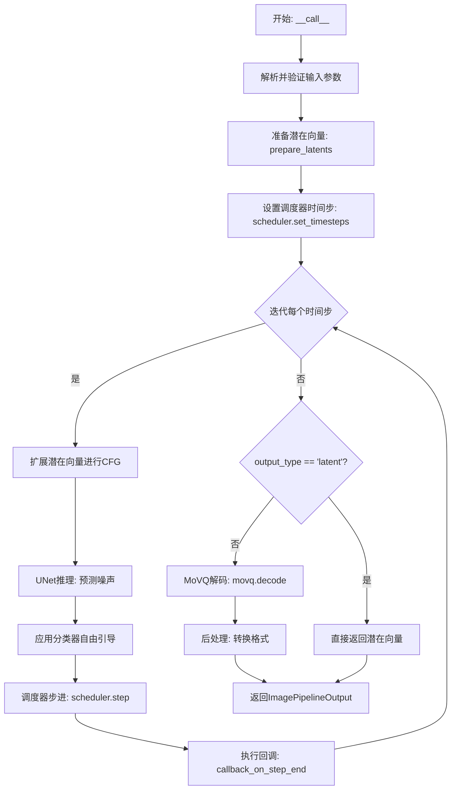
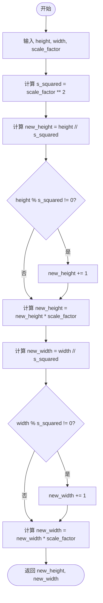
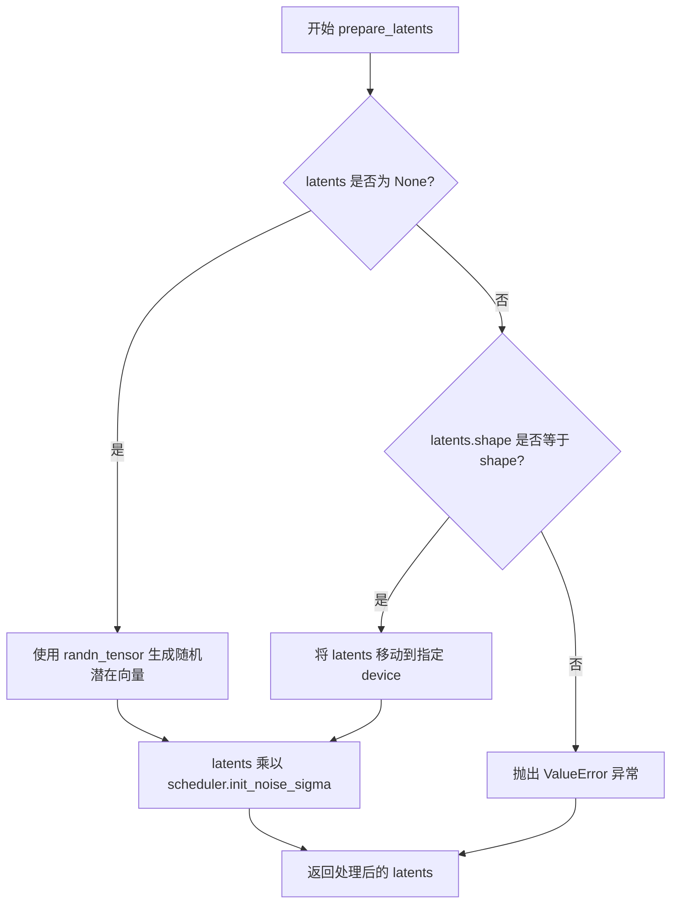
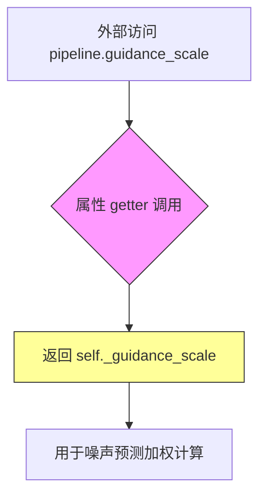
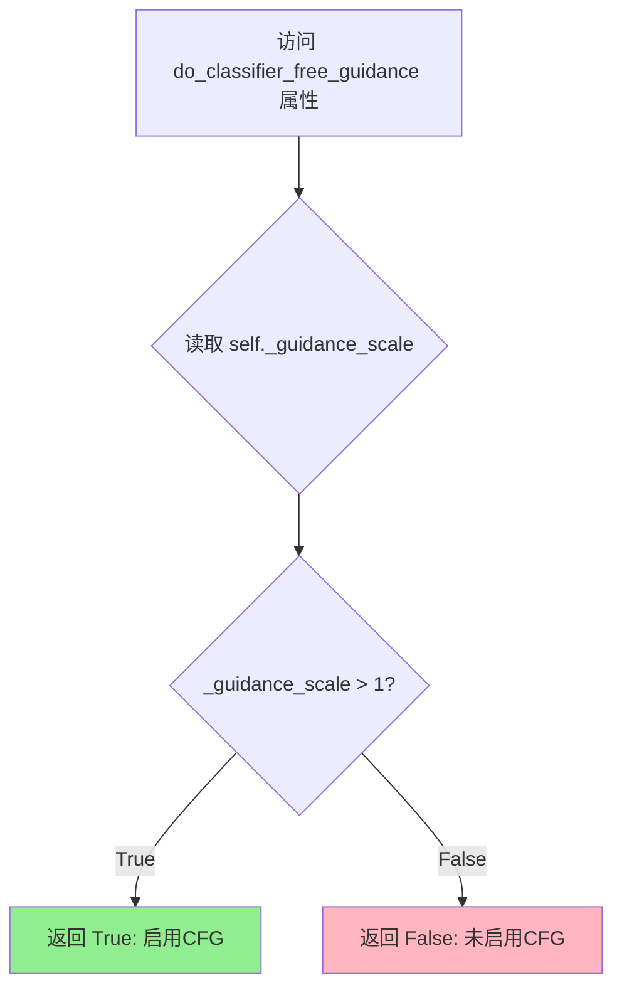
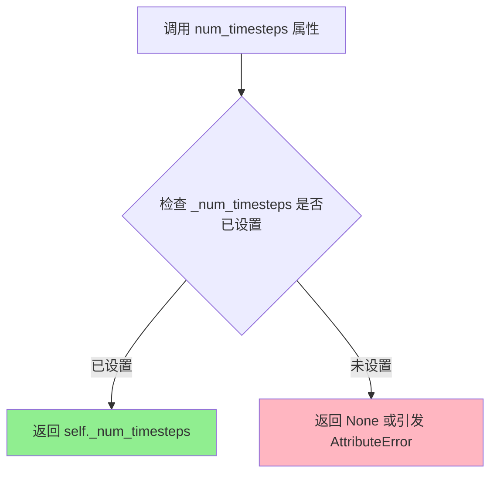
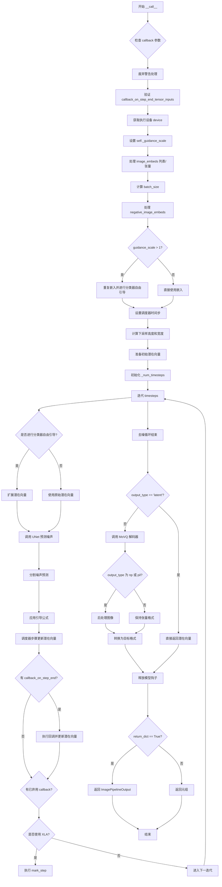

# `diffusers\src\diffusers\pipelines\kandinsky2_2\pipeline_kandinsky2_2.py` 详细设计文档

KandinskyV22Pipeline是一个用于文本到图像生成的扩散管道，通过接收CLIP图像嵌入(image_embeds)和负向嵌入(negative_image_embeds)作为条件，使用UNet2DConditionModel进行去噪处理，最后通过MoVQDecoder(VQModel)将潜在向量解码为实际图像。该管道支持分类器自由引导(CFG)、多种输出格式以及推理过程中的回调函数。

## 整体流程



## 类结构

```
DiffusionPipeline (抽象基类)
└── KandinskyV22Pipeline (文本到图像生成管道)
```

## 全局变量及字段


### `logger`
    
模块级日志记录器，用于输出管道运行时的日志信息

类型：`logging.Logger`
    


### `XLA_AVAILABLE`
    
标志位，表示PyTorch XLA是否可用，用于支持TPU加速

类型：`bool`
    


### `EXAMPLE_DOC_STRING`
    
示例文档字符串，包含KandinskyV22Pipeline的使用示例代码

类型：`str`
    


### `downscale_height_and_width`
    
全局函数，根据缩放因子下采样图像高度和宽度

类型：`Callable[[int, int, int], tuple[int, int]]`
    


### `KandinskyV22Pipeline.unet`
    
条件U-Net去噪模型，用于根据图像嵌入去噪潜在向量

类型：`UNet2DConditionModel`
    


### `KandinskyV22Pipeline.scheduler`
    
DDPM噪声调度器，控制扩散过程中的噪声添加和去除

类型：`DDPMScheduler`
    


### `KandinskyV22Pipeline.movq`
    
MoVQ解码器，将潜在向量解码为最终图像

类型：`VQModel`
    


### `KandinskyV22Pipeline.model_cpu_offload_seq`
    
CPU卸载序列，定义模型各组件的CPU卸载顺序

类型：`str`
    


### `KandinskyV22Pipeline._callback_tensor_inputs`
    
回调张量输入列表，指定在推理步骤结束回调时可传递的张量名称

类型：`list[str]`
    


### `KandinskyV22Pipeline.movq_scale_factor`
    
MoVQ缩放因子，用于计算潜在向量的空间尺寸

类型：`int`
    


### `KandinskyV22Pipeline._guidance_scale`
    
分类器无关引导比例，控制生成图像与文本提示的相关程度

类型：`float`
    


### `KandinskyV22Pipeline._num_timesteps`
    
推理过程中的时间步总数，用于跟踪生成进度

类型：`int`
    


### `KandinskyV22Pipeline._execution_device`
    
管道执行设备，记录当前运行的硬件设备

类型：`torch.device`
    
    

## 全局函数及方法


### `downscale_height_and_width`

该函数是一个独立的工具函数，用于根据 VQModel（MoVQ）的缩放因子（scale_factor）将图像的高度和宽度调整到合适的潜在空间分辨率。它通过先除以缩放因子的平方（处理下采样）并向上取整，然后再乘以缩放因子，从而确保生成的潜在张量尺寸是缩放因子的整数倍，满足解码器的输入要求。

参数：

-  `height`：`int`，原始输入图像的高度（以像素为单位）。
-  `width`：`int`，原始输入图像的宽度（以像素为单位）。
-  `scale_factor`：`int`，默认为 8。VQ 模型的缩放因子，通常对应于模型的下采样率。

返回值：`Tuple[int, int]`，返回调整后的新高度和新宽度。

#### 流程图



#### 带注释源码

```python
def downscale_height_and_width(height, width, scale_factor=8):
    """
    根据缩放因子调整图像高度和宽度。

    该函数主要用于将像素空间的图像尺寸转换为潜在空间（latent space）的尺寸。
    它通过将尺寸除以 scale_factor 的平方来进行初步的降采样计算，
    如果不能整除则向上取整，最后再乘以 scale_factor 以确保维度是 scale_factor 的倍数，
    满足 VQ 解码器（如 MoVQ）的输入约束。

    参数:
        height (int): 原始图像高度。
        width (int): 原始图像宽度。
        scale_factor (int, optional): 缩放因子，默认为 8。必须与 VQ 模型配置一致。

    返回:
        tuple: (new_height, new_width) 调整后的尺寸。
    """
    # 计算缩放因子的平方，因为在 VQ 模型中通常存在两次下采样操作
    # 例如 scale_factor=8, 则先除以 64
    new_height = height // scale_factor**2
    
    # 如果高度不能被 scale_factor 的平方整除，需要向上取整以保留足够信息
    if height % scale_factor**2 != 0:
        new_height += 1
        
    # 对宽度进行相同的处理
    new_width = width // scale_factor**2
    if width % scale_factor**2 != 0:
        new_width += 1
        
    # 最终乘以 scale_factor 得到实际的潜在空间尺寸
    return new_height * scale_factor, new_width * scale_factor
```


### `KandinskyV22Pipeline.__init__`

初始化Kandinsky V2.2文本到图像生成管道，设置UNet模型、DDPMScheduler调度器和MoVQ解码器，并计算MoVQ的缩放因子。

参数：

- `self`：隐式参数，KandinskyV22Pipeline实例本身
- `unet`：`UNet2DConditionModel`，条件U-Net架构，用于去噪图像嵌入
- `scheduler`：`DDPMScheduler`，DDPM调度器，用于与UNet结合生成图像latents
- `movq`：`VQModel`，MoVQ解码器，用于从latents生成最终图像

返回值：`None`，构造函数无返回值

#### 流程图

```mermaid
flowchart TD
    A[开始 __init__] --> B[调用 super().__init__ 初始化基类]
    B --> C[调用 register_modules 注册 unet 模块]
    C --> D[调用 register_modules 注册 scheduler 模块]
    D --> E[调用 register_modules 注册 movq 模块]
    E --> F[计算 movq_scale_factor: 2 ** (len(movq.config.block_out_channels) - 1)]
    F --> G[结束 __init__]
```

#### 带注释源码

```python
def __init__(
    self,
    unet: UNet2DConditionModel,
    scheduler: DDPMScheduler,
    movq: VQModel,
):
    """
    初始化 Kandinsky V2.2 管道
    
    参数:
        unet: 用于去噪图像嵌入的条件U-Net架构
        scheduler: 与unet配合使用生成图像latents的调度器
        movq: MoVQ解码器，用于从latents生成图像
    """
    # 调用父类 DiffusionPipeline 的初始化方法
    # 设置基本的管道配置和设备管理
    super().__init__()

    # 通过 register_modules 方法注册各个模块
    # 这会自动处理模块的设备移动和类型转换
    self.register_modules(
        unet=unet,
        scheduler=scheduler,
        movq=movq,
    )
    
    # 计算 MoVQ 的缩放因子
    # 基于 block_out_channels 的数量计算，用于后续图像尺寸的下采样计算
    # 例如: 如果 block_out_channels = [128, 256, 512, 512]，则 len = 4
    # scale_factor = 2 ** (4 - 1) = 8
    self.movq_scale_factor = 2 ** (len(self.movq.config.block_out_channels) - 1)
```


### `KandinskyV22Pipeline.prepare_latents`

该方法用于准备潜在向量（latents），在文本到图像生成过程中初始化或验证潜在向量，并根据调度器的初始噪声 sigma 对其进行缩放。

参数：

- `shape`：`tuple`，潜在向量的目标形状，通常为 `(batch_size, num_channels_latents, height, width)`
- `dtype`：`torch.dtype`，潜在向量的数据类型，通常与图像嵌入的数据类型一致
- `device`：`torch.device`，潜在向量应放置的设备（如 CUDA 或 CPU）
- `generator`：`torch.Generator | None`，可选的随机数生成器，用于确保生成的可重复性
- `latents`：`torch.Tensor | None`，可选的预生成潜在向量；若为 `None`，则随机生成
- `scheduler`：`DDPMScheduler`，调度器对象，包含 `init_noise_sigma` 属性用于缩放潜在向量

返回值：`torch.Tensor`，准备好的潜在向量，已根据调度器的初始噪声 sigma 进行缩放

#### 流程图



#### 带注释源码

```python
def prepare_latents(self, shape, dtype, device, generator, latents, scheduler):
    """
    准备用于去噪过程的潜在向量。
    
    如果未提供 latents，则使用 randn_tensor 生成随机潜在向量；
    如果提供了 latents，则验证其形状并确保其在正确的设备上。
    最后根据调度器的 init_noise_sigma 对潜在向量进行缩放。
    """
    # 如果未提供潜在向量，则随机生成
    if latents is None:
        # 使用 randn_tensor 生成指定形状、数据类型和设备的随机张量
        latents = randn_tensor(shape, generator=generator, device=device, dtype=dtype)
    else:
        # 验证提供的潜在向量形状是否与预期形状匹配
        if latents.shape != shape:
            raise ValueError(f"Unexpected latents shape, got {latents.shape}, expected {shape}")
        # 将潜在向量移动到指定设备
        latents = latents.to(device)

    # 根据调度器的初始噪声 sigma 缩放潜在向量
    # 这确保了潜在向量在去噪过程开始时具有适当的噪声水平
    latents = latents * scheduler.init_noise_sigma
    
    # 返回准备好的潜在向量
    return latents
```


### `KandinskyV22Pipeline.guidance_scale`

获取引导比例（guidance_scale）属性的 getter 方法，用于返回 Classifier-Free Diffusion Guidance 的比例参数。该属性在生成图像时控制文本提示与图像之间的关联强度。

参数： 无

返回值：`float`，返回存储的 `_guidance_scale` 值，即引导比例因子，用于在推理过程中调整无条件和有条件噪声预测的权重。

#### 流程图



#### 带注释源码

```python
@property
def guidance_scale(self):
    """
    属性 getter 方法，用于获取引导比例因子。
    
    guidance_scale 控制 Classifier-Free Diffusion Guidance 的强度：
    - 当 guidance_scale > 1 时启用 CFG
    - 较高的值会使生成的图像更紧密地关联文本提示
    - 较低的值会产生更多样化但可能不太准确的图像
    
    Returns:
        float: 存储的引导比例因子，默认为 4.0
    """
    return self._guidance_scale
```


### `KandinskyV22Pipeline.do_classifier_free_guidance`

该属性是一个只读属性，用于判断当前管线是否启用了分类器无关引导（Classifier-Free Guidance，CFG）。它通过比较内部存储的 `_guidance_scale` 参数值是否大于1来返回布尔值，当 guidance_scale 大于1时表示启用了CFG，此时管线会对无条件和有条件的目标进行联合预测以提升生成质量。

参数： 无（该属性不接受任何参数）

返回值：`bool`，返回 `True` 表示当前启用了分类器无关引导（guidance_scale > 1），返回 `False` 表示未启用（guidance_scale <= 1）

#### 流程图



#### 带注释源码

```python
@property
def do_classifier_free_guidance(self):
    """
    属性：判断是否启用分类器无关引导（CFG）
    
    该属性是一个只读属性，用于在管线运行过程中动态判断
    当前是否启用了分类器无关引导。CFG是一种提升扩散模型
    生成质量的技术，通过同时预测有条件和无条件的噪声来实现。
    
    返回值：
        bool: 当 guidance_scale > 1 时返回 True，表示启用CFG；
              当 guidance_scale <= 1 时返回 False，表示未启用CFG
    """
    return self._guidance_scale > 1
```

#### 在管线中的使用示例

该属性在 `__call__` 方法中被多次使用，以下是相关的上下文代码：

```python
# 在 __call__ 方法中设置 guidance_scale
self._guidance_scale = guidance_scale  # 例如默认值为 4.0

# 使用 do_classifier_free_guidance 属性进行条件判断
if self.do_classifier_free_guidance:
    # 启用CFG时，需要复制embeddings并拼接条件与无条件embeddings
    image_embeds = image_embeds.repeat_interleave(num_images_per_prompt, dim=0)
    negative_image_embeds = negative_image_embeds.repeat_interleave(num_images_per_prompt, dim=0)
    
    # 拼接负向（无条件）和正向（条件）embeddings
    image_embeds = torch.cat([negative_image_embeds, image_embeds], dim=0).to(
        dtype=self.unet.dtype, device=device
    )

# 在去噪循环中，根据是否启用CFG来决定是否需要扩展latents
for i, t in enumerate(self.progress_bar(timesteps)):
    # expand the latents if we are doing classifier free guidance
    latent_model_input = torch.cat([latents] * 2) if self.do_classifier_free_guidance else latents
    
    # ... 执行UNet预测 ...
    
    if self.do_classifier_free_guidance:
        # 对预测结果进行CFG组合
        noise_pred, variance_pred = noise_pred.split(latents.shape[1], dim=1)
        noise_pred_uncond, noise_pred_text = noise_pred.chunk(2)
        _, variance_pred_text = variance_pred.chunk(2)
        # 应用CFG公式: noise_pred = noise_pred_uncond + guidance_scale * (noise_pred_text - noise_pred_uncond)
        noise_pred = noise_pred_uncond + self.guidance_scale * (noise_pred_text - noise_pred_uncond)
        noise_pred = torch.cat([noise_pred, variance_pred_text], dim=1)
```


### `KandinskyV22Pipeline.num_timesteps`

这是一个属性方法（Property），用于获取扩散模型的推理时间步数。该属性返回在管道执行过程中设置的 `_num_timesteps` 值，该值表示去噪过程的推理步数。

参数：无需参数（仅使用隐式 `self`）

返回值：`int`，返回扩散过程的推理时间步数。

#### 流程图



#### 带注释源码

```python
@property
def num_timesteps(self):
    """
    属性方法：获取扩散模型的时间步数
    
    该属性返回一个整数，表示扩散去噪过程的推理步数。
    该值在 __call__ 方法执行过程中被设置：
        self._num_timesteps = len(timesteps)
    
    Returns:
        int: 推理过程中使用的时间步数
    """
    return self._num_timesteps
```

---

### 关联信息

#### 1. 核心功能概述

KandinskyV22Pipeline 是一个用于文本到图像生成的扩散管道（Diffusion Pipeline），结合了 CLIP 图像嵌入条件信息和 VQModel 解码器来生成高质量图像。

#### 2. 类字段详情

| 字段名称 | 类型 | 描述 |
|---------|------|------|
| `_num_timesteps` | `int` | 存储扩散推理过程的时间步数，在 `__call__` 方法中被设置为 `len(timesteps)` |
| `_guidance_scale` | `float` | 分类器自由引导（Classifier-Free Guidance）的缩放因子 |
| `model_cpu_offload_seq` | `str` | 模型 CPU 卸载顺序序列 |
| `_callback_tensor_inputs` | `list[str]` | 回调函数可用的张量输入列表 |

#### 3. 全局函数

| 函数名 | 描述 |
|--------|------|
| `downscale_height_and_width` | 辅助函数，根据 MoVQ 的 scale_factor 调整图像高度和宽度 |

#### 4. 关键组件

| 组件名称 | 描述 |
|----------|------|
| `unet` | UNet2DConditionModel，用于对图像嵌入进行去噪的条件 U-Net 架构 |
| `scheduler` | DDPMScheduler，用于生成图像 latent 的调度器 |
| `movq` | VQModel，MoVQ 解码器用于从 latent 生成图像 |

#### 5. 技术债务与优化空间

1. **属性返回值类型不一致风险**：`num_timesteps` 属性在未设置 `_num_timesteps` 时会引发 `AttributeError`，建议在类初始化时设置默认值或提供更友好的错误处理。
2. **状态管理隐式依赖**：`num_timesteps` 的值依赖于 `__call__` 方法的执行，这种隐式状态管理可能导致在未调用管道直接访问属性时出现问题。
3. **硬编码的 scale_factor 计算**：`movq_scale_factor` 的计算逻辑可以提取为更通用的配置方式。

#### 6. 数据流与状态机

- **初始化状态**：`KandinskyV22Pipeline` 创建时，`_num_timesteps` 未初始化
- **执行状态**：调用 `__call__` 方法时，通过 `self.scheduler.set_timesteps()` 设置时间步，然后 `self._num_timesteps = len(timesteps)` 被赋值
- **完成状态**：管道执行完成后，`_num_timesteps` 保持最后设置的值

#### 7. 外部依赖与接口契约

- **输入依赖**：需要有效的 `image_embeds` 和 `negative_image_embeds`（CLIP 图像嵌入）
- **输出依赖**：返回 `ImagePipelineOutput` 或元组，包含生成的图像
- **设备依赖**：支持 CUDA、CPU 和 TPU（通过 XLA）


### `KandinskyV22Pipeline.__call__`

文本到图像生成的主管道方法，通过接收CLIP图像嵌入（正向和负向）并在去噪过程中使用条件U-Net进行迭代去噪，最终通过MoVQ解码器将潜在向量转换为图像。

参数：

- `image_embeds`：`torch.Tensor | list[torch.Tensor]`，用于条件图像生成的CLIP图像嵌入
- `negative_image_embeds`：`torch.Tensor | list[torch.Tensor]`，负向提示的CLIP图像嵌入，用于无分类器引导
- `height`：`int`，可选，默认为512，生成图像的高度（像素）
- `width`：`int`，可选，默认为512，生成图像的宽度（像素）
- `num_inference_steps`：`int`，可选，默认为100，去噪迭代次数
- `guidance_scale`：`float`，可选，默认为4.0，分类器自由引导的引导比例
- `num_images_per_prompt`：`int`，可选，默认为1，每个提示生成的图像数量
- `generator`：`torch.Generator | list[torch.Generator] | None`，可选，用于生成确定性结果的随机生成器
- `latents`：`torch.Tensor | None`，可选，预生成的噪声潜在向量，若不提供则随机生成
- `output_type`：`str | None`，可选，默认为"pil"，输出格式：支持"pil"、"np"、"pt"或"latent"
- `return_dict`：`bool`，可选，默认为True，是否返回ImagePipelineOutput而不是元组
- `callback_on_step_end`：`Callable[[int, int], None] | None`，可选，每个去噪步骤结束时调用的回调函数
- `callback_on_step_end_tensor_inputs`：`list[str]`，可选，默认为["latents"]，回调函数接收的tensor输入列表
- `**kwargs`：可选，额外关键字参数（已弃用的callback和callback_steps）

返回值：`ImagePipelineOutput | tuple`，生成的图像管道输出或包含图像的元组

#### 流程图



#### 带注释源码

```python
@torch.no_grad()
@replace_example_docstring(EXAMPLE_DOC_STRING)
def __call__(
    self,
    image_embeds: torch.Tensor | list[torch.Tensor],
    negative_image_embeds: torch.Tensor | list[torch.Tensor],
    height: int = 512,
    width: int = 512,
    num_inference_steps: int = 100,
    guidance_scale: float = 4.0,
    num_images_per_prompt: int = 1,
    generator: torch.Generator | list[torch.Generator] | None = None,
    latents: torch.Tensor | None = None,
    output_type: str | None = "pil",
    return_dict: bool = True,
    callback_on_step_end: Callable[[int, int], None] | None = None,
    callback_on_step_end_tensor_inputs: list[str] = ["latents"],
    **kwargs,
):
    """
    Function invoked when calling the pipeline for generation.

    Args:
        image_embeds (`torch.Tensor` or `list[torch.Tensor]`):
            The clip image embeddings for text prompt, that will be used to condition the image generation.
        negative_image_embeds (`torch.Tensor` or `list[torch.Tensor]`):
            The clip image embeddings for negative text prompt, will be used to condition the image generation.
        height (`int`, *optional*, defaults to 512):
            The height in pixels of the generated image.
        width (`int`, *optional*, defaults to 512):
            The width in pixels of the generated image.
        num_inference_steps (`int`, *optional*, defaults to 100):
            The number of denoising steps. More denoising steps usually lead to a higher quality image at the
            expense of slower inference.
        guidance_scale (`float`, *optional*, defaults to 4.0):
            Guidance scale as defined in [Classifier-Free Diffusion
            Guidance](https://huggingface.co/papers/2207.12598). `guidance_scale` is defined as `w` of equation 2.
            of [Imagen Paper](https://huggingface.co/papers/2205.11487). Guidance scale is enabled by setting
            `guidance_scale > 1`. Higher guidance scale encourages to generate images that are closely linked to
            the text `prompt`, usually at the expense of lower image quality.
        num_images_per_prompt (`int`, *optional*, defaults to 1):
            The number of images to generate per prompt.
        generator (`torch.Generator` or `list[torch.Generator]`, *optional*):
            One or a list of [torch generator(s)](https://pytorch.org/docs/stable/generated/torch.Generator.html)
            to make generation deterministic.
        latents (`torch.Tensor`, *optional*):
            Pre-generated noisy latents, sampled from a Gaussian distribution, to be used as inputs for image
            generation. Can be used to tweak the same generation with different prompts. If not provided, a latents
            tensor will be generated by sampling using the supplied random `generator`.
        output_type (`str`, *optional*, defaults to `"pil"`):
            The output format of the generate image. Choose between: `"pil"` (`PIL.Image.Image`), `"np"`
            (`np.array`) or `"pt"` (`torch.Tensor`).
        return_dict (`bool`, *optional*, defaults to `True`):
            Whether or not to return a [`~pipelines.ImagePipelineOutput`] instead of a plain tuple.
        callback_on_step_end (`Callable`, *optional*):
            A function that calls at the end of each denoising steps during the inference. The function is called
            with the following arguments: `callback_on_step_end(self: DiffusionPipeline, step: int, timestep: int,
            callback_kwargs: Dict)`. `callback_kwargs` will include a list of all tensors as specified by
            `callback_on_step_end_tensor_inputs`.
        callback_on_step_end_tensor_inputs (`list`, *optional*):
            The list of tensor inputs for the `callback_on_step_end` function. The tensors specified in the list
            will be passed as `callback_kwargs` argument. You will only be able to include variables listed in the
            .`_callback_tensor_inputs` attribute of your pipeline class.

    Examples:

    Returns:
        [`~pipelines.ImagePipelineOutput`] or `tuple`
    """

    # 处理已废弃的callback参数
    callback = kwargs.pop("callback", None)
    callback_steps = kwargs.pop("callback_steps", None)

    # 如果提供了旧的callback参数，发出废弃警告
    if callback is not None:
        deprecate(
            "callback",
            "1.0.0",
            "Passing `callback` as an input argument to `__call__` is deprecated, consider use `callback_on_step_end`",
        )
    if callback_steps is not None:
        deprecate(
            "callback_steps",
            "1.0.0",
            "Passing `callback_steps` as an input argument to `__call__` is deprecated, consider use `callback_on_step_end`",
        )

    # 验证回调tensor输入是否在允许列表中
    if callback_on_step_end_tensor_inputs is not None and not all(
        k in self._callback_tensor_inputs for k in callback_on_step_end_tensor_inputs
    ):
        raise ValueError(
            f"`callback_on_step_end_tensor_inputs` has to be in {self._callback_tensor_inputs}, but found {[k for k in callback_on_step_end_tensor_inputs if k not in self._callback_tensor_inputs]}"
        )

    # 获取执行设备
    device = self._execution_device

    # 保存引导比例
    self._guidance_scale = guidance_scale

    # 如果image_embeds是列表，拼接成张量
    if isinstance(image_embeds, list):
        image_embeds = torch.cat(image_embeds, dim=0)
    
    # 计算批量大小：基础批量 × 每提示图像数
    batch_size = image_embeds.shape[0] * num_images_per_prompt
    
    # 处理负向嵌入
    if isinstance(negative_image_embeds, list):
        negative_image_embeds = torch.cat(negative_image_embeds, dim=0)

    # 如果启用分类器自由引导，重复嵌入并拼接
    if self.do_classifier_free_guidance:
        image_embeds = image_embeds.repeat_interleave(num_images_per_prompt, dim=0)
        negative_image_embeds = negative_image_embeds.repeat_interleave(num_images_per_prompt, dim=0)

        # 拼接负向和正向嵌入：[negative, positive]
        image_embeds = torch.cat([negative_image_embeds, image_embeds], dim=0).to(
            dtype=self.unet.dtype, device=device
        )

    # 设置调度器的时间步
    self.scheduler.set_timesteps(num_inference_steps, device=device)
    timesteps = self.scheduler.timesteps

    # 获取U-Net的输入通道数
    num_channels_latents = self.unet.config.in_channels

    # 根据MoVQ的缩放因子计算下采样后的高度和宽度
    height, width = downscale_height_and_width(height, width, self.movq_scale_factor)

    # 创建初始潜在向量
    latents = self.prepare_latents(
        (batch_size, num_channels_latents, height, width),
        image_embeds.dtype,
        device,
        generator,
        latents,
        self.scheduler,
    )

    # 记录总时间步数
    self._num_timesteps = len(timesteps)
    
    # 迭代去噪过程
    for i, t in enumerate(self.progress_bar(timesteps)):
        # 如果进行分类器自由引导，扩展潜在向量（复制一份用于无条件和有条件预测）
        latent_model_input = torch.cat([latents] * 2) if self.do_classifier_free_guidance else latents

        # 构建条件参数
        added_cond_kwargs = {"image_embeds": image_embeds}
        
        # 调用U-Net预测噪声
        noise_pred = self.unet(
            sample=latent_model_input,
            timestep=t,
            encoder_hidden_states=None,
            added_cond_kwargs=added_cond_kwargs,
            return_dict=False,
        )[0]

        # 执行分类器自由引导
        if self.do_classifier_free_guidance:
            # 分离噪声预测和方差预测
            noise_pred, variance_pred = noise_pred.split(latents.shape[1], dim=1)
            # 分离无条件预测和有条件预测
            noise_pred_uncond, noise_pred_text = noise_pred.chunk(2)
            _, variance_pred_text = variance_pred.chunk(2)
            # 应用引导公式: noise_pred = noise_pred_uncond + guidance_scale * (noise_pred_text - noise_pred_uncond)
            noise_pred = noise_pred_uncond + self.guidance_scale * (noise_pred_text - noise_pred_uncond)
            # 拼接噪声预测和方差预测
            noise_pred = torch.cat([noise_pred, variance_pred_text], dim=1)

        # 如果调度器不学习方差，分离噪声预测和方差
        if not (
            hasattr(self.scheduler.config, "variance_type")
            and self.scheduler.config.variance_type in ["learned", "learned_range"]
        ):
            noise_pred, _ = noise_pred.split(latents.shape[1], dim=1)

        # 使用调度器步骤更新潜在向量：x_t -> x_t-1
        latents = self.scheduler.step(
            noise_pred,
            t,
            latents,
            generator=generator,
        )[0]

        # 如果提供了每步结束时的回调，执行回调
        if callback_on_step_end is not None:
            callback_kwargs = {}
            for k in callback_on_step_end_tensor_inputs:
                callback_kwargs[k] = locals()[k]
            callback_outputs = callback_on_step_end(self, i, t, callback_kwargs)

            # 更新回调返回的潜在向量和嵌入
            latents = callback_outputs.pop("latents", latents)
            image_embeds = callback_outputs.pop("image_embeds", image_embeds)
            negative_image_embeds = callback_outputs.pop("negative_image_embeds", negative_image_embeds)

        # 如果使用了已废弃的callback
        if callback is not None and i % callback_steps == 0:
            step_idx = i // getattr(self.scheduler, "order", 1)
            callback(step_idx, t, latents)

        # 如果使用XLA加速，标记步骤
        if XLA_AVAILABLE:
            xm.mark_step()

    # 验证输出类型
    if output_type not in ["pt", "np", "pil", "latent"]:
        raise ValueError(f"Only the output types `pt`, `pil` and `np` are supported not output_type={output_type}")

    # 如果不是潜在向量输出，进行后处理
    if not output_type == "latent":
        # 使用MoVQ解码器将潜在向量解码为图像
        image = self.movq.decode(latents, force_not_quantize=True)["sample"]
        
        # 如果是numpy或PIL格式，进行后处理
        if output_type in ["np", "pil"]:
            # 将图像从[-1,1]转换到[0,1]
            image = image * 0.5 + 0.5
            image = image.clamp(0, 1)
            # 转换维度从 [B,C,H,W] 到 [B,H,W,C]
            image = image.cpu().permute(0, 2, 3, 1).float().numpy()

        # 如果是PIL格式，转换为PIL图像
        if output_type == "pil":
            image = self.numpy_to_pil(image)
    else:
        # 直接返回潜在向量
        image = latents

    # 释放模型钩子
    self.maybe_free_model_hooks()

    # 根据return_dict决定返回格式
    if not return_dict:
        return (image,)

    return ImagePipelineOutput(images=image)
```

## 关键组件


### KandinskyV22Pipeline (主管道类)

Kandinsky 2.2文本到图像生成管道，继承DiffusionPipeline，负责协调UNet2DConditionModel条件U-Net去噪和VQModel (MoVQ)解码器完成图像生成。

### UNet2DConditionModel (条件U-Net)

条件U-Net神经网络架构，用于根据图像嵌入和时间步对潜在向量进行去噪处理。

### VQModel (MoVQ解码器)

MoVQ解码器，将去噪后的潜在向量解码为最终图像，支持force_not_quantize参数进行反量化处理。

### DDPMScheduler (调度器)

DDPM调度器，负责在推理过程中计算噪声预测并逐步去噪生成图像。

### 张量索引与惰性加载

通过prepare_latents方法实现张量的按需生成和设备转移，使用randn_tensor延迟生成随机潜在向量。

### 反量化支持

在movq.decode调用时使用force_not_quantize=True参数，强制不使用量化以保证图像质量。

### 分类器自由引导 (Classifier-Free Guidance)

通过do_classifier_free_guidance属性和guidance_scale参数实现，引导规模控制无条件和条件噪声预测的混合权重。

### downscale_height_and_width (辅助函数)

根据MoVQ的scale_factor调整输出高度和宽度，考虑了scale_factor的平方以正确计算潜在空间尺寸。

### prepare_latents (潜在向量准备方法)

初始化或验证潜在向量的形状和设备，并乘以调度器的初始噪声sigma值。

### 模型CPU卸载序列

model_cpu_offload_seq = "unet->movq" 定义了模型在CPU和GPU间的卸载顺序以节省显存。

### XLA支持

通过is_torch_xla_available检测并集成PyTorch XLA，用于加速TPU设备上的推理。


## 问题及建议


### 已知问题

-   **函数`downscale_height_and_width`逻辑错误**：该函数的计算逻辑存在问题，先除以`scale_factor**2`再加1，最后又乘以`scale_factor`，这种实现方式语义不清晰且容易产生非预期结果。实际意图是计算下采样后的尺寸，但实现冗余。
-   **缺失参数校验**：`__call__`方法未对`height`、`width`、`num_inference_steps`、`guidance_scale`等关键参数进行有效性校验，负数或零值可能导致运行时错误或难以调试的行为。
-   **类型注解兼容性**：`image_embeds: torch.Tensor | list[torch.Tensor]`使用了Python 3.10+的联合类型语法，可能与旧版本Python环境不兼容。
-   **硬编码的设备转换**：在`__call__`方法中直接使用`device`变量进行`.to(device)`转换，但没有考虑`negative_image_embeds`与`image_embeds`设备一致性的显式校验，可能导致隐式的设备同步开销。
-   **callback机制潜在风险**：`callback_kwargs[k] = locals()[k]`使用`locals()`获取变量，存在闭包变量捕获风险，且如果callback返回的tensor与原始tensor设备不一致，后续处理可能出错。
-   **XLA优化位置不当**：`xm.mark_step()`放在循环内部最后一个条件分支中，当`XLA_AVAILABLE`为False时不执行，但即使为True也可能因位置靠后而无法最大化流水效果。

### 优化建议

-   **重构`downscale_height_and_width`函数**：简化逻辑为直接返回`height // scale_factor`和`width // scale_factor`，或明确注释其向上取整的意图。
-   **添加输入参数校验**：在`__call__`方法开始处添加对`height > 0`、`width > 0`、`num_inference_steps > 0`等条件的校验，并给出明确的错误信息。
-   **统一类型注解风格**：使用`Union[torch.Tensor, list[torch.Tensor]]`替代`|`操作符，或明确标注最低Python版本要求。
-   **优化设备管理**：在处理`image_embeds`和`negative_image_embeds`时，显式确保它们在同一设备上，并在转换为`latents`前进行一次性设备同步。
-   **重构callback实现**：避免使用`locals()`，显式构造`callback_kwargs`字典，提高代码可读性和可维护性。
-   **调整XLA优化策略**：将`xm.mark_step()`移至更早位置，或考虑使用`xm.optimizer_step()`等更细粒度的控制。

## 其它


### 设计目标与约束

本Pipeline的设计目标是实现基于Kandinsky 2.2模型的文本到图像生成功能。核心约束包括：输入的image_embeds和negative_image_embeds必须为CLIP图像嵌入；支持的高度和宽度必须为8的倍数（因MoVQ的scale_factor）；num_inference_steps建议范围为20-100；guidance_scale建议范围为1.0-20.0；输出格式仅支持"pt"、"np"、"pil"或"latent"四种类型。

### 错误处理与异常设计

代码中包含以下错误处理机制：
1. **形状不匹配异常**：prepare_latents方法中检查latents.shape与预期shape是否匹配，不匹配则抛出ValueError
2. **输出类型验证**：在生成完成后检查output_type是否为支持的值，不支持则抛出ValueError
3. **回调参数验证**：检查callback_on_step_end_tensor_inputs中的参数是否在_callback_tensor_inputs列表中
4. **弃用警告**：对旧的callback和callback_steps参数使用deprecate函数发出警告
5. **设备兼容性**：自动检测XLA设备并标记执行步骤

### 数据流与状态机

Pipeline的数据流如下：
1. **初始化阶段**：接收unet、scheduler、movq三个模型组件，注册到模块系统中
2. **输入预处理阶段**：将image_embeds和negative_image_embeds进行拼接和重复处理以支持classifier-free guidance
3. **调度器设置**：根据num_inference_steps设置时间步
4. **潜在向量初始化**：调用prepare_latents生成初始噪声
5. **去噪循环**：对每个时间步执行UNet推理、noise prediction计算、scheduler.step更新latents
6. **后处理阶段**：使用MoVQ解码器将latents转换为图像，根据output_type进行格式转换
7. **资源释放**：调用maybe_free_model_hooks释放模型钩子

### 外部依赖与接口契约

主要依赖的外部模块包括：
1. **diffusers.models**: UNet2DConditionModel（条件U-Net去噪网络）、VQModel（MoVQ解码器）
2. **diffusers.schedulers**: DDPMScheduler（去噪调度器）
3. **diffusers.utils**: deprecate、is_torch_xla_available、logging、replace_example_docstring、randn_tensor
4. **diffusers.pipelines.pipeline_utils**: DiffusionPipeline、ImagePipelineOutput
5. **torch**: 张量操作和自动梯度控制
6. **torch_xla**（可选）: XLA设备加速支持

接口契约：
- 输入：image_embeds（CLIP图像嵌入）、negative_image_embeds（负向CLIP图像嵌入）、height、width、num_inference_steps、guidance_scale等
- 输出：ImagePipelineOutput包含images属性，或返回tuple格式
- 设备支持：CPU、CUDA、XLA（TPU）

### 性能考虑与优化空间

1. **内存优化**：支持model_cpu_offload_seq进行模型卸载；XLA设备支持标记步骤
2. **批处理优化**：通过num_images_per_prompt参数支持单次生成多张图像
3. **确定性生成**：支持传入torch.Generator实现可重复生成
4. **潜在优化空间**：
   - 缺少对float16/bfloat16的自动类型转换优化
   - 没有启用compile()进行图编译优化
   - 缺少对KV cache的利用（UNet推理）
   - 没有实现xformers内存注意力优化

### 并发与线程安全性

1. **状态管理**：_guidance_scale、_num_timesteps等属性为实例变量，非线程安全
2. **调度器状态**：scheduler的内部状态在推理过程中会被修改，不支持并发调用同一个Pipeline实例
3. **建议**：多线程场景下应为每个线程创建独立的Pipeline实例

### 配置管理

1. **模型配置**：通过KandinskyV22Pipeline.from_pretrained加载预训练配置
2. **调度器配置**：scheduler.config包含variance_type等关键配置项
3. **UNet配置**：unet.config.in_channels决定潜在向量通道数
4. **MoVQ配置**：movq.config.block_out_channels决定scale_factor

### 版本兼容性

1. **PyTorch版本**：需支持PyTorch 2.0+特性（如torch.no_grad装饰器）
2. **Diffusers版本**：依赖Diffusers库的核心类DiffusionPipeline
3. **Python类型提示**：使用Python 3.10+的类型联合语法（如torch.Tensor | list[torch.Tensor]）

### 测试策略建议

1. **单元测试**：测试downscale_height_and_width函数、prepare_latents方法
2. **集成测试**：测试完整推理流程，验证输出图像尺寸和类型
3. **回归测试**：验证不同版本diffusers的兼容性
4. **性能测试**：测量推理时间和内存占用

    