# `diffusers\src\diffusers\pipelines\kandinsky2_2\pipeline_kandinsky2_2_combined.py` 详细设计文档

Kandinsky 2.2组合管道是一个多功能的图像生成框架，整合了PriorPipeline（文本到图像嵌入）和DecoderPipeline（图像嵌入到最终图像），支持文本到图像、图像到图像和图像修复三种生成模式。该管道通过组合不同的子管道实现完整的图像生成流程，利用CLIP模型进行文本编码和图像嵌入生成，并使用UNet和VQModel进行图像解码。

## 整体流程

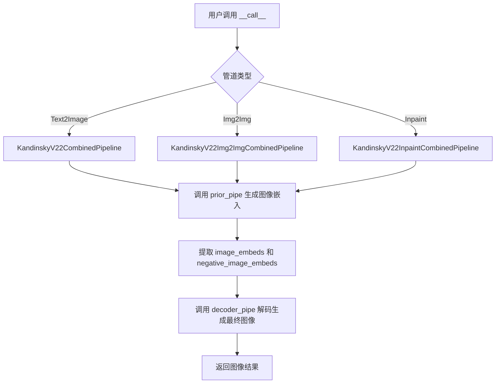
```mermaid
graph TD
    A[用户调用 __call__] --> B{管道类型}
    B -- Text2Image --> C[KandinskyV22CombinedPipeline]
    B -- Img2Img --> D[KandinskyV22Img2ImgCombinedPipeline]
    B -- Inpaint --> E[KandinskyV22InpaintCombinedPipeline]
    C --> F[调用 prior_pipe 生成图像嵌入]
    D --> F
    E --> F
    F --> G[提取 image_embeds 和 negative_image_embeds]
    G --> H[调用 decoder_pipe 解码生成最终图像]
    H --> I[返回图像结果]
```

## 类结构

```
DiffusionPipeline (基类)
├── KandinskyV22CombinedPipeline (文本到图像)
├── KandinskyV22Img2ImgCombinedPipeline (图像到图像)
└── KandinskyV22InpaintCombinedPipeline (图像修复)

子管道组件:
├── KandinskyV22PriorPipeline (Prior管道)
├── KandinskyV22Pipeline (Decoder管道)
├── KandinskyV22Img2ImgPipeline (Img2Img Decoder)
└── KandinskyV22InpaintPipeline (Inpaint Decoder)
```

## 全局变量及字段


### `logger`
    
模块日志记录器

类型：`logging.Logger`
    


### `TEXT2IMAGE_EXAMPLE_DOC_STRING`
    
文本到图像示例文档字符串

类型：`str`
    


### `IMAGE2IMAGE_EXAMPLE_DOC_STRING`
    
图像到图像示例文档字符串

类型：`str`
    


### `INPAINT_EXAMPLE_DOC_STRING`
    
图像修复示例文档字符串

类型：`str`
    


### `KandinskyV22CombinedPipeline.model_cpu_offload_seq`
    
模型CPU卸载顺序

类型：`str`
    


### `KandinskyV22CombinedPipeline._load_connected_pipes`
    
是否加载连接管道

类型：`bool`
    


### `KandinskyV22CombinedPipeline._exclude_from_cpu_offload`
    
排除CPU卸载的模块

类型：`list`
    


### `KandinskyV22CombinedPipeline.prior_pipe`
    
先验管道实例

类型：`KandinskyV22PriorPipeline`
    


### `KandinskyV22CombinedPipeline.decoder_pipe`
    
解码管道实例

类型：`KandinskyV22Pipeline`
    


### `KandinskyV22CombinedPipeline.unet`
    
UNet模型

类型：`UNet2DConditionModel`
    


### `KandinskyV22CombinedPipeline.scheduler`
    
调度器

类型：`DDPMScheduler`
    


### `KandinskyV22CombinedPipeline.movq`
    
VQ解码器

类型：`VQModel`
    


### `KandinskyV22CombinedPipeline.prior_prior`
    
先验变换器

类型：`PriorTransformer`
    


### `KandinskyV22CombinedPipeline.prior_image_encoder`
    
图像编码器

类型：`CLIPVisionModelWithProjection`
    


### `KandinskyV22CombinedPipeline.prior_text_encoder`
    
文本编码器

类型：`CLIPTextModelWithProjection`
    


### `KandinskyV22CombinedPipeline.prior_tokenizer`
    
文本分词器

类型：`CLIPTokenizer`
    


### `KandinskyV22CombinedPipeline.prior_scheduler`
    
先验调度器

类型：`UnCLIPScheduler`
    


### `KandinskyV22CombinedPipeline.prior_image_processor`
    
图像处理器

类型：`CLIPImageProcessor`
    


### `KandinskyV22Img2ImgCombinedPipeline.model_cpu_offload_seq`
    
模型CPU卸载顺序

类型：`str`
    


### `KandinskyV22Img2ImgCombinedPipeline._load_connected_pipes`
    
是否加载连接管道

类型：`bool`
    


### `KandinskyV22Img2ImgCombinedPipeline._exclude_from_cpu_offload`
    
排除CPU卸载的模块

类型：`list`
    


### `KandinskyV22Img2ImgCombinedPipeline.prior_pipe`
    
先验管道实例

类型：`KandinskyV22PriorPipeline`
    


### `KandinskyV22Img2ImgCombinedPipeline.decoder_pipe`
    
Img2Img解码管道实例

类型：`KandinskyV22Img2ImgPipeline`
    


### `KandinskyV22Img2ImgCombinedPipeline.unet`
    
UNet模型

类型：`UNet2DConditionModel`
    


### `KandinskyV22Img2ImgCombinedPipeline.scheduler`
    
调度器

类型：`DDPMScheduler`
    


### `KandinskyV22Img2ImgCombinedPipeline.movq`
    
VQ解码器

类型：`VQModel`
    


### `KandinskyV22Img2ImgCombinedPipeline.prior_prior`
    
先验变换器

类型：`PriorTransformer`
    


### `KandinskyV22Img2ImgCombinedPipeline.prior_image_encoder`
    
图像编码器

类型：`CLIPVisionModelWithProjection`
    


### `KandinskyV22Img2ImgCombinedPipeline.prior_text_encoder`
    
文本编码器

类型：`CLIPTextModelWithProjection`
    


### `KandinskyV22Img2ImgCombinedPipeline.prior_tokenizer`
    
文本分词器

类型：`CLIPTokenizer`
    


### `KandinskyV22Img2ImgCombinedPipeline.prior_scheduler`
    
先验调度器

类型：`UnCLIPScheduler`
    


### `KandinskyV22Img2ImgCombinedPipeline.prior_image_processor`
    
图像处理器

类型：`CLIPImageProcessor`
    


### `KandinskyV22InpaintCombinedPipeline.model_cpu_offload_seq`
    
模型CPU卸载顺序

类型：`str`
    


### `KandinskyV22InpaintCombinedPipeline._load_connected_pipes`
    
是否加载连接管道

类型：`bool`
    


### `KandinskyV22InpaintCombinedPipeline._exclude_from_cpu_offload`
    
排除CPU卸载的模块

类型：`list`
    


### `KandinskyV22InpaintCombinedPipeline.prior_pipe`
    
先验管道实例

类型：`KandinskyV22PriorPipeline`
    


### `KandinskyV22InpaintCombinedPipeline.decoder_pipe`
    
Inpaint解码管道实例

类型：`KandinskyV22InpaintPipeline`
    


### `KandinskyV22InpaintCombinedPipeline.unet`
    
UNet模型

类型：`UNet2DConditionModel`
    


### `KandinskyV22InpaintCombinedPipeline.scheduler`
    
调度器

类型：`DDPMScheduler`
    


### `KandinskyV22InpaintCombinedPipeline.movq`
    
VQ解码器

类型：`VQModel`
    


### `KandinskyV22InpaintCombinedPipeline.prior_prior`
    
先验变换器

类型：`PriorTransformer`
    


### `KandinskyV22InpaintCombinedPipeline.prior_image_encoder`
    
图像编码器

类型：`CLIPVisionModelWithProjection`
    


### `KandinskyV22InpaintCombinedPipeline.prior_text_encoder`
    
文本编码器

类型：`CLIPTextModelWithProjection`
    


### `KandinskyV22InpaintCombinedPipeline.prior_tokenizer`
    
文本分词器

类型：`CLIPTokenizer`
    


### `KandinskyV22InpaintCombinedPipeline.prior_scheduler`
    
先验调度器

类型：`UnCLIPScheduler`
    


### `KandinskyV22InpaintCombinedPipeline.prior_image_processor`
    
图像处理器

类型：`CLIPImageProcessor`
    
    

## 全局函数及方法


# DiffusionPipeline 抽象基类

## 概述

DiffusionPipeline 是 Hugging Face Diffusers 库中的抽象基类，定义了所有扩散管道（Diffusion Pipeline）的通用接口和核心功能，包括模型的加载与注册、内存管理、推理执行、回调处理等。它是 Kandinsky 系列管道的父类，提供了统一的 pipeline 架构设计。

## 核心信息

### 类名称
`DiffusionPipeline`

### 类的类型
抽象基类（Abstract Base Class）

### 继承关系
KandinskyV22CombinedPipeline、DiffusionPipeline 的子类均继承自此类

---

## 参数（基于子类构造函数推断）

由于 DiffusionPipeline 是抽象基类，其具体参数由子类实现。以下参数基于 `KandinskyV22CombinedPipeline.__init__` 推断：

- `unet`：UNet2DConditionModel，条件 U-Net 架构，用于去噪图像嵌入
- `scheduler`：DDPMScheduler，用于生成图像 latent 的调度器
- `movq`：VQModel，MoVQ 解码器，用于从 latent 生成图像
- `prior_prior`：PriorTransformer，标准的 unCLIP prior，用于从文本嵌入近似图像嵌入
- `prior_image_encoder`：CLIPVisionModelWithProjection，冻结的图像编码器
- `prior_text_encoder`：CLIPTextModelWithProjection，冻结的文本编码器
- `prior_tokenizer`：CLIPTokenizer，CLIP 标记器
- `prior_scheduler`：UnCLIPScheduler，用于生成图像嵌入的调度器
- `prior_image_processor`：CLIPImageProcessor，用于预处理 CLIP 图像的处理器

---

## 方法详细信息

### 1. __init__

**描述**：初始化 DiffusionPipeline，注册所有必要的模块。

**参数**：
- （无固定参数，由子类定义）

**返回值**：无

**流程图**：

```mermaid
graph TD
    A[__init__] --> B[调用 super().__init__]
    B --> C[register_modules 注册所有子模块]
    C --> D[初始化完成]
```

**源码**：

```python
def __init__(self):
    # 抽象基类的初始化方法
    # 子类需要调用 super().__init__() 并通过 register_modules 注册模块
    pass
```

---

### 2. register_modules

**描述**：注册管道中使用的所有模块，使其成为管道的属性。

**参数**：
- `**kwargs`：关键字参数，模块名称为键，模块实例为值

**返回值**：无

**流程图**：

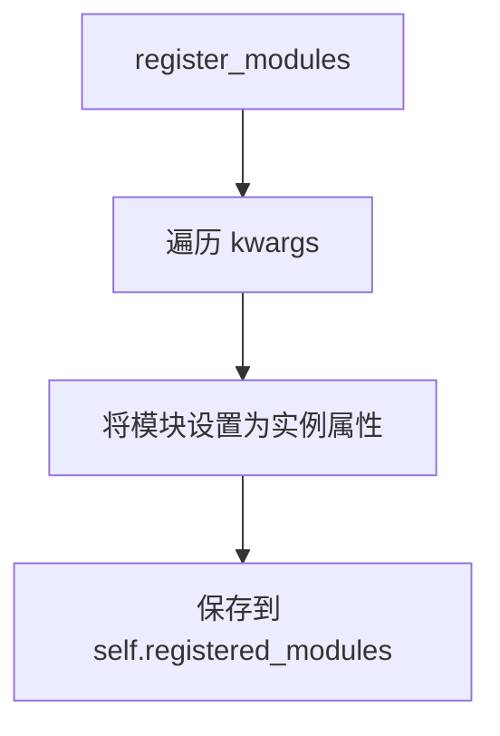
```mermaid
graph TD
    A[register_modules] --> B[遍历 kwargs]
    B --> C[将模块设置为实例属性]
    C --> D[保存到 self.registered_modules]
```

**源码**：

```python
def register_modules(self, **kwargs):
    """
    注册管道中使用的所有模块。
    
    Args:
        **kwargs: 关键字参数，模块名称为键，模块实例为值
    """
    # 遍历所有传入的模块并注册为实例属性
    for name, module in kwargs.items():
        setattr(self, name, module)
```

---

### 3. enable_xformers_memory_efficient_attention

**描述**：启用 xFormers 内存高效注意力机制，以减少显存占用。

**参数**：
- `attention_op`：Callable | None，可选的注意力操作

**返回值**：无

**流程图**：

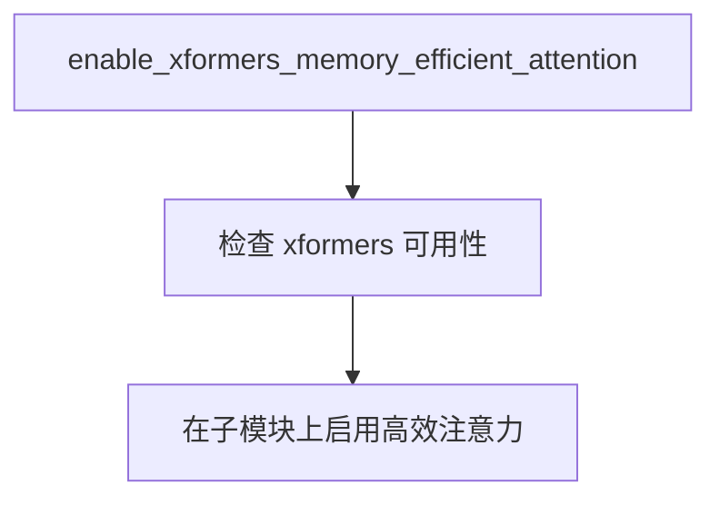
```mermaid
graph TD
    A[enable_xformers_memory_efficient_attention] --> B[检查 xformers 可用性]
    B --> C[在子模块上启用高效注意力]
```

**源码**：

```python
def enable_xformers_memory_efficient_attention(self, attention_op: Callable | None = None):
    """
    启用 xFormers 内存高效注意力。
    
    Args:
        attention_op: 可选的注意力操作
    """
    # 遍历所有子模块，尝试启用 xformers
    for module in self.modules():
        if hasattr(module, "enable_xformers_memory_efficient_attention"):
            module.enable_xformers_memory_efficient_attention(attention_op)
```

---

### 4. enable_sequential_cpu_offload

**描述**：使用 accelerate 将所有模型offload到 CPU，显著减少显存使用。

**参数**：
- `gpu_id`：int | None，GPU ID
- `device`：torch.device | str，目标设备

**返回值**：无

**流程图**：

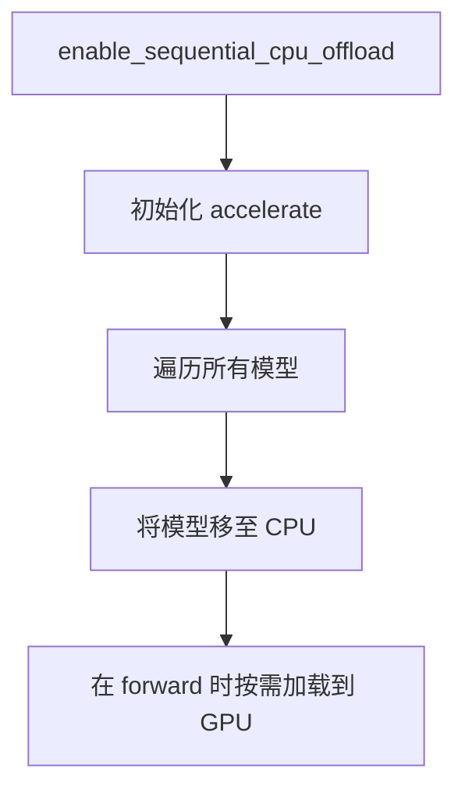
```mermaid
graph TD
    A[enable_sequential_cpu_offload] --> B[初始化 accelerate]
    B --> C[遍历所有模型]
    C --> D[将模型移至 CPU]
    D --> E[在 forward 时按需加载到 GPU]
```

**源码**：

```python
def enable_sequential_cpu_offload(self, gpu_id: int | None = None, device: torch.device | str = None):
    """
    将所有模型 offload 到 CPU。
    
    Args:
        gpu_id: GPU ID
        device: 目标设备
    """
    # 使用 accelerate 实现 CPU offload
    # 模型状态保存在 CPU，仅在调用 forward 时加载到 GPU
    pass
```

---

### 5. enable_model_cpu_offload

**描述**：使用 accelerate 将模型按序移至 GPU，减少显存使用但保持较好性能。

**参数**：
- `gpu_id`：int | None，GPU ID
- `device`：torch.device | str，目标设备

**返回值**：无

**源码**：

```python
def enable_model_cpu_offload(self, gpu_id: int | None = None, device: torch.device | str = None):
    """
    按序将模型移至 GPU。
    
    Args:
        gpu_id: GPU ID
        device: 目标设备
    """
    pass
```

---

### 6. progress_bar

**描述**：设置推理过程的进度条。

**参数**：
- `iterable`：可选的迭代器
- `total`：总步数

**返回值**：无

**源码**：

```python
def progress_bar(self, iterable=None, total=None):
    """
    设置进度条。
    
    Args:
        iterable: 可选的迭代器
        total: 总步数
    """
    pass
```

---

### 7. set_progress_bar_config

**描述**：配置进度条的显示方式。

**参数**：
- `**kwargs`：进度条配置参数

**返回值**：无

**源码**：

```python
def set_progress_bar_config(self, **kwargs):
    """
    配置进度条。
    
    Args:
        **kwargs: 配置参数
    """
    pass
```

---

### 8. maybe_free_model_hooks

**描述**：释放模型的 hooks，释放内存。

**参数**：无

**返回值**：无

**源码**：

```python
def maybe_free_model_hooks(self):
    """
    释放模型的 hooks，释放内存。
    """
    pass
```

---

### 9. __call__（抽象方法）

**描述**：执行管道推理生成图像（由子类实现）。

**参数**（基于 KandinskyV22CombinedPipeline）：
- `prompt`：str | list[str]，引导图像生成的提示
- `negative_prompt`：str | list[str] | None，不引导图像生成的提示
- `num_inference_steps`：int，去噪步数
- `guidance_scale`：float，分类器自由引导 scale
- `num_images_per_prompt`：int，每个提示生成的图像数量
- `height`：int，生成图像的高度
- `width`：int，生成图像的宽度
- `prior_guidance_scale`：float，prior 引导 scale
- `prior_num_inference_steps`：int，prior 去噪步数
- `generator`：torch.Generator | list[torch.Generator] | None，随机生成器
- `latents`：torch.Tensor | None，预生成的噪声 latents
- `output_type`：str，输出格式（"pil", "np", "pt"）
- `callback`：Callable | None，推理回调函数
- `callback_steps`：int，回调频率
- `return_dict`：bool，是否返回字典格式
- `prior_callback_on_step_end`：Callable | None，prior 步骤结束回调
- `prior_callback_on_step_end_tensor_inputs`：list[str]，prior 回调张量输入
- `callback_on_step_end`：Callable | None，步骤结束回调
- `callback_on_step_end_tensor_inputs`：list[str]，回调张量输入

**返回值**：ImagePipelineOutput 或 tuple

**流程图**：

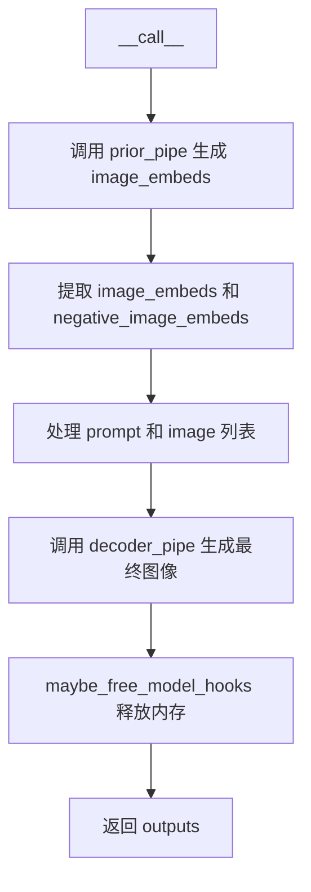
```mermaid
graph TD
    A[__call__] --> B[调用 prior_pipe 生成 image_embeds]
    B --> C[提取 image_embeds 和 negative_image_embeds]
    C --> D[处理 prompt 和 image 列表]
    D --> E[调用 decoder_pipe 生成最终图像]
    E --> F[maybe_free_model_hooks 释放内存]
    F --> G[返回 outputs]
```

---

## 关键技术细节

### 设计模式

1. **模板方法模式**：DiffusionPipeline 定义了管道的骨架，子类实现具体的推理逻辑
2. **模块注册模式**：通过 `register_modules` 统一管理依赖注入
3. **内存管理策略**：提供多种内存优化方式（xformers、CPU offload）

### 状态管理

- `model_cpu_offload_seq`：定义模型 CPU offload 的顺序
- `_load_connected_pipes`：是否加载关联的管道
- `_exclude_from_cpu_offload`：从 CPU offload 排除的模块列表

### Kandinsky 特定流程

```
Text Prompt → Prior Pipeline → Image Embeddings
                                    ↓
                           Decoder Pipeline
                                    ↓
                              Final Image
```

---

## 潜在技术债务与优化空间

1. **重复代码**：KandinskyV22CombinedPipeline、KandinskyV22Img2ImgCombinedPipeline、KandinskyV22InpaintCombinedPipeline 有大量重复的初始化代码和辅助方法
2. **参数冗余**：prior_guidance_scale 和 guidance_scale、prior_num_inference_steps 和 num_inference_steps 分离可能导致混淆
3. **硬编码序列**：model_cpu_offload_seq 字符串硬编码，缺乏灵活性
4. **回调机制复杂**：multiple callback 相关参数（callback_on_step_end、prior_callback_on_step_end）增加了 API 复杂度
5. **类型注解不完整**：部分方法缺少完整的类型注解

---

## 外部依赖与接口契约

### 核心依赖

- `torch`：深度学习框架
- `PIL`：图像处理
- `transformers`：CLIP 模型
- `diffusers.models`：UNet、VAE 等模型
- `diffusers.schedulers`：调度器

### 预期行为

- 所有继承 DiffusionPipeline 的类必须实现 __call__ 方法
- 模块必须通过 register_modules 注册
- 推理时使用 torch.no_grad() 减少显存
- 支持回调机制以监控推理进度


### KandinskyV22CombinedPipeline.__call__

这是 Kandinsky 2.2 组合管道的主方法，实现了从文本提示生成图像的核心功能。它首先通过_prior管道生成图像嵌入，然后使用解码器管道将图像嵌入解码为最终图像。

参数：

- `prompt`：`str | list[str]`，引导图像生成的文本提示
- `negative_prompt`：`str | list[str] | None`，不引导图像生成的负面提示
- `num_inference_steps`：`int`，去噪步骤数，默认为100
- `guidance_scale`：`float`，分类器自由扩散引导比例，默认为4.0
- `num_images_per_prompt`：`int`，每个提示生成的图像数量，默认为1
- `height`：`int`，生成图像的高度（像素），默认为512
- `width`：`int`，生成图像的宽度（像素），默认为512
- `prior_guidance_scale`：`float`，先验管道的引导比例，默认为4.0
- `prior_num_inference_steps`：`int`，先验管道的去噪步骤数，默认为25
- `generator`：`torch.Generator | list[torch.Generator] | None`，随机数生成器，用于确定性生成
- `latents`：`torch.Tensor | None`，预生成的噪声潜在向量
- `output_type`：`str | None`，输出格式，可选"pil"、"np"或"pt"，默认为"pil"
- `callback`：`Callable[[int, int, torch.Tensor], None] | None`，推理过程中每步调用的回调函数
- `callback_steps`：`int`，回调函数被调用的频率，默认为1
- `return_dict`：`bool`，是否返回`ImagePipelineOutput`，默认为True
- `prior_callback_on_step_end`：`Callable[[int, int], None] | None`，先验管道每步结束时的回调函数
- `prior_callback_on_step_end_tensor_inputs`：`list[str]`，先验管道回调的tensor输入列表
- `callback_on_step_end`：`Callable[[int, int], None] | None`，解码器管道每步结束时的回调函数
- `callback_on_step_end_tensor_inputs`：`list[str]`，解码器管道回调的tensor输入列表

返回值：`ImagePipelineOutput` 或 `tuple`，包含生成的图像

#### 流程图

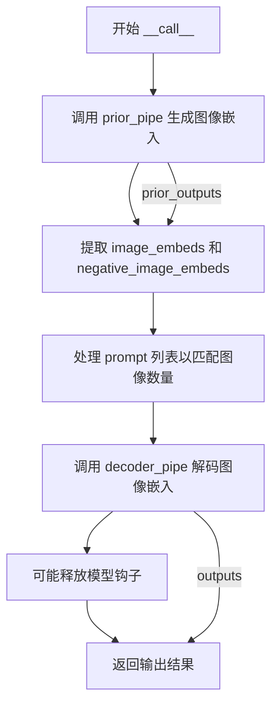
```mermaid
flowchart TD
    A[开始 __call__] --> B[调用 prior_pipe 生成图像嵌入]
    B --> C[提取 image_embeds 和 negative_image_embeds]
    C --> D[处理 prompt 列表以匹配图像数量]
    D --> E[调用 decoder_pipe 解码图像嵌入]
    E --> F[可能释放模型钩子]
    F --> G[返回输出结果]
    
    B -->|prior_outputs| C
    E -->|outputs| G
```

#### 带注释源码

```python
@torch.no_grad()
@replace_example_docstring(TEXT2IMAGE_EXAMPLE_DOC_STRING)
def __call__(
    self,
    prompt: str | list[str],
    negative_prompt: str | list[str] | None = None,
    num_inference_steps: int = 100,
    guidance_scale: float = 4.0,
    num_images_per_prompt: int = 1,
    height: int = 512,
    width: int = 512,
    prior_guidance_scale: float = 4.0,
    prior_num_inference_steps: int = 25,
    generator: torch.Generator | list[torch.Generator] | None = None,
    latents: torch.Tensor | None = None,
    output_type: str | None = "pil",
    callback: Callable[[int, int, torch.Tensor], None] | None = None,
    callback_steps: int = 1,
    return_dict: bool = True,
    prior_callback_on_step_end: Callable[[int, int], None] | None = None,
    prior_callback_on_step_end_tensor_inputs: list[str] = ["latents"],
    callback_on_step_end: Callable[[int, int], None] | None = None,
    callback_on_step_end_tensor_inputs: list[str] = ["latents"],
):
    """
    Function invoked when calling the pipeline for generation.
    
    执行管道生成时被调用的函数
    """
    # 步骤1: 调用先验管道生成图像嵌入
    prior_outputs = self.prior_pipe(
        prompt=prompt,
        negative_prompt=negative_prompt,
        num_images_per_prompt=num_images_per_prompt,
        num_inference_steps=prior_num_inference_steps,
        generator=generator,
        latents=latents,
        guidance_scale=prior_guidance_scale,
        output_type="pt",  # 强制输出为 PyTorch tensor
        return_dict=False,
        callback_on_step_end=prior_callback_on_step_end,
        callback_on_step_end_tensor_inputs=prior_callback_on_step_end_tensor_inputs,
    )
    
    # 步骤2: 从先验输出中提取图像嵌入和负面图像嵌入
    image_embeds = prior_outputs[0]
    negative_image_embeds = prior_outputs[1]

    # 步骤3: 确保prompt是列表，以便与生成的图像数量匹配
    prompt = [prompt] if not isinstance(prompt, (list, tuple)) else prompt

    # 步骤4: 如果prompt数量少于生成的图像数量，则重复prompt以匹配
    if len(prompt) < image_embeds.shape[0] and image_embeds.shape[0] % len(prompt) == 0:
        prompt = (image_embeds.shape[0] // len(prompt)) * prompt

    # 步骤5: 调用解码器管道将图像嵌入解码为最终图像
    outputs = self.decoder_pipe(
        image_embeds=image_embeds,
        negative_image_embeds=negative_image_embeds,
        width=width,
        height=height,
        num_inference_steps=num_inference_steps,
        generator=generator,
        guidance_scale=guidance_scale,
        output_type=output_type,
        callback=callback,
        callback_steps=callback_steps,
        return_dict=return_dict,
        callback_on_step_end=callback_on_step_end,
        callback_on_step_end_tensor_inputs=callback_on_step_end_tensor_inputs,
    )
    
    # 步骤6: 释放可能保留的模型钩子以释放内存
    self.maybe_free_model_hooks()

    # 步骤7: 返回最终输出
    return outputs
```


### KandinskyV22Img2ImgCombinedPipeline

图像到图像（Image-to-Image）组合管道，用于基于文本提示和输入图像生成目标图像。该管道结合了PriorPipeline（用于生成图像嵌入）和Img2ImgPipeline（用于根据图像嵌入解码生成目标图像），实现了从文本和参考图像到目标图像的转换功能。

参数：

- `unet`：`UNet2DConditionModel`，条件U-Net架构，用于去噪图像嵌入
- `scheduler`：`DDPMScheduler`，与unet结合生成图像潜在表示的调度器
- `movq`：`VQModel`，MoVQ解码器，用于从潜在表示生成图像
- `prior_prior`：`PriorTransformer`，标准的unCLIP先验模型，用于从文本嵌入近似图像嵌入
- `prior_image_encoder`：`CLIPVisionModelWithProjection`，冻结的图像编码器
- `prior_text_encoder`：`CLIPTextModelWithProjection`，冻结的文本编码器
- `prior_tokenizer`：`CLIPTokenizer`，CLIP分词器
- `prior_scheduler`：`UnCLIPScheduler`，与prior结合生成图像嵌入的调度器
- `prior_image_processor`：`CLIPImageProcessor`，用于预处理图像的图像处理器
- `prompt`：`str | list[str]`，引导图像生成的文本提示
- `image`：`torch.Tensor | PIL.Image.Image | list[torch.Tensor] | list[PIL.Image.Image]`，作为起点的输入图像
- `negative_prompt`：`str | list[str] | None`，不引导图像生成的文本提示
- `num_inference_steps`：`int`，去噪步数，默认100
- `guidance_scale`：`float`，分类器自由扩散引导比例，默认4.0
- `strength`：`float`，图像变换程度，默认0.3
- `num_images_per_prompt`：`int`，每个提示生成的图像数量，默认1
- `height`：`int`，生成图像的高度（像素），默认512
- `width`：`int`，生成图像的宽度（像素），默认512
- `prior_guidance_scale`：`float`，先验管道的引导比例，默认4.0
- `prior_num_inference_steps`：`int`，先验管道的去噪步数，默认25
- `generator`：`torch.Generator | list[torch.Generator] | None`，随机数生成器，用于可重复生成
- `latents`：`torch.Tensor | None`，预生成的噪声潜在表示
- `output_type`：`str | None`，输出格式，可选"pil"、"np"或"pt"，默认"pil"
- `callback`：`Callable | None`，每步调用的回调函数
- `callback_steps`：`int`，回调函数调用频率，默认1
- `return_dict`：`bool`，是否返回管道输出对象，默认True
- `prior_callback_on_step_end`：`Callable | None`，先验管道每步结束时调用的函数
- `prior_callback_on_step_end_tensor_inputs`：`list[str]`，先验管道回调的 tensor 输入列表
- `callback_on_step_end`：`Callable | None`，解码器管道每步结束时调用的函数
- `callback_on_step_end_tensor_inputs`：`list[str]`，解码器管道回调的 tensor 输入列表

返回值：`ImagePipelineOutput` 或 `tuple`，生成的图像结果或包含图像的元组

#### 流程图

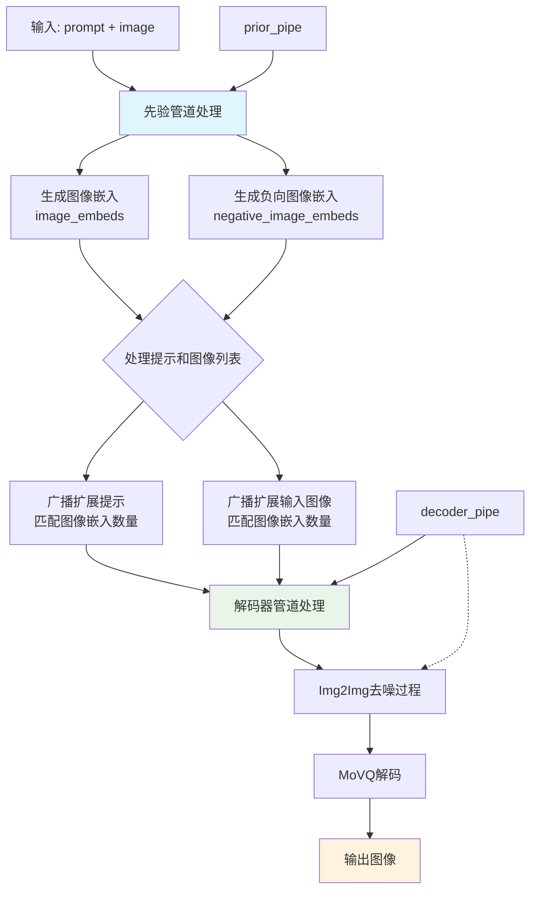
```mermaid
flowchart TD
    A[输入: prompt + image] --> B[先验管道处理]
    B --> C[生成图像嵌入<br/>image_embeds]
    B --> D[生成负向图像嵌入<br/>negative_image_embeds]
    C --> E{处理提示和图像列表}
    D --> E
    E --> F[广播扩展提示<br/>匹配图像嵌入数量]
    E --> G[广播扩展输入图像<br/>匹配图像嵌入数量]
    F --> H[解码器管道处理]
    G --> H
    H --> I[Img2Img去噪过程]
    I --> J[MoVQ解码]
    J --> K[输出图像]
    
    B1[prior_pipe] --> B
    H1[decoder_pipe] --> H
    H1 -.-> I
    
    style B fill:#e1f5fe
    style H fill:#e8f5e8
    style K fill:#fff3e0
```

#### 带注释源码

```python
class KandinskyV22Img2ImgCombinedPipeline(DiffusionPipeline):
    """
    Combined Pipeline for image-to-image generation using Kandinsky
    
    该类继承自DiffusionPipeline，实现了Kandinsky 2.2模型的图像到图像生成功能。
    通过组合先验管道（生成图像嵌入）和解码器管道（从嵌入生成图像）实现完整流程。
    """

    # 模型CPU卸载顺序：先验文本编码器 -> 先验图像编码器 -> UNet -> MoVQ
    model_cpu_offload_seq = "prior_text_encoder->prior_image_encoder->unet->movq"
    # 允许加载连接的管道
    _load_connected_pipes = True
    # 从CPU卸载中排除的模块
    _exclude_from_cpu_offload = ["prior_prior"]

    def __init__(
        self,
        unet: UNet2DConditionModel,
        scheduler: DDPMScheduler,
        movq: VQModel,
        prior_prior: PriorTransformer,
        prior_image_encoder: CLIPVisionModelWithProjection,
        prior_text_encoder: CLSTextModelWithProjection,
        prior_tokenizer: CLIPTokenizer,
        prior_scheduler: UnCLIPScheduler,
        prior_image_processor: CLIPImageProcessor,
    ):
        """
        初始化组合管道
        
        Args:
            unet: 条件U-Net模型
            scheduler: 去噪调度器
            movq: MoVQ解码器模型
            prior_prior: 先验变换器
            prior_image_encoder: CLIP图像编码器
            prior_text_encoder: CLIP文本编码器
            prior_tokenizer: CLIP分词器
            prior_scheduler: 先验调度器
            prior_image_processor: 图像预处理器
        """
        super().__init__()

        # 注册所有模块到管道中
        self.register_modules(
            unet=unet,
            scheduler=scheduler,
            movq=movq,
            prior_prior=prior_prior,
            prior_image_encoder=prior_image_encoder,
            prior_text_encoder=prior_text_encoder,
            prior_tokenizer=prior_tokenizer,
            prior_scheduler=prior_scheduler,
            prior_image_processor=prior_image_processor,
        )
        
        # 创建先验管道：负责从文本生成图像嵌入
        self.prior_pipe = KandinskyV22PriorPipeline(
            prior=prior_prior,
            image_encoder=prior_image_encoder,
            text_encoder=prior_text_encoder,
            tokenizer=prior_tokenizer,
            scheduler=prior_scheduler,
            image_processor=prior_image_processor,
        )
        
        # 创建图像到图像解码器管道：负责从图像嵌入生成目标图像
        self.decoder_pipe = KandinskyV22Img2ImgPipeline(
            unet=unet,
            scheduler=scheduler,
            movq=movq,
        )

    def enable_xformers_memory_efficient_attention(self, attention_op: Callable | None = None):
        """启用xFormers高效注意力机制以减少显存使用"""
        self.decoder_pipe.enable_xformers_memory_efficient_attention(attention_op)

    def enable_model_cpu_offload(self, gpu_id: int | None = None, device: torch.device | str = None):
        """
        启用模型CPU卸载，按需加载模型到GPU
        
        与sequential offload相比，内存节省较少但性能更好
        """
        self.prior_pipe.enable_model_cpu_offload(gpu_id=gpu_id, device=device)
        self.decoder_pipe.enable_model_cpu_offload(gpu_id=gpu_id, device=device)

    def enable_sequential_cpu_offload(self, gpu_id: int | None = None, device: torch.device | str = None):
        """
        启用顺序CPU卸载，最大程度减少显存使用
        
        所有模型保存在CPU，仅在需要时加载到GPU，内存节省最高但性能较低
        """
        self.prior_pipe.enable_sequential_cpu_offload(gpu_id=gpu_id, device=device)
        self.decoder_pipe.enable_sequential_cpu_offload(gpu_id=gpu_id, device=device)

    def progress_bar(self, iterable=None, total=None):
        """设置进度条并启用模型CPU卸载"""
        self.prior_pipe.progress_bar(iterable=iterable, total=total)
        self.decoder_pipe.progress_bar(iterable=iterable, total=total)
        self.decoder_pipe.enable_model_cpu_offload()

    def set_progress_bar_config(self, **kwargs):
        """配置进度条显示参数"""
        self.prior_pipe.set_progress_bar_config(**kwargs)
        self.decoder_pipe.set_progress_bar_config(**kwargs)

    @torch.no_grad()
    @replace_example_docstring(IMAGE2IMAGE_EXAMPLE_DOC_STRING)
    def __call__(
        self,
        prompt: str | list[str],
        image: torch.Tensor | PIL.Image.Image | list[torch.Tensor] | list[PIL.Image.Image],
        negative_prompt: str | list[str] | None = None,
        num_inference_steps: int = 100,
        guidance_scale: float = 4.0,
        strength: float = 0.3,
        num_images_per_prompt: int = 1,
        height: int = 512,
        width: int = 512,
        prior_guidance_scale: float = 4.0,
        prior_num_inference_steps: int = 25,
        generator: torch.Generator | list[torch.Generator] | None = None,
        latents: torch.Tensor | None = None,
        output_type: str | None = "pil",
        callback: Callable[[int, int, torch.Tensor], None] | None = None,
        callback_steps: int = 1,
        return_dict: bool = True,
        prior_callback_on_step_end: Callable[[int, int], None] | None = None,
        prior_callback_on_step_end_tensor_inputs: list[str] = ["latents"],
        callback_on_step_end: Callable[[int, int], None] | None = None,
        callback_on_step_end_tensor_inputs: list[str] = ["latents"],
    ):
        """
        调用管道进行图像到图像生成
        
        处理流程：
        1. 先验管道处理文本提示，生成图像嵌入
        2. 扩展输入提示和图像以匹配生成的嵌入数量
        3. 解码器管道使用图像嵌入和输入图像生成目标图像
        
        Args:
            prompt: 引导图像生成的文本提示
            image: 起始图像
            negative_prompt: 不希望的图像描述
            num_inference_steps: 解码器去噪步数
            guidance_scale: 解码器引导比例
            strength: 图像变换强度 (0-1)
            num_images_per_prompt: 每个提示生成的图像数
            height: 输出高度
            width: 输出宽度
            prior_guidance_scale: 先验管道引导比例
            prior_num_inference_steps: 先验管道去噪步数
            generator: 随机数生成器
            latents: 预生成噪声
            output_type: 输出格式
            callback: 推理回调函数
            callback_steps: 回调步数
            return_dict: 是否返回字典格式
            prior_callback_on_step_end: 先验管道步末回调
            prior_callback_on_step_end_tensor_inputs: 先验回调tensor输入
            callback_on_step_end: 解码器步末回调
            callback_on_step_end_tensor_inputs: 解码器回调tensor输入
            
        Returns:
            ImagePipelineOutput 或 tuple: 生成的图像
        """
        # ========== 步骤1: 先验管道生成图像嵌入 ==========
        prior_outputs = self.prior_pipe(
            prompt=prompt,
            negative_prompt=negative_prompt,
            num_images_per_prompt=num_images_per_prompt,
            num_inference_steps=prior_num_inference_steps,
            generator=generator,
            latents=latents,
            guidance_scale=prior_guidance_scale,
            output_type="pt",  # 先验输出必须为pytorch tensor
            return_dict=False,
            callback_on_step_end=prior_callback_on_step_end,
            callback_on_step_end_tensor_inputs=prior_callback_on_step_end_tensor_inputs,
        )
        # 提取图像嵌入和负向图像嵌入
        image_embeds = prior_outputs[0]
        negative_image_embeds = prior_outputs[1]

        # ========== 步骤2: 广播扩展输入以匹配输出数量 ==========
        prompt = [prompt] if not isinstance(prompt, (list, tuple)) else prompt
        image = [image] if isinstance(image, PIL.Image.Image) else image

        # 如果提示数量少于图像嵌入数量，进行广播扩展
        if len(prompt) < image_embeds.shape[0] and image_embeds.shape[0] % len(prompt) == 0:
            prompt = (image_embeds.shape[0] // len(prompt)) * prompt

        # 如果图像数量少于图像嵌入数量，进行广播扩展
        if (
            isinstance(image, (list, tuple))
            and len(image) < image_embeds.shape[0]
            and image_embeds.shape[0] % len(image) == 0
        ):
            image = (image_embeds.shape[0] // len(image)) * image

        # ========== 步骤3: 解码器管道生成目标图像 ==========
        outputs = self.decoder_pipe(
            image=image,
            image_embeds=image_embeds,
            negative_image_embeds=negative_image_embeds,
            width=width,
            height=height,
            strength=strength,
            num_inference_steps=num_inference_steps,
            generator=generator,
            guidance_scale=guidance_scale,
            output_type=output_type,
            callback=callback,
            callback_steps=callback_steps,
            return_dict=return_dict,
            callback_on_step_end=callback_on_step_end,
            callback_on_step_end_tensor_inputs=callback_on_step_end_tensor_inputs,
        )

        # 释放模型钩子
        self.maybe_free_model_hooks()
        return outputs
```


### KandinskyV22InpaintCombinedPipeline

KandinskyV22InpaintCombinedPipeline 是一个组合式图像修复（Inpainting）管道，继承自 DiffusionPipeline。该管道通过先验管道（prior_pipe）生成图像嵌入，再利用解码管道（decoder_pipe）结合原始图像、遮罩图像和文本提示进行图像修复生成。

参数：

- `prompt`：`str | list[str]`，用于引导图像生成的主题描述
- `image`：`torch.Tensor | PIL.Image.Image | list[torch.Tensor] | list[PIL.Image.Image]`，作为修复起点的基础图像
- `mask_image`：`torch.Tensor | PIL.Image.Image | list[torch.Tensor] | list[PIL.Image.Image]`，遮罩图像，白色像素将被重新绘制，黑色像素将被保留
- `negative_prompt`：`str | list[str] | None`，不用于引导图像生成的负面提示
- `num_inference_steps`：`int`，去噪步数，默认为100，步数越多通常图像质量越高
- `guidance_scale`：`float`，分类器无关扩散引导比例，默认为4.0
- `num_images_per_prompt`：`int`，每个提示生成的图像数量，默认为1
- `height`：`int`，生成图像的高度（像素），默认为512
- `width`：`int`，生成图像的宽度（像素），默认为512
- `prior_guidance_scale`：`float`，先验管道的引导比例，默认为4.0
- `prior_num_inference_steps`：`int`，先验管道的去噪步数，默认为25
- `generator`：`torch.Generator | list[torch.Generator] | None`，用于生成确定性结果的随机数生成器
- `latents`：`torch.Tensor | None`，预生成的噪声潜在向量
- `output_type`：`str | None`，输出格式，可选"pil"、"np"或"pt"，默认为"pil"
- `return_dict`：`bool`，是否返回 ImagePipelineOutput，默认为True
- `prior_callback_on_step_end`：`Callable | None`，先验管道每步结束时的回调函数
- `prior_callback_on_step_end_tensor_inputs`：`list[str]`，先验管道回调的 tensor 输入列表
- `callback_on_step_end`：`Callable | None`，解码管道每步结束时的回调函数
- `callback_on_step_end_tensor_inputs`：`list[str]`，解码管道回调的 tensor 输入列表

返回值：`ImagePipelineOutput` 或 `tuple`，包含生成的图像及相关输出

#### 流程图

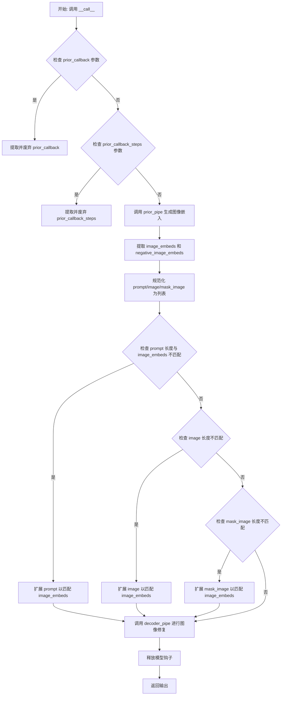
```mermaid
graph TD
    A[开始: 调用 __call__] --> B{检查 prior_callback 参数}
    B -->|是| C[提取并废弃 prior_callback]
    B -->|否| D{检查 prior_callback_steps 参数}
    D -->|是| E[提取并废弃 prior_callback_steps]
    D -->|否| F[调用 prior_pipe 生成图像嵌入]
    F --> G[提取 image_embeds 和 negative_image_embeds]
    G --> H[规范化 prompt/image/mask_image 为列表]
    H --> I{检查 prompt 长度与 image_embeds 不匹配}
    I -->|是| J[扩展 prompt 以匹配 image_embeds]
    I -->|否| K{检查 image 长度不匹配}
    K -->|是| L[扩展 image 以匹配 image_embeds]
    K -->|否| M{检查 mask_image 长度不匹配}
    M -->|是| N[扩展 mask_image 以匹配 image_embeds]
    M -->|否| O[调用 decoder_pipe 进行图像修复]
    O --> P[释放模型钩子]
    P --> Q[返回输出]
    
    J --> O
    L --> O
    N --> O
```

#### 带注释源码

```python
class KandinskyV22InpaintCombinedPipeline(DiffusionPipeline):
    """
    Combined Pipeline for inpainting generation using Kandinsky

    This model inherits from [`DiffusionPipeline`]. Check the superclass documentation for the generic methods the
    library implements for all the pipelines (such as downloading or saving, running on a particular device, etc.)

    Args:
        scheduler (`DDIMScheduler` | `DDPMScheduler`):
            A scheduler to be used in combination with `unet` to generate image latents.
        unet ([`UNet2DConditionModel`]):
            Conditional U-Net architecture to denoise the image embedding.
        movq ([`VQModel`):
            MoVQ Decoder to generate the image from the latents.
        prior_prior ([`PriorTransformer`]):
            The canonical unCLIP prior to approximate the image embedding from the text embedding.
        prior_image_encoder ([`CLIPVisionModelWithProjection`]):
            Frozen image-encoder.
        prior_text_encoder ([`CLIPTextModelWithProjection`]):
            Frozen text-encoder.
        prior_tokenizer (`CLIPTokenizer`):
            Tokenizer of class
            [CLIPTokenizer](https://huggingface.co/docs/transformers/v4.21.0/en/model_doc/clip#transformers.CLIPTokenizer).
        prior_scheduler ([`UnCLIPScheduler`]):
            A scheduler to be used in combination with `prior` to generate image embedding.
        prior_image_processor ([`CLIPImageProcessor`]):
            A image_processor to be used to preprocess image from clip.
    """

    # 定义模型卸载顺序：先文本编码器，再图像编码器，然后UNet，最后MoVQ
    model_cpu_offload_seq = "prior_text_encoder->prior_image_encoder->unet->movq"
    # 允许加载连接的管道
    _load_connected_pipes = True
    # 从CPU卸载中排除 prior_prior
    _exclude_from_cpu_offload = ["prior_prior"]

    def __init__(
        self,
        unet: UNet2DConditionModel,
        scheduler: DDPMScheduler,
        movq: VQModel,
        prior_prior: PriorTransformer,
        prior_image_encoder: CLIPVisionModelWithProjection,
        prior_text_encoder: CLIPTextModelWithProjection,
        prior_tokenizer: CLIPTokenizer,
        prior_scheduler: UnCLIPScheduler,
        prior_image_processor: CLIPImageProcessor,
    ):
        super().__init__()

        # 注册所有模块
        self.register_modules(
            unet=unet,
            scheduler=scheduler,
            movq=movq,
            prior_prior=prior_prior,
            prior_image_encoder=prior_image_encoder,
            prior_text_encoder=prior_text_encoder,
            prior_tokenizer=prior_tokenizer,
            prior_scheduler=prior_scheduler,
            prior_image_processor=prior_image_processor,
        )
        # 初始化先验管道 - 用于从文本生成图像嵌入
        self.prior_pipe = KandinskyV22PriorPipeline(
            prior=prior_prior,
            image_encoder=prior_image_encoder,
            text_encoder=prior_text_encoder,
            tokenizer=prior_tokenizer,
            scheduler=prior_scheduler,
            image_processor=prior_image_processor,
        )
        # 初始化修复管道 - 用于实际图像修复
        self.decoder_pipe = KandinskyV22InpaintPipeline(
            unet=unet,
            scheduler=scheduler,
            movq=movq,
        )

    def enable_xformers_memory_efficient_attention(self, attention_op: Callable | None = None):
        """启用xFormers高效注意力机制以减少显存使用"""
        self.decoder_pipe.enable_xformers_memory_efficient_attention(attention_op)

    def enable_sequential_cpu_offload(self, gpu_id: int | None = None, device: torch.device | str = None):
        """
        卸载所有模型到CPU以显著降低显存使用
        当调用时，unet、text_encoder、vae和safety_checker的状态字典会被保存到CPU
        然后移动到torch.device('meta')并仅在特定子模块的forward方法被调用时才加载到GPU
        """
        self.prior_pipe.enable_sequential_cpu_offload(gpu_id=gpu_id, device=device)
        self.decoder_pipe.enable_sequential_cpu_offload(gpu_id=gpu_id, device=device)

    def progress_bar(self, iterable=None, total=None):
        """设置进度条并启用模型CPU卸载"""
        self.prior_pipe.progress_bar(iterable=iterable, total=total)
        self.decoder_pipe.progress_bar(iterable=iterable, total=total)
        self.decoder_pipe.enable_model_cpu_offload()

    def set_progress_bar_config(self, **kwargs):
        """设置进度条配置"""
        self.prior_pipe.set_progress_bar_config(**kwargs)
        self.decoder_pipe.set_progress_bar_config(**kwargs)

    @torch.no_grad()
    @replace_example_docstring(INPAINT_EXAMPLE_DOC_STRING)
    def __call__(
        self,
        prompt: str | list[str],
        image: torch.Tensor | PIL.Image.Image | list[torch.Tensor] | list[PIL.Image.Image],
        mask_image: torch.Tensor | PIL.Image.Image | list[torch.Tensor] | list[PIL.Image.Image],
        negative_prompt: str | list[str] | None = None,
        num_inference_steps: int = 100,
        guidance_scale: float = 4.0,
        num_images_per_prompt: int = 1,
        height: int = 512,
        width: int = 512,
        prior_guidance_scale: float = 4.0,
        prior_num_inference_steps: int = 25,
        generator: torch.Generator | list[torch.Generator] | None = None,
        latents: torch.Tensor | None = None,
        output_type: str | None = "pil",
        return_dict: bool = True,
        prior_callback_on_step_end: Callable[[int, int], None] | None = None,
        prior_callback_on_step_end_tensor_inputs: list[str] = ["latents"],
        callback_on_step_end: Callable[[int, int], None] | None = None,
        callback_on_step_end_tensor_inputs: list[str] = ["latents"],
        **kwargs,
    ):
        # 处理已废弃的 prior_callback 参数
        prior_kwargs = {}
        if kwargs.get("prior_callback", None) is not None:
            prior_kwargs["callback"] = kwargs.pop("prior_callback")
            deprecate(
                "prior_callback",
                "1.0.0",
                "Passing `prior_callback` as an input argument to `__call__` is deprecated, consider use `prior_callback_on_step_end`",
            )
        # 处理已废弃的 prior_callback_steps 参数
        if kwargs.get("prior_callback_steps", None) is not None:
            deprecate(
                "prior_callback_steps",
                "1.0.0",
                "Passing `prior_callback_steps` as an input argument to `__call__` is deprecated, consider use `prior_callback_on_step_end`",
            )
            prior_kwargs["callback_steps"] = kwargs.pop("prior_callback_steps")

        # 调用先验管道生成图像嵌入
        prior_outputs = self.prior_pipe(
            prompt=prompt,
            negative_prompt=negative_prompt,
            num_images_per_prompt=num_images_per_prompt,
            num_inference_steps=prior_num_inference_steps,
            generator=generator,
            latents=latents,
            guidance_scale=prior_guidance_scale,
            output_type="pt",
            return_dict=False,
            callback_on_step_end=prior_callback_on_step_end,
            callback_on_step_end_tensor_inputs=prior_callback_on_step_end_tensor_inputs,
            **prior_kwargs,
        )
        # 提取图像嵌入和负面图像嵌入
        image_embeds = prior_outputs[0]
        negative_image_embeds = prior_outputs[1]

        # 规范化输入为列表格式
        prompt = [prompt] if not isinstance(prompt, (list, tuple)) else prompt
        image = [image] if isinstance(image, PIL.Image.Image) else image
        mask_image = [mask_image] if isinstance(mask_image, PIL.Image.Image) else mask_image

        # 扩展 prompt 以匹配 image_embeds 数量
        if len(prompt) < image_embeds.shape[0] and image_embeds.shape[0] % len(prompt) == 0:
            prompt = (image_embeds.shape[0] // len(prompt)) * prompt

        # 扩展 image 以匹配 image_embeds 数量
        if (
            isinstance(image, (list, tuple))
            and len(image) < image_embeds.shape[0]
            and image_embeds.shape[0] % len(image) == 0
        ):
            image = (image_embeds.shape[0] // len(image)) * image

        # 扩展 mask_image 以匹配 image_embeds 数量
        if (
            isinstance(mask_image, (list, tuple))
            and len(mask_image) < image_embeds.shape[0]
            and image_embeds.shape[0] % len(mask_image) == 0
        ):
            mask_image = (image_embeds.shape[0] // len(mask_image)) * mask_image

        # 调用修复管道进行图像修复
        outputs = self.decoder_pipe(
            image=image,
            mask_image=mask_image,
            image_embeds=image_embeds,
            negative_image_embeds=negative_image_embeds,
            width=width,
            height=height,
            num_inference_steps=num_inference_steps,
            generator=generator,
            guidance_scale=guidance_scale,
            output_type=output_type,
            return_dict=return_dict,
            callback_on_step_end=callback_on_step_end,
            callback_on_step_end_tensor_inputs=callback_on_step_end_tensor_inputs,
            **kwargs,
        )
        # 释放模型钩子
        self.maybe_free_model_hooks()

        return outputs
```


### KandinskyV22CombinedPipeline.__call__

这是Kandinsky V2.2联合管道的主生成方法，负责协调先验管道（生成图像嵌入）和解码管道（从嵌入生成最终图像）的执行，实现文本到图像的生成功能。

参数：

- `prompt`：`str | list[str]`，用于引导图像生成的文本提示
- `negative_prompt`：`str | list[str] | None`，不引导图像生成的负面提示
- `num_inference_steps`：`int`，去噪步数，默认为100
- `guidance_scale`：`float`，分类器自由扩散引导比例，默认为4.0
- `num_images_per_prompt`：`int`，每个提示生成的图像数量，默认为1
- `height`：`int`，生成图像的高度像素，默认为512
- `width`：`int`，生成图像的宽度像素，默认为512
- `prior_guidance_scale`：`float`，先验管道的引导比例，默认为4.0
- `prior_num_inference_steps`：`int`，先验管道的去噪步数，默认为25
- `generator`：`torch.Generator | list[torch.Generator] | None`，随机数生成器，用于确定性生成
- `latents`：`torch.Tensor | None`，预生成的噪声潜在向量
- `output_type`：`str | None`，输出格式，可选"pil"、"np"或"pt"，默认为"pil"
- `callback`：`Callable | None`，每步调用的回调函数
- `callback_steps`：`int`，回调函数调用频率，默认为1
- `return_dict`：`bool`，是否返回字典格式结果，默认为True
- `prior_callback_on_step_end`：`Callable | None`，先验管道每步结束时的回调函数
- `prior_callback_on_step_end_tensor_inputs`：`list[str]`，先验管道回调的 tensor 输入列表
- `callback_on_step_end`：`Callable | None`，解码管道每步结束时的回调函数
- `callback_on_step_end_tensor_inputs`：`list[str]`，解码管道回调的 tensor 输入列表

返回值：`ImagePipelineOutput` 或 `tuple`，包含生成的图像及相关元数据

#### 流程图

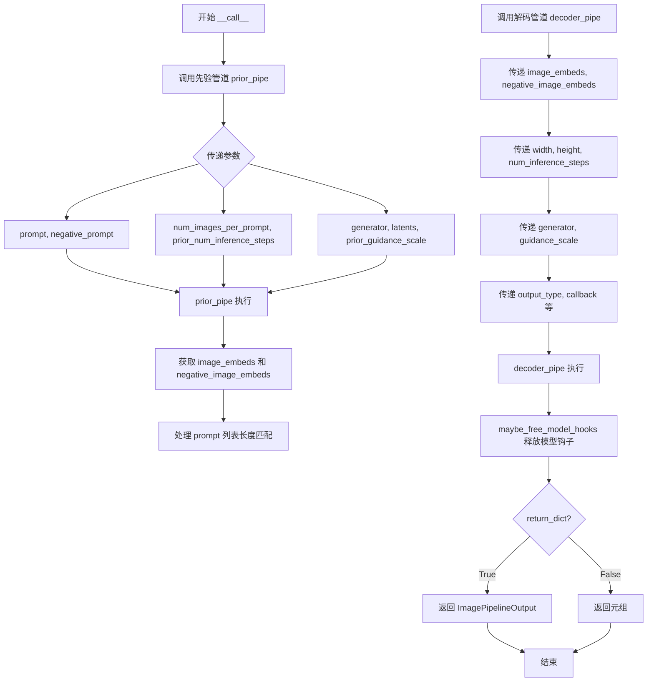
```mermaid
flowchart TD
    A[开始 __call__] --> B[调用先验管道 prior_pipe]
    B --> C{传递参数}
    C --> D[prompt, negative_prompt]
    C --> E[num_images_per_prompt, prior_num_inference_steps]
    C --> F[generator, latents, prior_guidance_scale]
    D --> G[prior_pipe 执行]
    E --> G
    F --> G
    G --> H[获取 image_embeds 和 negative_image_embeds]
    H --> I[处理 prompt 列表长度匹配]
    J[调用解码管道 decoder_pipe]
    J --> K[传递 image_embeds, negative_image_embeds]
    K --> L[传递 width, height, num_inference_steps]
    L --> M[传递 generator, guidance_scale]
    M --> N[传递 output_type, callback 等]
    N --> O[decoder_pipe 执行]
    O --> P[maybe_free_model_hooks 释放模型钩子]
    P --> Q{return_dict?}
    Q -->|True| R[返回 ImagePipelineOutput]
    Q -->|False| S[返回元组]
    R --> T[结束]
    S --> T
```

#### 带注释源码

```python
@torch.no_grad()
@replace_example_docstring(TEXT2IMAGE_EXAMPLE_DOC_STRING)
def __call__(
    self,
    prompt: str | list[str],
    negative_prompt: str | list[str] | None = None,
    num_inference_steps: int = 100,
    guidance_scale: float = 4.0,
    num_images_per_prompt: int = 1,
    height: int = 512,
    width: int = 512,
    prior_guidance_scale: float = 4.0,
    prior_num_inference_steps: int = 25,
    generator: torch.Generator | list[torch.Generator] | None = None,
    latents: torch.Tensor | None = None,
    output_type: str | None = "pil",
    callback: Callable[[int, int, torch.Tensor], None] | None = None,
    callback_steps: int = 1,
    return_dict: bool = True,
    prior_callback_on_step_end: Callable[[int, int], None] | None = None,
    prior_callback_on_step_end_tensor_inputs: list[str] = ["latents"],
    callback_on_step_end: Callable[[int, int], None] | None = None,
    callback_on_step_end_tensor_inputs: list[str] = ["latents"],
):
    """
    管道生成时调用的主函数。
    
    执行两步流程：
    1. 先验管道：将文本提示转换为图像嵌入向量
    2. 解码管道：使用图像嵌入生成最终图像
    """
    # 第一阶段：调用先验管道生成图像嵌入
    prior_outputs = self.prior_pipe(
        prompt=prompt,
        negative_prompt=negative_prompt,
        num_images_per_prompt=num_images_per_prompt,
        num_inference_steps=prior_num_inference_steps,
        generator=generator,
        latents=latents,
        guidance_scale=prior_guidance_scale,
        output_type="pt",  # 强制输出为 PyTorch 张量
        return_dict=False,
        callback_on_step_end=prior_callback_on_step_end,
        callback_on_step_end_tensor_inputs=prior_callback_on_step_end_tensor_inputs,
    )
    # 从先验输出中提取图像嵌入和负面图像嵌入
    image_embeds = prior_outputs[0]
    negative_image_embeds = prior_outputs[1]

    # 确保 prompt 为列表格式，便于批量处理
    prompt = [prompt] if not isinstance(prompt, (list, tuple)) else prompt

    # 处理 prompt 数量与图像嵌入数量不匹配的情况
    if len(prompt) < image_embeds.shape[0] and image_embeds.shape[0] % len(prompt) == 0:
        prompt = (image_embeds.shape[0] // len(prompt)) * prompt

    # 第二阶段：调用解码管道从嵌入生成最终图像
    outputs = self.decoder_pipe(
        image_embeds=image_embeds,
        negative_image_embeds=negative_image_embeds,
        width=width,
        height=height,
        num_inference_steps=num_inference_steps,
        generator=generator,
        guidance_scale=guidance_scale,
        output_type=output_type,
        callback=callback,
        callback_steps=callback_steps,
        return_dict=return_dict,
        callback_on_step_end=callback_on_step_end,
        callback_on_step_end_tensor_inputs=callback_on_step_end_tensor_inputs,
    )
    
    # 释放模型钩子，清理资源
    self.maybe_free_model_hooks()

    return outputs
```


### `KandinskyV22CombinedPipeline.__init__`

这是 KandinskyV22CombinedPipeline 类的构造函数，用于初始化组合管道。该管道将 PriorPipeline（负责从文本生成图像嵌入）和 DecoderPipeline（负责从图像嵌入生成最终图像）组合在一起，实现端到端的文本到图像生成功能。

参数：

- `unet`：`UNet2DConditionModel`，条件 U-Net 架构，用于对图像嵌入进行去噪处理
- `scheduler`：`DDPMScheduler`，与 unet 结合使用生成图像潜变量的调度器
- `movq`：`VQModel`，MoVQ 解码器，用于从潜变量生成最终图像
- `prior_prior`：`PriorTransformer`，标准的 unCLIP 先验模型，用于从文本嵌入近似图像嵌入
- `prior_image_encoder`：`CLIPVisionModelWithProjection`，冻结的图像编码器
- `prior_text_encoder`：`CLIPTextModelWithProjection`，冻结的文本编码器
- `prior_tokenizer`：`CLIPTokenizer`，CLIP 分词器
- `prior_scheduler`：`UnCLIPScheduler`，与 prior 结合使用生成图像嵌入的调度器
- `prior_image_processor`：`CLIPImageProcessor`，用于从 CLIP 预处理图像的图像处理器

返回值：`None`，构造函数不返回值，仅初始化对象状态

#### 流程图

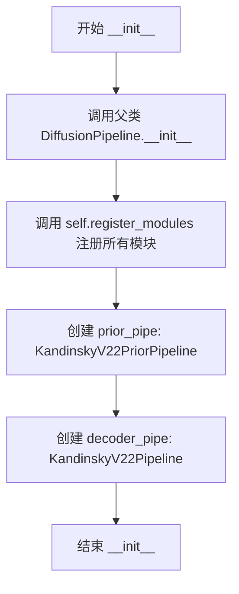
```mermaid
flowchart TD
    A[开始 __init__] --> B[调用父类 DiffusionPipeline.__init__]
    B --> C[调用 self.register_modules 注册所有模块]
    C --> D[创建 prior_pipe: KandinskyV22PriorPipeline]
    D --> E[创建 decoder_pipe: KandinskyV22Pipeline]
    E --> F[结束 __init__]
```

#### 带注释源码

```python
def __init__(
    self,
    unet: UNet2DConditionModel,
    scheduler: DDPMScheduler,
    movq: VQModel,
    prior_prior: PriorTransformer,
    prior_image_encoder: CLIPVisionModelWithProjection,
    prior_text_encoder: CLIPTextModelWithProjection,
    prior_tokenizer: CLIPTokenizer,
    prior_scheduler: UnCLIPScheduler,
    prior_image_processor: CLIPImageProcessor,
):
    """
    初始化 KandinskyV22CombinedPipeline 的构造函数
    
    参数:
        unet: 条件U-Net模型，用于图像去噪
        scheduler: DDPM调度器
        movq: VQ模型，用于解码潜变量
        prior_prior: PriorTransformer先验模型
        prior_image_encoder: CLIP图像编码器
        prior_text_encoder: CLIP文本编码器
        prior_tokenizer: CLIP分词器
        prior_scheduler: UnCLIP调度器
        prior_image_processor: CLIP图像处理器
    """
    # 调用父类 DiffusionPipeline 的初始化方法
    super().__init__()

    # 注册所有模块到当前管道实例
    # 这些模块可以通过 self.xxx 访问
    self.register_modules(
        unet=unet,
        scheduler=scheduler,
        movq=movq,
        prior_prior=prior_prior,
        prior_image_encoder=prior_image_encoder,
        prior_text_encoder=prior_text_encoder,
        prior_tokenizer=prior_tokenizer,
        prior_scheduler=prior_scheduler,
        prior_image_processor=prior_image_processor,
    )
    
    # 创建先验管道实例，负责从文本生成图像嵌入
    # 组合了 prior、image_encoder、text_encoder、tokenizer、scheduler、image_processor
    self.prior_pipe = KandinskyV22PriorPipeline(
        prior=prior_prior,
        image_encoder=prior_image_encoder,
        text_encoder=prior_text_encoder,
        tokenizer=prior_tokenizer,
        scheduler=prior_scheduler,
        image_processor=prior_image_processor,
    )
    
    # 创建解码器管道实例，负责从图像嵌入生成最终图像
    # 只使用 unet、scheduler、movq
    self.decoder_pipe = KandinskyV22Pipeline(
        unet=unet,
        scheduler=scheduler,
        movq=movq,
    )
```


### `KandinskyV22CombinedPipeline.enable_xformers_memory_efficient_attention`

该方法用于启用xformers内存高效注意力机制，它是一个委托方法，将调用转发给内部持有的decoder_pipe对象。这是KandinskyV22CombinedPipeline类的一个便捷方法，允许用户在不直接访问decoder_pipe的情况下启用内存优化功能。

参数：

- `self`：`KandinskyV22CombinedPipeline`，隐式的实例本身
- `attention_op`：`Callable | None`，可选的自定义注意力操作，用于xformers实现。如果为None，则使用默认的注意力操作

返回值：`None`，该方法不返回任何值，仅执行副作用（调用decoder_pipe的对应方法）

#### 流程图


```mermaid
flowchart TD
    A[开始调用 enable_xformers_memory_efficient_attention] --> B[将 attention_op 传递给 decoder_pipe]
    B --> C[调用 decoder_pipe.enable_xformers_memory_efficient_attention&#40;attention_op&#41;]
    C --> D[在 decoder_pipe 内部启用 xformers 内存高效注意力]
    D --> E[结束]
```

#### 带注释源码

```python
def enable_xformers_memory_efficient_attention(self, attention_op: Callable | None = None):
    """
    启用xformers内存高效注意力机制。
    
    该方法是一个委托方法，它将调用转发到内部持有的decoder_pipe对象。
    xformers是一个用于加速Transformer模型注意力计算的库，可以显著减少显存使用。
    
    参数:
        attention_op: 可选的注意力操作符。如果为None，则使用xformers的默认实现。
                     这允许用户指定自定义的注意力实现以进一步优化性能。
    
    返回:
        None: 该方法不返回任何值，直接修改decoder_pipe的内部状态。
    
    示例:
        # 基本用法 - 启用默认的xformers注意力
        pipeline.enable_xformers_memory_efficient_attention()
        
        # 使用自定义注意力操作
        pipeline.enable_xformers_memory_efficient_attention(attention_op=custom_attention)
    """
    # 将调用委托给decoder_pipe处理
    # decoder_pipe是KandinskyV22Pipeline实例，负责实际的图像解码过程
    self.decoder_pipe.enable_xformers_memory_efficient_attention(attention_op)
```


### `KandinskyV22CombinedPipeline.enable_sequential_cpu_offload`

该方法用于启用顺序CPU卸载功能，通过`accelerate`库将所有模型（prior_pipe和decoder_pipe）依次卸载到CPU，显著降低显存占用。模型的状态字典保存在CPU内存中，仅在特定子模块的`forward`方法被调用时才加载到GPU。

参数：

- `gpu_id`：`int | None`，指定GPU设备ID，默认为None
- `device`：`torch.device | str`，指定目标设备，默认为None

返回值：`None`，该方法无返回值，直接修改对象内部状态

#### 流程图

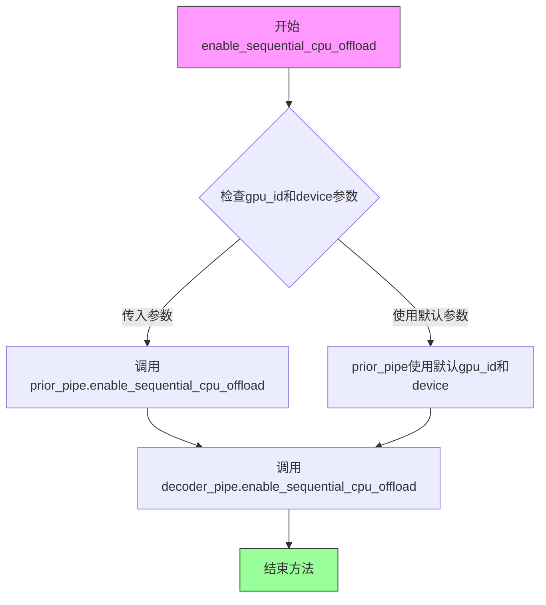
```mermaid
flowchart TD
    A[开始 enable_sequential_cpu_offload] --> B{检查gpu_id和device参数}
    B -->|传入参数| C[调用prior_pipe.enable_sequential_cpu_offload]
    B -->|使用默认参数| D[prior_pipe使用默认gpu_id和device]
    C --> E[调用decoder_pipe.enable_sequential_cpu_offload]
    D --> E
    E --> F[结束方法]
    
    style A fill:#f9f,stroke:#333
    style F fill:#9f9,stroke:#333
```

#### 带注释源码

```python
def enable_sequential_cpu_offload(self, gpu_id: int | None = None, device: torch.device | str = None):
    r"""
    Offloads all models to CPU using accelerate, significantly reducing memory usage. When called, unet,
    text_encoder, vae and safety checker have their state dicts saved to CPU and then are moved to a
    `torch.device('meta') and loaded to GPU only when their specific submodule has its `forward` method called.
    Note that offloading happens on a submodule basis. Memory savings are higher than with
    `enable_model_cpu_offload`, but performance is lower.
    
    Args:
        gpu_id: GPU设备ID，可选参数
        device: 目标设备，可为torch.device或字符串类型
    
    Returns:
        None
    
    Note:
        该方法通过子模块粒度的CPU卸载实现更高的内存节省，但会带来性能开销
    """
    # 调用前置管道的顺序CPU卸载方法
    self.prior_pipe.enable_sequential_cpu_offload(gpu_id=gpu_id, device=device)
    
    # 调用解码器管道的顺序CPU卸载方法
    self.decoder_pipe.enable_sequential_cpu_offload(gpu_id=gpu_id, device=device)
```


### `KandinskyV22CombinedPipeline.progress_bar`

该方法用于为联合管道设置进度条，并在此过程中启用CPU卸载功能。它依次为prior管道和decoder管道设置进度条，并在最后为decoder管道启用模型CPU卸载，以便在生成过程中优化内存使用。

参数：

- `iterable`：可迭代对象（Iterable），可选，要迭代的对象
- `total`：整数，可选，迭代总数

返回值：无（`None`），该方法仅执行副作用操作，不返回任何值

#### 流程图

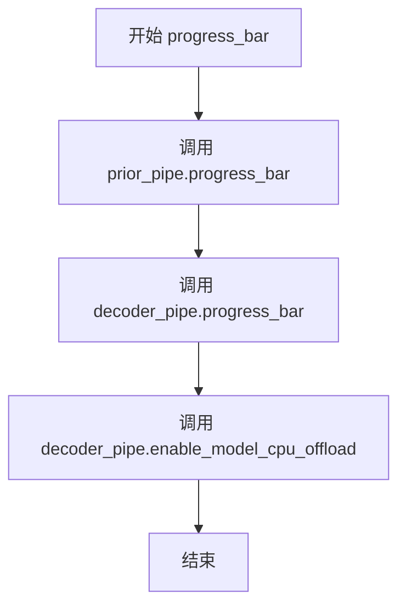
```mermaid
flowchart TD
    A[开始 progress_bar] --> B[调用 prior_pipe.progress_bar]
    B --> C[调用 decoder_pipe.progress_bar]
    C --> D[调用 decoder_pipe.enable_model_cpu_offload]
    D --> E[结束]
```

#### 带注释源码

```python
def progress_bar(self, iterable=None, total=None):
    """
    设置联合管道的进度条并启用CPU卸载
    
    该方法完成以下操作：
    1. 为prior管道设置进度条（用于生成图像embedding）
    2. 为decoder管道设置进度条（用于从embedding生成最终图像）
    3. 为decoder启用模型CPU卸载以优化内存使用
    """
    # 调用前置管道的progress_bar方法，设置迭代器和总数
    self.prior_pipe.progress_bar(iterable=iterable, total=total)
    
    # 调用解码器管道的progress_bar方法，设置相同的迭代器和总数
    self.decoder_pipe.progress_bar(iterable=iterable, total=total)
    
    # 为decoder管道启用模型CPU卸载
    # 这会将模型权重卸载到CPU以节省GPU显存，仅在需要时加载到GPU
    self.decoder_pipe.enable_model_cpu_offload()
```


### `KandinskyV22CombinedPipeline.set_progress_bar_config`

该方法用于配置组合管道中先验管道和解码管道的进度条显示参数，通过将接收到的任意关键字参数同时传递给 `prior_pipe` 和 `decoder_pipe` 来实现统一配置。

参数：

- `**kwargs`：`Any`，可变关键字参数，用于传递给进度条配置的可选参数（如 `disable`、`desc`、`leave` 等）

返回值：`None`，该方法不返回任何值，仅执行副作用（配置子管道的进度条）

#### 流程图

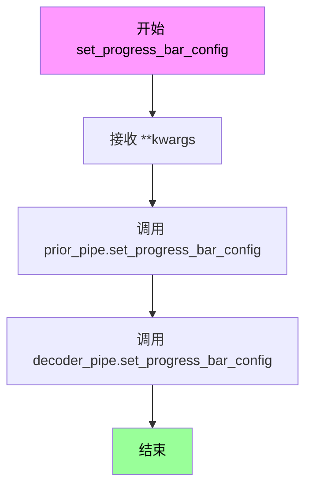
```mermaid
flowchart TD
    A[开始 set_progress_bar_config] --> B[接收 **kwargs]
    B --> C[调用 prior_pipe.set_progress_bar_config]
    C --> D[调用 decoder_pipe.set_progress_bar_config]
    D --> E[结束]
    
    style A fill:#f9f,color:#000
    style E fill:#9f9,color:#000
```

#### 带注释源码

```python
def set_progress_bar_config(self, **kwargs):
    """
    设置组合管道中所有子管道的进度条配置。
    
    该方法将接收到的任意关键字参数同时传递给先验管道（prior_pipe）
    和解码管道（decoder_pipe），以便统一配置进度条的显示行为。
    
    参数:
        **kwargs: 可变关键字参数，用于配置进度条的各种选项，
                 例如 disable（禁用进度条）、desc（描述）、leave（是否保留）等。
                 具体参数取决于底层进度条实现的配置选项。
    
    返回值:
        None: 此方法不返回任何值，仅修改子管道的内部状态。
    """
    # 将配置参数传递给先验管道，设置其进度条配置
    self.prior_pipe.set_progress_bar_config(**kwargs)
    
    # 将配置参数传递给解码管道，设置其进度条配置
    self.decoder_pipe.set_progress_bar_config(**kwargs)
```


### `KandinskyV22CombinedPipeline.__call__`

这是 Kandinsky 2.2 组合管道的主要调用方法，用于通过两阶段过程（先验网络生成图像嵌入 + 解码器网络从嵌入生成图像）实现文本到图像的生成。

参数：

- `prompt`：`str | list[str]`，引导图像生成的提示词或提示词列表
- `negative_prompt`：`str | list[str] | None`，不引导图像生成的提示词，忽略不使用引导时（即 `guidance_scale < 1`）
- `num_inference_steps`：`int`，去噪步数，默认为 100，更多步数通常带来更高质量但推理更慢
- `guidance_scale`：`float`，分类器无关扩散引导（CFG）中的引导尺度，默认为 4.0
- `num_images_per_prompt`：`int`，每个提示词生成的图像数量，默认为 1
- `height`：`int`，生成图像的高度（像素），默认为 512
- `width`：`int`，生成图像的宽度（像素），默认为 512
- `prior_guidance_scale`：`float`，先验网络的引导尺度，用于生成图像嵌入
- `prior_num_inference_steps`：`int`，先验网络的去噪步数，默认为 25
- `generator`：`torch.Generator | list[torch.Generator] | None`，随机生成器，用于使生成具有确定性
- `latents`：`torch.Tensor | None`，预生成的噪声潜在变量，用于图像生成
- `output_type`：`str | None`，生成图像的输出格式，可选 "pil"、"np" 或 "pt"，默认为 "pil"
- `callback`：`Callable[[int, int, torch.Tensor], None] | None`，每 `callback_steps` 步调用的回调函数
- `callback_steps`：`int`，调用回调函数的频率，默认为 1
- `return_dict`：`bool`，是否返回 `ImagePipelineOutput` 而不是元组，默认为 True
- `prior_callback_on_step_end`：`Callable[[int, int], None] | None`，先验管道每步结束时的回调函数
- `prior_callback_on_step_end_tensor_inputs`：`list[str]`，先验回调的张量输入列表，默认为 ["latents"]
- `callback_on_step_end`：`Callable[[int, int], None] | None`，解码器管道每步结束时的回调函数
- `callback_on_step_end_tensor_inputs`：`list[str]`，解码器回调的张量输入列表，默认为 ["latents"]

返回值：`ImagePipelineOutput | tuple`，包含生成的图像和元数据

#### 流程图

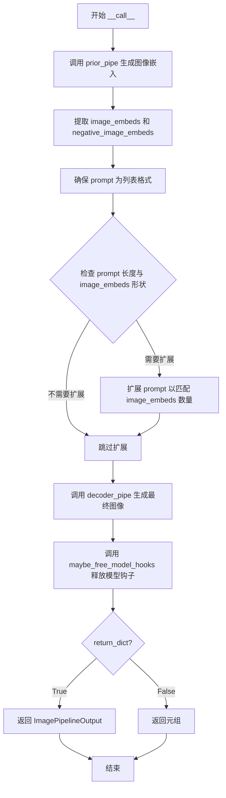
```mermaid
flowchart TD
    A[开始 __call__] --> B[调用 prior_pipe 生成图像嵌入]
    B --> C[提取 image_embeds 和 negative_image_embeds]
    C --> D[确保 prompt 为列表格式]
    D --> E{检查 prompt 长度与 image_embeds 形状}
    E -->|需要扩展| F[扩展 prompt 以匹配 image_embeds 数量]
    E -->|不需要扩展| G[跳过扩展]
    F --> G
    G --> H[调用 decoder_pipe 生成最终图像]
    H --> I[调用 maybe_free_model_hooks 释放模型钩子]
    I --> J{return_dict?}
    J -->|True| K[返回 ImagePipelineOutput]
    J -->|False| L[返回元组]
    K --> M[结束]
    L --> M
```

#### 带注释源码

```python
@torch.no_grad()
@replace_example_docstring(TEXT2IMAGE_EXAMPLE_DOC_STRING)
def __call__(
    self,
    prompt: str | list[str],
    negative_prompt: str | list[str] | None = None,
    num_inference_steps: int = 100,
    guidance_scale: float = 4.0,
    num_images_per_prompt: int = 1,
    height: int = 512,
    width: int = 512,
    prior_guidance_scale: float = 4.0,
    prior_num_inference_steps: int = 25,
    generator: torch.Generator | list[torch.Generator] | None = None,
    latents: torch.Tensor | None = None,
    output_type: str | None = "pil",
    callback: Callable[[int, int, torch.Tensor], None] | None = None,
    callback_steps: int = 1,
    return_dict: bool = True,
    prior_callback_on_step_end: Callable[[int, int], None] | None = None,
    prior_callback_on_step_end_tensor_inputs: list[str] = ["latents"],
    callback_on_step_end: Callable[[int, int], None] | None = None,
    callback_on_step_end_tensor_inputs: list[str] = ["latents"],
):
    """
    Function invoked when calling the pipeline for generation.
    """
    # 第一阶段：调用先验管道（prior_pipe）从文本提示生成图像嵌入
    # prior_pipe 内部使用 CLIP 文本编码器将文本转换为嵌入向量
    prior_outputs = self.prior_pipe(
        prompt=prompt,
        negative_prompt=negative_prompt,
        num_images_per_prompt=num_images_per_prompt,
        num_inference_steps=prior_num_inference_steps,  # 使用较少的先验步骤
        generator=generator,
        latents=latents,
        guidance_scale=prior_guidance_scale,
        output_type="pt",  # 强制输出为 PyTorch 张量格式
        return_dict=False,  # 元组格式返回以便后续提取
        callback_on_step_end=prior_callback_on_step_end,
        callback_on_step_end_tensor_inputs=prior_callback_on_step_end_tensor_inputs,
    )
    
    # 从先验输出中提取图像嵌入和负面图像嵌入
    image_embeds = prior_outputs[0]
    negative_image_embeds = prior_outputs[1]

    # 确保 prompt 是列表格式，以便后续处理
    prompt = [prompt] if not isinstance(prompt, (list, tuple)) else prompt

    # 如果 prompt 数量少于生成的嵌入数量且能整除，则扩展 prompt 以匹配
    if len(prompt) < image_embeds.shape[0] and image_embeds.shape[0] % len(prompt) == 0:
        prompt = (image_embeds.shape[0] // len(prompt)) * prompt

    # 第二阶段：调用解码器管道（decoder_pipe）从图像嵌入生成最终图像
    # decoder_pipe 使用 UNet2DConditionModel 进行去噪，结合 MoVQ 解码器生成图像
    outputs = self.decoder_pipe(
        image_embeds=image_embeds,
        negative_image_embeds=negative_image_embeds,
        width=width,
        height=height,
        num_inference_steps=num_inference_steps,
        generator=generator,
        guidance_scale=guidance_scale,
        output_type=output_type,
        callback=callback,
        callback_steps=callback_steps,
        return_dict=return_dict,
        callback_on_step_end=callback_on_step_end,
        callback_on_step_end_tensor_inputs=callback_on_step_end_tensor_inputs,
    )
    
    # 释放可能加载的模型钩子以释放内存
    self.maybe_free_model_hooks()

    # 根据 return_dict 参数返回相应格式的结果
    return outputs
```


### `KandinskyV22Img2ImgCombinedPipeline.__init__`

这是 Kandinsky 2.2 图像到图像（Img2Img）组合流水线的初始化方法，负责接收并注册所有必要的模型组件（UNet、调度器、MoVQ 解码器、Prior 模型、图像编码器、文本编码器、分词器、调度器和图像处理器），并实例化内部的 Prior 管道和 Decoder 管道。

参数：

- `unet`：`UNet2DConditionModel`，条件 U-Net 架构，用于对图像嵌入进行去噪。
- `scheduler`：`DDPMScheduler`，与 `unet` 结合使用以生成图像潜在变量的调度器。
- `movq`：`VQModel`，MoVQ 解码器，用于从潜在变量生成图像。
- `prior_prior`：`PriorTransformer`，规范的去 CLIP 近似器，用于从文本嵌入近似图像嵌入。
- `prior_image_encoder`：`CLIPVisionModelWithProjection`，冻结的图像编码器。
- `prior_text_encoder`：`CLIPTextModelWithProjection`，冻结的文本编码器。
- `prior_tokenizer`：`CLIPTokenizer`，CLIP 分词器类。
- `prior_scheduler`：`UnCLIPScheduler`，与 `prior` 结合使用以生成图像嵌入的调度器。
- `prior_image_processor`：`CLIPImageProcessor`，用于从 CLIP 预处理图像的图像处理器。

返回值：`None`，该方法不返回值，仅初始化对象状态。

#### 流程图

```mermaid
flowchart TD
    A[开始 __init__] --> B[调用 super().__init__]
    B --> C[调用 self.register_modules 注册所有组件]
    C --> D[实例化 KandinskyV22PriorPipeline 赋值给 self.prior_pipe]
    D --> E[实例化 KandinskyV22Img2ImgPipeline 赋值给 self.decoder_pipe]
    E --> F[结束 __init__]
```

#### 带注释源码

```python
def __init__(
    self,
    unet: UNet2DConditionModel,  # 条件 U-Net，用于去噪图像嵌入
    scheduler: DDPMScheduler,     # DDPM 调度器，用于生成图像潜在变量
    movq: VQModel,                # MoVQ 解码器，从潜在变量生成图像
    prior_prior: PriorTransformer,  # Prior Transformer，生成图像嵌入
    prior_image_encoder: CLIPVisionModelWithProjection,  # CLIP 图像编码器
    prior_text_encoder: CLIPTextModelWithProjection,      # CLIP 文本编码器
    prior_tokenizer: CLIPTokenizer,    # CLIP 分词器
    prior_scheduler: UnCLIPScheduler,  # Prior 调度器
    prior_image_processor: CLIPImageProcessor,  # CLIP 图像处理器
):
    # 调用父类 DiffusionPipeline 的初始化方法
    super().__init__()

    # 注册所有模块到当前 pipeline 对象中
    self.register_modules(
        unet=unet,
        scheduler=scheduler,
        movq=movq,
        prior_prior=prior_prior,
        prior_image_encoder=prior_image_encoder,
        prior_text_encoder=prior_text_encoder,
        prior_tokenizer=prior_tokenizer,
        prior_scheduler=prior_scheduler,
        prior_image_processor=prior_image_processor,
    )
    
    # 实例化 Prior Pipeline（负责从文本生成图像嵌入）
    self.prior_pipe = KandinskyV22PriorPipeline(
        prior=prior_prior,
        image_encoder=prior_image_encoder,
        text_encoder=prior_text_encoder,
        tokenizer=prior_tokenizer,
        scheduler=prior_scheduler,
        image_processor=prior_image_processor,
    )
    
    # 实例化 Img2Img Decoder Pipeline（负责从图像嵌入生成最终图像）
    self.decoder_pipe = KandinskyV22Img2ImgPipeline(
        unet=unet,
        scheduler=scheduler,
        movq=movq,
    )
```


### `KandinskyV22Img2ImgCombinedPipeline.enable_xformers_memory_efficient_attention`

启用 xFormers 内存高效注意力机制，通过委托给内部的 decoder_pipe 来实现。

参数：

- `self`：`KandinskyV22Img2ImgCombinedPipeline`，隐含的当前实例
- `attention_op`：`Callable | None`，可选的自定义注意力操作符，用于替换默认的注意力实现，默认为 `None`

返回值：`None`，无返回值

#### 流程图

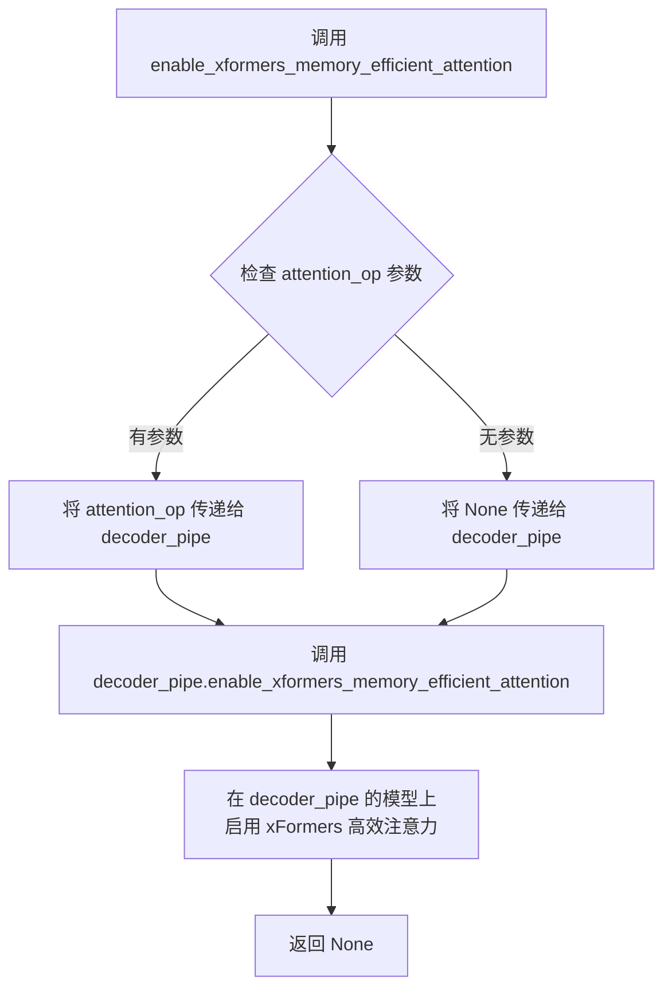
```mermaid
flowchart TD
    A[调用 enable_xformers_memory_efficient_attention] --> B{检查 attention_op 参数}
    B -->|有参数| C[将 attention_op 传递给 decoder_pipe]
    B -->|无参数| D[将 None 传递给 decoder_pipe]
    C --> E[调用 decoder_pipe.enable_xformers_memory_efficient_attention]
    D --> E
    E --> F[在 decoder_pipe 的模型上启用 xFormers 高效注意力]
    F --> G[返回 None]
```

#### 带注释源码

```python
def enable_xformers_memory_efficient_attention(self, attention_op: Callable | None = None):
    """
    启用 xFormers 内存高效注意力机制
    
    该方法允许在支持 xFormers 的 GPU 上使用更节省内存的注意力实现。
    xFormers 是一个高效的注意力库，可以显著减少注意力计算时的显存占用。
    
    Args:
        attention_op: 可选的注意力操作符。如果为 None，则使用 xFormers 的默认实现。
                      可以传入自定义的注意力操作符来替换默认实现。
    
    Returns:
        None: 此方法直接修改内部状态，不返回任何值。
              实际的注意力机制切换在 decoder_pipe 内部完成。
    """
    # 委托给内部的 decoder_pipe 执行实际的 xFormers 启用操作
    # decoder_pipe 是 KandinskyV22Img2ImgPipeline 实例
    # 该方法会遍历其内部的 UNet 模型并调用 enable_xformers_memory_efficient_attention
    self.decoder_pipe.enable_xformers_memory_efficient_attention(attention_op)
```


### `KandinskyV22Img2ImgCombinedPipeline.enable_model_cpu_offload`

启用模型CPU卸载功能，通过accelerate库将所有模型卸载到CPU，显著降低显存占用。该方法在保持较好性能的前提下，逐个将模型移动到GPU，仅在需要执行forward方法时加载，模型在下一个模型运行前保留在GPU上。

参数：

- `gpu_id`：`int | None`，可选参数，指定GPU设备ID，默认为None
- `device`：`torch.device | str`，可选参数，指定目标设备，默认为None

返回值：`None`，无返回值，该方法直接操作模型状态

#### 流程图

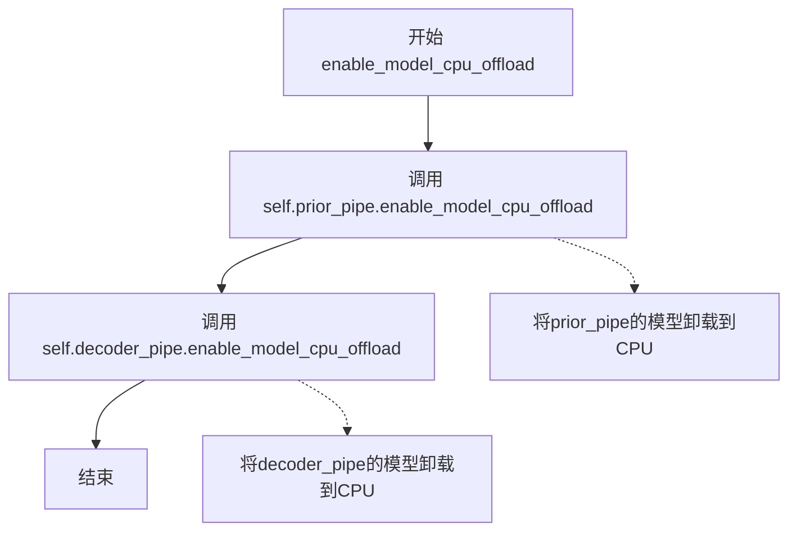
```mermaid
flowchart TD
    A[开始 enable_model_cpu_offload] --> B[调用 self.prior_pipe.enable_model_cpu_offload]
    B --> C[调用 self.decoder_pipe.enable_model_cpu_offload]
    C --> D[结束]
    
    B -.-> B1[将prior_pipe的模型卸载到CPU]
    C -.-> C1[将decoder_pipe的模型卸载到CPU]
```

#### 带注释源码

```
def enable_model_cpu_offload(self, gpu_id: int | None = None, device: torch.device | str = None):
    r"""
    Offloads all models to CPU using accelerate, reducing memory usage with a low impact on performance. Compared
    to `enable_sequential_cpu_offload`, this method moves one whole model at a time to the GPU when its `forward`
    method is called, and the model remains in GPU until the next model runs. Memory savings are lower than with
    `enable_sequential_cpu_offload`, but performance is much better due to the iterative execution of the `unet`.
    """
    # 调用prior_pipe的enable_model_cpu_offload方法
    # prior_pipe是KandinskyV22PriorPipeline实例，负责生成图像嵌入
    self.prior_pipe.enable_model_cpu_offload(gpu_id=gpu_id, device=device)
    
    # 调用decoder_pipe的enable_model_cpu_offload方法
    # decoder_pipe是KandinskyV22Img2ImgPipeline实例，负责从图像嵌入生成最终图像
    self.decoder_pipe.enable_model_cpu_offload(gpu_id=gpu_id, device=device)
```


### `KandinskyV22Img2ImgCombinedPipeline.enable_sequential_cpu_offload`

该方法用于将组合管线中的所有模型（prior_pipe 和 decoder_pipe）通过 accelerate 库依次卸载到 CPU，显著降低显存占用。启用后，模型的状态字典保存在 CPU，只有在特定子模块的 `forward` 方法被调用时才加载到 GPU。

参数：

- `gpu_id`：`int | None`，指定 GPU 设备 ID，默认为 None
- `device`：`torch.device | str`，目标设备，默认为 None

返回值：无返回值（`None`）

#### 流程图

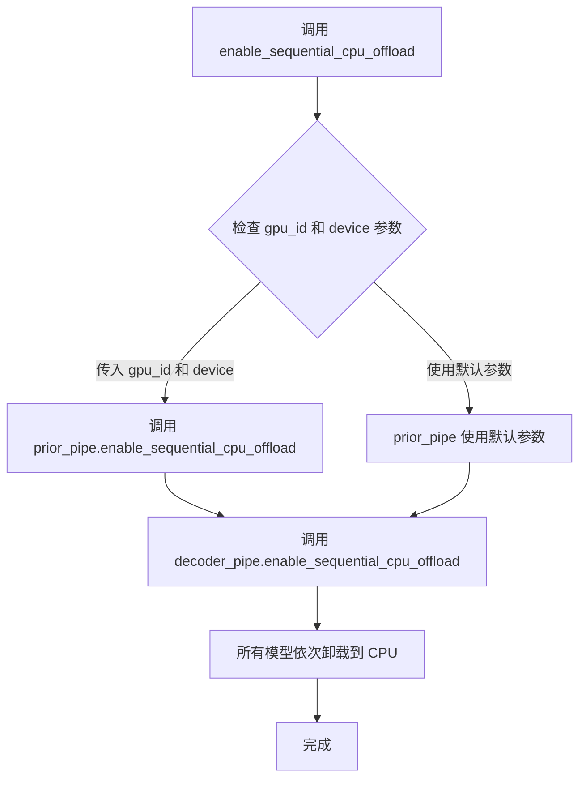
```mermaid
flowchart TD
    A[调用 enable_sequential_cpu_offload] --> B{检查 gpu_id 和 device 参数}
    B -->|传入 gpu_id 和 device| C[调用 prior_pipe.enable_sequential_cpu_offload]
    B -->|使用默认参数| D[prior_pipe 使用默认参数]
    C --> E[调用 decoder_pipe.enable_sequential_cpu_offload]
    D --> E
    E --> F[所有模型依次卸载到 CPU]
    F --> G[完成]
```

#### 带注释源码

```python
def enable_sequential_cpu_offload(self, gpu_id: int | None = None, device: torch.device | str = None):
    r"""
    Offloads all models to CPU using accelerate, significantly reducing memory usage. When called, unet,
    text_encoder, vae and safety checker have their state dicts saved to CPU and then are moved to a
    `torch.device('meta') and loaded to GPU only when their specific submodule has its `forward` method called.
    Note that offloading happens on a submodule basis. Memory savings are higher than with
    `enable_model_cpu_offload`, but performance is lower.
    """
    # 将 prior_pipe (KandinskyV22PriorPipeline) 的所有模型卸载到 CPU
    # 包括: prior_prior, prior_image_encoder, prior_text_encoder 等
    self.prior_pipe.enable_sequential_cpu_offload(gpu_id=gpu_id, device=device)
    
    # 将 decoder_pipe (KandinskyV22Img2ImgPipeline) 的所有模型卸载到 CPU
    # 包括: unet, movq 等
    self.decoder_pipe.enable_sequential_cpu_offload(gpu_id=gpu_id, device=device)
```


### `KandinskyV22Img2ImgCombinedPipeline.progress_bar`

该方法用于为组合管线设置进度条，它同时调用先验管线（prior_pipe）和解码器管线（decoder_pipe）的进度条方法，并在解码器管线上启用CPU offload功能。

参数：

- `iterable`：可迭代对象（Iterable | None），可选，要包装成进度条的可迭代对象
- `total`：整数（int | None），可选迭代项目的总数

返回值：`None`，该方法不返回任何值，仅执行副作用操作

#### 流程图

```mermaid
flowchart TD
    A[开始 progress_bar] --> B[调用 prior_pipe.progress_bar]
    B --> C[调用 decoder_pipe.progress_bar]
    C --> D[调用 decoder_pipe.enable_model_cpu_offload]
    D --> E[结束]
```

#### 带注释源码

```python
def progress_bar(self, iterable=None, total=None):
    """
    设置组合管线的进度条
    
    该方法同时为先验管线和解码器管线设置进度条，
    并在解码器管线上启用模型CPU卸载功能以优化内存使用。
    """
    # 调用先验管线的进度条方法，传入相同的iterable和total参数
    self.prior_pipe.progress_bar(iterable=iterable, total=total)
    
    # 调用解码器管线的进度条方法
    self.decoder_pipe.progress_bar(iterable=iterable, total=total)
    
    # 在解码器管线上启用模型CPU offload
    # 这会将模型参数卸载到CPU以节省GPU显存
    self.decoder_pipe.enable_model_cpu_offload()
```


### `KandinskyV22Img2ImgCombinedPipeline.set_progress_bar_config`

该方法是一个配置委托方法，用于将进度条配置同时应用到组合管道内部包含的两个子管道（先验管道 `prior_pipe` 和解码器管道 `decoder_pipe）上，以便在图像生成过程中统一管理进度条的显示行为。

参数：

- `**kwargs`：`Any`（可变关键字参数），用于传递进度条配置参数，如 `disable`、`desc`、`total` 等，这些参数会被直接转发给子管道的同名方法。

返回值：`None`，该方法没有显式返回值，隐式返回 `None`。

#### 流程图

```mermaid
graph TD
    A[开始: set_progress_bar_config] --> B[调用 self.prior_pipe.set_progress_bar_config]
    B --> C[调用 self.decoder_pipe.set_progress_bar_config]
    C --> D[结束]
    
    style A fill:#f9f,stroke:#333
    style B fill:#ff9,stroke:#333
    style C fill:#ff9,stroke:#333
    style D fill:#9f9,stroke:#333
```

#### 带注释源码

```python
def set_progress_bar_config(self, **kwargs):
    """
    设置进度条配置，应用于先验管道和解码器管道。

    该方法将用户传入的进度条配置参数(**kwargs)同时传递给内部维护的两个子管道：
    1. prior_pipe (先验管道) - 负责从文本生成图像嵌入向量
    2. decoder_pipe (解码器管道) - 负责从图像嵌入向量生成最终图像

    Args:
        **kwargs: 可变关键字参数，用于配置进度条的显示行为。
                  常见的参数包括：
                  - disable (bool): 是否禁用进度条
                  - desc (str): 进度条描述文本
                  - total (int): 进度条总步数
                  - leave (bool): 完成后是否保留进度条
                  - ncols (int): 进度条宽度
                  详细参数请参考 tqdm 库的进度条配置选项。
    """
    # 将配置应用到先验管道 (prior_pipe)
    # prior_pipe 负责将文本提示转换为图像嵌入向量
    self.prior_pipe.set_progress_bar_config(**kwargs)
    
    # 将配置应用到解码器管道 (decoder_pipe)
    # decoder_pipe 负责将图像嵌入向量解码为最终图像
    self.decoder_pipe.set_progress_bar_config(**kwargs)
```


### `KandinskyV22Img2ImgCombinedPipeline.__call__`

该方法是Kandinsky图像到图像（Image-to-Image）组合流水线的核心调用函数，通过先验管道（Prior Pipeline）将文本提示转换为图像嵌入，再利用解码器管道（Decoder Pipeline）根据输入图像和图像嵌入生成目标图像。支持多种参数自定义生成过程，包括推理步数、引导强度、图像尺寸等。

参数：

- `self`：类实例本身
- `prompt`：`str | list[str]`，用于引导图像生成的文本提示
- `image`：`torch.Tensor | PIL.Image.Image | list[torch.Tensor] | list[PIL.Image.Image]`，作为生成起点的输入图像
- `negative_prompt`：`str | list[str] | None`，可选，用于指定不希望出现的引导内容
- `num_inference_steps`：`int`，去噪步数，默认为100，步数越多通常图像质量越高但推理速度越慢
- `guidance_scale`：`float`，分类器自由扩散引导（CFG）比例，默认为4.0
- `strength`：`float`，图像转换强度，默认为0.3，值越大对原图的改变越多
- `num_images_per_prompt`：`int`，每个提示生成的图像数量，默认为1
- `height`：`int`，生成图像的高度像素值，默认为512
- `width`：`int`，生成图像的宽度像素值，默认为512
- `prior_guidance_scale`：`float`，先验管道的引导比例，默认为4.0
- `prior_num_inference_steps`：`int`，先验管道的推理步数，默认为25
- `generator`：`torch.Generator | list[torch.Generator] | None`，用于确保生成确定性的随机数生成器
- `latents`：`torch.Tensor | None`，预生成的噪声潜在向量，可用于自定义生成过程
- `output_type`：`str | None`，输出格式，可选"pil"、"np"或"pt"，默认为"pil"
- `callback`：`Callable[[int, int, torch.Tensor], None] | None`，每步推理调用的回调函数
- `callback_steps`：`int`，回调函数调用频率，默认为每步都调用
- `return_dict`：`bool`，是否返回`ImagePipelineOutput`，默认为True
- `prior_callback_on_step_end`：`Callable[[int, int], None] | None`，先验管道每步结束时的回调函数
- `prior_callback_on_step_end_tensor_inputs`：`list[str]`，先验管道回调的tensor输入列表，默认为["latents"]
- `callback_on_step_end`：`Callable[[int, int], None] | None`，解码器管道每步结束时的回调函数
- `callback_on_step_end_tensor_inputs`：`list[str]`，解码器管道回调的tensor输入列表，默认为["latents"]

返回值：`ImagePipelineOutput | tuple`，当`return_dict=True`时返回`ImagePipelineOutput`对象，包含生成的图像；否则返回元组

#### 流程图

```mermaid
flowchart TD
    A[开始 __call__] --> B[调用 prior_pipe 生成图像嵌入]
    B --> C{return_dict=False?}
    C -->|Yes| D[获取 image_embeds 和 negative_image_embeds]
    C -->|No| E[使用 return_dict 处理]
    D --> F[标准化 prompt 为列表]
    F --> G[标准化 image 为列表]
    G --> H{prompt 数量与 image_embeds 数量不匹配?}
    H -->|Yes| I[扩展 prompt 以匹配 image_embeds]
    H -->|No| J{image 数量与 image_embeds 数量不匹配?}
    I --> J
    J -->|Yes| K[扩展 image 以匹配 image_embeds]
    J -->|No| L[调用 decoder_pipe 生成最终图像]
    K --> L
    L --> M[调用 maybe_free_model_hooks 释放模型钩子]
    M --> N[返回 outputs]
    
    style A fill:#f9f,color:#000
    style L fill:#9ff,color:#000
    style N fill:#9f9,color:#000
```

#### 带注释源码

```python
@torch.no_grad()
@replace_example_docstring(IMAGE2IMAGE_EXAMPLE_DOC_STRING)
def __call__(
    self,
    prompt: str | list[str],
    image: torch.Tensor | PIL.Image.Image | list[torch.Tensor] | list[PIL.Image.Image],
    negative_prompt: str | list[str] | None = None,
    num_inference_steps: int = 100,
    guidance_scale: float = 4.0,
    strength: float = 0.3,
    num_images_per_prompt: int = 1,
    height: int = 512,
    width: int = 512,
    prior_guidance_scale: float = 4.0,
    prior_num_inference_steps: int = 25,
    generator: torch.Generator | list[torch.Generator] | None = None,
    latents: torch.Tensor | None = None,
    output_type: str | None = "pil",
    callback: Callable[[int, int, torch.Tensor], None] | None = None,
    callback_steps: int = 1,
    return_dict: bool = True,
    prior_callback_on_step_end: Callable[[int, int], None] | None = None,
    prior_callback_on_step_end_tensor_inputs: list[str] = ["latents"],
    callback_on_step_end: Callable[[int, int], None] | None = None,
    callback_on_step_end_tensor_inputs: list[str] = ["latents"],
):
    """
    Function invoked when calling the pipeline for generation.

    Args:
        prompt (`str` or `list[str]`):
            The prompt or prompts to guide the image generation.
        image (`torch.Tensor`, `PIL.Image.Image`, `np.ndarray`, `list[torch.Tensor]`, `list[PIL.Image.Image]`, or `list[np.ndarray]`):
            `Image`, or tensor representing an image batch, that will be used as the starting point for the
            process. Can also accept image latents as `image`, if passing latents directly, it will not be encoded
            again.
        negative_prompt (`str` or `list[str]`, *optional*):
            The prompt or prompts not to guide the image generation. Ignored when not using guidance (i.e., ignored
            if `guidance_scale` is less than `1`).
        num_images_per_prompt (`int`, *optional*, defaults to 1):
            The number of images to generate per prompt.
        guidance_scale (`float`, *optional*, defaults to 4.0):
            Guidance scale as defined in [Classifier-Free Diffusion
            Guidance](https://huggingface.co/papers/2207.12598). `guidance_scale` is defined as `w` of equation 2.
            of [Imagen Paper](https://huggingface.co/papers/2205.11487). Guidance scale is enabled by setting
            `guidance_scale > 1`. Higher guidance scale encourages to generate images that are closely linked to
            the text `prompt`, usually at the expense of lower image quality.
        strength (`float`, *optional*, defaults to 0.3):
            Conceptually, indicates how much to transform the reference `image`. Must be between 0 and 1. `image`
            will be used as a starting point, adding more noise to it the larger the `strength`. The number of
            denoising steps depends on the amount of noise initially added. When `strength` is 1, added noise will
            be maximum and the denoising process will run for the full number of iterations specified in
            `num_inference_steps`. A value of 1, therefore, essentially ignores `image`.
        num_inference_steps (`int`, *optional*, defaults to 100):
            The number of denoising steps. More denoising steps usually lead to a higher quality image at the
            expense of slower inference.
        height (`int`, *optional*, defaults to 512):
            The height in pixels of the generated image.
        width (`int`, *optional*, defaults to 512):
            The width in pixels of the generated image.
        prior_guidance_scale (`float`, *optional*, defaults to 4.0):
            Guidance scale as defined in [Classifier-Free Diffusion
            Guidance](https://huggingface.co/papers/2207.12598). `guidance_scale` is defined as `w` of equation 2.
            of [Imagen Paper](https://huggingface.co/papers/2205.11487). Guidance scale is enabled by setting
            `guidance_scale > 1`. Higher guidance scale encourages to generate images that are closely linked to
            the text `prompt`, usually at the expense of lower image quality.
        prior_num_inference_steps (`int`, *optional*, defaults to 100):
            The number of denoising steps. More denoising steps usually lead to a higher quality image at the
            expense of slower inference.
        generator (`torch.Generator` or `list[torch.Generator]`, *optional*):
            One or a list of [torch generator(s)](https://pytorch.org/docs/stable/generated/torch.Generator.html)
            to make generation deterministic.
        latents (`torch.Tensor`, *optional*):
            Pre-generated noisy latents, sampled from a Gaussian distribution, to be used as inputs for image
            generation. Can be used to tweak the same generation with different prompts. If not provided, a latents
            tensor will be generated by sampling using the supplied random `generator`.
        output_type (`str`, *optional*, defaults to `"pil"`):
            The output format of the generate image. Choose between: `"pil"` (`PIL.Image.Image`), `"np"`
            (`np.array`) or `"pt"` (`torch.Tensor`).
        callback (`Callable`, *optional*):
            A function that calls every `callback_steps` steps during inference. The function is called with the
            following arguments: `callback(step: int, timestep: int, latents: torch.Tensor)`.
        callback_steps (`int`, *optional*, defaults to 1):
            The frequency at which the `callback` function is called. If not specified, the callback is called at
            every step.
        return_dict (`bool`, *optional*, defaults to `True`):
            Whether or not to return a [`~pipelines.ImagePipelineOutput`] instead of a plain tuple.

    Examples:

    Returns:
        [`~pipelines.ImagePipelineOutput`] or `tuple`
    """
    # 第一阶段：调用先验管道（Prior Pipeline）生成图像嵌入
    # Prior Pipeline 负责将文本提示转换为图像嵌入向量
    prior_outputs = self.prior_pipe(
        prompt=prompt,
        negative_prompt=negative_prompt,
        num_images_per_prompt=num_images_per_prompt,
        num_inference_steps=prior_num_inference_steps,
        generator=generator,
        latents=latents,
        guidance_scale=prior_guidance_scale,
        output_type="pt",  # 强制输出为 PyTorch Tensor 格式
        return_dict=False,  # 使用元组返回以便于解包
        callback_on_step_end=prior_callback_on_step_end,
        callback_on_step_end_tensor_inputs=prior_callback_on_step_end_tensor_inputs,
    )
    # 从先验输出中解包得到正向和负向图像嵌入
    image_embeds = prior_outputs[0]
    negative_image_embeds = prior_outputs[1]

    # 标准化 prompt 为列表格式，确保后续处理的一致性
    prompt = [prompt] if not isinstance(prompt, (list, tuple)) else prompt
    # 标准化 image 为列表格式
    image = [image] if isinstance(image, PIL.Image.Image) else image

    # 如果 prompt 数量少于生成的嵌入数量且可以整除，则扩展 prompt
    if len(prompt) < image_embeds.shape[0] and image_embeds.shape[0] % len(prompt) == 0:
        prompt = (image_embeds.shape[0] // len(prompt)) * prompt

    # 如果 image 数量少于生成的嵌入数量且可以整除，则扩展 image
    if (
        isinstance(image, (list, tuple))
        and len(image) < image_embeds.shape[0]
        and image_embeds.shape[0] % len(image) == 0
    ):
        image = (image_embeds.shape[0] // len(image)) * image

    # 第二阶段：调用解码器管道（Decoder Pipeline）生成最终图像
    # Decoder Pipeline 接收图像嵌入和原始图像，进行图像到图像的转换
    outputs = self.decoder_pipe(
        image=image,
        image_embeds=image_embeds,
        negative_image_embeds=negative_image_embeds,
        width=width,
        height=height,
        strength=strength,
        num_inference_steps=num_inference_steps,
        generator=generator,
        guidance_scale=guidance_scale,
        output_type=output_type,
        callback=callback,
        callback_steps=callback_steps,
        return_dict=return_dict,
        callback_on_step_end=callback_on_step_end,
        callback_on_step_end_tensor_inputs=callback_on_step_end_tensor_inputs,
    )

    # 释放模型钩子，清理内存
    self.maybe_free_model_hooks()
    return outputs
```


### `KandinskyV22InpaintCombinedPipeline.__init__`

该方法是 KandinskyV22InpaintCombinedPipeline 类的构造函数，用于初始化图像修复（inpainting）组合管道。它接收所有必要的模型组件（UNet、调度器、MoVQ、先验模型等），通过 register_modules 注册到管道中，并创建先验管道（prior_pipe）和修复解码器管道（decoder_pipe）两个子管道实例，以支持完整的文本到图像修复流程。

参数：

- `self`：隐式参数，表示类实例本身
- `unet`：`UNet2DConditionModel`，条件 U-Net 架构，用于对图像嵌入进行去噪
- `scheduler`：`DDPMScheduler`，与 unet 结合使用生成图像潜变量的调度器
- `movq`：`VQModel`，MoVQ 解码器，用于从潜变量生成图像
- `prior_prior`：`PriorTransformer`，标准的 unCLIP 先验模型，用于从文本嵌入近似图像嵌入
- `prior_image_encoder`：`CLIPVisionModelWithProjection`，冻结的图像编码器
- `prior_text_encoder`：`CLIPTextModelWithProjection`，冻结的文本编码器
- `prior_tokenizer`：`CLIPTokenizer`，CLIP 标记器
- `prior_scheduler`：`UnCLIPScheduler`，与 prior 结合使用生成图像嵌入的调度器
- `prior_image_processor`：`CLIPImageProcessor`，用于预处理图像的 CLIP 图像处理器

返回值：无（`None`），构造函数不返回值，仅初始化对象状态

#### 流程图

```mermaid
flowchart TD
    A[开始 __init__] --> B[调用 super().__init__ 初始化基类]
    B --> C[调用 register_modules 注册所有模型组件]
    C --> D[创建 KandinskyV22PriorPipeline 实例 prior_pipe]
    D --> E[创建 KandinskyV22InpaintPipeline 实例 decoder_pipe]
    E --> F[结束 __init__]
    
    C --> C1[注册 unet]
    C --> C2[注册 scheduler]
    C --> C3[注册 movq]
    C --> C4[注册 prior_prior]
    C --> C5[注册 prior_image_encoder]
    C --> C6[注册 prior_text_encoder]
    C --> C7[注册 prior_tokenizer]
    C --> C8[注册 prior_scheduler]
    C --> C9[注册 prior_image_processor]
    
    D --> D1[传入 prior_prior]
    D --> D2[传入 prior_image_encoder]
    D --> D3[传入 prior_text_encoder]
    D --> D4[传入 prior_tokenizer]
    D --> D5[传入 prior_scheduler]
    D --> D6[传入 prior_image_processor]
    
    E --> E1[传入 unet]
    E --> E2[传入 scheduler]
    E --> E3[传入 movq]
```

#### 带注释源码

```python
def __init__(
    self,
    unet: UNet2DConditionModel,
    scheduler: DDPMScheduler,
    movq: VQModel,
    prior_prior: PriorTransformer,
    prior_image_encoder: CLIPVisionModelWithProjection,
    prior_text_encoder: CLIPTextModelWithProjection,
    prior_tokenizer: CLIPTokenizer,
    prior_scheduler: UnCLIPScheduler,
    prior_image_processor: CLIPImageProcessor,
):
    """
    初始化 KandinskyV22InpaintCombinedPipeline
    
    参数:
        unet: 条件 U-Net 模型，用于图像去噪
        scheduler: DDPM 调度器
        movq: MoVQ 变分自编码器模型
        prior_prior: Prior Transformer 模型
        prior_image_encoder: CLIP 图像编码器
        prior_text_encoder: CLIP 文本编码器
        prior_tokenizer: CLIP 标记器
        prior_scheduler: UnCLIP 调度器
        prior_image_processor: CLIP 图像处理器
    """
    # 调用父类 DiffusionPipeline 的初始化方法
    # 设置管道的基本属性和配置
    super().__init__()
    
    # 将所有模型组件注册到管道中
    # 这些模块将被打包并可通过管道属性访问
    self.register_modules(
        unet=unet,
        scheduler=scheduler,
        movq=movq,
        prior_prior=prior_prior,
        prior_image_encoder=prior_image_encoder,
        prior_text_encoder=prior_text_encoder,
        prior_tokenizer=prior_tokenizer,
        prior_scheduler=prior_scheduler,
        prior_image_processor=prior_image_processor,
    )
    
    # 创建先验管道实例 (KandinskyV22PriorPipeline)
    # 用于将文本提示转换为图像嵌入
    # 接收所有文本/图像编码相关的模型和处理器
    self.prior_pipe = KandinskyV22PriorPipeline(
        prior=prior_prior,
        image_encoder=prior_image_encoder,
        text_encoder=prior_text_encoder,
        tokenizer=prior_tokenizer,
        scheduler=prior_scheduler,
        image_processor=prior_image_processor,
    )
    
    # 创建修复解码器管道实例 (KandinskyV22InpaintPipeline)
    # 使用先验管道生成的图像嵌入进行图像修复
    # 只需要 unet, scheduler 和 movq 这三个核心组件
    self.decoder_pipe = KandinskyV22InpaintPipeline(
        unet=unet,
        scheduler=scheduler,
        movq=movq,
    )
```


### `KandinskyV22InpaintCombinedPipeline.enable_xformers_memory_efficient_attention`

该方法用于启用 xFormers 内存高效注意力机制，通过委托给内部解码器管道（decoder_pipe）来激活注意力优化，以减少显存占用并提升推理性能。

参数：

- `self`：`KandinskyV22InpaintCombinedPipeline` 实例本身（隐式参数）
- `attention_op`：`Callable | None`，可选的自定义注意力操作。如果为 `None`，则使用默认的 xFormers 注意力实现

返回值：`None`，该方法无返回值，仅执行副作用（修改内部管道状态）

#### 流程图

```mermaid
flowchart TD
    A[调用 enable_xformers_memory_efficient_attention] --> B{attention_op 是否为 None?}
    B -->|是| C[调用 decoder_pipe.enable_xformers_memory_efficient_attention with None]
    B -->|否| D[调用 decoder_pipe.enable_xformers_memory_efficient_attention with attention_op]
    C --> E[启用默认 xFormers 内存高效注意力]
    D --> E
    E --> F[方法返回]
```

#### 带注释源码

```python
def enable_xformers_memory_efficient_attention(self, attention_op: Callable | None = None):
    """
    启用 xFormers 内存高效注意力机制。
    
    该方法将调用委托给内部的 decoder_pipe (KandinskyV22InpaintPipeline)，
    以便在解码器模型上激活 xFormers 提供的内存优化注意力实现。
    xFormers 的注意力机制可以显著减少显存占用，特别适用于高分辨率图像生成场景。
    
    参数:
        attention_op: 可选的注意力操作。如果为 None，则使用 xFormers 的默认实现。
                      可以传入自定义的注意力实现来替代默认行为。
    
    返回:
        无返回值。该方法直接修改内部管道对象的状态。
    """
    # 将调用委托给解码器管道，由解码器管道实际执行 xFormers 注意力机制的启用
    self.decoder_pipe.enable_xformers_memory_efficient_attention(attention_op)
```


### `KandinskyV22InpaintCombinedPipeline.enable_sequential_cpu_offload`

该方法用于将所有模型（prior_pipe 和 decoder_pipe）卸载到 CPU 上，以显著减少内存使用。当调用时，模型的 state dict 会保存到 CPU，然后移动到 `torch.device('meta')` 并仅在特定子模块的 `forward` 方法被调用时才加载到 GPU。这种基于子模块的卸载方式比 `enable_model_cpu_offload` 能节省更多内存，但性能较低。

参数：

- `gpu_id`：`int | None`，可选，指定使用的 GPU ID
- `device`：`torch.device | str`，可选，指定设备

返回值：`None`，无返回值

#### 流程图

```mermaid
flowchart TD
    A[开始 enable_sequential_cpu_offload] --> B[调用 self.prior_pipe.enable_sequential_cpu_offload]
    B --> C[传入 gpu_id 和 device 参数]
    C --> D[调用 self.decoder_pipe.enable_sequential_cpu_offload]
    D --> E[传入相同的 gpu_id 和 device 参数]
    E --> F[结束]
```

#### 带注释源码

```python
def enable_sequential_cpu_offload(self, gpu_id: int | None = None, device: torch.device | str = None):
    r"""
    Offloads all models to CPU using accelerate, significantly reducing memory usage. When called, unet,
    text_encoder, vae and safety checker have their state dicts saved to CPU and then are moved to a
    `torch.device('meta') and loaded to GPU only when their specific submodule has its `forward` method called.
    Note that offloading happens on a submodule basis. Memory savings are higher than with
    `enable_model_cpu_offload`, but performance is lower.
    """
    # 将 prior_pipe 中的所有模型按子模块顺序卸载到 CPU
    self.prior_pipe.enable_sequential_cpu_offload(gpu_id=gpu_id, device=device)
    
    # 将 decoder_pipe 中的所有模型按子模块顺序卸载到 CPU
    self.decoder_pipe.enable_sequential_cpu_offload(gpu_id=gpu_id, device=device)
```


### `KandinskyV22InpaintCombinedPipeline.progress_bar`

该方法用于设置组合管线中先验管道（prior_pipe）和解码器管道（decoder_pipe）的进度条，并启用解码器模型的CPU卸载功能。它通过委托调用子管道的进度条方法来实现统一的进度显示，并在最后激活模型CPU卸载以优化内存使用。

参数：

- `iterable`：可选，要迭代的对象，用于进度条显示
- `total`：可选，整数，表示总迭代次数

返回值：`None`，无返回值

#### 流程图

```mermaid
flowchart TD
    A[开始 progress_bar] --> B[调用 self.prior_pipe.progress_bar]
    B --> C[传入 iterable 参数]
    C --> D[传入 total 参数]
    D --> E[调用 self.decoder_pipe.progress_bar]
    E --> F[传入相同的 iterable 参数]
    F --> G[传入相同的 total 参数]
    G --> H[调用 self.decoder_pipe.enable_model_cpu_offload]
    H --> I[结束]
    
    style A fill:#f9f,color:#000
    style I fill:#9f9,color:#000
```

#### 带注释源码

```python
def progress_bar(self, iterable=None, total=None):
    """
    设置进度条并启用模型CPU卸载
    
    该方法执行以下操作：
    1. 为先验管道设置进度条
    2. 为解码器管道设置进度条
    3. 启用解码器模型的CPU卸载功能以优化内存使用
    
    参数:
        iterable: 可选的迭代对象，用于显示进度
        total: 可选的总数，指定迭代的总步骤数
    
    返回:
        None
    """
    # 调用先验管道的进度条方法
    self.prior_pipe.progress_bar(iterable=iterable, total=total)
    
    # 调用解码器管道的进度条方法，使用相同的参数
    self.decoder_pipe.progress_bar(iterable=iterable, total=total)
    
    # 启用解码器模型的CPU卸载功能
    # 这可以显著减少内存使用，特别是在处理大型模型时
    self.decoder_pipe.enable_model_cpu_offload()
```


### `KandinskyV22InpaintCombinedPipeline.set_progress_bar_config`

该方法用于配置组合管道中先验管道和解码管道的进度条设置，通过将关键字参数转发给子管道来实现统一的进度条配置。

参数：

- `**kwargs`：可变关键字参数，接受任意数量的关键字参数（如 `disable`、`desc`、`total` 等），这些参数会被原样传递给先验管道和解码管道的 `set_progress_bar_config` 方法。

返回值：`None`，该方法没有返回值，仅执行副作用（配置子管道）。

#### 流程图

```mermaid
flowchart TD
    A[调用 set_progress_bar_config] --> B[调用 self.prior_pipe.set_progress_bar_config(**kwargs)]
    A --> C[调用 self.decoder_pipe.set_progress_bar_config(**kwargs)]
    B --> D[配置先验管道进度条]
    C --> E[配置解码管道进度条]
    D --> F[结束]
    E --> F
```

#### 带注释源码

```python
def set_progress_bar_config(self, **kwargs):
    """
    配置组合管道的进度条设置。
    
    该方法将进度条配置参数同时传递给先验管道（prior_pipe）和解码管道（decoder_pipe），
    以确保两者使用相同的进度条配置。
    
    参数:
        **kwargs: 关键字参数，会传递给子管道的 set_progress_bar_config 方法。
                  常见的参数包括：
                  - disable: 是否禁用进度条
                  - desc: 进度条描述文本
                  - total: 进度条总步数
                  - leave: 完成后是否保留进度条
                  - ncols: 进度条列数
                  - etc.
    
    返回值:
        None: 此方法不返回值，仅修改子管道的进度条配置。
    """
    # 将配置转发给先验管道，用于生成图像嵌入
    self.prior_pipe.set_progress_bar_config(**kwargs)
    
    # 将配置转发给解码管道，用于从嵌入生成最终图像
    self.decoder_pipe.set_progress_bar_config(**kwargs)
```


### `KandinskyV22InpaintCombinedPipeline.__call__`

该方法是Kandinsky 2.2图像修复（Inpainting）组合管道的核心调用方法。它首先通过Prior Pipeline将文本提示转换为图像嵌入，然后利用Decoder Pipeline结合原始图像、掩码图像和图像嵌入进行去噪修复，最终生成修复后的图像。

参数：

- `prompt`：`str | list[str]`，指导图像生成的文本提示或提示列表
- `image`：`torch.Tensor | PIL.Image.Image | list[torch.Tensor] | list[PIL.Image.Image]`，作为修复起点的原始图像或图像批次
- `mask_image`：`torch.Tensor | PIL.Image.Image | list[torch.Tensor] | list[PIL.Image.Image]`，用于遮罩图像的掩码，白色像素将被重绘，黑色像素将被保留
- `negative_prompt`：`str | list[str] | None`，可选的负面提示，用于指导不应出现的图像内容
- `num_inference_steps`：`int`，默认为100，去噪迭代次数，越多通常图像质量越高但推理越慢
- `guidance_scale`：`float`，默认为4.0，Classifier-Free Diffusion Guidance的引导尺度
- `num_images_per_prompt`：`int`，默认为1，每个提示生成的图像数量
- `height`：`int`，默认为512，生成图像的高度（像素）
- `width`：`int`，默认为512，生成图像的宽度（像素）
- `prior_guidance_scale`：`float`，默认为4.0，Prior管道的引导尺度
- `prior_num_inference_steps`：`int`，默认为25，Prior管道的去噪步骤数
- `generator`：`torch.Generator | list[torch.Generator] | None`，可选的随机生成器，用于实现确定性生成
- `latents`：`torch.Tensor | None`，预生成的噪声潜在向量，可用于通过不同提示微调相同生成
- `output_type`：`str | None`，默认为"pil"，生成图像的输出格式，可选"pil"、"np"或"pt"
- `return_dict`：`bool`，默认为True，是否返回ImagePipelineOutput而非普通元组
- `prior_callback_on_step_end`：`Callable | None`，Prior管道每步结束时调用的回调函数
- `prior_callback_on_step_end_tensor_inputs`：`list[str]`，默认为["latents"]，传递给Prior回调的tensor输入列表
- `callback_on_step_end`：`Callable | None`，Decoder管道每步结束时调用的回调函数
- `callback_on_step_end_tensor_inputs`：`list[str]`，默认为["latents"]，传递给Decoder回调的tensor输入列表
- `**kwargs`：其他可选参数，会传递给Prior管道

返回值：`ImagePipelineOutput` 或 `tuple`，包含生成的图像和可选的元数据

#### 流程图

```mermaid
flowchart TD
    A[开始 __call__] --> B{检查 prior_callback 参数}
    B -->|存在| C[提取并转换为 prior_kwargs]
    B -->|不存在| D[创建空 prior_kwargs]
    C --> E[调用 prior_pipe 生成 image_embeds]
    D --> E
    E --> F[从 prior_outputs 提取 image_embeds 和 negative_image_embeds]
    F --> G[标准化 prompt/image/mask_image 为列表]
    H{prompt 数量小于 image_embeds 数量}
    H -->|是| I[扩展 prompt 以匹配 image_embeds]
    H -->|否| J{image 数量小于 image_embeds 数量}
    I --> J
    J -->|是| K[扩展 image 以匹配 image_embeds]
    J -->|否| L{mask_image 数量小于 image_embeds 数量}
    K --> L
    L -->|是| M[扩展 mask_image 以匹配 image_embeds]
    L -->|否| N[调用 decoder_pipe 生成修复图像]
    M --> N
    N --> O[调用 maybe_free_model_hooks 释放模型资源]
    O --> P{return_dict 为 True}
    P -->|是| Q[返回 ImagePipelineOutput]
    P -->|否| R[返回元组]
    Q --> S[结束]
    R --> S
```

#### 带注释源码

```python
@torch.no_grad()
@replace_example_docstring(INPAINT_EXAMPLE_DOC_STRING)
def __call__(
    self,
    prompt: str | list[str],
    image: torch.Tensor | PIL.Image.Image | list[torch.Tensor] | list[PIL.Image.Image],
    mask_image: torch.Tensor | PIL.Image.Image | list[torch.Tensor] | list[PIL.Image.Image],
    negative_prompt: str | list[str] | None = None,
    num_inference_steps: int = 100,
    guidance_scale: float = 4.0,
    num_images_per_prompt: int = 1,
    height: int = 512,
    width: int = 512,
    prior_guidance_scale: float = 4.0,
    prior_num_inference_steps: int = 25,
    generator: torch.Generator | list[torch.Generator] | None = None,
    latents: torch.Tensor | None = None,
    output_type: str | None = "pil",
    return_dict: bool = True,
    prior_callback_on_step_end: Callable[[int, int], None] | None = None,
    prior_callback_on_step_end_tensor_inputs: list[str] = ["latents"],
    callback_on_step_end: Callable[[int, int], None] | None = None,
    callback_on_step_end_tensor_inputs: list[str] = ["latents"],
    **kwargs,
):
    """
    Function invoked when calling the pipeline for generation.
    
    该方法是KandinskyV22InpaintCombinedPipeline的主入口点，用于执行图像修复任务。
    它首先通过Prior管道将文本提示转换为图像嵌入，然后使用Decoder管道
    结合原始图像和掩码进行修复生成。
    """
    # 初始化prior_kwargs字典，用于存储旧的回调参数
    prior_kwargs = {}
    # 检查是否使用了已废弃的prior_callback参数
    if kwargs.get("prior_callback", None) is not None:
        # 将旧参数提取到prior_kwargs中
        prior_kwargs["callback"] = kwargs.pop("prior_callback")
        # 发出废弃警告，建议使用新的prior_callback_on_step_end
        deprecate(
            "prior_callback",
            "1.0.0",
            "Passing `prior_callback` as an input argument to `__call__` is deprecated, consider use `prior_callback_on_step_end`",
        )
    # 检查是否使用了已废弃的prior_callback_steps参数
    if kwargs.get("prior_callback_steps", None) is not None:
        deprecate(
            "prior_callback_steps",
            "1.0.0",
            "Passing `prior_callback_steps` as an input argument to `__call__` is deprecated, consider use `prior_callback_on_step_end`",
        )
        prior_kwargs["callback_steps"] = kwargs.pop("prior_callback_steps")

    # 调用Prior管道生成图像嵌入
    # Prior管道负责将文本提示转换为图像嵌入向量
    prior_outputs = self.prior_pipe(
        prompt=prompt,
        negative_prompt=negative_prompt,
        num_images_per_prompt=num_images_per_prompt,
        num_inference_steps=prior_num_inference_steps,
        generator=generator,
        latents=latents,
        guidance_scale=prior_guidance_scale,
        output_type="pt",  # 输出为PyTorch张量格式
        return_dict=False,
        callback_on_step_end=prior_callback_on_step_end,
        callback_on_step_end_tensor_inputs=prior_callback_on_step_end_tensor_inputs,
        **prior_kwargs,  # 传递已废弃的回调参数（如果存在）
    )
    # 从Prior输出中提取图像嵌入和负面图像嵌入
    image_embeds = prior_outputs[0]
    negative_image_embeds = prior_outputs[1]

    # 标准化提示、图像和掩码为列表格式以保持一致性
    prompt = [prompt] if not isinstance(prompt, (list, tuple)) else prompt
    image = [image] if isinstance(image, PIL.Image.Image) else image
    mask_image = [mask_image] if isinstance(mask_image, PIL.Image.Image) else mask_image

    # 如果提示数量少于生成的嵌入数量，扩展提示列表以匹配
    if len(prompt) < image_embeds.shape[0] and image_embeds.shape[0] % len(prompt) == 0:
        prompt = (image_embeds.shape[0] // len(prompt)) * prompt

    # 如果图像数量少于嵌入数量，扩展图像列表
    if (
        isinstance(image, (list, tuple))
        and len(image) < image_embeds.shape[0]
        and image_embeds.shape[0] % len(image) == 0
    ):
        image = (image_embeds.shape[0] // len(image)) * image

    # 如果掩码数量少于嵌入数量，扩展掩码列表
    if (
        isinstance(mask_image, (list, tuple))
        and len(mask_image) < image_embeds.shape[0]
        and image_embeds.shape[0] % len(mask_image) == 0
    ):
        mask_image = (image_embeds.shape[0] // len(mask_image)) * mask_image

    # 调用Decoder管道执行实际的图像修复生成
    # Decoder使用图像嵌入、原始图像和掩码进行去噪
    outputs = self.decoder_pipe(
        image=image,
        mask_image=mask_image,
        image_embeds=image_embeds,
        negative_image_embeds=negative_image_embeds,
        width=width,
        height=height,
        num_inference_steps=num_inference_steps,
        generator=generator,
        guidance_scale=guidance_scale,
        output_type=output_type,
        return_dict=return_dict,
        callback_on_step_end=callback_on_step_end,
        callback_on_step_end_tensor_inputs=callback_on_step_end_tensor_inputs,
        **kwargs,
    )
    
    # 释放不再需要的模型钩子以释放GPU内存
    self.maybe_free_model_hooks()

    # 返回生成结果
    return outputs
```

## 关键组件


### KandinskyV22CombinedPipeline

文本到图像组合管道，封装了先验管道和解码器管道，支持从文本提示生成图像。

### KandinskyV22Img2ImgCombinedPipeline

图像到图像组合管道，封装了先验管道和img2img解码器管道，支持基于输入图像和文本提示进行图像转换。

### KandinskyV22InpaintCombinedPipeline

图像修复组合管道，封装了先验管道和inpainting解码器管道，支持基于输入图像、掩码和文本提示进行区域重绘。

### Prior管道 (KandinskyV22PriorPipeline)

负责将文本嵌入转换为图像嵌入的先验模型，使用unCLIP方法生成图像条件向量。

### Decoder管道 (KandinskyV22Pipeline/KandinskyV22Img2ImgPipeline/KandinskyV22InpaintPipeline)

负责根据图像嵌入生成最终图像的解码器，包含UNet2DConditionModel和VQModel。

### PriorTransformer

unCLIP先验模型，用于从文本嵌入预测图像嵌入。

### UNet2DConditionModel

条件U-Net架构，用于去噪图像潜在表示。

### VQModel

MoVQ解码器，用于将潜在表示解码为最终图像。

### CLIPTextModelWithProjection

冻结的文本编码器，用于将文本转换为嵌入向量。

### CLIPVisionModelWithProjection

冻结的图像编码器，用于将图像转换为嵌入向量。

### CLIPTokenizer

文本分词器，用于将文本转换为token ID序列。

### CLIPImageProcessor

CLIP图像预处理器，用于预处理输入图像。

### DDPMScheduler

去噪扩散概率模型调度器，用于控制扩散过程。

### UnCLIPScheduler

unCLIP专用调度器，用于先验模型的噪声调度。

### CPU卸载机制

enable_sequential_cpu_offload和enable_model_cpu_offload方法，支持将模型卸载到CPU以节省显存。

### xFormers高效注意力

enable_xformers_memory_efficient_attention方法，启用xFormers的高效注意力实现以提升性能。

### 回调系统

callback_on_step_end和prior_callback_on_step_end机制，允许在推理步骤结束时执行自定义回调函数。

### 多提示批处理

支持将提示列表扩展以匹配生成的图像数量，实现批量图像生成。

## 问题及建议


### 已知问题

-   **严重代码重复**：三个组合管道类（KandinskyV22CombinedPipeline、KandinskyV22Img2ImgCombinedPipeline、KandinskyV22InpaintCombinedPipeline）存在大量重复代码，包括`__init__`方法、内存管理方法（`enable_xformers_memory_efficient_attention`、`enable_sequential_cpu_offload`）、进度条方法以及几乎相同的文档字符串。
-   **方法实现不一致**：`KandinskyV22Img2ImgCombinedPipeline`实现了`enable_model_cpu_offload`方法，但另外两个类没有实现，导致API不一致。
-   **progress_bar方法逻辑错误**：在三个类的`progress_bar`方法中都调用了`self.decoder_pipe.enable_model_cpu_offload()`，这不应该在进度条方法中执行，且该方法没有返回迭代器对象。
-   **参数处理重复**：在`__call__`方法中，prompt、image、mask_image的列表转换和复制逻辑重复出现多次。
-   **文档字符串冗余**：Args部分重复描述`guidance_scale`和`num_inference_steps`参数（同时描述了prior和decoder的参数）。
-   **缺失的类型注解和验证**：某些参数（如`kwargs`）缺乏明确的类型约束和验证逻辑。
-   **回调参数处理不一致**：`KandinskyV22InpaintCombinedPipeline`使用deprecated方式处理prior_callback，而其他类使用新的`prior_callback_on_step_end`参数。

### 优化建议

-   **抽象基类**：创建一个基类（如`KandinskyV22BasePipeline`）封装共同的初始化逻辑、内存管理方法和进度条功能，消除代码重复。
-   **修复progress_bar方法**：移除其中的`enable_model_cpu_offload`调用，并正确返回迭代器对象。
-   **统一内存管理接口**：确保所有三个类实现一致的`enable_model_cpu_offload`方法。
-   **提取公共参数处理逻辑**：将prompt、image等参数的列表转换和复制逻辑抽取为独立方法。
-   **简化文档字符串**：使用交叉引用或统一描述来避免Args部分的重复说明。
-   **添加参数验证**：在`__call__`方法开始时对关键参数（如`strength`、`guidance_scale`的范围）进行验证。
-   **移除废弃代码**：清理`prior_callback`和`prior_callback_steps`的处理逻辑，统一使用新的回调接口。

## 其它


### 一段话描述

KandinskyV22CombinedPipeline 是一个组合流水线，用于通过文本提示生成图像。它结合了 PriorPipeline（用于从文本生成图像嵌入）和 DecoderPipeline（用于从图像嵌入生成最终图像），支持文本到图像、图像到图像和修复三种生成模式。

### 文件的整体运行流程

该文件定义了三个组合流水线类，分别用于文本到图像、图像到图像和修复任务。整体流程为：
1. 接收用户输入（提示词、图像、掩码等）
2. 首先调用 prior_pipe 生成图像嵌入和负向嵌入
3. 将嵌入传递给 decoder_pipe 生成最终图像
4. 返回生成的图像或图像批次

### 类结构

#### KandinskyV22CombinedPipeline 类

**类字段:**
- `unet`: UNet2DConditionModel - 用于去噪的U-Net模型
- `scheduler`: DDPMScheduler - 调度器
- `movq`: VQModel - MoVQ解码器
- `prior_prior`: PriorTransformer - unCLIP先验模型
- `prior_image_encoder`: CLIPVisionModelWithProjection - 图像编码器
- `prior_text_encoder`: CLIPTextModelWithProjection - 文本编码器
- `prior_tokenizer`: CLIPTokenizer - 文本分词器
- `prior_scheduler`: UnCLIPScheduler - 先验调度器
- `prior_image_processor`: CLIPImageProcessor - 图像处理器
- `prior_pipe`: KandinskyV22PriorPipeline - 先验流水线实例
- `decoder_pipe`: KandinskyV22Pipeline - 解码器流水线实例

**类方法:**
- `__init__`: 初始化组合流水线
- `enable_xformers_memory_efficient_attention`: 启用xFormers内存高效注意力
- `enable_sequential_cpu_offload`: 启用顺序CPU卸载
- `progress_bar`: 进度条
- `set_progress_bar_config`: 设置进度条配置
- `__call__`: 主生成方法

#### KandinskyV22Img2ImgCombinedPipeline 类

**类字段:**
- 与KandinskyV22CombinedPipeline相同的字段，加上 img2img 特定的 decoder_pipe

**类方法:**
- `__init__`: 初始化组合流水线
- `enable_xformers_memory_efficient_attention`: 启用xFormers内存高效注意力
- `enable_model_cpu_offload`: 启用模型CPU卸载
- `enable_sequential_cpu_offload`: 启用顺序CPU卸载
- `progress_bar`: 进度条
- `set_progress_bar_config`: 设置进度条配置
- `__call__`: 主生成方法（支持图像到图像）

#### KandinskyV22InpaintCombinedPipeline 类

**类字段:**
- 与KandinskyV22CombinedPipeline相同的字段，加上 inpainting 特定的 decoder_pipe

**类方法:**
- `__init__`: 初始化组合流水线
- `enable_xformers_memory_efficient_attention`: 启用xFormers内存高效注意力
- `enable_sequential_cpu_offload`: 启用顺序CPU卸载
- `progress_bar`: 进度条
- `set_progress_bar_config`: 设置进度条配置
- `__call__`: 主生成方法（支持修复）

### 全局变量

- `logger`: logging.get_logger - 模块日志记录器
- `TEXT2IMAGE_EXAMPLE_DOC_STRING`: 文本到图像示例文档字符串
- `IMAGE2IMAGE_EXAMPLE_DOC_STRING`: 图像到图像示例文档字符串
- `INPAINT_EXAMPLE_DOC_STRING`: 修复示例文档字符串

### 类方法详细信息

#### KandinskyV22CombinedPipeline.__call__

**参数:**
- `prompt`: str | list[str] - 引导图像生成的提示
- `negative_prompt`: str | list[str] | None - 不引导图像生成的提示
- `num_inference_steps`: int = 100 - 去噪步数
- `guidance_scale`: float = 4.0 - 引导尺度
- `num_images_per_prompt`: int = 1 - 每个提示生成的图像数量
- `height`: int = 512 - 生成图像的高度
- `width`: int = 512 - 生成图像的宽度
- `prior_guidance_scale`: float = 4.0 - 先验引导尺度
- `prior_num_inference_steps`: int = 25 - 先验去噪步数
- `generator`: torch.Generator | None - 随机生成器
- `latents`: torch.Tensor | None - 预生成的噪声潜在向量
- `output_type`: str = "pil" - 输出格式
- `callback`: Callable | None - 回调函数
- `callback_steps`: int = 1 - 回调步数
- `return_dict`: bool = True - 是否返回字典
- `prior_callback_on_step_end`: Callable | None - 先验步骤结束回调
- `prior_callback_on_step_end_tensor_inputs`: list[str] = ["latents"] - 先验回调张量输入
- `callback_on_step_end`: Callable | None - 步骤结束回调
- `callback_on_step_end_tensor_inputs`: list[str] = ["latents"] - 回调张量输入

**返回值类型:**
- `ImagePipelineOutput` 或 `tuple`

**Mermaid流程图:**
```mermaid
flowchart TD
    A[开始] --> B[调用prior_pipe生成图像嵌入]
    B --> C[提取image_embeds和negative_image_embeds]
    C --> D[处理prompt列表]
    D --> E[调用decoder_pipe生成最终图像]
    E --> F[释放模型钩子]
    F --> G[返回输出]
```

**带注释源码:**
```python
@torch.no_grad()
@replace_example_docstring(TEXT2IMAGE_EXAMPLE_DOC_STRING)
def __call__(
    self,
    prompt: str | list[str],
    negative_prompt: str | list[str] | None = None,
    # ... 其他参数
):
    # 第一阶段：调用先验管道生成图像嵌入
    prior_outputs = self.prior_pipe(
        prompt=prompt,
        negative_prompt=negative_prompt,
        num_images_per_prompt=num_images_per_prompt,
        num_inference_steps=prior_num_inference_steps,
        generator=generator,
        latents=latents,
        guidance_scale=prior_guidance_scale,
        output_type="pt",
        return_dict=False,
        callback_on_step_end=prior_callback_on_step_end,
        callback_on_step_end_tensor_inputs=prior_callback_on_step_end_tensor_inputs,
    )
    # 提取图像嵌入和负向图像嵌入
    image_embeds = prior_outputs[0]
    negative_image_embeds = prior_outputs[1]

    # 处理提示列表
    prompt = [prompt] if not isinstance(prompt, (list, tuple)) else prompt

    # 如果提示数量少于图像嵌入数量且可以整除，则扩展提示
    if len(prompt) < image_embeds.shape[0] and image_embeds.shape[0] % len(prompt) == 0:
        prompt = (image_embeds.shape[0] // len(prompt)) * prompt

    # 第二阶段：调用解码器管道生成最终图像
    outputs = self.decoder_pipe(
        image_embeds=image_embeds,
        negative_image_embeds=negative_image_embeds,
        width=width,
        height=height,
        num_inference_steps=num_inference_steps,
        generator=generator,
        guidance_scale=guidance_scale,
        output_type=output_type,
        callback=callback,
        callback_steps=callback_steps,
        return_dict=return_dict,
        callback_on_step_end=callback_on_step_end,
        callback_on_step_end_tensor_inputs=callback_on_step_end_tensor_inputs,
    )
    # 释放模型钩子
    self.maybe_free_model_hooks()

    return outputs
```

### 关键组件信息

- **PriorPipeline**: 负责从文本提示生成图像嵌入，使用CLIP模型和PriorTransformer
- **DecoderPipeline**: 负责从图像嵌入生成最终图像，使用UNet2DConditionModel和VQModel
- **DiffusionPipeline基类**: 提供通用的流水线功能，如模型加载、保存、设备管理
- **调度器系统**: DDPMScheduler和UnCLIPScheduler用于控制扩散过程

### 设计目标与约束

- **设计目标**: 提供统一的接口来执行文本到图像、图像到图像和修复任务
- **约束**: 
  - 需要同时加载先验模型和解码器模型，内存消耗较大
  - 支持CPU卸载和xFormers优化以适应不同硬件环境
  - 必须保持与DiffusionPipeline基类的兼容性

### 错误处理与异常设计

- 使用 `deprecate` 函数警告废弃的参数用法
- 通过 `maybe_free_model_hooks` 自动释放模型钩子
- 回调机制允许用户在生成过程中处理异常情况

### 数据流与状态机

- **状态**: 初始化状态 -> 先验推理状态 -> 解码器推理状态 -> 完成状态
- **数据流**: 
  - 文本输入 → Tokenization → 文本编码 → 先验模型 → 图像嵌入
  - 图像嵌入 → UNet去噪 → VQ解码 → 最终图像输出

### 外部依赖与接口契约

- **依赖库**: transformers, PIL, torch, diffusers
- **模型依赖**: 
  - CLIPTextModelWithProjection
  - CLIPVisionModelWithProjection
  - CLIPTokenizer
  - PriorTransformer
  - UNet2DConditionModel
  - VQModel
- **调度器依赖**: DDPMScheduler, UnCLIPScheduler

### 潜在的技术债务或优化空间

1. **代码重复**: 三个组合流水线类有大量重复代码，可以考虑使用基类或混入类来提取公共逻辑
2. **参数一致性**: prior_guidance_scale 和 guidance_scale 参数名称相似但功能不同，容易混淆
3. **内存优化**: 虽然提供了多种CPU卸载选项，但组合流水线的默认内存占用仍然较高
4. **错误处理**: 缺少对无效输入参数（如负的num_inference_steps）的验证
5. **文档**: 部分复杂参数（如callback_on_step_end_tensor_inputs）的使用说明不够清晰

### 潜在的技术债务或优化空间

1. **代码重复**: 三个组合流水线类（KandinskyV22CombinedPipeline、KandinskyV22Img2ImgCombinedPipeline、KandinskyV22InpaintCombinedPipeline）存在大量重复代码，包括初始化、方法定义等。可以考虑创建一个基类来共享公共逻辑。

2. **参数一致性**: `prior_guidance_scale` 和 `guidance_scale` 这两个参数名称相似但功能不同，容易导致用户混淆。应该考虑更清晰的命名或更好的文档说明。

3. **内存优化**: 虽然提供了多种CPU卸载选项（enable_model_cpu_offload、enable_sequential_cpu_offload、enable_xformers_memory_efficient_attention），但组合流水线同时加载先验模型和解码器模型，默认内存占用仍然较高。

4. **错误处理**: 缺少对无效输入参数的验证，例如：
   - 负的 num_inference_steps
   - 无效的 output_type
   - 不匹配的图像和掩码尺寸

5. **文档完善**: 部分复杂参数（如 callback_on_step_end_tensor_inputs）的使用说明不够清晰，用户可能不清楚如何正确使用这些回调机制。

6. **类型提示**: 部分方法缺少完整的类型提示，例如 __call__ 方法的返回值类型可以更精确。

7. **废弃参数处理**: InpaintCombinedPipeline 的 __call__ 方法中处理废弃参数的方式较为复杂，可以简化。

    