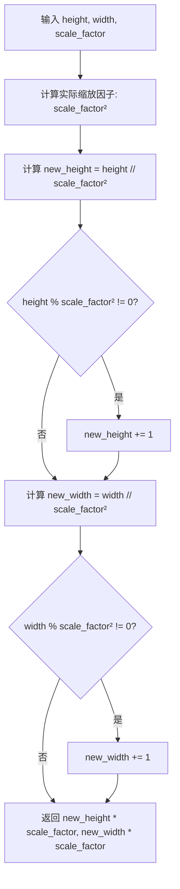
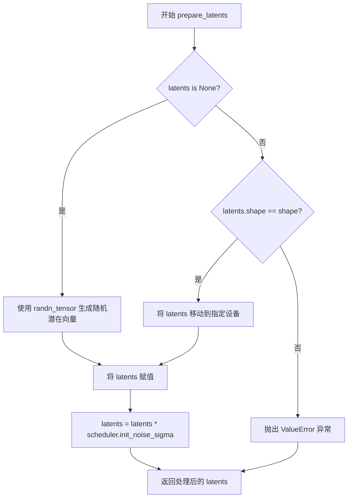

# `diffusers\src\diffusers\pipelines\kandinsky2_2\pipeline_kandinsky2_2_controlnet.py` 详细设计文档

KandinskyV22ControlnetPipeline是一个基于扩散模型的文本到图像生成Pipeline，它使用ControlNet架构结合CLIP图像嵌入和深度图hint来条件化图像生成过程，通过UNet2DConditionModel进行去噪操作，最后使用MoVQ解码器将潜在变量解码为实际图像。

## 整体流程

```mermaid
graph TD
A[开始] --> B[接收输入参数]
B --> C{检查guidance_scale > 1.0}
C --> D[设置调度器时间步]
D --> E[创建初始潜在变量]
E --> F[循环遍历时间步]
F --> G[扩展潜在变量（如果使用CFG）]
G --> H[调用UNet预测噪声]
H --> I[应用Classifier-Free Guidance]
I --> J[调度器计算上一步]
J --> K{是否执行回调?}
K -- 是 --> L[执行callback函数]
K -- 否 --> M{是否使用XLA?}
M -- 是 --> N[xm.mark_step()]
M -- 否 --> F
F --> O[所有时间步完成]
O --> P[使用MoVQ解码潜在变量]
P --> Q[后处理图像]
Q --> R[返回ImagePipelineOutput]
```

## 类结构

```
DiffusionPipeline (基类)
└── KandinskyV22ControlnetPipeline
    ├── unet: UNet2DConditionModel
    ├── scheduler: DDPMScheduler
    └── movq: VQModel
```

## 全局变量及字段


### `XLA_AVAILABLE`
    
标识PyTorch XLA是否可用

类型：`bool`
    


### `logger`
    
用于记录管道运行过程中的日志信息

类型：`logging.Logger`
    


### `EXAMPLE_DOC_STRING`
    
包含KandinskyV22ControlnetPipeline使用示例的文档字符串

类型：`str`
    


### `KandinskyV22ControlnetPipeline.model_cpu_offload_seq`
    
模型CPU卸载顺序配置

类型：`str`
    


### `KandinskyV22ControlnetPipeline.unet`
    
条件U-Net模型，用于去噪图像潜在变量

类型：`UNet2DConditionModel`
    


### `KandinskyV22ControlnetPipeline.scheduler`
    
噪声调度器

类型：`DDPMScheduler`
    


### `KandinskyV22ControlnetPipeline.movq`
    
MoVQ解码器，用于从潜在变量生成图像

类型：`VQModel`
    


### `KandinskyV22ControlnetPipeline.movq_scale_factor`
    
MoVQ的缩放因子

类型：`int`
    
    

## 全局函数及方法


### `downscale_height_and_width`

该函数用于计算图像经过VQ模型下采样后的目标高度和宽度，确保输出尺寸是输入尺寸以scale_factor的平方为倍数的最小对齐值（向上取整），常用于计算潜空间(latents)的分辨率。

参数：

- `height`：`int`，原始输入图像的高度（像素）
- `width`：`int`，原始输入图像的宽度（像素）
- `scale_factor`：`int`，缩放因子，默认为8，对应VAE的下采样倍数

返回值：`tuple[int, int]`，返回计算后的目标高度和宽度

#### 流程图



#### 带注释源码

```python
# Copied from diffusers.pipelines.kandinsky2_2.pipeline_kandinsky2_2.downscale_height_and_width
def downscale_height_and_width(height, width, scale_factor=8):
    """
    计算缩放后的高度和宽度，确保尺寸对齐到最小倍数
    
    参数:
        height: 原始高度
        width: 原始宽度  
        scale_factor: 缩放因子，默认为8（VAE的默认下采样率）
    
    返回:
        缩放后的 (height, width) 元组
    """
    # 计算实际的下采样倍数的平方 (scale_factor²)
    # 例如 scale_factor=8 时，实际缩放倍数为 64
    new_height = height // scale_factor**2
    
    # 如果高度不能被整除，向上取整确保有足够的空间
    if height % scale_factor**2 != 0:
        new_height += 1
    
    # 对宽度进行相同的计算
    new_width = width // scale_factor**2
    if width % scale_factor**2 != 0:
        new_width += 1
    
    # 最终尺寸需要乘以 scale_factor 以恢复到像素空间
    # 因为内部计算是在 reduced pixel space 中进行的
    return new_height * scale_factor, new_width * scale_factor
```


### `KandinskyV22ControlnetPipeline.__init__`

这是 Kandinsky V2.2 控制网络管道的初始化方法，负责接收并注册 UNet、调度器和 MoVQ 模型，同时计算 MoVQ 的缩放因子。

参数：

- `self`：隐式参数，类的实例本身
- `unet`：`UNet2DConditionModel`，条件 U-Net 架构，用于去噪图像嵌入
- `scheduler`：`DDPMScheduler`，与 `unet` 结合使用以生成图像潜在变量的调度器
- `movq`：`VQModel`，MoVQ 解码器，用于从潜在变量生成图像

返回值：`None`，构造函数无返回值

#### 流程图

```mermaid
flowchart TD
    A[开始 __init__] --> B[调用 super().__init__ 初始化基类]
    B --> C[调用 register_modules 注册 unet, scheduler, movq 三个模块]
    C --> D[计算 movq_scale_factor = 2^(len(movq.config.block_out_channels) - 1)]
    D --> E[结束 __init__]
```

#### 带注释源码

```python
def __init__(
    self,
    unet: UNet2DConditionModel,
    scheduler: DDPMScheduler,
    movq: VQModel,
):
    """
    初始化 KandinskyV22ControlnetPipeline
    
    参数:
        unet: 条件 U-Net 模型，用于去噪图像嵌入
        scheduler: DDPM 调度器，用于生成图像潜在变量
        movq: MoVQ 解码器模型，用于将潜在变量解码为图像
    """
    # 调用父类 DiffusionPipeline 的初始化方法
    # 设置基本的 pipeline 配置和设备管理
    super().__init__()
    
    # 使用 register_modules 方法注册三个核心模块
    # 这些模块可以通过 self.unet, self.scheduler, self.movq 访问
    self.register_modules(
        unet=unet,
        scheduler=scheduler,
        movq=movq,
    )
    
    # 计算 MoVQ 的缩放因子
    # 基于 movq 模型配置中的 block_out_channels 数量计算
    # 用于后续对图像高度和宽度进行下采样计算
    # 例如：block_out_channels = [128, 256, 512, 512] -> len = 4 -> 2^(4-1) = 8
    self.movq_scale_factor = 2 ** (len(self.movq.config.block_out_channels) - 1)
```


### `KandinskyV22ControlnetPipeline.prepare_latents`

该方法用于为扩散模型生成或准备初始潜在向量（latents），根据是否提供预生成的latents来初始化或验证潜在向量，并应用调度器的初始噪声sigma进行缩放。

参数：

- `self`：`KandinskyV22ControlnetPipeline` 类实例，方法所属的管道对象
- `shape`：`tuple` 或 `int`，期望的潜在向量张量形状，通常为 (batch_size, latent_channels, height, width)
- `dtype`：`torch.dtype`，生成潜在向量使用的数据类型，通常与模型权重类型一致（如 torch.float16）
- `device`：`torch.device`，生成潜在向量所在的设备（如 "cuda" 或 "cpu"）
- `generator`：`torch.Generator` 或 `None`，用于确保生成可重现性的随机数生成器
- `latents`：`torch.Tensor` 或 `None`，可选的预生成潜在向量，如果为 None 则随机生成
- `scheduler`：`DDPMScheduler` 或类似调度器，用于获取初始噪声 sigma 值

返回值：`torch.Tensor`，处理后的潜在向量张量，已应用调度器的初始噪声 sigma 缩放

#### 流程图



#### 带注释源码

```python
def prepare_latents(self, shape, dtype, device, generator, latents, scheduler):
    """
    准备扩散模型的初始潜在向量。
    
    该方法有两种工作模式：
    1. 当 latents 为 None 时，使用随机噪声生成新的潜在向量
    2. 当提供 latents 时，验证其形状并确保在正确的设备上
    
    最后使用调度器的 init_noise_sigma 对潜在向量进行缩放，这是扩散模型
    采样的标准做法，用于控制初始噪声的幅度。
    """
    # 检查是否需要生成新的潜在向量
    if latents is None:
        # 使用 randn_tensor 生成符合标准正态分布的随机张量
        # generator 参数确保实验可重现性
        latents = randn_tensor(shape, generator=generator, device=device, dtype=dtype)
    else:
        # 验证提供的潜在向量形状是否符合预期
        if latents.shape != shape:
            raise ValueError(f"Unexpected latents shape, got {latents.shape}, expected {shape}")
        # 将潜在向量移动到指定的计算设备
        latents = latents.to(device)

    # 应用调度器的初始噪声 sigma 进行缩放
    # 这是扩散过程的关键步骤，控制初始噪声的强度
    latents = latents * scheduler.init_noise_sigma
    return latents
```


### `KandinskyV22ControlnetPipeline.__call__`

这是 Kandinsky 2.2 ControlNet 流水线的主执行方法。该方法接收图像嵌入（image_embeds）、负向图像嵌入（negative_image_embeds）以及控制网络提示（hint），通过预训练的 UNet2DConditionModel 在潜在空间中进行去噪迭代，并使用 MoVQ 解码器将去噪后的潜在向量映射为最终图像。该过程支持 Classifier-Free Guidance 以增强生成质量，支持批量生成图像，并允许用户自定义推理步数、输出格式及随机种子。

参数：

- `image_embeds`：`torch.Tensor | list[torch.Tensor]`，CLIP 图像嵌入，用于条件图像生成。
- `negative_image_embeds`：`torch.Tensor | list[torch.Tensor]`，负向 CLIP 图像嵌入，用于无分类器引导。
- `hint`：`torch.Tensor`，ControlNet 的条件输入（例如深度图），用于引导生成。
- `height`：`int`，生成图像的高度（像素），默认 512。
- `width`：`int`，生成图像的宽度（像素），默认 512。
- `num_inference_steps`：`int`，去噪推理的步数，默认 100。
- `guidance_scale`：`float`，无分类器引导（CFG）的比例系数，默认 4.0。
- `num_images_per_prompt`：`int`，每个提示生成的图像数量，默认 1。
- `generator`：`torch.Generator | list[torch.Generator] | None`，随机数生成器，用于确保可复现性。
- `latents`：`torch.Tensor | None`，预生成的噪声潜在向量，默认 None（自动生成）。
- `output_type`：`str | None`，输出格式，支持 "pil", "np", "pt"，默认 "pil"。
- `callback`：`Callable[[int, int, torch.Tensor], None] | None`，每步推理调用的回调函数。
- `callback_steps`：`int`，回调函数被调用的频率，默认 1。
- `return_dict`：`bool`，是否返回字典格式的对象，默认 True。

返回值：`ImagePipelineOutput | tuple`，默认返回包含生成图像列表的 `ImagePipelineOutput` 对象，若 `return_dict` 为 False，则返回元组。

#### 流程图

```mermaid
flowchart TD
    A[Start __call__] --> B[Get Execution Device]
    B --> C{guidance_scale > 1.0?}
    C -->|Yes| D[Preprocess Inputs: Cat & Repeat]
    C -->|No| E[Preprocess Inputs: Cat]
    D --> F[Calc Batch Size & Repeat for CFG]
    E --> F
    F --> G[Set Scheduler Timesteps]
    G --> H[Prepare Latents: Downscale H/W & Randn]
    H --> I[Loop over Timesteps]
    I --> J{Iteration}
    J -->|For each t| K[Expand Latents if CFG]
    K --> L[UNet Predict Noise]
    L --> M{CFG Enabled?}
    M -->|Yes| N[Split Noise & Variance]
    M -->|No| O[Split Noise & Variance if needed]
    N --> P[Apply CFG Formula]
    P --> Q[Scheduler Step: x_t -> x_{t-1}]
    O --> Q
    Q --> R[Callback & XLA Mark Step]
    R --> S{More Timesteps?}
    S -->|Yes| I
    S -->|No| T[Decode Latents via MOVQ]
    T --> U[Post-process: Clamp, Permute, Convert]
    U --> V[Maybe Free Model Hooks]
    V --> W{return_dict?}
    W -->|Yes| X[Return ImagePipelineOutput]
    W -->|No| Y[Return Tuple]
    X --> Z[End]
    Y --> Z
```

#### 带注释源码

```python
@torch.no_grad()
def __call__(
    self,
    image_embeds: torch.Tensor | list[torch.Tensor],
    negative_image_embeds: torch.Tensor | list[torch.Tensor],
    hint: torch.Tensor,
    height: int = 512,
    width: int = 512,
    num_inference_steps: int = 100,
    guidance_scale: float = 4.0,
    num_images_per_prompt: int = 1,
    generator: torch.Generator | list[torch.Generator] | None = None,
    latents: torch.Tensor | None = None,
    output_type: str | None = "pil",
    callback: Callable[[int, int, torch.Tensor], None] | None = None,
    callback_steps: int = 1,
    return_dict: bool = True,
):
    """
    Function invoked when calling the pipeline for generation.

    Args:
        image_embeds (`torch.Tensor` or `list[torch.Tensor]`):
            The clip image embeddings for text prompt, that will be used to condition the image generation.
        negative_image_embeds (`torch.Tensor` or `list[torch.Tensor]`):
            The clip image embeddings for negative text prompt, will be used to condition the image generation.
        hint (`torch.Tensor`):
            The controlnet condition.
        height (`int`, *optional*, defaults to 512):
            The height in pixels of the generated image.
        width (`int`, *optional*, defaults to 512):
            The width in pixels of the generated image.
        num_inference_steps (`int`, *optional*, defaults to 100):
            The number of denoising steps. More denoising steps usually lead to a higher quality image at the
            expense of slower inference.
        guidance_scale (`float`, *optional*, defaults to 4.0):
            Guidance scale as defined in [Classifier-Free Diffusion
            Guidance](https://huggingface.co/papers/2207.12598). `guidance_scale` is defined as `w` of equation 2.
            of [Imagen Paper](https://huggingface.co/papers/2205.11487). Guidance scale is enabled by setting
            `guidance_scale > 1`. Higher guidance scale encourages to generate images that are closely linked to
            the text `prompt`, usually at the expense of lower image quality.
        num_images_per_prompt (`int`, *optional*, defaults to 1):
            The number of images to generate per prompt.
        generator (`torch.Generator` or `list[torch.Generator]`, *optional*):
            One or a list of [torch generator(s)](https://pytorch.org/docs/stable/generated/torch.Generator.html)
            to make generation deterministic.
        latents (`torch.Tensor`, *optional*):
            Pre-generated noisy latents, sampled from a Gaussian distribution, to be used as inputs for image
            generation. Can be used to tweak the same generation with different prompts. If not provided, a latents
            tensor will be generated by sampling using the supplied random `generator`.
        output_type (`str`, *optional*, defaults to `"pil"`):
            The output format of the generate image. Choose between: `"pil"` (`PIL.Image.Image`), `"np"`
            (`np.array`) or `"pt"` (`torch.Tensor`).
        callback (`Callable`, *optional*):
            A function that calls every `callback_steps` steps during inference. The function is called with the
            following arguments: `callback(step: int, timestep: int, latents: torch.Tensor)`.
        callback_steps (`int`, *optional*, defaults to 1):
            The frequency at which the `callback` function is called. If not specified, the callback is called at
            every step.
        return_dict (`bool`, *optional*, defaults to `True`):
            Whether or not to return a [`~pipelines.ImagePipelineOutput`] instead of a plain tuple.

    Returns:
        [`~pipelines.ImagePipelineOutput`] or `tuple`
    """
    # 1. 获取执行设备
    device = self._execution_device

    # 2. 判断是否使用无分类器引导 (CFG)
    do_classifier_free_guidance = guidance_scale > 1.0

    # 3. 输入预处理：如果输入是列表，则拼接成张量
    if isinstance(image_embeds, list):
        image_embeds = torch.cat(image_embeds, dim=0)
    if isinstance(negative_image_embeds, list):
        negative_image_embeds = torch.cat(negative_image_embeds, dim=0)
    if isinstance(hint, list):
        hint = torch.cat(hint, dim=0)

    # 4. 计算批次大小
    batch_size = image_embeds.shape[0] * num_images_per_prompt

    # 5. 处理 CFG 所需的重复和拼接
    if do_classifier_free_guidance:
        # 重复每个嵌入以匹配 num_images_per_prompt
        image_embeds = image_embeds.repeat_interleave(num_images_per_prompt, dim=0)
        negative_image_embeds = negative_image_embeds.repeat_interleave(num_images_per_prompt, dim=0)
        hint = hint.repeat_interleave(num_images_per_prompt, dim=0)

        # 拼接负向和正向嵌入，以及两份 hint
        image_embeds = torch.cat([negative_image_embeds, image_embeds], dim=0).to(
            dtype=self.unet.dtype, device=device
        )
        hint = torch.cat([hint, hint], dim=0).to(dtype=self.unet.dtype, device=device)

    # 6. 设置调度器的 timesteps
    self.scheduler.set_timesteps(num_inference_steps, device=device)
    timesteps_tensor = self.scheduler.timesteps

    # 7. 获取潜在空间的通道数
    num_channels_latents = self.movq.config.latent_channels

    # 8. 根据 MoVQ 的缩放因子调整图像尺寸
    height, width = downscale_height_and_width(height, width, self.movq_scale_factor)

    # 9. 准备初始潜在向量
    latents = self.prepare_latents(
        (batch_size, num_channels_latents, height, width),
        image_embeds.dtype,
        device,
        generator,
        latents,
        self.scheduler,
    )

    # 10. 开始去噪循环
    for i, t in enumerate(self.progress_bar(timesteps_tensor)):
        # 扩展潜在向量以进行 CFG（如果启用）
        latent_model_input = torch.cat([latents] * 2) if do_classifier_free_guidance else latents

        # 准备额外条件参数
        added_cond_kwargs = {"image_embeds": image_embeds, "hint": hint}
        
        # 调用 UNet 预测噪声
        noise_pred = self.unet(
            sample=latent_model_input,
            timestep=t,
            encoder_hidden_states=None,
            added_cond_kwargs=added_cond_kwargs,
            return_dict=False,
        )[0]

        # 执行 CFG 引导
        if do_classifier_free_guidance:
            # 分离预测的噪声和方差
            noise_pred, variance_pred = noise_pred.split(latents.shape[1], dim=1)
            
            # 分离无条件预测和条件预测
            noise_pred_uncond, noise_pred_text = noise_pred.chunk(2)
            _, variance_pred_text = variance_pred.chunk(2)
            
            # 应用 CFG 公式: noise_pred = noise_pred_uncond + scale * (noise_pred_text - noise_pred_uncond)
            noise_pred = noise_pred_uncond + guidance_scale * (noise_pred_text - noise_pred_uncond)
            
            # 重新拼接噪声和方差
            noise_pred = torch.cat([noise_pred, variance_pred_text], dim=1)

        # 如果调度器不是学习的方差类型，则丢弃方差预测
        if not (
            hasattr(self.scheduler.config, "variance_type")
            and self.scheduler.config.variance_type in ["learned", "learned_range"]
        ):
            noise_pred, _ = noise_pred.split(latents.shape[1], dim=1)

        # 计算上一步的噪声样本 x_t -> x_t-1
        latents = self.scheduler.step(
            noise_pred,
            t,
            latents,
            generator=generator,
        )[0]

        # 调用回调函数
        if callback is not None and i % callback_steps == 0:
            step_idx = i // getattr(self.scheduler, "order", 1)
            callback(step_idx, t, latents)

        # 如果使用 XLA 设备，则标记步骤
        if XLA_AVAILABLE:
            xm.mark_step()

    # 11. 后处理：使用 MoVQ 解码器将潜在向量解码为图像
    image = self.movq.decode(latents, force_not_quantize=True)["sample"]

    # 12. 释放所有模型
    self.maybe_free_model_hooks()

    # 13. 输出格式检查与转换
    if output_type not in ["pt", "np", "pil"]:
        raise ValueError(f"Only the output types `pt`, `pil` and `np` are supported not output_type={output_type}")

    if output_type in ["np", "pil"]:
        # 将图像值从 [-1, 1] 映射到 [0, 1]
        image = image * 0.5 + 0.5
        image = image.clamp(0, 1)
        # 转换维度从 (B, C, H, W) 到 (B, H, W, C)
        image = image.cpu().permute(0, 2, 3, 1).float().numpy()

    if output_type == "pil":
        image = self.numpy_to_pil(image)

    # 14. 返回结果
    if not return_dict:
        return (image,)

    return ImagePipelineOutput(images=image)
```

## 关键组件


### KandinskyV22ControlnetPipeline

核心扩散管道类，继承自DiffusionPipeline，用于基于CLIP图像嵌入和深度提示（hint）进行文本到图像的条件生成，采用ControlNet架构和MoVQ解码器。

### UNet2DConditionModel (unet)

条件U-Net网络，用于对图像潜在表示进行去噪处理，接收图像嵌入和提示作为额外条件输入。

### VQModel (movq)

MoVQ解码器模型，负责将去噪后的潜在表示解码为最终图像，支持反量化选项（force_not_quantize=True）。

### DDPMScheduler

DDPM调度器，用于控制去噪过程中的噪声调度和采样步骤。

### prepare_latents

准备潜在张量的方法，处理随机种子生成、设备转移和噪声初始化的逻辑。

### downscale_height_and_width

辅助函数，根据MoVQ的尺度因子计算降采样后的图像高度和宽度。

### Classifier-Free Guidance 实现

通过classifier_free_guidance标志启用，将负向图像嵌入和正向图像嵌入进行拼接，实现无分类器的扩散引导生成。

### ControlNet 提示处理

通过added_cond_kwargs传递image_embeds和hint张量，为去噪过程提供深度条件信息。

### 图像后处理

支持pil、np、pt三种输出格式，包含归一化处理（0.5偏移）和数据类型转换。

### XLA 设备支持

可选的PyTorch XLA集成，通过xm.mark_step()优化TPU设备上的执行效率。

### 模型卸载机制

通过model_cpu_offload_seq定义unet->movq的卸载顺序，maybe_free_model_hooks()管理模型内存释放。


## 问题及建议


### 已知问题

- **文档与实现不一致**：`__call__` 方法的 docstring 中提到了 `prompt` 和 `negative_prompt` 参数，但实际函数签名中并不存在这些参数，实际使用的是 `image_embeds` 和 `negative_image_embeds`。这是一个严重的文档错误，可能导致用户使用困惑。
- **encoder_hidden_states 传值问题**：代码中 `self.unet()` 调用时传入 `encoder_hidden_states=None`，但该参数在 UNet 中通常用于文本条件处理，尽管此 pipeline 使用 `image_embeds` 和 `hint` 作为条件，这种显式传 `None` 的方式可能不够清晰。
- **缺少输入维度验证**：代码没有验证 `hint` 张量的维度是否与 `image_embeds` 匹配，可能导致运行时错误而非清晰的错误提示。
- **Callback 步数计算可能不准确**：当 scheduler 的 `order` 不为 1 时，`step_idx = i // getattr(self.scheduler, "order", 1)` 的计算可能不符合预期。
- **类型处理不完善**：`image_embeds` 和 `negative_image_embeds` 支持 list 或 Tensor 类型，但在转换为 Tensor 后的类型推断和设备放置逻辑可以更健壮。
- **潜在的内存效率问题**：在 classifier-free guidance 场景下，使用 `repeat_interleave` 和多次 `torch.cat` 操作可能导致内存占用较高。

### 优化建议

- **修复文档错误**：更新 `__call__` 方法的 docstring，移除不存在的 `prompt` 和 `negative_prompt` 参数描述，或明确说明此 pipeline 不接受文本 prompt，仅接受预计算的图像嵌入。
- **添加输入验证**：在方法开始时添加对 `hint`、`image_embeds`、`negative_image_embeds` 维度匹配的验证，提供清晰的错误信息。
- **优化 Guidance 实现**：考虑使用更内存高效的 classifier-free guidance 实现，例如预先分配tensor空间。
- **统一设备管理**：将设备转移逻辑统一化，当前代码在多处使用 `.to(device)` 和 `.to(dtype=...)`，可以封装为统一方法。
- **增强 Scheduler 兼容性检查**：在调用 scheduler.step 之前，增加对 scheduler 输出维度的验证，确保与 UNet 输出匹配。
- **添加类型检查工具**：考虑添加运行时类型检查，确保传入的参数符合 pipeline 预期。

## 其它


### 设计目标与约束

本pipeline的设计目标是实现基于Kandinsky 2.2模型的文本到图像生成，并通过ControlNet结构接收深度提示（hint）来实现可控的图像生成。核心约束包括：1）必须配合KandinskyV22PriorPipeline生成图像嵌入；2）输入的image_embeds和negative_image_embeds必须是对应的 CLIP 图像嵌入；3）height和width参数必须是8的倍数以适应VAE的下采样；4）guidance_scale必须大于1.0才能启用classifier-free guidance。

### 错误处理与异常设计

主要错误处理场景包括：1）latents形状不匹配时抛出ValueError；2）output_type不支持时抛出ValueError；3）当scheduler的variance_type为learned或learned_range时，noise_pred的split处理逻辑会相应调整；4）XLA设备可用时使用xm.mark_step()进行设备同步。对于输入验证，代码在内部进行类型转换（list转torch.Tensor）但不进行显式的输入校验，依赖DiffusionPipeline基类的通用错误处理机制。

### 数据流与状态机

数据流分为以下阶段：1）预处理阶段：将image_embeds、negative_image_embeds、hint进行batch维度的扩展和拼接，生成符合classifier-free guidance要求的输入；2）潜在空间初始化：调用prepare_latents生成初始噪声 latent；3）去噪循环：对每个timestep执行UNet推理、noise prediction计算、scheduler step更新；4）后处理阶段：通过movq.decode将latent解码为图像，并根据output_type进行格式转换。状态机由DDPMScheduler控制，通过set_timesteps设置时间步序列，step方法推进状态。

### 外部依赖与接口契约

核心依赖包括：1）UNet2DConditionModel：接收latent、timestep、image_embeds和hint，输出noise prediction；2）VQModel（movq）：接收latent进行decode，输出图像tensor；3）DDPMScheduler：管理去噪过程的噪声调度；4）randn_tensor：用于生成随机潜在向量。接口契约：__call__方法接收image_embeds（CLIP图像嵌入）、negative_image_embeds、hint（深度图），输出ImagePipelineOutput或元组。回调机制支持在每callback_steps步调用callback函数。

### 性能考虑与优化点

性能优化策略包括：1）model_cpu_offload_seq = "unet->movq"：按顺序将模型从GPU卸载到CPU以节省显存；2）使用torch.no_grad()装饰器避免计算梯度；3）XLA支持时使用xm.mark_step()进行异步执行；4）repeat_interleave用于批量生成时的embedding复制。潜在优化点：1）可考虑使用enable_sequential_cpu_offload进一步优化显存；2）可添加vae_slicing以减少VAE解码的峰值显存；3）可考虑使用xformers加速UNet推理。

### 配置参数说明

关键配置参数包括：1）height/width：输出图像尺寸，默认512x512，必须为scale_factor的倍数；2）num_inference_steps：去噪步数，默认100，越多质量越高但速度越慢；3）guidance_scale：引导强度，默认4.0，值越大越忠于提示但可能降低质量；4）num_images_per_prompt：每个提示生成的图像数量；5）output_type：输出格式，支持"pil"、"np"、"pt"；6）callback_steps：回调频率，控制每多少步调用一次callback。

### 安全性考虑

安全措施包括：1）模型加载时的dtype转换（float16）以减少显存占用；2）设备转移时明确指定dtype和device避免类型不匹配；3）图像输出时进行clamp(0,1)防止数值溢出。潜在安全风险：1）用户提供的hint（深度图）可能包含恶意构造的数据，需要在预处理阶段进行验证；2）生成的图像内容依赖于输入的embedding，需要注意对抗性输入。

### 测试策略

测试应覆盖：1）不同output_type（pil/np/pt）的输出格式验证；2）guidance_scale=1.0和>1.0的行为差异测试；3）单提示和多提示（list输入）的处理；4）generator参数对结果可重现性的验证；5）callback函数调用频率验证；6）batch_size和num_images_per_prompt的不同组合；7）不同设备（cuda/cpu）的运行测试。

### 版本历史与变更记录

该pipeline继承自DiffusionPipeline基类，复制自UnCLIPPipeline的prepare_latents方法。downscale_height_and_width函数从pipeline_kandinsky2_2复制而来。model_cpu_offload_seq定义了模型的CPU卸载顺序。XLA支持通过is_torch_xla_available()动态检测。

### 并发与异步设计

当前实现为同步执行，通过XLA_AVAILABLE标志支持Google Cloud TPU的异步执行模式。callback机制提供了有限的异步通知能力，允许外部函数在每个去噪步骤后执行自定义逻辑，但不支持真正的异步pipeline执行。


    