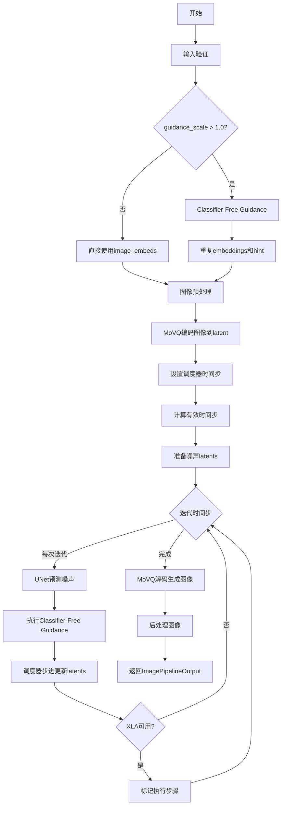
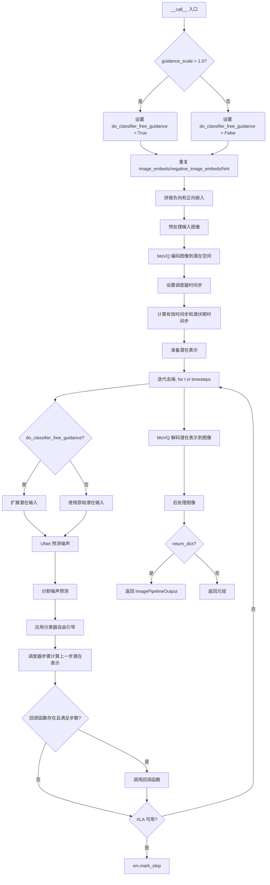

# `diffusers\src\diffusers\pipelines\kandinsky2_2\pipeline_kandinsky2_2_controlnet_img2img.py` 详细设计文档

Kandinsky V2.2 ControlNet图像到图像生成管道，用于基于图像嵌入和深度提示（hint）进行条件图像生成，支持图像修复、风格迁移等任务

## 整体流程



## 类结构

```
DiffusionPipeline (基类)
└── KandinskyV22ControlnetImg2ImgPipeline
```

## 全局变量及字段


### `XLA_AVAILABLE`
    
XLA加速库可用性标志，用于判断是否可以使用PyTorch XLA进行加速计算

类型：`bool`
    


### `logger`
    
日志记录器，用于输出管道运行过程中的日志信息

类型：`logging.Logger`
    


### `EXAMPLE_DOC_STRING`
    
使用示例文档字符串，包含Kandinsky图像生成管道的代码示例和使用说明

类型：`str`
    


### `KandinskyV22ControlnetImg2ImgPipeline.scheduler`
    
噪声调度器，用于控制去噪过程中的噪声添加和移除策略

类型：`DDPMScheduler`
    


### `KandinskyV22ControlnetImg2ImgPipeline.unet`
    
条件U-Net去噪模型，根据图像嵌入和控制提示进行图像去噪生成

类型：`UNet2DConditionModel`
    


### `KandinskyV22ControlnetImg2ImgPipeline.movq`
    
MoVQ解码器，将潜在空间向量解码为最终图像

类型：`VQModel`
    


### `KandinskyV22ControlnetImg2ImgPipeline.image_processor`
    
VAE图像处理器，用于图像的预处理和后处理操作

类型：`VaeImageProcessor`
    


### `KandinskyV22ControlnetImg2ImgPipeline.model_cpu_offload_seq`
    
模型CPU卸载顺序，指定模型组件卸载到CPU的顺序以节省显存

类型：`str`
    
    

## 全局函数及方法


### `KandinskyV22ControlnetImg2ImgPipeline.__init__`

初始化Kandinsky图像到图像生成管道的组件，包括UNet模型、调度器和MoVQ解码器，并配置图像处理器。

参数：

- `unet`：`UNet2DConditionModel`，条件U-Net架构，用于对图像嵌入进行去噪
- `scheduler`：`DDPMScheduler`，与`unet`结合使用以生成图像潜变量的调度器
- `movq`：`VQModel`，MoVQ解码器，用于从潜变量生成图像

返回值：`None`，该方法为构造函数，不返回任何值

#### 流程图

```mermaid
flowchart TD
    A[开始 __init__] --> B[调用父类 DiffusionPipeline.__init__]
    B --> C[注册模块: unet, scheduler, movq]
    C --> D{检查 movq 属性是否存在}
    D -->|是| E[计算 movq_scale_factor = 2^(len(movq.config.block_out_channels) - 1)]
    D -->|否| F[使用默认值 movq_scale_factor = 8]
    E --> G[计算 movq_latent_channels = movq.config.latent_channels]
    F --> G
    G --> H[初始化 VaeImageProcessor]
    H --> I[结束 __init__]
```

#### 带注释源码

```python
def __init__(
    self,
    unet: UNet2DConditionModel,
    scheduler: DDPMScheduler,
    movq: VQModel,
):
    # 调用父类 DiffusionPipeline 的初始化方法
    # 设置基本的 pipeline 配置和设备管理
    super().__init__()

    # 使用 register_modules 注册三个核心模块
    # 这些模块可以通过 self.unet, self.scheduler, self.movq 访问
    self.register_modules(
        unet=unet,
        scheduler=scheduler,
        movq=movq,
    )

    # 计算 MoVQ 的缩放因子
    # 基于 block_out_channels 的数量计算上采样因子
    # 例如: 如果 block_out_channels = [128, 256, 512, 512], 则 len = 4
    # movq_scale_factor = 2^(4-1) = 8
    movq_scale_factor = 2 ** (len(self.movq.config.block_out_channels) - 1) if getattr(self, "movq", None) else 8
    
    # 获取 MoVQ 的潜在通道数
    # 从 movq.config.latent_channels 获取，通常为 4
    movq_latent_channels = self.movq.config.latent_channels if getattr(self, "movq", None) else 4
    
    # 初始化图像预处理器
    # 用于将输入图像预处理为模型所需的格式
    # vae_scale_factor: VAE 潜变量的缩放因子
    # vae_latent_channels: VAE 潜在空间的通道数
    # resample: 重采样方法，使用 bicubic
    # reducing_gap: 减少间隙参数，用于图像缩放优化
    self.image_processor = VaeImageProcessor(
        vae_scale_factor=movq_scale_factor,
        vae_latent_channels=movq_latent_channels,
        resample="bicubic",
        reducing_gap=1,
    )
```


### `KandinskyV22ControlnetImg2ImgPipeline.get_timesteps`

该方法用于根据推理步骤数和图像转换强度（strength）计算有效推理时间步，决定在图像到图像生成过程中实际使用的时间步序列，从而控制噪声添加的程度和去噪过程的起始点。

参数：

- `num_inference_steps`：`int`，总推理步数，即去噪过程中要执行的总迭代次数
- `strength`：`float`，图像转换强度，范围 0 到 1，决定保留原图的程度，值越大表示转换程度越高
- `device`：`torch.device`，计算设备，用于确定张量位置

返回值：

- `timesteps`：`torch.Tensor`，有效推理时间步序列，从调度器中选取的子集
- `num_inference_steps - t_start`：`int`，实际将执行的推理步数

#### 流程图

```mermaid
flowchart TD
    A[开始 get_timesteps] --> B[计算 init_timestep = min(num_inference_steps × strength, num_inference_steps)]
    B --> C[计算 t_start = max(num_inference_steps - init_timestep, 0)]
    C --> D[从 scheduler.timesteps 中切片获取 timesteps[t_start:]]
    E[返回 timesteps 和 剩余步数]
    D --> E
```

#### 带注释源码

```python
def get_timesteps(self, num_inference_steps, strength, device):
    """
    计算有效推理时间步，用于图像到图像生成
    
    参数:
        num_inference_steps: 总推理步数
        strength: 转换强度 (0-1)，控制保留原图的程度
        device: 计算设备
    """
    # 根据强度计算需要初始化的步数
    # strength 越大，init_timestep 越大，保留原图信息越少
    init_timestep = min(int(num_inference_steps * strength), num_inference_steps)

    # 计算从scheduler时间步序列中的起始索引
    # 从后往前数，skip掉 init_timestep 个时间步
    t_start = max(num_inference_steps - init_timestep, 0)
    
    # 获取有效的时间步序列（跳过前面不需要的步）
    timesteps = self.scheduler.timesteps[t_start:]

    # 返回有效时间步和实际执行的步数
    return timesteps, num_inference_steps - t_start
```


### `KandinskyV22ControlnetImg2ImgPipeline.prepare_latents`

该方法负责准备图像生成的噪声潜在向量（latents），包括将输入图像编码为潜在表示（如需要）、根据时间步添加噪声，并返回处理后的潜在向量用于后续的去噪过程。

参数：

- `self`：类实例方法隐含参数
- `image`：`torch.Tensor | PIL.Image.Image | list`，输入图像，可以是PyTorch张量、PIL图像或图像列表
- `timestep`：`int`，当前扩散过程的时间步，用于决定添加的噪声量
- `batch_size`：`int`，批处理大小
- `num_images_per_prompt`：`int`，每个提示词生成的图像数量，用于扩展批次
- `dtype`：`torch.dtype`，目标数据类型（如float16、float32等）
- `device`：`torch.device`，计算设备（CPU或CUDA）
- `generator`：`torch.Generator | list[torch.Generator] | None`，随机数生成器，用于确保可重复性

返回值：`torch.Tensor`，处理后的噪声潜在向量，包含添加的噪声，可直接用于UNet去噪

#### 流程图

```mermaid
flowchart TD
    A[开始 prepare_latents] --> B{检查 image 类型}
    B -->|类型不正确| C[抛出 ValueError 异常]
    B -->|类型正确| D[将 image 移动到 device 并转换为 dtype]
    D --> E[计算实际批次大小: batch_size * num_images_per_prompt]
    E --> F{image 是否为 4 通道 latent?}
    F -->|是| G[直接使用 image 作为 init_latents]
    F -->|否| H{generator 是否为列表且长度不匹配?}
    H -->|是| I[抛出 ValueError 异常]
    H -->|否| J{generator 是否为列表?]
    J -->|是| K[逐个使用对应 generator 编码每个图像]
    J -->|否| L[使用单个 generator 编码图像]
    K --> M[拼接所有 init_latents]
    L --> M
    M --> N[应用 movq scaling_factor 缩放]
    G --> O[在第0维拼接 init_latents]
    N --> O
    O --> P[获取 init_latents 的 shape]
    P --> Q[使用 randn_tensor 生成形状相同的噪声]
    Q --> R[调用 scheduler.add_noise 添加噪声]
    R --> S[返回最终的 latents]
```

#### 带注释源码

```python
def prepare_latents(
    self,
    image,  # 输入图像：torch.Tensor | PIL.Image.Image | list
    timestep,  # 当前时间步：int
    batch_size,  # 批处理大小：int
    num_images_per_prompt,  # 每个提示生成的图像数量：int
    dtype,  # 目标数据类型：torch.dtype
    device,  # 计算设备：torch.device
    generator=None,  # 随机生成器：torch.Generator | list[torch.Generator] | None
):
    # 步骤1：验证输入图像类型
    # 确保 image 是支持的类型（torch.Tensor, PIL.Image.Image, 或 list）
    if not isinstance(image, (torch.Tensor, PIL.Image.Image, list)):
        raise ValueError(
            f"`image` has to be of type `torch.Tensor`, `PIL.Image.Image` or list but is {type(image)}"
        )

    # 步骤2：将图像移动到目标设备并转换为目标数据类型
    image = image.to(device=device, dtype=dtype)

    # 步骤3：计算实际批次大小（考虑每提示生成的图像数量）
    batch_size = batch_size * num_images_per_prompt

    # 步骤4：判断图像是否已经是 latent 表示（4通道）
    if image.shape[1] == 4:
        # 如果已经是4通道 latent，直接使用作为初始 latent
        init_latents = image
    else:
        # 步骤5：图像需要编码为 latent 表示
        
        # 检查 generator 列表长度是否与批次大小匹配
        if isinstance(generator, list) and len(generator) != batch_size:
            raise ValueError(
                f"You have passed a list of generators of length {len(generator)}, but requested an effective batch"
                f" size of {batch_size}. Make sure the batch size matches the length of the generators."
            )

        # 根据 generator 类型选择编码方式
        if isinstance(generator, list):
            # 列表形式：为每个图像使用对应的 generator
            init_latents = [
                self.movq.encode(image[i : i + 1]).latent_dist.sample(generator[i])
                for i in range(batch_size)
            ]
            # 沿批次维度拼接
            init_latents = torch.cat(init_latents, dim=0)
        else:
            # 单个 generator：统一编码
            init_latents = self.movq.encode(image).latent_dist.sample(generator)

        # 步骤6：应用 MoVQ 的缩放因子（通常用于归一化 latent 分布）
        init_latents = self.movq.config.scaling_factor * init_latents

    # 步骤7：在批次维度（第0维）拼接 init_latents
    # 注意：这里即使只有一个元素也会拼接，确保维度一致
    init_latents = torch.cat([init_latents], dim=0)

    # 步骤8：获取潜在向量的形状，用于生成噪声
    shape = init_latents.shape
    
    # 步骤9：生成与 init_latents 形状相同的随机噪声
    noise = randn_tensor(shape, generator=generator, device=device, dtype=dtype)

    # 步骤10：使用调度器根据时间步向初始 latent 添加噪声
    # 这是扩散模型前向过程的关键步骤
    init_latents = self.scheduler.add_noise(init_latents, noise, timestep)

    # 步骤11：返回添加噪声后的 latent（作为去噪过程的起点）
    latents = init_latents
    return latents
```


### `KandinskyV22ControlnetImg2ImgPipeline.__call__`

这是一个图像到图像（Img2Img）生成的主方法，属于 Kandinsky V2.2 ControlNet 管线。该方法接收图像嵌入、深度提示（hint）和相关参数，通过 MoVQ 解码器编码输入图像，使用带 ControlNet 条件的 UNet 进行去噪扩散处理，最后通过 MoVQ 解码器将潜在表示解码为最终图像。

参数：

- `image_embeds`：`torch.Tensor | list[torch.Tensor]`，CLIP 图像嵌入，用于条件化图像生成
- `image`：`torch.Tensor | PIL.Image.Image | list[torch.Tensor] | list[PIL.Image.Image]`，用作生成起点的输入图像
- `negative_image_embeds`：`torch.Tensor | list[torch.Tensor]`，负向提示的 CLIP 图像嵌入，用于无分类器引导
- `hint`：`torch.Tensor`，ControlNet 深度提示条件，用于引导图像生成
- `height`：`int`，生成图像的高度（默认 512）
- `width`：`int`，生成图像的宽度（默认 512）
- `num_inference_steps`：`int`，去噪推理步数（默认 100）
- `guidance_scale`：`float`，分类器自由引导比例，控制文本相关性（默认 4.0）
- `strength`：`float`，图像转换强度，0-1 之间（默认 0.3）
- `num_images_per_prompt`：`int`，每个提示生成的图像数量（默认 1）
- `generator`：`torch.Generator | list[torch.Generator] | None`，随机数生成器，用于可重复生成
- `output_type`：`str | None`，输出格式，可选 "pil"、"np" 或 "pt"（默认 "pil"）
- `callback`：`Callable[[int, int, torch.Tensor], None] | None`，推理过程中的回调函数
- `callback_steps`：`int`，回调函数调用频率（默认 1）
- `return_dict`：`bool`，是否返回字典格式结果（默认 True）

返回值：`ImagePipelineOutput | tuple`，生成的图像管道输出或元组

#### 流程图



#### 带注释源码

```python
@torch.no_grad()
def __call__(
    self,
    image_embeds: torch.Tensor | list[torch.Tensor],
    image: torch.Tensor | PIL.Image.Image | list[torch.Tensor] | list[PIL.Image.Image],
    negative_image_embeds: torch.Tensor | list[torch.Tensor],
    hint: torch.Tensor,
    height: int = 512,
    width: int = 512,
    num_inference_steps: int = 100,
    guidance_scale: float = 4.0,
    strength: float = 0.3,
    num_images_per_prompt: int = 1,
    generator: torch.Generator | list[torch.Generator] | None = None,
    output_type: str | None = "pil",
    callback: Callable[[int, int, torch.Tensor], None] | None = None,
    callback_steps: int = 1,
    return_dict: bool = True,
):
    """
    执行图像生成管线的主方法

    参数:
        image_embeds: CLIP图像嵌入，用于条件化图像生成
        image: 输入图像，作为生成起点
        negative_image_embeds: 负向提示的图像嵌入
        hint: ControlNet深度提示
        height/width: 输出图像尺寸
        num_inference_steps: 去噪步数
        guidance_scale: 引导强度
        strength: 图像变换强度
        num_images_per_prompt: 每提示生成数
        generator: 随机生成器
        output_type: 输出格式
        callback: 进度回调
        callback_steps: 回调间隔
        return_dict: 返回格式
    """
    # 获取执行设备
    device = self._execution_device

    # 判断是否使用分类器自由引导
    do_classifier_free_guidance = guidance_scale > 1.0

    # 将列表类型的嵌入拼接为张量
    if isinstance(image_embeds, list):
        image_embeds = torch.cat(image_embeds, dim=0)
    if isinstance(negative_image_embeds, list):
        negative_image_embeds = torch.cat(negative_image_embeds, dim=0)
    if isinstance(hint, list):
        hint = torch.cat(hint, dim=0)

    # 获取批次大小
    batch_size = image_embeds.shape[0]

    # 如果使用分类器自由引导，重复嵌入并拼接负向和正向
    if do_classifier_free_guidance:
        image_embeds = image_embeds.repeat_interleave(num_images_per_prompt, dim=0)
        negative_image_embeds = negative_image_embeds.repeat_interleave(num_images_per_prompt, dim=0)
        hint = hint.repeat_interleave(num_images_per_prompt, dim=0)

        # 拼接: [negative, positive]
        image_embeds = torch.cat([negative_image_embeds, image_embeds], dim=0).to(
            dtype=self.unet.dtype, device=device
        )
        hint = torch.cat([hint, hint], dim=0).to(dtype=self.unet.dtype, device=device)

    # 确保图像为列表格式
    if not isinstance(image, list):
        image = [image]
    
    # 验证图像格式
    if not all(isinstance(i, (PIL.Image.Image, torch.Tensor)) for i in image):
        raise ValueError(
            f"输入格式不正确: {[type(i) for i in image]}，仅支持 PIL.Image 和 torch.Tensor"
        )

    # 预处理图像并拼接
    image = torch.cat([self.image_processor.preprocess(i, width, height) for i in image], dim=0)
    image = image.to(dtype=image_embeds.dtype, device=device)

    # MoVQ编码图像到潜在空间
    latents = self.movq.encode(image)["latents"]
    latents = latents.repeat_interleave(num_images_per_prompt, dim=0)
    
    # 设置调度器时间步
    self.scheduler.set_timesteps(num_inference_steps, device=device)
    
    # 计算有效时间步
    timesteps, num_inference_steps = self.get_timesteps(num_inference_steps, strength, device)
    latent_timestep = timesteps[:1].repeat(batch_size * num_images_per_prompt)
    
    # 准备潜在表示（添加噪声）
    latents = self.prepare_latents(
        latents, latent_timestep, batch_size, num_images_per_prompt, image_embeds.dtype, device, generator
    )

    # 去噪迭代循环
    for i, t in enumerate(self.progress_bar(timesteps)):
        # 分类器自由引导：扩展潜在输入
        latent_model_input = torch.cat([latents] * 2) if do_classifier_free_guidance else latents

        # 构建条件参数
        added_cond_kwargs = {"image_embeds": image_embeds, "hint": hint}
        
        # UNet 预测噪声
        noise_pred = self.unet(
            sample=latent_model_input,
            timestep=t,
            encoder_hidden_states=None,  # Kandinsky使用图像嵌入而非文本
            added_cond_kwargs=added_cond_kwargs,
            return_dict=False,
        )[0]

        # 执行分类器自由引导
        if do_classifier_free_guidance:
            noise_pred, variance_pred = noise_pred.split(latents.shape[1], dim=1)
            noise_pred_uncond, noise_pred_text = noise_pred.chunk(2)
            _, variance_pred_text = variance_pred.chunk(2)
            noise_pred = noise_pred_uncond + guidance_scale * (noise_pred_text - noise_pred_uncond)
            noise_pred = torch.cat([noise_pred, variance_pred_text], dim=1)

        # 处理方差类型
        if not (
            hasattr(self.scheduler.config, "variance_type")
            and self.scheduler.config.variance_type in ["learned", "learned_range"]
        ):
            noise_pred, _ = noise_pred.split(latents.shape[1], dim=1)

        # 调度器步进：计算上一步的潜在表示
        latents = self.scheduler.step(
            noise_pred,
            t,
            latents,
            generator=generator,
        )[0]

        # 回调函数
        if callback is not None and i % callback_steps == 0:
            step_idx = i // getattr(self.scheduler, "order", 1)
            callback(step_idx, t, latents)

        # XLA 设备优化
        if XLA_AVAILABLE:
            xm.mark_step()

    # 后处理：MoVQ 解码潜在表示到图像
    image = self.movq.decode(latents, force_not_quantize=True)["sample"]

    # 释放模型钩子
    self.maybe_free_model_hooks()

    # 验证输出类型
    if output_type not in ["pt", "np", "pil"]:
        raise ValueError(f"仅支持 'pt', 'pil', 'np' 输出格式，当前: {output_type}")

    # 后处理图像
    image = self.image_processor.postprocess(image, output_type)

    # 返回结果
    if not return_dict:
        return (image,)

    return ImagePipelineOutput(images=image)
```

## 关键组件


### 张量索引与惰性加载

在 `prepare_latents` 方法中，代码对输入图像进行批量处理时使用了列表切片进行索引：`image[i : i + 1]`，这实现了对单个图像的惰性加载，避免一次性加载所有图像到内存。当 `image` 是潜在向量时（`image.shape[1] == 4`），直接使用 `init_latents = image` 跳过编码器，体现了条件分支的惰性计算模式。

### 反量化支持

在管道执行的最后的解码阶段，调用 `self.movq.decode(latents, force_not_quantize=True)` 时显式传入 `force_not_quantize=True` 参数，强制解码器不使用量化路径，确保输出图像质量不受量化影响，这是针对生成高质量图像的优化策略。

### 量化策略

在 `__init__` 方法中，代码动态计算量化因子：`movq_scale_factor = 2 ** (len(self.movq.config.block_out_channels) - 1)` 和 `movq_latent_channels = self.movq.config.latent_channels`，这些参数用于配置 `VaeImageProcessor`，决定了图像预处理时的缩放比例和潜在空间维度，支撑量化编码/解码的准确性。

### 图像预处理与后处理

使用 `VaeImageProcessor` 进行双向转换：`preprocess` 方法将 PIL 图像或张量统一转换为张量并进行缩放，`postprocess` 方法将潜在向量转换回可显示的图像格式（支持 PIL、NumPy 或 PyTorch 张量输出），实现了输入输出的标准化处理。

### 分类器自由引导（Classifier-Free Guidance）

在 `__call__` 方法中实现条件生成逻辑：通过 `repeat_interleave` 扩展批次维度，将负向嵌入和正向嵌入拼接后输入 UNet，引导尺度 `guidance_scale` 控制生成图像与提示词的相关性，这是扩散模型的标准引导技术。

### 噪声调度与时间步管理

`get_timesteps` 方法根据 `strength` 参数计算实际去噪步数，`prepare_latents` 方法使用 `randn_tensor` 生成噪声并通过 `scheduler.add_noise` 混合潜在向量，实现了噪声调度的灵活控制。

### XLA 加速支持

通过 `is_torch_xla_available()` 检查环境，条件导入 `torch_xla.core.xla_model`，在去噪循环中使用 `xm.mark_step()` 标记计算图，实现 TPU 设备的异步执行优化。


## 问题及建议


### 已知问题

- **冗余的张量拼接操作**: `prepare_latents` 方法中存在 `init_latents = torch.cat([init_latents], dim=0)`，将单个张量与自身拼接是冗余的，不会改变张量形状但消耗计算资源。
- **类型检查不完整**: `__call__` 方法中只检查了 `image` 列表元素类型是否为 `PIL.Image.Image` 或 `torch.Tensor`，但未对 `hint`、`image_embeds`、`negative_image_embeds` 进行形状和类型一致性验证。
- **文档与实现不一致**: 类文档字符串中声明使用 `DDIMScheduler`，但实际初始化接收的是 `DDPMScheduler`。
- **UNet 编码器状态处理异常**: 调用 `self.unet` 时传入 `encoder_hidden_states=None`，但该 pipeline 依赖 `image_embeds` 和 `hint` 作为条件输入，逻辑上存在设计混淆。
- **Classifier-Free Guidance 处理不完整**: `hint` 在 CFG 模式下被复制并拼接，但没有像 `image_embeds` 那样区分条件和非条件版本，语义不明确。
- **潜在的空引用风险**: `prepare_latents` 中对 `self.movq` 使用了 `getattr(self, "movq", None)`，但在类构造函数中 `movq` 是必需参数，这种防御性检查没有必要且可能导致混淆。
- **进度回调实现缺陷**: 回调中的 `step_idx` 计算使用了 `getattr(self.scheduler, "order", 1)`，但 `DDPMScheduler` 没有 `order` 属性，计算结果可能不正确。

### 优化建议

- 移除 `torch.cat([init_latents], dim=0)` 冗余操作，直接使用 `init_latents`。
- 添加完整的输入参数验证逻辑，验证 `hint`、`image_embeds`、`negative_image_embeds` 的批次维度一致性。
- 修正类文档字符串，将 `DDIMScheduler` 改为 `DDPMScheduler`。
- 明确 `encoder_hidden_states` 的处理逻辑，或在 UNet 调用前进行适当的预处理。
- 为 `hint` 实现正确的 Classifier-Free Guidance 分离逻辑，参考 `image_embeds` 的处理方式。
- 移除 `getattr(self, "movq", None)` 防御性检查，统一使用 `self.movq`。
- 修正回调函数中的 `step_idx` 计算，使用固定的调度器步长或从配置中获取。

## 其它


### 设计目标与约束

本Pipeline的设计目标是实现基于Kandinsky 2.2模型的图像到图像生成能力，支持通过ControlNet深度提示进行可控生成。约束条件包括：1) 必须配合KandinskyV22PriorEmb2EmbPipeline生成图像嵌入；2) 输入图像尺寸需统一为height×width；3) 支持PyTorch 1.9+和Python 3.8+；4) 依赖CUDA设备进行加速推理。

### 错误处理与异常设计

代码中包含多处显式错误检查：1) `prepare_latents`方法验证image类型是否为torch.Tensor、PIL.Image.Image或list；2) 验证generator列表长度与batch_size匹配；3) `__call__`方法验证output_type仅支持"pt"、"np"、"pil"三种；4) 预处理阶段检查image元素类型。异常类型主要使用ValueError，通过统一的错误消息格式提供调试信息。潜在改进：可添加自定义异常类处理特定场景，添加重试机制处理临时性失败。

### 数据流与状态机

Pipeline的核心数据流为：输入图像→图像预处理→MoVQ编码器编码为latents→UNet2DConditionModel去噪迭代（受ControlNet hint条件引导）→MoVQ解码器解码为最终图像。状态转换由DDPMScheduler管理，get_timesteps根据strength参数计算实际推理步数和起始时间步。推理过程支持Classifier-Free Guidance，通过concat负样本和正样本条件实现。

### 外部依赖与接口契约

核心依赖包括：1) diffusers库内部模块（VaeImageProcessor、UNet2DConditionModel、VQModel、DDPMScheduler、DiffusionPipeline）；2) PyTorch及torch_xla（可选）；3) PIL.Image；4) numpy（间接通过图像处理）。输入接口约定：image_embeds和negative_image_embeds需为torch.Tensor或list；image需为torch.Tensor、PIL.Image或list；hint需为torch.Tensor。输出接口约定：返回ImagePipelineOutput或tuple格式，images为PIL/np/tensor格式。

### 性能考量与优化建议

当前实现包含模型CPU卸载序列（model_cpu_offload_seq = "unet->movq"）和XLA支持。性能优化空间：1) 可启用torch.compile加速UNet推理；2) 可添加VAE tiling处理超大分辨率图像避免OOM；3) 可实现ONNX运行时支持；4) 可添加批处理优化减少kernel启动开销；5) 可使用xformers等高效注意力实现。

### 版本兼容性与迁移指南

代码引用了Copied from注释标记的父类方法，需与diffusers库版本保持同步。关键兼容性点：1) DDPMScheduler的step方法返回格式；2) VQModel的encode/decode返回字典结构；3) VaeImageProcessor的preprocess/postprocess方法签名。建议锁定diffusers版本并在版本更新时测试完整流程。

### 资源管理与生命周期

Pipeline采用模型钩子机制管理资源释放（maybe_free_model_hooks）。XLA环境下使用xm.mark_step()同步计算图。图像处理器（VaeImageProcessor）在初始化时创建，scale_factor和latent_channels根据MoVQ配置动态计算。潜在的内存优化点：可在长pipeline中显式调用torch.cuda.empty_cache()。

### 并发与线程安全性

当前实现非线程安全，多线程调用需自行加锁。主要线程不安全的操作包括：1) scheduler的timesteps修改；2) 模型内部缓存状态；3) 图像预处理器的状态。generator参数支持list形式以实现批级别的确定性生成，但不支持跨线程共享。

### 安全性与隐私考量

Pipeline处理的用户图像数据需谨慎管理：1) 输入图像可能包含敏感信息，需在安全环境中运行；2) 模型权重来源于HuggingFace Hub，需验证来源可靠性；3) 生成的图像应标注AI生成标识以符合合规要求；4) 避免通过提示词注入攻击获取不当内容。

    