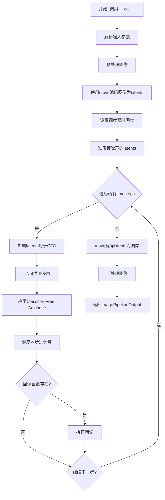
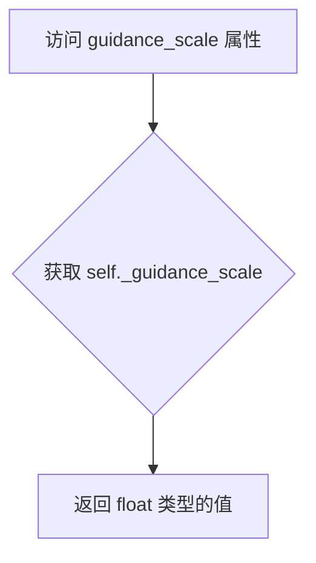
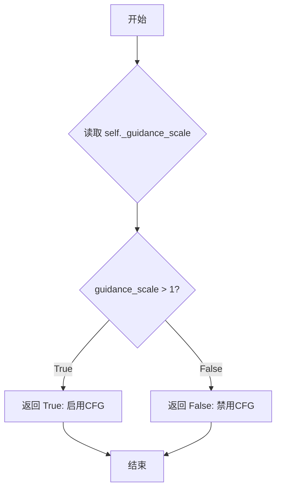
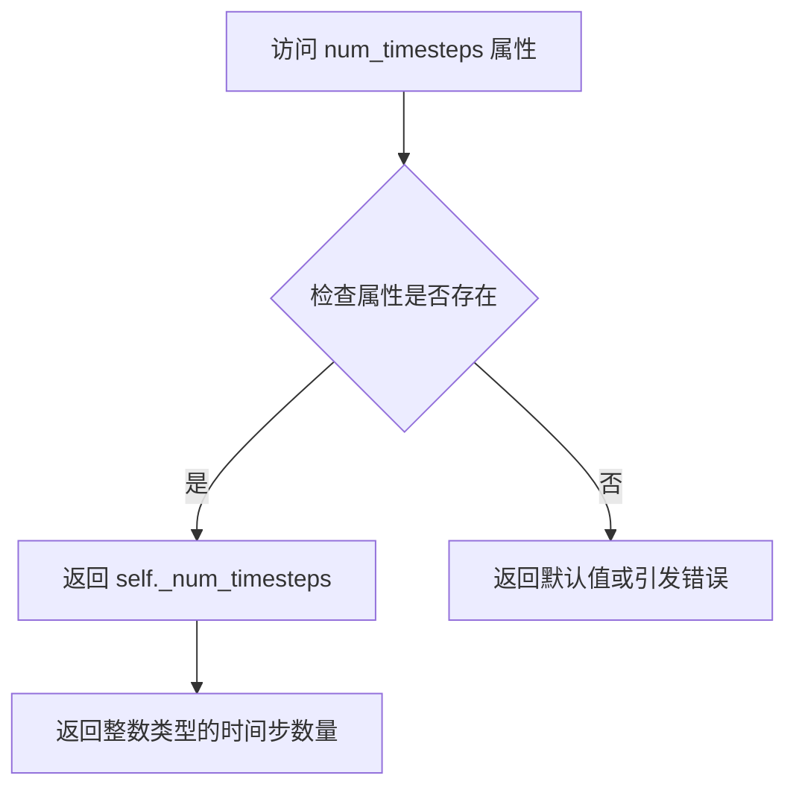

```mermaid
flowchart TD
    A[开始] --> B{验证回调参数}
    B --> C[获取执行设备]
    C --> D[规范化image_embeds为Tensor]
    D --> E[计算batch_size]
    E --> F[规范化negative_image_embeds为Tensor]
    F --> G{guidance_scale > 1?}
    G -->|Yes| H[重复image_embeds和negative_image_embeds]
    G -->|No| I[跳过重复]
    H --> J[拼接negative和positive embeddings]
    I --> J
    J --> K[规范化image为列表]
    K --> L[预处理图像并拼接]
    L --> M[使用movq编码图像获取latents]
    M --> N[重复latents num_images_per_prompt次]
    N --> O[设置调度器时间步]
    O --> P[计算有效时间步get_timesteps]
    P --> Q[准备latents添加噪声]
    Q --> R[遍历每个时间步]
    R --> S{执行分类器-free引导?}
    S -->|Yes| T[扩展latents为2倍]
    S -->|No| U[使用原始latents]
    T --> V[调用UNet预测噪声]
    U --> V
    V --> W{guidance_scale > 1?}
    W -->|Yes| X[分离噪声预测为条件和无条件]
    W -->|No| Y[保持原始预测]
    X --> Z[计算引导后的噪声预测]
    Y --> Z
    Z --> AA[调度器step计算上一步latents]
    AA --> BB{有callback_on_step_end?}
    BB -->|Yes| CC[执行回调更新latents和embeddings]
    BB -->|No| DD{XLA可用?}
    CC --> DD
    DD -->|Yes| EE[标记XLA执行步骤]
    DD -->|No| FF{还有更多时间步?}
    EE --> FF
    FF -->|Yes| R
    FF -->|No| GG{output_type != 'latent'?}
    GG -->|Yes| HH[使用movq解码latents为图像]
    GG -->|No| II[直接使用latents作为图像]
    HH --> JJ[后处理图像]
    II --> JJ
    JJ --> KK[释放模型钩子]
    KK --> LL{return_dict=True?}
    LL -->|Yes| MM[返回ImagePipelineOutput]
    LL -->|No| NN[返回tuple]
    MM --> OO[结束]
    NN --> OO
```

# `diffusers\src\diffusers\pipelines\kandinsky2_2\pipeline_kandinsky2_2_img2img.py` 详细设计文档

Kandinsky V2.2 图像到图像生成管道，利用 MoVQ 解码器和条件 U-Net 对图像嵌入进行去噪，通过 Classifier-Free Guidance 实现图像风格迁移和内容变换。

## 整体流程



## 类结构

```
DiffusionPipeline (抽象基类)
└── KandinskyV22Img2ImgPipeline
    ├── 依赖组件: UNet2DConditionModel
    ├── 依赖组件: VQModel (MoVQ)
    ├── 依赖组件: DDPMScheduler
    └── 依赖组件: VaeImageProcessor
```

## 全局变量及字段


### `logger`
    
模块级日志记录器，用于输出调试和运行信息

类型：`logging.Logger`
    


### `XLA_AVAILABLE`
    
指示是否支持PyTorch XLA加速

类型：`bool`
    


### `EXAMPLE_DOC_STRING`
    
包含Kandinsky图像生成pipeline使用示例的文档字符串

类型：`str`
    


### `KandinskyV22Img2ImgPipeline.model_cpu_offload_seq`
    
模型CPU卸载顺序配置字符串

类型：`str`
    


### `KandinskyV22Img2ImgPipeline._callback_tensor_inputs`
    
回调函数可访问的张量输入名称列表

类型：`list[str]`
    


### `KandinskyV22Img2ImgPipeline.scheduler`
    
去噪调度器，用于控制扩散模型的采样过程

类型：`DDPMScheduler`
    


### `KandinskyV22Img2ImgPipeline.unet`
    
条件U-Net模型，用于根据图像嵌入去噪潜在表示

类型：`UNet2DConditionModel`
    


### `KandinskyV22Img2ImgPipeline.movq`
    
MoVQ解码器，用于将潜在表示解码为图像

类型：`VQModel`
    


### `KandinskyV22Img2ImgPipeline.image_processor`
    
VAE图像处理器，用于图像的预处理和后处理

类型：`VaeImageProcessor`
    


### `KandinskyV22Img2ImgPipeline._guidance_scale`
    
无分类器引导尺度，控制生成图像与条件的相关程度

类型：`float`
    


### `KandinskyV22Img2ImgPipeline._num_timesteps`
    
扩散过程的时间步总数

类型：`int`
    
    

## 全局函数及方法


### `KandinskyV22Img2ImgPipeline.__init__`

该方法是 Kandinsky V2.2 图像到图像生成管道的初始化构造函数，负责注册 U-Net 模型、调度器和 MoVQ 解码器，并初始化图像处理器。

参数：

- `self`：隐式的实例引用，当前管道对象
- `unet`：`UNet2DConditionModel`，条件 U-Net 架构，用于对图像嵌入进行去噪
- `scheduler`：`DDPMScheduler`，与 `unet` 结合使用以生成图像潜变量的调度器
- `movq`：`VQModel`，MoVQ 解码器，用于从潜变量生成图像

返回值：`None`，构造函数无返回值

#### 流程图

```mermaid
flowchart TD
    A[__init__ 开始] --> B[调用父类 DiffusionPipeline.__init__]
    B --> C[register_modules 注册 unet/scheduler/movq]
    C --> D{检查 movq 是否存在}
    D -->|是| E[从 movq.config 获取 block_out_channels]
    D -->|否| F[使用默认值 block_out_channels=8]
    E --> G[计算 movq_scale_factor = 2^(len(block_out_channels)-1)]
    F --> G
    G --> H[获取 latent_channels]
    H --> I[创建 VaeImageProcessor]
    I --> J[设置图像处理参数: vae_scale_factor, vae_latent_channels, resample=bicubic, reducing_gap=1]
    J --> K[__init__ 结束]
```

#### 带注释源码

```python
def __init__(
    self,
    unet: UNet2DConditionModel,
    scheduler: DDPMScheduler,
    movq: VQModel,
):
    """
    初始化 KandinskyV22Img2ImgPipeline 管道
    
    Args:
        unet: 条件 U-Net 架构，用于对图像嵌入进行去噪
        scheduler: 与 unet 结合使用的调度器，用于生成图像潜变量
        movq: MoVQ 解码器，用于从潜变量生成最终图像
    """
    # 调用父类 DiffusionPipeline 的初始化方法
    super().__init__()

    # 注册各个模块，使其可通过 self.unet, self.scheduler, self.movq 访问
    self.register_modules(
        unet=unet,
        scheduler=scheduler,
        movq=movq,
    )
    
    # 计算 MoVQ 的缩放因子，基于 block_out_channels 的数量
    # 例如: [128, 256, 512, 512] -> len=4 -> 2^(4-1) = 8
    movq_scale_factor = 2 ** (len(self.movq.config.block_out_channels) - 1) if getattr(self, "movq", None) else 8
    
    # 获取 MoVQ 的潜变量通道数
    movq_latent_channels = self.movq.config.latent_channels if getattr(self, "movq", None) else 4
    
    # 创建图像处理器，用于图像的预处理和后处理
    self.image_processor = VaeImageProcessor(
        vae_scale_factor=movq_scale_factor,    # VAE 缩放因子
        vae_latent_channels=movq_latent_channels,  # 潜变量通道数
        resample="bicubic",                     # 重采样方法
        reducing_gap=1,                        # 降采样间隙
    )
```


### `KandinskyV22Img2ImgPipeline.get_timesteps`

该方法用于根据推理步骤数和图像处理强度计算去噪过程的时间步列表，通过调整起始时间步实现对原始图像的噪声化程度控制。

参数：

- `num_inference_steps`：`int`，总推理步数，决定去噪过程的迭代次数
- `strength`：`float`，图像处理强度，控制在原图上添加的噪声量，值越大噪声越多
- `device`：`torch.device`，计算设备，用于确定张量放置位置

返回值：`tuple`，返回一个元组，包含 (`timesteps`, `num_inference_steps - t_start`)

- `timesteps`：调整后的时间步列表（Tensor）
- `num_inference_steps - t_start`：实际执行的推理步数（int）

#### 流程图

```mermaid
flowchart TD
    A[开始 get_timesteps] --> B[计算 init_timestep<br/>min(num_inference_steps * strength, num_inference_steps)]
    --> C[计算起始索引 t_start<br/>max(num_inference_steps - init_timestep, 0)]
    --> D[从scheduler.timesteps中切片获取timesteps<br/>timesteps = self.scheduler.timesteps[t_start:]]
    --> E[计算实际步数<br/>actual_steps = num_inference_steps - t_start]
    --> F[返回 timesteps, actual_steps]
```

#### 带注释源码

```python
def get_timesteps(self, num_inference_steps, strength, device):
    # 根据强度计算初始时间步数
    # strength表示图像变换程度，值为0-1之间
    # 强度越大，init_timestep越大，意味着从更早的时间步开始去噪
    init_timestep = min(int(num_inference_steps * strength), num_inference_steps)

    # 计算起始索引，确保不为负数
    # t_start表示从scheduler.timesteps的哪个位置开始取值
    # 强度越大，t_start越小，从更早的时间步开始
    t_start = max(num_inference_steps - init_timestep, 0)
    
    # 从调度器的时间步列表中获取子集
    # 这决定了实际参与去噪过程的时间步
    timesteps = self.scheduler.timesteps[t_start:]

    # 返回时间步列表和实际推理步数
    # 实际步数可能小于原始请求的步数
    return timesteps, num_inference_steps - t_start
```


### `KandinskyV22Img2ImgPipeline.prepare_latents`

该方法用于将输入图像预处理为潜在向量（latents），包括图像类型验证、设备转换、潜在空间编码、噪声添加等核心步骤，为后续的图像到图像扩散过程准备初始潜在表示。

参数：

- `self`：`KandinskyV22Img2ImgPipeline`，Pipeline实例本身
- `image`：`torch.Tensor | PIL.Image.Image | list`，输入图像，可以是PyTorch张量、PIL图像或图像列表
- `timestep`：`torch.Tensor`，当前扩散时间步，用于添加噪声
- `batch_size`：`int`，基础批次大小
- `num_images_per_prompt`：`int`，每个提示词生成的图像数量
- `dtype`：`torch.dtype`，目标数据类型
- `device`：`torch.device`，目标设备
- `generator`：`torch.Generator | list[torch.Generator] | None`，可选的随机数生成器，用于确保可重复性

返回值：`torch.Tensor`，处理后的潜在向量，用于后续去噪过程

#### 流程图

```mermaid
flowchart TD
    A[开始 prepare_latents] --> B{验证 image 类型}
    B -->|类型无效| C[抛出 ValueError]
    B -->|类型有效| D[将 image 移动到 device 和 dtype]
    D --> E[计算有效批次大小: batch_size * num_images_per_prompt]
    E --> F{image.shape[1] == 4?}
    F -->|是| G[直接作为 init_latents]
    F -->|否| H{generator 是 list?}
    H -->|是| I{generator 长度 == batch_size?}
    H -->|否| J[使用 movq.encode 单次编码]
    I -->|否| K[抛出 ValueError]
    I -->|是| L[逐个编码图像并合并]
    J --> M[使用 movq.encode 编码]
    L --> N[应用 scaling_factor]
    M --> N
    G --> O[合并 init_latents]
    N --> O
    O --> P[生成噪声 randn_tensor]
    P --> Q[使用 scheduler.add_noise 添加噪声]
    Q --> R[返回 latents]
```

#### 带注释源码

```python
def prepare_latents(self, image, timestep, batch_size, num_images_per_prompt, dtype, device, generator=None):
    """
    准备图像潜在向量，为扩散过程初始化 latent 表示
    
    参数:
        image: 输入图像，支持 torch.Tensor, PIL.Image.Image 或 list
        timestep: 当前时间步，用于确定添加噪声的强度
        batch_size: 批次大小
        num_images_per_prompt: 每个提示生成的图像数
        dtype: 目标数据类型
        device: 目标设备
        generator: 可选的随机生成器用于可重复性
    """
    # 1. 验证输入图像类型是否合法
    if not isinstance(image, (torch.Tensor, PIL.Image.Image, list)):
        raise ValueError(
            f"`image` has to be of type `torch.Tensor`, `PIL.Image.Image` or list but is {type(image)}"
        )

    # 2. 将图像移动到指定设备和数据类型
    image = image.to(device=device, dtype=dtype)

    # 3. 计算实际批次大小（考虑每提示图像数）
    batch_size = batch_size * num_images_per_prompt

    # 4. 判断图像是否已经是 latent 格式（4通道）
    if image.shape[1] == 4:
        # 图像已经是 latent 表示，直接使用
        init_latents = image
    else:
        # 5. 需要通过 MoVQ 编码器将图像转换为 latent 空间
        
        # 5a. 处理多个生成器的场景
        if isinstance(generator, list) and len(generator) != batch_size:
            raise ValueError(
                f"You have passed a list of generators of length {len(generator)}, but requested an effective batch"
                f" size of {batch_size}. Make sure the batch size matches the length of the generators."
            )

        # 5b. 多个生成器，逐个编码并合并
        elif isinstance(generator, list):
            init_latents = [
                self.movq.encode(image[i : i + 1]).latent_dist.sample(generator[i]) for i in range(batch_size)
            ]
            init_latents = torch.cat(init_latents, dim=0)
        # 5c. 单个生成器或无生成器，一次性编码
        else:
            init_latents = self.movq.encode(image).latent_dist.sample(generator)

        # 6. 应用 MoVQ 的缩放因子到 latent
        init_latents = self.movq.config.scaling_factor * init_latents

    # 7. 沿第一维度合并 latent（用于后续处理的一致性）
    init_latents = torch.cat([init_latents], dim=0)

    # 8. 获取 latent 的形状并生成对应形状的随机噪声
    shape = init_latents.shape
    noise = randn_tensor(shape, generator=generator, device=device, dtype=dtype)

    # 9. 使用调度器在指定时间步将噪声添加到初始 latent
    init_latents = self.scheduler.add_noise(init_latents, noise, timestep)

    # 10. 返回处理后的 latent（已添加噪声）
    latents = init_latents

    return latents
```


### `KandinskyV22Img2ImgPipeline.guidance_scale`

该属性是 `KandinskyV22Img2ImgPipeline` 类的一个只读属性，用于获取当前 pipeline 的 guidance_scale 参数值。guidance_scale 是 Classifier-Free Diffusion Guidance 中的控制参数，用于调整生成图像与文本提示的相关性。

参数： 无（这是一个属性 getter，不接受参数）

返回值：`float`，返回当前设置的 guidance_scale 值，用于控制图像生成时对文本提示的遵循程度。

#### 流程图



#### 带注释源码

```python
@property
def guidance_scale(self):
    """
    属性 getter：获取 guidance_scale 值
    
    guidance_scale 定义在 Classifier-Free Diffusion Guidance 论文中，
    对应公式中的权重参数 w，用于控制生成图像与输入提示的相关性。
    当 guidance_scale > 1 时启用 classifier-free guidance。
    
    Returns:
        float: guidance_scale 数值，值越大生成的图像与提示越相关，
              但可能牺牲图像质量
    """
    return self._guidance_scale
```

#### 补充说明

| 项目 | 详情 |
|------|------|
| 属性类型 | Python `@property` 装饰器实现的只读属性 |
| 关联属性 | `do_classifier_free_guidance` - 根据 guidance_scale > 1 判断是否启用 guidance |
| 设置位置 | 在 `__call__` 方法中通过 `self._guidance_scale = guidance_scale` 设置 |
| 默认值 | 4.0（在 `__call__` 方法参数中定义） |
| 用途 | 控制噪声预测的权重，影响图像与文本提示的相关性 |


### `KandinskyV22Img2ImgPipeline.do_classifier_free_guidance`

该属性方法用于判断当前配置是否启用了 Classifier-Free Guidance（CFG）技术，通过检查 `guidance_scale` 是否大于 1 来决定是否在推理过程中执行无条件和有条件的两条扩散路径。

参数：无（属性方法，无需参数）

返回值：`bool`，当 `guidance_scale > 1` 时返回 `True` 表示启用 CFG，否则返回 `False` 表示禁用 CFG。

#### 流程图



#### 带注释源码

```python
@property
def do_classifier_free_guidance(self):
    """
    属性方法：判断是否启用 Classifier-Free Guidance
    
    Classifier-Free Guidance (CFG) 是一种提高生成图像质量的技巧，
    它通过同时评估无条件生成（negative）和条件生成（positive）的噪声预测，
    然后用它们的差异来引导生成过程。
    
    当 guidance_scale > 1 时，CFG 被启用；
    当 guidance_scale <= 1 时，CFG 被禁用，此时只会进行普通的条件生成。
    
    Returns:
        bool: 如果 guidance_scale > 1 返回 True，表示在去噪循环中
              会执行 classifier-free guidance；否则返回 False。
    """
    return self._guidance_scale > 1
```


### `KandinskyV22Img2ImgPipeline.num_timesteps`

该属性是一个只读属性，用于返回图像生成过程中去噪的时间步数量。在 `__call__` 方法执行时，该值会被设置为去噪时间步列表的长度（`len(timesteps)`）。

参数：无

返回值：`int`，返回当前管道执行过程中的时间步数量（即去噪迭代的次数）

#### 流程图



#### 带注释源码

```python
@property
def num_timesteps(self):
    """
    属性装饰器：将此方法转换为属性访问
    用于获取当前管道执行的时间步数量
    """
    # 返回实例变量 _num_timesteps，该值在 __call__ 方法中被设置
    # 设置位置：self._num_timesteps = len(timesteps)
    # 其中 timesteps 来自 self.get_timesteps() 方法的返回值
    return self._num_timesteps
```

#### 关联信息

- **设置位置**：在 `__call__` 方法的第 305 行左右设置：
  ```python
  self._num_timesteps = len(timesteps)
  ```
- **时间步来源**：由 `get_timesteps` 方法计算得出，该方法根据 `num_inference_steps`（推理步数）和 `strength`（强度）参数确定实际使用的时间步
- **使用场景**：常用于进度条显示、回调函数中的步数记录、以及外部监控管道的执行进度


### `KandinskyV22Img2ImgPipeline.__call__`

该方法是Kandinsky 2.2图像到图像（img2img）生成管道的核心调用函数，接收图像嵌入和初始图像作为输入，通过UNet去噪过程和MoVQ解码器生成目标图像。

参数：

- `image_embeds`：`torch.Tensor | list[torch.Tensor]`，CLIP图像嵌入，用于条件图像生成
- `image`：`torch.Tensor | PIL.Image.Image | list[torch.Tensor] | list[PIL.Image.Image]`，用作起点的输入图像，也可以接受图像潜在向量
- `negative_image_embeds`：`torch.Tensor | list[torch.Tensor]`，负向CLIP图像嵌入，用于无分类器引导
- `height`：`int`，生成图像的高度，默认为512
- `width`：`int`，生成图像的宽度，默认为512
- `num_inference_steps`：`int`，去噪步数，默认为100
- `guidance_scale`：`float`，引导尺度，用于分类器-free扩散引导，默认为4.0
- `strength`：`float`，转换强度，控制在图像上添加的噪声量，默认为0.3
- `num_images_per_prompt`：`int`，每个提示生成的图像数量，默认为1
- `generator`：`torch.Generator | list[torch.Generator] | None`，随机数生成器，用于确保可重复性
- `output_type`：`str | None`，输出格式，可选"pil"、"np"或"pt"，默认为"pil"
- `return_dict`：`bool`，是否返回ImagePipelineOutput，默认为True
- `callback_on_step_end`：`Callable[[int, int], None] | None`，每个去噪步骤结束时调用的回调函数
- `callback_on_step_end_tensor_inputs`：`list[str]`，回调函数可访问的张量输入列表

返回值：`ImagePipelineOutput | tuple`，生成的图像或包含图像的元组

#### 流程图



#### 带注释源码

```python
@torch.no_grad()
def __call__(
    self,
    image_embeds: torch.Tensor | list[torch.Tensor],
    image: torch.Tensor | PIL.Image.Image | list[torch.Tensor] | list[PIL.Image.Image],
    negative_image_embeds: torch.Tensor | list[torch.Tensor],
    height: int = 512,
    width: int = 512,
    num_inference_steps: int = 100,
    guidance_scale: float = 4.0,
    strength: float = 0.3,
    num_images_per_prompt: int = 1,
    generator: torch.Generator | list[torch.Generator] | None = None,
    output_type: str | None = "pil",
    return_dict: bool = True,
    callback_on_step_end: Callable[[int, int], None] | None = None,
    callback_on_step_end_tensor_inputs: list[str] = ["latents"],
    **kwargs,
):
    """
    管道生成时调用的主函数。
    
    Args:
        image_embeds: CLIP图像嵌入，用于条件图像生成
        image: 起点图像，可接受PIL图像或张量
        negative_image_embeds: 负向图像嵌入
        height: 生成图像高度
        width: 生成图像宽度
        num_inference_steps: 去噪步数
        guidance_scale: 引导尺度
        strength: 转换强度
        num_images_per_prompt: 每个提示生成图像数
        generator: 随机生成器
        output_type: 输出格式
        return_dict: 是否返回字典格式
        callback_on_step_end: 步骤结束回调
        callback_on_step_end_tensor_inputs: 回调张量输入
    """
    # 处理废弃的回调参数
    callback = kwargs.pop("callback", None)
    callback_steps = kwargs.pop("callback_steps", None)

    if callback is not None:
        deprecate("callback", "1.0.0", "使用callback_on_step_end替代")
    if callback_steps is not None:
        deprecate("callback_steps", "1.0.0", "使用callback_on_step_end替代")

    # 验证回调张量输入
    if callback_on_step_end_tensor_inputs is not None and not all(
        k in self._callback_tensor_inputs for k in callback_on_step_end_tensor_inputs
    ):
        raise ValueError(
            f"`callback_on_step_end_tensor_inputs` 必须是 {self._callback_tensor_inputs} 的子集"
        )

    # 获取执行设备
    device = self._execution_device
    self._guidance_scale = guidance_scale

    # 规范化image_embeds为张量
    if isinstance(image_embeds, list):
        image_embeds = torch.cat(image_embeds, dim=0)
    batch_size = image_embeds.shape[0]
    
    # 规范化negative_image_embeds为张量
    if isinstance(negative_image_embeds, list):
        negative_image_embeds = torch.cat(negative_image_embeds, dim=0)

    # 如果启用分类器-free引导，重复embeddings并拼接
    if self.do_classifier_free_guidance:
        image_embeds = image_embeds.repeat_interleave(num_images_per_prompt, dim=0)
        negative_image_embeds = negative_image_embeds.repeat_interleave(num_images_per_prompt, dim=0)
        image_embeds = torch.cat([negative_image_embeds, image_embeds], dim=0).to(
            dtype=self.unet.dtype, device=device
        )

    # 规范化输入图像为列表
    if not isinstance(image, list):
        image = [image]
    
    # 验证图像类型
    if not all(isinstance(i, (PIL.Image.Image, torch.Tensor)) for i in image):
        raise ValueError(
            f"输入格式不正确: {[type(i) for i in image]}，仅支持PIL图像和pytorch张量"
        )

    # 预处理图像并拼接
    image = torch.cat([self.image_processor.preprocess(i, width, height) for i in image], dim=0)
    image = image.to(dtype=image_embeds.dtype, device=device)

    # 使用MoVQ编码器将图像编码为潜在表示
    latents = self.movq.encode(image)["latents"]
    latents = latents.repeat_interleave(num_images_per_prompt, dim=0)
    
    # 设置调度器的时间步
    self.scheduler.set_timesteps(num_inference_steps, device=device)
    
    # 计算有效时间步
    timesteps, num_inference_steps = self.get_timesteps(num_inference_steps, strength, device)
    
    # 准备初始latents
    latent_timestep = timesteps[:1].repeat(batch_size * num_images_per_prompt)
    latents = self.prepare_latents(
        latents, latent_timestep, batch_size, num_images_per_prompt, image_embeds.dtype, device, generator
    )
    
    self._num_timesteps = len(timesteps)
    
    # 主去噪循环
    for i, t in enumerate(self.progress_bar(timesteps)):
        # 如果启用分类器-free引导，扩展latents
        latent_model_input = torch.cat([latents] * 2) if self.do_classifier_free_guidance else latents

        added_cond_kwargs = {"image_embeds": image_embeds}
        
        # 调用UNet预测噪声
        noise_pred = self.unet(
            sample=latent_model_input,
            timestep=t,
            encoder_hidden_states=None,
            added_cond_kwargs=added_cond_kwargs,
            return_dict=False,
        )[0]

        # 执行分类器-free引导
        if self.do_classifier_free_guidance:
            noise_pred, variance_pred = noise_pred.split(latents.shape[1], dim=1)
            noise_pred_uncond, noise_pred_text = noise_pred.chunk(2)
            _, variance_pred_text = variance_pred.chunk(2)
            noise_pred = noise_pred_uncond + self.guidance_scale * (noise_pred_text - noise_pred_uncond)
            noise_pred = torch.cat([noise_pred, variance_pred_text], dim=1)

        # 处理方差类型
        if not (
            hasattr(self.scheduler.config, "variance_type")
            and self.scheduler.config.variance_type in ["learned", "learned_range"]
        ):
            noise_pred, _ = noise_pred.split(latents.shape[1], dim=1)

        # 使用调度器计算上一步的latents
        latents = self.scheduler.step(
            noise_pred,
            t,
            latents,
            generator=generator,
        )[0]

        # 执行步骤结束回调
        if callback_on_step_end is not None:
            callback_kwargs = {}
            for k in callback_on_step_end_tensor_inputs:
                callback_kwargs[k] = locals()[k]
            callback_outputs = callback_on_step_end(self, i, t, callback_kwargs)

            latents = callback_outputs.pop("latents", latents)
            image_embeds = callback_outputs.pop("image_embeds", image_embeds)
            negative_image_embeds = callback_outputs.pop("negative_image_embeds", negative_image_embeds)

        # 执行废弃的回调格式
        if callback is not None and i % callback_steps == 0:
            step_idx = i // getattr(self.scheduler, "order", 1)
            callback(step_idx, t, latents)

        # XLA优化
        if XLA_AVAILABLE:
            xm.mark_step()

    # 解码生成最终图像
    if not output_type == "latent":
        image = self.movq.decode(latents, force_not_quantize=True)["sample"]
        image = self.image_processor.postprocess(image, output_type)
    else:
        image = latents

    # 释放模型内存
    self.maybe_free_model_hooks()

    # 返回结果
    if not return_dict:
        return (image,)

    return ImagePipelineOutput(images=image)
```

## 关键组件


### KandinskyV22Img2ImgPipeline

这是Kandinsky 2.2的图像到图像生成管道，继承自DiffusionPipeline类，实现了基于CLIP图像嵌入条件化的图像转换功能，支持从输入图像生成目标图像。

### 张量索引与惰性加载

在prepare_latents方法中，通过randn_tensor延迟生成噪声张量，仅在需要时才进行计算；同时在推理循环中使用torch.no_grad()装饰器避免不必要的梯度计算，提高内存效率。

### 反量化支持

在movq.decode调用时使用force_not_quantize=True参数，强制不对量化模型进行解码，确保生成图像的质量不受量化影响。

### 量化策略

通过model_cpu_offload_seq = "unet->movq"定义模型卸载顺序，支持在CPU和GPU之间高效移动模型；同时利用torch_dtype参数支持半精度（float16）推理以降低显存占用。

### VaeImageProcessor

图像预处理器，负责将PIL图像或张量进行预处理（resize、normalize）和后处理（denormalize），使用bicubic重采样方法。

### UNet2DConditionModel

条件U-Net架构，接收噪声潜在表示、时间步长和图像嵌入作为条件信息，预测噪声残差以逐步去噪。

### VQModel (movq)

MoVQ解码器，将潜在空间表示解码为最终图像；encode方法将图像编码为潜在表示，decode方法从潜在表示重建图像。

### DDPMScheduler

DDPM调度器，负责在去噪过程中添加噪声和执行去噪步骤，管理推理的时间步序列。

### guidance_scale控制

通过guidance_scale属性和do_classifier_free_guidance属性实现无分类器引导，提高生成图像与条件信息的对齐度。

### 回调机制

支持callback_on_step_end和callback_on_step_end_tensor_inputs参数，允许在每个去噪步骤结束后执行自定义回调函数，便于监控和干预生成过程。


## 问题及建议


### 已知问题

-   `prepare_latents` 方法中 `image.shape[1] == 4` 的判断逻辑缺乏注释，且当满足该条件时直接使用 `init_latents = image`，但后续仍然执行了噪声添加操作，可能导致非预期行为
-   `latents = torch.cat([init_latents], dim=0)` 这行代码没有实际作用，只是将单个张量重复包装成批次，增加了不必要的计算开销
-   `__call__` 方法过长（超过200行），违反了单一职责原则，将参数验证、推理执行、回调处理、结果后处理等多个职责混在一起
-   `image` 参数的类型注解声明支持 `list[np.ndarray]`，但实际代码只处理了 `PIL.Image.Image` 和 `torch.Tensor`，存在类型注解与实现不一致的问题
-   `get_timesteps` 方法从其他 pipeline 复制而来，但与当前 pipeline 的调度器配置可能存在兼容性问题，未进行充分适配
-   `scheduler` 参数虽然声明为 `DDPMScheduler`，但代码中使用了调度器的特定属性（如 `variance_type`），对其他调度器类型的兼容性不足
-   缺少对 `strength` 参数范围（0到1之间）的验证，当 `strength > 1` 或 `strength < 0` 时可能导致异常行为或难以调试的问题
-   在推理循环中没有对 `num_inference_steps` 为 0 的情况进行处理，可能导致除零错误或空循环

### 优化建议

-   将 `__call__` 方法拆分为多个私有方法，如 `_validate_inputs`、`_prepare_latents`、`_run_inference_step`、`_postprocess_output` 等，提高代码可读性和可维护性
-   为 `prepare_latents` 方法中的 `image.shape[1] == 4` 判断添加明确注释，说明该条件用于判断输入是否为已编码的潜空间表示
-   移除 `latents = torch.cat([init_latents], dim=0)` 这行冗余代码，或者在注释中明确说明其用途
-   修正 `image` 参数的类型注解，移除 `list[np.ndarray]` 类型支持，或补充相应的实现逻辑
-   添加输入参数验证逻辑，包括 `strength` 的范围检查、`num_inference_steps` 的有效性检查、`height` 和 `width` 的正数检查等
-   将 `get_timesteps` 方法的实现与当前 pipeline 的调度器配置进行对齐，或考虑使用调度器自带的时间步计算方法
-   考虑使用 `match-case` 语句（Python 3.10+）替代多个 `if-isinstance` 判断，提高代码可读性
-   在推理循环开始前检查 `num_inference_steps` 是否为 0 或负数，并给出明确的错误信息或默认值处理

## 其它


### 设计目标与约束

**设计目标**：
- 实现基于Kandinsky 2.2模型的图像到图像（image-to-image）生成功能
- 支持CLIP图像嵌入条件生成，实现高质量的图像转换
- 提供可配置的降噪过程，支持用户自定义推理步数、图像强度等参数

**约束条件**：
- 输入图像高度和宽度需匹配（建议512x512或768x768）
- 图像嵌入（image_embeds）必须与negative_image_embeds成对使用
- 当guidance_scale > 1时启用无分类器引导（Classifier-Free Guidance）
- strength参数必须在[0, 1]范围内，控制噪声添加程度

### 错误处理与异常设计

**输入验证**：
- image参数类型必须是torch.Tensor、PIL.Image.Image或list类型，否则抛出ValueError
- generator为list时，其长度必须与batch_size匹配，否则抛出ValueError
- callback_on_step_end_tensor_inputs中的所有key必须在_callback_tensor_inputs列表中

**废弃警告（Deprecation）**：
- callback和callback_steps参数已废弃，使用callback_on_step_end和callback_on_step_end_tensor_inputs代替

**设备管理**：
- XLA设备可用时使用xm.mark_step()进行梯度同步
- 模型CPU卸载序列为"unet->movq"

### 数据流与状态机

**主数据流**：
1. 接收image_embeds（条件嵌入）和image（输入图像）
2. 图像预处理：resize至目标尺寸，转换为tensor
3. MoVQ编码：image → latents（潜在空间表示）
4. 添加噪声：根据strength和timestep对latents进行噪声调度
5. UNet去噪迭代：遍历timesteps，执行条件去噪
6. MoVQ解码：latents → 最终图像
7. 后处理：转换为PIL/numpy/tensor格式输出

**状态管理**：
- _guidance_scale：控制CFG强度
- _num_timesteps：记录推理步数
- _execution_device：执行设备

### 外部依赖与接口契约

**核心依赖**：
- UNet2DConditionModel：条件U-Net去噪模型
- VQModel（MoVQ）：图像解码器
- DDPMScheduler：噪声调度器
- VaeImageProcessor：图像预处理/后处理器
- CLIP图像嵌入：来自KandinskyV22PriorPipeline

**接口契约**：
- 输入：image_embeds（torch.Tensor或list）、image（torch.Tensor/PIL.Image或list）、negative_image_embeds
- 输出：ImagePipelineOutput（包含images列表）或tuple
- 潜在空间：latent_channels=4，scale_factor基于MoVQ的block_out_channels

### 配置参数说明

**pipeline级别**：
- model_cpu_offload_seq = "unet->movq"：模型卸载顺序
- _callback_tensor_inputs：支持回调的tensor输入列表

**scheduler配置**：
- variance_type支持"learned"和"learned_range"时保留方差预测

### 性能考虑

**内存优化**：
- 支持模型CPU卸载（model_cpu_offload）
- XLA设备支持加速TPU推理

**推理优化**：
- batch_size * num_images_per_prompt合并处理
- classifier-free guidance时使用chunk操作分离预测

### 并发与异步处理

**回调机制**：
- callback_on_step_end：每步结束后执行的自定义回调
- callback_on_step_end_tensor_inputs：回调可访问的tensor列表
- 传统callback（已废弃）：按callback_steps间隔调用

### 资源管理

**模型生命周期**：
- maybe_free_model_hooks()：推理结束后自动释放模型钩子
- register_modules：注册unet、scheduler、movq组件

### 版本兼容性

**废弃参数**：
- callback和callback_steps自1.0.0版本废弃
- 建议迁移至callback_on_step_end接口

### 安全性考虑

**输入安全**：
- 验证image类型，防止恶意输入
- 设备转移时保持dtype一致性
- generator状态管理确保可复现性

    