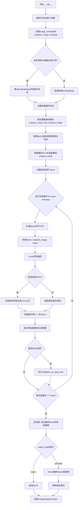
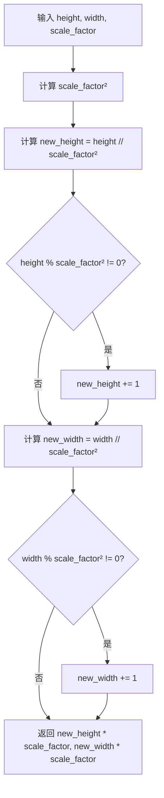
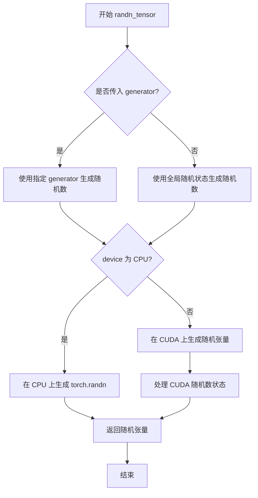
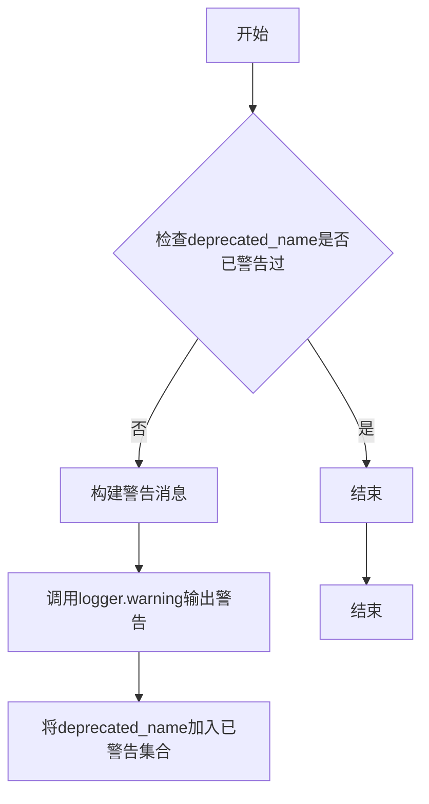
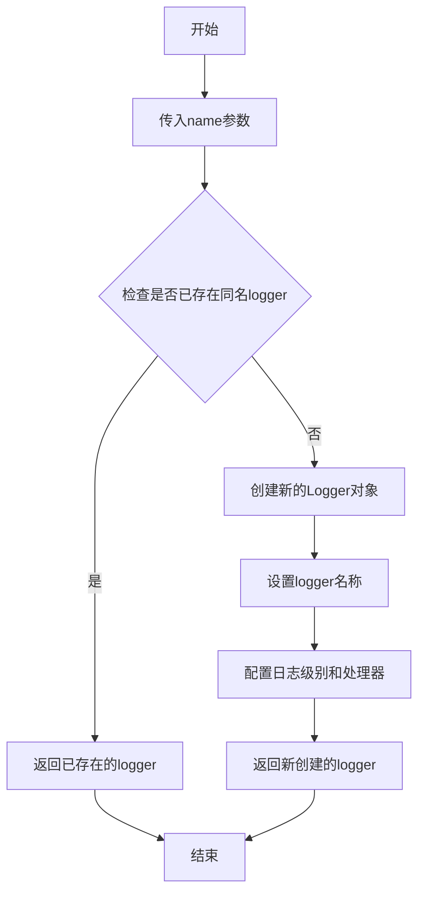
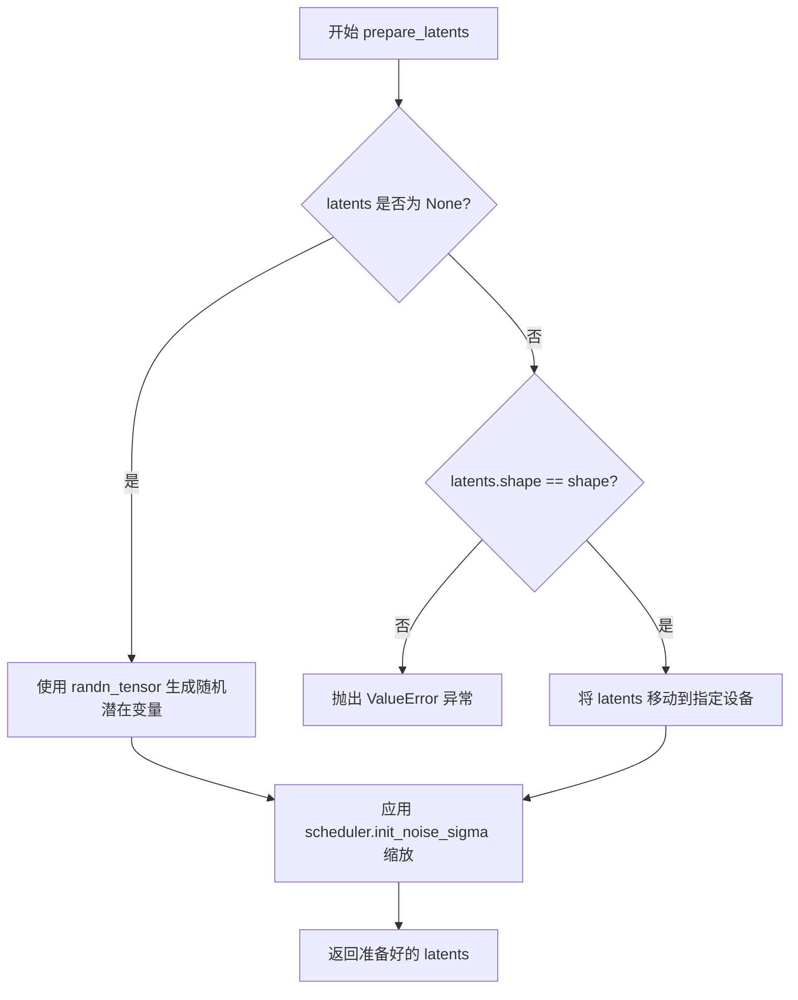
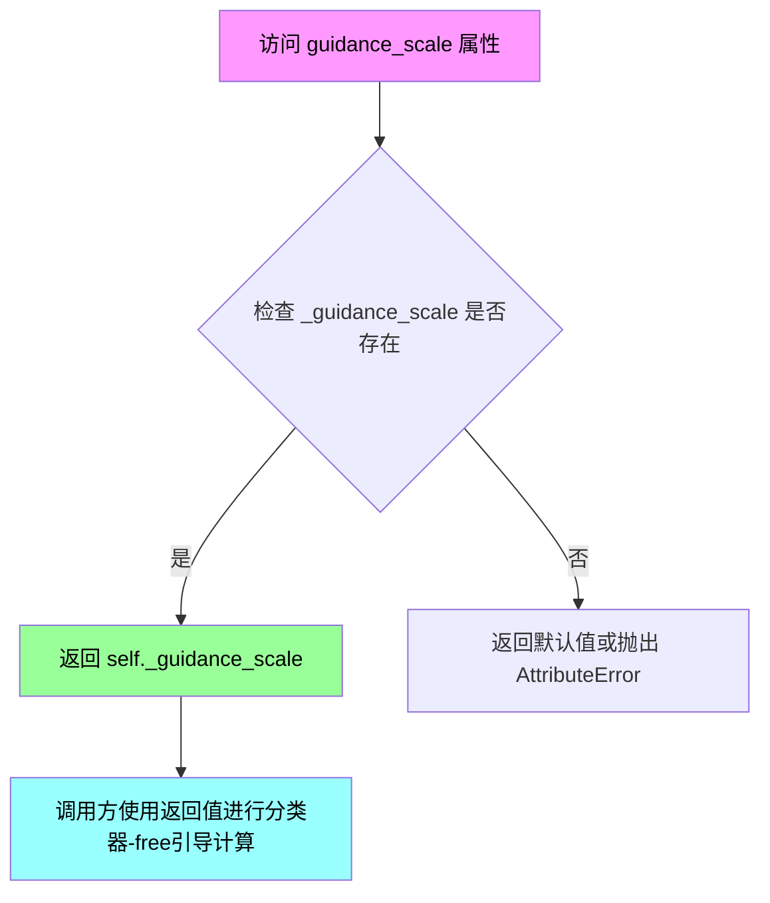
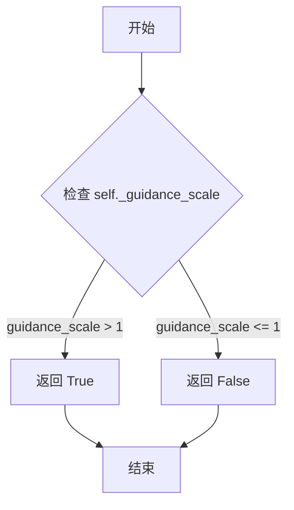
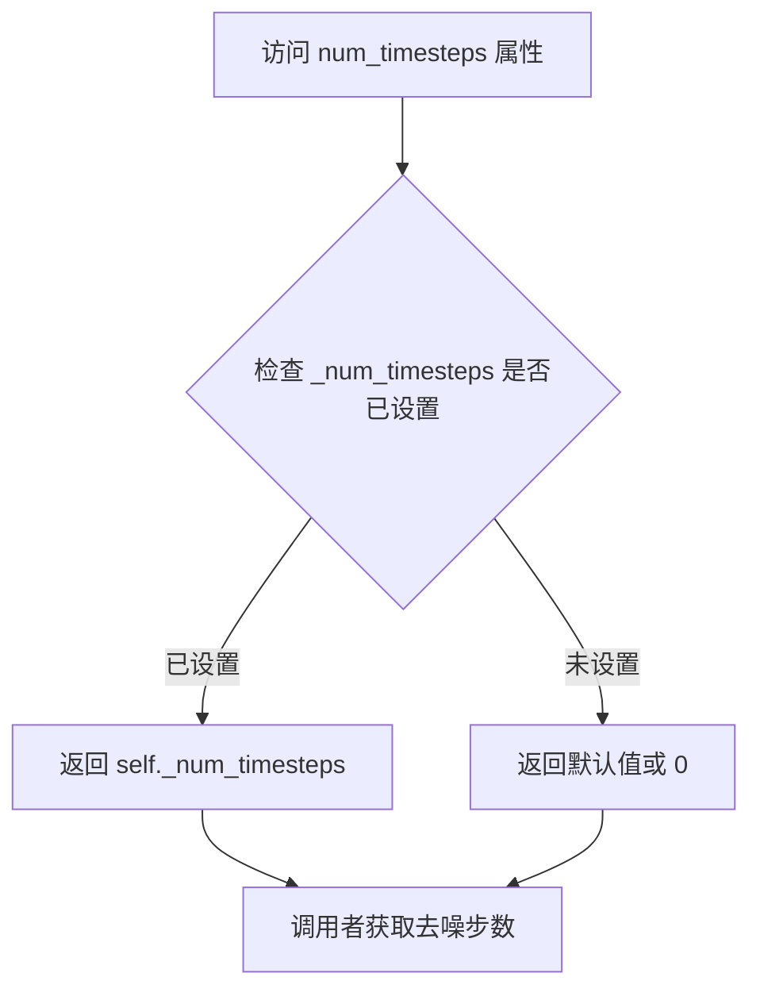
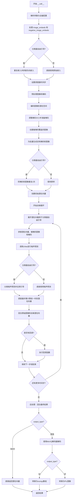

# `diffusers\src\diffusers\pipelines\kandinsky2_2\pipeline_kandinsky2_2_inpainting.py` 详细设计文档

KandinskyV22InpaintPipeline是一个基于Kandinsky 2.2模型的图像修复（inpainting）扩散管道，通过CLIP图像嵌入条件引导，使用条件U-Net对噪声进行去噪处理，并利用MoVQ解码器从潜在空间重建图像，实现根据文本提示对图像指定区域进行智能修复生成。

## 整体流程



## 类结构

```
DiffusionPipeline (基类)
└── KandinskyV22InpaintPipeline
    ├── 模块: UNet2DConditionModel (unet)
    ├── 模块: DDPMScheduler (scheduler)
    └── 模块: VQModel (movq)
```

## 全局变量及字段


### `logger`
    
模块级日志记录器，用于记录管道运行过程中的信息

类型：`logging.Logger`
    


### `EXAMPLE_DOC_STRING`
    
使用示例文档字符串，包含KandinskyV22InpaintPipeline的代码示例

类型：`str`
    


### `XLA_AVAILABLE`
    
标志位，指示torch_xla是否可用以支持XLA设备加速

类型：`bool`
    


### `__version__`
    
diffusers版本号，用于版本检查和兼容性判断

类型：`str`
    


### `KandinskyV22InpaintPipeline.model_cpu_offload_seq`
    
模型CPU卸载顺序配置，指定unet和movq的卸载序列

类型：`str`
    


### `KandinskyV22InpaintPipeline._callback_tensor_inputs`
    
回调函数可用的张量输入列表，包含latents、image_embeds等

类型：`list[str]`
    


### `KandinskyV22InpaintPipeline.unet`
    
条件U-Net去噪模型，用于根据图像嵌入和掩码预测噪声

类型：`UNet2DConditionModel`
    


### `KandinskyV22InpaintPipeline.scheduler`
    
DDPM噪声调度器，控制去噪过程中的噪声调度

类型：`DDPMScheduler`
    


### `KandinskyV22InpaintPipeline.movq`
    
MoVQ解码器，将潜在空间向量转换为最终图像

类型：`VQModel`
    


### `KandinskyV22InpaintPipeline.movq_scale_factor`
    
MoVQ缩放因子，用于计算潜在空间的尺寸

类型：`int`
    


### `KandinskyV22InpaintPipeline._warn_has_been_called`
    
标志位记录警告是否已显示，防止重复输出兼容性警告

类型：`bool`
    


### `KandinskyV22InpaintPipeline._guidance_scale`
    
分类器自由引导比例，控制生成图像与文本提示的相关程度

类型：`float`
    


### `KandinskyV22InpaintPipeline._num_timesteps`
    
去噪步数，记录完整推理过程中的时间步总数

类型：`int`
    


### `KandinskyV22InpaintPipeline._execution_device`
    
执行设备，继承自DiffusionPipeline，指定模型运行设备

类型：`torch.device`
    
    

## 全局函数及方法


### `downscale_height_and_width`

该函数用于将输入图像的高度和宽度根据缩放因子（scale_factor）调整到潜在空间尺寸。核心逻辑是先将原始尺寸除以 `scale_factor` 的平方进行下采样，若存在余数则向上取整，最后再乘以 `scale_factor` 恢复尺寸，确保输出尺寸为缩放因子的整数倍以适配 VQModel 的潜在空间要求。

参数：

- `height`：`int`，原始图像的高度（像素）
- `width`：`int`，原始图像的宽度（像素）
- `scale_factor`：`int`（可选，默认值为 `8`），用于计算潜在空间尺寸的缩放因子，通常对应 VQModel 的上采样倍数

返回值：`tuple[int, int]`，返回调整后的 (new_height, new_width)，即潜在空间中的图像尺寸

#### 流程图



#### 带注释源码

```python
def downscale_height_and_width(height, width, scale_factor=8):
    """
    根据缩放因子将图像高度和宽度调整到潜在空间尺寸
    
    该函数用于将原始图像尺寸转换为 VQModel 潜在空间的尺寸。
    实现逻辑：先将尺寸除以 scale_factor 的平方进行下采样，
    如果不能整除则向上取整，最后再乘以 scale_factor 得到最终尺寸。
    
    Args:
        height: 原始图像高度（像素）
        width: 原始图像宽度（像素）
        scale_factor: 缩放因子，默认为 8，对应 MoVQ 的上采样倍数
    
    Returns:
        tuple: (new_height, new_width) 调整后的潜在空间尺寸
    """
    # 计算高度方向的下采样尺寸
    new_height = height // scale_factor**2  # 整数除法，向下取整
    if height % scale_factor**2 != 0:       # 如果不能整除
        new_height += 1                      # 向上取整，保证覆盖所有像素
    
    # 计算宽度方向的下采样尺寸
    new_width = width // scale_factor**2    # 整数除法，向下取整
    if width % scale_factor**2 != 0:         # 如果不能整除
        new_width += 1                        # 向上取整，保证覆盖所有像素
    
    # 乘以 scale_factor 恢复到潜在空间尺寸并返回
    return new_height * scale_factor, new_width * scale_factor
```

---

#### 潜在技术债务与优化空间

1. **函数命名可读性**：函数名 `downscale_height_and_width` 容易产生歧义——实际返回的是上采样后的尺寸（非下采样结果），建议重命名为 `get_latent_space_dimensions` 或 `compute_latent_size` 以更准确反映其功能。

2. **硬编码的缩放因子逻辑**：当前函数使用 `scale_factor**2` 的平方计算方式，假设了特定的 VQModel 架构。若不同模型使用不同的下采样率，函数需扩展支持。

3. **缺少输入校验**：函数未对负数或零值输入进行校验，可能导致异常或不符合预期的行为。

4. **文档注释缺失**：虽然代码结构简单，但缺少完整的 docstring 描述参数来源与使用场景，建议补充示例说明该函数在 Kandinsky pipeline 中的角色。


### `prepare_mask`

该函数用于扩展掩码边界，确保掩码区域连续。它通过检查每个像素点，如果该点为0（不保留），则将其周围8个相邻像素也设置为0，从而在二值掩码中创建连续的保留区域。

参数：

-  `masks`：`list[torch.Tensor]`，输入的掩码列表，每个掩码为 `batch x 1 x height x width` 形状的张量

返回值：`torch.Tensor`，堆叠后的掩码张量，形状为 `batch x 1 x height x width`

#### 流程图

```mermaid
flowchart TD
    A[开始: 接收 masks 列表] --> B[初始化空列表 prepared_masks]
    B --> C[遍历 masks 中的每个 mask]
    C --> D[深拷贝原始 mask 到 old_mask]
    D --> E[遍历 mask 的高度维度 i]
    E --> F[遍历 mask 的宽度维度 j]
    F --> G{判断 old_mask[0][i][j] == 1?}
    G -->|Yes| H[跳过当前像素,继续]
    G -->|No| I[将周围8邻域像素设为0]
    I --> I1[上方像素: mask[:, i-1, j] = 0]
    I --> I2[左方像素: mask[:, i, j-1] = 0]
    I --> I3[左上方像素: mask[:, i-1, j-1] = 0]
    I --> I4[下方像素: mask[:, i+1, j] = 0]
    I --> I5[右方像素: mask[:, i, j+1] = 0]
    I --> I6[右下方像素: mask[:, i+1, j+1] = 0]
    H --> J{宽度循环结束?}
    I1 --> J
    I2 --> J
    I3 --> J
    I4 --> J
    I5 --> J
    I6 --> J
    J --> K{高度循环结束?}
    K -->|No| F
    K --> L[将处理后的 mask 加入 prepared_masks]
    L --> C
    C --> M{masks 遍历结束?}
    M -->|No| C
    M --> N[使用 torch.stack 堆叠所有处理后的 mask]
    N --> O[返回堆叠结果]
```

#### 带注释源码

```python
def prepare_mask(masks):
    """
    扩展掩码边界，确保掩码区域连续。
    对于每个掩码，如果某个像素点为0（不保留），则将其周围8邻域的像素也设为0，
    从而创建连通的保留区域。
    """
    prepared_masks = []  # 用于存储处理后的掩码列表
    for mask in masks:  # 遍历输入的每个掩码
        old_mask = deepcopy(mask)  # 深拷贝原始掩码，用于判断原始像素值
        # 遍历掩码的高度维度
        for i in range(mask.shape[1]):
            # 遍历掩码的宽度维度
            for j in range(mask.shape[2]):
                # 如果当前像素为1（需要保留），则跳过处理
                if old_mask[0][i][j] == 1:
                    continue
                # 如果当前像素为0，则将其周围8个相邻像素设为0
                # 上方像素
                if i != 0:
                    mask[:, i - 1, j] = 0
                # 左方像素
                if j != 0:
                    mask[:, i, j - 1] = 0
                # 左上方像素
                if i != 0 and j != 0:
                    mask[:, i - 1, j - 1] = 0
                # 下方像素
                if i != mask.shape[1] - 1:
                    mask[:, i + 1, j] = 0
                # 右方像素
                if j != mask.shape[2] - 1:
                    mask[:, i, j + 1] = 0
                # 右下方像素
                if i != mask.shape[1] - 1 and j != mask.shape[2] - 1:
                    mask[:, i + 1, j + 1] = 0
        # 将处理后的掩码添加到列表中
        prepared_masks.append(mask)
    # 使用 torch.stack 将所有掩码堆叠成批量张量
    return torch.stack(prepared_masks, dim=0)
```


### `prepare_mask_and_masked_image`

该函数是 Kandinsky 2.2 图像修复管道的核心预处理函数，负责将不同格式（NumPy 数组、PIL 图像或 PyTorch 张量）的图像和掩码统一转换为标准化的 4D PyTorch 张量（batch × channels × height × width），其中图像被归一化到 [-1, 1] 范围，掩码被二值化并反转以适配修复逻辑。

参数：

- `image`：`np.array | PIL.Image.Image | torch.Tensor`，待修复的输入图像，可以是 PIL 图像、NumPy 数组或 PyTorch 张量
- `mask`：`np.array | PIL.Image.Image | torch.Tensor`，用于指示修复区域的掩码，白色区域将被修复
- `height`：`int`，目标图像高度（默认 512）
- `width`：`int`，目标图像宽度（默认 512）

返回值：`tuple[torch.Tensor]`，返回元组 (mask, image)，两者均为 4D PyTorch 张量，形状为 (batch, channels, height, width)

#### 流程图

```mermaid
flowchart TD
    A[开始: prepare_mask_and_masked_image] --> B{image is None?}
    B -->|Yes| C[抛出 ValueError: image cannot be undefined]
    B -->|No| D{mask is None?}
    D -->|Yes| E[抛出 ValueError: mask cannot be undefined]
    D -->|No| F{image 是 torch.Tensor?}
    
    F -->|Yes| G{检查 mask 也是 torch.Tensor}
    G -->|No| H[抛出 TypeError]
    G -->|Yes| I[处理 batch 维度]
    I --> J[验证维度与范围]
    J --> K[二值化掩码<br/>mask[mask < 0.5] = 0<br/>mask[mask >= 0.5] = 1]
    K --> L[转换为 float32]
    
    F -->|No| M{mask 是 torch.Tensor?}
    M -->|Yes| N[抛出 TypeError: 类型不匹配]
    M -->|No| O[预处理图像]
    O --> P[调整大小到 width×height]
    O --> Q[转换为 numpy array]
    O --> R[转换为 tensor 并归一化到 [-1,1]]
    
    S[预处理掩码] --> T[调整大小]
    T --> U[转换为灰度]
    U --> V[归一化到 [0,1]]
    V --> W[二值化]
    W --> X[转换为 tensor]
    
    L --> Y[mask = 1 - mask<br/>反转掩码]
    X --> Y
    Y --> Z[返回 tuple[mask, image]]
```

#### 带注释源码

```python
def prepare_mask_and_masked_image(image, mask, height, width):
    r"""
    Prepares a pair (mask, image) to be consumed by the Kandinsky inpaint pipeline. This means that those inputs will
    be converted to ``torch.Tensor`` with shapes ``batch x channels x height x width`` where ``channels`` is ``3`` for
    the ``image`` and ``1`` for the ``mask``.

    The ``image`` will be converted to ``torch.float32`` and normalized to be in ``[-1, 1]``. The ``mask`` will be
    binarized (``mask > 0.5``) and cast to ``torch.float32`` too.

    Args:
        image (np.array | PIL.Image | torch.Tensor): The image to inpaint.
            It can be a ``PIL.Image``, or a ``height x width x 3`` ``np.array`` or a ``channels x height x width``
            ``torch.Tensor`` or a ``batch x channels x height x width`` ``torch.Tensor``.
        mask (_type_): The mask to apply to the image, i.e. regions to inpaint.
            It can be a ``PIL.Image``, or a ``height x width`` ``np.array`` or a ``1 x height x width``
            ``torch.Tensor`` or a ``batch x 1 x height x width`` ``torch.Tensor``.
        height (`int`, *optional*, defaults to 512):
            The height in pixels of the generated image.
        width (`int`, *optional*, defaults to 512):
            The width in pixels of the generated image.


    Raises:
        ValueError: ``torch.Tensor`` images should be in the ``[-1, 1]`` range. ValueError: ``torch.Tensor`` mask
        should be in the ``[0, 1]`` range. ValueError: ``mask`` and ``image`` should have the same spatial dimensions.
        TypeError: ``mask`` is a ``torch.Tensor`` but ``image`` is not
            (ot the other way around).

    Returns:
        tuple[torch.Tensor]: The pair (mask, image) as ``torch.Tensor`` with 4
            dimensions: ``batch x channels x height x width``.
    """

    # 检查 image 是否为 None
    if image is None:
        raise ValueError("`image` input cannot be undefined.")

    # 检查 mask 是否为 None
    if mask is None:
        raise ValueError("`mask_image` input cannot be undefined.")

    # 分支1: image 已经是 torch.Tensor
    if isinstance(image, torch.Tensor):
        # 验证 mask 也必须是 torch.Tensor
        if not isinstance(mask, torch.Tensor):
            raise TypeError(f"`image` is a torch.Tensor but `mask` (type: {type(mask)} is not")

        # Batch single image: 如果是 3D tensor (3, H, W)，添加 batch 维度
        if image.ndim == 3:
            assert image.shape[0] == 3, "Image outside a batch should be of shape (3, H, W)"
            image = image.unsqueeze(0)

        # Batch and add channel dim for single mask: 2D mask (H, W) -> (1, 1, H, W)
        if mask.ndim == 2:
            mask = mask.unsqueeze(0).unsqueeze(0)

        # Batch single mask or add channel dim: 处理 3D mask
        if mask.ndim == 3:
            # Single batched mask, no channel dim or single mask not batched but channel dim
            if mask.shape[0] == 1:
                mask = mask.unsqueeze(0)
            # Batched masks no channel dim
            else:
                mask = mask.unsqueeze(1)

        # 验证维度: 必须是 4D tensor
        assert image.ndim == 4 and mask.ndim == 4, "Image and Mask must have 4 dimensions"
        # 验证空间尺寸一致
        assert image.shape[-2:] == mask.shape[-2:], "Image and Mask must have the same spatial dimensions"
        # 验证 batch size 一致
        assert image.shape[0] == mask.shape[0], "Image and Mask must have the same batch size"

        # 验证图像在 [-1, 1] 范围内
        if image.min() < -1 or image.max() > 1:
            raise ValueError("Image should be in [-1, 1] range")

        # 验证掩码在 [0, 1] 范围内
        if mask.min() < 0 or mask.max() > 1:
            raise ValueError("Mask should be in [0, 1] range")

        # Binarize mask: 二值化掩码
        mask[mask < 0.5] = 0
        mask[mask >= 0.5] = 1

        # Image as float32: 转换为 float32
        image = image.to(dtype=torch.float32)
    
    # 分支2: mask 是 torch.Tensor 但 image 不是 -> 类型不匹配
    elif isinstance(mask, torch.Tensor):
        raise TypeError(f"`mask` is a torch.Tensor but `image` (type: {type(image)} is not")
    
    # 分支3: 两者都不是 torch.Tensor，需要预处理
    else:
        # ========== 预处理图像 ==========
        # 统一转为 list 以便批量处理
        if isinstance(image, (PIL.Image.Image, np.ndarray)):
            image = [image]

        # 处理 PIL Image 列表: 调整大小并转换为 numpy
        if isinstance(image, list) and isinstance(image[0], PIL.Image.Image):
            # resize all images w.r.t passed height an width
            image = [i.resize((width, height), resample=Image.BICUBIC, reducing_gap=1) for i in image]
            image = [np.array(i.convert("RGB"))[None, :] for i in image]
            image = np.concatenate(image, axis=0)
        # 处理 numpy array 列表
        elif isinstance(image, list) and isinstance(image[0], np.ndarray):
            image = np.concatenate([i[None, :] for i in image], axis=0)

        # 转换维度: (batch, H, W, C) -> (batch, C, H, W)
        image = image.transpose(0, 3, 1, 2)
        # 转换为 tensor 并归一化到 [-1, 1]
        image = torch.from_numpy(image).to(dtype=torch.float32) / 127.5 - 1.0

        # ========== 预处理掩码 ==========
        # 统一转为 list
        if isinstance(mask, (PIL.Image.Image, np.ndarray)):
            mask = [mask]

        # 处理 PIL Image 列表: 调整大小并转换为灰度 numpy
        if isinstance(mask, list) and isinstance(mask[0], PIL.Image.Image):
            mask = [i.resize((width, height), resample=PIL.Image.LANCZOS) for i in mask]
            mask = np.concatenate([np.array(m.convert("L"))[None, None, :] for m in mask], axis=0)
            mask = mask.astype(np.float32) / 255.0
        # 处理 numpy array 列表
        elif isinstance(mask, list) and isinstance(mask[0], np.ndarray):
            mask = np.concatenate([m[None, None, :] for m in mask], axis=0)

        # 二值化掩码
        mask[mask < 0.5] = 0
        mask[mask >= 0.5] = 1
        # 转换为 tensor
        mask = torch.from_numpy(mask)

    # 反转掩码: 1 - mask
    # 使得白色区域（待修复）变为 0，黑色区域（保留）变为 1
    mask = 1 - mask

    return mask, image
```


### `randn_tensor`

从上层模块导入的随机张量生成函数，用于生成符合标准正态分布（高斯分布）的随机张量，通常用于扩散模型的噪声采样。

参数：

-  `shape`：`tuple` 或 `torch.Size`，随机张量的目标形状
-  `generator`：`torch.Generator` 或 `list[torch.Generator]` 或 `None`，可选的随机数生成器，用于确保结果可复现
-  `device`：`torch.device`，生成张量所在的设备（CPU/CUDA）
-  `dtype`：`torch.dtype`，生成张量的数据类型（如 `torch.float32`）

返回值：`torch.Tensor`，符合正态分布的随机张量，形状为指定的 `shape`

#### 流程图



#### 带注释源码

```python
# 该函数定义在 diffusers.utils.torch_utils 模块中
# 以下为基于调用方式的推断实现

def randn_tensor(
    shape: tuple,
    generator: Optional[Union[torch.Generator, List[torch.Generator]]] = None,
    device: Optional[torch.device] = None,
    dtype: Optional[torch.dtype] = None,
) -> torch.Tensor:
    """
    生成符合标准正态分布的随机张量。
    
    参数:
        shape: 张量的目标形状，如 (batch_size, channels, height, width)
        generator: 可选的 PyTorch 生成器，用于确保可复现性
        device: 目标设备
        dtype: 目标数据类型
    
    返回:
        符合正态分布的随机张量
    """
    # 如果没有指定生成器，使用默认的随机数生成方式
    if generator is None:
        # 使用 torch.randn 生成随机张量
        # 如果指定了 device，则创建在该设备上
        if device is not None:
            # 在指定设备上创建随机张量
            tensor = torch.randn(shape, device=device, dtype=dtype)
        else:
            tensor = torch.randn(shape, dtype=dtype)
    else:
        # 使用生成器生成随机数
        # 这确保了结果的可复现性
        if device is not None:
            tensor = torch.randn(shape, generator=generator, device=device, dtype=dtype)
        else:
            tensor = torch.randn(shape, generator=generator, dtype=dtype)
    
    return tensor
```

> **注意**：该函数在代码中的实际定义位于 `diffusers.utils.torch_utils` 模块，通过 `from ...utils.torch_utils import randn_tensor` 导入，并在 `KandinskyV22InpaintPipeline.prepare_latents` 方法中调用，用于生成扩散模型的去噪起始噪声。


### `deprecate`

从 `diffusers.utils` 模块导入的废弃警告函数，用于在代码中使用废弃功能时发出警告。

参数：

-  `deprecated_name`：`str`，要废弃的参数或功能的名称
-  `deprecated_version`：`str`，宣布废弃的版本号
-  ` deprrecation_message`：`str`，关于废弃的详细说明信息

返回值：`None`，该函数不返回值，仅通过 `logger.warning` 输出警告信息

#### 流程图



#### 带注释源码

```python
# 定义在 diffusers/src/diffusers/utils/deprecation_utils.py 中
def deprecate(
    deprecated_name: str,
    deprecated_version: str,
    deprecation_message: str,
):
    """
    发出废弃警告的实用函数
    
    参数:
        deprecated_name: 要废弃的参数或功能的名称
        deprecated_version: 宣布废弃的版本号
        deprecation_message: 关于废弃的详细说明信息
    
    返回:
        None
    """
    
    # 检查该废弃项是否已经被警告过，避免重复警告
    if deprecated_name in _deprecate_warned:
        return
    
    # 构建完整的警告消息，包含废弃名称、版本和建议
    warning = f"'{deprecated_name}' is deprecated in version {deprecated_version} and will be removed in a future version. {deprecation_message}"
    
    # 使用 logger 输出警告
    logger.warning(warning)
    
    # 将该废弃项加入已警告集合，防止重复警告
    _deprecate_warned.add(deprecated_name)
```

#### 在代码中的使用示例

```python
# 在 KandinskyV22InpaintPipeline.__call__ 方法中使用
if callback is not None:
    deprecate(
        "callback",              # 废弃的参数名
        "1.0.0",                 # 废弃版本
        "Passing `callback` as an input argument to `__call__` is deprecated, consider use `callback_on_step_end`",  # 替代方案
    )
if callback_steps is not None:
    deprecate(
        "callback_steps",
        "1.0.0",
        "Passing `callback_steps` as an input argument to `__call__` is deprecated, consider use `callback_on_step_end`",
    )
```


### logging.get_logger

获取与当前模块关联的日志记录器实例，用于在模块中记录日志信息。

参数：

- `name`：`str`，日志记录器的名称，通常使用 `__name__` 变量，表示调用模块的完整路径

返回值：`logging.Logger`，返回配置好的日志记录器对象，可用于记录不同级别的日志信息

#### 流程图



#### 带注释源码

```python
# 调用 logging.get_logger 获取模块级日志记录器
# __name__ 是 Python 内置变量，表示当前模块的完整路径
# 例如: 'diffusers.pipelines.kandinsky2_2.pipeline_kandinsky2_2_inpaint'
logger = logging.get_logger(__name__)  # pylint: disable=invalid-name
```

#### 说明

在代码中的实际使用：

```python
# 从 diffusers.utils 导入 logging 模块
from ...utils import deprecate, is_torch_xla_available, logging

# 使用模块的 __name__ 属性作为参数调用 get_logger 函数
# 返回的 logger 对象用于在当前模块中记录日志信息
logger = logging.get_logger(__name__)

# 后续在代码中可以使用 logger 进行日志记录
logger.warning("Please note that the expected format of `mask_image` has recently been changed...")
```

该函数是 diffusers 库内部封装的日志工具，调用了 `...utils.logging` 模块中的 `get_logger` 函数，用于为当前模块创建一个专用的日志记录器，以便在管道执行过程中输出相关信息和警告。


### `KandinskyV22InpaintPipeline.__init__`

初始化Kandinsky 2.2图像修复管道，注册UNet去噪模型、DDPM调度器和MoVQ解码器组件，并计算MoVQ的缩放因子用于后续图像尺寸处理，同时初始化警告标志用于版本兼容性提示。

参数：

- `self`：隐式参数，KandinskyV22InpaintPipeline实例本身
- `unet`：`UNet2DConditionModel`，条件U-Net架构，用于对图像嵌入进行去噪
- `scheduler`：`DDPMScheduler`，DDPM调度器，用于生成图像潜在表示
- `movq`：`VQModel`，MoVQ解码器，用于从潜在表示生成最终图像

返回值：无返回值（`None`），构造函数在初始化时直接设置实例属性

#### 流程图

```mermaid
flowchart TD
    A[开始 __init__] --> B[调用 super().__init__ 初始化基类]
    B --> C[调用 register_modules 注册 unet, scheduler, movq 三个组件]
    C --> D[计算 movq_scale_factor = 2^(len(movq.config.block_out_channels) - 1)]
    D --> E[设置 _warn_has_been_called = False]
    E --> F[结束 __init__]
```

#### 带注释源码

```python
def __init__(
    self,
    unet: UNet2DConditionModel,
    scheduler: DDPMScheduler,
    movq: VQModel,
):
    # 调用父类 DiffusionPipeline 的初始化方法
    # 设置基本的管道配置和设备管理
    super().__init__()

    # 使用 register_modules 方法注册三个核心组件模型
    # 这些模块会被保存为 self.unet, self.scheduler, self.movq
    # 同时也会注册到 pipeline_utils 中用于保存/加载
    self.register_modules(
        unet=unet,
        scheduler=scheduler,
        movq=movq,
    )
    
    # 计算 MoVQ 的缩放因子
    # 基于 VQModel 的 block_out_channels 数量计算下采样倍数
    # 用于后续将输入图像尺寸下采样到潜在空间
    self.movq_scale_factor = 2 ** (len(self.movq.config.block_out_channels) - 1)
    
    # 初始化警告标志，用于在 __call__ 中控制版本兼容性警告的显示
    # 确保警告只显示一次
    self._warn_has_been_called = False
```


### `KandinskyV22InpaintPipeline.prepare_latents`

准备初始潜在变量，用于图像生成过程的起始点。该方法接受形状、数据类型、设备、随机生成器、预生成潜在变量和调度器，如果未提供潜在变量则随机生成，否则使用提供的潜在变量并应用调度器的初始噪声sigma进行缩放。

参数：

- `shape`：`tuple`，潜在变量的目标形状，通常为 `(batch_size, num_channels_latents, height, width)`
- `dtype`：`torch.dtype`，潜在变量的数据类型，通常与图像嵌入的数据类型一致
- `device`：`torch.device`，潜在变量存放的设备（CPU或CUDA）
- `generator`：`torch.Generator | None`，可选的随机数生成器，用于确保生成的可重复性
- `latents`：`torch.Tensor | None`，可选的预生成潜在变量，如果为 `None` 则随机生成
- `scheduler`：`DDPMScheduler`，调度器，用于获取初始噪声sigma值

返回值：`torch.Tensor`，准备好的潜在变量张量，已应用调度器的初始噪声sigma

#### 流程图



#### 带注释源码

```python
def prepare_latents(self, shape, dtype, device, generator, latents, scheduler):
    """
    准备用于去噪过程的初始潜在变量。
    
    如果未提供潜在变量，则使用 randn_tensor 从随机正态分布中采样生成；
    如果提供了潜在变量，则验证其形状是否与预期形状匹配，然后将其移动到指定设备。
    最后，将潜在变量乘以调度器的初始噪声sigma进行缩放，以适配扩散模型的噪声调度。
    
    参数:
        shape: 潜在变量的目标形状 (batch_size, channels, height, width)
        dtype: 潜在变量的数据类型
        device: 潜在变量存放的设备
        generator: 可选的随机数生成器，用于确保可重复性
        latents: 可选的预生成潜在变量
        scheduler: 调度器，用于获取 init_noise_sigma
    
    返回:
        准备好的潜在变量张量
    """
    # 如果未提供潜在变量，则随机生成
    if latents is None:
        latents = randn_tensor(shape, generator=generator, device=device, dtype=dtype)
    else:
        # 验证潜在变量的形状是否匹配
        if latents.shape != shape:
            raise ValueError(f"Unexpected latents shape, got {latents.shape}, expected {shape}")
        # 将潜在变量移动到指定设备
        latents = latents.to(device)

    # 使用调度器的初始噪声sigma进行缩放
    # 这确保潜在变量符合扩散过程开始时的噪声水平
    latents = latents * scheduler.init_noise_sigma
    return latents
```


### `KandinskyV22InpaintPipeline.guidance_scale`

获取当前配置的引导比例（guidance scale），该参数用于控制分类器-free扩散引导（Classifier-Free Diffusion Guidance）的强度。引导比例越高，生成的图像与文本提示的相关性越强，但可能导致图像质量下降。

参数：
- `self`：隐式参数，类型为 `KandinskyV22InpaintPipeline`，表示管道实例本身

返回值：`float`，返回当前使用的引导比例值，该值在调用 `__call__` 方法时通过 `guidance_scale` 参数设置。

#### 流程图



#### 带注释源码

```python
@property
def guidance_scale(self):
    """
    属性 getter: 获取引导比例（guidance scale）
    
    该属性返回当前配置的引导比例值，用于分类器-free扩散引导（CFG）。
    在图像生成过程中，CFG 通过以下公式影响噪声预测：
    noise_pred = noise_pred_uncond + guidance_scale * (noise_pred_text - noise_pred_uncond)
    
    引导比例 > 1 时启用 CFG，值越大生成的图像与提示词相关性越高，
    但可能牺牲图像质量或导致过度饱和。
    
    Returns:
        float: 当前使用的引导比例值
    """
    return self._guidance_scale
```

#### 相关代码上下文

```python
# 在 __call__ 方法中设置该值
self._guidance_scale = guidance_scale  # guidance_scale 默认值为 4.0

# 该属性被用于判断是否启用分类器-free引导
@property
def do_classifier_free_guidance(self):
    return self._guidance_scale > 1  # 当 guidance_scale > 1 时启用 CFG

# 在去噪循环中使用引导比例进行噪声预测调整
noise_pred = noise_pred_uncond + self.guidance_scale * (noise_pred_text - noise_pred_uncond)
```


### `KandinskyV22InpaintPipeline.do_classifier_free_guidance`

该属性用于判断是否启用分类器自由引导（Classifier-Free Guidance, CFG）。当 `guidance_scale` 参数大于 1 时返回 `True`，表示在图像生成过程中将启用 CFG 技术，以更好地遵循文本提示；否则返回 `False`。

参数：

- （无，此为属性方法，无参数）

返回值：`bool`，返回是否启用分类器自由引导。当 `self._guidance_scale > 1` 时返回 `True`，否则返回 `False`。

#### 流程图



#### 带注释源码

```python
@property
def do_classifier_free_guidance(self):
    """
    属性：判断是否启用分类器自由引导（Classifier-Free Guidance, CFG）

    该属性通过检查 guidance_scale 是否大于 1 来确定是否启用 CFG。
    CFG 是一种用于改善扩散模型生成质量的引导技术，通过在推理时
    同时考虑条件和无条件预测来引导生成过程更贴近文本提示。

    返回值:
        bool: 如果 guidance_scale > 1 则返回 True（启用 CFG），
              否则返回 False（禁用 CFG）
    """
    return self._guidance_scale > 1
```


### `KandinskyV22InpaintPipeline.num_timesteps`

获取去噪步数，即推理过程中使用的时间步数量。该属性返回在图像生成过程中实际使用的时间步总数。

参数：

- （无参数，这是一个属性访问器）

返回值：`int`，去噪步数，即推理过程中使用的时间步总数。

#### 流程图



#### 带注释源码

```python
@property
def num_timesteps(self):
    """
    属性方法：获取去噪步数
    
    该属性返回在图像生成过程中实际使用的时间步总数。
    _num_timesteps 在 __call__ 方法中被设置，值为 len(timesteps)，
    即调度器时间步列表的长度。
    
    Returns:
        int: 去噪步数，即推理过程中使用的时间步总数
    """
    return self._num_timesteps
```


### KandinskyV22InpaintPipeline.__call__

主管道执行方法，用于根据图像嵌入、原始图像和掩码进行图像修复生成。该方法通过去噪过程逐步从噪声中重建图像，并在掩码区域根据图像嵌入进行条件生成。

参数：

- `image_embeds`：`torch.Tensor | list[torch.Tensor]`，CLIP图像嵌入，用于条件图像生成
- `image`：`torch.Tensor | PIL.Image.Image`，待修复的输入图像
- `mask_image`：`torch.Tensor | PIL.Image.Image | np.ndarray`，掩码图像，白色像素将被重绘，黑色像素将被保留
- `negative_image_embeds`：`torch.Tensor | list[torch.Tensor]`，负向CLIP图像嵌入，用于无分类器引导
- `height`：`int`，生成图像的高度，默认为512
- `width`：`int`，生成图像的宽度，默认为512
- `num_inference_steps`：`int`，去噪步数，默认为100
- `guidance_scale`：`float`，分类器自由引导比例，默认为4.0
- `num_images_per_prompt`：`int`，每个提示生成的图像数量，默认为1
- `generator`：`torch.Generator | list[torch.Generator] | None`，随机数生成器，用于确保可重复性
- `latents`：`torch.Tensor | None`，预生成的噪声潜在向量
- `output_type`：`str`，输出格式，可选"pil"、"np"、"pt"或"latent"，默认为"pil"
- `return_dict`：`bool`，是否返回字典格式结果，默认为True
- `callback_on_step_end`：`Callable | None`，每步结束时的回调函数
- `callback_on_step_end_tensor_inputs`：`list[str]`，回调函数可访问的tensor输入列表

返回值：`ImagePipelineOutput | tuple`，包含生成图像的输出对象

#### 流程图



#### 带注释源码

```python
@torch.no_grad()
def __call__(
    self,
    image_embeds: torch.Tensor | list[torch.Tensor],
    image: torch.Tensor | PIL.Image.Image,
    mask_image: torch.Tensor | PIL.Image.Image | np.ndarray,
    negative_image_embeds: torch.Tensor | list[torch.Tensor],
    height: int = 512,
    width: int = 512,
    num_inference_steps: int = 100,
    guidance_scale: float = 4.0,
    num_images_per_prompt: int = 1,
    generator: torch.Generator | list[torch.Generator] | None = None,
    latents: torch.Tensor | None = None,
    output_type: str | None = "pil",
    return_dict: bool = True,
    callback_on_step_end: Callable[[int, int], None] | None = None,
    callback_on_step_end_tensor_inputs: list[str] = ["latents"],
    **kwargs,
):
    """
    图像修复管道的主调用方法，执行完整的图像生成和修复流程
    
    处理流程：
    1. 参数验证和预处理
    2. 图像和掩码编码到潜在空间
    3. 去噪循环（UNet推理）
    4. 解码潜在向量到最终图像
    """
    
    # 兼容性警告：检查diffusers版本并提示掩码格式变化
    if not self._warn_has_been_called and version.parse(version.parse(__version__).base_version) < version.parse("0.23.0.dev0"):
        logger.warning(
            "Please note that the expected format of `mask_image` has recently been changed. "
            "Before diffusers == 0.19.0, Kandinsky Inpainting pipelines repainted black pixels and preserved black pixels. "
            "As of diffusers==0.19.0 this behavior has been inverted. Now white pixels are repainted and black pixels are preserved. "
            "This way, Kandinsky's masking behavior is aligned with Stable Diffusion. "
            "THIS means that you HAVE to invert the input mask to have the same behavior as before as explained in https://github.com/huggingface/diffusers/pull/4207. "
            "This warning will be suppressed after the first inference call and will be removed in diffusers>0.23.0"
        )
        self._warn_has_been_called = True

    # 处理废弃的参数：callback 和 callback_steps
    callback = kwargs.pop("callback", None)
    callback_steps = kwargs.pop("callback_steps", None)

    if callback is not None:
        deprecate("callback", "1.0.0", "Passing `callback` as an input argument to `__call__` is deprecated, consider use `callback_on_step_end`")
    if callback_steps is not None:
        deprecate("callback_steps", "1.0.0", "Passing `callback_steps` as an input argument to `__call__` is deprecated, consider use `callback_on_step_end`")

    # 验证回调函数输入参数是否在允许列表中
    if callback_on_step_end_tensor_inputs is not None and not all(
        k in self._callback_tensor_inputs for k in callback_on_step_end_tensor_inputs
    ):
        raise ValueError(
            f"`callback_on_step_end_tensor_inputs` has to be in {self._callback_tensor_inputs}, but found {[k for k in callback_on_step_end_tensor_inputs if k not in self._callback_tensor_inputs]}"
        )

    # 设置引导比例
    self._guidance_scale = guidance_scale

    # 获取执行设备
    device = self._execution_device

    # 将图像嵌入列表拼接为单个张量
    if isinstance(image_embeds, list):
        image_embeds = torch.cat(image_embeds, dim=0)
    
    # 计算批量大小
    batch_size = image_embeds.shape[0] * num_images_per_prompt
    
    # 处理负向图像嵌入
    if isinstance(negative_image_embeds, list):
        negative_image_embeds = torch.cat(negative_image_embeds, dim=0)

    # 如果启用分类器自由引导，则处理嵌入
    if self.do_classifier_free_guidance:
        # 重复每个嵌入num_images_per_prompt次
        image_embeds = image_embeds.repeat_interleave(num_images_per_prompt, dim=0)
        negative_image_embeds = negative_image_embeds.repeat_interleave(num_images_per_prompt, dim=0)

        # 拼接负向和正向嵌入，并在维度0上拼接以实现无分类器引导
        image_embeds = torch.cat([negative_image_embeds, image_embeds], dim=0).to(
            dtype=self.unet.dtype, device=device
        )

    # 设置去噪调度器的时间步
    self.scheduler.set_timesteps(num_inference_steps, device=device)
    timesteps = self.scheduler.timesteps

    # 预处理图像和掩码：转换为张量并调整大小
    mask_image, image = prepare_mask_and_masked_image(image, mask_image, height, width)

    # 将图像编码到潜在空间
    image = image.to(dtype=image_embeds.dtype, device=device)
    image = self.movq.encode(image)["latents"]

    # 处理掩码
    mask_image = mask_image.to(dtype=image_embeds.dtype, device=device)

    # 获取图像形状并调整掩码大小以匹配潜在空间
    image_shape = tuple(image.shape[-2:])
    mask_image = F.interpolate(
        mask_image,
        image_shape,
        mode="nearest",
    )
    # 准备掩码（确保掩码连续性）
    mask_image = prepare_mask(mask_image)
    # 创建被掩码覆盖的图像
    masked_image = image * mask_image

    # 为批量生成复制掩码和被掩码图像
    mask_image = mask_image.repeat_interleave(num_images_per_prompt, dim=0)
    masked_image = masked_image.repeat_interleave(num_images_per_prompt, dim=0)
    
    # 如果启用分类器自由引导，复制掩码和图像以匹配UNet输出
    if self.do_classifier_free_guidance:
        mask_image = mask_image.repeat(2, 1, 1, 1)
        masked_image = masked_image.repeat(2, 1, 1, 1)

    # 获取潜在通道数
    num_channels_latents = self.movq.config.latent_channels

    # 调整高度和宽度以适应潜在空间
    height, width = downscale_height_and_width(height, width, self.movq_scale_factor)

    # 创建初始潜在向量
    latents = self.prepare_latents(
        (batch_size, num_channels_latents, height, width),
        image_embeds.dtype,
        device,
        generator,
        latents,
        self.scheduler,
    )
    # 保存噪声副本用于后续添加
    noise = torch.clone(latents)

    # 记录时间步数量
    self._num_timesteps = len(timesteps)
    
    # 主去噪循环
    for i, t in enumerate(self.progress_bar(timesteps)):
        # 展开潜在向量：如果启用分类器自由引导，则复制一份
        latent_model_input = torch.cat([latents] * 2) if self.do_classifier_free_guidance else latents
        
        # 拼接潜在向量、被掩码图像和掩码作为UNet输入
        latent_model_input = torch.cat([latent_model_input, masked_image, mask_image], dim=1)

        # 准备条件输入
        added_cond_kwargs = {"image_embeds": image_embeds}
        
        # 调用UNet进行噪声预测
        noise_pred = self.unet(
            sample=latent_model_input,
            timestep=t,
            encoder_hidden_states=None,  # Kandinsky不使用文本条件
            added_cond_kwargs=added_cond_kwargs,
            return_dict=False,
        )[0]

        # 如果启用分类器自由引导，分离并应用引导
        if self.do_classifier_free_guidance:
            noise_pred, variance_pred = noise_pred.split(latents.shape[1], dim=1)
            noise_pred_uncond, noise_pred_text = noise_pred.chunk(2)
            _, variance_pred_text = variance_pred_text.chunk(2)
            
            # 应用引导：noise_pred = noise_pred_uncond + guidance_scale * (noise_pred_text - noise_pred_uncond)
            noise_pred = noise_pred_uncond + self.guidance_scale * (noise_pred_text - noise_pred_uncond)
            noise_pred = torch.cat([noise_pred, variance_pred_text], dim=1)

        # 如果调度器不使用学习的方差，则分离噪声预测
        if not (
            hasattr(self.scheduler.config, "variance_type")
            and self.scheduler.config.variance_type in ["learned", "learned_range"]
        ):
            noise_pred, _ = noise_pred.split(latents.shape[1], dim=1)

        # 使用调度器计算前一个时间步的潜在向量
        latents = self.scheduler.step(
            noise_pred,
            t,
            latents,
            generator=generator,
        )[0]
        
        # 保存初始潜在向量和掩码用于混合
        init_latents_proper = image[:1]
        init_mask = mask_image[:1]

        # 如果不是最后一步，向初始潜在向量添加噪声
        if i < len(timesteps) - 1:
            noise_timestep = timesteps[i + 1]
            init_latents_proper = self.scheduler.add_noise(
                init_latents_proper, noise, torch.tensor([noise_timestep])
            )

        # 混合原始图像（被掩码区域）和去噪后的潜在向量
        latents = init_mask * init_latents_proper + (1 - init_mask) * latents

        # 执行步骤结束时的回调函数
        if callback_on_step_end is not None:
            callback_kwargs = {}
            for k in callback_on_step_end_tensor_inputs:
                callback_kwargs[k] = locals()[k]
            callback_outputs = callback_on_step_end(self, i, t, callback_kwargs)

            # 更新回调返回的变量
            latents = callback_outputs.pop("latents", latents)
            image_embeds = callback_outputs.pop("image_embeds", image_embeds)
            negative_image_embeds = callback_outputs.pop("negative_image_embeds", negative_image_embeds)
            masked_image = callback_outputs.pop("masked_image", masked_image)
            mask_image = callback_outputs.pop("mask_image", mask_image)

        # 旧版回调机制
        if callback is not None and i % callback_steps == 0:
            step_idx = i // getattr(self.scheduler, "order", 1)
            callback(step_idx, t, latents)

        # 如果使用PyTorch XLA，则标记步骤
        if XLA_AVAILABLE:
            xm.mark_step()

    # 后处理：最终混合原始图像（被掩码区域）
    latents = mask_image[:1] * image[:1] + (1 - mask_image[:1]) * latents

    # 验证输出类型
    if output_type not in ["pt", "np", "pil", "latent"]:
        raise ValueError(
            f"Only the output types `pt`, `pil`, `np` and `latent` are supported not output_type={output_type}"
        )

    # 如果不是仅输出潜在向量，则解码
    if not output_type == "latent":
        # 使用MoVQ解码器将潜在向量解码为图像
        image = self.movq.decode(latents, force_not_quantize=True)["sample"]

        # 如果输出需要为numpy或PIL格式，则进行转换
        if output_type in ["np", "pil"]:
            # 反归一化到[0, 1]
            image = image * 0.5 + 0.5
            image = image.clamp(0, 1)
            # 转换维度顺序并转为numpy
            image = image.cpu().permute(0, 2, 3, 1).float().numpy()

        # 如果输出需要为PIL格式
        if output_type == "pil":
            image = self.numpy_to_pil(image)
    else:
        # 直接返回潜在向量
        image = latents

    # 释放模型内存
    self.maybe_free_model_hooks()

    # 返回结果
    if not return_dict:
        return (image,)

    return ImagePipelineOutput(images=image)
```

## 关键组件


### 张量索引与惰性加载

在主 `__call__` 方法中，通过张量切片实现惰性加载优化。具体表现为：使用 `image[:1]` 和 `mask_image[:1]` 仅提取第一批次的图像和掩码用于后续处理，避免重复处理完整批次数据。

### 反量化支持

在 `movq.decode()` 调用中显式传入 `force_not_quantize=True` 参数，强制解码器输出未量化的浮点张量，确保图像修复结果的精度和质量。

### 量化策略

通过 `guidance_scale` 参数控制分类器自由引导（Classifier-Free Guidance）的强度，结合 `num_images_per_prompt` 实现批量图像生成，采用 `repeat_interleave` 和 `repeat` 操作动态扩展条件嵌入维度。

### prepare_mask_and_masked_image 函数

负责将多种格式的输入（ PIL.Image、np.array、torch.Tensor ）统一转换为标准化的 4D 张量格式，并进行图像归一化（[-1,1]）和掩码二值化（[0,1]）处理。

### prepare_mask 函数

通过膨胀操作确保掩码的连续性，遍历掩码像素并将其相邻像素设为零，防止修复区域出现孤立的遮罩区域。

### downscale_height_and_width 函数

根据 MoVQ 的缩放因子计算下采样后的空间分辨率，处理非整除情况以确保尺寸适配潜在空间的要求。

### KandinskyV22InpaintPipeline 主类

整合 UNet2DConditionModel、DDPMScheduler 和 VQModel 三大核心组件，实现文本引导的图像修复完整流程，包含潜在空间噪声调度、U-Net 去噪和 VQ 解码阶段。

### 调度器集成

使用 DDPMScheduler 进行噪声调度，通过 `scheduler.init_noise_sigma` 初始化噪声尺度，并在去噪循环中调用 `scheduler.step()` 和 `scheduler.add_noise()` 实现迭代式图像重建。


## 问题及建议


### 已知问题

-   `prepare_mask`函数使用双重嵌套循环遍历mask的每个像素，在处理高分辨率图像时时间复杂度为O(H*W)，性能极差，应使用向量化操作或torch卷积替代
-   版本检查使用`version.parse(version.parse(__version__).base_version)`双重解析，代码冗余且可读性差
-   `callback_kwargs`中使用`locals()`获取变量是反模式，易导致变量泄露和难以调试的问题
-   代码中存在多处dtype转换操作（如`image.to(dtype=image_embeds.dtype)`），在循环内外重复执行，增加不必要的开销
-   同时维护旧的`callback`和新的`callback_on_step_end`两套callback机制，增加了代码复杂度和维护成本
-   缺少对`height`、`width`、`num_inference_steps`等关键参数的输入验证
-   `movq_scale_factor`的计算假设了特定配置结构，但缺乏文档说明，依赖隐式假设
-   数值常量（如`0.5`、`127.5`、`255.0`）硬编码在代码中，应提取为命名常量提高可读性

### 优化建议

-   将`prepare_mask`函数重写为使用torch.nn.functional.conv2d或向量化操作实现邻域检查
-   简化版本检查逻辑，直接使用`__version__`进行比较
-   避免使用`locals()`，显式传递需要传递给callback的变量
-   在循环开始前统一执行dtype转换，减少循环内的类型转换操作
-   移除对旧callback机制的支持，仅保留`callback_on_step_end`
-   在`__call__`方法入口添加参数验证，如`height > 0`、`width > 0`、`num_inference_steps > 0`
-   为`movq_scale_factor`的计算逻辑添加文档注释，说明其与block_out_channels的关系
-   将magic numbers提取为类级别常量或配置参数
-   考虑使用torch.compile或JIT编译优化mask预处理等计算密集型操作

## 其它


### 设计目标与约束

本Pipeline的设计目标是实现基于Kandinsky 2.2模型的图像修复（Inpainting）功能，能够根据给定的图像、掩码和图像嵌入向量，生成修复后的图像。主要约束包括：1）输入图像尺寸需为512x512像素或通过参数指定；2）掩码中白色像素区域将被重新绘制，黑色像素区域保留；3）支持Classifier-Free Guidance以提升生成质量；4）模型推理需要在GPU上进行以保证合理的性能表现。

### 错误处理与异常设计

代码中包含多处错误处理机制：1）prepare_mask_and_masked_image函数中对输入类型进行检查，当image为Tensor而mask不为Tensor或反之时抛出TypeError；2）验证torch.Tensor类型的图像和掩码是否在合理范围内（图像[-1,1]，掩码[0,1]）；3）检查图像和掩码的空间维度一致性；4）output_type参数仅支持"pt"、"np"、"pil"和"latent"四种类型，否则抛出ValueError；5）callback_on_step_end_tensor_inputs参数验证必须为合法值；6）latents形状不匹配时抛出ValueError。

### 数据流与状态机

Pipeline的数据流如下：1）接收image_embeds、image、mask_image和negative_image_embeds作为输入；2）对image和mask进行预处理，转换为统一格式的Tensor；3）使用MoVQ编码器将图像编码到潜在空间；4）准备初始噪声latents；5）进入去噪循环，迭代执行UNet预测和scheduler步骤；6）将修复后的latents通过MoVQ解码器还原为图像；7）根据output_type参数转换为最终输出格式。状态机主要体现在去噪过程的迭代控制，通过timesteps数组管理推理步骤。

### 外部依赖与接口契约

主要依赖包括：1）torch和torch.nn.functional用于张量操作；2）numpy和PIL用于图像处理；3）diffusers库的UNet2DConditionModel（条件U-Net）、VQModel（MoVQ解码器）和DDPMScheduler（DDPM调度器）；4）packaging.version用于版本检查。接口契约要求：image_embeds和negative_image_embeds可以是Tensor或Tensor列表；image可以是PIL.Image或Tensor；mask_image可以是PIL.Image、numpy数组或Tensor；height和width参数指定输出图像尺寸；num_inference_steps控制去噪步数；guidance_scale控制分类器自由引导强度。

### 性能考虑

性能优化点包括：1）使用torch.no_grad()装饰器避免梯度计算；2）支持XLA设备加速（当torch_xla可用时）；3）通过model_cpu_offload_seq指定模型卸载顺序以节省显存；4）latents在推理开始前预生成，避免重复分配；5）支持批量生成多个图像（num_images_per_prompt参数）；6）图像编码和潜在空间操作在低精度（float16）下执行以提升速度。

### 安全性考虑

代码中包含版本兼容性检查：针对diffusers 0.19.0前后的掩码行为变化发出警告，并在0.23.0版本后移除该警告。使用deprecate函数提示旧版API（callback和callback_steps参数）的废弃。潜在安全风险包括：1）模型文件来自外部预训练权重，需要验证来源可靠性；2）图像处理过程中未实施恶意输入过滤；3）generator参数可接受用户提供的随机数生成器，需确保其安全性。

### 配置参数说明

关键配置参数包括：1）unet：条件U-Net模型，用于去噪预测；2）scheduler：DDPMScheduler调度器，控制去噪过程；3）movq：MoVQ解码器，将潜在向量转换为图像；4）movq_scale_factor：基于movq.config.block_out_channels计算的缩放因子（默认值为8）；5）model_cpu_offload_seq：模型卸载顺序配置为"unet->movq"；6）_callback_tensor_inputs：支持回调的Tensor输入列表。

### 使用示例详解

示例代码展示了完整的图像修复流程：首先加载Kandinsky 2.2先验管道生成图像嵌入，然后加载修复管道；准备输入图像和掩码（掩码中目标区域设为1）；调用管道进行生成，指定推理步数为50；最终保存结果图像。掩码准备需要注意：掩码尺寸需与图像尺寸一致，白色区域（值为1）表示需要重新绘制的区域，黑色区域（值为0）表示保留区域。

### 版本兼容性

代码对不同版本diffusers的兼容性处理：1）针对0.19.0版本前后的掩码行为变化实施兼容性逻辑；2）版本检查使用packaging.version解析；3）警告信息在首次推理后标记已显示，后续调用不再重复警告；4）预计在0.23.0.dev0版本后移除相关兼容性代码。导入时通过is_torch_xla_available()检查可选依赖torch_xla的可用性。

### 资源管理

资源管理策略包括：1）通过prepare_latents函数管理latents内存；2）使用maybe_free_model_hooks()在推理完成后卸载模型释放显存；3）XLA环境下使用xm.mark_step()优化计算图执行；4）图像和掩码在处理过程中根据需要重复（repeat_interleave和repeat操作），注意内存占用；5）模型权重通过register_modules统一注册管理。

    