# `diffusers\src\diffusers\pipelines\kandinsky2_2\pipeline_kandinsky2_2_prior.py` 详细设计文档

Kandinsky V2.2先验管道，用于将文本提示或图像转换为图像嵌入向量。该管道继承自DiffusionPipeline，结合了CLIP文本/图像编码器和PriorTransformer先验模型，支持 classifier-free guidance 和图像插值功能，为后续的Kandinsky V2.2解码器生成高质量的图像嵌入。

## 整体流程

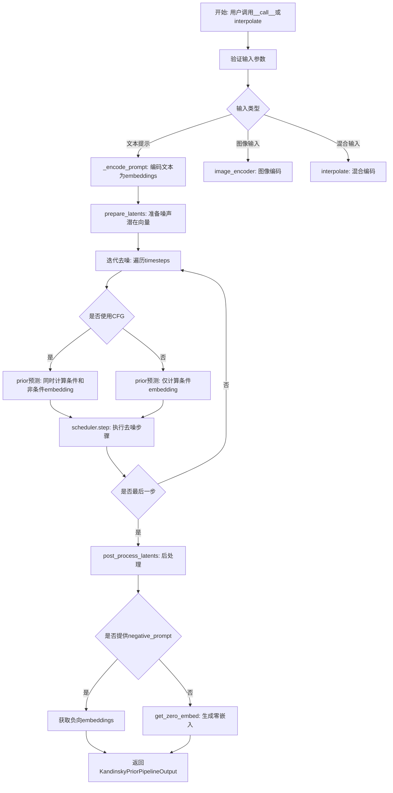

## 类结构

```
DiffusionPipeline (基类)
└── KandinskyV22PriorPipeline (先验管道类)
```

## 全局变量及字段


### `XLA_AVAILABLE`
    
Boolean flag indicating whether torch_xla is available for XLA acceleration.

类型：`bool`
    


### `logger`
    
Logger instance for recording runtime messages in this module.

类型：`logging.Logger`
    


### `EXAMPLE_DOC_STRING`
    
String containing example usage documentation for the pipeline.

类型：`str`
    


### `EXAMPLE_INTERPOLATE_DOC_STRING`
    
String containing example usage documentation for the interpolate method.

类型：`str`
    


### `KandinskyV22PriorPipeline.prior`
    
The prior transformer that generates image embeddings from text embeddings.

类型：`PriorTransformer`
    


### `KandinskyV22PriorPipeline.image_encoder`
    
Frozen CLIP vision model for encoding images into embeddings.

类型：`CLIPVisionModelWithProjection`
    


### `KandinskyV22PriorPipeline.text_encoder`
    
Frozen CLIP text encoder for encoding prompts into embeddings.

类型：`CLIPTextModelWithProjection`
    


### `KandinskyV22PriorPipeline.tokenizer`
    
CLIP tokenizer for converting text prompts into token IDs.

类型：`CLIPTokenizer`
    


### `KandinskyV22PriorPipeline.scheduler`
    
UnCLIP scheduler for the diffusion process in the prior pipeline.

类型：`UnCLIPScheduler`
    


### `KandinskyV22PriorPipeline.image_processor`
    
CLIP image processor for preprocessing images before encoding.

类型：`CLIPImageProcessor`
    


### `KandinskyV22PriorPipeline.model_cpu_offload_seq`
    
Sequence string specifying the order of models for CPU offload.

类型：`str`
    


### `KandinskyV22PriorPipeline._exclude_from_cpu_offload`
    
List of model components to exclude from CPU offload.

类型：`list`
    


### `KandinskyV22PriorPipeline._callback_tensor_inputs`
    
List of tensor names that can be passed to the step callback.

类型：`list`
    


### `KandinskyV22PriorPipeline._guidance_scale`
    
Guidance scale factor for classifier-free guidance.

类型：`float`
    


### `KandinskyV22PriorPipeline._num_timesteps`
    
Number of denoising timesteps used in the generation.

类型：`int`
    


### `KandinskyV22PriorPipeline._execution_device`
    
Device (CPU/GPU) on which the pipeline is executed.

类型：`torch.device`
    
    

## 全局函数及方法


### is_torch_xla_available

该函数用于检查当前环境是否支持 PyTorch XLA（Accelerated Linear Algebra），即是否安装了 torch_xla 库。如果可用，则后续代码可以导入并使用 XLA 相关的设备加速功能。

参数：该函数无显式参数

返回值：`bool`，返回 `True` 表示 torch_xla 可用（XLA 设备可用），返回 `False` 表示不可用

#### 流程图

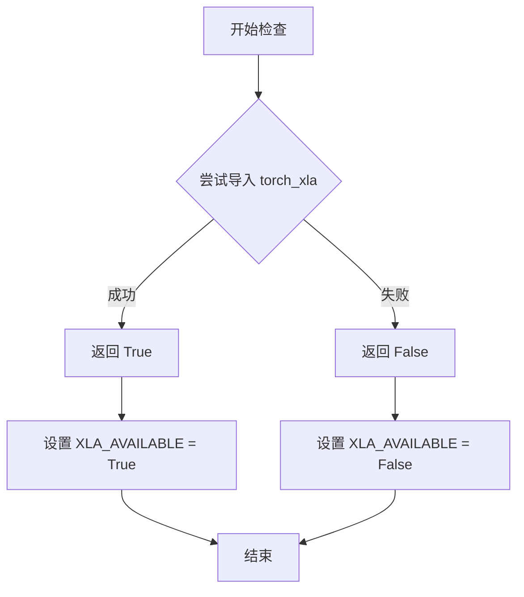

#### 带注释源码

```python
# is_torch_xla_available 函数定义（位于 ...utils 模块中）
# 以下为该函数在本文件中的使用方式及其推断的实现逻辑

# 从 utils 模块导入检查函数
from ...utils import is_torch_xla_available

# 使用检查函数的条件分支
if is_torch_xla_available():
    # 如果 XLA 可用，则导入 XLA 核心模块
    import torch_xla.core.xla_model as xm
    
    # 设置全局标志，表示 XLA 可用
    XLA_AVAILABLE = True
else:
    # XLA 不可用时，设置标志为 False
    XLA_AVAILABLE = False
```

#### 推断的函数实现

```python
# is_torch_xla_available 函数的可能实现（位于 ...utils 中）

def is_torch_xla_available() -> bool:
    """
    检查 torch_xla 库是否可用。
    
    该函数尝试导入 torch_xla 模块，如果成功则返回 True，
    表示当前环境支持 XLA 加速设备（如 TPU）。
    
    Returns:
        bool: 如果 torch_xla 可用返回 True，否则返回 False
    """
    try:
        import torch_xla
        return True
    except ImportError:
        return False
```


### `logging.get_logger`

获取指定名称的日志记录器，用于在模块中记录日志信息。

参数：

-  `name`：`str`，模块名称，通常使用 `__name__` 变量，用于标识日志记录器的来源

返回值：`logging.Logger`，返回一个日志记录器实例，用于记录日志信息

#### 流程图

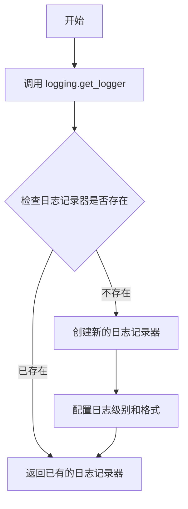

#### 带注释源码

```python
# 从 diffusers 工具模块导入 logging 对象
from ...utils import logging

# 使用 logging.get_logger 获取当前模块的日志记录器
# __name__ 是 Python 内置变量，表示当前模块的完整路径
# 例如: 'diffusers.pipelines.kandinsky.pipeline_kandinsky_v22_prior'
logger = logging.get_logger(__name__)  # pylint: disable=invalid-name
```

#### 说明

`logging.get_logger` 函数是 diffusers 库内部的日志工具函数，用于获取或创建一个与指定模块关联的日志记录器。在这个代码中：

- **`__name__`**：Python 内置变量，自动填充为当前模块的完整路径（如 `diffusers.pipelines.kandinsky.pipeline_kandinsky_v22_prior`），这样可以方便地识别日志来源
- **返回值**：返回的 `logger` 对象可以调用 `logger.warning()`、`logger.info()`、`logger.debug()` 等方法记录不同级别的日志信息
- **使用示例**：代码中第 257 行使用了 `logger.warning()` 来提示输入被截断的信息


### `replace_example_docstring`

`replace_example_docstring` 是一个装饰器函数，用于为被装饰的函数动态替换或附加文档字符串（docstring）。在 KandinskyV22PriorPipeline 中，该装饰器被用于 `__call__` 和 `interpolate` 方法，以便在运行时将预定义的示例文档注入到方法的文档中。

参数：

-  `doc_string`：`str`，要替换或附加的文档字符串内容，通常包含 API 使用示例代码

返回值：`Callable`，返回装饰后的函数对象

#### 流程图

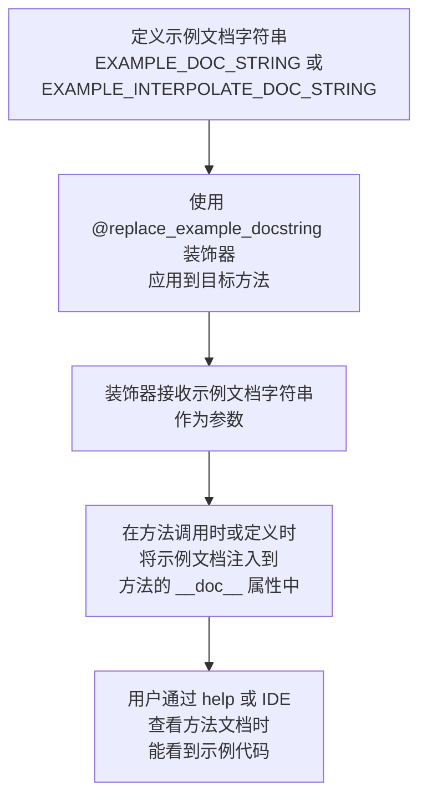

#### 带注释源码

```python
# replace_example_docstring 是从 diffusers.utils 导入的装饰器
# 其核心功能是为 Pipeline 方法提供示例文档
# 在代码中典型的使用方式如下：

# 1. 定义示例文档字符串
EXAMPLE_DOC_STRING = """
    Examples:
        ```py
        >>> from diffusers import KandinskyV22Pipeline, KandinskyV22PriorPipeline
        >>> import torch
        >>> 
        >>> # 创建先验管道生成图像嵌入
        >>> pipe_prior = KandinskyV22PriorPipeline.from_pretrained("kandinsky-community/kandinsky-2-2-prior")
        >>> pipe_prior.to("cuda")
        >>> prompt = "red cat, 4k photo"
        >>> image_emb, negative_image_emb = pipe_prior(prompt).to_tuple()
        >>> 
        >>> # 创建解码器管道生成最终图像
        >>> pipe = KandinskyV22Pipeline.from_pretrained("kandinsky-community/kandinsky-2-2-decoder")
        >>> pipe.to("cuda")
        >>> image = pipe(
        ...     image_embeds=image_emb,
        ...     negative_image_embeds=negative_image_emb,
        ...     height=768,
        ...     width=768,
        ...     num_inference_steps=50,
        ... ).images
        >>> image[0].save("cat.png")
        ```
"""

# 2. 使用装饰器应用到 Pipeline 的 __call__ 方法
@torch.no_grad()
@replace_example_docstring(EXAMPLE_DOC_STRING)
def __call__(
    self,
    prompt: str | list[str],
    negative_prompt: str | list[str] | None = None,
    num_images_per_prompt: int = 1,
    num_inference_steps: int = 25,
    ...
):
    """
    Function invoked when calling the pipeline for generation.
    ...
    """
    # 方法实现...
    return KandinskyPriorPipelineOutput(...)

# 3. 另一个示例文档字符串用于 interpolate 方法
EXAMPLE_INTERPOLATE_DOC_STRING = """
    Examples:
        ```py
        >>> # 展示如何使用 interpolate 方法进行图像插值
        >>> from diffusers import KandinskyV22PriorPipeline, KandinskyV22Pipeline
        >>> from diffusers.utils import load_image
        >>> import PIL
        >>> import torch
        >>> 
        >>> pipe_prior = KandinskyV22PriorPipeline.from_pretrained(
        ...     "kandinsky-community/kandinsky-2-2-prior", torch_dtype=torch.float16
        ... )
        >>> pipe_prior.to("cuda")
        >>> 
        >>> # 加载两张图片
        >>> img1 = load_image("https://.../cat.png")
        >>> img2 = load_image("https://.../starry_night.jpeg")
        >>> 
        >>> # 准备输入：文本和图片混合
        >>> images_texts = ["a cat", img1, img2]
        >>> weights = [0.3, 0.3, 0.4]
        >>> 
        >>> # 执行插值
        >>> out = pipe_prior.interpolate(images_texts, weights)
        >>> 
        >>> # 使用解码器生成最终图像
        >>> pipe = KandinskyV22Pipeline.from_pretrained(
        ...     "kandinsky-community/kandinsky-2-2-decoder", torch_dtype=torch.float16
        ... )
        >>> pipe.to("cuda")
        >>> image = pipe(
        ...     image_embeds=out.image_embeds,
        ...     negative_image_embeds=out.negative_image_embeds,
        ...     height=768,
        ...     width=768,
        ...     num_inference_steps=50,
        ... ).images[0]
        >>> image.save("starry_cat.png")
        ```
"""

# 4. 应用到 interpolate 方法
@torch.no_grad()
@replace_example_docstring(EXAMPLE_INTERPOLATE_DOC_STRING)
def interpolate(
    self,
    images_and_prompts: list[str | PIL.Image.Image | torch.Tensor],
    weights: list[float],
    ...
):
    """
    Function invoked when using the prior pipeline for interpolation.
    ...
    """
    # 方法实现...
    return KandinskyPriorPipelineOutput(...)
```


### randn_tensor

生成符合正态分布的随机张量，用于 diffusion 模型的噪声采样。

参数：

- `shape`：`tuple` 或 `int`，输出张量的形状
- `generator`：`torch.Generator` 或 `list[torch.Generator]`，可选，用于控制随机数生成的确定性
- `device`：`torch.device`，张量生成的设备
- `dtype`：`torch.dtype`，张量的数据类型

返回值：`torch.Tensor`，符合正态分布的随机张量

#### 流程图

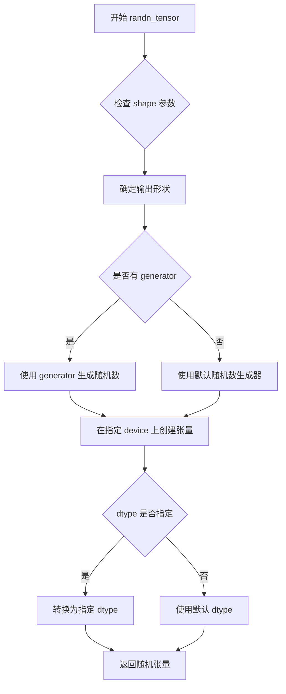

#### 带注释源码

```
# randn_tensor 函数源码（基于代码使用方式推断）
def randn_tensor(
    shape: tuple,
    generator: Optional[torch.Generator] = None,
    device: Optional[torch.device] = None,
    dtype: Optional[torch.dtype] = None,
) -> torch.Tensor:
    """
    生成符合标准正态分布的随机张量。
    
    Args:
        shape: 输出张量的形状，如 (batch_size, embedding_dim)
        generator: 可选的随机数生成器，用于确保可重复性
        device: 张量应放置的设备（cpu/cuda）
        dtype: 张量的数据类型
    
    Returns:
        符合正态分布的随机张量
    """
    # 优先使用传入的 generator，如果没有则使用 PyTorch 默认生成器
    if generator is not None:
        # 使用指定生成器生成随机数
        tensor = torch.randn(shape, generator=generator, device=device, dtype=dtype)
    else:
        # 使用默认生成器
        tensor = torch.randn(shape, device=device, dtype=dtype)
    
    return tensor
```

**在代码中的实际调用方式：**

```python
# 在 KandinskyV22PriorPipeline.prepare_latents 方法中调用
latents = randn_tensor(shape, generator=generator, device=device, dtype=dtype)
```

**使用场景：**
在 diffusion pipeline 中用于生成初始噪声 latent，通过乘以 scheduler 的初始噪声sigma来初始化去噪过程的起始点。


### `KandinskyV22PriorPipeline.__init__`

这是 Kandinsky 2.2 先验管道的初始化方法，负责将所有必需的组件（先验模型、图像编码器、文本编码器、分词器、调度器和图像处理器）注册到管道中，以便后续生成图像嵌入。

参数：

- `prior`：`PriorTransformer`，用于从文本嵌入近似图像嵌入的规范 unCLIP 先验模型
- `image_encoder`：`CLIPVisionModelWithProjection`，冻结的图像编码器
- `text_encoder`：`CLIPTextModelWithProjection`，冻结的文本编码器
- `tokenizer`：`CLIPTokenizer`，用于文本标记化的 CLIP 分词器
- `scheduler`：`UnCLIPScheduler`，与 `prior` 一起用于生成图像嵌入的调度器
- `image_processor`：`CLIPImageProcessor`，用于从 CLIP 预处理图像的图像处理器

返回值：`None`，构造函数不返回任何值

#### 流程图

```mermaid
flowchart TD
    A[开始 __init__] --> B[调用 super().__init__ 初始化基类]
    B --> C{注册模块}
    C --> D[注册 prior: PriorTransformer]
    C --> E[注册 text_encoder: CLIPTextModelWithProjection]
    C --> F[注册 tokenizer: CLIPTokenizer]
    C --> G[注册 scheduler: UnCLIPScheduler]
    C --> H[注册 image_encoder: CLIPVisionModelWithProjection]
    C --> I[注册 image_processor: CLIPImageProcessor]
    D --> J[结束初始化]
    E --> J
    F --> J
    G --> J
    H --> J
    I --> J
```

#### 带注释源码

```python
def __init__(
    self,
    prior: PriorTransformer,                           # unCLIP先验模型，用于从文本生成图像嵌入
    image_encoder: CLIPVisionModelWithProjection,      # CLIP图像编码器，处理输入图像
    text_encoder: CLIPTextModelWithProjection,         # CLIP文本编码器，处理输入文本
    tokenizer: CLIPTokenizer,                         # CLIP分词器，用于文本标记化
    scheduler: UnCLIPScheduler,                        # 去噪调度器，控制扩散过程
    image_processor: CLIPImageProcessor,              # 图像预处理器，转换输入图像格式
):
    # 调用父类DiffusionPipeline的初始化方法
    # 负责设置基础管道配置和设备管理
    super().__init__()

    # 使用register_modules方法将所有组件注册到管道中
    # 这使得这些组件可以通过self.prior, self.text_encoder等方式访问
    # 同时支持CPU offload等高级功能
    self.register_modules(
        prior=prior,               # 注册先验模型
        text_encoder=text_encoder, # 注册文本编码器
        tokenizer=tokenizer,       # 注册分词器
        scheduler=scheduler,       # 注册调度器
        image_encoder=image_encoder, # 注册图像编码器
        image_processor=image_processor, # 注册图像处理器
    )
```


### `KandinskyV22PriorPipeline.interpolate`

该方法用于在多个图像和/或文本提示之间进行插值，通过加权组合它们的嵌入向量来生成新的图像嵌入。它支持混合文本提示和图像输入，并根据指定的权重进行融合，生成最终的图像嵌入向量供后续的Kandinsky解码器使用。

参数：

- `images_and_prompts`：`list[str | PIL.Image.Image | torch.Tensor]`，输入的图像和提示列表，可以是字符串（文本提示）、PIL图像或张量
- `weights`：`list[float]`，对应每个输入条件的权重列表，用于控制各输入在最终嵌入中的贡献比例
- `num_images_per_prompt`：`int`，可选，默认值为1，每个提示生成的图像数量
- `num_inference_steps`：`int`，可选，默认值为25，去噪推理步数，步数越多通常图像质量越高
- `generator`：`torch.Generator | list[torch.Generator] | None`，可选，用于确保生成可确定性的随机数生成器
- `latents`：`torch.Tensor | None`，可选，预生成的噪声潜在向量，可用于调整相同生成过程
- `negative_prior_prompt`：`str | None`，可选，不参与先验扩散过程的提示词
- `negative_prompt`：`str`，可选，默认值为空字符串，不参与图像生成的提示词
- `guidance_scale`：`float`，可选，默认值为4.0，分类器自由扩散引导比例
- `device`：可选，指定执行设备

返回值：`KandinskyPriorPipelineOutput`，包含插值后的图像嵌入向量（image_embeds）和负向图像嵌入向量（negative_image_embeds）

#### 流程图

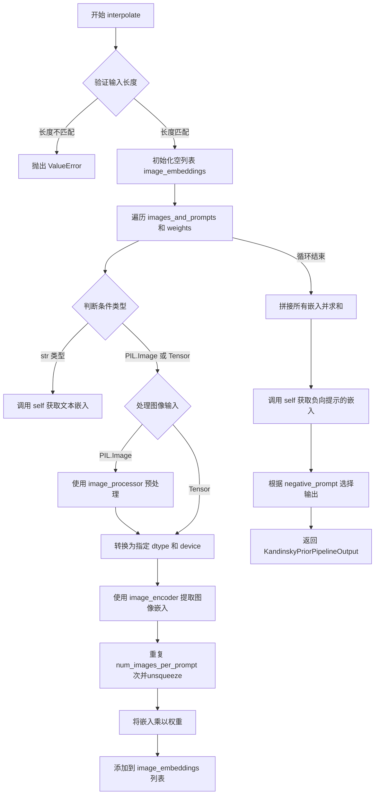

#### 带注释源码

```python
@torch.no_grad()
@replace_example_docstring(EXAMPLE_INTERPOLATE_DOC_STRING)
def interpolate(
    self,
    images_and_prompts: list[str | PIL.Image.Image | torch.Tensor],
    weights: list[float],
    num_images_per_prompt: int = 1,
    num_inference_steps: int = 25,
    generator: torch.Generator | list[torch.Generator] | None = None,
    latents: torch.Tensor | None = None,
    negative_prior_prompt: str | None = None,
    negative_prompt: str = "",
    guidance_scale: float = 4.0,
    device=None,
):
    """
    Function invoked when using the prior pipeline for interpolation.
    
    用于在多个图像和/或文本提示之间进行插值的方法。
    """
    # 确定设备，默认为当前pipeline设备
    device = device or self.device

    # 验证输入长度一致性
    if len(images_and_prompts) != len(weights):
        raise ValueError(
            f"`images_and_prompts` contains {len(images_and_prompts)} items and `weights` contains {len(weights)} items - they should be lists of same length"
        )

    # 用于存储每个条件的图像嵌入
    image_embeddings = []
    
    # 遍历每个条件及其对应权重
    for cond, weight in zip(images_and_prompts, weights):
        # 处理字符串类型的文本提示
        if isinstance(cond, str):
            # 调用pipeline自身进行文本到图像嵌入的转换
            image_emb = self(
                cond,
                num_inference_steps=num_inference_steps,
                num_images_per_prompt=num_images_per_prompt,
                generator=generator,
                latents=latents,
                negative_prompt=negative_prior_prompt,
                guidance_scale=guidance_scale,
            ).image_embeds.unsqueeze(0)

        # 处理PIL图像或张量类型的图像输入
        elif isinstance(cond, (PIL.Image.Image, torch.Tensor)):
            # 如果是PIL图像，先进行预处理
            if isinstance(cond, PIL.Image.Image):
                cond = (
                    self.image_processor(cond, return_tensors="pt")
                    .pixel_values[0]
                    .unsqueeze(0)
                    .to(dtype=self.image_encoder.dtype, device=device)
                )
            # 使用图像编码器提取图像嵌入，并重复num_images_per_prompt次
            image_emb = self.image_encoder(cond)["image_embeds"].repeat(num_images_per_prompt, 1).unsqueeze(0)

        else:
            # 类型不匹配时抛出异常
            raise ValueError(
                f"`images_and_prompts` can only contains elements to be of type `str`, `PIL.Image.Image` or `torch.Tensor`  but is {type(cond)}"
            )

        # 将嵌入乘以对应权重并添加到列表
        image_embeddings.append(image_emb * weight)

    # 拼接所有嵌入并按维度0求和，得到最终的插值嵌入
    image_emb = torch.cat(image_embeddings).sum(dim=0)

    # 生成负向提示的嵌入
    out_zero = self(
        negative_prompt,
        num_inference_steps=num_inference_steps,
        num_images_per_prompt=num_images_per_prompt,
        generator=generator,
        latents=latents,
        negative_prompt=negative_prior_prompt,
        guidance_scale=guidance_scale,
    )
    
    # 根据negative_prompt是否为空选择使用negative_image_embeds或image_embeds
    zero_image_emb = out_zero.negative_image_embeds if negative_prompt == "" else out_zero.image_embeds

    # 返回包含图像嵌入和负向图像嵌入的输出对象
    return KandinskyPriorPipelineOutput(image_embeds=image_emb, negative_image_embeds=zero_image_emb)
```


### `KandinskyV22PriorPipeline.prepare_latents`

该方法用于为扩散模型准备初始潜在向量（latents）。如果调用者未提供 latents，则使用随机噪声生成；否则对提供的 latents 进行形状验证和设备迁移，最后根据调度器的初始噪声 sigma 进行缩放。

参数：

- `shape`：`tuple`，指定生成的 latents 的形状，通常为 `(batch_size, embedding_dim)`
- `dtype`：`torch.dtype`，生成或转换 latents 时的目标数据类型
- `device`：`torch.device`，生成或转换 latents 时的目标设备
- `generator`：`torch.Generator | list[torch.Generator] | None`，用于控制随机数生成的可选生成器，以确保可复现性
- `latents`：`torch.Tensor | None`，可选的预生成噪声 latents，若为 `None` 则自动生成
- `scheduler`：`UnCLIPScheduler`，调度器对象，用于获取初始噪声缩放因子 `init_noise_sigma`

返回值：`torch.Tensor`，处理并缩放后的 latents 张量，可直接用于扩散模型的迭代去噪

#### 流程图

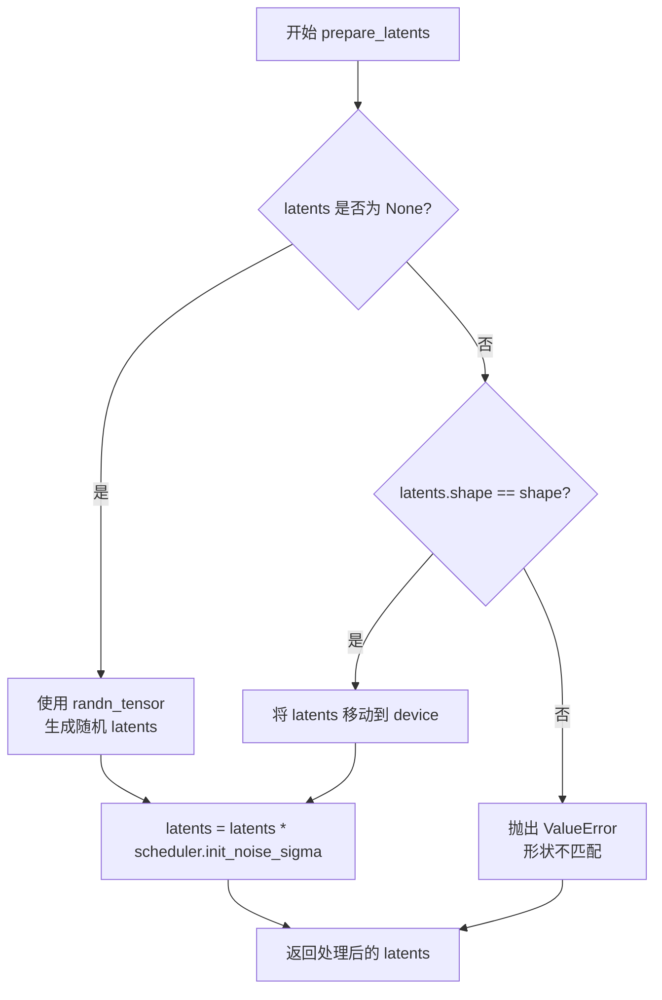

#### 带注释源码

```python
def prepare_latents(self, shape, dtype, device, generator, latents, scheduler):
    """
    准备用于扩散过程的潜在向量（latents）。
    
    如果未提供 latents，则使用随机张量生成；否则对现有 latents 进行验证和设备迁移。
    最后根据调度器的初始噪声 sigma 对 latents 进行缩放，以适配去噪过程的起始点。
    
    参数:
        shape: latents 的目标形状，如 (batch_size, embedding_dim)
        dtype: latents 的目标数据类型
        device: latents 的目标设备
        generator: 可选的随机数生成器，用于可复现的噪声生成
        latents: 可选的预生成 latents，若为 None 则自动生成随机 latents
        scheduler: 调度器，用于获取初始噪声缩放因子 init_noise_sigma
    
    返回:
        处理并缩放后的 latents 张量
    """
    # 如果没有提供 latents，则使用 randn_tensor 生成随机噪声
    if latents is None:
        latents = randn_tensor(shape, generator=generator, device=device, dtype=dtype)
    else:
        # 验证提供的 latents 形状是否与预期形状匹配
        if latents.shape != shape:
            raise ValueError(f"Unexpected latents shape, got {latents.shape}, expected {shape}")
        # 将 latents 移动到指定的设备
        latents = latents.to(device)

    # 根据调度器的初始噪声 sigma 对 latents 进行缩放
    # 这确保了 latents 在去噪过程开始时具有适当的噪声水平
    latents = latents * scheduler.init_noise_sigma
    return latents
```


### `KandinskyV22PriorPipeline.get_zero_embed`

生成零图像嵌入向量，用于在没有正向提示引导时的默认嵌入表示。

参数：

- `batch_size`：`int`，默认为1，要生成的零嵌入的批量大小
- `device`：`torch.device | None`，默认为None，执行计算的设备，如果为None则使用self.device

返回值：`torch.Tensor`，批量大小的零图像嵌入向量

#### 流程图

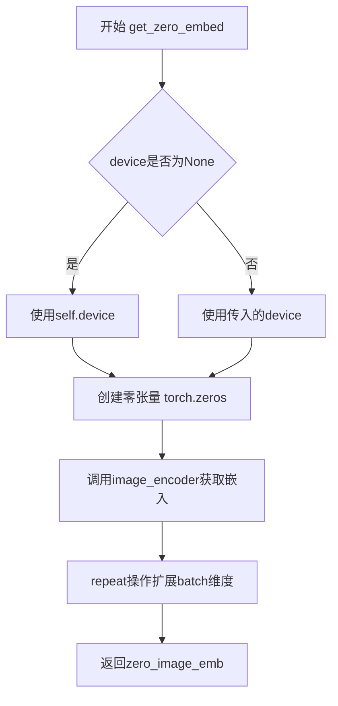

#### 带注释源码

```
def get_zero_embed(self, batch_size=1, device=None):
    # 确定设备：如果未指定device，则使用pipeline的默认设备
    device = device or self.device
    
    # 创建一个全零的图像张量
    # 形状: (1, 3, image_size, image_size)
    # image_size来自image_encoder的配置
    zero_img = torch.zeros(
        1, 
        3, 
        self.image_encoder.config.image_size, 
        self.image_encoder.config.image_size
    ).to(device=device, dtype=self.image_encoder.dtype)
    
    # 将零图像通过image_encoder获取图像嵌入
    # 返回的嵌入形状为 (1, embedding_dim)
    zero_image_emb = self.image_encoder(zero_img)["image_embeds"]
    
    # 将嵌入按batch_size重复，以匹配批量大小
    # 从 (1, embedding_dim) 扩展为 (batch_size, embedding_dim)
    zero_image_emb = zero_image_emb.repeat(batch_size, 1)
    
    # 返回批量化的零图像嵌入
    return zero_image_emb
```


### `KandinskyV22PriorPipeline._encode_prompt`

该方法负责将文本提示（prompt）转换为文本嵌入（text embeddings），同时处理负面提示（negative prompt）以支持分类器自由引导（Classifier-Free Guidance）。它使用CLIP文本编码器对提示进行编码，并根据`num_images_per_prompt`参数复制嵌入以支持批量生成图像。

参数：

- `prompt`：`str | list[str]`，要编码的文本提示，可以是单个字符串或字符串列表
- `device`：`torch.device`，指定计算设备（CPU/CUDA）
- `num_images_per_prompt`：`int`，每个提示词要生成的图像数量，用于复制嵌入维度
- `do_classifier_free_guidance`：`bool`，是否启用分类器自由引导，为True时需要生成负面提示嵌入
- `negative_prompt`：`str | list[str] | None`，可选的负面提示，用于引导模型远离不希望的内容

返回值：`tuple[torch.Tensor, torch.Tensor, torch.Tensor]`

- `prompt_embeds`：`torch.Tensor`，文本提示的嵌入向量，形状为`(batch_size * num_images_per_prompt, embedding_dim)`
- `text_encoder_hidden_states`：`torch.Tensor`，文本编码器的完整隐藏状态序列，用于注意力机制
- `text_mask`：`torch.Tensor`，布尔类型的注意力掩码，用于标识有效token位置

#### 流程图

```mermaid
flowchart TD
    A[开始 _encode_prompt] --> B{判断 prompt 类型}
    B -->|list| C[batch_size = len(prompt)]
    B -->|str| D[batch_size = 1]
    
    C --> E[调用 tokenizer 编码 prompt]
    D --> E
    
    E --> F[提取 input_ids 和 attention_mask]
    F --> G[获取未截断的 token ids]
    
    G --> H{检查是否被截断}
    H -->|是| I[记录警告日志并截断]
    H -->|否| J[保持原样]
    
    I --> K[调用 text_encoder 获取输出]
    J --> K
    
    K --> L[提取 text_embeds 和 last_hidden_state]
    L --> M[repeat_interleave 复制到 num_images_per_prompt]
    
    M --> N{do_classifier_free_guidance?}
    N -->|否| O[直接返回结果]
    N -->|是| P[处理 negative_prompt]
    
    P --> Q{negative_prompt 类型}
    Q -->|None| R[uncond_tokens = [''] * batch_size]
    Q -->|str| S[uncond_tokens = [negative_prompt]]
    Q -->|list| T[uncond_tokens = negative_prompt]
    Q -->|类型不匹配| U[抛出 TypeError]
    Q -->|batch_size 不匹配| V[抛出 ValueError]
    
    R --> W[tokenizer 编码 uncond_tokens]
    S --> W
    T --> W
    
    W --> X[获取负面提示的嵌入和隐藏状态]
    X --> Y[repeat 复制负面嵌入到 num_images_per_prompt]
    Y --> Z[concat 正负嵌入和隐藏状态]
    Z --> AA[concat 正负 text_mask]
    
    AA --> O
    O --> AB[返回 prompt_embeds, text_encoder_hidden_states, text_mask]
```

#### 带注释源码

```python
def _encode_prompt(
    self,
    prompt,                          # str | list[str]: 输入的文本提示
    device,                         # torch.device: 计算设备
    num_images_per_prompt,          # int: 每个提示生成的图像数量
    do_classifier_free_guidance,   # bool: 是否启用分类器自由引导
    negative_prompt=None,           # str | list[str] | None: 负面提示词
):
    """
    编码文本提示为 embeddings，供 prior 模型使用。
    
    该方法执行以下步骤：
    1. 确定 batch size
    2. 使用 tokenizer 将文本转换为 token IDs
    3. 检查并处理 token 截断情况
    4. 通过 text_encoder 获取文本嵌入
    5. 根据 num_images_per_prompt 复制 embeddings
    6. 如果启用 CFG，处理负面提示并拼接
    """
    
    # 确定批次大小：如果 prompt 是列表则取其长度，否则为 1
    batch_size = len(prompt) if isinstance(prompt, list) else 1
    
    # Step 1: 使用 tokenizer 将文本提示编码为 token 序列
    # padding="max_length" 填充到最大长度，truncation=True 截断超长序列
    text_inputs = self.tokenizer(
        prompt,
        padding="max_length",
        max_length=self.tokenizer.model_max_length,
        truncation=True,
        return_tensors="pt",
    )
    text_input_ids = text_inputs.input_ids          # token IDs 序列
    # 将 attention_mask 转换为布尔值，得到有效 token 的掩码
    text_mask = text_inputs.attention_mask.bool().to(device)
    
    # Step 2: 检查是否存在被截断的文本
    # 获取未截断的 token 序列用于比较
    untruncated_ids = self.tokenizer(prompt, padding="longest", return_tensors="pt").input_ids
    
    # 如果未截断序列长度大于截断后长度，且两者不相等，说明有内容被截断
    if untruncated_ids.shape[-1] >= text_input_ids.shape[-1] and not torch.equal(text_input_ids, untruncated_ids):
        # 解码被截断的部分用于警告信息
        removed_text = self.tokenizer.batch_decode(untruncated_ids[:, self.tokenizer.model_max_length - 1 : -1])
        logger.warning(
            "The following part of your input was truncated because CLIP can only handle sequences up to"
            f" {self.tokenizer.model_max_length} tokens: {removed_text}"
        )
        # 截断到模型最大长度
        text_input_ids = text_input_ids[:, : self.tokenizer.model_max_length]
    
    # Step 3: 通过文本编码器获取文本嵌入
    text_encoder_output = self.text_encoder(text_input_ids.to(device))
    
    # 提取文本嵌入（投影后的表示）和完整隐藏状态
    prompt_embeds = text_encoder_output.text_embeds           # [batch_size, embedding_dim]
    text_encoder_hidden_states = text_encoder_output.last_hidden_state  # [batch_size, seq_len, hidden_dim]
    
    # Step 4: 根据 num_images_per_prompt 复制 embeddings
    # repeat_interleave 在指定维度上重复每个元素
    prompt_embeds = prompt_embeds.repeat_interleave(num_images_per_prompt, dim=0)
    text_encoder_hidden_states = text_encoder_hidden_states.repeat_interleave(num_images_per_prompt, dim=0)
    text_mask = text_mask.repeat_interleave(num_images_per_prompt, dim=0)
    
    # Step 5: 如果启用分类器自由引导，处理负面提示
    if do_classifier_free_guidance:
        uncond_tokens: list[str]
        
        # 处理不同类型的 negative_prompt
        if negative_prompt is None:
            # 默认使用空字符串
            uncond_tokens = [""] * batch_size
        elif type(prompt) is not type(negative_prompt):
            # 类型不匹配检查
            raise TypeError(
                f"`negative_prompt` should be the same type to `prompt`, but got {type(negative_prompt)} !="
                f" {type(prompt)}."
            )
        elif isinstance(negative_prompt, str):
            # 字符串类型，包装为列表
            uncond_tokens = [negative_prompt]
        elif batch_size != len(negative_prompt):
            # batch 大小不匹配检查
            raise ValueError(
                f"`negative_prompt`: {negative_prompt} has batch size {len(negative_prompt)}, but `prompt`:"
                f" {prompt} has batch size {batch_size}. Please make sure that passed `negative_prompt` matches"
                " the batch size of `prompt`."
            )
        else:
            # 已经是列表类型
            uncond_tokens = negative_prompt
        
        # 对负面提示进行与正面提示相同的处理
        uncond_input = self.tokenizer(
            uncond_tokens,
            padding="max_length",
            max_length=self.tokenizer.model_max_length,
            truncation=True,
            return_tensors="pt",
        )
        uncond_text_mask = uncond_input.attention_mask.bool().to(device)
        
        # 获取负面提示的文本编码器输出
        negative_prompt_embeds_text_encoder_output = self.text_encoder(uncond_input.input_ids.to(device))
        
        negative_prompt_embeds = negative_prompt_embeds_text_encoder_output.text_embeds
        uncond_text_encoder_hidden_states = negative_prompt_embeds_text_encoder_output.last_hidden_state
        
        # 复制负面 embeddings 以匹配 num_images_per_prompt
        # 使用 repeat 而不是 repeat_interleave，因为这里是复制整个序列
        seq_len = negative_prompt_embeds.shape[1]
        negative_prompt_embeds = negative_prompt_embeds.repeat(1, num_images_per_prompt)
        negative_prompt_embeds = negative_prompt_embeds.view(batch_size * num_images_per_prompt, seq_len)
        
        seq_len = uncond_text_encoder_hidden_states.shape[1]
        uncond_text_encoder_hidden_states = uncond_text_encoder_hidden_states.repeat(1, num_images_per_prompt, 1)
        uncond_text_encoder_hidden_states = uncond_text_encoder_hidden_states.view(
            batch_size * num_images_per_prompt, seq_len, -1
        )
        uncond_text_mask = uncond_text_mask.repeat_interleave(num_images_per_prompt, dim=0)
        
        # 拼接负面和正面 embeddings
        # 负面 embeddings 在前，正面 embeddings 在后
        # 这样在后续计算时可以通过 chunk(2) 分离
        prompt_embeds = torch.cat([negative_prompt_embeds, prompt_embeds])
        text_encoder_hidden_states = torch.cat([uncond_text_encoder_hidden_states, text_encoder_hidden_states])
        
        # 拼接掩码
        text_mask = torch.cat([uncond_text_mask, text_mask])
    
    # 返回编码后的提示嵌入、隐藏状态和掩码
    return prompt_embeds, text_encoder_hidden_states, text_mask
```


### `KandinskyV22PriorPipeline.do_classifier_free_guidance`

该属性用于判断当前是否启用 Classifier-Free Guidance（无分类器引导）机制。通过比较内部存储的 `_guidance_scale` 与阈值 1 的大小关系来确定是否需要执行无分类器引导。当 `guidance_scale > 1` 时返回 `True`，表示在图像生成过程中将同时使用带条件和无条件的噪声预测来引导生成更符合文本提示的图像。

参数：

- 无显式参数（`self` 为隐式参数，表示当前管道实例）

返回值：`bool`，返回 `True` 表示启用了 Classifier-Free Guidance，返回 `False` 表示未启用

#### 流程图

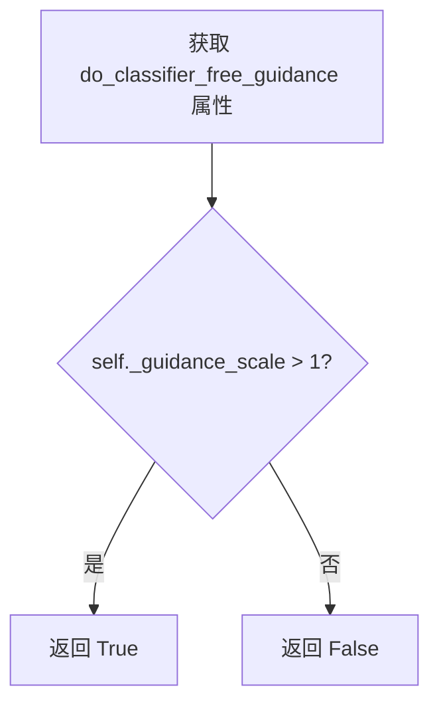

#### 带注释源码

```python
@property
def do_classifier_free_guidance(self):
    """
    属性方法：判断是否启用 Classifier-Free Guidance
    
    Classifier-Free Guidance (CFG) 是一种在扩散模型中常用的技术，
    通过同时预测带条件和无条件的噪声，然后使用 guidance_scale 加权
    来使生成的图像更符合文本提示。
    
    当 guidance_scale > 1 时启用 CFG，否则不启用。
    
    Returns:
        bool: 如果 guidance_scale 大于 1 则返回 True，否则返回 False
    """
    # 比较内部存储的引导系数与阈值 1
    # guidance_scale > 1 表示启用无分类器引导
    return self._guidance_scale > 1
```

---

**技术说明**：

- 该属性是一个只读的 `@property`，依赖于 `_guidance_scale` 属性的值
- `_guidance_scale` 通常在 `__call__` 方法中被赋值：`self._guidance_scale = guidance_scale`
- 默认的 `guidance_scale` 值为 4.0，因此默认情况下 CFG 是启用的
- 这个属性的值会影响 `__call__` 方法中的多处逻辑，包括 prompt 编码的批处理方式、latent 扩展、以及最终的噪声预测合并方式


### `KandinskyV22PriorPipeline.guidance_scale`

该属性是 `KandinskyV22PriorPipeline` 类的只读属性（property），用于获取当前管道的 guidance_scale 值。Guidance scale 是分类器自由扩散引导（Classifier-Free Diffusion Guidance）中的关键参数，用于控制生成图像与文本提示的关联程度。

参数：无（该属性为只读 property，不接受任何参数）

返回值：`float`，当前管道的 guidance_scale 值，用于控制图像生成过程中文本引导的强度。该值在 `__call__` 方法中被设置为实例变量 `_guidance_scale`，通常建议设置为大于 1 的值以启用引导。

#### 流程图

```mermaid
flowchart TD
    A[访问 guidance_scale 属性] --> B{读取 _guidance_scale}
    B --> C[返回 float 类型的值]
    
    D[调用 __call__ 方法] --> E[设置 self._guidance_scale = guidance_scale]
    E --> F[在去噪循环中使用 guidance_scale 计算]
    F --> G[predicted_image_embedding_uncond + guidance_scale * (predicted_image_embedding_text - predicted_image_embedding_uncond)]
    
    H[访问 do_classifier_free_guidance 属性] --> I{检查 _guidance_scale > 1}
    I --> J[返回布尔值判断是否启用引导]
```

#### 带注释源码

```python
@property
def guidance_scale(self):
    """
    获取当前管道的 guidance_scale 值。
    
    该属性是一个只读属性（getter），返回在 __call__ 方法中设置的 _guidance_scale 实例变量。
    Guidance scale 控制分类器自由引导的强度：
    - 当 guidance_scale > 1 时，启用分类器自由引导
    - 较高的值会导致生成图像更紧密地关联文本提示，但可能降低图像质量
    
    返回:
        float: guidance_scale 的当前值
    """
    return self._guidance_scale
```

#### 相关上下文代码

```python
# 在 __call__ 方法中设置该值
self._guidance_scale = guidance_scale

# 在 do_classifier_free_guidance 属性中使用
@property
def do_classifier_free_guidance(self):
    return self._guidance_scale > 1

# 在去噪循环中使用 guidance_scale 进行计算
if self.do_classifier_free_guidance:
    predicted_image_embedding_uncond, predicted_image_embedding_text = predicted_image_embedding.chunk(2)
    predicted_image_embedding = predicted_image_embedding_uncond + self.guidance_scale * (
        predicted_image_embedding_text - predicted_image_embedding_uncond
    )
```


### `KandinskyV22PriorPipeline.num_timesteps`

该属性是 `KandinskyV22PriorPipeline` 类的只读属性，用于返回当前管道的推理时间步数量。在 `__call__` 方法执行时，`_num_timesteps` 会被设置为 `timesteps` 列表的长度（即 `len(timesteps)`），从而记录本次生成的推理步数。

参数： 无（属性访问器不接受额外参数）

返回值：`int`，返回当前或最近一次推理的时间步数量，即执行去噪过程的步数。

#### 流程图

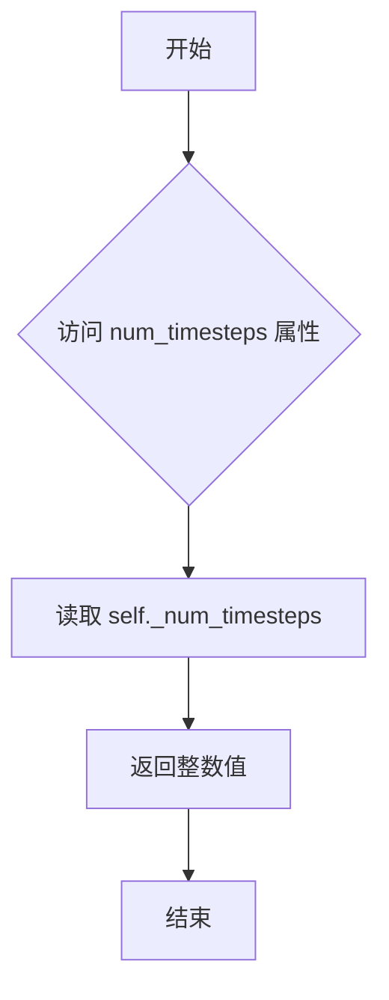

#### 带注释源码

```python
@property
def num_timesteps(self):
    """
    属性：返回当前管道执行推理时的时间步数量。

    该属性是一个只读属性，用于获取内部变量 _num_timesteps 的值。
    _num_timesteps 在 __call__ 方法中被设置为 timesteps 列表的长度，
    即 num_inference_steps 的值。

    参数:
        无 (属性访问器不接受任何参数)

    返回值:
        int: 推理过程中使用的时间步数量，通常等于去噪步骤数。
    """
    return self._num_timesteps
```


### `KandinskyV22PriorPipeline.__call__`

该方法是Kandinsky V2.2先验管道的核心调用函数，负责根据文本提示生成图像嵌入向量（image embeddings）。它通过CLIP文本编码器编码提示词，然后使用UnCLIPScheduler调度器对PriorTransformer进行去噪处理，最终产出用于后续解码器的高维图像特征表示。

参数：

- `prompt`：`str | list[str]`，引导图像生成的文本提示，可以是单个字符串或字符串列表
- `negative_prompt`：`str | list[str] | None`，不引导图像生成的负面提示词，用于分类器无关引导（CFG），当guidance_scale > 1时生效
- `num_images_per_prompt`：`int`，每个提示词生成的图像数量，默认为1
- `num_inference_steps`：`int`，去噪迭代步骤数，默认为25，步数越多通常图像质量越高但推理速度越慢
- `generator`：`torch.Generator | list[torch.Generator] | None`，PyTorch随机数生成器，用于确保生成过程可复现
- `latents`：`torch.Tensor | None`，预生成的噪声潜在向量，如果提供则使用该向量作为生成起点，否则随机生成
- `guidance_scale`：`float`，分类器无关引导（CFG）权重，默认为4.0，值越大生成的图像与文本提示越相关
- `output_type`：`str | None`，输出格式，默认为"pt"（PyTorch张量），仅支持"pt"和"np"
- `return_dict`：`bool`，是否返回字典格式的输出，默认为True
- `callback_on_step_end`：`Callable[[int, int], None] | None`，每个去噪步骤结束后调用的回调函数
- `callback_on_step_end_tensor_inputs`：`list[str]`，回调函数可访问的张量输入列表

返回值：`KandinskyPriorPipelineOutput`或`tuple`，返回包含图像嵌入和负面图像嵌入的管道输出对象，当return_dict=False时返回元组

#### 流程图

```mermaid
flowchart TD
    A[开始 __call__] --> B{检查 callback_on_step_end_tensor_inputs}
    B -->|无效| C[抛出 ValueError]
    B -->|有效| D{检查 prompt 类型}
    D -->|str| E[转换为 list]
    D -->|list| F{检查 negative_prompt 类型}
    D -->|其他| G[抛出 ValueError]
    F -->|str| H[转换为 list]
    F -->|list| I[检查 negative_prompt 是否为 None]
    F -->|其他| J[抛出 ValueError]
    I -->|不为 None| K[拼接 prompt 和 negative_prompt]
    I -->|为 None| L[设置 device]
    K --> L
    L --> M[计算 batch_size]
    M --> N[_encode_prompt 编码提示词]
    N --> O[scheduler 设置时间步]
    O --> P[prepare_latents 准备潜在向量]
    P --> Q[迭代 timesteps]
    Q --> R{do_classifier_free_guidance?}
    R -->|是| S[扩展 latents 为2倍]
    R -->|否| T[保持 latents 不变]
    S --> U[prior 前向传播]
    T --> U
    U --> V{do_classifier_free_guidance?}
    V -->|是| W[应用 CFG 公式]
    V -->|否| X[scheduler.step 更新 latents]
    W --> X
    X --> Y{callback_on_step_end?}
    Y -->|是| Z[执行回调函数]
    Y -->|否| AA{XLA_AVAILABLE?}
    Z --> AA
    AA -->|是| AB[xm.mark_step]
    AA -->|否| AC{最后一个 timestep?}
    AB --> AC
    AC -->|否| Q
    AC -->|是| AD[post_process_latents 后处理]
    AD --> AE{negative_prompt 为 None?}
    AE -->|是| AF[get_zero_embed 获取零嵌入]
    AE -->|否| AG[chunk 分割嵌入]
    AF --> AH{maybe_free_model_hooks 释放模型}
    AG --> AH
    AH --> AI{output_type == 'np'?}
    AI -->|是| AJ[转换为 NumPy]
    AI -->|否| AK{return_dict?}
    AJ --> AK
    AK -->|是| AL[返回 PipelineOutput]
    AK -->|否| AM[返回 tuple]
```

#### 带注释源码

```python
@torch.no_grad()
@replace_example_docstring(EXAMPLE_DOC_STRING)
def __call__(
    self,
    prompt: str | list[str],
    negative_prompt: str | list[str] | None = None,
    num_images_per_prompt: int = 1,
    num_inference_steps: int = 25,
    generator: torch.Generator | list[torch.Generator] | None = None,
    latents: torch.Tensor | None = None,
    guidance_scale: float = 4.0,
    output_type: str | None = "pt",  # pt only
    return_dict: bool = True,
    callback_on_step_end: Callable[[int, int], None] | None = None,
    callback_on_step_end_tensor_inputs: list[str] = ["latents"],
):
    """
    Pipeline for generating image prior for Kandinsky V2.2.
    Takes text prompts and generates image embeddings through a prior diffusion model.
    
    Args:
        prompt: Text prompt(s) to guide image generation
        negative_prompt: Negative prompt(s) for classifier-free guidance
        num_images_per_prompt: Number of images to generate per prompt
        num_inference_steps: Number of denoising steps
        generator: Random generator for reproducibility
        latents: Pre-generated noisy latents
        guidance_scale: CFG scale factor
        output_type: Output format ("pt" or "np")
        return_dict: Whether to return dict or tuple
        callback_on_step_end: Callback function at each step
        callback_on_step_end_tensor_inputs: Tensor inputs for callback
    """
    
    # 验证回调张量输入是否有效
    if callback_on_step_end_tensor_inputs is not None and not all(
        k in self._callback_tensor_inputs for k in callback_on_step_end_tensor_inputs
    ):
        raise ValueError(
            f"`callback_on_step_end_tensor_inputs` has to be in {self._callback_tensor_inputs}, "
            f"but found {[k for k in callback_on_step_end_tensor_inputs if k not in self._callback_tensor_inputs]}"
        )

    # 输入验证：将 prompt 转换为列表
    if isinstance(prompt, str):
        prompt = [prompt]
    elif not isinstance(prompt, list):
        raise ValueError(f"`prompt` has to be of type `str` or `list` but is {type(prompt)}")

    # 输入验证：将 negative_prompt 转换为列表
    if isinstance(negative_prompt, str):
        negative_prompt = [negative_prompt]
    elif not isinstance(negative_prompt, list) and negative_prompt is not None:
        raise ValueError(f"`negative_prompt` has to be of type `str` or `list` but is {type(negative_prompt)}")

    # 如果提供了 negative_prompt，则扩展 batch size 以直接获取负面嵌入
    if negative_prompt is not None:
        prompt = prompt + negative_prompt
        negative_prompt = 2 * negative_prompt

    # 获取执行设备
    device = self._execution_device

    # 计算最终 batch size
    batch_size = len(prompt)
    batch_size = batch_size * num_images_per_prompt

    # 设置引导尺度
    self._guidance_scale = guidance_scale

    # 编码提示词：获取文本嵌入、隐藏状态和注意力掩码
    prompt_embeds, text_encoder_hidden_states, text_mask = self._encode_prompt(
        prompt, device, num_images_per_prompt, self.do_classifier_free_guidance, negative_prompt
    )

    # 配置调度器的时间步
    self.scheduler.set_timesteps(num_inference_steps, device=device)
    timesteps = self.scheduler.timesteps

    # 获取先验模型的嵌入维度
    embedding_dim = self.prior.config.embedding_dim

    # 准备潜在向量
    latents = self.prepare_latents(
        (batch_size, embedding_dim),
        prompt_embeds.dtype,
        device,
        generator,
        latents,
        self.scheduler,
    )
    
    # 记录时间步数量
    self._num_timesteps = len(timesteps)
    
    # 迭代去噪过程
    for i, t in enumerate(self.progress_bar(timesteps)):
        # 如果使用分类器无关引导，则扩展潜在向量
        latent_model_input = torch.cat([latents] * 2) if self.do_classifier_free_guidance else latents

        # 先验模型前向传播
        predicted_image_embedding = self.prior(
            latent_model_input,
            timestep=t,
            proj_embedding=prompt_embeds,
            encoder_hidden_states=text_encoder_hidden_states,
            attention_mask=text_mask,
        ).predicted_image_embedding

        # 应用分类器无关引导
        if self.do_classifier_free_guidance:
            predicted_image_embedding_uncond, predicted_image_embedding_text = predicted_image_embedding.chunk(2)
            predicted_image_embedding = predicted_image_embedding_uncond + self.guidance_scale * (
                predicted_image_embedding_text - predicted_image_embedding_uncond
            )

        # 计算前一个时间步
        if i + 1 == timesteps.shape[0]:
            prev_timestep = None
        else:
            prev_timestep = timesteps[i + 1]

        # 调度器步进：更新潜在向量
        latents = self.scheduler.step(
            predicted_image_embedding,
            timestep=t,
            sample=latents,
            generator=generator,
            prev_timestep=prev_timestep,
        ).prev_sample

        # 执行回调函数（如果提供）
        if callback_on_step_end is not None:
            callback_kwargs = {}
            for k in callback_on_step_end_tensor_inputs:
                callback_kwargs[k] = locals()[k]
            callback_outputs = callback_on_step_end(self, i, t, callback_kwargs)

            # 更新回调返回的张量
            latents = callback_outputs.pop("latents", latents)
            prompt_embeds = callback_outputs.pop("prompt_embeds", prompt_embeds)
            text_encoder_hidden_states = callback_outputs.pop(
                "text_encoder_hidden_states", text_encoder_hidden_states
            )
            text_mask = callback_outputs.pop("text_mask", text_mask)

        # XLA 设备优化：标记计算步骤
        if XLA_AVAILABLE:
            xm.mark_step()

    # 后处理潜在向量
    latents = self.prior.post_process_latents(latents)

    image_embeddings = latents

    # 处理负面嵌入
    if negative_prompt is None:
        # 如果没有提供负面提示，生成零嵌入
        zero_embeds = self.get_zero_embed(latents.shape[0], device=latents.device)
    else:
        # 否则分割嵌入向量
        image_embeddings, zero_embeds = image_embeddings.chunk(2)

    # 释放模型钩子
    self.maybe_free_model_hooks()

    # 验证输出类型
    if output_type not in ["pt", "np"]:
        raise ValueError(f"Only the output types `pt` and `np` are supported not output_type={output_type}")

    # 转换为 NumPy（如果需要）
    if output_type == "np":
        image_embeddings = image_embeddings.cpu().numpy()
        zero_embeds = zero_embeds.cpu().numpy()

    # 返回结果
    if not return_dict:
        return (image_embeddings, zero_embeds)

    return KandinskyPriorPipelineOutput(image_embeds=image_embeddings, negative_image_embeds=zero_embeds)
```

## 关键组件


### PriorTransformer (先验变换器)

核心的unCLIP先验模型，用于从文本嵌入近似生成图像嵌入，是Kandinsky 2.2先验管道的核心神经网络组件。

### CLIPTextModelWithProjection (文本编码器)

冻结的CLIP文本编码器，带有projection层，用于将文本提示编码为文本嵌入向量，是文本到图像生成的关键组件。

### CLIPVisionModelWithProjection (图像编码器)

冻结的CLIP视觉编码器，带有projection层，用于将图像编码为图像嵌入向量，支持从图像直接提取特征。

### CLIPTokenizer (分词器)

CLIP分词器，用于将文本提示转换为token序列，最大长度由model_max_length决定。

### CLIPImageProcessor (图像处理器)

CLIP图像预处理器，用于将PIL图像转换为模型所需的张量格式，进行像素值归一化等预处理。

### UnCLIPScheduler (调度器)

与PriorTransformer配合使用的调度器，用于生成去噪步骤的时间步，控制扩散过程的噪声调度。

### interpolate方法 (插值混合)

支持将多个文本提示和图像进行加权混合生成，接收images_and_prompts列表和weights权重列表，实现跨模态的插值生成功能。

### __call__方法 (主生成方法)

管道的主入口方法，执行完整的先验生成流程，包括提示编码、潜在向量准备、扩散去噪、CFG处理、后处理等步骤。

### _encode_prompt方法 (提示编码)

将文本提示编码为prompt_embeds、text_encoder_hidden_states和text_mask，支持批量处理和Classifier-Free Guidance。

### prepare_latents方法 (潜在向量准备)

准备和初始化扩散模型的潜在向量，支持随机生成或使用预提供的latents，并应用调度器的初始噪声sigma。

### get_zero_embed方法 (零嵌入生成)

生成全零图像的嵌入向量，用于无引导生成或负向提示的嵌入表示。

### Classifier-Free Guidance支持

通过do_classifier_free_guidance属性和guidance_scale参数控制无分类器引导生成，实现正向和负向提示的组合。

### 回调机制 (callback_on_step_end)

支持在每个去噪步骤结束后执行自定义回调函数，允许用户干预生成过程并修改中间状态。

### XLA支持 (torch_xla)

通过is_torch_xla_available检测并支持Google的XLA加速器，用于TPU等设备的性能优化。


## 问题及建议


### 已知问题

- **属性初始化不完整**：类中使用了 `self._guidance_scale`、`self._num_timesteps` 等实例变量，但在 `__init__` 方法中未进行初始化，可能导致属性访问错误
- **类型注解不一致**：`device` 参数在多个方法中使用但类型注解为 `None`，应为 `torch.device | str | None`
- **参数命名混淆**：`interpolate` 方法接收 `negative_prior_prompt` 参数但实际传递给 `negative_prompt`，且该参数未在函数签名中明确声明
- **默认值不统一**：`interpolate` 和 `__call__` 方法中 `num_inference_steps` 文档描述为"defaults to 100"但实际默认值为 25
- **权重验证缺失**：`interpolate` 方法中 `weights` 参数未进行有效性验证（如非负数、总和为1等）
- **代码重复**：`get_zero_embed`、`_encode_prompt`、`prepare_latents` 方法从其他管道复制，未充分利用继承机制
- **输出类型检查不完整**：代码注释声明 `"pt" only`，但允许 `output_type` 参数且仅在代码中检查 "pt" 和 "np"

### 优化建议

- 在 `__init__` 方法中初始化所有实例变量：`self._guidance_scale = 0`、`self._num_timesteps = 0`
- 统一 `device` 参数的类型注解，使用 `Optional[Union[torch.device, str]]`
- 修正 `interpolate` 方法的参数签名，添加 `negative_prior_prompt` 的显式声明
- 在 `interpolate` 方法中添加权重验证逻辑，确保 weights 列表有效
- 将重复代码提取到基类或 mixin 中，通过继承减少代码冗余
- 统一文档字符串中的默认值描述与实际代码保持一致
- 添加属性类型注解或使用 `@property` 配合类型注解提升代码可维护性

## 其它


### 设计目标与约束

本管道旨在为Kandinsky 2.2生成高质量的图像先验嵌入（image embedding），通过结合CLIP文本编码器和图像编码器，实现文本到图像嵌入空间的映射。设计约束包括：仅支持PyTorch张量输出（output_type仅支持"pt"和"np"）；依赖CLIP系列模型（text_encoder、image_encoder、tokenizer）；推理步骤数默认为25步；guidance_scale默认值为4.0以平衡生成质量和多样性。

### 错误处理与异常设计

代码实现了多层次错误处理机制：参数类型校验（检查prompt、negative_prompt是否为str或list）；长度一致性检查（验证images_and_prompts与weights长度匹配）；维度校验（验证latents.shape与预期shape一致）；batch size匹配验证（negative_prompt与prompt的batch size必须一致）；output_type限制（仅支持"pt"和"np"）。异常通过ValueError和TypeError抛出，并附带详细的错误信息和实际值。

### 数据流与状态机

管道核心数据流如下：输入prompt→CLIP Tokenizer分词→Text Encoder编码→与negative_prompt拼接（如需CFG）→Prior Transformer去噪生成latent→Scheduler步骤更新→Post-process处理→输出image_embeds和negative_image_embeds。状态转换：初始化→编码prompt→设置timesteps→迭代去噪（每步更新latents）→后处理→释放资源。

### 外部依赖与接口契约

主要外部依赖包括：transformers库（CLIPTextModelWithProjection、CLIPVisionModelWithProjection、CLIPTokenizer、CLIPImageProcessor）；PIL.Image用于图像处理；torch用于张量运算；diffusers内部模块（PriorTransformer、UnCLIPScheduler、KandinskyPriorPipelineOutput）。模型输入契约：prompt支持str或list[str]；negative_prompt支持str、list[str]或None；latents为torch.Tensor或None；generator为torch.Generator或list或None。

### 性能考虑

性能优化策略：使用torch.no_grad()装饰器禁用梯度计算；支持XLA加速（通过is_torch_xla_available检测）；model_cpu_offload_seq定义模型卸载顺序（text_encoder→image_encoder→prior）；支持latents预生成以实现确定性生成；支持callback_on_step_end进行渐进式结果处理。默认使用float16（torch_dtype）可显著降低显存占用。

### 版本兼容性与平台支持

代码检测XLA可用性并相应调整执行路径；支持MPS设备（通过device属性自动适配）；支持多generator输入以实现批量确定性生成；num_images_per_prompt参数支持单prompt生成多张图像。平台支持：CUDA、MPS、XLA均可运行，CPU仅用于小规模测试。

### 配置参数详解

guidance_scale控制CFG强度，值越大生成图像与prompt越相关但质量可能下降；num_inference_steps决定去噪迭代次数，值越大质量越高但推理越慢；num_images_per_prompt控制每prompt生成数量；callback_on_step_end支持每步自定义回调用于监控或干预生成过程；callback_on_step_end_tensor_inputs指定回调可访问的tensor变量列表。

### 安全考虑与限制

管道未内置NSFW内容过滤机制；CLIP模型可能继承训练数据的偏见；生成的图像嵌入可用于下游 decoder但本身不直接生成可视化图像；negative_prompt可一定程度上减少不期望的输出但无法完全消除。

### 测试考量

建议测试场景：单prompt生成；批量prompt生成；带negative_prompt的CFG生成；latents预注入的确定性生成；interpolate方法的图像-文本混合输入；长prompt截断处理；不同output_type输出验证；XLA设备兼容性。

### 资源管理与生命周期

管道通过register_modules统一管理组件生命周期；maybe_free_model_hooks()在推理结束后释放模型钩子；支持CPU offload序列化管理；XLA设备使用xm.mark_step()标记计算节点。推荐使用from_pretrained加载预训练权重而非手动初始化。


    