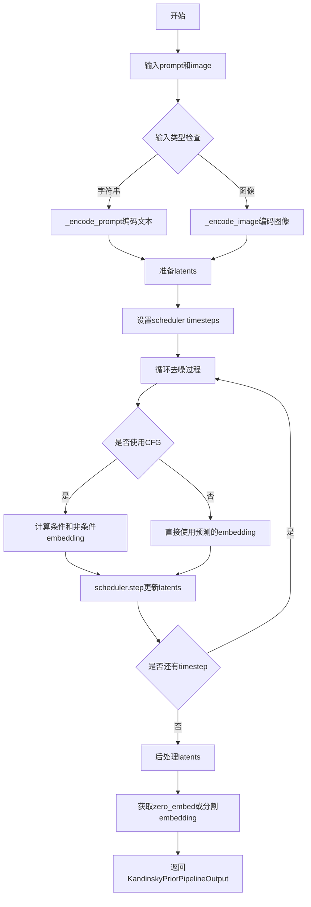
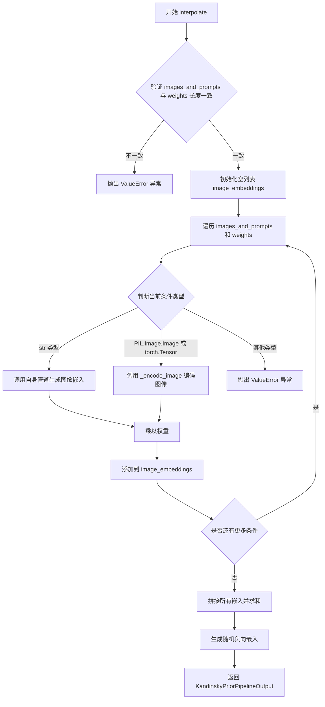
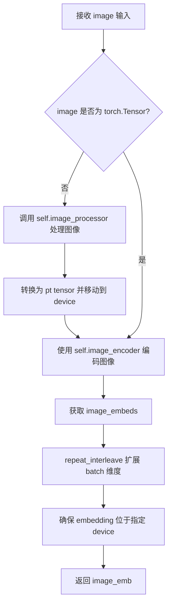
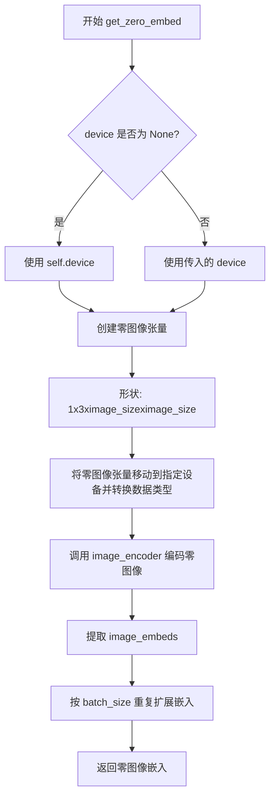
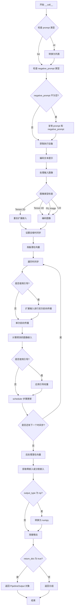
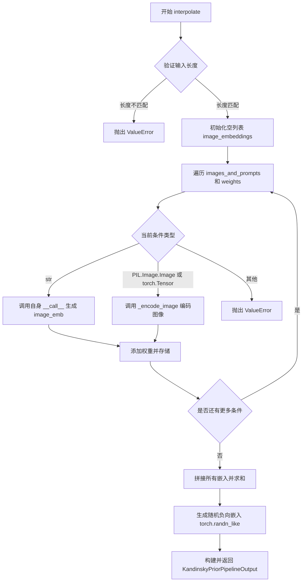
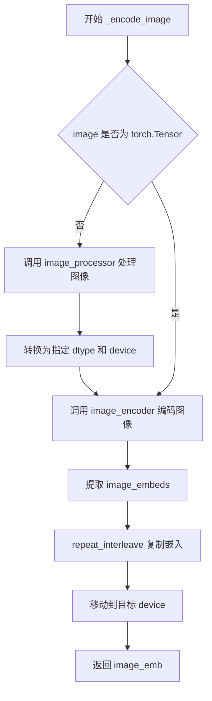
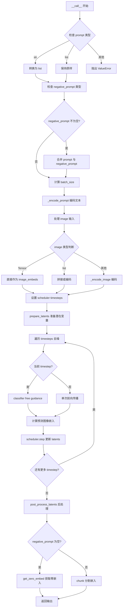

# `diffusers\src\diffusers\pipelines\kandinsky2_2\pipeline_kandinsky2_2_prior_emb2emb.py` 详细设计文档

Kandinsky V2.2 Prior Pipeline 用于图像嵌入生成，支持文本到图像和图像到图像的embedding转换，通过CLIP模型编码图像和文本，利用PriorTransformer进行扩散过程，生成用于后续解码的高质量图像嵌入向量。

## 整体流程



## 类结构

```
DiffusionPipeline (抽象基类)
└── KandinskyV22PriorEmb2EmbPipeline
```

## 全局变量及字段


### `logger`
    
用于记录日志的全局日志记录器对象

类型：`logging.Logger`
    


### `XLA_AVAILABLE`
    
指示PyTorch XLA是否可用的布尔标志

类型：`bool`
    


### `EXAMPLE_DOC_STRING`
    
包含pipeline使用示例的文档字符串

类型：`str`
    


### `EXAMPLE_INTERPOLATE_DOC_STRING`
    
包含interpolate方法使用示例的文档字符串

类型：`str`
    


### `KandinskyV22PriorEmb2EmbPipeline.prior`
    
用于生成图像嵌入的unCLIP先验transformer模型

类型：`PriorTransformer`
    


### `KandinskyV22PriorEmb2EmbPipeline.text_encoder`
    
冻结的CLIP文本编码器,用于将文本提示编码为嵌入

类型：`CLIPTextModelWithProjection`
    


### `KandinskyV22PriorEmb2EmbPipeline.tokenizer`
    
CLIP分词器,用于将文本分割为token

类型：`CLIPTokenizer`
    


### `KandinskyV22PriorEmb2EmbPipeline.scheduler`
    
用于先验模型的去噪调度器

类型：`UnCLIPScheduler`
    


### `KandinskyV22PriorEmb2EmbPipeline.image_encoder`
    
冻结的CLIP图像编码器,用于将图像编码为嵌入

类型：`CLIPVisionModelWithProjection`
    


### `KandinskyV22PriorEmb2EmbPipeline.image_processor`
    
CLIP图像处理器,用于预处理图像数据

类型：`CLIPImageProcessor`
    


### `KandinskyV22PriorEmb2EmbPipeline.model_cpu_offload_seq`
    
定义模型CPU卸载顺序的字符串

类型：`str`
    


### `KandinskyV22PriorEmb2EmbPipeline._exclude_from_cpu_offload`
    
指定从CPU卸载中排除的模型组件列表

类型：`list`
    
    

## 全局函数及方法


### `KandinskyV22PriorEmb2EmbPipeline.get_timesteps`

该方法用于根据推断步骤数量和强度值计算实际的时间步序列。它通过计算初始时间步数，然后从调度器的时间步数组中提取对应的子序列，以支持图像到图像的转换任务。

参数：

- `num_inference_steps`：`int`，总推断步骤数，指定生成过程中使用的去噪步数
- `strength`：`float`，强度值，介于0到1之间，控制图像转换的程度，值越大表示对原始图像的改变越多
- `device`：`torch.device`，计算设备，用于指定张量存放的设备（CPU或CUDA）

返回值：`(tuple[tuple[torch.Tensor, int]])`，返回元组包含两个元素：
- 第一个元素是`torch.Tensor`类型的时间步序列，表示实际使用的时间步
- 第二个元素是`int`类型的剩余步骤数，表示从起始位置到总步骤数之间的距离

#### 流程图

```mermaid
flowchart TD
    A[开始 get_timesteps] --> B[计算 init_timestep = min(num_inference_steps × strength, num_inference_steps)]
    B --> C[计算 t_start = max(num_inference_steps - init_timestep, 0)]
    C --> D[从 scheduler.timesteps 切片获取 timesteps[t_start:]]
    D --> E[计算 num_inference_steps - t_start]
    E --> F[返回 timesteps 和剩余步数]
```

#### 带注释源码

```python
def get_timesteps(self, num_inference_steps, strength, device):
    """
    计算用于图像转换的时间步序列
    
    Args:
        num_inference_steps: 总推断步骤数
        strength: 转换强度 (0-1)，决定保留多少原始图像特征
        device: 计算设备
    
    Returns:
        timesteps: 实际使用的时间步序列
        剩余步数: 从起始位置到总步数的偏移量
    """
    # 计算初始时间步数，根据强度值和总步数确定
    # 如果strength=1.0，则使用全部步骤；strength越小，保留越多原始图像信息
    init_timestep = min(int(num_inference_steps * strength), num_inference_steps)

    # 计算起始索引，从后向前计算以确保使用最新的时间步
    t_start = max(num_inference_steps - init_timestep, 0)
    
    # 从调度器的时间步数组中获取对应的时间步序列
    timesteps = self.scheduler.timesteps[t_start:]

    # 返回时间步和剩余步骤数
    return timesteps, num_inference_steps - t_start
```


### `KandinskyV22PriorEmb2EmbPipeline.interpolate`

该方法用于在多个图像和文本提示之间进行插值生成。它接受图像和文本提示的混合列表以及对应的权重，对每个条件进行编码后根据权重进行加权融合，最终返回融合后的图像嵌入向量。

参数：

- `images_and_prompts`：`list[str | PIL.Image.Image | torch.Tensor]`，包含提示和图像的列表，用于指导图像生成
- `weights`：`list[float]`，对应 `images_and_prompts` 中每个条件的权重值
- `num_images_per_prompt`：`int`，可选参数，默认值为 1，每个提示生成的图像数量
- `num_inference_steps`：`int`，可选参数，默认值为 25，去噪迭代次数
- `generator`：`torch.Generator | list[torch.Generator] | None`，可选参数，用于控制随机性的生成器
- `latents`：`torch.Tensor | None`，可选参数，预生成的噪声潜在向量
- `negative_prior_prompt`：`str | None`，可选参数，用于引导先验扩散过程的负向提示
- `negative_prompt`：`str`，可选参数，默认值为空字符串，用于引导图像生成的负向提示
- `guidance_scale`：`float`，可选参数，默认值为 4.0，分类器自由扩散引导比例
- `device`：可选参数，指定计算设备

返回值：`KandinskyPriorPipelineOutput`，包含融合后的图像嵌入向量和随机生成的负向图像嵌入向量

#### 流程图



#### 带注释源码

```python
@torch.no_grad()
@replace_example_docstring(EXAMPLE_INTERPOLATE_DOC_STRING)
def interpolate(
    self,
    images_and_prompts: list[str | PIL.Image.Image | torch.Tensor],
    weights: list[float],
    num_images_per_prompt: int = 1,
    num_inference_steps: int = 25,
    generator: torch.Generator | list[torch.Generator] | None = None,
    latents: torch.Tensor | None = None,
    negative_prior_prompt: str | None = None,
    negative_prompt: str = "",
    guidance_scale: float = 4.0,
    device=None,
):
    """
    Function invoked when using the prior pipeline for interpolation.

    Args:
        images_and_prompts (`list[str | PIL.Image.Image | torch.Tensor]`):
            list of prompts and images to guide the image generation.
        weights: (`list[float]`):
            list of weights for each condition in `images_and_prompts`
        num_images_per_prompt (`int`, *optional*, defaults to 1):
            The number of images to generate per prompt.
        num_inference_steps (`int`, *optional*, defaults to 100):
            The number of denoising steps. More denoising steps usually lead to a higher quality image at the
            expense of slower inference.
        generator (`torch.Generator` or `list[torch.Generator]`, *optional*):
            One or a list of [torch generator(s)](https://pytorch.org/docs/stable/generated/torch.Generator.html)
            to make generation deterministic.
        latents (`torch.Tensor`, *optional*):
            Pre-generated noisy latents, sampled from a Gaussian distribution, to be used as inputs for image
            generation. Can be used to tweak the same generation with different prompts. If not provided, a latents
            tensor will be generated by sampling using the supplied random `generator`.
        negative_prior_prompt (`str`, *optional*):
            The prompt not to guide the prior diffusion process. Ignored when not using guidance (i.e., ignored if
            `guidance_scale` is less than `1`).
        negative_prompt (`str` or `list[str]`, *optional*):
            The prompt not to guide the image generation. Ignored when not using guidance (i.e., ignored if
            `guidance_scale` is less than `1`).
        guidance_scale (`float`, *optional*, defaults to 4.0):
            Guidance scale as defined in [Classifier-Free Diffusion
            Guidance](https://huggingface.co/papers/2207.12598). `guidance_scale` is defined as `w` of equation 2.
            of [Imagen Paper](https://huggingface.co/papers/2205.11487). Guidance scale is enabled by setting
            `guidance_scale > 1`. Higher guidance scale encourages to generate images that are closely linked to
            the text `prompt`, usually at the expense of lower image quality.

    Examples:

    Returns:
        [`KandinskyPriorPipelineOutput`] or `tuple`
    """

    # 确定设备，如果未指定则使用默认设备
    device = device or self.device

    # 验证输入长度一致性
    if len(images_and_prompts) != len(weights):
        raise ValueError(
            f"`images_and_prompts` contains {len(images_and_prompts)} items and `weights` contains {len(weights)} items - they should be lists of same length"
        )

    # 存储每个条件的图像嵌入
    image_embeddings = []
    
    # 遍历每个条件和对应权重
    for cond, weight in zip(images_and_prompts, weights):
        # 如果条件是字符串（文本提示），调用管道生成嵌入
        if isinstance(cond, str):
            image_emb = self(
                cond,
                num_inference_steps=num_inference_steps,
                num_images_per_prompt=num_images_per_prompt,
                generator=generator,
                latents=latents,
                negative_prompt=negative_prior_prompt,
                guidance_scale=guidance_scale,
            ).image_embeds.unsqueeze(0)

        # 如果条件是图像或张量，直接编码
        elif isinstance(cond, (PIL.Image.Image, torch.Tensor)):
            image_emb = self._encode_image(
                cond, device=device, num_images_per_prompt=num_images_per_prompt
            ).unsqueeze(0)

        # 不支持的类型
        else:
            raise ValueError(
                f"`images_and_prompts` can only contains elements to be of type `str`, `PIL.Image.Image` or `torch.Tensor`  but is {type(cond)}"
            )

        # 将嵌入乘以权重并添加到列表
        image_embeddings.append(image_emb * weight)

    # 拼接所有嵌入并沿第一维度求和，实现加权融合
    image_emb = torch.cat(image_embeddings).sum(dim=0)

    # 返回包含图像嵌入和负向嵌入的输出对象
    return KandinskyPriorPipelineOutput(image_embeds=image_emb, negative_image_embeds=torch.randn_like(image_emb))
```


### `KandinskyV22PriorEmb2EmbPipeline._encode_image`

该方法负责将输入的图像（支持 PIL.Image 或 torch.Tensor 格式）编码为图像嵌入向量（image embeddings），供后续的图像生成流程使用。

参数：

- `image`：`torch.Tensor | list[PIL.Image.Image]`，需要编码的原始图像，可以是单张 PIL 图像或图像列表，也可以是预先处理好的图像 tensor
- `device`：`torch.device`，指定计算设备，用于将处理后的图像数据移动到对应设备上
- `num_images_per_prompt`：`int`，每个文本提示生成的图像数量，用于对图像嵌入进行重复处理以匹配生成数量

返回值：`torch.Tensor`，编码后的图像嵌入向量，形状为 [batch_size * num_images_per_prompt, embedding_dim]

#### 流程图



#### 带注释源码

```python
def _encode_image(
    self,
    image: torch.Tensor | list[PIL.Image.Image],
    device,
    num_images_per_prompt,
):
    """
    将图像编码为图像嵌入向量
    
    参数:
        image: 输入图像，支持 PIL.Image 列表或 torch.Tensor
        device: 计算设备
        num_images_per_prompt: 每个提示生成的图像数量
    
    返回:
        image_emb: 编码后的图像嵌入向量
    """
    # 如果输入不是 tensor 格式，则使用 image_processor 进行预处理
    # PIL.Image 需要先转换为模型需要的 tensor 格式
    if not isinstance(image, torch.Tensor):
        # 调用 image_processor 将 PIL 图像转换为 pixel_values
        # return_tensors="pt" 指定返回 PyTorch tensor
        image = self.image_processor(image, return_tensors="pt").pixel_values.to(
            dtype=self.image_encoder.dtype,  # 使用 image_encoder 的数据类型
            device=device  # 移动到指定设备
        )

    # 使用 CLIP 视觉编码器获取图像嵌入
    # image_embeds 形状为 [batch_size, embedding_dim]
    image_emb = self.image_encoder(image)["image_embeds"]

    # 根据 num_images_per_prompt 扩展图像嵌入维度
    # 例如：如果 batch_size=1, num_images_per_prompt=3
    # 则扩展为 [3, embedding_dim]，支持为每个提示生成多个图像
    image_emb = image_emb.repeat_interleave(num_images_per_prompt, dim=0)
    
    # 确保最终的 embedding 位于正确的设备上
    # 注意：这里没有使用 inplace 操作，而是创建了新 tensor
    image_emb.to(device=device)

    return image_emb
```


### `KandinskyV22PriorEmb2EmbPipeline.prepare_latents`

该方法用于准备潜在向量（latents），将图像嵌入（emb）根据指定的时间步和批处理参数进行处理，添加噪声并返回用于后续去噪过程的潜在向量。

参数：

- `self`：类实例本身
- `emb`：`torch.Tensor`，输入的图像嵌入向量
- `timestep`：`torch.Tensor`，当前扩散过程的时间步
- `batch_size`：`int`，原始批处理大小
- `num_images_per_prompt`：`int`，每个提示词生成的图像数量
- `dtype`：`torch.dtype`，目标数据类型
- `device`：`torch.device`，目标设备（CPU/CUDA）
- `generator`：`torch.Generator | None`，可选的随机数生成器，用于生成确定性噪声

返回值：`torch.Tensor`，处理后的潜在向量

#### 流程图

```mermaid
flowchart TD
    A[开始: prepare_latents] --> B[将emb移动到指定设备并转换数据类型]
    B --> C[计算实际batch_size = batch_size * num_images_per_prompt]
    C --> D{实际batch_size > init_latents.shape[0]?}
    D -->|是 且 能整除| E[计算additional_image_per_prompt]
    D -->|是 且 不能整除| F[抛出ValueError异常]
    D -->|否| G[保持原有init_latents]
    E --> H[复制init_latents到指定倍数]
    H --> I[使用randn_tensor生成噪声]
    G --> I
    F --> I
    I --> J[调用scheduler.add_noise添加噪声]
    J --> K[返回处理后的latents]
```

#### 带注释源码

```python
def prepare_latents(self, emb, timestep, batch_size, num_images_per_prompt, dtype, device, generator=None):
    # 将图像嵌入emb移动到指定设备并转换为目标数据类型
    emb = emb.to(device=device, dtype=dtype)

    # 计算实际批处理大小：原始batch_size乘以每个提示词生成的图像数量
    batch_size = batch_size * num_images_per_prompt

    # 初始化latents为emb
    init_latents = emb

    # 检查是否需要复制latents以匹配批处理大小
    if batch_size > init_latents.shape[0] and batch_size % init_latents.shape[0] == 0:
        # 如果实际batch_size大于初始latents维度且能整除
        additional_image_per_prompt = batch_size // init_latents.shape[0]
        # 按倍数复制latents
        init_latents = torch.cat([init_latents] * additional_image_per_prompt, dim=0)
    elif batch_size > init_latents.shape[0] and batch_size % init_latents.shape[0] != 0:
        # 如果不能整除，抛出错误
        raise ValueError(
            f"Cannot duplicate `image` of batch size {init_latents.shape[0]} to {batch_size} text prompts."
        )
    else:
        # 否则保持原有latents（使用torch.cat而非直接赋值，保持张量维度一致性）
        init_latents = torch.cat([init_latents], dim=0)

    # 获取处理后latents的形状
    shape = init_latents.shape
    # 使用randn_tensor生成符合指定形状和参数的高斯噪声
    noise = randn_tensor(shape, generator=generator, device=device, dtype=dtype)

    # 使用scheduler的add_noise方法将噪声添加到初始latents
    # 这是扩散模型前向过程的关键步骤
    init_latents = self.scheduler.add_noise(init_latents, noise, timestep)
    latents = init_latents

    # 返回处理后的latents用于后续去噪
    return latents
```


### `KandinskyV22PriorEmb2EmbPipeline.get_zero_embed`

该方法用于生成零图像嵌入（zero image embedding），通常在无分类器指导（Classifier-Free Guidance）的扩散模型中作为负样本（unconditional）嵌入使用。通过创建一个全零的图像张量并通过图像编码器处理，得到对应的零图像嵌入向量。

参数：

- `batch_size`：`int`，默认值1，指定要生成的嵌入数量，默认为生成单个嵌入
- `device`：`torch.device | None`，指定计算设备，如果为 None 则使用实例的默认设备（self.device）

返回值：`torch.Tensor`，返回形状为 [batch_size, embedding_dim] 的零图像嵌入张量，其中 embedding_dim 由 image_encoder 的配置决定

#### 流程图



#### 带注释源码

```python
def get_zero_embed(self, batch_size=1, device=None):
    """
    生成零图像嵌入（zero image embedding）
    
    该方法创建一个全零的图像张量，通过图像编码器（image_encoder）生成对应的嵌入向量。
    在无分类器指导扩散模型中，零嵌入通常用于负样本（unconditional）引导。
    
    参数:
        batch_size (int): 要生成的嵌入数量，默认为1
        device (torch.device, optional): 计算设备，默认为None则使用self.device
    
    返回:
        torch.Tensor: 形状为 [batch_size, embedding_dim] 的零图像嵌入张量
    """
    # 确定设备：如果未指定device，则使用实例的默认设备
    device = device or self.device
    
    # 创建全零的图像张量
    # 形状解释: (batch=1, channels=3, height=image_size, width=image_size)
    # image_size 来自 image_encoder 的配置
    zero_img = torch.zeros(
        1, 
        3, 
        self.image_encoder.config.image_size, 
        self.image_encoder.config.image_size
    ).to(
        device=device, 
        dtype=self.image_encoder.dtype  # 使用与 image_encoder 相同的数据类型
    )
    
    # 将零图像通过图像编码器获取嵌入
    # 返回的 image_embeds 形状为 [1, embedding_dim]
    zero_image_emb = self.image_encoder(zero_img)["image_embeds"]
    
    # 根据 batch_size 复制扩展嵌入向量
    # 将形状从 [1, embedding_dim] 扩展为 [batch_size, embedding_dim]
    zero_image_emb = zero_image_emb.repeat(batch_size, 1)
    
    # 返回生成的零图像嵌入
    return zero_image_emb
```


### `KandinskyV22PriorEmb2EmbPipeline._encode_prompt`

该方法用于将文本提示（prompt）编码为文本嵌入向量（text embeddings），支持 Classifier-Free Guidance（无分类器自由引导）技术。它使用 CLIP 文本编码器将文本转换为高维向量表示，供后续的图像生成模型使用。

参数：

- `self`：`KandinskyV22PriorEmb2EmbPipeline` 实例本身
- `prompt`：`str | list[str]`，需要编码的文本提示，可以是单个字符串或字符串列表
- `device`：`torch.device`，计算设备（CPU 或 CUDA）
- `num_images_per_prompt`：`int`，每个提示生成的图像数量，用于扩展嵌入维度
- `do_classifier_free_guidance`：`bool`，是否启用无分类器自由引导（CFG）技术
- `negative_prompt`：`str | list[str] | None`，可选的负面提示，用于引导生成过程中避免某些内容

返回值：`tuple[torch.Tensor, torch.Tensor, torch.Tensor]`，返回一个包含三个元素的元组：
- `prompt_embeds`：文本嵌入向量，形状为 `(batch_size * num_images_per_prompt, embedding_dim)`
- `text_encoder_hidden_states`：文本编码器的隐藏状态，形状为 `(batch_size * num_images_per_prompt, seq_len, hidden_dim)`
- `text_mask`：注意力掩码布尔张量，形状为 `(batch_size * num_images_per_prompt, seq_len)`

#### 流程图

```mermaid
flowchart TD
    A[开始 _encode_prompt] --> B{判断 prompt 类型}
    B -->|list| C[batch_size = len(prompt)]
    B -->|str| D[batch_size = 1]
    C --> E[Tokenize prompt]
    D --> E
    E --> F[获取 text_input_ids 和 text_mask]
    F --> G[检查是否需要截断]
    G --> H{untruncated_ids 长度 > model_max_length?}
    H -->|是| I[截断并记录警告]
    H -->|否| J[保持原样]
    I --> K[编码文本]
    J --> K
    K --> L[获取 text_embeds 和 last_hidden_state]
    L --> M[repeat_interleave 扩展 num_images_per_prompt]
    M --> N{do_classifier_free_guidance?}
    N -->|否| O[返回 prompt_embeds, text_encoder_hidden_states, text_mask]
    N -->|是| P{negative_prompt 是否为 None?}
    P -->|是| Q[uncond_tokens = [''] * batch_size]
    P -->|否| R{negative_prompt 类型检查}
    R -->|str| S[uncond_tokens = [negative_prompt]]
    R -->|list| T[uncond_tokens = negative_prompt]
    Q --> U[Tokenize uncond_tokens]
    S --> U
    T --> U
    U --> V[编码 negative_prompt]
    V --> W[重复 negative embeddings]
    W --> X[concatenate negative 和 positive embeddings]
    X --> Y[返回拼接后的结果]
    O --> Z[结束]
    Y --> Z
```

#### 带注释源码

```python
def _encode_prompt(
    self,
    prompt,
    device,
    num_images_per_prompt,
    do_classifier_free_guidance,
    negative_prompt=None,
):
    """
    将文本提示编码为文本嵌入向量，支持 Classifier-Free Guidance
    
    参数:
        prompt: 文本提示，str 或 list[str] 类型
        device: 计算设备
        num_images_per_prompt: 每个提示生成的图像数量
        do_classifier_free_guidance: 是否启用 CFG
        negative_prompt: 负面提示，用于无引导生成
    
    返回:
        (prompt_embeds, text_encoder_hidden_states, text_mask) 元组
    """
    # 确定批次大小：如果 prompt 是列表则取其长度，否则为 1
    batch_size = len(prompt) if isinstance(prompt, list) else 1
    
    # 使用 tokenizer 将文本转换为 token IDs
    # padding="max_length" 填充到最大长度
    # truncation=True 截断超过最大长度的序列
    # return_tensors="pt" 返回 PyTorch 张量
    text_inputs = self.tokenizer(
        prompt,
        padding="max_length",
        max_length=self.tokenizer.model_max_length,
        truncation=True,
        return_tensors="pt",
    )
    text_input_ids = text_inputs.input_ids  # token IDs 形状: (batch_size, seq_len)
    # 将 attention mask 转换为布尔值并移动到指定设备
    text_mask = text_inputs.attention_mask.bool().to(device)

    # 获取未截断的 token IDs（使用 padding="longest"）
    untruncated_ids = self.tokenizer(prompt, padding="longest", return_tensors="pt").input_ids

    # 检查是否发生了截断，如果是则记录警告信息
    if untruncated_ids.shape[-1] >= text_input_ids.shape[-1] and not torch.equal(text_input_ids, untruncated_ids):
        # 解码被截断的部分用于警告信息
        removed_text = self.tokenizer.batch_decode(untruncated_ids[:, self.tokenizer.model_max_length - 1 : -1])
        logger.warning(
            "The following part of your input was truncated because CLIP can only handle sequences up to"
            f" {self.tokenizer.model_max_length} tokens: {removed_text}"
        )
        # 截断 text_input_ids 到最大长度
        text_input_ids = text_input_ids[:, : self.tokenizer.model_max_length]

    # 使用文本编码器获取文本嵌入和隐藏状态
    text_encoder_output = self.text_encoder(text_input_ids.to(device))

    # 提取文本嵌入向量 (batch_size, embedding_dim)
    prompt_embeds = text_encoder_output.text_embeds
    # 提取最后一层隐藏状态 (batch_size, seq_len, hidden_dim)
    text_encoder_hidden_states = text_encoder_output.last_hidden_state

    # 根据 num_images_per_prompt 重复嵌入向量
    # 例如：如果 batch_size=1, num_images_per_prompt=3，则扩展为 (3, embedding_dim)
    prompt_embeds = prompt_embeds.repeat_interleave(num_images_per_prompt, dim=0)
    text_encoder_hidden_states = text_encoder_hidden_states.repeat_interleave(num_images_per_prompt, dim=0)
    text_mask = text_mask.repeat_interleave(num_images_per_prompt, dim=0)

    # 如果启用 Classifier-Free Guidance
    if do_classifier_free_guidance:
        uncond_tokens: list[str]
        
        # 处理负面提示
        if negative_prompt is None:
            # 如果没有提供负面提示，使用空字符串
            uncond_tokens = [""] * batch_size
        elif type(prompt) is not type(negative_prompt):
            # 类型不匹配，抛出类型错误
            raise TypeError(
                f"`negative_prompt` should be the same type to `prompt`, but got {type(negative_prompt)} !="
                f" {type(prompt)}."
            )
        elif isinstance(negative_prompt, str):
            # 单一字符串转换为单元素列表
            uncond_tokens = [negative_prompt]
        elif batch_size != len(negative_prompt):
            # 批次大小不匹配，抛出值错误
            raise ValueError(
                f"`negative_prompt`: {negative_prompt} has batch size {len(negative_prompt)}, but `prompt`:"
                f" {prompt} has batch size {batch_size}. Please make sure that passed `negative_prompt` matches"
                " the batch size of `prompt`."
            )
        else:
            # 负面提示已经是列表
            uncond_tokens = negative_prompt

        # 对负面提示进行 tokenize
        uncond_input = self.tokenizer(
            uncond_tokens,
            padding="max_length",
            max_length=self.tokenizer.model_max_length,
            truncation=True,
            return_tensors="pt",
        )
        # 获取负面提示的注意力掩码
        uncond_text_mask = uncond_input.attention_mask.bool().to(device)
        # 编码负面提示
        negative_prompt_embeds_text_encoder_output = self.text_encoder(uncond_input.input_ids.to(device))

        # 提取负面提示的嵌入和隐藏状态
        negative_prompt_embeds = negative_prompt_embeds_text_encoder_output.text_embeds
        uncond_text_encoder_hidden_states = negative_prompt_embeds_text_encoder_output.last_hidden_state

        # 复制无条件嵌入以匹配每个提示的生成数量
        # 使用更兼容 MPS 的方法
        seq_len = negative_prompt_embeds.shape[1]
        negative_prompt_embeds = negative_prompt_embeds.repeat(1, num_images_per_prompt)
        negative_prompt_embeds = negative_prompt_embeds.view(batch_size * num_images_per_prompt, seq_len)

        # 同样处理隐藏状态
        seq_len = uncond_text_encoder_hidden_states.shape[1]
        uncond_text_encoder_hidden_states = uncond_text_encoder_hidden_states.repeat(1, num_images_per_prompt, 1)
        uncond_text_encoder_hidden_states = uncond_text_encoder_hidden_states.view(
            batch_size * num_images_per_prompt, seq_len, -1
        )
        # 重复注意力掩码
        uncond_text_mask = uncond_text_mask.repeat_interleave(num_images_per_prompt, dim=0)

        # 为了避免两次前向传播，将无条件嵌入和文本嵌入拼接在一起
        # 拼接顺序：无条件在前，条件在后
        # 最终形状: (2 * batch_size * num_images_per_prompt, ...)
        prompt_embeds = torch.cat([negative_prompt_embeds, prompt_embeds])
        text_encoder_hidden_states = torch.cat([uncond_text_encoder_hidden_states, text_encoder_hidden_states])

        # 拼接注意力掩码
        text_mask = torch.cat([uncond_text_mask, text_mask])

    # 返回文本嵌入、隐藏状态和注意力掩码
    return prompt_embeds, text_encoder_hidden_states, text_mask
```


### `KandinskyV22PriorEmb2EmbPipeline.__call__`

该方法是 Kandinsky 2.2 先验管道的主生成方法，用于根据文本提示和可选的图像输入生成图像嵌入向量。方法首先对文本提示进行编码，然后处理输入图像（如有），接着通过去噪循环逐步生成图像嵌入，最后返回生成的嵌入向量和可选的负面嵌入向量。

参数：

- `prompt`：`str | list[str]`，引导图像生成的文本提示或提示列表
- `image`：`torch.Tensor | list[torch.Tensor] | PIL.Image.Image | list[PIL.Image.Image]`，用作起点的输入图像，支持张量或PIL图像
- `strength`：`float`，默认为 0.3，概念上表示对参考图像的变换程度，值越大添加的噪声越多
- `negative_prompt`：`str | list[str] | None`，不引导图像生成的负面提示
- `num_images_per_prompt`：`int`，默认为 1，每个提示生成的图像数量
- `num_inference_steps`：`int`，默认为 25，去噪步骤数
- `generator`：`torch.Generator | list[torch.Generator] | None`，用于使生成具有确定性的随机生成器
- `guidance_scale`：`float`，默认为 4.0，分类器自由引导的引导规模
- `output_type`：`str | None`，默认为 "pt"，生成图像的输出格式，仅支持 "pt" 或 "np"
- `return_dict`：`bool`，默认为 True，是否返回字典格式而非元组

返回值：`KandinskyPriorPipelineOutput | tuple`，返回生成的图像嵌入和负面图像嵌入，或按元组格式返回

#### 流程图



#### 带注释源码

```python
@torch.no_grad()
@replace_example_docstring(EXAMPLE_DOC_STRING)
def __call__(
    self,
    prompt: str | list[str],
    image: torch.Tensor | list[torch.Tensor] | PIL.Image.Image | list[PIL.Image.Image],
    strength: float = 0.3,
    negative_prompt: str | list[str] | None = None,
    num_images_per_prompt: int = 1,
    num_inference_steps: int = 25,
    generator: torch.Generator | list[torch.Generator] | None = None,
    guidance_scale: float = 4.0,
    output_type: str | None = "pt",  # pt only
    return_dict: bool = True,
):
    """
    Function invoked when calling the pipeline for generation.

    Args:
        prompt (`str` or `list[str]`):
            The prompt or prompts to guide the image generation.
        strength (`float`, *optional*, defaults to 0.8):
            Conceptually, indicates how much to transform the reference `emb`. Must be between 0 and 1. `image`
            will be used as a starting point, adding more noise to it the larger the `strength`. The number of
            denoising steps depends on the amount of noise initially added.
        emb (`torch.Tensor`):
            The image embedding.
        negative_prompt (`str` or `list[str]`, *optional*):
            The prompt or prompts not to guide the image generation. Ignored when not using guidance (i.e., ignored
            if `guidance_scale` is less than `1`).
        num_images_per_prompt (`int`, *optional*, defaults to 1):
            The number of images to generate per prompt.
        num_inference_steps (`int`, *optional*, defaults to 100):
            The number of denoising steps. More denoising steps usually lead to a higher quality image at the
            expense of slower inference.
        generator (`torch.Generator` or `list[torch.Generator]`, *optional*):
            One or a list of [torch generator(s)](https://pytorch.org/docs/stable/generated/torch.Generator.html)
            to make generation deterministic.
        guidance_scale (`float`, *optional*, defaults to 4.0):
            Guidance scale as defined in Classifier-Free Diffusion Guidance.
        output_type (`str`, *optional*, defaults to `"pt"`):
            The output format of the generate image. Choose between: `"np"` (`np.array`) or `"pt"`
            (`torch.Tensor`).
        return_dict (`bool`, *optional*, defaults to `True`):
            Whether or not to return a [`~pipelines.ImagePipelineOutput`] instead of a plain tuple.
    """

    # 检查 prompt 类型并转换为列表
    if isinstance(prompt, str):
        prompt = [prompt]
    elif not isinstance(prompt, list):
        raise ValueError(f"`prompt` has to be of type `str` or `list` but is {type(prompt)}")

    # 检查 negative_prompt 类型并转换为列表
    if isinstance(negative_prompt, str):
        negative_prompt = [negative_prompt]
    elif not isinstance(negative_prompt, list) and negative_prompt is not None:
        raise ValueError(f"`negative_prompt` has to be of type `str` or `list` but is {type(negative_prompt)}")

    # 如果定义了负面提示，将批次大小加倍以直接检索负面提示嵌入
    if negative_prompt is not None:
        prompt = prompt + negative_prompt
        negative_prompt = 2 * negative_prompt

    # 获取执行设备
    device = self._execution_device

    # 计算批次大小
    batch_size = len(prompt)
    batch_size = batch_size * num_images_per_prompt

    # 确定是否使用分类器自由引导
    do_classifier_free_guidance = guidance_scale > 1.0
    
    # 编码文本提示，获取文本嵌入、隐藏状态和注意力掩码
    prompt_embeds, text_encoder_hidden_states, text_mask = self._encode_prompt(
        prompt, device, num_images_per_prompt, do_classifier_free_guidance, negative_prompt
    )

    # 处理输入图像，将其转换为列表
    if not isinstance(image, list):
        image = [image]

    # 如果是张量，沿第一维连接
    if isinstance(image[0], torch.Tensor):
        image = torch.cat(image, dim=0)

    # 处理图像嵌入
    if isinstance(image, torch.Tensor) and image.ndim == 2:
        # 允许用户直接传递 image_embeds
        image_embeds = image.repeat_interleave(num_images_per_prompt, dim=0)
    elif isinstance(image, torch.Tensor) and image.ndim != 4:
        raise ValueError(
            f" if pass `image` as pytorch tensor, or a list of pytorch tensor, please make sure each tensor has shape [batch_size, channels, height, width], currently {image[0].unsqueeze(0).shape}"
        )
    else:
        # 编码图像获取嵌入
        image_embeds = self._encode_image(image, device, num_images_per_prompt)

    # 先验网络：设置去噪调度器的时间步
    self.scheduler.set_timesteps(num_inference_steps, device=device)

    latents = image_embeds
    # 根据强度获取时间步
    timesteps, num_inference_steps = self.get_timesteps(num_inference_steps, strength, device)
    # 复制第一个时间步以匹配批次大小
    latent_timestep = timesteps[:1].repeat(batch_size)
    # 准备初始潜在向量
    latents = self.prepare_latents(
        latents,
        latent_timestep,
        batch_size // num_images_per_prompt,
        num_images_per_prompt,
        prompt_embeds.dtype,
        device,
        generator,
    )

    # 遍历每个去噪时间步
    for i, t in enumerate(self.progress_bar(timesteps)):
        # 如果进行分类器自由引导，则扩展潜在向量
        latent_model_input = torch.cat([latents] * 2) if do_classifier_free_guidance else latents

        # 先验网络前向传播，预测图像嵌入
        predicted_image_embedding = self.prior(
            latent_model_input,
            timestep=t,
            proj_embedding=prompt_embeds,
            encoder_hidden_states=text_encoder_hidden_states,
            attention_mask=text_mask,
        ).predicted_image_embedding

        # 如果使用引导，分离有条件和无条件预测并应用引导权重
        if do_classifier_free_guidance:
            predicted_image_embedding_uncond, predicted_image_embedding_text = predicted_image_embedding.chunk(2)
            predicted_image_embedding = predicted_image_embedding_uncond + guidance_scale * (
                predicted_image_embedding_text - predicted_image_embedding_uncond
            )

        # 确定前一个时间步
        if i + 1 == timesteps.shape[0]:
            prev_timestep = None
        else:
            prev_timestep = timesteps[i + 1]

        # 使用调度器步骤更新潜在向量
        latents = self.scheduler.step(
            predicted_image_embedding,
            timestep=t,
            sample=latents,
            generator=generator,
            prev_timestep=prev_timestep,
        ).prev_sample

        # 如果使用 XLA，进行标记步骤
        if XLA_AVAILABLE:
            xm.mark_step()

    # 后处理潜在向量
    latents = self.prior.post_process_latents(latents)

    image_embeddings = latents

    # 如果定义了负面提示，分离图像嵌入为零嵌入
    if negative_prompt is None:
        zero_embeds = self.get_zero_embed(latents.shape[0], device=latents.device)
    else:
        image_embeddings, zero_embeds = image_embeddings.chunk(2)

    # 释放模型钩子
    self.maybe_free_model_hooks()

    # 检查输出类型是否支持
    if output_type not in ["pt", "np"]:
        raise ValueError(f"Only the output types `pt` and `np` are supported not output_type={output_type}")

    # 如果需要 numpy 格式，转换输出
    if output_type == "np":
        image_embeddings = image_embeddings.cpu().numpy()
        zero_embeds = zero_embeds.cpu().numpy()

    # 根据 return_dict 返回结果
    if not return_dict:
        return (image_embeddings, zero_embeds)

    # 返回管道输出对象
    return KandinskyPriorPipelineOutput(image_embeds=image_embeddings, negative_image_embeds=zero_embeds)
```


### `KandinskyV22PriorEmb2EmbPipeline.__init__`

这是 Kandinsky V2.2 先验Emb2Emb流水线的构造函数，用于初始化整个图像生成先验管道。该管道继承自 `DiffusionPipeline`，负责将文本嵌入和图像嵌入转换为用于后续解码的图像先验表示。构造函数接收多个预训练的Transformer模型和处理器，并通过 `register_modules` 方法将它们注册到管道中，以便在推理时使用。

参数：

- `prior`：`PriorTransformer`，Canonical unCLIP先验模型，用于从文本嵌入近似图像嵌入
- `image_encoder`：`CLIPVisionModelWithProjection`，冻结的图像编码器，用于编码输入图像
- `text_encoder`：`CLIPTextModelWithProjection`，冻结的文本编码器，用于编码输入文本提示
- `tokenizer`：`CLIPTokenizer`，CLIP分词器，用于将文本转换为token
- `scheduler`：`UnCLIPScheduler`，与 `prior` 结合使用的调度器，用于生成图像嵌入
- `image_processor`：`CLIPImageProcessor`，图像处理器，用于对输入图像进行预处理

返回值：`None`，构造函数不返回任何值

#### 流程图

```mermaid
flowchart TD
    A[开始 __init__] --> B[调用 super().__init__]
    B --> C[调用 self.register_modules 注册各个模块]
    C --> D[注册 prior: PriorTransformer]
    C --> E[注册 text_encoder: CLIPTextModelWithProjection]
    C --> F[注册 tokenizer: CLIPTokenizer]
    C --> G[注册 scheduler: UnCLIPScheduler]
    C --> H[注册 image_encoder: CLIPVisionModelWithProjection]
    C --> I[注册 image_processor: CLIPImageProcessor]
    D --> J[结束 __init__]
    E --> J
    F --> J
    G --> J
    H --> J
    I --> J
```

#### 带注释源码

```python
def __init__(
    self,
    prior: PriorTransformer,                          # 先验Transformer模型，用于生成图像嵌入
    image_encoder: CLIPVisionModelWithProjection,     # CLIP图像编码器，带投影层
    text_encoder: CLIPTextModelWithProjection,        # CLIP文本编码器，带投影层
    tokenizer: CLIPTokenizer,                        # CLIP分词器
    scheduler: UnCLIPScheduler,                       # UnCLIP调度器，用于去噪过程
    image_processor: CLIPImageProcessor,             # 图像处理器，用于预处理图像
):
    # 调用父类DiffusionPipeline的初始化方法
    # 负责设置基本的pipeline配置和设备管理
    super().__init__()

    # 将所有模块注册到pipeline中
    # 这些模块将可以通过self.prior, self.text_encoder等方式访问
    # register_modules还会自动处理设备的移动和 dtype 的配置
    self.register_modules(
        prior=prior,                  # 注册先验模型
        text_encoder=text_encoder,    # 注册文本编码器
        tokenizer=tokenizer,          # 注册分词器
        scheduler=scheduler,          # 注册调度器
        image_encoder=image_encoder,  # 注册图像编码器
        image_processor=image_processor,  # 注册图像处理器
    )
```


### `KandinskyV22PriorEmb2EmbPipeline.get_timesteps`

该方法用于根据推理步数和强度（strength）参数计算扩散模型的去噪时间步序列，是 Kandinsky 图像生成管道中控制噪声调度和迭代次数的关键函数。

参数：

- `num_inference_steps`：`int`，推理过程中需要的总去噪步数
- `strength`：`float`，噪声强度系数，控制在图像上添加的噪声量，值越大添加的噪声越多，转换程度越大
- `device`：`torch.device`，计算设备（CPU/CUDA）

返回值：`tuple`，包含两个元素：
- `timesteps`：`torch.Tensor`，调度器的时间步序列张量
- `num_inference_steps - t_start`：`int`，实际用于去噪的步数

#### 流程图

```mermaid
flowchart TD
    A[开始 get_timesteps] --> B[计算 init_timestep<br>min(num_inference_steps × strength, num_inference_steps)]
    B --> C[计算 t_start<br>max(num_inference_steps - init_timestep, 0)]
    C --> D{strength ≥ 1?}
    D -->|是| E[t_start = 0<br>使用全部时间步]
    D -->|否| F[t_start > 0<br>跳过前面的时间步]
    E --> G[从 scheduler.timesteps 切片<br>timesteps = self.scheduler.timesteps[t_start:]]
    F --> G
    G --> H[返回 timesteps 和<br>num_inference_steps - t_start]
    H --> I[结束]
```

#### 带注释源码

```python
def get_timesteps(self, num_inference_steps, strength, device):
    """
    计算去噪过程的时间步序列
    
    根据推理步数和强度参数，确定从调度器时间步序列中
    取出的子序列，用于图像到图像的转换任务
    
    参数:
        num_inference_steps: 总推理步数
        strength: 噪声强度系数，范围 [0, 1]
        device: torch 设备对象
    
    返回:
        timesteps: 实际使用的时间步序列
        actual_steps: 实际执行的推理步数
    """
    
    # 计算初始时间步：根据强度比例计算需要添加的噪声步数
    # 使用 min 确保不超过总步数
    init_timestep = min(int(num_inference_steps * strength), num_inference_steps)

    # 计算起始索引：从时间步序列的末尾开始计算
    # 使得 strength=1 时从完整序列开始，strength=0 时从最后一步开始
    t_start = max(num_inference_steps - init_timestep, 0)
    
    # 从调度器获取时间步序列，截取从 t_start 开始的子序列
    timesteps = self.scheduler.timesteps[t_start:]

    # 返回时间步序列和实际步数
    # 实际步数 = 总步数 - 起始索引
    return timesteps, num_inference_steps - t_start
```


### `KandinskyV22PriorEmb2EmbPipeline.interpolate`

该方法用于在多个文本提示和图像条件之间进行插值生成，通过对不同条件对应的图像嵌入进行加权求和来实现图像生成的混合效果。

参数：

- `images_and_prompts`：`list[str | PIL.Image.Image | torch.Tensor]`，包含用于引导图像生成的文本提示和图像列表
- `weights`：`list[float]`，对应 `images_and_prompts` 中每个条件的权重
- `num_images_per_prompt`：`int`（可选，默认 1），每个提示生成的图像数量
- `num_inference_steps`：`int`（可选，默认 25），去噪步数
- `generator`：`torch.Generator | list[torch.Generator] | None`，用于确保生成可重复性的随机数生成器
- `latents`：`torch.Tensor | None`，预生成的噪声潜在向量，用于图像生成
- `negative_prior_prompt`：`str | None`，不参与先验扩散过程引导的提示词
- `negative_prompt`：`str`（默认 ""），不参与图像生成引导的提示词
- `guidance_scale`：`float`（默认 4.0），无分类器自由引导（CFG）比例
- `device`：计算设备（可选，默认为 self.device）

返回值：`KandinskyPriorPipelineOutput`，包含 `image_embeds`（生成的图像嵌入）和 `negative_image_embeds`（负向图像嵌入）

#### 流程图



#### 带注释源码

```python
@torch.no_grad()
@replace_example_docstring(EXAMPLE_INTERPOLATE_DOC_STRING)
def interpolate(
    self,
    images_and_prompts: list[str | PIL.Image.Image | torch.Tensor],
    weights: list[float],
    num_images_per_prompt: int = 1,
    num_inference_steps: int = 25,
    generator: torch.Generator | list[torch.Generator] | None = None,
    latents: torch.Tensor | None = None,
    negative_prior_prompt: str | None = None,
    negative_prompt: str = "",
    guidance_scale: float = 4.0,
    device=None,
):
    """
    Function invoked when using the prior pipeline for interpolation.
    当使用先验管道进行插值时调用的函数
    """
    # 确定运行设备，默认为实例的设备
    device = device or self.device

    # 验证输入列表长度一致性
    if len(images_and_prompts) != len(weights):
        raise ValueError(
            f"`images_and_prompts` contains {len(images_and_prompts)} items and `weights` contains {len(weights)} items - they should be lists of same length"
        )

    # 存储加权后的图像嵌入列表
    image_embeddings = []
    
    # 遍历每个条件和对应权重
    for cond, weight in zip(images_and_prompts, weights):
        # 处理文本提示：调用管道生成图像嵌入
        if isinstance(cond, str):
            image_emb = self(
                cond,
                num_inference_steps=num_inference_steps,
                num_images_per_prompt=num_images_per_prompt,
                generator=generator,
                latents=latents,
                negative_prompt=negative_prior_prompt,
                guidance_scale=guidance_scale,
            ).image_embeds.unsqueeze(0)

        # 处理图像输入：直接编码图像得到嵌入
        elif isinstance(cond, (PIL.Image.Image, torch.Tensor)):
            image_emb = self._encode_image(
                cond, device=device, num_images_per_prompt=num_images_per_prompt
            ).unsqueeze(0)

        # 不支持的类型，抛出异常
        else:
            raise ValueError(
                f"`images_and_prompts` can only contains elements to be of type `str`, `PIL.Image.Image` or `torch.Tensor`  but is {type(cond)}"
            )

        # 将嵌入乘以权重并添加到列表
        image_embeddings.append(image_emb * weight)

    # 沿第一维拼接所有加权嵌入，然后求和得到最终混合嵌入
    image_emb = torch.cat(image_embeddings).sum(dim=0)

    # 返回结果：包含混合后的图像嵌入和随机生成的负向嵌入
    return KandinskyPriorPipelineOutput(
        image_embeds=image_emb, 
        negative_image_embeds=torch.randn_like(image_emb)
    )
```


### `KandinskyV22PriorEmb2EmbPipeline._encode_image`

该方法负责将输入图像编码为图像嵌入向量，支持张量或PIL图像列表输入，并可按指定数量复制以适配多图生成场景。

参数：

- `self`：隐含的 `KandinskyV22PriorEmb2EmbPipeline` 实例，Pipeline 对象本身
- `image`：`torch.Tensor | list[PIL.Image.Image]`，待编码的图像输入，可以是张量或 PIL 图像列表
- `device`：`torch.device`，图像处理的目标设备
- `num_images_per_prompt`：`int`，每个提示词需要生成的图像数量，用于复制嵌入向量

返回值：`torch.Tensor`，编码后的图像嵌入向量，形状为 `[batch_size * num_images_per_prompt, embedding_dim]`

#### 流程图



#### 带注释源码

```python
def _encode_image(
    self,
    image: torch.Tensor | list[PIL.Image.Image],
    device,
    num_images_per_prompt,
):
    """
    将输入图像编码为图像嵌入向量。
    
    参数:
        image: 输入图像，可以是 torch.Tensor 或 PIL.Image 列表
        device: 目标设备
        num_images_per_prompt: 每个提示词生成的图像数量
    
    返回:
        编码后的图像嵌入向量
    """
    # 如果输入不是张量，则使用图像处理器进行预处理
    if not isinstance(image, torch.Tensor):
        # 使用 CLIPImageProcessor 将 PIL 图像转换为张量
        image = self.image_processor(image, return_tensors="pt").pixel_values.to(
            dtype=self.image_encoder.dtype, device=device
        )

    # 调用图像编码器获取图像嵌入
    # 返回的 image_embeds 形状为 [batch_size, embedding_dim]
    image_emb = self.image_encoder(image)["image_embeds"]  # B, D
    
    # 根据 num_images_per_prompt 复制嵌入向量，以支持批量生成
    # 例如：如果 batch_size=1, num_images_per_prompt=3，则输出形状变为 [3, D]
    image_emb = image_emb.repeat_interleave(num_images_per_prompt, dim=0)
    
    # 确保嵌入向量在正确的设备上
    image_emb.to(device=device)

    return image_emb
```


### `KandinskyV22PriorEmb2EmbPipeline.prepare_latents`

该方法用于为Kandinsky V2.2先验管道准备潜在向量（latents），包括将图像嵌入转移到指定设备、复制以匹配批量大小、生成噪声并通过调度器将噪声添加到初始潜在向量中。

参数：

- `self`：类实例本身
- `emb`：`torch.Tensor`，图像嵌入向量，作为生成潜在向量的基础
- `timestep`：`torch.Tensor`，当前的时间步，用于调度器添加噪声
- `batch_size`：`int`，原始批处理大小
- `num_images_per_prompt`：`int`，每个提示生成的图像数量
- `dtype`：`torch.dtype`，目标数据类型
- `device`：`torch.device`，目标设备
- `generator`：`torch.Generator | None`，可选的随机数生成器，用于确保可重复性

返回值：`torch.Tensor`，处理后的潜在向量

#### 流程图

```mermaid
flowchart TD
    A[开始准备latents] --> B[将emb转移到指定设备和dtype]
    B --> C[计算实际batch_size = batch_size * num_images_per_prompt]
    C --> D{实际batch_size > init_latents.shape[0]?}
    D -->|是 且 能整除| E[计算additional_image_per_prompt]
    E --> F[复制init_latents到所需数量]
    D -->|是 且 不能整除| G[抛出ValueError异常]
    D -->|否| H[直接使用init_latents]
    F --> I[生成与init_latents形状相同的随机噪声]
    H --> I
    I --> J[使用scheduler.add_noise添加噪声]
    J --> K[返回处理后的latents]
```

#### 带注释源码

```python
def prepare_latents(self, emb, timestep, batch_size, num_images_per_prompt, dtype, device, generator=None):
    """
    准备用于后续扩散过程的潜在向量
    
    参数:
        emb: 图像嵌入向量
        timestep: 当前时间步
        batch_size: 批处理大小
        num_images_per_prompt: 每个提示生成的图像数量
        dtype: 目标数据类型
        device: 目标设备
        generator: 可选的随机数生成器
    """
    # 1. 将嵌入向量转移到目标设备和数据类型
    emb = emb.to(device=device, dtype=dtype)

    # 2. 计算实际需要的批处理大小
    batch_size = batch_size * num_images_per_prompt

    # 3. 初始化潜在向量
    init_latents = emb

    # 4. 根据批处理大小处理潜在向量的复制
    if batch_size > init_latents.shape[0] and batch_size % init_latents.shape[0] == 0:
        # 如果批处理大小大于初始潜在向量且可以整除，则复制潜在向量
        additional_image_per_prompt = batch_size // init_latents.shape[0]
        init_latents = torch.cat([init_latents] * additional_image_per_prompt, dim=0)
    elif batch_size > init_latents.shape[0] and batch_size % init_latents.shape[0] != 0:
        # 如果不能整除，抛出错误
        raise ValueError(
            f"Cannot duplicate `image` of batch size {init_latents.shape[0]} to {batch_size} text prompts."
        )
    else:
        # 保持原始形状
        init_latents = torch.cat([init_latents], dim=0)

    # 5. 获取潜在向量的形状
    shape = init_latents.shape
    
    # 6. 生成随机噪声
    noise = randn_tensor(shape, generator=generator, device=device, dtype=dtype)

    # 7. 使用调度器将噪声添加到初始潜在向量
    # get latents
    init_latents = self.scheduler.add_noise(init_latents, noise, timestep)
    latents = init_latents

    # 8. 返回处理后的潜在向量
    return latents
```


### `KandinskyV22PriorEmb2EmbPipeline.get_zero_embed`

生成一个全零（黑色）图像的嵌入向量，用于在无条件生成时作为负面图像嵌入。

参数：

- `batch_size`：`int`，默认为 1，要生成的零图像嵌入数量
- `device`：`torch.device` 或 `None`，运行设备，如果为 None 则使用当前管道设备

返回值：`torch.Tensor`，形状为 `(batch_size, embedding_dim)` 的零图像嵌入向量

#### 流程图

```mermaid
flowchart TD
    A[开始] --> B{device是否为None}
    B -->|是| C[使用self.device]
    B -->|否| D[使用传入的device]
    C --> E[创建全零张量: shape=(1, 3, image_size, image_size)]
    D --> E
    E --> F[将全零图像传入image_encoder获取嵌入]
    F --> G[按照batch_size重复嵌入]
    G --> H[返回zero_image_emb]
```

#### 带注释源码

```python
def get_zero_embed(self, batch_size=1, device=None):
    """
    生成一个全零图像的嵌入向量，用于负面提示的嵌入表示。
    
    参数:
        batch_size: int, 生成的嵌入数量，默认为1
        device: torch.device, 运行设备，如果为None则使用self.device
    
    返回:
        torch.Tensor: 形状为(batch_size, embedding_dim)的零图像嵌入向量
    """
    # 确定运行设备，如果未提供则使用管道的默认设备
    device = device or self.device
    
    # 创建一个全零的张量，形状为 (1, 3, height, width)
    # 图像尺寸从 image_encoder 的配置中获取
    zero_img = torch.zeros(
        1,  # batch维度
        3,  # RGB通道
        self.image_encoder.config.image_size,  # 图像高度
        self.image_encoder.config.image_size   # 图像宽度
    ).to(device=device, dtype=self.image_encoder.dtype)
    
    # 通过图像编码器获取全零图像的嵌入向量
    # 返回的形状为 (1, embedding_dim)
    zero_image_emb = self.image_encoder(zero_img)["image_embeds"]
    
    # 按照 batch_size 重复嵌入向量
    # 将形状从 (1, embedding_dim) 扩展为 (batch_size, embedding_dim)
    zero_image_emb = zero_image_emb.repeat(batch_size, 1)
    
    # 返回批量化的零图像嵌入
    return zero_image_emb
```


### `KandinskyV22PriorEmb2EmbPipeline._encode_prompt`

该方法负责将文本提示（prompt）转换为模型可用的文本嵌入（text embeddings）、文本编码器的隐藏状态以及注意力掩码。它是 Kandinsky V2.2 先验管道的核心组件，支持批量处理、每个提示生成多张图像、以及无分类器自由引导（Classifier-Free Guidance）机制。

参数：

- `self`：`KandinskyV22PriorEmb2EmbPipeline` 类实例，管道对象本身
- `prompt`：`str | list[str]`，要编码的文本提示，可以是单个字符串或字符串列表
- `device`：`torch.device`，运行设备，用于将张量移动到指定设备（如 CUDA 或 CPU）
- `num_images_per_prompt`：`int`，每个提示需要生成的图像数量，用于复制 embeddings 以匹配批量大小
- `do_classifier_free_guidance`：`bool`，是否启用无分类器自由引导，当为 `True` 时会生成无条件 embeddings 以用于引导计算
- `negative_prompt`：`str | list[str] | None`，可选的负面提示，用于告诉模型不应该生成什么内容，当 `do_classifier_free_guidance` 为 `True` 时生效

返回值：`tuple[torch.Tensor, torch.Tensor, torch.Tensor]`

- `prompt_embeds`：`torch.Tensor`，形状为 `(batch_size * num_images_per_prompt, embedding_dim)` 的文本嵌入向量
- `text_encoder_hidden_states`：`torch.Tensor`，文本编码器最后一层的隐藏状态，形状为 `(batch_size * num_images_per_prompt, sequence_length, hidden_dim)`
- `text_mask`：`torch.Tensor`，注意力掩码的布尔值，形状为 `(batch_size * num_images_per_prompt, sequence_length)`，用于指示哪些位置是有效 token

#### 流程图

```mermaid
flowchart TD
    A[开始 _encode_prompt] --> B{判断 prompt 类型}
    B -->|list| C[batch_size = len(prompt)]
    B -->|str| D[batch_size = 1]
    
    C --> E[调用 tokenizer 进行编码]
    D --> E
    
    E --> F[获取 text_input_ids 和 attention_mask]
    F --> G[生成 untruncated_ids 检查截断]
    
    G --> H{untruncated_ids 长度是否超过 model_max_length}
    H -->|是| I[截断并记录警告日志]
    H -->|否| J[继续]
    
    I --> K[调用 text_encoder 获取输出]
    J --> K
    
    K --> L[提取 text_embeds 和 last_hidden_state]
    L --> M[repeat_interleave 复制 embeddings]
    M --> N{do_classifier_free_guidance?}
    
    N -->|否| O[返回 prompt_embeds, text_encoder_hidden_states, text_mask]
    
    N -->|是| P{negative_prompt 是否为 None}
    
    P -->|是| Q[uncond_tokens = [''] * batch_size]
    P -->|否| R{negative_prompt 类型检查}
    
    R -->|str| S[uncond_tokens = [negative_prompt]]
    R -->|list| T[uncond_tokens = negative_prompt]
    
    Q --> U[tokenize uncond_tokens]
    S --> U
    T --> U
    
    U --> V[获取 uncond_text_mask]
    V --> W[调用 text_encoder 获取负向 embeddings]
    
    W --> X[复制 negative embeddings 和 hidden states]
    X --> Y[repeat_interleave text_mask]
    Y --> Z[拼接: prompt_embeds = concat<br/>[negative_prompt_embeds, prompt_embeds]]
    
    Z --> AA[拼接: text_encoder_hidden_states = concat<br/>[uncond, cond]]
    AA --> BB[拼接: text_mask = concat<br/>[uncond_text_mask, text_mask]]
    
    BB --> O
    
    O --> C1[结束]
```

#### 带注释源码

```python
def _encode_prompt(
    self,
    prompt,
    device,
    num_images_per_prompt,
    do_classifier_free_guidance,
    negative_prompt=None,
):
    """
    Encode prompt into text embeddings for the prior pipeline.

    Args:
        prompt: The prompt or prompts to encode.
        device: The device to run the model on.
        num_images_per_prompt: Number of images to generate per prompt.
        do_classifier_free_guidance: Whether to use classifier-free guidance.
        negative_prompt: Optional negative prompt for guidance.

    Returns:
        A tuple of (prompt_embeds, text_encoder_hidden_states, text_mask).
    """
    # 确定批量大小：如果 prompt 是列表则取其长度，否则为 1
    batch_size = len(prompt) if isinstance(prompt, list) else 1
    
    # 使用 tokenizer 将文本转换为 token ID
    # 设置 max_length 为模型最大长度，启用截断，返回 PyTorch 张量
    text_inputs = self.tokenizer(
        prompt,
        padding="max_length",
        max_length=self.tokenizer.model_max_length,
        truncation=True,
        return_tensors="pt",
    )
    text_input_ids = text_inputs.input_ids  # token ID 序列
    # 将 attention_mask 转换为布尔值，得到有效的 token 位置掩码
    text_mask = text_inputs.attention_mask.bool().to(device)

    # 检查是否存在截断：获取未截断的 token 序列
    untruncated_ids = self.tokenizer(prompt, padding="longest", return_tensors="pt").input_ids

    # 如果未截断序列长度大于截断后序列，且两者不相等，说明发生了截断
    if untruncated_ids.shape[-1] >= text_input_ids.shape[-1] and not torch.equal(text_input_ids, untruncated_ids):
        # 解码被截断的部分并记录警告
        removed_text = self.tokenizer.batch_decode(untruncated_ids[:, self.tokenizer.model_max_length - 1 : -1])
        logger.warning(
            "The following part of your input was truncated because CLIP can only handle sequences up to"
            f" {self.tokenizer.model_max_length} tokens: {removed_text}"
        )
        # 重新截断到模型最大长度
        text_input_ids = text_input_ids[:, : self.tokenizer.model_max_length]

    # 将 token IDs 传入文本编码器，获取编码输出
    text_encoder_output = self.text_encoder(text_input_ids.to(device))

    # 提取文本嵌入（用于后续扩散模型的条件输入）
    prompt_embeds = text_encoder_output.text_embeds
    # 提取最后一层隐藏状态（包含序列中每个位置的上下文表示）
    text_encoder_hidden_states = text_encoder_output.last_hidden_state

    # 根据每个提示生成的图像数量复制 embeddings
    # repeat_interleave 在指定维度上重复张量
    prompt_embeds = prompt_embeds.repeat_interleave(num_images_per_prompt, dim=0)
    text_encoder_hidden_states = text_encoder_hidden_states.repeat_interleave(num_images_per_prompt, dim=0)
    text_mask = text_mask.repeat_interleave(num_images_per_prompt, dim=0)

    # 如果启用无分类器自由引导，需要生成无条件 embeddings 用于引导计算
    if do_classifier_free_guidance:
        uncond_tokens: list[str]
        if negative_prompt is None:
            # 如果未提供负向提示，使用空字符串
            uncond_tokens = [""] * batch_size
        elif type(prompt) is not type(negative_prompt):
            # 类型不匹配检查
            raise TypeError(
                f"`negative_prompt` should be the same type to `prompt`, but got {type(negative_prompt)} !="
                f" {type(prompt)}."
            )
        elif isinstance(negative_prompt, str):
            # 负向提示是单个字符串，包装为列表
            uncond_tokens = [negative_prompt]
        elif batch_size != len(negative_prompt):
            # 批量大小不匹配检查
            raise ValueError(
                f"`negative_prompt`: {negative_prompt} has batch size {len(negative_prompt)}, but `prompt`:"
                f" {prompt} has batch size {batch_size}. Please make sure that passed `negative_prompt` matches"
                " the batch size of `prompt`."
            )
        else:
            # 负向提示是列表
            uncond_tokens = negative_prompt

        # 对负向提示进行 tokenize
        uncond_input = self.tokenizer(
            uncond_tokens,
            padding="max_length",
            max_length=self.tokenizer.model_max_length,
            truncation=True,
            return_tensors="pt",
        )
        # 获取负向提示的注意力掩码
        uncond_text_mask = uncond_input.attention_mask.bool().to(device)
        # 编码负向提示获取无条件 embeddings
        negative_prompt_embeds_text_encoder_output = self.text_encoder(uncond_input.input_ids.to(device))

        # 提取负向提示的 embeddings 和隐藏状态
        negative_prompt_embeds = negative_prompt_embeds_text_encoder_output.text_embeds
        uncond_text_encoder_hidden_states = negative_prompt_embeds_text_encoder_output.last_hidden_state

        # 复制无条件 embeddings 以匹配批量大小
        # 对于非序列维度的复制，使用 repeat 方法
        seq_len = negative_prompt_embeds.shape[1]
        negative_prompt_embeds = negative_prompt_embeds.repeat(1, num_images_per_prompt)
        # reshape 为正确的批量大小维度
        negative_prompt_embeds = negative_prompt_embeds.view(batch_size * num_images_per_prompt, seq_len)

        # 同样复制隐藏状态
        seq_len = uncond_text_encoder_hidden_states.shape[1]
        uncond_text_encoder_hidden_states = uncond_text_encoder_hidden_states.repeat(1, num_images_per_prompt, 1)
        uncond_text_encoder_hidden_states = uncond_text_encoder_hidden_states.view(
            batch_size * num_images_per_prompt, seq_len, -1
        )
        # 复制掩码
        uncond_text_mask = uncond_text_mask.repeat_interleave(num_images_per_prompt, dim=0)

        # 拼接有条件和无条件的 embeddings
        # 这样的拼接是为了在单次前向传播中同时计算有条件和无条件的预测
        prompt_embeds = torch.cat([negative_prompt_embeds, prompt_embeds])
        text_encoder_hidden_states = torch.cat([uncond_text_encoder_hidden_states, text_encoder_hidden_states])

        # 拼接掩码
        text_mask = torch.cat([uncond_text_mask, text_mask])

    # 返回编码后的提示 embeddings、隐藏状态和掩码
    return prompt_embeds, text_encoder_hidden_states, text_mask
```


### `KandinskyV22PriorEmb2EmbPipeline.__call__`

该方法是 Kandinsky 2.2 版本的先验（Prior）管道的核心调用函数，用于根据文本提示和图像输入生成图像嵌入（image embeddings）。它结合了 CLIP 文本编码器和图像编码器，通过 UnCLIPScheduler 进行去噪处理，支持分类器自由引导（Classifier-Free Guidance），可生成正向和负向图像嵌入供后续解码器使用。

参数：

- `prompt`：`str | list[str]`，引导图像生成的文本提示或提示列表
- `image`：`torch.Tensor | list[torch.Tensor] | PIL.Image.Image | list[PIL.Image.Image]`，用作起点的图像或图像嵌入
- `strength`：`float`，默认为 0.3，概念上表示对参考图像的变换程度，必须在 0 到 1 之间
- `negative_prompt`：`str | list[str] | None`，不引导图像生成的提示，忽略不使用引导的情况
- `num_images_per_prompt`：`int`，默认为 1，每个提示生成的图像数量
- `num_inference_steps`：`int`，默认为 25，去噪步数，越多通常图像质量越高但推理越慢
- `generator`：`torch.Generator | list[torch.Generator] | None`，用于生成确定性结果的随机数生成器
- `guidance_scale`：`float`，默认为 4.0，分类器自由扩散引导中的引导比例
- `output_type`：`str | None`，默认为 "pt"，输出格式，支持 "pt" (torch.Tensor) 或 "np" (numpy array)
- `return_dict`：`bool`，默认为 True，是否返回管道输出对象而非元组

返回值：`KandinskyPriorPipelineOutput | tuple`，返回包含图像嵌入和负向图像嵌入的输出对象，或按 output_type 格式化的元组

#### 流程图



#### 带注释源码

```python
@torch.no_grad()
@replace_example_docstring(EXAMPLE_DOC_STRING)
def __call__(
    self,
    prompt: str | list[str],
    image: torch.Tensor | list[torch.Tensor] | PIL.Image.Image | list[PIL.Image.Image],
    strength: float = 0.3,
    negative_prompt: str | list[str] | None = None,
    num_images_per_prompt: int = 1,
    num_inference_steps: int = 25,
    generator: torch.Generator | list[torch.Generator] | None = None,
    guidance_scale: float = 4.0,
    output_type: str | None = "pt",  # pt only
    return_dict: bool = True,
):
    """
    Function invoked when calling the pipeline for generation.

    Args:
        prompt (`str` or `list[str]`):
            The prompt or prompts to guide the image generation.
        strength (`float`, *optional*, defaults to 0.8):
            Conceptually, indicates how much to transform the reference `emb`. Must be between 0 and 1. `image`
            will be used as a starting point, adding more noise to it the larger the `strength`. The number of
            denoising steps depends on the amount of noise initially added.
        emb (`torch.Tensor`):
            The image embedding.
        negative_prompt (`str` or `list[str]`, *optional*):
            The prompt or prompts not to guide the image generation. Ignored when not using guidance (i.e., ignored
            if `guidance_scale` is less than `1`).
        num_images_per_prompt (`int`, *optional*, defaults to 1):
            The number of images to generate per prompt.
        num_inference_steps (`int`, *optional*, defaults to 100):
            The number of denoising steps. More denoising steps usually lead to a higher quality image at the
            expense of slower inference.
        generator (`torch.Generator` or `list[torch.Generator]`, *optional*):
            One or a list of [torch generator(s)](https://pytorch.org/docs/stable/generated/torch.Generator.html)
            to make generation deterministic.
        guidance_scale (`float`, *optional*, defaults to 4.0):
            Guidance scale as defined in [Classifier-Free Diffusion
            Guidance](https://huggingface.co/papers/2207.12598). `guidance_scale` is defined as `w` of equation 2.
            of [Imagen Paper](https://huggingface.co/papers/2205.11487). Guidance scale is enabled by setting
            `guidance_scale > 1`. Higher guidance scale encourages to generate images that are closely linked to
            the text `prompt`, usually at the expense of lower image quality.
        output_type (`str`, *optional*, defaults to `"pt"`):
            The output format of the generate image. Choose between: `"np"` (`np.array`) or `"pt"`
            (`torch.Tensor`).
        return_dict (`bool`, *optional*, defaults to `True`):
            Whether or not to return a [`~pipelines.ImagePipelineOutput`] instead of a plain tuple.

    Examples:

    Returns:
        [`KandinskyPriorPipelineOutput`] or `tuple`
    """

    # ========== 参数类型校验 ==========
    # 将单个字符串 prompt 转换为列表
    if isinstance(prompt, str):
        prompt = [prompt]
    # 校验 prompt 类型合法性
    elif not isinstance(prompt, list):
        raise ValueError(f"`prompt` has to be of type `str` or `list` but is {type(prompt)}")

    # 处理 negative_prompt 类型
    if isinstance(negative_prompt, str):
        negative_prompt = [negative_prompt]
    elif not isinstance(negative_prompt, list) and negative_prompt is not None:
        raise ValueError(f"`negative_prompt` has to be of type `str` or `list` but is {type(negative_prompt)}")

    # ========== 批次处理准备 ==========
    # 如果定义了 negative prompt，则将 batch size 加倍以直接获取负向提示嵌入
    if negative_prompt is not None:
        prompt = prompt + negative_prompt
        negative_prompt = 2 * negative_prompt

    # 获取执行设备
    device = self._execution_device

    # 计算批次大小：原始 prompt 数量 × 每个 prompt 生成的图像数量
    batch_size = len(prompt)
    batch_size = batch_size * num_images_per_prompt

    # ========== 文本编码 ==========
    # 判断是否使用分类器自由引导
    do_classifier_free_guidance = guidance_scale > 1.0
    # 编码文本提示为嵌入向量
    prompt_embeds, text_encoder_hidden_states, text_mask = self._encode_prompt(
        prompt, device, num_images_per_prompt, do_classifier_free_guidance, negative_prompt
    )

    # ========== 图像处理 ==========
    # 确保 image 是列表
    if not isinstance(image, list):
        image = [image]

    # 如果是 Tensor，拼接成批次
    if isinstance(image[0], torch.Tensor):
        image = torch.cat(image, dim=0)

    # 处理图像嵌入或原始图像
    if isinstance(image, torch.Tensor) and image.ndim == 2:
        # 允许用户直接传递 image_embeds
        image_embeds = image.repeat_interleave(num_images_per_prompt, dim=0)
    elif isinstance(image, torch.Tensor) and image.ndim != 4:
        raise ValueError(
            f" if pass `image` as pytorch tensor, or a list of pytorch tensor, please make sure each tensor has shape [batch_size, channels, height, width], currently {image[0].unsqueeze(0).shape}"
        )
    else:
        # 使用图像编码器编码图像
        image_embeds = self._encode_image(image, device, num_images_per_prompt)

    # ========== 去噪过程 ==========
    # 设置去噪时间步
    self.scheduler.set_timesteps(num_inference_steps, device=device)

    # 初始化 latents 为图像嵌入
    latents = image_embeds
    # 根据 strength 计算实际使用的 timesteps
    timesteps, num_inference_steps = self.get_timesteps(num_inference_steps, strength, device)
    latent_timestep = timesteps[:1].repeat(batch_size)
    # 准备潜在变量（添加噪声）
    latents = self.prepare_latents(
        latents,
        latent_timestep,
        batch_size // num_images_per_prompt,
        num_images_per_prompt,
        prompt_embeds.dtype,
        device,
        generator,
    )

    # 遍历每个时间步进行去噪
    for i, t in enumerate(self.progress_bar(timesteps)):
        # 如果使用 classifier free guidance，扩展 latents
        latent_model_input = torch.cat([latents] * 2) if do_classifier_free_guidance else latents

        # 先验模型前向传播预测图像嵌入
        predicted_image_embedding = self.prior(
            latent_model_input,
            timestep=t,
            proj_embedding=prompt_embeds,
            encoder_hidden_states=text_encoder_hidden_states,
            attention_mask=text_mask,
        ).predicted_image_embedding

        # 应用 classifier free guidance
        if do_classifier_free_guidance:
            predicted_image_embedding_uncond, predicted_image_embedding_text = predicted_image_embedding.chunk(2)
            predicted_image_embedding = predicted_image_embedding_uncond + guidance_scale * (
                predicted_image_embedding_text - predicted_image_embedding_uncond
            )

        # 计算前一个时间步
        if i + 1 == timesteps.shape[0]:
            prev_timestep = None
        else:
            prev_timestep = timesteps[i + 1]

        # 使用调度器更新 latents
        latents = self.scheduler.step(
            predicted_image_embedding,
            timestep=t,
            sample=latents,
            generator=generator,
            prev_timestep=prev_timestep,
        ).prev_sample

        # XLA 设备优化：标记计算步骤
        if XLA_AVAILABLE:
            xm.mark_step()

    # ========== 后处理 ==========
    # 后处理潜在变量
    latents = self.prior.post_process_latents(latents)

    image_embeddings = latents

    # 如果未定义 negative prompt，获取零嵌入；否则分割嵌入
    if negative_prompt is None:
        zero_embeds = self.get_zero_embed(latents.shape[0], device=latents.device)
    else:
        image_embeddings, zero_embeds = image_embeddings.chunk(2)

    # 释放模型钩子
    self.maybe_free_model_hooks()

    # ========== 输出格式处理 ==========
    # 校验 output_type 合法性
    if output_type not in ["pt", "np"]:
        raise ValueError(f"Only the output types `pt` and `np` are supported not output_type={output_type}")

    # 转换为 numpy 数组（如需要）
    if output_type == "np":
        image_embeddings = image_embeddings.cpu().numpy()
        zero_embeds = zero_embeds.cpu().numpy()

    # 返回结果
    if not return_dict:
        return (image_embeddings, zero_embeds)

    return KandinskyPriorPipelineOutput(image_embeds=image_embeddings, negative_image_embeds=zero_embeds)
```

## 关键组件


### 张量索引与惰性加载

该管道使用`@torch.no_grad()`装饰器对`interpolate`和`__call__`方法进行标记，确保推理时不计算梯度，减少内存占用。同时通过`self._execution_device`惰性获取设备，避免提前分配资源。

### 反量化支持

代码支持多种输入类型的反量化处理：PIL图像通过`self.image_processor`转换为张量；已存在的图像嵌入直接使用`repeat_interleave`进行批量扩展；对于torch.Tensor类型的输入，根据其维度进行不同的处理（2维视为嵌入，4维视为图像）。

### 量化策略

管道接受`torch_dtype`参数（如`torch.float16`），在模型加载时指定精度。图像编码器和文本编码器的dtype被传递给输入张量转换，确保整个计算链路保持一致的量化精度。

### 嵌入空间插值

`interpolate`方法实现了多模态条件的加权融合，支持字符串提示和图像输入的混合列表，通过权重系数对各条件生成的嵌入进行线性组合，实现语义空间的平滑过渡。

### 零样本嵌入生成

`get_zero_embed`方法通过创建全零图像并通过图像编码器生成负向嵌入，用于无条件生成场景，为Classifier-Free Guidance提供对比基准。

### 文本编码与提示处理

`_encode_prompt`方法处理文本提示的分词、截断和编码，支持批量提示和负向提示。在处理超长序列时会发出警告并自动截断，确保与CLIP模型的最大序列长度兼容。

### 噪声调度与去噪

通过`UnCLIPScheduler`实现扩散过程的噪声调度，`prepare_latents`方法将图像嵌入与随机噪声混合生成初始潜在表示，`get_timesteps`根据强度参数计算去噪步骤。

### Classifier-Free Guidance

在`__call__`方法中实现双通道前向传播，通过`torch.cat`合并条件和无条件嵌入，在推理时动态计算CFG权重，实现文本引导与无条件生成的平衡。

### 图像编码

`_encode_image`方法将PIL图像或张量转换为图像嵌入，使用CLIPVisionModelWithProjection提取视觉特征，并按提示数量进行批量复制。

### 潜在后处理

`prior.post_process_latents`对去噪后的潜在表示进行最终处理，包括归一化或其他模型特定变换，确保输出嵌入符合下游任务的格式要求。

### 进度监控与设备适配

使用`self.progress_bar`可视化去噪进度，通过`XLA_AVAILABLE`标志支持TPU加速，确保在CPU、GPU和TPU等多种设备上的兼容性。


## 问题及建议


### 已知问题

-   **类型注解不一致**：部分方法参数和返回值缺少类型注解，如 `get_timesteps` 方法的返回值类型未明确声明，`interpolate` 方法的 `device` 参数类型标注为 `None`
-   **设备管理混乱**：多处使用 `device = device or self.device` 模式，且在 `_encode_image` 中 `image_emb.to(device=device)` 不会改变原始张量设备（缺少赋值操作）
-   **文档与实现不匹配**：`__call__` 方法文档中描述参数为 `emb`，但实际接收参数为 `image`；默认 `strength=0.3` 但文档描述为 0.8
- **缺少输入验证**：`strength` 参数未验证是否在 [0,1] 范围内；`num_inference_steps` 为 0 或负数时未做处理
- **潜在的内存泄漏**：`prepare_latents` 中 `init_latents = torch.cat([init_latents], dim=0)` 创建了不必要的拷贝
- **代码重复**：`interpolate` 方法中处理 `str` 类型条件的逻辑与 `__call__` 方法高度重复

### 优化建议

-   统一设备管理逻辑，封装设备获取方法，确保所有 `.to(device=device)` 调用正确赋值
-   补充并修正所有方法参数和返回值的类型注解，确保文档描述与实际代码一致
-   在 `__call__` 和 `get_timesteps` 方法入口添加参数范围验证，如 `if not 0 <= strength <= 1: raise ValueError("strength must be between 0 and 1")`
-   提取公共逻辑到私有方法中，减少 `interpolate` 和 `__call__` 之间的代码重复
-   移除 `prepare_latents` 中无意义的 `torch.cat` 操作，直接使用 `init_latents`
-   考虑将 `XLA_AVAILABLE` 检查移入循环内部或使用上下文管理器，以提高跨设备兼容性

## 其它


### 设计目标与约束

该Pipeline的核心设计目标是将文本提示和图像作为条件输入，通过unCLIP先验模型生成图像embedding，为后续的Kandinsky解码器提供高质量的图像表示。主要约束包括：1) 仅支持PyTorch张量输出格式（"pt"或"np"）；2) 图像强度（strength）参数必须介于0和1之间；3) 支持分类器自由引导（CFG）且guidance_scale大于1.0时启用；4) 批量生成时negative_prompt数量必须与prompt数量匹配。

### 错误处理与异常设计

代码包含以下错误处理机制：1) `images_and_prompts`和`weights`长度不匹配时抛出ValueError；2) `images_and_prompts`元素类型不是str、PIL.Image或torch.Tensor时抛出ValueError；3) prompt类型不是str或list时抛出ValueError；4) negative_prompt类型不符合要求时抛出TypeError；5) negative_prompt与prompt的batch size不匹配时抛出ValueError；6) output_type不支持时抛出ValueError；7) 图像tensor维度不符合要求时抛出ValueError。

### 数据流与状态机

Pipeline的数据流遵循以下状态机：1) 初始状态：接收prompt和image输入；2) 编码状态：调用_encode_prompt和_encode_image进行文本和图像编码；3) 调度状态：设置scheduler timesteps；4) 去噪状态：迭代执行prior模型的预测和scheduler.step；5) 后处理状态：调用post_process_latents进行最终处理；6) 输出状态：返回KandinskyPriorPipelineOutput或元组格式的结果。

### 外部依赖与接口契约

主要依赖包括：1) PIL.Image用于图像处理；2) torch用于张量操作；3) transformers库的CLIP模型（CLIPImageProcessor、CLIPTextModelWithProjection、CLIPTokenizer、CLIPVisionModelWithProjection）；4) diffusers库的PriorTransformer、UnCLIPScheduler、DiffusionPipeline基类；5) 可选的torch_xla用于XLA设备加速。接口契约要求：prompt必须为str或list[str]；image必须为torch.Tensor、list[torch.Tensor]、PIL.Image或list[PIL.Image]；返回值为KandinskyPriorPipelineOutput或(image_embeds, negative_image_embeds)元组。

### 性能考虑

性能优化点包括：1) 使用@torch.no_grad()装饰器禁用梯度计算以减少内存占用；2) 支持XLA设备加速（通过xm.mark_step()）；3) 支持模型CPU卸载（通过model_cpu_offload_seq和exclude_from_cpu_offload）；4) 支持latents预生成以实现可重复生成；5) 支持Generator指定以实现确定性生成。潜在性能瓶颈：1) 文本编码器的序列长度受tokenizer.model_max_length限制；2) 图像编码受image_encoder.config.image_size限制。

### 安全性考虑

代码中的安全措施包括：1) 输入验证检查prompt和negative_prompt的类型；2) 长度验证确保images_and_prompts和weights匹配；3) truncate操作防止超出模型最大序列长度；4) 日志警告提示被截断的文本内容。安全建议：1) 应添加对输入图像大小的验证和限制；2) 应添加对生成图像数量的上限控制以防止资源耗尽。

### 版本兼容性

该Pipeline继承自DiffusionPipeline基类，依赖于特定版本的diffusers库和transformers库。代码中使用了Python 3.9+的类型提示语法（|操作符）。与Kandinsky 2.2先验模型版本兼容，需要配套的Kandinsky 2.2解码器使用。

### 测试策略

建议的测试用例包括：1) 单元测试：验证各方法的输入输出格式；2) 集成测试：测试完整的pipeline调用流程；3) 边界测试：测试strength=0和1、guidance_scale=1.0等边界条件；4) 性能测试：测量不同num_inference_steps和batch_size下的推理时间；5) 插值功能测试：验证interpolate方法的加权平均计算正确性。

### 部署注意事项

部署时需注意：1) 模型权重需要从HuggingFace Hub下载（约数百MB）；2) 建议使用float16精度以减少显存占用；3) 支持CUDA设备加速，CPU推理速度较慢；4) 需要足够的显存（建议至少8GB）以支持批量生成；5) 可启用模型CPU卸载以在显存受限时使用。

### 使用示例与最佳实践

最佳实践包括：1) 使用float16精度以提高推理速度并减少显存；2) 根据质量需求调整num_inference_steps（25-100）；3) 使用negative_prompt提高生成质量；4) 对于图像到图像的转换任务，使用strength参数控制噪声添加量；5) 使用interpolate方法进行多图像/文本的语义插值。

    