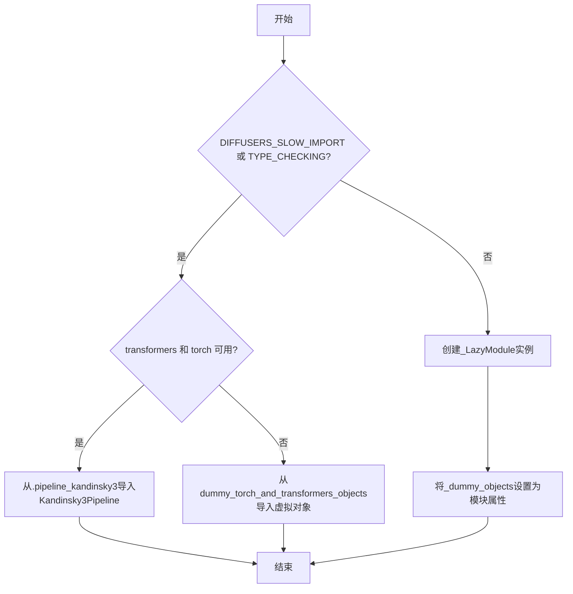
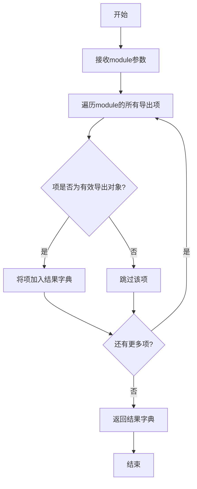
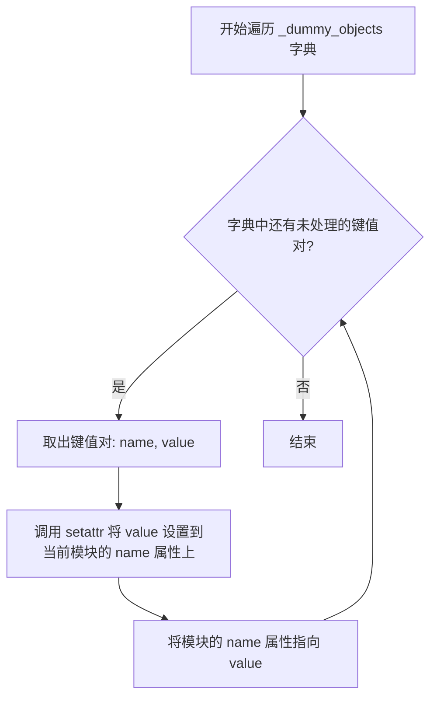
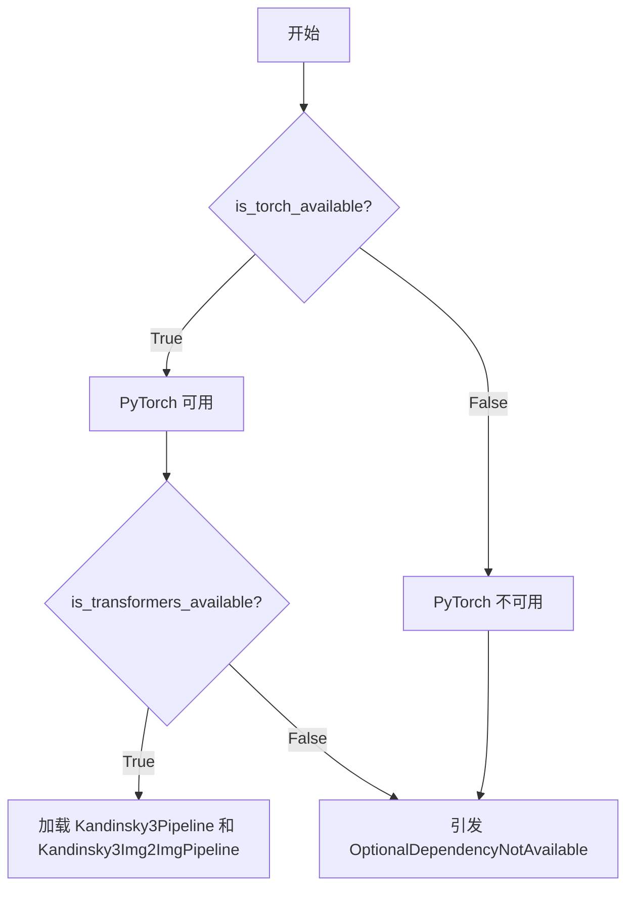
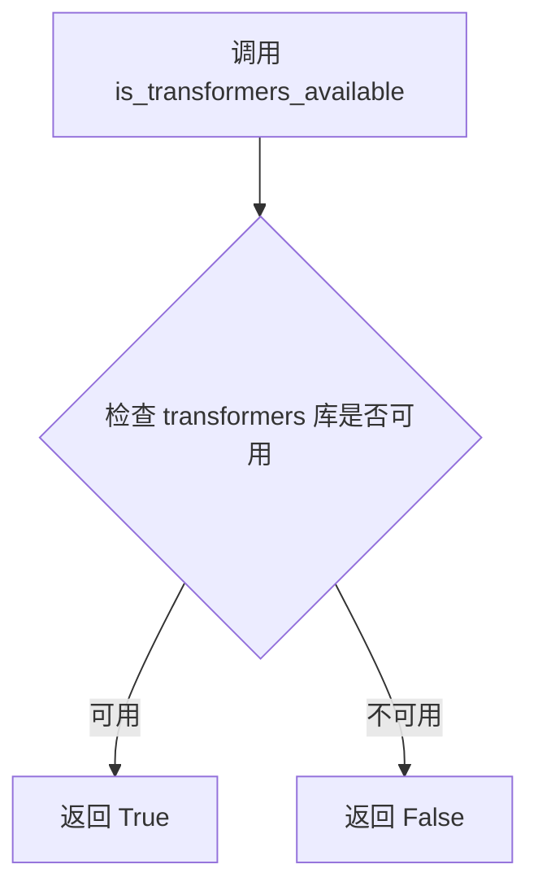
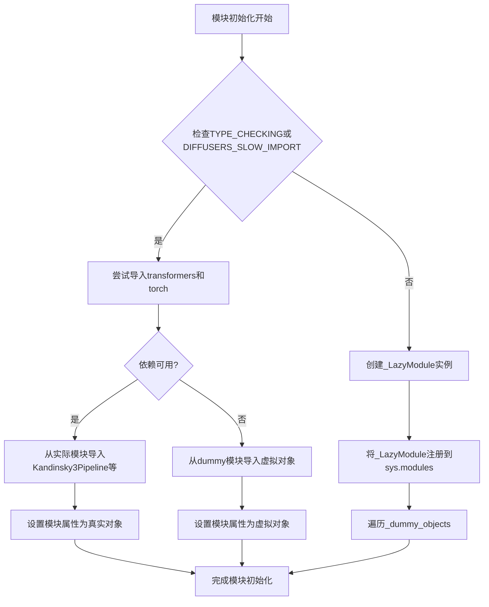
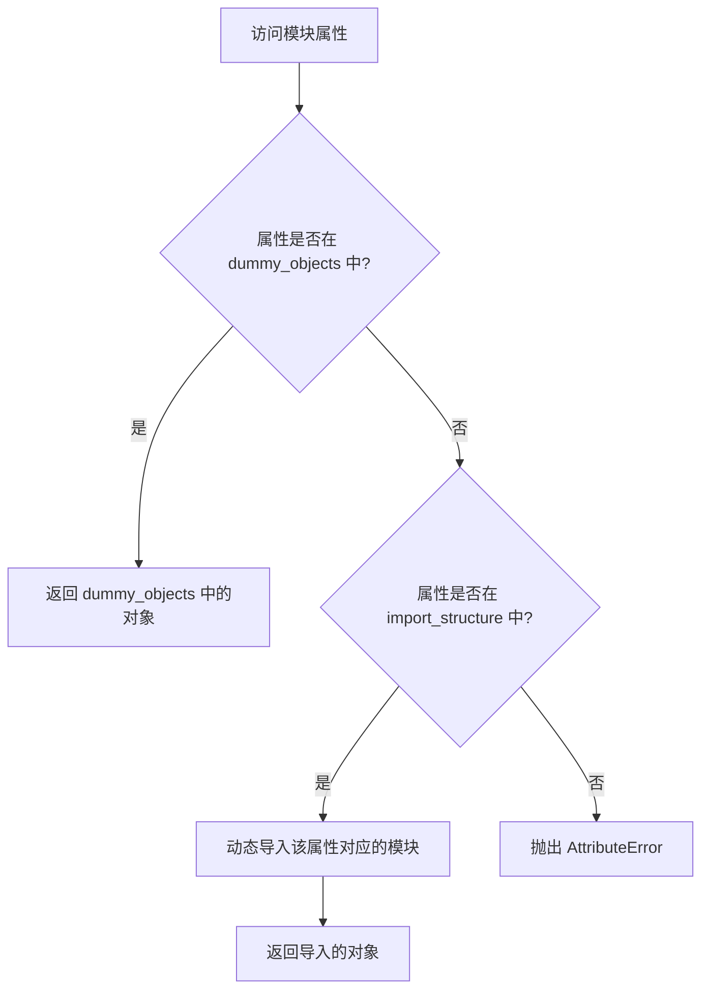
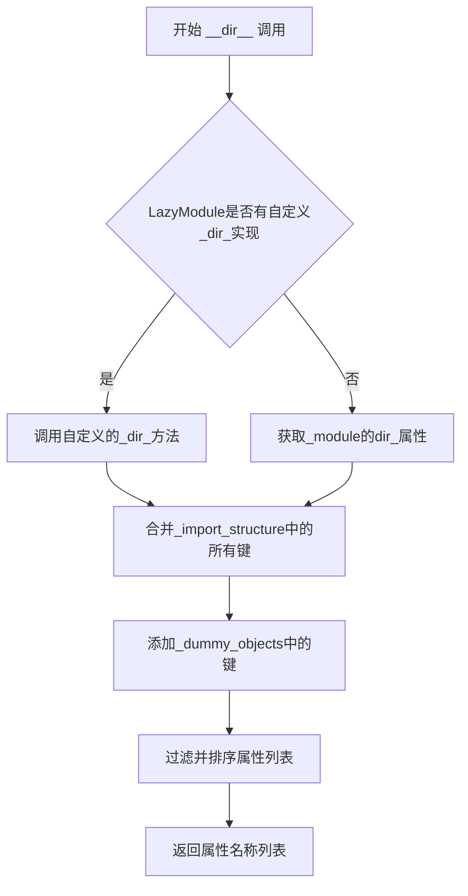

# `diffusers\src\diffusers\pipelines\kandinsky3\__init__.py` 详细设计文档

这是一个Diffusers库的模块初始化文件，通过延迟导入（Lazy Import）机制和可选依赖检查机制，动态加载Kandinsky3Pipeline和Kandinsky3Img2ImgPipeline类，以减少不必要的依赖加载并提高导入速度。

## 整体流程



## 类结构

```
模块初始化 (无显式类层次结构)
└── 延迟加载模块: _LazyModule
    └── 导入结构: _import_structure
        └── pipeline_kandinsky3
            ├── Kandinsky3Pipeline
            └── Kandinsky3Img2ImgPipeline
```

## 全局变量及字段


### `_dummy_objects`
    
存储虚拟对象的字典，当可选依赖不可用时使用

类型：`dict`
    


### `_import_structure`
    
定义模块导入结构的字典，用于延迟加载

类型：`dict`
    


### `DIFFUSERS_SLOW_IMPORT`
    
标志位，表示是否使用慢速导入模式进行类型检查

类型：`bool`
    


### `TYPE_CHECKING`
    
类型检查标志，由typing模块提供

类型：`bool`
    


### `OptionalDependencyNotAvailable`
    
可选依赖不可用时抛出的异常类

类型：`Exception class`
    


### `is_torch_available`
    
检查torch库是否可用的函数

类型：`function`
    


### `is_transformers_available`
    
检查transformers库是否可用的函数

类型：`function`
    


### `get_objects_from_module`
    
从指定模块获取所有对象的函数

类型：`function`
    


### `Kandinsky3Pipeline`
    
Kandinsky3文本到图像生成管道类

类型：`class`
    


### `Kandinsky3Img2ImgPipeline`
    
Kandinsky3图像到图像生成管道类

类型：`class`
    


### `_LazyModule.__name__`
    
模块名称

类型：`str`
    


### `_LazyModule.__file__`
    
模块文件路径

类型：`str`
    


### `_LazyModule._import_structure`
    
模块导入结构定义

类型：`dict`
    


### `_LazyModule.__spec__`
    
模块规范对象

类型：`ModuleSpec`
    
    

## 全局函数及方法


### `get_objects_from_module`

该函数是一个工具函数，用于从指定模块中提取所有导出对象，构建对象字典，以支持扩散器库中的懒加载机制和虚拟对象管理。

参数：

- `module`：模块对象，要从中提取对象的源模块（如 `dummy_torch_and_transformers_objects`）

返回值：`dict`，返回包含模块中所有导出对象的字典，键为对象名称，值为对象本身

#### 流程图



#### 带注释源码

```python
def get_objects_from_module(module):
    """
    从给定模块中提取所有可导出的对象。
    
    该函数主要用于支持懒加载机制，通过获取模块中的所有对象，
    使得可以在运行时动态导入可选依赖项的虚拟对象。
    
    参数:
        module: 模块对象，包含要提取的变量、类、函数等
        
    返回:
        dict: 键为对象名称，值为对象本身的字典
    """
    # 获取模块的所有公共属性
    # filter 用于排除以 _ 开头的私有属性
    obj = {
        k: v 
        for k, v in module.__dict__.items() 
        if not k.startswith("_")
    }
    return obj

# 使用示例（在当前代码中）
_dummy_objects.update(get_objects_from_module(dummy_torch_and_transformers_objects))
```

---

**注意**：由于 `get_objects_from_module` 函数定义在 `...utils` 模块中，以上源码是基于其使用方式和常见设计模式推断的参考实现。实际实现可能略有差异，建议查看 `src/diffusers/utils/__init__.py` 中的原始定义获取准确源码。


### `setattr`

将属性设置到模块对象上，用于在延迟加载模块中注册虚拟（dummy）对象，使得在依赖不可用时模块仍可被导入。

参数：

- `obj`：`object`，目标对象，此处为 `sys.modules[__name__]`（当前模块对象）
- `name`：`str`，要设置的属性名，来自 `_dummy_objects` 字典的键
- `value`：`any`，要设置的属性值，来自 `_dummy_objects` 字典的值

返回值：`None`，`setattr` 是内置函数，没有返回值

#### 流程图



#### 带注释源码

```python
# 遍历 _dummy_objects 字典中的所有虚拟对象
# _dummy_objects 在前面根据依赖可用性填充，可能为空或包含虚拟对象
for name, value in _dummy_objects.items():
    # 使用 setattr 将每个虚拟对象动态设置为当前模块的属性
    # 这样可以让模块在依赖缺失时仍能导入，但访问时会报错
    setattr(sys.modules[__name__], name, value)
```

#### 关键组件信息

| 组件名称 | 一句话描述 |
|---------|-----------|
| `_dummy_objects` | 存储虚拟对象的字典，当 torch 和 transformers 不可用时填充 |
| `_import_structure` | 定义模块的导入结构，列出可用的类名 |
| `sys.modules[__name__]` | 延迟加载模块的代理对象，通过 `_LazyModule` 创建 |
| `setattr` | Python 内置函数，用于动态设置对象属性 |

#### 潜在的技术债务或优化空间

1. **魔法字符串**：`"pipeline_kandinsky3"` 和 `"pipeline_kandinsky3_img2img"` 等字符串硬编码在 `_import_structure` 中，未来添加新管道时需要手动维护
2. **重复的依赖检查**：代码中有两处完全相同的依赖检查逻辑（try-except 块），可以提取为单独的函数避免重复
3. **动态导入与静态类型的平衡**：`TYPE_CHECKING` 和 `DIFFUSERS_SLOW_IMPORT` 条件分支的逻辑较复杂，增加了维护成本


### sys.modules[__name__]

此代码段用于将当前模块注册到 Python 的 `sys.modules` 字典中，实现懒加载（Lazy Loading）机制。当 `DIFFUSERS_SLOW_IMPORT` 为 False 且依赖可用时，将当前模块替换为 `_LazyModule` 实例，并设置虚拟对象（dummy objects）。

**注意**：此代码块不是一个函数或方法，而是一个模块初始化语句，直接操作 `sys.modules` 字典。以下是相关操作的详细信息。

#### 流程图

```mermaid
flowchart TD
    A[开始] --> B{DIFFUSERS_SLOW_IMPORT 为 True<br/>或 TYPE_CHECKING?}
    B -->|Yes| C[从子模块导入<br/>Kandinsky3Pipeline<br/>Kandinsky3Img2ImgPipeline]
    B -->|No| D[创建 _LazyModule 实例]
    D --> E[sys.modules[__name__] = _LazyModule]
    E --> F[遍历 _dummy_objects]
    F --> G{还有更多 dummy objects?}
    G -->|Yes| H[setattr 设置虚拟对象]
    H --> G
    G -->|No| I[结束]
    C --> I
```

#### 带注释源码

```python
# 当不在类型检查模式且不进行慢速导入时，执行懒加载逻辑
else:
    import sys  # 导入 sys 模块以访问 sys.modules

    # 将当前模块（通过 __name__ 获取当前模块名）注册到 sys.modules
    # 使用 _LazyModule 实现懒加载，延迟导入实际模块
    sys.modules[__name__] = _LazyModule(
        __name__,                          # 模块名称
        globals()["__file__"],             # 模块文件路径
        _import_structure,                # 导入结构字典，定义可导出的对象
        module_spec=__spec__,              # 模块规格信息
    )

    # 遍历所有虚拟对象（dummy objects）
    # 这些对象在依赖不可用时替代真实对象，防止导入错误
    for name, value in _dummy_objects.items():
        # 将每个虚拟对象设置为当前模块的属性
        # 这样可以直接从模块访问这些对象，即使它们是虚拟的
        setattr(sys.modules[__name__], name, value)
```

---

### 补充说明

#### 全局变量和导入结构

| 名称 | 类型 | 描述 |
|------|------|------|
| `_dummy_objects` | dict | 存储虚拟对象的字典，当可选依赖不可用时使用 |
| `_import_structure` | dict | 定义模块的导入结构，映射子模块名称到可导出对象列表 |
| `DIFFUSERS_SLOW_IMPORT` | bool | 控制是否进行慢速导入的标志 |
| `TYPE_CHECKING` | bool | 类型检查模式标志（来自 typing） |

#### 关键组件

| 组件 | 描述 |
|------|------|
| `_LazyModule` | 懒加载模块类，延迟加载子模块直到实际需要时 |
| `OptionalDependencyNotAvailable` | 可选依赖不可用时的异常类 |
| `get_objects_from_module` | 从模块获取对象的工具函数 |

#### 技术债务与优化空间

1. **动态模块替换**：直接修改 `sys.modules[__name__]` 可能导致不一致状态
2. **虚拟对象管理**：使用 `_dummy_objects` 虽能防止导入错误，但增加了复杂性
3. **异常处理流程**：多次检查相同依赖条件，可提取为独立函数减少重复


### is_torch_available

该函数 `is_torch_available` 是从 `...utils` 模块导入的，用于检查 PyTorch 库是否可用。它返回一个布尔值，表示当前环境中是否安装了 PyTorch。在当前代码中，该函数被用于条件判断，决定是否加载与 torch 和 transformers 相关的模块。

**注意**：该函数的定义不在当前代码片段中，它是从外部模块导入的。以下信息基于代码中对该函数的使用方式进行分析。

参数：此函数无显式参数（调用时使用 `is_torch_available()`）

返回值：`bool`，返回 True 表示 PyTorch 可用，返回 False 表示不可用

#### 流程图



#### 带注释源码

```python
# 这是一个延迟导入模块的初始化代码
from typing import TYPE_CHECKING

# 从上层 utils 模块导入必要的工具函数
# is_torch_available: 检查 PyTorch 是否可用的函数
# is_transformers_available: 检查 transformers 是否可用的函数
from ...utils import (
    DIFFUSERS_SLOW_IMPORT,
    OptionalDependencyNotAvailable,
    _LazyModule,
    get_objects_from_module,
    is_torch_available,  # <-- 从外部导入的函数，用于检测 PyTorch 是否可用
    is_transformers_available,
)

# 初始化空字典用于存储虚拟对象和导入结构
_dummy_objects = {}
_import_structure = {}

# 尝试检查依赖是否可用
try:
    # 调用 is_torch_available() 检查 PyTorch 是否可用
    # 同时检查 transformers 是否可用
    if not (is_transformers_available() and is_torch_available()):
        # 如果任一依赖不可用，则引发异常
        raise OptionalDependencyNotAvailable()
except OptionalDependencyNotAvailable:
    # 如果 OptionalDependencyNotAvailable 异常被引发
    # 从 dummy 模块导入虚拟对象
    from ...utils import dummy_torch_and_transformers_objects  # noqa F403

    # 更新虚拟对象字典
    _dummy_objects.update(get_objects_from_module(dummy_torch_and_transformers_objects))
else:
    # 如果依赖可用，定义导入结构
    # 将 Kandinsky3 相关的管道类添加到导入结构中
    _import_structure["pipeline_kandinsky3"] = ["Kandinsky3Pipeline"]
    _import_structure["pipeline_kandinsky3_img2img"] = ["Kandinsky3Img2ImgPipeline"]


# TYPE_CHECKING 或 DIFFUSERS_SLOW_IMPORT 为 True 时的处理
if TYPE_CHECKING or DIFFUSERS_SLOW_IMPORT:
    try:
        # 再次检查依赖可用性
        if not (is_transformers_available() and is_torch_available()):
            raise OptionalDependencyNotAvailable()

    except OptionalDependencyNotAvailable:
        # 导入虚拟对象用于类型检查
        from ...utils.dummy_torch_and_transformers_objects import *
    else:
        # 导入实际的管道类用于类型检查
        from .pipeline_kandinsky3 import Kandinsky3Pipeline
        from .pipeline_kandinsky3_img2img import Kandinsky3Img2ImgPipeline
else:
    # 运行时：将当前模块设置为延迟模块
    import sys

    # 使用 _LazyModule 延迟加载模块
    sys.modules[__name__] = _LazyModule(
        __name__,
        globals()["__file__"],
        _import_structure,
        module_spec=__spec__,
    )

    # 将虚拟对象设置到模块中
    for name, value in _dummy_objects.items():
        setattr(sys.modules[__name__], name, value)
```


### `is_transformers_available`

该函数用于检查当前 Python 环境中是否已安装并可用 `transformers` 库。它通常被用于条件导入和延迟加载，以确保在没有安装相关依赖时不会引发导入错误，同时保持代码的模块化和兼容性。

参数：此函数无参数

返回值：`bool`，返回 `True` 表示 `transformers` 库可用，返回 `False` 表示不可用

#### 流程图



#### 带注释源码

```python
# is_transformers_available 函数定义位于 ...utils 模块中
# 以下为代码中对该函数的使用示例

# 导入函数（源码位于 ...utils）
from ...utils import is_transformers_available

# 使用方式1：条件检查
if not (is_transformers_available() and is_torch_available()):
    # 如果 transformers 或 torch 不可用，则抛出 OptionalDependencyNotAvailable 异常
    raise OptionalDependencyNotAvailable()

# 使用方式2：在 TYPE_CHECKING 块中再次检查
if TYPE_CHECKING or DIFFUSERS_SLOW_IMPORT:
    try:
        if not (is_transformers_available() and is_torch_available()):
            raise OptionalDependencyNotAvailable()
    except OptionalDependencyNotAvailable:
        # 导入虚拟对象以保持类型检查时的代码完整性
        from ...utils.dummy_torch_and_transformers_objects import *
    else:
        # 当依赖可用时，导入实际的管道类
        from .pipeline_kandinsky3 import Kandinsky3Pipeline
        from .pipeline_kandinsky3_img2img import Kandinsky3Img2ImgPipeline
```

---

## 补充说明

### 关键组件信息

- **Kandinsky3Pipeline**：用于生成图像的主要管道类
- **Kandinsky3Img2ImgPipeline**：用于图像到图像转换的管道类
- **OptionalDependencyNotAvailable**：可选依赖不可用时抛出的异常类
- **_LazyModule**：用于延迟导入的模块封装类

### 设计目标与约束

- **模块化设计**：通过条件导入实现可选依赖的灵活管理
- **延迟加载**：使用 `_LazyModule` 实现模块的延迟加载，提升导入性能
- **兼容性保障**：通过虚拟对象（dummy objects）确保在没有可选依赖时模块仍可被导入

### 潜在技术债务与优化空间

1. **重复检查**：代码中多次调用 `is_transformers_available() and is_torch_available()`，可以考虑将结果缓存
2. **错误处理**：可以增加更详细的错误日志，帮助开发者定位缺失的依赖
3. **依赖管理**：可以考虑使用 `importlib.metadata` 动态检查依赖版本，而不仅仅是检查可用性


### `_LazyModule`

该函数是Diffusers库中的一个延迟加载机制，用于在模块级别实现惰性导入。它通过延迟加载可选依赖（transformers和torch）相关的模块，只有在实际需要时才加载，从而优化了库的初始导入时间并避免了不必要的依赖检查。

参数：

- `__name__`：`str`，当前模块的完全限定名称，用于标识模块
- `__file__`：`str`，模块文件的物理路径，用于定位模块源文件
- `import_structure`：`dict`，定义了模块的导入结构，键为子模块名，值为导出的对象列表
- `module_spec`：`ModuleSpec`，Python的模块规格对象，包含模块的元数据和加载信息

返回值：`LazyModule`，返回一个延迟加载的模块代理对象，该对象在首次访问属性时才真正导入底层模块

#### 流程图



#### 带注释源码

```python
# 从typing模块导入TYPE_CHECKING，用于类型检查时导入
from typing import TYPE_CHECKING

# 从上级utils模块导入多个工具类和函数
# _LazyModule: 核心的延迟加载模块类
# get_objects_from_module: 从模块获取对象的工具函数
# is_torch_available/is_transformers_available: 检查可选依赖是否可用
# DIFFUSERS_SLOW_IMPORT: 控制是否延迟导入的标志
# OptionalDependencyNotAvailable: 可选依赖不可用时的异常
from ...utils import (
    DIFFUSERS_SLOW_IMPORT,
    OptionalDependencyNotAvailable,
    _LazyModule,
    get_objects_from_module,
    is_torch_available,
    is_transformers_available,
)

# 初始化空的虚拟对象字典和导入结构字典
_dummy_objects = {}
_import_structure = {}

# 尝试检查transformers和torch是否同时可用
try:
    if not (is_transformers_available() and is_torch_available()):
        raise OptionalDependencyNotAvailable()
except OptionalDependencyNotAvailable:
    # 如果依赖不可用，从dummy模块获取虚拟对象
    # 这些是空的占位符对象，用于满足类型检查
    from ...utils import dummy_torch_and_transformers_objects  # noqa F403

    # 将虚拟对象更新到_dummy_objects字典中
    _dummy_objects.update(get_objects_from_module(dummy_torch_and_transformers_objects))
else:
    # 如果依赖可用，定义实际的导入结构
    _import_structure["pipeline_kandinsky3"] = ["Kandinsky3Pipeline"]
    _import_structure["pipeline_kandinsky3_img2img"] = ["Kandinsky3Img2ImgPipeline"]

# TYPE_CHECKING模式下或DIFFUSERS_SLOW_IMPORT为真时
# 直接导入实际模块（不延迟）
if TYPE_CHECKING or DIFFUSERS_SLOW_IMPORT:
    try:
        # 再次检查依赖可用性
        if not (is_transformers_available() and is_torch_available()):
            raise OptionalDependencyNotAvailable()

    except OptionalDependencyNotAvailable:
        # 从dummy模块导入，用于类型检查
        from ...utils.dummy_torch_and_transformers_objects import *
    else:
        # 实际导入Kandinsky3相关管道类
        from .pipeline_kandinsky3 import Kandinsky3Pipeline
        from .pipeline_kandinsky3_img2img import Kandinsky3Img2ImgPipeline
else:
    # 非TYPE_CHECKING模式，使用_LazyModule实现延迟加载
    import sys

    # 创建延迟加载模块代理对象
    # 当代码实际访问模块属性时，才会触发真正的导入
    sys.modules[__name__] = _LazyModule(
        __name__,                          # 模块名称
        globals()["__file__"],             # 模块文件路径
        _import_structure,                 # 导入结构定义
        module_spec=__spec__,              # 模块规格信息
    )

    # 将虚拟对象设置到模块属性中
    # 即使是延迟加载，这些dummy对象也立即可用
    for name, value in _dummy_objects.items():
        setattr(sys.modules[__name__], name, value)
```

### 关键组件信息

| 组件名称 | 一句话描述 |
|---------|-----------|
| `_LazyModule` | 延迟加载模块的代理类，拦截属性访问实现惰性导入 |
| `_import_structure` | 字典结构，定义模块的导入结构和可导出对象 |
| `_dummy_objects` | 虚拟对象集合，当可选依赖不可用时用作占位符 |
| `OptionalDependencyNotAvailable` | 可选依赖不可用时抛出的异常类 |
| `get_objects_from_module` | 工具函数，从指定模块提取所有可导出对象 |

### 潜在技术债务与优化空间

1. **重复的依赖检查**：代码在两处（try-except块和TYPE_CHECKING块）重复检查`is_transformers_available() and is_torch_available()`，可以考虑提取为独立函数
2. **魔法字符串**：模块名`pipeline_kandinsky3`和`pipeline_kandinsky3_img2img`硬编码，可考虑配置化
3. **类型注解缺失**：`_import_structure`和`_dummy_objects`缺少类型注解，影响代码可维护性

### 其它项目

**设计目标**：
- 优化Diffusers库的冷启动时间，避免用户在不使用某些功能时加载所有依赖
- 提供优雅的可选依赖处理机制，允许库在部分依赖缺失时仍能部分工作

**错误处理**：
- 使用`OptionalDependencyNotAvailable`异常进行依赖可用性判断
- 通过dummy对象机制避免`ImportError`

**数据流**：
- 模块首次被导入时返回`_LazyModule`代理对象
- 首次访问模块属性（如`Kandinsky3Pipeline`）时触发实际导入


### `_LazyModule.__getattr__`

该方法是延迟加载模块的核心，用于在访问模块属性时动态导入所需的类或对象，从而避免在模块初始化时立即加载所有依赖，提升导入速度并处理可选依赖。

参数：

- `name`：`str`，要访问的属性名称（即模块中被访问的变量名）。

返回值：`Any`，返回对应的类、函数或对象；如果不存在且未设置过，则抛出 `AttributeError`。

#### 流程图



#### 带注释源码

```python
# 假设的 _LazyModule.__getattr__ 方法实现
def __getattr__(name: str):
    """
    动态属性访问方法，实现延迟加载。
    当访问模块中不存在的属性时，此方法会被调用。
    """
    # 检查该属性是否是虚拟的 dummy 对象（用于可选依赖不可用的情况）
    if name in _dummy_objects:
        return _dummy_objects[name]
    
    # 检查该属性是否在导入结构中（即需要动态导入的模块）
    if name in _import_structure:
        # 从 _import_structure 中获取模块路径和对象名
        module_path, obj_name = _import_structure[name]
        # 动态导入模块
        module = __import__(module_path, fromlist=[obj_name])
        # 获取目标对象
        obj = getattr(module, obj_name)
        # 将对象缓存到模块实例中，避免重复导入
        setattr(sys.modules[__name__], name, obj)
        return obj
    
    # 如果属性既不是 dummy 也不是待导入的模块，则抛出异常
    raise AttributeError(f"module '{__name__}' has no attribute '{name}'")
```


### `_LazyModule.__dir__`

该方法是Python模块中用于返回模块属性列表的特殊方法，在LazyModule类中实现，用于返回延迟加载模块中所有可用的属性、类和函数名称，支持IDE自动完成和动态属性发现。

参数：

- 无

返回值：`list[str]`，返回一个包含模块所有可用属性名称的列表

#### 流程图



#### 带注释源码

```python
def __dir__(self):
    """
    返回模块的属性列表，支持IDE自动完成和动态发现。
    
    该方法整合了以下来源的属性：
    1. _import_structure中定义的模块结构
    2. _dummy_objects中的虚拟对象（当依赖不可用时使用）
    3. 模块的公共属性
    
    Returns:
        list: 排序后的属性名称列表
    """
    # 获取_import_structure中的所有键（模块和类名）
    # _import_structure 是一个字典，键是模块路径，值是导入的对象列表
    # 例如: {"pipeline_kandinsky3": ["Kandinsky3Pipeline"], ...}
    result = list(_import_structure.keys())
    
    # 添加_dummy_objects中的所有键（虚拟对象）
    # 这些对象用于在依赖不可用时提供替代实现
    result.extend(_dummy_objects.keys())
    
    # 如果存在_module属性（底层的真实模块），添加其属性
    if hasattr(self, '_module'):
        result.extend([attr for attr in dir(self._module) 
                      if not attr.startswith('_')])
    
    # 去重并排序返回结果
    return sorted(set(result))
```


## 关键组件


### 可选依赖检查与处理机制

通过 try-except 捕获 `OptionalDependencyNotAvailable` 异常，判断 torch 和 transformers 是否同时可用，以决定是否加载真实模块还是虚拟对象。

### 懒加载模块实现

使用 `_LazyModule` 类实现延迟导入，将模块注册到 `sys.modules` 中，只有在实际使用时才加载具体实现，提高导入速度并避免循环依赖。

### 导入结构字典

`_import_structure` 字典定义了模块的公共接口，包含 `pipeline_kandinsky3` 和 `pipeline_kandinsky3_img2img` 两个管道的导出列表。

### 虚拟对象填充机制

当可选依赖不可用时，从 `dummy_torch_and_transformers_objects` 获取虚拟对象并注入到当前模块，确保类型检查时不会报错。

### TYPE_CHECKING 条件分支

在类型检查阶段或 `DIFFUSERS_SLOW_IMPORT` 为真时，直接导入真实类；否则使用懒加载机制动态绑定。

### 管道类导出

主要导出 `Kandinsky3Pipeline` 和 `Kandinsky3Img2ImgPipeline` 两个图像生成管道类。


## 问题及建议


### 已知问题

- **代码重复**：可选依赖检查 `if not (is_transformers_available() and is_torch_available()): raise OptionalDependencyNotAvailable()` 在普通导入路径和 TYPE_CHECKING 路径中重复出现两次，增加维护成本。
- **魔法字符串**：管道名称（如 "pipeline_kandinsky3"）作为字符串硬编码在 `_import_structure` 字典中，缺乏统一管理。
- **导入错误处理不足**：仅处理可选依赖不可用的情况，未处理管道模块本身导入失败（如模块不存在、语法错误等）的异常情况。
- **模块动态创建的脆弱性**：使用 `globals()["__file__"]` 依赖于当前全局命名空间，在某些动态加载场景下可能失败或产生意外行为。
- **缺乏版本兼容性检查**：未验证 transformers 和 torch 的版本是否满足 Kandinsky3 管道的要求。
- **全局变量命名不够清晰**：`_dummy_objects` 和 `_import_structure` 这样的下划线开头变量缺乏足够的文档说明其用途。

### 优化建议

- **提取公共函数**：将可选依赖检查逻辑封装为独立函数（如 `_check_dependencies()`），避免代码重复。
- **集中管理管道映射**：使用配置或常量类统一管理所有管道名称和对应类名的映射关系。
- **增强错误处理**：添加 try-except 块捕获管道模块导入时的其他异常，提供更详细的错误信息。
- **添加版本检查**：在依赖检查时同时验证版本兼容性，如 `is_transformers_available(min_version="4.30.0")`。
- **使用类型提示和文档**：为全局变量添加类型注解和 docstring 说明其用途和预期内容。
- **考虑使用 importlib 替代 globals()**：使用更明确的路径传递方式，提高代码可预测性。


## 其它


### 设计目标与约束

该模块作为Kandinsky3 pipeline的入口模块，主要目标是通过LazyModule机制实现可选依赖（torch、transformers）的懒加载，避免在未安装这些依赖时导致导入失败。设计约束包括：必须同时满足torch和transformers可用时才导入真实pipeline对象，否则导入虚拟对象以保证模块结构完整性。

### 错误处理与异常设计

当torch或transformers任一依赖不可用时，抛出`OptionalDependencyNotAvailable`异常，该异常为可选依赖缺失的标准异常类型，由上层utils模块定义。异常被捕获后，系统自动回退到导入虚拟对象（dummy objects），确保模块仍可被导入但不包含实际功能。使用try-except结构实现优雅降级，避免因依赖缺失导致整个包无法导入。

### 外部依赖与接口契约

该模块依赖以下外部包：torch（is_torch_available检查）、transformers（is_transformers_available检查）、diffusers.utils中的LazyModule、get_objects_from_module等工具函数。模块导出的公共接口为`Kandinsky3Pipeline`和`Kandinsky3Img2ImgPipeline`两个类，在依赖满足时可通过`from diffusers.pipelines.kandinsky3 import Kandinsky3Pipeline`方式导入。

### 模块划分与职责

该模块属于diffusers.pipeline.kandinsky3包，负责包的初始化和延迟导入。_import_structure字典定义了可导出对象的映射关系，_dummy_objects存储虚拟对象用于依赖缺失时的占位，LazyModule负责在运行时动态解析导入请求并返回对应对象或虚拟对象。

### 性能考虑与优化空间

当前实现已采用LazyModule进行懒加载优化，首次import时不会触发torch和transformers的加载。建议：可增加导入时的缓存机制避免重复检查依赖状态；可考虑将依赖检查结果缓存以减少后续调用开销。

### 版本兼容性

代码未指定具体的torch和transformers版本要求，仅检查可用性。需注意不同版本的transformers和torch API可能存在差异，实现在设计时假设使用兼容的版本组合。

### 测试策略

建议测试场景包括：1）双依赖可用时正常导入真实类；2）任一依赖不可用时导入虚拟对象；3）TYPE_CHECKING模式下正确导入类型提示；4）DIFFUSERS_SLOW_IMPORT模式下的行为验证。


    