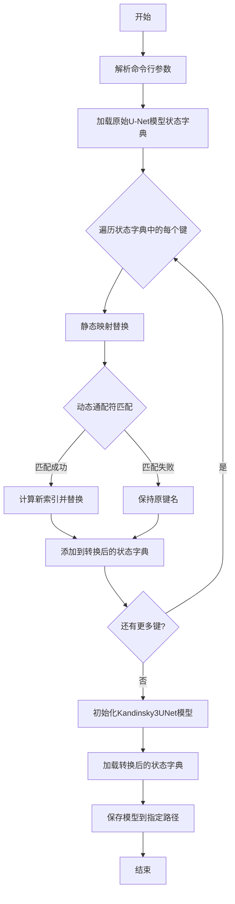

# `diffusers\src\diffusers\pipelines\kandinsky3\convert_kandinsky3_unet.py` 详细设计文档

该脚本用于将原始U-Net模型的状态字典(state dict)键名转换为Kandinsky3UNet模型期望的格式，支持静态键名映射和动态通配符匹配，实现模型权重的跨架构迁移。

## 整体流程



## 类结构

```
该脚本为扁平化结构，无类定义
仅包含全局变量和全局函数
```

## 全局变量及字段


### `MAPPING`
    
静态键名映射字典，将旧键名模式映射到新键名

类型：`dict`
    


### `DYNAMIC_MAP`
    
动态键名映射字典，支持通配符模式和索引偏移

类型：`dict`
    


    

## 全局函数及方法


### `convert_state_dict`

将U-Net模型的状态字典键名从原始格式转换为Kandinsky3UNet模型期望的键名格式，通过静态映射表和动态模式匹配实现键名的批量替换。

参数：

- `unet_state_dict`：`dict`，输入的原始U-Net模型状态字典，包含模型权重参数的键值对

返回值：`dict`，转换后的状态字典，键名已按照Kandinsky3UNet模型的格式要求进行重命名

#### 流程图

```mermaid
flowchart TD
    A[开始] --> B[初始化空converted_state_dict]
    B --> C{遍历unet_state_dict中的每个key}
    C --> D[复制key到new_key]
    D --> E[应用MAPPING静态映射替换]
    E --> F{检查DYNAMIC_MAP动态模式匹配}
    F -->|匹配| G[计算替换后的索引]
    G --> H[应用动态模式替换]
    H --> I[将原始key的值存入converted_state_dict[new_key]]
    F -->|不匹配| I
    I --> C
    C -->|遍历完成| J[返回converted_state_dict]
    J --> K[结束]
```

#### 带注释源码

```python
def convert_state_dict(unet_state_dict):
    """
    将U-Net模型的状态字典键名转换为Kandinsky3UNet模型期望的格式
    
    参数:
        unet_state_dict (dict): 原始U-Net模型的状态字典，键名为模型参数的名称
        
    返回值:
        dict: 转换后的状态字典，键名已适配Kandinsky3UNet模型结构
    """
    # 创建空字典存储转换后的状态字典
    converted_state_dict = {}
    
    # 遍历输入状态字典中的每个键值对
    for key in unet_state_dict:
        # 初始新键名为原始键名
        new_key = key
        
        # 第一步：应用静态映射表MAPPING进行键名替换
        # MAPPING包含固定的键名对应关系，如"time_embedding"相关映射
        for pattern, new_pattern in MAPPING.items():
            new_key = new_key.replace(pattern, new_pattern)
        
        # 第二步：应用动态模式匹配DYNAMIC_MAP进行复杂键名转换
        # 处理带有通配符的动态模式，如resnet_attn_blocks的索引转换
        for dyn_pattern, dyn_new_pattern in DYNAMIC_MAP.items():
            # 标记是否已匹配，避免重复处理
            has_matched = False
            
            # 检查当前键是否匹配动态模式（格式：*.resnet_attn_blocks.*.*）
            if fnmatch.fnmatch(new_key, f"*.{dyn_pattern}.*") and not has_matched:
                # 从键名中提取星号位置的数字索引
                # 例如：从"resnet_attn_blocks.0.1"提取出层索引0
                star = int(new_key.split(dyn_pattern.split(".")[0])[-1].split(".")[1])
                
                # 如果映射值是元组，需要调整索引偏移
                if isinstance(dyn_new_pattern, tuple):
                    new_star = star + dyn_new_pattern[-1]  # 加上偏移量
                    dyn_new_pattern = dyn_new_pattern[0]  # 取映射模式字符串
                else:
                    new_star = star
                
                # 构建实际匹配的模式和替换模式
                pattern = dyn_pattern.replace("*", str(star))
                new_pattern = dyn_new_pattern.replace("*", str(new_star))
                
                # 执行动态模式替换
                new_key = new_key.replace(pattern, new_pattern)
                has_matched = True
        
        # 将转换后的键值对添加到结果字典
        converted_state_dict[new_key] = unet_state_dict[key]
    
    # 返回转换完成的状态字典
    return converted_state_dict
```

#### 关键组件信息

| 组件名称 | 描述 |
|---------|------|
| `MAPPING` | 静态键名映射字典，将原始键名模式替换为Kandinsky3UNet格式的标准键名 |
| `DYNAMIC_MAP` | 动态模式映射字典，处理带索引的键名转换，支持索引偏移计算 |
| `fnmatch` | Python标准库模块，用于进行Unix风格的文件名模式匹配 |

#### 潜在技术债务与优化空间

1. **硬编码索引偏移**：DYNAMIC_MAP中的索引偏移值(1)是硬编码的，缺乏灵活性
2. **模式匹配效率**：使用fnmatch进行逐个键名匹配，时间复杂度为O(n*m)，可考虑预编译正则表达式
3. **错误处理缺失**：未对输入状态字典进行有效性校验，如空字典、格式错误等情况
4. **日志记录不足**：缺少转换过程的日志记录，难以调试和追踪转换失败的原因
5. **不支持原地修改**：函数总是创建新字典，对于大型模型可能会占用双倍内存


### `main`

主函数，负责模型加载、转换和保存。它加载原始 U-Net 模型的状态字典，通过 `convert_state_dict` 函数将键名转换为 Kandinsky3UNet 格式，初始化并加载转换后的状态字典到新模型，最后保存模型到指定路径。

参数：

-  `model_path`：`str`，原始 U-Net 模型（safetensors 格式）的文件路径
-  `output_path`：`str`，转换后的 Kandinsky3UNet 模型的保存路径

返回值：`None`，无返回值，函数执行完成后通过 `print` 输出转换结果

#### 流程图

```mermaid
flowchart TD
    A[开始] --> B[加载原始模型状态字典<br/>load_file model_path]
    B --> C[初始化空 Kandinsky3UNet 配置<br/>config = {}]
    C --> D[调用 convert_state_dict<br/>转换状态字典键名]
    D --> E[创建 Kandinsky3UNet 实例<br/>Kandinsky3UNet config]
    E --> F[加载转换后的状态字典<br/>unet.load_state_dict]
    F --> G[保存模型到指定路径<br/>unet.save_pretrained output_path]
    G --> H[打印成功消息<br/>print Converted model saved to...]
    H --> I[结束]
```

#### 带注释源码

```
def main(model_path, output_path):
    # 加载原始 U-Net 模型的状态字典（safetensors 格式）
    # 使用 safetensors 库的 load_file 函数读取模型权重
    unet_state_dict = load_file(model_path)

    # 初始化 Kandinsky3UNet 的配置字典
    # 当前为空字典，将使用默认配置创建模型
    config = {}

    # 将原始状态字典的键名转换为 Kandinsky3UNet 格式
    # 通过 MAPPING 和 DYNAMIC_MAP 进行键名映射和转换
    converted_state_dict = convert_state_dict(unet_state_dict)

    # 使用空配置初始化 Kandinsky3UNet 模型实例
    unet = Kandinsky3UNet(config)

    # 将转换后的状态字典加载到新模型中
    # 如果键名不匹配会抛出异常
    unet.load_state_dict(converted_state_dict)

    # 将转换后的模型保存到指定路径
    # 会保存模型权重和配置文件
    unet.save_pretrained(output_path)

    # 打印转换完成的消息，包含输出路径
    print(f"Converted model saved to {output_path}")
```

## 关键组件


### MAPPING

静态键名映射字典，用于将原始U-Net模型的状态字典键名转换为Kandinsky3UNet模型期望的键名格式，包含时间嵌入层、输入输出层、注意力机制等模块的命名对应关系。

### DYNAMIC_MAP

动态键名映射规则，支持通配符匹配，用于处理U-Net中resnet和attention块的层级索引转换，支持基于模式匹配的动态索引偏移。

### convert_state_dict

状态字典转换函数，将原始U-Net模型的状态字典键名按照MAPPING和DYNAMIC_MAP规则进行批量转换，返回转换后的有序状态字典。

### main

主函数，负责加载原始模型、初始化Kandinsky3UNet、执行状态字典转换、加载权重并保存转换后的模型到指定路径。

### 命令行参数解析

使用argparse模块解析--model_path和--output_path两个必需参数，分别指定输入模型路径和输出模型保存路径。

### 依赖外部模型

代码依赖diffusers库的Kandinsky3UNet类以及safetensors.torch的load_file函数进行模型加载。


## 问题及建议


### 已知问题

- **config为空字典**：Kandinsky3UNet初始化时传入空字典config={}，将使用默认配置，可能导致模型结构与权重不匹配，从而在load_state_dict时失败或产生意外行为
- **DYNAMIC_MAP处理逻辑存在bug**：`has_matched`变量在for循环外部初始化为False，导致在遍历DYNAMIC_MAP时一旦设置为True后，后续的key处理可能出现问题，且缺少在每次key迭代开始时的重置
- **缺少文件路径验证**：未检查model_path指向的文件是否存在，load_file可能抛出FileNotFoundError异常
- **load_state_dict缺少strict参数**：未使用strict=False来处理权重键名不完全匹配的情况，可能导致转换失败
- **内存效率低下**：同时保留原始unet_state_dict和转换后的converted_state_dict，对于大型模型会占用大量内存
- **DYNAMIC_MAP模式匹配逻辑脆弱**：通过字符串split和replace实现动态索引替换，逻辑复杂且容易出错，难以维护
- **异常处理缺失**：load_file、load_state_dict、save_pretrained等操作均未捕获异常，程序可能以不清晰的错误信息终止
- **缺少类型注解**：函数参数和返回值均无类型提示，影响代码可读性和静态分析

### 优化建议

- **完善config配置**：根据Kandinsky3UNet的文档提供必要的配置参数（如in_channels、out_channels等），或在转换前从原始模型中提取配置
- **修复DYNAMIC_MAP逻辑**：在遍历每个原始key时重置has_matched=False，并考虑使用更清晰的正则表达式或结构化数据处理方式
- **添加输入验证**：在加载模型前检查文件是否存在，使用os.path.isfile或pathlib.Path验证
- **使用strict=False**：在load_state_dict时显式指定strict=False以允许部分权重匹配
- **优化内存使用**：在转换完成后及时删除原始state_dict，使用del并调用gc.collect()
- **添加异常处理**：为load_file、load_state_dict、save_pretrained等操作添加try-except块，提供有意义的错误信息
- **添加类型注解**：为函数参数和返回值添加类型提示，提升代码可维护性
- **增加日志和验证**：在转换前后打印关键信息，如转换的key数量、未匹配的key等，便于调试

## 其它


### 设计目标与约束

将任意格式的U-Net模型状态字典转换为Kandinsky3UNet模型兼容的格式，支持命令行参数传入模型路径和输出路径，输出可直接用于HuggingFace Diffusers框架的Kandinsky3UNet模型。

### 错误处理与异常设计

- 文件不存在：捕获FileNotFoundError，提示模型文件路径无效
- 状态字典键不匹配：静默处理未匹配的键，保留原键名
- 模型加载失败：Kandinsky3UNet.load_state_dict()默认strict=True，键不匹配时抛出RuntimeError
- 权限错误：捕获PermissionError，提示输出路径无写入权限

### 数据流与状态机

输入模型文件(safetensors格式) → load_file()加载为字典 → convert_state_dict()遍历转换键名 → 生成新的有序字典 → Kandinsky3UNet.load_state_dict()加载 → save_pretrained()保存为HuggingFace格式

### 外部依赖与接口契约

- safetensors.torch.load_file: 加载.safetensors格式模型文件，输入文件路径，返回字典
- diffusers.Kandinsky3UNet: HuggingFace Diffusers库模型类，config字典为空时使用默认配置
- argparse: 命令行参数解析，model_path和output_path为必需字符串参数

### 配置信息

config字典为空，Kandinsky3UNet使用HuggingFace默认配置，包括：
- in_channels: 4
- out_channels: 4
- down_block_types: 默认UNet结构
- up_block_types: 默认UNet结构
- block_out_channels: 默认参数

### 使用示例

```bash
python convert_unet_to_kandinsky3.py --model_path ./original_unet/model.safetensors --output_path ./kandinsky3_unet
```

### 性能考虑

- 状态字典转换时间复杂度O(n)，n为键数量
- 大模型文件内存占用较高，需确保机器RAM足够
- 转换过程无GPU加速，纯CPU计算

### 安全性考虑

- model_path和output_path需自行验证路径安全性
- 无输入校验机制，需确保模型来源可靠
- 输出路径若已存在同名文件会被覆盖

    