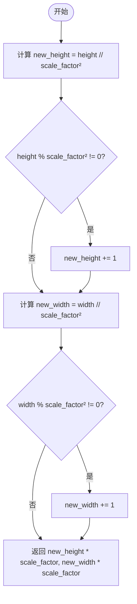
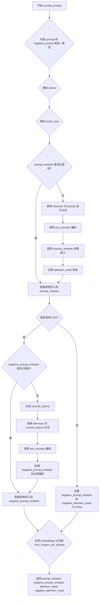
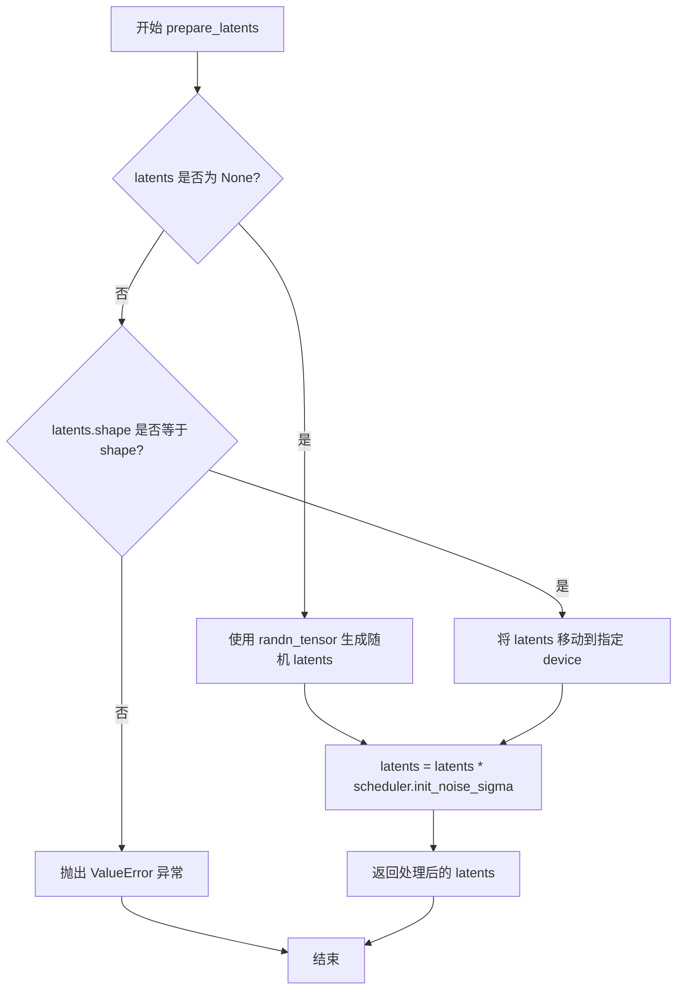
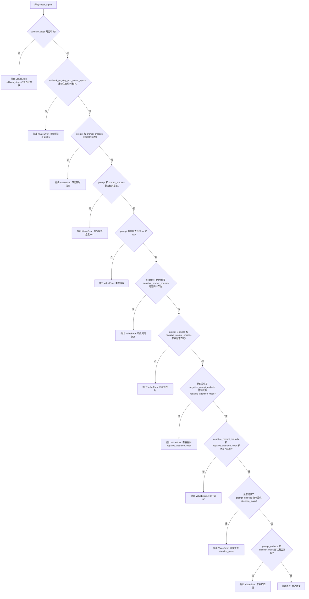
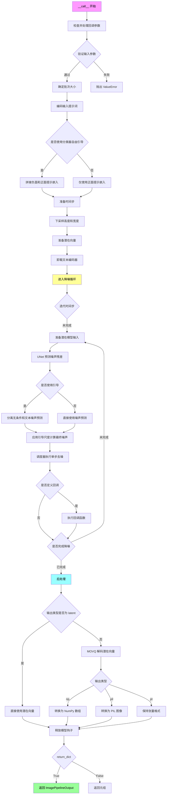
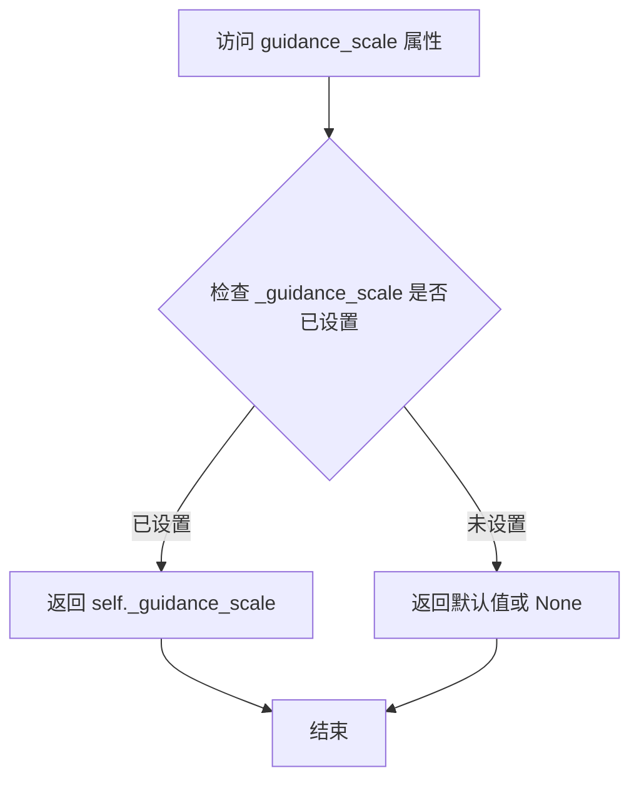
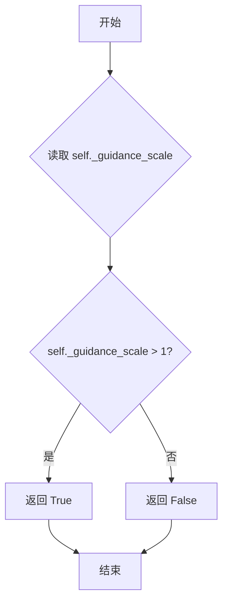
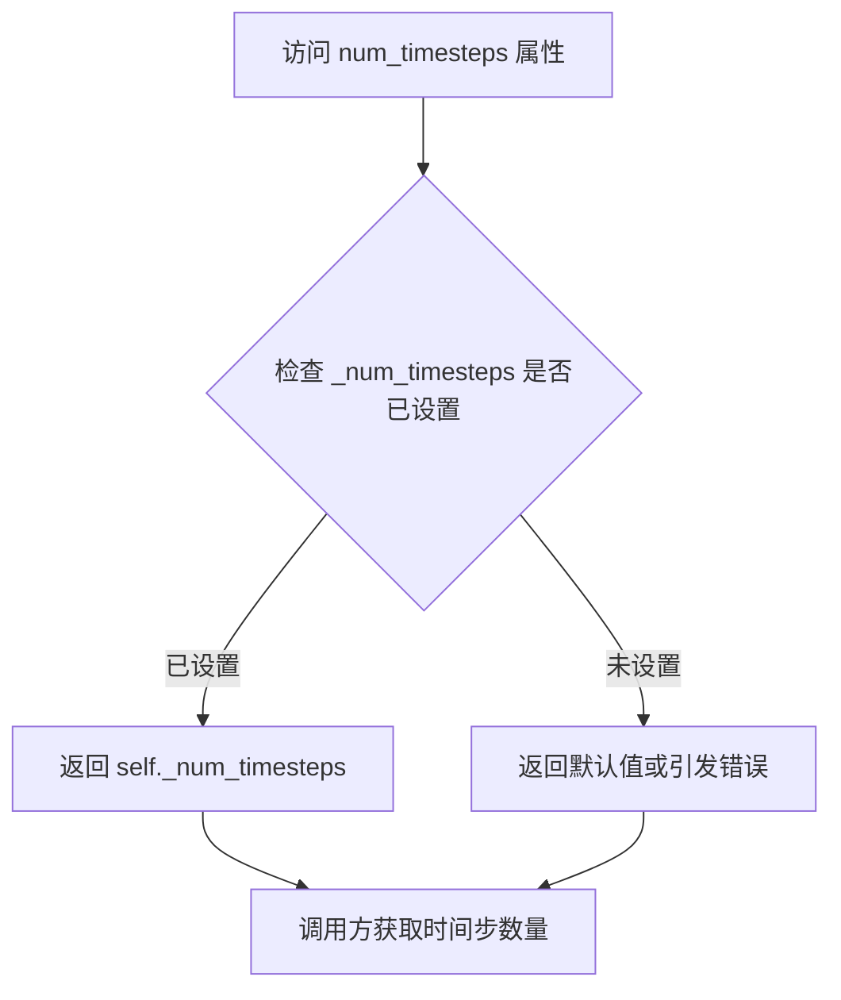

# `diffusers\src\diffusers\pipelines\kandinsky3\pipeline_kandinsky3.py` 详细设计文档

这是一个基于Kandinsky 3模型的文本到图像生成管道(T2I Pipeline)，使用T5文本编码器将文本提示转换为嵌入向量，通过UNet模型进行潜在空间的去噪处理，最后使用VQ模型(MoVQ)将潜在向量解码为图像，支持分类器自由引导(CFG)、LoRA加载、模型CPU卸载等高级功能。

## 整体流程

```mermaid
graph TD
A[开始: __call__] --> B[检查输入参数 check_inputs]
B --> C{参数有效?}
C -- 否 --> D[抛出ValueError]
C -- 是 --> E[编码提示词 encode_prompt]
E --> F[应用分类器自由引导 CFG]
F --> G[设置去噪 timesteps]
G --> H[准备初始潜在向量 prepare_latents]
H --> I{进入去噪循环}
I --> J[UNet预测噪声 noise_pred]
J --> K[CFG计算: 结合条件与无条件预测]
K --> L[调度器更新潜在向量 scheduler.step]
L --> M{执行回调?]
M -- 是 --> N[callback_on_step_end]
M -- 否 --> O{继续下一轮?}
O -- 是 --> I
O -- 否 --> P[后处理: MoVQ解码]
P --> Q[返回图像 ImagePipelineOutput]
```

## 类结构

```
DiffusionPipeline (抽象基类)
└── Kandinsky3Pipeline (具体实现类)
    └── 混入: StableDiffusionLoraLoaderMixin
```

## 全局变量及字段


### `XLA_AVAILABLE`
    
PyTorch XLA是否可用

类型：`bool`
    


### `logger`
    
模块级日志记录器

类型：`logging.Logger`
    


### `EXAMPLE_DOC_STRING`
    
示例文档字符串

类型：`str`
    


### `Kandinsky3Pipeline.tokenizer`
    
T5文本分词器

类型：`T5Tokenizer`
    


### `Kandinsky3Pipeline.text_encoder`
    
T5文本编码器模型

类型：`T5EncoderModel`
    


### `Kandinsky3Pipeline.unet`
    
UNet去噪模型

类型：`Kandinsky3UNet`
    


### `Kandinsky3Pipeline.scheduler`
    
DDPM调度器

类型：`DDPMScheduler`
    


### `Kandinsky3Pipeline.movq`
    
MoVQ解码器(VQ-VAE)

类型：`VQModel`
    


### `Kandinsky3Pipeline.model_cpu_offload_seq`
    
模型CPU卸载顺序

类型：`str`
    


### `Kandinsky3Pipeline._callback_tensor_inputs`
    
回调支持的tensor输入列表

类型：`list`
    


### `Kandinsky3Pipeline._guidance_scale`
    
CFG引导强度

类型：`float`
    


### `Kandinsky3Pipeline._num_timesteps`
    
去噪步数

类型：`int`
    


### `Kandinsky3Pipeline._execution_device`
    
执行设备

类型：`torch.device`
    
    

## 全局函数及方法


### `downscale_height_and_width`

该函数用于计算图像在潜在空间（latent space）中的下采样尺寸，主要应用于扩散模型的潜在变量生成过程中，确保下采样后的尺寸能够完整覆盖原始图像尺寸（处理不能整除的情况）。

参数：

- `height`：`int`，输入图像的高度（像素）
- `width`：`int`，输入图像的宽度（像素）
- `scale_factor`：`int`，默认为8，下采样因子，通常对应VAE的下采样倍数

返回值：`tuple[int, int]`，下采样后的高度和宽度

#### 流程图



#### 带注释源码

```
def downscale_height_and_width(height, width, scale_factor=8):
    """
    计算下采样后的高度和宽度
    
    该函数用于将图像尺寸下采样到潜在空间尺寸。在扩散模型中，
    图像首先被编码到潜在空间，然后在该空间进行去噪处理。
    由于潜在空间通常有下采样因子（如8倍），因此需要计算
    对应的潜在空间尺寸。
    
    参数:
        height: 输入图像的高度（像素）
        width: 输入图像的宽度（像素）
        scale_factor: 下采样因子，默认为8（对应VAE的8倍下采样）
    
    返回:
        tuple: (下采样后的高度, 下采样后的宽度)
    """
    
    # 计算高度：先除以scale_factor的平方，再乘以scale_factor
    # 这样可以实现近似的下采样，同时处理不能整除的情况
    new_height = height // scale_factor**2
    
    # 如果高度不能被整除，向上取整确保覆盖原始尺寸
    if height % scale_factor**2 != 0:
        new_height += 1
    
    # 同样处理宽度
    new_width = width // scale_factor**2
    if width % scale_factor**2 != 0:
        new_width += 1
    
    # 返回最终的下采样尺寸（乘以scale_factor还原回像素空间）
    return new_height * scale_factor, new_width * scale_factor
```


### `Kandinsky3Pipeline.__init__`

这是 Kandinsky3Pipeline 类的构造函数，用于初始化扩散管道的所有核心组件，包括分词器、文本编码器、UNet模型、调度器和VQ解码器模型，并将这些模块注册到管道中以便于管理和调用。

参数：

- `self`：Kandinsky3Pipeline 实例本身（隐式参数）
- `tokenizer`：`T5Tokenizer`，T5 文本分词器，用于将文本 prompt 转换为 token ID 序列
- `text_encoder`：`T5EncoderModel`，T5 编码器模型，用于将 token 序列编码为文本嵌入向量
- `unet`：`Kandinsky3UNet`，Kandinsky3 专用的 UNet 模型，用于预测噪声残差
- `scheduler`：`DDPMScheduler`，DDPM 噪声调度器，用于控制去噪过程中的噪声调度
- `movq`：`VQModel`，向量量化解码器模型，用于将潜在空间向量解码为最终图像

返回值：`None`，构造函数不返回值，仅初始化对象状态

#### 流程图

```mermaid
flowchart TD
    A[__init__ 开始] --> B[调用 super().__init__ 初始化父类 DiffusionPipeline]
    B --> C[调用 self.register_modules 注册所有子模块]
    C --> D[tokenizer 注册为 self.tokenizer]
    C --> E[text_encoder 注册为 self.text_encoder]
    C --> F[unet 注册为 self.unet]
    C --> G[scheduler 注册为 self.scheduler]
    C --> H[movq 注册为 self.movq]
    D --> I[__init__ 结束]
    E --> I
    F --> I
    G --> I
    H --> I
```

#### 带注释源码

```python
def __init__(
    self,
    tokenizer: T5Tokenizer,
    text_encoder: T5EncoderModel,
    unet: Kandinsky3UNet,
    scheduler: DDPMScheduler,
    movq: VQModel,
):
    """
    初始化 Kandinsky3Pipeline 扩散管道。
    
    参数:
        tokenizer: T5Tokenizer - T5 文本分词器
        text_encoder: T5EncoderModel - T5 文本编码器
        unet: Kandinsky3UNet - Kandinsky3 的 UNet 模型
        scheduler: DDPMScheduler - DDPM 噪声调度器
        movq: VQModel - VQ 向量量化解码器模型
    
    返回:
        None - 构造函数无返回值
    """
    # 调用父类 DiffusionPipeline 的初始化方法
    # 继承自 DiffusionPipeline 的基础功能和属性
    super().__init__()

    # 将传入的所有模块注册到当前管道实例中
    # 这些模块将作为管道的可访问属性
    # register_modules 是 DiffusionPipeline 提供的通用方法
    self.register_modules(
        tokenizer=tokenizer,      # 注册分词器
        text_encoder=text_encoder, # 注册文本编码器
        unet=unet,                 # 注册 UNet 模型
        scheduler=scheduler,       # 注册调度器
        movq=movq                  # 注册 VQ 解码器
    )
```


### `Kandinsky3Pipeline.process_embeds`

该方法用于处理文本嵌入（embeddings）和注意力掩码（attention_mask），根据 `cut_context` 参数决定是否裁剪上下文序列长度，并将无效位置（mask=0）的嵌入置零。

参数：

- `self`：`Kandinsky3Pipeline` 实例，管道对象本身
- `embeddings`：`torch.Tensor`，文本编码器输出的隐藏状态向量，形状为 (batch_size, seq_len, hidden_dim)
- `attention_mask`：`torch.Tensor`，注意力掩码，形状为 (batch_size, seq_len)，用于标识有效token位置
- `cut_context`：`bool`，是否裁剪上下文序列长度，若为 True 则截断到最后一个有效token位置

返回值：`tuple[torch.Tensor, torch.Tensor]`，返回处理后的 (embeddings, attention_mask) 元组

#### 流程图

```mermaid
flowchart TD
    A[开始 process_embeds] --> B{cut_context == True?}
    B -- No --> E[直接返回原始 embeddings 和 attention_mask]
    B -- Yes --> C[将 attention_mask==0 位置的 embeddings 置零]
    C --> D[计算 max_seq_length = attention_mask.sum(-1).max() + 1]
    D --> F[截断 embeddings 到 max_seq_length 长度]
    F --> G[截断 attention_mask 到 max_seq_length 长度]
    G --> H[返回处理后的 embeddings 和 attention_mask]
```

#### 带注释源码

```python
def process_embeds(self, embeddings, attention_mask, cut_context):
    """
    处理文本嵌入和注意力掩码，根据cut_context参数决定是否裁剪序列长度。
    
    该方法的主要作用是在Kandinsky3模型的文本编码过程中：
    1. 将padding位置的嵌入置零，避免无效信息干扰
    2. 裁剪到实际序列长度，减少后续计算的内存开销
    
    Args:
        embeddings: 文本编码器输出的隐藏状态，形状 (batch_size, seq_len, hidden_dim)
        attention_mask: 注意力掩码，形状 (batch_size, seq_len)，1表示有效token，0表示padding
        cut_context: 是否裁剪上下文序列长度
    
    Returns:
        tuple: (处理后的embeddings, 处理后的attention_mask)
    """
    # 检查是否需要裁剪上下文
    if cut_context:
        # 将padding位置（attention_mask为0的位置）的嵌入向量置零
        # 使用zeros_like创建相同形状的全零张量进行替换
        embeddings[attention_mask == 0] = torch.zeros_like(embeddings[attention_mask == 0])
        
        # 计算实际有效序列长度：沿最后一维求和后取最大值，然后加1
        # +1 是为了包含最后一个有效token的位置
        max_seq_length = attention_mask.sum(-1).max() + 1
        
        # 沿序列维度裁剪embeddings，保留从开头到max_seq_length的部分
        embeddings = embeddings[:, :max_seq_length]
        
        # 同样裁剪attention_mask，保持二者长度一致
        attention_mask = attention_mask[:, :max_seq_length]
    
    # 返回处理后的嵌入和掩码
    return embeddings, attention_mask
```


### `Kandinsky3Pipeline.encode_prompt`

该方法负责将文本提示（prompt）编码为文本编码器的隐藏状态（text encoder hidden states），同时生成对应的注意力掩码。如果启用了无分类器自由引导（Classifier-Free Guidance），该方法还会生成负面提示的嵌入，以便在后续的去噪过程中实现条件生成。

参数：

- `prompt`：`str | list[str] | None`，要编码的文本提示，可以是单个字符串或字符串列表
- `do_classifier_free_guidance`：`bool`，可选，是否使用无分类器自由引导进行图像生成
- `num_images_per_prompt`：`int`，可选，每个提示生成的图像数量，默认为1
- `device`：`torch.device | None`，可选，用于放置生成嵌入的torch设备
- `negative_prompt`：`str | list[str] | None`，可选，不引导图像生成的提示，用于CFG
- `prompt_embeds`：`torch.Tensor | None`，可选，预生成的文本嵌入，可用于直接传入已编码的提示
- `negative_prompt_embeds`：`torch.Tensor | None`，可选，预生成的负面文本嵌入
- `_cut_context`：`bool`，可选，是否裁剪上下文，将被零填充的位置置零
- `attention_mask`：`torch.Tensor | None`，可选，预生成的反向传播掩码，配合prompt_embeds使用
- `negative_attention_mask`：`torch.Tensor | None`，可选，预生成的负面注意力掩码

返回值：`tuple[torch.Tensor, torch.Tensor, torch.Tensor, torch.Tensor]`，返回一个包含四个元素的元组
- `prompt_embeds`：编码后的提示嵌入，形状为 `(batch_size * num_images_per_prompt, seq_len, hidden_dim)`
- `negative_prompt_embeds`：编码后的负面提示嵌入，形状与prompt_embeds相同
- `attention_mask`：注意力掩码，形状为 `(batch_size * num_images_per_prompt, seq_len)`
- `negative_attention_mask`：负面注意力掩码，形状与attention_mask相同

#### 流程图



#### 带注释源码

```python
@torch.no_grad()
def encode_prompt(
    self,
    prompt,
    do_classifier_free_guidance=True,
    num_images_per_prompt=1,
    device=None,
    negative_prompt=None,
    prompt_embeds: torch.Tensor | None = None,
    negative_prompt_embeds: torch.Tensor | None = None,
    _cut_context=False,
    attention_mask: torch.Tensor | None = None,
    negative_attention_mask: torch.Tensor | None = None,
):
    r"""
    Encodes the prompt into text encoder hidden states.

    Args:
        prompt (`str` or `list[str]`, *optional*):
            prompt to be encoded
        device: (`torch.device`, *optional*):
            torch device to place the resulting embeddings on
        num_images_per_prompt (`int`, *optional*, defaults to 1):
            number of images that should be generated per prompt
        do_classifier_free_guidance (`bool`, *optional*, defaults to `True`):
            whether to use classifier free guidance or not
        negative_prompt (`str` or `list[str]`, *optional*):
            The prompt or prompts not to guide the image generation. If not defined, one has to pass
            `negative_prompt_embeds`. instead. If not defined, one has to pass `negative_prompt_embeds`. instead.
            Ignored when not using guidance (i.e., ignored if `guidance_scale` is less than `1`).
        prompt_embeds (`torch.Tensor`, *optional*):
            Pre-generated text embeddings. Can be used to easily tweak text inputs, *e.g.* prompt weighting. If not
            provided, text embeddings will be generated from `prompt` input argument.
        negative_prompt_embeds (`torch.Tensor`, *optional*):
            Pre-generated negative text embeddings. Can be used to easily tweak text inputs, *e.g.* prompt
            weighting. If not provided, negative_prompt_embeds will be generated from `negative_prompt` input
            argument.
        attention_mask (`torch.Tensor`, *optional*):
            Pre-generated attention mask. Must provide if passing `prompt_embeds` directly.
        negative_attention_mask (`torch.Tensor`, *optional*):
            Pre-generated negative attention mask. Must provide if passing `negative_prompt_embeds` directly.
    """
    # 检查 prompt 和 negative_prompt 的类型一致性
    if prompt is not None and negative_prompt is not None:
        if type(prompt) is not type(negative_prompt):
            raise TypeError(
                f"`negative_prompt` should be the same type to `prompt`, but got {type(negative_prompt)} !="
                f" {type(prompt)}."
            )

    # 如果未指定 device，则使用执行设备
    if device is None:
        device = self._execution_device

    # 根据 prompt 的类型确定 batch_size
    if prompt is not None and isinstance(prompt, str):
        batch_size = 1
    elif prompt is not None and isinstance(prompt, list):
        batch_size = len(prompt)
    else:
        batch_size = prompt_embeds.shape[0]

    max_length = 128  # T5 模型的最大序列长度

    # 如果未提供 prompt_embeds，则从 prompt 生成
    if prompt_embeds is None:
        # 使用 tokenizer 对 prompt 进行分词
        text_inputs = self.tokenizer(
            prompt,
            padding="max_length",
            max_length=max_length,
            truncation=True,
            return_tensors="pt",
        )
        text_input_ids = text_inputs.input_ids.to(device)
        attention_mask = text_inputs.attention_mask.to(device)
        
        # 调用 text_encoder 获取文本嵌入
        prompt_embeds = self.text_encoder(
            text_input_ids,
            attention_mask=attention_mask,
        )
        prompt_embeds = prompt_embeds[0]  # 获取隐藏状态
        
        # 处理嵌入：根据 _cut_context 参数决定是否裁剪上下文
        prompt_embeds, attention_mask = self.process_embeds(prompt_embeds, attention_mask, _cut_context)
        
        # 应用注意力掩码加权：将padding位置的嵌入置零
        prompt_embeds = prompt_embeds * attention_mask.unsqueeze(2)

    # 获取 text_encoder 的数据类型
    if self.text_encoder is not None:
        dtype = self.text_encoder.dtype
    else:
        dtype = None

    # 将 prompt_embeds 转换到正确的设备和数据类型
    prompt_embeds = prompt_embeds.to(dtype=dtype, device=device)

    bs_embed, seq_len, _ = prompt_embeds.shape
    
    # 复制 text embeddings 以支持每个 prompt 生成多个图像
    # 使用 MPS 友好的方法进行复制
    prompt_embeds = prompt_embeds.repeat(1, num_images_per_prompt, 1)
    prompt_embeds = prompt_embeds.view(bs_embed * num_images_per_prompt, seq_len, -1)
    attention_mask = attention_mask.repeat(num_images_per_prompt, 1)
    
    # 获取无条件嵌入用于无分类器自由引导
    if do_classifier_free_guidance and negative_prompt_embeds is None:
        uncond_tokens: list[str]

        # 处理 negative_prompt
        if negative_prompt is None:
            uncond_tokens = [""] * batch_size
        elif isinstance(negative_prompt, str):
            uncond_tokens = [negative_prompt]
        elif batch_size != len(negative_prompt):
            raise ValueError(
                f"`negative_prompt`: {negative_prompt} has batch size {len(negative_prompt)}, but `prompt`:"
                f" {prompt} has batch size {batch_size}. Please make sure that passed `negative_prompt` matches"
                " the batch size of `prompt`."
            )
        else:
            uncond_tokens = negative_prompt
            
        # 如果提供了 negative_prompt，则编码它
        if negative_prompt is not None:
            uncond_input = self.tokenizer(
                uncond_tokens,
                padding="max_length",
                max_length=128,
                truncation=True,
                return_attention_mask=True,
                return_tensors="pt",
            )
            text_input_ids = uncond_input.input_ids.to(device)
            negative_attention_mask = uncond_input.attention_mask.to(device)

            negative_prompt_embeds = self.text_encoder(
                text_input_ids,
                attention_mask=negative_attention_mask,
            )
            negative_prompt_embeds = negative_prompt_embeds[0]
            
            # 裁剪到与 prompt_embeds 相同的长度
            negative_prompt_embeds = negative_prompt_embeds[:, : prompt_embeds.shape[1]]
            negative_attention_mask = negative_attention_mask[:, : prompt_embeds.shape[1]]
            negative_prompt_embeds = negative_prompt_embeds * negative_attention_mask.unsqueeze(2)

        else:
            # 如果没有提供 negative_prompt，创建与 prompt_embeds 形状相同的零张量
            negative_prompt_embeds = torch.zeros_like(prompt_embeds)
            negative_attention_mask = torch.zeros_like(attention_mask)

    # 处理 negative_prompt_embeds 以支持 CFG
    if do_classifier_free_guidance:
        # 复制无条件嵌入以匹配每个 prompt 生成的图像数量
        seq_len = negative_prompt_embeds.shape[1]

        negative_prompt_embeds = negative_prompt_embeds.to(dtype=dtype, device=device)
        if negative_prompt_embeds.shape != prompt_embeds.shape:
            negative_prompt_embeds = negative_prompt_embeds.repeat(1, num_images_per_prompt, 1)
            negative_prompt_embeds = negative_prompt_embeds.view(batch_size * num_images_per_prompt, seq_len, -1)
            negative_attention_mask = negative_attention_mask.repeat(num_images_per_prompt, 1)

        # 对于 CFG，需要将无条件嵌入和文本嵌入连接到一个batch中，以避免两次前向传播
    else:
        negative_prompt_embeds = None
        negative_attention_mask = None
        
    return prompt_embeds, negative_prompt_embeds, attention_mask, negative_attention_mask
```


### `Kandinsky3Pipeline.prepare_latents`

该方法用于在扩散模型的推理或训练过程中准备初始的潜在向量（latents）。如果未提供现成的 latents，则使用随机张量生成；否则对提供的 latents 进行形状验证和设备迁移，最后根据调度器的初始噪声 sigma 进行缩放处理。

参数：

- `shape`：`tuple`，指定要生成的 latents 的形状，通常为 (batch_size, channels, height, width)
- `dtype`：`torch.dtype`，指定生成 latents 的数据类型
- `device`：`torch.device`，指定生成 latents 的目标设备
- `generator`：`torch.Generator`，可选的随机数生成器，用于确保生成的可重复性
- `latents`：`torch.Tensor | None`，可选的预生成 latents 张量，如果为 None 则随机生成
- `scheduler`：调度器对象，用于获取初始噪声 sigma 值 (`init_noise_sigma`)

返回值：`torch.Tensor`，经过调度器初始噪声 sigma 缩放处理后的 latents 张量

#### 流程图



#### 带注释源码

```python
def prepare_latents(self, shape, dtype, device, generator, latents, scheduler):
    """
    准备用于去噪过程的潜在向量（latents）。
    
    如果未提供 latents，则使用随机张量生成；否则对现有 latents 进行验证
    和设备迁移，最后根据调度器的初始噪声 sigma 进行缩放。
    
    参数:
        shape: latents 的目标形状，通常为 (batch_size, channels, height, width)
        dtype: latents 的数据类型
        device: latents 应放置的设备
        generator: 可选的随机数生成器，用于可重复的随机生成
        latents: 可选的预生成 latents，如果为 None 则随机生成
        scheduler: 调度器，用于获取初始噪声 sigma 值
    
    返回:
        经过 scheduler.init_noise_sigma 缩放后的 latents 张量
    """
    # 检查是否需要生成新的 latents
    if latents is None:
        # 使用 randn_tensor 生成符合指定形状、数据类型和设备的随机张量
        latents = randn_tensor(shape, generator=generator, device=device, dtype=dtype)
    else:
        # 如果提供了 latents，验证其形状是否与预期形状匹配
        if latents.shape != shape:
            raise ValueError(f"Unexpected latents shape, got {latents.shape}, expected {shape}")
        # 将已有 latents 移动到指定设备
        latents = latents.to(device)

    # 根据调度器的初始噪声 sigma 对 latents 进行缩放
    # 这确保了latents与调度器的噪声计划一致
    latents = latents * scheduler.init_noise_sigma
    
    return latents
```


### `Kandinsky3Pipeline.check_inputs`

该方法用于验证 `Kandinsky3Pipeline` 调用时的输入参数合法性，确保 `prompt`/`prompt_embeds` 等参数符合要求（如互斥性、类型、形状匹配等），若不合规则抛出详细的 `ValueError`。

参数：

- `self`：`Kandinsky3Pipeline`，Pipeline 实例本身
- `prompt`：`str | list[str] | None`，正向提示词，文本或文本列表
- `callback_steps`：`int | None`，回调步数，必须为正整数
- `negative_prompt`：`str | list[str] | None`，负向提示词，可选
- `prompt_embeds`：`torch.Tensor | None`，预生成的提示词嵌入，可选
- `negative_prompt_embeds`：`torch.Tensor | None`，预生成的负向提示词嵌入，可选
- `callback_on_step_end_tensor_inputs`：`list[str] | None`，回调时需要的张量输入列表，必须为 `_callback_tensor_inputs` 的子集
- `attention_mask`：`torch.Tensor | None`，提示词嵌入对应的注意力掩码，可选
- `negative_attention_mask`：`torch.Tensor | None`，负向提示词嵌入对应的注意力掩码，可选

返回值：`None`，该方法不返回任何值，仅通过抛出异常来处理错误。

#### 流程图



#### 带注释源码

```python
def check_inputs(
    self,
    prompt,  # 正向提示词，str 或 list[str] 或 None
    callback_steps,  # 回调步数，必须为正整数
    negative_prompt=None,  # 负向提示词，可选
    prompt_embeds=None,  # 预生成的提示词嵌入，可选
    negative_prompt_embeds=None,  # 预生成的负向提示词嵌入，可选
    callback_on_step_end_tensor_inputs=None,  # 回调时张量输入列表
    attention_mask=None,  # 提示词嵌入的注意力掩码
    negative_attention_mask=None,  # 负向提示词嵌入的注意力掩码
):
    """
    验证输入参数的有效性，若不合规则抛出 ValueError。
    主要检查：互斥性、类型合法性、形状匹配、必需参数的存在性。
    """
    
    # 1. 验证 callback_steps 必须为正整数
    if callback_steps is not None and (not isinstance(callback_steps, int) or callback_steps <= 0):
        raise ValueError(
            f"`callback_steps` has to be a positive integer but is {callback_steps} of type"
            f" {type(callback_steps)}."
        )
    
    # 2. 验证 callback_on_step_end_tensor_inputs 是否在允许列表中
    if callback_on_step_end_tensor_inputs is not None and not all(
        k in self._callback_tensor_inputs for k in callback_on_step_end_tensor_inputs
    ):
        raise ValueError(
            f"`callback_on_step_end_tensor_inputs` has to be in {self._callback_tensor_inputs}, but found {[k for k in callback_on_step_end_tensor_inputs if k not in self._callback_tensor_inputs]}"
        )

    # 3. prompt 和 prompt_embeds 互斥检查
    if prompt is not None and prompt_embeds is not None:
        raise ValueError(
            f"Cannot forward both `prompt`: {prompt} and `prompt_embeds`: {prompt_embeds}. Please make sure to"
            " only forward one of the two."
        )
    # 4. 至少需要提供 prompt 或 prompt_embeds 之一
    elif prompt is None and prompt_embeds is None:
        raise ValueError(
            "Provide either `prompt` or `prompt_embeds`. Cannot leave both `prompt` and `prompt_embeds` undefined."
        )
    # 5. prompt 类型检查，必须为 str 或 list
    elif prompt is not None and (not isinstance(prompt, str) and not isinstance(prompt, list)):
        raise ValueError(f"`prompt` has to be of type `str` or `list` but is {type(prompt)}")

    # 6. negative_prompt 和 negative_prompt_embeds 互斥检查
    if negative_prompt is not None and negative_prompt_embeds is not None:
        raise ValueError(
            f"Cannot forward both `negative_prompt`: {negative_prompt} and `negative_prompt_embeds`:"
            f" {negative_prompt_embeds}. Please make sure to only forward one of the two."
        )

    # 7. prompt_embeds 和 negative_prompt_embeds 形状一致性检查
    if prompt_embeds is not None and negative_prompt_embeds is not None:
        if prompt_embeds.shape != negative_prompt_embeds.shape:
            raise ValueError(
                "`prompt_embeds` and `negative_prompt_embeds` must have the same shape when passed directly, but"
                f" got: `prompt_embeds` {prompt_embeds.shape} != `negative_prompt_embeds`"
                f" {negative_prompt_embeds.shape}."
            )
    
    # 8. 提供了 negative_prompt_embeds 时必须提供 negative_attention_mask
    if negative_prompt_embeds is not None and negative_attention_mask is None:
        raise ValueError("Please provide `negative_attention_mask` along with `negative_prompt_embeds`")

    # 9. negative_prompt_embeds 和 negative_attention_mask 形状一致性检查（前两维：batch_size 和 seq_len）
    if negative_prompt_embeds is not None and negative_attention_mask is not None:
        if negative_prompt_embeds.shape[:2] != negative_attention_mask.shape:
            raise ValueError(
                "`negative_prompt_embeds` and `negative_attention_mask` must have the same batch_size and token length when passed directly, but"
                f" got: `negative_prompt_embeds` {negative_prompt_embeds.shape[:2]} != `negative_attention_mask`"
                f" {negative_attention_mask.shape}."
            )

    # 10. 提供了 prompt_embeds 时必须提供 attention_mask
    if prompt_embeds is not None and attention_mask is None:
        raise ValueError("Please provide `attention_mask` along with `prompt_embeds`")

    # 11. prompt_embeds 和 attention_mask 形状一致性检查（前两维）
    if prompt_embeds is not None and attention_mask is not None:
        if prompt_embeds.shape[:2] != attention_mask.shape:
            raise ValueError(
                "`prompt_embeds` and `attention_mask` must have the same batch_size and token length when passed directly, but"
                f" got: `prompt_embeds` {prompt_embeds.shape[:2]} != `attention_mask`"
                f" {attention_mask.shape}."
            )
```


### `Kandinsky3Pipeline.__call__`

该方法是 Kandinsky3Pipeline 的主入口函数，用于根据文本提示生成图像。它执行完整的扩散模型推理流程，包括输入验证、提示编码、降噪循环、潜在向量解码，最终返回生成的图像。

参数：

- `prompt`：`str | list[str] | None`，用于引导图像生成的文本提示。若未定义，则必须传递 `prompt_embeds`
- `num_inference_steps`：`int`，默认为 25。降噪步数，更多步数通常能获得更高质量的图像，但推理速度更慢
- `guidance_scale`：`float`，默认为 3.0。分类器自由扩散引导（Classifier-Free Diffusion Guidance）中的引导尺度，用于控制生成图像与文本提示的关联程度
- `negative_prompt`：`str | list[str] | None`，不引导图像生成的文本提示。若不使用引导（即 `guidance_scale < 1`）则被忽略
- `num_images_per_prompt`：`int | None`，默认为 1。每个提示生成的图像数量
- `height`：`int | None`，默认为 1024。生成图像的高度（像素）
- `width`：`int | None`，默认为 1024。生成图像的宽度（像素）
- `generator`：`torch.Generator | list[torch.Generator] | None`，一个或多个 PyTorch 生成器，用于使生成过程具有确定性
- `prompt_embeds`：`torch.Tensor | None`，预生成的文本嵌入。可用于轻松调整文本输入，例如提示加权
- `negative_prompt_embeds`：`torch.Tensor | None`，预生成的负面文本嵌入
- `attention_mask`：`torch.Tensor | None`，预生成的注意力掩码。直接传递 `prompt_embeds` 时必须提供
- `negative_attention_mask`：`torch.Tensor | None`，预生成的负面注意力掩码。直接传递 `negative_prompt_embeds` 时必须提供
- `output_type`：`str | None`，默认为 "pil"。生成图像的输出格式，可选 "pt"、"np"、"pil" 或 "latent"
- `return_dict`：`bool`，默认为 True。是否返回 `ImagePipelineOutput` 而不是普通元组
- `latents`：`Optional[torch.Tensor]`，用于降噪过程的潜在向量，若为 None 则随机初始化
- `callback_on_step_end`：`Callable[[int, int, Dict], None] | None`，每步推理后调用的回调函数
- `callback_on_step_end_tensor_inputs`：`list[str]`，默认为 ["latents"]。传递给回调的张量输入列表

返回值：`ImagePipelineOutput` 或 `tuple`，包含生成的图像。若 `return_dict=True`，返回 `ImagePipelineOutput` 对象；否则返回元组 `(image,)`

#### 流程图



#### 带注释源码

```python
@torch.no_grad()
@replace_example_docstring(EXAMPLE_DOC_STRING)
def __call__(
    self,
    prompt: str | list[str] = None,
    num_inference_steps: int = 25,
    guidance_scale: float = 3.0,
    negative_prompt: str | list[str] | None = None,
    num_images_per_prompt: int | None = 1,
    height: int | None = 1024,
    width: int | None = 1024,
    generator: torch.Generator | list[torch.Generator] | None = None,
    prompt_embeds: torch.Tensor | None = None,
    negative_prompt_embeds: torch.Tensor | None = None,
    attention_mask: torch.Tensor | None = None,
    negative_attention_mask: torch.Tensor | None = None,
    output_type: str | None = "pil",
    return_dict: bool = True,
    latents=None,
    callback_on_step_end: Callable[[int, int], None] | None = None,
    callback_on_step_end_tensor_inputs: list[str] = ["latents"],
    **kwargs,
):
    """
    函数在调用管道生成图像时执行。
    """
    # 从 kwargs 中弹出旧的回调参数
    callback = kwargs.pop("callback", None)
    callback_steps = kwargs.pop("callback_steps", None)

    # 检查并处理已弃用的回调参数
    if callback is not None:
        deprecate(
            "callback",
            "1.0.0",
            "Passing `callback` as an input argument to `__call__` is deprecated, consider use `callback_on_step_end`",
        )
    if callback_steps is not None:
        deprecate(
            "callback_steps",
            "1.0.0",
            "Passing `callback_steps` as an input argument to `__call__` is deprecated, consider use `callback_on_step_end`",
        )

    # 验证回调张量输入是否有效
    if callback_on_step_end_tensor_inputs is not None and not all(
        k in self._callback_tensor_inputs for k in callback_on_step_end_tensor_inputs
    ):
        raise ValueError(
            f"`callback_on_step_end_tensor_inputs` has to be in {self._callback_tensor_inputs}, but found {[k for k in callback_on_step_end_tensor_inputs if k not in self._callback_tensor_inputs]}"
        )

    # 设置上下文裁剪标志
    cut_context = True
    # 获取执行设备
    device = self._execution_device

    # 1. 检查输入参数，若不正确则抛出错误
    self.check_inputs(
        prompt,
        callback_steps,
        negative_prompt,
        prompt_embeds,
        negative_prompt_embeds,
        callback_on_step_end_tensor_inputs,
        attention_mask,
        negative_attention_mask,
    )

    # 设置引导尺度
    self._guidance_scale = guidance_scale

    # 根据提示类型确定批次大小
    if prompt is not None and isinstance(prompt, str):
        batch_size = 1
    elif prompt is not None and isinstance(prompt, list):
        batch_size = len(prompt)
    else:
        batch_size = prompt_embeds.shape[0]

    # 3. 编码输入提示词
    prompt_embeds, negative_prompt_embeds, attention_mask, negative_attention_mask = self.encode_prompt(
        prompt,
        self.do_classifier_free_guidance,
        num_images_per_prompt=num_images_per_prompt,
        device=device,
        negative_prompt=negative_prompt,
        prompt_embeds=prompt_embeds,
        negative_prompt_embeds=negative_prompt_embeds,
        _cut_context=cut_context,
        attention_mask=attention_mask,
        negative_attention_mask=negative_attention_mask,
    )

    # 如果使用分类器自由引导，则拼接无条件嵌入和提示嵌入
    if self.do_classifier_free_guidance:
        prompt_embeds = torch.cat([negative_prompt_embeds, prompt_embeds])
        attention_mask = torch.cat([negative_attention_mask, attention_mask]).bool()
    
    # 4. 准备时间步
    self.scheduler.set_timesteps(num_inference_steps, device=device)
    timesteps = self.scheduler.timesteps

    # 5. 准备潜在向量
    # 下采样高度和宽度以适应潜在空间
    height, width = downscale_height_and_width(height, width, 8)

    # 准备初始潜在向量
    latents = self.prepare_latents(
        (batch_size * num_images_per_prompt, 4, height, width),
        prompt_embeds.dtype,
        device,
        generator,
        latents,
        self.scheduler,
    )

    # 如果存在文本编码器卸载钩子，则卸载文本编码器以释放内存
    if hasattr(self, "text_encoder_offload_hook") and self.text_encoder_offload_hook is not None:
        self.text_encoder_offload_hook.offload()

    # 7. 降噪循环
    num_warmup_steps = len(timesteps) - num_inference_steps * self.scheduler.order
    self._num_timesteps = len(timesteps)
    
    # 使用进度条显示降噪进度
    with self.progress_bar(total=num_inference_steps) as progress_bar:
        for i, t in enumerate(timesteps):
            # 为分类器自由引导准备双倍输入
            latent_model_input = torch.cat([latents] * 2) if self.do_classifier_free_guidance else latents

            # 预测噪声残差
            noise_pred = self.unet(
                latent_model_input,
                t,
                encoder_hidden_states=prompt_embeds,
                encoder_attention_mask=attention_mask,
                return_dict=False,
            )[0]

            # 如果使用分类器自由引导，分离无条件和文本噪声预测
            if self.do_classifier_free_guidance:
                noise_pred_uncond, noise_pred_text = noise_pred.chunk(2)

                # 应用引导尺度
                noise_pred = (guidance_scale + 1.0) * noise_pred_text - guidance_scale * noise_pred_uncond

            # 计算前一个噪声样本 x_t -> x_t-1
            latents = self.scheduler.step(
                noise_pred,
                t,
                latents,
                generator=generator,
            ).prev_sample

            # 如果定义了每步结束回调，则执行回调
            if callback_on_step_end is not None:
                callback_kwargs = {}
                for k in callback_on_step_end_tensor_inputs:
                    callback_kwargs[k] = locals()[k]
                callback_outputs = callback_on_step_end(self, i, t, callback_kwargs)

                # 从回调输出中更新可能的修改值
                latents = callback_outputs.pop("latents", latents)
                prompt_embeds = callback_outputs.pop("prompt_embeds", prompt_embeds)
                negative_prompt_embeds = callback_outputs.pop("negative_prompt_embeds", negative_prompt_embeds)
                attention_mask = callback_outputs.pop("attention_mask", attention_mask)
                negative_attention_mask = callback_outputs.pop("negative_attention_mask", negative_attention_mask)

            # 在最后一步或热身步完成后更新进度条
            if i == len(timesteps) - 1 or ((i + 1) > num_warmup_steps and (i + 1) % self.scheduler.order == 0):
                progress_bar.update()
                # 处理已弃用的回调参数
                if callback is not None and i % callback_steps == 0:
                    step_idx = i // getattr(self.scheduler, "order", 1)
                    callback(step_idx, t, latents)

            # 如果使用 PyTorch XLA，则标记计算步骤
            if XLA_AVAILABLE:
                xm.mark_step()

    # 后处理
    if output_type not in ["pt", "np", "pil", "latent"]:
        raise ValueError(
            f"Only the output types `pt`, `pil`, `np` and `latent` are supported not output_type={output_type}"
        )

    # 如果不是 latent 输出格式，则使用 MOVQ 解码器解码潜在向量
    if not output_type == "latent":
        image = self.movq.decode(latents, force_not_quantize=True)["sample"]

        # 根据输出类型转换图像格式
        if output_type in ["np", "pil"]:
            image = image * 0.5 + 0.5  # 反归一化到 [0, 1]
            image = image.clamp(0, 1)
            image = image.cpu().permute(0, 2, 3, 1).float().numpy()

        if output_type == "pil":
            image = self.numpy_to_pil(image)
    else:
        # 如果是 latent 输出，直接使用潜在向量
        image = latents

    # 释放模型钩子
    self.maybe_free_model_hooks()

    # 根据 return_dict 返回结果
    if not return_dict:
        return (image,)

    # 返回 ImagePipelineOutput 对象
    return ImagePipelineOutput(images=image)
```


### `Kandinsky3Pipeline.guidance_scale`

该属性是 `Kandinsky3Pipeline` 类的一个只读属性，用于获取在图像生成过程中使用的分类器自由引导（Classifier-Free Guidance）缩放因子。该因子控制生成图像与文本提示的关联程度，值越大生成的图像越忠于提示，但可能降低图像质量。

参数：无（属性方法，仅包含隐式参数 `self`）

返回值：`float`，返回分类器自由引导的缩放因子值，通常在 1.0 到 20.0 之间，值越大引导越强。

#### 流程图



#### 带注释源码

```python
@property
def guidance_scale(self):
    """
    属性方法：获取分类器自由引导（Classifier-Free Guidance）的缩放因子。
    
    该属性是一个只读属性，返回在 __call__ 方法中设置的 self._guidance_scale 值。
    guidance_scale 控制文本提示对图像生成的影响程度：
    - 当 guidance_scale > 1 时启用分类器自由引导
    - 值越大，生成的图像越紧密关联文本提示
    - 通常建议值为 3.0-7.0 之间
    
    Returns:
        float: 分类器自由引导的缩放因子。如果未设置，返回 None 或默认值。
    
    Example:
        >>> pipeline = Kandinsky3Pipeline.from_pretrained(...)
        >>> # 在调用 pipeline 后
        >>> scale = pipeline.guidance_scale  # 获取当前使用的引导因子
    """
    return self._guidance_scale
```


### `Kandinsky3Pipeline.do_classifier_free_guidance`

该属性是一个只读的计算属性，用于判断当前是否启用了无分类器自由引导（Classifier-Free Guidance, CFG）功能。它通过比较 `self._guidance_scale` 与 1 的大小来确定：当 `guidance_scale > 1` 时，返回 `True` 表示启用 CFG，否则返回 `False`。

参数： 无

返回值：`bool`，返回一个布尔值，指示是否启用无分类器自由引导。当 guidance_scale 大于 1 时返回 `True`，表示在图像生成过程中将使用 CFG 技术；否则返回 `False`。

#### 流程图



#### 带注释源码

```python
@property
def do_classifier_free_guidance(self):
    """
    属性 getter：判断是否启用无分类器自由引导（Classifier-Free Guidance）
    
    无分类器自由引导是一种提高生成图像质量的技术，通过在推理时同时
    考虑条件输入（带文本提示）和无条件输入（不带文本提示），使生成
    的图像更符合文本描述。
    
    Returns:
        bool: 如果 guidance_scale > 1 则返回 True，表示启用 CFG；
              否则返回 False，表示不启用 CFG。
    """
    return self._guidance_scale > 1
```


### `Kandinsky3Pipeline.num_timesteps`

获取扩散模型推理过程中的时间步数量。该属性返回一个整数，表示在图像生成过程中使用的时间步总数。

参数：

- （无参数）

返回值：`int`，返回推理过程中使用的时间步数量，通常等于 `num_inference_steps`。

#### 流程图



#### 带注释源码

```python
@property
def num_timesteps(self):
    """
    属性方法：获取推理过程中的时间步数量
    
    该属性返回在扩散模型推理循环中设置的时间步总数。
    在 __call__ 方法中通过 self._num_timesteps = len(timesteps) 进行设置。
    
    Returns:
        int: 时间步数量，等于 num_inference_steps
    """
    return self._num_timesteps
```

## 关键组件


### 张量索引与惰性加载

该组件通过 `process_embeds` 方法实现，使用布尔索引 `embeddings[attention_mask == 0]` 将注意力掩码为0的位置置零，并根据最大序列长度动态裁剪嵌入向量，实现按需加载和计算。

### 反量化支持

该组件通过 `movq.decode(latents, force_not_quantize=True)` 实现，`force_not_quantize=True` 参数允许在解码时强制不使用量化，确保输出图像质量不受量化影响。

### 量化策略

该组件包含两种处理模式：通过 `force_not_quantize=True` 强制不解量化以获得高质量输出，以及通过 VQModel 的标准量化路径进行处理，提供了灵活的质量-性能权衡选择。

### Classifier-Free Guidance (CFG)

该组件通过 `do_classifier_free_guidance` 属性和 `encode_prompt` 方法实现，在推理时将条件和无条件嵌入拼接后一起处理，通过公式 `noise_pred = (guidance_scale + 1.0) * noise_pred_text - guidance_scale * noise_pred_uncond` 计算最终噪声预测。

### 高度宽度下采样

该组件通过 `downscale_height_and_width` 函数实现，将输入图像尺寸按 `scale_factor=8` 进行下采样计算，用于适配 UNet 的潜在空间分辨率要求。

### 文本编码与提示处理

该组件通过 `encode_prompt` 方法实现，将文本提示转换为 T5 编码器的隐藏状态，支持批量处理、注意力掩码生成、条件/无条件嵌入分离，以及上下文裁剪功能。

### 潜在变量准备

该组件通过 `prepare_latents` 方法实现，使用 `randn_tensor` 生成随机潜在变量，并结合调度器的初始噪声 sigma 进行缩放，为扩散过程提供初始状态。

### 调度器集成

该组件通过 DDPMScheduler 实现去噪循环中的噪声预测和时间步更新，使用 `scheduler.step()` 方法计算前一个时间步的潜在变量。

### 模型 CPU 卸载序列

该组件通过 `model_cpu_offload_seq = "text_encoder->unet->movq"` 定义模型在内存中的加载顺序，优化推理时的内存使用。

### 输入验证与回调

该组件通过 `check_inputs` 方法验证所有输入参数的有效性，并使用 `callback_on_step_end` 回调机制允许用户在每个去噪步骤后介入修改潜在变量和嵌入。


## 问题及建议


### 已知问题

-   **硬编码的配置值**：`max_length = 128` 在 `encode_prompt` 方法中硬编码，未从 tokenizer 配置动态获取；`scale_factor=8` 在 `downscale_height_and_width` 函数中硬编码
-   **重复的 batch_size 计算逻辑**：在 `encode_prompt` 和 `__call__` 方法中都有根据 prompt 计算 batch_size 的重复代码
-   **类型检查逻辑重复**：`check_inputs` 方法和 `encode_prompt` 方法中都有对 prompt/negative_prompt 类型一致性的检查
-   **方法过长**：`encode_prompt` 方法包含大量逻辑，代码行数超过 150 行，可读性和维护性较差
-   **未使用的参数**：`timesteps` 参数在 docstring 中描述但实际未在 `__call__` 方法中使用
-   **不一致的参数命名**：`movq` 作为 VQModel 变量名不够直观，且 `_cut_context` 参数以下划线开头但在 `__call__` 中硬编码为 True
-   **不完整的 XLA 支持**：仅在循环末尾调用 `xm.mark_step()`，但没有完整的 XLA 设备管理和优化策略
-   **潜在的空引用风险**：`encode_prompt` 中对 `self.text_encoder` 的 None 检查分散在代码中，逻辑不够清晰

### 优化建议

-   将 `max_length` 改为从 `self.tokenizer.model_max_length` 获取；将 `scale_factor` 作为参数传入或从模型配置获取
-   提取 batch_size 计算逻辑为独立方法或使用更优雅的方式处理
-   合并 `check_inputs` 和 `encode_prompt` 中的重复类型检查逻辑
-   将 `encode_prompt` 方法拆分为更小的私有方法，如 `_encode_prompt_text`、`_encode_negative_prompt`、`_prepare_prompt_embeds` 等
-   移除 docstring 中描述但未使用的 `timesteps` 参数，或实现其功能
-   统一变量命名规范，考虑将 `movq` 重命名为更语义化的名称如 `vq_decoder`
-   增加更完善的 XLA 支持，包括设备分配和内存管理
-   在类初始化或属性访问时统一处理 `self.text_encoder` 的空值情况

## 其它


### 设计目标与约束

本Pipeline实现Kandinsky 3文本到图像生成模型，支持通过T5文本编码器将文本提示转换为图像。核心约束包括：1) 仅支持FP16推理，需配合`torch_dtype=torch.float16`使用；2) 模型offload顺序固定为`text_encoder->unet->movq`；3) 默认图像尺寸为1024x1024，需为64的倍数；4) 仅支持DDPMScheduler调度器；5) 最大文本长度为128个token。

### 错误处理与异常设计

主要异常场景包括：1) 输入验证错误（`check_inputs`方法）- 检查prompt与prompt_embeds互斥、negative_prompt与negative_prompt_embeds互斥、attention_mask与prompt_embeds维度匹配、callback_steps正整数等；2) 类型错误 - negative_prompt与prompt类型不一致时抛出TypeError；3) 维度错误 - latents shape不匹配时抛出ValueError；4) 弃用警告 - callback和callback_steps参数已弃用，提示使用callback_on_step_end；5) 输出类型验证 - 仅支持"pt"、"np"、"pil"、"latent"四种输出类型。

### 数据流与状态机

数据流如下：1) 文本预处理阶段 - tokenizer将prompt转换为input_ids和attention_mask；2) 文本编码阶段 - T5EncoderModel将input_ids编码为prompt_embeds；3) 潜在向量初始化 - prepare_latents生成随机噪声或使用用户提供的latents；4) 去噪循环阶段 - UNet预测噪声残差，scheduler执行去噪步骤；5) 图像解码阶段 - VQModel (movq) 将潜在向量解码为最终图像。状态机包含：初始化状态→输入验证状态→编码状态→潜在向量准备状态→去噪循环状态→后处理状态→完成状态。

### 外部依赖与接口契约

核心依赖包括：1) `transformers.T5EncoderModel` - T5文本编码器；2) `transformers.T5Tokenizer` - T5分词器；3) `diffusers.Kandinsky3UNet` - UNet去噪模型；4) `diffusers.VQModel` (movq) - VQVAE解码器；5) `diffusers.DDPMScheduler` - 噪声调度器；6) `diffusers.StableDiffusionLoraLoaderMixin` - LoRA加载混入类。接口契约：encode_prompt返回(prompt_embeds, negative_prompt_embeds, attention_mask, negative_attention_mask)四元组；prepare_latents返回处理后的latents张量；__call__返回ImagePipelineOutput或(image,)元组。

### 配置与参数设计

关键配置参数：1) num_inference_steps - 默认25步去噪；2) guidance_scale - 默认3.0，用于classifier-free guidance；3) height/width - 默认1024x1024像素；4) output_type - 默认"pil"输出PIL图像；5) return_dict - 默认True返回对象而非元组；6) num_images_per_prompt - 默认1张图；7) device - 执行设备自动从self._execution_device获取。

### 性能考虑与优化空间

性能优化点：1) 模型CPU卸载 - 通过enable_model_cpu_offload()实现；2) 梯度禁用 - @torch.no_grad()装饰器避免梯度计算；3) XLA支持 - 可选torch_xla加速；4) 批量生成 - num_images_per_prompt参数支持批量生成；5) 潜在优化 - 文本嵌入重复使用mps友好的repeat和view方法。技术债务：1) 硬编码max_length=128；2) 硬编码scale_factor=8；3) cut_context固定为True无法配置；4) 缺少Timesteps自定义支持。

### 安全性考虑

1) 输入验证 - check_inputs方法对prompt和embeddings进行全面校验；2) 类型检查 - 防止类型不匹配导致的运行时错误；3) 设备迁移 - latents和embeddings正确迁移到目标设备；4) 内存管理 - maybe_free_model_hooks()释放模型钩子；5) 梯度隔离 - torch.no_grad()防止内存泄漏。

### 版本兼容性与依赖

Python版本：需要Python 3.8+；PyTorch版本：需与transformers和diffusers兼容；关键包版本：transformers、diffusers、torch；可选依赖：torch_xla（用于XLA加速）。该Pipeline继承DiffusionPipeline和StableDiffusionLoraLoaderMixin，需配合diffusers库的整体版本更新。

    