# `diffusers\src\diffusers\pipelines\kandinsky3\pipeline_kandinsky3_img2img.py` 详细设计文档

Kandinsky3Img2ImgPipeline是一个用于图像到图像生成的扩散流水线，实现了基于文本提示和输入图像条件生成新图像的功能。它结合了T5文本编码器、UNet去噪网络和VQVAE解码器，通过DDPM调度器进行迭代去噪，支持分类器自由引导(CFG)以提高生成质量。

## 整体流程

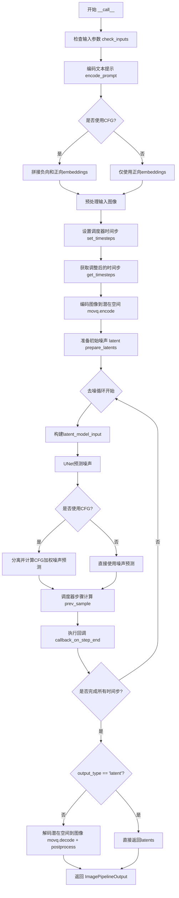

## 类结构

```
DiffusionPipeline (抽象基类)
└── Kandinsky3Img2ImgPipeline
    └── StableDiffusionLoraLoaderMixin (混入类)
```

## 全局变量及字段


### `XLA_AVAILABLE`
    
标志位，指示torch_xla是否可用，用于判断是否支持XLA加速

类型：`bool`
    


### `logger`
    
模块级别的日志记录器，用于输出运行时日志信息

类型：`logging.Logger`
    


### `EXAMPLE_DOC_STRING`
    
示例文档字符串，包含使用说明和代码示例，用于__call__方法的文档注释

类型：`str`
    


### `Kandinsky3Img2ImgPipeline.model_cpu_offload_seq`
    
模型CPU卸载顺序字符串，定义模型各组件卸载到CPU的顺序

类型：`str`
    


### `Kandinsky3Img2ImgPipeline._callback_tensor_inputs`
    
回调函数允许的张量输入列表，指定哪些张量可以在回调中被访问

类型：`list`
    


### `Kandinsky3Img2ImgPipeline.tokenizer`
    
T5分词器实例，用于将文本提示转换为token序列

类型：`T5Tokenizer`
    


### `Kandinsky3Img2ImgPipeline.text_encoder`
    
T5文本编码器模型，用于将token序列编码为文本嵌入向量

类型：`T5EncoderModel`
    


### `Kandinsky3Img2ImgPipeline.unet`
    
Kandinsky3 UNet去噪网络，用于预测噪声残差

类型：`Kandinsky3UNet`
    


### `Kandinsky3Img2ImgPipeline.scheduler`
    
DDPM噪声调度器，用于控制去噪过程中的噪声调度

类型：`DDPMScheduler`
    


### `Kandinsky3Img2ImgPipeline.movq`
    
VQ-VAE量化模型，用于图像的编码和解码

类型：`VQModel`
    


### `Kandinsky3Img2ImgPipeline.image_processor`
    
VAE图像处理器，用于图像的预处理和后处理

类型：`VaeImageProcessor`
    


### `Kandinsky3Img2ImgPipeline._guidance_scale`
    
私有属性，存储引导尺度，用于控制分类器自由引导的强度

类型：`float`
    


### `Kandinsky3Img2ImgPipeline._num_timesteps`
    
私有属性，记录时间步总数，记录去噪过程的总步数

类型：`int`
    


### `Kandinsky3Img2ImgPipeline._execution_device`
    
执行设备属性，返回当前执行推理的设备（CPU或GPU）

类型：`property`
    


### `Kandinsky3Img2ImgPipeline.text_encoder_offload_hook`
    
文本编码器卸载钩子，可选的模型卸载回调钩子

类型：`optional`
    
    

## 全局函数及方法


### `randn_tensor`

生成指定形状的随机张量（服从正态分布），用于在扩散模型的潜在空间中添加噪声。

参数：

- `shape`：`tuple` 或 `torch.Size`，要生成的随机张量的形状
- `generator`：`torch.Generator` 或 `list[torch.Generator]` 或 `None`，用于生成确定性随机数的生成器
- `device`：`torch.device`，生成张量所在的设备
- `dtype`：`torch.dtype`，生成张量的数据类型

返回值：`torch.Tensor`，符合指定形状、设备和数据类型的正态分布随机张量

#### 流程图

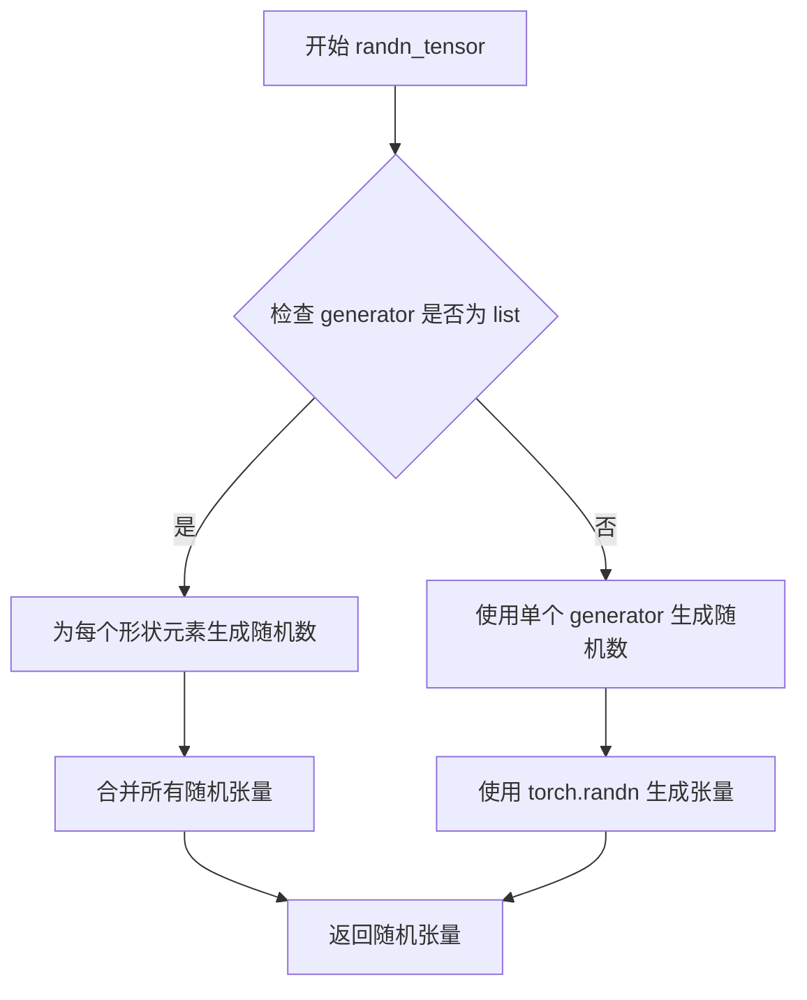

#### 带注释源码

```
# 从代码中的使用方式推断的实现
def randn_tensor(
    shape: tuple,
    generator: Optional[Union[torch.Generator, List[torch.Generator]]] = None,
    device: Optional[torch.device] = None,
    dtype: Optional[torch.dtype] = None,
) -> torch.Tensor:
    """
    生成指定形状的随机张量（正态分布）。
    
    参数:
        shape: 张量的形状
        generator: 可选的随机生成器，用于确定性采样
        device: 张量存放的设备
        dtype: 张量的数据类型
    
    返回:
        随机张量
    """
    # 实际实现位于 ...utils.torch_utils 模块中
    # 此处根据代码调用方式展示接口
    pass
```

**注意**：由于 `randn_tensor` 的实际实现代码未在给定的代码文件中提供，以上文档基于其在 `prepare_latents` 方法中的调用方式推断得出：

```python
noise = randn_tensor(shape, generator=generator, device=device, dtype=dtype)
```


### `deprecate`

处理废弃功能的警告工具，用于提醒用户某个功能已被废弃并将未来版本中移除。

参数：

-  `name`：`str`，被废弃的功能或参数的名称
-  `version`：`str`，宣布废弃的版本号（如 "1.0.0"）
-  `message`：`str`，关于废弃的详细说明，通常包含替代方案的建议
-  `extra_message`：（可选）`str`，额外的提示信息

返回值：`None`，该函数仅执行警告输出，不返回任何值

#### 流程图

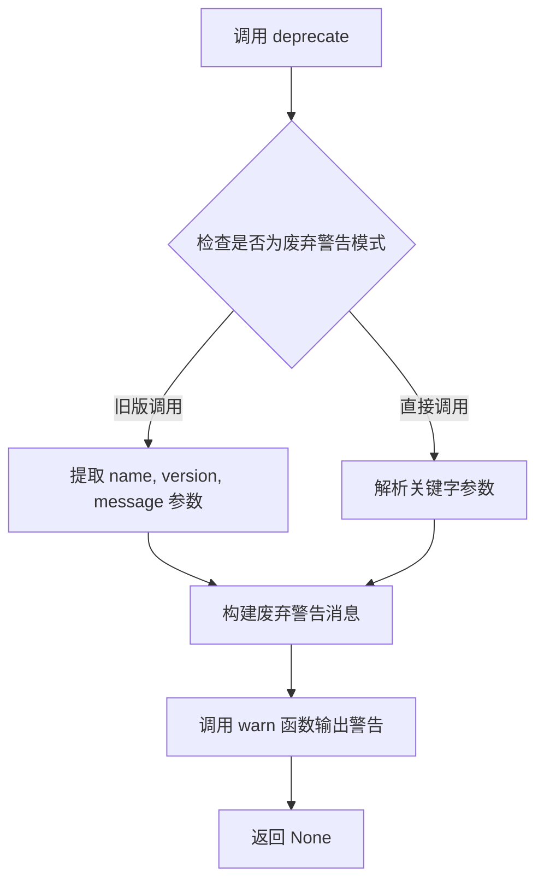

#### 带注释源码

```
# deprecate 函数是从 ...utils 导入的工具函数
# 在 Kandinsky3Img2ImgPipeline 中有两处调用，用于警告已废弃的参数

# 调用示例 1：警告 callback 参数已废弃
deprecate(
    "callback",                          # name: 被废弃的参数名
    "1.0.0",                             # version: 废弃版本
    "Passing `callback` as an input argument to `__call__` is deprecated, consider use `callback_on_step_end`"
                                        # message: 废弃说明和替代建议
)

# 调用示例 2：警告 callback_steps 参数已废弃
deprecate(
    "callback_steps",                   # name: 被废弃的参数名
    "1.0.0",                             # version: 废弃版本
    "Passing `callback_steps` as an input argument to `__call__` is deprecated, consider use `callback_on_step_end`"
                                        # message: 废弃说明和替代建议
)

# 该工具函数的作用：
# 1. 向开发者发出警告，告知某个功能即将被移除
# 2. 提供版本信息，帮助开发者追踪废弃时间线
# 3. 给出替代方案，引导开发者使用新的API
# 4. 不影响程序执行，仅作为提示信息输出
```


### `is_torch_xla_available`

检查当前环境是否安装了 PyTorch XLA（用于 TPU 加速的 PyTorch 扩展库）。该函数通常通过尝试导入 `torch_xla` 模块来判断，如果导入成功则返回 `True`，否则返回 `False`。

参数：无需参数

返回值：`bool`，如果 PyTorch XLA 可用则返回 `True`，否则返回 `False`

#### 流程图

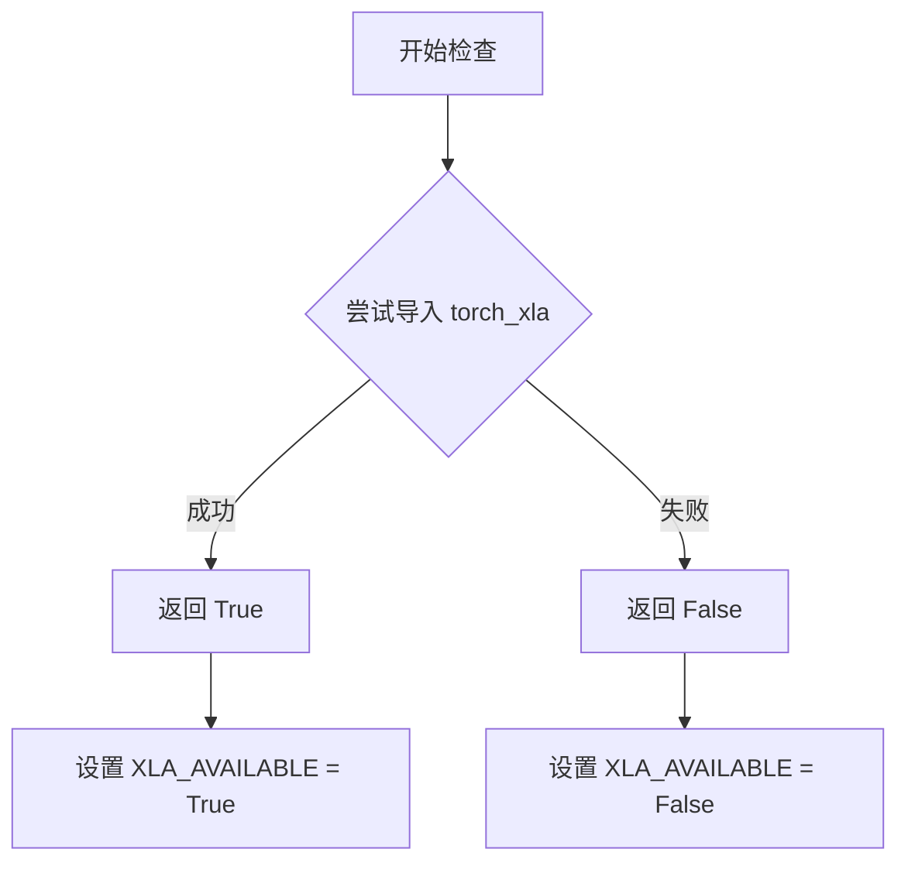

#### 带注释源码

```python
# 这是代码中使用 is_torch_xla_available 函数的方式
# 该函数定义在 ...utils 模块中（具体源码未在当前文件中展示）

# 根据函数返回值条件性地导入 torch_xla 并设置全局标志
if is_torch_xla_available():  # 检查 XLA 是否可用
    import torch_xla.core.xla_model as xm  # 导入 XLA 核心模块
    XLA_AVAILABLE = True  # 设置全局标志为可用
else:
    XLA_AVAILABLE = False  # 设置全局标志为不可用

# 后续代码中使用 XLA_AVAILABLE 标志
# ...
if XLA_AVAILABLE:
    xm.mark_step()  # 在 TPU 上标记计算步骤
```

> **注意**：由于 `is_torch_xla_available` 函数定义在 `...utils` 模块中，当前代码文件仅导入了该函数并未展示其完整实现。根据其典型实现，该函数通常会尝试导入 `torch_xla` 包并捕获 ImportError，从而返回布尔值表示 XLA 是否可用。


### `logging.get_logger`

获取日志记录器，用于在模块中创建并配置日志记录器，以便记录运行时的日志信息。

参数：

- `name`：`str`，日志记录器的名称，通常传入 `__name__` 以表示当前模块。

返回值：`logging.Logger`，返回配置好的日志记录器实例，可用于记录日志信息。

#### 流程图

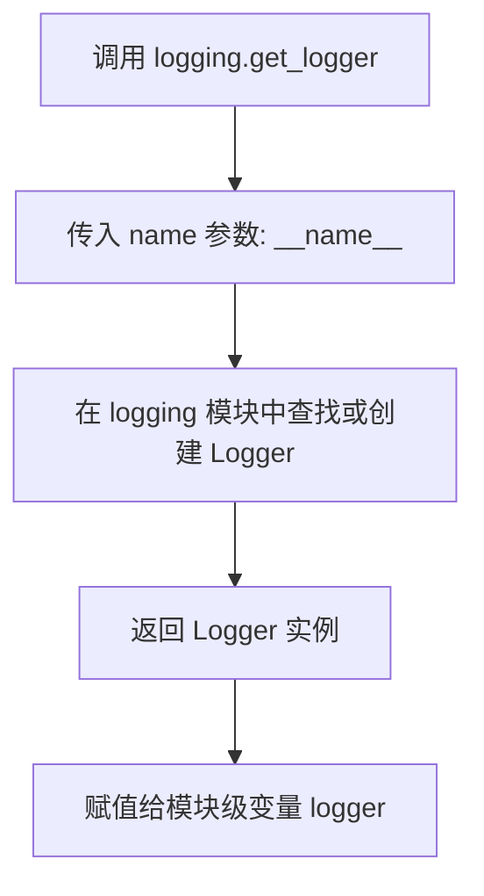

#### 带注释源码

```python
# 从 diffusers 工具模块导入 logging 对象
from ...utils import (
    deprecate,
    is_torch_xla_available,
    logging,  # 导入 logging 工具模块
    replace_example_docstring,
)

# 使用当前模块名称作为 logger 名称，获取模块级日志记录器
# __name__ 是 Python 内置变量，表示当前模块的完整路径（如 __main__ 或具体模块名）
logger = logging.get_logger(__name__)  # pylint: disable=invalid-name
```


### `replace_example_docstring`

装饰器，用于替换示例文档字符串。通常用于 Diffusion Pipeline 类中，将预定义的示例代码文档注入到 `__call__` 方法的文档字符串中，以便生成统一的 API 文档。

参数：

-  `doc_string`：`str`，要替换或追加的示例文档字符串内容

返回值：`Callable`，装饰器函数，返回一个可调用对象用于装饰目标函数

#### 流程图

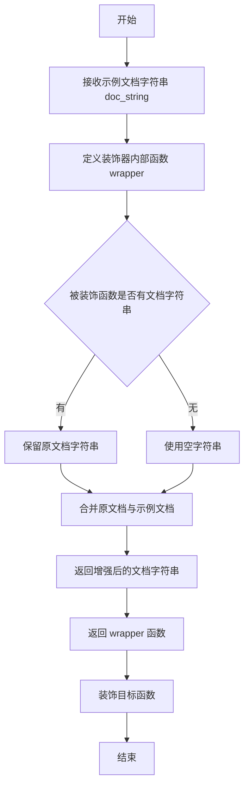

#### 带注释源码

```python
# 注意：该函数的具体实现不在当前代码文件中
# 而是从 ...utils 模块导入
from ...utils import replace_example_docstring

# 使用示例：
# replace_example_docstring 是一个装饰器工厂
# 接收一个示例文档字符串作为参数
# 返回一个装饰器，用于修改被装饰函数的 __doc__ 属性

EXAMPLE_DOC_STRING = """
    Examples:
        ```py
        >>> from diffusers import AutoPipelineForImage2Image
        >>> from diffusers.utils import load_image
        >>> import torch
        >>> pipe = AutoPipelineForImage2Image.from_pretrained(
        ...     "kandinsky-community/kandinsky-3", variant="fp16", torch_dtype=torch.float16
        ... )
        >>> pipe.enable_model_cpu_offload()
        >>> prompt = "A painting of the inside of a subway train with tiny raccoons."
        >>> image = load_image(
        ...     "https://huggingface.co/datasets/hf-internal-testing/diffusers-images/resolve/main/kandinsky3/t2i.png"
        ... )
        >>> generator = torch.Generator(device="cpu").manual_seed(0)
        >>> image = pipe(prompt, image=image, strength=0.75, num_inference_steps=25, generator=generator).images[0]
        ```
"""

# 在类中使用该装饰器
class Kandinsky3Img2ImgPipeline(DiffusionPipeline, StableDiffusionLoraLoaderMixin):
    # ... 其他代码 ...
    
    @torch.no_grad()
    @replace_example_docstring(EXAMPLE_DOC_STRING)  # 装饰器应用
    def __call__(
        self,
        prompt: str | list[str] = None,
        image: torch.Tensor | PIL.Image.Image | list[torch.Tensor] | list[PIL.Image.Image] = None,
        strength: float = 0.3,
        # ... 其他参数 ...
    ):
        """
        Function invoked when calling the pipeline for generation.
        
        Args:
            # ... 参数文档 ...
        
        Examples:
            # 这里会被 replace_example_docstring 装饰器注入 EXAMPLE_DOC_STRING 的内容
        
        Returns:
            # ... 返回值文档 ...
        """
        # ... 函数实现 ...
```


### `Kandinsky3Img2ImgPipeline.__init__`

该构造函数是 Kandinsky3 图像到图像（Img2Img）流水线的初始化方法，负责接收并注册所有必要的组件模块（如分词器、文本编码器、UNet、调度器和 VQ 模型），同时根据 VQ 模型的配置计算缩放因子和潜在通道数，并初始化图像预处理器。

**参数：**

- `tokenizer`：`T5Tokenizer`，T5 文本分词器，用于将输入文本转换为 token 序列
- `text_encoder`：`T5EncoderModel`，T5 文本编码器模型，用于将文本转换为嵌入向量
- `unet`：`Kandinsky3UNet`，Kandinsky3 专用的 UNet 模型，用于去噪潜在表示
- `scheduler`：`DDPMScheduler`，DDPM 调度器，用于控制扩散过程的噪声调度
- `movq`：`VQModel`，向量量化生成模型（VQ-VAE），用于编码和解码图像潜在表示

**返回值：** 无（`None`），该方法为构造函数，不返回任何值，仅初始化对象状态

#### 流程图

```mermaid
flowchart TD
    A[开始 __init__] --> B[调用 super().__init__ 初始化父类]
    B --> C[调用 register_modules 注册所有组件模块]
    C --> D{检查 movq 模块是否存在}
    D -->|存在| E[从 movq.config 获取 block_out_channels]
    D -->|不存在| F[使用默认值 block_out_channels]
    E --> G[计算 movq_scale_factor = 2^(len(block_out_channels)-1)]
    G --> H[获取 movq_latent_channels]
    H --> I[创建 VaeImageProcessor]
    I --> J[结束 __init__]
    
    F --> G
```

#### 带注释源码

```python
def __init__(
    self,
    tokenizer: T5Tokenizer,
    text_encoder: T5EncoderModel,
    unet: Kandinsky3UNet,
    scheduler: DDPMScheduler,
    movq: VQModel,
):
    """
    初始化 Kandinsky3Img2ImgPipeline 流水线。
    
    参数:
        tokenizer: T5 分词器
        text_encoder: T5 文本编码器
        unet: Kandinsky3 UNet 模型
        scheduler: DDPM 调度器
        movq: VQ 模型（用于图像编码/解码）
    """
    # 调用父类 DiffusionPipeline 和 StableDiffusionLoraLoaderMixin 的初始化方法
    # 设置基本的流水线配置和状态
    super().__init__()
    
    # 将所有组件模块注册到流水线中，使其可以通过 self.tokenizer、self.text_encoder
    # 等属性访问，同时用于模型 CPU/GPU 卸载管理
    self.register_modules(
        tokenizer=tokenizer, 
        text_encoder=text_encoder, 
        unet=unet, 
        scheduler=scheduler, 
        movq=movq
    )
    
    # 计算 VQ 模型的缩放因子，基于 block_out_channels 的数量
    # 例如：如果 block_out_channels = [128, 256, 512, 512]，则 len = 4
    # 缩放因子 = 2^(4-1) = 8，这用于潜在空间到图像空间的缩放
    movq_scale_factor = 2 ** (len(self.movq.config.block_out_channels) - 1) if getattr(self, "movq", None) else 8
    
    # 获取 VQ 模型的潜在通道数，通常为 4（用于 RGB 图像的潜在表示）
    movq_latent_channels = self.movq.config.latent_channels if getattr(self, "movq", None) else 4
    
    # 初始化 VAE 图像处理器，用于图像的预处理和后处理
    # vae_scale_factor: 控制潜在空间与像素空间的缩放比例
    # vae_latent_channels: 潜在表示的通道数
    # resample: 上采样/下采样方法，使用双三次插值
    # reducing_gap: 用于减少混叠效应的间隙参数
    self.image_processor = VaeImageProcessor(
        vae_scale_factor=movq_scale_factor,
        vae_latent_channels=movq_latent_channels,
        resample="bicubic",
        reducing_gap=1,
    )
```


### `Kandinsky3Img2ImgPipeline.get_timesteps`

根据图像到图像转换的强度（strength）参数计算调整后的时间步，用于确定去噪过程的起始点和步数。该方法通过 `strength` 参数控制原始图像与生成图像之间的变换程度，从而决定从调度器的完整时间步序列中截取哪一段进行去噪。

参数：

- `num_inference_steps`：`int`，总推理步数，指定去噪过程要执行的迭代次数
- `strength`：`float`，强度参数，范围在 0 到 1 之间，值越大表示对原始图像的变换越强，噪声添加越多
- `device`：`torch.device`，计算设备（当前方法体中未使用，保留此参数以保持接口一致性）

返回值：

- `timesteps`：`torch.Tensor`，调整后的时间步序列，从原始时间步中截取的后半部分
- `num_inference_steps`：`int`，实际使用的时间步数量，即从截取点到最后的时间步总数

#### 流程图

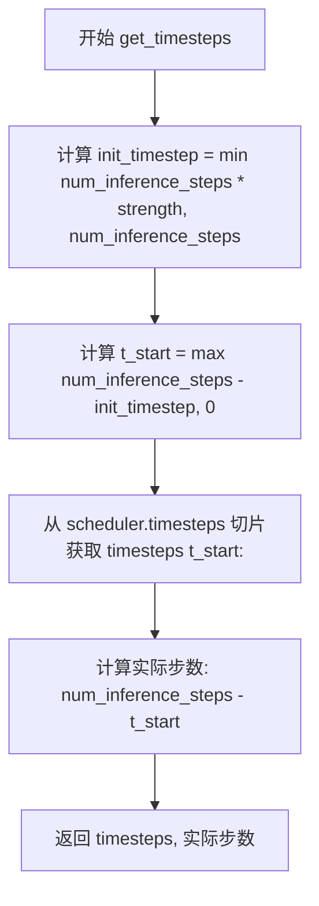

#### 带注释源码

```python
def get_timesteps(self, num_inference_steps, strength, device):
    # 根据强度参数计算需要初始化的原始时间步数
    # strength 越接近 1，添加的噪声越多，需要的去噪步数也越多
    init_timestep = min(int(num_inference_steps * strength), num_inference_steps)

    # 计算从时间步序列的哪个位置开始
    # 跳过前面的时间步，从较后面的位置开始去噪
    # 例如：num_inference_steps=25, strength=0.75, init_timestep=18
    # 则 t_start = 25 - 18 = 7，从第7个时间步开始
    t_start = max(num_inference_steps - init_timestep, 0)

    # 从调度器的时间步序列中获取从 t_start 位置到最后的子序列
    # 这确保了实际执行的去噪步数与 strength 参数匹配
    timesteps = self.scheduler.timesteps[t_start:]

    # 返回调整后的时间步序列和实际使用的推理步数
    # 这个步数用于后续的进度条显示和循环控制
    return timesteps, num_inference_steps - t_start
```


### `Kandinsky3Img2ImgPipeline._process_embeds`

处理文本嵌入和注意力掩码，支持截断上下文（Cut Context）功能。当启用截断上下文时，该方法会将注意力掩码为0（无效/填充token）的嵌入向量置零，并根据实际有效序列长度截断嵌入和掩码，以减少后续计算的内存和计算开销。

参数：

- `embeddings`：`torch.Tensor`，文本嵌入向量，形状为 [batch_size, seq_len, hidden_dim]
- `attention_mask`：`torch.Tensor`，注意力掩码，形状为 [batch_size, seq_len]，1表示有效token，0表示填充token
- `cut_context`：`bool`，是否启用上下文截断功能

返回值：`tuple[torch.Tensor, torch.Tensor]`

- 第一个元素：处理后的文本嵌入向量
- 第二个元素：处理后的注意力掩码

#### 流程图

```mermaid
flowchart TD
    A[开始 _process_embeds] --> B{cut_context == True?}
    B -->|Yes| C[将attention_mask为0的embeddings置零]
    C --> D[计算每行的最大有效序列长度<br/>max_seq_length = attention_mask.sum(-1).max() + 1]
    D --> E[截断embeddings到max_seq_length<br/>embeddings = embeddings[:, :max_seq_length]]
    E --> F[截断attention_mask到max_seq_length<br/>attention_mask = attention_mask[:, :max_seq_length]]
    F --> G[返回处理后的embeddings和attention_mask]
    B -->|No| H[直接返回原始embeddings和attention_mask]
    G --> I[结束]
    H --> I
```

#### 带注释源码

```python
def _process_embeds(self, embeddings, attention_mask, cut_context):
    """
    处理文本嵌入和注意力掩码，支持截断上下文功能。
    
    Args:
        embeddings: 文本嵌入向量 [batch_size, seq_len, hidden_dim]
        attention_mask: 注意力掩码 [batch_size, seq_len]，1表示有效token，0表示填充
        cut_context: 是否启用上下文截断
    
    Returns:
        处理后的 (embeddings, attention_mask) 元组
    """
    # 如果启用截断上下文功能
    if cut_context:
        # 步骤1: 将注意力掩码为0的位置的嵌入向量置零
        # 这样可以将填充区域的嵌入清零，避免无效计算
        embeddings[attention_mask == 0] = torch.zeros_like(embeddings[attention_mask == 0])
        
        # 步骤2: 计算每个样本的最大有效序列长度
        # attention_mask.sum(-1) 对最后一个维度求和，得到每个样本的有效token数量
        # +1 是为了保留一个位置（通常用于结束标记或留有余量）
        max_seq_length = attention_mask.sum(-1).max() + 1
        
        # 步骤3: 截断嵌入向量到最大序列长度
        # 移除填充区域，减小序列长度
        embeddings = embeddings[:, :max_seq_length]
        
        # 步骤4: 截断注意力掩码到最大序列长度
        # 保持维度一致
        attention_mask = attention_mask[:, :max_seq_length]
    
    # 返回处理后的嵌入和掩码
    return embeddings, attention_mask
```


### `Kandinsky3Img2ImgPipeline.encode_prompt`

该方法将文本提示（prompt）编码为文本编码器（text encoder）的隐藏状态（hidden states），支持分类器自由引导（Classifier-Free Guidance），可同时处理正向提示和负向提示，输出文本嵌入向量及对应的注意力掩码，供后续去噪网络使用。

参数：

- `prompt`：`str | list[str] | None`，要编码的文本提示，可以是单个字符串或字符串列表
- `do_classifier_free_guidance`：`bool`，是否启用分类器自由引导，默认为 `True`
- `num_images_per_prompt`：`int`，每个提示生成的图像数量，默认为 1
- `device`：`torch.device | None`，执行设备，默认为 `None`（自动获取执行设备）
- `negative_prompt`：`str | list[str] | None`，负向提示，用于引导生成不希望出现的元素
- `prompt_embeds`：`torch.Tensor | None`，预生成的文本嵌入，若提供则直接使用，跳过生成过程
- `negative_prompt_embeds`：`torch.Tensor | None`，预生成的负向文本嵌入
- `_cut_context`：`bool`，是否裁剪上下文，移除填充token对应的隐藏状态，默认为 `True`
- `attention_mask`：`torch.Tensor | None`，预生成的注意力掩码，与 `prompt_embeds` 配合使用
- `negative_attention_mask`：`torch.Tensor | None`，预生成的负向注意力掩码

返回值：`tuple[torch.Tensor, torch.Tensor, torch.Tensor, torch.Tensor]`，返回四个张量：

- `prompt_embeds`：`torch.Tensor`，编码后的正向文本嵌入，形状为 `(batch_size * num_images_per_prompt, seq_len, hidden_dim)`
- `negative_prompt_embeds`：`torch.Tensor`，编码后的负向文本嵌入，形状与 `prompt_embeds` 相同
- `attention_mask`：`torch.Tensor`，正向文本的注意力掩码
- `negative_attention_mask`：`torch.Tensor`，负向文本的注意力掩码

#### 流程图

```mermaid
flowchart TD
    A[开始 encode_prompt] --> B{device 为空?}
    B -->|是| C[device = self._execution_device]
    B -->|否| D[device 保持不变]
    C --> E{prompt 不为空且为字符串?}
    D --> E
    E -->|是| F[batch_size = 1]
    E -->|否| G{prompt 为列表?}
    G -->|是| H[batch_size = len(prompt)]
    G -->|否| I[batch_size = prompt_embeds.shape[0]]
    H --> J[max_length = 128]
    F --> J
    I --> J
    J --> K{prompt_embeds 为空?}
    K -->|是| L[tokenizer 编码 prompt]
    K -->|否| M[直接使用 prompt_embeds]
    L --> N[text_encoder 生成 embeddings]
    N --> O[_process_embeds 处理]
    O --> P[attention_mask unsqueeze 扩展]
    P --> Q[转换为 text_encoder dtype]
    Q --> R{prompt_embeds 已存在?}
    R -->|否| S[已处理完成]
    R -->|是| T[跳过处理]
    M --> T
    T --> U[重复 embeddings 和 attention_mask]
    U --> V{do_classifier_free_guidance 为真<br>且 negative_prompt_embeds 为空?}
    V -->|是| W{negative_prompt 为空?}
    V -->|否| X[设置 negative_prompt_embeds = None]
    W -->|是| Y[uncond_tokens = [''] * batch_size]
    W -->|否| Z[使用 negative_prompt]
    Y --> AA[tokenizer 编码负向提示]
    Z --> AA
    AA --> AB[text_encoder 生成负向 embeddings]
    AB --> AC[裁剪至 prompt_embeds 长度]
    AC --> AD[负向 attention_mask 扩展]
    AD --> AE[negative_prompt_embeds 重复处理]
    AE --> AF[negative_attention_mask 重复处理]
    X --> AG{do_classifier_free_guidance 为真?}
    AF --> AG
    AG -->|是| AH[negative_prompt_embeds 重复并 reshape]
    AG -->|否| AI[negative_prompt_embeds = None<br>negative_attention_mask = None]
    AH --> AJ[返回四个张量]
    AI --> AJ
```

#### 带注释源码

```python
@torch.no_grad()
def encode_prompt(
    self,
    prompt,  # str | list[str] | None: 输入文本提示
    do_classifier_free_guidance=True,  # bool: 是否启用分类器自由引导
    num_images_per_prompt=1,  # int: 每个提示生成的图像数量
    device=None,  # torch.device | None: 计算设备
    negative_prompt=None,  # str | list[str] | None: 负向提示
    prompt_embeds: torch.Tensor | None = None,  # torch.Tensor | None: 预计算的提示嵌入
    negative_prompt_embeds: torch.Tensor | None = None,  # torch.Tensor | None: 预计算的负向嵌入
    _cut_context=True,  # bool: 是否裁剪上下文（移除padding）
    attention_mask: torch.Tensor | None = None,  # torch.Tensor | None: 提示的注意力掩码
    negative_attention_mask: torch.Tensor | None = None,  # torch.Tensor | None: 负向提示的注意力掩码
):
    r"""
    Encodes the prompt into text encoder hidden states.

    Args:
         prompt (`str` or `list[str]`, *optional*):
            prompt to be encoded
        device: (`torch.device`, *optional*):
            torch device to place the resulting embeddings on
        num_images_per_prompt (`int`, *optional*, defaults to 1):
            number of images that should be generated per prompt
        do_classifier_free_guidance (`bool`, *optional*, defaults to `True`):
            whether to use classifier free guidance or not
        negative_prompt (`str` or `list[str]`, *optional*):
            The prompt or prompts not to guide the image generation. If not defined, one has to pass
            `negative_prompt_embeds`. instead. If not defined, one has to pass `negative_prompt_embeds`. instead.
            Ignored when not using guidance (i.e., ignored if `guidance_scale` is less than `1`).
        prompt_embeds (`torch.Tensor`, *optional*):
            Pre-generated text embeddings. Can be used to easily tweak text inputs, *e.g.* prompt weighting. If not
            provided, text embeddings will be generated from `prompt` input argument.
        negative_prompt_embeds (`torch.Tensor`, *optional*):
            Pre-generated negative text embeddings. Can be used to easily tweak text inputs, *e.g.* prompt
            weighting. If not provided, negative_prompt_embeds will be generated from `negative_prompt` input
            argument.
        attention_mask (`torch.Tensor`, *optional*):
            Pre-generated attention mask. Must provide if passing `prompt_embeds` directly.
        negative_attention_mask (`torch.Tensor`, *optional*):
            Pre-generated negative attention mask. Must provide if passing `negative_prompt_embeds` directly.
    """
    # 检查 prompt 和 negative_prompt 类型一致性
    if prompt is not None and negative_prompt is not None:
        if type(prompt) is not type(negative_prompt):
            raise TypeError(
                f"`negative_prompt` should be the same type to `prompt`, but got {type(negative_prompt)} !="
                f" {type(prompt)}."
            )

    # 如果未指定设备，使用管道的执行设备
    if device is None:
        device = self._execution_device

    # 确定 batch_size
    if prompt is not None and isinstance(prompt, str):
        batch_size = 1
    elif prompt is not None and isinstance(prompt, list):
        batch_size = len(prompt)
    else:
        batch_size = prompt_embeds.shape[0]

    max_length = 128  # T5 模型的最大序列长度

    # 如果未提供 prompt_embeds，则从 prompt 生成
    if prompt_embeds is None:
        # 使用 tokenizer 将文本转换为 token IDs
        text_inputs = self.tokenizer(
            prompt,
            padding="max_length",
            max_length=max_length,
            truncation=True,
            return_tensors="pt",
        )
        text_input_ids = text_inputs.input_ids.to(device)
        attention_mask = text_inputs.attention_mask.to(device)
        
        # 通过 text_encoder 获取隐藏状态
        prompt_embeds = self.text_encoder(
            text_input_ids,
            attention_mask=attention_mask,
        )
        prompt_embeds = prompt_embeds[0]  # 获取隐藏状态（忽略 pooler_output）
        
        # 处理 embeddings：裁剪上下文（移除 padding 对应的隐藏状态）
        prompt_embeds, attention_mask = self._process_embeds(prompt_embeds, attention_mask, _cut_context)
        
        # 将 embeddings 与 attention_mask 相乘，屏蔽 padding 位置
        prompt_embeds = prompt_embeds * attention_mask.unsqueeze(2)

    # 获取 text_encoder 的数据类型
    if self.text_encoder is not None:
        dtype = self.text_encoder.dtype
    else:
        dtype = None

    # 将 prompt_embeds 转换为指定的数据类型和设备
    prompt_embeds = prompt_embeds.to(dtype=dtype, device=device)

    bs_embed, seq_len, _ = prompt_embeds.shape
    
    # 为每个提示生成多个图像而复制 embeddings
    # 使用对 MPS 友好的方法
    prompt_embeds = prompt_embeds.repeat(1, num_images_per_prompt, 1)
    prompt_embeds = prompt_embeds.view(bs_embed * num_images_per_prompt, seq_len, -1)
    attention_mask = attention_mask.repeat(num_images_per_prompt, 1)
    
    # 获取用于分类器自由引导的无条件 embeddings
    if do_classifier_free_guidance and negative_prompt_embeds is None:
        uncond_tokens: list[str]

        if negative_prompt is None:
            # 如果没有负向提示，使用空字符串
            uncond_tokens = [""] * batch_size
        elif isinstance(negative_prompt, str):
            uncond_tokens = [negative_prompt]
        elif batch_size != len(negative_prompt):
            raise ValueError(
                f"`negative_prompt`: {negative_prompt} has batch size {len(negative_prompt)}, but `prompt`:"
                f" {prompt} has batch size {batch_size}. Please make sure that passed `negative_prompt` matches"
                " the batch size of `prompt`."
            )
        else:
            uncond_tokens = negative_prompt
            
        # 如果提供了负向提示，则生成负向 embeddings
        if negative_prompt is not None:
            uncond_input = self.tokenizer(
                uncond_tokens,
                padding="max_length",
                max_length=128,
                truncation=True,
                return_attention_mask=True,
                return_tensors="pt",
            )
            text_input_ids = uncond_input.input_ids.to(device)
            negative_attention_mask = uncond_input.attention_mask.to(device)

            negative_prompt_embeds = self.text_encoder(
                text_input_ids,
                attention_mask=negative_attention_mask,
            )
            negative_prompt_embeds = negative_prompt_embeds[0]
            
            # 裁剪至与 prompt_embeds 相同长度
            negative_prompt_embeds = negative_prompt_embeds[:, : prompt_embeds.shape[1]]
            negative_attention_mask = negative_attention_mask[:, : prompt_embeds.shape[1]]
            
            # 应用 attention mask
            negative_prompt_embeds = negative_prompt_embeds * negative_attention_mask.unsqueeze(2)

        else:
            # 如果没有负向提示，创建与 prompt_embeds 形状相同的零张量
            negative_prompt_embeds = torch.zeros_like(prompt_embeds)
            negative_attention_mask = torch.zeros_like(attention_mask)

    # 处理分类器自由引导
    if do_classifier_free_guidance:
        # 复制无条件 embeddings 以匹配每个提示生成的图像数量
        seq_len = negative_prompt_embeds.shape[1]

        negative_prompt_embeds = negative_prompt_embeds.to(dtype=dtype, device=device)
        if negative_prompt_embeds.shape != prompt_embeds.shape:
            negative_prompt_embeds = negative_prompt_embeds.repeat(1, num_images_per_prompt, 1)
            negative_prompt_embeds = negative_prompt_embeds.view(batch_size * num_images_per_prompt, seq_len, -1)
            negative_attention_mask = negative_attention_mask.repeat(num_images_per_prompt, 1)

        # 对于分类器自由引导，需要进行两次前向传播
        # 这里将无条件和文本 embeddings 拼接成单个批次
        # 以避免执行两次前向传播
    else:
        negative_prompt_embeds = None
        negative_attention_mask = None
        
    # 返回：正向 embeddings、负向 embeddings、正向 attention mask、负向 attention mask
    return prompt_embeds, negative_prompt_embeds, attention_mask, negative_attention_mask
```


### `Kandinsky3Img2ImgPipeline.prepare_latents`

该方法用于准备去噪循环的初始潜在向量，将输入图像编码为潜在空间表示，并根据指定的时间步添加噪声，以支持后续的扩散去噪过程。

参数：

- `self`：`Kandinsky3Img2ImgPipeline` 实例本身
- `image`：`torch.Tensor | PIL.Image.Image | list`，输入图像，可以是张量、PIL图像或图像列表
- `timestep`：`torch.Tensor`，当前去噪过程的时间步，用于向潜在向量添加噪声
- `batch_size`：`int`，原始批次大小
- `num_images_per_prompt`：`int`，每个提示词生成的图像数量，用于扩展批次
- `dtype`：`torch.dtype`，目标数据类型
- `device`：`torch.device`，目标设备（CPU/GPU）
- `generator`：`torch.Generator | list[torch.Generator] | None`，可选的随机数生成器，用于确保可重复性

返回值：`torch.Tensor`，添加了噪声的初始潜在向量，用于去噪循环

#### 流程图

```mermaid
flowchart TD
    A[开始 prepare_latents] --> B{验证 image 类型}
    B -->|类型正确| C[将 image 移动到指定设备和数据类型]
    B -->|类型错误| D[抛出 ValueError 异常]
    C --> E[计算有效批次大小: batch_size * num_images_per_prompt]
    E --> F{image.shape[1] == 4?}
    F -->|是| G[直接使用 image 作为 init_latents]
    F -->|否| H{generator 是列表?}
    H -->|是| I{generator 长度 == batch_size?}
    H -->|否| J[使用单个 generator 编码]
    I -->|是| K[逐个编码图像并采样]
    I -->|否| L[抛出 ValueError 异常]
    K --> M[拼接所有 init_latents]
    J --> N[使用 movq.encode 编码并采样]
    M --> O[乘以 scaling_factor]
    N --> O
    O --> P[拼接 init_latents]
    P --> Q[生成随机噪声]
    R[使用 scheduler.add_noise 添加噪声] --> Q
    Q --> S[返回 latents]
    
    style D fill:#ffcccc
    style L fill:#ffcccc
```

#### 带注释源码

```python
def prepare_latents(
    self,
    image,  # 输入图像：torch.Tensor | PIL.Image.Image | list
    timestep,  # 时间步：torch.Tensor
    batch_size,  # 批次大小：int
    num_images_per_prompt,  # 每提示词图像数：int
    dtype,  # 目标数据类型：torch.dtype
    device,  # 目标设备：torch.device
    generator=None,  # 随机数生成器：torch.Generator | list[torch.Generator] | None
):
    # 步骤1：验证输入图像类型
    # 确保 image 是支持的类型（torch.Tensor, PIL.Image.Image, 或 list）
    if not isinstance(image, (torch.Tensor, PIL.Image.Image, list)):
        raise ValueError(
            f"`image` has to be of type `torch.Tensor`, `PIL.Image.Image` or list but is {type(image)}"
        )

    # 步骤2：将图像移动到目标设备和数据类型
    image = image.to(device=device, dtype=dtype)

    # 步骤3：计算有效批次大小（考虑每提示词生成的图像数量）
    batch_size = batch_size * num_images_per_prompt

    # 步骤4：检查图像是否已经是潜在向量格式
    # 如果图像已经有4个通道（latent 格式），直接使用
    if image.shape[1] == 4:
        init_latents = image
    else:
        # 步骤5：图像编码到潜在空间
        # 检查 generator 是否为列表，且长度是否匹配批次大小
        if isinstance(generator, list) and len(generator) != batch_size:
            raise ValueError(
                f"You have passed a list of generators of length {len(generator)}, but requested an effective batch"
                f" size of {batch_size}. Make sure the batch size matches the length of the generators."
            )

        # 步骤6：根据 generator 类型选择编码方式
        elif isinstance(generator, list):
            # 多个生成器：逐个编码每张图像
            init_latents = [
                # 使用 movq (VAE 编码器) 将图像编码到潜在空间
                # 并从潜在分布中采样
                self.movq.encode(image[i : i + 1]).latent_dist.sample(generator[i]) 
                for i in range(batch_size)
            ]
            # 步骤7：沿批次维度拼接所有潜在向量
            init_latents = torch.cat(init_latents, dim=0)
        else:
            # 单个生成器：批量编码
            init_latents = self.movq.encode(image).latent_dist.sample(generator)

        # 步骤8：应用 VAE 缩放因子
        # 这是 VQModel 配置中的缩放参数，用于调整潜在空间的尺度
        init_latents = self.movq.config.scaling_factor * init_latents

    # 步骤9：确保 init_latents 是批次张量（至少有一个批次维度）
    init_latents = torch.cat([init_latents], dim=0)

    # 步骤10：获取潜在向量形状并生成随机噪声
    shape = init_latents.shape
    # 使用 randn_tensor 生成与潜在向量形状相同的随机噪声
    noise = randn_tensor(shape, generator=generator, device=device, dtype=dtype)

    # 步骤11：向初始潜在向量添加噪声
    # 使用调度器的 add_noise 方法在指定时间步将噪声添加到潜在向量
    init_latents = self.scheduler.add_noise(init_latents, noise, timestep)

    # 步骤12：返回带噪声的潜在向量作为去噪循环的起点
    latents = init_latents
    return latents
```


### `Kandinsky3Img2ImgPipeline.prepare_extra_step_kwargs`

为调度器（scheduler）的 step 方法准备额外参数，由于不同调度器具有不同的签名，该方法通过动态检查调度器支持的参数来构建兼容的参数字典。

参数：

- `generator`：`torch.Generator | None`，用于生成确定性噪声的随机数生成器
- `eta`：`float`，DDIM 调度器专用的噪声参数（η），对应 DDIM 论文中的 η，取值范围为 [0, 1]，其他调度器会忽略此参数

返回值：`dict`，包含调度器 step 方法所需额外参数（如 `eta` 和/或 `generator`）的字典

#### 流程图

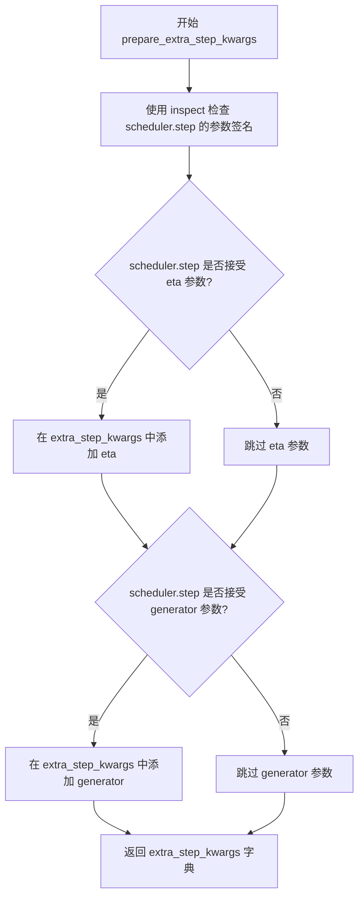

#### 带注释源码

```python
def prepare_extra_step_kwargs(self, generator, eta):
    """
    为调度器准备额外参数，因为并非所有调度器都具有相同的签名。
    
    eta (η) 仅在 DDIMScheduler 中使用，对于其他调度器将被忽略。
    eta 对应 DDIM 论文 (https://huggingface.co/papers/2010.02502) 中的 η，取值范围应为 [0, 1]。
    
    参数:
        generator: torch.Generator 或 None，可选的随机数生成器，用于生成确定性噪声
        eta: float，DDIM 调度器的噪声参数，其他调度器会忽略此参数
    
    返回:
        dict: 包含调度器 step 方法所需额外参数的字典
    """
    # 使用 inspect 检查调度器的 step 方法是否接受 eta 参数
    accepts_eta = "eta" in set(inspect.signature(self.scheduler.step).parameters.keys())
    # 初始化空字典用于存储额外参数
    extra_step_kwargs = {}
    # 如果调度器支持 eta，则将其添加到参数字典中
    if accepts_eta:
        extra_step_kwargs["eta"] = eta

    # 检查调度器是否接受 generator 参数
    accepts_generator = "generator" in set(inspect.signature(self.scheduler.step).parameters.keys())
    # 如果调度器支持 generator，则将其添加到参数字典中
    if accepts_generator:
        extra_step_kwargs["generator"] = generator
    
    # 返回构建好的参数字典
    return extra_step_kwargs
```


### `Kandinsky3Img2ImgPipeline.check_inputs`

该方法负责验证 Kandinsky3 Img2ImgPipeline 所有输入参数的有效性，确保传递给管道的参数符合预期类型和约束条件，如果不满足则抛出相应的 ValueError 异常。

参数：

- `self`：`Kandinsky3Img2ImgPipeline` 实例，管道对象本身
- `prompt`：`str` 或 `list[str]` 或 `None`，正向提示词，用于引导图像生成
- `callback_steps`：`int` 或 `None`，回调步数，指定每隔多少步调用一次回调函数
- `negative_prompt`：`str` 或 `list[str]` 或 `None`，负向提示词，用于避免生成不希望的内容
- `prompt_embeds`：`torch.Tensor` 或 `None`，预生成的提示词嵌入向量，可直接传入以避免重复编码
- `negative_prompt_embeds`：`torch.Tensor` 或 `None`，预生成的负向提示词嵌入向量
- `callback_on_step_end_tensor_inputs`：`list[str]` 或 `None`，在每个推理步骤结束时需要传递给回调函数的张量输入列表
- `attention_mask`：`torch.Tensor` 或 `None`，提示词嵌入对应的注意力掩码
- `negative_attention_mask`：`torch.Tensor` 或 `None`，负向提示词嵌入对应的注意力掩码

返回值：`None`，该方法不返回任何值，仅通过抛出 `ValueError` 异常来处理无效输入

#### 流程图

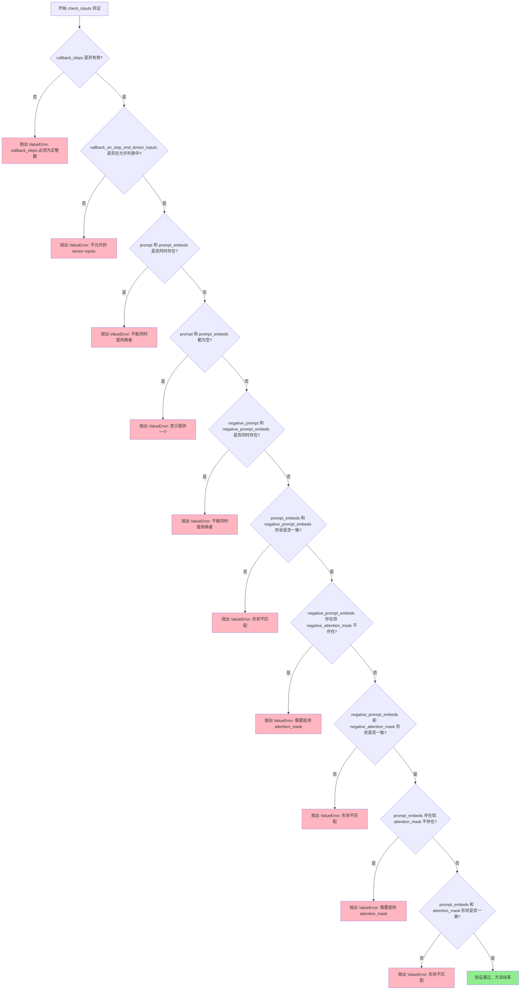

#### 带注释源码

```python
def check_inputs(
    self,
    prompt,
    callback_steps,
    negative_prompt=None,
    prompt_embeds=None,
    negative_prompt_embeds=None,
    callback_on_step_end_tensor_inputs=None,
    attention_mask=None,
    negative_attention_mask=None,
):
    """
    验证所有输入参数的有效性，确保符合管道的预期约束
    
    该方法会检查：
    1. callback_steps 必须为正整数
    2. callback_on_step_end_tensor_inputs 必须在允许的列表中
    3. prompt 和 prompt_embeds 不能同时提供
    4. prompt 和 prompt_embeds 至少提供一个
    5. prompt 必须是字符串或列表类型
    6. negative_prompt 和 negative_prompt_embeds 不能同时提供
    7. prompt_embeds 和 negative_prompt_embeds 形状必须一致
    8. 提供了 prompt_embeds 时必须提供 attention_mask
    9. 提供了 negative_prompt_embeds 时必须提供 negative_attention_mask
    10. prompt_embeds 和 attention_mask 形状必须一致
    11. negative_prompt_embeds 和 negative_attention_mask 形状必须一致
    """
    
    # 验证 callback_steps：如果不为 None，则必须是正整数
    # 这确保了回调间隔是一个合理的正值
    if callback_steps is not None and (not isinstance(callback_steps, int) or callback_steps <= 0):
        raise ValueError(
            f"`callback_steps` has to be a positive integer but is {callback_steps} of type"
            f" {type(callback_steps)}."
        )

    # 验证 callback_on_step_end_tensor_inputs：必须全部在允许列表中
    # 这防止了用户请求传递不被支持的张量到回调函数
    if callback_on_step_end_tensor_inputs is not None and not all(
        k in self._callback_tensor_inputs for k in callback_on_step_end_tensor_inputs
    ):
        raise ValueError(
            f"`callback_on_step_end_tensor_inputs` has to be in {self._callback_tensor_inputs}, but found {[k for k in callback_on_step_end_tensor_inputs if k not in self._callback_tensor_inputs]}"
        )

    # 验证 prompt 和 prompt_embeds 的互斥关系：不能同时提供
    # 两者都提供会导致混淆，不知道应该使用哪个
    if prompt is not None and prompt_embeds is not None:
        raise ValueError(
            f"Cannot forward both `prompt`: {prompt} and `prompt_embeds`: {prompt_embeds}. Please make sure to"
            " only forward one of the two."
        )
    
    # 验证至少提供一个：prompt 或 prompt_embeds 必须提供一个
    # 如果都不提供，管道无法进行生成
    elif prompt is None and prompt_embeds is None:
        raise ValueError(
            "Provide either `prompt` or `prompt_embeds`. Cannot leave both `prompt` and `prompt_embeds` undefined."
        )
    
    # 验证 prompt 的类型：必须是字符串或列表
    # 不允许其他类型如整数、字典等
    elif prompt is not None and (not isinstance(prompt, str) and not isinstance(prompt, list)):
        raise ValueError(f"`prompt` has to be of type `str` or `list` but is {type(prompt)}")

    # 验证 negative_prompt 和 negative_prompt_embeds 的互斥关系
    # 与上面的正向提示词验证逻辑相同
    if negative_prompt is not None and negative_prompt_embeds is not None:
        raise ValueError(
            f"Cannot forward both `negative_prompt`: {negative_prompt} and `negative_prompt_embeds`:"
            f" {negative_prompt_embeds}. Please make sure to only forward one of the two."
        )

    # 验证 prompt_embeds 和 negative_prompt_embeds 的形状一致性
    # 在使用 classifier-free guidance 时，两者的形状必须完全一致
    if prompt_embeds is not None and negative_prompt_embeds is not None:
        if prompt_embeds.shape != negative_prompt_embeds.shape:
            raise ValueError(
                "`prompt_embeds` and `negative_prompt_embeds` must have the same shape when passed directly, but"
                f" got: `prompt_embeds` {prompt_embeds.shape} != `negative_prompt_embeds`"
                f" {negative_prompt_embeds.shape}."
            )

    # 验证 negative_prompt_embeds 和 negative_attention_mask 的配对关系
    # 如果提供了 negative_prompt_embeds，必须同时提供对应的 attention_mask
    if negative_prompt_embeds is not None and negative_attention_mask is None:
        raise ValueError("Please provide `negative_attention_mask` along with `negative_prompt_embeds`")

    # 验证 negative_prompt_embeds 和 negative_attention_mask 的形状一致性
    # 前两维（batch_size 和 seq_len）必须匹配
    if negative_prompt_embeds is not None and negative_attention_mask is not None:
        if negative_prompt_embeds.shape[:2] != negative_attention_mask.shape:
            raise ValueError(
                "`negative_prompt_embeds` and `negative_attention_mask` must have the same batch_size and token length when passed directly, but"
                f" got: `negative_prompt_embeds` {negative_prompt_embeds.shape[:2]} != `negative_attention_mask`"
                f" {negative_attention_mask.shape}."
            )

    # 验证 prompt_embeds 和 attention_mask 的配对关系
    # 如果提供了 prompt_embeds，必须同时提供对应的 attention_mask
    if prompt_embeds is not None and attention_mask is None:
        raise ValueError("Please provide `attention_mask` along with `prompt_embeds`")

    # 验证 prompt_embeds 和 attention_mask 的形状一致性
    # 前两维必须匹配
    if prompt_embeds is not None and attention_mask is not None:
        if prompt_embeds.shape[:2] != attention_mask.shape:
            raise ValueError(
                "`prompt_embeds` and `attention_mask` must have the same batch_size and token length when passed directly, but"
                f" got: `prompt_embeds` {prompt_embeds.shape[:2]} != `attention_mask`"
                f" {attention_mask.shape}."
            )
```


### `Kandinsky3Img2ImgPipeline.guidance_scale`

该属性是一个只读属性，用于返回当前 pipeline 的引导尺度（guidance scale）。引导尺度用于控制图像生成过程中文本提示对图像的影响程度，值越大生成的图像与文本提示越相关，但可能导致图像质量下降。

参数：无（该属性不接受任何参数）

返回值：`float`，返回当前设置的引导尺度值，用于控制 Classifier-Free Diffusion Guidance 的强度。

#### 流程图

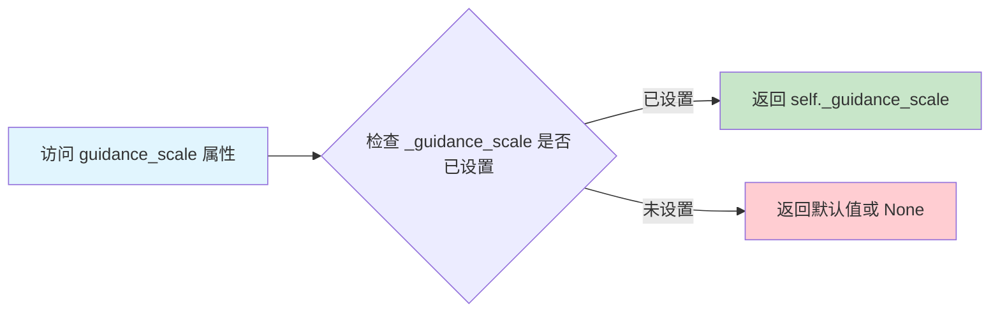

#### 带注释源码

```python
@property
def guidance_scale(self):
    """
    返回当前引导尺度（guidance scale）。
    
    引导尺度是 Classifier-Free Diffusion Guidance (CFDG) 技术中的关键参数，
    用于平衡图像生成过程中文本提示的影响力。
    
    当 guidance_scale > 1 时，启用 classifier-free guidance；
    值越大，生成的图像与文本提示的相关性越强，但可能导致图像质量降低。
    
    返回值:
        float: 当前使用的引导尺度值。该值在 __call__ 方法中被设置。
    """
    return self._guidance_scale
```

#### 相关上下文代码

在 `__call__` 方法中，该属性被设置为：

```python
# 在 __call__ 方法中设置引导尺度
self._guidance_scale = guidance_scale  # guidance_scale 参数类型为 float，默认值为 3.0
```

该属性通常与 `do_classifier_free_guidance` 属性配合使用：

```python
@property
def do_classifier_free_guidance(self):
    """
    判断是否启用 classifier-free guidance。
    
    当引导尺度大于 1 时启用，否则禁用。
    """
    return self._guidance_scale > 1
```


### `Kandinsky3Img2ImgPipeline.do_classifier_free_guidance`

这是Kandinsky3Img2ImgPipeline类的一个属性方法（property），用于动态判断当前管道是否启用了Classifier-Free Guidance（CFG）扩散引导技术。该方法通过检查内部存储的guidance_scale参数值是否大于1来返回布尔值，当guidance_scale大于1时表示启用CFG，此时扩散模型会在推理时同时考虑条件和无条件嵌入以提升生成质量。

参数：
- 无显式参数（但隐含使用`self`访问实例属性`self._guidance_scale`）

返回值：`bool`，返回True表示启用Classifier-Free Guidance扩散引导，返回False表示不启用

#### 流程图

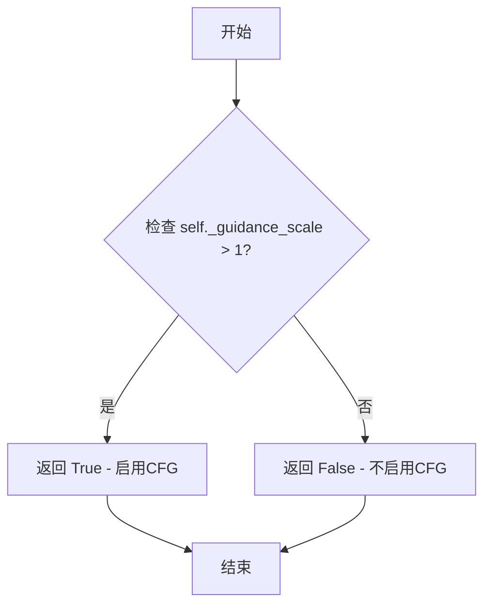

#### 带注释源码

```python
@property
def do_classifier_free_guidance(self):
    """
    判断是否启用Classifier-Free Guidance (CFG) 扩散引导技术。
    
    Classifier-Free Guidance是一种提高扩散模型生成质量的技巧，通过在推理时
    同时考虑条件嵌入（prompts）和无条件嵌入（空字符串），然后根据guidance_scale
    权重加权组合它们的预测结果。
    
    Returns:
        bool: 如果guidance_scale > 1则返回True（启用CFG），否则返回False。
              当guidance_scale为1或更小时，CFG不会提供额外的引导效果。
    """
    return self._guidance_scale > 1
```


### `Kandinsky3Img2ImgPipeline.num_timesteps`

返回当前推理过程的时间步数量，用于记录去噪迭代的总次数。

参数：

- （无参数）

返回值：`int`，返回去噪过程的时间步总数，即推理过程中需要执行的去噪迭代次数。

#### 流程图

```mermaid
flowchart TD
    A[访问 num_timesteps 属性] --> B{检查 _num_timesteps 是否已设置}
    B -->|已设置| C[返回 self._num_timesteps]
    B -->|未设置| D[返回默认值/未定义]
    
    C --> E[调用者获取时间步数量]
    
    F[__call__ 方法执行] --> G[设置 self._num_timesteps = len(timesteps)]
    G --> H[时间步数量被记录]
```

#### 带注释源码

```python
@property
def num_timesteps(self):
    """
    属性方法：返回当前pipeline的时间步数量
    
    该属性返回在__call__方法执行期间设置的时间步总数。
    _num_timesteps 记录了去噪循环中实际使用的时间步数量，
    这个值取决于num_inference_steps参数和strength参数的影响。
    
    Returns:
        int: 时间步的总数量，表示去噪迭代的次数
    """
    return self._num_timesteps
```

#### 关联代码上下文

```python
# 在 __call__ 方法中设置 _num_timesteps 的位置
# 位于去噪循环开始之前

# 7. Denoising loop
num_warmup_steps = len(timesteps) - num_inference_steps * self.scheduler.order
self._num_timesteps = len(timesteps)  # <-- 在此处设置时间步数量
with self.progress_bar(total=num_inference_steps) as progress_bar:
    for i, t in enumerate(timesteps):
        # ... 去噪循环逻辑
```

#### 设计说明

- **属性类型**：这是一个只读属性（read-only property），通过 `@property` 装饰器实现
- **状态依赖**：该属性依赖于 `__call__` 方法的执行，在调用 pipeline 之后才能获取有效值
- **用途**：可用于外部调用者查询推理过程的时间步数量，常用于进度条显示或调试信息


### `Kandinsky3Img2ImgPipeline.__call__`

主生成函数，执行完整的图像到图像（Image-to-Image）生成流程，将输入图像根据文本提示和强度参数进行去噪处理，生成目标图像。

参数：

- `prompt`：`str | list[str] | None`，用于指导图像生成的文本提示，如果不提供则必须传入 `prompt_embeds`
- `image`：`torch.Tensor | PIL.Image.Image | list[torch.Tensor] | list[PIL.Image.Image]`，作为起点的输入图像，将被用作去噪过程的初始点
- `strength`：`float`，默认值 0.3，表示转换原始图像的程度，值在 0 到 1 之间，值越大添加的噪声越多，转换程度越高
- `num_inference_steps`：`int`，默认值 25，去噪步数，步数越多通常图像质量越高但推理速度越慢
- `guidance_scale`：`float`，默认值 3.0，分类器自由引导（Classifier-Free Guidance）比例，用于控制生成图像与文本提示的关联度
- `negative_prompt`：`str | list[str] | None`，不参与引导图像生成的负面提示，用于排除不需要的元素
- `num_images_per_prompt`：`int | None`，默认值 1，每个提示要生成的图像数量
- `generator`：`torch.Generator | list[torch.Generator] | None`，用于确保生成可重复性的随机数生成器
- `prompt_embeds`：`torch.Tensor | None`，预生成的文本嵌入，可用于快速调整文本输入
- `negative_prompt_embeds`：`torch.Tensor | None`，预生成的负面文本嵌入
- `attention_mask`：`torch.Tensor | None`，预生成的注意力掩码，当直接传入 `prompt_embeds` 时必须提供
- `negative_attention_mask`：`torch.Tensor | None`，预生成的负面注意力掩码，当直接传入 `negative_prompt_embeds` 时必须提供
- `output_type`：`str | None`，默认值 "pil"，输出图像的格式，可选 "pil" 或 "latent"
- `return_dict`：`bool`，默认值 True，是否返回 `ImagePipelineOutput` 而不是元组
- `callback_on_step_end`：`Callable[[int, int], None] | None`，去噪每步结束时调用的回调函数
- `callback_on_step_end_tensor_inputs`：`list[str]`，默认值 ["latents"]，回调函数可访问的张量输入列表
- `**kwargs`：其他可选参数，用于向后兼容

返回值：`ImagePipelineOutput`，包含生成的图像列表，如果 `return_dict` 为 False 则返回元组 `(image,)`

#### 流程图

```mermaid
flowchart TD
    A[开始 __call__] --> B[解析并验证回调参数]
    B --> C{检查 callback_on_step_end_tensor_inputs 是否合法}
    C -->|不合法| D[抛出 ValueError]
    C -->|合法| E[调用 check_inputs 验证输入参数]
    E --> F[设置 self._guidance_scale]
    F --> G[根据 prompt 类型确定 batch_size]
    G --> H[调用 encode_prompt 编码输入提示]
    H --> I[处理分类器自由引导 CFG]
    I --> J[将 image 转换为列表并验证类型]
    J --> K[预处理图像并拼接]
    K --> L[设置去噪时间步]
    L --> M[调用 get_timesteps 计算时间步]
    M --> N[使用 movq 编码图像获取潜在表示]
    N --> O[重复 latents 以匹配 num_images_per_prompt]
    O --> P[调用 prepare_latents 准备初始潜在变量]
    P --> Q{文本编码器卸载钩子存在?}
    Q -->|是| R[卸载文本编码器]
    Q -->|否| S[进入去噪循环]
    R --> S
    S --> T[初始化进度条和步数]
    T --> U[遍历 timesteps 进行去噪]
    U --> V[准备 latent_model_input]
    V --> W[调用 UNet 预测噪声残差]
    W --> X{CFGuidance 启用?}
    X -->|是| Y[分离无条件和有条件预测并应用 CFG 公式]
    X -->|否| Z[直接使用预测噪声]
    Y --> AA[调用 scheduler.step 计算上一步样本]
    Z --> AA
    AA --> BB{callback_on_step_end 不为空?}
    BB -->|是| CC[执行回调并更新中间变量]
    BB -->|否| DD{是否最后一步或满足更新条件?}
    CC --> DD
    DD --> EE{使用 XLA?}
    EE -->|是| FF[执行 mark_step]
    EE -->|否| GG[更新进度条]
    FF --> GG
    GG --> HH{还有更多时间步?}
    HH -->|是| U
    HH -->|否| II[后处理: 解码 latents]
    II --> JJ{output_type 不是 latent?}
    JJ -->|是| KK[使用 movq 解码并后处理]
    JJ -->|否| LL[直接使用 latents]
    KK --> MM[调用 maybe_free_model_hooks]
    LL --> MM
    MM --> NN{return_dict 为 True?}
    NN -->|是| OO[返回 ImagePipelineOutput]
    NN -->|否| PP[返回元组]
    OO --> QQ[结束]
    PP --> QQ
```

#### 带注释源码

```python
@torch.no_grad()
@replace_example_docstring(EXAMPLE_DOC_STRING)
def __call__(
    self,
    prompt: str | list[str] = None,
    image: torch.Tensor | PIL.Image.Image | list[torch.Tensor] | list[PIL.Image.Image] = None,
    strength: float = 0.3,
    num_inference_steps: int = 25,
    guidance_scale: float = 3.0,
    negative_prompt: str | list[str] | None = None,
    num_images_per_prompt: int | None = 1,
    generator: torch.Generator | list[torch.Generator] | None = None,
    prompt_embeds: torch.Tensor | None = None,
    negative_prompt_embeds: torch.Tensor | None = None,
    attention_mask: torch.Tensor | None = None,
    negative_attention_mask: torch.Tensor | None = None,
    output_type: str | None = "pil",
    return_dict: bool = True,
    callback_on_step_end: Callable[[int, int], None] | None = None,
    callback_on_step_end_tensor_inputs: list[str] = ["latents"],
    **kwargs,
):
    """
    Function invoked when calling the pipeline for generation.
    管道调用时执行的主生成函数
    """
    # 从 kwargs 中提取已废弃的回调参数
    callback = kwargs.pop("callback", None)
    callback_steps = kwargs.pop("callback_steps", None)

    # 如果使用了旧的 callback 参数，发出废弃警告
    if callback is not None:
        deprecate(
            "callback",
            "1.0.0",
            "Passing `callback` as an input argument to `__call__` is deprecated, consider use `callback_on_step_end`",
        )
    if callback_steps is not None:
        deprecate(
            "callback_steps",
            "1.0.0",
            "Passing `callback_steps` as an input argument to `__call__` is deprecated, consider use `callback_on_step_end`",
        )

    # 验证回调张量输入是否在允许列表中
    if callback_on_step_end_tensor_inputs is not None and not all(
        k in self._callback_tensor_inputs for k in callback_on_step_end_tensor_inputs
    ):
        raise ValueError(
            f"`callback_on_step_end_tensor_inputs` has to be in {self._callback_tensor_inputs}, but found {[k for k in callback_on_step_end_tensor_inputs if k not in self._callback_tensor_inputs]}"
        )

    # 是否截断上下文（用于控制生成质量）
    cut_context = True
    
    # 1. 检查输入参数合法性
    self.check_inputs(
        prompt,
        callback_steps,
        negative_prompt,
        prompt_embeds,
        negative_prompt_embeds,
        callback_on_step_end_tensor_inputs,
        attention_mask,
        negative_attention_mask,
    )

    # 设置引导比例
    self._guidance_scale = guidance_scale

    # 2. 根据 prompt 类型确定批次大小
    if prompt is not None and isinstance(prompt, str):
        batch_size = 1
    elif prompt is not None and isinstance(prompt, list):
        batch_size = len(prompt)
    else:
        batch_size = prompt_embeds.shape[0]

    # 获取执行设备
    device = self._execution_device

    # 3. 编码输入提示（文本编码）
    prompt_embeds, negative_prompt_embeds, attention_mask, negative_attention_mask = self.encode_prompt(
        prompt,
        self.do_classifier_free_guidance,
        num_images_per_prompt=num_images_per_prompt,
        device=device,
        negative_prompt=negative_prompt,
        prompt_embeds=prompt_embeds,
        negative_prompt_embeds=negative_prompt_embeds,
        _cut_context=cut_context,
        attention_mask=attention_mask,
        negative_attention_mask=negative_attention_mask,
    )

    # 应用分类器自由引导（CFG）：将负面和正面提示拼接
    if self.do_classifier_free_guidance:
        prompt_embeds = torch.cat([negative_prompt_embeds, prompt_embeds])
        attention_mask = torch.cat([negative_attention_mask, attention_mask]).bool()
    
    # 确保 image 是列表格式
    if not isinstance(image, list):
        image = [image]
    
    # 验证所有图像类型是否合法（PIL Image 或 torch.Tensor）
    if not all(isinstance(i, (PIL.Image.Image, torch.Tensor)) for i in image):
        raise ValueError(
            f"Input is in incorrect format: {[type(i) for i in image]}. Currently, we only support  PIL image and pytorch tensor"
        )

    # 预处理所有图像并按批次拼接
    image = torch.cat([self.image_processor.preprocess(i) for i in image], dim=0)
    image = image.to(dtype=prompt_embeds.dtype, device=device)
    
    # 4. 准备时间步
    self.scheduler.set_timesteps(num_inference_steps, device=device)
    timesteps, num_inference_steps = self.get_timesteps(num_inference_steps, strength, device)
    
    # 5. 使用 VQ 模型（movq）编码图像获取潜在表示
    latents = self.movq.encode(image)["latents"]
    # 重复潜在表示以匹配每个提示生成的图像数量
    latents = latents.repeat_interleave(num_images_per_prompt, dim=0)
    # 准备初始时间步
    latent_timestep = timesteps[:1].repeat(batch_size * num_images_per_prompt)
    # 准备初始潜在变量（添加噪声）
    latents = self.prepare_latents(
        latents, latent_timestep, batch_size, num_images_per_prompt, prompt_embeds.dtype, device, generator
    )
    
    # 如果存在文本编码器卸载钩子，则卸载以释放内存
    if hasattr(self, "text_encoder_offload_hook") and self.text_encoder_offload_hook is not None:
        self.text_encoder_offload_hook.offload()

    # 7. 去噪循环
    num_warmup_steps = len(timesteps) - num_inference_steps * self.scheduler.order
    self._num_timesteps = len(timesteps)
    
    # 进度条
    with self.progress_bar(total=num_inference_steps) as progress_bar:
        for i, t in enumerate(timesteps):
            # 为 CFG 复制潜在变量（一份用于无条件预测，一份用于条件预测）
            latent_model_input = torch.cat([latents] * 2) if self.do_classifier_free_guidance else latents

            # 使用 UNet 预测噪声残差
            noise_pred = self.unet(
                latent_model_input,
                t,
                encoder_hidden_states=prompt_embeds,
                encoder_attention_mask=attention_mask,
            )[0]
            
            # 执行分类器自由引导
            if self.do_classifier_free_guidance:
                noise_pred_uncond, noise_pred_text = noise_pred.chunk(2)
                # CFG 公式: noise_pred = (scale + 1) * noise_pred_text - scale * noise_pred_uncond
                noise_pred = (guidance_scale + 1.0) * noise_pred_text - guidance_scale * noise_pred_uncond

            # 使用调度器计算上一步的去噪样本
            latents = self.scheduler.step(
                noise_pred,
                t,
                latents,
                generator=generator,
            ).prev_sample

            # 如果有每步结束回调，执行回调
            if callback_on_step_end is not None:
                callback_kwargs = {}
                for k in callback_on_step_end_tensor_inputs:
                    callback_kwargs[k] = locals()[k]
                callback_outputs = callback_on_step_end(self, i, t, callback_kwargs)

                # 更新回调返回的可能被修改的变量
                latents = callback_outputs.pop("latents", latents)
                prompt_embeds = callback_outputs.pop("prompt_embeds", prompt_embeds)
                negative_prompt_embeds = callback_outputs.pop("negative_prompt_embeds", negative_prompt_embeds)
                attention_mask = callback_outputs.pop("attention_mask", attention_mask)
                negative_attention_mask = callback_outputs.pop("negative_attention_mask", negative_attention_mask)

            # 更新进度条
            if i == len(timesteps) - 1 or ((i + 1) > num_warmup_steps and (i + 1) % self.scheduler.order == 0):
                progress_bar.update()
                # 兼容旧的回调接口
                if callback is not None and i % callback_steps == 0:
                    step_idx = i // getattr(self.scheduler, "order", 1)
                    callback(step_idx, t, latents)

            # 如果使用 XLA（PyTorch Mobile），执行标记步骤
            if XLA_AVAILABLE:
                xm.mark_step()

    # 8. 后处理
    if not output_type == "latent":
        # 使用 VQ 模型解码潜在表示生成最终图像
        image = self.movq.decode(latents, force_not_quantize=True)["sample"]
        # 后处理图像（转换为 PIL 或 numpy）
        image = self.image_processor.postprocess(image, output_type)
    else:
        image = latents

    # 释放模型钩子
    self.maybe_free_model_hooks()

    # 返回结果
    if not return_dict:
        return (image,)

    return ImagePipelineOutput(images=image)
```

## 关键组件


### T5 Text Encoder (tokenizer + text_encoder)

负责将文本提示（prompt）编码为文本嵌入向量（text embeddings），支持注意力掩码处理，是图像生成的条件输入来源。

### Kandinsky3 UNet

基于扩散模型的噪声预测网络（UNet），接收潜在表征（latents）、时间步长（timestep）和文本嵌入，预测需要去除的噪声。

### VQModel (movq)

变分量化（VQ-VAE）模型，负责将输入图像编码为潜在空间表征（latents），以及将去噪后的潜在表征解码重建为最终图像。

### DDPMScheduler

扩散过程的时间步调度器，提供去噪调度逻辑，管理噪声添加和时间步推进。

### VaeImageProcessor

图像预处理和后处理组件，负责将 PIL Image 或 Tensor 转换为模型所需的格式，并进行后处理输出。

### encode_prompt 方法

将文本提示编码为文本嵌入向量，支持 Classifier-Free Guidance（无分类器引导），处理正向和负向提示_embed及对应的注意力掩码。

### get_timesteps 方法

根据输入强度（strength）和推理步数（num_inference_steps）计算扩散过程的时间步，决定从哪个时间步开始去噪。

### prepare_latents 方法

将输入图像编码为初始潜在表征，并根据时间步添加噪声，生成去噪过程的起点。

### _process_embeds 方法

处理文本嵌入和注意力掩码，支持上下文剪切（cut_context），将无效位置的嵌入置零并截断到有效序列长度。

### check_inputs 方法

验证输入参数的有效性，包括 prompt、embeddings、attention_mask 等的形状和类型检查。

### __call__ 方法（主推理流程）

完整的图像到图像（Image-to-Image）推理流程，整合编码、潜在表征准备、去噪循环和后处理各环节。

### Classifier-Free Guidance 实现

通过在去噪时同时计算条件噪声预测（noise_pred_text）和无条件噪声预测（noise_pred_uncond），利用 guidance_scale 加权组合以增强文本prompt对生成结果的控制。

### XLA 支持 (torch_xla)

可选的 PyTorch XLA 加速支持，通过 xm.mark_step() 在 TPU 等设备上优化执行效率。


## 问题及建议


### 已知问题

-   **冗余的tensor拼接操作**: `prepare_latents`方法中存在`init_latents = torch.cat([init_latents], dim=0)`，这行代码是冗余的，因为`init_latents`本身已经是单个tensor，拼接只会增加不必要的内存开销。
-   **硬编码的序列长度**: `encode_prompt`方法中`max_length = 128`被硬编码，虽然在负向提示编码时也使用了128，但这个值应该从tokenizer配置中获取而不是硬编码。
-   **未清理的注释代码**: `_process_embeds`方法中有一行被注释的代码`# return embeddings, attention_mask`，这属于未清理的技术债务。
-   **`cut_context`参数未暴露**: 在`__call__`方法中`cut_context = True`被硬编码，但该参数影响文本嵌入处理逻辑，却没有作为公共API暴露给用户，限制了灵活性。
-   **类型提示兼容性**: 代码使用了Python 3.10+的联合类型语法（如`torch.Tensor | None`），可能与较低版本的Python不兼容。
-   **重复的参数校验逻辑**: `check_inputs`方法和`__call__`方法中都存在对`callback_on_step_end_tensor_inputs`的校验，存在代码重复。

### 优化建议

-   移除`prepare_latents`方法中冗余的`torch.cat`操作，直接返回`init_latents`。
-   将`max_length`改为从`self.tokenizer.model_max_length`获取，提高代码可维护性。
-   删除`_process_embeds`方法中的注释代码，保持代码整洁。
-   考虑将`cut_context`作为可选参数添加到`__call__`方法签名中，或从配置中读取。
-   如需支持Python 3.9以下版本，将联合类型语法改为`Optional[]`和`Union[]`形式。
-   将`callback_on_step_end_tensor_inputs`的校验抽取为独立方法，避免在多处重复代码。

## 其它


### 设计目标与约束

该Pipeline的设计目标是实现基于Kandinsky3模型的图像到图像生成功能，能够根据文本提示对输入图像进行风格转换、内容修改或增强。核心约束包括：1) 必须支持T5文本编码器进行prompt编码；2) 使用VQModel (movq)进行图像的潜在空间转换；3) 遵循DiffusionPipeline的标准接口规范；4) 支持Classifier-Free Guidance (CFG) 技术提升生成质量；5) 需要支持CPU offload以适应显存受限环境。

### 错误处理与异常设计

代码中包含多层次错误处理机制。在check_inputs方法中进行了全面的输入验证，包括：callback_steps必须为正整数、prompt与prompt_embeds不能同时提供、negative_prompt与negative_prompt_embeds互斥、embeds与attention_mask维度必须匹配、image类型必须为torch.Tensor或PIL.Image.Image或list。在prepare_latents中对generator列表长度进行了检查。在encode_prompt中对negative_prompt与prompt的batch size一致性进行了验证。所有错误均抛出ValueError并附带清晰的错误信息。潜在改进：可添加更多运行时异常捕获，如设备兼容性检查、模型加载失败处理、内存不足时的优雅降级。

### 数据流与状态机

Pipeline的核心数据流如下：1) 输入阶段：接收prompt、image、strength、num_inference_steps等参数；2) 编码阶段：encode_prompt将文本转换为prompt_embeds和negative_prompt_embeds；3) 图像预处理阶段：image_processor.preprocess将输入图像转换为tensor并标准化；4) 潜在空间转换：movq.encode将图像编码到latent空间；5) 噪声调度：get_timesteps根据strength计算推理时间步；6) 去噪循环：UNet在每个时间步预测噪声，scheduler执行去噪步骤；7) 后处理：movq.decode将latents解码为图像，image_processor.postprocess转换为输出格式。状态机主要涉及：调度器的时间步状态、模型offload状态、guidance_scale启用状态。

### 外部依赖与接口契约

主要外部依赖包括：transformers库提供T5EncoderModel和T5Tokenizer；PIL库处理图像；torch及torch_xla提供张量计算和加速；diffusers库内部模块提供VaeImageProcessor、DiffusionPipeline基类、StableDiffusionLoraLoaderMixin、 schedulers和models。接口契约方面：encode_prompt返回(prompt_embeds, negative_prompt_embeds, attention_mask, negative_attention_mask)四元组；prepare_latents返回latent张量；__call__返回ImagePipelineOutput或(image,)元组。所有方法均标注@torch.no_grad()装饰器以禁用梯度计算。

### 性能考虑与优化空间

当前实现包含的性能优化：1) model_cpu_offload_seq定义了模型卸载顺序；2) 使用XLA_AVAILABLE条件支持PyTorch XLA加速；3) progress_bar提供推理进度显示；4) 支持generator实现可重复生成。潜在优化空间：1) 可添加TF32精度支持以提升Ampere架构GPU性能；2) 可实现xformers memory efficient attention以降低显存占用；3) 可添加连续批处理支持提高吞吐量；4) 可实现CUDA graph优化减少调度开销；5) prepare_latents中可预先分配显存避免动态分配；6) encode_prompt的结果可缓存避免重复编码相同prompt。

### 安全性考虑

代码中安全性措施相对有限。主要安全考量：1) prompt_embeds和negative_prompt_embeds的device和dtype转换确保类型一致性；2) 外部输入（prompt、image）均进行类型检查；3) 不安全的图像URL加载依赖上层调用者保证。改进建议：可添加prompt过滤机制防止生成有害内容；可实现图像内容安全检测；可添加用户身份验证接口。

### 并发与异步处理

当前实现为同步阻塞模式，未包含异步处理机制。XLA_AVAILABLE分支中使用xm.mark_step()进行异步计算同步。改进建议：1) 可使用torch.cuda.stream实现计算与数据传输重叠；2) 可添加async inference支持提高并发吞吐量；3) 可实现多Pipeline实例的线程安全批处理；4) callback_on_step_end机制可扩展为异步回调。

### 版本兼容性

代码使用了Python 3.9+的类型提示语法（str | list[str]），需要Python 3.9以上版本。依赖版本约束未在代码中明确指定。兼容性问题：1) torch.Tensor | None语法需要Python 3.10+或typing扩展；2) transformers库版本影响T5EncoderModel的具体实现；3) diffusers库版本影响Pipeline基类的接口。改进建议：添加版本检查和降级适配逻辑。

### 测试考虑

当前代码未包含单元测试。测试应覆盖：1) 各类输入参数组合的check_inputs验证；2) encode_prompt的输出维度验证；3) prepare_latents对不同image类型的处理；4) 完整pipeline的端到端生成测试；5) 内存泄漏检测；6) CPU/GPU设备兼容性测试；7) 模型offload功能测试；8) callback机制测试。

### 部署考虑

部署时应注意：1) 模型权重加载需要足够磁盘空间（Kandinsky3模型较大）；2) 首次推理存在模型编译开销，建议进行warmup；3) 需要配置合适的torch_dtype（fp16可提升速度但影响精度）；4) CPU offload适用于显存<8GB的GPU；5) XLA支持需要安装torch_xla包。容器化部署建议使用多阶段构建，模型权重可通过HF Hub自动下载或预先挂载。

### 监控与日志

当前仅使用logger进行基础日志输出。监控指标应包括：1) 推理时间（每步和总时间）；2) 显存使用峰值；3) 生成的图像分辨率；4) 推理步数与strength的实际值；5) 模型卸载事件。改进建议：可集成Prometheus指标导出；可添加结构化日志；可实现webhook通知失败事件。

### 缓存策略

当前实现无显式缓存机制。可优化的缓存点：1) encode_prompt结果可缓存相同prompt的embedding；2) scheduler状态可在多轮推理间保持；3) VAE encode/decode可缓存常见图像的latent表示。缓存实现建议使用LRUCache并设置合理的过期策略，同时提供缓存清除接口。


    