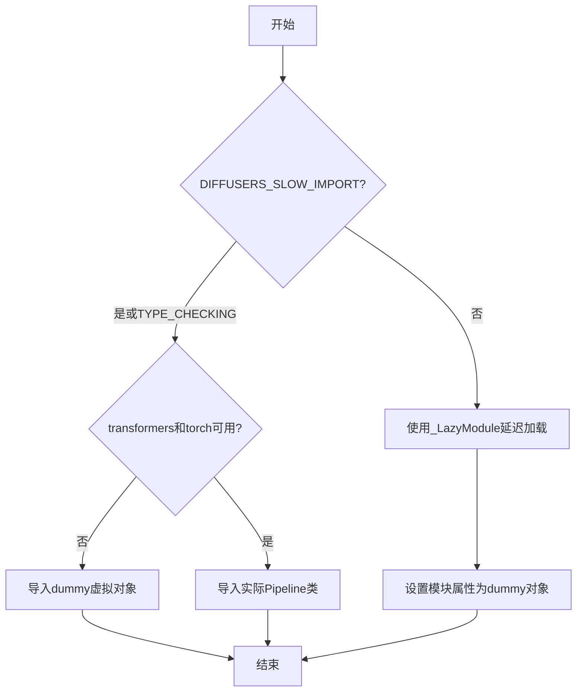
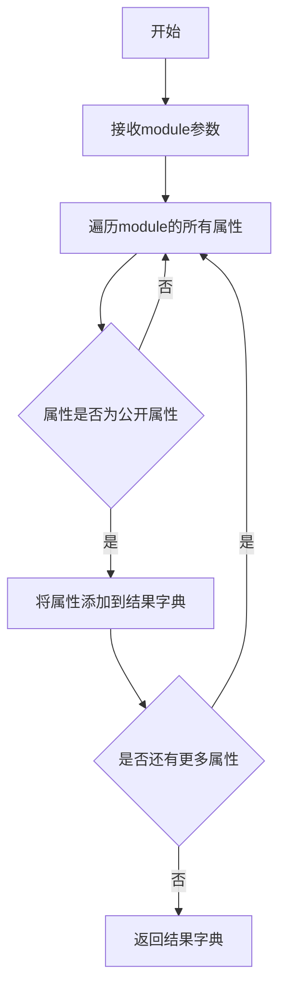
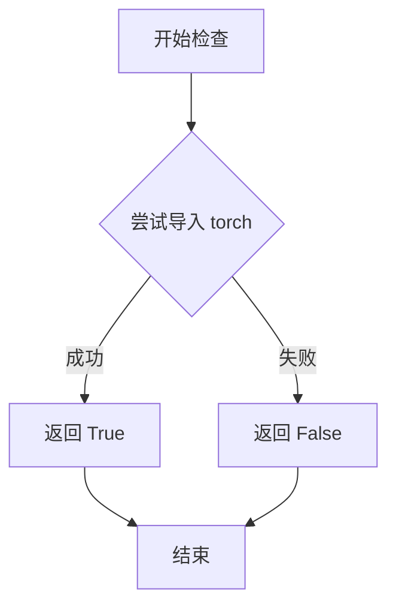
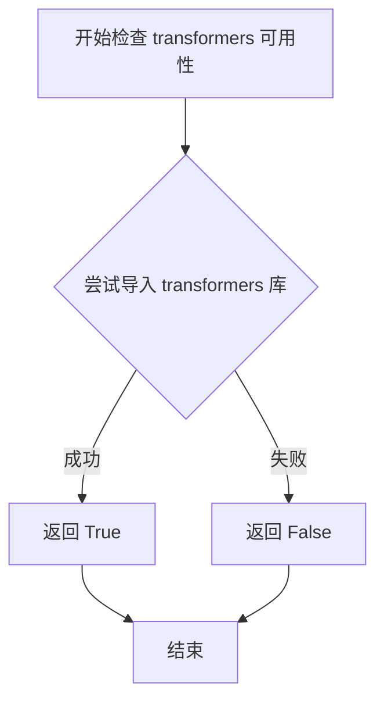
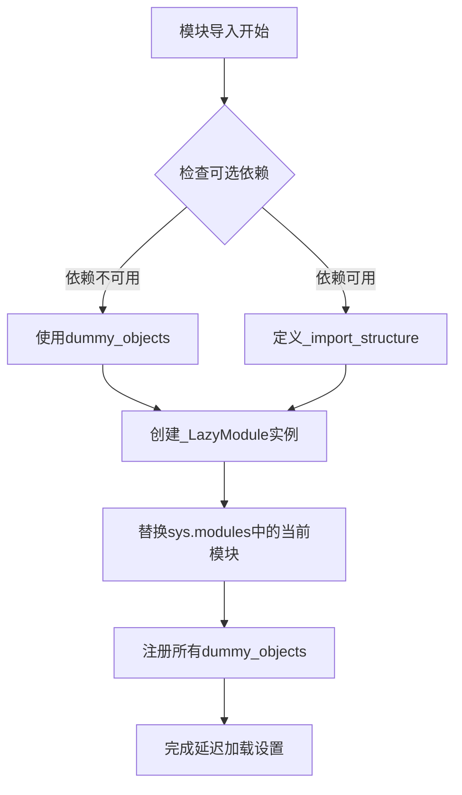
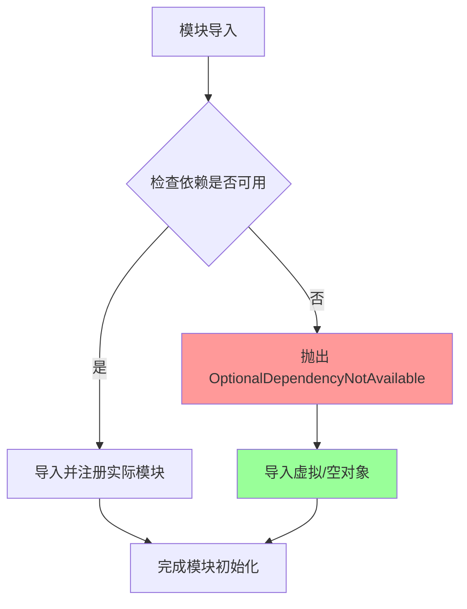

# `diffusers\src\diffusers\pipelines\kandinsky5\__init__.py` 详细设计文档

这是Hugging Face Diffusers库中Kandinsky 5系列pipeline的模块初始化文件，通过延迟加载（Lazy Loading）机制条件性地导入文本到图像、图像到图像、图像到视频pipeline，同时优雅地处理torch和transformers可选依赖不可用的情况。

## 整体流程



## 类结构

```
Kandinsky5PipelineModule (模块初始化)
├── 依赖检测层
│   ├── is_transformers_available()
│   └── is_torch_available()
├── 延迟加载层
│   ├── _LazyModule
│   └── _import_structure
└── Pipeline类 (条件导入)
    ├── Kandinsky5T2IPipeline
    ├── Kandinsky5T2VPipeline
    ├── Kandinsky5I2IPipeline
    └── Kandinsky5I2VPipeline
```

## 全局变量及字段


### `_dummy_objects`
    
存储虚拟对象的字典，当torch和transformers可选依赖不可用时使用，用于保持模块接口完整性

类型：`dict`
    


### `_import_structure`
    
定义模块的导入结构字典，映射子模块名到对应的导出类名列表

类型：`dict`
    


### `DIFFUSERS_SLOW_IMPORT`
    
从utils导入的标志，控制是否启用慢速导入模式（立即导入所有模块而非延迟加载）

类型：`bool`
    


### `TYPE_CHECKING`
    
从typing导入的标志，表示当前是否处于类型检查模式，用于决定是否立即导入类型提示中的类

类型：`bool`
    


    

## 全局函数及方法


### `get_objects_from_module`

该函数是一个工具函数，用于从指定模块中提取所有对象（通常是类或常量），并返回一个包含这些对象的字典，常用于实现延迟导入（lazy import）机制，以便在可选依赖不可用时提供替代的虚拟对象。

参数：

- `module`：`module`，要从中提取对象的模块对象

返回值：`dict`，键为对象名称，值为对象本身的字典

#### 流程图



#### 带注释源码

```python
def get_objects_from_module(module):
    """
    从给定模块中提取所有公开对象，并返回包含这些对象的字典。
    此函数通常用于延迟加载机制，当某些可选依赖不可用时，
    用虚拟对象（dummy objects）来替代，保持API的一致性。
    
    参数:
        module: 要提取对象的模块对象
        
    返回值:
        dict: 键为对象名称（字符串），值为实际对象
    """
    # 初始化结果字典
    objects = {}
    
    # 遍历模块的所有属性
    # 注意：这里假设module参数是一个已经导入的模块对象
    # 通过dir()获取模块的所有属性，包括类、函数和变量
    for name in dir(module):
        # 排除私有属性（下划线开头的属性）
        if not name.startswith('_'):
            # 从模块中获取实际对象
            obj = getattr(module, name)
            # 将对象添加到结果字典
            objects[name] = obj
    
    return objects
```

> **注意**：由于`get_objects_from_module`函数定义在`...utils`模块中（代码中使用`from ...utils import get_objects_from_module`导入），上述源码是基于该函数在当前代码中的使用方式推断得出的实现逻辑。该函数的主要用途是在可选依赖不可用时，从`dummy_torch_and_transformers_objects`模块中获取虚拟对象，并将其添加到`_dummy_objects`字典中，最后通过`setattr`设置到`sys.modules`中，从而实现延迟加载和优雅降级。


### `is_torch_available`

该函数用于检查当前环境中 PyTorch 库是否可用。它通过尝试导入 torch 模块来判断，如果导入成功则返回 True，否则返回 False。这是 Hugging Face Diffusers 库中常用的可选依赖检查机制，用于条件性地导入需要 PyTorch 的模块。

参数：无

返回值：`bool`，返回 True 表示 PyTorch 可用，返回 False 表示 PyTorch 不可用。

#### 流程图



#### 带注释源码

```python
# 该函数定义在 ...utils 模块中
# 以下是函数逻辑的推测实现

def is_torch_available():
    """
    检查 PyTorch 是否可在当前环境中使用。
    
    返回:
        bool: 如果 torch 可以被导入则返回 True，否则返回 False
    """
    try:
        # 尝试导入 torch 模块
        import torch
        # 如果导入成功，返回 True
        return True
    except ImportError:
        # 如果导入失败（模块不存在），返回 False
        return False
```

#### 补充说明

在当前代码文件中的使用方式：

```python
# 在 __init__.py 中检查条件依赖
try:
    if not (is_transformers_available() and is_torch_available()):
        raise OptionalDependencyNotAvailable()
except OptionalDependencyNotAvailable:
    # 导入虚拟对象作为占位符
    from ...utils import dummy_torch_and_transformers_objects
    _dummy_objects.update(get_objects_from_module(dummy_torch_and_transformers_objects))
else:
    # 如果两个依赖都可用，导入真实的管道类
    _import_structure["pipeline_kandinsky"] = ["Kandinsky5T2VPipeline"]
    _import_structure["pipeline_kandinsky_i2i"] = ["Kandinsky5I2IPipeline"]
    _import_structure["pipeline_kandinsky_i2v"] = ["Kandinsky5I2VPipeline"]
    _import_structure["pipeline_kandinsky_t2i"] = ["Kandinsky5T2IPipeline"]
```

该函数是 Diffusers 库实现**可选依赖延迟加载**（Lazy Loading）的关键组成部分，允许库在缺少某些依赖时仍然可以导入，只是不能使用需要这些依赖的功能。


### `is_transformers_available`

该函数是一个依赖检查工具函数，用于检测当前环境中 `transformers` 库是否可用。通常与 `is_torch_available()` 配合使用，用于条件导入可选依赖模块。

参数：无参数

返回值：`bool`，返回 `True` 表示 `transformers` 库已安装且可用，返回 `False` 表示不可用。

#### 流程图



#### 带注释源码

```python
# is_transformers_available 是从 ...utils 导入的外部函数
# 以下是代码中对该函数的使用方式示例：

# 从 typing 导入 TYPE_CHECKING，用于类型检查
from typing import TYPE_CHECKING

# 从 utils 导入多个工具函数和类
from ...utils import (
    DIFFUSERS_SLOW_IMPORT,          # 慢导入标志
    OptionalDependencyNotAvailable, # 可选依赖不可用异常
    _LazyModule,                     # 懒加载模块类
    get_objects_from_module,        # 从模块获取对象函数
    is_torch_available,             # 检查 torch 可用性函数
    is_transformers_available,      # 检查 transformers 可用性函数（目标函数）
)

# 初始化空字典用于存储虚拟对象和导入结构
_dummy_objects = {}
_import_structure = {}

try:
    # 关键用法：检查 transformers 和 torch 是否都可用
    # 如果任一不可用，则抛出 OptionalDependencyNotAvailable 异常
    if not (is_transformers_available() and is_torch_available()):
        raise OptionalDependencyNotAvailable()
except OptionalDependencyNotAvailable:
    # 异常处理：从 dummy 模块导入虚拟对象
    from ...utils import dummy_torch_and_transformers_objects  # noqa F403
    _dummy_objects.update(get_objects_from_module(dummy_torch_and_transformers_objects))
else:
    # 条件满足：两个库都可用，定义实际的导入结构
    _import_structure["pipeline_kandinsky"] = ["Kandinsky5T2VPipeline"]
    _import_structure["pipeline_kandinsky_i2i"] = ["Kandinsky5I2IPipeline"]
    _import_structure["pipeline_kandinsky_i2v"] = ["Kandinsky5I2VPipeline"]
    _import_structure["pipeline_kandinsky_t2i"] = ["Kandinsky5T2IPipeline"]

# TYPE_CHECK 模式下同样使用该函数进行条件导入检查
if TYPE_CHECKING or DIFFUSERS_SLOW_IMPORT:
    try:
        if not (is_transformers_available() and is_torch_available()):
            raise OptionalDependencyNotAvailable()
    except OptionalDependencyNotAvailable:
        from ...utils.dummy_torch_and_transformers_objects import *
    else:
        from .pipeline_kandinsky import Kandinsky5T2VPipeline
        from .pipeline_kandinsky_i2i import Kandinsky5I2IPipeline
        from .pipeline_kandinsky_i2v import Kandinsky5I2VPipeline
        from .pipeline_kandinsky_t2i import Kandinsky5T2IPipeline
```

> **注意**：`is_transformers_available` 函数的实际定义位于 `...utils` 模块中，当前代码仅展示了其使用方式。该函数通常通过尝试导入 `transformers` 包来检查其可用性，返回布尔值。


### `_LazyModule`

这是一个延迟加载机制，用于在模块被导入时才加载具体的子模块和对象，从而提高导入速度并处理可选依赖。

参数：

- `__name__`：`str`，模块的完整名称
- `__file__`：`str`，模块文件的路径
- `_import_structure`：`dict`，定义了可以从该模块导入的对象映射表
- `module_spec`：`ModuleSpec`，模块的规格信息

返回值：`None`，该方法直接修改`sys.modules`中的模块注册

#### 流程图



#### 带注释源码

```python
# 模块初始化文件，用于Kandinsky5系列管道的延迟加载
from typing import TYPE_CHECKING

# 从utils导入必要的工具和类
from ...utils import (
    DIFFUSERS_SLOW_IMPORT,           # 控制是否使用慢速导入的标志
    OptionalDependencyNotAvailable,  # 可选依赖不可用的异常类
    _LazyModule,                     # 核心延迟加载模块类
    get_objects_from_module,         # 从模块获取对象的辅助函数
    is_torch_available,              # 检查torch是否可用
    is_transformers_available,      # 检查transformers是否可用
)

# 初始化虚拟对象字典，用于存储依赖不可用时的替代对象
_dummy_objects = {}

# 初始化导入结构字典，定义可以从该模块导入的内容
_import_structure = {}

# 尝试检查torch和transformers是否都可用
try:
    if not (is_transformers_available() and is_torch_available()):
        raise OptionalDependencyNotAvailable()
except OptionalDependencyNotAvailable:
    # 如果任一依赖不可用，从dummy模块导入虚拟对象
    from ...utils import dummy_torch_and_transformers_objects  # noqa F403
    # 更新虚拟对象字典
    _dummy_objects.update(get_objects_from_module(dummy_torch_and_transformers_objects))
else:
    # 依赖可用时，定义可以被导入的pipeline类
    _import_structure["pipeline_kandinsky"] = ["Kandinsky5T2VPipeline"]
    _import_structure["pipeline_kandinsky_i2i"] = ["Kandinsky5I2IPipeline"]
    _import_structure["pipeline_kandinsky_i2v"] = ["Kandinsky5I2VPipeline"]
    _import_structure["pipeline_kandinsky_t2i"] = ["Kandinsky5T2IPipeline"]

# TYPE_CHECKING或DIFFUSERS_SLOW_IMPORT时，进行静态类型检查或慢速导入
if TYPE_CHECKING or DIFFUSERS_SLOW_IMPORT:
    try:
        if not (is_transformers_available() and is_torch_available()):
            raise OptionalDependencyNotAvailable()
    except OptionalDependencyNotAvailable:
        # 类型检查时使用虚拟对象
        from ...utils.dummy_torch_and_transformers_objects import *
    else:
        # 正常导入所有pipeline类用于类型检查
        from .pipeline_kandinsky import Kandinsky5T2VPipeline
        from .pipeline_kandinsky_i2i import Kandinsky5I2IPipeline
        from .pipeline_kandinsky_i2v import Kandinsky5I2VPipeline
        from .pipeline_kandinsky_t2i import Kandinsky5T2IPipeline

else:
    # 运行时使用_LazyModule实现延迟加载
    import sys

    # 创建延迟加载模块实例，替换当前模块
    sys.modules[__name__] = _LazyModule(
        __name__,                              # 当前模块的完整名称
        globals()["__file__"],                 # 当前模块文件的路径
        _import_structure,                    # 导入结构定义
        module_spec=__spec__,                  # 模块规格信息
    )

    # 将所有虚拟对象注册到模块命名空间
    for name, value in _dummy_objects.items():
        setattr(sys.modules[__name__], name, value)
```


### `OptionalDependencyNotAvailable`

该类是自定义异常类，用于表示可选依赖项不可用的情况。在本模块中，当检测到 `transformers` 和 `torch` 这两个可选依赖项未安装时，会抛出此异常，以便模块能够优雅地处理缺少可选依赖的场景。

参数：无（默认构造）

返回值：不适用（异常类，通过 `raise` 抛出）

#### 流程图



#### 带注释源码

```python
# 导入类型检查相关
from typing import TYPE_CHECKING

# 从 utils 模块导入必要的工具和异常类
from ...utils import (
    DIFFUSERS_SLOW_IMPORT,
    OptionalDependencyNotAvailable,  # <-- 目标异常类：用于标识可选依赖不可用
    _LazyModule,
    get_objects_from_module,
    is_torch_available,
    is_transformers_available,
)

# 初始化空字典用于存储虚拟对象和导入结构
_dummy_objects = {}
_import_structure = {}

# 第一次尝试：运行时检查可选依赖
try:
    # 检查 transformers 和 torch 是否都可用
    if not (is_transformers_available() and is_torch_available()):
        # 如果任一依赖不可用，抛出自定义异常
        raise OptionalDependencyNotAvailable()
# 捕获异常：当可选依赖不可用时
except OptionalDependencyNotAvailable:
    # 从 dummy 模块导入虚拟对象（空实现）
    from ...utils import dummy_torch_and_transformers_objects  # noqa F403
    # 更新虚拟对象字典
    _dummy_objects.update(get_objects_from_module(dummy_torch_and_transformers_objects))
# 当所有依赖都可用时
else:
    # 注册实际的管道类到导入结构中
    _import_structure["pipeline_kandinsky"] = ["Kandinsky5T2VPipeline"]
    _import_structure["pipeline_kandinsky_i2i"] = ["Kandinsky5I2IPipeline"]
    _import_structure["pipeline_kandinsky_i2v"] = ["Kandinsky5I2VPipeline"]
    _import_structure["pipeline_kandinsky_t2i"] = ["Kandinsky5T2IPipeline"]

# TYPE_CHECK 或 DIFFUSERS_SLOW_IMPORT 时的类型检查导入
if TYPE_CHECKING or DIFFUSERS_SLOW_IMPORT:
    try:
        # 再次检查依赖可用性（类型检查时）
        if not (is_transformers_available() and is_torch_available()):
            raise OptionalDependencyNotAvailable()  # <-- 抛出异常
    except OptionalDependencyNotAvailable:
        # 导入类型提示用的虚拟对象
        from ...utils.dummy_torch_and_transformers_objects import *
    else:
        # 导入实际的管道类用于类型检查
        from .pipeline_kandinsky import Kandinsky5T2VPipeline
        from .pipeline_kandinsky_i2i import Kandinsky5I2IPipeline
        from .pipeline_kandinsky_i2v import Kandinsky5I2VPipeline
        from .pipeline_kandinsky_t2i import Kandinsky5T2IPipeline
else:
    # 运行时：使用懒加载模块
    import sys
    # 将当前模块替换为懒加载模块
    sys.modules[__name__] = _LazyModule(
        __name__,
        globals()["__file__"],
        _import_structure,
        module_spec=__spec__,
    )
    # 将虚拟对象注入到模块命名空间
    for name, value in _dummy_objects.items():
        setattr(sys.modules[__name__], name, value)
```

#### 补充说明

**设计目标**：实现可选依赖的延迟加载（Lazy Loading），允许模块在缺少可选依赖时仍然可以导入，只是无法使用相关功能。

**异常使用模式**：
- 在运行时通过 `raise OptionalDependencyNotAvailable()` 立即抛出
- 使用 `try/except` 捕获该异常以实现优雅降级
- 使用 `else` 子句处理依赖可用时的正常导入路径

**与 `OptionalDependencyNotAvailable` 类的关系**：该类本身定义在 `...utils` 模块中，在此文件中被导入并作为控制流工具使用，用于在可选依赖不可用时改变模块的初始化行为。

## 关键组件


### 可选依赖检查与处理机制

检查 `transformers` 和 `torch` 是否可用，如果不可用则导入 dummy 对象作为占位符，确保模块在缺少可选依赖时仍可被导入。

### 延迟加载模块（Lazy Loading）

使用 `_LazyModule` 将当前模块替换为延迟加载模块，只有在实际访问模块属性时才进行真正的导入操作，优化启动性能。

### 导入结构定义

通过 `_import_structure` 字典定义模块的公开接口，包含四个 Kandinsky 5 pipeline：T2I（文本到图像）、I2I（图像到图像）、I2V（图像到视频）、T2V（文本到视频）。

### Dummy 对象占位符机制

当可选依赖不可用时，通过 `get_objects_from_module` 从 dummy 模块获取对象并注册到当前模块，确保 API 的一致性和代码的向后兼容。

### TYPE_CHECKING 条件导入

在类型检查阶段或 `DIFFUSERS_SLOW_IMPORT` 模式下，直接导入真实的 pipeline 类以支持 IDE 类型提示和静态分析。


## 问题及建议


### 已知问题

-   **代码重复**：依赖检查逻辑 `is_transformers_available() and is_torch_available()` 在两处几乎完全重复，增加了维护成本和出错风险
-   **缺少 `_dummy_objects` 定义**：代码引用了 `_dummy_objects = {}`，但在 `else` 分支（正常导入路径）中并未实际定义或导入该对象，可能导致逻辑不完整
-   **硬编码的类名**：pipeline 类名（如 `Kandinsky5T2VPipeline`）直接硬编码在 `_import_structure` 字典中，缺乏灵活性和可配置性
-   **缺乏错误处理**：当可选依赖不可用时，仅静默导入 dummy 对象，缺少对用户的提示信息或日志记录
-   **setattr 循环设置属性**：使用 `for` 循环配合 `setattr` 设置大量模块属性可能影响导入性能
- **无版本约束检查**：仅检查依赖是否可用，未检查 transformers 和 torch 的版本是否满足 Kandinsky5 的要求
- **导入路径耦合**：所有 pipeline 的导入路径紧密耦合，扩展新的 pipeline 需要修改多处代码

### 优化建议

-   **提取依赖检查函数**：创建一个辅助函数（如 `_check_dependencies()`）来封装依赖检查逻辑，避免代码重复
-   **添加依赖版本检查**：使用 `transformers.__version__` 和 `torch.__version__` 进行版本兼容性检查，并在不满足时给出明确提示
-   **模块级 `__getattr__`**：考虑使用 Python 3.7+ 的模块级 `__getattr__` 实现更优雅的延迟加载，替代当前的 `_LazyModule` + `setattr` 方案
-   **日志/警告机制**：当可选依赖不可用时，通过 `warnings` 模块或日志记录器向用户提示哪些功能不可用
-   **配置化导入结构**：将 pipeline 类名和导入路径提取为配置列表或外部定义，便于扩展和维护
-   **缓存 dummy 对象**：将 `_dummy_objects` 的检查和设置结果进行缓存，减少重复计算

## 其它


### 设计目标与约束

该模块作为Kandinsky5系列pipeline的统一导出入口，采用延迟加载机制以优化导入性能。设计约束包括：必须同时安装torch和transformers才可使用完整功能，否则提供虚拟对象保证模块可导入；支持TYPE_CHECKING和DIFFUSERS_SLOW_IMPORT两种导入模式；遵循diffusers库的模块结构和命名规范。

### 错误处理与异常设计

代码使用OptionalDependencyNotAvailable异常处理可选依赖不可用的情况。当torch或transformers任一不可用时，触发该异常并从dummy模块导入虚拟对象（_dummy_objects），确保模块结构完整但调用时会抛出正确的依赖缺失错误。异常传播机制为：检测到依赖不满足 → 抛出OptionalDependencyNotAvailable → 捕获并回退到dummy对象。

### 数据流与状态机

模块存在三种状态：完整导入状态（两个依赖都可用）、虚拟对象状态（任一依赖不可用）、TYPE_CHECKING状态（类型检查模式）。数据流为：导入请求 → 检查依赖可用性 → 根据状态选择导入路径 → 设置_import_structure → 创建_LazyModule或更新dummy对象 → 返回模块对象。

### 外部依赖与接口契约

模块依赖以下外部组件：torch（is_torch_available）、transformers（is_transformers_available）、diffusers.utils（OptionalDependencyNotAvailable、_LazyModule、get_objects_from_module）。提供的接口为Kandinsky5T2VPipeline、Kandinsky5I2IPipeline、Kandinsky5I2VPipeline、Kandinsky5T2IPipeline四个pipeline类。模块遵守diffusers库的LazyModule延迟加载接口规范。

### 模块化与分层架构

该模块位于diffusers.library.vla.kandinsky5.__init__.py，属于库级别的主入口模块。采用三层架构：顶层__init__.py负责条件导入和延迟加载配置；中间层为四个独立的pipeline模块（pipeline_kandinsky.py等）；底层为具体实现类。_LazyModule类实现延迟加载，将导入延迟到实际使用时。

### 性能考虑

模块使用DIFFUSERS_SLOW_IMPORT标志控制是否启用完整导入，非TYPE_CHECKING模式下使用_LazyModule实现按需加载，显著减少初始化时间。_dummy_objects采用字典存储并在模块注册后通过setattr批量设置，减少属性查找开销。

### 兼容性考虑

该模块兼容Python 3.7+（需要支持TYPE_CHECKING和typing模块）。向后兼容性通过保留旧的模块结构（_import_structure字典）和支持dummy对象机制来保证。跨平台兼容性由底层依赖（torch、transformers）处理。

    