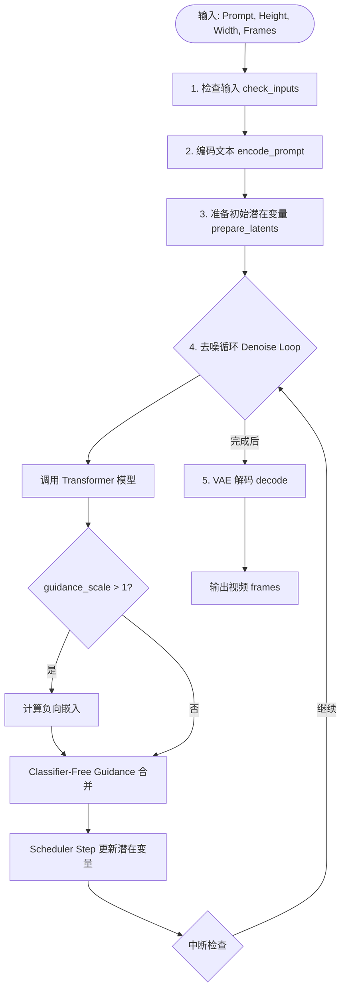
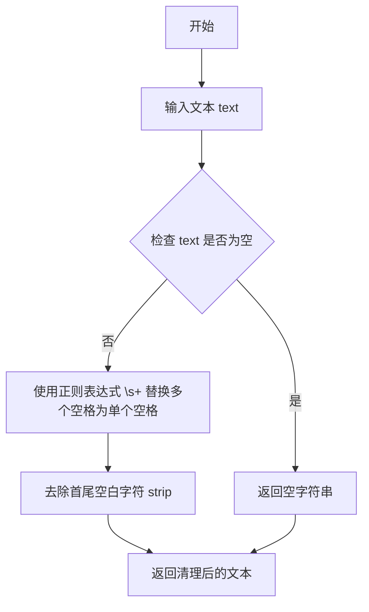
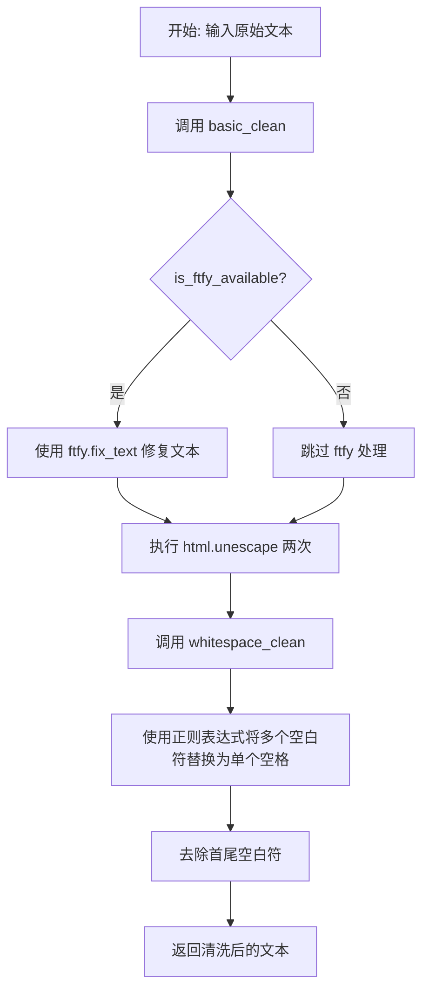
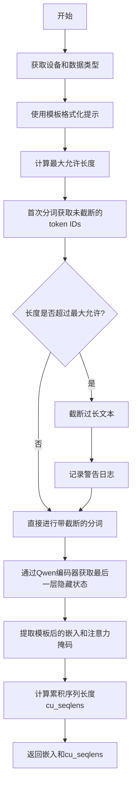
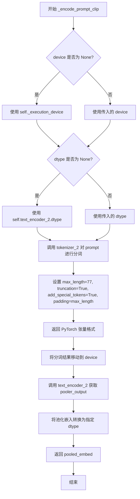
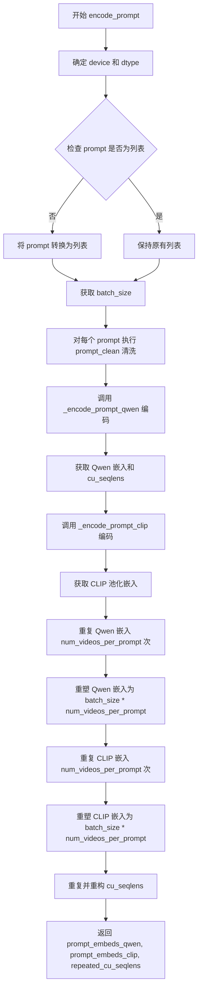
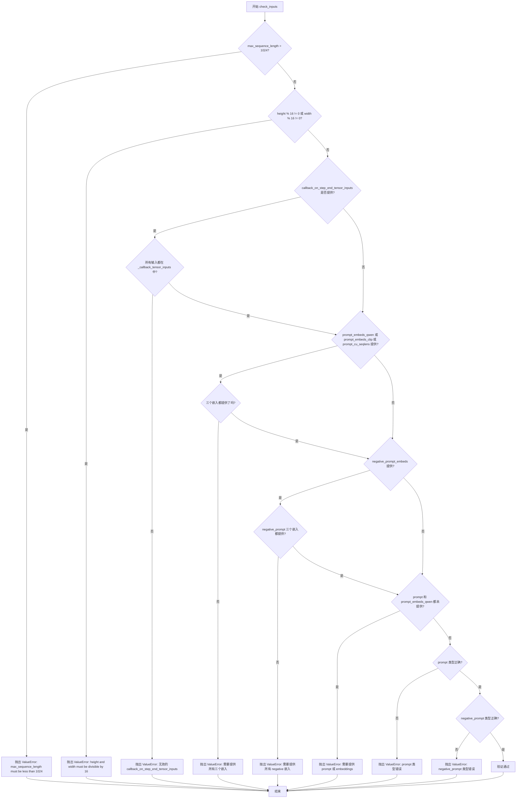
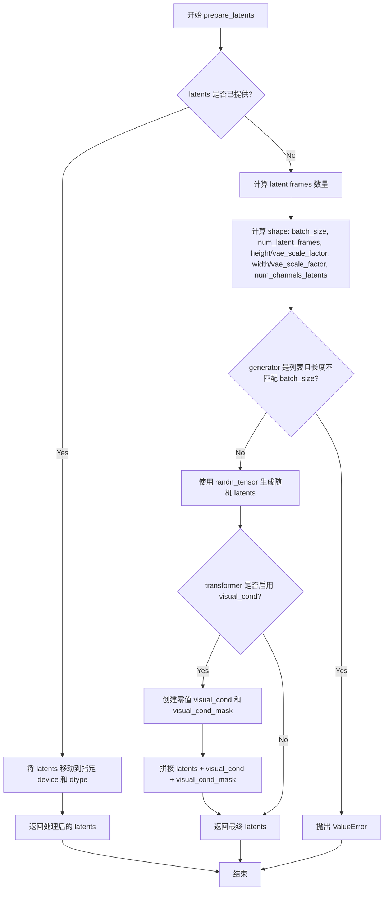

```mermaid
flowchart TD
    A[开始 __call__] --> B{检查 callback_on_step_end 类型}
    B -->|PipelineCallback 或 MultiPipelineCallbacks| C[更新 callback_on_step_end_tensor_inputs]
    B -->|其他| D[继续]
    C --> D
    
    D --> E[调用 check_inputs 验证输入参数]
    E --> F{num_frames 是否符合 VAE 时间压缩比}
    F -->|不符合| G[调整 num_frames 并发出警告]
    F -->|符合| H[继续]
    G --> H
    
    H --> I[设置 _guidance_scale 和 _interrupt]
    I --> J[确定 batch_size 和处理 prompt]
    
    J --> K{prompt_embeds_qwen 是否为 None}
    K -->|是| L[调用 encode_prompt 生成 Qwen/CLIP 嵌入]
    K -->|否| M[使用提供的嵌入]
    L --> M
    
    M --> N{guidance_scale > 1.0}
    N -->|是| O[处理 negative_prompt]
    N -->|否| P[跳过 negative_prompt]
    O --> Q{negative_prompt_embeds_qwen 是否为 None}
    Q -->|是| R[调用 encode_prompt 生成负面嵌入]
    Q -->|否| P
    R --> P
    
    P --> S[设置 timesteps]
    S --> T[调用 prepare_latents 准备潜在向量]
    T --> U[计算 rope 位置编码]
    U --> V[计算动态缩放因子]
    V --> W[获取稀疏注意力参数]
    
    W --> X[进入去噪循环]
    X --> Y{检查 interrupt 标志}
    Y -->|是| Z[跳过本次迭代]
    Y -->|否| AA[复制 timestep]
    
    AA --> AB[调用 transformer 预测噪声速度]
    AB --> AC{guidance_scale > 1.0 且存在负面嵌入}
    AC -->|是| AD[计算无条件预测并进行 CFG]
    AC -->|否| AE[仅使用条件预测]
    AD --> AE
    
    AE --> AF[调用 scheduler.step 更新 latents]
    AF --> AG{callback_on_step_end 不为 None}
    AG -->|是| AH[执行回调函数]
    AG -->|否| AI[继续]
    AH --> AI
    
    AI --> AJ{检查是否为最后一步或暖身步完成}
    AJ -->|是| AK[更新进度条]
    AK --> AL{是否启用 XLA}
    AJ -->|否| AL
    AL -->|是| AM[执行 xm.mark_step]
    AL -->|否| AN
    
    AM --> AN{循环是否继续}
    AN -->|是| X
    AN -->|否| AO[提取主潜在向量]
    
    AO --> AP{output_type != 'latent'}
    AP -->|是| AQ[reshape 和 permute latents]
    AQ --> AR[归一化并通过 VAE 解码]
    AR --> AS[后处理视频]
    AP -->|否| AT[直接返回 latents]
    
    AS --> AU[释放模型钩子]
    AT --> AU
    
    AU --> AV{return_dict 为 True}
    AV -->|是| AW[返回 KandinskyPipelineOutput]
    AV -->|否| AX[返回元组]
    AW --> AY[结束]
    AX --> AY
```

# `diffusers\src\diffusers\pipelines\kandinsky5\pipeline_kandinsky.py` 详细设计文档

Kandinsky5T2VPipeline 是一个基于 PyTorch 和 Hugging Face Diffusers 框架的文本到视频生成管线。它利用 Qwen2.5-VL 和 CLIP 双文本编码器进行语义理解，通过 Kandinsky5Transformer3DModel（结合稀疏时间注意力 STA 和 RoPE 位置编码）进行去噪扩散，并使用 HunyuanVideo VAE 进行潜在空间的视频解码，最终生成高质量视频。

## 整体流程



## 类结构

```
DiffusionPipeline (基类)
├── KandinskyLoraLoaderMixin (Mixin)
│   └── Kandinsky5T2VPipeline (主类)
│       ├── _encode_prompt_qwen (内部方法)
│       ├── _encode_prompt_clip (内部方法)
│       ├── fast_sta_nabla (静态方法)
│       ├── get_sparse_params (辅助方法)
│       ├── prepare_latents (核心方法)
│       └── __call__ (执行入口)
KandinskyPipelineOutput (输出数据结构)
```

## 全局变量及字段


### `logger`
    
日志记录器，用于输出pipeline运行时的调试信息和警告

类型：`logging.Logger`
    


### `XLA_AVAILABLE`
    
标志位，指示是否支持XLA加速（PyTorch XLA）

类型：`bool`
    


### `EXAMPLE_DOC_STRING`
    
包含pipeline使用示例的文档字符串，演示如何调用Kandinsky5进行文本到视频生成

类型：`str`
    


### `is_ftfy_available`
    
函数指针，检查ftfy库是否可用以修复文本编码问题

类型：`Callable[[], bool]`
    


### `Kandinsky5T2VPipeline.transformer`
    
条件Transformer模型，用于对编码后的视频潜在表示进行去噪处理

类型：`Kandinsky5Transformer3DModel`
    


### `Kandinsky5T2VPipeline.vae`
    
变分自编码器模型，负责在潜在表示空间与实际视频之间进行编码和解码

类型：`AutoencoderKLHunyuanVideo`
    


### `Kandinsky5T2VPipeline.text_encoder`
    
Qwen2.5-VL文本编码器模型，用于将提示词转换为高维嵌入向量

类型：`Qwen2_5_VLForConditionalGeneration`
    


### `Kandinsky5T2VPipeline.tokenizer`
    
Qwen2.5-VL的处理器，负责对输入文本进行分词和预处理

类型：`Qwen2VLProcessor`
    


### `Kandinsky5T2VPipeline.text_encoder_2`
    
CLIP文本编码器，用于生成池化的语义嵌入向量

类型：`CLIPTextModel`
    


### `Kandinsky5T2VPipeline.tokenizer_2`
    
CLIP分词器，对文本进行tokenize处理供CLIP模型使用

类型：`CLIPTokenizer`
    


### `Kandinsky5T2VPipeline.scheduler`
    
Flow Match欧拉离散调度器，控制去噪过程中的时间步长和噪声调度

类型：`FlowMatchEulerDiscreteScheduler`
    


### `Kandinsky5T2VPipeline.prompt_template`
    
用于格式化输入提示词的模板，包含系统指令和用户提示的结构化格式

类型：`str`
    


### `Kandinsky5T2VPipeline.video_processor`
    
视频后处理器，负责将解码后的潜在表示转换为最终输出格式

类型：`VideoProcessor`
    


### `Kandinsky5T2VPipeline.vae_scale_factor_temporal`
    
VAE时间维度压缩比，用于计算潜在帧数与实际视频帧数的对应关系

类型：`int`
    


### `Kandinsky5T2VPipeline.vae_scale_factor_spatial`
    
VAE空间维度压缩比，用于计算潜在空间尺寸与实际视频尺寸的对应关系

类型：`int`
    


### `Kandinsky5T2VPipeline.model_cpu_offload_seq`
    
定义模型组件从CPU到GPU的offload顺序，用于内存管理优化

类型：`str`
    


### `KandinskyPipelineOutput.frames`
    
生成的视频帧数据列表，存储最终输出的视频内容

类型：`List[Any]`
    
    

## 全局函数及方法


### `basic_clean`

该函数用于清理文本内容，首先使用 ftfy 库（如果可用）修复文本中的编码问题，然后对文本进行两次 HTML 实体解码以处理转义字符，最后去除首尾空白字符。

参数：

- `text`：`str`，需要清理的原始文本

返回值：`str`，清理后的文本

#### 流程图

```mermaid
flowchart TD
    A[开始: basic_clean] --> B{is_ftfy_available?}
    B -->|是| C[text = ftfy.fix_text(text)]
    B -->|否| D[跳过 ftfy 处理]
    C --> E[text = html.unescape text]
    D --> E
    E --> F[text = html.unescape text 第二次]
    F --> G[text = text.strip 去除首尾空白]
    G --> H[返回清理后的文本]
```

#### 带注释源码

```python
def basic_clean(text):
    """
    Copied from https://github.com/huggingface/diffusers/blob/main/src/diffusers/pipelines/wan/pipeline_wan.py

    Clean text using ftfy if available and unescape HTML entities.
    
    该函数用于清理文本，使用 ftfy 库（如果可用）修复文本编码问题，
    并对文本进行 HTML 实体解码处理。
    
    参数:
        text: 需要清理的原始文本字符串
        
    返回:
        清理后的文本字符串
    """
    # 检查 ftfy 库是否可用，如果可用则使用它来修复文本中的编码问题
    # ftfy 可以修复常见的文本编码错误，如 UTF-8 编码错误产生的乱码
    if is_ftfy_available():
        text = ftfy.fix_text(text)
    
    # 对文本进行两次 HTML 实体解码，以处理多重转义的情况
    # 例如: &amp;lt; 会先解码为 &lt;，再解码为 <
    text = html.unescape(html.unescape(text))
    
    # 去除文本首尾的空白字符
    return text.strip()
```


### `whitespace_clean`

标准化文本中的空白字符，将多个连续空格替换为单个空格。

参数：

- `text`：`str`，需要清理空白字符的输入文本

返回值：`str`，空白字符规范化后的文本

#### 流程图



#### 带注释源码

```python
def whitespace_clean(text):
    """
    Copied from https://github.com/huggingface/diffusers/blob/main/src/diffusers/pipelines/wan/pipeline_wan.py

    Normalize whitespace in text by replacing multiple spaces with single space.
    """
    # 使用正则表达式将所有连续空白字符（包括空格、制表符、换行符等）替换为单个空格
    text = re.sub(r"\s+", " ", text)
    # 去除字符串首尾的空白字符
    text = text.strip()
    # 返回处理后的文本
    return text
```


### `prompt_clean`

对输入的提示文本应用基础清洗（HTML实体解码和ftfy修复）和空白符规范化处理，返回清洗后的文本。

参数：

- `text`：`str`，需要清洗的提示文本

返回值：`str`，清洗处理后的文本

#### 流程图



#### 带注释源码

```python
def prompt_clean(text):
    """
    Copied from https://github.com/huggingface/diffusers/blob/main/src/diffusers/pipelines/wan/pipeline_wan.py

    Apply both basic cleaning and whitespace normalization to prompts.
    """
    # 1. 首先调用 basic_clean 进行基础清洗：
    #    - 如果 ftfy 可用，使用 ftfy.fix_text 修复文本编码问题
    #    - 使用 html.unescape 两次解码 HTML 实体
    #    - 去除首尾空白符
    # 2. 然后调用 whitespace_clean 进行空白符规范化：
    #    - 使用正则表达式将连续多个空白符替换为单个空格
    #    - 去除首尾空白符
    text = whitespace_clean(basic_clean(text))
    return text
```


### `Kandinsky5T2VPipeline.__init__`

该方法是 Kandinsky 5.0 文本到视频生成管道的初始化函数，负责注册所有必要的模型组件（Transformer、VAE、文本编码器、分词器、调度器）并配置视频处理相关的参数。

参数：

- `transformer`：`Kandinsky5Transformer3DModel`，用于去噪视频潜在表示的条件 Transformer 模型
- `vae`：`AutoencoderKLHunyuanVideo`，用于编码和解码视频的变分自编码器模型
- `text_encoder`：`Qwen2_5_VLForConditionalGeneration`，Qwen2.5-VL 文本编码器，用于生成文本嵌入
- `tokenizer`：`Qwen2VLProcessor`，Qwen2.5-VL 的分词器
- `text_encoder_2`：`CLIPTextModel`，CLIP 文本编码器，用于生成池化语义嵌入
- `tokenizer_2`：`CLIPTokenizer`，CLIP 的分词器
- `scheduler`：`FlowMatchEulerDiscreteScheduler`，用于去噪视频潜在表示的调度器

返回值：无（`None`），该方法仅初始化对象状态，不返回任何值

#### 流程图

```mermaid
flowchart TD
    A[开始 __init__] --> B[调用 super().__init__]
    B --> C[注册所有模块: transformer, vae, text_encoder, tokenizer, text_encoder_2, tokenizer_2, scheduler]
    C --> D[构建 prompt_template 字符串]
    D --> E[设置 prompt_template_encode_start_idx = 129]
    E --> F[计算 vae_scale_factor_temporal]
    F --> G[计算 vae_scale_factor_spatial]
    G --> H[创建 VideoProcessor 实例]
    H --> I[结束 __init__]
```

#### 带注释源码

```python
def __init__(
    self,
    transformer: Kandinsky5Transformer3DModel,
    vae: AutoencoderKLHunyuanVideo,
    text_encoder: Qwen2_5_VLForConditionalGeneration,
    tokenizer: Qwen2VLProcessor,
    text_encoder_2: CLIPTextModel,
    tokenizer_2: CLIPTokenizer,
    scheduler: FlowMatchEulerDiscreteScheduler,
):
    """
    初始化 Kandinsky 5.0 T2V Pipeline
    
    参数:
        transformer: 条件 Transformer 用于去噪视频潜在表示
        vae: 用于视频编码/解码的 VAE 模型
        text_encoder: Qwen2.5-VL 文本编码器
        tokenizer: Qwen2.5-VL 分词器
        text_encoder_2: CLIP 文本编码器
        tokenizer_2: CLIP 分词器
        scheduler: Flow Match 调度器
    """
    # 调用父类 DiffusionPipeline 的初始化方法
    # 这会设置基本的 pipeline 配置和设备管理
    super().__init__()
    
    # 使用 register_modules 注册所有模型组件
    # 这些组件将通过 .to() 方法被移动到正确的设备
    # 并且可以通过 self.transformer, self.vae 等方式访问
    self.register_modules(
        transformer=transformer,
        vae=vae,
        text_encoder=text_encoder,
        tokenizer=tokenizer,
        text_encoder_2=text_encoder_2,
        tokenizer_2=tokenizer_2,
        scheduler=scheduler,
    )
    
    # 构建提示词模板，用于引导模型生成更详细的视频描述
    # 模板包含系统消息和用户消息的结构化格式
    self.prompt_template = "\n".join(
        [
            "<|im_start|>system\nYou are a promt engineer. Describe the video in detail.",
            "Describe how the camera moves or shakes, describe the zoom and view angle, whether it follows the objects.",
            "Describe the location of the video, main characters or objects and their action.",
            "Describe the dynamism of the video and presented actions.",
            "Name the visual style of the video: whether it is a professional footage, user generated content, some kind of animation, video game or scren content.",
            "Describe the visual effects, postprocessing and transitions if they are presented in the video.",
            "Pay attention to the order of key actions shown in the scene.<|im_end|>",
            "<|im_start|>user\n{}<|im_end|>",
        ]
    )
    
    # 提示词编码的起始索引，用于跳过模板前缀部分
    self.prompt_template_encode_start_idx = 129
    
    # VAE 时空压缩比，用于计算潜在空间的帧数和分辨率
    # temporal_compression_ratio 用于时间维度压缩
    self.vae_scale_factor_temporal = (
        self.vae.config.temporal_compression_ratio if getattr(self, "vae", None) else 4
    )
    # spatial_compression_ratio 用于空间维度压缩
    self.vae_scale_factor_spatial = self.vae.config.spatial_compression_ratio if getattr(self, "vae", None) else 8
    
    # 创建视频处理器，用于 VAE 解码后的视频后处理
    self.video_processor = VideoProcessor(vae_scale_factor=self.vae_scale_factor_spatial)
```


### `Kandinsky5T2VPipeline._get_scale_factor`

该方法根据输入的视频分辨率计算并返回对应的缩放因子，用于视频生成过程中的空间和时间缩放。

参数：

- `height`：`int`，视频高度
- `width`：`int`，视频宽度

返回值：`tuple`，缩放因子，格式为 (temporal_scale, height_scale, width_scale)

#### 流程图

```mermaid
flowchart TD
    A[Start _get_scale_factor] --> B{Is height between 480 and 854?}
    B -->|Yes| C{Is width between 480 and 854?}
    C -->|Yes| D[Return (1, 2, 2)]
    C -->|No| E[Return (1, 3.16, 3.16)]
    B -->|No| E
    E --> F[Return (1, 3.16, 3.16)]
```

#### 带注释源码

```python
def _get_scale_factor(self, height: int, width: int) -> tuple:
    """
    Calculate the scale factor based on resolution.
    
    根据分辨率计算缩放因子。480p-854p范围内的分辨率使用较小的缩放因子(2, 2)，
    更高分辨率则使用较大的缩放因子(3.16, 3.16)。时间维度缩放因子固定为1。

    Args:
        height (int): Video height / 视频高度
        width (int): Video width / 视频宽度

    Returns:
        tuple: Scale factor as (temporal_scale, height_scale, width_scale)
               / 缩放因子，格式为 (时间缩放因子, 高度缩放因子, 宽度缩放因子)
    """

    # 定义内部辅助函数：判断分辨率是否在480p范围内
    # Helper function to check if resolution is in 480p range (480-854 pixels)
    def between_480p(x):
        return 480 <= x <= 854

    # 如果高度和宽度都在480p范围内，返回(1, 2, 2)
    # Use smaller scale factor (2, 2) for standard 480p resolutions
    if between_480p(height) and between_480p(width):
        return (1, 2, 2)
    else:
        # 否则返回较大的缩放因子(1, 3.16, 3.16)，适用于更高分辨率
        # Use larger scale factor (3.16, 3.16) for higher resolutions
        return (1, 3.16, 3.16)
```


### `Kandinsky5T2VPipeline.fast_sta_nabla`

创建一个稀疏时间注意力（Sparse Temporal Attention, STA）掩码，用于高效的视频生成。该方法生成一个掩码，将注意力限制在附近帧和空间位置，从而减少视频生成的计算复杂性。

参数：

- `T`：`int`，时间帧数量（Number of temporal frames）
- `H`：`int`，潜在空间高度（Height in latent space）
- `W`：`int`，潜在空间宽度（Width in latent space）
- `wT`：`int`，时间注意力窗口大小，默认为3（Temporal attention window size）
- `wH`：`int`，高度注意力窗口大小，默认为3（Height attention window size）
- `wW`：`int`，宽度注意力窗口大小，默认为3（Width attention window size）
- `device`：`str`，创建张量的设备，默认为"cuda"（Device to create tensor on）

返回值：`torch.Tensor`，形状为 (T*H*W, T*H*W) 的稀疏注意力掩码（Sparse attention mask of shape (T*H*W, T*H*W)）

#### 流程图

```mermaid
flowchart TD
    A[开始] --> B[计算最大维度 l = max{T, H, W}]
    B --> C[创建 0 到 l-1 的索引向量 r]
    C --> D[计算距离矩阵 mat = |r - r^T|]
    D --> E[提取并展平各维度距离向量: sta_t, sta_h, sta_w]
    E --> F{各维度距离是否 <= 窗口半宽?}
    F -->|时间维度| G[sta_t = sta_t <= wT//2]
    F -->|高度维度| H[sta_h = sta_h <= wH//2]
    F -->|宽度维度| I[sta_w = sta_w <= wW//2]
    G --> J[计算空间注意力掩码 sta_hw]
    H --> J
    I --> J
    J --> K[组合时空注意力: sta = sta_t × sta_hw]
    K --> L[转置并reshape得到最终掩码]
    L --> M[返回: shape (T×H×W, T×H×W)]
```

#### 带注释源码

```python
@staticmethod
def fast_sta_nabla(T: int, H: int, W: int, wT: int = 3, wH: int = 3, wW: int = 3, device="cuda") -> torch.Tensor:
    """
    Create a sparse temporal attention (STA) mask for efficient video generation.

    This method generates a mask that limits attention to nearby frames and spatial positions, reducing
    computational complexity for video generation.

    Args:
        T (int): Number of temporal frames
        H (int): Height in latent space
        W (int): Width in latent space
        wT (int): Temporal attention window size
        wH (int): Height attention window size
        wW (int): Width attention window size
        device (str): Device to create tensor on

    Returns:
        torch.Tensor: Sparse attention mask of shape (T*H*W, T*H*W)
    """
    # Step 1: 计算最大维度值，用于创建索引范围
    # Find the maximum dimension to determine the range of indices
    l = torch.Tensor([T, H, W]).amax()
    
    # Step 2: 创建从0到l-1的连续索引向量
    # Create a tensor with values from 0 to l-1
    r = torch.arange(0, l, 1, dtype=torch.int16, device=device)
    
    # Step 3: 计算距离矩阵（每个元素是两个索引之差的绝对值）
    # Compute absolute difference matrix between all indices
    # shape: (l, l)
    mat = (r.unsqueeze(1) - r.unsqueeze(0)).abs()
    
    # Step 4: 提取各维度的距离向量并展平
    # Extract and flatten distance vectors for each dimension
    # sta_t: 时间维度的距离向量
    # sta_h: 高度维度的距离向量
    # sta_w: 宽度维度的距离向量
    sta_t, sta_h, sta_w = (
        mat[:T, :T].flatten(),   # 取前T行T列并展平
        mat[:H, :H].flatten(),   # 取前H行H列并展平
        mat[:W, :W].flatten(),   # 取前W行W列并展平
    )
    
    # Step 5: 根据窗口大小的一半判断是否为有效注意力位置
    # Determine valid attention positions based on window size (half-window)
    sta_t = sta_t <= wT // 2   # 时间维度：距离 <= 窗口半宽
    sta_h = sta_h <= wH // 2   # 高度维度：距离 <= 窗口半宽
    sta_w = sta_w <= wW // 2   # 宽度维度：距离 <= 窗口半宽
    
    # Step 6: 计算空间注意力掩码（高度×宽度的组合）
    # Compute spatial attention mask (H × W combination)
    # unsqueeze操作创建用于广播的维度
    # 结果shape: (H*W, H*W)
    sta_hw = (sta_h.unsqueeze(1) * sta_w.unsqueeze(0)).reshape(H, H, W, W).transpose(1, 2).flatten()
    
    # Step 7: 组合时间和空间注意力掩码
    # Combine temporal and spatial attention masks
    # 使用外积（unsqueeze + 广播）合并时空维度
    # 最终shape: (T, T, H*W, H*W)
    sta = (sta_t.unsqueeze(1) * sta_hw.unsqueeze(0)).reshape(T, T, H * W, H * W).transpose(1, 2)
    
    # Step 8: 最终reshape为二维方阵
    # Reshape to square matrix for attention computation
    # 最终shape: (T*H*W, T*H*W) - 适用于注意力机制的掩码格式
    return sta.reshape(T * H * W, T * H * W)
```


### `Kandinsky5T2VPipeline.get_sparse_params`

该方法用于根据输入样本的维度生成稀疏注意力（Sparse Attention）参数，为视频生成流程中的 transformer 模型提供高效的注意力计算配置。它通过判断 transformer 的注意力类型（"nabla"），计算时空注意力掩码（STA Mask）并返回包含注意力类型、窗口大小、注意力方法等关键配置的字典，以实现对视频帧的稀疏注意力计算，优化长视频序列的处理效率。

**参数：**

- `sample`：`torch.Tensor`，输入样本张量，形状为 (B, T, H, W, C)，其中 B 是批次大小，T 是时间帧数，H 是高度，W 是宽度，C 是通道数
- `device`：`torch.device`，用于放置张量的设备（如 cuda 或 cpu）

**返回值：** `Dict`，包含稀疏注意力参数的字典，包括 sta_mask（稀疏注意力掩码）、attention_type（注意力类型）、to_fractal（是否使用分形注意力）、P（注意力参数 P）、wT/wH/wW（时空窗口大小）、add_sta（是否添加 STA）、visual_shape（视觉形状）和 method（注意力方法）。如果注意力类型不是 "nabla"，则返回 None。

#### 流程图

```mermaid
flowchart TD
    A[开始: get_sparse_params] --> B[断言: patch_size[0] == 1]
    B --> C[从 sample 提取形状 B, T, H, W]
    C --> D[计算 T, H, W: 除以对应的 patch_size]
    D --> E{判断 attention_type == 'nabla'}
    E -->|是| F[调用 fast_sta_nabla 生成 STA 掩码]
    E -->|否| G[设置 sparse_params = None]
    F --> H[构建 sparse_params 字典]
    H --> I[返回 sparse_params]
    G --> I
    
    F -.-> F1[传入 T, H//8, W//8 和窗口参数]
    F1 --> F2[生成形状为 T*H*W 的掩码矩阵]
```

#### 带注释源码

```python
def get_sparse_params(self, sample, device):
    """
    Generate sparse attention parameters for the transformer based on sample dimensions.

    This method computes the sparse attention configuration needed for efficient video processing in the
    transformer model.

    Args:
        sample (torch.Tensor): Input sample tensor
        device (torch.device): Device to place tensors on

    Returns:
        Dict: Dictionary containing sparse attention parameters
    """
    # 断言检查：确保 transformer 的时间维度 patch_size 为 1
    assert self.transformer.config.patch_size[0] == 1
    
    # 从输入样本中解构批次维度和时空维度
    # sample 形状: (B, T, H, W, C)
    B, T, H, W, _ = sample.shape
    
    # 根据 transformer 的 patch_size 计算实际的 latent 空间维度
    # 将时空维度分别除以对应的 patch size
    T, H, W = (
        T // self.transformer.config.patch_size[0],  # 时间维度 patch 大小
        H // self.transformer.config.patch_size[1],  # 高度维度 patch 大小
        W // self.transformer.config.patch_size[2],  # 宽度维度 patch 大小
    )
    
    # 检查 transformer 配置的注意力类型是否为 "nabla"（稀疏时空注意力）
    if self.transformer.config.attention_type == "nabla":
        # 调用静态方法生成稀疏时空注意力（STA）掩码
        # 对 H 和 W 除以 8 进行下采样（与 VAE 的空间压缩比例相关）
        sta_mask = self.fast_sta_nabla(
            T,
            H // 8,
            W // 8,
            self.transformer.config.attention_wT,   # 时间窗口大小
            self.transformer.config.attention_wH,  # 高度窗口大小
            self.transformer.config.attention_wW,   # 宽度窗口大小
            device=device,
        )

        # 构建稀疏注意力参数字典
        # 包含 transformer 需要的所有注意力配置信息
        sparse_params = {
            "sta_mask": sta_mask.unsqueeze_(0).unsqueeze_(0),  # 添加批次和头维度
            "attention_type": self.transformer.config.attention_type,  # 注意力类型
            "to_fractal": True,  # 是否转换为分形注意力
            "P": self.transformer.config.attention_P,  # 注意力参数 P
            "wT": self.transformer.config.attention_wT,  # 时间窗口大小
            "wW": self.transformer.config.attention_wW,  # 宽度窗口大小
            "wH": self.transformer.config.attention_wH,  # 高度窗口大小
            "add_sta": self.transformer.config.attention_add_sta,  # 是否添加 STA
            "visual_shape": (T, H, W),  # 视觉形状信息
            "method": self.transformer.config.attention_method,  # 注意力方法
        }
    else:
        # 如果注意力类型不是 nabla，设置 sparse_params 为 None
        # 表明不使用稀疏注意力
        sparse_params = None

    # 返回稀疏注意力参数字典（或 None）
    return sparse_params
```


### `Kandinsky5T2VPipeline._encode_prompt_qwen`

该方法使用 Qwen2.5-VL 文本编码器对输入提示进行编码，生成用于视频生成的可变长度文本嵌入和相关注意力掩码信息。

参数：

- `self`：Kandinsky5T2VPipeline 实例本身
- `prompt`：`str | list[str]`，输入提示或提示列表
- `device`：`torch.device | None`，运行编码的设备，默认为执行设备
- `max_sequence_length`：`int`，最大序列长度，默认为 256
- `dtype`：`torch.dtype | None`，嵌入的数据类型，默认为文本编码器的数据类型

返回值：`tuple[torch.Tensor, torch.Tensor]`，第一个是文本嵌入（形状为 [batch_size, seq_len, embed_dim]），第二个是累积序列长度（用于可变长度注意力的 cu_seqlens）

#### 流程图



#### 带注释源码

```python
def _encode_prompt_qwen(
    self,
    prompt: str | list[str],
    device: torch.device | None = None,
    max_sequence_length: int = 256,
    dtype: torch.dtype | None = None,
):
    """
    Encode prompt using Qwen2.5-VL text encoder.

    This method processes the input prompt through the Qwen2.5-VL model to generate text embeddings suitable for
    video generation.

    Args:
        prompt (str | list[str]): Input prompt or list of prompts
        device (torch.device): Device to run encoding on
        num_videos_per_prompt (int): Number of videos to generate per prompt
        max_sequence_length (int): Maximum sequence length for tokenization
        dtype (torch.dtype): Data type for embeddings

    Returns:
        tuple[torch.Tensor, torch.Tensor]: Text embeddings and cumulative sequence lengths
    """
    # 确定运行设备和数据类型，如果未指定则使用默认
    device = device or self._execution_device
    dtype = dtype or self.text_encoder.dtype

    # 使用提示模板格式化每个提示（添加系统指令等）
    full_texts = [self.prompt_template.format(p) for p in prompt]
    # 计算最大允许长度 = 模板起始索引 + 用户指定的最大序列长度
    max_allowed_len = self.prompt_template_encode_start_idx + max_sequence_length

    # 首次分词：使用最长填充获取完整token IDs（不截断）
    untruncated_ids = self.tokenizer(
        text=full_texts,
        images=None,
        videos=None,
        return_tensors="pt",
        padding="longest",
    )["input_ids"]

    # 如果token长度超过允许范围，需要截断
    if untrracted_ids.shape[-1] > max_allowed_len:
        for i, text in enumerate(full_texts):
            # 提取模板后到结尾的tokens
            tokens = untruncated_ids[i][self.prompt_template_encode_start_idx : -2]
            # 解码超过限制的tokens
            removed_text = self.tokenizer.decode(tokens[max_sequence_length - 2 :])
            if len(removed_text) > 0:
                # 移除超出的文本
                full_texts[i] = text[: -len(removed_text)]
                # 记录警告日志
                logger.warning(
                    "The following part of your input was truncated because `max_sequence_length` is set to "
                    f" {max_sequence_length} tokens: {removed_text}"
                )

    # 最终分词：带截断和长度限制
    inputs = self.tokenizer(
        text=full_texts,
        images=None,
        videos=None,
        max_length=max_allowed_len,
        truncation=True,
        return_tensors="pt",
        padding=True,
    ).to(device)

    # 通过Qwen编码器获取最后一层的隐藏状态
    embeds = self.text_encoder(
        input_ids=inputs["input_ids"],
        return_dict=True,
        output_hidden_states=True,
    )["hidden_states"][-1][:, self.prompt_template_encode_start_idx :]

    # 提取模板后的注意力掩码
    attention_mask = inputs["attention_mask"][:, self.prompt_template_encode_start_idx :]
    # 计算累积序列长度（用于可变长度注意力）
    cu_seqlens = torch.cumsum(attention_mask.sum(1), dim=0)
    # 前面补0，首位为0便于边界处理
    cu_seqlens = F.pad(cu_seqlens, (1, 0), value=0).to(dtype=torch.int32)

    # 返回嵌入和累积序列长度
    return embeds.to(dtype), cu_seqlens
```


### `Kandinsky5T2VPipeline._encode_prompt_clip`

使用 CLIP 文本编码器对输入提示词进行编码，生成捕获语义信息的池化文本嵌入。

参数：

-  `prompt`：`str | list[str]`，输入的提示词或提示词列表
-  `device`：`torch.device | None`，运行编码的设备，默认为执行设备
-  `dtype`：`torch.dtype | None`，嵌入的数据类型，默认为 `text_encoder_2` 的数据类型

返回值：`torch.Tensor`，来自 CLIP 的池化文本嵌入

#### 流程图



#### 带注释源码

```
def _encode_prompt_clip(
    self,
    prompt: str | list[str],
    device: torch.device | None = None,
    dtype: torch.dtype | None = None,
):
    """
    Encode prompt using CLIP text encoder.

    This method processes the input prompt through the CLIP model to generate pooled embeddings that capture
    semantic information.

    Args:
        prompt (str | list[str]): Input prompt or list of prompts
        device (torch.device): Device to run encoding on
        num_videos_per_prompt (int): Number of videos to generate per prompt
        dtype (torch.dtype): Data type for embeddings

    Returns:
        torch.Tensor: Pooled text embeddings from CLIP
    """
    # 如果未指定 device，则使用执行设备
    device = device or self._execution_device
    # 如果未指定 dtype，则使用 text_encoder_2 的数据类型
    dtype = dtype or self.text_encoder_2.dtype

    # 使用 CLIP tokenizer_2 对 prompt 进行分词
    # max_length=77: CLIP 模型最大支持 77 个 token
    # truncation=True: 超过最大长度时截断
    # add_special_tokens=True: 添加特殊 token（如 [CLS], [SEP] 等）
    # padding=max_length: 填充到最大长度
    # return_tensors="pt": 返回 PyTorch 张量
    inputs = self.tokenizer_2(
        prompt,
        max_length=77,
        truncation=True,
        add_special_tokens=True,
        padding="max_length",
        return_tensors="pt",
    ).to(device)

    # 调用 CLIP text encoder 获取池化输出
    # pooler_output 是 [CLS] token 的输出，代表整个序列的语义表示
    pooled_embed = self.text_encoder_2(**inputs)["pooler_output"]

    # 将池化嵌入转换为指定的数据类型并返回
    return pooled_embed.to(dtype)
```


### `Kandinsky5T2VPipeline.encode_prompt`

该方法将单个提示词（正向或负向）编码为文本编码器的隐藏状态。该方法结合了 Qwen2.5-VL 和 CLIP 两个文本编码器的嵌入向量，为视频生成创建全面的文本表示。

参数：

- `prompt`：`str | list[str]`，要编码的提示词
- `num_videos_per_prompt`：`int`，每个提示词生成的视频数量，默认为 1
- `max_sequence_length`：`int`，文本编码的最大序列长度，默认为 512
- `device`：`torch.device | None`，PyTorch 设备
- `dtype`：`torch.dtype | None`，PyTorch 数据类型

返回值：`tuple[torch.Tensor, torch.Tensor, torch.Tensor]`，返回一个包含三个元素的元组：
- Qwen 文本嵌入，形状为 (batch_size * num_videos_per_prompt, sequence_length, embedding_dim)
- CLIP 池化嵌入，形状为 (batch_size * num_videos_per_prompt, clip_embedding_dim)
- Qwen 嵌入的累计序列长度 (cu_seqlens)，形状为 (batch_size * num_videos_per_prompt + 1,)

#### 流程图



#### 带注释源码

```python
def encode_prompt(
    self,
    prompt: str | list[str],
    num_videos_per_prompt: int = 1,
    max_sequence_length: int = 512,
    device: torch.device | None = None,
    dtype: torch.dtype | None = None,
):
    r"""
    Encodes a single prompt (positive or negative) into text encoder hidden states.

    This method combines embeddings from both Qwen2.5-VL and CLIP text encoders to create comprehensive text
    representations for video generation.

    Args:
        prompt (`str` or `list[str]`):
            Prompt to be encoded.
        num_videos_per_prompt (`int`, *optional*, defaults to 1):
            Number of videos to generate per prompt.
        max_sequence_length (`int`, *optional*, defaults to 512):
            Maximum sequence length for text encoding.
        device (`torch.device`, *optional*):
            Torch device.
        dtype (`torch.dtype`, *optional*):
            Torch dtype.

    Returns:
        tuple[torch.Tensor, torch.Tensor, torch.Tensor]:
            - Qwen text embeddings of shape (batch_size * num_videos_per_prompt, sequence_length, embedding_dim)
            - CLIP pooled embeddings of shape (batch_size * num_videos_per_prompt, clip_embedding_dim)
            - Cumulative sequence lengths (`cu_seqlens`) for Qwen embeddings of shape (batch_size *
              num_videos_per_prompt + 1,)
    """
    # 确定运行设备，默认为执行设备
    device = device or self._execution_device
    # 确定数据类型，默认为文本编码器的数据类型
    dtype = dtype or self.text_encoder.dtype

    # 如果 prompt 不是列表，则转换为列表
    if not isinstance(prompt, list):
        prompt = [prompt]

    # 获取批处理大小
    batch_size = len(prompt)

    # 对每个 prompt 进行清洗处理（HTML 解码、空白符规范化等）
    prompt = [prompt_clean(p) for p in prompt]

    # 使用 Qwen2.5-VL 编码器进行编码
    # 返回：Qwen 文本嵌入和累计序列长度
    prompt_embeds_qwen, prompt_cu_seqlens = self._encode_prompt_qwen(
        prompt=prompt,
        device=device,
        max_sequence_length=max_sequence_length,
        dtype=dtype,
    )
    # prompt_embeds_qwen shape: [batch_size, seq_len, embed_dim]

    # 使用 CLIP 编码器进行编码
    # 返回：CLIP 池化嵌入
    prompt_embeds_clip = self._encode_prompt_clip(
        prompt=prompt,
        device=device,
        dtype=dtype,
    )
    # prompt_embeds_clip shape: [batch_size, clip_embed_dim]

    # 为每个视频重复嵌入
    # Qwen 嵌入：先在序列维度重复，然后重塑
    prompt_embeds_qwen = prompt_embeds_qwen.repeat(
        1, num_videos_per_prompt, 1
    )  # [batch_size, seq_len * num_videos_per_prompt, embed_dim]
    # 重塑为 [batch_size * num_videos_per_prompt, seq_len, embed_dim]
    prompt_embeds_qwen = prompt_embeds_qwen.view(
        batch_size * num_videos_per_prompt, -1, prompt_embeds_qwen.shape[-1]
    )

    # CLIP 嵌入：为每个视频重复
    prompt_embeds_clip = prompt_embeds_clip.repeat(
        1, num_videos_per_prompt, 1
    )  # [batch_size, num_videos_per_prompt, clip_embed_dim]
    # 重塑为 [batch_size * num_videos_per_prompt, clip_embed_dim]
    prompt_embeds_clip = prompt_embeds_clip.view(batch_size * num_videos_per_prompt, -1)

    # 重复累计序列长度以适应 num_videos_per_prompt
    # 原始 cu_seqlens: [0, len1, len1+len2, ...]
    # 需要重复差异值并为重复的 prompt 重建
    # 批处理中每个 prompt 的原始差异（长度）
    original_lengths = prompt_cu_seqlens.diff()  # [len1, len2, ...]
    # 为 num_videos_per_prompt 重复长度
    repeated_lengths = original_lengths.repeat_interleave(
        num_videos_per_prompt
    )  # [len1, len1, ..., len2, len2, ...]
    # 重建累计长度
    repeated_cu_seqlens = torch.cat(
        [torch.tensor([0], device=device, dtype=torch.int32), repeated_lengths.cumsum(0)]
    )

    return prompt_embeds_qwen, prompt_embeds_clip, repeated_cu_seqlens
```


### Kandinsky5T2VPipeline.check_inputs

该方法用于验证文本转视频生成管道的所有输入参数的有效性，确保用户提供的参数符合模型要求，包括检查序列长度、分辨率、嵌入向量一致性以及数据类型等。

参数：

- `prompt`：str | list[str] | None，输入的正向提示词
- `negative_prompt`：str | list[str] | None，输入的负向提示词
- `height`：int，视频高度
- `width`：int，视频宽度
- `prompt_embeds_qwen`：torch.Tensor | None，预计算的 Qwen 提示词嵌入
- `prompt_embeds_clip`：torch.Tensor | None，预计算的 CLIP 提示词嵌入
- `negative_prompt_embeds_qwen`：torch.Tensor | None，预计算的 Qwen 负向提示词嵌入
- `negative_prompt_embeds_clip`：torch.Tensor | None，预计算的 CLIP 负向提示词嵌入
- `prompt_cu_seqlens`：torch.Tensor | None，Qwen 正向提示词的累计序列长度
- `negative_prompt_cu_seqlens`：torch.Tensor | None，Qwen 负向提示词的累计序列长度
- `callback_on_step_end_tensor_inputs`：list | None，步骤结束回调的张量输入列表
- `max_sequence_length`：int | None，最大序列长度

返回值：无（通过抛出 ValueError 表示验证失败）

#### 流程图



#### 带注释源码

```python
def check_inputs(
    self,
    prompt,
    negative_prompt,
    height,
    width,
    prompt_embeds_qwen=None,
    prompt_embeds_clip=None,
    negative_prompt_embeds_qwen=None,
    negative_prompt_embeds_clip=None,
    prompt_cu_seqlens=None,
    negative_prompt_cu_seqlens=None,
    callback_on_step_end_tensor_inputs=None,
    max_sequence_length=None,
):
    """
    Validate input parameters for the pipeline.

    Args:
        prompt: Input prompt
        negative_prompt: Negative prompt for guidance
        height: Video height
        width: Video width
        prompt_embeds_qwen: Pre-computed Qwen prompt embeddings
        prompt_embeds_clip: Pre-computed CLIP prompt embeddings
        negative_prompt_embeds_qwen: Pre-computed Qwen negative prompt embeddings
        negative_prompt_embeds_clip: Pre-computed CLIP negative prompt embeddings
        prompt_cu_seqlens: Pre-computed cumulative sequence lengths for Qwen positive prompt
        negative_prompt_cu_seqlens: Pre-computed cumulative sequence lengths for Qwen negative prompt
        callback_on_step_end_tensor_inputs: Callback tensor inputs

    Raises:
        ValueError: If inputs are invalid
    """

    # 检查最大序列长度不能超过 1024
    if max_sequence_length is not None and max_sequence_length > 1024:
        raise ValueError("max_sequence_length must be less than 1024")

    # 检查高度和宽度必须能被 16 整除（VAE 压缩要求）
    if height % 16 != 0 or width % 16 != 0:
        raise ValueError(f"`height` and `width` have to be divisible by 16 but are {height} and {width}.")

    # 检查回调张量输入是否在允许的列表中
    if callback_on_step_end_tensor_inputs is not None and not all(
        k in self._callback_tensor_inputs for k in callback_on_step_end_tensor_inputs
    ):
        raise ValueError(
            f"`callback_on_step_end_tensor_inputs` has to be in {self._callback_tensor_inputs}, but found {[k for k in callback_on_step_end_tensor_inputs if k not in self._callback_tensor_inputs]}"
        )

    # 检查正向提示词嵌入和序列长度的一致性（要么都提供，要么都不提供）
    if prompt_embeds_qwen is not None or prompt_embeds_clip is not None or prompt_cu_seqlens is not None:
        if prompt_embeds_qwen is None or prompt_embeds_clip is None or prompt_cu_seqlens is None:
            raise ValueError(
                "If any of `prompt_embeds_qwen`, `prompt_embeds_clip`, or `prompt_cu_seqlens` is provided, "
                "all three must be provided."
            )

    # 检查负向提示词嵌入和序列长度的一致性
    if (
        negative_prompt_embeds_qwen is not None
        or negative_prompt_embeds_clip is not None
        or negative_prompt_cu_seqlens is not None
    ):
        if (
            negative_prompt_embeds_qwen is None
            or negative_prompt_embeds_clip is None
            or negative_prompt_cu_seqlens is None
        ):
            raise ValueError(
                "If any of `negative_prompt_embeds_qwen`, `negative_prompt_embeds_clip`, or `negative_prompt_cu_seqlens` is provided, "
                "all three must be provided."
            )

    # 检查必须提供 prompt 或 prompt_embeds_qwen 之一
    if prompt is None and prompt_embeds_qwen is None:
        raise ValueError(
            "Provide either `prompt` or `prompt_embeds_qwen` (and corresponding `prompt_embeds_clip` and `prompt_cu_seqlens`). Cannot leave all undefined."
        )

    # 验证 prompt 和 negative_prompt 的类型（必须是 str 或 list）
    if prompt is not None and (not isinstance(prompt, str) and not isinstance(prompt, list)):
        raise ValueError(f"`prompt` has to be of type `str` or `list` but is {type(prompt)}")
    if negative_prompt is not None and (
        not isinstance(negative_prompt, str) and not isinstance(negative_prompt, list)
    ):
        raise ValueError(f"`negative_prompt` has to be of type `str` or `list` but is {type(negative_prompt)}")
```


### `Kandinsky5T2VPipeline.prepare_latents`

Prepare initial latent variables for video generation. This method creates random noise latents or uses provided latents as starting point for the denoising process.

参数：

- `batch_size`：`int`，Number of videos to generate
- `num_channels_latents`：`int`，Number of channels in latent space，默认为16
- `height`：`int`，Height of generated video，默认为480
- `width`：`int`，Width of generated video，默认为832
- `num_frames`：`int`，Number of frames in video，默认为81
- `dtype`：`torch.dtype | None`，Data type for latents
- `device`：`torch.device | None`，Device to create latents on
- `generator`：`torch.Generator | list[torch.Generator] | None`，Random number generator
- `latents`：`torch.Tensor | None`，Pre-existing latents to use

返回值：`torch.Tensor`，Prepared latent tensor

#### 流程图



#### 带注释源码

```
def prepare_latents(
    self,
    batch_size: int,
    num_channels_latents: int = 16,
    height: int = 480,
    width: int = 832,
    num_frames: int = 81,
    dtype: torch.dtype | None = None,
    device: torch.device | None = None,
    generator: torch.Generator | list[torch.Generator] | None = None,
    latents: torch.Tensor | None = None,
) -> torch.Tensor:
    """
    Prepare initial latent variables for video generation.

    This method creates random noise latents or uses provided latents as starting point for the denoising process.

    Args:
        batch_size (int): Number of videos to generate
        num_channels_latents (int): Number of channels in latent space
        height (int): Height of generated video
        width (int): Width of generated video
        num_frames (int): Number of frames in video
        dtype (torch.dtype): Data type for latents
        device (torch.device): Device to create latents on
        generator (torch.Generator): Random number generator
        latents (torch.Tensor): Pre-existing latents to use

    Returns:
        torch.Tensor: Prepared latent tensor
    """
    # 如果已提供 latents，直接移动到指定设备并返回
    if latents is not None:
        return latents.to(device=device, dtype=dtype)

    # 计算 latent 帧数：(总帧数 - 1) / 时间压缩比 + 1
    num_latent_frames = (num_frames - 1) // self.vae_scale_factor_temporal + 1
    
    # 确定 latents 的形状：[batch, frames, height, width, channels]
    # 其中 height 和 width 需要除以空间压缩比
    shape = (
        batch_size,
        num_latent_frames,
        int(height) // self.vae_scale_factor_spatial,
        int(width) // self.vae_scale_factor_spatial,
        num_channels_latents,
    )
    
    # 验证 generator 列表长度是否与 batch_size 匹配
    if isinstance(generator, list) and len(generator) != batch_size:
        raise ValueError(
            f"You have passed a list of generators of length {len(generator)}, but requested an effective batch"
            f" size of {batch_size}. Make sure the batch size matches the length of the generators."
        )

    # 使用 randn_tensor 生成随机噪声 latents
    latents = randn_tensor(shape, generator=generator, device=device, dtype=dtype)

    # 如果 transformer 使用视觉条件，需要进行特殊处理
    if self.transformer.visual_cond:
        # 创建与 latents 形状相同的零张量作为视觉条件
        visual_cond = torch.zeros_like(latents)
        # 创建零掩码，形状最后维度为1
        visual_cond_mask = torch.zeros(
            [
                batch_size,
                num_latent_frames,
                int(height) // self.vae_scale_factor_spatial,
                int(width) // self.vae_scale_factor_spatial,
                1,
            ],
            dtype=latents.dtype,
            device=latents.device,
        )
        # 在最后一个维度拼接：原始 latents + 视觉条件 + 掩码
        latents = torch.cat([latents, visual_cond, visual_cond_mask], dim=-1)

    return latents
```


### `Kandinsky5T2VPipeline.__call__`

文本到视频（Text-to-Video）生成管线的主入口方法，通过组合Qwen2.5-VL和CLIP双文本编码器、Transformer去噪模型和VAE解码器，实现基于文本提示词生成对应视频内容的功能，支持分类器自由引导（CFG）、稀疏注意力机制和多种回调控制。

参数：

- `prompt`：`str | list[str] | None`，用于引导视频生成的文本提示词，若不定义则需传递`prompt_embeds`
- `negative_prompt`：`str | list[str] | None`，视频生成过程中需要避免的内容提示词，不使用引导时（guidance_scale < 1）会被忽略
- `height`：`int`，生成视频的高度（像素），默认512
- `width`：`int`，生成视频的宽度（像素），默认768
- `num_frames`：`int`，生成视频的帧数，默认121
- `num_inference_steps`：`int`，去噪步数，默认50
- `guidance_scale`：`float`，分类器自由引导中的引导尺度，默认5.0
- `num_videos_per_prompt`：`int | None`，每个提示词生成的视频数量，默认1
- `generator`：`torch.Generator | list[torch.Generator] | None`，用于使生成过程可确定的torch随机生成器
- `latents`：`torch.Tensor | None`，预生成的噪声潜在向量
- `prompt_embeds_qwen`：`torch.Tensor | None`，预生成的Qwen文本嵌入
- `prompt_embeds_clip`：`torch.Tensor | None`，预生成的CLIP文本嵌入
- `negative_prompt_embeds_qwen`：`torch.Tensor | None`，预生成的负面Qwen文本嵌入
- `negative_prompt_embeds_clip`：`torch.Tensor | None`，预生成的负面CLIP文本嵌入
- `prompt_cu_seqlens`：`torch.Tensor | None`，Qwen正提示词的累积序列长度
- `negative_prompt_cu_seqlens`：`torch.Tensor | None`，Qwen负提示词的累积序列长度
- `output_type`：`str | None`，生成视频的输出格式，默认"pil"
- `return_dict`：`bool`，是否返回`KandinskyPipelineOutput`，默认True
- `callback_on_step_end`：`Callable[[int, int], None] | PipelineCallback | MultiPipelineCallbacks | None`，每个去噪步骤结束时调用的函数
- `callback_on_step_end_tensor_inputs`：`list[str]`，回调函数的张量输入列表，默认["latents"]
- `max_sequence_length`：`int`，文本编码的最大序列长度，默认512

返回值：`KandinskyPipelineOutput | tuple`，若`return_dict`为True返回`KandinskyPipelineOutput`（包含生成的视频帧列表），否则返回元组

#### 流程图



#### 带注释源码

```python
@torch.no_grad()
@replace_example_docstring(EXAMPLE_DOC_STRING)
def __call__(
    self,
    prompt: str | list[str] = None,
    negative_prompt: str | list[str] | None = None,
    height: int = 512,
    width: int = 768,
    num_frames: int = 121,
    num_inference_steps: int = 50,
    guidance_scale: float = 5.0,
    num_videos_per_prompt: int | None = 1,
    generator: torch.Generator | list[torch.Generator] | None = None,
    latents: torch.Tensor | None = None,
    prompt_embeds_qwen: torch.Tensor | None = None,
    prompt_embeds_clip: torch.Tensor | None = None,
    negative_prompt_embeds_qwen: torch.Tensor | None = None,
    negative_prompt_embeds_clip: torch.Tensor | None = None,
    prompt_cu_seqlens: torch.Tensor | None = None,
    negative_prompt_cu_seqlens: torch.Tensor | None = None,
    output_type: str | None = "pil",
    return_dict: bool = True,
    callback_on_step_end: Callable[[int, int], None] | PipelineCallback | MultiPipelineCallbacks | None = None,
    callback_on_step_end_tensor_inputs: list[str] = ["latents"],
    max_sequence_length: int = 512,
):
    r"""
    The call function to the pipeline for generation.

    Args:
        prompt (`str` or `list[str]`, *optional*):
            The prompt or prompts to guide the video generation. If not defined, pass `prompt_embeds` instead.
        negative_prompt (`str` or `list[str]`, *optional*):
            The prompt or prompts to avoid during video generation. If not defined, pass `negative_prompt_embeds`
            instead. Ignored when not using guidance (`guidance_scale` < `1`).
        height (`int`, defaults to `512`):
            The height in pixels of the generated video.
        width (`int`, defaults to `768`):
            The width in pixels of the generated video.
        num_frames (`int`, defaults to `25`):
            The number of frames in the generated video.
        num_inference_steps (`int`, defaults to `50`):
            The number of denoising steps.
        guidance_scale (`float`, defaults to `5.0`):
            Guidance scale as defined in classifier-free guidance.
        num_videos_per_prompt (`int`, *optional*, defaults to 1):
            The number of videos to generate per prompt.
        generator (`torch.Generator` or `list[torch.Generator]`, *optional*):
            A torch generator to make generation deterministic.
        latents (`torch.Tensor`, *optional*):
            Pre-generated noisy latents.
        prompt_embeds (`torch.Tensor`, *optional*):
            Pre-generated text embeddings.
        negative_prompt_embeds (`torch.Tensor`, *optional*):
            Pre-generated negative text embeddings.
        output_type (`str`, *optional*, defaults to `"pil"`):
            The output format of the generated video.
        return_dict (`bool`, *optional*, defaults to `True`):
            Whether or not to return a [`KandinskyPipelineOutput`].
        callback_on_step_end (`Callable`, `PipelineCallback`, `MultiPipelineCallbacks`, *optional*):
            A function that is called at the end of each denoising step.
        callback_on_step_end_tensor_inputs (`list`, *optional*):
            The list of tensor inputs for the `callback_on_step_end` function.
        max_sequence_length (`int`, defaults to `512`):
            The maximum sequence length for text encoding.

    Examples:

    Returns:
        [`~KandinskyPipelineOutput`] or `tuple`:
            If `return_dict` is `True`, [`KandinskyPipelineOutput`] is returned, otherwise a `tuple` is returned
            where the first element is a list with the generated images.
    """
    # 如果传入的是 PipelineCallback 或 MultiPipelineCallbacks，从其中获取 tensor_inputs
    if isinstance(callback_on_step_end, (PipelineCallback, MultiPipelineCallbacks)):
        callback_on_step_end_tensor_inputs = callback_on_step_end.tensor_inputs

    # 1. 检查输入参数是否正确，若不正确则抛出异常
    self.check_inputs(
        prompt=prompt,
        negative_prompt=negative_prompt,
        height=height,
        width=width,
        prompt_embeds_qwen=prompt_embeds_qwen,
        prompt_embeds_clip=prompt_embeds_clip,
        negative_prompt_embeds_qwen=negative_prompt_embeds_qwen,
        negative_prompt_embeds_clip=negative_prompt_embeds_clip,
        prompt_cu_seqlens=prompt_cu_seqlens,
        negative_prompt_cu_seqlens=negative_prompt_cu_seqlens,
        callback_on_step_end_tensor_inputs=callback_on_step_end_tensor_inputs,
        max_sequence_length=max_sequence_length,
    )

    # 检查 num_frames 是否符合 VAE 时间压缩比的要求
    if num_frames % self.vae_scale_factor_temporal != 1:
        logger.warning(
            f"`num_frames - 1` has to be divisible by {self.vae_scale_factor_temporal}. Rounding to the nearest number."
        )
        # 调整 num_frames 到符合要求的值
        num_frames = num_frames // self.vae_scale_factor_temporal * self.vae_scale_factor_temporal + 1
    num_frames = max(num_frames, 1)

    # 设置引导比例和中断标志
    self._guidance_scale = guidance_scale
    self._interrupt = False

    # 获取执行设备和数据类型
    device = self._execution_device
    dtype = self.transformer.dtype

    # 2. 定义调用参数，确定批次大小
    if prompt is not None and isinstance(prompt, str):
        batch_size = 1
        prompt = [prompt]
    elif prompt is not None and isinstance(prompt, list):
        batch_size = len(prompt)
    else:
        batch_size = prompt_embeds_qwen.shape[0]

    # 3. 编码输入提示词
    if prompt_embeds_qwen is None:
        # 调用 encode_prompt 生成 Qwen 和 CLIP 的文本嵌入
        prompt_embeds_qwen, prompt_embeds_clip, prompt_cu_seqlens = self.encode_prompt(
            prompt=prompt,
            max_sequence_length=max_sequence_length,
            device=device,
            dtype=dtype,
        )

    # 如果启用引导（guidance_scale > 1.0），处理负面提示词
    if self.guidance_scale > 1.0:
        if negative_prompt is None:
            # 使用默认的负面提示词
            negative_prompt = "Static, 2D cartoon, cartoon, 2d animation, paintings, images, worst quality, low quality, ugly, deformed, walking backwards"

        # 统一负面提示词格式
        if isinstance(negative_prompt, str):
            negative_prompt = [negative_prompt] * len(prompt) if prompt is not None else [negative_prompt]
        elif len(negative_prompt) != len(prompt):
            raise ValueError(
                f"`negative_prompt` must have same length as `prompt`. Got {len(negative_prompt)} vs {len(prompt)}."
            )

        # 编码负面提示词
        if negative_prompt_embeds_qwen is None:
            negative_prompt_embeds_qwen, negative_prompt_embeds_clip, negative_prompt_cu_seqlens = (
                self.encode_prompt(
                    prompt=negative_prompt,
                    max_sequence_length=max_sequence_length,
                    device=device,
                    dtype=dtype,
                )
            )

    # 4. 准备时间步
    self.scheduler.set_timesteps(num_inference_steps, device=device)
    timesteps = self.scheduler.timesteps

    # 5. 准备潜在变量
    num_channels_latents = self.transformer.config.in_visual_dim
    latents = self.prepare_latents(
        batch_size * num_videos_per_prompt,
        num_channels_latents,
        height,
        width,
        num_frames,
        dtype,
        device,
        generator,
        latents,
    )

    # 6. 准备 rope 位置编码
    num_latent_frames = (num_frames - 1) // self.vae_scale_factor_temporal + 1
    # 视觉 rope 位置：时间、高度、宽度
    visual_rope_pos = [
        torch.arange(num_latent_frames, device=device),
        torch.arange(height // self.vae_scale_factor_spatial // 2, device=device),
        torch.arange(width // self.vae_scale_factor_spatial // 2, device=device),
    ]

    # 文本 rope 位置
    text_rope_pos = torch.arange(prompt_cu_seqlens.diff().max().item(), device=device)

    # 负面文本 rope 位置
    negative_text_rope_pos = (
        torch.arange(negative_prompt_cu_seqlens.diff().max().item(), device=device)
        if negative_prompt_cu_seqlens is not None
        else None
    )

    # 7. 根据分辨率计算动态缩放因子
    scale_factor = self._get_scale_factor(height, width)

    # 8. 获取稀疏注意力参数以提高效率
    sparse_params = self.get_sparse_params(latents, device)

    # 9. 去噪循环
    num_warmup_steps = len(timesteps) - num_inference_steps * self.scheduler.order
    self._num_timesteps = len(timesteps)

    with self.progress_bar(total=num_inference_steps) as progress_bar:
        for i, t in enumerate(timesteps):
            # 检查是否中断
            if self.interrupt:
                continue

            # 复制 timestep 以匹配批次大小
            timestep = t.unsqueeze(0).repeat(batch_size * num_videos_per_prompt)

            # 使用 Transformer 预测噪声残差（速度）
            pred_velocity = self.transformer(
                hidden_states=latents.to(dtype),
                encoder_hidden_states=prompt_embeds_qwen.to(dtype),
                pooled_projections=prompt_embeds_clip.to(dtype),
                timestep=timestep.to(dtype),
                visual_rope_pos=visual_rope_pos,
                text_rope_pos=text_rope_pos,
                scale_factor=scale_factor,
                sparse_params=sparse_params,
                return_dict=True,
            ).sample

            # 如果启用引导，执行 CFG
            if self.guidance_scale > 1.0 and negative_prompt_embeds_qwen is not None:
                # 预测无条件的噪声
                uncond_pred_velocity = self.transformer(
                    hidden_states=latents.to(dtype),
                    encoder_hidden_states=negative_prompt_embeds_qwen.to(dtype),
                    pooled_projections=negative_prompt_embeds_clip.to(dtype),
                    timestep=timestep.to(dtype),
                    visual_rope_pos=visual_rope_pos,
                    text_rope_pos=negative_text_rope_pos,
                    scale_factor=scale_factor,
                    sparse_params=sparse_params,
                    return_dict=True,
                ).sample

                # 应用 CFG：uncond + scale * (cond - uncond)
                pred_velocity = uncond_pred_velocity + guidance_scale * (pred_velocity - uncond_pred_velocity)
            
            # 使用调度器计算上一步的样本
            latents[:, :, :, :, :num_channels_latents] = self.scheduler.step(
                pred_velocity, t, latents[:, :, :, :, :num_channels_latents], return_dict=False
            )[0]

            # 执行回调函数
            if callback_on_step_end is not None:
                callback_kwargs = {}
                for k in callback_on_step_end_tensor_inputs:
                    callback_kwargs[k] = locals()[k]
                callback_outputs = callback_on_step_end(self, i, t, callback_kwargs)

                # 更新回调返回的张量
                latents = callback_outputs.pop("latents", latents)
                prompt_embeds_qwen = callback_outputs.pop("prompt_embeds_qwen", prompt_embeds_qwen)
                prompt_embeds_clip = callback_outputs.pop("prompt_embeds_clip", prompt_embeds_clip)
                negative_prompt_embeds_qwen = callback_outputs.pop(
                    "negative_prompt_embeds_qwen", negative_prompt_embeds_qwen
                )
                negative_prompt_embeds_clip = callback_outputs.pop(
                    "negative_prompt_embeds_clip", negative_prompt_embeds_clip
                )

            # 检查是否为最后一步或暖身步完成
            if i == len(timesteps) - 1 or ((i + 1) > num_warmup_steps and (i + 1) % self.scheduler.order == 0):
                progress_bar.update()

            # 如果使用 XLA，标记步骤
            if XLA_AVAILABLE:
                xm.mark_step()

    # 10. 后处理 - 提取主潜在向量
    latents = latents[:, :, :, :, :num_channels_latents]

    # 11. 解码潜在向量到视频
    if output_type != "latent":
        latents = latents.to(self.vae.dtype)
        # Reshape and normalize latents
        video = latents.reshape(
            batch_size,
            num_videos_per_prompt,
            (num_frames - 1) // self.vae_scale_factor_temporal + 1,
            height // self.vae_scale_factor_spatial,
            width // self.vae_scale_factor_spatial,
            num_channels_latents,
        )
        # 调整维度顺序：[batch, num_videos, channels, frames, height, width]
        video = video.permute(0, 1, 5, 2, 3, 4)
        video = video.reshape(
            batch_size * num_videos_per_prompt,
            num_channels_latents,
            (num_frames - 1) // self.vae_scale_factor_temporal + 1,
            height // self.vae_scale_factor_spatial,
            width // self.vae_scale_factor_spatial,
        )

        # 归一化并通过 VAE 解码
        video = video / self.vae.config.scaling_factor
        video = self.vae.decode(video).sample
        video = self.video_processor.postprocess_video(video, output_type=output_type)
    else:
        video = latents

    # 释放所有模型的钩子
    self.maybe_free_model_hooks()

    if not return_dict:
        return (video,)

    return KandinskyPipelineOutput(frames=video)
```

## 关键组件


### 双文本编码器系统

使用Qwen2.5-VL和CLIP两个文本编码器分别生成序列化的文本嵌入和池化嵌入，为视频生成提供互补的文本表示能力。

### 稀疏时序注意力（STA）机制

通过`fast_sta_nabla`方法生成稀疏注意力掩码，限制每个token只能关注附近帧和空间位置，显著降低视频生成的计算复杂度。

### 视频潜在空间处理

使用HunyuanVideo的VAE进行视频编解码，支持temporal和spatial两个维度的压缩，通过`prepare_latents`方法准备初始噪声潜在变量。

### 提示词模板与清理

内置prompt模板引导用户生成详细的视频描述，包含场景、运镜、风格等维度，同时提供`prompt_clean`等函数进行HTML转义和空白符规范化。

### 动态分辨率缩放

`_get_scale_factor`方法根据输入分辨率动态计算缩放因子，优化不同分辨率下的生成质量。

### Flow Match调度器

使用FlowMatchEulerDiscreteScheduler进行去噪过程的时间步调度，支持 classifier-free guidance。

### 模型CPU Offload管理

通过`model_cpu_offload_seq`定义文本编码器、Transformer和VAE的卸载顺序，优化显存使用。

### 视觉条件编码

支持视觉条件输入，通过`get_sparse_params`生成稀疏注意力参数，支持nabla类型的稀疏注意力机制。

### 负提示词处理

当guidance_scale > 1.0时自动生成负提示词嵌入，用于 classifier-free guidance 提升生成质量。

### 视频后处理

通过`VideoProcessor`将VAE解码后的潜在变量转换为最终的视频输出格式。


## 问题及建议


### 已知问题

- **重复的日志初始化**: 代码中存在两次 `logger = logging.get_logger(__name__)` 调用（第47行和第59行），导致重复定义日志记录器。
- **魔法数字缺乏解释**: `prompt_template_encode_start_idx = 129` 和 `tokens[max_sequence_length - 2 :]` 中的 `-2` 偏移量没有注释说明其含义。
- **`fast_sta_nabla` 方法效率低下**: 使用 `torch.Tensor([T, H, W]).amax()` 创建张量只是为了获取最大值，可以直接使用 Python 的 `max()` 函数替代，减少不必要的张量分配。
- **`get_sparse_params` 中使用 assert 验证配置**: 使用 `assert self.transformer.config.patch_size[0] == 1` 进行参数验证不如抛出明确的 `ValueError` 异常，且会在生产环境中被忽略。
- **缺少对外部传入 latents 的形状验证**: `prepare_latents` 方法在接收预计算的 latents 时没有验证其形状是否符合预期，可能导致后续运行时错误难以调试。
- **`_get_scale_factor` 方法缺少默认情况处理**: 当分辨率不在 `between_480p(height) and between_480p(width)` 范围内时，返回的缩放因子 `(1, 3.16, 3.16)` 缺乏明确的业务逻辑说明。
- **`encode_prompt` 中 `repeated_cu_seqlens` 构建逻辑复杂**: 通过计算差值、重复再重建的方式不够直观，可以考虑更直接的构造方式。
- **XLA 设备同步可能无效**: `xm.mark_step()` 在 `for` 循环中被调用，但如果 `XLA_AVAILABLE` 为 `False`，该调用实际上不会被执行，可能导致跨设备同步问题未被捕获。
- **负向提示词默认值的硬编码**: 默认的 `negative_prompt` 字符串在 `__call__` 方法中重复出现（两处），应提取为类常量或配置属性。

### 优化建议

- **移除重复的日志初始化**: 删除第59行的重复 `logger = logging.get_logger(__name__)` 调用。
- **提取魔法数字为具名常量**: 将 `129`、`-2`、`3.16` 等数值定义为类属性或模块级常量，并添加文档说明其来源和用途。
- **优化张量运算**: 在 `fast_sta_nabla` 中使用 `l = max(T, H, W)` 替代张量操作。
- **改进参数验证**: 将 `assert` 语句替换为显式的参数检查和 `ValueError` 异常抛出，提供更有意义的错误信息。
- **添加 latents 形状验证**: 在 `prepare_latents` 中，当 `latents` 不为 `None` 时，验证其形状是否与给定的 `batch_size`、`num_frames`、`height`、`width` 等参数匹配。
- **重构 `_get_scale_factor`**: 使用字典或 `match-case` 语句重构方法，提高可读性并为非标准分辨率提供明确的处理逻辑。
- **统一负向提示词默认值**: 将默认的 `negative_prompt` 定义为类常量 `DEFAULT_NEGATIVE_PROMPT`，在需要处引用。
- **增强 `encode_prompt` 逻辑**: 简化 `repeated_cu_seqlens` 的构建逻辑，考虑将其提取为单独的私有方法以提高可读性。
- **添加 XLA 可用性警告**: 当检测到 `XLA_AVAILABLE` 为 `False` 但代码尝试使用 XLA 相关功能时，记录警告日志提醒用户潜在的性能问题。

## 其它


### 设计目标与约束

本pipeline旨在实现基于文本提示的高质量视频生成，采用Kandinsky 5.0模型架构。设计约束包括：height和width必须能被16整除以确保VAE解码兼容性；max_sequence_length必须小于1024以防止内存溢出；num_frames-1必须能被vae_scale_factor_temporal整除以保证时间维度对齐。视频分辨率支持480p至1080p范围，通过_get_scale_factor方法动态调整缩放因子。模型采用双文本编码器架构（Qwen2.5-VL和CLIP）实现互补的语义理解，Qwen负责长序列详细描述，CLIP提供语义池化。

### 错误处理与异常设计

管道采用分层错误处理策略。输入验证阶段（check_inputs方法）使用ValueError进行快速失败验证，包括：参数类型检查（prompt/negative_prompt必须为str或list）、维度约束验证（height%16==0, width%16==0）、序列长度限制（max_sequence_length<1024）、回调张量输入合法性检查。生成过程中的异常通过try-except捕获并转换为管道特定异常。XLA设备支持通过条件导入实现，缺失时优雅降级。对于多Generator输入，验证其长度与batch_size匹配。负提示词长度必须与正提示词一致，否则抛出ValueError。

### 数据流与状态机

数据流遵循DiffusionPipeline标准范式，包含以下主要阶段：阶段1-输入预处理（prompt_clean清理文本，whitespace_normalization规范化空格）；阶段2-文本编码（并行调用_encode_prompt_qwen和_encode_prompt_clip生成embedding）；阶段3-潜在变量初始化（prepare_latents生成随机噪声或使用预提供latents）；阶段4-去噪循环（遍历timesteps，通过transformer预测velocity，scheduler.step更新latents）；阶段5-VAE解码（将潜在表示解码为实际视频帧）。状态机包含：IDLE（初始状态）→ENCODING（编码中）→DENOISING（去噪中）→DECODING（解码中）→COMPLETED（完成）或ERROR（错误）。

### 外部依赖与接口契约

核心依赖包括：transformers库提供Qwen2.5-VL和CLIP文本编码器；diffusers内置模块提供AutoencoderKLHunyuanVideo（VAE）、Kandinsky5Transformer3DModel（Transformer）、FlowMatchEulerDiscreteScheduler（调度器）、VideoProcessor（视频后处理）。可选依赖：ftfy用于文本质量提升（is_ftfy_available()检查）；torch_xla用于XLA设备加速。接口契约规定：transformer输入输出符合Kandinsky5Transformer3DModel规范；VAE解码输入必须为形状[batch, channels, frames, height, width]的张量；scheduler遵循diffusers标准接口（step方法返回(prev_sample, pred_original_sample)元组）。

### 配置与常量

关键配置常量包括：model_cpu_offload_seq定义模型卸载顺序为"text_encoder->text_encoder_2->transformer->vae"；prompt_template定义系统提示词模板用于引导用户描述视频细节；vae_scale_factor_temporal和vae_scale_factor_spatial从VAE配置中提取时间（默认4）和空间（默认8）压缩比；prompt_template_encode_start_idx=129标记模板结束位置用于截取实际prompt embedding；_callback_tensor_inputs定义回调支持的张量输入列表["latents", "prompt_embeds_qwen", "prompt_embeds_clip", "negative_prompt_embeds_qwen", "negative_prompt_embeds_clip"]。

### 性能优化策略

本pipeline采用多重性能优化策略。注意力机制优化：fast_sta_nabla生成稀疏时序注意力（STA）掩码，将注意力限制在局部时空窗口（wT/wH/wW）内，降低计算复杂度从O(N²)至O(N×window³)。设备管理优化：model_cpu_offload_seq支持模型在推理过程中在不同设备间迁移；XLA支持通过torch_xla.core.xla_model实现设备特定优化。内存优化：callback_on_step_end支持增量显存释放；latents在解码前进行形状重塑以匹配VAE期望格式。批处理优化：num_videos_per_prompt参数支持单次调用生成多个视频，嵌入重复使用减少编码开销。

### 版本兼容性与平台支持

最低依赖版本要求：torch≥2.0（支持bfloat16和torch.no_grad装饰器）；transformers≥4.40（支持Qwen2.5-VL）；diffusers≥0.30（Pipeline基类）。平台支持：CUDA设备（主要优化目标）；CPU（回退支持，性能受限）；Apple Silicon（通过PyTorch Metal后端）；TPU/XLA（通过torch_xla条件支持）。数值精度：推荐使用bfloat16以平衡精度与内存；transformer和text_encoder自动使用模型原始dtype。Windows/Linux/macOS三大平台均通过PyTorch抽象层兼容。

### 安全考虑与输入清理

安全性设计涵盖多个层面。文本输入安全：basic_clean函数使用ftfy.fix_text修复损坏的Unicode字符；html.unescape双重调用处理HTML实体转义；whitespace_clean使用正则表达式规范化空白字符防止注入攻击。模型安全：支持negative_prompt引导避免生成不当内容；guidance_scale参数控制分类器自由引导强度。设备安全：所有设备转移显式指定device参数避免隐式转换；XLA设备使用xm.mark_step()确保计算同步。敏感信息：日志输出使用logger.warning而非print避免泄露用户输入。

### 并发与异步设计

当前实现为同步阻塞模式，未使用Python asyncio。并发优化体现在：文本编码阶段Qwen和CLIP可并行处理（当前串行但无依赖）；去噪循环中transformer推理与callback_on_step_end可流水化；VAE解码支持批量处理多个视频帧。潜在改进：可引入torch.cuda.stream实现解码与下一帧推理流水线；callback_on_step_end支持异步执行。当前通过progress_bar提供增量反馈，支持长时间运行的生成任务。用户可通过generator参数传入预配置的PyTorch Generator实现确定性生成。

### 扩展性与插件架构

管道采用模块化注册机制（register_modules）支持运行时组件替换。可扩展点包括：自定义调度器（需实现set_timesteps/step方法）；自定义VAE（需符合AutoencoderKL接口）；自定义文本编码器（需提供hidden_states输出）。LoRA支持通过KandinskyLoraLoaderMixin注入Adapter权重，支持文本描述风格迁移。回调系统支持MultiPipelineCallbacks链式调用，允许在推理过程中插入自定义处理逻辑（如中间帧保存、条件控制）。VideoProcessor支持自定义后处理操作（fps调整、quality设置）。


    