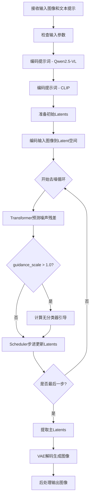
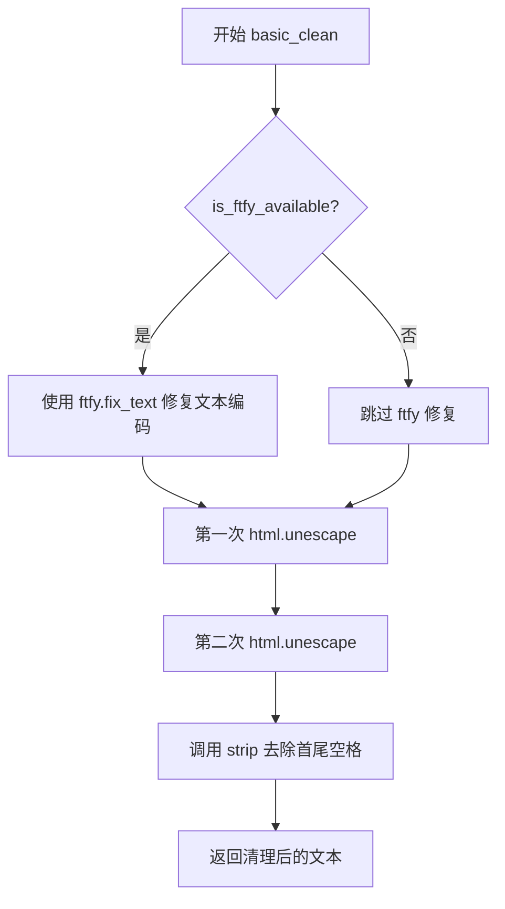
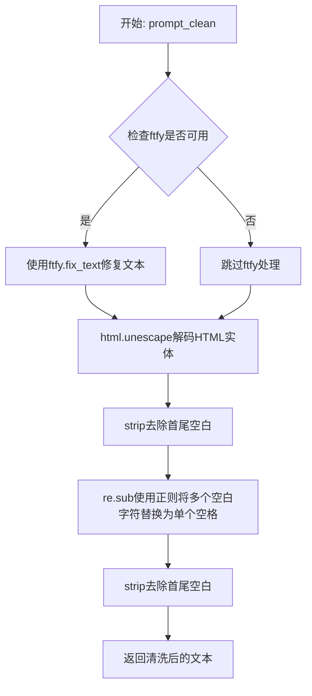
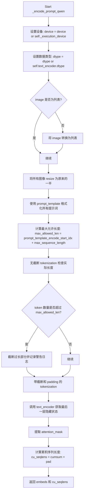
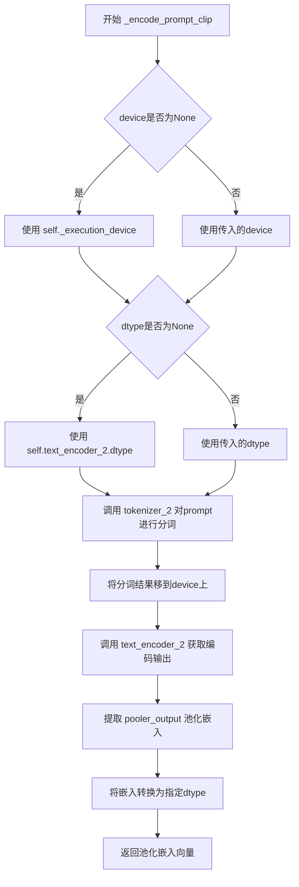
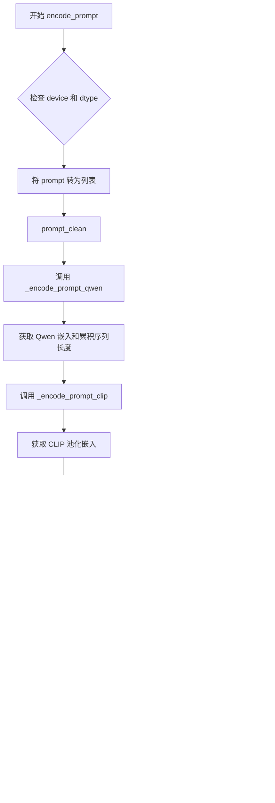
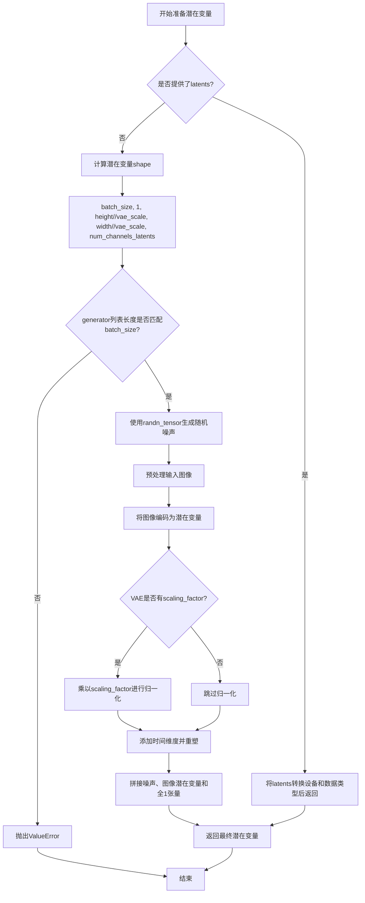

# `diffusers\src\diffusers\pipelines\kandinsky5\pipeline_kandinsky_i2i.py` 详细设计文档

Kandinsky 5.0图像到图像(I2I)生成Pipeline，结合Qwen2.5-VL和CLIP双文本编码器进行文本嵌入，通过FlowMatchEulerDiscreteScheduler调度器和Kandinsky5Transformer3DModel transformer进行潜在空间去噪，最终使用VAE解码生成目标图像。

## 整体流程



## 类结构

```
DiffusionPipeline (基类)
└── Kandinsky5I2IPipeline
    └── KandinskyLoraLoaderMixin (混入类)
```

## 全局变量及字段


### `XLA_AVAILABLE`
    
标志位，指示是否支持Torch XLA加速

类型：`bool`
    


### `logger`
    
模块级日志记录器

类型：`logging.Logger`
    


### `EXAMPLE_DOC_STRING`
    
管道使用示例文档字符串

类型：`str`
    


### `Kandinsky5I2IPipeline.transformer`
    
条件Transformer用于去噪图像潜在向量

类型：`Kandinsky5Transformer3DModel`
    


### `Kandinsky5I2IPipeline.vae`
    
变分自编码器用于编码/解码图像与潜在表示

类型：`AutoencoderKL`
    


### `Kandinsky5I2IPipeline.text_encoder`
    
Qwen2.5-VL文本编码器生成文本嵌入

类型：`Qwen2_5_VLForConditionalGeneration`
    


### `Kandinsky5I2IPipeline.tokenizer`
    
Qwen2.5-VL分词器

类型：`Qwen2VLProcessor`
    


### `Kandinsky5I2IPipeline.text_encoder_2`
    
CLIP文本编码器生成池化嵌入

类型：`CLIPTextModel`
    


### `Kandinsky5I2IPipeline.tokenizer_2`
    
CLIP分词器

类型：`CLIPTokenizer`
    


### `Kandinsky5I2IPipeline.scheduler`
    
Flow Match欧拉离散调度器

类型：`FlowMatchEulerDiscreteScheduler`
    


### `Kandinsky5I2IPipeline.prompt_template`
    
用于Qwen编码的提示词模板

类型：`str`
    


### `Kandinsky5I2IPipeline.prompt_template_encode_start_idx`
    
提示词模板编码起始索引

类型：`int`
    


### `Kandinsky5I2IPipeline.vae_scale_factor_spatial`
    
VAE空间缩放因子

类型：`int`
    


### `Kandinsky5I2IPipeline.image_processor`
    
图像预处理器

类型：`VaeImageProcessor`
    


### `Kandinsky5I2IPipeline.resolutions`
    
支持的图像分辨率列表

类型：`list`
    
    

## 全局函数及方法


### `basic_clean`

该函数用于清理文本，通过使用 ftfy 库修复文本编码问题，并反转义 HTML 实体，最后去除首尾空格。

参数：

-  `text`：`str`，需要清理的原始文本

返回值：`str`，清理后的文本

#### 流程图



#### 带注释源码

```python
def basic_clean(text):
    """
    Copied from https://github.com/huggingface/diffusers/blob/main/src/diffusers/pipelines/wan/pipeline_wan.py

    Clean text using ftfy if available and unescape HTML entities.
    """
    # 检查 ftfy 库是否可用，如果可用则使用它来修复文本编码问题
    # ftfy 可以修复常见的文本编码错误，如 Mojibake（乱码）问题
    if is_ftfy_available():
        text = ftfy.fix_text(text)
    
    # 连续调用两次 html.unescape 以处理嵌套的 HTML 实体
    # 第一次反转义会将如 &amp;lt; 转换为 &lt;
    # 第二次反转义会将 &lt; 转换为 <
    # 这种双重反转义可以确保所有层级的 HTML 实体都被正确解码
    text = html.unescape(html.unescape(text))
    
    # 去除文本首尾的空白字符，包括空格、制表符、换行符等
    return text.strip()
```


### `whitespace_clean`

规范化空白字符，将文本中的多个连续空格替换为单个空格，并去除首尾空白。

参数：

- `text`：`str`，需要规范化的输入文本

返回值：`str`，规范化后的文本

#### 流程图

```mermaid
flowchart TD
    A[开始: 输入文本 text] --> B[正则替换: re.sub\/\s+\/, ' ', text]
    B --> C[去除首尾空白: .strip\(\)]
    C --> D[返回规范化后的文本]
```

#### 带注释源码

```python
def whitespace_clean(text):
    """
    Copied from https://github.com/huggingface/diffusers/blob/main/src/diffusers/pipelines/wan/pipeline_wan.py

    Normalize whitespace in text by replacing multiple spaces with single space.
    """
    # 使用正则表达式将一个或多个空白字符(\s+)替换为单个空格
    text = re.sub(r"\s+", " ", text)
    # 去除文本首尾的空白字符
    text = text.strip()
    # 返回规范化后的文本
    return text
```


### `prompt_clean`

对提示词文本进行组合清洗处理，先进行基本的HTML实体解码和ftfy修复，再进行空白字符规范化。

参数：

-  `text`：`str`，需要清洗的提示词文本

返回值：`str`，清洗处理后的提示词

#### 流程图



#### 带注释源码

```python
def prompt_clean(text):
    """
    Copied from https://github.com/huggingface/diffusers/blob/main/src/diffusers/pipelines/wan/pipeline_wan.py

    Apply both basic cleaning and whitespace normalization to prompts.
    """
    # 1. 先进行基本清洗：HTML实体解码 + 可选的ftfy修复
    # 2. 再进行空白规范化：多个空格合并为单个空格
    text = whitespace_clean(basic_clean(text))
    return text
```


### Kandinsky5I2IPipeline.__init__

Kandinsky5I2IPipeline 类的初始化方法，负责接收并注册图像到图像生成所需的所有核心组件（Transformer、VAE、双文本编码器、分词器和调度器），并初始化图像处理器和预设分辨率列表。

参数：

- `transformer`：`Kandinsky5Transformer3DModel`，条件 Transformer 模型，用于对编码后的图像潜在表示进行去噪
- `vae`：`AutoencoderKL`，变分自编码器模型，用于将图像编码和解码到潜在表示空间
- `text_encoder`：`Qwen2_5_VLForConditionalGeneration`，Qwen2.5-VL 文本编码器模型，用于生成文本嵌入
- `tokenizer`：`Qwen2VLProcessor`，Qwen2.5-VL 的分词器，用于对文本进行分词
- `text_encoder_2`：`CLIPTextModel`，CLIP 文本编码器模型，用于生成池化的语义嵌入
- `tokenizer_2`：`CLIPTokenizer`，CLIP 的分词器，用于对文本进行分词
- `scheduler`：`FlowMatchEulerDiscreteScheduler`，调度器，用于在去噪过程中对编码后的图像潜在表示进行去噪

返回值：`None`，构造函数不返回任何值

#### 流程图

```mermaid
flowchart TD
    A[开始 __init__] --> B[调用 super().__init__]
    B --> C[register_modules 注册所有模型组件]
    C --> D[设置 prompt_template 提示词模板]
    D --> E[设置 prompt_template_encode_start_idx]
    E --> F[设置 vae_scale_factor_spatial]
    F --> G[初始化 VaeImageProcessor]
    G --> H[设置预设 resolutions 列表]
    H --> I[结束 __init__]
```

#### 带注释源码

```python
def __init__(
    self,
    transformer: Kandinsky5Transformer3DModel,
    vae: AutoencoderKL,
    text_encoder: Qwen2_5_VLForConditionalGeneration,
    tokenizer: Qwen2VLProcessor,
    text_encoder_2: CLIPTextModel,
    tokenizer_2: CLIPTokenizer,
    scheduler: FlowMatchEulerDiscreteScheduler,
):
    """
    初始化 Kandinsky5I2IPipeline 管道。
    
    Args:
        transformer: 条件 Transformer，用于图像潜在表示的去噪
        vae: 变分自编码器，用于图像与潜在表示之间的转换
        text_encoder: Qwen2.5-VL 文本编码器
        tokenizer: Qwen2.5-VL 分词器
        text_encoder_2: CLIP 文本编码器
        tokenizer_2: CLIP 分词器
        scheduler: 流匹配欧拉离散调度器
    """
    # 调用父类 DiffusionPipeline 的初始化方法
    super().__init__()
    
    # 注册所有模块组件到管道中，便于保存和加载
    self.register_modules(
        transformer=transformer,
        vae=vae,
        text_encoder=text_encoder,
        tokenizer=tokenizer,
        text_encoder_2=text_encoder_2,
        tokenizer_2=tokenizer_2,
        scheduler=scheduler,
    )
    
    # 定义提示词模板，用于 Qwen2.5-VL 编码
    # 模板格式：系统消息 + 用户消息（含图像占位符）
    self.prompt_template = "<|im_start|>system\nYou are a promt engineer. Based on the provided source image (first image) and target image (second image), create an interesting text prompt that can be used together with the source image to create the target image:<|im_end|><|im_start|>user{}<|vision_start|><|image_pad|><|vision_end|><|im_end|>"
    
    # 提示词模板编码起始索引，用于提取实际提示词嵌入
    self.prompt_template_encode_start_idx = 55
    
    # VAE 空间缩放因子，用于计算潜在空间的尺寸
    self.vae_scale_factor_spatial = 8
    
    # 初始化图像预处理器
    self.image_processor = VaeImageProcessor(vae_scale_factor=self.vae_scale_factor_spatial)
    
    # 预设支持的图像分辨率列表
    # 包含多种宽高比：正方形、竖向长图、横向长图等
    self.resolutions = [(1024, 1024), (640, 1408), (1408, 640), (768, 1280), (1280, 768), (896, 1152), (1152, 896)]
```


### `Kandinsky5I2IPipeline._encode_prompt_qwen`

使用 Qwen2.5-VL 文本编码器对输入提示词进行编码，生成用于图像生成的条件文本嵌入向量。该方法处理包含图像条件信息的提示词，通过 Qwen2.5-VL 模型生成文本嵌入，并计算用于注意力机制的非连续序列长度。

参数：

- `prompt`：`list[str]`，输入的提示词列表
- `image`：`PipelineImageInput | None`，用于条件生成的输入图像列表
- `device`：`torch.device | None`，编码运行的设备
- `max_sequence_length`：`int = 1024`，tokenization 的最大序列长度
- `dtype`：`torch.dtype | None`，嵌入向量的数据类型

返回值：`tuple[torch.Tensor, torch.Tensor]`，包含文本嵌入向量（形状为 [batch_size, seq_len, embed_dim]）和非累积序列长度（用于变长序列的注意力计算）

#### 流程图



#### 带注释源码

```python
def _encode_prompt_qwen(
    self,
    prompt: list[str],
    image: PipelineImageInput | None = None,
    device: torch.device | None = None,
    max_sequence_length: int = 1024,
    dtype: torch.dtype | None = None,
):
    """
    Encode prompt using Qwen2.5-VL text encoder.

    This method processes the input prompt through the Qwen2.5-VL model to generate text embeddings suitable for
    image generation.

    Args:
        prompt list[str]: Input list of prompts
        image (PipelineImageInput): Input list of images to condition the generation on
        device (torch.device): Device to run encoding on
        max_sequence_length (int): Maximum sequence length for tokenization
        dtype (torch.dtype): Data type for embeddings

    Returns:
        tuple[torch.Tensor, torch.Tensor]: Text embeddings and cumulative sequence lengths
    """
    # 如果未指定设备，则使用执行设备
    device = device or self._execution_device
    # 如果未指定数据类型，则使用文本编码器的数据类型
    dtype = dtype or self.text_encoder.dtype
    
    # 确保 image 是列表格式，便于统一处理
    if not isinstance(image, list):
        image = [image]
    
    # 图像尺寸缩小一半（因为 Qwen2.5-VL 内部会进行上采样）
    image = [i.resize((i.size[0] // 2, i.size[1] // 2)) for i in image]
    
    # 使用提示词模板格式化所有提示词
    full_texts = [self.prompt_template.format(p) for p in prompt]
    
    # 计算允许的最大长度：模板前缀长度 + 用户指定的最大序列长度
    max_allowed_len = self.prompt_template_encode_start_idx + max_sequence_length

    # 初步 tokenization（无截断）以检查实际长度是否超限
    untruncated_ids = self.tokenizer(
        text=full_texts,
        images=image,
        videos=None,
        return_tensors="pt",
        padding="longest",
    )["input_ids"]

    # 如果实际 token 数超过允许最大值，需要截断处理
    if untruncated_ids.shape[-1] > max_allowed_len:
        for i, text in enumerate(full_texts):
            tokens = untruncated_ids[i]
            # 计算图像 token 的数量
            num_image_tokens = (tokens == self.tokenizer.image_token_id).sum()
            # 移除图像 token 并截取有效文本部分
            tokens = tokens[tokens != self.tokenizer.image_token_id][self.prompt_template_encode_start_idx : -3]
            # 计算需要截断的文本长度
            removed_text = self.tokenizer.decode(tokens[max_sequence_length - num_image_tokens - 3 :])
            if len(removed_text) > 0:
                # 截断原始提示词
                full_texts[i] = text[: -len(removed_text)]
                # 记录警告日志
                logger.warning(
                    "The following part of your input was truncated because `max_sequence_length` is set to "
                    f" {max_sequence_length} tokens: {removed_text}"
                )

    # 最终 tokenization，带截断和 padding
    inputs = self.tokenizer(
        text=full_texts,
        images=image,
        videos=None,
        max_length=max_allowed_len,
        truncation=True,
        return_tensors="pt",
        padding=True,
    ).to(device)

    # 使用 Qwen2.5-VL 文本编码器获取最后一层隐藏状态
    embeds = self.text_encoder(
        **inputs,
        return_dict=True,
        output_hidden_states=True,
    )["hidden_states"][-1][:, self.prompt_template_encode_start_idx :]

    # 提取注意力掩码，跳过模板前缀部分
    attention_mask = inputs["attention_mask"][:, self.prompt_template_encode_start_idx :]
    # 计算累积序列长度，用于变长序列的稀疏注意力计算
    cu_seqlens = torch.cumsum(attention_mask.sum(1), dim=0)
    # 在前面填充 0，作为序列起始位置
    cu_seqlens = F.pad(cu_seqlens, (1, 0), value=0).to(dtype=torch.int32)

    # 返回文本嵌入和累积序列长度
    return embeds.to(dtype), cu_seqlens
```


### `Kandinsky5I2IPipeline._encode_prompt_clip`

使用CLIP文本编码器对输入提示进行编码，生成池化文本嵌入向量，用于捕获语义信息。

参数：

- `self`：Kandinsky5I2IPipeline实例，Pipeline对象自身
- `prompt`：`str | list[str]`，输入的提示文本或提示文本列表
- `device`：`torch.device | None`，运行编码的设备，默认为None（自动选择执行设备）
- `dtype`：`torch.dtype | None`，嵌入向量的数据类型，默认为None（使用text_encoder_2的数据类型）

返回值：`torch.Tensor`，来自CLIP的池化文本嵌入向量

#### 流程图



#### 带注释源码

```python
def _encode_prompt_clip(
    self,
    prompt: str | list[str],
    device: torch.device | None = None,
    dtype: torch.dtype | None = None,
):
    """
    Encode prompt using CLIP text encoder.

    This method processes the input prompt through the CLIP model to generate pooled embeddings that capture
    semantic information.

    Args:
        prompt (str | list[str]): Input prompt or list of prompts
        device (torch.device): Device to run encoding on
        dtype (torch.dtype): Data type for embeddings

    Returns:
        torch.Tensor: Pooled text embeddings from CLIP
    """
    # 确定执行设备，如果未指定则使用pipeline的默认执行设备
    device = device or self._execution_device
    # 确定数据类型，如果未指定则使用CLIP文本编码器的数据类型
    dtype = dtype or self.text_encoder_2.dtype

    # 使用CLIP tokenizer对prompt进行分词处理
    # max_length=77: CLIP模型的最大序列长度限制
    # truncation=True: 超过最大长度的序列进行截断
    # add_special_tokens=True: 添加特殊tokens（如CLS、SEP等）
    # padding="max_length": 填充到最大长度以保持统一形状
    # return_tensors="pt": 返回PyTorch张量格式
    inputs = self.tokenizer_2(
        prompt,
        max_length=77,
        truncation=True,
        add_special_tokens=True,
        padding="max_length",
        return_tensors="pt",
    ).to(device)

    # 调用CLIP文本编码器模型进行前向传播
    # 返回包含pooler_output的字典，pooler_output是CLIP的池化输出
    pooled_embed = self.text_encoder_2(**inputs)["pooler_output"]

    # 将池化嵌入转换为指定的数据类型并返回
    return pooled_embed.to(dtype)
```


### `Kandinsky5I2IPipeline.encode_prompt`

该方法将单个提示（正面或负面）编码为文本编码器隐藏状态，通过结合 Qwen2.5-VL 和 CLIP 两个文本编码器的嵌入来生成用于图像生成的综合文本表示。

参数：

- `prompt`：`str | list[str]`，要编码的提示文本
- `image`：`torch.Tensor`，用于条件生成的输入图像张量
- `num_images_per_prompt`：`int`，默认为 1，每个提示生成的图像数量
- `max_sequence_length`：`int`，默认为 1024，文本编码的最大序列长度，必须小于 1024
- `device`：`torch.device | None`，可选的 torch 设备
- `dtype`：`torch.dtype | None`，可选的 torch 数据类型

返回值：`tuple[torch.Tensor, torch.Tensor, torch.Tensor]`，包含三个元素：

- Qwen 文本嵌入，形状为 (batch_size * num_images_per_prompt, sequence_length, embedding_dim)
- CLIP 池化嵌入，形状为 (batch_size * num_images_per_prompt, clip_embedding_dim)
- Qwen 嵌入的累积序列长度 (cu_seqlens)，形状为 (batch_size * num_images_per_prompt + 1,)

#### 流程图



#### 带注释源码

```python
def encode_prompt(
    self,
    prompt: str | list[str],
    image: torch.Tensor,
    num_images_per_prompt: int = 1,
    max_sequence_length: int = 1024,
    device: torch.device | None = None,
    dtype: torch.dtype | None = None,
):
    r"""
    Encodes a single prompt (positive or negative) into text encoder hidden states.

    This method combines embeddings from both Qwen2.5-VL and CLIP text encoders to create comprehensive text
    representations for image generation.

    Args:
        prompt (`str` or `list[str]`):
            Prompt to be encoded.
        num_images_per_prompt (`int`, *optional*, defaults to 1):
            Number of images to generate per prompt.
        max_sequence_length (`int`, *optional*, defaults to 1024):
            Maximum sequence length for text encoding. Must be less than 1024
        device (`torch.device`, *optional*):
            Torch device.
        dtype (`torch.dtype`, *optional*):
            Torch dtype.

    Returns:
        tuple[torch.Tensor, torch.Tensor, torch.Tensor]:
            - Qwen text embeddings of shape (batch_size * num_images_per_prompt, sequence_length, embedding_dim)
            - CLIP pooled embeddings of shape (batch_size * num_images_per_prompt, clip_embedding_dim)
            - Cumulative sequence lengths (`cu_seqlens`) for Qwen embeddings of shape (batch_size *
              num_images_per_prompt + 1,)
    """
    # 使用执行设备（如果未指定）
    device = device or self._execution_device
    # 使用文本编码器的 dtype（如果未指定）
    dtype = dtype or self.text_encoder.dtype

    # 如果 prompt 不是列表，转换为列表以支持批量处理
    if not isinstance(prompt, list):
        prompt = [prompt]

    # 获取批处理大小
    batch_size = len(prompt)

    # 对每个 prompt 进行清理：基础清理 + 空白清理
    prompt = [prompt_clean(p) for p in prompt]

    # ===== 使用 Qwen2.5-VL 编码 =====
    # 调用内部方法 _encode_prompt_qwen 获取 Qwen 嵌入和累积序列长度
    prompt_embeds_qwen, prompt_cu_seqlens = self._encode_prompt_qwen(
        prompt=prompt,
        image=image,
        device=device,
        max_sequence_length=max_sequence_length,
        dtype=dtype,
    )
    # prompt_embeds_qwen shape: [batch_size, seq_len, embed_dim]

    # ===== 使用 CLIP 编码 =====
    # 调用内部方法 _encode_prompt_clip 获取 CLIP 池化嵌入
    prompt_embeds_clip = self._encode_prompt_clip(
        prompt=prompt,
        device=device,
        dtype=dtype,
    )
    # prompt_embeds_clip shape: [batch_size, clip_embed_dim]

    # ===== 重复嵌入以匹配 num_images_per_prompt =====
    # 对 Qwen 嵌入：在序列维度重复，然后重塑为 [batch_size * num_images_per_prompt, seq_len, embed_dim]
    prompt_embeds_qwen = prompt_embeds_qwen.repeat(
        1, num_images_per_prompt, 1
    )  # [batch_size, seq_len * num_images_per_prompt, embed_dim]
    # 重塑为 [batch_size * num_images_per_prompt, seq_len, embed_dim]
    prompt_embeds_qwen = prompt_embeds_qwen.view(
        batch_size * num_images_per_prompt, -1, prompt_embeds_qwen.shape[-1]
    )

    # 对 CLIP 嵌入：重复每个嵌入，然后重塑为 [batch_size * num_images_per_prompt, clip_embed_dim]
    prompt_embeds_clip = prompt_embeds_clip.repeat(
        1, num_images_per_prompt, 1
    )  # [batch_size, num_images_per_prompt, clip_embed_dim]
    # 重塑为 [batch_size * num_images_per_prompt, clip_embed_dim]
    prompt_embeds_clip = prompt_embeds_clip.view(batch_size * num_images_per_prompt, -1)

    # ===== 处理累积序列长度 =====
    # 获取每个 prompt 的原始长度
    original_lengths = prompt_cu_seqlens.diff()  # [len1, len2, ...]
    # 为每个图像重复长度
    repeated_lengths = original_lengths.repeat_interleave(
        num_images_per_prompt
    )  # [len1, len1, ..., len2, len2, ...]
    # 重新构建累积序列长度：从 0 开始，加上累积和
    repeated_cu_seqlens = torch.cat(
        [torch.tensor([0], device=device, dtype=torch.int32), repeated_lengths.cumsum(0)]
    )

    # 返回三个嵌入：张量形式的 Qwen 嵌入、CLIP 池化嵌入、累积序列长度
    return prompt_embeds_qwen, prompt_embeds_clip, repeated_cu_seqlens
```


### `Kandinsky5I2IPipeline.check_inputs`

验证并检查图像到图像生成管道的输入参数是否符合要求，包括提示词、图像、尺寸、嵌入向量的一致性等。如果输入无效，该方法将抛出`ValueError`异常。

参数：

- `prompt`：`str | list[str]`，输入提示词，用于指导图像生成
- `negative_prompt`：`str | list[str] | None`，负面提示词，用于避免生成不希望的内容
- `image`：`PipelineImageInput`，输入图像，作为图像到图像生成的条件
- `height`：`int`，生成图像的高度
- `width`：`int`，生成图像的宽度
- `prompt_embeds_qwen`：`torch.Tensor | None`，预计算的Qwen提示词嵌入向量
- `prompt_embeds_clip`：`torch.Tensor | None`，预计算的CLIP提示词嵌入向量
- `negative_prompt_embeds_qwen`：`torch.Tensor | None`，预计算的Qwen负面提示词嵌入向量
- `negative_prompt_embeds_clip`：`torch.Tensor | None`，预计算的CLIP负面提示词嵌入向量
- `prompt_cu_seqlens`：`torch.Tensor | None`，Qwen正面提示词的累积序列长度
- `negative_prompt_cu_seqlens`：`torch.Tensor | None`，Qwen负面提示词的累积序列长度
- `callback_on_step_end_tensor_inputs`：`list[str] | None`，在每个去噪步骤结束时调用的回调张量输入
- `max_sequence_length`：`int | None`，文本编码的最大序列长度

返回值：`None`，该方法不返回任何值，仅通过抛出`ValueError`异常来处理无效输入。

#### 流程图

```mermaid
flowchart TD
    A[开始 check_inputs 验证] --> B{检查 max_sequence_length > 1024?}
    B -->|是| C[抛出 ValueError]
    B -->|否| D{检查 image 是否为 None?}
    D -->|是| C
    D -->|否| E{检查 (width, height) 是否在预定义分辨率中?}
    E -->|否| F[记录警告日志, 提示将调整尺寸]
    E -->|是| G{检查 callback_on_step_end_tensor_inputs 是否有效?}
    F --> G
    G -->|否| C
    G -->|是| H{检查 prompt_embeds 是否全部提供或全部未提供?}
    H -->|否| C
    H -->|是| I{检查 negative_prompt_embeds 是否一致?}
    I -->|否| C
    I -->|是| J{检查 prompt 或 prompt_embeds_qwen 至少提供一个?}
    J -->|否| C
    J -->|是| K{检查 prompt 类型是否有效?}
    K -->|否| C
    K -->|是| L{检查 negative_prompt 类型是否有效?}
    L -->|否| C
    L -->|是| M[验证通过]
    C --> N[结束 - 抛出异常]
    M --> N
```

#### 带注释源码

```python
def check_inputs(
    self,
    prompt,
    negative_prompt,
    image,
    height,
    width,
    prompt_embeds_qwen=None,
    prompt_embeds_clip=None,
    negative_prompt_embeds_qwen=None,
    negative_prompt_embeds_clip=None,
    prompt_cu_seqlens=None,
    negative_prompt_cu_seqlens=None,
    callback_on_step_end_tensor_inputs=None,
    max_sequence_length=None,
):
    """
    Validate input parameters for the pipeline.

    Args:
        prompt: Input prompt
        negative_prompt: Negative prompt for guidance
        image: Input image for conditioning
        height: Image height
        width: Image width
        prompt_embeds_qwen: Pre-computed Qwen prompt embeddings
        prompt_embeds_clip: Pre-computed CLIP prompt embeddings
        negative_prompt_embeds_qwen: Pre-computed Qwen negative prompt embeddings
        negative_prompt_embeds_clip: Pre-computed CLIP negative prompt embeddings
        prompt_cu_seqlens: Pre-computed cumulative sequence lengths for Qwen positive prompt
        negative_prompt_cu_seqlens: Pre-computed cumulative sequence lengths for Qwen negative prompt
        callback_on_step_end_tensor_inputs: Callback tensor inputs

    Raises:
        ValueError: If inputs are invalid
    """

    # 检查最大序列长度是否超过1024
    if max_sequence_length is not None and max_sequence_length > 1024:
        raise ValueError("max_sequence_length must be less than 1024")

    # 检查图像是否为None，图像到图像生成必须有输入图像
    if image is None:
        raise ValueError("`image` must be provided for image-to-image generation")

    # 检查尺寸是否在预定义的分辨率列表中
    if (width, height) not in self.resolutions:
        resolutions_str = ",".join([f"({w},{h})" for w, h in self.resolutions])
        logger.warning(
            f"`height` and `width` have to be one of {resolutions_str}, but are {height} and {width}. Dimensions will be resized accordingly"
        )

    # 检查回调张量输入是否在允许的列表中
    if callback_on_step_end_tensor_inputs is not None and not all(
        k in self._callback_tensor_inputs for k in callback_on_step_end_tensor_inputs
    ):
        raise ValueError(
            f"`callback_on_step_end_tensor_inputs` has to be in {self._callback_tensor_inputs}, but found {[k for k in callback_on_step_end_tensor_inputs if k not in self._callback_tensor_inputs]}"
        )

    # 检查正面提示词嵌入的一致性：要么全部提供，要么全部不提供
    if prompt_embeds_qwen is not None or prompt_embeds_clip is not None or prompt_cu_seqlens is not None:
        if prompt_embeds_qwen is None or prompt_embeds_clip is None or prompt_cu_seqlens is None:
            raise ValueError(
                "If any of `prompt_embeds_qwen`, `prompt_embeds_clip`, or `prompt_cu_seqlens` is provided, "
                "all three must be provided."
            )

    # 检查负面提示词嵌入的一致性：要么全部提供，要么全部不提供
    if (
        negative_prompt_embeds_qwen is not None
        or negative_prompt_embeds_clip is not None
        or negative_prompt_cu_seqlens is not None
    ):
        if (
            negative_prompt_embeds_qwen is None
            or negative_prompt_embeds_clip is None
            or negative_prompt_cu_seqlens is None
        ):
            raise ValueError(
                "If any of `negative_prompt_embeds_qwen`, `negative_prompt_embeds_clip`, or `negative_prompt_cu_seqlens` is provided, "
                "all three must be provided."
            )

    # 检查是否提供了提示词或嵌入向量，至少需要提供一种
    if prompt is None and prompt_embeds_qwen is None:
        raise ValueError(
            "Provide either `prompt` or `prompt_embeds_qwen` (and corresponding `prompt_embeds_clip` and `prompt_cu_seqlens`). Cannot leave all undefined."
        )

    # 验证提示词和负面提示词的类型是否有效
    if prompt is not None and (not isinstance(prompt, str) and not isinstance(prompt, list)):
        raise ValueError(f"`prompt` has to be of type `str` or `list` but is {type(prompt)}")
    if negative_prompt is not None and (
        not isinstance(negative_prompt, str) and not isinstance(negative_prompt, list)
    ):
        raise ValueError(f"`negative_prompt` has to be of type `str` or `list` but is {type(negative_prompt)}")
```


### `Kandinsky5I2IPipeline.prepare_latents`

准备用于图像到图像生成的初始潜在变量。该方法创建随机噪声潜在变量，并将输入图像编码后融入其中，作为第一帧条件信息。

参数：

- `image`：`PipelineImageInput`，输入图像，用于条件生成
- `batch_size`：`int`，要生成的图像数量
- `num_channels_latents`：`int`，潜在空间的通道数（默认为16）
- `height`：`int`，生成图像的高度（默认为1024）
- `width`：`int`，生成图像的宽度（默认为1024）
- `dtype`：`torch.dtype | None`，潜在变量的数据类型
- `device`：`torch.device | None`，创建潜在变量的设备
- `generator`：`torch.Generator | list[torch.Generator] | None`，随机数生成器
- `latents`：`torch.Tensor | None`，预先存在的潜在变量

返回值：`torch.Tensor`，准备好的潜在变量张量，包含编码图像信息

#### 流程图



#### 带注释源码

```python
def prepare_latents(
    self,
    image: PipelineImageInput,          # 输入图像，用于条件生成
    batch_size: int,                     # 批处理大小
    num_channels_latents: int = 16,     # 潜在空间通道数
    height: int = 1024,                  # 生成图像高度
    width: int = 1024,                   # 生成图像宽度
    dtype: torch.dtype | None = None,   # 数据类型
    device: torch.device | None = None, # 设备
    generator: torch.Generator | list[torch.Generator] | None = None, # 随机生成器
    latents: torch.Tensor | None = None,# 预提供潜在变量
) -> torch.Tensor:
    """
    准备初始潜在变量用于图像到图像生成。
    此方法创建带有编码图像的随机噪声潜在变量。
    """
    # 如果已提供latents，直接转换并返回
    if latents is not None:
        return latents.to(device=device, dtype=dtype)

    # 计算潜在变量的形状
    # 形状: [batch_size, 1, height/vae_scale, width/vae_scale, num_channels]
    shape = (
        batch_size,
        1,
        int(height) // self.vae_scale_factor_spatial,
        int(width) // self.vae_scale_factor_spatial,
        num_channels_latents,
    )

    # 验证generator列表长度与batch_size是否匹配
    if isinstance(generator, list) and len(generator) != batch_size:
        raise ValueError(
            f"传入的生成器列表长度为 {len(generator)}，"
            f"但请求的有效批处理大小为 {batch_size}。"
            f"请确保批处理大小与生成器列表长度匹配。"
        )

    # 为所有帧生成随机噪声
    latents = randn_tensor(shape, generator=generator, device=device, dtype=dtype)

    # 编码输入图像作为第一帧
    # 预处理图像
    image_tensor = self.image_processor.preprocess(image, height=height, width=width).to(device, dtype=dtype)
    
    # 使用VAE将图像编码为潜在变量
    with torch.no_grad():
        # 从VAE获取图像潜在变量的分布并采样
        image_latents = self.vae.encode(image_tensor).latent_dist.sample(generator=generator)
        # 添加时间维度 [batch, channels, height, width] -> [batch, 1, channels, height, width]
        image_latents = image_latents.unsqueeze(2)

        # 如果需要，使用scaling_factor归一化潜在变量
        if hasattr(self.vae.config, "scaling_factor"):
            image_latents = image_latents * self.vae.config.scaling_factor

        # 重塑以匹配潜在变量维度 [batch, 1, H, W, C]
        image_latents = image_latents.permute(0, 2, 3, 4, 1)
        
        # 拼接: [噪声, 编码图像, 全1张量(可能是mask)]
        # 最终形状: [batch, 1, H, W, num_channels + 1 + 1]
        latents = torch.cat([latents, image_latents, torch.ones_like(latents[..., :1])], -1)

    return latents
```


### `Kandinsky5I2IPipeline.__call__`

这是 Kandinsky 5.0 I2I（图像到图像）生成管道的主调用方法，实现基于文本提示和输入图像条件的图像生成与转换功能。

参数：

- `image`：`PipelineImageInput`，输入图像，用于条件生成过程
- `prompt`：`str | list[str] | None`，指导图像生成的文本提示
- `negative_prompt`：`str | list[str] | None`，图像生成过程中需要避免的内容
- `height`：`int | None`，生成图像的高度（像素）
- `width`：`int | None`，生成图像的宽度（像素）
- `num_inference_steps`：`int`，去噪步数，默认为 50
- `guidance_scale`：`float`，分类器自由引导的指导尺度，默认为 3.5
- `num_images_per_prompt`：`int | None`，每个提示词生成的图像数量，默认为 1
- `generator`：`torch.Generator | list[torch.Generator] | None`，用于生成确定性结果的随机数生成器
- `latents`：`torch.Tensor | None`，预生成的有噪声潜在向量
- `prompt_embeds_qwen`：`torch.Tensor | None`，预生成的 Qwen 文本嵌入
- `prompt_embeds_clip`：`torch.Tensor | None`，预生成的 CLIP 文本嵌入
- `negative_prompt_embeds_qwen`：`torch.Tensor | None`，预生成的负面 Qwen 文本嵌入
- `negative_prompt_embeds_clip`：`torch.Tensor | None`，预生成的负面 CLIP 文本嵌入
- `prompt_cu_seqlens`：`torch.Tensor | None`，Qwen 正向提示词的累积序列长度
- `negative_prompt_cu_seqlens`：`torch.Tensor | None`，Qwen 负向提示词的累积序列长度
- `output_type`：`str | None`，生成图像的输出格式，默认为 "pil"
- `return_dict`：`bool`，是否返回 `KandinskyImagePipelineOutput`，默认为 True
- `callback_on_step_end`：`Callable | PipelineCallback | MultiPipelineCallbacks | None`，每步去噪结束时的回调函数
- `callback_on_step_end_tensor_inputs`：`list[str]`，回调函数的张量输入列表，默认为 ["latents"]
- `max_sequence_length`：`int`，文本和图像 Qwen 编码的最大序列长度，必须小于 1024

返回值：`KandinskyImagePipelineOutput | tuple`，生成的单张图像或图像列表

#### 流程图

```mermaid
flowchart TD
    A[开始 __call__] --> B{检查回调类型}
    B -->|是 PipelineCallback| C[设置回调张量输入]
    C --> D
    D{检查高度宽度} -->|为空| E[从输入图像获取尺寸]
    D -->|不为空| F
    E --> F
    F[调用 check_inputs 验证输入] --> G[调整分辨率至支持列表]
    G --> H[设置引导尺度和中断标志]
    H --> I{确定批次大小}
    I -->|prompt 是字符串| J[batch_size = 1]
    I -->|prompt 是列表| K[batch_size = len]
    I -->|否则| L[使用 prompt_embeds_qwen.shape[0]]
    J --> M
    K --> M
    L --> M
    M{prompt_embeds_qwen<br/>是否存在?} -->|否| N[调用 encode_prompt 生成嵌入]
    M -->|是| O
    N --> O
    O{guidance_scale > 1.0?} -->|是| P[处理负面提示词]
    O -->|否| Q
    P -->|negative_prompt_embeds_qwen<br/>不存在| R[调用 encode_prompt]
    P -->|存在| Q
    R --> Q
    Q[设置调度器时间步] --> S[准备带图像条件的潜在变量]
    S --> T[准备 RoPE 位置编码]
    T --> U[初始化稀疏参数和动态尺度因子]
    U --> V[开始去噪循环]
    V --> W{检查中断标志}
    W -->|是| Y
    W -->|否| X[重复时间步长]
    X --> Z[调用 transformer 预测噪声残差]
    Z --> AA{guidance_scale > 1.0<br/>且负向嵌入存在?}
    AA -->|是| AB[计算无条件预测]
    AA -->|否| AC
    AB --> AD[应用 classifier-free guidance]
    AD --> AC
    AC --> AE[调度器步进更新潜在变量]
    AE --> AF{回调函数存在?}
    AF -->|是| AG[执行回调处理]
    AG --> AH[更新潜在变量和嵌入]
    AH --> AI
    AF -->|否| AI
    AI --> AJ{是否最后一步<br/>或 warmup 完成?}
    AJ -->|是| AK[更新进度条]
    AK --> AL
    AJ -->|否| AL
    AL --> AM{XLA 可用?}
    AM -->|是| AN[标记执行步骤]
    AN --> AO
    AM -->|否| AO
    AO{循环未结束?} --> V
    AO --> AP[提取主潜在变量]
    AP --> AQ{output_type != 'latent'?}
    AQ -->|是| AR[重塑和归一化潜在变量]
    AQ -->|否| AS[直接使用潜在变量]
    AR --> AT[VAE 解码潜在变量]
    AT --> AU[后处理图像]
    AS --> AV
    AU --> AV
    AV[释放模型钩子] --> AW{return_dict?}
    AW -->|是| AX[返回 KandinskyImagePipelineOutput]
    AW -->|否| AY[返回元组]
    AX --> AZ[结束]
    AY --> AZ
```

#### 带注释源码

```python
@torch.no_grad()
@replace_example_docstring(EXAMPLE_DOC_STRING)
def __call__(
    self,
    image: PipelineImageInput,                          # 输入图像用于条件生成
    prompt: str | list[str] = None,                    # 文本提示词
    negative_prompt: str | list[str] | None = None,    # 负面提示词
    height: int | None = None,                         # 输出图像高度
    width: int | None = None,                          # 输出图像宽度
    num_inference_steps: int = 50,                     # 去噪推理步数
    guidance_scale: float = 3.5,                       # 引导尺度
    num_images_per_prompt: int | None = 1,             # 每个提示生成的图像数
    generator: torch.Generator | list[torch.Generator] | None = None,  # 随机生成器
    latents: torch.Tensor | None = None,               # 预生成潜在变量
    prompt_embeds_qwen: torch.Tensor | None = None,    # Qwen 文本嵌入
    prompt_embeds_clip: torch.Tensor | None = None,    # CLIP 文本嵌入
    negative_prompt_embeds_qwen: torch.Tensor | None = None,  # 负向 Qwen 嵌入
    negative_prompt_embeds_clip: torch.Tensor | None = None,    # 负向 CLIP 嵌入
    prompt_cu_seqlens: torch.Tensor | None = None,      # Qwen 累积序列长度
    negative_prompt_cu_seqlens: torch.Tensor | None = None,      # 负向累积序列长度
    output_type: str | None = "pil",                   # 输出类型
    return_dict: bool = True,                          # 是否返回字典
    callback_on_step_end: Callable | None = None,      # 步骤结束回调
    callback_on_step_end_tensor_inputs: list[str] = ["latents"],  # 回调张量输入
    max_sequence_length: int = 1024,                   # 最大序列长度
):
    # 1. 检查并处理回调函数设置
    if isinstance(callback_on_step_end, (PipelineCallback, MultiPipelineCallbacks)):
        callback_on_step_end_tensor_inputs = callback_on_step_end.tensor_inputs
    
    # 2. 确定输出图像尺寸（若未指定则从输入图像获取）
    if height is None and width is None:
        width, height = image[0].size if isinstance(image, list) else image.size
    
    # 3. 验证输入参数合法性
    self.check_inputs(
        prompt=prompt,
        negative_prompt=negative_prompt,
        image=image,
        height=height,
        width=width,
        prompt_embeds_qwen=prompt_embeds_qwen,
        prompt_embeds_clip=prompt_embeds_clip,
        negative_prompt_embeds_qwen=negative_prompt_embeds_qwen,
        negative_prompt_embeds_clip=negative_prompt_embeds_clip,
        prompt_cu_seqlens=prompt_cu_seqlens,
        negative_prompt_cu_seqlens=negative_prompt_cu_seqlens,
        callback_on_step_end_tensor_inputs=callback_on_step_end_tensor_inputs,
        max_sequence_length=max_sequence_length,
    )
    
    # 4. 调整分辨率至支持列表（按宽高比最近匹配）
    if (width, height) not in self.resolutions:
        width, height = self.resolutions[
            np.argmin([abs((i[0] / i[1]) - (width / height)) for i in self.resolutions])
        ]

    # 5. 设置引导尺度和中断标志
    self._guidance_scale = guidance_scale
    self._interrupt = False

    # 6. 获取执行设备和数据类型
    device = self._execution_device
    dtype = self.transformer.dtype

    # 7. 确定批次大小
    if prompt is not None and isinstance(prompt, str):
        batch_size = 1
        prompt = [prompt]
    elif prompt is not None and isinstance(prompt, list):
        batch_size = len(prompt)
    else:
        batch_size = prompt_embeds_qwen.shape[0]

    # 8. 编码输入提示词（若嵌入未预计算）
    if prompt_embeds_qwen is None:
        prompt_embeds_qwen, prompt_embeds_clip, prompt_cu_seqlens = self.encode_prompt(
            prompt=prompt,
            image=image,
            num_images_per_prompt=num_images_per_prompt,
            max_sequence_length=max_sequence_length,
            device=device,
            dtype=dtype,
        )

    # 9. 编码负向提示词（若使用引导且嵌入未预计算）
    if self.guidance_scale > 1.0:
        if negative_prompt is None:
            negative_prompt = ""

        if isinstance(negative_prompt, str):
            negative_prompt = [negative_prompt] * len(prompt) if prompt is not None else [negative_prompt]
        elif len(negative_prompt) != len(prompt):
            raise ValueError(
                f"`negative_prompt` must have same length as `prompt`. Got {len(negative_prompt)} vs {len(prompt)}."
            )

        if negative_prompt_embeds_qwen is None:
            negative_prompt_embeds_qwen, negative_prompt_embeds_clip, negative_prompt_cu_seqlens = (
                self.encode_prompt(
                    prompt=negative_prompt,
                    image=image,
                    num_images_per_prompt=num_images_per_prompt,
                    max_sequence_length=max_sequence_length,
                    device=device,
                    dtype=dtype,
                )
            )

    # 10. 设置调度器时间步
    self.scheduler.set_timesteps(num_inference_steps, device=device)
    timesteps = self.scheduler.timesteps

    # 11. 准备带图像条件的潜在变量
    num_channels_latents = self.transformer.config.in_visual_dim
    latents = self.prepare_latents(
        image=image,
        batch_size=batch_size * num_images_per_prompt,
        num_channels_latents=num_channels_latents,
        height=height,
        width=width,
        dtype=dtype,
        device=device,
        generator=generator,
        latents=latents,
    )

    # 12. 准备 RoPE 位置编码（视觉和文本）
    visual_rope_pos = [
        torch.arange(1, device=device),  # 时间维度
        torch.arange(height // self.vae_scale_factor_spatial // 2, device=device),  # 高度
        torch.arange(width // self.vae_scale_factor_spatial // 2, device=device),   # 宽度
    ]
    text_rope_pos = torch.arange(prompt_cu_seqlens.diff().max().item(), device=device)
    negative_text_rope_pos = (
        torch.arange(negative_prompt_cu_seqlens.diff().max().item(), device=device)
        if negative_prompt_cu_seqlens is not None
        else None
    )

    # 13. 初始化动态尺度因子
    scale_factor = [1.0, 1.0, 1.0]

    # 14. 初始化稀疏参数（用于高效注意力计算）
    sparse_params = None

    # 15. 去噪循环
    num_warmup_steps = len(timesteps) - num_inference_steps * self.scheduler.order
    self._num_timesteps = len(timesteps)

    with self.progress_bar(total=num_inference_steps) as progress_bar:
        for i, t in enumerate(timesteps):
            # 检查是否中断
            if self.interrupt:
                continue

            # 扩展时间步以匹配批次
            timestep = t.unsqueeze(0).repeat(batch_size * num_images_per_prompt)

            # 调用 Transformer 预测噪声残差/速度
            pred_velocity = self.transformer(
                hidden_states=latents.to(dtype),
                encoder_hidden_states=prompt_embeds_qwen.to(dtype),
                pooled_projections=prompt_embeds_clip.to(dtype),
                timestep=timestep.to(dtype),
                visual_rope_pos=visual_rope_pos,
                text_rope_pos=text_rope_pos,
                scale_factor=scale_factor,
                sparse_params=sparse_params,
                return_dict=True,
            ).sample

            # 应用 Classifier-Free Guidance
            if self.guidance_scale > 1.0 and negative_prompt_embeds_qwen is not None:
                uncond_pred_velocity = self.transformer(
                    hidden_states=latents.to(dtype),
                    encoder_hidden_states=negative_prompt_embeds_qwen.to(dtype),
                    pooled_projections=negative_prompt_embeds_clip.to(dtype),
                    timestep=timestep.to(dtype),
                    visual_rope_pos=visual_rope_pos,
                    text_rope_pos=negative_text_rope_pos,
                    scale_factor=scale_factor,
                    sparse_params=sparse_params,
                    return_dict=True,
                ).sample

                # CFG 公式: uncond + scale * (cond - uncond)
                pred_velocity = uncond_pred_velocity + guidance_scale * (pred_velocity - uncond_pred_velocity)

            # 使用调度器步骤更新潜在变量
            latents[:, :, :, :, :num_channels_latents] = self.scheduler.step(
                pred_velocity[:, :], t, latents[:, :, :, :, :num_channels_latents], return_dict=False
            )[0]

            # 执行回调函数
            if callback_on_step_end is not None:
                callback_kwargs = {}
                for k in callback_on_step_end_tensor_inputs:
                    callback_kwargs[k] = locals()[k]
                callback_outputs = callback_on_step_end(self, i, t, callback_kwargs)

                # 更新可能被回调修改的变量
                latents = callback_outputs.pop("latents", latents)
                prompt_embeds_qwen = callback_outputs.pop("prompt_embeds_qwen", prompt_embeds_qwen)
                prompt_embeds_clip = callback_outputs.pop("prompt_embeds_clip", prompt_embeds_clip)
                negative_prompt_embeds_qwen = callback_outputs.pop(
                    "negative_prompt_embeds_qwen", negative_prompt_embeds_qwen
                )
                negative_prompt_embeds_clip = callback_outputs.pop(
                    "negative_prompt_embeds_clip", negative_prompt_embeds_clip
                )

            # 更新进度条
            if i == len(timesteps) - 1 or ((i + 1) > num_warmup_steps and (i + 1) % self.scheduler.order == 0):
                progress_bar.update()

            # XLA 设备同步
            if XLA_AVAILABLE:
                xm.mark_step()

    # 16. 后处理：提取主潜在变量
    latents = latents[:, :, :, :, :num_channels_latents]

    # 17. 解码潜在变量为图像
    if output_type != "latent":
        latents = latents.to(self.vae.dtype)
        
        # 重塑潜在变量维度 [batch, num_images, channels, 1, height, width]
        latents = latents.reshape(
            batch_size,
            num_images_per_prompt,
            1,
            height // self.vae_scale_factor_spatial,
            width // self.vae_scale_factor_spatial,
            num_channels_latents,
        )
        latents = latents.permute(0, 1, 5, 2, 3, 4)
        latents = latents.reshape(
            batch_size * num_images_per_prompt,
            num_channels_latents,
            height // self.vae_scale_factor_spatial,
            width // self.vae_scale_factor_spatial,
        )

        # 归一化并通过 VAE 解码
        latents = latents / self.vae.config.scaling_factor
        image = self.vae.decode(latents).sample
        image = self.image_processor.postprocess(image, output_type=output_type)
    else:
        image = latents

    # 18. 释放模型钩子（CPU offload）
    self.maybe_free_model_hooks()

    # 19. 返回结果
    if not return_dict:
        return (image,)

    return KandinskyImagePipelineOutput(image=image)
```

## 关键组件


### 双文本编码器系统 (Dual Text Encoder System)

该管道同时使用 Qwen2.5-VL 和 CLIP 两个文本编码器进行互补的文本嵌入生成，Qwen2.5-VL 处理长序列视觉语言理解，CLIP 提供语义池化嵌入，两者结合为图像生成提供更丰富的文本条件信息。

### 图像编码与潜在空间混合 (Image Encoding & Latent Mixing)

在 prepare_latents 方法中，输入图像通过 VAE 编码为图像潜在变量，然后与随机噪声潜在变量在通道维度上拼接 (torch.cat)，实现图像到图像的条件生成，其中图像信息作为第一帧引导去噪过程。

### 潜在变量张量索引与切片 (Latent Tensor Indexing & Slicing)

代码中多处使用精确的张量切片操作：`latents[:, :, :, :, :num_channels_latents]` 用于在去噪循环中提取主潜在变量并更新，`latents.permute` 和 `reshape` 操作用于调整维度顺序以适配 VAE 解码器的输入格式要求。

### 序列长度管理与注意力掩码 (Sequence Length Management)

通过 `cu_seqlens` (累积序列长度) 追踪 Qwen2.5-VL 编码的可变长度序列，配合 `torch.cumsum` 和 `F.pad` 构建注意力掩码，支持变长文本输入的高效处理。

### 提示清理与规范化 (Prompt Cleaning & Normalization)

提供三层文本预处理：basic_clean 使用 ftfy 修复文本并反转义 HTML 实体，whitespace_clean 规范化空白字符，prompt_clean 组合两者确保提示词格式一致。

### 动态分辨率选择与验证 (Dynamic Resolution Selection)

self.resolutions 定义了一组预支持的分辨率列表，check_inputs 验证输入尺寸合法性，不在列表中时通过计算纵横比最近邻选择合适的分辨率进行自动调整。

### 调度器集成与去噪步骤 (Scheduler Integration & Denoising)

使用 FlowMatchEulerDiscreteScheduler 进行离散时间步的去噪调度，通过 scheduler.step() 方法基于预测的速度向量更新潜在变量，实现从噪声到目标图像的转换。

### 分类器自由引导 (Classifier-Free Guidance)

当 guidance_scale > 1.0 时，分别使用正向和负向提示嵌入进行条件预测，通过 `pred_velocity = uncond_pred_velocity + guidance_scale * (pred_velocity - uncond_pred_velocity)` 公式实现引导推理。

### 回调系统与中间状态访问 (Callback System)

支持 PipelineCallback 和 MultiPipelineCallbacks 回调机制，允许在每个去噪步骤结束后访问和修改 latents、prompt_embeds 等中间张量，实现自定义后处理或进度监控。

### 模型 CPU 卸载序列 (Model Offloading Sequence)

model_cpu_offload_seq 定义了 "text_encoder->text_encoder_2->transformer->vae" 的卸载顺序，配合 maybe_free_model_hooks() 在生成完成后释放显存，支持大模型的有限显存运行。

### 图像预处理与后处理 (Image Pre/Post Processing)

通过 VaeImageProcessor 进行图像的预处理（resize、normalize）和后处理（decoded latents 转 PIL/numpy 图像），确保输入输出格式一致性。

### RoPE 位置编码准备 (RoPE Position Encoding)

为视觉和文本模态分别准备 1D RoPE 位置编码：visual_rope_pos 使用图像 latent 的空间维度，text_rope_pos 使用文本序列长度，支持 Transformer 的位置感知注意力计算。


## 问题及建议


### 已知问题

- **硬编码的图像缩放因子**：在 `_encode_prompt_qwen` 方法中，图像被硬编码缩放为 `i.resize((i.size[0] // 2, i.size[1] // 2))`，缺乏灵活性，无法通过参数配置
- **硬编码的模板索引**：`prompt_template_encode_start_idx = 55` 是硬编码值，若模板内容变化会导致索引错误，缺少动态计算机制
- **未使用的变量**：`sparse_params` 被声明和传递但从未实际使用，代码中有 `sparse_params = None` 但 transformer 调用时仍传递该参数
- **重复的 HTML 解码**：`basic_clean` 函数中连续调用两次 `html.unescape`，逻辑不清晰
- **分辨率验证不严格**：`check_inputs` 中对分辨率的检查仅发出警告而非错误，仍会继续执行可能导致非预期结果
- **缺失负向提示的 rope 位置处理**：当 `negative_prompt_cu_seqlens` 为 None 时，`negative_text_rope_pos` 为 None，但 transformer 调用时可能未正确处理该边界情况
- **类型转换冗余**：多处进行 `to(dtype)` 和 `to(device)` 转换，缺乏统一的 dtype 管理

### 优化建议

- 将图像缩放因子、模板索引等硬编码值提取为可配置参数或从模型配置中读取
- 删除或实现 `sparse_params` 功能，避免传递无效参数
- 简化 `basic_clean` 函数，移除重复的 `html.unescape` 调用或添加注释说明原因
- 将分辨率检查从警告改为错误，或提供自动调整机制确保输入有效
- 添加 `negative_text_rope_pos` 的默认值处理逻辑，确保在负向提示缺失时正确运行
- 建立统一的 dtype 管理策略，减少重复的类型转换操作
- 考虑添加类型提示和更多边界情况检查，提升代码健壮性

## 其它


### 设计目标与约束

该Pipeline旨在实现 Kandinsky 5.0 模型的图像到图像(I2I)生成功能。核心约束包括：支持的最大序列长度为1024_token；仅支持预定义的分辨率列表[(1024, 1024), (640, 1408), (1408, 640), (768, 1280), (1280, 768), (896, 1152), (1152, 896)]；必须提供输入图像用于图像条件生成；支持分类器自由引导(CFG)，guidance_scale默认值为3.5；默认50步去噪迭代；仅支持bfloat16和float16等半精度数据类型。

### 错误处理与异常设计

Pipeline通过`check_inputs`方法进行全面的输入验证。关键异常场景包括：`max_sequence_length > 1024`时抛出ValueError；未提供`image`参数时抛出ValueError；`callback_on_step_end_tensor_inputs`包含非法键时抛出ValueError；`prompt_embeds_qwen`、`prompt_embeds_clip`、`prompt_cu_seqlens`三个参数必须同时提供或同时省略；`negative_prompt`长度必须与`prompt`一致；Generator列表长度必须匹配batch_size。XLA设备可用性通过`is_torch_xla_available()`检测，不可用时优雅降级。

### 数据流与状态机

Pipeline执行流程分为以下阶段：**(1)输入验证阶段**：调用`check_inputs`验证所有输入参数；(2)**提示词编码阶段**：使用`_encode_prompt_qwen`处理Qwen2.5-VL编码，`_encode_prompt_clip`处理CLIP编码，生成文本嵌入；(3)**潜在变量准备阶段**：调用`prepare_latents`生成噪声潜在变量，并使用VAE编码输入图像；(4)**去噪循环阶段**：遍历所有timestep，通过Transformer预测噪声残差，应用CFG计算最终速度，使用scheduler更新潜在变量；(5)**后处理阶段**：提取主潜在变量，通过VAE解码生成最终图像。状态管理通过内部属性`_guidance_scale`、`_num_timesteps`、`_interrupt`实现，支持中断控制。

### 外部依赖与接口契约

核心依赖包括：`transformers`库提供Qwen2_5_VLForConditionalGeneration、CLIPTextModel、CLIPTokenizer、Qwen2VLProcessor；`torch`及`torch.nn.functional`提供张量运算；`diffusers`框架提供DiffusionPipeline基类、AutoencoderKL、FlowMatchEulerDiscreteScheduler、VaeImageProcessor；自定义模块包括Kandinsky5Transformer3DModel、KandinskyLoraLoaderMixin。输入接口接受PipelineImageInput类型图像、字符串或列表类型的prompt、torch.Generator用于随机性控制；输出接口返回KandinskyImagePipelineOutput或tuple。

### 性能优化策略

Pipeline采用多级性能优化：**内存优化**：通过`model_cpu_offload_seq = "text_encoder->text_encoder_2->transformer->vae"`定义CPU offload顺序，使用`maybe_free_model_hooks`释放模型钩子；**计算优化**：支持XLA加速(`xm.mark_step()`)，支持稀疏注意力参数`sparse_params`；**精度优化**：默认使用bfloat16精度，支持动态分辨率调整以匹配最接近的预定义分辨率；**预处理优化**：输入图像自动缩放至1/2尺寸以减少token数量。

### 并发与异步处理

Pipeline支持以下并发特性：**(1)多图生成**：通过`num_images_per_prompt`参数支持单prompt生成多张图像；(2)批处理**：支持批量prompt处理，batch_size自动从prompt列表推导；(3)Generator列表**：支持为batch中每个样本提供独立的随机数生成器；(4)回调机制**：`callback_on_step_end`支持在每个去噪步骤结束后执行自定义逻辑，可用于进度跟踪、中断控制、潜在变量修改等；(5)进度条**：使用`progress_bar`提供迭代进度可视化。

### 资源管理与生命周期

资源管理策略包括：**(1)模型加载**：通过`from_pretrained`加载预训练模型，支持torch_dtype指定数据类型；(2)设备分配**：自动使用`_execution_device`执行推理，通过`to(device)`迁移张量；(3)内存释放**：推理完成后调用`maybe_free_model_hooks`释放所有模型钩子；(4)XLA支持**：检测到XLA可用时使用`xm.mark_step()`进行设备同步；(5)上下文管理**：使用`@torch.no_grad()`装饰器禁用梯度计算以节省显存。

### 版本兼容性与平台支持

平台支持考量：**(1)PyTorch版本**：需要支持torch 2.0+特性；(2)XLA支持**：可选支持torch_xla用于TPU加速；(3)CUDA支持**：推荐使用CUDA设备以获得最佳性能；(4)CPU fallback**：基础功能支持CPU推理但性能受限；(5)数据类型**：主要针对bfloat16优化，需确认硬件支持。API稳定性：继承自DiffusionPipeline基类，遵循diffusers库的版本兼容性约定。

### 安全性考虑

安全机制包括：**(1)输入清理**：通过`prompt_clean`、`whitespace_clean`、`basic_clean`函数清理用户输入，防止HTML注入和文本注入；(2)敏感信息处理**：ftfy库自动修复常见文本编码问题；(3)模型offload**：支持安全的模型内存迁移防止数据泄露；(4)梯度禁用**：推理模式强制禁用梯度计算。注意事项：negative_prompt仅在guidance_scale > 1.0时生效；预计算的embeddings需确保来源可信。

### 测试策略建议

应包含以下测试用例：**(1)单元测试**：测试`basic_clean`、`whitespace_clean`、`prompt_clean`文本处理函数；(2)集成测试**：测试完整pipeline从输入到输出的端到端流程；(3)输入验证测试**：测试`check_inputs`方法对各种非法输入的异常抛出；(4)分辨率测试**：测试所有预定义分辨率的支持；(5)批处理测试**：测试不同batch_size和num_images_per_prompt组合；(6)中断测试**：测试pipeline中断功能；(7)回调测试**：测试callback_on_step_end回调机制；(8)性能测试**：测试不同硬件配置下的推理速度和内存占用。

### 配置管理与扩展性

可配置项包括：**(1)模型路径**：通过`from_pretrained`指定；(2)推理参数**：num_inference_steps、guidance_scale、max_sequence_length；(3)输出配置**：output_type支持"pil"、"numpy"、"latent"；(4)设备配置**：通过`to(device)`指定运行设备；(5)数据类型**：通过torch_dtype指定计算精度。扩展性设计：继承KandinskyLoraLoaderMixin支持LoRA微调；通过callback机制支持自定义后处理；预留`sparse_params`接口支持未来注意力优化。

    