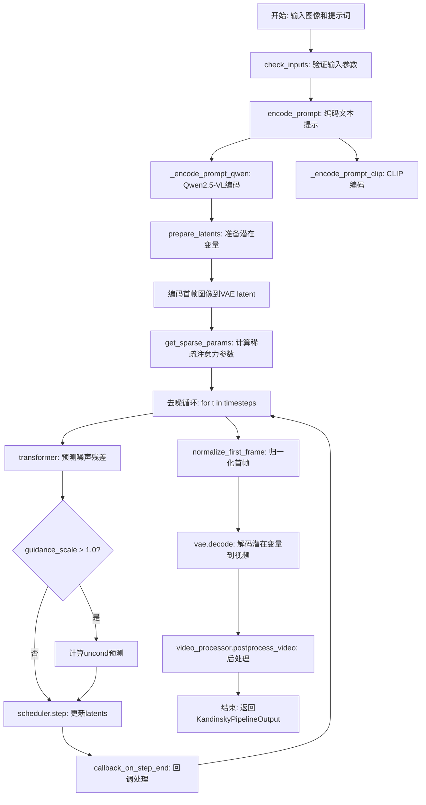
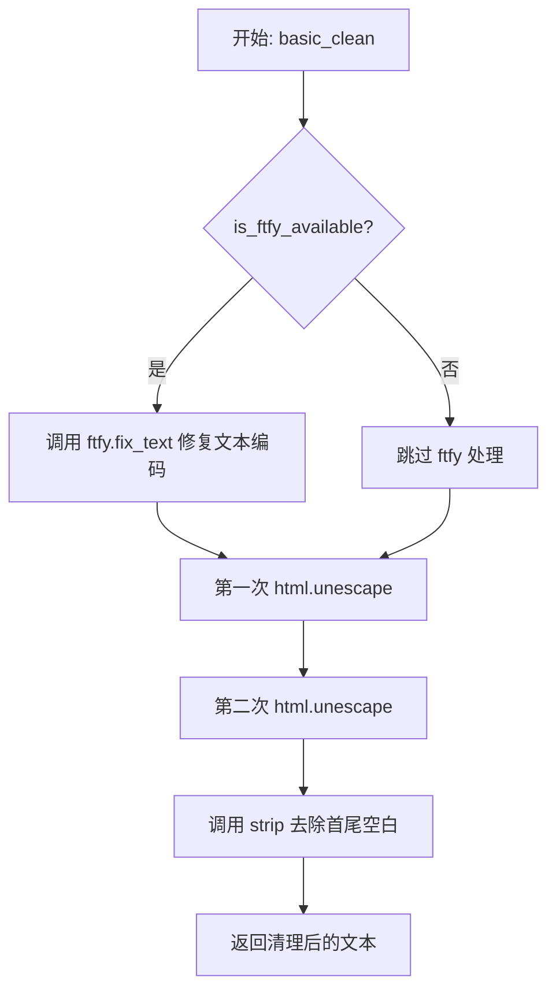
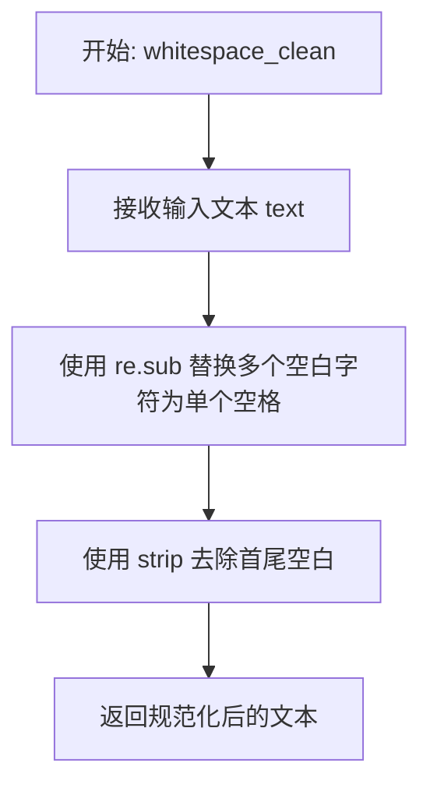
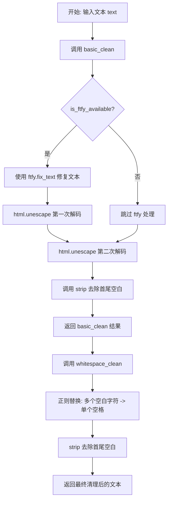
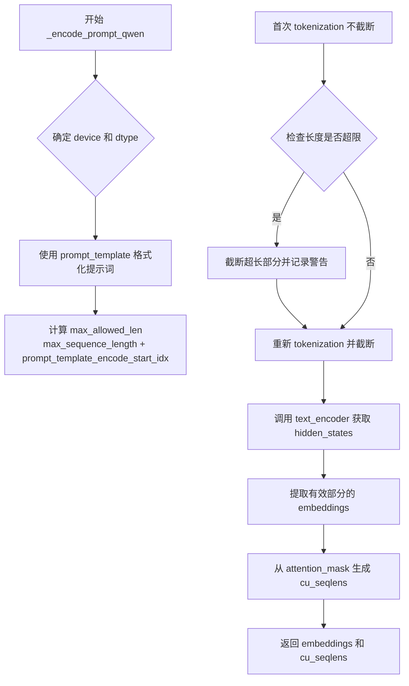
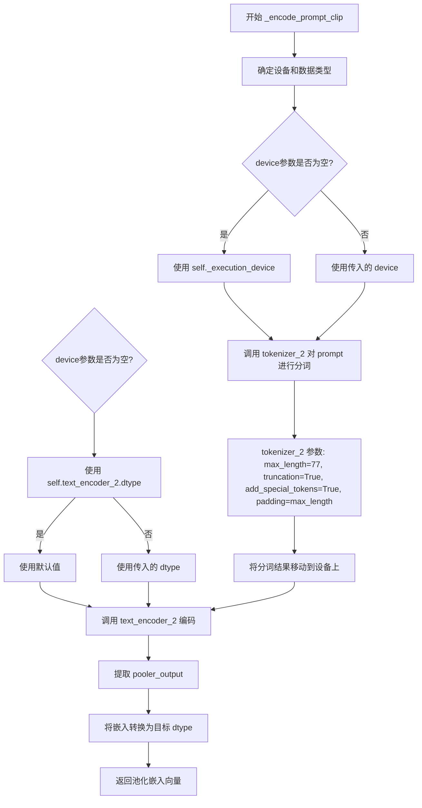
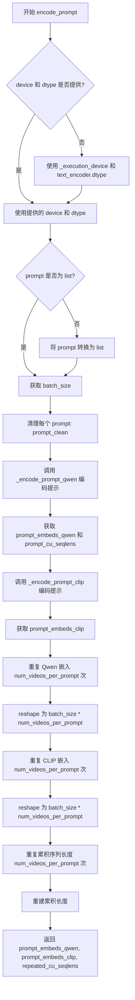
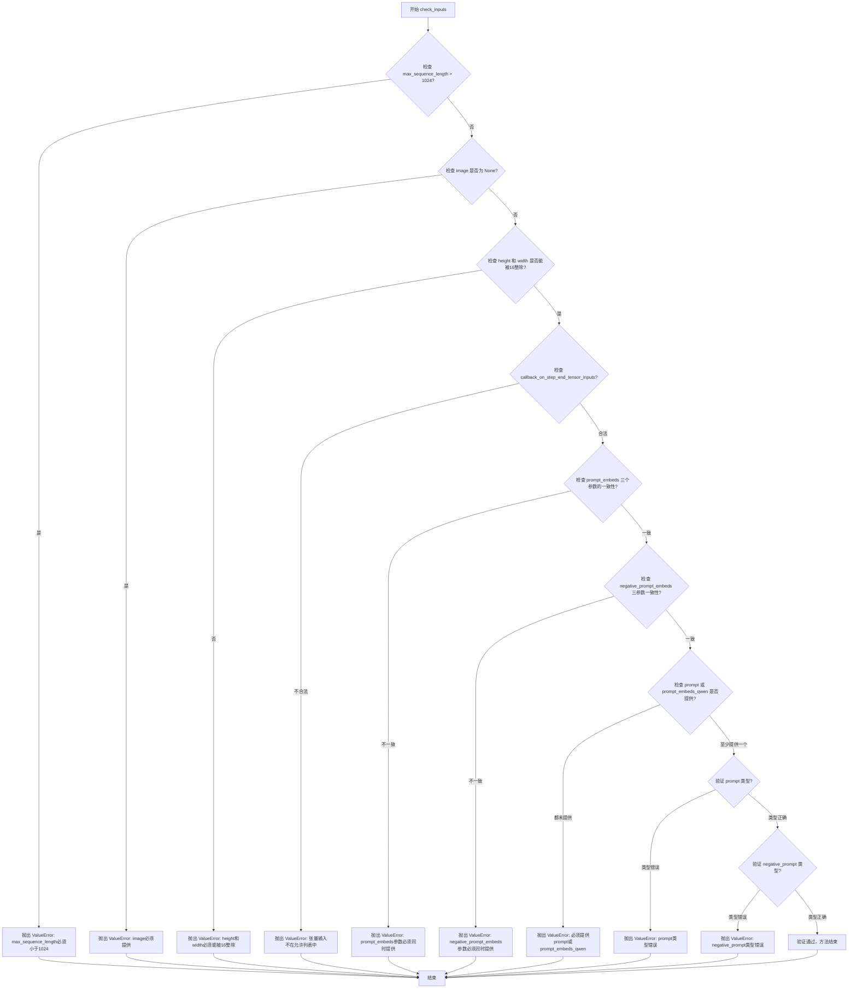
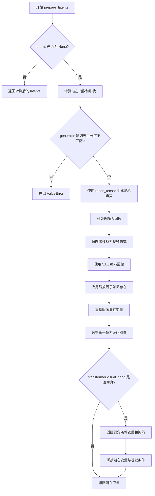

# `diffusers\src\diffusers\pipelines\kandinsky5\pipeline_kandinsky_i2v.py` 详细设计文档

Kandinsky5I2VPipeline是一个基于扩散模型的图像到视频（I2V）生成管道，使用Kandinsky5Transformer3DModel作为去噪Transformer，Qwen2.5-VL和CLIP双文本编码器进行文本嵌入，HunyuanVideo VAE进行视频潜在空间的编码/解码，配合FlowMatchEulerDiscreteScheduler实现视频生成。

## 整体流程



## 类结构

```
DiffusionPipeline (基类)
└── Kandinsky5I2VPipeline
    └── KandinskyLoraLoaderMixin (混入)
```

## 全局变量及字段


### `XLA_AVAILABLE`
    
XLA是否可用

类型：`bool`
    


### `logger`
    
日志记录器

类型：`logging.Logger`
    


### `EXAMPLE_DOC_STRING`
    
示例文档字符串

类型：`str`
    


### `Kandinsky5I2VPipeline.transformer`
    
条件Transformer去噪模型

类型：`Kandinsky5Transformer3DModel`
    


### `Kandinsky5I2VPipeline.vae`
    
VAE编码/解码视频

类型：`AutoencoderKLHunyuanVideo`
    


### `Kandinsky5I2VPipeline.text_encoder`
    
Qwen2.5-VL文本编码器

类型：`Qwen2_5_VLForConditionalGeneration`
    


### `Kandinsky5I2VPipeline.tokenizer`
    
Qwen2.5-VL分词器

类型：`Qwen2VLProcessor`
    


### `Kandinsky5I2VPipeline.text_encoder_2`
    
CLIP文本编码器

类型：`CLIPTextModel`
    


### `Kandinsky5I2VPipeline.tokenizer_2`
    
CLIP分词器

类型：`CLIPTokenizer`
    


### `Kandinsky5I2VPipeline.scheduler`
    
扩散调度器

类型：`FlowMatchEulerDiscreteScheduler`
    


### `Kandinsky5I2VPipeline.prompt_template`
    
提示词模板

类型：`str`
    


### `Kandinsky5I2VPipeline.prompt_template_encode_start_idx`
    
编码起始索引

类型：`int`
    


### `Kandinsky5I2VPipeline.vae_scale_factor_temporal`
    
时间压缩比

类型：`int`
    


### `Kandinsky5I2VPipeline.vae_scale_factor_spatial`
    
空间压缩比

类型：`int`
    


### `Kandinsky5I2VPipeline.video_processor`
    
视频处理器

类型：`VideoProcessor`
    


### `Kandinsky5I2VPipeline.model_cpu_offload_seq`
    
模型卸载顺序

类型：`str`
    


### `Kandinsky5I2VPipeline._callback_tensor_inputs`
    
回调张量输入列表

类型：`list`
    


### `Kandinsky5I2VPipeline._guidance_scale`
    
引导 scale

类型：`float`
    


### `Kandinsky5I2VPipeline._num_timesteps`
    
去噪步数

类型：`int`
    


### `Kandinsky5I2VPipeline._interrupt`
    
中断标志

类型：`bool`
    
    

## 全局函数及方法


### `basic_clean`

该函数是一个文本清理工具函数，用于对输入文本进行基础清洗处理。它首先检查ftfy库是否可用，如果可用则使用ftfy修复文本中的编码问题，然后通过两次HTML实体解码来处理可能存在的HTML转义字符，最后去除文本首尾的空白字符。

参数：

- `text`：`str`，需要进行清理的原始文本

返回值：`str`，清理处理后的文本

#### 流程图



#### 带注释源码

```python
def basic_clean(text):
    """
    Copied from https://github.com/huggingface/diffusers/blob/main/src/diffusers/pipelines/wan/pipeline_wan.py

    Clean text using ftfy if available and unescape HTML entities.
    """
    # 检查ftfy库是否可用（用于修复常见的文本编码问题）
    if is_ftfy_available():
        # 使用ftfy修复文本中的编码错误，如乱码、错误的UTF-8编码等
        text = ftfy.fix_text(text)
    
    # 连续两次调用html.unescape以处理双重编码的HTML实体
    # 例如: "&amp;lt;" 会被还原为 "<"
    text = html.unescape(html.unescape(text))
    
    # 去除文本首尾的空白字符（包括空格、换行、制表符等）
    return text.strip()
```

#### 关键组件信息

| 组件名称 | 一句话描述 |
|---------|-----------|
| `ftfy` | 一个用于修复文本编码问题的Python库，能够自动检测和修复常见的UTF-8编码错误 |
| `html.unescape` | Python标准库函数，用于将HTML实体（如`&amp;`、`&lt;`等）转换为对应字符 |

#### 潜在技术债务或优化空间

1. **双重unescape的必要性存疑**：代码中连续调用两次`html.unescape()`可能是为了处理极端情况的双重编码，但这可能导致正常文本的意外处理，建议添加注释说明具体场景
2. **ftfy依赖为可选**：该函数依赖ftfy库但设计为可选，这种模式虽然提高了兼容性，但可能导致在不同环境下文本处理结果不一致
3. **缺乏输入验证**：函数未对输入进行类型检查，如果传入非字符串类型可能导致运行时错误


### `whitespace_clean`

该函数是一个文本规范化工具函数，用于清理和标准化文本中的空白字符。它通过正则表达式将连续多个空白字符（包括空格、制表符、换行符等）替换为单个空格，并去除文本首尾的空白字符。这是文本预处理流程中的关键步骤，确保输入文本的格式一致性。

参数：

-  `text`：`str`，需要规范化的原始文本

返回值：`str`，规范化后的文本（多个空格合并为单个空格，首尾空白已去除）

#### 流程图



#### 带注释源码

```
def whitespace_clean(text):
    """
    Copied from https://github.com/huggingface/diffusers/blob/main/src/diffusers/pipelines/wan/pipeline_wan.py

    Normalize whitespace in text by replacing multiple spaces with single space.
    """
    # 使用正则表达式 \s+ 匹配一个或多个空白字符（空格、制表符、换行符等）
    # 将其替换为单个空格，实现多个空格合并为单个空格的效果
    text = re.sub(r"\s+", " ", text)
    # 去除文本首尾的空白字符
    text = text.strip()
    # 返回规范化后的文本
    return text
```


### `prompt_clean`

对文本提示进行清理和规范化处理，结合了基础清理（HTML 实体解码和 ftfy 修复）与空白字符规范化功能。

参数：

- `text`：`str`，需要清理和规范化的文本提示

返回值：`str`，清理并规范化后的文本

#### 流程图



#### 带注释源码

```python
def prompt_clean(text):
    """
    Copied from https://github.com/huggingface/diffusers/blob/main/src/diffusers/pipelines/wan/pipeline_wan.py

    Apply both basic cleaning and whitespace normalization to prompts.
    """
    # 首先调用 basic_clean 进行 HTML 实体解码和 ftfy 修复
    # 然后调用 whitespace_clean 进行空白字符规范化
    text = whitespace_clean(basic_clean(text))
    return text
```


### `Kandinsky5I2VPipeline.__init__`

这是 Kandinsky 5.0 图像到视频生成管道的初始化方法，负责接收并注册所有必需的模型组件（Transformer、VAE、文本编码器、分词器、调度器），并初始化提示模板、视频处理器和VAE缩放因子等辅助组件。

参数：

- `transformer`：`Kandinsky5Transformer3DModel`，条件Transformer模型，用于对编码后的视频潜在表示进行去噪
- `vae`：`AutoencoderKLHunyuanVideo`，变分自编码器模型，用于在潜在表示空间中对视频进行编码和解码
- `text_encoder`：`Qwen2_5_VLForConditionalGeneration`，冻结的Qwen2.5-VL文本编码器，用于生成文本嵌入
- `tokenizer`：`Qwen2VLProcessor`，Qwen2.5-VL的分词器
- `text_encoder_2`：`CLIPTextModel`，冻结的CLIP文本编码器（clip-vit-large-patch14变体）
- `tokenizer_2`：`CLIPTokenizer`，CLIP的分词器
- `scheduler`：`FlowMatchEulerDiscreteScheduler`，与transformer配合使用的调度器，用于对视频潜在表示进行去噪

返回值：`None`，构造函数不返回值

#### 流程图

```mermaid
flowchart TD
    A[开始 __init__] --> B[调用 super().__init__ 执行基类初始化]
    B --> C[调用 self.register_modules 注册所有模型组件]
    C --> D[配置 prompt_template 提示模板]
    D --> E[设置 prompt_template_encode_start_idx = 129]
    E --> F[初始化 vae_scale_factor_temporal 时序缩放因子]
    F --> G[初始化 vae_scale_factor_spatial 空间缩放因子]
    G --> H[创建 VideoProcessor 视频处理器]
    H --> I[结束 __init__]
```

#### 带注释源码

```python
def __init__(
    self,
    transformer: Kandinsky5Transformer3DModel,
    vae: AutoencoderKLHunyuanVideo,
    text_encoder: Qwen2_5_VLForConditionalGeneration,
    tokenizer: Qwen2VLProcessor,
    text_encoder_2: CLIPTextModel,
    tokenizer_2: CLIPTokenizer,
    scheduler: FlowMatchEulerDiscreteScheduler,
):
    """
    初始化 Kandinsky5I2VPipeline 管道
    
    参数:
        transformer: Kandinsky5 3D变换器模型
        vae: HunyuanVideo变分自编码器
        text_encoder: Qwen2.5-VL文本编码器
        tokenizer: Qwen2.5-VL处理器
        text_encoder_2: CLIP文本编码器
        tokenizer_2: CLIP分词器
        scheduler: Flow Match Euler离散调度器
    """
    # 1. 调用父类DiffusionPipeline的初始化方法
    super().__init__()
    
    # 2. 注册所有模块到管道中，使其可通过属性访问
    self.register_modules(
        transformer=transformer,
        vae=vae,
        text_encoder=text_encoder,
        tokenizer=tokenizer,
        text_encoder_2=text_encoder_2,
        tokenizer_2=tokenizer_2,
        scheduler=scheduler,
    )
    
    # 3. 配置提示模板，用于引导模型生成详细的视频描述
    self.prompt_template = "\n".join(
        [
            "<|im_start|>system\nYou are a promt engineer. Describe the video in detail.",
            "Describe how the camera moves or shakes, describe the zoom and view angle, whether it follows the objects.",
            "Describe the location of the video, main characters or objects and their action.",
            "Describe the dynamism of the video and presented actions.",
            "Name the visual style of the video: whether it is a professional footage, user generated content, some kind of animation, video game or scren content.",
            "Describe the visual effects, postprocessing and transitions if they are presented in the video.",
            "Pay attention to the order of key actions shown in the scene.<|im_end|>",
            "<|im_start|>user\n{}<|im_end|>",
        ]
    )
    # 4. 设置提示模板编码起始索引，用于跳过系统提示部分
    self.prompt_template_encode_start_idx = 129
    
    # 5. 初始化VAE时序压缩比（从VAE配置中获取）
    self.vae_scale_factor_temporal = (
        self.vae.config.temporal_compression_ratio if getattr(self, "vae", None) else 4
    )
    # 6. 初始化VAE空间压缩比（从VAE配置中获取）
    self.vae_scale_factor_spatial = self.vae.config.spatial_compression_ratio if getattr(self, "vae", None) else 8
    # 7. 创建视频处理器，用于预处理输入图像和后处理输出视频
    self.video_processor = VideoProcessor(vae_scale_factor=self.vae_scale_factor_spatial)
```


### `Kandinsky5I2VPipeline._get_scale_factor`

根据输入的视频分辨率（高度和宽度）计算并返回对应的尺度因子，用于视频生成过程中的空间缩放。

参数：

- `self`：`Kandinsky5I2VPipeline` 类实例，方法所属的管道对象
- `height`：`int`，输入视频的高度（像素值）
- `width`：`int`，输入视频的宽度（像素值）

返回值：`tuple`，返回包含三个浮点值的元组 `(temporal_scale, height_scale, width_scale)`，分别表示时间维度缩放因子、空间高度缩放因子和空间宽度缩放因子。

#### 流程图

```mermaid
flowchart TD
    A[开始 _get_scale_factor] --> B[输入 height 和 width]
    B --> C{height 在 480-854 范围内?}
    C -->|是| D{width 在 480-854 范围内?}
    D -->|是| E[返回 (1, 2, 2)]
    D -->|否| F[返回 (1, 3.16, 3.16)]
    C -->|否| F
    E --> G[结束]
    F --> G
    
    style C fill:#e1f5fe
    style D fill:#e1f5fe
    style E fill:#c8e6c9
    style F fill:#ffccbc
```

#### 带注释源码

```python
def _get_scale_factor(self, height: int, width: int) -> tuple:
    """
    Calculate the scale factor based on resolution.

    Args:
        height (int): Video height
        width (int): Video width

    Returns:
        tuple: Scale factor as (temporal_scale, height_scale, width_scale)
    """
    # 定义内部函数：判断分辨率是否在 480p 范围内
    # 480p 范围定义为 480 到 854 像素（包括常见的 640x480, 720x480, 854x480 等分辨率）
    def between_480p(x):
        return 480 <= x <= 854

    # 判断高度和宽度是否都在 480p 范围内
    if between_480p(height) and between_480p(width):
        # 低分辨率视频：时间维度不缩放，空间维度 2x 缩放
        # 返回 (temporal_scale=1, height_scale=2, width_scale=2)
        return (1, 2, 2)
    else:
        # 高分辨率视频：时间维度不缩放，空间维度约 3.16x 缩放
        # 3.16 ≈ sqrt(10)，是一个经验性的缩放因子
        # 返回 (temporal_scale=1, height_scale=3.16, width_scale=3.16)
        return (1, 3.16, 3.16)
```


### `Kandinsky5I2VPipeline.fast_sta_nabla`

创建一个稀疏时空注意力（Sparse Temporal Attention, STA）掩码，用于高效的视频生成。该方法通过限制注意力在附近帧和空间位置内，有效降低视频生成的计算复杂度。

参数：

-  `T`：`int`，时间帧数量
-  `H`：`int`，潜在空间的高度
-  `W`：`int`，潜在空间的宽度
-  `wT`：`int`，时间注意力窗口大小（默认为3）
-  `wH`：`int`，高度注意力窗口大小（默认为3）
-  `wW`：`int`，宽度注意力窗口大小（默认为3）
-  `device`：`str`，创建张量的设备（默认为"cuda"）

返回值：`torch.Tensor`，形状为 `(T*H*W, T*H*W)` 的稀疏注意力掩码

#### 流程图

```mermaid
flowchart TD
    A[开始] --> B[计算最大值 l = max{T, H, W}]
    B --> C[生成索引向量 r: 0到l-1]
    C --> D[计算距离矩阵 mat = |r - r^T|]
    D --> E[提取各维度距离向量]
    E --> F{sta_t = sta_t <= wT//2}
    F --> G{sta_h = sta_h <= wH//2}
    G --> H{sta_w = sta_w <= wW//2}
    H --> I[计算空间注意力 sta_hw = sta_h * sta_w]
    I --> J[组合时空注意力 sta = sta_t * sta_hw]
    J --> K[reshape为二维矩阵]
    K --> L[返回 (T*H*W, T*H*W) 掩码]
```

#### 带注释源码

```python
@staticmethod
def fast_sta_nabla(T: int, H: int, W: int, wT: int = 3, wH: int = 3, wW: int = 3, device="cuda") -> torch.Tensor:
    """
    Create a sparse temporal attention (STA) mask for efficient video generation.

    This method generates a mask that limits attention to nearby frames and spatial positions, reducing
    computational complexity for video generation.

    Args:
        T (int): Number of temporal frames
        H (int): Height in latent space
        W (int): Width in latent space
        wT (int): Temporal attention window size
        wH (int): Height attention window size
        wW (int): Width attention window size
        device (str): Device to create tensor on

    Returns:
        torch.Tensor: Sparse attention mask of shape (T*H*W, T*H*W)
    """
    # 步骤1: 计算T、H、W中的最大值，用于创建索引范围
    l = torch.Tensor([T, H, W]).amax()
    
    # 步骤2: 创建从0到l-1的索引向量
    r = torch.arange(0, l, 1, dtype=torch.int16, device=device)
    
    # 步骤3: 计算距离矩阵 (l x l)，每个元素表示两个位置的距离
    mat = (r.unsqueeze(1) - r.unsqueeze(0)).abs()
    
    # 步骤4: 提取各维度的距离向量
    # - sta_t: T x T 的时间距离矩阵展平
    # - sta_h: H x H 的高度距离矩阵展平
    # - sta_w: W x W 的宽度距离矩阵展平
    sta_t, sta_h, sta_w = (
        mat[:T, :T].flatten(),    # 时间维度距离
        mat[:H, :H].flatten(),    # 高度维度距离
        mat[:W, :W].flatten(),    # 宽度维度距离
    )
    
    # 步骤5: 应用窗口大小限制，生成布尔掩码
    # 只保留窗口半径内的位置（wT//2 表示单向窗口大小）
    sta_t = sta_t <= wT // 2  # 时间维度窗口
    sta_h = sta_h <= wH // 2  # 高度维度窗口
    sta_w = sta_w <= wW // 2  # 宽度维度窗口
    
    # 步骤6: 计算空间注意力（高度 x 宽度）
    # 将高度和宽度的注意力掩码相乘，得到2D空间注意力
    # 形状变换: (H*H,) * (W*W,) -> (H, H, W, W) -> (H, W, H, W) -> (H*W, H*W)
    sta_hw = (sta_h.unsqueeze(1) * sta_w.unsqueeze(0)).reshape(H, H, W, W).transpose(1, 2).flatten()
    
    # 步骤7: 组合时空注意力
    # 将时间注意力与空间注意力相乘，得到完整的时空注意力掩码
    # 形状变换: (T*T,) * (H*W*H*W,) -> (T, T, H*W, H*W) -> (T, H*W, T, H*W)
    sta = (sta_t.unsqueeze(1) * sta_hw.unsqueeze(0)).reshape(T, T, H * W, H * W).transpose(1, 2)
    
    # 步骤8: 展平为最终的二维掩码矩阵
    # 形状: (T*H*W, T*H*W)
    return sta.reshape(T * H * W, T * H * W)
```


### `Kandinsky5I2VPipeline.get_sparse_params`

生成稀疏注意力参数，用于transformer模型的高效视频处理。该方法根据输入样本的维度计算并返回稀疏注意力配置，包括时空注意力掩码和相关的注意力参数，以优化视频生成过程中的计算效率。

参数：

- `sample`：`torch.Tensor`，输入样本张量，形状为 (B, T, H, W, C)，包含批次大小、时间步、高度、宽度和通道数
- `device`：`torch.device`，设备对象，用于将张量放置到指定设备上（CPU/GPU）

返回值：`Dict`，包含稀疏注意力参数的字典，包括 sta_mask（时空注意力掩码）、attention_type（注意力类型）、to_fractal、窗口大小参数（P、wT、wW、wH）、add_sta、visual_shape 和 method

#### 流程图

```mermaid
flowchart TD
    A[开始 get_sparse_params] --> B{检查 patch_size[0] == 1}
    B -->|是| C[提取样本维度 B, T, H, W]
    C --> D[计算 latent 空间维度 T, H, W]
    D --> E{attention_type == 'nabla'}
    E -->|是| F[调用 fast_sta_nabla 生成时空注意力掩码]
    E -->|否| G[设置 sparse_params = None]
    F --> H[构建 sparse_params 字典]
    H --> I[返回 sparse_params]
    G --> I
    
    F --> F1[输入: T, H//8, W//8, wT, wH, wW, device]
    F1 --> F2[计算最大维度 l]
    F2 --> F3[创建坐标.arange 0到l]
    F3 --> F4[计算距离矩阵 mat = |r.unsqueeze - r.unsqueeze|
    F4 --> F5[分离时空维度: sta_t, sta_h, sta_w]
    F5 --> F6[应用窗口阈值: sta_t <= wT//2, sta_h <= wH//2, sta_w <= wW//2]
    F6 --> F7[组合时空稀疏掩码]
    F7 --> F8[reshape 为 (T*H*W, T*H*W) 返回]
```

#### 带注释源码

```python
def get_sparse_params(self, sample, device):
    """
    Generate sparse attention parameters for the transformer based on sample dimensions.

    This method computes the sparse attention configuration needed for efficient video processing in the
    transformer model.

    Args:
        sample (torch.Tensor): Input sample tensor
        device (torch.device): Device to place tensors on

    Returns:
        Dict: Dictionary containing sparse attention parameters
    """
    # 断言：确保 transformer 的 patch_size[0] 为 1
    # 这是一个硬性约束，方法依赖于时间维度不进行 patch 化
    assert self.transformer.config.patch_size[0] == 1
    
    # 从样本张量中提取维度信息
    # B: batch size, T: temporal frames, H: height, W: width, C: channels
    B, T, H, W, _ = sample.shape
    
    # 计算 latent 空间中的维度
    # 根据 patch_size 将空间和时间维度转换为 latent 表示
    T, H, W = (
        T // self.transformer.config.patch_size[0],   # 时间维度 patch 划分
        H // self.transformer.config.patch_size[1], # 高度维度 patch 划分
        W // self.transformer.config.patch_size[2], # 宽度维度 patch 划分
    )
    
    # 检查是否使用 nabla 类型的注意力机制
    if self.transformer.config.attention_type == "nabla":
        # 生成时空注意力 (STA) 掩码
        # 通过 fast_sta_nabla 方法创建稀疏注意力掩码
        # 将 H 和 W 除以 8 是因为 VAE 的空间压缩比为 8
        sta_mask = self.fast_sta_nabla(
            T,
            H // 8,
            W // 8,
            self.transformer.config.attention_wT,   # 时间注意力窗口大小
            self.transformer.config.attention_wH,   # 高度注意力窗口大小
            self.transformer.config.attention_wW,   # 宽度注意力窗口大小
            device=device,
        )

        # 构建稀疏参数字典，包含注意力机制所需的所有配置
        sparse_params = {
            "sta_mask": sta_mask.unsqueeze_(0).unsqueeze_(0),  # 添加批次和头维度
            "attention_type": self.transformer.config.attention_type,
            "to_fractal": True,                                 # 是否使用分形注意力
            "P": self.transformer.config.attention_P,          # 分形参数 P
            "wT": self.transformer.config.attention_wT,        # 时间窗口
            "wW": self.transformer.config.attention_wW,        # 宽度窗口
            "wH": self.transformer.config.attention_wH,         # 高度窗口
            "add_sta": self.transformer.config.attention_add_sta,  # 是否添加 STA
            "visual_shape": (T, H, W),                          # 视觉形状
            "method": self.transformer.config.attention_method,   # 注意力方法
        }
    else:
        # 如果不是 nabla 类型，设置 sparse_params 为 None
        sparse_params = None

    # 返回稀疏参数字典
    return sparse_params
```


### `Kandinsky5I2VPipeline._encode_prompt_qwen`

使用 Qwen2.5-VL 文本编码器对输入提示词进行编码，生成文本 embeddings 和累积序列长度，供后续视频生成使用。

参数：

- `prompt`：`str | list[str]`，输入的提示词或提示词列表
- `device`：`torch.device | None`，运行编码的设备（默认为执行设备）
- `max_sequence_length`：`int`，tokenization 的最大序列长度（默认为 256）
- `dtype`：`torch.dtype | None`，embeddings 的数据类型（默认为 text_encoder 的数据类型）

返回值：`tuple[torch.Tensor, torch.Tensor]`，第一个是文本 embeddings（形状为 [batch_size, seq_len, embed_dim]），第二个是累积序列长度 cu_seqlens（用于变长序列处理）

#### 流程图



#### 带注释源码

```python
def _encode_prompt_qwen(
    self,
    prompt: str | list[str],
    device: torch.device | None = None,
    max_sequence_length: int = 256,
    dtype: torch.dtype | None = None,
):
    """
    Encode prompt using Qwen2.5-VL text encoder.

    This method processes the input prompt through the Qwen2.5-VL model to generate text embeddings suitable for
    video generation.

    Args:
        prompt (str | list[str]): Input prompt or list of prompts
        device (torch.device): Device to run encoding on
        max_sequence_length (int): Maximum sequence length for tokenization
        dtype (torch.dtype): Data type for embeddings

    Returns:
        tuple[torch.Tensor, torch.Tensor]: Text embeddings and cumulative sequence lengths
    """
    # 确定设备：如果未指定则使用执行设备
    device = device or self._execution_device
    # 确定数据类型：如果未指定则使用 text_encoder 的数据类型
    dtype = dtype or self.text_encoder.dtype

    # 使用预定义的 prompt_template 格式化每个提示词
    # template 包含 system prompt 和 user prompt 结构
    full_texts = [self.prompt_template.format(p) for p in prompt]
    
    # 计算最大允许长度：模板起始索引 + 用户指定的最大序列长度
    # 模板占用的 token 数量需要预留
    max_allowed_len = self.prompt_template_encode_start_idx + max_sequence_length

    # 首次 tokenization：不截断，用于检查长度是否超限
    untruncated_ids = self.tokenizer(
        text=full_texts,
        images=None,
        videos=None,
        return_tensors="pt",
        padding="longest",
    )["input_ids"]

    # 检查 tokenized 后的长度是否超过最大允许长度
    if untruncated_ids.shape[-1] > max_allowed_len:
        # 遍历每个文本，处理超长情况
        for i, text in enumerate(full_texts):
            # 提取用户提示部分的 tokens（排除模板开头和结尾的特殊 token）
            tokens = untruncated_ids[i][self.prompt_template_encode_start_idx : -2]
            # 解码超出限制的部分
            removed_text = self.tokenizer.decode(tokens[max_sequence_length - 2 :])
            # 如果有被截断的文本，则从原文中移除
            if len(removed_text) > 0:
                full_texts[i] = text[: -len(removed_text)]
                # 记录警告日志
                logger.warning(
                    "The following part of your input was truncated because `max_sequence_length` is set to "
                    f" {max_sequence_length} tokens: {removed_text}"
                )
    
    # 最终 tokenization：应用截断策略
    inputs = self.tokenizer(
        text=full_texts,
        images=None,
        videos=None,
        max_length=max_allowed_len,
        truncation=True,
        return_tensors="pt",
        padding=True,
    ).to(device)

    # 调用 Qwen2.5-VL text_encoder 获取 hidden states
    # 使用最后一层的 hidden states 作为输出
    embeds = self.text_encoder(
        input_ids=inputs["input_ids"],
        return_dict=True,
        output_hidden_states=True,
    )["hidden_states"][-1][:, self.prompt_template_encode_start_idx :]

    # 提取有效部分的 attention_mask（排除模板部分）
    attention_mask = inputs["attention_mask"][:, self.prompt_template_encode_start_idx :]
    
    # 计算累积序列长度（cu_seqlens），用于变长序列的 Flash Attention 加速
    # 格式：[0, seq_len1, seq_len1+seq_len2, ...]
    cu_seqlens = torch.cumsum(attention_mask.sum(1), dim=0)
    # 在开头添加 0，便于计算每个序列的起始位置
    cu_seqlens = F.pad(cu_seqlens, (1, 0), value=0).to(dtype=torch.int32)

    # 返回 embeddings 和累积序列长度
    # embeds 形状: [batch_size, seq_len, embed_dim]
    # cu_seqlens 形状: [batch_size + 1]
    return embeds.to(dtype), cu_seqlens
```


### `Kandinsky5I2VPipeline._encode_prompt_clip`

使用 CLIP 文本编码器对输入提示词进行编码，生成池化嵌入向量以捕获语义信息。

参数：

- `prompt`：`str | list[str]`，输入的提示词或提示词列表
- `device`：`torch.device | None`，运行编码的设备，默认为执行设备
- `dtype`：`torch.dtype | None`，嵌入向量的数据类型，默认为 text_encoder_2 的数据类型

返回值：`torch.Tensor`，来自 CLIP 的池化文本嵌入向量

#### 流程图



#### 带注释源码

```python
def _encode_prompt_clip(
    self,
    prompt: str | list[str],
    device: torch.device | None = None,
    dtype: torch.dtype | None = None,
):
    """
    Encode prompt using CLIP text encoder.

    This method processes the input prompt through the CLIP model to generate pooled embeddings that capture
    semantic information.

    Args:
        prompt (str | list[str]): Input prompt or list of prompts
        device (torch.device): Device to run encoding on
        dtype (torch.dtype): Data type for embeddings

    Returns:
        torch.Tensor: Pooled text embeddings from CLIP
    """
    # 确定运行设备：如果未指定，则使用当前执行设备
    device = device or self._execution_device
    # 确定数据类型：如果未指定，则使用 CLIP 文本编码器的数据类型
    dtype = dtype or self.text_encoder_2.dtype

    # 使用 CLIP tokenizer_2 对提示词进行分词
    # 参数说明：
    # - max_length=77: CLIP 模型最大支持 77 个 token
    # - truncation=True: 超过最大长度时截断
    # - add_special_tokens=True: 添加特殊 token（如 <s>, </s> 等）
    # - padding="max_length": 填充到最大长度
    # - return_tensors="pt": 返回 PyTorch 张量
    inputs = self.tokenizer_2(
        prompt,
        max_length=77,
        truncation=True,
        add_special_tokens=True,
        padding="max_length",
        return_tensors="pt",
    ).to(device)

    # 调用 CLIP 文本编码器进行编码
    # 返回包含 pooler_output 的字典
    # pooler_output 是 CLIP 模型输出的池化嵌入，通常用于分类或相似度计算
    pooled_embed = self.text_encoder_2(**inputs)["pooler_output"]

    # 将嵌入向量转换为目标数据类型并返回
    return pooled_embed.to(dtype)
```


### `Kandinsky5I2VPipeline.adaptive_mean_std_normalization`

这是一个静态方法，用于对源张量进行自适应均值和标准差标准化，使其统计特性与参考张量对齐。该方法在视频生成pipeline中用于规范化前几帧的潜在表示，确保首帧与后续帧的分布一致性。

参数：

- `source`：`torch.Tensor`，需要进行标准化处理的源张量（通常为视频的前几帧）
- `reference`：`torch.Tensor`，参考张量（通常为后续帧），用于目标均值和标准差

返回值：`torch.Tensor`，完成自适应标准化后的张量

#### 流程图

```mermaid
flowchart TD
    A[输入 source 和 reference 张量] --> B[计算 source 的均值和标准差]
    B --> C[定义魔数常量: clump_mean_low=0.05, clump_mean_high=0.1, clump_std_low=0.1, clump_std_high=0.25]
    C --> D[计算 reference 均值并限制在 source 均值附近]
    D --> E[计算 reference 标准差并限制在 source 标准差附近]
    E --> F[对 source 进行标准化: normalized = (source - source_mean) / source_std]
    F --> G[应用参考统计量: normalized = normalized * reference_std + reference_mean]
    G --> H[返回标准化后的张量]
```

#### 带注释源码

```python
@staticmethod
def adaptive_mean_std_normalization(source, reference):
    """
    自适应均值标准差标准化方法。
    
    该方法将源张量的分布转换为参考张量的分布，
    同时通过限制变化范围来防止潜在表示发生剧烈变化。
    
    Args:
        source (torch.Tensor): 需要标准化的源张量，通常是视频的前几帧
        reference (torch.Tensor): 参考张量，通常是视频的后续帧
    
    Returns:
        torch.Tensor: 标准化后的张量，其均值和标准差与参考张量相似
    """
    # 计算源张量在维度 (1,2,3,4) 上的均值和标准差
    # 保留 keepdim=True 以便后续广播操作
    source_mean = source.mean(dim=(1, 2, 3, 4), keepdim=True)
    source_std = source.std(dim=(1, 2, 3, 4), keepdim=True)
    
    # 定义魔数常量 - 限制潜在表示的变化幅度
    # 这些值用于确保标准化后的分布不会偏离原始分布太远
    clump_mean_low = 0.05    # 均值变化下限
    clump_mean_high = 0.1   # 均值变化上限
    clump_std_low = 0.1     # 标准差变化下限
    clump_std_high = 0.25   # 标准差变化上限
    
    # 计算参考张量的均值，并限制其在源均值附近
    # 这样可以避免首帧和后续帧的统计特性差异过大
    reference_mean = torch.clamp(
        reference.mean(),  # 计算参考张量的全局均值
        source_mean - clump_mean_low,   # 下限: source_mean - 0.05
        source_mean + clump_mean_high   # 上限: source_mean + 0.1
    )
    
    # 计算参考张量的标准差，并限制其在源标准差附近
    reference_std = torch.clamp(
        reference.std(),  # 计算参考张量的全局标准差
        source_std - clump_std_low,    # 下限: source_std - 0.1
        source_std + clump_std_high    # 上限: source_std + 0.25
    )
    
    # 标准化过程：
    # 1. 首先将源数据标准化到标准正态分布 (均值为0，标准差为1)
    normalized = (source - source_mean) / source_std
    
    # 2. 然后使用参考张量的统计特性进行反标准化
    # 这样可以保持数据尺度的一致性，同时让分布与参考数据对齐
    normalized = normalized * reference_std + reference_mean
    
    return normalized
```


### `Kandinsky5I2VPipeline.normalize_first_frame`

该方法用于在视频生成后处理阶段，对首帧进行自适应均值和标准差归一化，以确保首帧与后续帧的统计特性一致，从而修复网格伪影问题。

参数：

-  `latents`：`torch.Tensor`，输入的潜在变量张量，形状为 (batch_size, num_frames, height, width, channels)
-  `reference_frames`：`int`，参考帧数量，默认为 5，用于确定归一化的参考范围
-  `clump_values`：`bool`，是否对归一化后的值进行裁剪，默认为 False

返回值：`tuple[torch.Tensor, str]`，返回处理后的潜在变量张量及状态描述信息

#### 流程图

```mermaid
flowchart TD
    A[开始 normalize_first_frame] --> B[克隆输入 latents]
    B --> C{samples.shape[1] <= 1?}
    C -->|是| D[返回原 latents 和消息: Only one frame, no normalization needed]
    C -->|否| E[设置 nFr = 4]
    E --> F[提取首帧 first_frames = samples[:, :nFr]]
    F --> G[提取参考帧 reference_frames_data]
    G --> H[调用 adaptive_mean_std_normalization 进行自适应归一化]
    H --> I{clump_values == True?}
    I -->|是| J[对归一化结果进行 torch.clamp 裁剪]
    I -->|否| K[跳过裁剪]
    J --> L[将归一化后的首帧写回 samples[:, :nFr]]
    K --> L
    L --> M[返回处理后的 samples]
```

#### 带注释源码

```
def normalize_first_frame(self, latents, reference_frames=5, clump_values=False):
    """
    对视频首帧进行自适应归一化处理
    
    Args:
        latents: 输入的潜在变量张量
        reference_frames: 参考帧数量，用于确定归一化的统计基准
        clump_values: 是否对归一化后的值进行裁剪限制
    
    Returns:
        处理后的潜在变量张量和状态信息
    """
    # 克隆输入以避免修改原始数据
    latents_copy = latents.clone()
    samples = latents_copy

    # 如果只有一帧或更少，无需归一化
    if samples.shape[1] <= 1:
        return (latents, "Only one frame, no normalization needed")

    # 定义首帧数量（固定为4帧）
    nFr = 4
    # 提取前4帧作为需要归一化的目标
    first_frames = samples.clone()[:, :nFr]
    # 提取第5帧及其后的参考帧数据
    reference_frames_data = samples[:, nFr : nFr + min(reference_frames, samples.shape[1] - 1)]

    # 调用自适应均值标准差归一化方法
    # 该方法将首帧的均值和标准差调整到与参考帧相似的范围
    normalized_first = self.adaptive_mean_std_normalization(first_frames, reference_frames_data)
    
    # 如果启用了值聚类，则将归一化后的值裁剪到参考帧的范围内
    if clump_values:
        min_val = reference_frames_data.min()
        max_val = reference_frames_data.max()
        normalized_first = torch.clamp(normalized_first, min_val, max_val)

    # 将归一化后的首帧数据写回样本
    samples[:, :nFr] = normalized_first

    return samples
```


### `Kandinsky5I2VPipeline.encode_prompt`

该方法将单个提示（正面或负面）编码为文本编码器隐藏状态。它结合了 Qwen2.5-VL 和 CLIP 文本编码器的嵌入，为视频生成创建全面的文本表示。

参数：

- `prompt`：`str | list[str]`，要编码的提示
- `num_videos_per_prompt`：`int`，每个提示生成的视频数量（可选，默认为 1）
- `max_sequence_length`：`int`，文本编码的最大序列长度（可选，默认为 512）
- `device`：`torch.device | None`，torch 设备（可选）
- `dtype`：`torch.dtype | None`，torch 数据类型（可选）

返回值：`tuple[torch.Tensor, torch.Tensor, torch.Tensor]`，返回三个张量：
- Qwen文本嵌入，形状为 (batch_size * num_videos_per_prompt, sequence_length, embedding_dim)
- CLIP池化嵌入，形状为 (batch_size * num_videos_per_prompt, clip_embedding_dim)
- Qwen嵌入的累积序列长度 (cu_seqlens)，形状为 (batch_size * num_videos_per_prompt + 1,)

#### 流程图



#### 带注释源码

```python
def encode_prompt(
    self,
    prompt: str | list[str],
    num_videos_per_prompt: int = 1,
    max_sequence_length: int = 512,
    device: torch.device | None = None,
    dtype: torch.dtype | None = None,
):
    r"""
    Encodes a single prompt (positive or negative) into text encoder hidden states.

    This method combines embeddings from both Qwen2.5-VL and CLIP text encoders to create comprehensive text
    representations for video generation.

    Args:
        prompt (`str` or `list[str]`):
            Prompt to be encoded.
        num_videos_per_prompt (`int`, *optional*, defaults to 1):
            Number of videos to generate per prompt.
        max_sequence_length (`int`, *optional*, defaults to 512):
            Maximum sequence length for text encoding.
        device (`torch.device`, *optional*):
            Torch device.
        dtype (`torch.dtype`, *optional*):
            Torch dtype.

    Returns:
        tuple[torch.Tensor, torch.Tensor, torch.Tensor]:
            - Qwen text embeddings of shape (batch_size * num_videos_per_prompt, sequence_length, embedding_dim)
            - CLIP pooled embeddings of shape (batch_size * num_videos_per_prompt, clip_embedding_dim)
            - Cumulative sequence lengths (`cu_seqlens`) for Qwen embeddings of shape (batch_size *
              num_videos_per_prompt + 1,)
    """
    # 确定设备：如果未提供，则使用执行设备
    device = device or self._execution_device
    # 确定数据类型：如果未提供，则使用文本编码器的数据类型
    dtype = dtype or self.text_encoder.dtype

    # 如果 prompt 不是列表，则转换为列表
    if not isinstance(prompt, list):
        prompt = [prompt]

    # 获取批次大小
    batch_size = len(prompt)

    # 对每个 prompt 进行清理：去除 HTML 实体、规范化空白
    prompt = [prompt_clean(p) for p in prompt]

    # 使用 Qwen2.5-VL 编码提示
    # 返回：文本嵌入和累积序列长度
    prompt_embeds_qwen, prompt_cu_seqlens = self._encode_prompt_qwen(
        prompt=prompt,
        device=device,
        max_sequence_length=max_sequence_length,
        dtype=dtype,
    )
    # prompt_embeds_qwen shape: [batch_size, seq_len, embed_dim]

    # 使用 CLIP 编码提示
    # 返回：池化后的文本嵌入
    prompt_embeds_clip = self._encode_prompt_clip(
        prompt=prompt,
        device=device,
        dtype=dtype,
    )
    # prompt_embeds_clip shape: [batch_size, clip_embed_dim]

    # 为每个视频重复嵌入
    # Qwen 嵌入：先重复序列，然后 reshape
    prompt_embeds_qwen = prompt_embeds_qwen.repeat(
        1, num_videos_per_prompt, 1
    )  # [batch_size, seq_len * num_videos_per_prompt, embed_dim]
    # Reshape 为 [batch_size * num_videos_per_prompt, seq_len, embed_dim]
    prompt_embeds_qwen = prompt_embeds_qwen.view(
        batch_size * num_videos_per_prompt, -1, prompt_embeds_qwen.shape[-1]
    )

    # CLIP 嵌入：为每个视频重复
    prompt_embeds_clip = prompt_embeds_clip.repeat(
        1, num_videos_per_prompt, 1
    )  # [batch_size, num_videos_per_prompt, clip_embed_dim]
    # Reshape 为 [batch_size * num_videos_per_prompt, clip_embed_dim]
    prompt_embeds_clip = prompt_embeds_clip.view(batch_size * num_videos_per_prompt, -1)

    # 重复累积序列长度以适应 num_videos_per_prompt
    # 原始差异（每个 prompt 的长度）
    original_lengths = prompt_cu_seqlens.diff()  # [len1, len2, ...]
    # 为 num_videos_per_prompt 重复长度
    repeated_lengths = original_lengths.repeat_interleave(
        num_videos_per_prompt
    )  # [len1, len1, ..., len2, len2, ...]
    # 重建累积长度
    repeated_cu_seqlens = torch.cat(
        [torch.tensor([0], device=device, dtype=torch.int32), repeated_lengths.cumsum(0)]
    )

    return prompt_embeds_qwen, prompt_embeds_clip, repeated_cu_seqlens
```


### `Kandinsky5I2VPipeline.check_inputs`

该方法用于验证图像转视频管道的输入参数，确保所有必要参数都已正确提供，并且参数之间的逻辑一致性得到保证，防止在后续处理过程中因参数错误而导致程序异常。

参数：

- `prompt`：`str | list[str] | None`，输入提示文本，用于指导视频生成内容
- `negative_prompt`：`str | list[str] | None`，负面提示文本，用于指定需要避免的生成内容
- `image`：`PipelineImageInput | None`，输入图像，作为视频生成的条件参考
- `height`：`int`，生成视频的高度，必须能被16整除
- `width`：`int`，生成视频的宽度，必须能被16整除
- `prompt_embeds_qwen`：`torch.Tensor | None`，预计算的Qwen2.5-VL文本嵌入
- `prompt_embeds_clip`：`torch.Tensor | None`，预计算的CLIP文本嵌入
- `negative_prompt_embeds_qwen`：`torch.Tensor | None`，预计算的Qwen负面提示嵌入
- `negative_prompt_embeds_clip`：`torch.Tensor | None`，预计算的CLIP负面提示嵌入
- `prompt_cu_seqlens`：`torch.Tensor | None`，Qwen正面提示的累积序列长度
- `negative_prompt_cu_seqlens`：`torch.Tensor | None`，Qwen负面提示的累积序列长度
- `callback_on_step_end_tensor_inputs`：`list[str] | None`，回调函数在每步结束时需要处理的张量输入列表
- `max_sequence_length`：`int | None`，文本编码的最大序列长度，不能超过1024

返回值：`None`，该方法不返回任何值，仅通过抛出`ValueError`来指示参数验证失败

#### 流程图



#### 带注释源码

```python
def check_inputs(
    self,
    prompt,
    negative_prompt,
    image,
    height,
    width,
    prompt_embeds_qwen=None,
    prompt_embeds_clip=None,
    negative_prompt_embeds_qwen=None,
    negative_prompt_embeds_clip=None,
    prompt_cu_seqlens=None,
    negative_prompt_cu_seqlens=None,
    callback_on_step_end_tensor_inputs=None,
    max_sequence_length=None,
):
    """
    Validate input parameters for the pipeline.
    
    该方法执行全面的输入验证，确保所有必要的参数都已正确提供，
    并且参数之间的依赖关系保持一致。这是防止运行时错误的重要防线。

    Args:
        prompt: 输入提示文本
        negative_prompt: 负面提示文本
        image: 输入图像用于条件生成
        height: 视频高度
        width: 视频宽度
        prompt_embeds_qwen: 预计算的Qwen提示嵌入
        prompt_embeds_clip: 预计算的CLIP提示嵌入
        negative_prompt_embeds_qwen: 预计算的Qwen负面提示嵌入
        negative_prompt_embeds_clip: 预计算的CLIP负面提示嵌入
        prompt_cu_seqlens: Qwen正面提示的累积序列长度
        negative_prompt_cu_seqlens: Qwen负面提示的累积序列长度
        callback_on_step_end_tensor_inputs: 回调张量输入列表

    Raises:
        ValueError: 如果任何输入无效
    """

    # 检查最大序列长度是否超过限制（1024）
    if max_sequence_length is not None and max_sequence_length > 1024:
        raise ValueError("max_sequence_length must be less than 1024")

    # 检查图像是否提供（图像转视频任务必须提供图像）
    if image is None:
        raise ValueError("`image` must be provided for image-to-video generation")

    # 检查视频尺寸是否满足VAE的压缩要求（必须能被16整除）
    if height % 16 != 0 or width % 16 != 0:
        raise ValueError(f"`height` and `width` have to be divisible by 16 but are {height} and {width}.")

    # 检查回调张量输入是否都在允许的列表中
    if callback_on_step_end_tensor_inputs is not None and not all(
        k in self._callback_tensor_inputs for k in callback_on_step_end_tensor_inputs
    ):
        raise ValueError(
            f"`callback_on_step_end_tensor_inputs` has to be in {self._callback_tensor_inputs}, but found {[k for k in callback_on_step_end_tensor_inputs if k not in self._callback_tensor_inputs]}"
        )

    # 验证正面提示嵌入和序列长度的一致性
    # 如果提供了任何一个嵌入或序列长度参数，必须全部提供
    if prompt_embeds_qwen is not None or prompt_embeds_clip is not None or prompt_cu_seqlens is not None:
        if prompt_embeds_qwen is None or prompt_embeds_clip is None or prompt_cu_seqlens is None:
            raise ValueError(
                "If any of `prompt_embeds_qwen`, `prompt_embeds_clip`, or `prompt_cu_seqlens` is provided, "
                "all three must be provided."
            )

    # 验证负面提示嵌入和序列长度的一致性
    if (
        negative_prompt_embeds_qwen is not None
        or negative_prompt_embeds_clip is not None
        or negative_prompt_cu_seqlens is not None
    ):
        if (
            negative_prompt_embeds_qwen is None
            or negative_prompt_embeds_clip is None
            or negative_prompt_cu_seqlens is None
        ):
            raise ValueError(
                "If any of `negative_prompt_embeds_qwen`, `negative_prompt_embeds_clip`, or `negative_prompt_cu_seqlens` is provided, "
                "all three must be provided."
            )

    # 确保至少提供了提示文本或预计算的嵌入
    if prompt is None and prompt_embeds_qwen is None:
        raise ValueError(
            "Provide either `prompt` or `prompt_embeds_qwen` (and corresponding `prompt_embeds_clip` and `prompt_cu_seqlens`). Cannot leave all undefined."
        )

    # 验证提示文本和负面提示的类型是否正确（必须是str或list）
    if prompt is not None and (not isinstance(prompt, str) and not isinstance(prompt, list)):
        raise ValueError(f"`prompt` has to be of type `str` or `list` but is {type(prompt)}")
    if negative_prompt is not None and (
        not isinstance(negative_prompt, str) and not isinstance(negative_prompt, list)
    ):
        raise ValueError(f"`negative_prompt` has to be of type `str` or `list` but is {type(negative_prompt)}")
```


### `Kandinsky5I2VPipeline.prepare_latents`

准备初始潜在变量用于图像到视频生成。该方法为除第一帧外的所有帧创建随机噪声潜在变量，第一帧则用编码的输入图像替换。如果提供了预先生成的潜在变量，则直接返回转换后的潜在变量。

参数：

- `image`：`PipelineImageInput`，输入图像用于条件生成
- `batch_size`：`int`，要生成的视频数量
- `num_channels_latents`：`int = 16`，潜在空间的通道数
- `height`：`int = 480`，生成视频的高度
- `width`：`int = 832`，生成视频的宽度
- `num_frames`：`int = 81`，视频中的帧数
- `dtype`：`torch.dtype | None`，潜在变量的数据类型
- `device`：`torch.device | None`，创建潜在变量的设备
- `generator`：`torch.Generator | list[torch.Generator] | None`，随机数生成器
- `latents`：`torch.Tensor | None`，要使用的预先生成的潜在变量

返回值：`torch.Tensor`，准备好的潜在变量张量，第一帧为编码图像

#### 流程图



#### 带注释源码

```python
def prepare_latents(
    self,
    image: PipelineImageInput,
    batch_size: int,
    num_channels_latents: int = 16,
    height: int = 480,
    width: int = 832,
    num_frames: int = 81,
    dtype: torch.dtype | None = None,
    device: torch.device | None = None,
    generator: torch.Generator | list[torch.Generator] | None = None,
    latents: torch.Tensor | None = None,
) -> torch.Tensor:
    """
    准备初始潜在变量用于图像到视频生成。

    该方法创建随机噪声潜在变量用于所有帧，除了第一帧被替换为编码的输入图像。

    参数:
        image: 输入图像用于条件生成
        batch_size: 要生成的视频数量
        num_channels_latents: 潜在空间的通道数
        height: 生成视频的高度
        width: 生成视频的宽度
        num_frames: 视频中的帧数
        dtype: 潜在变量的数据类型
        device: 创建潜在变量的设备
        generator: 随机数生成器
        latents: 预存在的潜在变量

    返回:
        准备好的潜在变量张量，第一帧作为编码图像
    """
    # 如果提供了预先生成的潜在变量，直接返回转换后的版本
    if latents is not None:
        return latents.to(device=device, dtype=dtype)

    # 计算潜在帧数：(总帧数 - 1) / 时间压缩比 + 1
    num_latent_frames = (num_frames - 1) // self.vae_scale_factor_temporal + 1
    
    # 定义潜在变量的形状
    # 形状: [batch_size, num_latent_frames, height/空间压缩比, width/空间压缩比, num_channels_latents]
    shape = (
        batch_size,
        num_latent_frames,
        int(height) // self.vae_scale_factor_spatial,
        int(width) // self.vae_scale_factor_spatial,
        num_channels_latents,
    )

    # 验证 generator 列表长度与 batch_size 匹配
    if isinstance(generator, list) and len(generator) != batch_size:
        raise ValueError(
            f"您传递了长度为 {len(generator)} 的生成器列表，但请求的有效批处理大小为 {batch_size}。"
            f"确保批处理大小与生成器列表长度匹配。"
        )

    # 为所有帧生成随机噪声
    latents = randn_tensor(shape, generator=generator, device=device, dtype=dtype)

    # 编码输入图像作为第一帧
    # 预处理图像
    image_tensor = self.video_processor.preprocess(image, height=height, width=width).to(device, dtype=dtype)

    # 使用 VAE 将图像编码为潜在变量
    with torch.no_grad():
        # 将图像转换为视频格式 [batch, channels, 1, height, width]
        image_video = image_tensor.unsqueeze(2)  # 添加时间维度
        # 使用 VAE 编码器生成潜在变量分布并采样
        image_latents = self.vae.encode(image_video).latent_dist.sample(generator=generator)

        # 如果存在缩放因子，则应用它
        if hasattr(self.vae.config, "scaling_factor"):
            image_latents = image_latents * self.vae.config.scaling_factor

        # 重塑以匹配潜在变量维度 [batch, frames, height, width, channels]
        image_latents = image_latents.permute(0, 2, 3, 4, 1)  # [batch, 1, H, W, C]

        # 用编码图像替换第一帧
        latents[:, 0:1] = image_latents

    # 如果 transformer 需要视觉条件
    if self.transformer.visual_cond:
        # 创建用于视觉条件的零张量
        visual_cond = torch.zeros_like(latents)
        # 创建视觉条件掩码（全零，除了第一帧位置为1）
        visual_cond_mask = torch.zeros(
            [
                batch_size,
                num_latent_frames,
                int(height) // self.vae_scale_factor_spatial,
                int(width) // self.vae_scale_factor_spatial,
                1,
            ],
            dtype=latents.dtype,
            device=latents.device,
        )

        # 设置第一帧的掩码和条件
        visual_cond_mask[:, 0:1] = 1
        visual_cond[:, 0:1] = image_latents

        # 拼接潜在变量、视觉条件和掩码
        latents = torch.cat([latents, visual_cond, visual_cond_mask], dim=-1)

    return latents
```


### `Kandinsky5I2VPipeline.__call__`

该方法是 Kandinsky 5.0 图像转视频（I2V）生成管道的主入口函数，接收输入图像和文本提示，通过多步去噪过程生成视频内容。方法内部整合了 Qwen2.5-VL 和 CLIP 双文本编码器、Flow Match 调度器、3D 变压器模型以及 VAE 解码器，完成从图像条件到视频 latents 再到最终视频帧的完整生成流程。

参数：

- `image`：`PipelineImageInput`，用于条件化生成过程的输入图像
- `prompt`：`str | list[str] | None`，引导视频生成的文本提示
- `negative_prompt`：`str | list[str] | None`，生成过程中需要避免的负面提示
- `height`：`int`，生成视频的高度（默认 512 像素）
- `width`：`int`，生成视频的宽度（默认 768 像素）
- `num_frames`：`int`，生成视频的帧数（默认 121 帧）
- `num_inference_steps`：`int`，去噪步数（默认 50 步）
- `guidance_scale`：`float`，无分类器指导的指导比例（默认 5.0）
- `num_videos_per_prompt`：`int | None`，每个提示生成的视频数量（默认 1）
- `generator`：`torch.Generator | list[torch.Generator] | None`，用于确定性生成的随机数生成器
- `latents`：`torch.Tensor | None`，预生成的噪声 latents
- `prompt_embeds_qwen`：`torch.Tensor | None`，预生成的 Qwen 文本嵌入
- `prompt_embeds_clip`：`torch.Tensor | None`，预生成的 CLIP 文本嵌入
- `negative_prompt_embeds_qwen`：`torch.Tensor | None`，预生成的 Qwen 负面文本嵌入
- `negative_prompt_embeds_clip`：`torch.Tensor | None`，预生成的 CLIP 负面文本嵌入
- `prompt_cu_seqlens`：`torch.Tensor | None`，Qwen 正向提示的累积序列长度
- `negative_prompt_cu_seqlens`：`torch.Tensor | None`，Qwen 负面提示的累积序列长度
- `output_type`：`str | None`，生成视频的输出格式（默认 "pil"）
- `return_dict`：`bool`，是否返回 `KandinskyPipelineOutput` 对象（默认 True）
- `callback_on_step_end`：`Callable | PipelineCallback | MultiPipelineCallbacks | None`，每步去噪结束后调用的回调函数
- `callback_on_step_end_tensor_inputs`：`list[str]`，回调函数的张量输入列表
- `max_sequence_length`：`int`，文本编码的最大序列长度（默认 512）

返回值：`KandinskyPipelineOutput` 或 `tuple`，当 `return_dict` 为 True 时返回 `KandinskyPipelineOutput` 对象，否则返回包含生成视频的元组

#### 流程图

```mermaid
flowchart TD
    A[Start __call__] --> B{检查 callback_on_step_end 类型}
    B -->|PipelineCallback/MultiPipelineCallbacks| C[设置 callback_on_step_end_tensor_inputs]
    B --> D[调用 check_inputs 验证输入]
    D --> E[调整 num_frames 确保可被 vae_scale_factor_temporal 整除]
    E --> F[设置 _guidance_scale 和 _interrupt]
    F --> G[获取执行设备和数据类型]
    G --> H{确定 batch_size}
    H -->|prompt 是 str| I[batch_size = 1]
    H -->|prompt 是 list| J[batch_size = len(prompt)]
    H -->|其他| K[batch_size = prompt_embeds_qwen.shape[0]]
    I --> L{检查 prompt_embeds_qwen 是否为 None}
    J --> L
    K --> L
    L -->|是| M[调用 encode_prompt 生成嵌入]
    L -->|否| N[使用预计算的嵌入]
    M --> O{guidance_scale > 1.0?}
    N --> O
    O -->|是| P[设置默认 negative_prompt]
    P --> Q[调用 encode_prompt 生成负面嵌入]
    O -->|否| R[跳过负面提示编码]
    Q --> S[调用 scheduler.set_timesteps 准备时间步]
    R --> S
    S --> T[调用 prepare_latents 准备 latents]
    T --> U[计算 visual_rope_pos 和 text_rope_pos]
    U --> V[调用 _get_scale_factor 计算动态缩放因子]
    V --> W[调用 get_sparse_params 获取稀疏注意力参数]
    W --> X[初始化进度条和去噪循环]
    X --> Y{遍历 timesteps}
    Y -->|未结束| Z[检查 interrupt 标志]
    Z --> AA[复制 timestep 并重复 batch_size 次]
    AA --> AB[调用 transformer 预测噪声残差]
    AB --> AC{guidance_scale > 1.0 且存在负面嵌入?}
    AC -->|是| AD[计算无条件预测并应用 CFG]
    AC -->|否| AE[跳过 CFG 步骤]
    AD --> AE
    AE --> AF[调用 scheduler.step 更新 latents]
    AF --> AG{检查 callback_on_step_end 是否存在?}
    AG -->|是| AH[执行回调函数并更新相关张量]
    AG -->|否| AI[更新进度条]
    AH --> AI
    AI --> AJ{检查 XLA_AVAILABLE?}
    AJ -->|是| AK[调用 xm.mark_step]
    AK --> AL{是否最后一步或满足 warmup 条件}
    AJ -->|否| AL
    AL -->|是| AM[更新进度条]
    AL -->|否| Y
    Y -->|结束| AN[提取主 latents]
    AN --> AO[调用 normalize_first_frame 修复网格伪影]
    AO --> AP{output_type != 'latent'?}
    AP -->|是| AQ[重塑 latents 并通过 VAE 解码]
    AQ --> AR[调用 video_processor 后处理视频]
    AP -->|否| AS[直接返回 latents]
    AR --> AT[调用 maybe_free_model_hooks 卸载模型]
    AS --> AT
    AT --> AU{return_dict == True?}
    AU -->|是| AV[返回 KandinskyPipelineOutput]
    AU -->|否| AX[返回元组 video]
    AV --> AZ[End]
    AX --> AZ
```

#### 带注释源码

```python
@torch.no_grad()
@replace_example_docstring(EXAMPLE_DOC_STRING)
def __call__(
    self,
    image: PipelineImageInput,                              # 输入图像用于条件生成
    prompt: str | list[str] = None,                        # 文本提示引导视频生成
    negative_prompt: str | list[str] | None = None,        # 负面提示避免生成不良内容
    height: int = 512,                                      # 生成视频的高度（像素）
    width: int = 768,                                       # 生成视频的宽度（像素）
    num_frames: int = 121,                                  # 生成视频的帧数
    num_inference_steps: int = 50,                         # 去噪迭代步数
    guidance_scale: float = 5.0,                            # 无分类器指导的指导比例
    num_videos_per_prompt: int | None = 1,                 # 每个提示生成的视频数量
    generator: torch.Generator | list[torch.Generator] | None = None,  # 随机数生成器确保可重复性
    latents: torch.Tensor | None = None,                   # 预生成的噪声 latents
    prompt_embeds_qwen: torch.Tensor | None = None,        # 预计算的 Qwen 文本嵌入
    prompt_embeds_clip: torch.Tensor | None = None,        # 预计算的 CLIP 文本嵌入
    negative_prompt_embeds_qwen: torch.Tensor | None = None,  # 预计算的 Qwen 负面嵌入
    negative_prompt_embeds_clip: torch.Tensor | None = None,  # 预计算的 CLIP 负面嵌入
    prompt_cu_seqlens: torch.Tensor | None = None,         # Qwen 正向提示的累积序列长度
    negative_prompt_cu_seqlens: torch.Tensor | None = None,  # Qwen 负面提示的累积序列长度
    output_type: str | None = "pil",                        # 输出格式（"pil", "latent", "pt"）
    return_dict: bool = True,                               # 是否返回 PipelineOutput 对象
    callback_on_step_end: Callable[[int, int, None], PipelineCallback | MultiPipelineCallbacks] | None = None,  # 每步结束后的回调
    callback_on_step_end_tensor_inputs: list[str] = ["latents"],  # 回调函数的张量输入
    max_sequence_length: int = 512,                        # 文本编码的最大序列长度
):
    # 如果传入的是 PipelineCallback 或 MultiPipelineCallbacks 对象，从中提取 tensor_inputs
    if isinstance(callback_on_step_end, (PipelineCallback, MultiPipelineCallbacks)):
        callback_on_step_end_tensor_inputs = callback_on_step_end.tensor_inputs

    # ===== 步骤 1: 检查输入参数的有效性 =====
    # 验证所有必需的参数都已正确提供，否则抛出 ValueError
    self.check_inputs(
        prompt=prompt,
        negative_prompt=negative_prompt,
        image=image,
        height=height,
        width=width,
        prompt_embeds_qwen=prompt_embeds_qwen,
        prompt_embeds_clip=prompt_embeds_clip,
        negative_prompt_embeds_qwen=negative_prompt_embeds_qwen,
        negative_prompt_embeds_clip=negative_prompt_embeds_clip,
        prompt_cu_seqlens=prompt_cu_seqlens,
        negative_prompt_cu_seqlens=negative_prompt_cu_seqlens,
        callback_on_step_end_tensor_inputs=callback_on_step_end_tensor_inputs,
        max_sequence_length=max_sequence_length,
    )

    # ===== 步骤 2: 调整 num_frames 以适配 VAE 的时序压缩比 =====
    # 确保 (num_frames - 1) 能被 vae_scale_factor_temporal 整除，否则发出警告并调整
    if num_frames % self.vae_scale_factor_temporal != 1:
        logger.warning(
            f"`num_frames - 1` has to be divisible by {self.vae_scale_factor_temporal}. Rounding to the nearest number."
        )
        num_frames = num_frames // self.vae_scale_factor_temporal * self.vae_scale_factor_temporal + 1
    num_frames = max(num_frames, 1)

    # ===== 步骤 3: 设置内部状态 =====
    self._guidance_scale = guidance_scale        # 存储指导比例供属性访问
    self._interrupt = False                       # 初始化中断标志

    device = self._execution_device               # 获取执行设备（CPU/CUDA）
    dtype = self.transformer.dtype                # 获取 transformer 的数据类型

    # ===== 步骤 4: 确定批处理大小 =====
    # 根据 prompt 的类型确定 batch_size
    if prompt is not None and isinstance(prompt, str):
        batch_size = 1
        prompt = [prompt]                         # 转换为列表以统一处理
    elif prompt is not None and isinstance(prompt, list):
        batch_size = len(prompt)
    else:
        # 如果没有 prompt，则必须提供预计算的嵌入
        batch_size = prompt_embeds_qwen.shape[0]

    # ===== 步骤 5: 编码输入提示（正向） =====
    # 如果没有预计算的嵌入，则调用 encode_prompt 生成
    if prompt_embeds_qwen is None:
        prompt_embeds_qwen, prompt_embeds_clip, prompt_cu_seqlens = self.encode_prompt(
            prompt=prompt,
            num_videos_per_prompt=num_videos_per_prompt,
            max_sequence_length=max_sequence_length,
            device=device,
            dtype=dtype,
        )

    # ===== 步骤 6: 编码负面提示（如果使用指导） =====
    # 仅当 guidance_scale > 1.0 时执行 CFG
    if self.guidance_scale > 1.0:
        # 设置默认负面提示（低质量内容的描述）
        if negative_prompt is None:
            negative_prompt = "Static, 2D cartoon, cartoon, 2d animation, paintings, images, worst quality, low quality, ugly, deformed, walking backwards"

        # 确保 negative_prompt 是列表且长度与 prompt 一致
        if isinstance(negative_prompt, str):
            negative_prompt = [negative_prompt] * len(prompt) if prompt is not None else [negative_prompt]
        elif len(negative_prompt) != len(prompt):
            raise ValueError(
                f"`negative_prompt` must have same length as `prompt`. Got {len(negative_prompt)} vs {len(prompt)}."
            )

        # 编码负面提示
        if negative_prompt_embeds_qwen is None:
            negative_prompt_embeds_qwen, negative_prompt_embeds_clip, negative_prompt_cu_seqlens = (
                self.encode_prompt(
                    prompt=negative_prompt,
                    num_videos_per_prompt=num_videos_per_prompt,
                    max_sequence_length=max_sequence_length,
                    device=device,
                    dtype=dtype,
                )
            )

    # ===== 步骤 7: 准备时间步 =====
    # 根据推理步数设置调度器的时间步
    self.scheduler.set_timesteps(num_inference_steps, device=device)
    timesteps = self.scheduler.timesteps

    # ===== 步骤 8: 准备初始 latents =====
    # 创建初始噪声 latents，第一帧由输入图像编码得到
    num_channels_latents = self.transformer.config.in_visual_dim
    latents = self.prepare_latents(
        image=image,
        batch_size=batch_size * num_videos_per_prompt,
        num_channels_latents=num_channels_latents,
        height=height,
        width=width,
        num_frames=num_frames,
        dtype=dtype,
        device=device,
        generator=generator,
        latents=latents,
    )

    # ===== 步骤 9: 准备 RoPE 位置编码 =====
    # 计算视觉和文本的旋转位置编码位置
    num_latent_frames = (num_frames - 1) // self.vae_scale_factor_temporal + 1
    visual_rope_pos = [
        torch.arange(num_latent_frames, device=device),                           # 时序位置
        torch.arange(height // self.vae_scale_factor_spatial // 2, device=device),  # 高度位置
        torch.arange(width // self.vae_scale_factor_spatial // 2, device=device),    # 宽度位置
    ]

    text_rope_pos = torch.arange(prompt_cu_seqlens.diff().max().item(), device=device)  # 文本位置

    # 负面提示的文本位置（如果存在）
    negative_text_rope_pos = (
        torch.arange(negative_prompt_cu_seqlens.diff().max().item(), device=device)
        if negative_prompt_cu_seqlens is not None
        else None
    )

    # ===== 步骤 10: 计算动态缩放因子 =====
    # 根据分辨率动态调整缩放因子
    scale_factor = self._get_scale_factor(height, width)

    # ===== 步骤 11: 获取稀疏注意力参数 =====
    # 为高效的视频生成计算稀疏注意力配置
    sparse_params = self.get_sparse_params(latents, device)

    # ===== 步骤 12: 去噪主循环 =====
    num_warmup_steps = len(timesteps) - num_inference_steps * self.scheduler.order
    self._num_timesteps = len(timesteps)

    with self.progress_bar(total=num_inference_steps) as progress_bar:
        for i, t in enumerate(timesteps):
            # 检查是否被中断，如果是则跳过当前步
            if self.interrupt:
                continue

            # 复制 timestep 以匹配批处理大小
            timestep = t.unsqueeze(0).repeat(batch_size * num_videos_per_prompt)

            # ===== 步骤 12a: 预测噪声残差 =====
            # 使用 transformer 模型预测速度（噪声残差）
            pred_velocity = self.transformer(
                hidden_states=latents.to(dtype),
                encoder_hidden_states=prompt_embeds_qwen.to(dtype),
                pooled_projections=prompt_embeds_clip.to(dtype),
                timestep=timestep.to(dtype),
                visual_rope_pos=visual_rope_pos,
                text_rope_pos=text_rope_pos,
                scale_factor=scale_factor,
                sparse_params=sparse_params,
                return_dict=True,
            ).sample

            # ===== 步骤 12b: 应用无分类器指导（CFG） =====
            # 如果使用指导，计算无条件预测并合并
            if self.guidance_scale > 1.0 and negative_prompt_embeds_qwen is not None:
                uncond_pred_velocity = self.transformer(
                    hidden_states=latents.to(dtype),
                    encoder_hidden_states=negative_prompt_embeds_qwen.to(dtype),
                    pooled_projections=negative_prompt_embeds_clip.to(dtype),
                    timestep=timestep.to(dtype),
                    visual_rope_pos=visual_rope_pos,
                    text_rope_pos=negative_text_rope_pos,
                    scale_factor=scale_factor,
                    sparse_params=sparse_params,
                    return_dict=True,
                ).sample

                # 应用 CFG 公式: pred = uncond + guidance_scale * (cond - uncond)
                pred_velocity = uncond_pred_velocity + guidance_scale * (pred_velocity - uncond_pred_velocity)

            # ===== 步骤 12c: 更新 latents =====
            # 使用调度器根据预测的速度更新 latents（跳过第一帧）
            latents[:, 1:, :, :, :num_channels_latents] = self.scheduler.step(
                pred_velocity[:, 1:], t, latents[:, 1:, :, :, :num_channels_latents], return_dict=False
            )[0]

            # ===== 步骤 12d: 执行回调函数 =====
            if callback_on_step_end is not None:
                callback_kwargs = {}
                for k in callback_on_step_end_tensor_inputs:
                    callback_kwargs[k] = locals()[k]
                callback_outputs = callback_on_step_end(self, i, t, callback_kwargs)

                # 更新回调返回的张量
                latents = callback_outputs.pop("latents", latents)
                prompt_embeds_qwen = callback_outputs.pop("prompt_embeds_qwen", prompt_embeds_qwen)
                prompt_embeds_clip = callback_outputs.pop("prompt_embeds_clip", prompt_embeds_clip)
                negative_prompt_embeds_qwen = callback_outputs.pop(
                    "negative_prompt_embeds_qwen", negative_prompt_embeds_qwen
                )
                negative_prompt_embeds_clip = callback_outputs.pop(
                    "negative_prompt_embeds_clip", negative_prompt_embeds_clip
                )

            # ===== 步骤 12e: 更新进度条 =====
            if i == len(timesteps) - 1 or ((i + 1) > num_warmup_steps and (i + 1) % self.scheduler.order == 0):
                progress_bar.update()

            # ===== 步骤 12f: XLA 设备同步 =====
            if XLA_AVAILABLE:
                xm.mark_step()

    # ===== 步骤 13: 后处理 - 提取主 latents =====
    # 移除之前可能添加的额外通道（如 visual_cond）
    latents = latents[:, :, :, :, :num_channels_latents]

    # ===== 步骤 14: 修复网格伪影 =====
    # 规范化第一帧以减少时间不一致性
    latents = self.normalize_first_frame(latents)

    # ===== 步骤 15: 解码 latents 到视频 =====
    if output_type != "latent":
        latents = latents.to(self.vae.dtype)
        
        # 重塑 latents 形状以适配 VAE 解码器
        video = latents.reshape(
            batch_size,
            num_videos_per_prompt,
            (num_frames - 1) // self.vae_scale_factor_temporal + 1,
            height // self.vae_scale_factor_spatial,
            width // self.vae_scale_factor_spatial,
            num_channels_latents,
        )
        # 调整维度顺序: [batch, videos, channels, frames, height, width]
        video = video.permute(0, 1, 5, 2, 3, 4)
        video = video.reshape(
            batch_size * num_videos_per_prompt,
            num_channels_latents,
            (num_frames - 1) // self.vae_scale_factor_temporal + 1,
            height // self.vae_scale_factor_spatial,
            width // self.vae_scale_factor_spatial,
        )

        # 归一化并通过 VAE 解码
        video = video / self.vae.config.scaling_factor
        video = self.vae.decode(video).sample
        # 后处理视频为指定的输出格式
        video = self.video_processor.postprocess_video(video, output_type=output_type)
    else:
        # 如果 output_type 是 "latent"，直接返回 latents
        video = latents

    # ===== 步骤 16: 卸载模型 =====
    # 释放模型钩子以节省显存
    self.maybe_free_model_hooks()

    # ===== 步骤 17: 返回结果 =====
    if not return_dict:
        return (video,)

    return KandinskyPipelineOutput(frames=video)
```

## 关键组件


### 张量索引与惰性加载

该管道在 `prepare_latents` 方法中使用条件索引将第一帧替换为编码后的图像，同时为后续帧生成随机噪声。在 `__call__` 方法的去噪循环中，通过 `latents[:, 1:, :, :, :num_channels_latents]` 索引跳过第一帧的更新，实现条件帧的保持。使用 `torch.no_grad()` 上下文管理器进行 VAE 编码时的惰性计算，避免不必要的梯度计算。

### 反量化支持

管道通过 `dtype` 参数支持多种精度，包括 `bfloat16`、`float16` 等。在 `prepare_latents` 中使用 `latents.to(device=device, dtype=dtype)` 进行类型转换。在 VAE 解码前使用 `video = video / self.vae.config.scaling_factor` 进行潜在变量的反缩放归一化。

### 稀疏注意力机制

管道实现了高效的稀疏时间注意力（Sparse Temporal Attention, STA）机制。`fast_sta_nabla` 方法生成限制在局部时间窗口和空间窗口内的注意力掩码，显著降低视频生成时的计算复杂度。`get_sparse_params` 方法根据输入样本维度动态生成稀疏注意力参数，包含 STA 掩码、注意力类型、分形配置等。

### 自适应归一化

管道实现了针对视频首帧的自适应均值标准差归一化。`adaptive_mean_std_normalization` 方法通过限制参考帧与源帧之间的均值和标准差变化范围，防止潜在变量发生剧烈变化。`normalize_first_frame` 方法将此归一化应用于前几帧，并在需要时进行值裁剪，避免网格伪影。

### 双文本编码器融合

管道采用 Qwen2.5-VL 和 CLIP 双文本编码器架构。Qwen2.5-VL 提供长序列文本嵌入，CLIP 提供语义池化嵌入。两种嵌入在去噪过程中分别作为 `encoder_hidden_states` 和 `pooled_projections` 输入到 Transformer，支持分类器-free 引导。

### 视频 VAE 编码解码

管道使用 HunyuanVideo VAE (`AutoencoderKLHunyuanVideo`) 进行视频与潜在表示之间的转换。编码时将图像扩展到视频格式 `(batch, channels, 1, height, width)`，解码时将潜在变量重塑为完整的视频张量形状。

## 问题及建议


### 已知问题

- **重复代码**：`logger = logging.get_logger(__name__)` 在模块级别出现了两次（第45行和第51行），应该只保留一次。
- **硬编码的 Magic Numbers**：多处使用硬编码的数值缺乏解释，如 `prompt_template_encode_start_idx = 129`、`nFr = 4`、归一化常量 `clump_mean_low = 0.05` 等，这些值应该提取为配置参数或类常量。
- **类型提示不完整**：代码中使用了 `str | list[str]` 这种现代类型注解，但未从 `typing` 导入必要的类型，且部分方法的参数类型声明缺失（如 `get_sparse_params` 中的 `device` 参数）。
- **异常处理不足**：`prepare_latents` 方法中调用 `self.vae.encode()` 时没有错误处理和资源管理；`get_sparse_params` 使用 `assert` 进行条件检查，生产环境中可能被优化掉。
- **不必要的内存操作**：`normalize_first_frame` 方法中对 `latents` 进行了不必要的 `clone()` 操作（在函数开始和内部），增加了内存开销。
- **属性初始化不明确**：`self._guidance_scale`、`self._num_timesteps`、`self._interrupt` 等属性在 `__call__` 中被直接赋值，但未在类中明确初始化，依赖父类实现，容易造成理解困难。
- **Transformer 配置访问缺乏防御**：`self.transformer.visual_cond`、`self.transformer.config.attention_type` 等配置项直接访问，没有默认值或 fallback 逻辑，可能导致运行时错误。

### 优化建议

- 移除重复的 `logger` 定义，将所有魔法常数提取为类属性或配置类。
- 为 `get_sparse_params` 添加完整的类型注解，并使用 `if...else` 替代 `assert` 进行配置检查。
- 优化 `normalize_first_frame`，避免不必要的 clone 操作，考虑在原地操作或使用视图。
- 在 `__init__` 方法中显式初始化所有使用的实例属性，提供默认值以提高代码可读性。
- 对 VAE 编码等外部调用添加 try-except 错误处理，提升管道健壮性。
- 考虑添加配置类或 dataclass 来管理视频生成参数（如帧数缩放因子、注意力窗口大小等），避免散落的硬编码值。

## 其它


### 设计目标与约束

**设计目标**：
- 实现基于 Kandinsky 5.0 模型库的图像到视频（I2V）生成 pipeline
- 支持从单张输入图像生成连续的视频内容
- 提供高效的视频生成推理能力，支持多帧视频输出

**设计约束**：
- 输入图像尺寸必须能被16整除（height % 16 == 0, width % 16 == 0）
- max_sequence_length 最大值为1024
- num_frames - 1 必须能被 vae_scale_factor_temporal 整除
- 仅支持 CUDA 和 CPU 设备，XLA 设备为可选支持

### 错误处理与异常设计

**输入验证错误**：
- 图像为空时抛出 ValueError("`image` must be provided for image-to-video generation")
- 尺寸不符合16的倍数时抛出 ValueError("`height` and `width` have to be divisible by 16")
- max_sequence_length 超过1024时抛出 ValueError("max_sequence_length must be less than 1024")
- callback_on_step_end_tensor_inputs 不在允许列表中时抛出 ValueError

**类型检查错误**：
- prompt 类型必须为 str 或 list，否则抛出 ValueError
- negative_prompt 类型必须为 str 或 list，否则抛出 ValueError
- embeddings 和 cu_seqlens 必须同时提供，否则抛出 ValueError

**一致性检查**：
- negative_prompt 长度必须与 prompt 长度一致
- generator 列表长度必须与 batch_size 一致

### 数据流与状态机

**主数据流**：
1. 输入图像预处理 → VAE 编码为第一帧 latent
2. 文本提示编码 → Qwen2.5-VL + CLIP 双编码器
3. 随机噪声生成 → 填充除第一帧外的所有帧 latent
4. 视觉条件注入 → concat(noise, visual_cond, mask)
5. 迭代去噪 → transformer 预测 velocity → scheduler.step 更新 latents
6. 后处理 → 第一帧归一化修复 mesh artifacts
7. VAE 解码 → latent 转换为最终视频

**状态机转换**：
- IDLE → ENCODING_PROMPT → PREPARING_LATENTS → DENOISING → DECODING → COMPLETED
- 中断信号 interrupt=True 可在任何去噪步骤后终止

### 外部依赖与接口契约

**核心依赖模型**：
- Kandinsky5Transformer3DModel：条件 transformer 去噪
- AutoencoderKLHunyuanVideo：VAE 编解码
- Qwen2_5_VLForConditionalGeneration：Qwen 文本编码器
- CLIPTextModel：CLIP 文本编码器
- FlowMatchEulerDiscreteScheduler：流匹配调度器

**外部工具库**：
- transformers：模型加载与推理
- torch：核心计算
- regex：文本正则处理
- ftfy（可选）：文本修复
- torch_xla（可选）：XLA 加速

**接口契约**：
- PipelineImageInput：支持 Image、PIL Image、Tensor、List 类型
- 输出格式：output_type 可选 "pil"/"latent"/"np"
- 返回值：KandinskyPipelineOutput.frames 或 tuple

### 性能考量

**计算优化**：
- 使用稀疏时序注意力（STA）mask 降低注意力计算复杂度
- 模型 CPU 卸载序列：text_encoder→text_encoder_2→transformer→vae
- XLA 设备支持加速（is_torch_xla_available）
- 混合精度推理：支持 bfloat16/float16

**内存优化**：
- VAE 分片处理视频帧
- 梯度禁用（@torch.no_grad()）贯穿整个推理流程
- 可能的情况下释放模型钩子（maybe_free_model_hooks）

**批处理支持**：
- num_videos_per_prompt 支持单提示生成多视频
- generator 列表支持批量独立随机种子

### 安全性考虑

**输入安全**：
- prompt 清理：ftfy 修复 + HTML unescape + whitespace 规范化
- 模板注入保护：prompt_template 固定格式，用户输入仅填充占位符

**模型安全**：
- 默认 negative_prompt 引导避免生成不良内容
- guidance_scale 控制生成内容与 prompt 一致性

### 配置与参数说明

**关键配置参数**：
- vae_scale_factor_temporal：时间压缩比（默认4）
- vae_scale_factor_spatial：空间压缩比（默认8）
- prompt_template_encode_start_idx：模板编码起始位置（129）
- model_cpu_offload_seq：模型卸载顺序

**调度器参数**：
- num_inference_steps：去噪步数（默认50）
- guidance_scale：分类器自由引导比例（默认5.0）

### 使用示例与测试用例

**基础用法**：
```python
pipe = Kandinsky5I2VPipeline.from_pretrained("kandinskylab/Kandinsky-5.0-I2V-Pro-sft-5s-Diffusers", torch_dtype=torch.bfloat16)
pipe = pipe.to("cuda")
image = load_image("astronaut.jpg")
output = pipe(image=image, prompt="astronaut floating in space", num_frames=121)
export_to_video(output.frames[0], "output.mp4")
```

**高级用法**：
- 自定义 negative_prompt 控制生成质量
- 预计算 embeddings 加速批量推理
- callback_on_step_end 监控中间结果

### 版本兼容性

**依赖版本要求**：
- transformers：支持 Qwen2.5-VL 模型
- diffusers：需包含 Kandinsky5Transformer3DModel 和 AutoencoderKLHunyuanVideo
- torch：需支持 bfloat16 运算

**兼容性检查**：
- is_ftfy_available() 检查 ftfy 可用性
- is_torch_xla_available() 检查 XLA 可用性

### 资源管理与内存优化

**GPU 内存管理**：
- 模型按序 offload：text_encoder → text_encoder_2 → transformer → vae
- 中间张量及时释放
- 梯度检查点禁用

**显存峰值控制**：
- 预处理和后处理使用单独设备转移
- 大型中间结果分片处理
- latent 形状优化避免不必要复制

### 并发与异步处理

**XLA 并发支持**：
- xm.mark_step() 在每个去噪步骤后执行
- 支持 TPU 加速推理

**回调机制**：
- callback_on_step_end 支持自定义每步回调
- 支持 MultiPipelineCallbacks 多回调链
- 支持自定义 tensor_inputs 传递

### 监控与日志

**日志级别**：
- logger.warning：参数截断警告、帧数调整警告
- logger.info：pipeline 状态信息

**进度条**：
- progress_bar 跟踪去噪进度
- 支持 warmup steps 计算

### 部署与运维

**模型加载**：
- from_pretrained 支持分布式加载
- torch_dtype 控制精度（bfloat16/float16）

**推理服务**：
- 支持 pipeline.save_pretrained() 保存
- 支持自定义 scheduler 替换
- 支持 LoRA 微调加载（KandinskyLoraLoaderMixin）

    