# `diffusers\src\diffusers\pipelines\kandinsky5\pipeline_kandinsky_t2i.py` 详细设计文档

Kandinsky5T2IPipeline是一个基于Diffusion模型的文本到图像生成Pipeline，结合Qwen2.5-VL和CLIP双文本编码器生成高质量图像，支持多种分辨率和可配置的扩散参数。

## 整体流程

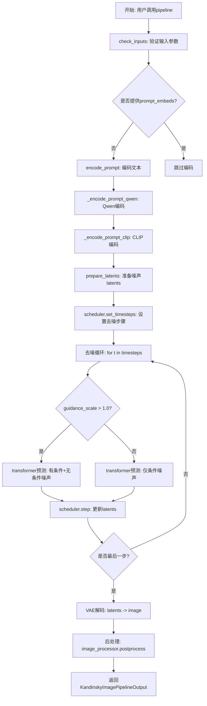

## 类结构

```
DiffusionPipeline (基类)
└── Kandinsky5T2IPipeline
    └── KandinskyLoraLoaderMixin
```

## 全局变量及字段


### `XLA_AVAILABLE`
    
XLA是否可用标志

类型：`bool`
    


### `logger`
    
日志记录器

类型：`logging.Logger`
    


### `EXAMPLE_DOC_STRING`
    
示例文档字符串

类型：`str`
    


### `basic_clean`
    
使用ftfy清理文本并反转义HTML实体

类型：`Callable[[str], str]`
    


### `whitespace_clean`
    
规范化空白字符，将多个空格替换为单个空格

类型：`Callable[[str], str]`
    


### `prompt_clean`
    
对提示词应用基本清理和空白字符规范化

类型：`Callable[[str], str]`
    


### `Kandinsky5T2IPipeline.transformer`
    
条件Transformer去噪模型

类型：`Kandinsky5Transformer3DModel`
    


### `Kandinsky5T2IPipeline.vae`
    
VAE编解码模型

类型：`AutoencoderKL`
    


### `Kandinsky5T2IPipeline.text_encoder`
    
Qwen文本编码器

类型：`Qwen2_5_VLForConditionalGeneration`
    


### `Kandinsky5T2IPipeline.tokenizer`
    
Qwen分词器

类型：`Qwen2VLProcessor`
    


### `Kandinsky5T2IPipeline.text_encoder_2`
    
CLIP文本编码器

类型：`CLIPTextModel`
    


### `Kandinsky5T2IPipeline.tokenizer_2`
    
CLIP分词器

类型：`CLIPTokenizer`
    


### `Kandinsky5T2IPipeline.scheduler`
    
扩散调度器

类型：`FlowMatchEulerDiscreteScheduler`
    


### `Kandinsky5T2IPipeline.prompt_template`
    
prompt模板字符串

类型：`str`
    


### `Kandinsky5T2IPipeline.prompt_template_encode_start_idx`
    
编码起始索引

类型：`int`
    


### `Kandinsky5T2IPipeline.vae_scale_factor_spatial`
    
VAE空间缩放因子

类型：`int`
    


### `Kandinsky5T2IPipeline.image_processor`
    
图像处理器

类型：`VaeImageProcessor`
    


### `Kandinsky5T2IPipeline.resolutions`
    
支持的分辨率列表

类型：`list`
    


### `Kandinsky5T2IPipeline.model_cpu_offload_seq`
    
CPU卸载顺序

类型：`str`
    


### `Kandinsky5T2IPipeline._callback_tensor_inputs`
    
回调张量输入列表

类型：`list`
    


### `Kandinsky5T2IPipeline._guidance_scale`
    
引导scale

类型：`float`
    


### `Kandinsky5T2IPipeline._num_timesteps`
    
时间步数

类型：`int`
    


### `Kandinsky5T2IPipeline._interrupt`
    
中断标志

类型：`bool`
    
    

## 全局函数及方法


### `basic_clean`

该函数是文本预处理工具函数，用于清理输入文本：若 ftfy 库可用则先使用其修复文本编码问题，随后通过双重 HTML 实体反转义处理，最后去除首尾空白字符。该函数源自 diffusers 库的 wan pipeline，被 `prompt_clean` 函数调用以规范化提示词文本。

参数：

-  `text`：`str`，需要清理的原始文本

返回值：`str`，清理后的文本

#### 流程图

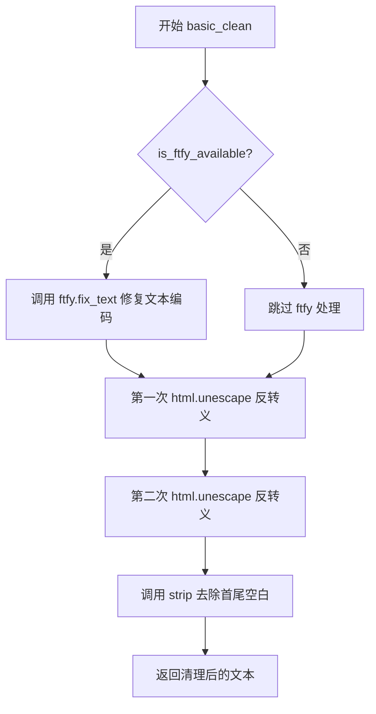

#### 带注释源码

```python
def basic_clean(text):
    """
    Copied from https://github.com/huggingface/diffusers/blob/main/src/diffusers/pipelines/wan/pipeline_wan.py

    Clean text using ftfy if available and unescape HTML entities.
    
    该函数执行以下清理步骤：
    1. 使用 ftfy 库（如果已安装）修复常见的文本编码问题，如乱码、mojibake 等
    2. 连续两次调用 html.unescape 处理 HTML 实体，确保所有实体都被正确解码
       （双重处理是因为可能存在嵌套编码的情况）
    3. 去除文本前后的空白字符
    
    Args:
        text (str): 需要清理的原始文本
        
    Returns:
        str: 清理后的文本
    """
    # 检查 ftfy 库是否可用，若可用则修复文本编码问题
    # ftfy 可以修复如 "é" -> "é" 这类 mojibake 问题
    if is_ftfy_available():
        text = ftfy.fix_text(text)
    
    # 连续两次调用 html.unescape 以处理嵌套编码的 HTML 实体
    # 例如: "&amp;lt;" -> "&lt;" -> "<"
    # 第一次处理外层编码，第二次处理内层编码
    text = html.unescape(html.unescape(text))
    
    # 去除文本首尾的空白字符（包括空格、制表符、换行符等）
    return text.strip()
```


### `whitespace_clean`

该函数用于规范化文本中的空白字符，将连续的多个空白字符替换为单个空格，并去除文本首尾的空白字符。

参数：

- `text`：`str`，需要进行空白字符规范化的输入文本

返回值：`str`，规范化空白字符后的文本

#### 流程图

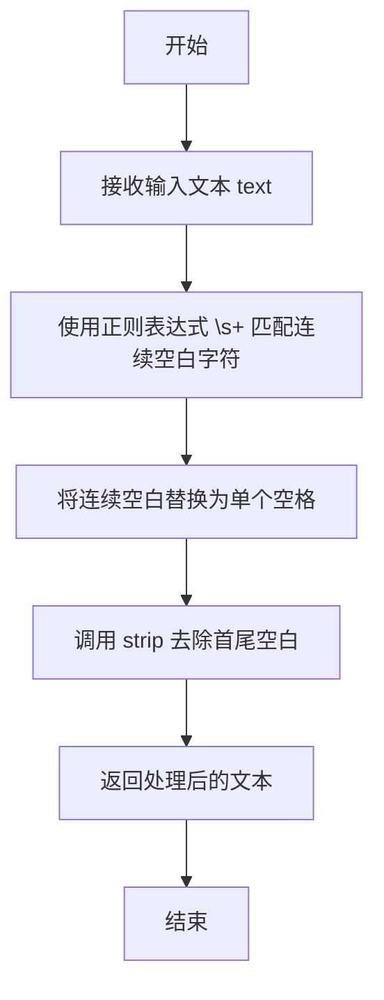

#### 带注释源码

```python
def whitespace_clean(text):
    """
    Copied from https://github.com/huggingface/diffusers/blob/main/src/diffusers/pipelines/wan/pipeline_wan.py

    Normalize whitespace in text by replacing multiple spaces with single space.
    """
    # 使用正则表达式将一个或多个空白字符（\s+）替换为单个空格
    # 这会将多个连续的空格、 tab、换行等空白字符合并为一个空格
    text = re.sub(r"\s+", " ", text)
    # 去除文本首尾的空白字符（包括空格、tab、换行等）
    text = text.strip()
    # 返回规范化后的文本
    return text
```


### `prompt_clean`

对输入文本先进行 basic_clean（HTML实体反转义、ftfy修复），再进行 whitespace_clean（多空格合并），输出干净规范的文本。

参数：

-  `text`：`str`，需要清理的原始文本（通常是用户输入的 prompt）

返回值：`str`，清理并规范化后的文本

#### 流程图

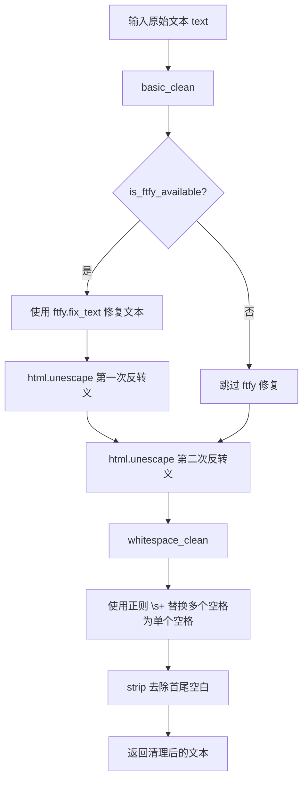

#### 带注释源码

```python
def prompt_clean(text):
    """
    Copied from https://github.com/huggingface/diffusers/blob/main/src/diffusers/pipelines/wan/pipeline_wan.py

    Apply both basic cleaning and whitespace normalization to prompts.
    """
    # 1. 先进行 basic_clean：HTML实体反转义 + ftfy 修复（可选）
    # 2. 再进行 whitespace_clean：多空格合并为单空格 + 去除首尾空白
    text = whitespace_clean(basic_clean(text))
    return text
```


### Kandinsky5T2IPipeline.__init__

该方法是 Kandinsky5T2IPipeline 类的构造函数，负责初始化文本到图像生成管道所需的所有核心组件，包括Transformer模型、VAE模型、两个文本编码器（Qwen2.5-VL和CLIP）、对应的分词器、调度器，以及配置图像处理相关的参数和预设分辨率。

参数：

- `transformer`：`Kandinsky5Transformer3DModel`，用于去噪图像潜在表示的条件Transformer模型
- `vae`：`AutoencoderKL`，用于编码和解码图像的变分自编码器模型
- `text_encoder`：`Qwen2_5_VLForConditionalGeneration`，Qwen2.5-VL文本编码器模型
- `tokenizer`：`Qwen2VLProcessor`，Qwen2.5-VL的分词器
- `text_encoder_2`：`CLIPTextModel`，CLIP文本编码器模型
- `tokenizer_2`：`CLIPTokenizer`，CLIP分词器
- `scheduler`：`FlowMatchEulerDiscreteScheduler`，与Transformer配合使用以去噪图像潜在表示的调度器

返回值：无（构造函数）

#### 流程图

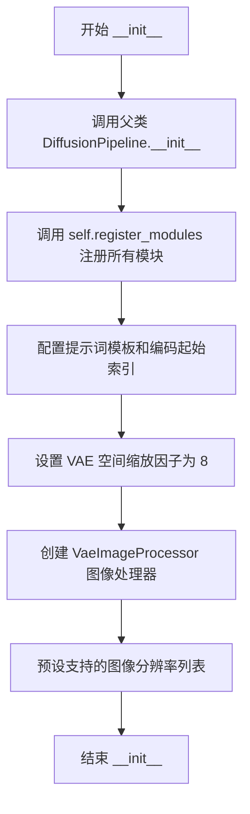

#### 带注释源码

```python
def __init__(
    self,
    transformer: Kandinsky5Transformer3DModel,
    vae: AutoencoderKL,
    text_encoder: Qwen2_5_VLForConditionalGeneration,
    tokenizer: Qwen2VLProcessor,
    text_encoder_2: CLIPTextModel,
    tokenizer_2: CLIPTokenizer,
    scheduler: FlowMatchEulerDiscreteScheduler,
):
    """
    初始化 Kandinsky5T2IPipeline 管道。
    
    构造函数接收所有必需的模型组件并将其注册到管道中，
    同时初始化图像处理所需的各类配置参数。
    """
    # 调用父类 DiffusionPipeline 的初始化方法
    # 执行基础管道设置
    super().__init__()

    # 将所有模型组件注册到管道中
    # 使这些组件可以通过 self.xxx 访问，并支持模型加载/保存功能
    self.register_modules(
        transformer=transformer,
        vae=vae,
        text_encoder=text_encoder,
        tokenizer=tokenizer,
        text_encoder_2=text_encoder_2,
        tokenizer_2=tokenizer_2,
        scheduler=scheduler,
    )

    # 定义用于提示词工程的系统模板
    # 模板格式：系统消息 + 用户消息占位符
    # <|im_start|> 是特殊的标记符，用于区分不同角色
    self.prompt_template = "<|im_start|>system\nYou are a promt engineer. Describe the image by detailing the color, shape, size, texture, quantity, text, spatial relationships of the objects and background:<|im_end|>\n<|im_start|>user\n{}<|im_end|>"
    
    # 提示词模板编码起始索引
    # 用于在编码时跳过模板部分，只编码用户输入的实际提示词
    self.prompt_template_encode_start_idx = 41

    # VAE 空间缩放因子
    # 用于将像素空间转换为潜在空间（或反之）
    # 8 表示潜在空间尺寸是像素空间的 1/8
    self.vae_scale_factor_spatial = 8
    
    # 创建 VAE 图像处理器
    # 负责图像的后处理（将解码结果转换为 PIL 或 numpy 格式）
    self.image_processor = VaeImageProcessor(vae_scale_factor=self.vae_scale_factor_spatial)
    
    # 预设支持的图像分辨率列表
    # 包含多种常见的宽高比组合，用于验证和调整用户请求的尺寸
    self.resolutions = [(1024, 1024), (640, 1408), (1408, 640), (768, 1280), (1280, 768), (896, 1152), (1152, 896)]
```


### `Kandinsky5T2IPipeline._encode_prompt_qwen`

使用 Qwen2.5-VL 文本编码器对输入提示进行编码，生成适用于图像生成的文本嵌入向量。该方法通过自定义提示模板增强提示，处理超长提示的截断，并返回带有累积序列长度（cu_seqlens）的嵌入向量以支持可变长度序列的注意力计算。

参数：

- `prompt`：`list[str]`，输入的提示列表
- `device`：`torch.device | None`，运行编码的设备，默认为执行设备
- `max_sequence_length`：`int`，token化的最大序列长度，默认为512
- `dtype`：`torch.dtype | None`，embedding的数据类型，默认为文本编码器的数据类型

返回值：`tuple[torch.Tensor, torch.Tensor]`，返回两个张量——文本嵌入（形状为 [batch_size, seq_len, embed_dim]）和累积序列长度（用于可变长度序列的注意力掩码）

#### 流程图

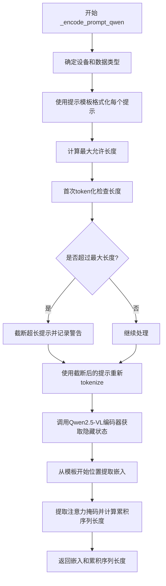

#### 带注释源码

```python
def _encode_prompt_qwen(
    self,
    prompt: list[str],
    device: torch.device | None = None,
    max_sequence_length: int = 512,
    dtype: torch.dtype | None = None,
):
    """
    Encode prompt using Qwen2.5-VL text encoder.

    This method processes the input prompt through the Qwen2.5-VL model to generate text embeddings suitable for
    image generation.

    Args:
        prompt list[str]: Input list of prompts
        device (torch.device): Device to run encoding on
        max_sequence_length (int): Maximum sequence length for tokenization
        dtype (torch.dtype): Data type for embeddings

    Returns:
        tuple[torch.Tensor, torch.Tensor]: Text embeddings and cumulative sequence lengths
    """
    # 确定执行设备和数据类型，未指定时使用默认执行设备和文本编码器的数据类型
    device = device or self._execution_device
    dtype = dtype or self.text_encoder.dtype

    # 使用自定义提示模板格式化每个提示，模板包含系统指令引导模型生成详细描述
    full_texts = [self.prompt_template.format(p) for p in prompt]
    
    # 计算允许的最大长度：模板前缀长度 + 用户指定的最大序列长度
    max_allowed_len = self.prompt_template_encode_start_idx + max_sequence_length

    # 首次token化检查提示是否超过最大长度（不截断，获取完整长度）
    untruncated_ids = self.tokenizer(
        text=full_texts,
        images=None,
        videos=None,
        return_tensors="pt",
        padding="longest",
    )["input_ids"]

    # 如果token数量超过允许的最大长度，进行截断处理
    if untruncated_ids.shape[-1] > max_allowed_len:
        for i, text in enumerate(full_texts):
            # 提取用户输入部分的tokens（排除模板前缀和结束标记）
            tokens = untruncated_ids[i][self.prompt_template_encode_start_idx : -2]
            # 计算需要截掉的tokens并解码为文本
            removed_text = self.tokenizer.decode(tokens[max_sequence_length - 2 :])
            if len(removed_text) > 0:
                # 从原文本中移除超长部分
                full_texts[i] = text[: -len(removed_text)]
                # 记录警告日志
                logger.warning(
                    "The following part of your input was truncated because `max_sequence_length` is set to "
                    f" {max_sequence_length} tokens: {removed_text}"
                )

    # 使用截断后的提示进行最终token化，设置最大长度限制
    inputs = self.tokenizer(
        text=full_texts,
        images=None,
        videos=None,
        max_length=max_allowed_len,
        truncation=True,
        return_tensors="pt",
        padding=True,
    ).to(device)

    # 调用Qwen2.5-VL文本编码器获取最后一层的隐藏状态
    embeds = self.text_encoder(
        input_ids=inputs["input_ids"],
        return_dict=True,
        output_hidden_states=True,
    )["hidden_states"][-1][:, self.prompt_template_encode_start_idx :]  # 去除模板部分，只保留用户提示的嵌入
    
    # 提取注意力掩码并去除模板部分
    attention_mask = inputs["attention_mask"][:, self.prompt_template_encode_start_idx :]
    
    # 计算累积序列长度（cu_seqlens），用于可变长度序列的注意力计算
    cu_seqlens = torch.cumsum(attention_mask.sum(1), dim=0)
    # 在开头添加0，用于标识序列起始位置，数据类型转为int32
    cu_seqlens = F.pad(cu_seqlens, (1, 0), value=0).to(dtype=torch.int32)

    # 返回文本嵌入和累积序列长度
    return embeds.to(dtype), cu_seqlens
```


### `Kandinsky5T2IPipeline._encode_prompt_clip`

使用 CLIP 文本编码器对输入的文本提示进行编码，生成池化后的文本嵌入向量，该嵌入捕获了语义信息，可用于图像生成过程中的条件控制。

参数：

-  `prompt`：`str | list[str]`，输入的文本提示，可以是单个字符串或字符串列表
-  `device`：`torch.device | None`，执行编码的设备，默认为执行设备
-  `dtype`：`torch.dtype | None`，嵌入向量的数据类型，默认为 text_encoder_2 的数据类型

返回值：`torch.Tensor`，CLIP 模型生成的池化文本嵌入向量

#### 流程图

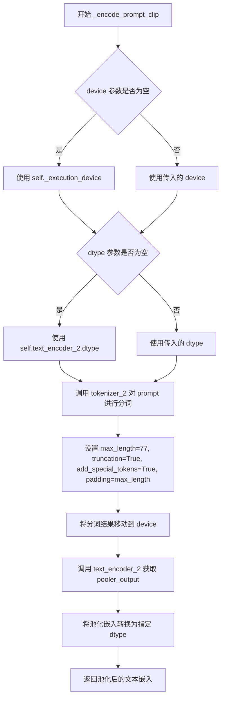

#### 带注释源码

```python
def _encode_prompt_clip(
    self,
    prompt: str | list[str],
    device: torch.device | None = None,
    dtype: torch.dtype | None = None,
):
    """
    Encode prompt using CLIP text encoder.

    This method processes the input prompt through the CLIP model to generate pooled embeddings that capture
    semantic information.

    Args:
        prompt (str | list[str]): Input prompt or list of prompts
        device (torch.device): Device to run encoding on
        dtype (torch.dtype): Data type for embeddings

    Returns:
        torch.Tensor: Pooled text embeddings from CLIP
    """
    # 如果未指定设备，则使用管道的执行设备
    device = device or self._execution_device
    # 如果未指定数据类型，则使用 CLIP 文本编码器的数据类型
    dtype = dtype or self.text_encoder_2.dtype

    # 使用 CLIP tokenizer 对 prompt 进行分词和编码
    # max_length=77: CLIP 模型的最大序列长度限制
    # truncation=True: 超过最大长度的序列进行截断
    # add_special_tokens=True: 添加特殊 tokens（如 [CLS], [SEP] 等）
    # padding=max_length: 填充到最大长度以保持批次中序列长度一致
    inputs = self.tokenizer_2(
        prompt,
        max_length=77,
        truncation=True,
        add_special_tokens=True,
        padding="max_length",
        return_tensors="pt",
    ).to(device)

    # 将分词后的输入传入 CLIP 文本编码器，获取池化输出
    # pooler_output 是 CLIP 模型最后一层的池化表示，维度为 (batch_size, hidden_size)
    pooled_embed = self.text_encoder_2(**inputs)["pooler_output"]

    # 将嵌入向量转换为指定的 dtype 并返回
    return pooled_embed.to(dtype)
```


### `Kandinsky5T2IPipeline.encode_prompt`

该方法将单个提示词（正面或负面）编码为文本编码器的隐藏状态。它结合了Qwen2.5-VL和CLIP两个文本编码器的嵌入，生成用于图像生成的综合文本表示。方法内部首先对提示词进行清理和标准化处理，然后分别调用`_encode_prompt_qwen`和`_encode_prompt_clip`两个私有方法进行编码，最后根据`num_images_per_prompt`参数重复嵌入以支持批量生成多张图像。

参数：

- `prompt`：`str | list[str]`，要编码的提示词
- `num_images_per_prompt`：`int`，可选，默认为1，每个提示词生成的图像数量
- `max_sequence_length`：`int`，可选，默认为512，文本编码的最大序列长度，必须小于1024
- `device`：`torch.device | None`，可选，Torch设备
- `dtype`：`torch.dtype | None`，可选，Torch数据类型

返回值：`tuple[torch.Tensor, torch.Tensor, torch.Tensor]`

- Qwen文本嵌入：形状为(batch_size * num_images_per_prompt, sequence_length, embedding_dim)的张量
- CLIP池化嵌入：形状为(batch_size * num_images_per_prompt, clip_embedding_dim)的张量
- Qwen嵌入的累积序列长度(cu_seqlens)：形状为(batch_size * num_images_per_prompt + 1,)的张量

#### 流程图

```mermaid
flowchart TD
    A[encode_prompt 开始] --> B{检查prompt是否为list}
    B -->|否| C[转换为list: prompt = [prompt]]
    B -->|是| D[直接使用]
    C --> E[batch_size = len(prompt)]
    D --> E
    E --> F[prompt_clean: 对每个prompt进行清理和空白标准化]
    F --> G[调用_encode_prompt_qwen]
    G --> H[获得Qwen embeddings和cu_seqlens]
    H --> I[调用_encode_prompt_clip]
    I --> J[获得CLIP pooled embeddings]
    J --> K[prompt_embeds_qwen.repeat 1轴扩展]
    K --> L[view重塑为batch_size * num_images_per_prompt]
    J --> M[prompt_embeds_clip.repeat 1轴扩展]
    M --> N[view重塑为batch_size * num_images_per_prompt]
    L --> O[original_lengths = cu_seqlens.diff获取原始长度]
    O --> P[repeat_interleave重复长度]
    P --> Q[cumsum计算累积长度并添加起始0]
    Q --> R[返回三元组: embeds_qwen, embeds_clip, cu_seqlens]
```

#### 带注释源码

```python
def encode_prompt(
    self,
    prompt: str | list[str],
    num_images_per_prompt: int = 1,
    max_sequence_length: int = 512,
    device: torch.device | None = None,
    dtype: torch.dtype | None = None,
):
    r"""
    Encodes a single prompt (positive or negative) into text encoder hidden states.

    This method combines embeddings from both Qwen2.5-VL and CLIP text encoders to create comprehensive text
    representations for image generation.

    Args:
        prompt (`str` or `list[str]`):
            Prompt to be encoded.
        num_images_per_prompt (`int`, *optional*, defaults to 1):
            Number of images to generate per prompt.
        max_sequence_length (`int`, *optional*, defaults to 512):
            Maximum sequence length for text encoding. Must be less than 1024
        device (`torch.device`, *optional*):
            Torch device.
        dtype (`torch.dtype`, *optional*):
            Torch dtype.

    Returns:
        tuple[torch.Tensor, torch.Tensor, torch.Tensor]:
            - Qwen text embeddings of shape (batch_size * num_images_per_prompt, sequence_length, embedding_dim)
            - CLIP pooled embeddings of shape (batch_size * num_images_per_prompt, clip_embedding_dim)
            - Cumulative sequence lengths (`cu_seqlens`) for Qwen embeddings of shape (batch_size *
              num_images_per_prompt + 1,)
    """
    # 获取执行设备和数据类型，如未指定则使用默认值
    device = device or self._execution_device
    dtype = dtype or self.text_encoder.dtype

    # 确保prompt为list格式，便于批量处理
    if not isinstance(prompt, list):
        prompt = [prompt]

    # 获取批量大小
    batch_size = len(prompt)

    # 对每个prompt进行清理：使用ftfy修复文本、取消HTML转义、规范化空白
    prompt = [prompt_clean(p) for p in prompt]

    # ========== 使用Qwen2.5-VL编码 ==========
    # 返回: embeds_qwen [batch_size, seq_len, embed_dim], cu_seqlens累积序列长度
    prompt_embeds_qwen, prompt_cu_seqlens = self._encode_prompt_qwen(
        prompt=prompt,
        device=device,
        max_sequence_length=max_sequence_length,
        dtype=dtype,
    )
    # prompt_embeds_qwen shape: [batch_size, seq_len, embed_dim]

    # ========== 使用CLIP编码 ==========
    # 返回: pooled_embed [batch_size, clip_embed_dim]
    prompt_embeds_clip = self._encode_prompt_clip(
        prompt=prompt,
        device=device,
        dtype=dtype,
    )
    # prompt_embeds_clip shape: [batch_size, clip_embed_dim]

    # ========== 为num_images_per_prompt重复embeddings ==========
    # Qwen embeddings: 在序列维度重复，然后reshape
    # repeat(1, num_images_per_prompt, 1) 在中间维度(序列长度)重复
    prompt_embeds_qwen = prompt_embeds_qwen.repeat(
        1, num_images_per_prompt, 1
    )  # [batch_size, seq_len * num_images_per_prompt, embed_dim]
    # view重塑为 [batch_size * num_images_per_prompt, seq_len, embed_dim]
    prompt_embeds_qwen = prompt_embeds_qwen.view(
        batch_size * num_images_per_prompt, -1, prompt_embeds_qwen.shape[-1]
    )

    # CLIP embeddings: 为每个图像重复
    # repeat(1, num_images_per_prompt, 1) 在中间维度重复
    prompt_embeds_clip = prompt_embeds_clip.repeat(
        1, num_images_per_prompt, 1
    )  # [batch_size, num_images_per_prompt, clip_embed_dim]
    # view重塑为 [batch_size * num_images_per_prompt, clip_embed_dim]
    prompt_embeds_clip = prompt_embeds_clip.view(batch_size * num_images_per_prompt, -1)

    # ========== 重复累积序列长度cu_seqlens ==========
    # 获取原始每个prompt的序列长度差异
    original_lengths = prompt_cu_seqlens.diff()  # [len1, len2, ...]
    # 为每个prompt重复num_images_per_prompt次
    repeated_lengths = original_lengths.repeat_interleave(
        num_images_per_prompt
    ) # [len1, len1, ..., len2, len2, ...]
    # 重新构建累积序列长度，首位添加0
    repeated_cu_seqlens = torch.cat(
        [torch.tensor([0], device=device, dtype=torch.int32), repeated_lengths.cumsum(0)]
    )

    return prompt_embeds_qwen, prompt_embeds_clip, repeated_cu_seqlens
```


### `Kandinsky5T2IPipeline.check_inputs`

验证并检查文本到图像生成管道的输入参数有效性，确保所有必需参数均已正确提供且类型符合要求。

参数：

- `self`：`Kandinsky5T2IPipeline` 实例本身
- `prompt`：`str | list[str] | None`，输入提示词，用于指导图像生成
- `negative_prompt`：`str | list[str] | None`，负面提示词，用于避免生成不希望的内容
- `height`：`int`，生成图像的高度（像素）
- `width`：`int`，生成图像的宽度（像素）
- `prompt_embeds_qwen`：`torch.Tensor | None`，预计算的 Qwen 文本嵌入
- `prompt_embeds_clip`：`torch.Tensor | None`，预计算的 CLIP 文本嵌入
- `negative_prompt_embeds_qwen`：`torch.Tensor | None`，预计算的 Qwen 负面文本嵌入
- `negative_prompt_embeds_clip`：`torch.Tensor | None`，预计算的 CLIP 负面文本嵌入
- `prompt_cu_seqlens`：`torch.Tensor | None`，Qwen 正向提示词的累计序列长度
- `negative_prompt_cu_seqlens`：`torch.Tensor | None`，Qwen 负面提示词的累计序列长度
- `callback_on_step_end_tensor_inputs`：`list[str] | None`，步骤结束回调函数可访问的张量输入列表
- `max_sequence_length`：`int | None`，文本编码的最大序列长度

返回值：无显式返回值（`None`），若输入验证失败则抛出 `ValueError` 异常

#### 流程图

```mermaid
flowchart TD
    A[开始 check_inputs 验证] --> B{检查 max_sequence_length <= 1024}
    B -->|是| C{检查 (width, height) 是否在允许分辨率列表中}
    B -->|否| D[抛出 ValueError: max_sequence_length 超过限制]
    C -->|是| E{检查 callback_on_step_end_tensor_inputs 是否有效}
    C -->|否| F[记录警告日志: 分辨率将被调整]
    F --> E
    E -->|有效| G{检查 prompt_embeds_qwen/clip/cu_seqlens 一致性}
    E -->|无效| H[抛出 ValueError: 无效的 callback tensor inputs]
    G -->|一致或全为 None| I{检查 negative_prompt_embeds 一致性}
    G -->|不一致| J[抛出 ValueError: 正向嵌入参数不完整]
    I -->|一致或全为 None| K{检查是否提供了 prompt 或 embeddings}
    I -->|不一致| L[抛出 ValueError: 负向嵌入参数不完整]
    K -->|提供了| M{检查 prompt 类型是否为 str 或 list}
    K -->|未提供| N[抛出 ValueError: 未提供 prompt]
    M -->|类型正确| O{检查 negative_prompt 类型}
    M -->|类型错误| P[抛出 ValueError: prompt 类型错误]
    O -->|类型正确| Q[验证通过]
    O -->|类型错误| R[抛出 ValueError: negative_prompt 类型错误]
    Q --> Z[结束验证]
    Z --> |无异常| S[返回 None]
```

#### 带注释源码

```python
def check_inputs(
    self,
    prompt,
    negative_prompt,
    height,
    width,
    prompt_embeds_qwen=None,
    prompt_embeds_clip=None,
    negative_prompt_embeds_qwen=None,
    negative_prompt_embeds_clip=None,
    prompt_cu_seqlens=None,
    negative_prompt_cu_seqlens=None,
    callback_on_step_end_tensor_inputs=None,
    max_sequence_length=None,
):
    """
    Validate input parameters for the pipeline.

    Args:
        prompt: Input prompt
        negative_prompt: Negative prompt for guidance
        height: Image height
        width: Image width
        prompt_embeds_qwen: Pre-computed Qwen prompt embeddings
        prompt_embeds_clip: Pre-computed CLIP prompt embeddings
        negative_prompt_embeds_qwen: Pre-computed Qwen negative prompt embeddings
        negative_prompt_embeds_clip: Pre-computed CLIP negative prompt embeddings
        prompt_cu_seqlens: Pre-computed cumulative sequence lengths for Qwen positive prompt
        negative_prompt_cu_seqlens: Pre-computed cumulative sequence lengths for Qwen negative prompt
        callback_on_step_end_tensor_inputs: Callback tensor inputs

    Raises:
        ValueError: If inputs are invalid
    """

    # 检查最大序列长度是否超过 1024 的限制
    if max_sequence_length is not None and max_sequence_length > 1024:
        raise ValueError("max_sequence_length must be less than 1024")

    # 检查图像分辨率是否在预定义的允许分辨率列表中
    if (width, height) not in self.resolutions:
        resolutions_str = ",".join([f"({w},{h})" for w, h in self.resolutions])
        logger.warning(
            f"`height` and `width` have to be one of {resolutions_str}, but are {height} and {width}. Dimensions will be resized accordingly"
        )

    # 验证回调函数张量输入是否都在允许列表中
    if callback_on_step_end_tensor_inputs is not None and not all(
        k in self._callback_tensor_inputs for k in callback_on_step_end_tensor_inputs
    ):
        raise ValueError(
            f"`callback_on_step_end_tensor_inputs` has to be in {self._callback_tensor_inputs}, but found {[k for k in callback_on_step_end_tensor_inputs if k not in self._callback_tensor_inputs]}"
        )

    # 检查正向提示词嵌入和序列长度的一致性
    # 如果提供了任何一个正向嵌入参数，则必须提供全部三个
    if prompt_embeds_qwen is not None or prompt_embeds_clip is not None or prompt_cu_seqlens is not None:
        if prompt_embeds_qwen is None or prompt_embeds_clip is None or prompt_cu_seqlens is None:
            raise ValueError(
                "If any of `prompt_embeds_qwen`, `prompt_embeds_clip`, or `prompt_cu_seqlens` is provided, "
                "all three must be provided."
            )

    # 检查负向提示词嵌入和序列长度的一致性
    # 如果提供了任何一个负向嵌入参数，则必须提供全部三个
    if (
        negative_prompt_embeds_qwen is not None
        or negative_prompt_embeds_clip is not None
        or negative_prompt_cu_seqlens is not None
    ):
        if (
            negative_prompt_embeds_qwen is None
            or negative_prompt_embeds_clip is None
            or negative_prompt_cu_seqlens is None
        ):
            raise ValueError(
                "If any of `negative_prompt_embeds_qwen`, `negative_prompt_embeds_clip`, or `negative_prompt_cu_seqlens` is provided, "
                "all three must be provided."
            )

    # 检查是否提供了提示词或嵌入向量（至少需要提供一种）
    if prompt is None and prompt_embeds_qwen is None:
        raise ValueError(
            "Provide either `prompt` or `prompt_embeds_qwen` (and corresponding `prompt_embeds_clip` and `prompt_cu_seqlens`). Cannot leave all undefined."
        )

    # 验证 prompt 和 negative_prompt 的类型
    if prompt is not None and (not isinstance(prompt, str) and not isinstance(prompt, list)):
        raise ValueError(f"`prompt` has to be of type `str` or `list` but is {type(prompt)}")
    if negative_prompt is not None and (
        not isinstance(negative_prompt, str) and not isinstance(negative_prompt, list)
    ):
        raise ValueError(f"`negative_prompt` has to be of type `str` or `list` but is {type(negative_prompt)}")
```


### `Kandinsky5T2IPipeline.prepare_latents`

prepare_latents 方法是 Kandinsky 5.0 T2I Pipeline 中的关键组件，负责为文本到图像生成准备初始潜在变量（latent variables）。该方法接收图像生成的批次大小、潜在通道数、图像高度和宽度等参数，并根据这些参数创建随机噪声潜在变量或处理预先提供的潜在变量。它还包含对生成器列表长度与批次大小一致性的验证，确保随机噪声生成的正确性。

参数：

- `self`：`Kandinsky5T2IPipeline` 类实例，当前 pipeline 对象
- `batch_size`：`int`，要生成的图像数量，决定了潜在变量的批次维度
- `num_channels_latents`：`int`，默认为 16，潜在空间的通道数，对应于 transformer 的 in_visual_dim 配置
- `height`：`int`，默认为 1024，生成图像的高度（像素），用于计算潜在变量的空间维度
- `width`：`int`，默认为 1024，生成图像的宽度（像素），用于计算潜在变量的空间维度
- `dtype`：`torch.dtype | None`，潜在变量的数据类型，若为 None 则使用默认值
- `device`：`torch.device | None`，创建潜在变量的设备，若为 None 则使用执行设备
- `generator`：`torch.Generator | list[torch.Generator] | None`，随机数生成器，用于确保生成过程的可重复性，支持单个生成器或与批次大小匹配的生成器列表
- `latents`：`torch.Tensor | None`，预先存在的潜在变量，若提供则直接返回转换后的张量，若为 None 则生成新的随机噪声

返回值：`torch.Tensor`，准备好的潜在变量张量，形状为 (batch_size, 1, height // vae_scale_factor, width // vae_scale_factor, num_channels_latents)

#### 流程图

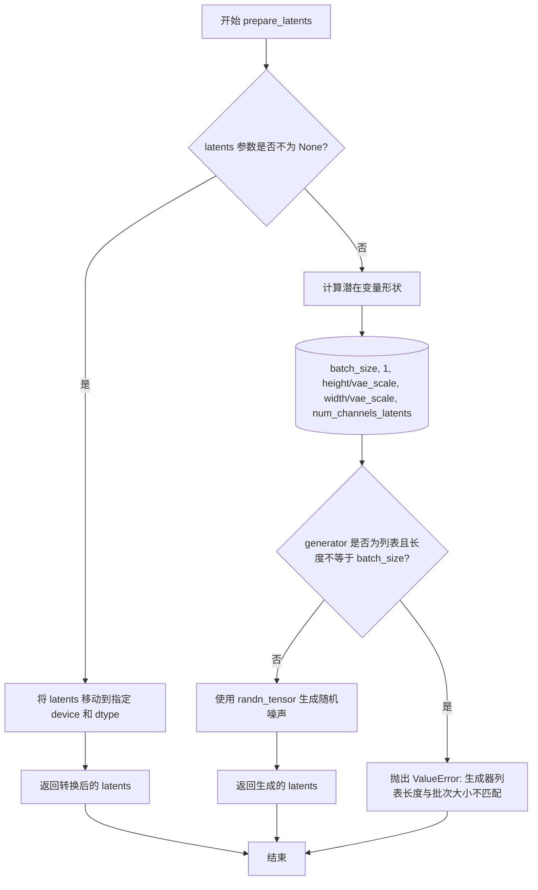

#### 带注释源码

```python
def prepare_latents(
    self,
    batch_size: int,
    num_channels_latents: int = 16,
    height: int = 1024,
    width: int = 1024,
    dtype: torch.dtype | None = None,
    device: torch.device | None = None,
    generator: torch.Generator | list[torch.Generator] | None = None,
    latents: torch.Tensor | None = None,
) -> torch.Tensor:
    """
    Prepare initial latent variables for text-to-image generation.

    This method creates random noise latents

    Args:
        batch_size (int): Number of images to generate
        num_channels_latents (int): Number of channels in latent space
        height (int): Height of generated image
        width (int): Width of generated image
        dtype (torch.dtype): Data type for latents
        device (torch.device): Device to create latents on
        generator (torch.Generator): Random number generator
        latents (torch.Tensor): Pre-existing latents to use

    Returns:
        torch.Tensor: Prepared latent tensor
    """
    # 如果用户提供了预计算的潜在变量，直接进行设备和数据类型转换后返回
    # 这允许用户使用自定义的潜在变量进行生成
    if latents is not None:
        return latents.to(device=device, dtype=dtype)

    # 计算潜在变量的形状
    # 潜在空间的宽高是原始图像尺寸除以 VAE 空间缩放因子（vae_scale_factor_spatial=8）
    # 添加一个额外的维度（维度1的1）以匹配 transformer 的 5D 输入要求
    shape = (
        batch_size,
        1,
        int(height) // self.vae_scale_factor_spatial,
        int(width) // self.vae_scale_factor_spatial,
        num_channels_latents,
    )

    # 验证生成器列表的长度是否与批次大小匹配
    # 如果不匹配，抛出明确的错误信息，帮助用户定位问题
    if isinstance(generator, list) and len(generator) != batch_size:
        raise ValueError(
            f"You have passed a list of generators of length {len(generator)}, but requested an effective batch"
            f" size of {batch_size}. Make sure the batch size matches the length of the generators."
        )

    # 使用 randn_tensor 生成符合标准正态分布的随机噪声
    # 这些噪声将作为去噪过程的初始输入
    # generator 参数确保在需要时可以重现相同的随机模式
    latents = randn_tensor(shape, generator=generator, device=device, dtype=dtype)
    return latents
```


### `Kandinsky5T2IPipeline.guidance_scale`

该属性是一个只读的 `@property` 装饰器方法，用于获取当前扩散管道中的 guidance_scale（引导强度）值。该值在调用 `__call__` 方法时通过参数 `guidance_scale` 设置，并在去噪循环中用于分类器-free guidance（CFG）计算，决定生成图像与文本提示的匹配程度。

参数：此属性无显式参数（`self` 为隐式参数）

返回值：`float`，返回当前 guidance_scale 的值，用于控制文本提示对图像生成的影响程度。

#### 流程图

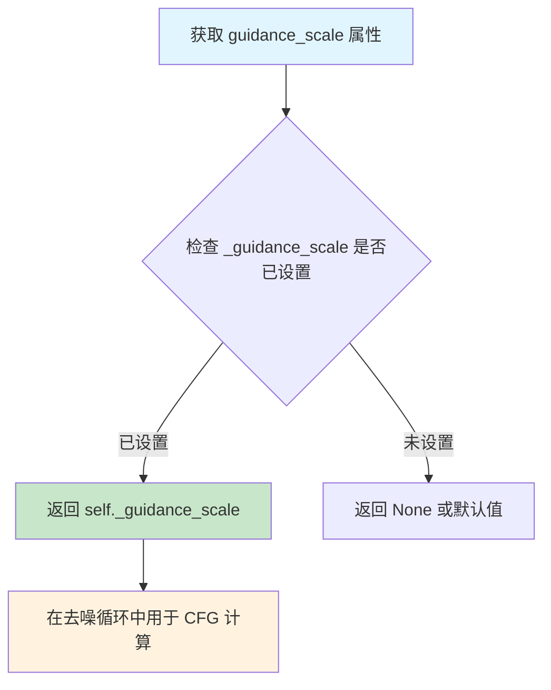

#### 带注释源码

```python
@property
def guidance_scale(self):
    """
    获取当前的 guidance scale（引导强度）值。
    
    该属性返回一个浮点数，表示在文本到图像生成过程中
    分类器-free guidance 的强度。该值越大，生成的图像
    与文本提示的匹配度越高，但可能导致图像多样性降低。
    
    Returns:
        float: 当前使用的 guidance_scale 值。
               该值在 __call__ 方法中通过参数传入并存储在 self._guidance_scale 中。
    """
    return self._guidance_scale
```

#### 相关上下文代码片段

```python
# 在 __call__ 方法中设置 _guidance_scale
self._guidance_scale = guidance_scale

# 在去噪循环中使用 guidance_scale 进行分类器-free guidance
if self.guidance_scale > 1.0:
    # 执行 CFG 计算
    pred_velocity = uncond_pred_velocity + guidance_scale * (pred_velocity - uncond_pred_velocity)
```

#### 关键信息

| 项目 | 描述 |
|------|------|
| 属性类型 | 只读 `@property` |
| 存储变量 | `self._guidance_scale` |
| 设置位置 | `Kandinsky5T2IPipeline.__call__` 方法 |
| 使用位置 | 去噪循环中的分类器-free guidance 计算 |
| 默认值 | 在 `__call__` 中默认为 3.5 |


### `Kandinsky5T2IPipeline.num_timesteps`

该属性是一个只读的属性，用于获取去噪过程的时间步数量。在 `__call__` 方法执行时，该值会被设置为时间步列表的长度（即 `len(timesteps)`），通常等于 `num_inference_steps`。

参数：无（该属性不接受任何参数，仅使用隐式参数 `self`）

返回值：`int`，返回当前去噪过程的时间步数量

#### 流程图

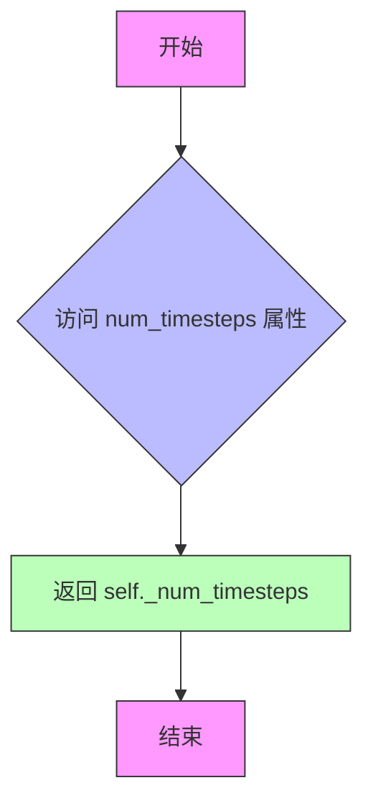

#### 带注释源码

```python
@property
def num_timesteps(self):
    """Get the number of denoising timesteps."""
    # 这是一个只读属性，返回内部变量 _num_timesteps 的值
    # _num_timesteps 在 __call__ 方法的去噪循环开始时被设置
    # 其值等于时间步列表的长度，通常等于 num_inference_steps 参数
    return self._num_timesteps
```


### `Kandinsky5T2IPipeline.interrupt`

该属性是一个只读属性，用于检查文本到图像生成过程是否已被外部请求中断。它在去噪循环中被检查，当值为 `True` 时，当前去噪步骤会被跳过，从而实现即时的生成中断功能。

参数：无（这是一个属性访问器，不接受任何参数）

返回值：`bool`，返回生成中断标志的状态。当返回 `True` 时，表示生成过程已被请求中断；当返回 `False` 时，表示生成过程继续正常进行。

#### 流程图

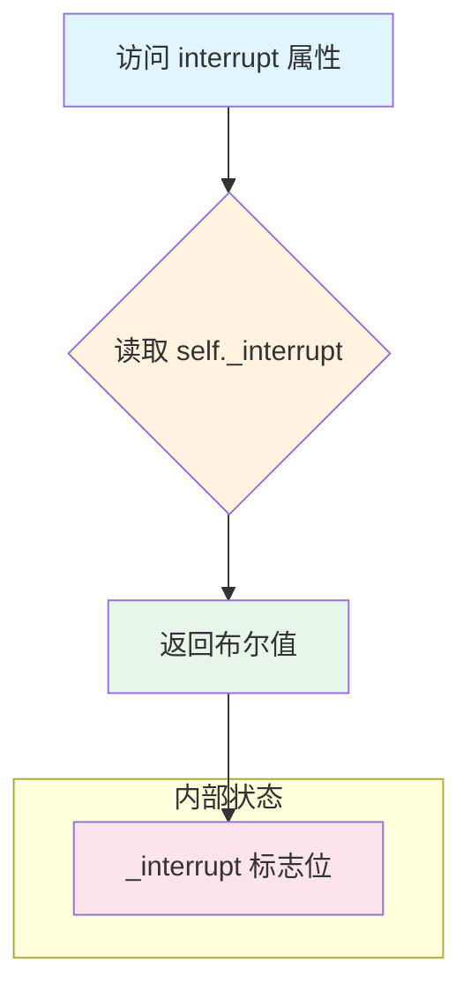

#### 带注释源码

```python
@property
def interrupt(self):
    """Check if generation has been interrupted."""
    return self._interrupt
```

**源码解析：**

- `@property` 装饰器：将方法转换为只读属性，允许通过 `self.interrupt` 直接访问，无需调用方法
- `self._interrupt`：类内部维护的中断标志位，是一个布尔类型 (`bool`) 的私有实例变量
- 该属性在 `__call__` 方法的去噪循环中被使用：`if self.interrupt: continue`，当检测到中断标志为 `True` 时，跳过当前迭代实现生成中断


### `Kandinsky5T2IPipeline.__call__`

这是 Kandinsky 5.0 文本到图像生成管道的主入口方法，负责协调文本编码、潜在变量去噪和图像解码的完整流程，根据输入提示生成相应的图像。

参数：

- `prompt`：`str | list[str]`，要引导图像生成的提示词，如果未定义则需要传递 `prompt_embeds`
- `negative_prompt`：`str | list[str] | None`，在图像生成过程中要避免的提示词，仅在使用引导时有效
- `height`：`int`，生成图像的高度（像素），默认 1024
- `width`：`int`，生成图像的宽度（像素），默认 1024
- `num_inference_steps`：`int`，去噪步数，默认 50
- `guidance_scale`：`float`，分类器自由引导的引导比例，默认 3.5
- `num_images_per_prompt`：`int | None`，每个提示词生成的图像数量，默认 1
- `generator`：`torch.Generator | list[torch.Generator] | None`，用于生成确定性结果的 torch 生成器
- `latents`：`torch.Tensor | None`，预先生成的噪声潜在变量
- `prompt_embeds_qwen`：`torch.Tensor | None`，预生成的 Qwen 文本嵌入
- `prompt_embeds_clip`：`torch.Tensor | None`，预生成的 CLIP 文本嵌入
- `negative_prompt_embeds_qwen`：`torch.Tensor | None`，预生成的 Qwen 负面文本嵌入
- `negative_prompt_embeds_clip`：`torch.Tensor | None`，预生成的 CLIP 负面文本嵌入
- `prompt_cu_seqlens`：`torch.Tensor | None`，Qwen 正面提示的预生成累积序列长度
- `negative_prompt_cu_seqlens`：`torch.Tensor | None`，Qwen 负面提示的预生成累积序列长度
- `output_type`：`str | None`，生成图像的输出格式，默认 "pil"
- `return_dict`：`bool`，是否返回 `KandinskyImagePipelineOutput`，默认 True
- `callback_on_step_end`：`Callable[[int, int, None], PipelineCallback | MultiPipelineCallbacks] | None`，每个去噪步骤结束时调用的函数
- `callback_on_step_end_tensor_inputs`：`list[str]`，回调函数的张量输入列表
- `max_sequence_length`：`int`，文本编码的最大序列长度，默认 512

返回值：`KandinskyImagePipelineOutput | tuple`，如果 `return_dict` 为 True，返回 `KandinskyImagePipelineOutput`，否则返回元组，第一个元素是生成的图像列表

#### 流程图

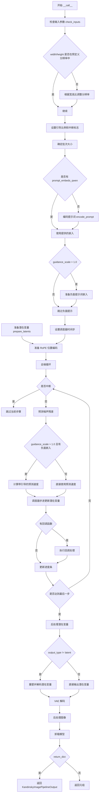

#### 带注释源码

```python
@torch.no_grad()
@replace_example_docstring(EXAMPLE_DOC_STRING)
def __call__(
    self,
    prompt: str | list[str] = None,
    negative_prompt: str | list[str] | None = None,
    height: int = 1024,
    width: int = 1024,
    num_inference_steps: int = 50,
    guidance_scale: float = 3.5,
    num_images_per_prompt: int | None = 1,
    generator: torch.Generator | list[torch.Generator] | None = None,
    latents: torch.Tensor | None = None,
    prompt_embeds_qwen: torch.Tensor | None = None,
    prompt_embeds_clip: torch.Tensor | None = None,
    negative_prompt_embeds_qwen: torch.Tensor | None = None,
    negative_prompt_embeds_clip: torch.Tensor | None = None,
    prompt_cu_seqlens: torch.Tensor | None = None,
    negative_prompt_cu_seqlens: torch.Tensor | None = None,
    output_type: str | None = "pil",
    return_dict: bool = True,
    callback_on_step_end: Callable[[int, int, None], PipelineCallback | MultiPipelineCallbacks] | None = None,
    callback_on_step_end_tensor_inputs: list[str] = ["latents"],
    max_sequence_length: int = 512,
):
    """
    The call function to the pipeline for text-to-image generation.

    Args:
        prompt (`str` or `list[str]`, *optional*):
            The prompt or prompts to guide the image generation. If not defined, pass `prompt_embeds` instead.
        negative_prompt (`str` or `list[str]`, *optional*):
            The prompt or prompts to avoid during image generation. If not defined, pass `negative_prompt_embeds`
            instead. Ignored when not using guidance (`guidance_scale` < `1`).
        height (`int`, defaults to `1024`):
            The height in pixels of the generated image.
        width (`int`, defaults to `1024`):
            The width in pixels of the generated image.
        num_inference_steps (`int`, defaults to `50`):
            The number of denoising steps.
        guidance_scale (`float`, defaults to `5.0`):
            Guidance scale as defined in classifier-free guidance.
        num_images_per_prompt (`int`, *optional*, defaults to 1):
            The number of images to generate per prompt.
        generator (`torch.Generator` or `list[torch.Generator]`, *optional*):
            A torch generator to make generation deterministic.
        latents (`torch.Tensor`, *optional*):
            Pre-generated noisy latents.
        prompt_embeds_qwen (`torch.Tensor`, *optional*):
            Pre-generated Qwen text embeddings.
        prompt_embeds_clip (`torch.Tensor`, *optional*):
            Pre-generated CLIP text embeddings.
        negative_prompt_embeds_qwen (`torch.Tensor`, *optional*):
            Pre-generated Qwen negative text embeddings.
        negative_prompt_embeds_clip (`torch.Tensor`, *optional*):
            Pre-generated CLIP negative text embeddings.
        prompt_cu_seqlens (`torch.Tensor`, *optional*):
            Pre-generated cumulative sequence lengths for Qwen positive prompt.
        negative_prompt_cu_seqlens (`torch.Tensor`, *optional*):
            Pre-generated cumulative sequence lengths for Qwen negative prompt.
        output_type (`str`, *optional*, defaults to `"pil"`):
            The output format of the generated image.
        return_dict (`bool`, *optional*, defaults to `True`):
            Whether or not to return a [`KandinskyImagePipelineOutput`].
        callback_on_step_end (`Callable`, `PipelineCallback`, `MultiPipelineCallbacks`, *optional*):
            A function that is called at the end of each denoising step.
        callback_on_step_end_tensor_inputs (`List`, *optional*):
            The list of tensor inputs for the `callback_on_step_end` function.
        max_sequence_length (`int`, defaults to `512`):
            The maximum sequence length for text encoding.

    Examples:

    Returns:
        [`~KandinskyImagePipelineOutput`] or `tuple`:
            If `return_dict` is `True`, [`KandinskyImagePipelineOutput`] is returned, otherwise a `tuple` is
            returned where the first element is a list with the generated images.
    """
    # 处理回调函数，如果传入的是 PipelineCallback 或 MultiPipelineCallbacks 对象
    if isinstance(callback_on_step_end, (PipelineCallback, MultiPipelineCallbacks)):
        callback_on_step_end_tensor_inputs = callback_on_step_end.tensor_inputs
    
    # 1. 检查输入参数的有效性
    self.check_inputs(
        prompt=prompt,
        negative_prompt=negative_prompt,
        height=height,
        width=width,
        prompt_embeds_qwen=prompt_embeds_qwen,
        prompt_embeds_clip=prompt_embeds_clip,
        negative_prompt_embeds_qwen=negative_prompt_embeds_qwen,
        negative_prompt_embeds_clip=negative_prompt_embeds_clip,
        prompt_cu_seqlens=prompt_cu_seqlens,
        negative_prompt_cu_seqlens=negative_prompt_cu_seqlens,
        callback_on_step_end_tensor_inputs=callback_on_step_end_tensor_inputs,
        max_sequence_length=max_sequence_length,
    )
    
    # 如果分辨率不在预定义列表中，根据宽高比调整到最接近的预定义分辨率
    if (width, height) not in self.resolutions:
        width, height = self.resolutions[
            np.argmin([abs((i[0] / i[1]) - (width / height)) for i in self.resolutions])
        ]

    # 2. 设置引导比例和中断标志
    self._guidance_scale = guidance_scale
    self._interrupt = False

    # 获取执行设备和数据类型
    device = self._execution_device
    dtype = self.transformer.dtype

    # 3. 定义批次大小
    if prompt is not None and isinstance(prompt, str):
        batch_size = 1
        prompt = [prompt]
    elif prompt is not None and isinstance(prompt, list):
        batch_size = len(prompt)
    else:
        # 如果没有 prompt，使用预计算的嵌入维度
        batch_size = prompt_embeds_qwen.shape[0]

    # 4. 编码输入提示词
    if prompt_embeds_qwen is None:
        prompt_embeds_qwen, prompt_embeds_clip, prompt_cu_seqlens = self.encode_prompt(
            prompt=prompt,
            num_images_per_prompt=num_images_per_prompt,
            max_sequence_length=max_sequence_length,
            device=device,
            dtype=dtype,
        )

    # 5. 如果使用引导（guidance_scale > 1.0），编码负面提示词
    if self.guidance_scale > 1.0:
        if negative_prompt is None:
            negative_prompt = ""

        if isinstance(negative_prompt, str):
            negative_prompt = [negative_prompt] * len(prompt) if prompt is not None else [negative_prompt]
        elif len(negative_prompt) != len(prompt):
            raise ValueError(
                f"`negative_prompt` must have same length as `prompt`. Got {len(negative_prompt)} vs {len(prompt)}."
            )

        if negative_prompt_embeds_qwen is None:
            negative_prompt_embeds_qwen, negative_prompt_embeds_clip, negative_prompt_cu_seqlens = (
                self.encode_prompt(
                    prompt=negative_prompt,
                    num_images_per_prompt=num_images_per_prompt,
                    max_sequence_length=max_sequence_length,
                    device=device,
                    dtype=dtype,
                )
            )

    # 6. 准备时间步
    self.scheduler.set_timesteps(num_inference_steps, device=device)
    timesteps = self.scheduler.timesteps

    # 7. 准备潜在变量
    num_channels_latents = self.transformer.config.in_visual_dim
    latents = self.prepare_latents(
        batch_size=batch_size * num_images_per_prompt,
        num_channels_latents=num_channels_latents,
        height=height,
        width=width,
        dtype=dtype,
        device=device,
        generator=generator,
        latents=latents,
    )

    # 8. 准备 RoPE 位置编码（用于视觉和文本 transformer）
    visual_rope_pos = [
        torch.arange(1, device=device),
        torch.arange(height // self.vae_scale_factor_spatial // 2, device=device),
        torch.arange(width // self.vae_scale_factor_spatial // 2, device=device),
    ]

    text_rope_pos = torch.arange(prompt_cu_seqlens.diff().max().item(), device=device)

    negative_text_rope_pos = (
        torch.arange(negative_prompt_cu_seqlens.diff().max().item(), device=device)
        if negative_prompt_cu_seqlens is not None
        else None
    )

    # 9. 计算动态缩放因子
    scale_factor = [1.0, 1.0, 1.0]

    # 10. 稀疏注意力参数
    sparse_params = None

    # 11. 去噪循环
    num_warmup_steps = len(timesteps) - num_inference_steps * self.scheduler.order
    self._num_timesteps = len(timesteps)
    with self.progress_bar(total=num_inference_steps) as progress_bar:
        for i, t in enumerate(timesteps):
            # 检查是否中断
            if self.interrupt:
                continue

            # 扩展时间步以匹配批次大小
            timestep = t.unsqueeze(0).repeat(batch_size * num_images_per_prompt)

            # 使用 transformer 预测噪声残差（速度）
            pred_velocity = self.transformer(
                hidden_states=latents.to(dtype),
                encoder_hidden_states=prompt_embeds_qwen.to(dtype),
                pooled_projections=prompt_embeds_clip.to(dtype),
                timestep=timestep.to(dtype),
                visual_rope_pos=visual_rope_pos,
                text_rope_pos=text_rope_pos,
                scale_factor=scale_factor,
                sparse_params=sparse_params,
                return_dict=True,
            ).sample

            # 如果使用引导，计算无条件和带引导的预测
            if self.guidance_scale > 1.0 and negative_prompt_embeds_qwen is not None:
                uncond_pred_velocity = self.transformer(
                    hidden_states=latents.to(dtype),
                    encoder_hidden_states=negative_prompt_embeds_qwen.to(dtype),
                    pooled_projections=negative_prompt_embeds_clip.to(dtype),
                    timestep=timestep.to(dtype),
                    visual_rope_pos=visual_rope_pos,
                    text_rope_pos=negative_text_rope_pos,
                    scale_factor=scale_factor,
                    sparse_params=sparse_params,
                    return_dict=True,
                ).sample

                # 应用分类器自由引导
                pred_velocity = uncond_pred_velocity + guidance_scale * (pred_velocity - uncond_pred_velocity)

            # 使用调度器更新潜在变量
            latents = self.scheduler.step(pred_velocity[:, :], t, latents, return_dict=False)[0]

            # 执行回调函数（如果提供）
            if callback_on_step_end is not None:
                callback_kwargs = {}
                for k in callback_on_step_end_tensor_inputs:
                    callback_kwargs[k] = locals()[k]
                callback_outputs = callback_on_step_end(self, i, t, callback_kwargs)

                # 更新回调返回的张量
                latents = callback_outputs.pop("latents", latents)
                prompt_embeds_qwen = callback_outputs.pop("prompt_embeds_qwen", prompt_embeds_qwen)
                prompt_embeds_clip = callback_outputs.pop("prompt_embeds_clip", prompt_embeds_clip)
                negative_prompt_embeds_qwen = callback_outputs.pop(
                    "negative_prompt_embeds_qwen", negative_prompt_embeds_qwen
                )
                negative_prompt_embeds_clip = callback_outputs.pop(
                    "negative_prompt_embeds_clip", negative_prompt_embeds_clip
                )

            # 更新进度条（在最后一步或热身步后每 scheduler.order 步）
            if i == len(timesteps) - 1 or ((i + 1) > num_warmup_steps and (i + 1) % self.scheduler.order == 0):
                progress_bar.update()

            # 如果使用 XLA，进行标记
            if XLA_AVAILABLE:
                xm.mark_step()

    # 12. 后处理 - 提取主潜在变量
    latents = latents[:, :, :, :, :num_channels_latents]

    # 13. 解码潜在变量到图像
    if output_type != "latent":
        latents = latents.to(self.vae.dtype)
        # 重塑并归一化潜在变量
        latents = latents.reshape(
            batch_size,
            num_images_per_prompt,
            1,
            height // self.vae_scale_factor_spatial,
            width // self.vae_scale_factor_spatial,
            num_channels_latents,
        )
        # 调整维度顺序：[batch, num_images, channels, 1, height, width]
        latents = latents.permute(0, 1, 5, 2, 3, 4)
        latents = latents.reshape(
            batch_size * num_images_per_prompt,
            num_channels_latents,
            height // self.vae_scale_factor_spatial,
            width // self.vae_scale_factor_spatial,
        )

        # 归一化并通过 VAE 解码
        latents = latents / self.vae.config.scaling_factor
        image = self.vae.decode(latents).sample
        image = self.image_processor.postprocess(image, output_type=output_type)
    else:
        image = latents

    # 14. 卸载所有模型
    self.maybe_free_model_hooks()

    # 15. 返回结果
    if not return_dict:
        return (image,)

    return KandinskyImagePipelineOutput(image=image)
```

## 关键组件


### 双文本编码器系统

使用Qwen2.5-VL和CLIP两个文本编码器分别生成序列 embeddings 和 pooled embeddings，为图像生成提供互补的语义信息。

### 提示词模板系统

预定义的prompt_template用于格式化输入，包含系统指令和用户提示部分，支持变长序列处理。

### 潜在变量准备模块

prepare_latents方法根据批次大小、图像尺寸和通道数生成随机噪声潜在变量，支持预提供latents和自定义随机种子。

### 去噪循环主流程

__call__方法中的迭代循环，使用FlowMatchEulerDiscreteScheduler进行噪声调度，结合classifier-free guidance进行条件生成。

### VAE解码与图像生成

将去噪后的latents通过AutoencoderKL解码为像素图像，包含 reshape、归一化和后处理步骤。

### 输入验证与参数检查

check_inputs方法验证prompt类型、分辨率支持、序列长度限制及embedding一致性，确保pipeline正确执行。

### 提示词清理与规范化

basic_clean、whitespace_clean和prompt_clean函数组合使用ftfy修复文本、HTML转义还原和空白符标准化。

### 动态分辨率适配

支持预设的多种分辨率(1024x1024, 640x1408等)，自动选择最接近的宽高比进行生成。

### 调度器与时间步管理

FlowMatchEulerDiscreteScheduler负责生成噪声调度的时间步序列，控制去噪过程的迭代。

### 图像后处理系统

VaeImageProcessor负责将VAE输出的张量转换为PIL图像或其他格式，支持多种输出类型。

### 回调与中断机制

支持callback_on_step_end回调和interrupt标志，允许在去噪过程中注入自定义逻辑和中断生成。

### LoRA加载混合

KandinskyLoraLoaderMixin提供LoRA权重加载能力，支持个性化模型微调。


## 问题及建议


### 已知问题

- **硬编码的模板起始索引**: `prompt_template_encode_start_idx = 41` 被硬编码，如果 `prompt_template` 改变会导致索引错误或截断问题
- **动态尺度因子未实现**: 注释声称 "Calculate dynamic scale factor based on resolution"，但 `scale_factor` 被硬编码为 `[1.0, 1.0, 1.0]`，未实现真正的动态计算
- **sparse_params 为空**: 变量 `sparse_params = None` 且注释为 "Sparse Params for efficient attention"，但实际上没有传入有效的稀疏参数，注释具有误导性
- **negative_text_rope_pos 可能为 None**: 当 `guidance_scale > 1.0` 但 `negative_prompt_cu_seqlens` 未提供时，`negative_text_rope_pos` 可能为 `None`，可能导致后续处理错误
- **分辨率验证不一致**: `check_inputs` 方法检查分辨率但仅发出警告，实际调整在 `__call__` 中进行，逻辑分散且容易出错
- **重复的 logger 定义**: 模块级别存在重复的 `logger = logging.get_logger(__name__)` 语句

### 优化建议

- **参数化模板配置**: 将 `prompt_template` 和 `prompt_template_encode_start_idx` 改为可配置参数，避免硬编码导致的脆弱性
- **实现真正的动态尺度因子**: 根据输入分辨率动态计算 `scale_factor`，或移除误导性注释
- **统一错误处理逻辑**: 将分辨率检查和调整移至 `check_inputs` 方法中集中处理
- **添加梯度检查点**: 对于大模型推理，可选地启用 `torch.utils.checkpoint` 优化显存使用
- **CUDA Graph 优化**: 考虑使用 `torch.cuda.graph` 加速推理循环，减少内核启动开销
- **移除未使用的 XLA 支持代码**: 如果不打算支持 TPU/XLA，可以移除相关条件编译代码以简化代码库
- **输入验证增强**: 在 `encode_prompt` 前增加对 `num_images_per_prompt` 与 batch size 一致性的验证

## 其它


### 设计目标与约束

**设计目标**：实现一个基于Kandinsky 5.0的文本到图像生成管道，能够根据文本提示生成高质量图像，支持批量生成和引导扩散。

**核心约束**：
- 最大序列长度限制为1024token（实际默认512）
- 仅支持预定义的分辨率列表：[(1024, 1024), (640, 1408), (1408, 640), (768, 1280), (1280, 768), (896, 1152), (1152, 896)]
- 必须同时使用Qwen2.5-VL和CLIP双文本编码器
- 使用FlowMatchEulerDiscreteScheduler进行去噪
- 默认推理步数为50步，引导系数为3.5

### 错误处理与异常设计

**输入验证（check_inputs方法）**：
- max_sequence_length必须小于1024，否则抛出ValueError
- 分辨率不在预定义列表时，仅发出警告并自动调整
- callback_on_step_end_tensor_inputs必须为允许的tensor输入列表，否则抛出ValueError
- prompt_embeds_qwen、prompt_embeds_clip、prompt_cu_seqlens三者必须同时提供或同时为空
- negative_prompt_embeds相关参数同样需要一致性检查
- prompt和negative_prompt必须为str或list类型
- negative_prompt长度必须与prompt长度一致

**运行时异常处理**：
- 生成器数量与batch_size不匹配时抛出ValueError
- XLA加速时使用xm.mark_step()进行步骤标记
- 通过interrupt属性支持中断生成

**警告处理**：
- 文本截断时通过logger.warning通知用户
- 分辨率调整时通过logger.warning通知用户

### 数据流与状态机

**主数据流**：
1. 输入：prompt/negative_prompt + 图像参数
2. 文本编码：encode_prompt → Qwen2.5-VL embeddings + CLIP embeddings
3. 潜在向量准备：prepare_latents → 初始化随机噪声
4. 去噪循环：for timestep in timesteps → transformer预测 → scheduler.step
5. VAE解码：latents → vae.decode → 图像
6. 后处理：image_processor.postprocess → 输出图像

**状态转换**：
- IDLE（初始化完成）→ ENCODING（编码提示）→ PREPARING（准备潜在向量）→ DENOISING（去噪循环）→ DECODING（解码）→ COMPLETED（完成）

### 外部依赖与接口契约

**核心模型依赖**：
- Kandinsky5Transformer3DModel：条件Transformer，用于去噪图像潜在向量
- AutoencoderKL (VAE)：变分自编码器，用于编码/解码图像与潜在空间
- Qwen2_5_VLForConditionalGeneration：Qwen2.5-VL文本编码器（主编码器）
- Qwen2VLProcessor：Qwen2.5-VL分词器
- CLIPTextModel：CLIP文本编码器（辅助编码器）
- CLIPTokenizer：CLIP分词器
- FlowMatchEulerDiscreteScheduler：Flow Match欧拉离散调度器

**工具依赖**：
- ftfy：文本修复（可选）
- torch_xla：XLA加速（可选）
- html：HTML实体解码
- regex：正则表达式处理

**模块间接口**：
- DiffusionPipeline基类：提供标准管道框架
- KandinskyLoraLoaderMixin：LoRA加载功能混入
- PipelineCallback/MultiPipelineCallbacks：步骤结束回调机制
- KandinskyImagePipelineOutput：输出结果封装

### 配置与常量

**模板配置**：
- prompt_template：Qwen2.5-VL的系统提示模板，包含图像描述引导
- prompt_template_encode_start_idx=41：模板起始位置（用于截断）

**缩放因子**：
- vae_scale_factor_spatial=8：VAE空间缩放因子

**模型卸载序列**：
- model_cpu_offload_seq="text_encoder->text_encoder_2->transformer->vae"：CPU卸载顺序

**回调tensor输入**：
- _callback_tensor_inputs：["latents", "prompt_embeds_qwen", "prompt_embeds_clip", "negative_prompt_embeds_qwen", "negative_prompt_embeds_clip"]

### 性能优化特性

**内存优化**：
- 模型CPU卸载支持（model_cpu_offload_seq）
- 梯度禁用（@torch.no_grad()）
- XLA加速支持（可选）

**计算优化**：
- 稀疏注意力参数支持（sparse_params）
- 动态RoPE位置编码计算
- 批量处理支持（num_images_per_prompt）

### 安全性与合规性

**版权与许可**：
- Apache License 2.0
- Kandinsky Team和HuggingFace Team双重版权

**内容安全**：
- 支持negative_prompt进行内容过滤
- guidance_scale控制生成内容与提示的相关性

    