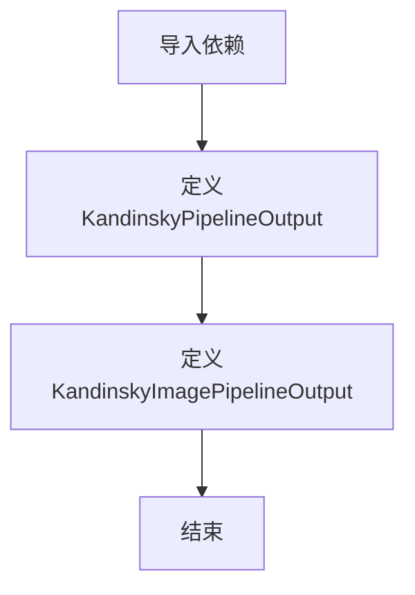

# `diffusers\src\diffusers\pipelines\kandinsky5\pipeline_output.py` 详细设计文档

该文件定义了Kandinsky视频和图像管道的输出类，用于封装扩散模型生成的视频帧和图像数据，支持torch.Tensor、np.ndarray和PIL.Image.Image等多种格式。

## 整体流程



## 类结构

```
BaseOutput (抽象基类)
└── KandinskyPipelineOutput (视频管道输出类)
└── KandinskyImagePipelineOutput (图像管道输出类)
```

## 全局变量及字段


### `torch`
    
PyTorch张量库，提供张量运算和神经网络功能

类型：`module`
    


### `BaseOutput`
    
diffusers库的基础输出类，用于定义管道输出的标准接口

类型：`class`
    


### `dataclass`
    
Python数据类装饰器，用于自动生成__init__、__repr__等方法

类型：`decorator`
    


### `KandinskyPipelineOutput.frames`
    
视频帧输出，支持批量视频序列

类型：`torch.Tensor`
    


### `KandinskyImagePipelineOutput.image`
    
图像输出，支持批量图像数据

类型：`torch.Tensor`
    
    

## 全局函数及方法


## 关键组件


### 核心功能概述

该代码定义了Kandinsky管道（KandinskyPipelineOutput）和Kandinsky图像管道（KandinskyImagePipelineOutput）的输出数据结构，用于封装扩散模型生成的视频帧和图像数据，支持torch.Tensor、numpy数组和PIL.Image多种格式。

### 文件整体运行流程

此模块作为数据容器被diffusers管道调用：当Kandinsky模型完成推理后，管道将生成的帧或图像封装为相应输出类的实例，返回给调用者。输出类通过dataclass实现，提供了清晰的数据结构和类型提示。

### 类详细信息

#### KandinskyPipelineOutput
- **类字段**：
  - `frames: torch.Tensor` - 生成的视频帧序列，支持批量维度
- **类方法**：无自定义方法，继承自BaseOutput的所有方法

#### KandinskyImagePipelineOutput
- **类字段**：
  - `image: torch.Tensor` - 生成的图像，支持批量维度
- **类方法**：无自定义方法，继承自BaseOutput的所有方法

### 关键组件信息

#### BaseOutput基类
diffusers库的基础输出类，提供序列化和其他基础功能

#### dataclass装饰器
自动生成`__init__`、`__repr__`、`__eq__`等方法，简化数据类实现

### 潜在技术债务或优化空间

1. **类型提示不够精确**：注释中说明支持多种类型（torch.Tensor、np.ndarray、list[PIL.Image.Image]），但字段类型仅声明为torch.Tensor，应使用Union类型或泛型更准确地表达
2. **缺乏验证逻辑**：没有对输入数据的形状、维度进行校验，可能导致运行时错误
3. **文档冗余**：注释中的参数描述与字段声明分离，可考虑使用field_validator进行内联验证

### 其它项目

#### 设计目标与约束
- 目标：提供统一的输出格式，兼容多种数据类型
- 约束：需继承BaseOutput以保持与diffusers框架的一致性

#### 错误处理与异常设计
- 当前未实现输入验证，建议添加形状和类型检查

#### 数据流与状态机
- 数据流：模型推理 → 管道组装输出对象 → 返回给用户
- 状态机：不涉及状态管理

#### 外部依赖与接口契约
- 依赖：torch、diffusers.utils.BaseOutput
- 接口：作为管道输出被外部调用


## 问题及建议


### 已知问题

-   **代码重复**：两个输出类结构高度相似，仅字段名称不同（frames vs image），未使用泛型或基类实现代码复用，造成冗余。
-   **类型声明与文档不一致**：文档注释中明确说明 `frames` 和 `image` 可以是 `torch.Tensor`、`np.ndarray` 或 `list[PIL.Image.Image]`，但实际类型声明仅为 `torch.Tensor`，导致类型提示不完整。
-   **缺少数据验证**：未对输入数据的形状、维度或类型进行校验，可能在运行时产生难以定位的错误。
-   **基类继承使用不当**：`BaseOutput` 在此处仅作为空基类使用，未发挥其应有作用，且未看到任何基于它的序列化或反序列化逻辑。

### 优化建议

-   **引入泛型基类**：创建泛型输出基类 `KandinskyPipelineOutput(BaseOutput[T])`，通过类型参数 `T` 统一视频和图像输出类，减少代码重复。
-   **完善类型注解**：使用 `Union` 类型或 `Any` 匹配文档中声明的多类型支持，例如 `frames: Union[torch.Tensor, np.ndarray, list]`。
-   **添加数据校验**：在 `__post_init__` 方法中加入对 `frames`/`image` 形状、维度的验证逻辑，提升运行时健壮性。
-   **考虑移除不必要的继承**：若 `BaseOutput` 未提供实际功能，可考虑移除继承关系，直接使用 `dataclass` 装饰器。
-   **补充序列化方法**：如需持久化支持，可利用 `dataclass` 的原生能力或显式实现 `to_dict`、`from_dict` 方法。


## 其它


### 一段话描述

该代码定义了两个用于Kandinsky模型管道的输出类，分别用于视频生成和图像生成，封装了不同格式（Tensor、NumPy数组或PIL图像）的输出结果。

### 文件的整体运行流程

该模块作为diffusers库的输出数据容器，被KandinskyPipeline和KandinskyImagePipeline等管道类实例化使用。当管道执行完推理后，会创建对应的Output类实例来存储生成的多帧视频或单张图像结果，供下游任务使用或转换为用户需要的格式。

### 类的详细信息

#### KandinskyPipelineOutput类

##### 类字段

- **frames**: torch.Tensor
  - 描述：生成的视频帧数据，可以是Torch Tensor、NumPy数组或PIL图像列表的嵌套列表

##### 类方法

该类为dataclass自动生成__init__、__repr__等方法，无自定义方法。

#### KandinskyImagePipelineOutput类

##### 类字段

- **image**: torch.Tensor
  - 描述：生成的图像数据，可以是Torch Tensor、NumPy数组或PIL图像列表

##### 类方法

该类为dataclass自动生成__init__、__repr__等方法，无自定义方法。

### 全局变量和全局函数

无全局变量和全局函数。

### 关键组件信息

- **BaseOutput**: diffusers库的基础输出类，提供了输出数据的标准接口
- **dataclass装饰器**: Python内置装饰器，自动生成__init__、__repr__、__eq__等方法
- **torch.Tensor**: PyTorch张量类型，用于存储数值型输出数据

### 潜在的技术债务或优化空间

1. **类型提示不够精确**: 使用了"或"的描述但实际类型仅为torch.Tensor，应考虑使用UnionType或泛型来更准确表达多格式支持
2. **文档注释与实际实现不符**: 文档说明支持多种格式，但类字段类型仅声明为torch.Tensor
3. **缺少验证逻辑**: 没有对输入数据进行格式验证或转换逻辑
4. **扩展性受限**: 如需支持更多输出格式，需要修改类定义而非通过配置扩展

### 设计目标与约束

- **设计目标**: 提供标准化的管道输出数据结构，兼容diffusers框架的BaseOutput接口
- **约束**: 必须继承BaseOutput类，字段类型需与下游处理逻辑兼容

### 错误处理与异常设计

- 该代码未实现显式的错误处理机制
- 类型错误将在使用时由Python解释器或PyTorch处理
- 建议在实例化时添加类型验证逻辑

### 数据流与状态机

- 数据流：管道推理 → Output类实例化 → 返回给调用者
- 无状态机设计，仅为数据容器

### 外部依赖与接口契约

- **依赖**: diffusers.utils.BaseOutput, torch, dataclasses
- **接口契约**: 遵循BaseOutput的接口规范，提供frames或image属性供外部访问

### 其它项目

- **序列化支持**: dataclass自动支持pickle和json序列化（需额外处理Tensor）
- **兼容性**: 需与diffusers库的版本保持兼容
- **线程安全**: 作为纯数据容器，实例化后线程安全

    