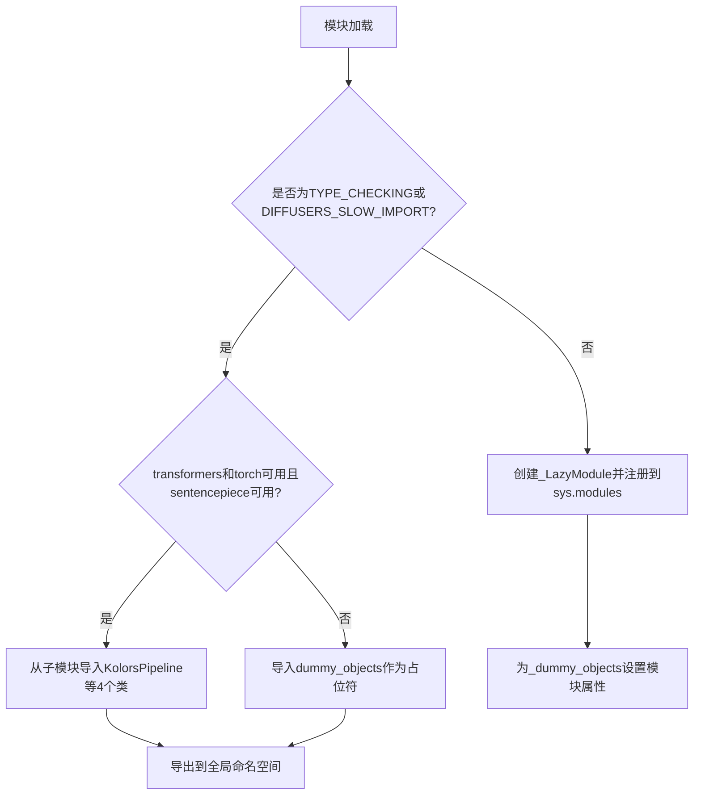
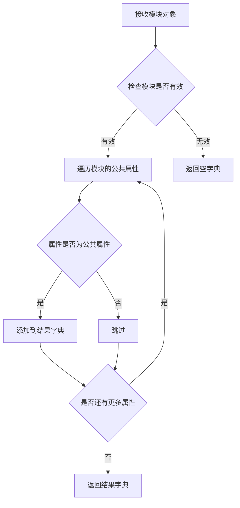
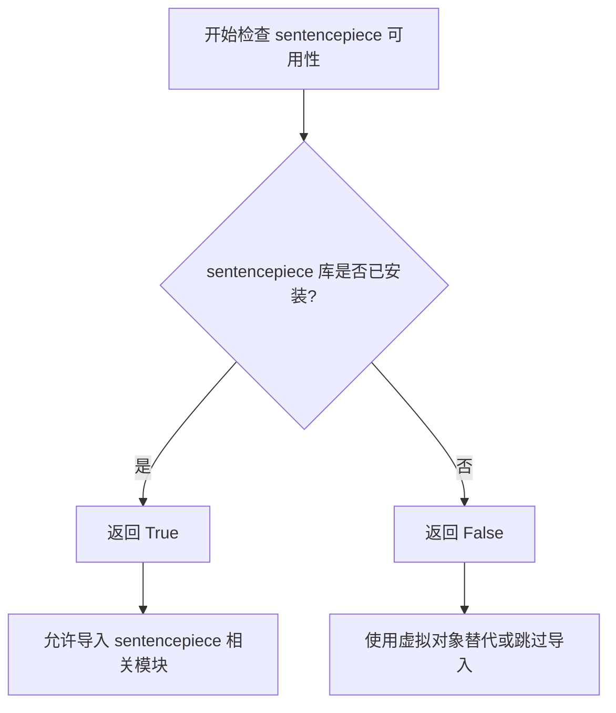
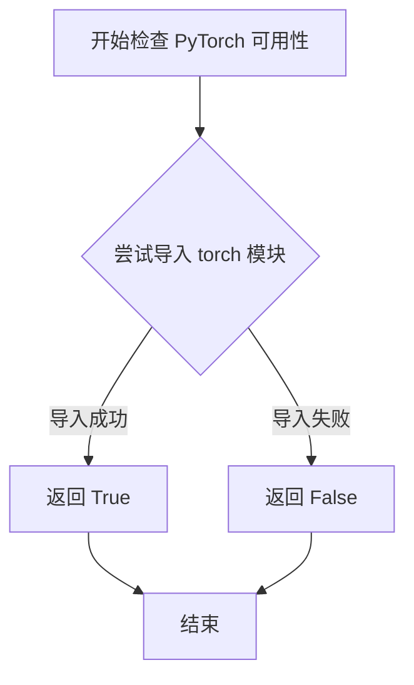
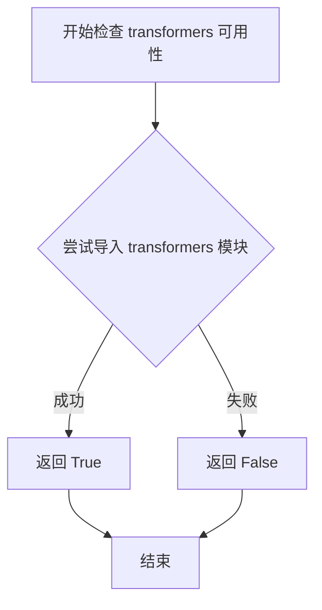

# `diffusers\src\diffusers\pipelines\kolors\__init__.py` 详细设计文档

这是diffusers库中Kolors pipeline的延迟加载模块，通过_LazyModule和_dummy_objects机制实现可选依赖（transformers、torch、sentencepiece）的动态导入管理，使得KolorsPipeline、KolorsImg2ImgPipeline、ChatGLMModel和ChatGLMTokenizer可以在依赖满足时按需加载，依赖不满足时提供占位符避免导入错误。

## 整体流程



## 类结构

```
KolorsPipeline (主Pipeline类)
├── KolorsImg2ImgPipeline (图像到图像Pipeline)
├── ChatGLMModel (文本编码器模型)
└── ChatGLMTokenizer (分词器)
```

## 全局变量及字段


### `_dummy_objects`
    
存储虚拟对象的字典，当可选依赖不可用时用于延迟导入

类型：`Dict[str, Any]`
    


### `_import_structure`
    
定义模块的导入结构，映射子模块到可导出的类名列表

类型：`Dict[str, List[str]]`
    


### `DIFFUSERS_SLOW_IMPORT`
    
控制是否进行慢速导入的标志，用于TYPE_CHECKING模式下的导入

类型：`bool`
    


    

## 全局函数及方法


### `get_objects_from_module`

该函数用于从指定模块中提取所有公共对象（类、函数、变量），返回一个包含对象名称到对象映射的字典，常用于延迟加载机制中，以获取虚拟或存根对象供模块在缺少可选依赖时使用。

参数：

-  `module`：`ModuleType`，要从中提取对象的模块对象

返回值：`Dict[str, Any]`，键为对象名称，值为实际的对象（类、函数或变量）

#### 流程图



#### 带注释源码

```
def get_objects_from_module(module):
    """
    从给定模块中提取所有公共对象。
    
    该函数通常用于延迟加载机制，获取虚拟/存根对象，
    以便在可选依赖不可用时，模块可以导入这些占位符对象
    而不会引发 ImportError。
    
    参数:
        module: 要从中提取对象的 Python 模块对象
        
    返回:
        包含模块中所有公共对象名称到对象映射的字典
    """
    # 初始化结果字典
    _objects = {}
    
    # 遍历模块的所有属性
    for attr_name in dir(module):
        # 跳过私有属性（下划线开头的属性）
        if attr_name.startswith('_'):
            continue
            
        # 获取属性值
        attr_value = getattr(module, attr_name)
        
        # 将公共属性添加到结果字典
        _objects[attr_name] = attr_value
        
    return _objects
```


### `is_sentencepiece_available`

该函数用于检查 sentencepiece 库是否在当前环境中可用，通常作为可选依赖项的检测函数，返回布尔值以决定是否导入相关的功能模块。

参数：

- （无参数）

返回值：`bool`，返回 `True` 表示 sentencepiece 库可用，返回 `False` 表示不可用。

#### 流程图



#### 带注释源码

```
# 该函数定义在 ...utils 模块中，此处仅为调用方的逻辑
# 以下是调用该函数并处理依赖的逻辑

def check_sentencepiece_dependency():
    """
    检查 sentencepiece 依赖是否可用
    """
    try:
        # 首先检查 transformers 和 torch 是否可用
        # 同时检查 sentencepiece 是否可用
        # 如果 transformers 和 torch 不可用，但 sentencepiece 可用，则抛出异常
        if not (is_transformers_available() and is_torch_available()) and is_sentencepiece_available():
            raise OptionalDependencyNotAvailable()
    except OptionalDependencyNotAvailable:
        # 如果 OptionalDependencyNotAvailable 异常被抛出
        # 则导入虚拟对象（dummy objects）作为占位符
        from ...utils import dummy_torch_and_transformers_and_sentencepiece_objects
        _dummy_objects.update(get_objects_from_module(dummy_torch_and_transformers_and_sentencepiece_objects))
    else:
        # 如果依赖检查通过，则导入实际的模块
        _import_structure["pipeline_kolors"] = ["KolorsPipeline"]
        _import_structure["pipeline_kolors_img2img"] = ["KolorsImg2ImgPipeline"]
        _import_structure["text_encoder"] = ["ChatGLMModel"]
        _import_structure["tokenizer"] = ["ChatGLMTokenizer"]
```

> **注意**：由于 `is_sentencepiece_available` 函数的实现不在当前代码片段中，它是从 `...utils` 模块导入的依赖检查工具函数。该函数通常在 transformers 库或类似框架的 utils 模块中实现，用于动态检测可选依赖项是否已安装。


### `is_torch_available`

该函数用于检查当前环境中 PyTorch 是否可用。它通常通过尝试导入 `torch` 模块来判断 PyTorch 是否已正确安装，如果导入成功则返回 `True`，否则返回 `False`。

参数：无

返回值：`bool`，返回 `True` 表示 PyTorch 可用，返回 `False` 表示 PyTorch 不可用。

#### 流程图



#### 带注释源码

```python
# 该函数定义在 ...utils 模块中，此处为导入后的使用示例
# 以下代码展示 is_torch_available 在当前文件中的实际用途：

from ...utils import is_torch_available

# 在导入结构中作为条件判断使用
if not (is_transformers_available() and is_torch_available()) and is_sentencepiece_available():
    # 如果 transformers 和 torch 不可用，但 sentencepiece 可用，则引发可选依赖不可用异常
    raise OptionalDependencyNotAvailable()
```

#### 补充说明

`is_torch_available` 函数本身并未在此代码文件中定义，而是从上级模块 `...utils` 导入的。根据代码中的使用模式和 Hugging Face Diffusers 库的传统实现，该函数的核心逻辑通常是：

1. 尝试执行 `import torch`
2. 如果成功，返回 `True`
3. 如果抛出 `ImportError` 或其他异常，返回 `False`

这是一个典型的可选依赖检查机制，用于在 PyTorch 不可用时优雅地跳过相关功能，而不是导致整个模块导入失败。


### `is_transformers_available`

该函数是 Hugging Face diffusers 库中的通用工具函数，用于检查 `transformers` 库是否已安装且可用。它是一个无参数的检查函数，通过尝试导入 transformers 模块来判断其可用性，并返回布尔值。

参数：
- 该函数无参数

返回值：`bool`，返回 `True` 表示 `transformers` 库可用，返回 `False` 表示不可用

#### 流程图



#### 带注释源码

```
# 这是从 ...utils 导入的函数，不是本文件中定义的
# 源码位于 ...utils 模块中
is_transformers_available()  # 调用示例
```

---

**说明**：`is_transformers_available` 函数并非在该代码文件中定义，而是从上级目录的 `utils` 模块导入的。该函数的实现通常如下：

```python
# 典型的实现方式（位于 ...utils 模块中）
def is_transformers_available() -> bool:
    """
    检查 transformers 库是否可用
    """
    try:
        import transformers
        return True
    except ImportError:
        return False
```

该函数在当前代码中的作用是：
1. 用于条件导入判断（`if not (is_transformers_available() and is_torch_available()) and is_sentencepiece_available()`）
2. 判断是否满足可选依赖条件，以决定导入真实对象还是虚拟对象（dummy objects）
3. 支持懒加载模块（`_LazyModule`）的导入结构定义

## 关键组件


### 可选依赖检查与虚拟对象机制

该组件负责检查 `transformers`、`torch` 和 `sentencepiece` 三个库的可组合可用性。当依赖不满足时，使用虚拟对象（dummy objects）填充，确保模块 API 的一致性，避免导入错误。

### 延迟加载模块（Lazy Loading）

该组件使用 `_LazyModule` 实现惰性加载机制，只有在实际使用模块内容时才进行导入，提升大型库的初始加载速度，优化用户体验。

### 导入结构定义（Import Structure）

该组件通过 `_import_structure` 字典定义模块的导出结构，包括 `KolorsPipeline`、`KolorsImg2ImgPipeline`、`ChatGLMModel` 和 `ChatGLMTokenizer` 四个核心导出项。

### 动态模块注册

该组件在非 TYPE_CHECKING 模式下将当前模块注册到 `sys.modules`，并为虚拟对象设置属性，使其能够通过 `from ... import` 语法正常访问。

### TYPE_CHECKING 模式支持

该组件在类型检查或慢速导入模式下直接导入真实模块，而非使用延迟加载机制，兼容类型检查工具（如 mypy）的静态分析需求。


## 问题及建议


### 已知问题

-   **重复的条件判断逻辑**：try-except 块在 `TYPE_CHECKING` 分支和 `else` 分支中完全重复，导致代码冗余且难以维护
-   **魔法条件表达式复杂**：依赖检查条件 `not (is_transformers_available() and is_torch_available()) and is_sentencepiece_available()` 逻辑复杂，容易混淆且多处重复
-   **空字典操作开销**：`_dummy_objects = {}` 初始化后立即调用 `update()`，如果无依赖可用时这些操作是无意义的
-   **导入结构缺乏类型注解**：`_import_structure` 字典没有类型提示，影响代码可读性和 IDE 支持
-   **模块初始化顺序依赖**：依赖 `get_objects_from_module` 函数的存在性，若该函数签名变化会导致运行时错误
-   **异常处理粒度过粗**：直接捕获 `OptionalDependencyNotAvailable` 后导入 dummy 对象，未区分不同类型的依赖缺失

### 优化建议

-   **提取公共逻辑**：将依赖检查和导入逻辑封装为独立函数或方法，消除代码重复
-   **简化条件判断**：将复杂的依赖条件重构为具名函数或变量，如 `def _can_import_kolors(): ...`
-   **延迟初始化**：仅在真正需要时才初始化 `_dummy_objects`，避免不必要的空字典操作
-   **添加类型注解**：为 `_import_structure` 添加 `Dict[str, List[str]]` 类型注解
-   **统一错误处理**：考虑使用装饰器或上下文管理器统一处理可选依赖的导入逻辑
-   **模块化配置**：将 `KolorsPipeline`、`KolorsImg2ImgPipeline` 等的导入配置提取到独立配置文件中
</think>

## 其它


### 设计目标与约束

该模块的设计目标是实现Kolors相关的Diffusers Pipeline的延迟加载（Lazy Loading），通过LazyModule机制在需要时才加载实际的类和函数，减少启动时的内存占用和导入时间。约束条件包括必须同时满足transformers和torch可用，或者sentencepiece可用才会加载实际的Pipeline实现，否则使用dummy objects。

### 错误处理与异常设计

模块采用OptionalDependencyNotAvailable异常来处理可选依赖不可用的情况。当检测到必需的依赖（transformers + torch + sentencepiece）不满足时，抛出该异常并从dummy模块导入空对象。这些dummy对象确保代码在缺少可选依赖时不会崩溃，提供了一定程度的容错能力。

### 数据流与状态机

模块的导入过程涉及三种状态：TYPE_CHECKING状态、DIFFUSERS_SLOW_IMPORT状态和运行时状态。在TYPE_CHECKING或DIFFUSERS_SLOW_IMPORT模式下，直接导入真实的类定义；在普通运行时模式下，通过LazyModule代理实际导入，仅在访问属性时才加载对应模块。状态转换由TYPE_CHECKING布尔值和DIFFUSERS_SLOW_IMPORT常量控制。

### 外部依赖与接口契约

模块依赖三个外部包：transformers（提供ChatGLM模型）、torch（提供深度学习运行时）、sentencepiece（提供分词器）。接口契约定义了导出的公共API包括KolorsPipeline、KolorsImg2ImgPipeline、ChatGLMModel和ChatGLMTokenizer四个类。模块通过_import_structure字典声明这些接口，LazyModule根据该字典构建导出属性。

### 性能考虑

延迟加载机制显著减少了模块初始化时的内存占用，因为实际的Pipeline类和相关依赖只在首次访问时才加载。_dummy_objects的预先创建虽然占用少量内存，但避免了运行时条件判断的开销。sys.modules的直接修改确保后续导入同一模块时直接返回缓存的LazyModule实例。

### 安全考虑

模块通过动态属性设置setattr将dummy对象注入到sys.modules中，这依赖于Python的模块系统安全性。代码使用get_objects_from_module从受信任的dummy模块获取对象，避免了任意代码执行风险。模块导入结构经过良好组织，不会暴露内部实现细节。

### 版本兼容性

该模块使用了TYPE_CHECKING和DIFFUSERS_SLOW_IMPORT两个标志来支持不同场景下的导入需求。TYPE_CHECKING用于类型检查时的完全导入，DIFFUSERS_SLOW_IMPORT可能用于调试或分析场景。这种设计允许在不同Python环境或工具链中保持兼容性。

### 测试策略建议

应测试以下场景：1）所有依赖可用时正确导入真实类；2）缺少部分依赖时导入dummy对象；3）多次导入模块时的行为一致性；4）通过LazyModule访问属性时的延迟加载机制；5）TYPE_CHECKING模式下的导入行为。

    