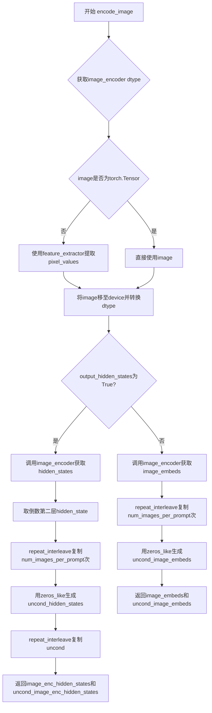
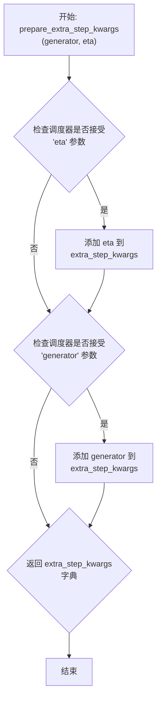
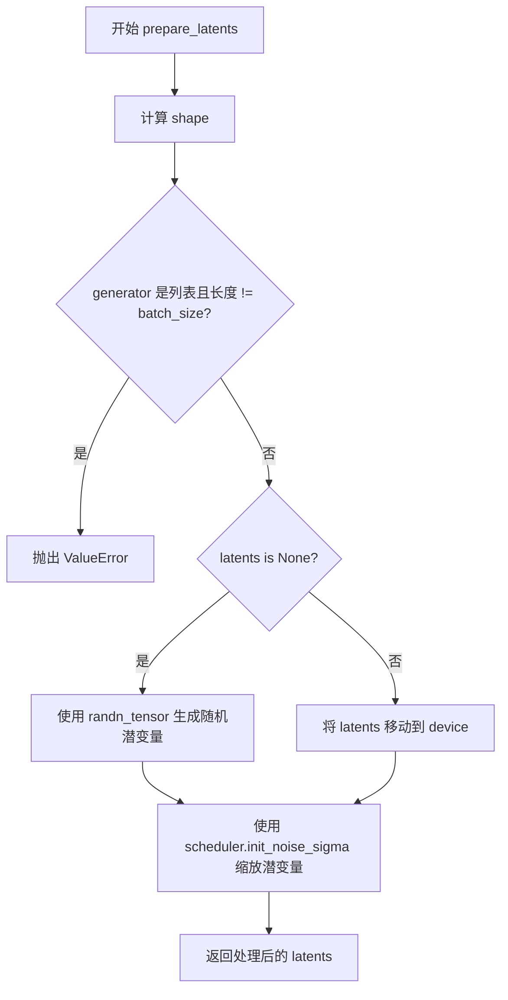
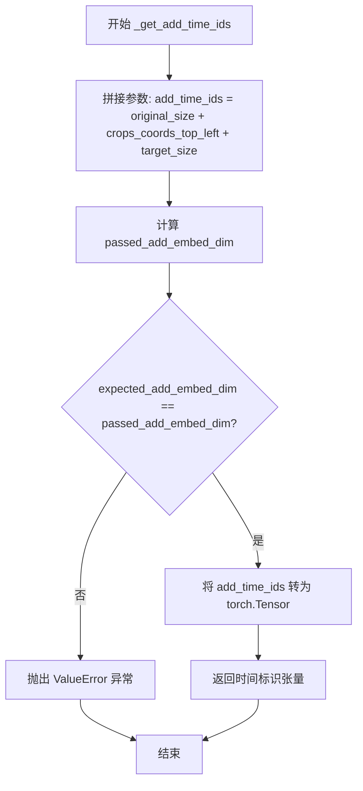

# `diffusers\src\diffusers\pipelines\kolors\pipeline_kolors.py` 详细设计文档

KolorsPipeline是一个基于Diffusers库实现的文本到图像生成Pipeline，继承自Stable Diffusion XL架构，集成了ChatGLM作为文本编码器，支持LoRA权重加载、IP-Adapter图像条件注入以及KarrasDiffusionSchedulers调度器，用于根据文本提示生成高质量图像。

## 整体流程

```mermaid
graph TD
    Start([用户调用 __call__]) --> Check[调用 check_inputs 验证参数]
    Check --> Encode[调用 encode_prompt 生成文本嵌入]
    Encode --> PrepTimesteps[调用 retrieve_timesteps 获取扩散时间步]
    PrepTimesteps --> PrepLatents[调用 prepare_latents 初始化噪声潜在向量]
    PrepLatents --> Loop{进入去噪循环 (Denoising Loop)}
    Loop --> Unet[调用 UNet 预测噪声残差]
    Unet --> Guidance[执行 Classifier-Free Guidance]
    Guidance --> Scheduler[调用 Scheduler.step 更新潜在向量]
    Scheduler --> CheckLoop{循环是否结束?}
    CheckLoop -- 否 --> Loop
    CheckLoop -- 是 --> Decode[调用 VAE.decode 解码潜在向量]
    Decode --> Post[调用 image_processor 后处理图像]
    Post --> End([返回 KolorsPipelineOutput])
```

## 类结构

```
DiffusionPipeline (基类)
├── StableDiffusionMixin (SDXL混合特征)
├── StableDiffusionLoraLoaderMixin (LoRA加载能力)
├── IPAdapterMixin (IP-Adapter图像提示能力)
└── KolorsPipeline (当前文件核心类)
```

## 全局变量及字段


### `logger`
    
模块级日志记录器

类型：`logging.Logger`
    


### `EXAMPLE_DOC_STRING`
    
示例文档字符串，包含代码使用示例

类型：`str`
    


### `XLA_AVAILABLE`
    
标识PyTorch XLA是否可用

类型：`bool`
    


### `KolorsPipeline.vae`
    
VAE模型，用于编解码潜在空间

类型：`AutoencoderKL`
    


### `KolorsPipeline.text_encoder`
    
文本编码器，用于将文本转换为嵌入向量

类型：`ChatGLMModel`
    


### `KolorsPipeline.tokenizer`
    
分词器，用于将文本分割为token

类型：`ChatGLMTokenizer`
    


### `KolorsPipeline.unet`
    
条件U-Net，用于去噪图像潜在表示

类型：`UNet2DConditionModel`
    


### `KolorsPipeline.scheduler`
    
扩散调度器，控制去噪过程的时间步

类型：`KarrasDiffusionSchedulers`
    


### `KolorsPipeline.image_encoder`
    
CLIP图像编码器（可选），用于IP-Adapter图像嵌入

类型：`CLIPVisionModelWithProjection`
    


### `KolorsPipeline.feature_extractor`
    
CLIP图像特征提取器（可选），用于预处理图像

类型：`CLIPImageProcessor`
    


### `KolorsPipeline.vae_scale_factor`
    
VAE缩放因子，用于计算潜在空间尺寸

类型：`int`
    


### `KolorsPipeline.default_sample_size`
    
默认采样分辨率

类型：`int`
    


### `KolorsPipeline._callback_tensor_inputs`
    
回调支持的张量输入列表

类型：`list`
    


### `KolorsPipeline._optional_components`
    
可选组件列表

类型：`list`
    
    

## 全局函数及方法


### `retrieve_timesteps`

该函数是 Kolors 管道中的时间步检索工具函数，用于获取调度器的时间步序列。它支持三种模式：通过 `num_inference_steps` 自动计算时间步、使用自定义的 `timesteps` 列表、或使用自定义的 `sigmas` 列表。函数内部会检查调度器是否支持相应的参数，然后调用调度器的 `set_timesteps` 方法并返回更新后的时间步序列和实际推理步数。

参数：

- `scheduler`：`SchedulerMixin`，调度器对象，用于获取时间步
- `num_inference_steps`：`int | None`，扩散模型生成样本时使用的去噪步数，若使用此参数则 `timesteps` 必须为 `None`
- `device`：`str | torch.device | None`，时间步要移动到的设备，若为 `None` 则不移动
- `timesteps`：`list[int] | None`，自定义时间步，用于覆盖调度器的时间步间隔策略，传递此参数时 `num_inference_steps` 和 `sigmas` 必须为 `None`
- `sigmas`：`list[float] | None`，自定义 sigmas 值，用于覆盖调度器的时间步间隔策略，传递此参数时 `num_inference_steps` 和 `timesteps` 必须为 `None`
- `**kwargs`：任意关键字参数，将传递给 `scheduler.set_timesteps` 方法

返回值：`tuple[torch.Tensor, int]`，元组第一个元素是调度器的时间步序列，第二个元素是推理步数

#### 流程图

```mermaid
flowchart TD
    A[开始: retrieve_timesteps] --> B{检查 timesteps 和 sigmas 是否同时存在}
    B -->|是| C[抛出 ValueError: 只能选择 timesteps 或 sigmas 之一]
    B -->|否| D{检查 timesteps 是否存在}
    D -->|是| E[检查调度器是否支持 timesteps 参数]
    E -->|不支持| F[抛出 ValueError: 当前调度器不支持自定义 timesteps]
    E -->|支持| G[调用 scheduler.set_timesteps<br/>timesteps=timesteps, device=device, **kwargs]
    D -->|否| H{检查 sigmas 是否存在}
    H -->|是| I[检查调度器是否支持 sigmas 参数]
    I -->|不支持| J[抛出 ValueError: 当前调度器不支持自定义 sigmas]
    I -->|支持| K[调用 scheduler.set_timesteps<br/>sigmas=sigmas, device=device, **kwargs]
    H -->|否| L[调用 scheduler.set_timesteps<br/>num_inference_steps, device=device, **kwargs]
    G --> M[获取 scheduler.timesteps]
    K --> M
    L --> M
    M --> N[计算 num_inference_steps = len(timesteps)]
    N --> O[返回 timesteps, num_inference_steps]
```

#### 带注释源码

```python
def retrieve_timesteps(
    scheduler,
    num_inference_steps: int | None = None,
    device: str | torch.device | None = None,
    timesteps: list[int] | None = None,
    sigmas: list[float] | None = None,
    **kwargs,
):
    r"""
    Calls the scheduler's `set_timesteps` method and retrieves timesteps from the scheduler after the call. Handles
    custom timesteps. Any kwargs will be supplied to `scheduler.set_timesteps`.

    Args:
        scheduler (`SchedulerMixin`):
            The scheduler to get timesteps from.
        num_inference_steps (`int`):
            The number of diffusion steps used when generating samples with a pre-trained model. If used, `timesteps`
            must be `None`.
        device (`str` or `torch.device`, *optional*):
            The device to which the timesteps should be moved to. If `None`, the timesteps are not moved.
        timesteps (`list[int]`, *optional*):
            Custom timesteps used to override the timestep spacing strategy of the scheduler. If `timesteps` is passed,
            `num_inference_steps` and `sigmas` must be `None`.
        sigmas (`list[float]`, *optional*):
            Custom sigmas used to override the timestep spacing strategy of the scheduler. If `sigmas` is passed,
            `num_inference_steps` and `timesteps` must be `None`.

    Returns:
        `tuple[torch.Tensor, int]`: A tuple where the first element is the timestep schedule from the scheduler and the
        second element is the number of inference steps.
    """
    # 检查是否同时传递了 timesteps 和 sigmas，两者只能选择其一
    if timesteps is not None and sigmas is not None:
        raise ValueError("Only one of `timesteps` or `sigmas` can be passed. Please choose one to set custom values")
    
    # 处理自定义 timesteps 的情况
    if timesteps is not None:
        # 通过 inspect 检查调度器的 set_timesteps 方法是否接受 timesteps 参数
        accepts_timesteps = "timesteps" in set(inspect.signature(scheduler.set_timesteps).parameters.keys())
        if not accepts_timesteps:
            raise ValueError(
                f"The current scheduler class {scheduler.__class__}'s `set_timesteps` does not support custom"
                f" timestep schedules. Please check whether you are using the correct scheduler."
            )
        # 调用调度器的 set_timesteps 方法设置自定义时间步
        scheduler.set_timesteps(timesteps=timesteps, device=device, **kwargs)
        # 从调度器获取更新后的时间步
        timesteps = scheduler.timesteps
        # 计算实际的推理步数
        num_inference_steps = len(timesteps)
    # 处理自定义 sigmas 的情况
    elif sigmas is not None:
        # 通过 inspect 检查调度器的 set_timesteps 方法是否接受 sigmas 参数
        accept_sigmas = "sigmas" in set(inspect.signature(scheduler.set_timesteps).parameters.keys())
        if not accept_sigmas:
            raise ValueError(
                f"The current scheduler class {scheduler.__class__}'s `set_timesteps` does not support custom"
                f" sigmas schedules. Please check whether you are using the correct scheduler."
            )
        # 调用调度器的 set_timesteps 方法设置自定义 sigmas
        scheduler.set_timesteps(sigmas=sigmas, device=device, **kwargs)
        # 从调度器获取更新后的时间步
        timesteps = scheduler.timesteps
        # 计算实际的推理步数
        num_inference_steps = len(timesteps)
    # 处理默认情况：使用 num_inference_steps 计算时间步
    else:
        scheduler.set_timesteps(num_inference_steps, device=device, **kwargs)
        timesteps = scheduler.timesteps
    
    # 返回时间步序列和推理步数
    return timesteps, num_inference_steps
```

---

#### 关键组件信息

| 组件名称 | 一句话描述 |
|---------|-----------|
| `inspect` 模块 | Python 标准库，用于动态检查函数签名参数 |
| `scheduler.set_timesteps` | 调度器的核心方法，用于设置去噪过程的时间步序列 |
| `scheduler.timesteps` | 调度器的时间步属性，存储当前的时间步张量 |

#### 潜在的技术债务或优化空间

1. **重复代码**：在三个分支（timesteps、sigmas、默认）中，获取 `timesteps` 和计算 `num_inference_steps` 的逻辑重复，可以提取为公共代码。
2. **错误信息可改进**：当前错误信息只提示检查是否使用正确的调度器，可以提供更多关于哪些调度器支持这些参数的文档链接。
3. **类型提示一致性**：参数类型使用了 Python 3.10+ 的联合类型语法（`int | None`），但未考虑向下兼容性问题。

#### 其它项目

**设计目标与约束**：
- 该函数的设计目标是提供统一的时间步获取接口，同时支持默认计算和用户自定义两种模式
- 约束条件：timesteps 和 sigmas 互斥，不能同时传递

**错误处理与异常设计**：
- 使用 `ValueError` 捕获参数冲突错误（timesteps 和 sigmas 同时传递）
- 使用 `ValueError` 捕获调度器不支持自定义参数的情况
- 错误信息包含调度器类名，便于调试

**数据流与状态机**：
- 输入：调度器对象 + 可选的推理步数/时间步/sigmas
- 处理：根据参数类型选择不同的分支调用 `set_timesteps`
- 输出：时间步张量 + 实际推理步数

**外部依赖与接口契约**：
- 依赖 `inspect` 模块检查调度器方法签名
- 依赖调度器实现 `SchedulerMixin` 接口
- 调度器必须实现 `set_timesteps` 方法和 `timesteps` 属性


### `KolorsPipeline.__init__`

该方法是 KolorsPipeline 类的构造函数，负责初始化文本到图像生成扩散管道所需的所有核心组件（VAE、文本编码器、分词器、UNet、调度器等），并注册可选的图像编码器用于 IP-Adapter，同时配置 VAE 缩放因子和图像处理器。

参数：

- `vae`：`AutoencoderKL`，Variational Auto-Encoder (VAE) 模型，用于编码和解码图像与潜在表示
- `text_encoder`：`ChatGLMModel`，冻结的文本编码器，Kolors 使用 ChatGLM3-6B
- `tokenizer`：`ChatGLMTokenizer`，ChatGLMTokenizer 类的分词器
- `unet`：`UNet2DConditionModel`，条件 U-Net 架构，用于对编码的图像潜在表示进行去噪
- `scheduler`：`KarrasDiffusionSchedulers`，与 `unet` 结合使用以对编码图像潜在表示进行去噪的调度器
- `image_encoder`：`CLIPVisionModelWithProjection`（可选），用于 IP-Adapter 的图像编码器
- `feature_extractor`：`CLIPImageProcessor`（可选），CLIP 图像处理器，用于图像特征提取
- `force_zeros_for_empty_prompt`：`bool`（可选，默认为 `False`），是否将负提示嵌入强制设为 0

返回值：无（`None`），构造函数不返回值，仅初始化对象状态

#### 流程图

```mermaid
flowchart TD
    A[开始 __init__] --> B[调用 super().__init__]
    B --> C[register_modules: 注册 vae<br/>text_encoder<br/>tokenizer<br/>unet<br/>scheduler<br/>image_encoder<br/>feature_extractor]
    C --> D[register_to_config: 注册 force_zeros_for_empty_prompt]
    D --> E{self.vae 是否存在}
    E -->|是| F[计算 vae_scale_factor<br/>2 \*\* (len(vae.config.block_out_channels) - 1)]
    E -->|否| G[vae_scale_factor = 8]
    F --> H[创建 VaeImageProcessor]
    G --> H
    H --> I{self.unet 是否存在<br/>且有 sample_size 属性}
    I -->|是| J[default_sample_size = unet.config.sample_size]
    I -->|否| K[default_sample_size = 128]
    J --> L[结束 __init__]
    K --> L
```

#### 带注释源码

```python
def __init__(
    self,
    vae: AutoencoderKL,
    text_encoder: ChatGLMModel,
    tokenizer: ChatGLMTokenizer,
    unet: UNet2DConditionModel,
    scheduler: KarrasDiffusionSchedulers,
    image_encoder: CLIPVisionModelWithProjection = None,
    feature_extractor: CLIPImageProcessor = None,
    force_zeros_for_empty_prompt: bool = False,
):
    """
    初始化 KolorsPipeline 文本到图像生成管道

    参数:
        vae: Variational Auto-Encoder (VAE) 模型，用于编码和解码图像与潜在表示
        text_encoder: 冻结的文本编码器，Kolors 使用 ChatGLM3-6B
        tokenizer: ChatGLMTokenizer 类的分词器
        unet: 条件 U-Net 架构，用于对编码的图像潜在表示进行去噪
        scheduler: 与 unet 结合使用以对编码图像潜在表示进行去噪的调度器
        image_encoder: 可选的 CLIPVisionModelWithProjection，用于 IP-Adapter
        feature_extractor: 可选的 CLIPImageProcessor，用于图像特征提取
        force_zeros_for_empty_prompt: 是否将负提示嵌入强制设为 0
    """
    # 调用父类 DiffusionPipeline 的初始化方法
    super().__init__()

    # 注册所有模块，使管道能够访问和管理这些组件
    self.register_modules(
        vae=vae,
        text_encoder=text_encoder,
        tokenizer=tokenizer,
        unet=unet,
        scheduler=scheduler,
        image_encoder=image_encoder,
        feature_extractor=feature_extractor,
    )

    # 将 force_zeros_for_empty_prompt 注册到配置中
    self.register_to_config(force_zeros_for_empty_prompt=force_zeros_for_empty_prompt)

    # 计算 VAE 缩放因子，用于调整潜在表示的分辨率
    # 公式: 2 ** (len(vae.config.block_out_channels) - 1)
    # 如果 VAE 不存在，默认使用 8
    self.vae_scale_factor = 2 ** (len(self.vae.config.block_out_channels) - 1) if getattr(self, "vae", None) else 8

    # 创建 VAE 图像处理器，用于预处理和后处理图像
    self.image_processor = VaeImageProcessor(vae_scale_factor=self.vae_scale_factor)

    # 确定默认采样大小，用于生成图像的默认分辨率
    # 从 UNet 配置中获取 sample_size，如果不存在则使用默认值 128
    self.default_sample_size = (
        self.unet.config.sample_size
        if hasattr(self, "unet") and self.unet is not None and hasattr(self.unet.config, "sample_size")
        else 128
    )
```


### `KolorsPipeline.encode_prompt`

该函数是 KolorsPipeline 的核心方法之一，负责将文本提示（prompt）编码为文本编码器隐藏状态（text encoder hidden states），支持正向提示和负面提示的嵌入生成，并为后续的图像生成过程准备条件输入。

参数：

- `prompt`：`str | list[str] | None`，要编码的文本提示，支持单个字符串或字符串列表
- `device`：`torch.device | None`，指定计算设备，默认为执行设备
- `num_images_per_prompt`：`int`，每个提示词生成的图像数量，用于批量生成
- `do_classifier_free_guidance`：`bool`，是否启用无分类器自由引导（CFG），为 `True` 时会生成负面提示嵌入
- `negative_prompt`：`str | list[str] | Optional`，负面提示词，用于引导图像远离指定内容
- `prompt_embeds`：`torch.FloatTensor | Optional`，预生成的文本嵌入，可用于微调文本输入
- `pooled_prompt_embeds`：`torch.Tensor | Optional`，预生成的池化文本嵌入，包含全局 pooling 后的表示
- `negative_prompt_embeds`：`torch.FloatTensor | Optional`，预生成的负面文本嵌入
- `negative_pooled_prompt_embeds`：`torch.Tensor | Optional`，预生成的负面池化文本嵌入
- `max_sequence_length`：`int`，最大序列长度，默认为 256

返回值：`Tuple[torch.Tensor, torch.Tensor, torch.Tensor, torch.Tensor]`，返回一个包含四个元素的元组——`prompt_embeds`（正向文本嵌入）、`negative_prompt_embeds`（负面文本嵌入）、`pooled_prompt_embeds`（正向池化嵌入）、`negative_pooled_prompt_embeds`（负面池化嵌入）

#### 流程图

```mermaid
flowchart TD
    A[encode_prompt 开始] --> B{检查 prompt 类型}
    B -->|str| C[batch_size = 1]
    B -->|list| D[batch_size = len(prompt)]
    B -->|其他| E[batch_size = prompt_embeds.shape[0]]
    C --> F[定义 tokenizers 和 text_encoders]
    D --> F
    E --> F
    F --> G{prompt_embeds 是否为空?}
    G -->|是| H[遍历 tokenizers 和 text_encoders]
    G -->|否| I[跳过嵌入生成]
    H --> J[tokenizer 处理 prompt]
    J --> K[text_encoder 编码]
    K --> L[提取 hidden_states]
    L --> M[permute 和 clone 调整维度]
    M --> N[repeat 扩展到 num_images_per_prompt]
    N --> O[添加到 prompt_embeds_list]
    I --> P{是否需要 CFG?}
    O --> P
    P -->|是 且无 negative_prompt_embeds| Q[检查 force_zeros_for_empty_prompt]
    Q --> R{zero_out_negative_prompt?}
    R -->|是| S[negative_prompt_embeds = torch.zeros_like]
    R -->|否| T[构建 uncond_tokens]
    T --> U[tokenizer 处理 uncond_tokens]
    U --> V[text_encoder 编码]
    V --> W[提取 negative 嵌入]
    W --> X[repeat 扩展维度]
    X --> Y[添加到 negative_prompt_embeds_list]
    S --> Z[pooled_prompt_embeds repeat]
    Y --> Z
    P -->|否| Z
    Z --> AA[pooled_prompt_embeds repeat]
    AA --> BB{do_classifier_free_guidance?}
    BB -->|是| CC[negative_pooled_prompt_embeds repeat]
    BB -->|否| DD[跳过]
    CC --> EE[返回四个嵌入张量]
    DD --> EE
```

#### 带注释源码

```python
def encode_prompt(
    self,
    prompt,
    device: torch.device | None = None,
    num_images_per_prompt: int = 1,
    do_classifier_free_guidance: bool = True,
    negative_prompt=None,
    prompt_embeds: torch.FloatTensor | None = None,
    pooled_prompt_embeds: torch.Tensor | None = None,
    negative_prompt_embeds: torch.FloatTensor | None = None,
    negative_pooled_prompt_embeds: torch.Tensor | None = None,
    max_sequence_length: int = 256,
):
    r"""
    Encodes the prompt into text encoder hidden states.

    Args:
        prompt (`str` or `list[str]`, *optional*):
            prompt to be encoded
        device: (`torch.device`):
            torch device
        num_images_per_prompt (`int`):
            number of images that should be generated per prompt
        do_classifier_free_guidance (`bool`):
            whether to use classifier free guidance or not
        negative_prompt (`str` or `list[str]`, *optional*):
            The prompt or prompts not to guide the image generation. If not defined, one has to pass
            `negative_prompt_embeds` instead. Ignored when not using guidance (i.e., ignored if `guidance_scale` is
            less than `1`).
        prompt_embeds (`torch.FloatTensor`, *optional*):
            Pre-generated text embeddings. Can be used to easily tweak text inputs, *e.g.* prompt weighting. If not
            provided, text embeddings will be generated from `prompt` input argument.
        pooled_prompt_embeds (`torch.Tensor`, *optional*):
            Pre-generated pooled text embeddings. Can be used to easily tweak text inputs, *e.g.* prompt weighting.
            If not provided, pooled text embeddings will be generated from `prompt` input argument.
        negative_prompt_embeds (`torch.FloatTensor`, *optional*):
            Pre-generated negative text embeddings. Can be used to easily tweak text inputs, *e.g.* prompt
            weighting. If not provided, negative_prompt_embeds will be generated from `negative_prompt` input
            argument.
        negative_pooled_prompt_embeds (`torch.Tensor`, *optional*):
            Pre-generated negative pooled text embeddings. Can be used to easily tweak text inputs, *e.g.* prompt
            weighting. If not provided, pooled negative_prompt_embeds will be generated from `negative_prompt`
            input argument.
        max_sequence_length (`int` defaults to 256): Maximum sequence length to use with the `prompt`.
    """
    # 确定设备，如果未指定则使用执行设备
    device = device or self._execution_device

    # 确定批次大小
    if prompt is not None and isinstance(prompt, str):
        batch_size = 1
    elif prompt is not None and isinstance(prompt, list):
        batch_size = len(prompt)
    else:
        batch_size = prompt_embeds.shape[0]

    # 定义分词器和文本编码器列表（支持多模态扩展）
    tokenizers = [self.tokenizer]
    text_encoders = [self.text_encoder]

    # 如果未提供 prompt_embeds，则从 prompt 生成
    if prompt_embeds is None:
        prompt_embeds_list = []
        for tokenizer, text_encoder in zip(tokenizers, text_encoders):
            # 使用分词器将文本转换为 token
            text_inputs = tokenizer(
                prompt,
                padding="max_length",
                max_length=max_sequence_length,
                truncation=True,
                return_tensors="pt",
            ).to(device)
            
            # 文本编码器编码，获取隐藏状态
            output = text_encoder(
                input_ids=text_inputs["input_ids"],
                attention_mask=text_inputs["attention_mask"],
                position_ids=text_inputs["position_ids"],
                output_hidden_states=True,
            )

            # [max_sequence_length, batch, hidden_size] -> [batch, max_sequence_length, hidden_size]
            # clone 创建连续张量以避免内存问题
            prompt_embeds = output.hidden_states[-2].permute(1, 0, 2).clone()
            
            # [max_sequence_length, batch, hidden_size] -> [batch, hidden_size]
            # 提取最后一层的 pooled 输出
            pooled_prompt_embeds = output.hidden_states[-1][-1, :, :].clone()
            
            # 获取嵌入维度信息
            bs_embed, seq_len, _ = prompt_embeds.shape
            
            # 重复嵌入以匹配每提示生成的图像数量
            prompt_embeds = prompt_embeds.repeat(1, num_images_per_prompt, 1)
            prompt_embeds = prompt_embeds.view(bs_embed * num_images_per_prompt, seq_len, -1)

            prompt_embeds_list.append(prompt_embeds)

        # 取第一个（也是唯一的）文本编码器的结果
        prompt_embeds = prompt_embeds_list[0]

    # 处理无分类器自由引导的负面提示
    # 如果配置中 force_zeros_for_empty_prompt 为 True 且未提供 negative_prompt，则强制使用零嵌入
    zero_out_negative_prompt = negative_prompt is None and self.config.force_zeros_for_empty_prompt

    # 处理负面提示嵌入
    if do_classifier_free_guidance and negative_prompt_embeds is None and zero_out_negative_prompt:
        # 使用零张量作为负面提示嵌入
        negative_prompt_embeds = torch.zeros_like(prompt_embeds)
    elif do_classifier_free_guidance and negative_prompt_embeds is None:
        # 需要生成负面提示嵌入
        uncond_tokens: list[str]
        
        # 处理不同的 negative_prompt 输入情况
        if negative_prompt is None:
            uncond_tokens = [""] * batch_size
        elif prompt is not None and type(prompt) is not type(negative_prompt):
            raise TypeError(
                f"`negative_prompt` should be the same type to `prompt`, but got {type(negative_prompt)} !="
                f" {type(prompt)}."
            )
        elif isinstance(negative_prompt, str):
            uncond_tokens = [negative_prompt]
        elif batch_size != len(negative_prompt):
            raise ValueError(
                f"`negative_prompt`: {negative_prompt} has batch size {len(negative_prompt)}, but `prompt`:"
                f" {prompt} has batch size {batch_size}. Please make sure that passed `negative_prompt` matches"
                " the batch size of `prompt`."
            )
        else:
            uncond_tokens = negative_prompt

        # 为每个文本编码器生成负面提示嵌入
        negative_prompt_embeds_list = []

        for tokenizer, text_encoder in zip(tokenizers, text_encoders):
            # 分词负面提示
            uncond_input = tokenizer(
                uncond_tokens,
                padding="max_length",
                max_length=max_sequence_length,
                truncation=True,
                return_tensors="pt",
            ).to(device)
            
            # 编码获取隐藏状态
            output = text_encoder(
                input_ids=uncond_input["input_ids"],
                attention_mask=uncond_input["attention_mask"],
                position_ids=uncond_input["position_ids"],
                output_hidden_states=True,
            )

            # 维度调整：[max_sequence_length, batch, hidden_size] -> [batch, max_sequence_length, hidden_size]
            negative_prompt_embeds = output.hidden_states[-2].permute(1, 0, 2).clone()
            
            # 提取 pooled 负面嵌入
            negative_pooled_prompt_embeds = output.hidden_states[-1][-1, :, :].clone()

            # 如果启用 CFG，扩展负面嵌入维度
            if do_classifier_free_guidance:
                # 获取序列长度
                seq_len = negative_prompt_embeds.shape[1]

                # 转换数据类型以匹配文本编码器
                negative_prompt_embeds = negative_prompt_embeds.to(dtype=text_encoder.dtype, device=device)

                # 重复嵌入以匹配每提示图像数量
                negative_prompt_embeds = negative_prompt_embeds.repeat(1, num_images_per_prompt, 1)
                negative_prompt_embeds = negative_prompt_embeds.view(
                    batch_size * num_images_per_prompt, seq_len, -1
                )

            negative_prompt_embeds_list.append(negative_prompt_embeds)

        negative_prompt_embeds = negative_prompt_embeds_list[0]

    # 处理 pooled prompt 嵌入的重复
    bs_embed = pooled_prompt_embeds.shape[0]
    pooled_prompt_embeds = pooled_prompt_embeds.repeat(1, num_images_per_prompt).view(
        bs_embed * num_images_per_prompt, -1
    )

    # 如果启用 CFG，处理 negative pooled embeddings
    if do_classifier_free_guidance:
        negative_pooled_prompt_embeds = negative_pooled_prompt_embeds.repeat(1, num_images_per_prompt).view(
            bs_embed * num_images_per_prompt, -1
        )

    # 返回四个嵌入张量
    return prompt_embeds, negative_prompt_embeds, pooled_prompt_embeds, negative_pooled_prompt_embeds
```


### `KolorsPipeline.encode_image`

该方法用于将输入图像编码为特征向量，支持两种输出模式：隐藏状态或图像嵌入。当启用 classifier-free guidance 时，会同时返回条件和无条件embedding，以支持后续的图像生成过程。

参数：

- `image`：`torch.Tensor` 或其他类型，待编码的输入图像
- `device`：`torch.device`，图像编码设备
- `num_images_per_prompt`：`int`，每个提示生成的图像数量，用于复制embedding
- `output_hidden_states`：`bool | None`，是否输出隐藏状态而非图像embeddings

返回值：`tuple[torch.Tensor, torch.Tensor]`，返回两个tensor元组——条件embedding（条件图像或隐藏状态）和无条件embedding（零向量）

#### 流程图



#### 带注释源码

```python
def encode_image(self, image, device, num_images_per_prompt, output_hidden_states=None):
    # 获取图像编码器的参数dtype，用于后续张量类型转换
    dtype = next(self.image_encoder.parameters()).dtype

    # 如果输入不是torch.Tensor，则使用feature_extractor进行预处理
    # 将图像转换为模型所需的pixel_values张量
    if not isinstance(image, torch.Tensor):
        image = self.feature_extractor(image, return_tensors="pt").pixel_values

    # 将图像张量移动到指定设备并转换数据类型
    image = image.to(device=device, dtype=dtype)
    
    # 根据output_hidden_states参数选择不同的处理路径
    if output_hidden_states:
        # 路径1：输出隐藏状态（用于IP-Adapter等场景）
        
        # 获取条件图像的隐藏状态，取倒数第二层（通常是最后一层transformer输出）
        image_enc_hidden_states = self.image_encoder(image, output_hidden_states=True).hidden_states[-2]
        # 重复扩展以匹配每个prompt生成的图像数量
        image_enc_hidden_states = image_enc_hidden_states.repeat_interleave(num_images_per_prompt, dim=0)
        
        # 生成无条件（负向）图像隐藏状态，使用零张量
        uncond_image_enc_hidden_states = self.image_encoder(
            torch.zeros_like(image), output_hidden_states=True
        ).hidden_states[-2]
        uncond_image_enc_hidden_states = uncond_image_enc_hidden_states.repeat_interleave(
            num_images_per_prompt, dim=0
        )
        
        # 返回条件和无条件隐藏状态
        return image_enc_hidden_states, uncond_image_enc_hidden_states
    else:
        # 路径2：输出图像embeddings（用于常规图像编码）
        
        # 获取图像embeddings
        image_embeds = self.image_encoder(image).image_embeds
        # 重复扩展以匹配每个prompt生成的图像数量
        image_embeds = image_embeds.repeat_interleave(num_images_per_prompt, dim=0)
        
        # 生成无条件图像embeddings（零向量），用于classifier-free guidance
        uncond_image_embeds = torch.zeros_like(image_embeds)

        # 返回条件和无条件embeddings
        return image_embeds, uncond_image_embeds
```


### `KolorsPipeline.prepare_ip_adapter_image_embeds`

该方法用于准备 IP-Adapter 的图像嵌入（image embeds），处理图像输入或预计算的嵌入，生成符合扩散模型要求的图像条件嵌入。支持分类器自由引导（classifier-free guidance）模式下的正向和负向图像嵌入。

参数：

- `ip_adapter_image`：`PipelineImageInput | None`，要用于 IP-Adapter 的输入图像，可以是单张图像或图像列表
- `ip_adapter_image_embeds`：`list[torch.Tensor] | None`，预计算的图像嵌入列表，每个元素为 3D 或 4D 张量
- `device`：`torch.device`，目标设备，用于将结果张量移动到指定设备
- `num_images_per_prompt`：`int`，每个 prompt 要生成的图像数量，用于复制嵌入
- `do_classifier_free_guidance`：`bool`，是否启用分类器自由引导，启用时需同时返回正负图像嵌入

返回值：`list[torch.Tensor]`，处理后的 IP-Adapter 图像嵌入列表，每个元素为形状 `(batch_size * num_images_per_prompt, ...)` 的张量

#### 流程图

```mermaid
flowchart TD
    A[开始: prepare_ip_adapter_image_embeds] --> B{ip_adapter_image_embeds<br/>是否为 None?}
    B -->|是| C{ip_adapter_image<br/>是否为列表?}
    C -->|否| D[将 ip_adapter_image<br/>转换为列表]
    C -->|是| E[检查 ip_adapter_image 长度<br/>与 IP-Adapter 数量是否匹配]
    D --> E
    E --> F{匹配检查}
    F -->|不匹配| G[抛出 ValueError]
    F -->|匹配| H[遍历每个 IP-Adapter 图像<br/>和对应的投影层]
    H --> I[判断是否输出隐藏层状态<br/>output_hidden_state =<br/>not isinstance(image_proj_layer, ImageProjection)]
    I --> J[调用 encode_image<br/>编码单张图像]
    J --> K[提取图像嵌入<br/>single_image_embeds]
    K --> L{do_classifier_free_guidance?}
    L -->|是| M[提取负向图像嵌入<br/>negative_image_embeds]
    L -->|否| N[跳过负向嵌入]
    M --> O[将嵌入添加到列表]
    N --> O
    O --> P{是否处理完所有图像?}
    P -->|否| H
    P -->|是| Q[遍历处理后的嵌入列表]
    B -->|否| R[遍历预计算的嵌入]
    R --> S{do_classifier_free_guidance?}
    S -->|是| T[将嵌入按 2 分割为<br/>负向和正向]
    S -->|否| U[直接添加正向嵌入]
    T --> V[添加负向嵌入到列表]
    U --> W[添加正向嵌入到列表]
    V --> X{是否处理完所有嵌入?}
    W --> X
    X -->|否| R
    X -->|是| Q
    Q --> Y[对每个嵌入重复 num_images_per_prompt 次<br/>torch.cat([embed] * num_images_per_prompt)]
    Y --> Z{do_classifier_free_guidance?}
    Z -->|是| AA[拼接负向和正向嵌入<br/>cat[negative, positive]]
    Z -->|否| AB[跳过拼接]
    AA --> AC[将嵌入移动到目标设备]
    AB --> AC
    AC --> AD[返回处理后的嵌入列表]
    G --> AE[结束]
    AD --> AE
```

#### 带注释源码

```python
def prepare_ip_adapter_image_embeds(
    self,
    ip_adapter_image,                              # IP-Adapter 输入图像（可选）
    ip_adapter_image_embeds,                       # 预计算的图像嵌入（可选）
    device,                                         # 目标设备
    num_images_per_prompt,                         # 每个 prompt 生成的图像数量
    do_classifier_free_guidance                    # 是否启用分类器自由引导
):
    """
    准备 IP-Adapter 的图像嵌入。
    
    处理两种输入情况：
    1. ip_adapter_image_embeds 为 None：从 ip_adapter_image 编码生成嵌入
    2. ip_adapter_image_embeds 不为 None：直接使用预计算的嵌入
    
    支持 classifier-free guidance 模式，会生成负向图像嵌入。
    
    参数:
        ip_adapter_image: 要编码的图像输入，可以是单张图像或列表
        ip_adapter_image_embeds: 预计算的嵌入列表，形状为 (batch, num_images, emb_dim)
        device: torch device
        num_images_per_prompt: 每个 prompt 生成的图像数量
        do_classifier_free_guidance: 是否启用 classifier-free guidance
    
    返回:
        处理后的图像嵌入列表，每个元素形状为 (batch*num_images_per_prompt, emb_dim)
        在 guidance 模式下，形状为 (2*batch*num_images_per_prompt, emb_dim)
    """
    
    # 初始化正向图像嵌入列表
    image_embeds = []
    
    # 如果启用 classifier-free guidance，同时初始化负向图像嵌入列表
    if do_classifier_free_guidance:
        negative_image_embeds = []
    
    # 情况1: 没有预计算嵌入，需要从图像编码
    if ip_adapter_image_embeds is None:
        # 确保图像是列表格式
        if not isinstance(ip_adapter_image, list):
            ip_adapter_image = [ip_adapter_image]
        
        # 验证图像数量与 IP-Adapter 数量匹配
        # 每个 IP-Adapter 需要一张对应的图像
        if len(ip_adapter_image) != len(self.unet.encoder_hid_proj.image_projection_layers):
            raise ValueError(
                f"`ip_adapter_image` must have same length as the number of IP Adapters. "
                f"Got {len(ip_adapter_image)} images and "
                f"{len(self.unet.encoder_hid_proj.image_projection_layers)} IP Adapters."
            )
        
        # 遍历每个 IP-Adapter 的图像和对应的投影层
        for single_ip_adapter_image, image_proj_layer in zip(
            ip_adapter_image, 
            self.unet.encoder_hid_proj.image_projection_layers
        ):
            # 判断是否需要输出隐藏层状态
            # 如果投影层不是 ImageProjection 类型，则输出隐藏层状态
            output_hidden_state = not isinstance(image_proj_layer, ImageProjection)
            
            # 调用 encode_image 方法编码单张图像
            # 输出: (1, emb_dim) 或 (1, seq_len, emb_dim)
            single_image_embeds, single_negative_image_embeds = self.encode_image(
                single_ip_adapter_image, 
                device, 
                1,  # num_images_per_prompt = 1
                output_hidden_state
            )
            
            # 在第0维添加批次维度: (1, emb_dim)
            image_embeds.append(single_image_embeds[None, :])
            
            # 如果启用 guidance，同时保存负向嵌入
            if do_classifier_free_guidance:
                negative_image_embeds.append(single_negative_image_embeds[None, :])
    
    # 情况2: 使用预计算的嵌入
    else:
        # 遍历预计算的嵌入
        for single_image_embeds in ip_adapter_image_embeds:
            # 如果启用 guidance，假设嵌入已经包含了正负两部分
            # 需要按维度0分成两半
            if do_classifier_free_guidance:
                # chunk(2) 将嵌入分成负向和正向两部分
                single_negative_image_embeds, single_image_embeds = single_image_embeds.chunk(2)
                negative_image_embeds.append(single_negative_image_embeds)
            
            # 添加正向嵌入
            image_embeds.append(single_image_embeds)
    
    # 第二步：对嵌入进行复制和拼接处理
    ip_adapter_image_embeds = []
    
    for i, single_image_embeds in enumerate(image_embeds):
        # 复制正向嵌入 num_images_per_prompt 次
        # 形状: (1, emb_dim) -> (num_images_per_prompt, emb_dim)
        single_image_embeds = torch.cat(
            [single_image_embeds] * num_images_per_prompt, 
            dim=0
        )
        
        # 如果启用 guidance，处理负向嵌入
        if do_classifier_free_guidance:
            # 复制负向嵌入 num_images_per_prompt 次
            single_negative_image_embeds = torch.cat(
                [negative_image_embeds[i]] * num_images_per_prompt, 
                dim=0
            )
            
            # 拼接负向和正向嵌入
            # 形状: (num_images_per_prompt, emb_dim) -> 
            #      (2*num_images_per_prompt, emb_dim)
            single_image_embeds = torch.cat(
                [single_negative_image_embeds, single_image_embeds], 
                dim=0
            )
        
        # 将最终的嵌入移动到目标设备
        single_image_embeds = single_image_embeds.to(device=device)
        
        # 添加到结果列表
        ip_adapter_image_embeds.append(single_image_embeds)
    
    return ip_adapter_image_embeds
```


### `KolorsPipeline.prepare_extra_step_kwargs`

该方法用于为调度器（scheduler）的 `step` 方法准备额外的关键字参数。由于不同调度器（如 DDIMScheduler、LMSDiscreteScheduler 等）具有不同的函数签名，此方法通过动态检查目标调度器是否接受特定参数（如 `eta` 和 `generator`），来构建兼容的参数字典，确保 pipeline 能够在多种调度器类型下正常工作。

参数：

- `generator`：`torch.Generator | list[torch.Generator] | None`，用于控制生成随机性的 PyTorch 生成器，如果调度器支持则会被传递
- `eta`：`float`，DDIM 调度器专用的噪声参数（对应 DDIM 论文中的 η），取值范围应为 [0, 1]，其他调度器会忽略此参数

返回值：`dict`，包含调度器 `step` 方法所需的关键字参数字典，可能包含 `eta` 和/或 `generator` 键

#### 流程图



#### 带注释源码

```python
def prepare_extra_step_kwargs(self, generator, eta):
    # 准备调度器步骤所需的额外参数，因为并非所有调度器都具有相同的函数签名
    # eta (η) 仅与 DDIMScheduler 一起使用，对于其他调度器将被忽略
    # eta 对应 DDIM 论文中的 η: https://huggingface.co/papers/2010.02502
    # 取值应在 [0, 1] 范围内

    # 通过检查调度器 step 方法的签名来确定是否接受 eta 参数
    accepts_eta = "eta" in set(inspect.signature(self.scheduler.step).parameters.keys())
    # 初始化空字典用于存储额外参数
    extra_step_kwargs = {}
    # 如果调度器接受 eta 参数，则将其添加到参数字典中
    if accepts_eta:
        extra_step_kwargs["eta"] = eta

    # 检查调度器是否接受 generator 参数
    accepts_generator = "generator" in set(inspect.signature(self.scheduler.step).parameters.keys())
    # 如果调度器接受 generator，则将其添加到参数字典中
    if accepts_generator:
        extra_step_kwargs["generator"] = generator
    
    # 返回包含兼容参数的字典，供调度器 step 方法使用
    return extra_step_kwargs
```


### `KolorsPipeline.check_inputs`

该方法用于在图像生成之前验证所有输入参数的有效性，确保提示词、嵌入向量、图像尺寸、IP适配器配置等参数符合pipeline的要求，防止在后续生成过程中因参数错误导致运行时异常。

参数：

- `self`：`KolorsPipeline` 实例，隐式参数，表示当前pipeline对象
- `prompt`：`str | list[str] | None`，用户提供的文本提示词，用于指导图像生成
- `num_inference_steps`：`int`，扩散模型的推理步数，决定去噪迭代的次数
- `height`：`int`，生成图像的高度（像素），必须能被8整除
- `width`：`int`，生成图像的宽度（像素），必须能被8整除
- `negative_prompt`：`str | list[str] | None`，负面提示词，用于指导模型避免生成某些内容
- `prompt_embeds`：`torch.FloatTensor | None`，预计算的提示词嵌入向量，可用于直接传入编码后的文本特征
- `pooled_prompt_embeds`：`torch.Tensor | None`，预计算的池化提示词嵌入，与prompt_embeds配套使用
- `negative_prompt_embeds`：`torch.FloatTensor | None`，预计算的负面提示词嵌入
- `negative_pooled_prompt_embeds`：`torch.Tensor | None`，预计算的池化负面提示词嵌入
- `ip_adapter_image`：`PipelineImageInput | None`，IP适配器的输入图像，用于基于图像的条件生成
- `ip_adapter_image_embeds`：`list[torch.Tensor] | None`，预计算的IP适配器图像嵌入
- `callback_on_step_end_tensor_inputs`：`list[str] | None`，在每个推理步骤结束时需要传递给回调函数的张量输入列表
- `max_sequence_length`：`int | None`，文本编码的最大序列长度，默认256

返回值：`None`，该方法不返回任何值，仅通过抛出ValueError异常来处理无效输入

#### 流程图

```mermaid
flowchart TD
    A[开始 check_inputs] --> B{num_inference_steps是整数且>0?}
    B -->|否| B1[抛出ValueError]
    B -->|是| C{height和width能被8整除?}
    C -->|否| C1[抛出ValueError]
    C -->|是| D{callback_on_step_end_tensor_inputs有效?}
    D -->|否| D1[抛出ValueError]
    D -->|是| E{prompt和prompt_embeds不同时存在?}
    E -->|否| E1[抛出ValueError]
    E -->|是| F{prompt或prompt_embeds至少有一个?}
    F -->|否| F1[抛出ValueError]
    F -->|是| G{prompt是str或list类型?]
    G -->|否| G1[抛出ValueError]
    G -->|是| H{negative_prompt和negative_prompt_embeds不同时存在?]
    H -->|否| H1[抛出ValueError]
    H -->|是| I{prompt_embeds和negative_prompt_embeds形状一致?]
    I -->|否| I1[抛出ValueError]
    I -->|是| J{prompt_embeds存在时pooled_prompt_embeds也存在?]
    J -->|否| J1[抛出ValueError]
    J -->|是| K{negative_prompt_embeds存在时negative_pooled_prompt_embeds也存在?]
    K -->|否| K1[抛出ValueError]
    K -->|是| L{ip_adapter_image和ip_adapter_image_embeds不同时存在?]
    L -->|否| L1[抛出ValueError]
    L -->|是| M{ip_adapter_image_embeds是list类型?]
    M -->|否| M1[抛出ValueError]
    M -->|是| N{ip_adapter_image_embeds元素是3D或4D张量?]
    N -->|否| N1[抛出ValueError]
    N -->|是| O{max_sequence_length不超过256?]
    O -->|否| O1[抛出ValueError]
    O -->|是| P[验证通过 - 结束]
    B1 --> P
    C1 --> P
    D1 --> P
    E1 --> P
    F1 --> P
    G1 --> P
    H1 --> P
    I1 --> P
    J1 --> P
    K1 --> P
    L1 --> P
    M1 --> P
    N1 --> P
    O1 --> P
```

#### 带注释源码

```python
def check_inputs(
    self,
    prompt,
    num_inference_steps,
    height,
    width,
    negative_prompt=None,
    prompt_embeds=None,
    pooled_prompt_embeds=None,
    negative_prompt_embeds=None,
    negative_pooled_prompt_embeds=None,
    ip_adapter_image=None,
    ip_adapter_image_embeds=None,
    callback_on_step_end_tensor_inputs=None,
    max_sequence_length=None,
):
    """
    验证pipeline输入参数的有效性，确保所有参数符合生成要求。
    该方法在图像生成前被调用，任何不符合要求的参数都会抛出ValueError异常。
    """
    # 验证推理步数必须为正整数
    if not isinstance(num_inference_steps, int) or num_inference_steps <= 0:
        raise ValueError(
            f"`num_inference_steps` has to be a positive integer but is {num_inference_steps} of type"
            f" {type(num_inference_steps)}."
        )

    # 验证图像尺寸必须能被8整除（VAE的缩放因子要求）
    if height % 8 != 0 or width % 8 != 0:
        raise ValueError(f"`height` and `width` have to be divisible by 8 but are {height} and {width}.")

    # 验证回调函数接收的张量输入必须在允许列表中
    if callback_on_step_end_tensor_inputs is not None and not all(
        k in self._callback_tensor_inputs for k in callback_on_step_end_tensor_inputs
    ):
        raise ValueError(
            f"`callback_on_step_end_tensor_inputs` has to be in {self._callback_tensor_inputs}, but found {[k for k in callback_on_step_end_tensor_inputs if k not in self._callback_tensor_inputs]}"
        )

    # 验证prompt和prompt_embeds不能同时提供（只能选择一种输入方式）
    if prompt is not None and prompt_embeds is not None:
        raise ValueError(
            f"Cannot forward both `prompt`: {prompt} and `prompt_embeds`: {prompt_embeds}. Please make sure to"
            " only forward one of the two."
        )
    # 验证至少要提供prompt或prompt_embeds之一
    elif prompt is None and prompt_embeds is None:
        raise ValueError(
            "Provide either `prompt` or `prompt_embeds`. Cannot leave both `prompt` and `prompt_embeds` undefined."
        )
    # 验证prompt的类型必须是str或list
    elif prompt is not None and (not isinstance(prompt, str) and not isinstance(prompt, list)):
        raise ValueError(f"`prompt` has to be of type `str` or `list` but is {type(prompt)}")

    # 验证negative_prompt和negative_prompt_embeds不能同时提供
    if negative_prompt is not None and negative_prompt_embeds is not None:
        raise ValueError(
            f"Cannot forward both `negative_prompt`: {negative_prompt} and `negative_prompt_embeds`:"
            f" {negative_prompt_embeds}. Please make sure to only forward one of the two."
        )

    # 验证prompt_embeds和negative_prompt_embeds形状必须一致（用于classifier-free guidance）
    if prompt_embeds is not None and negative_prompt_embeds is not None:
        if prompt_embeds.shape != negative_prompt_embeds.shape:
            raise ValueError(
                "`prompt_embeds` and `negative_prompt_embeds` must have the same shape when passed directly, but"
                f" got: `prompt_embeds` {prompt_embeds.shape} != `negative_prompt_embeds`"
                f" {negative_prompt_embeds.shape}."
            )

    # 验证如果提供了prompt_embeds，也必须提供pooled_prompt_embeds
    if prompt_embeds is not None and pooled_prompt_embeds is None:
        raise ValueError(
            "If `prompt_embeds` are provided, `pooled_prompt_embeds` also have to be passed. Make sure to generate `pooled_prompt_embeds` from the same text encoder that was used to generate `prompt_embeds`."
        )

    # 验证如果提供了negative_prompt_embeds，也必须提供negative_pooled_prompt_embeds
    if negative_prompt_embeds is not None and negative_pooled_prompt_embeds is None:
        raise ValueError(
            "If `negative_prompt_embeds` are provided, `negative_pooled_prompt_embeds` also have to be passed. Make sure to generate `negative_pooled_prompt_embeds` from the same text encoder that was used to generate `negative_prompt_embeds`."
        )

    # 验证ip_adapter_image和ip_adapter_image_embeds不能同时提供
    if ip_adapter_image is not None and ip_adapter_image_embeds is not None:
        raise ValueError(
            "Provide either `ip_adapter_image` or `ip_adapter_image_embeds`. Cannot leave both `ip_adapter_image` and `ip_adapter_image_embeds` defined."
        )

    # 验证ip_adapter_image_embeds必须是list类型
    if ip_adapter_image_embeds is not None:
        if not isinstance(ip_adapter_image_embeds, list):
            raise ValueError(
                f"`ip_adapter_image_embeds` has to be of type `list` but is {type(ip_adapter_image_embeds)}"
            )
        # 验证每个嵌入张量必须是3D或4D
        elif ip_adapter_image_embeds[0].ndim not in [3, 4]:
            raise ValueError(
                f"`ip_adapter_image_embeds` has to be a list of 3D or 4D tensors but is {ip_adapter_image_embeds[0].ndim}D"
            )

    # 验证最大序列长度不能超过256（ChatGLM模型限制）
    if max_sequence_length is not None and max_sequence_length > 256:
        raise ValueError(f"`max_sequence_length` cannot be greater than 256 but is {max_sequence_length}")
```


### `KolorsPipeline.prepare_latents`

该方法用于准备潜变量（latents），即生成用于扩散模型去噪过程的初始噪声。它根据指定的批次大小、图像尺寸和通道数创建潜变量张量，并使用调度器的初始噪声标准差进行缩放。

参数：

- `batch_size`：`int`，批次大小，指定生成多少个图像样本
- `num_channels_latents`：`int`，潜变量通道数，通常对应于 UNet 的输入通道数
- `height`：`int`，目标图像的高度（像素）
- `width`：`int`，目标图像的宽度（像素）
- `dtype`：`torch.dtype`，潜变量的数据类型（如 torch.float16）
- `device`：`torch.device`，潜变量所在的设备（如 cuda 或 cpu）
- `generator`：`torch.Generator` 或 `list[torch.Generator]`，可选的随机数生成器，用于确保生成的可重复性
- `latents`：`torch.Tensor` 或 `None`，可选的预生成潜变量。如果为 None，则随机生成；否则使用传入的潜变量

返回值：`torch.Tensor`，处理后的潜变量张量，形状为 (batch_size, num_channels_latents, height/vae_scale_factor, width/vae_scale_factor)

#### 流程图



#### 带注释源码

```python
def prepare_latents(
    self,
    batch_size: int,
    num_channels_latents: int,
    height: int,
    width: int,
    dtype: torch.dtype,
    device: torch.device,
    generator: torch.Generator | list[torch.Generator] | None,
    latents: torch.Tensor | None = None,
) -> torch.Tensor:
    """
    准备用于扩散过程的潜变量张量。

    Args:
        batch_size: 批次大小
        num_channels_latents: 潜变量通道数
        height: 图像高度
        width: 图像宽度
        dtype: 张量数据类型
        device: 计算设备
        generator: 随机数生成器
        latents: 可选的预生成潜变量

    Returns:
        处理后的潜变量张量
    """
    # 计算潜变量的形状，除以 vae_scale_factor 是因为 VAE 会将图像下采样
    shape = (
        batch_size,
        num_channels_latents,
        int(height) // self.vae_scale_factor,
        int(width) // self.vae_scale_factor,
    )

    # 检查 generator 列表长度是否与批次大小匹配
    if isinstance(generator, list) and len(generator) != batch_size:
        raise ValueError(
            f"You have passed a list of generators of length {len(generator)}, but requested an effective batch"
            f" size of {batch_size}. Make sure the batch size matches the length of the generators."
        )

    # 如果没有提供潜变量，则随机生成
    if latents is None:
        latents = randn_tensor(shape, generator=generator, device=device, dtype=dtype)
    else:
        # 否则将提供的潜变量移动到指定设备
        latents = latents.to(device)

    # 使用调度器的初始噪声标准差缩放初始噪声
    # 这是扩散过程的重要参数，影响生成的初始噪声水平
    latents = latents * self.scheduler.init_noise_sigma

    return latents
```


### `KolorsPipeline._get_add_time_ids`

该方法用于生成并返回额外的时间标识（add_time_ids），这些标识包含了原始图像尺寸、裁剪坐标和目标尺寸信息，用于条件扩散过程中的时间嵌入计算。

参数：

- `self`：KolorsPipeline 实例，Pipeline 对象本身
- `original_size`：`tuple[int, int]`，原始图像尺寸，格式为 (height, width)
- `crops_coords_top_left`：`tuple[int, int]`，裁剪坐标起始点，默认为 (0, 0)
- `target_size`：`tuple[int, int]`，目标图像尺寸，格式为 (height, width)
- `dtype`：`torch.dtype`，输出张量的数据类型，通常与 prompt_embeds 数据类型一致
- `text_encoder_projection_dim`：`int | None`，文本编码器的投影维度，默认为 None

返回值：`torch.Tensor`，形状为 (1, 6) 的时间标识张量，包含 original_size、crops_coords_top_left 和 target_size 拼接后的结果

#### 流程图



#### 带注释源码

```python
# Copied from diffusers.pipelines.stable_diffusion_xl.pipeline_stable_diffusion_xl.StableDiffusionXLPipeline._get_add_time_ids
def _get_add_time_ids(
    self, original_size, crops_coords_top_left, target_size, dtype, text_encoder_projection_dim=None
):
    """
    生成额外的时间标识，用于扩散模型的条件生成。
    
    参数:
        original_size: 原始图像尺寸 (height, width)
        crops_coords_top_left: 裁剪坐标起始点
        target_size: 目标图像尺寸 (height, width)
        dtype: 输出张量的数据类型
        text_encoder_projection_dim: 文本编码器投影维度（可选）
    """
    # 将原始尺寸、裁剪坐标和目标尺寸拼接为一个列表
    # 列表包含6个元素: [orig_h, orig_w, crop_h, crop_w, target_h, target_w]
    add_time_ids = list(original_size + crops_coords_top_left + target_size)

    # 计算传入的添加时间嵌入维度
    # 公式: addition_time_embed_dim * 数量 + text_encoder_projection_dim
    passed_add_embed_dim = (
        self.unet.config.addition_time_embed_dim * len(add_time_ids) + text_encoder_projection_dim
    )
    
    # 从 UNet 配置中获取期望的嵌入维度
    expected_add_embed_dim = self.unet.add_embedding.linear_1.in_features

    # 验证维度是否匹配，如果不匹配则抛出错误
    if expected_add_embed_dim != passed_add_embed_dim:
        raise ValueError(
            f"Model expects an added time embedding vector of length {expected_add_embed_dim}, but a vector of {passed_add_embed_dim} was created. The model has an incorrect config. Please check `unet.config.time_embedding_type` and `text_encoder_2.config.projection_dim`."
        )

    # 将列表转换为 PyTorch 张量，形状为 (1, 6)
    add_time_ids = torch.tensor([add_time_ids], dtype=dtype)
    return add_time_ids
```


### `KolorsPipeline.upcast_vae`

该方法用于将 VAE（变分自编码器）的数据类型转换为 float32，已被弃用，建议直接使用 `pipe.vae.to(torch.float32)` 替代。

参数： 无

返回值： 无（`None`），该方法仅执行副作用（转换 VAE 的数据类型）

#### 流程图

```mermaid
flowchart TD
    A[开始 upcast_vae] --> B{检查是否已弃用}
    B -->|是| C[调用 deprecate 警告]
    C --> D[执行 self.vae.to(dtype=torch.float32)]
    D --> E[结束]
    
    style B fill:#ffeeaa,stroke:#666
    style C fill:#ffcccc,stroke:#666
```

#### 带注释源码

```python
def upcast_vae(self):
    """
    将 VAE 模型转换为 float32 类型。
    
    注意：此方法已被弃用，请在未来的代码中直接使用：
        self.vae.to(dtype=torch.float32)
    
    该方法的主要用途是在使用 float16 精度的 VAE 时，
    为了避免解码过程中的数值溢出，将其临时转换为 float32。
    """
    # 发出弃用警告，提示用户使用新方法
    deprecate(
        "upcast_vae",  # 方法名
        "1.0.0",       # 弃用版本号
        # 弃用说明及新方法指引
        "`upcast_vae` is deprecated. Please use `pipe.vae.to(torch.float32)`. For more details, please refer to: https://github.com/huggingface/diffusers/pull/12619#issue-3606633695.",
    )
    
    # 将 VAE 模型转换为 float32 数据类型
    self.vae.to(dtype=torch.float32)
```


### `KolorsPipeline.get_guidance_scale_embedding`

该方法用于生成 guidance scale（引导尺度）的嵌入向量，基于正弦和余弦函数将标量引导尺度转换为高维向量，用于增强时间步嵌入（timestep embeddings）。

参数：

-  `self`：`KolorsPipeline` 类实例，隐式参数
-  `w`：`torch.Tensor`，一维张量，表示要生成嵌入向量的引导尺度值
-  `embedding_dim`：`int`，可选，默认值为 512，要生成的嵌入向量的维度
-  `dtype`：`torch.dtype`，可选，默认值为 `torch.float32`，生成嵌入向量的数据类型

返回值：`torch.Tensor`，形状为 `(len(w), embedding_dim)` 的嵌入向量

#### 流程图

```mermaid
flowchart TD
    A[开始] --> B[断言 w 是一维张量]
    B --> C[将 w 乘以 1000.0 进行缩放]
    C --> D[计算 half_dim = embedding_dim // 2]
    D --> E[计算基础频率 emb = log10000 / half_dim-1]
    E --> F[生成正弦频率序列]
    F --> G[计算外积: w[:, None] * emb[None, :]]
    G --> H[拼接 sin 和 cos 嵌入]
    H --> I{embedding_dim 是否为奇数?}
    I -->|是| J[零填充到目标维度]
    I -->|否| K[跳过填充]
    J --> K
    K --> L[断言输出形状正确]
    L --> M[返回嵌入向量]
```

#### 带注释源码

```python
def get_guidance_scale_embedding(
    self, w: torch.Tensor, embedding_dim: int = 512, dtype: torch.dtype = torch.float32
) -> torch.Tensor:
    """
    See https://github.com/google-research/vdm/blob/dc27b98a554f65cdc654b800da5aa1846545d41b/model_vdm.py#L298

    Args:
        w (`torch.Tensor`):
            Generate embedding vectors with a specified guidance scale to subsequently enrich timestep embeddings.
        embedding_dim (`int`, *optional*, defaults to 512):
            Dimension of the embeddings to generate.
        dtype (`torch.dtype`, *optional*, defaults to `torch.float32`):
            Data type of the generated embeddings.

    Returns:
        `torch.Tensor`: Embedding vectors with shape `(len(w), embedding_dim)`.
    """
    # 验证输入是一维张量
    assert len(w.shape) == 1
    # 将引导尺度缩放 1000 倍，以适配训练时的尺度
    w = w * 1000.0

    # 计算嵌入维度的一半（因为 sin 和 cos 各占一半）
    half_dim = embedding_dim // 2
    # 计算对数空间中的基础频率，使用 10000.0 的对数
    emb = torch.log(torch.tensor(10000.0)) / (half_dim - 1)
    # 生成指数衰减的频率序列: [0, 1, 2, ..., half_dim-1] * -emb
    emb = torch.exp(torch.arange(half_dim, dtype=dtype) * -emb)
    # 计算外积: 将 w 广播到每个频率上，得到 (len(w), half_dim) 的张量
    # w.to(dtype) 确保 w 转换为指定的数据类型
    # w[:, None] 将 w 从 (n,) 变为 (n, 1)
    # emb[None, :] 将 emb 从 (half_dim,) 变为 (1, half_dim)
    # 结果是 (n, half_dim) 的张量，每个 w 值乘以所有频率
    emb = w.to(dtype)[:, None] * emb[None, :]
    # 拼接 sin 和 cos 变换，得到 (n, embedding_dim) 的嵌入
    emb = torch.cat([torch.sin(emb), torch.cos(emb)], dim=1)
    # 如果 embedding_dim 是奇数，需要在最后填充一个零
    if embedding_dim % 2 == 1:  # zero pad
        emb = torch.nn.functional.pad(emb, (0, 1))
    # 验证输出形状正确
    assert emb.shape == (w.shape[0], embedding_dim)
    return emb
```


### `KolorsPipeline.__call__`

该方法是 Kolors 文本到图像扩散管道的核心调用方法，负责接收文本提示和其他生成参数，通过编码提示、准备潜在变量、执行去噪循环和解码潜在变量来生成与文本描述相符的图像。

参数：

- `prompt`：`str | list[str] | None`，用于引导图像生成的文本提示，若未定义则需传入 `prompt_embeds`
- `height`：`int | None`，生成图像的高度（像素），默认值为 `self.unet.config.sample_size * self.vae_scale_factor`
- `width`：`int | None`，生成图像的宽度（像素），默认值为 `self.unet.config.sample_size * self.vae_scale_factor`
- `num_inference_steps`：`int`，去噪步骤数，默认值为 50，步数越多通常图像质量越高但推理速度越慢
- `timesteps`：`list[int] | None`，用于去噪过程的自定义时间步长列表，若定义则忽略 `num_inference_steps`
- `sigmas`：`list[float] | None`，用于去噪过程的自定义 sigma 值列表
- `denoising_end`：`float | None`，指定总去噪过程的分数（0.0 到 1.0）后提前终止
- `guidance_scale`：`float`，分类器自由引导比例，默认值为 5.0，值越大生成的图像与文本提示越相关但可能质量较低
- `negative_prompt`：`str | list[str] | None`，不用于引导图像生成的负面提示
- `num_images_per_prompt`：`int`，每个提示生成的图像数量，默认值为 1
- `eta`：`float`，DDIM 论文中的 eta 参数，仅适用于 DDIMScheduler，默认值为 0.0
- `generator`：`torch.Generator | list[torch.Generator] | None`，用于生成确定性结果的随机数生成器
- `latents`：`torch.Tensor | None`，预生成的噪声潜在变量，用于图像生成
- `prompt_embeds`：`torch.Tensor | None`，预生成的文本嵌入，可用于调整文本输入
- `pooled_prompt_embeds`：`torch.Tensor | None`，预生成的池化文本嵌入
- `negative_prompt_embeds`：`torch.Tensor | None`，预生成的负面文本嵌入
- `negative_pooled_prompt_embeds`：`torch.Tensor | None`，预生成的负面池化文本嵌入
- `ip_adapter_image`：`PipelineImageInput | None`，用于 IP Adapter 的可选图像输入
- `ip_adapter_image_embeds`：`list[torch.Tensor] | None`，IP Adapter 的预生成图像嵌入列表
- `output_type`：`str | None`，生成图像的输出格式，可选 "pil" 或 "latent"，默认值为 "pil"
- `return_dict`：`bool`，是否返回 `KolorsPipelineOutput` 而不是元组，默认值为 True
- `cross_attention_kwargs`：`dict[str, Any] | None`，传递给注意力处理器的 kwargs 字典
- `original_size`：`tuple[int, int] | None`，原始图像尺寸，默认值为 (height, width)
- `crops_coords_top_left`：`tuple[int, int]`，裁剪坐标左上角，默认值为 (0, 0)
- `target_size`：`tuple[int, int] | None`，目标图像尺寸，默认值为 (height, width)
- `negative_original_size`：`tuple[int, int] | None`，负面条件的原始尺寸
- `negative_crops_coords_top_left`：`tuple[int, int]`，负面条件的裁剪坐标
- `negative_target_size`：`tuple[int, int] | None`，负面条件的目标尺寸
- `callback_on_step_end`：`Callable | PipelineCallback | MultiPipelineCallbacks | None`，每个去噪步骤结束时调用的回调函数
- `callback_on_step_end_tensor_inputs`：`list[str]`，传递给回调函数的张量输入列表，默认值为 ["latents"]
- `max_sequence_length`：`int`，提示使用的最大序列长度，默认值为 256

返回值：`KolorsPipelineOutput | tuple`，当 `return_dict` 为 True 时返回 `KolorsPipelineOutput` 对象，包含生成的图像列表；否则返回元组，第一个元素是图像列表

#### 流程图

```mermaid
flowchart TD
    A[开始 __call__] --> B[设置默认高度和宽度]
    B --> C[检查输入参数 check_inputs]
    C --> D[定义调用参数和设备]
    D --> E[编码输入提示 encode_prompt]
    E --> F[准备时间步 retrieve_timesteps]
    F --> G[准备潜在变量 prepare_latents]
    G --> H[准备额外步骤参数 prepare_extra_step_kwargs]
    H --> I[准备添加的时间ID和嵌入 _get_add_time_ids]
    I --> J{是否使用分类器自由引导?}
    J -->|是| K[连接负面和正面提示嵌入]
    J -->|否| L[准备IP Adapter图像嵌入]
    K --> L
    L --> M[设置去噪结束条件]
    M --> N[获取引导比例嵌入 get_guidance_scale_embedding]
    N --> O[创建进度条]
    O --> P{去噪循环: i < len(timesteps)}
    P -->|是| Q[扩展潜在变量用于分类器自由引导]
    Q --> R[缩放模型输入]
    R --> S[预测噪声残差 UNet]
    S --> T{是否使用分类器自由引导?}
    T -->|是| U[执行引导计算]
    T -->|否| V[计算上一步噪声样本]
    U --> V
    V --> W[执行调度器步骤]
    W --> X{有回调函数?}
    X -->|是| Y[执行回调函数]
    X -->|否| Z[更新进度条]
    Y --> Z
    Z --> P
    P -->|否| AA{output_type == 'latent'?}
    AA -->|否| BB[上采样VAE并解码潜在变量]
    AA -->|是| CC[设置图像为潜在变量]
    BB --> DD[后处理图像]
    CC --> EE[释放模型钩子]
    DD --> EE
    EE --> FF{return_dict == True?}
    FF -->|是| GG[返回 KolorsPipelineOutput]
    FF -->|否| HH[返回元组]
    GG --> II[结束]
    HH --> II
```

#### 带注释源码

```python
@torch.no_grad()
@replace_example_docstring(EXAMPLE_DOC_STRING)
def __call__(
    self,
    prompt: str | list[str] = None,
    height: int | None = None,
    width: int | None = None,
    num_inference_steps: int = 50,
    timesteps: list[int] = None,
    sigmas: list[float] = None,
    denoising_end: float | None = None,
    guidance_scale: float = 5.0,
    negative_prompt: str | list[str] | None = None,
    num_images_per_prompt: int | None = 1,
    eta: float = 0.0,
    generator: torch.Generator | list[torch.Generator] | None = None,
    latents: torch.Tensor | None = None,
    prompt_embeds: torch.Tensor | None = None,
    pooled_prompt_embeds: torch.Tensor | None = None,
    negative_prompt_embeds: torch.Tensor | None = None,
    negative_pooled_prompt_embeds: torch.Tensor | None = None,
    ip_adapter_image: PipelineImageInput | None = None,
    ip_adapter_image_embeds: list[torch.Tensor] | None = None,
    output_type: str | None = "pil",
    return_dict: bool = True,
    cross_attention_kwargs: dict[str, Any] | None = None,
    original_size: tuple[int, int] | None = None,
    crops_coords_top_left: tuple[int, int] = (0, 0),
    target_size: tuple[int, int] | None = None,
    negative_original_size: tuple[int, int] | None = None,
    negative_crops_coords_top_left: tuple[int, int] = (0, 0),
    negative_target_size: tuple[int, int] | None = None,
    callback_on_step_end: Callable[[int, int], None] | PipelineCallback | MultiPipelineCallbacks | None = None,
    callback_on_step_end_tensor_inputs: list[str] = ["latents"],
    max_sequence_length: int = 256,
):
    # 如果回调是 PipelineCallback 或 MultiPipelineCallbacks 实例，获取其 tensor_inputs
    if isinstance(callback_on_step_end, (PipelineCallback, MultiPipelineCallbacks)):
        callback_on_step_end_tensor_inputs = callback_on_step_end.tensor_inputs

    # 0. 默认高度和宽度为 unet 的配置值
    height = height or self.default_sample_size * self.vae_scale_factor
    width = width or self.default_sample_size * self.vae_scale_factor

    # 设置默认的原始尺寸和目标尺寸
    original_size = original_size or (height, width)
    target_size = target_size or (height, width)

    # 1. 检查输入参数，如果不正确则抛出错误
    self.check_inputs(
        prompt,
        num_inference_steps,
        height,
        width,
        negative_prompt,
        prompt_embeds,
        pooled_prompt_embeds,
        negative_prompt_embeds,
        negative_pooled_prompt_embeds,
        ip_adapter_image,
        ip_adapter_image_embeds,
        callback_on_step_end_tensor_inputs,
        max_sequence_length=max_sequence_length,
    )

    # 设置引导比例和交叉注意力 kwargs
    self._guidance_scale = guidance_scale
    self._cross_attention_kwargs = cross_attention_kwargs
    self._denoising_end = denoising_end
    self._interrupt = False

    # 2. 定义调用参数
    if prompt is not None and isinstance(prompt, str):
        batch_size = 1
    elif prompt is not None and isinstance(prompt, list):
        batch_size = len(prompt)
    else:
        batch_size = prompt_embeds.shape[0]

    device = self._execution_device

    # 3. 编码输入提示
    (
        prompt_embeds,
        negative_prompt_embeds,
        pooled_prompt_embeds,
        negative_pooled_prompt_embeds,
    ) = self.encode_prompt(
        prompt=prompt,
        device=device,
        num_images_per_prompt=num_images_per_prompt,
        do_classifier_free_guidance=self.do_classifier_free_guidance,
        negative_prompt=negative_prompt,
        prompt_embeds=prompt_embeds,
        pooled_prompt_embeds=pooled_prompt_embeds,
        negative_prompt_embeds=negative_prompt_embeds,
        negative_pooled_prompt_embeds=negative_pooled_prompt_embeds,
    )

    # 4. 准备时间步
    if XLA_AVAILABLE:
        timestep_device = "cpu"
    else:
        timestep_device = device
    timesteps, num_inference_steps = retrieve_timesteps(
        self.scheduler, num_inference_steps, timestep_device, timesteps, sigmas
    )

    # 5. 准备潜在变量
    num_channels_latents = self.unet.config.in_channels
    latents = self.prepare_latents(
        batch_size * num_images_per_prompt,
        num_channels_latents,
        height,
        width,
        prompt_embeds.dtype,
        device,
        generator,
        latents,
    )

    # 6. 准备额外步骤参数
    extra_step_kwargs = self.prepare_extra_step_kwargs(generator, eta)

    # 7. 准备添加的时间 IDs 和嵌入
    add_text_embeds = pooled_prompt_embeds
    text_encoder_projection_dim = int(pooled_prompt_embeds.shape[-1])

    add_time_ids = self._get_add_time_ids(
        original_size,
        crops_coords_top_left,
        target_size,
        dtype=prompt_embeds.dtype,
        text_encoder_projection_dim=text_encoder_projection_dim,
    )
    if negative_original_size is not None and negative_target_size is not None:
        negative_add_time_ids = self._get_add_time_ids(
            negative_original_size,
            negative_crops_coords_top_left,
            negative_target_size,
            dtype=prompt_embeds.dtype,
            text_encoder_projection_dim=text_encoder_projection_dim,
        )
    else:
        negative_add_time_ids = add_time_ids

    # 如果使用分类器自由引导，连接负面和正面提示
    if self.do_classifier_free_guidance:
        prompt_embeds = torch.cat([negative_prompt_embeds, prompt_embeds], dim=0)
        add_text_embeds = torch.cat([negative_pooled_prompt_embeds, add_text_embeds], dim=0)
        add_time_ids = torch.cat([negative_add_time_ids, add_time_ids], dim=0)

    # 将张量移动到设备上
    prompt_embeds = prompt_embeds.to(device)
    add_text_embeds = add_text_embeds.to(device)
    add_time_ids = add_time_ids.to(device).repeat(batch_size * num_images_per_prompt, 1)

    # 如果有 IP Adapter 图像，准备图像嵌入
    if ip_adapter_image is not None or ip_adapter_image_embeds is not None:
        image_embeds = self.prepare_ip_adapter_image_embeds(
            ip_adapter_image,
            ip_adapter_image_embeds,
            device,
            batch_size * num_images_per_prompt,
            self.do_classifier_free_guidance,
        )

    # 8. 去噪循环
    num_warmup_steps = max(len(timesteps) - num_inference_steps * self.scheduler.order, 0)

    # 8.1 应用去噪结束条件
    if (
        self.denoising_end is not None
        and isinstance(self.denoising_end, float)
        self.denoising_end > 0
        and self.denoising_end < 1
    ):
        discrete_timestep_cutoff = int(
            round(
                self.scheduler.config.num_train_timesteps
                - (self.denoising_end * self.scheduler.config.num_train_timesteps)
            )
        )
        num_inference_steps = len(list(filter(lambda ts: ts >= discrete_timestep_cutoff, timesteps)))
        timesteps = timesteps[:num_inference_steps]

    # 9. 可选获取引导比例嵌入
    timestep_cond = None
    if self.unet.config.time_cond_proj_dim is not None:
        guidance_scale_tensor = torch.tensor(self.guidance_scale - 1).repeat(batch_size * num_images_per_prompt)
        timestep_cond = self.get_guidance_scale_embedding(
            guidance_scale_tensor, embedding_dim=self.unet.config.time_cond_proj_dim
        ).to(device=device, dtype=latents.dtype)

    self._num_timesteps = len(timesteps)
    with self.progress_bar(total=num_inference_steps) as progress_bar:
        for i, t in enumerate(timesteps):
            if self.interrupt:
                continue

            # 如果使用分类器自由引导，扩展潜在变量
            latent_model_input = torch.cat([latents] * 2) if self.do_classifier_free_guidance else latents

            latent_model_input = self.scheduler.scale_model_input(latent_model_input, t)

            # 预测噪声残差
            added_cond_kwargs = {"text_embeds": add_text_embeds, "time_ids": add_time_ids}

            if ip_adapter_image is not None or ip_adapter_image_embeds is not None:
                added_cond_kwargs["image_embeds"] = image_embeds

            noise_pred = self.unet(
                latent_model_input,
                t,
                encoder_hidden_states=prompt_embeds,
                timestep_cond=timestep_cond,
                cross_attention_kwargs=self.cross_attention_kwargs,
                added_cond_kwargs=added_cond_kwargs,
                return_dict=False,
            )[0]

            # 执行引导
            if self.do_classifier_free_guidance:
                noise_pred_uncond, noise_pred_text = noise_pred.chunk(2)
                noise_pred = noise_pred_uncond + self.guidance_scale * (noise_pred_text - noise_pred_uncond)

            # 计算上一步的噪声样本 x_t -> x_t-1
            latents_dtype = latents.dtype
            latents = self.scheduler.step(noise_pred, t, latents, **extra_step_kwargs, return_dict=False)[0]
            if latents.dtype != latents_dtype:
                if torch.backends.mps.is_available():
                    # 某些平台（如苹果 mps）由于 pytorch 错误而出现异常行为
                    latents = latents.to(latents_dtype)

            # 如果有回调函数，在步骤结束时调用
            if callback_on_step_end is not None:
                callback_kwargs = {}
                for k in callback_on_step_end_tensor_inputs:
                    callback_kwargs[k] = locals()[k]
                callback_outputs = callback_on_step_end(self, i, t, callback_kwargs)

                latents = callback_outputs.pop("latents", latents)
                prompt_embeds = callback_outputs.pop("prompt_embeds", prompt_embeds)
                negative_prompt_embeds = callback_outputs.pop("negative_prompt_embeds", negative_prompt_embeds)
                add_text_embeds = callback_outputs.pop("add_text_embeds", add_text_embeds)
                negative_pooled_prompt_embeds = callback_outputs.pop(
                    "negative_pooled_prompt_embeds", negative_pooled_prompt_embeds
                )
                add_time_ids = callback_outputs.pop("add_time_ids", add_time_ids)
                negative_add_time_ids = callback_outputs.pop("negative_add_time_ids", negative_add_time_ids)

            # 更新进度条
            if i == len(timesteps) - 1 or ((i + 1) > num_warmup_steps and (i + 1) % self.scheduler.order == 0):
                progress_bar.update()

            if XLA_AVAILABLE:
                xm.mark_step()

    # 如果不是潜在变量输出类型，解码潜在变量
    if not output_type == "latent":
        # 确保 VAE 为 float32 模式，因为它会在 float16 时溢出
        needs_upcasting = self.vae.dtype == torch.float16 and self.vae.config.force_upcast

        if needs_upcasting:
            self.upcast_vae()
            latents = latents.to(next(iter(self.vae.post_quant_conv.parameters())).dtype)
        elif latents.dtype != self.vae.dtype:
            if torch.backends.mps.is_available():
                # 某些平台（如苹果 mps）由于 pytorch 错误而出现异常行为
                self.vae = self.vae.to(latents.dtype)

        # 取消缩放/归一化潜在变量
        latents = latents / self.vae.config.scaling_factor

        image = self.vae.decode(latents, return_dict=False)[0]

        # 如果需要，强制转回 fp16
        if needs_upcasting:
            self.vae.to(dtype=torch.float16)
    else:
        image = latents

    # 后处理图像
    if not output_type == "latent":
        image = self.image_processor.postprocess(image, output_type=output_type)

    # 释放所有模型
    self.maybe_free_model_hooks()

    # 根据 return_dict 返回结果
    if not return_dict:
        return (image,)

    return KolorsPipelineOutput(images=image)
```

## 关键组件


### KolorsPipeline

KolorsPipeline是Kolors文本到图像生成的核心管道类，继承自DiffusionPipeline、StableDiffusionMixin、StableDiffusionLoraLoaderMixin和IPAdapterMixin。它整合了VAE、文本编码器、分词器、UNet和调度器，实现从文本提示生成图像的功能。

### retrieve_timesteps

retrieve_timesteps函数负责调用调度器的set_timesteps方法并从调度器检索时间步。它处理自定义时间步和sigma，支持覆盖调度器的时间步间距策略。

### encode_prompt

encode_prompt方法将文本提示编码为文本编码器的隐藏状态。它处理提示词和负提示词，支持分类器自由引导，生成提示嵌入和池化提示嵌入。

### encode_image

encode_image方法使用CLIPVisionModelWithProjection对图像进行编码。它支持输出隐藏状态或仅输出图像嵌入，处理分类器自由引导的负嵌入。

### prepare_ip_adapter_image_embeds

prepare_ip_adapter_image_embeds方法为IP-Adapter准备图像嵌入。它处理单个或多个IP-Adapter图像输入，支持分类器自由引导，生成条件图像嵌入。

### check_inputs

check_inputs方法验证输入参数的有效性。它检查推理步骤数、图像尺寸、提示词类型、嵌入维度等，确保所有参数符合管道要求。

### prepare_latents

prepare_latents方法准备用于生成的潜在变量。它根据批大小、通道数、高度和宽度创建潜在张量，并使用调度器的初始噪声标准差进行缩放。

### _get_add_time_ids

_get_add_time_ids方法生成SDXL风格的额外时间嵌入。它将原始尺寸、裁剪坐标和目标尺寸组合成时间ID向量，用于微条件处理。

### get_guidance_scale_embedding

get_guidance_scale_embedding方法生成引导尺度嵌入。它根据输入的引导尺度值创建正弦余弦嵌入，用于条件时间投影。

### __call__

__call__方法是管道的主生成函数，执行完整的文本到图像生成流程。它包括输入验证、提示编码、时间步准备、潜在变量初始化、去噪循环、VAE解码和后处理步骤。


## 问题及建议


### 已知问题

- **重复代码逻辑**：在 `encode_prompt` 方法中，处理 `prompt_embeds` 和 `negative_prompt_embeds` 的逻辑高度相似，存在大量重复代码，可提取为通用函数以提高可维护性。
- **硬编码的魔法数字**：代码中多处直接使用硬编码数值（如 `1000.0`、`10000.0`、`256`、`512`），缺乏常量定义，降低了可读性和可配置性。
- **未使用的 `XLA_AVAILABLE` 标记**：虽然导入了 XLA 可用性检查，但仅在 timesteps 处理时使用 `timestep_device`，未充分利用该标记进行全流程优化。
- **类型检查效率低下**：多处使用 `isinstance` 进行运行时类型检查，可通过更严格的类型提示和静态分析工具提前发现类型错误。
- **潜在的内存泄漏风险**：在 `encode_prompt` 中使用 `.clone()` 创建张量副本，但在循环中可能累积不必要的内存开销。
- **不一致的设备管理**：部分代码直接使用传入的 `device` 参数，部分使用 `self._execution_device`，可能导致设备不一致问题。
- **未充分使用的回调机制**：`_callback_tensor_inputs` 定义了完整的张量列表，但实际回调中只使用了部分，未发挥全部功能。

### 优化建议

- **提取公共方法**：将 `encode_prompt` 中的重复逻辑提取为私有辅助方法，如 `_encode_single_prompt`，减少代码冗余。
- **定义常量类**：创建常量类或枚举来管理魔法数字，如 `MAX_SEQUENCE_LENGTH = 256`、`GUIDANCE_EMBEDDING_SCALE = 1000.0` 等。
- **统一设备管理**：在所有方法中统一使用 `self._execution_device`，或在类初始化时明确设备管理策略。
- **增强类型提示**：为更多变量添加详细的类型注解，减少运行时类型检查依赖。
- **优化内存管理**：在 `encode_prompt` 中使用 `torch.no_grad()` 上下文管理器，避免不必要的梯度计算和内存占用。
- **完善错误信息**：在输入验证失败时，提供更具体的错误信息和修复建议。
- **移除死代码**：删除未使用的 `upcast_vae` 方法或添加 `@deprecated` 装饰器明确其状态。
- **性能分析标记**：在关键路径添加性能分析标记，便于识别瓶颈并进行针对性优化。

## 其它


### 设计目标与约束

本Pipeline旨在实现高效、灵活的文本到图像生成能力，基于Kolors模型架构支持高分辨率图像合成。核心设计目标包括：支持多种输入形式（文本提示、预计算embedding）、兼容多种调度器和推理策略、支持LoRA权重加载与IP-Adapter图像条件注入、支持模型CPU/GPU内存管理及混合推理。设计约束包括：输入分辨率需为8的倍数、默认工作分辨率为1024x1024、最高序列长度为256、仅支持PyTorch深度学习框架、需配合CLIP系列图像编码器使用。

### 错误处理与异常设计

本代码采用参数校验+异常抛出的错误处理模式。在`check_inputs`方法中集中进行输入参数校验，包括：推理步数必须为正整数、图像尺寸必须能被8整除、prompt与prompt_embeds不能同时提供、负向提示与负向embedding参数互斥、embedding维度必须匹配、IP-Adapter配置必须一致等。异常类型主要为`ValueError`，明确指出错误原因和预期值。调度器相关操作使用`inspect`模块动态检查参数兼容性，避免运行时错误。设备相关操作对Apple MPS后端进行特殊处理，避免已知PyTorch bug导致的异常。

### 数据流与状态机

Pipeline的核心数据流遵循：输入预处理（prompt编码、latent初始化）→ 噪声调度（timestep计算）→ 去噪循环（UNet预测+噪声调度器步进）→ 后处理（VAE解码+图像格式转换）四个阶段。状态机表现为：初始化态（模型组件就绪）→ 校验态（输入参数检查）→ 编码态（文本编码）→ 推理态（迭代去噪）→ 完成态（输出图像或latent）。在去噪循环中，通过`callback_on_step_end`支持外部回调介入，可动态修改中间状态实现高级控制流程。

### 外部依赖与接口契约

核心依赖包括：`transformers`库提供CLIP图像处理器和视觉编码器；`diffusers`库提供UNet2DConditionModel、AutoencoderKL、KarrasDiffusionSchedulers等基础组件；`torch`提供张量运算和随机数生成。Pipeline继承自`DiffusionPipeline`、`StableDiffusionMixin`、`StableDiffusionLoraLoaderMixin`和`IPAdapterMixin`，需遵循这些基类定义的接口契约，包括：`register_modules`、`save_pretrained`、`from_pretrained`、`enable_model_cpu_offload`、`enable_sequential_cpu_offload`等标准方法。输出结果遵循`KolorsPipelineOutput`数据结构定义。

### 配置与参数说明

关键配置参数包括：`vae_scale_factor`根据VAE block_out_channels自动计算决定latent空间降采样比例；`default_sample_size`取自UNet配置或默认为128；`force_zeros_for_empty_prompt`控制空提示时的负向embedding行为；`_optional_components`定义了可选组件列表（image_encoder、feature_extractor）用于IP-Adapter功能；`_callback_tensor_inputs`定义了回调函数可访问的张量名称列表。调度器通过`KarrasDiffusionSchedulers`枚举类型支持多种噪声调度策略。

### 性能考虑与优化

代码包含多项性能优化：模型CPU卸载支持（`model_cpu_offload_seq`定义卸载顺序）；XLA设备支持检测与加速；混合精度推理（fp16/fp32自动转换）；Apple MPS后端特殊处理避免已知bug；预计算的prompt_embeds避免重复编码；batch_size与num_images_per_prompt的向量化处理。`randn_tensor`使用generator参数支持确定性生成，`prepare_latents`支持预提供latents实现相同种子的多prompt生成。

### 安全性考虑

代码遵循Apache 2.0开源许可。安全机制包括：classifier-free guidance正确处理避免无意的内容泄露；输入长度限制（max_sequence_length≤256）防止资源耗尽；参数校验防止无效配置导致的未定义行为；不支持直接处理用户上传的可执行代码或恶意输入。模型输出图像可能包含水印或元数据，需由调用方负责内容审核与合规性检查。

### 版本兼容性

代码依赖`diffusers>=1.0.0`版本（从deprecate调用可知），使用Python 3.8+类型提示语法（`|`联合类型），PyTorch版本需支持`torch.float16`和`torch.float32`混合精度运算。XLA支持为可选依赖，通过`is_torch_xla_available()`条件导入。部分方法标记为从其他Pipeline复制（"Copied from"注释），表明与Stable Diffusion XL等版本保持API一致性。

### 测试策略建议

建议补充的测试包括：单元测试覆盖各方法参数校验边界条件；集成测试验证端到端图像生成质量；性能基准测试评估推理速度和内存占用；一致性测试验证相同种子/参数下的确定性输出；跨平台测试覆盖CUDA/MPS/CPU设备兼容性；回退测试验证新旧版本模型的兼容性。测试数据应覆盖不同分辨率、不同提示长度、是否使用guidance、是否使用IP-Adapter等组合场景。

    