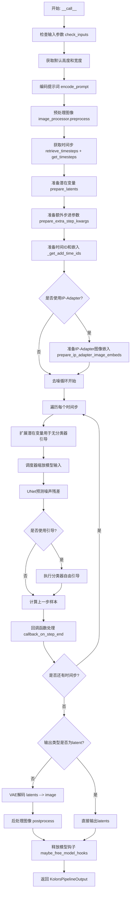
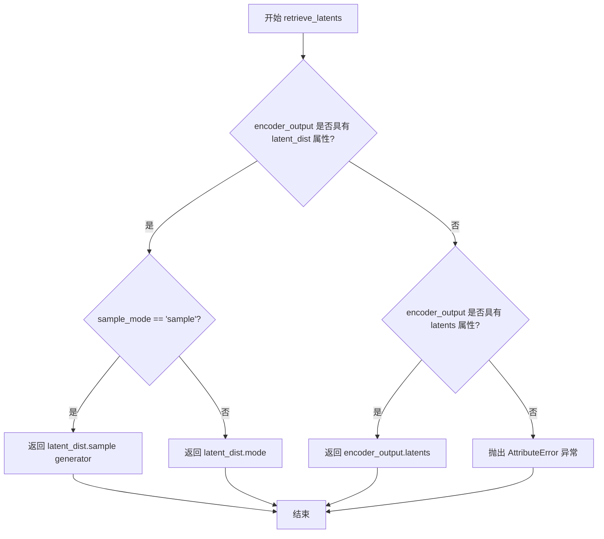
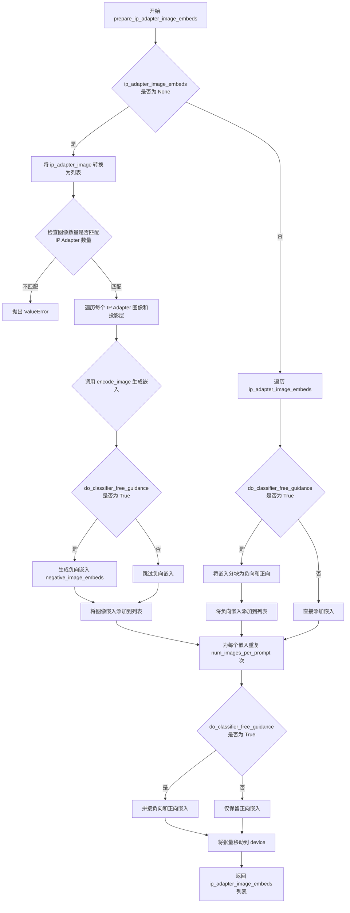
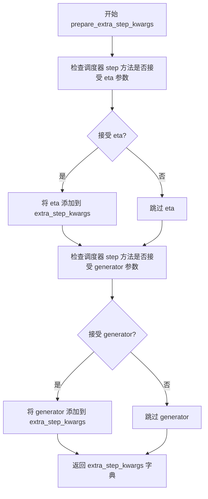
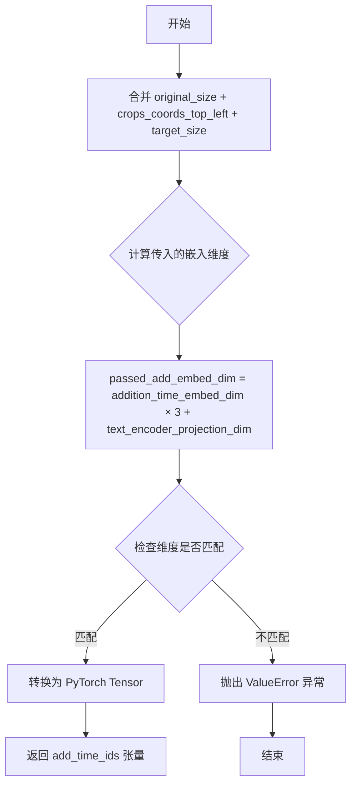
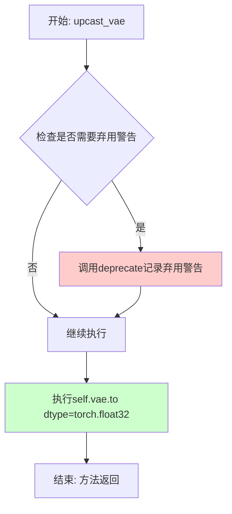
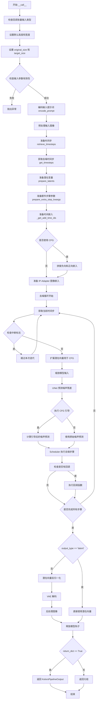

# `diffusers\src\diffusers\pipelines\kolors\pipeline_kolors_img2img.py` 详细设计文档

Kolors图像到图像扩散管道实现，基于Kolors模型进行文本引导的图像转换生成。该管道继承自DiffusionPipeline，结合VAE、文本编码器(ChatGLM)、UNet2DConditionModel和调度器，实现从输入图像和文本提示生成目标图像的功能。

## 整体流程



## 类结构

```
KolorsImg2ImgPipeline (主管道类)
├── 继承自: DiffusionPipeline, StableDiffusionMixin, StableDiffusionXLLoraLoaderMixin, IPAdapterMixin
├── 依赖组件:
│   ├── AutoencoderKL (VAE)
│   ├── ChatGLMModel (文本编码器)
│   ├── ChatGLMTokenizer (分词器)
│   ├── UNet2DConditionModel (条件UNet)
│   ├── KarrasDiffusionSchedulers (调度器)
│   ├── CLIPVisionModelWithProjection (图像编码器)
│   └── CLIPImageProcessor (特征提取器)
└── 辅助函数:
    ├── retrieve_latents (全局函数)
    └── retrieve_timesteps (全局函数)
```

## 全局变量及字段


### `XLA_AVAILABLE`
    
是否支持PyTorch XLA

类型：`bool`
    


### `logger`
    
模块日志记录器

类型：`logging.Logger`
    


### `EXAMPLE_DOC_STRING`
    
示例文档字符串

类型：`str`
    


### `KolorsImg2ImgPipeline.vae`
    
VAE模型，用于编码和解码图像与潜在表示

类型：`AutoencoderKL`
    


### `KolorsImg2ImgPipeline.text_encoder`
    
冻结的文本编码器，Kolors使用ChatGLM3-6B

类型：`ChatGLMModel`
    


### `KolorsImg2ImgPipeline.tokenizer`
    
ChatGLM分词器

类型：`ChatGLMTokenizer`
    


### `KolorsImg2ImgPipeline.unet`
    
条件U-Net架构，用于去噪图像潜在表示

类型：`UNet2DConditionModel`
    


### `KolorsImg2ImgPipeline.scheduler`
    
调度器，用于去噪过程

类型：`KarrasDiffusionSchedulers`
    


### `KolorsImg2ImgPipeline.image_encoder`
    
CLIP视觉模型(可选)

类型：`CLIPVisionModelWithProjection`
    


### `KolorsImg2ImgPipeline.feature_extractor`
    
CLIP图像处理器(可选)

类型：`CLIPImageProcessor`
    


### `KolorsImg2ImgPipeline.vae_scale_factor`
    
VAE缩放因子，基于块输出通道数计算

类型：`int`
    


### `KolorsImg2ImgPipeline.image_processor`
    
图像处理器

类型：`VaeImageProcessor`
    


### `KolorsImg2ImgPipeline.default_sample_size`
    
默认采样尺寸

类型：`int`
    


### `KolorsImg2ImgPipeline.model_cpu_offload_seq`
    
模型CPU卸载顺序

类型：`str`
    


### `KolorsImg2ImgPipeline._optional_components`
    
可选组件列表

类型：`list`
    


### `KolorsImg2ImgPipeline._callback_tensor_inputs`
    
回调张量输入列表

类型：`list`
    
    

## 全局函数及方法


### `retrieve_latents`

从encoder_output中检索潜在分布样本或模式，根据sample_mode参数选择从潜在分布中采样或取模式，或者直接返回预计算的latents。

参数：

- `encoder_output`：`torch.Tensor`，编码器输出对象，通常是VAE的encode方法返回的对象，可能包含`latent_dist`或`latents`属性
- `generator`：`torch.Generator | None`，可选的随机数生成器，用于确保采样过程的可重现性
- `sample_mode`：`str`，采样模式，默认为"sample"；当设置为"argmax"时返回分布的模式；当encoder_output直接包含latents属性时此参数被忽略

返回值：`torch.Tensor`，从encoder_output中检索到的潜在向量

#### 流程图



#### 带注释源码

```python
# Copied from diffusers.pipelines.stable_diffusion.pipeline_stable_diffusion_img2img.retrieve_latents
def retrieve_latents(
    encoder_output: torch.Tensor, generator: torch.Generator | None = None, sample_mode: str = "sample"
):
    """
    从encoder_output中检索潜在分布样本或模式。
    
    Args:
        encoder_output: 编码器输出，通常是VAE编码后的结果对象
        generator: 可选的随机数生成器，用于确保采样可重现
        sample_mode: 采样模式，'sample'表示从分布中采样，'argmax'表示取分布的模式
    
    Returns:
        torch.Tensor: 潜在向量
        
    Raises:
        AttributeError: 当encoder_output既没有latent_dist也没有latents属性时抛出
    """
    # 检查encoder_output是否具有latent_dist属性且sample_mode为'sample'
    if hasattr(encoder_output, "latent_dist") and sample_mode == "sample":
        # 从潜在分布中采样，使用generator确保可重现性
        return encoder_output.latent_dist.sample(generator)
    # 检查encoder_output是否具有latent_dist属性且sample_mode为'argmax'
    elif hasattr(encoder_output, "latent_dist") and sample_mode == "argmax":
        # 返回潜在分布的模式（均值或最可能的值）
        return encoder_output.latent_dist.mode()
    # 检查encoder_output是否直接具有latents属性
    elif hasattr(encoder_output, "latents"):
        # 直接返回预计算的latents
        return encoder_output.latents
    else:
        # 如果无法访问latents，抛出属性错误
        raise AttributeError("Could not access latents of provided encoder_output")
```


### `retrieve_timesteps`

调用调度器的 `set_timesteps` 方法并检索时间步，处理自定义时间步。任何额外的 kwargs 将被传递给 `scheduler.set_timesteps`。

参数：

-  `scheduler`：`SchedulerMixin`，要获取时间步的调度器
-  `num_inference_steps`：`int | None`，生成样本时使用的扩散步数。如果使用此参数，则 `timesteps` 必须为 `None`
-  `device`：`str | torch.device | None`，时间步应该移动到的设备。如果为 `None`，时间步不会被移动
-  `timesteps`：`list[int] | None`，用于覆盖调度器时间步间隔策略的自定义时间步。如果传递 `timesteps`，则 `num_inference_steps` 和 `sigmas` 必须为 `None`
-  `sigmas`：`list[float] | None`，用于覆盖调度器时间步间隔策略的自定义 sigmas。如果传递 `sigmas`，则 `num_inference_steps` 和 `timesteps` 必须为 `None`
-  `**kwargs`：任意关键字参数，将传递给 `scheduler.set_timesteps`

返回值：`tuple[torch.Tensor, int]`，元组包含两个元素：第一个是调度器的时间步调度列表，第二个是推理步数

#### 流程图

```mermaid
flowchart TD
    A[开始] --> B{检查timesteps和sigmas是否同时存在}
    B -->|是| C[抛出ValueError: 只能选择一个]
    B -->|否| D{检查timesteps是否提供}
    
    D -->|是| E{scheduler.set_timesteps是否接受timesteps参数}
    E -->|否| F[抛出ValueError: 当前调度器不支持自定义timesteps]
    E -->|是| G[调用scheduler.set_timesteps&#40;timesteps=timesteps, device=device, **kwargs&#41;]
    G --> H[获取scheduler.timesteps]
    H --> I[计算num_inference_steps = len(timesteps)]
    
    D -->|否| J{检查sigmas是否提供}
    J -->|是| K{scheduler.set_timesteps是否接受sigmas参数}
    K -->|否| L[抛出ValueError: 当前调度器不支持自定义sigmas]
    K -->|是| M[调用scheduler.set_timesteps&#40;sigmas=sigmas, device=device, **kwargs&#41;]
    M --> N[获取scheduler.timesteps]
    N --> O[计算num_inference_steps = len(timesteps)]
    
    J -->|否| P[调用scheduler.set_timesteps&#40;num_inference_steps, device=device, **kwargs&#41;]
    P --> Q[获取scheduler.timesteps]
    
    I --> R[返回 timesteps, num_inference_steps]
    O --> R
    Q --> R
    R --> S[结束]
```

#### 带注释源码

```
# Copied from diffusers.pipelines.stable_diffusion.pipeline_stable_diffusion.retrieve_timesteps
def retrieve_timesteps(
    scheduler,
    num_inference_steps: int | None = None,
    device: str | torch.device | None = None,
    timesteps: list[int] | None = None,
    sigmas: list[float] | None = None,
    **kwargs,
):
    r"""
    Calls the scheduler's `set_timesteps` method and retrieves timesteps from the scheduler after the call. Handles
    custom timesteps. Any kwargs will be supplied to `scheduler.set_timesteps`.

    Args:
        scheduler (`SchedulerMixin`):
            The scheduler to get timesteps from.
        num_inference_steps (`int`):
            The number of diffusion steps used when generating samples with a pre-trained model. If used, `timesteps`
            must be `None`.
        device (`str` or `torch.device`, *optional*):
            The device to which the timesteps should be moved to. If `None`, the timesteps are not moved.
        timesteps (`list[int]`, *optional*):
            Custom timesteps used to override the timestep spacing strategy of the scheduler. If `timesteps` is passed,
            `num_inference_steps` and `sigmas` must be `None`.
        sigmas (`list[float]`, *optional*):
            Custom sigmas used to override the timestep spacing strategy of the scheduler. If `sigmas` is passed,
            `num_inference_steps` and `timesteps` must be `None`.

    Returns:
        `tuple[torch.Tensor, int]`: A tuple where the first element is the timestep schedule from the scheduler and the
        second element is the number of inference steps.
    """
    # 检查是否同时传递了timesteps和sigmas，只能选择其中一个
    if timesteps is not None and sigmas is not None:
        raise ValueError("Only one of `timesteps` or `sigmas` can be passed. Please choose one to set custom values")
    
    # 处理自定义timesteps的情况
    if timesteps is not None:
        # 检查scheduler.set_timesteps是否支持timesteps参数
        accepts_timesteps = "timesteps" in set(inspect.signature(scheduler.set_timesteps).parameters.keys())
        if not accepts_timesteps:
            raise ValueError(
                f"The current scheduler class {scheduler.__class__}'s `set_timesteps` does not support custom"
                f" timestep schedules. Please check whether you are using the correct scheduler."
            )
        # 调用scheduler的set_timesteps方法设置自定义timesteps
        scheduler.set_timesteps(timesteps=timesteps, device=device, **kwargs)
        # 从scheduler获取设置后的timesteps
        timesteps = scheduler.timesteps
        # 计算推理步数
        num_inference_steps = len(timesteps)
    
    # 处理自定义sigmas的情况
    elif sigmas is not None:
        # 检查scheduler.set_timesteps是否支持sigmas参数
        accept_sigmas = "sigmas" in set(inspect.signature(scheduler.set_timesteps).parameters.keys())
        if not accept_sigmas:
            raise ValueError(
                f"The current scheduler class {scheduler.__class__}'s `set_timesteps` does not support custom"
                f" sigmas schedules. Please check whether you are using the correct scheduler."
            )
        # 调用scheduler的set_timesteps方法设置自定义sigmas
        scheduler.set_timesteps(sigmas=sigmas, device=device, **kwargs)
        # 从scheduler获取设置后的timesteps
        timesteps = scheduler.timesteps
        # 计算推理步数
        num_inference_steps = len(timesteps)
    
    # 默认情况：使用num_inference_steps设置timesteps
    else:
        scheduler.set_timesteps(num_inference_steps, device=device, **kwargs)
        timesteps = scheduler.timesteps
    
    # 返回timesteps和num_inference_steps元组
    return timesteps, num_inference_steps
```


### `KolorsImg2ImgPipeline.__init__`

该方法是 KolorsImg2ImgPipeline 类的构造函数，用于初始化 Kolors 图像到图像生成管道。它接收 VAE、文本编码器、分词器、U-Net 和调度器等核心组件，并注册模块、配置 VAE 缩放因子和图像处理器，同时设置默认采样大小。

参数：

- `vae`：`AutoencoderKL`，Variational Auto-Encoder (VAE) 模型，用于编码和解码图像与潜在表示
- `text_encoder`：`ChatGLMModel`，冻结的文本编码器，Kolors 使用 ChatGLM3-6B
- `tokenizer`：`ChatGLMTokenizer`，ChatGLMTokenizer 类的分词器
- `unet`：`UNet2DConditionModel`，条件 U-Net 架构，用于对编码的图像潜在表示进行去噪
- `scheduler`：`KarrasDiffusionSchedulers`，与 `unet` 结合使用以对编码图像潜在表示进行去噪的调度器
- `image_encoder`：`CLIPVisionModelWithProjection`（可选），CLIP 视觉模型，用于 IP Adapter 功能
- `feature_extractor`：`CLIPImageProcessor`（可选），CLIP 图像处理器，用于 IP Adapter 功能
- `force_zeros_for_empty_prompt`：`bool`（可选，默认为 False），是否将负提示嵌入强制设置为 0

返回值：无（`None`），构造函数不返回值

#### 流程图

```mermaid
flowchart TD
    A[开始 __init__] --> B[调用 super().__init__]
    B --> C[register_modules: 注册 vae, text_encoder, tokenizer, unet, scheduler, image_encoder, feature_extractor]
    C --> D[register_to_config: 注册 force_zeros_for_empty_prompt 配置]
    D --> E[计算 vae_scale_factor: 2 ** (len(vae.config.block_out_channels) - 1)]
    E --> F[创建 VaeImageProcessor: VaeImageProcessor(vae_scale_factor=vae_scale_factor)]
    F --> G[设置 default_sample_size: 从 unet.config.sample_size 获取或默认为 128]
    G --> H[结束 __init__]
```

#### 带注释源码

```python
def __init__(
    self,
    vae: AutoencoderKL,
    text_encoder: ChatGLMModel,
    tokenizer: ChatGLMTokenizer,
    unet: UNet2DConditionModel,
    scheduler: KarrasDiffusionSchedulers,
    image_encoder: CLIPVisionModelWithProjection = None,
    feature_extractor: CLIPImageProcessor = None,
    force_zeros_for_empty_prompt: bool = False,
):
    # 调用父类 DiffusionPipeline 的初始化方法
    super().__init__()

    # 注册所有模块，使它们可以通过 pipeline.xxx 访问
    self.register_modules(
        vae=vae,
        text_encoder=text_encoder,
        tokenizer=tokenizer,
        unet=unet,
        scheduler=scheduler,
        image_encoder=image_encoder,
        feature_extractor=feature_extractor,
    )

    # 将 force_zeros_for_empty_prompt 注册到配置中
    # 当为 True 时，空提示的负嵌入将被强制设为 0
    self.register_to_config(force_zeros_for_empty_prompt=force_zeros_for_empty_prompt)

    # 计算 VAE 缩放因子
    # 基于 VAE 的块输出通道数计算，用于将像素空间图像映射到潜在空间
    # 公式: 2 ** (len(block_out_channels) - 1)
    self.vae_scale_factor = 2 ** (len(self.vae.config.block_out_channels) - 1) if getattr(self, "vae", None) else 8

    # 创建图像处理器，用于预处理和后处理图像
    self.image_processor = VaeImageProcessor(vae_scale_factor=self.vae_scale_factor)

    # 设置默认采样大小
    # 从 UNet 配置中获取 sample_size，如果不存在则默认为 128
    # 这决定了生成图像的默认分辨率
    self.default_sample_size = (
        self.unet.config.sample_size
        if hasattr(self, "unet") and self.unet is not None and hasattr(self.unet.config, "sample_size")
        else 128
    )
```


### `KolorsImg2ImgPipeline.encode_prompt`

该方法负责将文本提示（prompt）编码为文本编码器的隐藏状态向量，支持正向提示和负向提示的编码处理，并返回用于图像生成的正向与负向文本嵌入（embeddings）以及池化后的文本嵌入。

参数：

- `self`：`KolorsImg2ImgPipeline` 实例，Pipeline 对象本身
- `prompt`：`str | list[str] | None`，要编码的文本提示，可以是单个字符串或字符串列表
- `device`：`torch.device | None`，指定计算设备，若为 None 则使用 Pipeline 的执行设备
- `num_images_per_prompt`：`int`，每个提示生成的图像数量，用于扩展 embeddings
- `do_classifier_free_guidance`：`bool`，是否启用无分类器引导（Classifier-Free Guidance），为 True 时会生成负向 embeddings
- `negative_prompt`：`str | list[str] | None`，负向提示，用于指导模型避免生成某些内容
- `prompt_embeds`：`torch.FloatTensor | None`，预生成的正向文本嵌入，若提供则直接使用
- `pooled_prompt_embeds`：`torch.Tensor | None`，预生成的正向池化文本嵌入
- `negative_prompt_embeds`：`torch.FloatTensor | None`，预生成的负向文本嵌入
- `negative_pooled_prompt_embeds`：`torch.Tensor | None`，预生成的负向池化文本嵌入
- `max_sequence_length`：`int`，最大序列长度，默认 256

返回值：`tuple[torch.Tensor, torch.Tensor, torch.Tensor, torch.Tensor]`，返回一个包含四个元素的元组：
- 第一个元素为正向文本嵌入（prompt_embeds）
- 第二个元素为负向文本嵌入（negative_prompt_embeds）
- 第三个元素为正向池化文本嵌入（pooled_prompt_embeds）
- 第四个元素为负向池化文本嵌入（negative_pooled_prompt_embeds）

#### 流程图

```mermaid
flowchart TD
    A[开始 encode_prompt] --> B{确定 batch_size}
    B --> C{prompt 是 str?}
    C -->|Yes| D[batch_size = 1]
    C -->|No| E{prompt 是 list?}
    E -->|Yes| F[batch_size = len(prompt)]
    E -->|No| G[batch_size = prompt_embeds.shape[0]]
    
    D --> H{检查 prompt_embeds 是否为 None}
    F --> H
    G --> H
    
    H -->|Yes| I[遍历 tokenizers 和 text_encoders]
    H -->|No| J[跳过编码使用提供的 embeddings]
    
    I --> K[tokenizer 处理 prompt]
    K --> L[text_encoder 编码]
    L --> M[提取 hidden_states]
    M --> N[permute 和 clone 处理]
    N --> O[重复 embeddings num_images_per_prompt 次]
    O --> P[添加到 prompt_embeds_list]
    
    J --> Q{do_classifier_free_guidance 为 True?}
    P --> Q
    
    Q -->|Yes| R{negative_prompt_embeds 为 None?}
    Q -->|No| S[直接返回 embeddings]
    
    R -->|Yes| T{zero_out_negative_prompt?}
    R -->|No| U[使用提供的 negative_prompt_embeds]
    
    T -->|Yes| V[negative_prompt_embeds = torch.zeros_like]
    T -->|No| W[处理 negative_prompt]
    V --> X[编码 negative_prompt]
    W --> X
    
    U --> X
    X --> Y[处理 negative_pooled_prompt_embeds]
    Y --> Z[重复 embeddings num_images_per_prompt 次]
    Z --> S
    
    S --> AA[返回 tuple 包含四种 embeddings]
```

#### 带注释源码

```python
def encode_prompt(
    self,
    prompt,
    device: torch.device | None = None,
    num_images_per_prompt: int = 1,
    do_classifier_free_guidance: bool = True,
    negative_prompt=None,
    prompt_embeds: torch.FloatTensor | None = None,
    pooled_prompt_embeds: torch.Tensor | None = None,
    negative_prompt_embeds: torch.FloatTensor | None = None,
    negative_pooled_prompt_embeds: torch.Tensor | None = None,
    max_sequence_length: int = 256,
):
    r"""
    Encodes the prompt into text encoder hidden states.

    Args:
        prompt (`str` or `list[str]`, *optional*):
            prompt to be encoded
        device: (`torch.device`):
            torch device
        num_images_per_prompt (`int`):
            number of images that should be generated per prompt
        do_classifier_free_guidance (`bool`):
            whether to use classifier free guidance or not
        negative_prompt (`str` or `list[str]`, *optional*):
            The prompt or prompts not to guide the image generation. If not defined, one has to pass
            `negative_prompt_embeds` instead. Ignored when not using guidance (i.e., ignored if `guidance_scale` is
            less than `1`).
        prompt_embeds (`torch.FloatTensor`, *optional*):
            Pre-generated text embeddings. Can be used to easily tweak text inputs, *e.g.* prompt weighting. If not
            provided, text embeddings will be generated from `prompt` input argument.
        pooled_prompt_embeds (`torch.Tensor`, *optional*):
            Pre-generated pooled text embeddings. Can be used to easily tweak text inputs, *e.g.* prompt weighting.
            If not provided, pooled text embeddings will be generated from `prompt` input argument.
        negative_prompt_embeds (`torch.FloatTensor`, *optional*):
            Pre-generated negative text embeddings. Can be used to easily tweak text inputs, *e.g.* prompt
            weighting. If not provided, negative_prompt_embeds will be generated from `negative_prompt` input
            argument.
        negative_pooled_prompt_embeds (`torch.Tensor`, *optional*):
            Pre-generated negative pooled text embeddings. Can be used to easily tweak text inputs, *e.g.* prompt
            weighting. If not provided, pooled negative_prompt_embeds will be generated from `negative_prompt`
            input argument.
        max_sequence_length (`int` defaults to 256): Maximum sequence length to use with the `prompt`.
    """
    # 如果未指定 device，则使用 Pipeline 的执行设备
    device = device or self._execution_device

    # 根据 prompt 的类型确定 batch_size
    if prompt is not None and isinstance(prompt, str):
        batch_size = 1
    elif prompt is not None and isinstance(prompt, list):
        batch_size = len(prompt)
    else:
        batch_size = prompt_embeds.shape[0]

    # 定义 tokenizer 和 text_encoder 列表（当前实现只使用一个）
    tokenizers = [self.tokenizer]
    text_encoders = [self.text_encoder]

    # 如果未提供 prompt_embeds，则从 prompt 编码生成
    if prompt_embeds is None:
        prompt_embeds_list = []
        for tokenizer, text_encoder in zip(tokenizers, text_encoders):
            # 使用 tokenizer 将文本转换为 token IDs
            text_inputs = tokenizer(
                prompt,
                padding="max_length",
                max_length=max_sequence_length,
                truncation=True,
                return_tensors="pt",
            ).to(device)
            
            # 使用 text_encoder 编码获取隐藏状态
            output = text_encoder(
                input_ids=text_inputs["input_ids"],
                attention_mask=text_inputs["attention_mask"],
                position_ids=text_inputs["position_ids"],
                output_hidden_states=True,
            )

            # 处理隐藏状态：
            # [max_sequence_length, batch, hidden_size] -> [batch, max_sequence_length, hidden_size]
            # clone 用于创建连续内存的 tensor
            prompt_embeds = output.hidden_states[-2].permute(1, 0, 2).clone()
            
            # 提取池化后的文本嵌入：[max_sequence_length, batch, hidden_size] -> [batch, hidden_size]
            pooled_prompt_embeds = output.hidden_states[-1][-1, :, :].clone()
            
            # 根据 num_images_per_prompt 重复 embeddings
            bs_embed, seq_len, _ = prompt_embeds.shape
            prompt_embeds = prompt_embeds.repeat(1, num_images_per_prompt, 1)
            prompt_embeds = prompt_embeds.view(bs_embed * num_images_per_prompt, seq_len, -1)

            prompt_embeds_list.append(prompt_embeds)

        prompt_embeds = prompt_embeds_list[0]

    # 获取用于 classifier free guidance 的无条件 embeddings
    # 如果 negative_prompt 为 None 且配置要求强制为零，则设置标志
    zero_out_negative_prompt = negative_prompt is None and self.config.force_zeros_for_empty_prompt

    # 处理 classifier free guidance 的负向 embeddings
    if do_classifier_free_guidance and negative_prompt_embeds is None and zero_out_negative_prompt:
        # 如果配置要求且未提供 negative_prompt，使用零 tensor
        negative_prompt_embeds = torch.zeros_like(prompt_embeds)
    elif do_classifier_free_guidance and negative_prompt_embeds is None:
        # 需要从 negative_prompt 编码生成 embeddings
        uncond_tokens: list[str]
        if negative_prompt is None:
            # 如果没有负向提示，使用空字符串
            uncond_tokens = [""] * batch_size
        elif prompt is not None and type(prompt) is not type(negative_prompt):
            # 类型检查：negative_prompt 必须与 prompt 类型相同
            raise TypeError(
                f"`negative_prompt` should be the same type to `prompt`, but got {type(negative_prompt)} !="
                f" {type(prompt)}."
            )
        elif isinstance(negative_prompt, str):
            # 如果是单个字符串，转换为列表
            uncond_tokens = [negative_prompt]
        elif batch_size != len(negative_prompt):
            # batch_size 必须匹配
            raise ValueError(
                f"`negative_prompt`: {negative_prompt} has batch size {len(negative_prompt)}, but `prompt`:"
                f" {prompt} has batch size {batch_size}. Please make sure that passed `negative_prompt` matches"
                " the batch size of `prompt`."
            )
        else:
            uncond_tokens = negative_prompt

        negative_prompt_embeds_list = []

        for tokenizer, text_encoder in zip(tokenizers, text_encoders):
            # 编码无条件（负向）tokens
            uncond_input = tokenizer(
                uncond_tokens,
                padding="max_length",
                max_length=max_sequence_length,
                truncation=True,
                return_tensors="pt",
            ).to(device)
            
            output = text_encoder(
                input_ids=uncond_input["input_ids"],
                attention_mask=uncond_input["attention_mask"],
                position_ids=uncond_input["position_ids"],
                output_hidden_states=True,
            )

            # 处理负向 embeddings
            # [max_sequence_length, batch, hidden_size] -> [batch, max_sequence_length, hidden_size]
            negative_prompt_embeds = output.hidden_states[-2].permute(1, 0, 2).clone()
            # [max_sequence_length, batch, hidden_size] -> [batch, hidden_size]
            negative_pooled_prompt_embeds = output.hidden_states[-1][-1, :, :].clone()

            if do_classifier_free_guidance:
                # 为每个 prompt 复制无条件 embeddings
                seq_len = negative_prompt_embeds.shape[1]

                # 转换为 text_encoder 的 dtype 和 device
                negative_prompt_embeds = negative_prompt_embeds.to(dtype=text_encoder.dtype, device=device)

                # 重复 embeddings num_images_per_prompt 次
                negative_prompt_embeds = negative_prompt_embeds.repeat(1, num_images_per_prompt, 1)
                negative_prompt_embeds = negative_prompt_embeds.view(
                    batch_size * num_images_per_prompt, seq_len, -1
                )

            negative_prompt_embeds_list.append(negative_prompt_embeds)

        negative_prompt_embeds = negative_prompt_embeds_list[0]

    # 处理正向池化 embeddings 的重复
    bs_embed = pooled_prompt_embeds.shape[0]
    pooled_prompt_embeds = pooled_prompt_embeds.repeat(1, num_images_per_prompt).view(
        bs_embed * num_images_per_prompt, -1
    )

    # 处理负向池化 embeddings 的重复
    if do_classifier_free_guidance:
        negative_pooled_prompt_embeds = negative_pooled_prompt_embeds.repeat(1, num_images_per_prompt).view(
            bs_embed * num_images_per_prompt, -1
        )

    # 返回编码后的所有 embeddings
    return prompt_embeds, negative_prompt_embeds, pooled_prompt_embeds, negative_pooled_prompt_embeds
```


### `KolorsImg2ImgPipeline.encode_image`

该方法用于将输入图像编码为图像嵌入向量或隐藏状态，支持条件（带提示）和无条件（无提示）两种模式的图像编码，为后续的图像到图像扩散过程提供图像特征表示。

参数：

- `image`：`torch.Tensor | PIL.Image | list`，输入的图像数据，可以是 PyTorch 张量、PIL 图像或图像列表
- `device`：`torch.device`，指定计算设备，用于将图像和张量移动到该设备上
- `num_images_per_prompt`：`int`，每个提示词生成的图像数量，用于对图像嵌入进行重复扩展
- `output_hidden_states`：`bool | None`，可选参数，指定是否输出图像编码器的隐藏状态，默认为 `None`

返回值：`tuple[torch.Tensor, torch.Tensor]`，返回两个张量组成的元组——第一个是条件图像嵌入（或隐藏状态），第二个是无条件图像嵌入（或隐藏状态）。无条件嵌入用于 Classifier-Free Guidance 引导生成。

#### 流程图

```mermaid
flowchart TD
    A[开始 encode_image] --> B{image 是否为 torch.Tensor?}
    B -->|否| C[使用 feature_extractor 提取特征]
    C --> D[获取 pixel_values]
    B -->|是| E[直接使用 image]
    D --> F[将 image 移动到指定 device 和 dtype]
    E --> F
    F --> G{output_hidden_states == True?}
    G -->|是| H[调用 image_encoder 输出隐藏状态]
    H --> I[提取倒数第二层隐藏状态 hidden_states[-2]]
    I --> J[repeat_interleave 扩展条件嵌入]
    K[创建全零张量作为无条件输入]
    K --> L[调用 image_encoder 获取无条件隐藏状态]
    L --> J
    J --> M[返回条件和无条件隐藏状态元组]
    G -->|否| N[调用 image_encoder 获取 image_embeds]
    N --> O[repeat_interleave 扩展条件嵌入]
    P[创建与条件嵌入形状相同的全零张量]
    P --> Q[作为无条件嵌入]
    O --> Q
    Q --> R[返回条件和无条件嵌入元组]
    M --> S[结束]
    R --> S
```

#### 带注释源码

```python
def encode_image(self, image, device, num_images_per_prompt, output_hidden_states=None):
    """
    将输入图像编码为图像嵌入或隐藏状态表示
    
    参数:
        image: 输入图像，支持 torch.Tensor、PIL.Image 或列表形式
        device: 目标计算设备
        num_images_per_prompt: 每个提示生成的图像数量
        output_hidden_states: 是否返回隐藏状态而非图像嵌入
    
    返回:
        (条件嵌入, 无条件嵌入) 的元组
    """
    # 获取图像编码器的参数数据类型，用于后续张量类型转换
    dtype = next(self.image_encoder.parameters()).dtype

    # 如果输入不是 PyTorch 张量，则使用特征提取器进行预处理
    if not isinstance(image, torch.Tensor):
        # 调用 feature_extractor 将图像转换为模型输入格式
        image = self.feature_extractor(image, return_tensors="pt").pixel_values

    # 将图像移动到指定设备，并转换为图像编码器所需的数据类型
    image = image.to(device=device, dtype=dtype)
    
    # 根据 output_hidden_states 参数决定输出形式
    if output_hidden_states:
        # 模式1：输出隐藏状态（用于 IP-Adapter 等高级功能）
        
        # 编码图像，获取所有隐藏状态，提取倒数第二层（通常是最后第二层，优于最后一层）
        image_enc_hidden_states = self.image_encoder(image, output_hidden_states=True).hidden_states[-2]
        # 沿批次维度重复扩展，以匹配 num_images_per_prompt
        image_enc_hidden_states = image_enc_hidden_states.repeat_interleave(num_images_per_prompt, dim=0)
        
        # 创建全零的"无条件"图像输入，用于 Classifier-Free Guidance
        uncond_image_enc_hidden_states = self.image_encoder(
            torch.zeros_like(image), output_hidden_states=True
        ).hidden_states[-2]
        # 同样扩展无条件嵌入
        uncond_image_enc_hidden_states = uncond_image_enc_hidden_states.repeat_interleave(
            num_images_per_prompt, dim=0
        )
        
        # 返回条件和无条件隐藏状态
        return image_enc_hidden_states, uncond_image_enc_hidden_states
    else:
        # 模式2：输出图像嵌入（标准模式）
        
        # 直接获取图像嵌入向量
        image_embeds = self.image_encoder(image).image_embeds
        # 扩展条件嵌入以匹配批量大小
        image_embeds = image_embeds.repeat_interleave(num_images_per_prompt, dim=0)
        
        # 创建全零的无条件图像嵌入（形状与条件嵌入相同）
        uncond_image_embeds = torch.zeros_like(image_embeds)

        # 返回条件和无条件图像嵌入
        return image_embeds, uncond_image_embeds
```


### `KolorsImg2ImgPipeline.prepare_ip_adapter_image_embeds`

该方法用于准备 IP-Adapter 的图像嵌入（image embeddings）。它处理两种输入情况：如果未提供预计算的图像嵌入，则使用 `encode_image` 方法从输入图像编码生成；如果已提供预计算的嵌入，则直接处理。该方法还支持 classifier-free guidance，会为每个图像生成正向和负向嵌入，并按 `num_images_per_prompt` 扩展以支持批量生成。

参数：

- `self`：`KolorsImg2ImgPipeline` 实例，Pipeline 对象本身
- `ip_adapter_image`：输入的 IP-Adapter 图像，可以是单个图像或图像列表，支持 PIL.Image、torch.Tensor 或其他图像格式
- `ip_adapter_image_embeds`：预计算的图像嵌入列表，如果为 `None`，则从 `ip_adapter_image` 编码生成
- `device`：`torch.device`，目标设备，用于将张量移动到指定设备
- `num_images_per_prompt`：每个 prompt 生成的图像数量，用于扩展嵌入维度
- `do_classifier_free_guidance`：`bool`，是否启用 classifier-free guidance，决定是否生成负向图像嵌入

返回值：`list[torch.Tensor]`（具体为 `list[torch.Tensor]`），返回处理后的 IP-Adapter 图像嵌入列表，每个元素是一个拼接后的张量，形状为 `(num_images_per_prompt, embed_dim)` 或当启用 guidance 时为 `(2 * num_images_per_prompt, embed_dim)`

#### 流程图



#### 带注释源码

```python
def prepare_ip_adapter_image_embeds(
    self, ip_adapter_image, ip_adapter_image_embeds, device, num_images_per_prompt, do_classifier_free_guidance
):
    """
    Prepares image embeddings for IP-Adapter.
    
    This method handles two cases:
    1. When ip_adapter_image_embeds is None: encode images using self.encode_image
    2. When ip_adapter_image_embeds is provided: use pre-computed embeddings
    
    Supports classifier-free guidance by generating both positive and negative embeddings.
    """
    # 初始化正向图像嵌入列表
    image_embeds = []
    # 如果启用 classifier-free guidance，同时初始化负向图像嵌入列表
    if do_classifier_free_guidance:
        negative_image_embeds = []
    
    # Case 1: 未提供预计算的嵌入，需要从图像编码生成
    if ip_adapter_image_embeds is None:
        # 确保 ip_adapter_image 是列表格式，便于统一处理
        if not isinstance(ip_adapter_image, list):
            ip_adapter_image = [ip_adapter_image]

        # 验证图像数量是否与 IP Adapter 数量匹配
        if len(ip_adapter_image) != len(self.unet.encoder_hid_proj.image_projection_layers):
            raise ValueError(
                f"`ip_adapter_image` must have same length as the number of IP Adapters. Got {len(ip_adapter_image)} images and {len(self.unet.encoder_hid_proj.image_projection_layers)} IP Adapters."
            )

        # 遍历每个 IP Adapter 的图像和对应的图像投影层
        for single_ip_adapter_image, image_proj_layer in zip(
            ip_adapter_image, self.unet.encoder_hid_proj.image_projection_layers
        ):
            # 判断是否需要输出隐藏状态：如果投影层不是 ImageProjection 类型，则需要输出隐藏状态
            output_hidden_state = not isinstance(image_proj_layer, ImageProjection)
            # 调用 encode_image 方法编码单个图像，返回正向和负向嵌入（如果启用 guidance）
            single_image_embeds, single_negative_image_embeds = self.encode_image(
                single_ip_adapter_image, device, 1, output_hidden_state
            )

            # 将正向嵌入添加到列表（添加批次维度）
            image_embeds.append(single_image_embeds[None, :])
            # 如果启用 classifier-free guidance，同时添加负向嵌入
            if do_classifier_free_guidance:
                negative_image_embeds.append(single_negative_image_embeds[None, :])
    # Case 2: 已提供预计算的嵌入，直接处理
    else:
        # 遍历预计算的图像嵌入
        for single_image_embeds in ip_adapter_image_embeds:
            # 如果启用 guidance，需要将嵌入分块为负向和正向两部分
            if do_classifier_free_guidance:
                single_negative_image_embeds, single_image_embeds = single_image_embeds.chunk(2)
                # 添加负向嵌入到列表
                negative_image_embeds.append(single_negative_image_embeds)
            # 添加正向嵌入到列表
            image_embeds.append(single_image_embeds)

    # 初始化输出列表
    ip_adapter_image_embeds = []
    # 遍历每个图像嵌入进行处理
    for i, single_image_embeds in enumerate(image_embeds):
        # 扩展维度以匹配 num_images_per_prompt：将嵌入重复 num_images_per_prompt 次
        # 例如：从 (1, embed_dim) 扩展为 (num_images_per_prompt, embed_dim)
        single_image_embeds = torch.cat([single_image_embeds] * num_images_per_prompt, dim=0)
        
        # 如果启用 classifier-free guidance，同样处理负向嵌入
        if do_classifier_free_guidance:
            single_negative_image_embeds = torch.cat([negative_image_embeds[i]] * num_images_per_prompt, dim=0)
            # 拼接负向和正向嵌入：先负向后正向
            # 结果形状：(2 * num_images_per_prompt, embed_dim)
            single_image_embeds = torch.cat([single_negative_image_embeds, single_image_embeds], dim=0)

        # 将处理后的嵌入移动到指定设备
        single_image_embeds = single_image_embeds.to(device=device)
        # 添加到输出列表
        ip_adapter_image_embeds.append(single_image_embeds)

    # 返回处理后的 IP Adapter 图像嵌入列表
    return ip_adapter_image_embeds
```


### `KolorsImg2ImgPipeline.prepare_extra_step_kwargs`

该方法为调度器（scheduler）的 `step` 方法准备额外关键字参数，因为不同的调度器可能支持不同的参数（如 DDIMScheduler 支持 `eta` 参数，某些调度器支持 `generator` 参数）。通过检查调度器 `step` 方法的签名，动态构建需要传递给调度器的参数字典。

参数：

- `self`：隐式参数，Pipeline 实例本身，用于访问 `self.scheduler`
- `generator`：`torch.Generator | list[torch.Generator] | None`，用于控制生成过程的随机数生成器
- `eta`：`float`，DDIM 调度器的 eta (η) 参数，对应 DDIM 论文中的参数，应在 [0, 1] 范围内

返回值：`dict[str, Any]`，包含调度器 `step` 方法所需的关键字参数字典（如可能包含 `eta` 和/或 `generator`）

#### 流程图



#### 带注释源码

```python
def prepare_extra_step_kwargs(self, generator, eta):
    """
    为调度器 step 准备额外参数，因为不是所有调度器都有相同的签名。
    eta (η) 仅用于 DDIMScheduler，其他调度器会忽略它。
    eta 对应 DDIM 论文 (https://huggingface.co/papers/2010.02502) 中的 η，值应在 [0, 1] 之间。
    
    Args:
        generator: 可选的 torch.Generator，用于生成确定性结果
        eta: float，DDIM 调度器的 eta 参数
    
    Returns:
        dict: 包含额外关键字参数的字典，用于调度器的 step 方法
    """
    
    # 使用 inspect 模块检查调度器的 step 方法签名，判断是否接受 eta 参数
    accepts_eta = "eta" in set(inspect.signature(self.scheduler.step).parameters.keys())
    extra_step_kwargs = {}
    
    # 如果调度器接受 eta 参数，则将其添加到 extra_step_kwargs
    if accepts_eta:
        extra_step_kwargs["eta"] = eta

    # 检查调度器是否接受 generator 参数
    accepts_generator = "generator" in set(inspect.signature(self.scheduler.step).parameters.keys())
    
    # 如果调度器接受 generator 参数，则将其添加到 extra_step_kwargs
    if accepts_generator:
        extra_step_kwargs["generator"] = generator
    
    # 返回构建好的参数字典，供调度器 step 方法使用
    return extra_step_kwargs
```


### `KolorsImg2ImgPipeline.check_inputs`

该方法用于验证 Kolors 图像到图像（Img2Img）管道的输入参数合法性，包括检查强度值、推理步数、图像尺寸、提示词与嵌入的一致性、IP适配器参数等，确保所有输入符合管道要求，否则抛出相应的 ValueError 异常。

参数：

- `prompt`：`str | list[str] | None`，要编码的提示词，可以是字符串或字符串列表
- `strength`：`float`，图像变换强度，必须在 [0.0, 1.0] 范围内
- `num_inference_steps`：`int`，扩散步数，必须为正整数
- `height`：`int`，生成图像的高度，必须能被 8 整除
- `width`：`int`，生成图像的宽度，必须能被 8 整除
- `negative_prompt`：`str | list[str] | None`，不用于引导图像生成的提示词
- `prompt_embeds`：`torch.FloatTensor | None`，预生成的文本嵌入
- `pooled_prompt_embeds`：`torch.Tensor | None`，预生成的池化文本嵌入
- `negative_prompt_embeds`：`torch.FloatTensor | None`，预生成的负面文本嵌入
- `negative_pooled_prompt_embeds`：`torch.Tensor | None`，预生成的负面池化文本嵌入
- `ip_adapter_image`：`PipelineImageInput | None`，IP适配器图像输入
- `ip_adapter_image_embeds`：`list[torch.Tensor] | None`，IP适配器图像嵌入列表
- `callback_on_step_end_tensor_inputs`：`list[str] | None`，步骤结束回调的张量输入列表
- `max_sequence_length`：`int | None`，提示词的最大序列长度，不能大于 256

返回值：`None`，该方法无返回值，通过抛出 ValueError 来表示参数验证失败

#### 流程图

```mermaid
flowchart TD
    A[开始 check_inputs] --> B{strength 是否在 [0, 1] 范围}
    B -->|否| B1[抛出 ValueError: strength 必须在 0.0 到 1.0 之间]
    B -->|是| C{num_inference_steps 是正整数}
    C -->|否| C1[抛出 ValueError: num_inference_steps 必须为正整数]
    C -->|是| D{height 和 width 是否能被 8 整除}
    D -->|否| D1[抛出 ValueError: height 和 width 必须能被 8 整除]
    D -->|是| E{callback_on_step_end_tensor_inputs 是否合法}
    E -->|否| E1[抛出 ValueError: 包含非法的 tensor inputs]
    E -->|是| F{prompt 和 prompt_embeds 是否同时存在}
    F -->|是| F1[抛出 ValueError: 不能同时提供 prompt 和 prompt_embeds]
    F -->|否| G{prompt 和 prompt_embeds 是否都未提供}
    G -->|是| G1[抛出 ValueError: 必须提供 prompt 或 prompt_embeds 之一]
    G -->|否| H{prompt 类型是否合法 str 或 list}
    H -->|否| H1[抛出 ValueError: prompt 必须是 str 或 list 类型]
    H -->|是| I{negative_prompt 和 negative_prompt_embeds 是否同时存在}
    I -->|是| I1[抛出 ValueError: 不能同时提供两者]
    I -->|否| J{prompt_embeds 和 negative_prompt_embeds 形状是否一致}
    J -->|否| J1[抛出 ValueError: 两个嵌入形状必须一致]
    J -->|是| K{prompt_embeds 提供但 pooled_prompt_embeds 未提供}
    K -->|是| K1[抛出 ValueError: 必须提供 pooled_prompt_embeds]
    K -->|否| L{negative_prompt_embeds 提供但 negative_pooled_prompt_embeds 未提供}
    L -->|是| L1[抛出 ValueError: 必须提供 negative_pooled_prompt_embeds]
    L -->|否| M{ip_adapter_image 和 ip_adapter_image_embeds 是否同时存在}
    M -->|是| M1[抛出 ValueError: 不能同时提供两者]
    M -->|否| N{ip_adapter_image_embeds 是否为合法类型}
    N -->|否| N1[抛出 ValueError: ip_adapter_image_embeds 必须是 list 类型]
    N -->|是| O{ip_adapter_image_embeds[0] 维度是否在 3D 或 4D}
    O -->|否| O1[抛出 ValueError: 必须是 3D 或 4D 张量]
    O -->|是| P{max_sequence_length 是否大于 256}
    P -->|是| P1[抛出 ValueError: 最大序列长度不能超过 256]
    P -->|否| Q[验证通过，方法结束]
    
    B1 --> Z[结束]
    C1 --> Z
    D1 --> Z
    E1 --> Z
    F1 --> Z
    G1 --> Z
    H1 --> Z
    I1 --> Z
    J1 --> Z
    K1 --> Z
    L1 --> Z
    M1 --> Z
    N1 --> Z
    O1 --> Z
    P1 --> Z
    Q --> Z
```

#### 带注释源码

```python
def check_inputs(
    self,
    prompt,                       # 输入提示词，str 或 list[str] 或 None
    strength,                     # 图像变换强度，float，必须在 [0.0, 1.0]
    num_inference_steps,          # 推理步数，int，必须为正整数
    height,                       # 生成图像高度，int，必须能被 8 整除
    width,                        # 生成图像宽度，int，必须能被 8 整除
    negative_prompt=None,         # 负面提示词，可选
    prompt_embeds=None,           # 预生成文本嵌入，可选
    pooled_prompt_embeds=None,   # 预生成池化文本嵌入，可选
    negative_prompt_embeds=None, # 预生成负面文本嵌入，可选
    negative_pooled_prompt_embeds=None,  # 预生成负面池化文本嵌入，可选
    ip_adapter_image=None,        # IP适配器图像输入，可选
    ip_adapter_image_embeds=None, # IP适配器图像嵌入列表，可选
    callback_on_step_end_tensor_inputs=None,  # 回调张量输入列表，可选
    max_sequence_length=None,     # 最大序列长度，可选
):
    # 1. 检查强度值是否在有效范围内 [0.0, 1.0]
    if strength < 0 or strength > 1:
        raise ValueError(f"The value of strength should in [0.0, 1.0] but is {strength}")

    # 2. 检查推理步数是否为正整数
    if not isinstance(num_inference_steps, int) or num_inference_steps <= 0:
        raise ValueError(
            f"`num_inference_steps` has to be a positive integer but is {num_inference_steps} of type"
            f" {type(num_inference_steps)}."
        )

    # 3. 检查图像尺寸是否能被 8 整除（VAE 要求）
    if height % 8 != 0 or width % 8 != 0:
        raise ValueError(f"`height` and `width` have to be divisible by 8 but are {height} and {width}.")

    # 4. 检查回调张量输入是否都在允许的列表中
    if callback_on_step_end_tensor_inputs is not None and not all(
        k in self._callback_tensor_inputs for k in callback_on_step_end_tensor_inputs
    ):
        raise ValueError(
            f"`callback_on_step_end_tensor_inputs` has to be in {self._callback_tensor_inputs}, but found {[k for k in callback_on_step_end_tensor_inputs if k not in self._callback_tensor_inputs]}"
        )

    # 5. 检查 prompt 和 prompt_embeds 不能同时提供
    if prompt is not None and prompt_embeds is not None:
        raise ValueError(
            f"Cannot forward both `prompt`: {prompt} and `prompt_embeds`: {prompt_embeds}. Please make sure to"
            " only forward one of the two."
        )
    # 6. 检查至少提供一个提示词或嵌入
    elif prompt is None and prompt_embeds is None:
        raise ValueError(
            "Provide either `prompt` or `prompt_embeds`. Cannot leave both `prompt` and `prompt_embeds` undefined."
        )
    # 7. 检查 prompt 的类型是否为 str 或 list
    elif prompt is not None and (not isinstance(prompt, str) and not isinstance(prompt, list)):
        raise ValueError(f"`prompt` has to be of type `str` or `list` but is {type(prompt)}")

    # 8. 检查 negative_prompt 和 negative_prompt_embeds 不能同时提供
    if negative_prompt is not None and negative_prompt_embeds is not None:
        raise ValueError(
            f"Cannot forward both `negative_prompt`: {negative_prompt} and `negative_prompt_embeds`:"
            f" {negative_prompt_embeds}. Please make sure to only forward one of the two."
        )

    # 9. 检查 prompt_embeds 和 negative_prompt_embeds 形状必须一致
    if prompt_embeds is not None and negative_prompt_embeds is not None:
        if prompt_embeds.shape != negative_prompt_embeds.shape:
            raise ValueError(
                "`prompt_embeds` and `negative_prompt_embeds` must have the same shape when passed directly, but"
                f" got: `prompt_embeds` {prompt_embeds.shape} != `negative_prompt_embeds`"
                f" {negative_prompt_embeds.shape}."
            )

    # 10. 如果提供了 prompt_embeds，必须也提供 pooled_prompt_embeds
    if prompt_embeds is not None and pooled_prompt_embeds is None:
        raise ValueError(
            "If `prompt_embeds` are provided, `pooled_prompt_embeds` also have to be passed. Make sure to generate `pooled_prompt_embeds` from the same text encoder that was used to generate `prompt_embeds`."
        )

    # 11. 如果提供了 negative_prompt_embeds，必须也提供 negative_pooled_prompt_embeds
    if negative_prompt_embeds is not None and negative_pooled_prompt_embeds is None:
        raise ValueError(
            "If `negative_prompt_embeds` are provided, `negative_pooled_prompt_embeds` also have to be passed. Make sure to generate `negative_pooled_prompt_embeds` from the same text encoder that was used to generate `negative_prompt_embeds`."
        )

    # 12. 检查 IP 适配器图像和嵌入不能同时提供
    if ip_adapter_image is not None and ip_adapter_image_embeds is not None:
        raise ValueError(
            "Provide either `ip_adapter_image` or `ip_adapter_image_embeds`. Cannot leave both `ip_adapter_image` and `ip_adapter_image_embeds` defined."
        )

    # 13. 检查 ip_adapter_image_embeds 的类型和维度
    if ip_adapter_image_embeds is not None:
        if not isinstance(ip_adapter_image_embeds, list):
            raise ValueError(
                f"`ip_adapter_image_embeds` has to be of type `list` but is {type(ip_adapter_image_embeds)}"
            )
        elif ip_adapter_image_embeds[0].ndim not in [3, 4]:
            raise ValueError(
                f"`ip_adapter_image_embeds` has to be a list of 3D or 4D tensors but is {ip_adapter_image_embeds[0].ndim}D"
            )

    # 14. 检查最大序列长度不能超过 256
    if max_sequence_length is not None and max_sequence_length > 256:
        raise ValueError(f"`max_sequence_length` cannot be greater than 256 but is {max_sequence_length}")
```


### `KolorsImg2ImgPipeline.get_timesteps`

该方法用于根据推理步数、噪声强度和去噪起始点计算并返回适合图像生成的时间步序列。它根据`strength`参数或`denoising_start`参数确定去噪过程的起始点，并返回调整后的时间步数组和实际的推理步数。

参数：

- `num_inference_steps`：`int`，总推理步数，用于生成图像的去噪迭代次数
- `strength`：`float`，噪声强度参数，范围在0到1之间，控制图像从原始状态到生成状态的转换程度
- `device`：`str | torch.device`，计算设备（CPU或CUDA），用于指定张量存放位置
- `denoising_start`：`float | None`，可选参数，指定去噪过程的起始点（0.0到1.0之间的分数），当为None时使用strength计算起始点

返回值：`tuple[torch.Tensor, int]`，第一个元素是调整后的时间步序列（torch.Tensor），第二个元素是实际的推理步数（int）

#### 流程图

```mermaid
flowchart TD
    A[开始 get_timesteps] --> B{denoising_start 是否为 None}
    B -->|是| C[根据 strength 计算 init_timestep]
    B -->|否| D[根据 denoising_start 计算离散时间步截止点]
    C --> E[计算 t_start = max(num_inference_steps - init_timestep, 0)]
    D --> F[计算 num_inference_steps = timesteps < discrete_timestep_cutoff 的数量]
    F --> G{scheduler.order == 2 且 num_inference_steps 为偶数?}
    G -->|是| H[num_inference_steps += 1]
    G -->|否| I[计算 t_start = len(timesteps) - num_inference_steps]
    E --> J[从 scheduler.timesteps 切片获取 timesteps]
    H --> I
    J --> K{scheduler 是否有 set_begin_index 方法?}
    I --> K
    K -->|是| L[调用 scheduler.set_begin_index]
    K -->|否| M[返回 timesteps 和 num_inference_steps]
    L --> M
```

#### 带注释源码

```python
# Copied from diffusers.pipelines.stable_diffusion_xl.pipeline_stable_diffusion_xl_img2img.StableDiffusionXLImg2ImgPipeline.get_timesteps
def get_timesteps(self, num_inference_steps, strength, device, denoising_start=None):
    # 当 denoising_start 未指定时，根据 strength 计算初始时间步
    if denoising_start is None:
        # 计算基于噪声强度的初始时间步数，取步数乘以强度与总步数中的较小值
        init_timestep = min(int(num_inference_steps * strength), num_inference_steps)
        # 计算起始索引，确保不为负数
        t_start = max(num_inference_steps - init_timestep, 0)

        # 根据调度器阶数从完整时间步序列中切片获取当前去噪阶段的时间步
        timesteps = self.scheduler.timesteps[t_start * self.scheduler.order :]
        # 如果调度器支持设置起始索引，则更新调度器的起始位置
        if hasattr(self.scheduler, "set_begin_index"):
            self.scheduler.set_begin_index(t_start * self.scheduler.order)

        # 返回当前时间步序列和实际推理步数
        return timesteps, num_inference_steps - t_start

    else:
        # 当直接指定 denoising_start 时，strength 参数被忽略
        # 计算离散时间步截止点：将去噪起始分数转换为对应的训练时间步
        discrete_timestep_cutoff = int(
            round(
                self.scheduler.config.num_train_timesteps
                - (denoising_start * self.scheduler.config.num_train_timesteps)
            )
        )

        # 计算满足条件的时间步数量作为推理步数
        num_inference_steps = (self.scheduler.timesteps < discrete_timestep_cutoff).sum().item()
        
        # 对于二阶调度器的特殊处理：避免在去噪步骤中间截断
        if self.scheduler.order == 2 and num_inference_steps % 2 == 0:
            # 如果推理步数为偶数，加1确保完整覆盖二阶导数步骤
            num_inference_steps = num_inference_steps + 1

        # 从时间步序列末尾开始切片获取所需的时间步
        t_start = len(self.scheduler.timesteps) - num_inference_steps
        timesteps = self.scheduler.timesteps[t_start:]
        if hasattr(self.scheduler, "set_begin_index"):
            self.scheduler.set_begin_index(t_start)
        return timesteps, num_inference_steps
```


### `KolorsImg2ImgPipeline.prepare_latents`

该方法负责为Kolors图像到图像扩散管道准备潜在向量（latents）。它将输入图像编码为VAE潜在空间表示，根据时间步添加噪声（如果需要），并处理批次大小和每提示图像数量的扩展。

参数：

- `image`：`torch.Tensor | PIL.Image.Image | list`，要编码的输入图像
- `timestep`：`torch.Tensor`，当前扩散时间步
- `batch_size`：`int`，批次大小
- `num_images_per_prompt`：`int`，每个提示生成的图像数量
- `dtype`：`torch.dtype`，潜在向量的数据类型
- `device`：`torch.device`，计算设备
- `generator`：`torch.Generator | list[torch.Generator] | None`，可选的随机生成器用于确定性生成
- `add_noise`：`bool`，是否向潜在向量添加噪声

返回值：`torch.Tensor`，准备好的潜在向量

#### 流程图

```mermaid
flowchart TD
    A[开始 prepare_latents] --> B{验证 image 类型}
    B -->|类型无效| C[抛出 ValueError]
    B -->|类型有效| D[获取 VAE latents_mean 和 std]
    D --> E{是否有 final_offload_hook}
    E -->|是| F[卸载 text_encoder_2]
    E -->|否| G[继续]
    F --> G
    G --> H[将 image 移到指定设备和数据类型]
    H --> I[计算有效批次大小 = batch_size * num_images_per_prompt]
    I --> J{image.shape[1] == 4}
    J -->|是| K[直接使用 image 作为 init_latents]
    J -->|否| L{需要 VAE 编码}
    L --> M{检查 force_upcast}
    M -->|是| N[将 image 和 VAE 转为 float32]
    M -->|否| O[继续]
    N --> O
    O --> P{generator 是列表}
    P -->|是| Q[逐个编码图像块]
    P -->|否| R[一次性编码整个图像]
    Q --> S[合并所有 init_latents]
    R --> S
    S --> T[应用 scaling_factor 和归一化]
    T --> U{批次大小扩展}
    U --> V[重复 init_latents 以匹配批次大小]
    U --> W[保持不变]
    V --> X
    W --> X
    X --> Y{add_noise 为 true}
    Y -->|是| Z[生成噪声并通过 scheduler.add_noise 添加]
    Y -->|否| AA[直接返回 init_latents]
    Z --> AB[返回 latents]
    AA --> AB
    K --> X
```

#### 带注释源码

```python
def prepare_latents(
    self, 
    image, 
    timestep, 
    batch_size, 
    num_images_per_prompt, 
    dtype, 
    device, 
    generator=None, 
    add_noise=True
):
    # 1. 验证输入图像类型
    if not isinstance(image, (torch.Tensor, PIL.Image.Image, list)):
        raise ValueError(
            f"`image` has to be of type `torch.Tensor`, `PIL.Image.Image` or list but is {type(image)}"
        )

    # 2. 获取 VAE 的潜在空间统计参数（如果配置中有）
    latents_mean = latents_std = None
    if hasattr(self.vae.config, "latents_mean") and self.vae.config.latents_mean is not None:
        # 将 VAE 配置中的 mean 值 reshape 为 (1, 4, 1, 1)
        latents_mean = torch.tensor(self.vae.config.latents_mean).view(1, 4, 1, 1)
    if hasattr(self.vae.config, "latents_std") and self.vae.config.latents_std is not None:
        # 将 VAE 配置中的 std 值 reshape 为 (1, 4, 1, 1)
        latents_std = torch.tensor(self.vae.config.latents_std).view(1, 4, 1, 1)

    # 3. 如果启用了模型卸载，释放 text_encoder_2
    if hasattr(self, "final_offload_hook") and self.final_offload_hook is not None:
        self.text_encoder_2.to("cpu")
        empty_device_cache()

    # 4. 将图像移到指定设备和数据类型
    image = image.to(device=device, dtype=dtype)

    # 5. 计算有效批次大小
    batch_size = batch_size * num_images_per_prompt

    # 6. 检查图像是否已经是潜在向量（4通道）
    if image.shape[1] == 4:
        # 图像已经是潜在表示，直接使用
        init_latents = image
    else:
        # 7. 需要通过 VAE 编码图像为潜在向量
        
        # 7.1 检查是否需要强制转换为 float32（防止溢出）
        if self.vae.config.force_upcast:
            image = image.float()
            self.vae.to(dtype=torch.float32)

        # 7.2 处理随机生成器
        if isinstance(generator, list) and len(generator) != batch_size:
            raise ValueError(
                f"You have passed a list of generators of length {len(generator)}, but requested an effective batch"
                f" size of {batch_size}. Make sure the batch size matches the length of the generators."
            )

        # 7.3 根据生成器类型进行编码
        elif isinstance(generator, list):
            # 多个生成器：逐个处理图像块
            if image.shape[0] < batch_size and batch_size % image.shape[0] == 0:
                # 复制图像以匹配批次大小
                image = torch.cat([image] * (batch_size // image.shape[0]), dim=0)
            elif image.shape[0] < batch_size and batch_size % image.shape[0] != 0:
                raise ValueError(
                    f"Cannot duplicate `image` of batch size {image.shape[0]} to effective batch_size {batch_size} "
                )

            # 逐个编码并检索潜在向量
            init_latents = [
                retrieve_latents(self.vae.encode(image[i : i + 1]), generator=generator[i])
                for i in range(batch_size)
            ]
            init_latents = torch.cat(init_latents, dim=0)
        else:
            # 单个生成器：一次性编码
            init_latents = retrieve_latents(self.vae.encode(image), generator=generator)

        # 7.4 恢复 VAE 的数据类型
        if self.vae.config.force_upcast:
            self.vae.to(dtype)

        # 7.5 转换潜在向量数据类型
        init_latents = init_latents.to(dtype)
        
        # 7.6 应用归一化和缩放
        if latents_mean is not None and latents_std is not None:
            # 使用配置的均值和标准差进行归一化
            latents_mean = latents_mean.to(device=device, dtype=dtype)
            latents_std = latents_std.to(device=device, dtype=dtype)
            init_latents = (init_latents - latents_mean) * self.vae.config.scaling_factor / latents_std
        else:
            # 只使用 scaling_factor 进行缩放
            init_latents = self.vae.config.scaling_factor * init_latents

    # 8. 扩展潜在向量以匹配批次大小
    if batch_size > init_latents.shape[0] and batch_size % init_latents.shape[0] == 0:
        additional_image_per_prompt = batch_size // init_latents.shape[0]
        init_latents = torch.cat([init_latents] * additional_image_per_prompt, dim=0)
    elif batch_size > init_latents.shape[0] and batch_size % init_latents.shape[0] != 0:
        raise ValueError(
            f"Cannot duplicate `image` of batch size {init_latents.shape[0]} to {batch_size} text prompts."
        )
    else:
        init_latents = torch.cat([init_latents], dim=0)

    # 9. 如果需要，添加噪声
    if add_noise:
        shape = init_latents.shape
        # 生成随机噪声
        noise = randn_tensor(shape, generator=generator, device=device, dtype=dtype)
        # 通过 scheduler 添加噪声
        init_latents = self.scheduler.add_noise(init_latents, noise, timestep)

    # 10. 返回最终潜在向量
    latents = init_latents
    return latents
```


### `KolorsImg2ImgPipeline._get_add_time_ids`

该方法用于生成图像生成过程中的额外时间标识（time IDs），这些标识包含了原始图像尺寸、裁剪坐标和目标尺寸等信息，用于条件扩散模型的微调条件（micro-conditioning）。

参数：

- `self`：`KolorsImg2ImgPipeline`，管道实例本身
- `original_size`：`tuple[int, int]`，原始图像的尺寸（高度，宽度）
- `crops_coords_top_left`：`tuple[int, int]`，裁剪区域的左上角坐标
- `target_size`：`tuple[int, int]`，目标图像的尺寸（高度，宽度）
- `dtype`：`torch.dtype`，返回张量的数据类型
- `text_encoder_projection_dim`：`int | None`，文本编码器的投影维度，默认为 None

返回值：`torch.Tensor`，包含合并后的时间标识的一维张量，形状为 (6,)（当 text_encoder_projection_dim 为 None 时）或 (6 + text_encoder_projection_dim,)（当提供 projection_dim 时）

#### 流程图



#### 带注释源码

```python
# Copied from diffusers.pipelines.stable_diffusion_xl.pipeline_stable_diffusion_xl.StableDiffusionXLPipeline._get_add_time_ids
def _get_add_time_ids(
    self, original_size, crops_coords_top_left, target_size, dtype, text_encoder_projection_dim=None
):
    """
    生成用于条件扩散模型的额外时间标识
    
    该方法将原始图像尺寸、裁剪坐标和目标尺寸合并为一个时间标识向量，
    这是 Stable Diffusion XL 系列模型的微条件（micro-conditioning）机制的一部分。
    """
    # 将三个元组拼接成一个列表: (orig_h, orig_w) + (crop_y, crop_x) + (target_h, target_w)
    add_time_ids = list(original_size + crops_coords_top_left + target_size)

    # 计算传入的附加时间嵌入维度
    # 公式: addition_time_embed_dim × 3个参数 + text_encoder_projection_dim
    passed_add_embed_dim = (
        self.unet.config.addition_time_embed_dim * len(add_time_ids) + text_encoder_projection_dim
    )
    # 从 UNet 配置中获取期望的嵌入维度
    expected_add_embed_dim = self.unet.add_embedding.linear_1.in_features

    # 验证传入维度与模型期望维度是否匹配
    if expected_add_embed_dim != passed_add_embed_dim:
        raise ValueError(
            f"Model expects an added time embedding vector of length {expected_add_embed_dim}, but a vector of {passed_add_embed_dim} was created. The model has an incorrect config. Please check `unet.config.time_embedding_type` and `text_encoder_2.config.projection_dim`."
        )

    # 将列表转换为 PyTorch 张量
    add_time_ids = torch.tensor([add_time_ids], dtype=dtype)
    return add_time_ids
```


### `KolorsImg2ImgPipeline.upcast_vae`

该方法是一个已弃用的VAE类型转换方法，用于将VAE模型从当前数据类型（通常是float16）上转换为float32类型，以防止在解码过程中出现数值溢出问题。该方法已被标记为弃用，建议用户直接使用`pipe.vae.to(torch.float32)`替代。

参数：無（该方法仅接收实例成员`self`）

返回值：無（`None`），该方法不返回任何值，仅执行VAE类型转换操作

#### 流程图



#### 带注释源码

```python
# 从 diffusers.pipelines.stable_diffusion_xl.pipeline_stable_diffusion_xl.StableDiffusionXLPipeline.upcast_vae 复制
def upcast_vae(self):
    """
    将VAE模型上转换为float32类型以防止数值溢出。
    
    注意：此方法已弃用，建议直接使用 pipe.vae.to(torch.float32) 替代。
    """
    # 记录弃用警告，提醒用户该方法将在1.0.0版本移除
    # 警告信息包含迁移指南链接，引导用户使用新方法
    deprecate(
        "upcast_vae",                    # 被弃用的方法名
        "1.0.0",                         # 计划移除的版本号
        "`upcast_vae` is deprecated. Please use `pipe.vae.to(torch.float32)`. For more details, please refer to: https://github.com/huggingface/diffusers/pull/12619#issue-3606633695.",  # 弃用原因和替代方案
    )
    # 将VAE模型转换为float32类型
    # 这在VAE配置中force_upcast为True时特别重要
    # 因为float16在某些操作（如除法和解码）时可能导致数值溢出
    self.vae.to(dtype=torch.float32)
```

#### 关键组件信息

| 组件名称 | 一句话描述 |
|---------|-----------|
| `self.vae` | Variational Auto-Encoder模型，用于将latent表示解码为图像 |
| `deprecate` | 工具函数，用于记录和显示弃用警告信息 |
| `torch.float32` | 32位浮点精度类型，可避免float16的数值溢出问题 |

#### 潜在技术债务或优化空间

1. **完全移除弃用方法**：该方法已标记弃用超过一个版本（1.0.0），可以考虑在未来版本中完全移除，减少代码维护负担
2. **替代方案冗余**：在`__call__`方法中已有`needs_upcasting`逻辑自动处理VAE类型转换，开发者可能不需要手动调用此方法
3. **文档同步**：建议在使用文档中明确说明何时需要手动调用`to(torch.float32)`，减少用户困惑

#### 其它项目

- **设计目标**：在VAE解码时提供足够的数值精度，防止float16类型导致的溢出错误
- **错误处理**：通过`deprecate`函数向用户发出警告，但不阻断程序执行（仍会执行类型转换）
- **调用场景**：该方法主要在`__call__`方法中被条件调用，当检测到`self.vae.dtype == torch.float16 and self.vae.config.force_upcast`为真时触发
- **外部依赖**：依赖`diffusers.utils.deprecate`函数进行版本警告提示


### `KolorsImg2ImgPipeline.get_guidance_scale_embedding`

将指导比例（guidance scale）转换为嵌入向量，用于增强时间步嵌入。该方法遵循 VDM 论文中的正弦位置编码方法，将标量指导比例映射到高维空间。

参数：

- `self`：`KolorsImg2ImgPipeline`，Pipeline 实例本身
- `w`：`torch.Tensor`，要转换为嵌入向量的指导比例值（guidance scale）
- `embedding_dim`：`int`，可选，默认值为 `512`，生成嵌入向量的维度
- `dtype`：`torch.dtype`，可选，默认值为 `torch.float32`，生成嵌入向量的数据类型

返回值：`torch.Tensor`，形状为 `(len(w), embedding_dim)` 的嵌入向量

#### 流程图

```mermaid
flowchart TD
    A[开始] --> B{检查 w 维度是否为1}
    B -->|否| C[断言失败]
    B -->|是| D[将 w 乘以 1000]
    D --> E[计算 half_dim = embedding_dim // 2]
    E --> F[计算基础频率 emb = log(10000) / (half_dim - 1)]
    F --> G[生成频率序列 exp(-emb * arange(half_dim))]
    G --> H[计算 w 与频率的外积]
    H --> I[拼接 sin 和 cos 编码]
    I --> J{embedding_dim 是否为奇数?}
    J -->|是| K[零填充到目标维度]
    J -->|否| L[验证输出形状]
    K --> L
    L --> M[返回嵌入向量]
```

#### 带注释源码

```python
def get_guidance_scale_embedding(
    self, w: torch.Tensor, embedding_dim: int = 512, dtype: torch.dtype = torch.float32
) -> torch.Tensor:
    """
    See https://github.com/google-research/vdm/blob/dc27b98a554f65cdc654b800da5aa1846545d41b/model_vdm.py#L298

    Args:
        w (`torch.Tensor`):
            Generate embedding vectors with a specified guidance scale to subsequently enrich timestep embeddings.
        embedding_dim (`int`, *optional*, defaults to 512):
            Dimension of the embeddings to generate.
        dtype (`torch.dtype`, *optional*, defaults to `torch.float32`):
            Data type of the generated embeddings.

    Returns:
        `torch.Tensor`: Embedding vectors with shape `(len(w), embedding_dim)`.
    """
    # 断言确保输入 w 是一维张量
    assert len(w.shape) == 1
    # 将 guidance scale 缩放 1000 倍以获得更好的数值范围
    w = w * 1000.0

    # 计算嵌入维度的一半（用于 sin 和 cos 编码）
    half_dim = embedding_dim // 2
    # 计算对数基础频率，使用 10000 作为基础值
    emb = torch.log(torch.tensor(10000.0)) / (half_dim - 1)
    # 生成指数衰减的频率序列
    emb = torch.exp(torch.arange(half_dim, dtype=dtype) * -emb)
    # 将 w 与频率进行外积运算，得到每个位置的编码
    emb = w.to(dtype)[:, None] * emb[None, :]
    # 拼接 sin 和 cos 编码，形成完整的正弦位置编码
    emb = torch.cat([torch.sin(emb), torch.cos(emb)], dim=1)
    # 如果 embedding_dim 为奇数，进行零填充
    if embedding_dim % 2 == 1:  # zero pad
        emb = torch.nn.functional.pad(emb, (0, 1))
    # 验证输出形状正确
    assert emb.shape == (w.shape[0], embedding_dim)
    return emb
```


### `KolorsImg2ImgPipeline.__call__`

该方法是 Kolors 图像到图像（Image-to-Image）生成管道的主入口函数，接收文本提示词和输入图像，通过去噪过程将输入图像转换为符合文本描述的目标图像，支持分类器自由引导（CFG）、IP-Adapter、LoRA 等高级功能。

参数：

- `prompt`：`str | list[str]`，指导图像生成的文本提示词，若未定义则需传递 `prompt_embeds`
- `image`：`PipelineImageInput`，要修改的输入图像，支持多种格式
- `strength`：`float`，图像转换强度，值介于 0 到 1 之间，默认为 0.3
- `height`：`int | None`，生成图像的高度（像素），默认为 unet 配置值
- `width`：`int | None`，生成图像的宽度（像素），默认为 unet 配置值
- `num_inference_steps`：`int`，去噪步数，默认为 50
- `timesteps`：`list[int] | None`，自定义时间步序列
- `sigmas`：`list[float] | None`，自定义 sigma 值序列
- `denoising_start`：`float | None`，去噪过程开始位置（0.0-1.0 分数）
- `denoising_end`：`float | None`，去噪过程结束位置
- `guidance_scale`：`float`，分类器自由引导尺度，默认为 5.0
- `negative_prompt`：`str | list[str] | None`，不参与引导的负向提示词
- `num_images_per_prompt`：`int | None`，每个提示词生成的图像数量，默认为 1
- `eta`：`float`，DDIM 论文中的 eta 参数，默认为 0.0
- `generator`：`torch.Generator | list[torch.Generator] | None`，随机数生成器
- `latents`：`torch.Tensor | None`，预生成的噪声潜在向量
- `prompt_embeds`：`torch.Tensor | None`，预生成的文本嵌入
- `pooled_prompt_embeds`：`torch.Tensor | None`，预生成的池化文本嵌入
- `negative_prompt_embeds`：`torch.Tensor | None`，预生成的负向文本嵌入
- `negative_pooled_prompt_embeds`：`torch.Tensor | None`，预生成的负向池化文本嵌入
- `ip_adapter_image`：`PipelineImageInput | None`，IP-Adapter 图像输入
- `ip_adapter_image_embeds`：`list[torch.Tensor] | None`，IP-Adapter 图像嵌入列表
- `output_type`：`str | None`，输出格式，默认为 "pil"
- `return_dict`：`bool`，是否返回 PipelineOutput 对象，默认为 True
- `cross_attention_kwargs`：`dict[str, Any] | None`，交叉注意力额外参数
- `original_size`：`tuple[int, int] | None`，原始图像尺寸
- `crops_coords_top_left`：`tuple[int, int]`，裁剪坐标起始点，默认为 (0, 0)
- `target_size`：`tuple[int, int] | None`，目标图像尺寸
- `negative_original_size`：`tuple[int, int] | None`，负向条件原始尺寸
- `negative_crops_coords_top_left`：`tuple[int, int]`，负向裁剪坐标
- `negative_target_size`：`tuple[int, int] | None`，负向目标尺寸
- `callback_on_step_end`：`Callable | PipelineCallback | MultiPipelineCallbacks | None`，每步结束时的回调函数
- `callback_on_step_end_tensor_inputs`：`list[str]`，回调函数接收的张量输入列表，默认为 ["latents"]
- `max_sequence_length`：`int`，最大序列长度，默认为 256

返回值：`KolorsPipelineOutput | tuple`，生成图像的输出对象，若 return_dict 为 False 则返回元组

#### 流程图



#### 带注释源码

```python
@torch.no_grad()
@replace_example_docstring(EXAMPLE_DOC_STRING)
def __call__(
    self,
    prompt: str | list[str] = None,
    image: PipelineImageInput = None,
    strength: float = 0.3,
    height: int | None = None,
    width: int | None = None,
    num_inference_steps: int = 50,
    timesteps: list[int] = None,
    sigmas: list[float] = None,
    denoising_start: float | None = None,
    denoising_end: float | None = None,
    guidance_scale: float = 5.0,
    negative_prompt: str | list[str] | None = None,
    num_images_per_prompt: int | None = 1,
    eta: float = 0.0,
    generator: torch.Generator | list[torch.Generator] | None = None,
    latents: torch.Tensor | None = None,
    prompt_embeds: torch.Tensor | None = None,
    pooled_prompt_embeds: torch.Tensor | None = None,
    negative_prompt_embeds: torch.Tensor | None = None,
    negative_pooled_prompt_embeds: torch.Tensor | None = None,
    ip_adapter_image: PipelineImageInput | None = None,
    ip_adapter_image_embeds: list[torch.Tensor] | None = None,
    output_type: str | None = "pil",
    return_dict: bool = True,
    cross_attention_kwargs: dict[str, Any] | None = None,
    original_size: tuple[int, int] | None = None,
    crops_coords_top_left: tuple[int, int] = (0, 0),
    target_size: tuple[int, int] | None = None,
    negative_original_size: tuple[int, int] | None = None,
    negative_crops_coords_top_left: tuple[int, int] = (0, 0),
    negative_target_size: tuple[int, int] | None = None,
    callback_on_step_end: Callable[[int, int], None] | PipelineCallback | MultiPipelineCallbacks | None = None,
    callback_on_step_end_tensor_inputs: list[str] = ["latents"],
    max_sequence_length: int = 256,
):
    r"""
    管道生成时调用的主函数。

    参数详细说明见上文...
    """
    # 1. 处理回调：如果传入的是 PipelineCallback 或 MultiPipelineCallbacks 对象，
    # 则从中提取 tensor_inputs 属性作为回调张量输入列表
    if isinstance(callback_on_step_end, (PipelineCallback, MultiPipelineCallbacks)):
        callback_on_step_end_tensor_inputs = callback_on_step_end.tensor_inputs

    # 2. 设置默认高度和宽度：如果未提供，则使用 unet 的 sample_size 乘以 vae_scale_factor
    # vae_scale_factor 通常为 8（2^(层数-1)）
    height = height or self.default_sample_size * self.vae_scale_factor
    width = width or self.default_sample_size * self.vae_scale_factor

    # 3. 设置默认的 original_size 和 target_size：如果未提供，则使用 height 和 width
    original_size = original_size or (height, width)
    target_size = target_size or (height, width)

    # 4. 检查输入参数的有效性：验证 strength、num_inference_steps、尺寸、提示词等
    self.check_inputs(
        prompt, strength, num_inference_steps, height, width,
        negative_prompt, prompt_embeds, pooled_prompt_embeds,
        negative_prompt_embeds, negative_pooled_prompt_embeds,
        ip_adapter_image, ip_adapter_image_embeds,
        callback_on_step_end_tensor_inputs,
        max_sequence_length=max_sequence_length,
    )

    # 5. 保存引导参数到实例变量，供后续属性方法使用
    self._guidance_scale = guidance_scale
    self._cross_attention_kwargs = cross_attention_kwargs
    self._denoising_end = denoising_end
    self._denoising_start = denoising_start
    self._interrupt = False  # 中断标志，用于提前终止去噪

    # 6. 确定批次大小：根据 prompt 类型或 prompt_embeds 的形状
    if prompt is not None and isinstance(prompt, str):
        batch_size = 1
    elif prompt is not None and isinstance(prompt, list):
        batch_size = len(prompt)
    else:
        batch_size = prompt_embeds.shape[0]

    # 7. 获取执行设备
    device = self._execution_device

    # 8. 编码输入提示词：生成文本嵌入（正向和负向）
    (
        prompt_embeds,
        negative_prompt_embeds,
        pooled_prompt_embeds,
        negative_pooled_prompt_embeds,
    ) = self.encode_prompt(
        prompt=prompt,
        device=device,
        num_images_per_prompt=num_images_per_prompt,
        do_classifier_free_guidance=self.do_classifier_free_guidance,
        negative_prompt=negative_prompt,
        prompt_embeds=prompt_embeds,
        negative_prompt_embeds=negative_prompt_embeds,
    )

    # 9. 预处理输入图像：转换为模型所需格式
    image = self.image_processor.preprocess(image)

    # 10. 准备时间步：使用 retrieve_timesteps 获取调度器的时间步序列
    def denoising_value_valid(dnv):
        return isinstance(dnv, float) and 0 < dnv < 1

    # XLA 设备需要特殊处理时间步设备
    if XLA_AVAILABLE:
        timestep_device = "cpu"
    else:
        timestep_device = device
    timesteps, num_inference_steps = retrieve_timesteps(
        self.scheduler, num_inference_steps, timestep_device, timesteps, sigmas
    )

    # 11. 根据 strength 获取实际去噪时间步
    timesteps, num_inference_steps = self.get_timesteps(
        num_inference_steps,
        strength,
        device,
        denoising_start=self.denoising_start if denoising_value_valid(self.denoising_start) else None,
    )
    # 为每个生成的图像复制初始时间步
    latent_timestep = timesteps[:1].repeat(batch_size * num_images_per_prompt)

    # 12. 确定是否需要添加噪声：除非指定了 denoising_start，否则默认添加噪声
    add_noise = True if self.denoising_start is None else False

    # 13. 准备潜在变量：如果未提供 latents，则通过 prepare_latents 生成
    if latents is None:
        latents = self.prepare_latents(
            image,
            latent_timestep,
            batch_size,
            num_images_per_prompt,
            prompt_embeds.dtype,
            device,
            generator,
            add_noise,
        )

    # 14. 准备调度器的额外参数（如 eta 和 generator）
    extra_step_kwargs = self.prepare_extra_step_kwargs(generator, eta)

    # 15. 根据潜在向量的形状调整高度和宽度
    height, width = latents.shape[-2:]
    height = height * self.vae_scale_factor
    width = width * self.vae_scale_factor

    # 16. 更新尺寸参数（使用实际潜在向量对应的尺寸）
    original_size = original_size or (height, width)
    target_size = target_size or (height, width)

    # 17. 准备时间 IDs 和文本嵌入
    add_text_embeds = pooled_prompt_embeds
    text_encoder_projection_dim = int(pooled_prompt_embeds.shape[-1])

    # 生成时间条件嵌入
    add_time_ids = self._get_add_time_ids(
        original_size,
        crops_coords_top_left,
        target_size,
        dtype=prompt_embeds.dtype,
        text_encoder_projection_dim=text_encoder_projection_dim,
    )
    # 为负向条件生成独立的时间 IDs
    if negative_original_size is not None and negative_target_size is not None:
        negative_add_time_ids = self._get_add_time_ids(
            negative_original_size,
            negative_crops_coords_top_left,
            negative_target_size,
            dtype=prompt_embeds.dtype,
            text_encoder_projection_dim=text_encoder_projection_dim,
        )
    else:
        negative_add_time_ids = add_time_ids

    # 18. 应用分类器自由引导：拼接负向和正向条件
    if self.do_classifier_free_guidance:
        prompt_embeds = torch.cat([negative_prompt_embeds, prompt_embeds], dim=0)
        add_text_embeds = torch.cat([negative_pooled_prompt_embeds, add_text_embeds], dim=0)
        add_time_ids = torch.cat([negative_add_time_ids, add_time_ids], dim=0)

    # 19. 将所有张量移到指定设备
    prompt_embeds = prompt_embeds.to(device)
    add_text_embeds = add_text_embeds.to(device)
    add_time_ids = add_time_ids.to(device).repeat(batch_size * num_images_per_prompt, 1)

    # 20. 准备 IP-Adapter 图像嵌入
    if ip_adapter_image is not None or ip_adapter_image_embeds is not None:
        image_embeds = self.prepare_ip_adapter_image_embeds(
            ip_adapter_image,
            ip_adapter_image_embeds,
            device,
            batch_size * num_images_per_prompt,
            self.do_classifier_free_guidance,
        )

    # 21. 去噪循环前的准备工作
    num_warmup_steps = max(len(timesteps) - num_inference_steps * self.scheduler.order, 0)

    # 22. 应用 denoising_end 限制
    if (
        self.denoising_end is not None
        and self.denoising_start is not None
        and denoising_value_valid(self.denoising_end)
        and denoising_value_valid(self.denoising_start)
        and self.denoising_start >= self.denoising_end
    ):
        raise ValueError(
            f"`denoising_start`: {self.denoising_start} cannot be larger than or equal to `denoising_end`: "
            + f" {self.denoising_end} when using type float."
        )
    elif self.denoising_end is not None and denoising_value_valid(self.denoising_end):
        discrete_timestep_cutoff = int(
            round(
                self.scheduler.config.num_train_timesteps
                - (self.denoising_end * self.scheduler.config.num_train_timesteps)
            )
        )
        num_inference_steps = len(list(filter(lambda ts: ts >= discrete_timestep_cutoff, timesteps)))
        timesteps = timesteps[:num_inference_steps]

    # 23. 准备引导尺度嵌入（如果模型支持时间条件投影）
    timestep_cond = None
    if self.unet.config.time_cond_proj_dim is not None:
        guidance_scale_tensor = torch.tensor(self.guidance_scale - 1).repeat(batch_size * num_images_per_prompt)
        timestep_cond = self.get_guidance_scale_embedding(
            guidance_scale_tensor, embedding_dim=self.unet.config.time_cond_proj_dim
        ).to(device=device, dtype=latents.dtype)

    # 24. 记录时间步总数
    self._num_timesteps = len(timesteps)
    
    # 25. 开始去噪循环
    with self.progress_bar(total=num_inference_steps) as progress_bar:
        for i, t in enumerate(timesteps):
            # 检查中断标志
            if self.interrupt:
                continue

            # 扩展潜在向量用于 CFG（如果启用）
            latent_model_input = torch.cat([latents] * 2) if self.do_classifier_free_guidance else latents

            # 缩放模型输入（调度器相关）
            latent_model_input = self.scheduler.scale_model_input(latent_model_input, t)

            # 准备额外条件参数
            added_cond_kwargs = {"text_embeds": add_text_embeds, "time_ids": add_time_ids}

            # 添加 IP-Adapter 图像嵌入（如果使用）
            if ip_adapter_image is not None or ip_adapter_image_embeds is not None:
                added_cond_kwargs["image_embeds"] = image_embeds

            # 使用 UNet 预测噪声残差
            noise_pred = self.unet(
                latent_model_input,
                t,
                encoder_hidden_states=prompt_embeds,
                timestep_cond=timestep_cond,
                cross_attention_kwargs=self.cross_attention_kwargs,
                added_cond_kwargs=added_cond_kwargs,
                return_dict=False,
            )[0]

            # 执行分类器自由引导
            if self.do_classifier_free_guidance:
                noise_pred_uncond, noise_pred_text = noise_pred.chunk(2)
                noise_pred = noise_pred_uncond + self.guidance_scale * (noise_pred_text - noise_pred_uncond)

            # 计算上一步的去噪结果：x_t -> x_t-1
            latents_dtype = latents.dtype
            latents = self.scheduler.step(noise_pred, t, latents, **extra_step_kwargs, return_dict=False)[0]
            
            # 处理数据类型不匹配（MPS 设备特殊处理）
            if latents.dtype != latents_dtype:
                if torch.backends.mps.is_available():
                    latents = latents.to(latents_dtype)

            # 执行步骤结束回调
            if callback_on_step_end is not None:
                callback_kwargs = {}
                for k in callback_on_step_end_tensor_inputs:
                    callback_kwargs[k] = locals()[k]
                callback_outputs = callback_on_step_end(self, i, t, callback_kwargs)

                # 更新回调返回的张量
                latents = callback_outputs.pop("latents", latents)
                prompt_embeds = callback_outputs.pop("prompt_embeds", prompt_embeds)
                negative_prompt_embeds = callback_outputs.pop("negative_prompt_embeds", negative_prompt_embeds)
                add_text_embeds = callback_outputs.pop("add_text_embeds", add_text_embeds)
                negative_pooled_prompt_embeds = callback_outputs.pop(
                    "negative_pooled_prompt_embeds", negative_pooled_prompt_embeds
                )
                add_time_ids = callback_outputs.pop("add_time_ids", add_time_ids)
                negative_add_time_ids = callback_outputs.pop("negative_add_time_ids", negative_add_time_ids)

            # 更新进度条（仅在最后一步或预热步完成后）
            if i == len(timesteps) - 1 or ((i + 1) > num_warmup_steps and (i + 1) % self.scheduler.order == 0):
                progress_bar.update()

            # XLA 设备标记步骤
            if XLA_AVAILABLE:
                xm.mark_step()

    # 26. 后处理：解码潜在向量到图像
    if not output_type == "latent":
        # 确保 VAE 使用 float32 模式（避免 float16 溢出）
        needs_upcasting = self.vae.dtype == torch.float16 and self.vae.config.force_upcast

        if needs_upcasting:
            self.upcast_vae()
            latents = latents.to(next(iter(self.vae.post_quant_conv.parameters())).dtype)
        elif latents.dtype != self.vae.dtype:
            if torch.backends.mps.is_available():
                self.vae = self.vae.to(latents.dtype)

        # 反归一化潜在向量
        latents = latents / self.vae.config.scaling_factor

        # 使用 VAE 解码
        image = self.vae.decode(latents, return_dict=False)[0]

        # 如果需要升采样则转回 fp16
        if needs_upcasting:
            self.vae.to(dtype=torch.float16)
    else:
        image = latents

    # 27. 后处理图像到指定输出格式
    if not output_type == "latent":
        image = self.image_processor.postprocess(image, output_type=output_type)

    # 28. 释放所有模型的钩子
    self.maybe_free_model_hooks()

    # 29. 返回结果
    if not return_dict:
        return (image,)

    return KolorsPipelineOutput(images=image)
```

## 关键组件


### 张量索引与惰性加载

代码中 `retrieve_latents` 函数通过属性检查（`hasattr`）实现惰性加载，根据 `sample_mode` 参数选择从 `latent_dist.sample()`、`latent_dist.mode()` 或直接访问 `latents` 属性获取 latent 向量，避免了强制计算。

### 反量化支持

`prepare_latents` 和 `upcast_vae` 方法实现反量化支持：当 VAE 配置 `force_upcast=True` 时，将输入图像从 float16 转换为 float32 以避免溢出，解码完成后可选择性地将 VAE 强制转换回 float16，确保在不支持高精度计算的设备上正常运行。

### 量化策略

代码通过 `dtype` 参数在不同阶段处理精度转换，包括 `prepare_latents` 中对输入图像和 latent 的类型转换，以及 `encode_prompt` 中对 negative prompt embeddings 的设备类型转换，支持量化模型的推理。

### IP-Adapter 集成

`encode_image` 和 `prepare_ip_adapter_image_embeds` 方法支持 IP-Adapter 功能，可选地编码图像并生成图像嵌入以实现图像提示的引导生成。

### 分类器自由引导

`encode_prompt` 方法处理分类器自由引导（CFG），分别生成条件和无条件文本嵌入，在推理时通过 `noise_pred_uncond + guidance_scale * (noise_pred_text - noise_pred_uncond)` 公式组合预测结果。

### 调度器与时间步管理

`retrieve_timesteps` 和 `get_timesteps` 函数提供灵活的时间步管理，支持自定义 timesteps、sigmas 以及通过 `denoising_start` 和 `denoising_end` 参数实现部分去噪的混合去噪器设置。

### VAE 图像处理

`VaeImageProcessor` 负责图像的预处理（缩放到 latent 空间）和后处理（从 latent 空间输出），通过 `vae_scale_factor` 参数处理不同 VAE 架构的缩放因子。

### 回调机制

支持 `callback_on_step_end` 和 `callback_on_step_end_tensor_inputs` 回调函数，允许在每个去噪步骤结束时执行自定义逻辑并访问中间状态如 latents 和 prompt embeddings。


## 问题及建议


### 已知问题

-   **大量代码重复**：代码中存在大量"Copied from"注释，表明大量方法直接从其他pipeline复制而来（如`retrieve_latents`、`retrieve_timesteps`、`encode_prompt`、`encode_image`、`prepare_ip_adapter_image_embeds`、`prepare_extra_step_kwargs`、`get_timesteps`、`prepare_latents`、`_get_add_time_ids`、`upcast_vae`、`get_guidance_scale_embedding`等），导致代码冗余且难以维护
-   **硬编码值**：多处使用硬编码值如`max_sequence_length=256`、`default_sample_size=128`等，缺乏灵活性
-   **潜在的内存泄漏风险**：`encode_prompt`方法中创建的临时张量（如`prompt_embeds`、`negative_prompt_embeds`）未显式释放，在批量处理大图像时可能导致显存累积
-   **条件分支复杂**：`__call__`方法中包含大量条件判断（IP Adapter、classifier-free guidance、denoising_start/end等），导致代码嵌套层级过深，可读性和可维护性较差
-   **类型检查开销**：多处使用`isinstance`进行运行时类型检查（如`isinstance(prompt, str)`、`isinstance(image, torch.Tensor)`等），在高频调用路径中会带来额外开销
-   **deprecated方法仍在使用**：`upcast_vae`方法已被标记为deprecated但仍保留在代码中
- **张量拷贝冗余**：`encode_prompt`中多次使用`.clone()`和`.permute()`操作，对于大batch尺寸会产生不必要的内存开销

### 优化建议

-   **提取公共模块**：将"Copied from"的方法提取到基类或工具模块中，通过继承或组合方式复用，减少代码重复
-   **引入配置对象**：将硬编码的默认值（如256、128等）通过`__init__`参数或配置文件传入，提高灵活性
-   **优化内存管理**：使用`torch.cuda.empty_cache()`或上下文管理器显式管理显存，及时释放不需要的中间张量
-   **重构条件逻辑**：将`__call__`方法中的复杂条件分支拆分为独立的私有方法（如`_prepare_ip_adapter`、`_prepare_guidance`、`_prepare_denoising_params`等），提高代码可读性
-   **使用类型提示优化**：在关键路径上减少运行时类型检查，考虑使用`functools.lru_cache`或预编译检查
-   **优化张量操作**：考虑使用视图（view）替代不必要的拷贝（clone），或使用原地操作减少内存分配
-   **清理废弃代码**：移除`upcast_vae`等已deprecated的方法，或将其标记为完全废弃
-   **添加缓存机制**：对于不变的计算结果（如某些配置参数），可以使用缓存避免重复计算

## 其它


### 设计目标与约束

本管道旨在实现基于Kolors模型的图像到图像（image-to-image）生成功能，接收文本提示和输入图像，通过去噪过程将输入图像转换为符合文本描述的目标图像。核心约束包括：输入图像尺寸需为8的倍数（因VAE的下采样因子），支持的最大序列长度为256，支持的输出类型包括"pil"、"np"和"latent"。 Guidance scale范围建议为1.0-20.0，默认为5.0。strength参数控制图像变换程度，必须在0到1之间。管道继承自DiffusionPipeline，需遵循diffusers库的标准接口规范。

### 错误处理与异常设计

代码中实现了多层次错误检查机制。在`check_inputs`方法中验证：strength参数范围（0.0-1.0）、num_inference_steps为正整数、height和width可被8整除、prompt与prompt_embeds不能同时传递、negative_prompt与negative_prompt_embeds不能同时传递、prompt_embeds与negative_prompt_embeds形状一致性、pooled_prompt_embeds和negative_pooled_prompt_embeds的必需性、IP-Adapter参数互斥性、max_sequence_length不超过256。scheduler配置验证在`retrieve_timesteps`中进行，检查set_timesteps方法是否支持自定义timesteps或sigmas。图像类型验证在`prepare_latents`中进行，确保image为torch.Tensor、PIL.Image.Image或list类型。Generator列表长度验证确保与batch_size匹配。此外，管道使用`deprecate`函数警告废弃的`upcast_vae`方法。

### 数据流与状态机

管道执行流程可分为以下状态：1）初始化状态：加载模型组件（VAE、text_encoder、tokenizer、unet、scheduler），注册可选组件（image_encoder、feature_extractor）。2）输入验证状态：调用check_inputs验证所有输入参数合法性。3）编码状态：encode_prompt将文本提示转换为prompt_embeds和pooled_prompt_embeds，支持classifier-free guidance生成negative embeddings。4）图像预处理状态：image_processor.preprocess将输入图像标准化并编码为latent表示。5）时间步准备状态：retrieve_timesteps获取调度器时间步，get_timesteps根据strength计算实际去噪时间步。6）Latent准备状态：prepare_latents为输入图像添加噪声或直接使用编码后的latents。7）去噪循环状态：迭代执行UNet预测噪声→CFGguidance计算→scheduler.step更新latents，可通过callback_on_step_end在每步后处理。8）解码状态：将最终latents通过VAE解码为图像，或直接输出latents。9）后处理状态：image_processor.postprocess将输出转换为目标格式（pil/np）。10）资源释放状态：maybe_free_model_hooks卸载模型。

### 外部依赖与接口契约

本管道依赖以下核心外部组件：transformers库提供CLIPImageProcessor和CLIPVisionModelWithProjection用于IP-Adapter图像编码；diffusers自身提供AutoencoderKL（VAE）、UNet2DConditionModel、KarrasDiffusionSchedulers调度器基类；PIL库处理图像输入输出；torch提供张量运算。内部依赖包括：...callbacks中的MultiPipelineCallbacks和PipelineCallback用于步骤回调；...image_processor中的PipelineImageInput类型和VaeImageProcessor；...loaders中的IPAdapterMixin和StableDiffusionXLLoraLoaderMixin提供LoRA和IP-Adapter加载能力；...utils中的deprecate、is_torch_xla_available、logging、replace_example_docstring等工具函数；...utils.torch_utils中的empty_device_cache和randn_tensor。管道作为DiffusionPipeline子类，需实现标准接口：from_pretrained加载、save_pretrained保存、__call__执行推理。

### 配置与参数设计

管道配置通过register_to_config保存以下参数：force_zeros_for_empty_prompt控制空提示时negative embeddings是否置零。实例属性包括：vae_scale_factor基于VAE block_out_channels计算（2^(len-1)），默认为8；default_sample_size从UNet配置获取或默认为128；image_processor管理图像预处理/后处理。调度器配置依赖KarrasDiffusionSchedulers枚举，支持DDIM、LMSD、PNDM等常见调度器。IP-Adapter配置通过unet.encoder_hid_proj.image_projection_layers管理投影层。模型卸载序列定义为model_cpu_offload_seq = "text_encoder->image_encoder-unet->vae"。

### 性能优化与资源管理

代码包含多项性能优化：1）模型CPU卸载：model_cpu_offload_seq定义标准卸载顺序，final_offload_hook处理文本编码器最终卸载。2）内存优化：使用torch.no_grad()装饰器禁用梯度计算；在MPS后端特殊处理避免类型转换bug。3）VAE类型管理：force_upcast配置在float16下临时转换为float32避免溢出。4）XLA支持：通过is_torch_xla_available检测并使用xm.mark_step()优化TPU性能。5）批处理优化：prompt_embeds和negative_prompt_embeds在encode_prompt中预先重复num_images_per_prompt次。6）Latent缓存：prepare_latents支持直接传入latents避免重复计算。7）可选组件懒加载：image_encoder和feature_extractor为可选组件，按需加载。

### 并发与异步处理

管道本身为同步实现，但设计了回调机制支持异步扩展。callback_on_step_end参数支持传入Callable、PipelineCallback或MultiPipelineCallbacks，在每个去噪步骤结束后执行自定义逻辑。callback_on_step_end_tensor_inputs指定传递到回调的tensor参数列表（默认为["latents"]）。XLA后端通过xm.mark_step()实现设备间同步。进度条通过self.progress_bar(total=num_inference_steps)提供，支持集成到Jupyter notebook。管道属性interrupt允许外部设置中断信号。

### 安全性考虑

代码包含以下安全措施：1）输入验证：check_inputs全面检查参数合法性，防止无效输入导致运行时错误。2）设备隔离：不同组件明确指定device参数，避免设备不匹配。3）数据类型管理：明确指定dtype参数，避免精度问题。4）内存安全：generator列表长度验证确保与batch匹配。5）模型安全：加载预训练模型时使用variant指定权重变体（fp16等）。6）潜在问题：代码中第227行存在注释掉的embed()调用，调试代码可能被遗忘带入生产环境。

### 兼容性设计

管道兼容性设计包括：1）调度器兼容性：通过retrieve_timesteps动态检查调度器支持的参数（timesteps/sigmas），提供统一接口。2）图像格式兼容：支持torch.Tensor、PIL.Image.Image、np.ndarray及list形式的图像输入。3）提示格式兼容：prompt支持str或list[str]格式。4）输出格式兼容：output_type支持"pil"、"np"和"latent"。5）版本兼容：XLA库可选导入，无XLA时优雅降级。6）MPS后端兼容：针对Apple MPS的特殊bug进行类型转换处理。7）继承设计：多继承自DiffusionPipeline、StableDiffusionMixin、StableDiffusionXLLoraLoaderMixin、IPAdapterMixin，确保与diffusers生态兼容。

### 资源清理与生命周期管理

管道资源管理包括：1）模型卸载：maybe_free_model_hooks()在推理完成后调用，卸载所有模型释放显存。2）缓存清理：empty_device_cache()在text_encoder卸载前清理设备缓存。3）调度器状态重置：每次调用自动配置timesteps，调度器内部状态自动管理。4）临时张量：使用.clone()创建连续张量避免内存碎片。5）XLA同步：xm.mark_step()确保TPU操作完成。6）属性重置：每次__call__开始时重置_guidance_scale、_cross_attention_kwargs、_denoising_start、_denoising_end、_interrupt、_num_timesteps等状态。

### 测试策略建议

建议补充以下测试用例：1）单元测试：验证encode_prompt对不同输入格式的处理、prepare_latents的图像编码、retrieve_timesteps的调度器兼容性。2）集成测试：端到端推理验证输出图像质量，与Kolors官方模型对比。3）边界测试：strength=0/1、guidance_scale=1、num_inference_steps=1等极端参数。4）性能测试：不同batch_size和resolution下的推理时间和显存占用。5）兼容性测试：不同调度器切换、IP-Adapter组合、LoRA权重加载。6）回调测试：验证callback_on_step_end正确执行和状态修改。7）异常测试：各类无效输入是否触发预期异常。


    