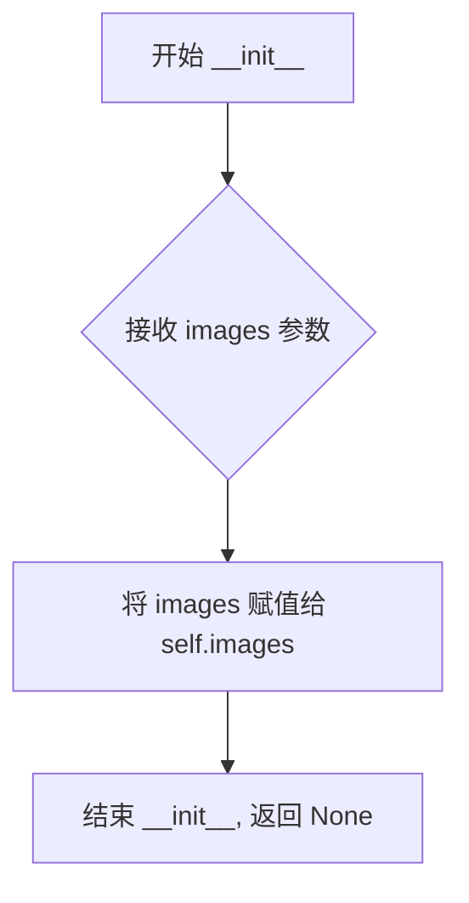
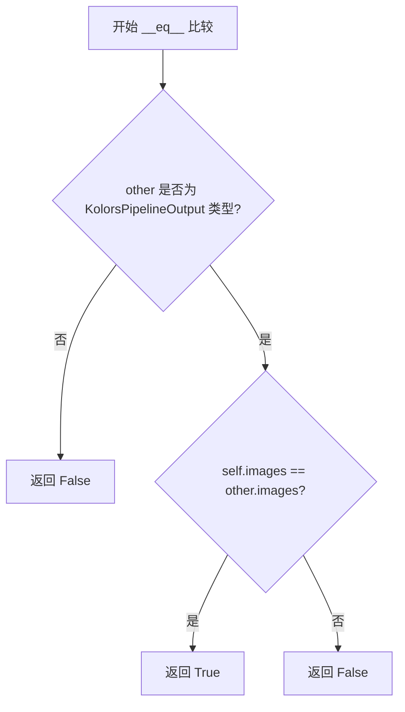

# `diffusers\src\diffusers\pipelines\kolors\pipeline_output.py` 详细设计文档

这是一个用于 Kolors 扩散流水线的输出类，继承自 BaseOutput，用于存储去噪后的 PIL 图像列表或 numpy 数组。

## 整体流程

```mermaid
graph TD
    A[开始] --> B[创建 KolorsPipelineOutput 实例]
    B --> C{images 参数类型}
    C -- PIL.Image --> D[存储为 list[PIL.Image.Image]]
    C -- numpy --> E[存储为 np.ndarray]
```

## 类结构

```
BaseOutput (抽象基类)
└── KolorsPipelineOutput (继承自 BaseOutput)
```

## 全局变量及字段


### `KolorsPipelineOutput.images`
    
去噪后的图像列表或数组

类型：`list[PIL.Image.Image] | np.ndarray`
    
    

## 全局函数及方法


### `KolorsPipelineOutput.__init__`

这是由 `@dataclass` 装饰器自动生成的初始化方法，用于创建 `KolorsPipelineOutput` 类的实例，接收去噪后的图像数据（支持 PIL 图像列表或 NumPy 数组）并将其存储在实例的 `images` 属性中。

参数：

- `self`：`KolorsPipelineOutput`，当前实例对象
- `images`：`list[PIL.Image.Image] | np.ndarray`，去噪后的图像列表或 NumPy 数组，形状为 `(batch_size, height, width, num_channels)`

返回值：`None`，`__init__` 方法不返回值，仅初始化实例状态

#### 流程图



#### 带注释源码

```python
def __init__(self, images: list[PIL.Image.Image] | np.ndarray) -> None:
    """
    自动生成的初始化方法（由 @dataclass 装饰器生成）。
    
    Args:
        images: 去噪后的图像列表或 NumPy 数组，形状为 
                (batch_size, height, width, num_channels)
    """
    self.images = images  # 存储去噪后的图像数据
```


### `KolorsPipelineOutput.__repr__`

自动生成的字符串表示方法，用于返回 KolorsPipelineOutput 类的可读字符串描述，方便调试和日志输出。

参数：

- `self`：隐式参数，表示 KolorsPipelineOutput 类的实例本身

返回值：`str`，返回该数据类的字符串表示，包含类名以及所有字段的名称和值

#### 流程图

```mermaid
graph TD
    A[开始 __repr__] --> B{self 是 KolorsPipelineOutput 实例}
    B -->|是| C[收集所有字段信息]
    B -->|否| D[返回默认对象表示]
    C --> E[格式化为字符串: KolorsPipelineOutput(field1=value1, field2=value2, ...)]
    E --> F[返回字符串]
    D --> F
```

#### 带注释源码

```python
def __repr__(self):
    """
    自动生成的字符串表示方法。
    
    当 dataclass 装饰器应用于类时，Python 会自动生成此方法。
    它返回类的名称以及所有字段的名称和值的字符串表示。
    
    Returns:
        str: 格式如 'KolorsPipelineOutput(images=[...])' 的字符串
    """
    # dataclass 自动生成的 __repr__ 方法会按照以下格式返回:
    # 类名(字段1=值1, 字段2=值2, ...)
    # 对于当前类，具体格式为:
    # KolorsPipelineOutput(images=<images的值>)
    
    # self 是隐式参数，代表当前 KolorsPipelineOutput 实例
    # self.images 访问类中定义的 images 字段
    
    # Python 自动生成的 repr 实现大致如下:
    return f"{self.__class__.__name__}(images={self.images!r})"
```

#### 补充说明

| 项目 | 详情 |
|------|------|
| **方法类型** | 数据类自动生成的方法（Python dataclass） |
| **继承关系** | 继承自 BaseOutput，可能继承其父类的 repr 实现 |
| **调用场景** | 调试打印、错误日志、交互式查看对象内容 |
| **自定义需求** | 如需自定义格式，可在类中显式定义 `__repr__` 方法覆盖自动生成版本 |


### `KolorsPipelineOutput.__eq__`

自动生成的相等比较方法，用于比较两个 `KolorsPipelineOutput` 实例是否相等。

参数：

- `other`：`object`，进行比较的另一个对象

返回值：`bool`，如果两个对象相等返回 `True`，否则返回 `False`

#### 流程图



#### 带注释源码

```python
def __eq__(self, other: object) -> bool:
    """
    比较两个 KolorsPipelineOutput 实例是否相等。
    
    由 @dataclass 装饰器自动生成。
    比较逻辑：
    1. 首先检查 other 是否为 KolorsPipelineOutput 类型
    2. 如果类型相同，比较 images 字段是否相等
    3. 返回布尔结果
    
    Args:
        other: 要进行比较的对象
        
    Returns:
        bool: 如果两个对象相等返回 True，否则返回 False
    """
    if not isinstance(other, KolorsPipelineOutput):
        return NotImplemented
    return self.images == other.images
```

## 关键组件


### KolorsPipelineOutput 类

KolorsPipelineOutput 是一个数据类，用于存储 Kolors 扩散管道的输出结果，包含去噪后的图像列表或 numpy 数组。

### BaseOutput 基类

BaseOutput 是 KolorsPipelineOutput 的基类，定义了管道输出的基础结构和接口契约。

### images 字段

images 字段类型为 list[PIL.Image.Image] | np.ndarray，用于存储批量去噪后的图像数据，支持 PIL 图像列表或 numpy 数组两种格式。


## 问题及建议


### 已知问题

-   **类型联合过于宽泛且语义不一致**：`list[PIL.Image.Image] | np.ndarray` 两种类型的内部结构不同，list 情况下是 `batch_size` 个 PIL Image 对象，numpy 数组情况下是 `(batch_size, height, width, num_channels)` 四维数组，使用时需要额外的类型检查和分支处理，增加了调用方的复杂度。
-   **文档字符串存在拼写错误**：描述中 "diffupipeline" 缺少字母，应为 "diffusion pipeline"。
-   **缺少属性验证逻辑**：没有对 `images` 字段的类型、形状（numpy 数组时）或内容（非空检查）进行校验，可能导致运行时错误。
-   **与父类 BaseOutput 的关系不明确**：继承自 `BaseOutput` 但未使用父类任何特性，也未覆盖或扩展父类方法，继承关系显得多余。
-   **不支持批量处理的便捷方法**：缺少如 `__len__`、`__getitem__` 等魔术方法，使用时不够方便。
-   **无默认值导致创建空实例困难**：字段无默认值，无法直接创建空的 `KolorsPipelineOutput` 实例用于占位或预分配。
-   **类型提示缺少泛型具体化**：numpy 数组的 dtype、通道顺序（RGB/BGR）等元信息未在类型或文档中明确。

### 优化建议

-   考虑拆分为两个独立的输出类（如 `KolorsPipelineImageOutput` 和 `KolorsPipelineNdarrayOutput`），或使用泛型类 `Generic[T]` 来明确类型参数，提升类型安全性和代码可读性。
-   修复文档字符串中的拼写错误。
-   添加 `__post_init__` 方法进行输入验证，确保类型正确并在必要时校验 numpy 数组的维度。
-   明确与 `BaseOutput` 的关系，如使用组合替代继承，或在父类中定义抽象方法供子类实现。
-   实现 `__len__`、`__getitem__` 等魔术方法，使其支持迭代和索引访问。
-   为 `images` 字段提供默认值（如 `None` 或空列表），或在类方法中提供工厂方法用于创建空实例。
-   在文档中补充说明 numpy 数组的 dtype（如 `np.uint8`）和通道顺序约定。

## 其它


### 设计目标与约束

该代码的设计目标是为Kolors扩散管道提供标准化的输出数据结构，封装去噪后的图像结果。约束条件包括：支持PIL.Image和numpy.ndarray两种图像格式，遵循BaseOutput基类的接口契约，确保与其他Diffusers库组件的兼容性。

### 错误处理与异常设计

该代码本身为纯数据类，不涉及复杂的业务逻辑，主要依赖dataclass的自动验证。类型检查在运行时通过Python的类型注解进行，不支持编译时类型检查。若传入非法的images类型（如字符串或列表），在后续处理流程中会触发类型错误。

### 数据流与状态机

该组件作为管道输出的终端节点，数据流方向为：扩散模型生成结果 → KolorsPipelineOutput封装 → 返回给调用者。状态机概念不适用于此数据类，因为其不管理状态转换，仅作为不可变的数据容器。

### 外部依赖与接口契约

主要外部依赖包括：1) dataclass装饰器（Python标准库）；2) numpy库用于数值数组；3) PIL库用于图像处理；4) BaseOutput基类定义输出接口规范。接口契约要求images字段必须为list[PIL.Image.Image]或np.ndarray类型。

### 性能考虑

该代码本身无性能瓶颈，作为轻量级数据容器，其性能主要取决于调用方对images字段的使用方式。若批量处理大量图像，应注意numpy数组的内存占用。

### 兼容性说明

该类继承自BaseOutput，需与Diffusers库的整体架构保持一致。PIL.Image和np.ndarray的双重支持确保了与图像处理生态系统的广泛兼容性。

### 使用示例

```python
# 创建输出实例
output = KolorsPipelineOutput(images=[pil_image1, pil_image2])
# 或使用numpy数组
output = KolorsPipelineOutput(images=np_array)
```


    