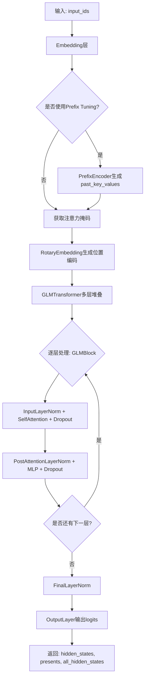
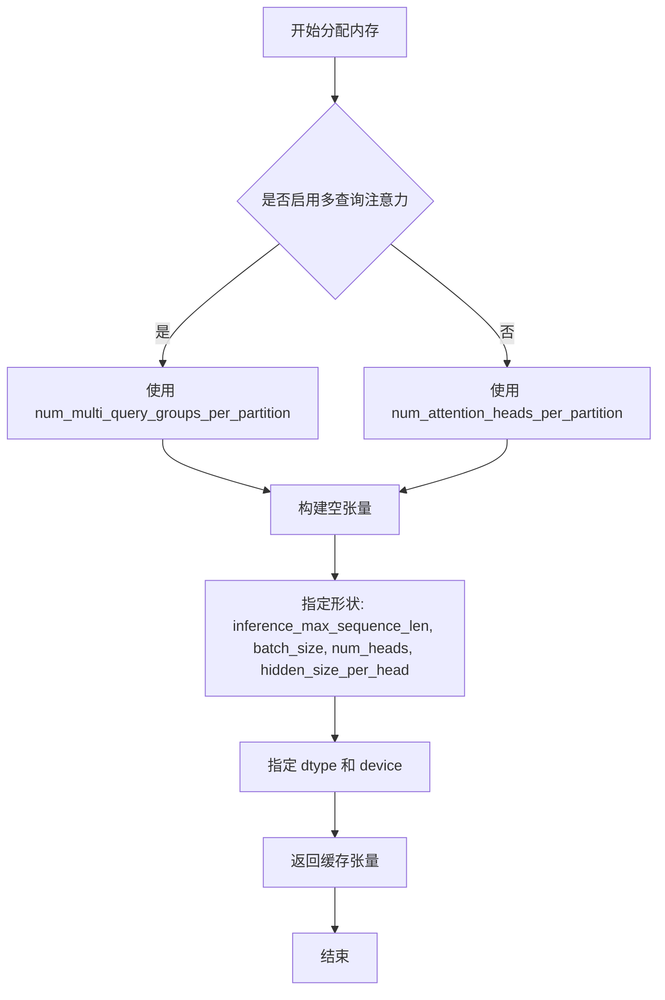
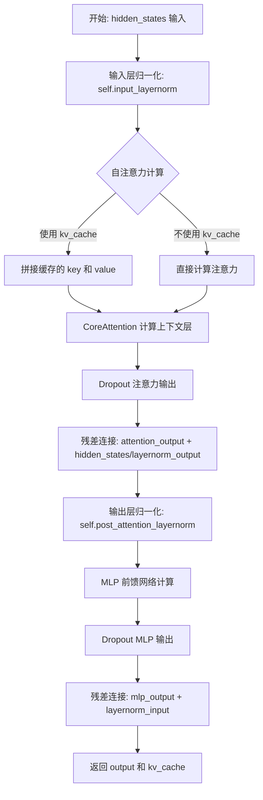
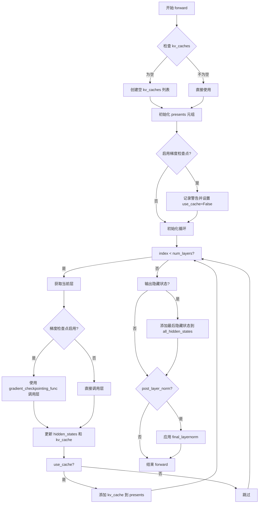
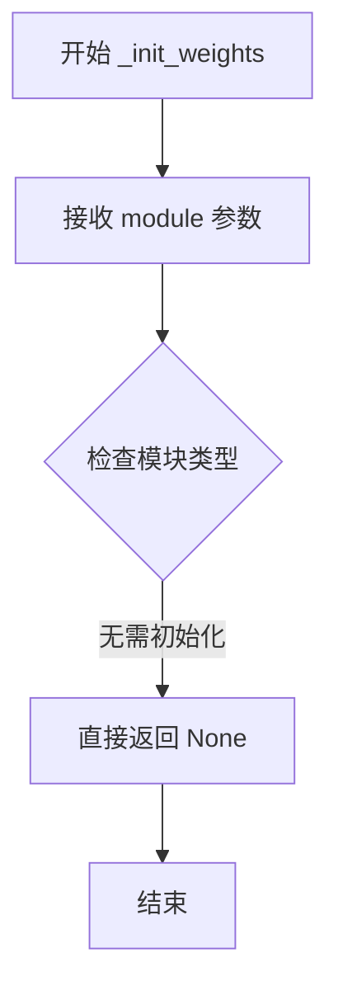
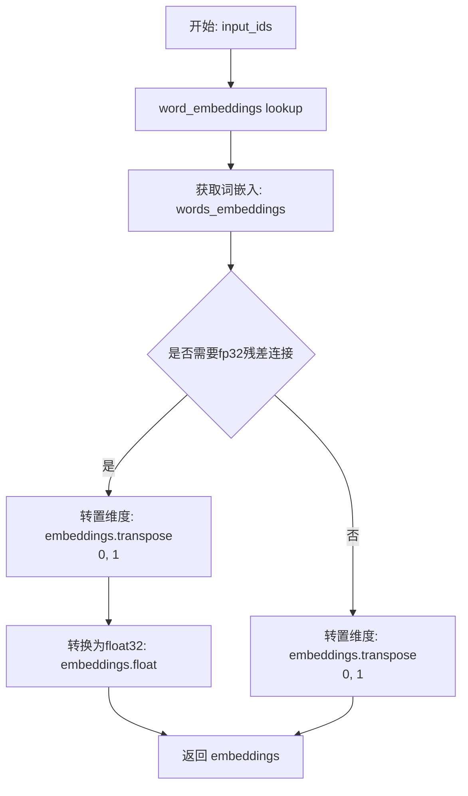
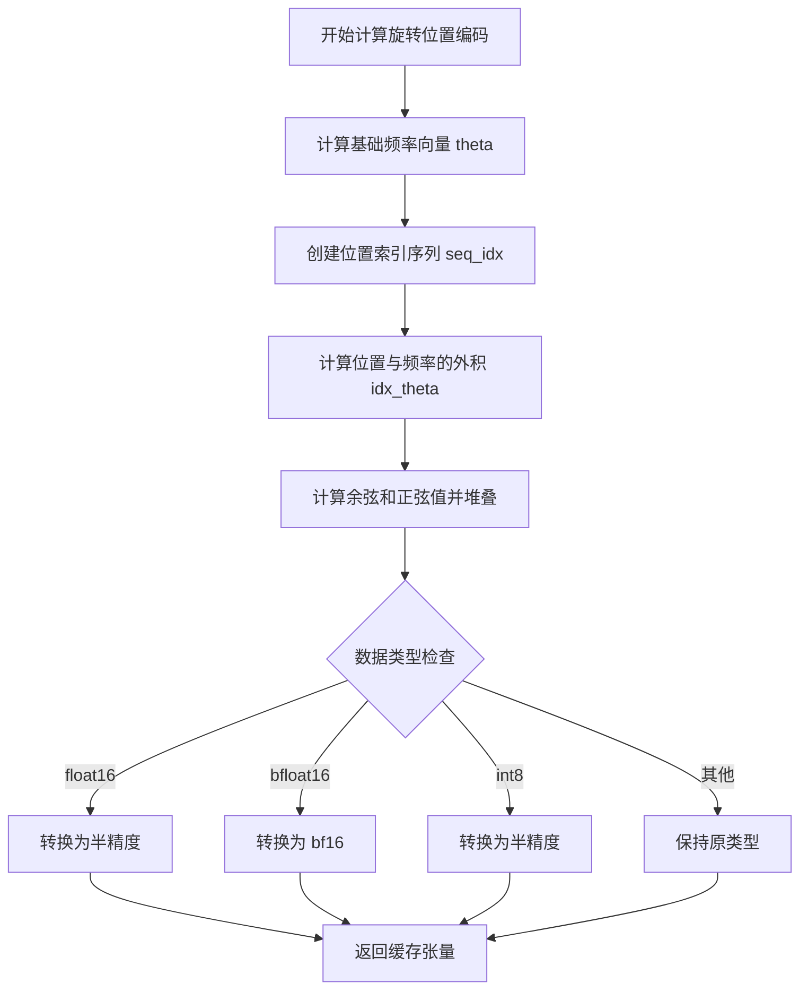

# `diffusers\src\diffusers\pipelines\kolors\text_encoder.py` 详细设计文档

ChatGLM3-6B模型的核心架构实现，包含了完整的Transformer模型结构，包括配置管理、多头注意力机制、旋转位置编码、前缀提示微调等核心组件，支持高效的推理和预训练功能。

## 整体流程



## 类结构

```
ChatGLMPreTrainedModel (PreTrainedModel)
├── ChatGLMConfig (PretrainedConfig)
├── ChatGLMModel (主模型)
├── RMSNorm (归一化)
├── CoreAttention (核心注意力)
├── SelfAttention (自注意力)
├── MLP (前馈网络)
├── GLMBlock (单个Transformer块)
├── GLMTransformer (Transformer堆叠)
├── Embedding (词嵌入)
├── RotaryEmbedding (旋转位置编码)
└── PrefixEncoder (前缀编码器)
```

## 全局变量及字段


### `logger`
    
模块日志记录器

类型：`logging.Logger`
    


### `split_tensor_along_last_dim`
    
沿最后维度分割张量

类型：`function`
    


### `apply_rotary_pos_emb`
    
应用旋转位置编码

类型：`function`
    


### `default_init`
    
默认初始化函数

类型：`function`
    


### `ChatGLMConfig.ChatGLMConfig.__init__`
    
初始化配置参数

类型：`method`
    


### `ChatGLMConfig.num_layers`
    
Transformer层数

类型：`int`
    


### `ChatGLMConfig.padded_vocab_size`
    
词表大小

类型：`int`
    


### `ChatGLMConfig.hidden_size`
    
隐藏层维度

类型：`int`
    


### `ChatGLMConfig.ffn_hidden_size`
    
前馈网络隐藏层维度

类型：`int`
    


### `ChatGLMConfig.kv_channels`
    
键值通道数

类型：`int`
    


### `ChatGLMConfig.num_attention_heads`
    
注意力头数

类型：`int`
    


### `ChatGLMConfig.seq_length`
    
序列长度

类型：`int`
    


### `ChatGLMConfig.hidden_dropout`
    
Dropout比率

类型：`float`
    


### `ChatGLMConfig.attention_dropout`
    
注意力Dropout

类型：`float`
    


### `ChatGLMConfig.layernorm_epsilon`
    
LayerNorm epsilon

类型：`float`
    


### `ChatGLMConfig.rmsnorm`
    
是否使用RMSNorm

类型：`bool`
    


### `ChatGLMConfig.apply_residual_connection_post_layernorm`
    
残差连接位置

类型：`bool`
    


### `ChatGLMConfig.post_layer_norm`
    
是否在最后层归一化

类型：`bool`
    


### `ChatGLMConfig.add_bias_linear`
    
是否添加线性偏置

类型：`bool`
    


### `ChatGLMConfig.add_qkv_bias`
    
是否添加QKV偏置

类型：`bool`
    


### `ChatGLMConfig.bias_dropout_fusion`
    
偏置Dropout融合

类型：`bool`
    


### `ChatGLMConfig.multi_query_attention`
    
多查询注意力

类型：`bool`
    


### `ChatGLMConfig.multi_query_group_num`
    
多查询组数

类型：`int`
    


### `ChatGLMConfig.apply_query_key_layer_scaling`
    
QK缩放

类型：`bool`
    


### `ChatGLMConfig.attention_softmax_in_fp32`
    
FP32注意力Softmax

类型：`bool`
    


### `ChatGLMConfig.fp32_residual_connection`
    
FP32残差连接

类型：`bool`
    


### `ChatGLMConfig.quantization_bit`
    
量化位数

类型：`int`
    


### `ChatGLMConfig.pre_seq_len`
    
前缀序列长度

类型：`int`
    


### `ChatGLMConfig.prefix_projection`
    
前缀投影

类型：`bool`
    


### `RMSNorm.RMSNorm.forward`
    
前向传播计算RMSNorm

类型：`method`
    


### `RMSNorm.weight`
    
可学习权重

类型：`torch.nn.Parameter`
    


### `RMSNorm.eps`
    
归一化epsilon

类型：`float`
    


### `CoreAttention.CoreAttention.forward`
    
执行核心注意力计算,支持PyTorch2.0的SDPA和传统实现

类型：`method`
    


### `CoreAttention.apply_query_key_layer_scaling`
    
QK层缩放标志

类型：`bool`
    


### `CoreAttention.attention_softmax_in_fp32`
    
FP32 Softmax标志

类型：`bool`
    


### `CoreAttention.layer_number`
    
层编号

类型：`int`
    


### `CoreAttention.hidden_size_per_partition`
    
分区隐藏大小

类型：`int`
    


### `CoreAttention.hidden_size_per_attention_head`
    
每头隐藏大小

类型：`int`
    


### `CoreAttention.num_attention_heads_per_partition`
    
每分区注意力头数

类型：`int`
    


### `CoreAttention.coeff`
    
缩放系数

类型：`float`
    


### `CoreAttention.norm_factor`
    
归一化因子

类型：`float`
    


### `CoreAttention.attention_dropout`
    
Dropout层

类型：`torch.nn.Dropout`
    


### `SelfAttention.SelfAttention._allocate_memory`
    
分配推理内存

类型：`method`
    


### `SelfAttention.SelfAttention.forward`
    
执行自注意力计算,包括QKV投影、旋转位置编码、缓存管理

类型：`method`
    


### `SelfAttention.layer_number`
    
层编号

类型：`int`
    


### `SelfAttention.projection_size`
    
投影大小

类型：`int`
    


### `SelfAttention.hidden_size_per_attention_head`
    
每头隐藏大小

类型：`int`
    


### `SelfAttention.num_attention_heads_per_partition`
    
每分区头数

类型：`int`
    


### `SelfAttention.multi_query_attention`
    
多查询注意力标志

类型：`bool`
    


### `SelfAttention.qkv_hidden_size`
    
QKV隐藏大小

类型：`int`
    


### `SelfAttention.query_key_value`
    
QKV线性层

类型：`nn.Linear`
    


### `SelfAttention.core_attention`
    
核心注意力

类型：`CoreAttention`
    


### `SelfAttention.dense`
    
输出线性层

类型：`nn.Linear`
    


### `MLP.MLP.forward`
    
执行前馈网络计算

类型：`method`
    


### `MLP.add_bias`
    
偏置标志

类型：`bool`
    


### `MLP.dense_h_to_4h`
    
输入投影层

类型：`nn.Linear`
    


### `MLP.activation_func`
    
激活函数(SwiGLU)

类型：`callable`
    


### `MLP.dense_4h_to_h`
    
输出投影层

类型：`nn.Linear`
    


### `GLMBlock.GLMBlock.forward`
    
执行完整的Transformer块计算

类型：`method`
    


### `GLMBlock.layer_number`
    
层编号

类型：`int`
    


### `GLMBlock.apply_residual_connection_post_layernorm`
    
残差位置

类型：`bool`
    


### `GLMBlock.fp32_residual_connection`
    
FP32残差标志

类型：`bool`
    


### `GLMBlock.input_layernorm`
    
输入层归一化

类型：`LayerNorm/RMSNorm`
    


### `GLMBlock.self_attention`
    
自注意力

类型：`SelfAttention`
    


### `GLMBlock.hidden_dropout`
    
Dropout比率

类型：`float`
    


### `GLMBlock.post_attention_layernorm`
    
注意力后层归一化

类型：`LayerNorm/RMSNorm`
    


### `GLMBlock.mlp`
    
前馈网络

类型：`MLP`
    


### `GLMTransformer.GLMTransformer._get_layer`
    
获取指定层

类型：`method`
    


### `GLMTransformer.GLMTransformer.forward`
    
执行完整的Transformer堆叠计算

类型：`method`
    


### `GLMTransformer.fp32_residual_connection`
    
FP32残差标志

类型：`bool`
    


### `GLMTransformer.post_layer_norm`
    
后层归一化标志

类型：`bool`
    


### `GLMTransformer.num_layers`
    
层数

类型：`int`
    


### `GLMTransformer.layers`
    
Transformer块列表

类型：`nn.ModuleList`
    


### `GLMTransformer.final_layernorm`
    
最终层归一化

类型：`LayerNorm/RMSNorm`
    


### `GLMTransformer.gradient_checkpointing`
    
梯度检查点标志

类型：`bool`
    


### `ChatGLMPreTrainedModel.ChatGLMPreTrainedModel._init_weights`
    
初始化权重

类型：`method`
    


### `ChatGLMPreTrainedModel.ChatGLMPreTrainedModel.get_masks`
    
生成注意力掩码

类型：`method`
    


### `ChatGLMPreTrainedModel.ChatGLMPreTrainedModel.get_position_ids`
    
生成位置IDs

类型：`method`
    


### `ChatGLMPreTrainedModel.is_parallelizable`
    
是否可并行

类型：`bool`
    


### `ChatGLMPreTrainedModel.supports_gradient_checkpointing`
    
梯度检查点支持

类型：`bool`
    


### `ChatGLMPreTrainedModel.config_class`
    
配置类

类型：`type`
    


### `ChatGLMPreTrainedModel.base_model_prefix`
    
基础模型前缀

类型：`str`
    


### `ChatGLMPreTrainedModel._no_split_modules`
    
不分割模块列表

类型：`list`
    


### `Embedding.Embedding.forward`
    
执行词嵌入并转换维度顺序

类型：`method`
    


### `Embedding.hidden_size`
    
隐藏大小

类型：`int`
    


### `Embedding.word_embeddings`
    
词嵌入

类型：`nn.Embedding`
    


### `Embedding.fp32_residual_connection`
    
FP32残差标志

类型：`bool`
    


### `RotaryEmbedding.RotaryEmbedding.forward_impl`
    
实现旋转位置编码计算

类型：`method`
    


### `RotaryEmbedding.RotaryEmbedding.forward`
    
返回旋转位置编码缓存

类型：`method`
    


### `RotaryEmbedding.inv_freq`
    
逆频率

类型：`torch.Tensor`
    


### `RotaryEmbedding.dim`
    
维度

类型：`int`
    


### `RotaryEmbedding.original_impl`
    
原始实现标志

类型：`bool`
    


### `PrefixEncoder.PrefixEncoder.forward`
    
编码前缀生成past_key_values

类型：`method`
    


### `PrefixEncoder.prefix_projection`
    
前缀投影标志

类型：`bool`
    


### `PrefixEncoder.embedding`
    
前缀嵌入

类型：`nn.Embedding`
    


### `PrefixEncoder.trans`
    
投影MLP(可选)

类型：`nn.Sequential`
    


### `ChatGLMModel.ChatGLMModel.get_input_embeddings`
    
获取输入嵌入

类型：`method`
    


### `ChatGLMModel.ChatGLMModel.get_prompt`
    
获取前缀提示

类型：`method`
    


### `ChatGLMModel.ChatGLMModel.forward`
    
执行完整的前向传播

类型：`method`
    


### `ChatGLMModel.embedding`
    
词嵌入层

类型：`Embedding`
    


### `ChatGLMModel.num_layers`
    
层数

类型：`int`
    


### `ChatGLMModel.multi_query_group_num`
    
多查询组数

类型：`int`
    


### `ChatGLMModel.kv_channels`
    
键值通道

类型：`int`
    


### `ChatGLMModel.seq_length`
    
序列长度

类型：`int`
    


### `ChatGLMModel.rotary_pos_emb`
    
旋转位置编码

类型：`RotaryEmbedding`
    


### `ChatGLMModel.encoder`
    
Transformer编码器

类型：`GLMTransformer`
    


### `ChatGLMModel.output_layer`
    
输出层

类型：`nn.Linear`
    


### `ChatGLMModel.pre_seq_len`
    
前缀长度

类型：`int`
    


### `ChatGLMModel.prefix_projection`
    
前缀投影

类型：`bool`
    


### `ChatGLMModel.prefix_tokens`
    
前缀token

类型：`torch.Tensor`
    


### `ChatGLMModel.prefix_encoder`
    
前缀编码器

类型：`PrefixEncoder`
    


### `ChatGLMModel.dropout`
    
Dropout层

类型：`nn.Dropout`
    
    

## 全局函数及方法


### `split_tensor_along_last_dim`

该函数用于将输入张量沿其最后一个维度分割成指定数量的分区，是 ChatGLM 模型中分割 QKV（Query、Key、Value）张量的核心工具函数，支持可选的内存连续性优化。

参数：

- `tensor`：`torch.Tensor`，输入的需要分割的张量
- `num_partitions`：`int`，要分割的分区数量（例如分割 QKV 时为 3）
- `contiguous_split_chunks`：`bool`，是否将每个分割后的块转换为连续内存布局（默认为 False）

返回值：`list[torch.Tensor]`，分割后的张量列表

#### 流程图

```mermaid
flowchart TD
    A[开始: split_tensor_along_last_dim] --> B[获取输入张量的维度信息]
    B --> C[计算最后维度的大小: last_dim_size = tensor.size[last_dim] / num_partitions]
    C --> D[调用 torch.split 按最后维度分割张量]
    D --> E{contiguous_split_chunks 是否为 True?}
    E -->|Yes| F[对每个分割块调用 .contiguous 保证内存连续]
    E -->|No| G[直接返回分割后的张量列表]
    F --> H[返回连续化的元组]
    G --> I[结束: 返回张量列表]
```

#### 带注释源码

```python
def split_tensor_along_last_dim(
    tensor: torch.Tensor,          # 输入张量，例如 [sq, b, np, 3*hn]
    num_partitions: int,           # 分区数量，通常为3（对应Q、K、V）
    contiguous_split_chunks: bool = False,  # 是否要求每个块内存连续
) -> list[torch.Tensor]:
    """Split a tensor along its last dimension.

    Arguments:
        tensor: input tensor.                     # 输入张量
        num_partitions: number of partitions to split the tensor  # 分区数
        contiguous_split_chunks: If True, make each chunk contiguous
                                 in memory.       # 是否保证内存连续

    Returns:
        A list of Tensors                         # 返回张量列表
    """
    # 获取张量的维度信息
    # 例如: tensor.dim() 返回张量的维度数
    last_dim = tensor.dim() - 1  # 最后一个维度的索引（从0开始）
    
    # 计算每个分区的大小
    # 例如: 如果最后维度是 384，分割成 3 份，则每份 128
    last_dim_size = tensor.size()[last_dim] // num_partitions
    
    # 使用 PyTorch 的 split 函数进行分割
    # torch.split(tensor, split_size, dim) 按指定维度分割张量
    tensor_list = torch.split(tensor, last_dim_size, dim=last_dim)
    
    # 注意: torch.split 默认不创建连续的张量
    # 如果需要内存连续的张量，手动调用 contiguous()
    if contiguous_split_chunks:
        return tuple(chunk.contiguous() for chunk in tensor_list)

    return tensor_list
```


### `apply_rotary_pos_emb`

对输入张量应用旋转位置编码（Rotary Position Embedding），通过复数形式的旋转矩阵对查询和键向量进行位置编码增强，使模型能够感知序列中token的相对位置信息。

参数：

- `x`：`torch.Tensor`，输入张量，形状为 `[sq, b, np, hn]`，其中 sq 是序列长度，b 是批次大小，np 是注意力头数，hn 是每个头的隐藏维度
- `rope_cache`：`torch.Tensor`，预计算的旋转位置编码缓存，用于存储位置编码的余弦和正弦值

返回值：`torch.Tensor`，应用旋转位置编码后的张量，形状与输入相同

#### 流程图

```mermaid
flowchart TD
    A[输入 x 和 rope_cache] --> B[获取输入张量维度信息]
    B --> C[计算旋转维度 rot_dim = rope_cache.shape[-2] * 2]
    C --> D[将输入张量分为旋转部分 x 和非旋转部分 x_pass]
    D --> E[截断 rope_cache 到序列长度 sq]
    E --> F[重塑 x 为 [sq, -, np, rot_dim//2, 2]]
    F --> G[重塑 rope_cache 为 [sq, -, 1, xshaped.size(3), 2]]
    G --> H[计算旋转后的结果 x_out2]
    H --> I[展平 x_out2 的最后两维]
    I --> J[拼接旋转结果和非旋转部分]
    J --> K[返回最终结果]
```

#### 带注释源码

```python
@torch.jit_script
def apply_rotary_pos_emb(x: torch.Tensor, rope_cache: torch.Tensor) -> torch.Tensor:
    # x: [sq, b, np, hn]
    # 获取输入张量的各个维度大小
    # sq: 序列长度, b: 批次大小, np: 注意力头数, hn: 每头隐藏维度
    sq, _b, np, _hn = x.size(0), x.size(1), x.size(2), x.size(3)
    
    # 计算旋转维度，每个位置需要 rot_dim 个编码值
    # rope_cache 存储的是 [cos, sin]，所以乘以2
    rot_dim = rope_cache.shape[-2] * 2
    
    # 将输入分为旋转部分和非旋转部分
    # 旋转部分用于应用位置编码，非旋转部分保持不变
    x, x_pass = x[..., :rot_dim], x[..., rot_dim:]
    
    # 截断 rope_cache 以支持可变序列长度
    # 确保缓存长度与当前序列长度匹配
    rope_cache = rope_cache[:sq]
    
    # 重塑旋转部分以便进行旋转运算
    # 转换为 [sq, batch*heads, num_heads, rot_dim//2, 2] 格式
    # 最后两维用于存储复数的实部和虚部
    xshaped = x.reshape(sq, -1, np, rot_dim // 2, 2)
    
    # 重塑 rope_cache 以匹配 xshaped 的形状
    # [sq, rot_dim//2, 2] -> [sq, 1, 1, rot_dim//2, 2]
    rope_cache = rope_cache.view(sq, -1, 1, xshaped.size(3), 2)
    
    # 应用旋转位置嵌入
    # 使用复数旋转公式: x' = x * cos(θ) - y * sin(θ)
    #                 y' = x * sin(θ) + y * cos(θ)
    # 其中 rope_cache[..., 0] 是 cos 值，rope_cache[..., 1] 是 sin 值
    x_out2 = torch.stack(
        [
            # 实部: x * cos(θ) - y * sin(θ)
            xshaped[..., 0] * rope_cache[..., 0] - xshaped[..., 1] * rope_cache[..., 1],
            # 虚部: x * sin(θ) + y * cos(θ)
            xshaped[..., 1] * rope_cache[..., 0] + xshaped[..., 0] * rope_cache[..., 1],
        ],
        -1,  # 在最后一个维度拼接
    )
    
    # 展平最后两个维度，将复数表示转回实数形式
    x_out2 = x_out2.flatten(3)
    
    # 拼接旋转编码后的部分和未旋转的部分
    # 返回完整的带位置编码的张量
    return torch.cat((x_out2, x_pass), dim=-1)
```


### `default_init`

默认初始化函数，用于动态创建类实例。该函数是一个简单的包装器，接受一个类及其参数，然后调用该类的构造函数并返回实例。在 `ChatGLMModel` 中用作初始化方法的替代方案。

参数：

- `cls`：`type`，要实例化的类对象
- `*args`：可变位置参数列表，传递给类的构造函数
- `**kwargs`：可变关键字参数字典，传递给类的构造函数

返回值：返回传入类的实例对象

#### 流程图

```mermaid
flowchart TD
    A[接收 cls, *args, **kwargs] --> B{调用 cls(*args, **kwargs)}
    B --> C[创建类实例]
    C --> D[返回实例]
```

#### 带注释源码

```python
def default_init(cls, *args, **kwargs):
    """
    默认初始化函数，用于动态创建类实例。
    
    这是一个简单的工厂函数包装器，接受一个类（cls）和可选的
    位置参数（*args）及关键字参数（**kwargs），然后调用该类的
    构造函数创建实例并返回。
    
    参数:
        cls: 要实例化的类对象
        *args: 可变位置参数，传递给类的构造函数
        **kwargs: 可变关键字参数，传递给类的构造函数
    
    返回:
        cls类的实例对象
    """
    return cls(*args, **kwargs)
```


### `ChatGLMConfig.__init__`

初始化ChatGLM3模型配置参数，定义模型架构、超参数和训练相关设置。

参数：

- `num_layers`：`int`，模型层数，默认为28
- `padded_vocab_size`：`int`，填充后的词汇表大小，默认为65024
- `hidden_size`：`int`，隐藏层维度，默认为4096
- `ffn_hidden_size`：`int`，前馈网络隐藏层维度，默认为13696
- `kv_channels`：`int`，键值通道数，用于多头注意力，默认为128
- `num_attention_heads`：`int`，注意力头数，默认为32
- `seq_length`：`int`，序列长度，默认为2048
- `hidden_dropout`：`float`，隐藏层dropout概率，默认为0.0
- `classifier_dropout`：`float`，分类器dropout概率，默认为None
- `attention_dropout`：`float`，注意力dropout概率，默认为0.0
- `layernorm_epsilon`：`float`，LayerNorm的epsilon参数，默认为1e-5
- `rmsnorm`：`bool`，是否使用RMSNorm归一化，默认为True
- `apply_residual_connection_post_layernorm`：`bool`，是否在LayerNorm之后应用残差连接，默认为False
- `post_layer_norm`：`bool`，是否在层之后应用归一化，默认为True
- `add_bias_linear`：`bool`，是否在线性层中添加偏置，默认为False
- `add_qkv_bias`：`bool`，是否在QKV计算中添加偏置，默认为False
- `bias_dropout_fusion`：`bool`，是否启用偏置与dropout融合优化，默认为True
- `multi_query_attention`：`bool`，是否使用多查询注意力机制，默认为False
- `multi_query_group_num`：`int`，多查询注意力组数，默认为1
- `apply_query_key_layer_scaling`：`bool`，是否应用Query-Key层缩放，默认为True
- `attention_softmax_in_fp32`：`bool`，是否在FP32精度下执行Softmax计算，默认为True
- `fp32_residual_connection`：`bool`，是否使用FP32精度进行残差连接，默认为False
- `quantization_bit`：`int`，量化位数，0表示不使用量化，默认为0
- `pre_seq_len`：`int`，前缀序列长度，用于P-Tuning，默认为None
- `prefix_projection`：`bool`，是否使用前缀投影，默认为False
- `**kwargs`：其他传递给父类PretrainedConfig的关键字参数

返回值：`None`，无返回值

#### 流程图

```mermaid
flowchart TD
    A[开始 __init__] --> B[接收配置参数]
    B --> C{遍历参数}
    C --> D[设置 self.num_layers = num_layers]
    C --> E[设置 self.vocab_size = padded_vocab_size]
    C --> F[设置 self.padded_vocab_size = padded_vocab_size]
    C --> G[设置 self.hidden_size = hidden_size]
    C --> H[设置 self.ffn_hidden_size = ffn_hidden_size]
    C --> I[设置 self.kv_channels = kv_channels]
    C --> J[设置 self.num_attention_heads = num_attention_heads]
    C --> K[设置 self.seq_length = seq_length]
    C --> L[设置 self.hidden_dropout = hidden_dropout]
    C --> M[设置 self.classifier_dropout = classifier_dropout]
    C --> N[设置 self.attention_dropout = attention_dropout]
    C --> O[设置 self.layernorm_epsilon = layernorm_epsilon]
    C --> P[设置 self.rmsnorm = rmsnorm]
    C --> Q[设置 apply_residual_connection_post_layernorm]
    C --> R[设置 self.post_layer_norm = post_layer_norm]
    C --> S[设置 self.add_bias_linear = add_bias_linear]
    C --> T[设置 self.add_qkv_bias = add_qkv_bias]
    C --> U[设置 self.bias_dropout_fusion = bias_dropout_fusion]
    C --> V[设置 self.multi_query_attention = multi_query_attention]
    C --> W[设置 self.multi_query_group_num = multi_query_group_num]
    C --> X[设置 apply_query_key_layer_scaling]
    C --> Y[设置 self.attention_softmax_in_fp32 = attention_softmax_in_fp32]
    C --> Z[设置 self.fp32_residual_connection = fp32_residual_connection]
    C --> AA[设置 self.quantization_bit = quantization_bit]
    C --> AB[设置 self.pre_seq_len = pre_seq_len]
    C --> AC[设置 self.prefix_projection = prefix_projection]
    C --> AD[调用 super().__init__(**kwargs)]
    AD --> AE[结束 __init__]
```

#### 带注释源码

```python
def __init__(
    self,
    num_layers=28,                      # Transformer模型的总层数
    padded_vocab_size=65024,            # 填充后的词汇表大小，需与tokenizer匹配
    hidden_size=4096,                   # 隐藏层维度，决定模型参数量
    ffn_hidden_size=13696,              # 前馈神经网络隐藏层维度，通常为hidden_size的约3-4倍
    kv_channels=128,                    # 每个注意力头的key/value通道数，num_heads * kv_channels = hidden_size
    num_attention_heads=32,             # 注意力头数量
    seq_length=2048,                    # 最大序列长度
    hidden_dropout=0.0,                 # 隐藏层dropout率，用于正则化
    classifier_dropout=None,            # 分类头dropout率，默认为hidden_dropout
    attention_dropout=0.0,              # 注意力层dropout率
    layernorm_epsilon=1e-5,             # LayerNorm数值稳定性参数
    rmsnorm=True,                       # 是否使用RMSNorm（更高效的归一化方式）
    apply_residual_connection_post_layernorm=False,  # 残差连接位置：True在LayerNorm后，False在LayerNorm前
    post_layer_norm=True,               # 是否在Transformer层后应用最终归一化
    add_bias_linear=False,              # 是否在线性层中添加偏置项
    add_qkv_bias=False,                 # 是否在QKV投影中添加偏置
    bias_dropout_fusion=True,           # 是否融合偏置计算与dropout以优化推理性能
    multi_query_attention=False,        # 是否启用多查询注意力（减少KV缓存）
    multi_query_group_num=1,            # 多查询注意力组数
    apply_query_key_layer_scaling=True, # 是否对QK缩放因子应用层级调整（用于训练稳定性）
    attention_softmax_in_fp32=True,     # Softmax计算使用FP32精度以提高稳定性
    fp32_residual_connection=False,    # 残差连接使用FP32精度
    quantization_bit=0,                # 量化位数，0表示不使用量化
    pre_seq_len=None,                   # P-Tuning前缀序列长度
    prefix_projection=False,           # 是否使用前缀投影网络
    **kwargs,                           # 传递给父类的额外参数
):
    # 模型结构参数
    self.num_layers = num_layers
    self.vocab_size = padded_vocab_size
    self.padded_vocab_size = padded_vocab_size
    self.hidden_size = hidden_size
    self.ffn_hidden_size = ffn_hidden_size
    self.kv_channels = kv_channels
    self.num_attention_heads = num_attention_heads
    self.seq_length = seq_length
    
    # Dropout配置
    self.hidden_dropout = hidden_dropout
    self.classifier_dropout = classifier_dropout
    self.attention_dropout = attention_dropout
    
    # 归一化配置
    self.layernorm_epsilon = layernorm_epsilon
    self.rmsnorm = rmsnorm
    self.apply_residual_connection_post_layernorm = apply_residual_connection_post_layernorm
    self.post_layer_norm = post_layer_norm
    
    # 偏置配置
    self.add_bias_linear = add_bias_linear
    self.add_qkv_bias = add_qkv_bias
    self.bias_dropout_fusion = bias_dropout_fusion
    
    # 注意力配置
    self.multi_query_attention = multi_query_attention
    self.multi_query_group_num = multi_query_group_num
    self.apply_query_key_layer_scaling = apply_query_key_layer_scaling
    self.attention_softmax_in_fp32 = attention_softmax_in_fp32
    
    # 精度与优化配置
    self.fp32_residual_connection = fp32_residual_connection
    self.quantization_bit = quantization_bit
    
    # P-Tuning配置
    self.pre_seq_len = pre_seq_len
    self.prefix_projection = prefix_projection
    
    # 调用父类PretrainedConfig的初始化方法
    super().__init__(**kwargs)
```


### RMSNorm.forward

实现RMSNorm（Root Mean Square Normalization）前向传播，计算公式为 `output = (input / sqrt(RMS + eps)) * weight`，其中RMS是输入在最后一维的均方根值。该归一化方法相比LayerNorm具有更低的计算复杂度和更好的数值稳定性。

参数：

- `hidden_states`：`torch.Tensor`，输入的隐藏状态张量，形状为 `(*, normalized_shape)`，其中 `*` 表示任意前置维度

返回值：`torch.Tensor`，返回归一化后的张量，形状与输入相同

#### 流程图

```mermaid
flowchart TD
    A[输入 hidden_states] --> B[保存原始数据类型 input_dtype]
    B --> C[转换为 float32 类型]
    C --> D[计算方差: variance = hidden_states.pow(2).mean(-1, keepdim=True)]
    D --> E[计算归一化因子: rsqrt variance + eps]
    E --> F[归一化: hidden_states * rsqrt]
    F --> G[乘以可学习权重: weight * hidden_states]
    G --> H[转换回原始数据类型]
    H --> I[输出归一化后的张量]
```

#### 带注释源码

```python
def forward(self, hidden_states: torch.Tensor):
    # 步骤1: 保存输入张量的原始数据类型，用于后续转换回原始精度
    input_dtype = hidden_states.dtype
    
    # 步骤2: 将输入转换为 float32 以保证计算的数值稳定性
    # pow(2) 计算每个元素的平方
    # mean(-1, keepdim=True) 在最后一个维度计算均值，保持维度以支持广播
    variance = hidden_states.to(torch.float32).pow(2).mean(-1, keepdim=True)
    
    # 步骤3: 计算归一化因子
    # torch.rsqrt 计算倒数平方根，即 1/sqrt(x)
    # 添加 eps 防止除零错误
    hidden_states = hidden_states * torch.rsqrt(variance + self.eps)
    
    # 步骤4: 乘以可学习的缩放权重 weight
    # 将结果转换回原始输入数据类型以保持精度一致性
    return (self.weight * hidden_states).to(input_dtype)
```


### `CoreAttention.forward`

执行核心注意力计算，支持PyTorch 2.0的SDPA（scaled dot-product attention）和传统实现两种路径，根据PyTorch版本自动选择最优实现。

参数：

- `query_layer`：`torch.Tensor`，查询层张量，形状为 [sq, b, np, hn]（传统实现）或经permute后为 [b, np, sq, hn]（SDPA实现），其中sq为序列长度，b为批量大小，np为注意力头数，hn为每个头的维度
- `key_layer`：`torch.Tensor`，键层张量，形状同query_layer
- `value_layer`：`torch.Tensor`，值层张量，形状同query_layer
- `attention_mask`：`torch.Tensor` 或 `None`，注意力掩码张量，用于屏蔽无效位置，值为布尔型或整型

返回值：`torch.Tensor`，上下文层张量，形状为 [sq, b, hp]，其中hp为hidden_size_per_partition，即所有注意力头的总维度

#### 流程图

```mermaid
flowchart TD
    A[开始 forward] --> B{PyTorch版本 >= 2.0?}
    
    B -->|Yes| C[SDPA路径]
    B -->|No| D[传统实现路径]
    
    C --> C1[permute: (1, 2, 0, 3) 转换为 (b, np, sq, hn)]
    C1 --> C2{attention_mask 为 None<br>且 query长度 == key长度?}
    
    C2 -->|Yes| C3[调用 scaled_dot_product_attention<br>is_causal=True]
    C2 -->|No| C4[反转attention_mask<br>调用带mask的SDPA]
    
    C3 --> C5[permute回 (2, 0, 1, 3)]
    C4 --> C5
    C5 --> C6[reshape 到 hidden_size_per_partition]
    C6 --> Z[返回 context_layer]
    
    D --> D1[计算output_size: (b, np, sq, sk)]
    D1 --> D2[reshape query/key为 (sq, b*np, hn) 和 (sk, b*np, hn)]
    D2 --> D3[预分配 matmul_input_buffer]
    D3 --> D4[torch.baddbmm 计算原始注意力分数]
    D4 --> D5[view为 (b, np, sq, sk)]
    D5 --> D6{attention_softmax_in_fp32?}
    D6 -->|Yes| D7[转换为float32]
    D6 -->|No| D8
    D7 --> D8{coeff 不为 None?}
    D8 -->|Yes| D9[乘以coeff]
    D8 -->|No| D10
    D9 --> D10{attention_mask 为 None<br>且 sq == sk?}
    D10 -->|Yes| D11[创建因果mask<br>tril_ 并反转]
    D10 -->|No| D12
    D11 --> D12
    D12 --> D13{mask不为 None?}
    D12 -->|Yes| D14[masked_fill 设为 -inf]
    D13 -->|No| D15
    D14 --> D15
    D13 -->|No| D15
    D15 --> D16[softmax 计算注意力概率]
    D16 --> D17[type_as 转换类型]
    D17 --> D18[attention_dropout 随机丢弃]
    D18 --> D19[reshape value 和 attention_probs]
    D19 --> D20[torch.bmm 矩阵乘法]
    D20 --> D21[view 为 (b, np, sq, hn)]
    D21 --> D22[permute 为 (sq, b, np, hn) 并 contiguous]
    D22 --> D23[reshape 为 (sq, b, hp)]
    D23 --> Z
```

#### 带注释源码

```python
def forward(self, query_layer, key_layer, value_layer, attention_mask):
    # 获取PyTorch主版本号，用于判断是否支持SDPA
    pytorch_major_version = int(torch.__version__.split(".")[0])
    
    # ====================
    # PyTorch 2.0+ SDPA 实现路径
    # ====================
    if pytorch_major_version >= 2:
        # 维度重排：从 (sq, b, np, hn) -> (b, np, sq, hn)
        # 适配 SDPA 的输入格式要求
        query_layer, key_layer, value_layer = [
            k.permute(1, 2, 0, 3) for k in [query_layer, key_layer, value_layer]
        ]
        
        # 判断是否可以使用高效的 causal mask
        if attention_mask is None and query_layer.shape[2] == key_layer.shape[2]:
            # 情况1：无mask且序列长度相等，使用is_causal=True优化
            context_layer = torch.nn.functional.scaled_dot_product_attention(
                query_layer, key_layer, value_layer, is_causal=True
            )
        else:
            # 情况2：需要手动处理mask
            if attention_mask is not None:
                # 反转mask：True->False, False->True
                # 因为SDPA中True表示需要mask的位置
                attention_mask = ~attention_mask
            # 调用带掩码的SDPA
            context_layer = torch.nn.functional.scaled_dot_product_attention(
                query_layer, key_layer, value_layer, attention_mask
            )
        
        # 恢复维度顺序：从 (b, np, sq, hn) -> (sq, b, np, hn)
        context_layer = context_layer.permute(2, 0, 1, 3)
        # 调整形状以匹配输出：合并最后两个维度
        new_context_layer_shape = context_layer.size()[:-2] + (self.hidden_size_per_partition,)
        context_layer = context_layer.reshape(*new_context_layer_shape)
    
    # ====================
    # 传统注意力实现路径 (PyTorch < 2.0)
    # ====================
    else:
        # [b, np, sq, sk] - 记录各维度大小
        output_size = (query_layer.size(1), query_layer.size(2), query_layer.size(0), key_layer.size(0))

        # 张量reshape：从 [sq, b, np, hn] -> [sq, b*np, hn]
        # 将序列维度和批量维度合并，以便并行计算
        query_layer = query_layer.view(output_size[2], output_size[0] * output_size[1], -1)
        key_layer = key_layer.view(output_size[3], output_size[0] * output_size[1], -1)

        # 预分配输入缓冲区：避免频繁内存分配
        # 形状：[b*np, sq, sk]
        matmul_input_buffer = torch.empty(
            output_size[0] * output_size[1],
            output_size[2],
            output_size[3],
            dtype=query_layer.dtype,
            device=query_layer.device,
        )

        # 计算原始注意力分数：Q @ K^T / sqrt(d)
        # 结果形状：[b*np, sq, sk]
        matmul_result = torch.baddbmm(
            matmul_input_buffer,
            query_layer.transpose(0, 1),  # [b*np, sq, hn]
            key_layer.transpose(0, 1).transpose(1, 2),  # [b*np, hn, sk]
            beta=0.0,
            alpha=(1.0 / self.norm_factor),  # 缩放因子
        )

        # 调整视图为 [b, np, sq, sk]
        attention_scores = matmul_result.view(*output_size)

        # ===========================
        # 注意力归一化与掩码处理
        # ===========================

        # 如果配置了fp32 softmax，转为float32提高精度
        if self.attention_softmax_in_fp32:
            attention_scores = attention_scores.float()
        # 应用层缩放系数（用于训练稳定性）
        if self.coeff is not None:
            attention_scores = attention_scores * self.coeff
        
        # 自动生成causal mask（如果需要且未提供）
        if attention_mask is None and attention_scores.shape[2] == attention_scores.shape[3]:
            # 创建全1矩阵，然后取下三角
            attention_mask = torch.ones(
                output_size[0], 1, output_size[2], output_size[3], 
                device=attention_scores.device, dtype=torch.bool
            )
            attention_mask.tril_()  # 下三角为True
            attention_mask = ~attention_mask  # 反转：上三角为True（需mask）
        
        # 应用注意力掩码
        if attention_mask is not None:
            attention_scores = attention_scores.masked_fill(attention_mask, float("-inf"))
        
        # softmax归一化得到注意力概率
        attention_probs = F.softmax(attention_scores, dim=-1)
        # 转换回原始数据类型
        attention_probs = attention_probs.type_as(value_layer)

        # 随机dropout（训练时启用）
        attention_probs = self.attention_dropout(attention_probs)
        
        # =========================
        # 计算上下文向量
        # =========================

        # 计算输出尺寸：[b, np, sq, hn]
        output_size = (value_layer.size(1), value_layer.size(2), query_layer.size(0), value_layer.size(3))
        
        # Reshape: [sk, b, np, hn] -> [sk, b*np, hn]
        value_layer = value_layer.view(value_layer.size(0), output_size[0] * output_size[1], -1)
        # Reshape: [b, np, sq, sk] -> [b*np, sq, sk]
        attention_probs = attention_probs.view(output_size[0] * output_size[1], output_size[2], -1)
        
        # 矩阵乘法：[b*np, sq, hn]
        context_layer = torch.bmm(attention_probs, value_layer.transpose(0, 1))
        
        # Reshape回 [b, np, sq, hn]
        context_layer = context_layer.view(*output_size)
        
        # 维度重排：[b, np, sq, hn] -> [sq, b, np, hn] 并连续存储
        context_layer = context_layer.permute(2, 0, 1, 3).contiguous()
        
        # 最终reshape：[sq, b, np, hn] -> [sq, b, hp]
        new_context_layer_shape = context_layer.size()[:-2] + (self.hidden_size_per_partition,)
        context_layer = context_layer.view(*new_context_layer_shape)

    return context_layer
```


### `SelfAttention._allocate_memory`

该方法用于在推理阶段为 key-value 缓存分配内存，根据是否启用多查询注意力（MQA）来动态确定注意力头数量，并返回一个预分配的空张量用于存储推理过程中的键值对。

参数：

- `inference_max_sequence_len`：`int`，推理时的最大序列长度，用于指定缓存张量的第一维大小
- `batch_size`：`int`，批次大小，用于指定缓存张量的第二维大小
- `device`：`torch.device | None`，可选参数，指定张量分配到的设备（CPU/CUDA），默认为 None
- `dtype`：`torch.dtype | None`，可选参数，指定张量的数据类型（如 float16、float32 等），默认为 None

返回值：`torch.Tensor`，返回一个形状为 `(inference_max_sequence_len, batch_size, num_attention_heads, hidden_size_per_attention_head)` 的空张量，用于在推理时存储键值缓存

#### 流程图



#### 带注释源码

```python
def _allocate_memory(self, inference_max_sequence_len, batch_size, device=None, dtype=None):
    """
    为推理阶段分配键值缓存内存。
    
    Args:
        inference_max_sequence_len: 推理时的最大序列长度
        batch_size: 批次大小
        device: 目标设备
        dtype: 张量数据类型
    
    Returns:
        预分配的空张量用于键值缓存
    """
    # 根据是否启用多查询注意力（MQA）确定注意力头数量
    # MQA 使用较少的 kv 头数，通过广播扩展到所有查询头
    if self.multi_query_attention:
        num_attention_heads = self.num_multi_query_groups_per_partition
    else:
        num_attention_heads = self.num_attention_heads_per_partition
    
    # 创建形状为 (seq_len, batch, heads, head_dim) 的空张量
    # 这个张量将用于存储推理时的 key 或 value 缓存
    return torch.empty(
        inference_max_sequence_len,      # 序列长度维度（推理时动态扩展）
        batch_size,                        # 批次大小
        num_attention_heads,               # 注意力头数量
        self.hidden_size_per_attention_head,  # 每个头的隐藏维度
        dtype=dtype,                      # 数据类型
        device=device,                    # 设备（CPU/CUDA）
    )
```


### `SelfAttention.forward`

执行自注意力计算，包括QKV投影、旋转位置编码（RoPE）应用、KV缓存管理，并返回注意力输出和更新后的缓存。

参数：

- `hidden_states`：`torch.Tensor`，输入隐藏状态，形状为 `[sq, b, h]`，其中 sq 是序列长度，b 是批次大小，h 是隐藏维度
- `attention_mask`：`torch.Tensor` 或 `None`，注意力掩码，用于遮盖无效位置
- `rotary_pos_emb`：`torch.Tensor` 或 `None`，旋转位置编码，用于给 Q 和 K 添加位置信息
- `kv_cache`：`tuple[torch.Tensor, torch.Tensor]` 或 `None`，KV 缓存元组，包含之前计算的 key 和 value
- `use_cache`：`bool`，是否返回 KV 缓存供后续推理使用

返回值：`(torch.Tensor, tuple[torch.Tensor, torch.Tensor] | None)`，第一个元素是注意力输出，形状为 `[sq, b, h]`，第二个元素是更新后的 KV 缓存（如果 `use_cache=True`）

#### 流程图

```mermaid
flowchart TD
    A[hidden_states 输入<br/>[sq, b, h]] --> B[QKV 投影<br/>query_key_value linear]
    B --> C{multi_query_attention?}
    C -->|Yes| D[分离 Q/K/V<br/>按分组维度 split]
    C -->|No| E[按头维度 reshape<br/>split 成 3 份]
    D --> F[View 成多头形状]
    E --> F
    F --> G{rotary_pos_emb<br/>不为空?}
    G -->|Yes| H[apply_rotary_pos_emb<br/>应用到 Q 和 K]
    G -->|No| I[跳过旋转编码]
    H --> I
    I --> J{kv_cache<br/>不为空?}
    J -->|Yes| K[拼接 cache_k + key_layer<br/>cache_v + value_layer]
    J -->|No| L[保持原样]
    K --> M{use_cache?}
    L --> M
    M -->|Yes| N[构建新 kv_cache]
    M -->|No| O[kv_cache = None]
    N --> O
    O --> P{multi_query_attention?}
    P -->|Yes| Q[expand + view<br/>扩展 K/V 到所有头]
    P -->|No| R[跳过扩展]
    Q --> S[core_attention 计算<br/>调用 CoreAttention]
    R --> S
    S --> T[dense linear 输出<br/>[sq, b, h]]
    T --> U[return output, kv_cache]
```

#### 带注释源码

```python
def forward(self, hidden_states, attention_mask, rotary_pos_emb, kv_cache=None, use_cache=True):
    # hidden_states: [sq, b, h]
    # sq = 序列长度, b = 批次大小, h = 隐藏维度

    # =================================================
    # Pre-allocate memory for key-values for inference.
    # =================================================
    # =====================
    # Query, Key, and Value
    # =====================

    # Attention heads [sq, b, h] --> [sq, b, (np * 3 * hn)]
    # 通过线性层将隐藏状态投影到 QKV 空间
    # np = num_attention_heads, hn = hidden_size_per_attention_head
    mixed_x_layer = self.query_key_value(hidden_states)

    if self.multi_query_attention:
        # 多查询注意力模式：K 和 V 只有一个分组，Q 有多个头
        (query_layer, key_layer, value_layer) = mixed_x_layer.split(
            [
                self.num_attention_heads_per_partition * self.hidden_size_per_attention_head,
                self.num_multi_query_groups_per_partition * self.hidden_size_per_attention_head,
                self.num_multi_query_groups_per_partition * self.hidden_size_per_attention_head,
            ],
            dim=-1,
        )
        # 将 Q  reshape 为 [sq, b, np, hn]
        query_layer = query_layer.view(
            query_layer.size()[:-1] + (self.num_attention_heads_per_partition, self.hidden_size_per_attention_head)
        )
        # 将 K  reshape 为 [sq, b, num_groups, hn]
        key_layer = key_layer.view(
            key_layer.size()[:-1]
            + (self.num_multi_query_groups_per_partition, self.hidden_size_per_attention_head)
        )
        # 将 V  reshape 为 [sq, b, num_groups, hn]
        value_layer = value_layer.view(
            value_layer.size()[:-1]
            + (self.num_multi_query_groups_per_partition, self.hidden_size_per_attention_head)
        )
    else:
        # 标准多头注意力模式：Q、K、V 维度相同
        new_tensor_shape = mixed_x_layer.size()[:-1] + (
            self.num_attention_heads_per_partition,
            3 * self.hidden_size_per_attention_head,
        )
        mixed_x_layer = mixed_x_layer.view(*new_tensor_shape)

        # [sq, b, np, 3 * hn] --> 3 [sq, b, np, hn]
        # 沿着最后一个维度将混合张量分割成 Q、K、V 三个张量
        (query_layer, key_layer, value_layer) = split_tensor_along_last_dim(mixed_x_layer, 3)

    # apply relative positional encoding (rotary embedding)
    # 应用旋转位置编码（RoPE），为查询和键添加位置信息
    if rotary_pos_emb is not None:
        query_layer = apply_rotary_pos_emb(query_layer, rotary_pos_emb)
        key_layer = apply_rotary_pos_emb(key_layer, rotary_pos_emb)

    # adjust key and value for inference
    # 推理时将缓存的 K、V 与当前计算的 K、V 拼接
    if kv_cache is not None:
        cache_k, cache_v = kv_cache
        # 沿序列维度拼接：[cache_len + current_len, b, ...]
        key_layer = torch.cat((cache_k, key_layer), dim=0)
        value_layer = torch.cat((cache_v, value_layer), dim=0)
    
    # 根据 use_cache 决定是否返回缓存供后续使用
    if use_cache:
        kv_cache = (key_layer, value_layer)
    else:
        kv_cache = None

    if self.multi_query_attention:
        # 多查询注意力需要将 K、V 扩展到所有注意力头
        # [sq, b, num_groups, hn] --> [sq, b, np, hn]
        key_layer = key_layer.unsqueeze(-2)
        key_layer = key_layer.expand(
            -1, -1, -1, self.num_attention_heads_per_partition // self.num_multi_query_groups_per_partition, -1
        )
        key_layer = key_layer.contiguous().view(
            key_layer.size()[:2] + (self.num_attention_heads_per_partition, self.hidden_size_per_attention_head)
        )
        value_layer = value_layer.unsqueeze(-2)
        value_layer = value_layer.expand(
            -1, -1, -1, self.num_attention_heads_per_partition // self.num_multi_query_groups_per_partition, -1
        )
        value_layer = value_layer.contiguous().view(
            value_layer.size()[:2] + (self.num_attention_heads_per_partition, self.hidden_size_per_attention_head)
        )

    # ==================================
    # core attention computation
    # ==================================
    # 调用核心注意力模块计算注意力上下文
    context_layer = self.core_attention(query_layer, key_layer, value_layer, attention_mask)

    # =================
    # Output. [sq, b, h]
    # =================
    # 通过线性层将上下文向量投影回隐藏空间
    output = self.dense(context_layer)

    return output, kv_cache
```


### `MLP.forward`

该方法是 ChatGLM 模型中前馈神经网络（MLP）的核心前向传播逻辑，负责将输入的隐藏状态扩展到 4 倍维度，经过 SwiGLU 非线性变换后再投影回原始维度，实现特征的非线性映射与维度适配。

参数：

- `hidden_states`：`torch.Tensor`，输入的隐藏状态张量，形状为 [s, b, h]，其中 s 为序列长度，b 为批次大小，h 为隐藏维度

返回值：`torch.Tensor`，经过 MLP 变换后的输出张量，形状为 [s, b, h]

#### 流程图

```mermaid
flowchart TD
    A[输入 hidden_states<br/>形状: [s, b, h]] --> B[执行 dense_h_to_4h 线性变换]
    B --> C{config.add_bias_linear}
    C -->|True| D[包含偏置的矩阵乘法]
    C -->|False| E[无偏置的矩阵乘法]
    D --> F[intermediate_parallel<br/>形状: [s, b, 4hp]]
    E --> F
    F --> G[应用 SwiGLU 激活函数]
    G --> H[SwiGLU: 切分张量<br/>F.silu chunk0 * chunk1]
    H --> I[intermediate_parallel<br/>形状: [s, b, 2*ffn_hidden_size]]
    I --> J[执行 dense_4h_to_h 线性变换]
    J --> K[输出 output<br/>形状: [s, b, h]]
```

#### 带注释源码

```python
def forward(self, hidden_states):
    # 输入: hidden_states [s, b, h]
    # s = 序列长度(sequence length)
    # b = 批次大小(batch size)
    # h = 隐藏维度(hidden size)
    
    # 第一步: 将隐藏状态从 h 投影到 4*h 维度
    # dense_h_to_4h 是一个线性层: nn.Linear(config.hidden_size, config.ffn_hidden_size * 2)
    # 输出形状: [s, b, 4hp] 或 [s, b, 2*ffn_hidden_size]
    # 注意: 使用 *2 是因为 SwiGLU 需要将宽度加倍以实现门控机制
    intermediate_parallel = self.dense_h_to_4h(hidden_states)
    
    # 第二步: 应用 SwiGLU 激活函数
    # SwiGLU 是一种门控线性单元变体，结合了 Swish 激活和门控机制
    # 实现: F.silu(x[0]) * x[1]
    # 其中 x 被沿最后一个维度切分为两部分
    intermediate_parallel = self.activation_func(intermediate_parallel)
    
    # 第三步: 将 4*h 维度投影回 h 维度
    # dense_4h_to_h 是一个线性层: nn.Linear(config.ffn_hidden_size, config.hidden_size)
    # 输出形状: [s, b, h]，与输入形状相同
    output = self.dense_4h_to_h(intermediate_parallel)
    
    # 返回变换后的隐藏状态
    return output
```

#### 关键实现细节

| 组件 | 类型 | 描述 |
|------|------|------|
| `dense_h_to_4h` | `nn.Linear` | 从 hidden_size 到 ffn_hidden_size*2 的线性投影层 |
| `dense_4h_to_h` | `nn.Linear` | 从 ffn_hidden_size 到 hidden_size 的线性投影层 |
| `activation_func` | `function` | SwiGLU 激活函数实现 |
| `add_bias` | `bool` | 控制是否在线性层中添加偏置项 |


### `GLMBlock.forward`

执行完整的 Transformer 块计算，包括输入层归一化、自注意力机制、残差连接、输出层归一化和前馈神经网络，输出变换后的隐藏状态以及可选的 KV 缓存。

参数：

- `hidden_states`：`torch.Tensor`，输入的隐藏状态，形状为 `[s, b, h]`，其中 s 是序列长度，b 是批量大小，h 是隐藏维度
- `attention_mask`：`torch.Tensor | None`，注意力掩码，用于遮盖未来位置或填充位置
- `rotary_pos_emb`：`torch.Tensor | None`，旋转位置编码，用于为注意力提供位置信息
- `kv_cache`：`tuple[torch.Tensor, torch.Tensor] | None`，可选的键值缓存，用于自回归生成加速
- `use_cache`：`bool`，是否返回 KV 缓存，默认为 True

返回值：`(torch.Tensor, tuple[torch.Tensor, torch.Tensor] | None)`，返回输出隐藏状态和更新后的 KV 缓存元组

#### 流程图



#### 带注释源码

```python
def forward(
    self,
    hidden_states,
    attention_mask,
    rotary_pos_emb,
    kv_cache=None,
    use_cache=True,
):
    # hidden_states: [s, b, h]
    # 序列长度 s, 批量大小 b, 隐藏维度 h

    # ===== 1. 输入层归一化 =====
    # 在 Transformer 块开始时对输入进行层归一化
    layernorm_output = self.input_layernorm(hidden_states)

    # ===== 2. 自注意力计算 =====
    # 使用归一化后的输出计算自注意力
    # 返回注意力输出和更新后的 KV 缓存
    attention_output, kv_cache = self.self_attention(
        layernorm_output, attention_mask, rotary_pos_emb, kv_cache=kv_cache, use_cache=use_cache
    )

    # ===== 3. 第一次残差连接 =====
    # 根据配置决定残差连接的来源
    # 如果使用后层归一化，残差来自 layernorm_output
    # 否则来自原始 hidden_states
    if self.apply_residual_connection_post_layernorm:
        residual = layernorm_output
    else:
        residual = hidden_states

    # 对注意力输出应用 Dropout
    layernorm_input = torch.nn.functional.dropout(attention_output, p=self.hidden_dropout, training=self.training)
    # 残差连接
    layernorm_input = residual + layernorm_input

    # ===== 4. 输出层归一化 =====
    # 对注意力模块的输出进行第二次层归一化
    layernorm_output = self.post_attention_layernorm(layernorm_input)

    # ===== 5. MLP 前馈网络 =====
    # 使用 SwiGLU 激活函数的前馈网络
    mlp_output = self.mlp(layernorm_output)

    # ===== 6. 第二次残差连接 =====
    # 根据配置决定残差来源
    if self.apply_residual_connection_post_layernorm:
        residual = layernorm_output
    else:
        residual = layernorm_input

    # 对 MLP 输出应用 Dropout 并进行残差连接
    output = torch.nn.functional.dropout(mlp_output, p=self.hidden_dropout, training=self.training)
    output = residual + output

    # ===== 7. 返回结果 =====
    # 返回最终的输出隐藏状态和 KV 缓存
    return output, kv_cache
```


### `GLMTransformer._get_layer`

获取 Transformer 模型中指定索引的层（GLMBlock）。

参数：

- `layer_number`：`int`，要获取的层的索引（从 0 开始）

返回值：`GLMBlock`，返回指定索引位置的 GLMBlock 变换器层对象

#### 流程图

```mermaid
flowchart TD
    A[开始] --> B[输入 layer_number]
    B --> C[访问 self.layers 列表]
    C --> D[返回 self.layers[layer_number]]
    D --> E[结束]
```

#### 带注释源码

```python
def _get_layer(self, layer_number):
    """
    根据层索引获取对应的 Transformer 层
    
    参数:
        layer_number: int, 层编号（从0开始）
    
    返回:
        GLMBlock: 指定索引位置的 GLMBlock 层实例
    """
    return self.layers[layer_number]
```


### `GLMTransformer.forward`

该方法执行完整的 Transformer 堆叠计算，遍历所有 GLMBlock 层进行自注意力机制和前馈网络处理，收集每一层的输出和键值缓存（用于推理加速），最后对输出进行最终的层归一化处理，返回处理后的隐藏状态、键值缓存元组、全部隐藏状态（可选）和自注意力权重（可选）。

参数：

- `hidden_states`：`torch.Tensor`，输入的隐藏状态张量，形状为 [seq_len, batch_size, hidden_size]
- `attention_mask`：`torch.Tensor`，用于掩盖未来位置信息的注意力掩码张量
- `rotary_pos_emb`：`torch.Tensor`，旋转位置编码，用于为查询和键添加位置信息
- `kv_caches`：`tuple[tuple[torch.Tensor, torch.Tensor], ...] | None`，键值缓存列表，用于推理时加速，每个元素是一个 (key_cache, value_cache) 元组
- `use_cache`：`bool | None`，是否使用键值缓存进行推理加速，默认为 True
- `output_hidden_states`：`bool | None`，是否返回所有层的隐藏状态，默认为 False

返回值：`tuple[torch.Tensor, tuple | None, tuple | None, None]`，返回一个元组包含：
- 处理后的隐藏状态张量
- 键值缓存元组（如果 use_cache 为 True，否则为 None）
- 所有层的隐藏状态元组（如果 output_hidden_states 为 True，否则为 None）
- 自注意力权重（当前实现中始终为 None）

#### 流程图



#### 带注释源码

```python
def forward(
    self,
    hidden_states,
    attention_mask,
    rotary_pos_emb,
    kv_caches=None,
    use_cache: bool | None = True,
    output_hidden_states: bool | None = False,
):
    # 如果没有提供 kv_caches，为每一层创建 None 占位符
    if not kv_caches:
        kv_caches = [None for _ in range(self.num_layers)]
    
    # 初始化presents元组用于存储每一层的kv缓存
    presents = () if use_cache else None
    
    # 如果启用了梯度检查点且use_cache为True，发出警告并禁用缓存
    if torch.is_grad_enabled() and self.gradient_checkpointing:
        if use_cache:
            logger.warning_once(
                "`use_cache=True` is incompatible with gradient checkpointing. Setting `use_cache=False`..."
            )
            use_cache = False

    # 初始化自注意力权重和隐藏状态元组
    all_self_attentions = None
    all_hidden_states = () if output_hidden_states else None
    
    # 遍历每一层Transformer
    for index in range(self.num_layers):
        # 如果需要输出隐藏状态，将当前隐藏状态添加到元组中
        if output_hidden_states:
            all_hidden_states = all_hidden_states + (hidden_states,)

        # 获取当前层的模块
        layer = self._get_layer(index)
        
        # 根据是否启用梯度检查点选择不同的调用方式
        if torch.is_grad_enabled() and self.gradient_checkpointing:
            # 使用梯度检查点来节省显存
            layer_ret = self._gradient_checkpointing_func(
                layer, hidden_states, attention_mask, rotary_pos_emb, kv_caches[index], use_cache
            )
        else:
            # 直接调用层进行前向传播
            layer_ret = layer(
                hidden_states, attention_mask, rotary_pos_emb, kv_cache=kv_caches[index], use_cache=use_cache
            )
        
        # 解包层的返回值：新的隐藏状态和当前层的kv缓存
        hidden_states, kv_cache = layer_ret
        
        # 如果使用缓存，将当前层的kv缓存添加到presents元组中
        if use_cache:
            presents = presents + (kv_cache,)

    # 如果输出隐藏状态，将最后一层的隐藏状态也添加到元组中
    if output_hidden_states:
        all_hidden_states = all_hidden_states + (hidden_states,)

    # 在输出之前进行最终的层归一化（如果配置启用）
    if self.post_layer_norm:
        hidden_states = self.final_layernorm(hidden_states)

    # 返回：隐藏状态、kv缓存、全部隐藏状态、自注意力权重
    return hidden_states, presents, all_hidden_states, all_self_attentions
```


### `ChatGLMPreTrainedModel._init_weights`

该方法用于初始化 ChatGLM 预训练模型的权重参数。当前实现为一个空方法，仅接收模块并直接返回，不执行实际的权重初始化操作。

参数：

- `module`：`nn.Module`，要初始化的 PyTorch 模块

返回值：`None`，该方法不返回任何值

#### 流程图



#### 带注释源码

```
def _init_weights(self, module: nn.Module):
    """Initialize the weights."""
    # 该方法继承自 PreTrainedModel 基类
    # 接收一个 nn.Module 类型的参数 module
    # 当前实现为空，不执行任何权重初始化操作
    # 实际权重初始化逻辑由子类或模型构建时完成
    return
```


### `ChatGLMPreTrainedModel.get_masks`

该方法用于生成注意力掩码（attention mask），处理因果掩码（causal mask）和填充掩码（padding mask），支持 KV 缓存机制下的变长序列注意力计算。

参数：

- `self`：隐式参数，ChatGLMPreTrainedModel 实例本身
- `input_ids`：`torch.Tensor`，输入序列的 token IDs，形状为 `[batch_size, seq_length]`
- `past_key_values`：`tuple[tuple[torch.Tensor, torch.Tensor], ...] | None`，过去的键值缓存，用于支持自回归生成时的 KV 缓存，默认为 None
- `padding_mask`：`torch.Tensor | None`，填充掩码，用于标识输入序列中的填充位置（True 表示有效位置），默认为 None

返回值：`torch.Tensor`，形状为 `[batch_size, 1, seq_length, seq_length]` 的布尔类型注意力掩码，True 表示需要掩码（不可见）的位置

#### 流程图

```mermaid
flowchart TD
    A[开始] --> B[获取 batch_size 和 seq_length]
    B --> C[创建全1注意力矩阵 full_attention_mask]
    C --> D[应用下三角因果掩码 tril_]
    D --> E{判断 past_key_values 是否存在}
    E -->|是| F[计算 past_length = past_key_values[0][0].shape[0]]
    E -->|否| G[past_length = 0]
    F --> H{判断 past_length > 0}
    G --> H
    H -->|是| I[拼接过去长度的掩码]
    H -->|否| J{判断 padding_mask 是否存在}
    I --> J
    J -->|是| K[应用 padding_mask: full_attention_mask * padding_mask.unsqueeze(1)]
    J -->|否| L{再次判断 padding_mask 是否存在且 past_length == 0}
    K --> L
    L -->|是| M[处理无 past_length 时的 padding: full_attention_mask -= padding_mask.unsqueeze(-1) - 1]
    L -->|否| N[转换为布尔掩码: full_attention_mask < 0.5]
    M --> N
    N --> O[unsqueeze_(1) 扩展维度]
    O --> P[返回 full_attention_mask]
```

#### 带注释源码

```python
def get_masks(self, input_ids, past_key_values, padding_mask=None):
    # 获取批次大小和序列长度
    batch_size, seq_length = input_ids.shape
    
    # 创建全1的注意力矩阵 [batch_size, seq_length, seq_length]
    full_attention_mask = torch.ones(batch_size, seq_length, seq_length, device=input_ids.device)
    
    # 应用下三角因果掩码，使每个位置只能看到其及之前的位置
    full_attention_mask.tril_()
    
    # 初始化过去长度为0
    past_length = 0
    
    # 如果存在过去的键值缓存，计算过去序列的长度
    if past_key_values:
        # past_key_values[0][0] 是第一个缓存的 key，形状为 [past_seq_len, batch_size, ...]
        past_length = past_key_values[0][0].shape[0]
    
    # 如果存在过去序列，扩展注意力掩码以包含过去的键值
    if past_length:
        # 在左边拼接过去长度的全1掩码 [batch_size, seq_length, past_length]
        full_attention_mask = torch.cat(
            (torch.ones(batch_size, seq_length, past_length, device=input_ids.device), full_attention_mask), dim=-1
        )
    
    # 如果提供了填充掩码，应用填充掩码（将填充位置设为不可见）
    if padding_mask is not None:
        # padding_mask: [batch_size, seq_length] -> [batch_size, 1, seq_length]
        full_attention_mask = full_attention_mask * padding_mask.unsqueeze(1)
    
    # 当没有过去序列但有填充掩码时，进一步调整掩码
    if not past_length and padding_mask is not None:
        # 处理填充位置的边界情况
        full_attention_mask -= padding_mask.unsqueeze(-1) - 1
    
    # 将掩码转换为布尔类型（True 表示需要掩码的位置）
    full_attention_mask = (full_attention_mask < 0.5).bool()
    
    # 扩展维度以适配注意力计算 [batch_size, 1, seq_length, seq_length]
    full_attention_mask.unsqueeze_(1)
    
    return full_attention_mask
```


### `ChatGLMPreTrainedModel.get_position_ids`

该方法根据输入的 `input_ids` 的形状（批次大小和序列长度），生成对应的位置编码索引（position IDs）。它创建一个从 0 到 序列长度-1 的连续整数序列，并为批次中的每个样本复制该序列。

参数：

- `input_ids`：`torch.Tensor`， 输入的token ID张量，用于确定批次大小（batch_size）和序列长度（seq_length）。
- `device`：`torch.device`， 指定生成的张量应该存放在的设备上（例如 CPU 或 CUDA）。

返回值：`torch.Tensor`， 返回一个形状为 (batch_size, seq_length) 的位置ID张量，数据类型为 `torch.long`。

#### 流程图

```mermaid
graph TD
    A[开始] --> B[提取 input_ids 的形状信息: batch_size, seq_length]
    B --> C[生成位置索引序列: torch.arange(seq_length)]
    C --> D[调整形状: 添加批次维度]
    D --> E[复制张量: 扩展到 batch_size 维度]
    E --> F[返回 position_ids]
```

#### 带注释源码

```python
def get_position_ids(self, input_ids, device):
    """
    生成位置编码的索引。

    参数:
        input_ids: 输入的 token ID 张量，形状为 (batch_size, seq_length)。
        device: 目标设备，用于创建张量。

    返回:
        形状为 (batch_size, seq_length) 的位置ID张量。
    """
    # 从 input_ids 中提取批次大小和序列长度
    batch_size, seq_length = input_ids.shape
    
    # 生成一个从 0 到 seq_length-1 的一维张量
    # .unsqueeze(0) 将其形状从 (seq_length,) 变为 (1, seq_length)
    # .repeat(batch_size, 1) 沿第一个维度复制 batch_size 次，形成 (batch_size, seq_length)
    position_ids = torch.arange(seq_length, dtype=torch.long, device=device).unsqueeze(0).repeat(batch_size, 1)
    
    return position_ids
```


### `Embedding.forward`

执行词嵌入并转换维度顺序，将输入的 token ID 序列转换为词嵌入向量，同时将维度从 [batch_size, seq_len, hidden_size] 转换为 [seq_len, batch_size, hidden_size]，以适配 Transformer 模型的输入格式。

参数：

- `input_ids`：`torch.Tensor`，输入的 token ID 序列，形状为 [batch_size, seq_len]

返回值：`torch.Tensor`，转换后的词嵌入向量，形状为 [seq_len, batch_size, hidden_size]

#### 流程图



#### 带注释源码

```python
def forward(self, input_ids):
    # 执行词嵌入查找，将token ID映射为密集向量表示
    # input_ids shape: [batch_size, seq_len]
    # words_embeddings shape: [batch_size, seq_len, hidden_size]
    words_embeddings = self.word_embeddings(input_ids)
    
    # 将嵌入赋值给embeddings变量（无额外处理）
    embeddings = words_embeddings
    
    # 维度转换：从 [batch_size, seq_len, hidden_size] 转为 [seq_len, batch_size, hidden_size]
    # Transformer模型期望输入格式为 [seq_len, batch_size, hidden_size]
    embeddings = embeddings.transpose(0, 1).contiguous()
    
    # 如果配置启用fp32残差连接，则将embeddings转换为float32类型
    # 这用于提高残差连接计算的精度
    if self.fp32_residual_connection:
        embeddings = embeddings.float()
    
    # 返回最终嵌入向量
    # 输出shape: [seq_len, batch_size, hidden_size]
    return embeddings
```


### `RotaryEmbedding.forward_impl`

实现旋转位置编码（Rotary Position Embedding）的核心计算逻辑，通过正弦和余弦函数生成位置编码缓存，用于为Transformer模型提供位置信息。

参数：

- `seq_len`：`int`，序列长度，表示需要生成位置编码的序列长度
- `n_elem`：`int`，元素数量，通常为嵌入维度的一半（dim/2）
- `dtype`：`torch.dtype`，输出张量的数据类型
- `device`：`torch.device`，输出张量所在的设备
- `base`：`int`，基础频率，默认值为10000，用于调整旋转角度的频率

返回值：`torch.Tensor`，包含旋转位置编码的缓存，形状为 `[seq_len, n_elem, 2]`，最后一维依次存储余弦和正弦值

#### 流程图



#### 带注释源码

```python
def forward_impl(self, seq_len: int, n_elem: int, dtype: torch.dtype, device: torch.device, base: int = 10000):
    """Enhanced Transformer with Rotary Position Embedding.
    
    旋转位置编码计算实现，源自以下仓库的优化版本：
    https://github.com/labmlai/annotated_deep_learning_paper_implementations/blob/master/labml_nn/
    transformers/rope/__init__.py. MIT License:
    https://github.com/labmlai/annotated_deep_learning_paper_implementations/blob/master/license.
    """
    # 计算基础频率向量 theta_i = base^(2i/d)，用于生成旋转角度
    # $\Theta = {\theta_i = 10000^{\frac{2(i-1)}{d}}, i \in [1, 2, ..., \frac{d}{2}]}$
    theta = 1.0 / (base ** (torch.arange(0, n_elem, 2, dtype=torch.float, device=device) / n_elem))

    # 创建位置索引 [0, 1, ..., seq_len - 1]
    seq_idx = torch.arange(seq_len, dtype=torch.float, device=device)

    # 计算位置索引与频率的外积，得到每个位置的旋转角度
    # Calculate the product of position index and $\theta_i$
    idx_theta = torch.outer(seq_idx, theta).float()

    # 堆叠余弦和正弦值，形成旋转位置编码缓存
    # 形状: [seq_len, n_elem, 2]，最后一维 [cos, sin]
    cache = torch.stack([torch.cos(idx_theta), torch.sin(idx_theta)], dim=-1)

    # 根据目标数据类型进行转换，以匹配模型权重精度
    # this is to mimic the behaviour of complex32, else we will get different results
    if dtype in (torch.float16, torch.bfloat16, torch.int8):
        cache = cache.bfloat16() if dtype == torch.bfloat16 else cache.half()
    return cache
```


### `RotaryEmbedding.forward`

该方法生成旋转位置编码（RoPE）缓存，用于对输入序列中的token进行位置信息编码。它通过计算位置索引与频率向量的外积，然后分别取余弦和正弦值来构造旋转矩阵，支持多种数值精度（float32、float16、bfloat16、int8）。

参数：

- `max_seq_len`：`int`，需要生成的最大序列长度
- `offset`：`int`，位置编码的偏移量（当前实现中未使用，保留用于未来扩展）

返回值：`torch.Tensor`，形状为 `[seq_len, n_elem, 2]` 的旋转位置编码缓存，其中最后维度存储余弦和正弦值

#### 流程图

```mermaid
flowchart TD
    A[开始 forward] --> B[调用 forward_impl]
    B --> C[创建 theta 向量: 1.0 / base^{2i/d}]
    C --> D[创建位置索引 seq_idx: 0 到 seq_len-1]
    D --> E[计算外积 idx_theta = seq_idx × theta]
    E --> F[计算 cos 和 sin: torch.stack]
    F --> G{检查 dtype}
    G -->|float16| H[转换为 half]
    G -->|bfloat16| I[转换为 bfloat16]
    G -->|int8| J[转换为 half]
    G -->|其他| K[保持 float32]
    H --> L[返回缓存]
    I --> L
    J --> L
    K --> L
```

#### 带注释源码

```python
def forward(self, max_seq_len, offset=0):
    """
    生成旋转位置编码缓存
    
    参数:
        max_seq_len: 需要编码的最大序列长度
        offset: 位置偏移量（当前版本未使用）
    
    返回:
        旋转位置编码张量 [seq_len, dim//2, 2]
    """
    # 调用内部实现方法，传入维度、数据类型和设备
    # self.dim 是旋转编码的维度（通常是 kv_channels 或 hidden_size//num_heads）
    # self.inv_freq.dtype 和 .device 继承自初始化时的参数
    return self.forward_impl(max_seq_len, self.dim, dtype=self.inv_freq.dtype, device=self.inv_freq.device)
```


### `PrefixEncoder.forward`

该方法负责将输入的前缀token编码为past_key_values，用于语言模型的prefix-tuning。如果启用了prefix_projection，则使用两层MLP对embedding进行变换；否则直接使用embedding。

参数：

- `prefix`：`torch.Tensor`，输入的前缀token ID，形状为 (batch_size, prefix_length)

返回值：`torch.Tensor`，编码后的past_key_values，形状为 (batch_size, prefix_length, 2 * num_layers * kv_channels * multi_query_group_num)

#### 流程图

```mermaid
flowchart TD
    A[输入: prefix tensor] --> B{prefix_projection 是否启用?}
    B -->|是| C[调用 embedding 模块]
    B -->|否| D[直接使用 embedding 模块]
    C --> E[prefix_tokens = embedding(prefix)]
    D --> F[past_key_values = embedding(prefix)]
    E --> G[调用 trans 变换: past_key_values = trans(prefix_tokens)]
    G --> H[输出: past_key_values]
    F --> H
```

#### 带注释源码

```python
def forward(self, prefix: torch.Tensor):
    """
    将输入的前缀token编码为past_key_values
    
    参数:
        prefix: 前缀token ID张量，形状为 (batch_size, prefix_length)
        
    返回:
        past_key_values: 编码后的past_key_values，形状为 
            (batch_size, prefix_length, 2 * num_layers * kv_channels * multi_query_group_num)
    """
    # 检查是否启用 prefix_projection (两层MLP编码)
    if self.prefix_projection:
        # Step 1: 将 prefix token ID 转换为 embedding 向量
        # prefix shape: (batch_size, prefix_length)
        # prefix_tokens shape: (batch_size, prefix_length, kv_size)
        prefix_tokens = self.embedding(prefix)
        
        # Step 2: 通过两层MLP变换 (Linear -> Tanh -> Linear)
        # 使用 Tanh 激活函数引入非线性
        # 输出形状保持不变: (batch_size, prefix_length, kv_size)
        past_key_values = self.trans(prefix_tokens)
    else:
        # 不使用投影时，直接使用 embedding 的输出
        # embedding 输出的 kv_size = num_layers * kv_channels * multi_query_group_num * 2
        past_key_values = self.embedding(prefix)
    
    return past_key_values
```


### `ChatGLMModel.get_input_embeddings`

获取 ChatGLM 模型的输入嵌入层（word embeddings），用于将 token ID 转换为词向量表示。

参数： 无（仅包含 `self` 参数）

返回值：`torch.nn.Embedding`，返回模型的词嵌入矩阵，用于将输入的 token ID 映射为对应的词向量。

#### 流程图

```mermaid
flowchart TD
    A[开始 get_input_embeddings] --> B{检查 embedding 属性是否存在}
    B -->|是| C[返回 self.embedding.word_embeddings]
    B -->|否| D[抛出异常或返回 None]
    C --> E[结束]
```

#### 带注释源码

```python
def get_input_embeddings(self):
    """
    获取模型的输入嵌入层（word embeddings）。
    
    该方法返回词嵌入矩阵，使外部能够访问或修改嵌入权重，
    常见用途包括:
    - 获取嵌入层进行可视化或分析
    - 替换预训练嵌入为自定义嵌入
    - 获取嵌入维度信息
    
    Returns:
        torch.nn.Embedding: 词嵌入层，形状为 [vocab_size, hidden_size]
    """
    return self.embedding.word_embeddings
```


### `ChatGLMModel.get_prompt`

获取前缀提示（prefix prompt），用于在推理时生成带有可学习前缀的key-value缓存。该方法将预定义的前缀标记通过前缀编码器转换为kv缓存格式，以便与后续输入进行拼接。

参数：

- `batch_size`：`int`，批处理大小，指定当前批次中的样本数量
- `device`：`torch.device`，计算设备，指定张量存放的设备（CPU/CUDA）
- `dtype`：`torch.dtype`，数据类型，指定输出张量的数据类型，默认为`torch.half`（float16）

返回值：`tuple[tuple[torch.Tensor, torch.Tensor], ...]`，返回key-value缓存元组，每个元素是一对(key, value)张量，格式为`(num_layers * 2, batch_size, multi_query_group_num, kv_channels)`

#### 流程图

```mermaid
flowchart TD
    A[开始: get_prompt] --> B[获取prefix_tokens]
    B --> C[扩展到batch_size维度]
    C --> D[移动到指定device]
    D --> E[通过prefix_encoder编码]
    E --> F[类型转换为dtype]
    F --> G[重塑为5D张量]
    G --> H[应用dropout]
    H --> I[维度重排: [2, 1, 0, 3, 4]]
    I --> J[按每2个一组分割]
    J --> K[返回past_key_values元组]
```

#### 带注释源码

```python
def get_prompt(self, batch_size, device, dtype=torch.half):
    """
    获取前缀提示，生成用于推理的past_key_values
    
    参数:
        batch_size: 批处理大小
        device: 计算设备
        dtype: 输出数据类型，默认为半精度
    
    返回:
        past_key_values: 包含前缀key-value缓存的元组
    """
    # 步骤1: 获取前缀标记并扩展到批次维度
    # self.prefix_tokens 形状: (pre_seq_len,)
    # 扩展后: (batch_size, pre_seq_len)
    prefix_tokens = self.prefix_tokens.unsqueeze(0).expand(batch_size, -1).to(device)
    
    # 步骤2: 通过前缀编码器生成key-value
    # 输入: (batch_size, pre_seq_len)
    # 输出: (batch_size, pre_seq_len, num_layers * 2 * multi_query_group_num * kv_channels)
    past_key_values = self.prefix_encoder(prefix_tokens).type(dtype)
    
    # 步骤3: 重塑为5D张量
    # 形状: (batch_size, pre_seq_len, num_layers * 2, multi_query_group_num, kv_channels)
    past_key_values = past_key_values.view(
        batch_size, self.pre_seq_len, self.num_layers * 2, self.multi_query_group_num, self.kv_channels
    )
    
    # 步骤4: 应用dropout防止过拟合
    past_key_values = self.dropout(past_key_values)
    
    # 步骤5: 维度重排，从 [b, s, layers*2, nh, h] 转为 [layers*2, b, s, nh, h]
    # 便于后续按层分割和拼接
    past_key_values = past_key_values.permute([2, 1, 0, 3, 4]).split(2)
    
    # 步骤6: 返回元组，每个元素是 (2, b, s, nh, h) 的key-value对
    # 最终形状: (num_layers * 2,) 元组，每个元素 (key, value)
    return past_key_values
```


### `ChatGLMModel.forward`

执行 ChatGLM3 模型完整的前向传播过程，包括输入嵌入处理、位置编码、注意力掩码计算、Transformer 编码器前向传播，并返回模型输出（包含隐藏状态和 KV 缓存）。

参数：

- `input_ids`：`torch.Tensor`，输入的 token IDs，形状为 [batch_size, seq_length]
- `position_ids`：`torch.Tensor | None`，位置编码的位置 ID，用于指定序列中每个 token 的位置信息
- `attention_mask`：`torch.BoolTensor | None`，注意力掩码，用于标识 padding 位置，防止模型关注 padding token
- `full_attention_mask`：`torch.BoolTensor | None`，完整的注意力掩码，综合了因果掩码和 padding 掩码
- `past_key_values`：`tuple[tuple[torch.Tensor, torch.Tensor], ...] | None`，过去的键值对元组，用于 KV 缓存加速推理
- `inputs_embeds`：`torch.Tensor | None`，直接提供的输入嵌入向量，绕过 embedding 查找
- `use_cache`：`bool | None`，是否使用 KV 缓存进行推理加速
- `output_hidden_states`：`bool | None`，是否返回所有层的隐藏状态
- `return_dict`：`bool | None`，是否以字典形式返回结果

返回值：`BaseModelOutputWithWithPast | tuple`，模型输出，包含 last_hidden_state（最后隐藏状态）、past_key_values（键值缓存）、hidden_states（所有隐藏状态，可选）、attentions（注意力权重，可选）

#### 流程图

```mermaid
flowchart TD
    A[开始 forward] --> B[获取 batch_size 和 seq_length]
    B --> C{inputs_embeds 为空?}
    C -->|是| D[通过 embedding 层获取 inputs_embeds]
    C -->|否| E[直接使用 inputs_embeds]
    D --> F{pre_seq_len 不为空且 past_key_values 为空?}
    E --> F
    F -->|是| G[调用 get_prompt 生成 past_key_values]
    F -->|否| H[调整 attention_mask 加上 prefix 长度]
    G --> H
    H --> I{full_attention_mask 为空?}
    I -->|是| J{需要计算掩码?}
    I -->|否| K[使用 rotary_pos_emb 处理位置编码]
    J -->|是| L[调用 get_masks 生成 full_attention_mask]
    J -->|否| M[full_attention_mask 保持为空]
    L --> K
    M --> K
    K --> N[生成 Rotary Positional Embedding]
    N --> O[根据 position_ids 调整 rotary_pos_emb]
    O --> P[调用 encoder.forward 执行 Transformer 编码]
    P --> Q{return_dict 为 True?}
    Q -->|是| R[返回 BaseModelOutputWithPast 对象]
    Q -->|否| S[返回元组形式的输出]
    R --> T[结束]
    S --> T
```

#### 带注释源码

```python
def forward(
    self,
    input_ids,
    position_ids: torch.Tensor | None = None,
    attention_mask: torch.BoolTensor | None = None,
    full_attention_mask: torch.BoolTensor | None = None,
    past_key_values: tuple[tuple[torch.Tensor, torch.Tensor], ...] | None = None,
    inputs_embeds: torch.Tensor | None = None,
    use_cache: bool | None = None,
    output_hidden_states: bool | None = None,
    return_dict: bool | None = None,
):
    # 获取输出配置参数，如果未指定则使用模型配置中的默认值
    output_hidden_states = (
        output_hidden_states if output_hidden_states is not None else self.config.output_hidden_states
    )
    use_cache = use_cache if use_cache is not None else self.config.use_cache
    return_dict = return_dict if return_dict is not None else self.config.use_return_dict

    # 获取输入的批次大小和序列长度
    batch_size, seq_length = input_ids.shape

    # 如果没有直接提供 inputs_embeds，则通过 embedding 层将 input_ids 转换为嵌入向量
    if inputs_embeds is None:
        inputs_embeds = self.embedding(input_ids)

    # 处理 prefix tuning 场景：如果配置了 pre_seq_len 且没有提供 past_key_values
    if self.pre_seq_len is not None:
        if past_key_values is None:
            # 生成 prefix 提示的 key-values
            past_key_values = self.get_prompt(
                batch_size=batch_size, device=input_ids.device, dtype=inputs_embeds.dtype
            )
        # 将 prefix 长度的掩码添加到现有的 attention_mask 前面
        if attention_mask is not None:
            attention_mask = torch.cat(
                [attention_mask.new_ones((batch_size, self.pre_seq_len)), attention_mask], dim=-1
            )

    # 计算完整的注意力掩码（因果掩码 + padding 掩码）
    if full_attention_mask is None:
        # 判断是否需要计算完整掩码：存在非全1的 attention_mask 或需要使用 past_key_values 且序列长度不为1
        if (attention_mask is not None and not attention_mask.all()) or (past_key_values and seq_length != 1):
            full_attention_mask = self.get_masks(input_ids, past_key_values, padding_mask=attention_mask)

    # 生成旋转位置编码（Rotary Positional Embedding）
    rotary_pos_emb = self.rotary_pos_emb(self.seq_length)
    # 根据 position_ids 选择对应的位置编码，或使用默认的从头开始的编码
    if position_ids is not None:
        rotary_pos_emb = rotary_pos_emb[position_ids]
    else:
        rotary_pos_emb = rotary_pos_emb[None, :seq_length]
    # 调整维度顺序以适配后续计算：[seq_len, batch, dim] -> [seq_len, batch, dim]
    rotary_pos_emb = rotary_pos_emb.transpose(0, 1).contiguous()

    # 调用 Transformer 编码器进行前向传播
    hidden_states, presents, all_hidden_states, all_self_attentions = self.encoder(
        inputs_embeds,
        full_attention_mask,
        rotary_pos_emb=rotary_pos_emb,
        kv_caches=past_key_values,
        use_cache=use_cache,
        output_hidden_states=output_hidden_states,
    )

    # 根据 return_dict 参数决定返回格式
    if not return_dict:
        # 过滤掉 None 值后返回元组
        return tuple(v for v in [hidden_states, presents, all_hidden_states, all_self_attentions] if v is not None)

    # 返回包含所有输出的字典对象
    return BaseModelOutputWithPast(
        last_hidden_state=hidden_states,
        past_key_values=presents,
        hidden_states=all_hidden_states,
        attentions=all_self_attentions,
    )
```

## 关键组件


### ChatGLMConfig

模型配置类，定义了ChatGLM3-6B模型的所有超参数，包括层数、隐藏维度、注意力头数、KV通道数、量化位宽、前缀序列长度等关键配置。

### RMSNorm

RMS归一化实现类，相较于LayerNorm计算更高效，通过计算RMS（均方根）进行归一化，减少了均值计算的开销。

### CoreAttention

核心注意力机制实现类，支持PyTorch 2.0的scaled_dot_product_attention优化路径和传统的baddbmm计算路径，支持查询键值缩放和FP32 softmax优化。

### split_tensor_along_last_dim

全局张量分割函数，将输入张量沿最后一个维度分割成多个分区，支持可选的内存连续化处理。

### apply_rotary_pos_emb

旋转位置编码应用函数，通过复数运算实现旋转位置嵌入（RoPE），用于增强Transformer的位置感知能力。

### SelfAttention

自注意力层实现类，支持多头注意力和多查询注意力（MQA）两种模式，集成了QKV投影、核心注意力和输出投影，支持KV缓存以加速推理。

### MLP

多层感知机/前馈网络实现类，采用SwiGLU激活函数（Swish + GLU），将隐藏维度扩展4倍后再投影回来，是GPT类模型的标配结构。

### GLMBlock

单个GLM Transformer层实现类，封装了输入LayerNorm、自注意力、残差连接、输出LayerNorm和MLP，支持KV缓存和梯度检查点。

### GLMTransformer

完整的Transformer编码器实现，由多个GLMBlock堆叠而成，支持输出中间层隐藏状态、KV缓存管理和梯度检查点功能。

### ChatGLMPreTrainedModel

预训练模型基类，继承自HuggingFace的PreTrainedModel，提供权重初始化、注意力掩码生成、位置ID生成等通用功能。

### Embedding

词嵌入层实现类，将输入token ID映射到隐藏向量空间，支持FP32残差连接选项以提高数值稳定性。

### RotaryEmbedding

旋转位置编码器实现类，预计算旋转角度的逆频率，支持不同数据类型的缓存优化。

### PrefixEncoder

前缀编码器实现类，用于P-Tuningv2等前缀微调技术，支持前缀投影（两层MLP）和直接嵌入两种模式。

### ChatGLMModel

主模型实现类，整合词嵌入、旋转位置编码、Transformer编码器和输出层，支持前缀提示、KV缓存推理和多种输出格式。

## 问题及建议


### 已知问题

- **硬编码的Dropout概率**：PrefixEncoder中`self.dropout = torch.nn.Dropout(0.1)`硬编码了dropout值，应从配置中读取
- **未使用的变量**：`all_self_attentions`始终为None但保留了输出逻辑，`_no_split_modules`定义后未被实际使用
- **`_init_weights`方法为空**：ChatGLMPreTrainedModel中的权重初始化方法是空实现，导致模型权重使用默认初始化
- **RotaryEmbedding重复计算**：每次forward都会重新计算rotary_pos_emb，即使序列长度未变化，应添加缓存机制
- **注意力mask逻辑冗余**：CoreAttention中pytorch>=2时使用`is_causal=True`但后面仍有手动mask处理，逻辑重复
- **类型注解不一致**：部分使用`bool | None`，部分使用`Optional[bool]`，风格不统一
- **缺失的配置验证**：ChatGLMConfig有大量参数但无参数间依赖验证（如kv_channels与hidden_size的关系）
- **get_masks方法效率**：每次调用都创建完整的attention_mask矩阵，对于长序列内存开销大

### 优化建议

- 将PrefixEncoder的dropout率改为从config.classifier_dropout或config.hidden_dropout读取
- 实现`_init_weights`方法添加适当的权重初始化（如Xavier初始化）
- 为RotaryEmbedding添加缓存机制，使用`functools.lru_cache`或内部缓存存储已计算的position embedding
- 统一类型注解风格，使用`typing.Optional`或Python 3.10+的联合类型
- 在ChatGLMConfig的__init__中添加参数验证逻辑
- 简化CoreAttention中的mask处理逻辑，统一PyTorch版本兼容代码
- 考虑使用torch.compile或优化模块结构以提升推理性能

## 其它


### 设计目标与约束

本代码实现ChatGLM3-6B transformer模型架构，设计目标为支持大规模语言模型的训练与推理。核心约束包括：模型采用28层transformer结构，支持最大序列长度2048，使用Multi-Query Attention优化推理效率，支持fp16/bf16推理和fp32残差连接，支持P-tuning v2前缀提示调优，支持梯度检查点以节省显存，支持量化推理（bit数可配置）。模型遵循HuggingFace PreTrainedModel接口规范，便于与transformers生态集成。

### 错误处理与异常设计

本代码主要依赖PyTorch和transformers框架的异常机制，未实现显式的自定义异常类。关键风险点包括：1) 配置参数合法性校验缺失，如hidden_size必须能被num_attention_heads整除，kv_channels与hidden_size/num_attention_heads需匹配；2) 设备兼容性，skip_init和某些操作可能因设备类型导致运行时错误；3) 内存溢出风险，处理长序列时需注意显存管理；4) 版本兼容性，PyTorch 2.0及以上使用scaled_dot_product_attention，低于2.0使用传统实现。建议添加配置验证逻辑和更明确的错误提示。

### 数据流与状态机

模型前向传播数据流如下：input_ids → Embedding层 → 词嵌入向量 → 添加位置编码(rotary_pos_emb) → N层GLMBlock(每层包含SelfAttention+MLP) → Final LayerNorm → 输出logits。推理时支持kv_cache机制缓存键值对以加速自回归生成。状态机方面：训练模式(self.training=True)启用dropout，推理模式(self.training=False)禁用dropout；梯度检查点模式下use_cache自动禁用；prefix tuning模式(pre_seq_len不为None)自动注入提示token。

### 外部依赖与接口契约

核心依赖包括：torch>=1.8.0、transformers>=4.30.0、numpy、math库。接口契约遵循transformers库的PreTrainedModel规范：ChatGLMConfig配置类继承PretrainedConfig；ChatGLMModel继承ChatGLMPreTrainedModel；forward方法接受input_ids/position_ids/attention_mask/past_key_values/inputs_embeds等标准参数，返回BaseModelOutputWithPast或元组。 RotaryEmbedding采用MIT许可证的参考实现。模型输出hidden_states形状为[seq_len, batch_size, hidden_size]，与标准HuggingFace实现一致。

### 配置与参数说明

关键配置参数：num_layers(28)控制transformer层数；hidden_size(4096)为隐藏层维度；kv_channels(128)与num_attention_heads(32)共同决定每个头的维度；ffn_hidden_size(13696)为FFN中间层维度；multi_query_attention控制是否使用多查询注意力；pre_seq_len控制prefix tuning提示长度；quantization_bit控制量化位数(0表示不量化)；rmsnorm选择归一化方式(RMSNorm或LayerNorm)；apply_query_key_layer_scaling启用注意力缩放以支持更大batch训练。

### 版本与兼容性信息

代码兼容PyTorch 1.x和2.x版本，通过torch.__version__动态选择注意力实现路径。核心注意力计算在PyTorch>=2.0时使用torch.nn.functional.scaled_dot_product_attention以获得更好的性能和内存效率。模型类型声明为"chatglm"，需配合transformers库相应配置使用。RMSNorm实现在PyTorch 2.0+可替换为原生实现以获得性能提升。代码遵循Apache 2.0许可证，与HuggingFace transformers库生态兼容。

### 安全与隐私考虑

本代码为模型架构实现，不包含用户数据处理逻辑。模型本身为开源可商用版本(需遵守许可证)。Prefix encoder支持的可学习提示可能包含敏感信息，需在部署时注意保护。模型推理时需注意输入padding_mask的正确性以防止信息泄露。建议在生产环境启用输入验证和长度限制以防止资源耗尽攻击。

### 性能基准与优化空间

当前实现的主要优化方向包括：1) PyTorch 2.0编译优化，可使用torch.compile()加速推理；2) Flash Attention集成，当前scaled_dot_product_attention可进一步优化；3) 量化推理，当前支持动态量化，可扩展支持GPTQ/AWQ等高级量化方法；4) 分布式推理，模型支持tensor并行但未在代码中实现；5) 内存优化，gradient_checkpointing可进一步改进为selective checkpointing；6) CUDA图优化，关键路径可使用torch.cuda.graph加速。

### 测试策略与覆盖率

建议测试覆盖：1) 单元测试-各模块前向传播正确性验证；2) 梯度检查点功能验证；3) kv_cache推理正确性验证；4) 多查询注意力与标准注意力输出一致性验证；5) prefix tuning功能验证；6) 配置参数边界值测试；7) 不同PyTorch版本兼容性测试；8) 量化模型精度测试；9) 分布式训练正确性测试。可参考transformers库的测试框架进行集成测试。

### 部署与运维建议

部署建议：1) 生产环境使用PyTorch 2.0+以获得最佳性能；2) 根据硬件配置选择合适的量化方案；3) 使用transformers的AutoModelForCausalLM接口加载模型；4) 启用fp16推理以减少显存占用；5) 考虑使用ONNX或TorchScript导出以提升推理效率。运维建议：1) 监控显存使用防止OOM；2) 验证模型输入长度限制；3) 定期更新依赖库版本；4) 记录性能基准便于异常检测；5) 实现请求限流防止滥用。

### 参考文献与参考资料

1. ChatGLM3-6B模型官方仓库：https://github.com/THUDM/ChatGLM3
2. RoPE位置编码："RoFormer: Enhanced Transformer with Rotary Position Embedding"
3. RMSNorm归一化："Root Mean Square Layer Normalization"
4. SwiGLU激活函数："GLU Variants Improve Transformer"
5. HuggingFace Transformers文档：https://huggingface.co/docs/transformers
6. PyTorch scaled_dot_product_attention：https://pytorch.org/docs/stable/generated/torch.nn.functional.scaled_dot_product_attention.html
7. 原始Transformer论文："Attention Is All You Need"
8. LLaMA架构参考：https://arxiv.org/abs/2302.13971

    