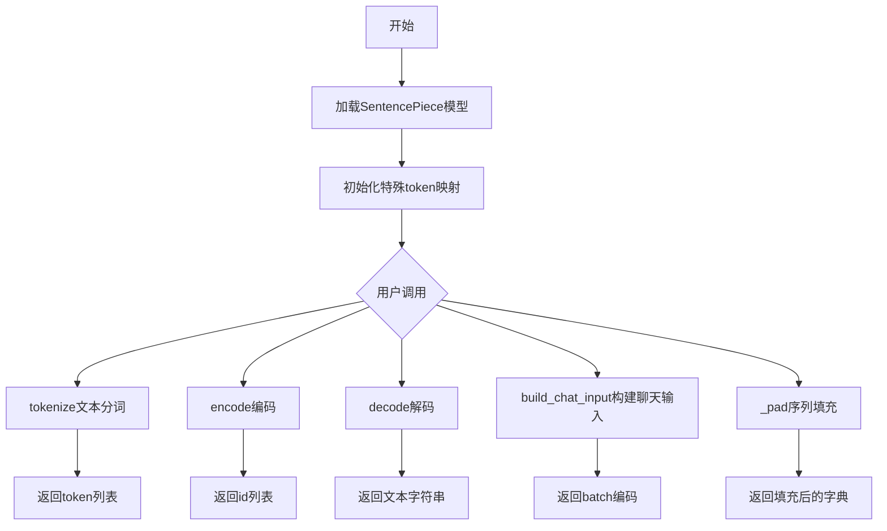
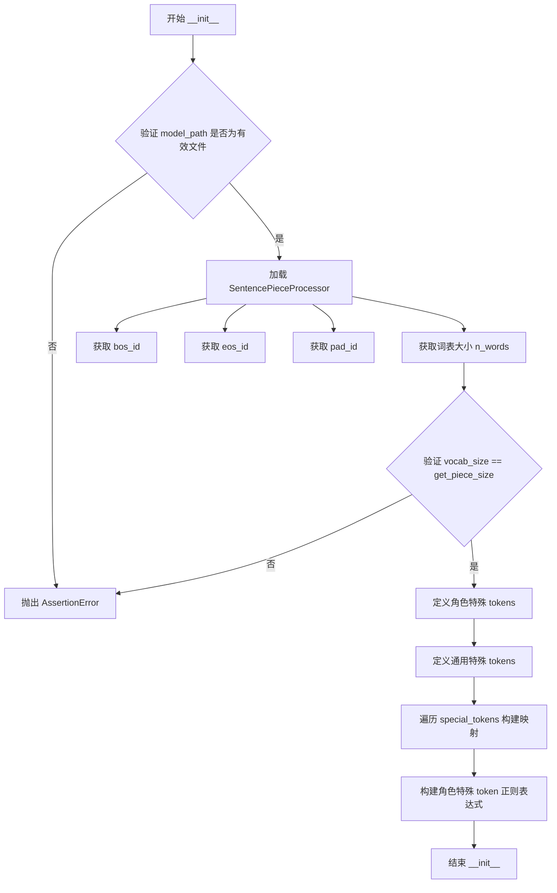
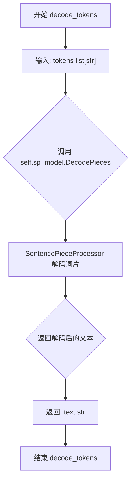
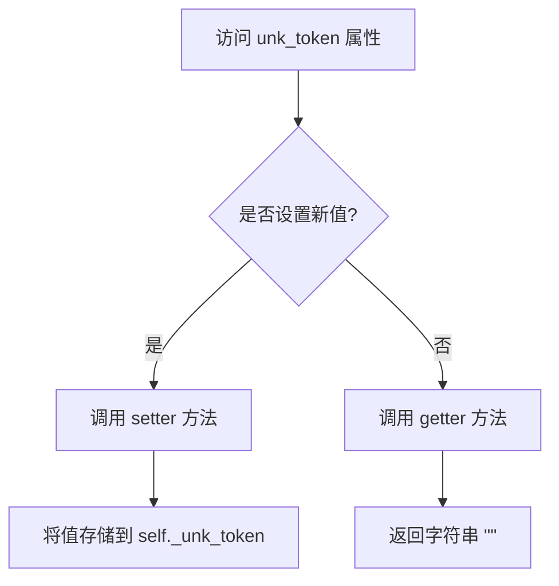
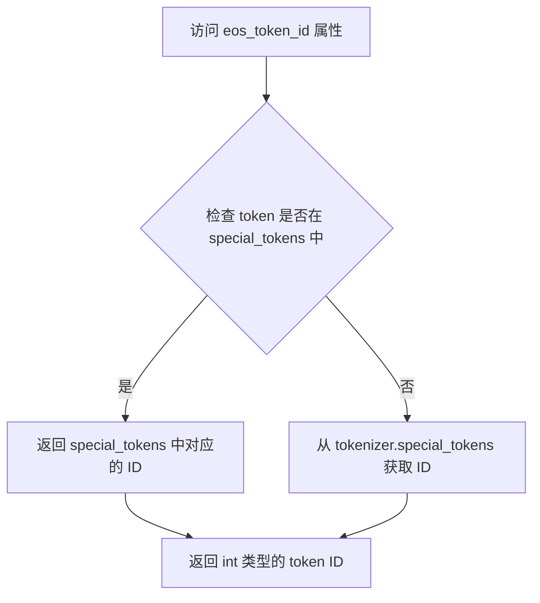
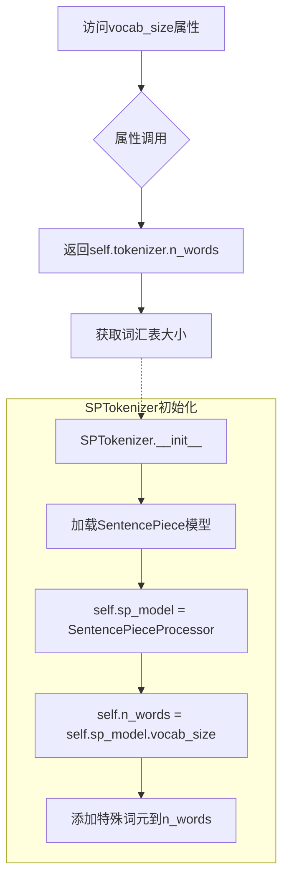
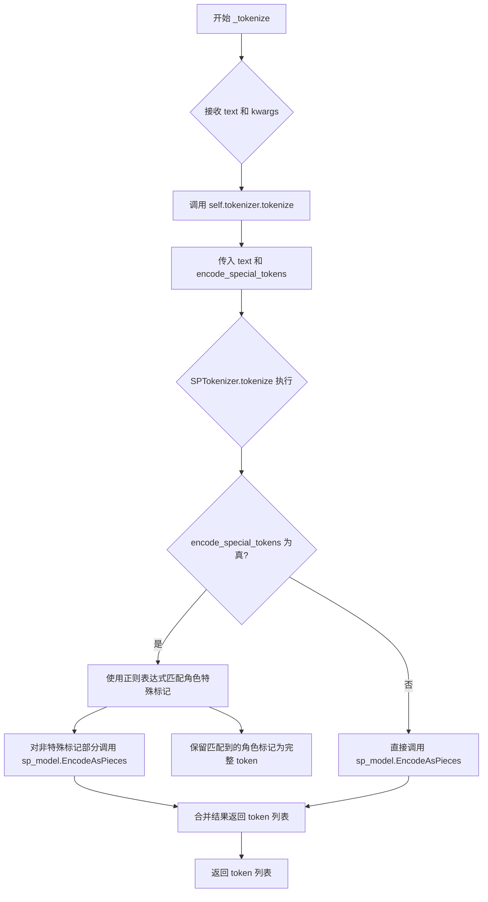
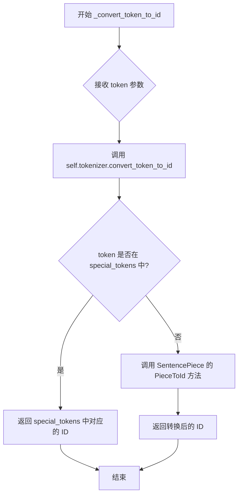
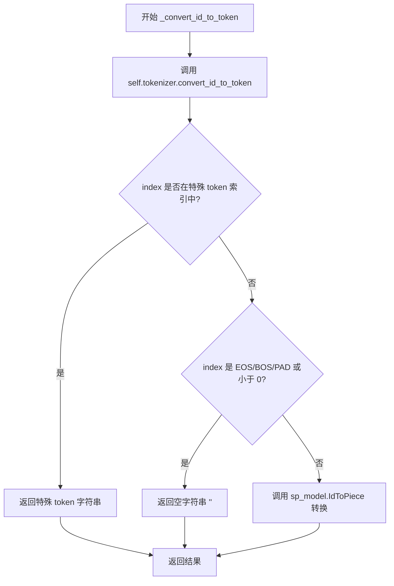

# `diffusers\src\diffusers\pipelines\kolors\tokenizer.py` 详细设计文档

ChatGLM3-6B模型的Tokenizer实现，基于SentencePiece库，提供文本分词、编码、解码功能，支持特殊token处理、聊天格式构建和序列padding，继承自HuggingFace的PreTrainedTokenizer。

## 整体流程



## 类结构

```
PreTrainedTokenizer (HuggingFace基类)
└── ChatGLMTokenizer
    └── SPTokenizer (SentencePiece封装)
```

## 全局变量及字段


### `SPTokenizer.sp_model`
    
SentencePiece模型处理器，用于分词和编码操作

类型：`SentencePieceProcessor`
    


### `SPTokenizer.n_words`
    
词汇表大小，表示tokenizer支持的总词数

类型：`int`
    


### `SPTokenizer.bos_id`
    
开始符号ID，用于标识序列的开始

类型：`int`
    


### `SPTokenizer.eos_id`
    
结束符号ID，用于标识序列的结束

类型：`int`
    


### `SPTokenizer.pad_id`
    
填充符号ID，用于将不同长度序列填充到相同长度

类型：`int`
    


### `SPTokenizer.special_tokens`
    
特殊符号字典，存储特殊token到ID的映射

类型：`dict`
    


### `SPTokenizer.index_special_tokens`
    
特殊符号索引字典，存储ID到特殊token的映射

类型：`dict`
    


### `SPTokenizer.role_special_token_expression`
    
角色特殊符号正则表达式，用于匹配对话中的角色标记

类型：`str`
    


### `ChatGLMTokenizer.name`
    
tokenizer名称标识

类型：`str`
    


### `ChatGLMTokenizer.vocab_file`
    
词汇表文件路径，指向tokenizer.model文件

类型：`str`
    


### `ChatGLMTokenizer.tokenizer`
    
底层SPTokenizer实例，负责具体的分词操作

类型：`SPTokenizer`
    


### `ChatGLMTokenizer.special_tokens`
    
特殊符号字典，存储BOS/EOS/PAD等特殊token的ID

类型：`dict`
    


### `ChatGLMTokenizer.encode_special_tokens`
    
是否编码特殊符号的标志位

类型：`bool`
    


### `ChatGLMTokenizer.vocab_files_names`
    
词汇表文件名映射，定义vocab_file键

类型：`dict (类属性)`
    


### `ChatGLMTokenizer.model_input_names`
    
模型输入名称列表，包含input_ids、attention_mask、position_ids

类型：`list (类属性)`
    
    

## 全局函数及方法


### `SPTokenizer.__init__`

该方法是 `SPTokenizer` 类的初始化方法，负责加载 SentencePiece 分词器模型文件，初始化词表大小、特殊 token ID（bos/eos/pad），并构建特殊 token 的映射关系，用于后续的编码和解码操作。

参数：

-  `model_path`：`str`，分词器模型文件的路径

返回值：无（`None`），该方法为构造函数，不返回任何值

#### 流程图



#### 带注释源码

```python
def __init__(self, model_path: str):
    """
    初始化 SPTokenizer 分词器
    
    参数:
        model_path: SentencePiece 模型文件的路径
    """
    
    # ----------------------------------------
    # 步骤1: 验证并加载模型文件
    # ----------------------------------------
    # reload tokenizer
    # 断言模型文件存在，否则抛出 AssertionError 并显示文件路径
    assert os.path.isfile(model_path), model_path
    
    # 使用 SentencePieceProcessor 加载模型
    self.sp_model = SentencePieceProcessor(model_file=model_path)

    # ----------------------------------------
    # 步骤2: 获取基础 Token ID
    # ----------------------------------------
    # BOS / EOS token IDs
    # 获取词表大小（包含所有词汇和特殊 token）
    self.n_words: int = self.sp_model.vocab_size()
    # 获取 Begin of Sequence token ID
    self.bos_id: int = self.sp_model.bos_id()
    # 获取 End of Sequence token ID
    self.eos_id: int = self.sp_model.eos_id()
    # 获取 Padding token ID（使用 Unknown token ID）
    self.pad_id: int = self.sp_model.unk_id()
    
    # 断言：验证 SentencePiece 内部词表大小与 piece 大小一致
    # 这是确保模型完整性的关键检查
    assert self.sp_model.vocab_size() == self.sp_model.get_piece_size()

    # ----------------------------------------
    # 步骤3: 初始化特殊 Token 映射
    # ----------------------------------------
    # 定义角色相关的特殊 tokens（用于对话系统）
    role_special_tokens = ["<|system|>", "<|user|>", "<|assistant|>", "<|observation|>"]
    # 合并通用特殊 tokens 和角色特殊 tokens
    # [MASK], [gMASK], [sMASK] - 掩码 token
    # sop, eop - 序列开始/结束 token
    special_tokens = ["[MASK]", "[gMASK]", "[sMASK]", "sop", "eop"] + role_special_tokens
    
    # 初始化特殊 token 字典（token -> id）
    self.special_tokens = {}
    # 初始化反向映射字典（id -> token）
    self.index_special_tokens = {}
    
    # 为每个特殊 token 分配唯一的 ID（从 n_words 开始递增）
    for token in special_tokens:
        self.special_tokens[token] = self.n_words
        self.index_special_tokens[self.n_words] = token
        self.n_words += 1
    
    # ----------------------------------------
    # 步骤4: 构建正则表达式
    # ----------------------------------------
    # 将角色特殊 tokens 转义并用 | 连接成正则表达式
    # 用于在 tokenize 时识别和分割角色标记
    # re.escape() 用于转义特殊字符（如 /）
    self.role_special_token_expression = "|".join([re.escape(token) for token in role_special_tokens])
```


### SPTokenizer.tokenize

该方法是SPTokenizer类的核心分词方法，支持两种模式：普通分词和对特殊角色标记进行编码的分词。当启用特殊标记编码时，方法会先识别并保留角色特殊标记（如`<|system|>`、`<|user|>`等），然后对剩余文本进行SentencePiece分词。

参数：

- `s`：`str`，待分词的输入字符串
- `encode_special_tokens`：`bool`，是否对特殊角色标记进行编码，默认为False

返回值：`list[str]`，分词后的token列表

#### 流程图

```mermaid
flowchart TD
    A[开始 tokenize] --> B{encode_special_tokens?}
    B -->|False| C[调用 sp_model.EncodeAsPieces]
    C --> D[返回分词结果]
    B -->|True| E[初始化 last_index=0, t=[]]
    E --> F[使用 re.finditer 查找角色特殊标记]
    F --> G{找到匹配?}
    G -->|是| H[last_index < match.start()?]
    H -->|是| I[对 s[last_index:match.start()] 分词并加入 t]
    H -->|否| J[将匹配片段加入 t]
    I --> K[更新 last_index = match.end()]
    J --> K
    G -->|否| L{last_index < len(s)?}
    K --> G
    L -->|是| M[对 s[last_index:] 分词并加入 t]
    L -->|否| N[返回 t]
    M --> N
```

#### 带注释源码

```python
def tokenize(self, s: str, encode_special_tokens=False):
    """
    对输入字符串进行分词
    
    参数:
        s: str, 待分词的输入字符串
        encode_special_tokens: bool, 是否对特殊角色标记进行编码
    
    返回:
        list[str], 分词后的token列表
    """
    # 如果需要编码特殊标记
    if encode_special_tokens:
        # 初始化游标和结果列表
        last_index = 0
        t = []
        
        # 使用正则表达式查找所有角色特殊标记的匹配位置
        for match in re.finditer(self.role_special_token_expression, s):
            # 处理匹配位置之前的文本
            if last_index < match.start():
                # 对前面的文本进行SentencePiece分词
                t.extend(self.sp_model.EncodeAsPieces(s[last_index : match.start()]))
            
            # 将匹配到的特殊标记作为整体加入结果
            t.append(s[match.start() : match.end()])
            
            # 更新游标位置
            last_index = match.end()
        
        # 处理最后剩余的文本
        if last_index < len(s):
            t.extend(self.sp_model.EncodeAsPieces(s[last_index:]))
        
        return t
    else:
        # 普通模式：直接使用SentencePiece进行分词
        return self.sp_model.EncodeAsPieces(s)
```


### `SPTokenizer.encode`

该方法接收一个字符串输入，通过 SentencePiece 模型将其编码为整数 ID 序列，并可根据参数选择在序列首尾添加 BOS（Begin Of Sequence）和 EOS（End Of Sequence）特殊标记，是文本转换为模型可用 token ID 的核心方法。

参数：

-  `self`：`SPTokenizer`，SPTokenizer 类实例本身
-  `s`：`str`，要编码的输入字符串
-  `bos`：`bool`，可选参数，默认为 False，是否在编码结果前添加 BOS（序列起始）标记
-  `eos`：`bool`，可选参数，默认为 False，是否在编码结果后添加 EOS（序列结束）标记

返回值：`list[int]`，返回编码后的整数 token ID 列表

#### 流程图

```mermaid
flowchart TD
    A[开始 encode 方法] --> B{验证: isinstance(s, str)}
    B -->|是字符串| C[调用 sp_model.encode(s 进行编码]
    B -->|不是字符串| D[抛出 AssertionError]
    C --> E{检查 bos 参数}
    E -->|bos=True| F[在列表前添加 bos_id]
    E -->|bos=False| G{检查 eos 参数}
    F --> G
    G -->|eos=True| H[在列表后添加 eos_id]
    G -->|eos=False| I[返回编码结果列表]
    H --> I
```

#### 带注释源码

```python
def encode(self, s: str, bos: bool = False, eos: bool = False) -> list[int]:
    """
    将输入字符串编码为 token ID 序列
    
    参数:
        s: 要编码的字符串
        bos: 是否在序列前添加 BOS (Begin Of Sequence) 标记
        eos: 是否在序列后添加 EOS (End Of Sequence) 标记
    
    返回:
        编码后的整数 token ID 列表
    """
    # 断言确保输入是字符串类型，避免后续处理错误
    assert isinstance(s, str)
    
    # 使用 SentencePiece 模型将字符串编码为 ID 列表
    t = self.sp_model.encode(s)
    
    # 如果 bos=True，在列表开头插入 bos_id (序列起始标记)
    if bos:
        t = [self.bos_id] + t
    
    # 如果 eos=True，在列表末尾追加 eos_id (序列结束标记)
    if eos:
        t = t + [self.eos_id]
    
    # 返回最终的编码结果
    return t
```


### `SPTokenizer.decode`

该方法负责将模型输出的token ID序列解码为可读文本字符串，通过区分特殊token和普通token分别处理，最终拼接为完整的解码文本。

参数：

-  `t`：`list[int]`，待解码的token ID序列

返回值：`str`，解码后的文本字符串

#### 流程图

```mermaid
flowchart TD
    A[开始 decode] --> B[初始化 text='' 和 buffer=[]]
    B --> C{遍历 token in t}
    C -->|是| D{token in index_special_tokens?}
    D -->|是| E{buffer 有内容?}
    D -->|否| I[token 加入 buffer]
    E -->|是| F[text += sp_model.decode(buffer)]
    E -->|否| H
    F --> G[buffer = []]
    G --> H[text += index_special_tokens[token]]
    H --> C
    C -->|遍历完成| J{buffer 有内容?}
    J -->|是| K[text += sp_model.decode(buffer)]
    J -->|否| L[返回 text]
    K --> L
```

#### 带注释源码

```python
def decode(self, t: list[int]) -> str:
    """
    将token ID列表解码为文本字符串
    
    参数:
        t: list[int] - 待解码的token ID序列
    
    返回:
        str - 解码后的文本字符串
    """
    text, buffer = "", []  # text用于存储最终结果，buffer用于暂存普通token
    
    for token in t:  # 遍历每个token ID
        if token in self.index_special_tokens:  # 检查是否为特殊token
            if buffer:  # 如果buffer中有暂存的普通token
                text += self.sp_model.decode(buffer)  # 解码buffer中的普通token
                buffer = []  # 清空buffer
            text += self.index_special_tokens[token]  # 直接添加特殊token文本
        else:
            buffer.append(token)  # 普通token存入buffer等待批量解码
    
    if buffer:  # 处理最后剩余的buffer
        text += self.sp_model.decode(buffer)  # 解码剩余的普通token
    
    return text  # 返回最终解码文本
```


### `SPTokenizer.decode_tokens`

该方法用于将 SentencePiece 的词片（pieces）列表解码为完整的文本字符串，是 `encode` 方法的逆操作，用于模型推理阶段将输出 token 转换为可读文本。

参数：

- `tokens`：`list[str]`，待解码的词片列表，每个元素为 SentencePiece 编码后的字符串片段

返回值：`str`，解码后的完整文本字符串

#### 流程图



#### 带注释源码

```python
def decode_tokens(self, tokens: list[str]) -> str:
    """
    将 SentencePiece 词片列表解码为文本字符串
    
    该方法是 encode 方法的逆操作，用于将模型输出的 token IDs
    （经过 convert_id_to_token 转换后的字符串）还原为人类可读的文本。
    
    参数:
        tokens: list[str]
            SentencePiece 编码后的词片列表，例如 ['▁Hello', '▁world', '!']
    
    返回:
        str: 解码后的完整文本字符串，例如 "Hello world!"
    
    注意:
        - 该方法不处理特殊 token（如 [MASK], [gMASK] 等）
        - 特殊 token 的处理由 decode 方法负责
        - 内部调用 SentencePieceProcessor 的 DecodePieces 方法
    """
    # 调用 SentencePieceProcessor 的 DecodePieces 方法进行解码
    # DecodePieces 会将词片列表合并并转换为普通文本
    text = self.sp_model.DecodePieces(tokens)
    
    # 返回解码后的文本字符串
    return text
```


### `SPTokenizer.convert_token_to_id`

该方法用于将 token 字符串转换为其对应的 ID。如果 token 是特殊 token，则返回预先分配的特殊 token ID；否则使用 SentencePiece 模型进行转换。

参数：

- `token`：`str`，需要转换的 token 字符串

返回值：`int`，token 对应的 ID

#### 流程图

```mermaid
flowchart TD
    A[开始] --> B{token 是否在 special_tokens 中?}
    B -->|是| C[返回 special_tokens[token]]
    B -->|否| D[调用 sp_model.PieceToId(token)]
    D --> E[返回转换后的 ID]
    C --> F[结束]
    E --> F
```

#### 带注释源码

```python
def convert_token_to_id(self, token):
    """Converts a token (str) in an id using the vocab."""
    # 检查 token 是否为特殊 token（如 [MASK], [gMASK], sop, eop 等）
    if token in self.special_tokens:
        # 如果是特殊 token，返回预先分配的特殊 token ID
        return self.special_tokens[token]
    # 如果不是特殊 token，使用 SentencePiece 模型将 token 转换为 ID
    return self.sp_model.PieceToId(token)
```


### `SPTokenizer.convert_id_to_token`

该方法用于将整数索引（ID）转换为对应的 token 字符串，支持特殊 token 的转换以及 SentencePiece 标准词表的映射。

参数：

- `index`：`int`，需要转换的 token 索引 ID

返回值：`str`，转换后的 token 字符串，若索引为保留标识符（EOS/BOS/PAD 或负数）则返回空字符串

#### 流程图

```mermaid
flowchart TD
    A[开始: convert_id_to_token] --> B{index in index_special_tokens?}
    B -->|Yes| C[返回 self.index_special_tokens[index]]
    B -->|No| D{index in [eos_id, bos_id, pad_id] or index < 0?}
    D -->|Yes| E[返回空字符串 '']
    D -->|No| F[调用 self.sp_model.IdToPiece(index)]
    F --> G[返回转换后的 token 字符串]
    C --> H[结束]
    E --> H
    G --> H
```

#### 带注释源码

```python
def convert_id_to_token(self, index):
    """Converts an index (integer) in a token (str) using the vocab."""
    # 第一步：检查是否为特殊 token（如 [MASK], [gMASK], sop, eop, 角色标签等）
    # 特殊 token 在初始化时会被映射到 self.index_special_tokens 字典
    if index in self.index_special_tokens:
        return self.index_special_tokens[index]
    
    # 第二步：检查是否为保留的 SentencePiece 特殊标识符
    # eos_id: 序列结束标识
    # bos_id: 序列开始标识
    # pad_id: 填充标识
    # 负数索引无效，返回空字符串
    if index in [self.eos_id, self.bos_id, self.pad_id] or index < 0:
        return ""
    
    # 第三步：使用 SentencePiece 的 IdToPiece 方法将标准词表索引转换为 token
    return self.sp_model.IdToPiece(index)
```


### `ChatGLMTokenizer.__init__`

该方法是 ChatGLMTokenizer 类的构造函数，用于初始化 ChatGLM3 模型的 tokenizer。它加载 SentencePiece 词表文件，配置特殊 token（如 BOS、EOS、PAD），设置填充方向和特殊 token 编码选项，并调用父类 PreTrainedTokenizer 的初始化方法。

参数：

- `vocab_file`：`str`，词表文件路径，用于加载 SentencePiece 模型
- `padding_side`：`str`，填充方向，默认为 "left"（左侧填充）
- `clean_up_tokenization_spaces`：`bool`，是否清理 tokenization 后的空格，默认为 False
- `encode_special_tokens`：`bool`，是否编码特殊 token，默认为 False
- `**kwargs`：`dict`，传递给父类 PreTrainedTokenizer 的其他关键字参数

返回值：`None`，构造函数没有返回值

#### 流程图

```mermaid
flowchart TD
    A[开始 __init__] --> B[设置 self.name = 'GLMTokenizer']
    B --> C[保存 vocab_file 路径到 self.vocab_file]
    C --> D[创建 SPTokenizer 实例: self.tokenizer = SPTokenizer(vocab_file)]
    D --> E[构建 special_tokens 字典<br/>&lt;bos&gt;: bos_id<br/>&lt;eos&gt;: eos_id<br/>&lt;pad&gt;: pad_id]
    E --> F[保存 encode_special_tokens 到 self.encode_special_tokens]
    F --> G[调用父类 PreTrainedTokenizer.__init__]
    G --> H[传递 padding_side, clean_up_tokenization_spaces<br/>encode_special_tokens 和 **kwargs]
    H --> I[结束 __init__]
```

#### 带注释源码

```python
def __init__(
    self,
    vocab_file,
    padding_side="left",
    clean_up_tokenization_spaces=False,
    encode_special_tokens=False,
    **kwargs,
):
    # 设置 tokenizer 名称标识
    self.name = "GLMTokenizer"

    # 保存词表文件路径
    self.vocab_file = vocab_file
    
    # 创建 SentencePiece tokenizer 实例
    # SPTokenizer 负责底层的分词、编码、解码操作
    self.tokenizer = SPTokenizer(vocab_file)
    
    # 定义特殊 token 映射字典
    # 将字符串形式的特殊 token 映射到对应的 ID
    self.special_tokens = {
        "<bos>": self.tokenizer.bos_id,  # 句子开始 token ID
        "<eos>": self.tokenizer.eos_id,  # 句子结束 token ID
        "<pad>": self.tokenizer.pad_id,  # 填充 token ID
    }
    
    # 保存是否编码特殊 token 的配置
    # 当为 True 时，tokenize 方法会保留特殊 token
    self.encode_special_tokens = encode_special_tokens
    
    # 调用父类 PreTrainedTokenizer 的初始化方法
    # 以继承 transformers 库提供的完整 tokenizer 功能
    super().__init__(
        padding_side=padding_side,
        clean_up_tokenization_spaces=clean_up_tokenization_spaces,
        encode_special_tokens=encode_special_tokens,
        **kwargs,
    )
```


### `ChatGLMTokenizer.get_command`

获取特殊token对应的ID。如果token在当前tokenizer的特殊token映射中，则返回对应的ID；否则尝试从底层SPTokenizer的特殊token映射中获取。

参数：

- `token`：`str`，需要获取ID的特殊token字符串（例如 `<bos>`、`[gMASK]`、`sop` 等）

返回值：`int`，返回特殊token对应的ID

#### 流程图

```mermaid
flowchart TD
    A[开始 get_command] --> B{token 是否在 self.special_tokens 中?}
    B -->|是| C[返回 self.special_tokens[token]]
    B -->|否| D{token 是否在 self.tokenizer.special_tokens 中?}
    D -->|是| E[返回 self.tokenizer.special_tokens[token]]
    D -->|否| F[抛出 AssertionError 异常]
    
    C --> G[结束]
    E --> G
    F --> G
```

#### 带注释源码

```python
def get_command(self, token):
    """
    获取特殊token对应的ID。
    
    该方法首先检查token是否在ChatGLMTokenizer自身的特殊token映射中，
    如果找到则直接返回对应的ID；否则检查底层SPTokenizer的特殊token映射。
    
    Args:
        token (str): 需要获取ID的特殊token字符串，如 '<bos>', '<eos>', '<pad>' 等
        
    Returns:
        int: 特殊token对应的ID
        
    Raises:
        AssertionError: 当token既不在ChatGLMTokenizer的特殊token映射中，
                       也不在SPTokenizer的特殊token映射中时抛出
    """
    # 首先检查token是否在当前类的特殊token映射中
    # self.special_tokens 存储了如 <bos>, <eos>, <pad> 等基础特殊token
    if token in self.special_tokens:
        return self.special_tokens[token]
    
    # 如果不在当前类的映射中，则检查底层SPTokenizer的特殊token映射
    # self.tokenizer.special_tokens 存储了如 [MASK], [gMASK], [sMASK], sop, eop 等特殊token
    assert token in self.tokenizer.special_tokens, f"{token} is not a special token for {self.name}"
    return self.tokenizer.special_tokens[token]
```


### `ChatGLMTokenizer.unk_token`

该属性返回ChatGLMTokenizer的未知词（unk）标记，用于处理分词器无法识别的token。

参数：

- `self`：`ChatGLMTokenizer`，隐含的实例自身参数

返回值：`str`，返回未知词标记字符串 `"<unk>"`

#### 流程图



#### 带注释源码

```python
@property
def unk_token(self) -> str:
    """
    获取未知词标记（Unknown Token）。
    
    该属性继承自 PreTrainedTokenizer，用于返回分词器的未知词标记。
    当分词器遇到无法识别的token时，使用此标记进行替换。
    
    Returns:
        str: 未知词标记，固定返回 &quot;<unk>&quot;
    """
    return "<unk>"

@unk_token.setter
def unk_token(self, value: str):
    """
    设置未知词标记（Unknown Token）。
    
    允许动态修改未知词标记的值，并将其存储到内部变量 _unk_token 中。
    
    Args:
        value (str): 要设置的新的未知词标记字符串
    """
    self._unk_token = value
```


### `ChatGLMTokenizer.pad_token`

获取或设置填充 token（padding token）。该属性返回填充token的字符串表示，用于在批量处理不同长度的序列时进行填充。

参数：

- `self`：ChatGLMTokenizer 实例本身

返回值：`str`，返回填充 token 的字符串表示 "<unk>"

#### 流程图

```mermaid
flowchart TD
    A[访问 pad_token 属性] --> B{调用 getter 还是 setter?}
    B -->|getter| C[返回字符串 "<unk>"]
    B -->|setter| D[将传入的值赋值给 self._pad_token]
    C --> E[结束]
    D --> E
```

#### 带注释源码

```python
@property
def pad_token(self) -> str:
    """
    获取填充 token 的字符串表示。
    
    Returns:
        str: 填充 token，固定返回 "<unk>"
    """
    return "<unk>"

@pad_token.setter
def pad_token(self, value: str):
    """
    设置填充 token 的字符串表示。
    
    Args:
        value: 新的填充 token 字符串值
    """
    self._pad_token = value
```


### `ChatGLMTokenizer.pad_token_id`

该属性是 `ChatGLMTokenizer` 类的只读属性，用于获取 Padding Token（填充标记）的标识符 ID。Padding Token 在序列批处理时用于将不同长度的序列填充到相同长度，是 Transformer 模型分词器的标准组件。

参数：

- 该属性无需显式参数（隐含参数 `self` 代表类实例）

返回值：`int`，返回 Padding Token 对应的数字标识符，用于在模型输入中表示填充位置。

#### 流程图

```mermaid
flowchart TD
    A[访问 pad_token_id 属性] --> B[调用 self.get_command '<pad>']
    B --> C{&quot;<pad>&quot; in self.special_tokens?}
    C -->|Yes| D[返回 self.special_tokens[&quot;<pad>&quot;]]
    C -->|No| E{&quot;<pad>&quot; in self.tokenizer.special_tokens?}
    E -->|Yes| F[返回 self.tokenizer.special_tokens[&quot;<pad>&quot;]]
    E -->|No| G[抛出断言错误]
    D --> H[返回 pad_token_id]
    F --> H
```

#### 带注释源码

```python
@property
def pad_token_id(self):
    """
    返回 Padding Token 的标识符 ID。
    
    该属性是一个只读属性，用于获取 '<pad>' 特殊 token 对应的数字 ID。
    在批处理不同长度的序列时，較短的序列会被填充到此 ID 以保持长度一致。
    
    Returns:
        int: Padding Token (<pad>) 对应的标识符 ID
    """
    return self.get_command("<pad>")
```


### `ChatGLMTokenizer.eos_token`

该属性是 ChatGLMTokenizer 类的 end-of-sequence (EOS) 令牌 getter 属性，用于获取序列结束标记的字符串表示。

参数：
- 无

返回值：`str`，返回序列结束标记的字符串表示，默认为 `"</s>"`

#### 流程图

```mermaid
flowchart TD
    A[访问 eos_token 属性] --> B{是否使用 setter}
    B -->|否| C[调用 getter 方法]
    B -->|是| D[调用 setter 方法]
    C --> E[返回 "</s>"]
    D --> F[将值存入 _eos_token]
    E --> G[结束]
    F --> G
```

#### 带注释源码

```python
@property
def eos_token(self) -> str:
    """
    获取序列结束令牌 (End-of-Sequence token) 的字符串表示。
    
    Returns:
        str: 序列结束令牌的字符串，默认为 "</s>"
    """
    return "</s>"

@eos_token.setter
def eos_token(self, value: str):
    """
    设置序列结束令牌 (End-of-Sequence token) 的值。
    
    Args:
        value (str): 要设置的 EOS 令牌字符串值
    """
    self._eos_token = value
```


### `ChatGLMTokenizer.eos_token_id`

获取EOS（End of Sequence）序列结束符对应的token ID。

参数： 无（这是一个属性，不接受参数）

返回值：`int`，返回EOS序列结束符的ID

#### 流程图



#### 带注释源码

```python
@property
def eos_token_id(self):
    """
    返回 EOS（End of Sequence）序列结束符对应的 token ID。
    该属性是一个只读属性，通过调用 get_command 方法获取 "<eos>" 特殊token对应的ID。
    
    Returns:
        int: EOS 序列结束符的 ID，用于标识文本序列的结束位置
    """
    return self.get_command("<eos>")
```


### `ChatGLMTokenizer.vocab_size`

该属性是ChatGLMTokenizer类的词汇表大小属性，通过返回内部SPTokenizer对象的n_words字段来获取整个词汇表的词元总数。

参数：
- 无参数（为属性方法，无入参）

返回值：`int`，返回词汇表中词元的总数量，包括基础SentencePiece词汇和特殊词元。

#### 流程图



#### 带注释源码

```python
@property
def vocab_size(self):
    """
    返回词汇表的大小。
    
    该属性继承自PreTrainedTokenizer基类，用于获取Tokenizer的词汇表大小。
    它返回的是包含基础SentencePiece词汇和所有特殊词元（[MASK], [gMASK], [sMASK], sop, eop等）的总数量。
    
    Returns:
        int: 词汇表的总大小，即词元的总数。
    
    Example:
        >>> tokenizer = ChatGLMTokenizer(vocab_file="tokenizer.model")
        >>> tokenizer.vocab_size
        50000
    """
    return self.tokenizer.n_words
```

#### 关联信息

- **所属类**：`ChatGLMTokenizer`
- **继承关系**：继承自 `transformers.PreTrainedTokenizer`
- **依赖属性**：`self.tokenizer` (SPTokenizer实例) 的 `n_words` 字段
- **相关方法**：
  - `get_vocab()`: 返回词汇表字典
  - `SPTokenizer.__init__()`: 初始化时设置 `self.n_words`
  - `SPTokenizer.convert_token_to_id()`: 将token转换为ID
  - `SPTokenizer.convert_id_to_token()`: 将ID转换为token
- **设计意图**：该属性是HuggingFace Transformers库中Tokenizer的标准接口之一，用于获取词汇表大小，便于模型配置和嵌入层初始化。


### `ChatGLMTokenizer.get_vocab`

该方法用于获取ChatGLMTokenizer的完整词汇表，返回一个将token字符串映射到其ID的字典，同时包含基础词汇表和通过`added_tokens_encoder`添加的特殊token。

参数：无

返回值：`dict`，返回从token字符串到ID的映射字典，包含基础词汇表和所有已添加的特殊token。

#### 流程图

```mermaid
flowchart TD
    A[开始 get_vocab] --> B[创建空字典 vocab]
    C[遍历 i 从 0 到 vocab_size - 1] --> D{遍历完成?}
    D -->|否| E[调用 self._convert_id_to_token(i 将索引转换为token]
    E --> F[将 token: i 键值对加入 vocab 字典]
    F --> C
    D -->|是| G[调用 vocab.update 添加 added_tokens_encoder 中的特殊token]
    G --> H[返回 vocab 字典]
```

#### 带注释源码

```
def get_vocab(self):
    """Returns vocab as a dict"""
    # 步骤1: 构建基础词汇表
    # 使用字典推导式遍历从0到vocab_size-1的所有索引
    # 通过_convert_id_to_token方法将每个索引转换为对应的token字符串
    # 最终得到 {token_string: token_id} 的映射字典
    vocab = {self._convert_id_to_token(i): i for i in range(self.vocab_size)}
    
    # 步骤2: 更新词汇表，添加额外的特殊token
    # added_tokens_encoder 是从PreTrainedTokenizer继承的属性
    # 包含用户自定义添加的特殊token（如额外的特殊标记）
    # 使用update方法将额外token合并到基础词汇表中
    vocab.update(self.added_tokens_encoder)
    
    # 步骤3: 返回完整的词汇表字典
    # 返回值包含:
    # - 基础sentencepiece词汇表（token到ID的映射）
    # - 所有已添加的特殊token
    return vocab
```


### `ChatGLMTokenizer._tokenize`

该方法是 ChatGLMTokenizer 类的内部方法，负责将输入文本分词为 token 列表。它通过调用底层 SPTokenizer 的 tokenize 方法实现分词功能，并根据 encode_special_tokens 参数决定是否保留特殊角色标记。

参数：

-  `text`：`str`，需要分词的原始文本字符串
-  `**kwargs`：`dict`，可选关键字参数（用于兼容父类接口，当前未被使用）

返回值：`list[str]`，分词后的 token 字符串列表

#### 流程图



#### 带注释源码

```python
def _tokenize(self, text, **kwargs):
    """
    将文本分词为 token 列表的内部方法
    
    参数:
        text: 需要分词的输入文本字符串
        **kwargs: 额外的关键字参数（用于兼容 PreTrainedTokenizer 接口）
    
    返回:
        list[str]: 分词后的 token 列表
    """
    # 调用底层 SPTokenizer 的 tokenize 方法进行实际分词
    # encode_special_tokens 参数控制是否保留特殊角色标记（如 <|system|>, <|user|> 等）
    return self.tokenizer.tokenize(text, encode_special_tokens=self.encode_special_tokens)
```


### `ChatGLMTokenizer._convert_token_to_id`

该方法是将输入的 token（字符串）转换为对应的词汇表索引 ID 的核心方法，通过委托给内部 SPTokenizer 对象完成转换逻辑。

参数：

- `token`：`str`，需要进行 ID 转换的 token 字符串

返回值：`int`，token 在词汇表中的对应 ID

#### 流程图



#### 带注释源码

```python
def _convert_token_to_id(self, token):
    """
    将 token (字符串) 转换为词汇表中的 ID。
    
    该方法是 PreTrainedTokenizer 的内部方法，负责将单个 token 字符串
    转换为其对应的词汇表索引。实现上委托给内部的 SPTokenizer 对象。
    
    参数:
        token: 需要转换的 token 字符串
        
    返回:
        token 对应的整数 ID
    """
    return self.tokenizer.convert_token_to_id(token)
```


### `ChatGLMTokenizer._convert_id_to_token`

该方法是将索引（整数）转换为 token（字符串）的核心方法，通过调用底层 SPTokenizer 的 convert_id_to_token 方法实现词表索引到 token 的映射。

参数：

-  `index`：`int`，需要转换为 token 的索引值

返回值：`str`，转换后得到的 token 字符串

#### 流程图



#### 带注释源码

```python
def _convert_id_to_token(self, index):
    """
    将索引（整数）转换为 token（字符串）使用词表。

    该方法是 PreTrainedTokenizer 的内部方法，
    用于将数字 ID 映射回对应的 token 字符串。
    实际转换逻辑委托给底层的 SPTokenizer 对象。

    参数:
        index (int): 需要转换的词表索引

    返回值:
        str: 对应的 token 字符串
    """
    # 调用底层 SPTokenizer 的 convert_id_to_token 方法进行实际转换
    return self.tokenizer.convert_id_to_token(index)
```

> **备注**：该方法是一个包装器方法，真正的转换逻辑在 `SPTokenizer.convert_id_to_token` 中实现，后者会：
> 1. 首先检查索引是否属于特殊 token（如 `[MASK]`, `[gMASK]`, `</s>` 等）
> 2. 如果是边界 token（EOS/BOS/PAD）或负数索引，返回空字符串
> 3. 否则调用 SentencePiece 的 `IdToPiece` 方法进行标准转换


### `ChatGLMTokenizer.convert_tokens_to_string`

该方法用于将词表中的 token 列表（字符串形式）转换回原始文本字符串。它通过调用内部 SPTokenizer 对象的 decode_tokens 方法，利用 SentencePiece 模型的 DecodePieces 功能完成解码工作。

参数：

- `tokens`：`list[str]`，待解码的 token 字符串列表

返回值：`str`，解码后的原始文本字符串

#### 流程图

```mermaid
flowchart TD
    A[Start: tokens list[str]] --> B{Validate tokens}
    B -->|Valid| C[Call self.tokenizer.decode_tokens]
    C --> D[Call self.sp_model.DecodePieces]
    D --> E[Return decoded text string]
    B -->|Empty| F[Return empty string]
```

#### 带注释源码

```python
def convert_tokens_to_string(self, tokens: list[str]) -> str:
    """
    Converts a list of tokens (strings) back to a string.
    
    This method serves as a bridge between the token-level representation
    used by the model and the string-level representation needed for
    human-readable output.
    
    Args:
        tokens: A list of token strings to be converted back to text.
        
    Returns:
        The decoded string representation of the tokens.
    """
    # Delegate the decoding operation to the underlying SPTokenizer
    # which uses SentencePiece's DecodePieces functionality
    return self.tokenizer.decode_tokens(tokens)
```


### `ChatGLMTokenizer.save_vocabulary`

保存词汇表和特殊标记文件到指定目录。

参数：

- `save_directory`：`str`，要保存词汇表的目录
- `filename_prefix`：`str | None`，可选的前缀，用于添加到保存文件的名称

返回值：`tuple[str]`，保存的文件路径元组

#### 流程图

```mermaid
flowchart TD
    A[开始 save_vocabulary] --> B{检查 save_directory 是否为目录}
    B -->|是| C[构建完整 vocab_file 路径]
    B -->|否| D[vocab_file 即为 save_directory]
    C --> E[以二进制读取模式打开原始词汇表文件]
    D --> E
    E --> F[读取原始词汇表内容到 proto_str]
    F --> G[以二进制写入模式打开目标文件]
    G --> H[写入 proto_str 内容]
    H --> I[返回包含 vocab_file 的元组]
```

#### 带注释源码

```python
def save_vocabulary(self, save_directory, filename_prefix=None):
    """
    Save the vocabulary and special tokens file to a directory.

    Args:
        save_directory (`str`):
            The directory in which to save the vocabulary.
        filename_prefix (`str`, *optional*):
            An optional prefix to add to the named of the saved files.

    Returns:
        `tuple(str)`: Paths to the files saved.
    """
    # 判断 save_directory 是目录还是文件路径
    if os.path.isdir(save_directory):
        # 如果是目录，则拼接完整路径，使用类属性中的文件名
        vocab_file = os.path.join(save_directory, self.vocab_files_names["vocab_file"])
    else:
        # 如果已是文件路径，则直接使用
        vocab_file = save_directory

    # 以二进制读取模式打开原始词汇表文件（SentencePiece 模型文件）
    with open(self.vocab_file, "rb") as fin:
        # 读取整个文件内容（SentencePiece 模型是二进制 protobuf 格式）
        proto_str = fin.read()

    # 以二进制写入模式打开目标路径
    with open(vocab_file, "wb") as writer:
        # 将原始模型内容写入目标路径
        writer.write(proto_str)

    # 返回保存的文件路径元组
    return (vocab_file,)
```


### `ChatGLMTokenizer.get_prefix_tokens`

该方法用于获取ChatGLM3模型的前缀标记（prefix tokens），返回模型在生成响应时需要添加在输入文本前面的特殊token ID列表，包含 `[gMASK]` 和 `sop` 两个特殊标记，这是ChatGLM3-6B模型特有的输入格式。

参数：
- 无

返回值：`list[int]`，返回包含两个特殊token ID的列表，第一个是 `[gMASK]` token的ID，第二个是 `sop` (start of prompt) token的ID

#### 流程图

```mermaid
flowchart TD
    A[开始 get_prefix_tokens] --> B[调用 self.get_command获取 '[gMASK]' 的token ID]
    B --> C[调用 self.get_command获取 'sop' 的token ID]
    C --> D[将两个token ID组成列表]
    D --> E[返回 prefix_tokens 列表]
    
    B --> F{token是否是特殊token}
    F -->|是| G[从 special_tokens 字典获取ID]
    F -->|否| H[从 tokenizer.special_tokens 获取ID]
    G --> C
    H --> C
```

#### 带注释源码

```python
def get_prefix_tokens(self):
    """
    获取ChatGLM3模型的前缀标记
    
    该方法返回模型输入的前缀特殊token ID列表。
    ChatGLM3-6B模型使用特殊的token序列作为生成开始的前缀:
    - [gMASK]: 全局掩码标记，用于标识后续内容需要被掩码处理
    - sop: Start of Prompt，提示开始标记
    
    Returns:
        list[int]: 包含两个特殊token ID的列表 [gMASK_id, sop_id]
    """
    # 构建前缀token列表，包含两个ChatGLM3必需的special tokens
    # [gMASK] - 全局掩码token，用于注意力机制中的掩码处理
    # sop - Start of Prompt，标识对话/提示的开始
    prefix_tokens = [self.get_command("[gMASK]"), self.get_command("sop")]
    
    # 返回前缀token列表，供build_inputs_with_special_tokens等方法使用
    return prefix_tokens
```

#### 依赖方法 `get_command` 分析

```python
def get_command(self, token):
    """
    获取指定特殊token对应的ID
    
    参数:
        token: str - 特殊token字符串，如 '[gMASK]', 'sop', '<eos>' 等
        
    返回:
        int - token对应的ID
        
    逻辑:
        1. 首先检查token是否在ChatGLMTokenizer自身的special_tokens字典中
        2. 如果不在，则从底层SPTokenizer的special_tokens字典中查找
        3. 如果都找不到则抛出断言错误
    """
    if token in self.special_tokens:
        return self.special_tokens[token]
    assert token in self.tokenizer.special_tokens, f"{token} is not a special token for {self.name}"
    return self.tokenizer.special_tokens[token]
```

#### 使用场景

该方法主要在以下场景中被调用：
1. `build_inputs_with_special_tokens` - 构建模型输入时添加前缀token
2. 任何需要为输入文本添加ChatGLM3特定前缀的地方

#### 技术债务/优化空间

1. **硬编码的前缀token**: 当前前缀token `[gMASK]` 和 `sop` 是硬编码的，如果需要支持不同版本的ChatGLM模型，可能需要将其配置化
2. **缺乏版本兼容性检查**: 没有检查模型版本是否与tokenizer兼容
3. **返回值类型提示不够精确**: 返回 `list[int]` 可以进一步明确为 `list[int]` 的字面量类型，表示固定返回2个元素


### `ChatGLMTokenizer.build_single_message`

构建单个聊天消息的token序列，将角色、元数据和消息内容编码为模型可处理的token ID列表。

参数：

- `role`：`str`，角色类型，必须是 "system"、"user"、"assistant" 或 "observation" 之一
- `metadata`：`str`，角色的元数据信息
- `message`：`str`，消息的实际内容

返回值：`list[int]`，包含特殊token前缀和消息内容的token ID列表

#### 流程图

```mermaid
flowchart TD
    A[开始 build_single_message] --> B{验证 role 是否有效}
    B -->|有效| C[获取角色特殊token <|role|>]
    B -->|无效| D[断言失败]
    C --> E[编码 metadata + 换行符]
    E --> F[编码 message 内容]
    F --> G[合并 role_tokens 和 message_tokens]
    G --> H[返回 tokens 列表]
```

#### 带注释源码

```python
def build_single_message(self, role, metadata, message):
    """
    构建单个聊天消息的token序列
    
    Args:
        role: 角色类型，必须是 "system", "user", "assistant" 或 "observation"
        metadata: 角色的元数据信息
        message: 消息的实际内容
    
    Returns:
        list[int]: 包含特殊token前缀和消息内容的token ID列表
    """
    # 验证角色是否有效
    assert role in ["system", "user", "assistant", "observation"], role
    
    # 获取角色对应的特殊token，并编码metadata（末尾添加换行符）
    # 例如：role="user", metadata="示例" -> [token_id_for_<|user|>", token_id_for_"示例\n"]
    role_tokens = [self.get_command(f"<|{role}|>")] + self.tokenizer.encode(f"{metadata}\n")
    
    # 编码消息内容
    message_tokens = self.tokenizer.encode(message)
    
    # 合并角色tokens和消息tokens
    tokens = role_tokens + message_tokens
    
    # 返回完整的token序列
    return tokens
```


### `ChatGLMTokenizer.build_chat_input`

该方法用于将用户查询和对话历史构建为适合ChatGLM模型输入的格式，支持多轮对话上下文处理和特殊工具调用信息的编码。

参数：

- `query`：`str`，用户当前的查询内容
- `history`：`list[dict] | None`，对话历史记录列表，每个元素包含role、content等字段，默认为None
- `role`：`str`，当前消息的角色，默认为"user"

返回值：`BatchEncoding`，返回包含input_ids、attention_mask等张量的编码结果

#### 流程图

```mermaid
flowchart TD
    A[开始 build_chat_input] --> B{history是否为None?}
    B -->|是| C[初始化history为空列表]
    B -->|否| D[使用传入的history]
    C --> E[初始化input_ids为空列表]
    D --> E
    E --> F[遍历history中的每个item]
    F --> G[获取item的content]
    H{item的role是否为system<br/>且包含tools字段?}
    H -->|是| I[将tools JSON添加到content]
    H -->|否| J[直接使用content]
    I --> K[调用build_single_message构建历史消息token]
    J --> K
    K --> L[将token添加到input_ids]
    F --> M{遍历完成?}
    M -->|否| F
    M -->|是| N[调用build_single_message构建当前查询token]
    N --> O[添加结束标记<|assistant|>]
    O --> P[调用batch_encode_plus编码为张量]
    P --> Q[返回BatchEncoding]
```

#### 带注释源码

```python
def build_chat_input(self, query, history=None, role="user"):
    """
    构建聊天输入的token IDs序列
    
    该方法将对话历史和当前查询组合成模型可处理的输入格式，
    支持多轮对话和工具调用信息的编码。
    
    Args:
        query: 用户当前的查询字符串
        history: 对话历史列表，每个元素为包含'role'和'content'的字典
                 可选的'system'角色可包含'tools'字段定义工具
        role: 当前消息的角色，默认为"user"
    
    Returns:
        BatchEncoding: 包含input_ids等张量的编码结果
    """
    # 初始化空历史列表，避免None引用错误
    if history is None:
        history = []
    
    # 存储最终合并的token IDs
    input_ids = []
    
    # 遍历对话历史中的每条消息
    for item in history:
        # 获取消息内容
        content = item["content"]
        
        # 如果是系统消息且包含工具定义，将工具信息JSON化后追加到content
        if item["role"] == "system" and "tools" in item:
            content = content + "\n" + json.dumps(item["tools"], indent=4, ensure_ascii=False)
        
        # 构建单条消息的token序列并添加到input_ids
        # 使用item的role和metadata构建
        input_ids.extend(self.build_single_message(
            item["role"], 
            item.get("metadata", ""), 
            content
        ))
    
    # 构建当前用户查询的消息token
    input_ids.extend(self.build_single_message(role, "", query))
    
    # 添加助手结束标记，表示对话turn的结束
    input_ids.extend([self.get_command("<|assistant|>")])
    
    # 使用transformers的batch_encode_plus进行最终编码
    # return_tensors="pt"返回PyTorch张量
    # is_split_into_words=True表示输入已是token ID列表
    return self.batch_encode_plus(
        [input_ids], 
        return_tensors="pt", 
        is_split_into_words=True
    )
```


### `ChatGLMTokenizer.build_inputs_with_special_tokens`

该方法用于为序列分类任务构建模型输入，通过连接序列并添加特殊标记（prefix tokens）。支持单个序列或一对序列的处理，会在输入序列前添加 `[gMASK]` 和 `sop` 特殊标记，如果是序列对，还会在末尾添加 `<eos>` 结束标记。

参数：

- `self`：`ChatGLMTokenizer` 实例本身
- `token_ids_0`：`list[int]`，要添加特殊标记的主序列 ID 列表
- `token_ids_1`：`list[int] | None`，可选的第二个序列 ID 列表，用于序列对任务

返回值：`list[int]`，包含适当特殊标记的输入 ID 列表

#### 流程图

```mermaid
flowchart TD
    A[开始 build_inputs_with_special_tokens] --> B[获取前缀标记 prefix_tokens = get_prefix_tokens]
    B --> C[将 prefix_tokens 拼接到 token_ids_0 前面]
    C --> D{检查 token_ids_1 是否为 None}
    D -->|是| F[直接返回 token_ids_0]
    D -->|否| E[将 token_ids_1 拼接到 token_ids_0 后面]
    E --> G[添加 <eos> 结束标记]
    G --> F
```

#### 带注释源码

```python
def build_inputs_with_special_tokens(
    self, token_ids_0: list[int], token_ids_1: list[int] | None = None
) -> list[int]:
    """
    Build model inputs from a sequence or a pair of sequence for sequence classification tasks by concatenating and
    adding special tokens. A BERT sequence has the following format:

    - single sequence: `[CLS] X [SEP]`
    - pair of sequences: `[CLS] A [SEP] B [SEP]`

    Args:
        token_ids_0 (`list[int]`):
            list of IDs to which the special tokens will be added.
        token_ids_1 (`list[int]`, *optional*):
            Optional second list of IDs for sequence pairs.

    Returns:
        `list[int]`: list of [input IDs](../glossary#input-ids) with the appropriate special tokens.
    """
    # 获取前缀特殊标记 [gMASK] 和 sop 的 ID
    prefix_tokens = self.get_prefix_tokens()
    
    # 将前缀标记添加到序列开头
    token_ids_0 = prefix_tokens + token_ids_0
    
    # 如果存在第二个序列（序列对任务）
    if token_ids_1 is not None:
        # 将第二个序列添加到第一个序列后面，并添加结束标记 <eos>
        token_ids_0 = token_ids_0 + token_ids_1 + [self.get_command("<eos>")]
    
    # 返回构建好的输入 ID 列表
    return token_ids_0
```


### `ChatGLMTokenizer._pad`

该方法是ChatGLMTokenizer类的内部填充方法，负责将编码后的输入序列（批次）填充到统一长度，支持左侧填充、注意力掩码和位置ID的自动生成，是实现批量变长序列处理的核心逻辑。

参数：

- `encoded_inputs`：`dict[str, EncodedInput] | BatchEncoding`，待填充的编码输入，可以是单个序列或批次序列的字典/BatchEncoding对象
- `max_length`：`int | None`，填充后的目标长度，若为None则使用批次中最长序列的长度
- `padding_strategy`：`PaddingStrategy`，填充策略枚举，包括LONGEST、MAX_LENGTH和DO_NOT_PAD三种
- `pad_to_multiple_of`：`int | None`，可选参数，若设置则将序列填充到该值的整数倍，常用于启用Tensor Core加速
- `return_attention_mask`：`bool | None`，是否返回attention mask，默认由模型配置决定
- `padding_side`：`bool | None`，填充方向，'left'表示左侧填充，'right'表示右侧填充，默认为left

返回值：`dict`，填充并补全attention_mask和position_ids后的编码输入字典

#### 流程图

```mermaid
flowchart TD
    A[开始 _pad 方法] --> B{检查 padding_side}
    B -->|assert| C[确认 padding_side == left]
    C --> D[获取第一个输入序列]
    D --> E{检查 padding_strategy}
    E -->|LONGEST| F[设置 max_length = 序列长度]
    E -->|其他| G[保持 max_length 不变]
    F --> H
    G --> H{max_length 和 pad_to_multiple_of 都非空}
    H -->|是| I[计算新的 max_length 为下一个倍数]
    H -->|否| J[跳过调整]
    I --> K
    J --> K{判断是否需要填充}
    K -->|padding_strategy != DO_NOT_PAD 且 长度 != max_length| L[需要填充]
    K -->|否| M[不需要填充, 跳转到 N]
    L --> N[计算填充差值 difference]
    N --> O{检查 attention_mask}
    O -->|不存在| P[创建 [1] * seq_length]
    O -->|存在| Q[保持原值]
    P --> R
    Q --> R{检查 position_ids}
    R -->|不存在| S[创建 list(range(seq_length))]
    R -->|存在| T[保持原值]
    S --> U
    T --> U{执行填充}
    U --> V[attention_mask 左侧补 0]
    U --> W[position_ids 左侧补 0]
    U --> X[input_ids 左侧补 pad_token_id]
    V --> Y
    W --> Y
    X --> Y[返回填充后的 encoded_inputs]
    M --> Y
```

#### 带注释源码

```python
def _pad(
    self,
    encoded_inputs: dict[str, EncodedInput] | BatchEncoding,
    max_length: int | None = None,
    padding_strategy: PaddingStrategy = PaddingStrategy.DO_NOT_PAD,
    pad_to_multiple_of: int | None = None,
    return_attention_mask: bool | None = None,
    padding_side: bool | None = None,
) -> dict:
    """
    Pad encoded inputs (on left/right and up to predefined length or max length in the batch)
    对编码后的输入进行填充（左侧或右侧填充到预定义长度或批次中的最大长度）

    Args:
        encoded_inputs:
            Dictionary of tokenized inputs (`list[int]`) or batch of tokenized inputs (`list[list[int]]`).
            标记化输入的字典（单个序列的列表[int]）或批次化的标记化输入（列表[列表[int]]）
        max_length: maximum length of the returned list and optionally padding length (see below).
            Will truncate by taking into account the special tokens.
            返回列表的最大长度及可选的填充长度。填充时会考虑特殊标记
        padding_strategy: PaddingStrategy to use for padding.
            使用的填充策略
            - PaddingStrategy.LONGEST Pad to the longest sequence in the batch
              填充到批次中最长的序列长度
            - PaddingStrategy.MAX_LENGTH: Pad to the max length (default)
              填充到最大长度（默认）
            - PaddingStrategy.DO_NOT_PAD: Do not pad
              不填充
            The tokenizer padding sides are defined in self.padding_side:
            分词器的填充方向定义在 self.padding_side 中:
                - 'left': pads on the left of the sequences
                  在序列左侧填充
                - 'right': pads on the right of the sequences
                  在序列右侧填充
        pad_to_multiple_of: (optional) Integer if set will pad the sequence to a multiple of the provided value.
            This is especially useful to enable the use of Tensor Core on NVIDIA hardware with compute capability
            `>= 7.5` (Volta).
            如果设置此参数，将把序列填充到所提供值的倍数。这对于在计算能力>=7.5的NVIDIA硬件上启用Tensor Core特别有用
        padding_side (`str`, *optional*):
            The side on which the model should have padding applied. Should be selected between ['right', 'left'].
            Default value is picked from the class attribute of the same name.
            模型应该应用填充的一侧。应在['right', 'left']中选择。默认值从同名的类属性中选取
        return_attention_mask:
            (optional) Set to False to avoid returning attention mask (default: set to model specifics)
            设置为False以避免返回attention mask（默认值：按模型特定设置）
    """
    # 强制要求左侧填充，ChatGLM3模型仅支持左侧填充
    # Load from model defaults - ChatGLM3 only supports left padding
    assert self.padding_side == "left"

    # 从模型输入名称列表中获取第一个输入键，通常是"input_ids"
    # Get the required input from model_input_names[0], typically "input_ids"
    required_input = encoded_inputs[self.model_input_input_names[0]]
    
    # 获取当前序列的实际长度
    # Get the actual length of the current sequence
    seq_length = len(required_input)

    # 如果使用LONGEST策略，则将最大长度设为当前序列长度
    # If using LONGEST strategy, set max_length to current sequence length
    if padding_strategy == PaddingStrategy.LONGEST:
        max_length = len(required_input)

    # 如果同时指定了max_length和pad_to_multiple_of，需要调整max_length为下一个倍数
    # If both max_length and pad_to_multiple_of are specified, adjust max_length to next multiple
    if max_length is not None and pad_to_multiple_of is not None and (max_length % pad_to_multiple_of != 0):
        max_length = ((max_length // pad_to_multiple_of) + 1) * pad_to_multiple_of

    # 判断是否需要填充：填充策略不是DO_NOT_PAD且当前序列长度不等于目标最大长度
    # Determine if padding is needed: padding_strategy != DO_NOT_PAD and length != max_length
    needs_to_be_padded = padding_strategy != PaddingStrategy.DO_NOT_PAD and len(required_input) != max_length

    # 如果attention_mask不存在，则创建全1数组（表示所有位置都应被注意）
    # Initialize attention mask if not present - create all 1s array (all positions should be attended)
    if "attention_mask" not in encoded_inputs:
        encoded_inputs["attention_mask"] = [1] * seq_length

    # 如果position_ids不存在，则创建从0开始的连续整数序列
    # Initialize position ids if not present - create sequential integers starting from 0
    if "position_ids" not in encoded_inputs:
        encoded_inputs["position_ids"] = list(range(seq_length))

    # 执行实际的填充操作
    # Perform actual padding operation
    if needs_to_be_padded:
        # 计算需要填充的长度差值
        # Calculate the difference to pad
        difference = max_length - len(required_input)

        # 在attention_mask左侧填充0（表示填充位置不参与注意力计算）
        # Pad attention_mask with 0s on the left (padding positions should not be attended to)
        if "attention_mask" in encoded_inputs:
            encoded_inputs["attention_mask"] = [0] * difference + encoded_inputs["attention_mask"]
        
        # 在position_ids左侧填充0（保持原始位置编码的连续性）
        # Pad position_ids with 0s on the left (maintain continuity of original position encodings)
        if "position_ids" in encoded_inputs:
            encoded_inputs["position_ids"] = [0] * difference + encoded_inputs["position_ids"]
        
        # 在input_ids左侧填充pad_token_id
        # Pad input_ids with pad_token_id on the left
        encoded_inputs[self.model_input_names[0]] = [self.pad_token_id] * difference + required_input

    # 返回填充后的编码输入字典
    # Return the padded encoded inputs dictionary
    return encoded_inputs
```

## 关键组件


### SPTokenizer

基于SentencePiece的核心分词器类，负责底层文本编码、解码及特殊token映射

### ChatGLMTokenizer

继承自HuggingFace PreTrainedTokenizer的完整tokenizer实现，提供与Transformers库兼容的接口

### 特殊token管理系统

管理BOS/EOS/PAD等特殊token的ID映射及未知token处理

### 角色特殊token解析器

通过正则表达式识别和处理system/user/assistant/observation等角色标签的编码

### 聊天模板构建器

build_chat_input方法构建多轮对话输入，处理历史消息和工具集成

### 序列填充策略

_pad方法实现左侧填充（padding_side="left"）以适配自回归生成模型

### 词汇表管理

get_vocab方法返回完整词汇表字典，支持词到ID和ID到词的相互转换

### 前缀token生成器

get_prefix_tokens生成gMASK和sop前缀token，用于ChatGLM模型的指令微调格式


## 问题及建议


### 已知问题

-   **正则表达式未预编译**：`role_special_token_expression`在`__init__`中拼接成正则表达式字符串，但在`tokenize`方法中每次调用都使用`re.finditer`重新匹配，未进行预编译，影响频繁调用时的性能。
-   **断言语句用于生产代码**：代码中大量使用`assert`进行参数验证和状态检查（如`assert os.path.isfile(model_path)`、`assert isinstance(s, str)`等），在Python中`assert`语句在优化模式下（`python -O`）会被跳过，导致验证逻辑失效。
-   **硬编码的特殊token**：角色特殊token（如`<|system|>`、`<|user|>`等）和基础特殊token（如`[MASK]`、`[gMASK]`等）均以列表形式硬编码在类中，扩展性差，新增token需修改源代码。
-   **`pad_token`和`unk_token`返回相同值**：`pad_token`属性和`unk_token`属性均返回`"<unk>"`，语义混淆且可能导致下游处理错误。
-   **`decode`方法效率低下**：使用`buffer`列表逐个累加token，每遇到特殊token就触发一次`decode`操作，长序列解码时性能不佳。
-   **`_pad`方法中硬编码padding_side检查**：使用`assert self.padding_side == "left"`强制要求左填充，限制了模型的通用性，且断言失败信息不明确。
-   **`get_prefix_tokens`返回值硬编码**：前缀token`[gMASK]`和`sop`硬编码在方法中，无法动态配置。
-   **`build_single_message`缺少角色验证**：虽然检查了`role`是否在允许的列表中，但`metadata`参数未经任何验证，可能导致空值或格式错误问题。
-   **类型注解不完整**：部分方法参数和返回值缺少类型注解（如`convert_token_to_id`、`decode_tokens`、`build_single_message`等），影响代码可读性和静态分析工具的效力。
-   **`vocab_file`路径未验证可写性**：`save_vocabulary`方法中未检查`save_directory`是否可写，直接尝试写入可能导致异常。

### 优化建议

-   **预编译正则表达式**：在`__init__`中使用`re.compile()`预编译`role_special_token_expression`为`self.role_special_token_regex`，在`tokenize`方法中直接调用`self.role_special_token_regex.finditer()`。
-   **替换断言为显式异常**：将所有关键路径的`assert`语句替换为`raise ValueError()`或`raise TypeError()`，并提供有意义的错误信息。
-   **配置化特殊token**：将特殊token列表提取为`__init__`的可选参数或配置文件，支持子类覆盖。
-   **修正token属性返回值**：为`pad_token`返回`"<pad>"`（对应`pad_id`），确保与`unk_token`区分，或在文档中明确说明设计意图。
-   **优化decode实现**：批量处理非特殊token，减少`decode`调用频率，或使用向量化操作。
-   **移除padding_side硬编码**：将断言改为条件分支，支持左右填充，或在不支持时抛出明确异常。
-   **动态化prefix_tokens**：将`get_prefix_tokens`的token改为可配置属性，支持不同模型变体。
-   **增强build_single_message健壮性**：添加对`metadata`类型检查和空值处理。
-   **补充类型注解**：为所有公共方法添加完整的类型注解，提升代码可维护性。
-   **添加路径可写性检查**：在`save_vocabulary`中先检查目录是否存在且可写，再执行写入操作。


## 其它


### 设计目标与约束

本Tokenizer的设计目标是为ChatGLM3-6B模型提供一个高效、准确的分词解决方案，支持中英文混合文本处理、特殊角色标记识别以及与HuggingFace Transformers库的完全兼容性。约束条件包括：必须基于SentencePiece实现、支持特定的角色特殊标记（system、user、assistant、observation）、必须继承PreTrainedTokenizer以保持API一致性、padding方向必须为left、仅支持单 SentencePiece模型文件。

### 错误处理与异常设计

错误处理机制主要包括：模型文件路径校验（assert os.path.isfile(model_path)）、vocab_size一致性校验（assert self.sp_model.vocab_size() == self.sp_model.get_piece_size()）、输入类型校验（assert isinstance(s, str)）、角色合法性校验（assert role in ["system", "user", "assistant", "observation"]）、特殊token存在性校验（assert token in self.tokenizer.special_tokens）。异常类型包括FileNotFoundError（模型文件不存在）、AssertionError（参数校验失败）、ValueError（非法角色或输入类型）。建议增加更友好的错误提示信息，自定义异常类以区分不同错误场景。

### 数据流与状态机

数据流主要分为编码流程和解码流程。编码流程：输入字符串 → tokenize()方法（可选特殊token处理）→ encode()方法（添加bos/eos）→ convert_token_to_id() → 最终token ids。解码流程：输入token ids → decode()方法（处理特殊token和普通token）→ 最终字符串。状态机方面，SPTokenizer维护vocab_size、bos_id、eos_id、pad_id等状态，ChatGLMTokenizer维护special_tokens映射和encode_special_tokens标志位。关键状态转换发生在tokenize时根据encode_special_tokens标志决定是否处理角色特殊标记。

### 外部依赖与接口契约

外部依赖包括：sentencepiece库（SentencePieceProcessor类）、transformers库（PreTrainedTokenizer、BatchEncoding、EncodedInput、PaddingStrategy）。接口契约方面，SPTokenizer提供tokenize()、encode()、decode()、decode_tokens()、convert_token_to_id()、convert_id_to_token()六个核心方法。ChatGLMTokenizer作为PreTrainedTokenizer的子类，需实现_tokenize()、_convert_token_to_id()、_convert_id_to_token()、_pad()等抽象方法。save_vocabulary()返回元组(vocab_file,)，build_chat_input()返回BatchEncoding对象。

### 性能考虑

性能关键点包括：tokenize()方法中正则匹配使用re.finditer()而非re.findall()以减少内存占用，decode()方法使用buffer机制避免频繁调用sp_model.decode()。潜在优化空间：预编译role_special_token_expression正则表达式（已实现）、缓存已编码的特殊token、对于大批量处理考虑使用batch encode、decode_tokens()可考虑添加错误处理机制。

### 安全性考虑

安全性方面：文件读取使用with open()确保资源正确释放、模型文件路径未做恶意路径遍历校验（建议增加）、encode_special_tokens参数可能影响特殊token解析需注意输入验证、特殊token映射表需保证完整性。当前实现未对用户输入进行严格过滤，建议在生产环境中增加输入长度限制和恶意内容过滤。

### 配置与可扩展性

可配置项包括：vocab_file路径、padding_side（固定为left）、clean_up_tokenization_spaces、encode_special_tokens标志。扩展性设计：role_special_tokens通过列表定义易于扩展、special_tokens字典支持动态添加、build_single_message()方法支持自定义角色。限制：padding_side固定为left（不可配置）、vocab文件格式固定为SentencePiece模型。

### 测试策略

建议测试用例包括：基础tokenize/encode/decode功能测试、特殊token识别测试、角色标记处理测试、chat格式构建测试、padding行为测试、vocab保存和加载测试、边界条件测试（空字符串、超长输入）、中英文混合文本测试、多轮对话历史测试。推荐使用pytest框架，测试数据应包含真实对话场景。

### 使用示例

基础用法示例：
```python
tokenizer = ChatGLMTokenizer("tokenizer.model")
tokens = tokenizer.encode("你好世界", bos=True, eos=True)
text = tokenizer.decode(tokens)
```

聊天构建示例：
```python
tokenizer = ChatGLMTokenizer("tokenizer.model")
history = [{"role": "system", "content": "你是一个助手", "metadata": ""}]
result = tokenizer.build_chat_input("今天天气如何", history=history)
```

### 版本历史和迁移指南

当前版本基于ChatGLM3-6B模型设计。如需迁移到新版本：确保SentencePiece模型文件格式兼容、检查特殊token列表是否有变化、验证padding策略是否符合新模型要求、测试所有build_chat_input相关场景。建议维护tokenizer版本与模型版本的对应关系表。


    