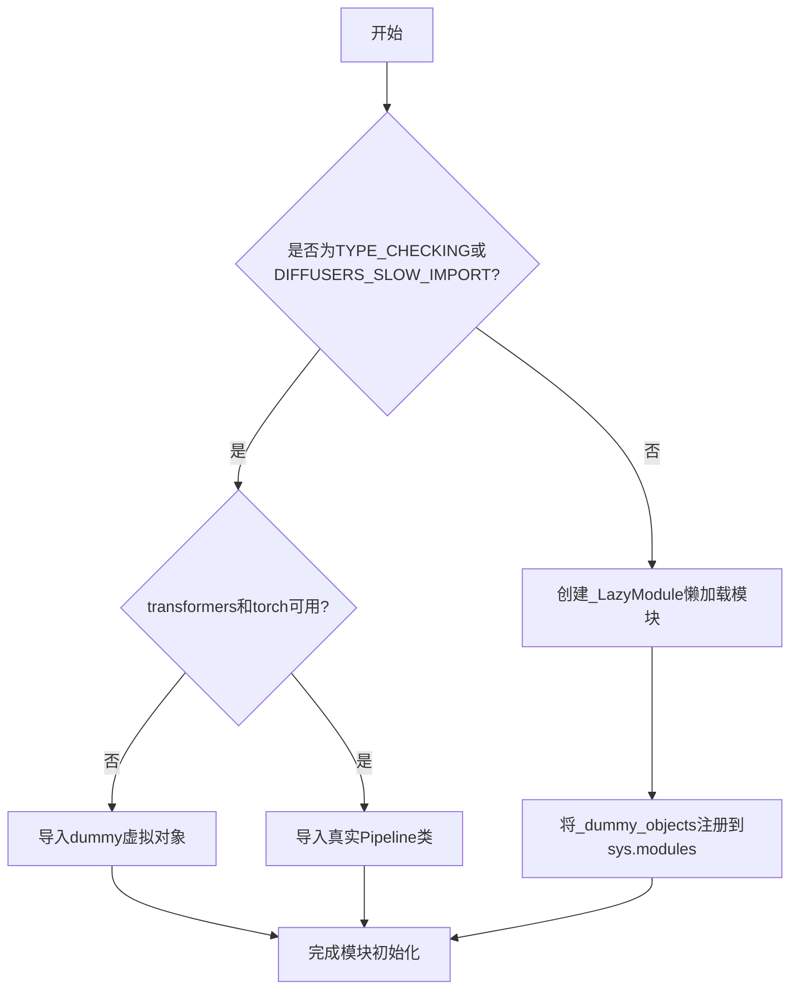
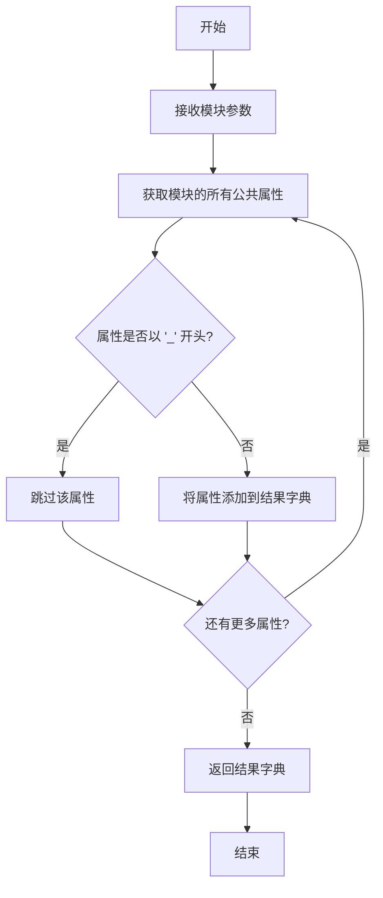
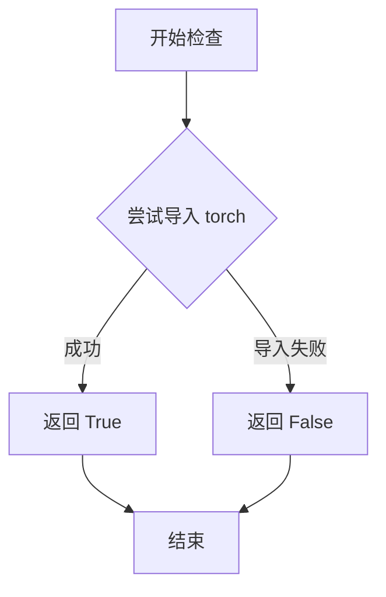
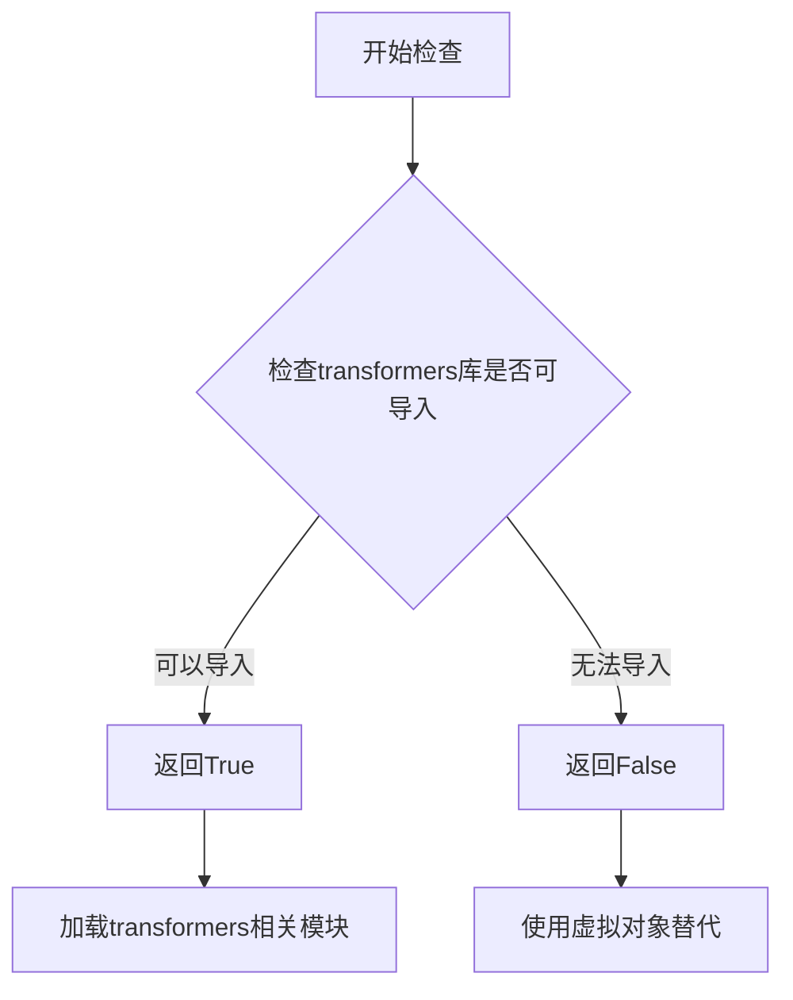

# `diffusers\src\diffusers\pipelines\latent_consistency_models\__init__.py` 详细设计文档

这是一个懒加载模块初始化文件，用于动态导入Latent Consistency Model（潜在一致性模型）的图像生成管道，支持条件导入torch和transformers可选依赖，并在依赖不可用时提供虚拟对象以保持API兼容性。

## 整体流程



## 类结构

```
Lazy Loading Module Architecture
└── _LazyModule (懒加载模块封装器)
    ├── _import_structure (导入结构字典)
    │   ├── pipeline_latent_consistency_img2img
    │   │   └── LatentConsistencyModelImg2ImgPipeline
    │   └── pipeline_latent_consistency_text2img
    │       └── LatentConsistencyModelPipeline
    └── _dummy_objects (虚拟对象集合)
```

## 全局变量及字段


### `_dummy_objects`
    
用于存储虚拟对象的字典，当可选依赖不可用时提供替代对象

类型：`dict`
    


### `_import_structure`
    
定义模块导入结构的字典，映射导出名称到实际对象

类型：`dict`
    


### `DIFFUSERS_SLOW_IMPORT`
    
标志位，控制是否启用慢速导入模式（TYPE_CHECKING时为True）

类型：`bool`
    


### `OptionalDependencyNotAvailable`
    
可选依赖不可用时抛出的异常类

类型：`Exception`
    


### `_LazyModule`
    
延迟加载模块的类，用于实现按需导入

类型：`class`
    


### `get_objects_from_module`
    
从指定模块获取所有对象的函数

类型：`function`
    


### `is_torch_available`
    
检查torch库是否可用的函数，返回布尔值

类型：`function`
    


### `is_transformers_available`
    
检查transformers库是否可用的函数，返回布尔值

类型：`function`
    


    

## 全局函数及方法


### `get_objects_from_module`

该函数是 DiffusionHub 中的一个工具函数，用于从指定模块中动态提取所有公共对象（如类、函数等），并将它们转换为字典格式返回，以便在延迟导入（lazy import）机制中使用，用于在某些依赖不可用时提供虚拟的替代对象。

参数：

- `module`：`ModuleType`，要从中提取对象的模块，通常是 dummy 模块（如 `dummy_torch_and_transformers_objects`）

返回值：`Dict[str, Any]`，返回从模块中提取的所有公共对象组成的字典，键为对象名称，值为对象本身

#### 流程图



#### 带注释源码

```python
# 该函数定义在 ...utils 模块中
# 源代码未在此文件中提供，但基于调用方式可推断其实现逻辑

def get_objects_from_module(module):
    """
    从给定模块中提取所有公共对象并返回字典。
    
    参数:
        module: 要提取对象的模块
        
    返回:
        包含模块中所有公共对象的字典
    """
    # 使用 dir() 获取模块的所有属性
    # 过滤掉以双下划线开头的私有属性
    # 返回 {属性名: 属性值} 的字典
```


### `is_torch_available`

检查当前环境中 PyTorch 库是否已安装并可用的函数。该函数用于条件导入和可选依赖处理，决定是否加载需要 PyTorch 的模块。

参数：

- 无参数

返回值：`bool`，返回 `True` 表示 PyTorch 可用，返回 `False` 表示 PyTorch 不可用

#### 流程图



#### 带注释源码

```python
# is_torch_available 函数定义通常位于 ...utils 模块中
# 以下是基于常见实现的推断代码：

def is_torch_available():
    """
    检查 PyTorch 是否可用。
    
    尝试导入 torch 模块，如果成功则返回 True，
    如果发生 ImportError 则返回 False。
    
    Returns:
        bool: PyTorch 是否可用
    """
    try:
        import torch
        return True
    except ImportError:
        return False

# 在当前文件中的使用方式：
if not (is_transformers_available() and is_torch_available()):
    raise OptionalDependencyNotAvailable()
```

#### 备注

- 该函数在当前文件中被多次调用，用于条件判断
- 与 `is_transformers_available()` 配合使用，只有两者都返回 `True` 时才会加载完整的管道类
- 如果任一依赖不可用，则使用虚拟对象（dummy objects）进行替代，保持模块结构完整性


### `is_transformers_available`

该函数用于检查transformers库是否在当前环境中可用，返回布尔值以决定是否加载相关的模块和对象。

参数：此函数无参数。

返回值：`bool`，返回True表示transformers库可用，返回False表示不可用。

#### 流程图



#### 带注释源码

```python
# 这是一个从其他模块导入的函数，用于检查transformers库是否可用
# 函数定义不在当前文件中，而是在...utils模块中
from ...utils import is_transformers_available

# 使用示例（从代码中提取）:
# if not (is_transformers_available() and is_torch_available()):
#     raise OptionalDependencyNotAvailable()

# 函数返回布尔值，用于条件判断
# True: transformers库已安装且可用
# False: transformers库未安装或不可用
```


### setattr

将值绑定到模块的属性上，用于在延迟加载模块中设置虚拟的占位对象。

参数：

- `obj`：`sys.modules[__name__]` (模块对象)，要设置属性的目标模块
- `name`：`str` (字符串类型)，从 `_dummy_objects` 字典中遍历出的属性名称
- `value`：任意类型，从 `_dummy_objects` 字典中遍历出的属性值

返回值：`None`，无返回值（Python 内置函数特性）

#### 流程图

```mermaid
flowchart TD
    A[开始] --> B[遍历 _dummy_objects 字典]
    B --> C{字典中是否还有未处理的键值对}
    C -->|是| D[取出当前键值对: name, value]
    D --> E[调用 setattr]
    E --> F[将 value 绑定到 sys.modules[__name__] 的 name 属性]
    F --> G[返回 None]
    G --> C
    C -->|否| H[结束]
```

#### 带注释源码

```python
# 遍历 _dummy_objects 字典中的所有虚拟占位对象
for name, value in _dummy_objects.items():
    # 使用 setattr 将每个虚拟对象设置为当前模块的属性
    # 参数1: sys.modules[__name__] - 当前模块对象
    # 参数2: name - 属性名（来自字典的键）
    # 参数3: value - 属性值（来自字典的值，即虚拟占位对象）
    setattr(sys.modules[__name__], name, value)
```

#### 详细说明

这段代码位于扩散器库的懒加载模块初始化逻辑中。`setattr` 在此处的作用是：

1. **动态属性绑定**：在运行时将虚拟对象（_dummy_objects）动态添加到模块命名空间中
2. **懒加载机制**：当可选依赖（torch/transformers）不可用时，提供替代的虚拟对象
3. **模块扩展**：使导入该模块的代码可以访问这些虚拟对象，即使实际功能不可用

这是 Python 动态特性的典型应用，用于处理可选依赖的模块设计模式。

## 关键组件


### 懒加载模块初始化 (Lazy Loading Initialization)

该代码是一个懒加载模块初始化文件，用于延迟导入LatentConsistencyModel管道类，仅在需要时才加载实际的模块和类，以优化导入时间和内存占用。

### 可选依赖检查 (Optional Dependency Checking)

通过检查`is_transformers_available()`和`is_torch_available()`来确定torch和transformers库是否可用，如果不可用则抛出`OptionalDependencyNotAvailable`异常，触发虚拟对象的加载。

### 虚拟对象机制 (Dummy Objects Mechanism)

当可选依赖不可用时，使用`get_objects_from_module`从`dummy_torch_and_transformers_objects`模块获取虚拟对象，并将其添加到`_dummy_objects`字典中，确保模块在缺少依赖时仍可被导入而不报错。

### 导入结构定义 (Import Structure Definition)

`_import_structure`字典定义了可导出的类名映射，包括`LatentConsistencyModelImg2ImgPipeline`和`LatentConsistencyModelPipeline`两个管道类，供懒加载模块使用。

### TYPE_CHECKING条件导入 (TYPE_CHECKING Conditional Import)

在类型检查或慢速导入模式下，直接导入实际的管道类以便IDE进行类型检查和代码补全；否则使用`_LazyModule`实现运行时延迟加载。

### 懒加载模块注册 (Lazy Module Registration)

通过`sys.modules[__name__] = _LazyModule(...)`将当前模块替换为懒加载模块实例，并使用`setattr`将虚拟对象绑定到模块属性，实现平滑的依赖可选处理。


## 问题及建议


### 已知问题

-   **重复的条件判断逻辑**：`if not (is_transformers_available() and is_torch_available())` 在第14行和第24行重复出现，导致代码冗余，增加维护成本
-   **未使用的导入变量**：`DIFFUSERS_SLOW_IMPORT` 被导入但在整个代码中未被使用
-   **空字典初始化无意义**：`_import_structure = {}` 初始化后立即在else分支中被完全覆盖赋值，而非合并更新，初始化显得多余
-   **异常控制流滥用**：使用 `OptionalDependencyNotAvailable` 异常来控制代码分支不是最佳实践，异常应仅用于异常情况而非正常流程控制
-   **Lazy Module 赋值顺序问题**：在第34-37行将模块替换为 `_LazyModule` 后，又通过 `setattr` 批量添加 `_dummy_objects`，这种操作顺序可能导致属性查找问题

### 优化建议

-   **提取依赖检查函数**：创建一个辅助函数 `check_dependencies()` 来封装依赖检查逻辑，消除重复代码
-   **移除未使用导入**：删除未使用的 `DIFFUSERS_SLOW_IMPORT` 导入
-   **优化字典赋值逻辑**：根据实际需求决定是否需要初始化空字典，或改用 `dict.update()` 进行合并
-   **重构异常处理逻辑**：将依赖检查改为显式返回布尔值的函数，用条件语句控制流程，而非异常捕获
-   **调整对象赋值顺序**：在创建 `_LazyModule` 之前将 dummy objects 添加进去，或在创建时传入 dummy objects，保持赋值逻辑的一致性
-   **考虑类型注解完善**：为全局变量添加类型注解，提高代码可读性和类型安全


## 其它


### 设计目标与约束

该模块旨在实现可选依赖的延迟加载机制，在保证模块结构完整性的同时避免强制安装torch和transformers等重型依赖。设计约束包括：仅在torch和transformers均可用时才导入真实Pipeline类，否则使用虚拟对象替代；通过_LazyModule实现运行时动态导入；遵循Diffusers库的模块导入规范。

### 错误处理与异常设计

当torch或transformers任一依赖不可用时，抛出OptionalDependencyNotAvailable异常并从dummy_torch_and_transformers_objects模块获取虚拟对象。TYPE_CHECKING或DIFFUSERS_SLOW_IMPORT模式下同样处理依赖检查，确保类型检查和慢速导入时的一致性。

### 数据流与状态机

模块初始化时首先定义_import_structure字典和_dummy_objects字典，然后检查依赖可用性。若依赖可用，将真实类名添加到_import_structure；若不可用，从dummy模块获取虚拟对象并更新_dummy_objects。最后根据导入模式（TYPE_CHECKING/DIFFUSERS_SLOW_IMPORT/普通导入）执行不同的类加载逻辑。

### 外部依赖与接口契约

外部依赖包括：torch（is_torch_available）、transformers（is_transformers_available）、diffusers.utils中的_LazyModule、get_objects_from_module、OptionalDependencyNotAvailable等。接口契约规定导出的类为LatentConsistencyModelPipeline和LatentConsistencyModelImg2ImgPipeline，导出键分别为pipeline_latent_consistency_text2img和pipeline_latent_consistency_img2img。

### 延迟加载机制

_LazyModule接收当前模块名、文件路径、导入结构字典和模块规格，在普通导入模式下替换sys.modules中的模块对象，实现真正的延迟加载。setattr将_dummy_objects中的虚拟对象绑定到模块属性，确保模块在依赖缺失时仍可被导入但功能受限。

### 模块导入结构定义

_import_structure字典定义了模块的公共接口，包含两个键值对：pipeline_latent_consistency_img2img对应LatentConsistencyModelImg2ImgPipeline类，pipeline_latent_consistency_text2img对应LatentConsistencyModelPipeline类。该结构在TYPE_CHECKING和实际导入时保持一致。

### 虚拟对象机制

当可选依赖不可用时，_dummy_objects从dummy_torch_and_transformers_objects模块获取虚拟对象。这些对象通常是简单的占位符类或函数，允许模块被导入但调用时会抛出适当的错误提示，确保用户能识别缺失的依赖。

    