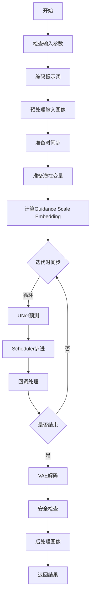
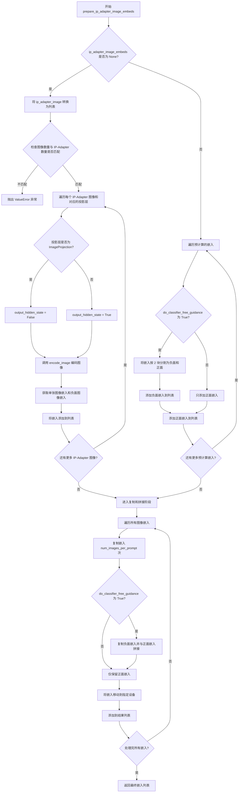
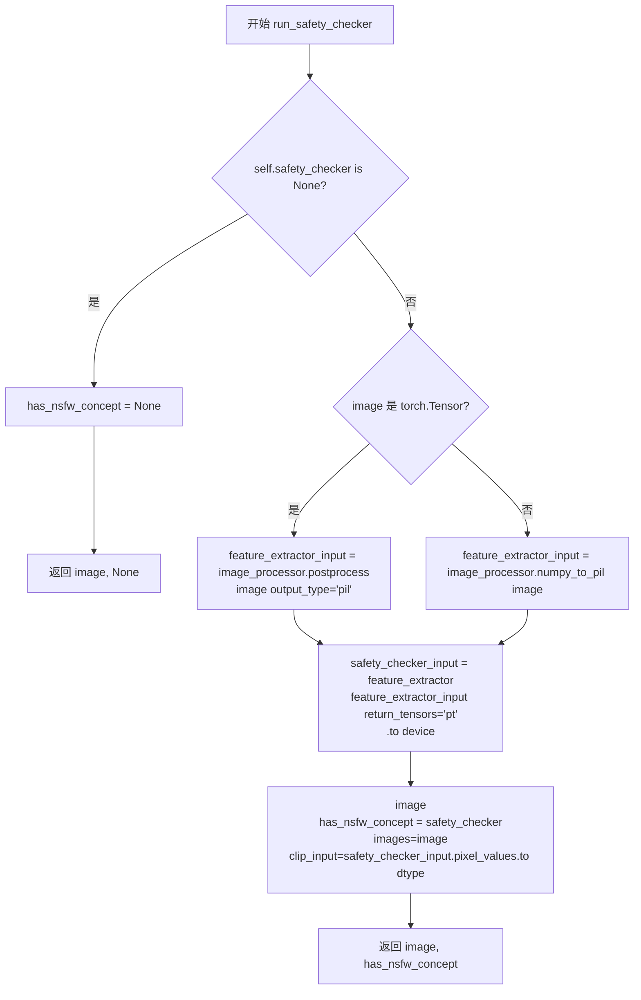
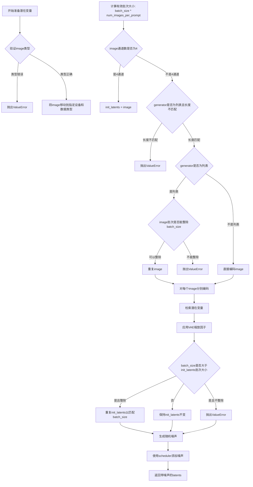
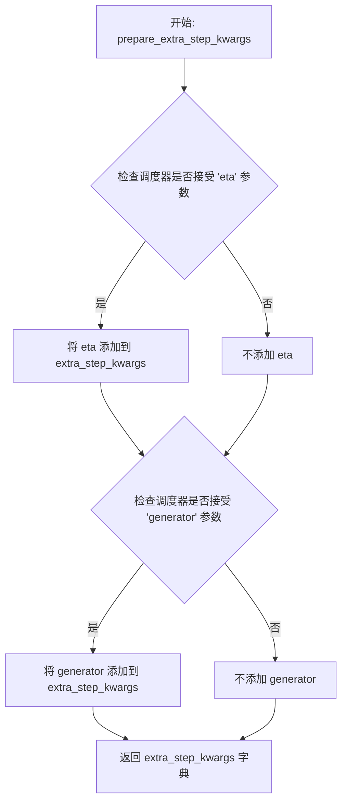

```mermaid
flowchart TD
    A[开始 __call__] --> B[检查输入参数 check_inputs]
    B --> C[定义调用参数 batch_size, device]
    C --> D{ip_adapter_image<br/>或 ip_adapter_image_embeds<br/>是否存在?}
    D -->|是| E[prepare_ip_adapter_image_embeds]
    D -->|否| F[编码输入提示 encode_prompt]
    E --> F
    F --> G[预处理输入图像 image_processor.preprocess]
    G --> H[准备时间步 retrieve_timesteps]
    H --> I[准备潜在变量 prepare_latents]
    I --> J[计算引导比例嵌入 get_guidance_scale_embedding]
    J --> K[准备额外步骤参数 prepare_extra_step_kwargs]
    K --> L{ip_adapter_image<br/>或 ip_adapter_image_embeds<br/>是否存在?}
    L -->|是| M[添加图像嵌入 added_cond_kwargs]
    L -->|否| N[设置 added_cond_kwargs = None]
    M --> N
    N --> O[初始化进度条和计数器]
    O --> P[LCM 多步采样循环开始]
    P --> Q{当前索引 i <br/>时间步数量?}
    Q -->|是| R[模型预测 unet]
    R --> S[调度器单步执行 scheduler.step]
    S --> T{callback_on_step_end<br/>是否定义?}
    T -->|是| U[执行回调函数]
    T -->|否| V[更新进度条]
    U --> V
    V --> W{是否为最后一步或<br/>需要输出?}
    W -->|否| P
    W -->|是| X[采样循环结束]
    Q -->|否| X
    X --> Y{output_type<br/>是否为 latent?}
    Y -->|否| Z[VAE 解码 vae.decode]
    Y -->|是| AA[直接使用 denoised]
    Z --> AB[运行安全检查 run_safety_checker]
    AA --> AC[后处理图像 image_processor.postprocess]
    AB --> AC
    AC --> AD[释放模型钩子 maybe_free_model_hooks]
    AD --> AE{return_dict<br/>是否为 True?}
    AE -->|是| AF[返回 StableDiffusionPipelineOutput]
    AE -->|否| AG[返回元组 image, has_nsfw_concept]
```

# `diffusers\src\diffusers\pipelines\latent_consistency_models\pipeline_latent_consistency_img2img.py` 详细设计文档

这是一个基于潜在一致性模型(LCM)的图像到图像生成管道,利用潜在空间的一致性蒸馏技术实现快速推理(仅需4-8步)即可完成图像转换任务。该管道继承自DiffusionPipeline,整合了VAE、文本编码器、UNet和LCMScheduler等组件,支持LoRA、IP-Adapter、Textual Inversion等高级特性。

## 整体流程



## 类结构

```
DiffusionPipeline (抽象基类)
├── StableDiffusionMixin
├── TextualInversionLoaderMixin
├── IPAdapterMixin
├── StableDiffusionLoraLoaderMixin
├── FromSingleFileMixin
└── LatentConsistencyModelImg2ImgPipeline
```

## 全局变量及字段


### `XLA_AVAILABLE`
    
是否支持XLA加速

类型：`bool`
    


### `logger`
    
日志记录器

类型：`logging.Logger`
    


### `EXAMPLE_DOC_STRING`
    
示例文档字符串

类型：`str`
    


### `retrieve_latents`
    
从编码器输出中检索潜在表示

类型：`function`
    


### `retrieve_timesteps`
    
从调度器中检索时间步

类型：`function`
    


### `LatentConsistencyModelImg2ImgPipeline.model_cpu_offload_seq`
    
模型CPU卸载顺序

类型：`str`
    


### `LatentConsistencyModelImg2ImgPipeline._optional_components`
    
可选组件列表

类型：`List[str]`
    


### `LatentConsistencyModelImg2ImgPipeline._exclude_from_cpu_offload`
    
排除CPU卸载的组件

类型：`List[str]`
    


### `LatentConsistencyModelImg2ImgPipeline._callback_tensor_inputs`
    
回调张量输入列表

类型：`List[str]`
    


### `LatentConsistencyModelImg2ImgPipeline.vae`
    
VAE编码器/解码器

类型：`AutoencoderKL`
    


### `LatentConsistencyModelImg2ImgPipeline.text_encoder`
    
文本编码器

类型：`CLIPTextModel`
    


### `LatentConsistencyModelImg2ImgPipeline.tokenizer`
    
文本分词器

类型：`CLIPTokenizer`
    


### `LatentConsistencyModelImg2ImgPipeline.unet`
    
UNet条件去噪模型

类型：`UNet2DConditionModel`
    


### `LatentConsistencyModelImg2ImgPipeline.scheduler`
    
LCM调度器

类型：`LCMScheduler`
    


### `LatentConsistencyModelImg2ImgPipeline.safety_checker`
    
安全检查器

类型：`StableDiffusionSafetyChecker`
    


### `LatentConsistencyModelImg2ImgPipeline.feature_extractor`
    
图像特征提取器

类型：`CLIPImageProcessor`
    


### `LatentConsistencyModelImg2ImgPipeline.image_encoder`
    
图像编码器

类型：`CLIPVisionModelWithProjection`
    


### `LatentConsistencyModelImg2ImgPipeline.vae_scale_factor`
    
VAE缩放因子

类型：`int`
    


### `LatentConsistencyModelImg2ImgPipeline.image_processor`
    
图像处理器

类型：`VaeImageProcessor`
    
    

## 全局函数及方法


### `retrieve_latents`

从编码器输出中检索潜在向量，支持多种采样模式（随机采样或取模），同时兼容不同的编码器输出格式。

参数：

- `encoder_output`：`torch.Tensor`，编码器输出，可以是具有 `latent_dist` 或 `latents` 属性的对象
- `generator`：`torch.Generator | None`，可选的随机数生成器，用于采样时的随机性控制
- `sample_mode`：`str`，采样模式，默认为 `"sample"`（随机采样），也可设置为 `"argmax"`（取模）

返回值：`torch.Tensor`，检索到的潜在向量

#### 流程图

```mermaid
flowchart TD
    A[开始] --> B{检查 encoder_output 是否有 latent_dist 属性}
    B -->|是| C{sample_mode == 'sample'?}
    C -->|是| D[返回 encoder_output.latent_dist.sample(generator)]
    C -->|否| E{sample_mode == 'argmax'?}
    E -->|是| F[返回 encoder_output.latent_dist.mode()]
    E -->|否| G{检查是否有 latents 属性}
    B -->|否| G
    G -->|是| H[返回 encoder_output.latents]
    G -->|否| I[抛出 AttributeError: Could not access latents]
    D --> J[结束]
    F --> J
    H --> J
    I --> J
```

#### 带注释源码

```python
# Copied from diffusers.pipelines.stable_diffusion.pipeline_stable_diffusion_img2img.retrieve_latents
def retrieve_latents(
    encoder_output: torch.Tensor, generator: torch.Generator | None = None, sample_mode: str = "sample"
):
    """
    从编码器输出中检索潜在向量。

    Args:
        encoder_output: 编码器输出，通常包含 latent_dist 或 latents 属性
        generator: 可选的随机数生成器，用于采样时的随机性控制
        sample_mode: 采样模式，"sample" 表示随机采样，"argmax" 表示取模

    Returns:
        检索到的潜在向量张量

    Raises:
        AttributeError: 当无法从 encoder_output 访问潜在向量时抛出
    """
    # 检查编码器输出是否具有 latent_dist 属性，并且采样模式为 "sample"
    if hasattr(encoder_output, "latent_dist") and sample_mode == "sample":
        # 从潜在分布中采样
        return encoder_output.latent_dist.sample(generator)
    # 检查编码器输出是否具有 latent_dist 属性，并且采样模式为 "argmax"
    elif hasattr(encoder_output, "latent_dist") and sample_mode == "argmax":
        # 获取潜在分布的模值（确定性模式）
        return encoder_output.latent_dist.mode()
    # 检查编码器输出是否直接具有 latents 属性
    elif hasattr(encoder_output, "latents"):
        # 直接返回预计算的潜在向量
        return encoder_output.latents
    # 如果无法访问任何潜在向量，抛出属性错误
    else:
        raise AttributeError("Could not access latents of provided encoder_output")
```


### `retrieve_timesteps`

该函数用于从调度器（Scheduler）中检索时间步（timesteps）。它调用调度器的 `set_timesteps` 方法，并根据传入的自定义时间步（timesteps）或自定义 sigmas 来设置调度器的时间步。如果未提供自定义时间步或 sigmas，则使用默认的 `num_inference_steps` 来生成时间步。最终返回调度器的时间步数组和推理步骤数。

参数：

- `scheduler`：`SchedulerMixin`，调度器对象，用于生成时间步
- `num_inference_steps`：`int | None`，扩散推理步数，用于生成样本。当使用此参数时，`timesteps` 必须为 `None`
- `device`：`str | torch.device | None`，时间步要移动到的设备。如果为 `None`，则不移动时间步
- `timesteps`：`list[int] | None`，自定义时间步，用于覆盖调度器的时间步间隔策略。如果传入此参数，`num_inference_steps` 和 `sigmas` 必须为 `None`
- `sigmas`：`list[float] | None`，自定义 sigmas，用于覆盖调度器的时间步间隔策略。如果传入此参数，`num_inference_steps` 和 `timesteps` 必须为 `None`
- `**kwargs`：任意关键字参数，将传递给 `scheduler.set_timesteps` 方法

返回值：`tuple[torch.Tensor, int]`，元组包含两个元素：第一个元素是调度器的时间步调度（torch.Tensor），第二个元素是推理步骤数（int）

#### 流程图

```mermaid
flowchart TD
    A[开始] --> B{检查 timesteps 和 sigmas 是否同时传入}
    B -->|是| C[抛出 ValueError: 只能传入一个]
    B -->|否| D{检查是否传入了 timesteps}
    D -->|是| E{检查 scheduler.set_timesteps 是否支持 timesteps}
    D -->|否| G{检查是否传入了 sigmas}
    E -->|不支持| F[抛出 ValueError: 不支持自定义时间步]
    E -->|支持| H[调用 scheduler.set_timesteps]
    G -->|是| I{检查 scheduler.set_timesteps 是否支持 sigmas}
    G -->|否| K[使用 num_inference_steps 调用 scheduler.set_timesteps]
    I -->|不支持| J[抛出 ValueError: 不支持自定义 sigmas]
    I -->|支持| L[调用 scheduler.set_timesteps]
    H --> M[获取 scheduler.timesteps]
    L --> N[获取 scheduler.timesteps]
    K --> O[获取 scheduler.timesteps]
    M --> P[计算 num_inference_steps = len(timesteps)]
    N --> Q[计算 num_inference_steps = len(timesteps)]
    O --> R[返回 timesteps, num_inference_steps]
    P --> R
    Q --> R
```

#### 带注释源码

```python
def retrieve_timesteps(
    scheduler,
    num_inference_steps: int | None = None,
    device: str | torch.device | None = None,
    timesteps: list[int] | None = None,
    sigmas: list[float] | None = None,
    **kwargs,
):
    r"""
    Calls the scheduler's `set_timesteps` method and retrieves timesteps from the scheduler after the call. Handles
    custom timesteps. Any kwargs will be supplied to `scheduler.set_timesteps`.

    Args:
        scheduler (`SchedulerMixin`):
            The scheduler to get timesteps from.
        num_inference_steps (`int`):
            The number of diffusion steps used when generating samples with a pre-trained model. If used, `timesteps`
            must be `None`.
        device (`str` or `torch.device`, *optional*):
            The device to which the timesteps should be moved to. If `None`, the timesteps are not moved.
        timesteps (`list[int]`, *optional*):
            Custom timesteps used to override the timestep spacing strategy of the scheduler. If `timesteps` is passed,
            `num_inference_steps` and `sigmas` must be `None`.
        sigmas (`list[float]`, *optional*):
            Custom sigmas used to override the timestep spacing strategy of the scheduler. If `sigmas` is passed,
            `num_inference_steps` and `timesteps` must be `None`.

    Returns:
        `tuple[torch.Tensor, int]`: A tuple where the first element is the timestep schedule from the scheduler and the
        second element is the number of inference steps.
    """
    # 检查是否同时传入了 timesteps 和 sigmas，只能选择其中一个
    if timesteps is not None and sigmas is not None:
        raise ValueError("Only one of `timesteps` or `sigmas` can be passed. Please choose one to set custom values")
    
    # 处理自定义 timesteps 的情况
    if timesteps is not None:
        # 检查调度器的 set_timesteps 方法是否支持 timesteps 参数
        accepts_timesteps = "timesteps" in set(inspect.signature(scheduler.set_timesteps).parameters.keys())
        if not accepts_timesteps:
            raise ValueError(
                f"The current scheduler class {scheduler.__class__}'s `set_timesteps` does not support custom"
                f" timestep schedules. Please check whether you are using the correct scheduler."
            )
        # 调用调度器的 set_timesteps 方法设置自定义时间步
        scheduler.set_timesteps(timesteps=timesteps, device=device, **kwargs)
        # 从调度器获取设置后的时间步
        timesteps = scheduler.timesteps
        # 计算推理步骤数
        num_inference_steps = len(timesteps)
    
    # 处理自定义 sigmas 的情况
    elif sigmas is not None:
        # 检查调度器的 set_timesteps 方法是否支持 sigmas 参数
        accept_sigmas = "sigmas" in set(inspect.signature(scheduler.set_timesteps).parameters.keys())
        if not accept_sigmas:
            raise ValueError(
                f"The current scheduler class {scheduler.__class__}'s `set_timesteps` does not support custom"
                f" sigmas schedules. Please check whether you are using the correct scheduler."
            )
        # 调用调度器的 set_timesteps 方法设置自定义 sigmas
        scheduler.set_timesteps(sigmas=sigmas, device=device, **kwargs)
        # 从调度器获取设置后的时间步
        timesteps = scheduler.timesteps
        # 计算推理步骤数
        num_inference_steps = len(timesteps)
    
    # 使用默认的 num_inference_steps 来生成时间步
    else:
        scheduler.set_timesteps(num_inference_steps, device=device, **kwargs)
        timesteps = scheduler.timesteps
    
    # 返回时间步数组和推理步骤数
    return timesteps, num_inference_steps
```


### `LatentConsistencyModelImg2ImgPipeline.__init__`

该方法是 `LatentConsistencyModelImg2ImgPipeline` 类的构造函数，负责初始化图像到图像生成的潜在一致性模型（LCM）管道所需的所有核心组件，包括 VAE、文本编码器、分词器、UNet、调度器、安全检查器等，并注册模块和配置图像处理器。

#### 参数

- `vae`：`AutoencoderKL`，用于将图像编码和解码到潜在表示的变分自编码器模型
- `text_encoder`：`CLIPTextModel`，冻结的文本编码器（clip-vit-large-patch14），用于将文本提示转换为嵌入向量
- `tokenizer`：`CLIPTokenizer`，用于将文本分词的 CLIP 分词器
- `unet`：`UNet2DConditionModel`，用于对编码后的图像潜在表示进行去噪的条件 UNet 模型
- `scheduler`：`LCMScheduler`，与 `unet` 结合使用对编码图像潜在表示进行去噪的调度器，当前仅支持 `LCMScheduler`
- `safety_checker`：`StableDiffusionSafetyChecker`，用于估计生成图像是否可能被视为冒犯性或有害的分类模块
- `feature_extractor`：`CLIPImageProcessor`，用于从生成图像中提取特征的 CLIP 图像处理器，作为 `safety_checker` 的输入
- `image_encoder`：`CLIPVisionModelWithProjection | None`，可选的图像编码器，用于 IP-Adapter 功能
- `requires_safety_checker`：`bool`，可选，默认为 `True`，指定管道是否需要安全检查器组件

#### 流程图

```mermaid
flowchart TD
    A[__init__ 开始] --> B[调用 super().__init__ 初始化基类]
    B --> C[register_modules 注册所有模块]
    C --> D{安全检查器为None<br/>且requires_safety_checker为True?}
    D -->|是| E[记录警告日志<br/>提示禁用安全检查器]
    D -->|否| F[跳过警告]
    E --> G[计算vae_scale_factor<br/>基于VAE块输出通道数]
    F --> G
    G --> H[创建VaeImageProcessor<br/>使用vae_scale_factor]
    H --> I[__init__ 结束]
```

#### 带注释源码

```python
def __init__(
    self,
    vae: AutoencoderKL,
    text_encoder: CLIPTextModel,
    tokenizer: CLIPTokenizer,
    unet: UNet2DConditionModel,
    scheduler: LCMScheduler,
    safety_checker: StableDiffusionSafetyChecker,
    feature_extractor: CLIPImageProcessor,
    image_encoder: CLIPVisionModelWithProjection | None = None,
    requires_safety_checker: bool = True,
):
    # 调用父类 DiffusionPipeline 的初始化方法
    # 设置管道的基本属性和配置
    super().__init__()

    # 使用 register_modules 方法注册所有管道组件
    # 这些模块将被管道管理，可通过 self.xxx 访问
    # 同时支持模块的保存/加载功能
    self.register_modules(
        vae=vae,
        text_encoder=text_encoder,
        tokenizer=tokenizer,
        unet=unet,
        scheduler=scheduler,
        safety_checker=safety_checker,
        feature_extractor=feature_extractor,
        image_encoder=image_encoder,
    )

    # 安全检查器警告逻辑：
    # 如果用户明确传入 safety_checker=None 但 requires_safety_checker=True
    # 说明用户禁用了安全检查器，需要警告用户潜在的法律和道德风险
    if safety_checker is None and requires_safety_checker:
        logger.warning(
            f"You have disabled the safety checker for {self.__class__} by passing `safety_checker=None`. Ensure"
            " that you abide to the conditions of the Stable Diffusion license and do not expose unfiltered"
            " results in services or applications open to the public. Both the diffusers team and Hugging Face"
            " strongly recommend to keep the safety filter enabled in all public facing circumstances, disabling"
            " it only for use-cases that involve analyzing network behavior or auditing its results. For more"
            " information, please have a look at https://github.com/huggingface/diffusers/pull/254 ."
        )

    # 计算 VAE 缩放因子：
    # VAE 的缩放因子通常为 2^(num_layers-1)，其中 num_layers 是下采样/上采样块的数量
    # 例如：如果 VAE 有 [128, 256, 512, 512] 四个块，则缩放因子为 2^(4-1)=8
    # 这用于在潜在空间和像素空间之间进行缩放转换
    self.vae_scale_factor = 2 ** (len(self.vae.config.block_out_channels) - 1) if getattr(self, "vae", None) else 8

    # 创建图像处理器：
    # VaeImageProcessor 负责图像的预处理（预处理到潜在空间）
    # 和后处理（从潜在空间解码回像素空间）
    self.image_processor = VaeImageProcessor(vae_scale_factor=self.vae_scale_factor)
```


### `LatentConsistencyModelImg2ImgPipeline.encode_prompt`

该方法将文本提示（prompt）编码为文本编码器的隐藏状态（hidden states），是图像生成管道的关键前置步骤。它处理提示的tokenization、文本编码、LoRA权重调整、分类器自由引导（CFG）的无条件嵌入生成，并支持CLIP skip和文本反转（Textual Inversion）功能。

参数：

- `prompt`：`str | list[str] | None`，要编码的文本提示，可以是单个字符串或字符串列表
- `device`：`torch.device`，PyTorch设备，用于将计算结果移动到指定设备
- `num_images_per_prompt`：`int`，每个提示生成的图像数量，用于复制embeddings
- `do_classifier_free_guidance`：`bool`，是否启用分类器自由引导，启用时需要生成无条件embeddings
- `negative_prompt`：`str | list[str] | None`，负面提示，用于引导模型避免生成特定内容
- `prompt_embeds`：`torch.Tensor | None`，预生成的文本embeddings，如果提供则跳过prompt的编码
- `negative_prompt_embeds`：`torch.Tensor | None`，预生成的负面文本embeddings
- `lora_scale`：`float | None`，LoRA缩放因子，用于调整LoRA层的影响权重
- `clip_skip`：`int | None`，CLIP模型中跳过的层数，用于获取不同层的特征表示

返回值：`tuple[torch.Tensor, torch.Tensor]`，返回一个元组，包含编码后的提示embeddings和负面提示embeddings，用于后续的图像生成过程

#### 流程图

```mermaid
flowchart TD
    A[开始 encode_prompt] --> B{检查 lora_scale}
    B -->|非None| C[设置 self._lora_scale]
    C --> D{是否使用 PEFT backend}
    D -->|否| E[adjust_lora_scale_text_encoder]
    D -->|是| F[scale_lora_layers]
    B -->|None| G
    E --> G
    F --> G
    
    G{确定 batch_size} -->|prompt 是 str| H[batch_size = 1]
    G -->|prompt 是 list| I[batch_size = len]
    G -->|其他| J[batch_size = prompt_embeds.shape[0]]
    H --> K
    I --> K
    J --> K
    
    K{prompt_embeds 是 None?} -->|是| L{检查 TextualInversionLoaderMixin}
    K -->|否| M
    
    L -->|是| N[maybe_convert_prompt]
    L -->|否| O
    N --> O
    
    O --> P[tokenizer 处理 prompt]
    P --> Q{检查 untruncated_ids}
    Q -->|需要截断| R[记录警告]
    Q -->|不需要| S
    R --> S
    
    S{clip_skip 是 None?} -->|是| T[text_encoder encode]
    S -->|否| U[text_encoder encode with output_hidden_states]
    T --> V
    U --> V[获取指定层的 hidden_states]
    V --> W[应用 final_layer_norm]
    
    M --> X
    W --> X
    
    X{text_encoder 存在?} -->|是| Y[获取 text_encoder.dtype]
    X -->|否| Z{unet 存在?}
    Y --> AA
    Z -->|是| AB[获取 unet.dtype]
    Z -->|否| AC[使用 prompt_embeds.dtype]
    AB --> AA
    AC --> AA
    
    AA[转换 prompt_embeds 到目标 dtype 和 device] --> AD[复制 prompt_embeds]
    AD --> AE[reshape 为 batch_size * num_images_per_prompt]
    
    AE --> AF{do_classifier_free_guidance 且 negative_prompt_embeds 是 None?}
    AF -->|是| AG{确定 uncond_tokens}
    AF -->|否| AH
    
    AG -->|negative_prompt is None| AI[uncond_tokens = [''] * batch_size]
    AG -->|negative_prompt 是 str| AJ[uncond_tokens = [negative_prompt]]
    AG -->|其他| AK[uncond_tokens = negative_prompt]
    AI --> AL
    AJ --> AL
    AK --> AL
    
    AL{检查 TextualInversionLoaderMixin} -->|是| AM[maybe_convert_prompt]
    AL -->|否| AN
    AM --> AN
    
    AN --> AO[tokenizer 处理 uncond_tokens]
    AO --> AP[text_encoder encode 获取 negative_prompt_embeds]
    AP --> AQ[转换 dtype 和 device]
    AQ --> AR[复制 negative_prompt_embeds]
    AR --> AS[reshape]
    AS --> AT
    
    AH --> AT
    AT --> AU{使用 PEFT backend?}
    AU -->|是| AV[unscale_lora_layers]
    AU -->|否| AW
    
    AV --> AX
    AW --> AX
    
    AX[返回 prompt_embeds, negative_prompt_embeds] --> AY[结束]
```

#### 带注释源码

```python
def encode_prompt(
    self,
    prompt,
    device,
    num_images_per_prompt,
    do_classifier_free_guidance,
    negative_prompt=None,
    prompt_embeds: torch.Tensor | None = None,
    negative_prompt_embeds: torch.Tensor | None = None,
    lora_scale: float | None = None,
    clip_skip: int | None = None,
):
    r"""
    Encodes the prompt into text encoder hidden states.
    
    参数说明：
    - prompt: 要编码的文本提示，支持字符串或字符串列表
    - device: torch设备对象，指定计算设备
    - num_images_per_prompt: 每个提示生成的图像数量
    - do_classifier_free_guidance: 是否启用无分类器引导
    - negative_prompt: 可选的负面提示
    - prompt_embeds: 可选的预计算文本嵌入
    - negative_prompt_embeds: 可选的预计算负面文本嵌入
    - lora_scale: 可选的LoRA缩放因子
    - clip_skip: 可选的CLIP跳过层数
    """
    # 设置LoRA缩放因子，以便text encoder的LoRA函数可以正确访问
    # 如果传入了lora_scale且当前pipeline支持StableDiffusionLoraLoaderMixin
    if lora_scale is not None and isinstance(self, StableDiffusionLoraLoaderMixin):
        self._lora_scale = lora_scale

        # 动态调整LoRA缩放
        if not USE_PEFT_BACKEND:
            # 非PEFT后端：直接调整LoRA权重
            adjust_lora_scale_text_encoder(self.text_encoder, lora_scale)
        else:
            # PEFT后端：使用scale_lora_layers函数
            scale_lora_layers(self.text_encoder, lora_scale)

    # 确定batch_size：基于prompt类型或已存在的prompt_embeds
    if prompt is not None and isinstance(prompt, str):
        batch_size = 1
    elif prompt is not None and isinstance(prompt, list):
        batch_size = len(prompt)
    else:
        batch_size = prompt_embeds.shape[0]

    # 如果没有提供prompt_embeds，则需要从prompt生成
    if prompt_embeds is None:
        # 文本反转：必要时处理多向量tokens
        if isinstance(self, TextualInversionLoaderMixin):
            prompt = self.maybe_convert_prompt(prompt, self.tokenizer)

        # 使用tokenizer将prompt转换为tokens
        text_inputs = self.tokenizer(
            prompt,
            padding="max_length",
            max_length=self.tokenizer.model_max_length,
            truncation=True,
            return_tensors="pt",
        )
        text_input_ids = text_inputs.input_ids
        # 获取未截断的tokens用于比较
        untruncated_ids = self.tokenizer(prompt, padding="longest", return_tensors="pt").input_ids

        # 检查是否发生了截断，如果是则记录警告
        if untruncated_ids.shape[-1] >= text_input_ids.shape[-1] and not torch.equal(
            text_input_ids, untruncated_ids
        ):
            removed_text = self.tokenizer.batch_decode(
                untruncated_ids[:, self.tokenizer.model_max_length - 1 : -1]
            )
            logger.warning(
                "The following part of your input was truncated because CLIP can only handle sequences up to"
                f" {self.tokenizer.model_max_length} tokens: {removed_text}"
            )

        # 检查text_encoder是否配置了attention_mask
        if hasattr(self.text_encoder.config, "use_attention_mask") and self.text_encoder.config.use_attention_mask:
            attention_mask = text_inputs.attention_mask.to(device)
        else:
            attention_mask = None

        # 根据clip_skip决定如何获取prompt embeddings
        if clip_skip is None:
            # 直接使用text_encoder获取embeddings
            prompt_embeds = self.text_encoder(text_input_ids.to(device), attention_mask=attention_mask)
            prompt_embeds = prompt_embeds[0]
        else:
            # 获取所有hidden states，选择指定层的输出
            prompt_embeds = self.text_encoder(
                text_input_ids.to(device), attention_mask=attention_mask, output_hidden_states=True
            )
            # hidden_states是一个tuple，包含所有encoder层的输出
            # index为-(clip_skip + 1)表示倒数第(clip_skip + 1)层
            prompt_embeds = prompt_embeds[-1][-(clip_skip + 1)]
            # 应用final_layer_norm以获得正确的表示
            prompt_embeds = self.text_encoder.text_model.final_layer_norm(prompt_embeds)

    # 确定prompt_embeds的dtype（优先使用text_encoder的dtype）
    if self.text_encoder is not None:
        prompt_embeds_dtype = self.text_encoder.dtype
    elif self.unet is not None:
        prompt_embeds_dtype = self.unet.dtype
    else:
        prompt_embeds_dtype = prompt_embeds.dtype

    # 将prompt_embeds转换为适当的dtype和device
    prompt_embeds = prompt_embeds.to(dtype=prompt_embeds_dtype, device=device)

    # 获取shape信息并复制embeddings以支持每个prompt生成多张图像
    bs_embed, seq_len, _ = prompt_embeds.shape
    # 复制text embeddings（mps友好的方法）
    prompt_embeds = prompt_embeds.repeat(1, num_images_per_prompt, 1)
    prompt_embeds = prompt_embeds.view(bs_embed * num_images_per_prompt, seq_len, -1)

    # 获取无条件的embeddings用于分类器自由引导
    if do_classifier_free_guidance and negative_prompt_embeds is None:
        uncond_tokens: list[str]
        if negative_prompt is None:
            # 如果没有提供negative_prompt，使用空字符串
            uncond_tokens = [""] * batch_size
        elif prompt is not None and type(prompt) is not type(negative_prompt):
            # 类型检查：negative_prompt和prompt类型必须一致
            raise TypeError(
                f"`negative_prompt` should be the same type to `prompt`, but got {type(negative_prompt)} !="
                f" {type(prompt)}."
            )
        elif isinstance(negative_prompt, str):
            uncond_tokens = [negative_prompt]
        elif batch_size != len(negative_prompt):
            # batch_size匹配检查
            raise ValueError(
                f"`negative_prompt`: {negative_prompt} has batch size {len(negative_prompt)}, but `prompt`:"
                f" {prompt} has batch size {batch_size}. Please make sure that passed `negative_prompt` matches"
                " the batch size of `prompt`."
            )
        else:
            uncond_tokens = negative_prompt

        # 文本反转：必要时处理多向量tokens
        if isinstance(self, TextualInversionLoaderMixin):
            uncond_tokens = self.maybe_convert_prompt(uncond_tokens, self.tokenizer)

        # 获取prompt_embeds的长度用于tokenize negative_prompt
        max_length = prompt_embeds.shape[1]
        uncond_input = self.tokenizer(
            uncond_tokens,
            padding="max_length",
            max_length=max_length,
            truncation=True,
            return_tensors="pt",
        )

        # 处理attention_mask
        if hasattr(self.text_encoder.config, "use_attention_mask") and self.text_encoder.config.use_attention_mask:
            attention_mask = uncond_input.attention_mask.to(device)
        else:
            attention_mask = None

        # 编码negative_prompt获取unconditional embeddings
        negative_prompt_embeds = self.text_encoder(
            uncond_input.input_ids.to(device),
            attention_mask=attention_mask,
        )
        negative_prompt_embeds = negative_prompt_embeds[0]

    # 如果启用CFG，处理negative_prompt_embeds
    if do_classifier_free_guidance:
        # 复制unconditional embeddings以支持每个prompt生成多张图像
        seq_len = negative_prompt_embeds.shape[1]

        negative_prompt_embeds = negative_prompt_embeds.to(dtype=prompt_embeds_dtype, device=device)

        negative_prompt_embeds = negative_prompt_embeds.repeat(1, num_images_per_prompt, 1)
        negative_prompt_embeds = negative_prompt_embeds.view(batch_size * num_images_per_prompt, seq_len, -1)

    # 如果使用PEFT backend，恢复LoRA层到原始scale
    if self.text_encoder is not None:
        if isinstance(self, StableDiffusionLoraLoaderMixin) and USE_PEFT_BACKEND:
            # 通过unscale恢复原始scale
            unscale_lora_layers(self.text_encoder, lora_scale)

    return prompt_embeds, negative_prompt_embeds
```


### `LatentConsistencyModelImg2ImgPipeline.encode_image`

该方法负责将输入图像编码为图像嵌入向量（image embeddings），用于图像到图像（img2img）的潜在一致性模型推理。它支持两种输出模式：当 `output_hidden_states=True` 时输出编码器的隐藏状态用于 IP-Adapter；当为 `False` 时输出标准的图像嵌入。同时，它会生成对应的无条件（unconditional）嵌入，以支持 classifier-free guidance（无分类器引导）机制。

参数：

- `image`：`torch.Tensor | PIL.Image.Image | list`，输入图像，可以是 PyTorch 张量、PIL 图像或图像列表，用于编码生成图像嵌入
- `device`：`torch.device`，指定计算设备，将编码后的图像和张量移动到该设备上
- `num_images_per_prompt`：`int`，每个提示词生成的图像数量，用于对图像嵌入进行重复以匹配批量大小
- `output_hidden_states`：`bool | None`，可选参数，默认为 `None`（即 `False`），当设为 `True` 时返回编码器的隐藏状态而非图像嵌入，用于 IP-Adapter 功能

返回值：`tuple[torch.Tensor, torch.Tensor]`，返回两个张量组成的元组——第一个是条件图像嵌入（或隐藏状态），第二个是对应的无条件嵌入（形状相同但值为零，用于 classifier-free guidance）

#### 流程图

```mermaid
flowchart TD
    A[开始 encode_image] --> B[获取 image_encoder 的数据类型 dtype]
    B --> C{image 是否为 torch.Tensor?}
    C -->|否| D[使用 feature_extractor 提取像素值]
    C -->|是| E[直接使用 image]
    D --> F[将 image 移动到指定设备并转换 dtype]
    E --> F
    F --> G{output_hidden_states == True?}
    G -->|是| H[调用 image_encoder 获取隐藏状态<br/>取倒数第二个隐藏层 hidden_states[-2]]
    G -->|否| I[调用 image_encoder 获取 image_embeds]
    H --> J[使用 repeat_interleave 扩展条件嵌入<br/>按 num_images_per_prompt 重复]
    I --> J
    J --> K[生成无条件嵌入:<br/>当 output_hidden_states=True 时<br/>使用 zeros_like(image) 调用 encoder<br/>当 output_hidden_states=False 时<br/>直接用 zeros_like 复制形状]
    K --> L[返回条件嵌入和无条件嵌入的元组]
    A -.-> M[结束]
```

#### 带注释源码

```python
def encode_image(self, image, device, num_images_per_prompt, output_hidden_states=None):
    """
    将输入图像编码为图像嵌入向量，用于图像到图像生成。

    参数:
        image: 输入图像 (PIL Image, torch.Tensor 或列表)
        device: torch 设备
        num_images_per_prompt: 每个提示词生成的图像数量
        output_hidden_states: 是否返回隐藏状态 (用于 IP-Adapter)
    
    返回:
        (条件嵌入, 无条件嵌入) 的元组
    """
    # 1. 获取图像编码器的参数数据类型，用于后续保持数据类型一致
    dtype = next(self.image_encoder.parameters()).dtype

    # 2. 如果输入不是 tensor，则使用 feature_extractor 转换为 tensor
    #    这支持 PIL.Image 或图像列表作为输入
    if not isinstance(image, torch.Tensor):
        image = self.feature_extractor(image, return_tensors="pt").pixel_values

    # 3. 将图像数据移动到指定设备并转换数据类型
    image = image.to(device=device, dtype=dtype)

    # 4. 根据 output_hidden_states 决定输出模式
    if output_hidden_states:
        # === 模式 A: 输出隐藏状态 (用于 IP-Adapter) ===
        
        # 4.1.1 获取条件图像的隐藏状态，取倒数第二层
        image_enc_hidden_states = self.image_encoder(image, output_hidden_states=True).hidden_states[-2]
        
        # 4.1.2 扩展条件嵌入以匹配 num_images_per_prompt
        #       repeat_interleave 在 batch 维度(0)上重复
        image_enc_hidden_states = image_enc_hidden_states.repeat_interleave(num_images_per_prompt, dim=0)
        
        # 4.1.3 生成无条件图像的隐藏状态
        #       使用零张量作为输入，模拟"无图像"的条件
        uncond_image_enc_hidden_states = self.image_encoder(
            torch.zeros_like(image), output_hidden_states=True
        ).hidden_states[-2]
        
        # 4.1.4 同样扩展无条件嵌入
        uncond_image_enc_hidden_states = uncond_image_enc_hidden_states.repeat_interleave(
            num_images_per_prompt, dim=0
        )
        
        # 4.1.5 返回隐藏状态元组
        return image_enc_hidden_states, uncond_image_enc_hidden_states
    else:
        # === 模式 B: 输出标准图像嵌入 ===
        
        # 4.2.1 获取图像嵌入向量
        image_embeds = self.image_encoder(image).image_embeds
        
        # 4.2.2 扩展条件嵌入
        image_embeds = image_embeds.repeat_interleave(num_images_per_prompt, dim=0)
        
        # 4.2.3 生成无条件嵌入 (零张量，形状与条件嵌入相同)
        #       这是 classifier-free guidance 的关键组成部分
        uncond_image_embeds = torch.zeros_like(image_embeds)

        # 4.2.4 返回嵌入元组
        return image_embeds, uncond_image_embeds
```


### `LatentConsistencyModelImg2ImgPipeline.prepare_ip_adapter_image_embeds`

该方法用于准备 IP-Adapter 的图像嵌入向量。它处理两种输入情况：如果未提供预计算的图像嵌入，则调用 `encode_image` 方法对输入图像进行编码；如果已提供嵌入，则直接使用。最后根据 `num_images_per_prompt` 和 `do_classifier_free_guidance` 参数对嵌入进行复制和拼接，以适配批量生成和无条件引导。

参数：

- `self`：隐式参数，指向类的实例
- `ip_adapter_image`：用于 IP-Adapter 的输入图像，支持 `torch.Tensor`、`PIL.Image.Image` 或列表类型；当 `ip_adapter_image_embeds` 为 `None` 时使用
- `ip_adapter_image_embeds`：预计算的图像嵌入向量列表，类型为 `list[torch.Tensor]` 或 `None`；为 `None` 时从 `ip_adapter_image` 编码生成
- `device`：`torch.device`，计算设备，用于将嵌入移动到指定设备
- `num_images_per_prompt`：`int`，每个 prompt 生成的图像数量，用于复制嵌入以匹配批量大小
- `do_classifier_free_guidance`：`bool`，是否启用无分类器引导；若为 `True`，则同时处理负面图像嵌入

返回值：`list[torch.Tensor]`，处理后的 IP-Adapter 图像嵌入列表，每个元素对应一个 IP-Adapter

#### 流程图



#### 带注释源码

```python
def prepare_ip_adapter_image_embeds(
    self, ip_adapter_image, ip_adapter_image_embeds, device, num_images_per_prompt, do_classifier_free_guidance
):
    """
    准备 IP-Adapter 的图像嵌入向量。
    
    处理两种输入情况：
    1. 当 ip_adapter_image_embeds 为 None 时，从 ip_adapter_image 编码生成嵌入
    2. 当 ip_adapter_image_embeds 不为 None 时，直接使用预计算的嵌入
    
    Args:
        ip_adapter_image: 用于 IP-Adapter 的输入图像
        ip_adapter_image_embeds: 预计算的图像嵌入列表
        device: 计算设备
        num_images_per_prompt: 每个 prompt 生成的图像数量
        do_classifier_free_guidance: 是否启用无分类器引导
    
    Returns:
        处理后的 IP-Adapter 图像嵌入列表
    """
    # 初始化正面图像嵌入列表
    image_embeds = []
    
    # 如果启用无分类器引导，同时初始化负面图像嵌入列表
    if do_classifier_free_guidance:
        negative_image_embeds = []
    
    # 情况一：需要从图像编码生成嵌入
    if ip_adapter_image_embeds is None:
        # 确保输入图像是列表格式
        if not isinstance(ip_adapter_image, list):
            ip_adapter_image = [ip_adapter_image]

        # 验证图像数量与 IP-Adapter 数量是否匹配
        # IP-Adapter 数量由 UNet 的 encoder_hid_proj.image_projection_layers 决定
        if len(ip_adapter_image) != len(self.unet.encoder_hid_proj.image_projection_layers):
            raise ValueError(
                f"`ip_adapter_image` must have same length as the number of IP Adapters. Got {len(ip_adapter_image)} images and {len(self.unet.encoder_hid_proj.image_projection_layers)} IP Adapters."
            )

        # 遍历每个 IP-Adapter 的图像和对应的投影层
        for single_ip_adapter_image, image_proj_layer in zip(
            ip_adapter_image, self.unet.encoder_hid_proj.image_projection_layers
        ):
            # 判断是否需要输出隐藏状态
            # 如果投影层不是 ImageProjection 类型，则需要输出隐藏状态
            output_hidden_state = not isinstance(image_proj_layer, ImageProjection)
            
            # 调用 encode_image 方法编码单个图像
            # 参数：图像、设备、每prompt图像数、是否输出隐藏状态
            single_image_embeds, single_negative_image_embeds = self.encode_image(
                single_ip_adapter_image, device, 1, output_hidden_state
            )

            # 将编码后的嵌入添加到列表
            # 使用 [None, :] 将维度从 (batch, dim) 变为 (1, batch, dim)
            image_embeds.append(single_image_embeds[None, :])
            
            # 如果启用无分类器引导，同时保存负面嵌入
            if do_classifier_free_guidance:
                negative_image_embeds.append(single_negative_image_embeds[None, :])
    
    # 情况二：直接使用预计算的嵌入
    else:
        # 遍历预计算的图像嵌入
        for single_image_embeds in ip_adapter_image_embeds:
            # 如果启用无分类器引导，嵌入按 [负面, 正面] 顺序存储
            if do_classifier_free_guidance:
                # 将嵌入按维度 0 分割为两部分
                single_negative_image_embeds, single_image_embeds = single_image_embeds.chunk(2)
                negative_image_embeds.append(single_negative_image_embeds)
            
            # 添加正面图像嵌入
            image_embeds.append(single_image_embeds)

    # 处理复制和拼接逻辑
    ip_adapter_image_embeds = []
    
    # 遍历所有图像嵌入
    for i, single_image_embeds in enumerate(image_embeds):
        # 根据 num_images_per_prompt 复制嵌入维度
        # 将 (num_ip_adapters, dim) 复制为 (num_ip_adapters * num_images_per_prompt, dim)
        single_image_embeds = torch.cat([single_image_embeds] * num_images_per_prompt, dim=0)
        
        # 如果启用无分类器引导，需要处理负面嵌入
        if do_classifier_free_guidance:
            # 复制负面嵌入
            single_negative_image_embeds = torch.cat([negative_image_embeds[i]] * num_images_per_prompt, dim=0)
            # 拼接负面和正面嵌入：维度从 (batch, dim) 变为 (2*batch, dim)
            # 负面嵌入在前，无条件生成时使用；正面嵌入在后，条件生成时使用
            single_image_embeds = torch.cat([single_negative_image_embeds, single_image_embeds], dim=0)

        # 将处理后的嵌入移动到指定设备
        single_image_embeds = single_image_embeds.to(device=device)
        
        # 添加到最终结果列表
        ip_adapter_image_embeds.append(single_image_embeds)

    return ip_adapter_image_embeds
```


### `LatentConsistencyModelImg2ImgPipeline.run_safety_checker`

该方法用于对生成的图像进行安全检查（NSFW检测），通过调用 `safety_checker` 和 `feature_extractor` 来判断图像是否包含不当内容。如果未配置安全检查器，则直接返回 `None`。

参数：

- `self`：`LatentConsistencyModelImg2ImgPipeline` 实例，隐含参数
- `image`：`torch.Tensor | Any`，待检查的图像输入，可以是 PyTorch 张量或其他图像格式（PIL Image、numpy 数组等）
- `device`：`str | torch.device`，图像处理所在的设备（如 "cuda"、"cpu"）
- `dtype`：`torch.dtype`，图像数据的类型（如 `torch.float32`）

返回值：`(Any, torch.Tensor | None)`，返回一个元组：
  - `image`：处理后的图像（与输入类型相同）
  - `has_nsfw_concept`：NSFW 检测结果，若安全检查器存在则返回检测结果张量，否则返回 `None`

#### 流程图



#### 带注释源码

```python
def run_safety_checker(self, image, device, dtype):
    """
    运行安全检查器以检测生成的图像是否包含 NSFW 内容。

    Args:
        image: 待检查的图像输入，类型可以是 torch.Tensor、PIL.Image 或 numpy 数组
        device: 执行设备
        dtype: 图像数据类型

    Returns:
        Tuple[图像, has_nsfw_concept]: 处理后的图像和 NSFW 检测结果
    """
    # 如果安全检查器未配置，直接返回 None 表示无 NSFW 检测结果
    if self.safety_checker is None:
        has_nsfw_concept = None
    else:
        # 将图像转换为 PIL 格式以供特征提取器使用
        if torch.is_tensor(image):
            # 如果是 PyTorch 张量，通过后处理器转换为 PIL 图像
            feature_extractor_input = self.image_processor.postprocess(image, output_type="pil")
        else:
            # 如果是其他格式（如 numpy），直接转换为 PIL 图像
            feature_extractor_input = self.image_processor.numpy_to_pil(image)
        
        # 使用特征提取器提取图像特征，并移动到指定设备
        safety_checker_input = self.feature_extractor(feature_extractor_input, return_tensors="pt").to(device)
        
        # 调用安全检查器进行 NSFW 检测
        # 参数：
        #   - images: 待检测的图像
        #   - clip_input: 特征提取器提取的像素值（转换为指定 dtype）
        image, has_nsfw_concept = self.safety_checker(
            images=image, 
            clip_input=safety_checker_input.pixel_values.to(dtype)
        )
    
    # 返回处理后的图像和 NSFW 检测结果
    return image, has_nsfw_concept
```


### `LatentConsistencyModelImg2ImgPipeline.prepare_latents`

该方法是图像到图像（img2img）管道的潜在变量准备函数，负责将输入图像编码为潜在表示，并根据指定的批次大小和图像数量进行必要的复制和噪声添加处理。

参数：

- `self`：`LatentConsistencyModelImg2ImgPipeline` 类实例，隐式参数，表示管道对象本身
- `image`：`torch.Tensor | PIL.Image.Image | list`，需要编码成潜在表示的输入图像
- `timestep`：`torch.Tensor`，当前的时间步，用于噪声调度
- `batch_size`：`int`，文本提示的批次大小
- `num_images_per_prompt`：`int`，每个提示生成的图像数量
- `dtype`：`torch.dtype`，潜在变量的数据类型
- `device`：`torch.device`，潜在变量所在的设备
- `generator`：`torch.Generator | list[torch.Generator] | None`，用于生成随机噪声的可选随机数生成器

返回值：`torch.Tensor`，准备好的带噪声的潜在变量，用于后续的去噪处理

#### 流程图



#### 带注释源码

```python
# Copied from diffusers.pipelines.stable_diffusion.pipeline_stable_diffusion_img2img.StableDiffusionImg2ImgPipeline.prepare_latents
def prepare_latents(self, image, timestep, batch_size, num_images_per_prompt, dtype, device, generator=None):
    # 步骤1: 验证输入image的类型是否为torch.Tensor、PIL.Image.Image或list
    if not isinstance(image, (torch.Tensor, PIL.Image.Image, list)):
        raise ValueError(
            f"`image` has to be of type `torch.Tensor`, `PIL.Image.Image` or list but is {type(image)}"
        )

    # 步骤2: 将图像移动到指定的设备和数据类型
    image = image.to(device=device, dtype=dtype)

    # 步骤3: 计算有效批次大小（考虑每个提示生成的图像数量）
    batch_size = batch_size * num_images_per_prompt

    # 步骤4: 判断图像是否已经是潜在表示（4通道）
    if image.shape[1] == 4:
        # 如果图像已经是4通道（latent格式），直接用作初始latents
        init_latents = image
    else:
        # 步骤5: 图像需要通过VAE编码为潜在表示
        
        # 验证generator列表长度是否匹配batch_size
        if isinstance(generator, list) and len(generator) != batch_size:
            raise ValueError(
                f"You have passed a list of generators of length {len(generator)}, but requested an effective batch"
                f" size of {batch_size}. Make sure the batch size matches the length of the generators."
            )

        # 处理generator为列表的情况（为每个图像使用不同的generator）
        elif isinstance(generator, list):
            # 如果image批次大小小于有效batch_size且可以整除，则重复image
            if image.shape[0] < batch_size and batch_size % image.shape[0] == 0:
                image = torch.cat([image] * (batch_size // image.shape[0]), dim=0)
            # 如果不能整除，抛出错误
            elif image.shape[0] < batch_size and batch_size % image.shape[0] != 0:
                raise ValueError(
                    f"Cannot duplicate `image` of batch size {image.shape[0]} to effective batch_size {batch_size} "
                )

            # 对每个图像分别编码，使用对应的generator
            init_latents = [
                retrieve_latents(self.vae.encode(image[i : i + 1]), generator=generator[i])
                for i in range(batch_size)
            ]
            # 合并所有latents
            init_latents = torch.cat(init_latents, dim=0)
        else:
            # 使用单个generator或无generator编码整个图像批次
            init_latents = retrieve_latents(self.vae.encode(image), generator=generator)

        # 步骤6: 应用VAE缩放因子到latents
        init_latents = self.vae.config.scaling_factor * init_latents

    # 步骤7: 处理批次大小扩展（当提示数量大于图像数量时）
    if batch_size > init_latents.shape[0] and batch_size % init_latents.shape[0] == 0:
        # 扩展init_latents以匹配batch_size
        deprecation_message = (
            f"You have passed {batch_size} text prompts (`prompt`), but only {init_latents.shape[0]} initial"
            " images (`image`). Initial images are now duplicating to match the number of text prompts. Note"
            " that this behavior is deprecated and will be removed in a version 1.0.0. Please make sure to update"
            " your script to pass as many initial images as text prompts to suppress this warning."
        )
        deprecate("len(prompt) != len(image)", "1.0.0", deprecation_message, standard_warn=False)
        additional_image_per_prompt = batch_size // init_latents.shape[0]
        init_latents = torch.cat([init_latents] * additional_image_per_prompt, dim=0)
    elif batch_size > init_latents.shape[0] and batch_size % init_latents.shape[0] != 0:
        raise ValueError(
            f"Cannot duplicate `image` of batch size {init_latents.shape[0]} to {batch_size} text prompts."
        )
    else:
        # 保持init_latents批次维度
        init_latents = torch.cat([init_latents], dim=0)

    # 步骤8: 生成随机噪声
    shape = init_latents.shape
    noise = randn_tensor(shape, generator=generator, device=device, dtype=dtype)

    # 步骤9: 使用scheduler在指定timestep添加噪声到初始latents
    # get latents
    init_latents = self.scheduler.add_noise(init_latents, noise, timestep)
    latents = init_latents

    # 步骤10: 返回带噪声的latents用于后续去噪
    return latents
```


### `LatentConsistencyModelImg2ImgPipeline.get_guidance_scale_embedding`

该方法用于生成指导比例（guidance scale）的嵌入向量，基于正弦位置编码的变体，将标量指导比例值映射到高维向量空间，以供后续的时间步嵌入增强使用。

参数：

- `self`：类的实例隐含参数
- `w`：`torch.Tensor`，待编码的指导比例张量，通常为1D张量
- `embedding_dim`：`int`，嵌入向量的维度，默认值为512
- `dtype`：`torch.dtype`，生成嵌入的数据类型，默认值为 `torch.float32`

返回值：`torch.Tensor`，形状为 `(len(w), embedding_dim)` 的嵌入向量

#### 流程图

```mermaid
flowchart TD
    A[开始: 输入 w, embedding_dim, dtype] --> B{检查 w 形状是否为1D}
    B -->|是| C[将 w 乘以 1000.0]
    B -->|否| Z[断言失败]
    C --> D[计算半维: half_dim = embedding_dim // 2]
    D --> E[计算对数基础: emb = log(10000.0) / (half_dim - 1)]
    E --> F[生成指数衰减序列: exp(-emb * arange(half_dim))]
    F --> G[广播相乘: w[:, None] * emb[None, :]]
    G --> H[拼接 sin 和 cos: concat[sin, cos]]
    H --> I{embedding_dim 是否为奇数?}
    I -->|是| J[填充一个零: pad emb]
    I -->|否| K[不做填充]
    J --> L[断言形状匹配: (len(w), embedding_dim)]
    K --> L
    L --> M[返回嵌入向量]
```

#### 带注释源码

```python
def get_guidance_scale_embedding(
    self, w: torch.Tensor, embedding_dim: int = 512, dtype: torch.dtype = torch.float32
) -> torch.Tensor:
    """
    See https://github.com/google-research/vdm/blob/dc27b98a554f65cdc654b800da5aa1846545d41b/model_vdm.py#L298

    Args:
        w (`torch.Tensor`):
            Generate embedding vectors with a specified guidance scale to subsequently enrich timestep embeddings.
        embedding_dim (`int`, *optional*, defaults to 512):
            Dimension of the embeddings to generate.
        dtype (`torch.dtype`, *optional*, defaults to `torch.float32`):
            Data type of the generated embeddings.

    Returns:
        `torch.Tensor`: Embedding vectors with shape `(len(w), embedding_dim)`.
    """
    # 断言确保输入 w 是一维张量
    assert len(w.shape) == 1
    # 将指导比例放大1000倍，以获得更好的数值范围
    w = w * 1000.0

    # 计算半维度，用于生成sin和cos两部分
    half_dim = embedding_dim // 2
    # 计算对数基础，类似于Transformer中的位置编码公式
    emb = torch.log(torch.tensor(10000.0)) / (half_dim - 1)
    # 生成指数衰减序列，用于频率计算
    emb = torch.exp(torch.arange(half_dim, dtype=dtype) * -emb)
    # 广播：将w与频率进行外积计算
    emb = w.to(dtype)[:, None] * emb[None, :]
    # 拼接sin和cos部分，形成完整的正弦位置编码
    emb = torch.cat([torch.sin(emb), torch.cos(emb)], dim=1)
    # 如果维度为奇数，需要填充一个零
    if embedding_dim % 2 == 1:  # zero pad
        emb = torch.nn.functional.pad(emb, (0, 1))
    # 最终断言确保输出形状正确
    assert emb.shape == (w.shape[0], embedding_dim)
    return emb
```


### `LatentConsistencyModelImg2ImgPipeline.prepare_extra_step_kwargs`

该方法用于为调度器（scheduler）的 `step` 方法准备额外的关键字参数。由于不同的调度器具有不同的签名（如 DDIMScheduler 使用 `eta` 参数，而其他调度器可能不支持），该方法通过动态检查调度器的签名来构建兼容的参数字典。

参数：

- `generator`：`torch.Generator | list[torch.Generator] | None`，可选的随机数生成器，用于确保生成过程的可重复性。如果调度器支持，则会将该参数传递给调度器的 `step` 方法。
- `eta`：`float | None`，仅用于 DDIMScheduler 的参数，对应 DDIM 论文中的 η，应介于 [0, 1] 之间。其他调度器会忽略此参数。

返回值：`dict[str, Any]`，包含调度器 `step` 方法所需的关键字参数字典。可能包含 `eta` 和/或 `generator` 键。

#### 流程图



#### 带注释源码

```python
def prepare_extra_step_kwargs(self, generator, eta):
    # 准备调度器步骤所需的额外参数，因为并非所有调度器都具有相同的签名
    # eta (η) 仅与 DDIMScheduler 一起使用，对于其他调度器将被忽略
    # eta 对应 DDIM 论文中的 η: https://huggingface.co/papers/2010.02502
    # eta 应该介于 [0, 1] 之间

    # 使用 inspect 模块检查调度器的 step 方法是否接受 'eta' 参数
    accepts_eta = "eta" in set(inspect.signature(self.scheduler.step).parameters.keys())
    # 初始化空字典来存储额外参数
    extra_step_kwargs = {}
    # 如果调度器接受 eta，则将其添加到参数字典中
    if accepts_eta:
        extra_step_kwargs["eta"] = eta

    # 检查调度器是否接受 generator 参数
    accepts_generator = "generator" in set(inspect.signature(self.scheduler.step).parameters.keys())
    # 如果调度器接受 generator，则将其添加到参数字典中
    if accepts_generator:
        extra_step_kwargs["generator"] = generator
    # 返回构建好的参数字典
    return extra_step_kwargs
```


### `LatentConsistencyModelImg2ImgPipeline.get_timesteps`

该方法根据推理步数和图像处理强度（strength）计算并返回调整后的去噪时间步序列。在图像到图像的生成过程中，通过 strength 参数控制原始图像与生成图像之间的混合程度，从而决定从时间步序列的哪个位置开始采样。

参数：

- `num_inference_steps`：`int`，推理过程中总共的扩散步数
- `strength`：`float`，图像处理的强度，值在 0.0 到 1.0 之间，决定了保留原图信息的比例
- `device`：`torch.device`，用于指定计算设备

返回值：`tuple[torch.Tensor, int]`，返回一个元组，包含调整后的时间步张量和实际执行的推理步数

#### 流程图

```mermaid
flowchart TD
    A[开始 get_timesteps] --> B[计算 init_timestep = min(num_inference_steps * strength, num_inference_steps)]
    B --> C[计算 t_start = max(num_inference_steps - init_timestep, 0)]
    C --> D[从 scheduler.timesteps 中切片获取 timesteps]
    D --> E{scheduler 是否有 set_begin_index 方法?}
    E -->|是| F[调用 scheduler.set_begin_index 设置起始索引]
    E -->|否| G[跳过设置]
    F --> H[返回 timesteps 和 num_inference_steps - t_start]
    G --> H
```

#### 带注释源码

```python
def get_timesteps(self, num_inference_steps, strength, device):
    """
    根据推理步数和图像处理强度获取调整后的时间步。
    
    参数:
        num_inference_steps: 推理总步数
        strength: 图像处理强度 (0-1)
        device: 计算设备
    """
    # 计算实际使用的初始时间步数，基于 strength 和 num_inference_steps
    # strength 越大，保留的原始图像特征越少，init_timestep 越大
    init_timestep = min(int(num_inference_steps * strength), num_inference_steps)

    # 计算起始索引，决定从时间步序列的哪个位置开始
    # strength 越低，跳过的步数越多，从更早的时间步开始
    t_start = max(num_inference_steps - init_timestep, 0)
    
    # 从 scheduler 的时间步序列中切片获取实际使用的时间步
    # 乘以 scheduler.order 是为了支持多步调度器
    timesteps = self.scheduler.timesteps[t_start * self.scheduler.order :]
    
    # 如果调度器支持 set_begin_index 方法，设置其起始索引
    # 这是为了确保调度器从正确的步骤开始
    if hasattr(self.scheduler, "set_begin_index"):
        self.scheduler.set_begin_index(t_start * self.scheduler.order)

    # 返回调整后的时间步和实际推理步数
    return timesteps, num_inference_steps - t_start
```


### `LatentConsistencyModelImg2ImgPipeline.check_inputs`

该方法用于验证图像到图像生成管道的输入参数是否合法，确保 `prompt`、`strength`、`callback_steps`、`prompt_embeds`、`ip_adapter_image` 和 `ip_adapter_image_embeds` 等参数的类型和组合符合预期，并在参数不符合要求时抛出详细的错误信息。

参数：

- `prompt`：`str | list[str]`，用户提供的文本提示，可以是单个字符串或字符串列表
- `strength`：`float`，图像转换强度，必须在 [0.0, 1.0] 范围内
- `callback_steps`：`int`，回调函数执行的步数，必须为正整数
- `prompt_embeds`：`torch.Tensor | None`，预计算的文本嵌入，与 `prompt` 互斥
- `ip_adapter_image`：可选的 IP-Adapter 图像输入
- `ip_adapter_image_embeds`：可选的 IP-Adapter 图像嵌入列表
- `callback_on_step_end_tensor_inputs`：可选的回调张量输入列表

返回值：`None`，该方法仅进行参数验证，不返回任何值

#### 流程图

```mermaid
flowchart TD
    A[开始 check_inputs] --> B{strength 是否在 [0, 1] 范围}
    B -->|否| B1[抛出 ValueError: strength 超出范围]
    B -->|是| C{callback_steps 是否为正整数}
    C -->|否| C1[抛出 ValueError: callback_steps 必须是正整数]
    C -->|是| D{callback_on_step_end_tensor_inputs 是否合法}
    D -->|否| D1[抛出 ValueError: 包含非法的 tensor 输入]
    D -->|是| E{prompt 和 prompt_embeds 是否同时存在}
    E -->|是| E1[抛出 ValueError: 不能同时提供两者]
    E -->|否| F{prompt 和 prompt_embeds 是否都未提供}
    F -->|是| F1[抛出 ValueError: 至少需要提供一个]
    F -->|否| G{prompt 类型是否合法}
    G -->|否| G1[抛出 ValueError: prompt 类型错误]
    G -->|是| H{ip_adapter_image 和 ip_adapter_image_embeds 是否同时存在}
    H -->|是| H1[抛出 ValueError: 不能同时提供两者]
    H -->|否| I{ip_adapter_image_embeds 类型是否合法}
    I -->|否| I1[抛出 ValueError: 必须是列表类型]
    I -->|是| J[验证通过，方法结束]
    
    B1 --> J
    C1 --> J
    D1 --> J
    E1 --> J
    F1 --> J
    G1 --> J
    H1 --> J
    I1 --> J
```

#### 带注释源码

```python
def check_inputs(
    self,
    prompt: str | list[str],
    strength: float,
    callback_steps: int,
    prompt_embeds: torch.Tensor | None = None,
    ip_adapter_image=None,
    ip_adapter_image_embeds=None,
    callback_on_step_end_tensor_inputs=None,
):
    """
    验证图像到图像生成管道的输入参数是否合法
    
    参数:
        prompt: 文本提示，可以是字符串或字符串列表
        strength: 图像转换强度，范围 [0.0, 1.0]
        callback_steps: 回调函数执行的步数
        prompt_embeds: 预计算的文本嵌入
        ip_adapter_image: IP-Adapter 图像输入
        ip_adapter_image_embeds: IP-Adapter 图像嵌入
        callback_on_step_end_tensor_inputs: 回调张量输入列表
    """
    # 验证 strength 参数必须在 [0.0, 1.0] 范围内
    if strength < 0 or strength > 1:
        raise ValueError(f"The value of strength should in [0.0, 1.0] but is {strength}")

    # 验证 callback_steps 必须是正整数
    if callback_steps is not None and (not isinstance(callback_steps, int) or callback_steps <= 0):
        raise ValueError(
            f"`callback_steps` has to be a positive integer but is {callback_steps} of type"
            f" {type(callback_steps)}."
        )

    # 验证 callback_on_step_end_tensor_inputs 必须在允许的 tensor 输入列表中
    if callback_on_step_end_tensor_inputs is not None and not all(
        k in self._callback_tensor_inputs for k in callback_on_step_end_tensor_inputs
    ):
        raise ValueError(
            f"`callback_on_step_end_tensor_inputs` has to be in {self._callback_tensor_inputs}, but found {[k for k in callback_on_step_end_tensor_inputs if k not in self._callback_tensor_inputs]}"
        )

    # 验证 prompt 和 prompt_embeds 不能同时提供
    if prompt is not None and prompt_embeds is not None:
        raise ValueError(
            f"Cannot forward both `prompt`: {prompt} and `prompt_embeds`: {prompt_embeds}. Please make sure to"
            " only forward one of the two."
        )
    # 验证至少提供 prompt 或 prompt_embeds 之一
    elif prompt is None and prompt_embeds is None:
        raise ValueError(
            "Provide either `prompt` or `prompt_embeds`. Cannot leave both `prompt` and `prompt_embeds` undefined."
        )
    # 验证 prompt 的类型必须是 str 或 list
    elif prompt is not None and (not isinstance(prompt, str) and not isinstance(prompt, list)):
        raise ValueError(f"`prompt` has to be of type `str` or `list` but is {type(prompt)}")

    # 验证 ip_adapter_image 和 ip_adapter_image_embeds 不能同时提供
    if ip_adapter_image is not None and ip_adapter_image_embeds is not None:
        raise ValueError(
            "Provide either `ip_adapter_image` or `ip_adapter_image_embeds`. Cannot leave both `ip_adapter_image` and `ip_adapter_image_embeds` defined."
        )

    # 验证 ip_adapter_image_embeds 必须是列表类型
    if ip_adapter_image_embeds is not None:
        if not isinstance(ip_adapter_image_embeds, list):
            raise ValueError(
                f"`ip_adapter_image_embeds` has to be of type `list` but is {type(ip_adapter_image_embeds)}"
            )
        # 验证嵌入维度必须是 3D 或 4D 张量
        elif ip_adapter_image_embeds[0].ndim not in [3, 4]:
            raise ValueError(
                f"`ip_adapter_image_embeds` has to be a list of 3D or 4D tensors but is {ip_adapter_image_embeds[0].ndim}D"
            )
```


### `LatentConsistencyModelImg2ImgPipeline.__call__`

该方法是 Latent Consistency Model (LCM) 图像到图像管道的核心调用方法，用于根据文本提示和输入图像生成新的图像。该方法实现了 LCM 多步采样循环，支持 IP-Adapter 图像适配器、自定义时间步、回调函数等功能，并返回生成的图像及 NSFW 检测结果。

参数：

- `prompt`：`str | list[str] | None`，用于引导图像生成的文本提示。如果未定义，则需要传递 `prompt_embeds`。
- `image`：`PipelineImageInput | None`，输入图像，用于图像到图像的转换任务。
- `num_inference_steps`：`int`，去噪步骤数，默认值为 4。LCM 支持快速推理，即使在较少的步骤数下也能生成高质量图像。
- `strength`：`float`，图像变换强度，值在 [0.0, 1.0] 之间，默认值为 0.8。强度越高，生成图像与原图的差异越大。
- `original_inference_steps`：`int | None`，用于生成分层时间步调度的原始推理步数。
- `timesteps`：`list[int] | None`，自定义去噪过程使用的时间步。如果未定义，则使用等间距的 num_inference_steps 个时间步。
- `guidance_scale`：`float`，引导比例，默认值为 8.5。较高的值会促使模型生成与文本提示更紧密相关的图像。
- `num_images_per_prompt`：`int | None`，每个提示生成的图像数量，默认值为 1。
- `generator`：`torch.Generator | list[torch.Generator] | None`，用于使生成具有确定性的随机生成器。
- `latents`：`torch.Tensor | None`，预生成的噪声潜在向量，用于图像生成。
- `prompt_embeds`：`torch.Tensor | None`，预生成的文本嵌入，可用于轻松调整文本输入。
- `ip_adapter_image`：`PipelineImageInput | None`，用于 IP-Adapter 的可选图像输入。
- `ip_adapter_image_embeds`：`list[torch.Tensor] | None`，IP-Adapter 的预生成图像嵌入列表。
- `output_type`：`str | None`，生成图像的输出格式，可选 "pil" 或 "np.array"，默认值为 "pil"。
- `return_dict`：`bool`，是否返回 PipelineOutput 而不是元组，默认值为 True。
- `cross_attention_kwargs`：`dict[str, Any] | None`，传递给注意力处理器的 kwargs 字典。
- `clip_skip`：`int | None`，CLIP 计算提示嵌入时跳过的层数。
- `callback_on_step_end`：`Callable[[int, int], None] | None`，每个去噪步骤结束时调用的回调函数。
- `callback_on_step_end_tensor_inputs`：`list[str]`，回调函数的张量输入列表，默认值为 ["latents"]。
- `**kwargs`：其他关键字参数。

返回值：`StableDiffusionPipelineOutput | tuple`，当 `return_dict` 为 True 时返回 `StableDiffusionPipelineOutput`，包含生成的图像和 NSFW 内容检测标志；否则返回元组，第一个元素是生成的图像列表，第二个元素是布尔值列表，指示相应生成的图像是否包含"不适合工作"（nsfw）内容。

#### 流程图



#### 带注释源码

```python
@torch.no_grad()
@replace_example_docstring(EXAMPLE_DOC_STRING)
def __call__(
    self,
    prompt: str | list[str] = None,
    image: PipelineImageInput = None,
    num_inference_steps: int = 4,
    strength: float = 0.8,
    original_inference_steps: int = None,
    timesteps: list[int] = None,
    guidance_scale: float = 8.5,
    num_images_per_prompt: int | None = 1,
    generator: torch.Generator | list[torch.Generator] | None = None,
    latents: torch.Tensor | None = None,
    prompt_embeds: torch.Tensor | None = None,
    ip_adapter_image: PipelineImageInput | None = None,
    ip_adapter_image_embeds: list[torch.Tensor] | None = None,
    output_type: str | None = "pil",
    return_dict: bool = True,
    cross_attention_kwargs: dict[str, Any] | None = None,
    clip_skip: int | None = None,
    callback_on_step_end: Callable[[int, int], None] | None = None,
    callback_on_step_end_tensor_inputs: list[str] = ["latents"],
    **kwargs,
):
    r"""
    The call function to the pipeline for generation.
    ... (完整的文档字符串见上文)
    """
    # 1. 处理废弃的回调参数
    callback = kwargs.pop("callback", None)
    callback_steps = kwargs.pop("callback_steps", None)

    if callback is not None:
        deprecate(
            "callback",
            "1.0.0",
            "Passing `callback` as an input argument to `__call__` is deprecated, consider use `callback_on_step_end`",
        )
    if callback_steps is not None:
        deprecate(
            "callback_steps",
            "1.0.0",
            "Passing `callback_steps` as an input argument to `__call__` is deprecated, consider use `callback_on_step_end`",
        )

    # 1. 检查输入参数
    self.check_inputs(
        prompt,
        strength,
        callback_steps,
        prompt_embeds,
        ip_adapter_image,
        ip_adapter_image_embeds,
        callback_on_step_end_tensor_inputs,
    )
    self._guidance_scale = guidance_scale
    self._clip_skip = clip_skip
    self._cross_attention_kwargs = cross_attention_kwargs

    # 2. 定义调用参数
    if prompt is not None and isinstance(prompt, str):
        batch_size = 1
    elif prompt is not None and isinstance(prompt, list):
        batch_size = len(prompt)
    else:
        batch_size = prompt_embeds.shape[0]

    device = self._execution_device

    # 处理 IP-Adapter 图像嵌入
    if ip_adapter_image is not None or ip_adapter_image_embeds is not None:
        image_embeds = self.prepare_ip_adapter_image_embeds(
            ip_adapter_image,
            ip_adapter_image_embeds,
            device,
            batch_size * num_images_per_prompt,
            self.do_classifier_free_guidance,
        )

    # 3. 编码输入提示
    lora_scale = (
        self.cross_attention_kwargs.get("scale", None) if self.cross_attention_kwargs is not None else None
    )

    # 注意：LCM 不支持负向提示，因此 negative_prompt 固定为 None
    prompt_embeds, _ = self.encode_prompt(
        prompt,
        device,
        num_images_per_prompt,
        self.do_classifier_free_guidance,
        negative_prompt=None,
        prompt_embeds=prompt_embeds,
        negative_prompt_embeds=None,
        lora_scale=lora_scale,
        clip_skip=self.clip_skip,
    )

    # 4. 编码图像
    image = self.image_processor.preprocess(image)

    # 5. 准备时间步
    if XLA_AVAILABLE:
        timestep_device = "cpu"
    else:
        timestep_device = device
    timesteps, num_inference_steps = retrieve_timesteps(
        self.scheduler,
        num_inference_steps,
        timestep_device,
        timesteps,
        original_inference_steps=original_inference_steps,
        strength=strength,
    )

    # 6. 准备潜在变量
    original_inference_steps = (
        original_inference_steps
        if original_inference_steps is not None
        else self.scheduler.config.original_inference_steps
    )
    latent_timestep = timesteps[:1]
    if latents is None:
        latents = self.prepare_latents(
            image, latent_timestep, batch_size, num_images_per_prompt, prompt_embeds.dtype, device, generator
        )
    bs = batch_size * num_images_per_prompt

    # 6. 获取引导比例嵌入
    # 使用 StableDiffusionPipeline 的 Imagen CFG 公式，需要从输入 guidance_scale 减去 1
    w = torch.tensor(self.guidance_scale - 1).repeat(bs)
    w_embedding = self.get_guidance_scale_embedding(w, embedding_dim=self.unet.config.time_cond_proj_dim).to(
        device=device, dtype=latents.dtype
    )

    # 7. 准备额外步骤参数
    extra_step_kwargs = self.prepare_extra_step_kwargs(generator, None)

    # 7.1 为 IP-Adapter 添加图像嵌入
    added_cond_kwargs = (
        {"image_embeds": image_embeds}
        if ip_adapter_image is not None or ip_adapter_image_embeds is not None
        else None
    )

    # 8. LCM 多步采样循环
    num_warmup_steps = len(timesteps) - num_inference_steps * self.scheduler.order
    self._num_timesteps = len(timesteps)
    with self.progress_bar(total=num_inference_steps) as progress_bar:
        for i, t in enumerate(timesteps):
            latents = latents.to(prompt_embeds.dtype)

            # 模型预测 (v-prediction, eps, x)
            model_pred = self.unet(
                latents,
                t,
                timestep_cond=w_embedding,
                encoder_hidden_states=prompt_embeds,
                cross_attention_kwargs=self.cross_attention_kwargs,
                added_cond_kwargs=added_cond_kwargs,
                return_dict=False,
            )[0]

            # 计算前一个噪声样本 x_t -> x_t-1
            latents, denoised = self.scheduler.step(model_pred, t, latents, **extra_step_kwargs, return_dict=False)
            
            # 执行每步结束时的回调
            if callback_on_step_end is not None:
                callback_kwargs = {}
                for k in callback_on_step_end_tensor_inputs:
                    callback_kwargs[k] = locals()[k]
                callback_outputs = callback_on_step_end(self, i, t, callback_kwargs)

                latents = callback_outputs.pop("latents", latents)
                prompt_embeds = callback_outputs.pop("prompt_embeds", prompt_embeds)
                w_embedding = callback_outputs.pop("w_embedding", w_embedding)
                denoised = callback_outputs.pop("denoised", denoised)

            # 调用旧版回调
            if i == len(timesteps) - 1 or ((i + 1) > num_warmup_steps and (i + 1) % self.scheduler.order == 0):
                progress_bar.update()
                if callback is not None and i % callback_steps == 0:
                    step_idx = i // getattr(self.scheduler, "order", 1)
                    callback(step_idx, t, latents)

            # XLA 设备优化
            if XLA_AVAILABLE:
                xm.mark_step()

    # 9. 后处理
    denoised = denoised.to(prompt_embeds.dtype)
    if not output_type == "latent":
        # 解码潜在向量到图像
        image = self.vae.decode(denoised / self.vae.config.scaling_factor, return_dict=False)[0]
        image, has_nsfw_concept = self.run_safety_checker(image, device, prompt_embeds.dtype)
    else:
        image = denoised
        has_nsfw_concept = None

    # 去归一化处理
    if has_nsfw_concept is None:
        do_denormalize = [True] * image.shape[0]
    else:
        do_denormalize = [not has_nsfw for has_nsfw in has_nsfw_concept]

    image = self.image_processor.postprocess(image, output_type=output_type, do_denormalize=do_denormalize)

    # 释放所有模型
    self.maybe_free_model_hooks()

    # 10. 返回结果
    if not return_dict:
        return (image, has_nsfw_concept)

    return StableDiffusionPipelineOutput(images=image, nsfw_content_detected=has_nsfw_concept)
```

## 关键组件


### LatentConsistencyModelImg2ImgPipeline

主pipeline类，用于基于Latent Consistency Model的图像到图像生成。继承自DiffusionPipeline和多个加载器mixin类，支持LoRA、Textual Inversion、IP Adapter和单文件加载。

### retrieve_latents

从encoder输出中提取latents的函数，支持多种模式（sample/argmax）和属性访问（latent_dist/latents）。

### retrieve_timesteps

获取和设置调度器timesteps的函数，支持自定义timesteps和sigmas，处理调度器的set_timesteps方法调用。

### encode_prompt

编码文本提示为text encoder hidden states，支持LoRA scale调整、clip skip、classifier-free guidance和textual inversion。

### encode_image

编码图像为image embeddings，支持IP Adapter的hidden states输出，使用image_encoder和feature_extractor。

### prepare_latents

准备图像的latent表示，处理图像类型转换、VAE编码、噪声添加和批量扩展。

### get_guidance_scale_embedding

生成guidance scale embedding用于时间条件投影，基于VDM论文实现，使用sin和cos函数。

### __call__

主生成方法，执行LCM多步采样循环，包括：输入检查、prompt编码、图像预处理、timestep准备、latent初始化、UNet预测、调度器步进和安全检查。

### LCMScheduler

专门用于LCM的调度器，支持快速推理（可低至1-8步），实现latent consistency模型的采样逻辑。

### VaeImageProcessor

VAE图像处理器，负责图像的预处理和后处理，包括归一化和反归一化操作。

### AutoencoderKL

变分自编码器模型，用于图像与latent表示之间的编码和解码。

### UNet2DConditionModel

带条件输入的UNet模型，用于去噪latent表示，接受timestep、encoder hidden states和conditioning信息。

### CLIPTextModel & CLIPTokenizer

冻结的文本编码器和分词器，用于将文本提示转换为embedding表示。

### StableDiffusionSafetyChecker

安全检查模块，检测生成的图像是否包含不当内容（NSFW）。

### IPAdapterMixin

IP Adapter支持mixin，允许注入图像条件来引导生成过程。

### TextualInversionLoaderMixin

Textual Inversion支持mixin，允许加载自定义概念嵌入。

### StableDiffusionLoraLoaderMixin

LoRA权重加载支持mixin，允许加载和调整LoRA适配器权重。

### FromSingleFileMixin

单文件模型加载支持mixin，允许从单个.ckpt文件加载模型。


## 问题及建议


### 已知问题

- **代码重复严重**：`encode_prompt`、`encode_image`、`prepare_ip_adapter_image_embeds`、`run_safety_checker`、`prepare_latents` 等方法均从其他Pipeline类复制过来，未通过Mixin继承实现代码复用，增加了维护成本。
- **类型检查不当**：在 `encode_prompt` 中使用 `type(prompt) is not type(negative_prompt)` 进行类型比较，这是Python中不推荐的做法，应使用 `isinstance()` 代替。
- **文档与实现不一致**：`__call__` 方法的Docstring中声明了 `height` 和 `width` 参数，但实际代码中并未实现这些参数的处理逻辑。
- **废弃API仍存在**：虽然对 `callback` 和 `callback_steps` 添加了deprecation警告，但这些废弃参数仍在代码中处理，增加了代码复杂度和维护负担。
- **边界条件处理不完整**：`prepare_latents` 方法中，当 `image` 为 `list` 类型时未做处理，但类型检查允许传入list，存在潜在运行时错误风险。
- **XLA支持不完整**：虽然检查了 `XLA_AVAILABLE`，但仅在timestep处理和循环结束处使用了 `xm.mark_step()`，模型推理等核心路径的XLA优化缺失。
- **generator处理逻辑复杂**：`prepare_latents` 中对generator list的处理存在多个条件分支，且与 `retrieve_latents` 中的generator使用逻辑存在不一致。

### 优化建议

- **提取共享逻辑**：将复制的方法移至统一的基类Mixin中（如 `StableDiffusionMixin` 已存在部分逻辑），或使用组合模式减少代码重复。
- **统一类型检查**：将 `type(x) is not type(y)` 改为 `not isinstance(x, type(y))` 或更严格的类型注解。
- **清理废弃代码**：移除 `callback` 和 `callback_steps` 参数的处理代码，或提供迁移指南引导用户使用新API。
- **完善参数校验**：在 `check_inputs` 或 `prepare_latents` 中增加对list类型image的完整支持或明确拒绝。
- **增强XLA支持**：在模型推理循环内部添加适当的 `xm.mark_step()` 调用，并考虑使用 `xm.optimizer_step` 优化训练/推理流程。
- **简化generator逻辑**：统一generator在latent生成和scheduler step中的使用方式，减少条件分支。

## 其它


### 设计目标与约束

本Pipeline的设计目标是实现基于Latent Consistency Model (LCM)的图像到图像生成，能够在少量推理步骤（1-8步）内完成高质量图像转换。核心约束包括：1) 仅支持LCMScheduler调度器；2) 不支持负向提示词（因为LCM训练时使用空字符串作为无条件输入）；3) 默认启用分类器自由引导（CFG），但通过`do_classifier_free_guidance`属性固定返回False以适配LCM算法特性；4) 图像输入需符合PipelineImageInput类型规范；5) 推理步骤数建议不超过50步。

### 错误处理与异常设计

代码采用多层错误检查机制：1) `check_inputs`方法验证输入参数合法性，包括strength范围[0,1]、callback_steps正整数、prompt与prompt_embeds互斥、IP-Adapter相关参数校验；2) 全局函数`retrieve_timesteps`检查timesteps和sigmas互斥及调度器兼容性；3) `prepare_latents`验证图像类型、生成器列表长度与批次大小匹配、图像批次复制可行性；4) `encode_prompt`检查negative_prompt与prompt类型一致性及批次大小匹配；5) 异常主要通过ValueError抛出，并使用`deprecate`函数处理废弃参数警告；6) XLA设备异常通过条件导入处理。

### 数据流与状态机

Pipeline执行流程如下：1) 输入阶段：接收prompt、image、num_inference_steps、strength等参数；2) 编码阶段：encode_prompt将文本转为embedding，image_processor.preprocess处理图像；3) 潜在空间准备：prepare_latents将图像编码为latents并添加噪声；4) 调度器初始化：retrieve_timesteps获取推理时间步，get_timesteps根据strength调整时间步；5) 推理循环：多步迭代中UNet预测噪声，scheduler.step更新latents；6) 解码阶段：vae.decode将latents解码为图像；7) 安全检查：run_safety_checker检测NSFW内容；8) 后处理：image_processor.postprocess输出最终图像。

### 外部依赖与接口契约

核心依赖包括：1) transformers库：CLIPTextModel、CLIPTokenizer、CLIPImageProcessor、CLIPVisionModelWithProjection；2) diffusers内部模块：AutoencoderKL、UNet2DConditionModel、LCMScheduler、VaeImageProcessor；3) torch及torch_xla（可选）；4) PIL.Image。接口契约：1) VAE需提供encode/decode方法及latent_dist属性；2) UNet需支持time_cond_proj_dim配置；3) Scheduler需实现set_timesteps和step方法；4) SafetyChecker需接受clip_input并返回nsfw判定；5) ImageEncoder需输出image_embeds或hidden_states。

### 配置参数详解

关键配置参数：1) vae_scale_factor：默认通过2^(len(vae.config.block_out_channels)-1)计算，用于图像尺寸转换；2) model_cpu_offload_seq：指定模型卸载顺序"text_encoder->unet->vae"；3) _optional_components：可选组件包括safety_checker、feature_extractor、image_encoder；4) _callback_tensor_inputs：支持回调的tensor输入列表；5) guidance_scale：控制CFG强度，LCM算法需减1处理；6) strength：图像变换强度，影响时间步起始点；7) original_inference_steps：原始推理步数，用于跳过步方法。

### 性能优化与最佳实践

性能优化策略：1) 支持XLA加速（torch_xla），通过xm.mark_step()同步设备；2) 模型CPU卸载机制，由model_cpu_offload_seq控制顺序；3) LoRA支持，通过adjust_lora_scale_text_encoder和scale_lora_layers管理；4) 混合精度支持，代码多处处理dtype转换；5) 图像批次复制优化，使用repeat和repeat_interleave。最佳实践：1) 使用torch.float16节省显存但可能影响质量；2) 推荐num_inference_steps在1-8之间；3) 通过generator控制随机性；4) 使用callback_on_step_end替代废弃的callback。

### 安全性与伦理考虑

NSFW防护机制：1) StableDiffusionSafetyChecker模块检测有害内容；2) feature_extractor提取图像特征用于安全检查；3) has_nsfw_concept标记每张生成图像；4) 可通过requires_safety_checker参数禁用（不推荐）；5) 警告提示禁用安全检查的法律和伦理风险。注意事项：1) 输出图像经过do_denormalize处理；2) 安全检查失败时has_nsfw_concept为None视为安全；3) 输出格式支持pil和numpy数组。

### 版本兼容性与迁移指南

版本相关：1) Python类型提示使用|语法（Python 3.10+）；2) torch.Generator作为生成器支持列表输入；3) 废弃参数通过deprecate函数警告；4) callback_on_step_end在1.0.0版本替代旧callback。迁移建议：1) 从旧版迁移时使用callback_on_step_end；2) LCM与其他LCM变体不兼容负向提示；3) IP-Adapter需匹配unet.encoder_hid_proj配置；4) 自定义调度器需支持set_timesteps方法。

    