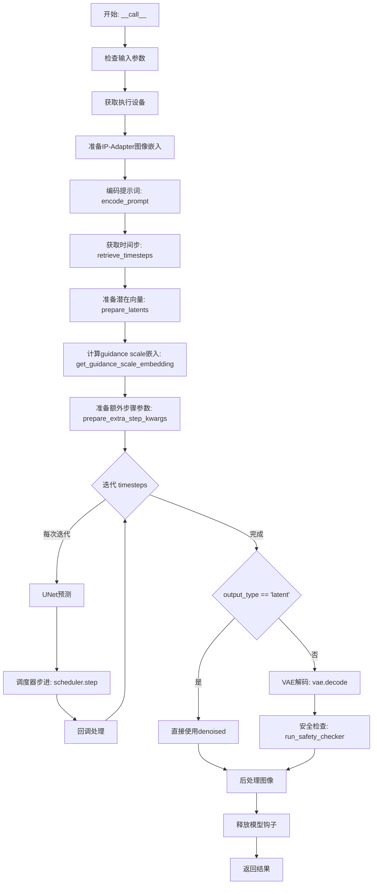
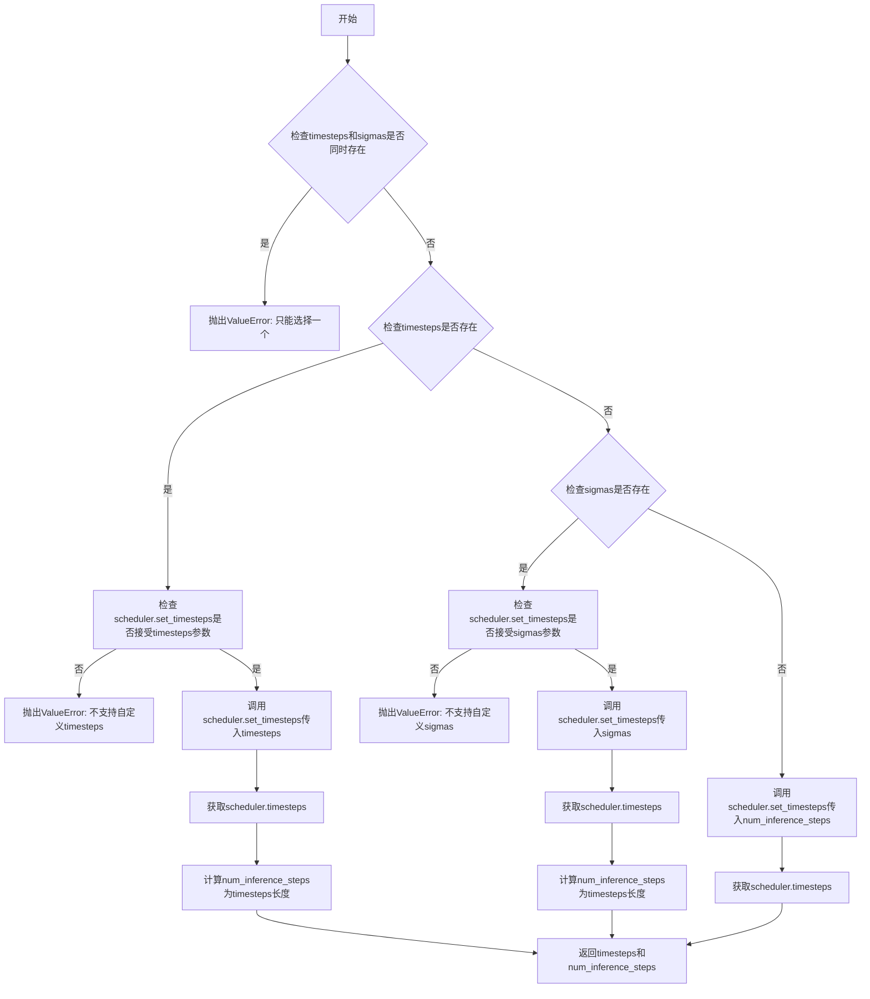
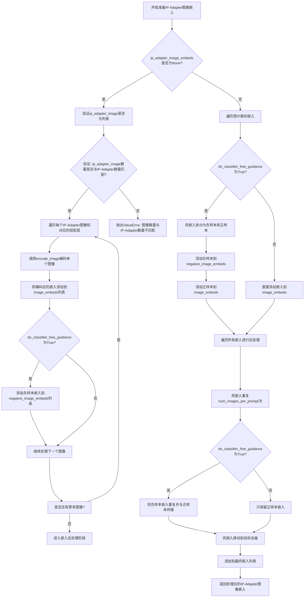
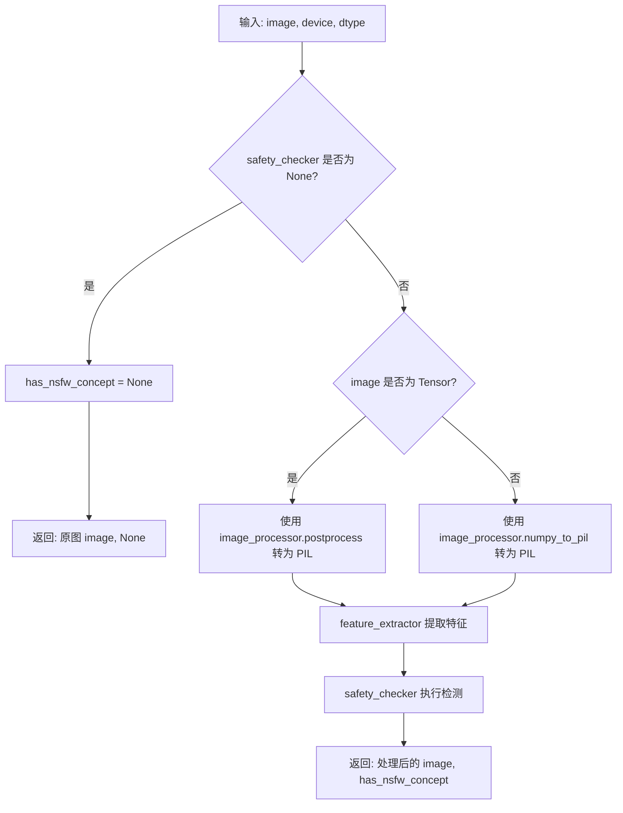
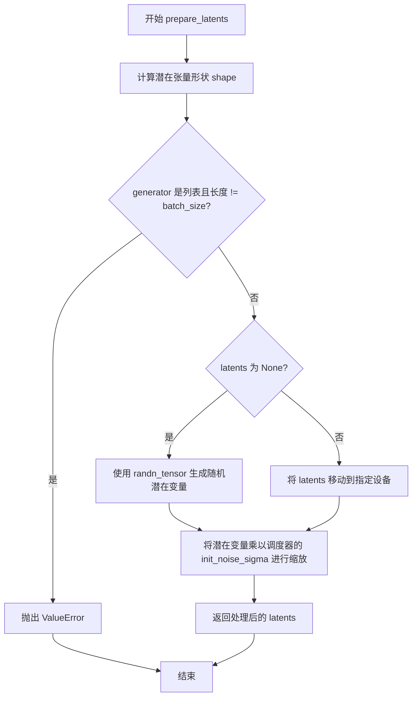
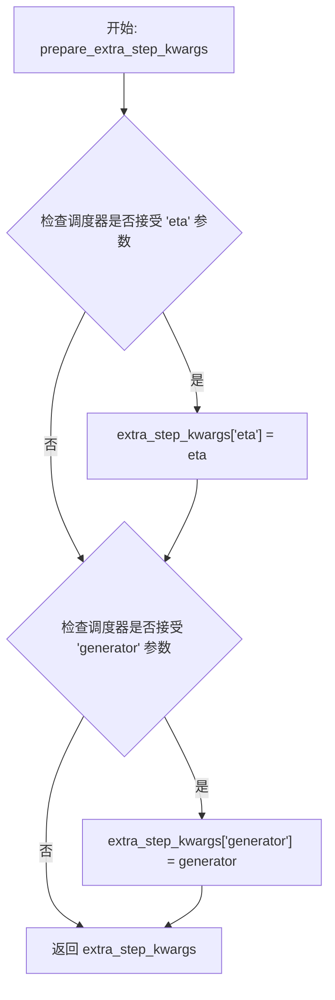
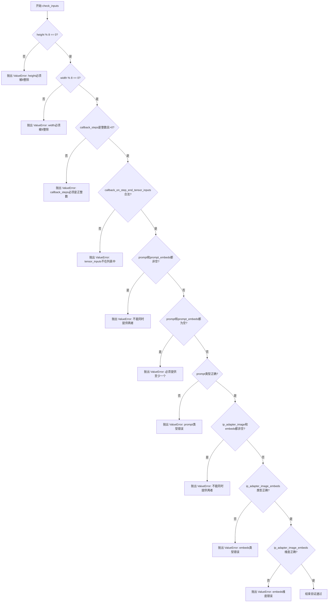
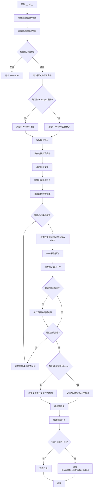

```mermaid
flowchart TD
    A[开始 encode_prompt] --> B{检查 lora_scale 是否存在}
    B -->|是| C[设置 self._lora_scale]
    B -->|否| D[跳过 LoRA 调整]
    C --> E{判断后端类型}
    E -->|非 PEFT| F[adjust_lora_scale_text_encoder]
    E -->|PEFT| G[scale_lora_layers]
    F --> H
    G --> H
    D --> H
    
    H{prompt_embeds<br/>是否为 None}
    H -->|是| I{处理 Textual Inversion<br/>如果需要}
    H -->|否| J[直接使用 prompt_embeds]
    I --> K[maybe_convert_prompt]
    K --> L[tokenizer 分词]
    L --> M{检查 attention_mask}
    M -->|需要| N[提取 attention_mask]
    M -->|不需要| O[设为 None]
    N --> P
    O --> P
    
    P{clip_skip<br/>是否为 None}
    P -->|是| Q[text_encoder 标准输出]
    P -->|否| R[text_encoder 输出隐藏层]
    Q --> S[取第 0 个元素]
    R --> T[取倒数第 clip_skip+1 层]
    T --> U[final_layer_norm 归一化]
    U --> V
    
    J --> V
    
    V{prompt_embeds<br/>dtype 转换} --> W[获取 dtype]
    W --> X[转换为目标 dtype 和 device]
    
    X --> Y[重复 embeddings 以匹配 num_images_per_prompt]
    
    Y --> Z{do_classifier_free_guidance<br/>且 negative_prompt_embeds<br/>为 None}
    Z -->|是| AA[处理 uncond_tokens]
    Z -->|否| HH[直接返回结果]
    
    AA{pnegative_prompt<br/>是否为 None}
    AA -->|是| AB[空字符串列表]
    AA -->|否| AC[使用传入的 negative_prompt]
    AB --> AD
    AC --> AD
    
    AD[处理 Textual Inversion] --> AE[tokenizer 负向提示]
    AE --> AF[获取 attention_mask]
    
    AF --> AG[text_encoder 编码负向]
    AG --> AH[提取第 0 个元素]
    
    AH --> AI{do_classifier_free_guidance}
    AI -->|是| AJ[重复负向 embeddings]
    AI -->|否| AK
    AJ --> AK
    
    AK{使用 PEFT<br/>且 LoRA} -->|是| AL[unscale_lora_layers]
    AK -->|否| AM
    AL --> AM
    AM --> HH
    
    HH[返回 prompt_embeds,<br/>negative_prompt_embeds] --> ZZ[结束]
```

# `diffusers\src\diffusers\pipelines\latent_consistency_models\pipeline_latent_consistency_text2img.py` 详细设计文档

A Latent Consistency Model (LCM) pipeline for fast text-to-image generation, supporting latent consistency distillation for inference in 1-8 steps. Inherits from Stable Diffusion pipeline components and supports LoRA, Textual Inversion, IP-Adapter, and single file loading.

## 整体流程



## 类结构

```
DiffusionPipeline (抽象基类)
├── StableDiffusionMixin
├── TextualInversionLoaderMixin
├── IPAdapterMixin
├── StableDiffusionLoraLoaderMixin
└── FromSingleFileMixin
    └── LatentConsistencyModelPipeline (主类)
```

## 全局变量及字段


### `logger`
    
模块级logger，用于记录日志信息。

类型：`logging.Logger`
    


### `EXAMPLE_DOC_STRING`
    
示例文档字符串，展示pipeline的使用方法。

类型：`str`
    


### `XLA_AVAILABLE`
    
指示PyTorch XLA是否可用于硬件加速。

类型：`bool`
    


### `retrieve_timesteps`
    
获取调度器的时间步，支持自定义时间步和sigmas。

类型：`function`
    


### `LatentConsistencyModelPipeline.model_cpu_offload_seq`
    
CPU卸载顺序配置

类型：`str`
    


### `LatentConsistencyModelPipeline._optional_components`
    
可选组件列表

类型：`list`
    


### `LatentConsistencyModelPipeline._exclude_from_cpu_offload`
    
排除卸载的组件

类型：`list`
    


### `LatentConsistencyModelPipeline._callback_tensor_inputs`
    
回调张量输入列表

类型：`list`
    


### `LatentConsistencyModelPipeline.vae`
    
VAE模型

类型：`AutoencoderKL`
    


### `LatentConsistencyModelPipeline.text_encoder`
    
文本编码器

类型：`CLIPTextModel`
    


### `LatentConsistencyModelPipeline.tokenizer`
    
分词器

类型：`CLIPTokenizer`
    


### `LatentConsistencyModelPipeline.unet`
    
UNet去噪模型

类型：`UNet2DConditionModel`
    


### `LatentConsistencyModelPipeline.scheduler`
    
调度器

类型：`LCMScheduler`
    


### `LatentConsistencyModelPipeline.safety_checker`
    
安全检查器

类型：`StableDiffusionSafetyChecker`
    


### `LatentConsistencyModelPipeline.feature_extractor`
    
特征提取器

类型：`CLIPImageProcessor`
    


### `LatentConsistencyModelPipeline.image_encoder`
    
图像编码器

类型：`CLIPVisionModelWithProjection`
    


### `LatentConsistencyModelPipeline.vae_scale_factor`
    
VAE缩放因子

类型：`int`
    


### `LatentConsistencyModelPipeline.image_processor`
    
图像处理器

类型：`VaeImageProcessor`
    


### `LatentConsistencyModelPipeline._guidance_scale`
    
引导尺度

类型：`float`
    


### `LatentConsistencyModelPipeline._clip_skip`
    
CLIP跳过的层数

类型：`int`
    


### `LatentConsistencyModelPipeline._cross_attention_kwargs`
    
交叉注意力参数

类型：`dict`
    


### `LatentConsistencyModelPipeline._num_timesteps`
    
时间步数

类型：`int`
    
    

## 全局函数及方法


### `retrieve_timesteps`

该函数是扩散管道中的时间步检索工具函数，负责调用调度器的 `set_timesteps` 方法并从调度器获取生成样本所需的时间步序列。支持自定义时间步（timesteps）或自定义sigmas，并验证调度器是否支持相应参数。

参数：

- `scheduler`：`SchedulerMixin`，要获取时间步的调度器对象
- `num_inference_steps`：`int | None`，使用预训练模型生成样本时的扩散步数，若使用此参数则 `timesteps` 必须为 `None`
- `device`：`str | torch.device | None`，时间步要移动到的设备，若为 `None` 则不移动
- `timesteps`：`list[int] | None`，自定义时间步，用于覆盖调度器的时间步间隔策略，若传递此参数则 `num_inference_steps` 和 `sigmas` 必须为 `None`
- `sigmas`：`list[float] | None`，自定义sigmas，用于覆盖调度器的时间步间隔策略，若传递此参数则 `num_inference_steps` 和 `timesteps` 必须为 `None`
- `**kwargs`：任意关键字参数，将传递给调度器的 `set_timesteps` 方法

返回值：`tuple[torch.Tensor, int]`，元组中第一个元素是调度器的时间步调度序列，第二个元素是推理步数

#### 流程图



#### 带注释源码

```python
def retrieve_timesteps(
    scheduler,
    num_inference_steps: int | None = None,
    device: str | torch.device | None = None,
    timesteps: list[int] | None = None,
    sigmas: list[float] | None = None,
    **kwargs,
):
    r"""
    Calls the scheduler's `set_timesteps` method and retrieves timesteps from the scheduler after the call. Handles
    custom timesteps. Any kwargs will be supplied to `scheduler.set_timesteps`.

    Args:
        scheduler (`SchedulerMixin`):
            The scheduler to get timesteps from.
        num_inference_steps (`int`):
            The number of diffusion steps used when generating samples with a pre-trained model. If used, `timesteps`
            must be `None`.
        device (`str` or `torch.device`, *optional*):
            The device to which the timesteps should be moved to. If `None`, the timesteps are not moved.
        timesteps (`list[int]`, *optional*):
            Custom timesteps used to override the timestep spacing strategy of the scheduler. If `timesteps` is passed,
            `num_inference_steps` and `sigmas` must be `None`.
        sigmas (`list[float]`, *optional*):
            Custom sigmas used to override the timestep spacing strategy of the scheduler. If `sigmas` is passed,
            `num_inference_steps` and `timesteps` must be `None`.

    Returns:
        `tuple[torch.Tensor, int]`: A tuple where the first element is the timestep schedule from the scheduler and the
        second element is the number of inference steps.
    """
    # 验证：不能同时指定timesteps和sigmas，只能选择其中一种自定义方式
    if timesteps is not None and sigmas is not None:
        raise ValueError("Only one of `timesteps` or `sigmas` can be passed. Please choose one to set custom values")
    
    # 分支1：处理自定义timesteps
    if timesteps is not None:
        # 使用inspect模块检查调度器的set_timesteps方法是否支持timesteps参数
        accepts_timesteps = "timesteps" in set(inspect.signature(scheduler.set_timesteps).parameters.keys())
        if not accepts_timesteps:
            raise ValueError(
                f"The current scheduler class {scheduler.__class__}'s `set_timesteps` does not support custom"
                f" timestep schedules. Please check whether you are using the correct scheduler."
            )
        # 调用调度器的set_timesteps方法，传入自定义timesteps
        scheduler.set_timesteps(timesteps=timesteps, device=device, **kwargs)
        # 从调度器获取设置后的timesteps
        timesteps = scheduler.timesteps
        # 计算推理步数
        num_inference_steps = len(timesteps)
    
    # 分支2：处理自定义sigmas
    elif sigmas is not None:
        # 检查调度器是否支持sigmas参数
        accept_sigmas = "sigmas" in set(inspect.signature(scheduler.set_timesteps).parameters.keys())
        if not accept_sigmas:
            raise ValueError(
                f"The current scheduler class {scheduler.__class__}'s `set_timesteps` does not support custom"
                f" sigmas schedules. Please check whether you are using the correct scheduler."
            )
        # 调用调度器的set_timesteps方法，传入自定义sigmas
        scheduler.set_timesteps(sigmas=sigmas, device=device, **kwargs)
        # 从调度器获取设置后的timesteps
        timesteps = scheduler.timesteps
        # 计算推理步数
        num_inference_steps = len(timesteps)
    
    # 分支3：使用默认方式，通过num_inference_steps设置timesteps
    else:
        scheduler.set_timesteps(num_inference_steps, device=device, **kwargs)
        timesteps = scheduler.timesteps
    
    # 返回timesteps序列和推理步数
    return timesteps, num_inference_steps
```


### `LatentConsistencyModelPipeline.__init__`

该方法是 `LatentConsistencyModelPipeline` 类的构造函数，负责初始化潜在一致性模型（Latent Consistency Model）流水线所需的所有核心组件，包括 VAE、文本编码器、分词器、UNet、调度器、安全检查器等，并进行必要的参数验证和模块注册。

参数：

- `vae`：`AutoencoderKL`，用于将图像编码和解码到潜表示空间的变分自编码器模型
- `text_encoder`：`CLIPTextModel`，冻结的文本编码器（clip-vit-large-patch14）
- `tokenizer`：`CLIPTokenizer`，用于对文本进行分词的 CLIP 分词器
- `unet`：`UNet2DConditionModel`，用于对编码后的图像潜变量进行去噪的 UNet2DConditionModel
- `scheduler`：`LCMScheduler`，与 `unet` 结合使用以去噪编码图像潜变量的调度器，目前仅支持 LCMScheduler
- `safety_checker`：`StableDiffusionSafetyChecker`，用于估计生成图像是否具有攻击性或有害的分类模块
- `feature_extractor`：`CLIPImageProcessor`，用于从生成的图像中提取特征的 CLIP 图像处理器
- `image_encoder`：`CLIPVisionModelWithProjection | None`，可选的图像编码器，用于 IP-Adapter 功能
- `requires_safety_checker`：`bool`，是否需要安全检查器组件，默认为 True

返回值：`None`，构造函数不返回值

#### 流程图

```mermaid
flowchart TD
    A[开始 __init__] --> B[调用 super().__init__]
    B --> C{检查 safety_checker 为 None<br/>但 requires_safety_checker 为 True?}
    C -->|是| D[记录警告日志]
    C -->|否| E{检查 safety_checker 不为 None<br/>但 feature_extractor 为 None?}
    D --> E
    E -->|是| F[抛出 ValueError 异常]
    E -->|否| G[调用 self.register_modules 注册所有模块]
    G --> H[计算 vae_scale_factor<br/>2^(len(vae.config.block_out_channels) - 1)]
    H --> I[创建 VaeImageProcessor 实例]
    I --> J[调用 self.register_to_config<br/>注册 requires_safety_checker 配置]
    J --> K[结束 __init__]
```

#### 带注释源码

```python
def __init__(
    self,
    vae: AutoencoderKL,
    text_encoder: CLIPTextModel,
    tokenizer: CLIPTokenizer,
    unet: UNet2DConditionModel,
    scheduler: LCMScheduler,
    safety_checker: StableDiffusionSafetyChecker,
    feature_extractor: CLIPImageProcessor,
    image_encoder: CLIPVisionModelWithProjection | None = None,
    requires_safety_checker: bool = True,
):
    """
    初始化 LatentConsistencyModelPipeline 流水线。
    
    参数:
        vae: 变分自编码器模型，用于图像与潜表示之间的编码和解码
        text_encoder: CLIP文本编码器，用于将文本提示编码为向量表示
        tokenizer: CLIP分词器，用于将文本分词为token
        unet: 条件UNet模型，用于根据文本条件去噪图像潜变量
        scheduler: LCM调度器，用于控制去噪过程的 timestep 调度
        safety_checker: 安全检查器，用于过滤有害内容
        feature_extractor: CLIP图像处理器，用于提取图像特征
        image_encoder: 可选的CLIP视觉模型，用于IP-Adapter功能
        requires_safety_checker: 是否启用安全检查器，默认为True
    """
    # 调用父类 DiffusionPipeline 的初始化方法
    # 这会设置基本的 pipeline 配置和设备管理
    super().__init__()

    # 检查：如果用户要求启用安全检查器但传入了 None
    # 则发出警告，提醒用户遵守 Stable Diffusion 许可证
    if safety_checker is None and requires_safety_checker:
        logger.warning(
            f"You have disabled the safety checker for {self.__class__} by passing `safety_checker=None`. Ensure"
            " that you abide to the conditions of the Stable Diffusion license and do not expose unfiltered"
            " results in services or applications open to the public. Both the diffusers team and Hugging Face"
            " strongly recommend to keep the safety filter enabled in all public facing circumstances, disabling"
            " it only for use-cases that involve analyzing network behavior or auditing its results. For more"
            " information, please have a look at https://github.com/huggingface/diffusers/pull/254 ."
        )

    # 检查：如果传入了安全检查器但没有特征提取器
    # 安全检查器需要特征提取器来处理输入图像
    if safety_checker is not None and feature_extractor is None:
        raise ValueError(
            "Make sure to define a feature extractor when loading {self.__class__} if you want to use the safety"
            " checker. If you do not want to use the safety checker, you can pass `'safety_checker=None'` instead."
        )

    # 注册所有模块到 pipeline 中
    # 这使得每个组件都可以通过 self.component_name 访问
    # 同时支持模块的保存/加载功能
    self.register_modules(
        vae=vae,
        text_encoder=text_encoder,
        tokenizer=tokenizer,
        unet=unet,
        scheduler=scheduler,
        safety_checker=safety_checker,
        feature_extractor=feature_extractor,
        image_encoder=image_encoder,
    )
    
    # 计算 VAE 缩放因子
    # VAE 的缩放因子取决于其 block_out_channels 的数量
    # 公式: 2^(num_blocks - 1)，典型值为 8 (2^(4-1) = 8)
    # 这用于将像素空间坐标转换为潜空间坐标
    self.vae_scale_factor = 2 ** (len(self.vae.config.block_out_channels) - 1) if getattr(self, "vae", None) else 8
    
    # 创建图像处理器，用于前处理和后处理图像
    # VaeImageProcessor 负责处理 VAE 的缩放和归一化
    self.image_processor = VaeImageProcessor(vae_scale_factor=self.vae_scale_factor)
    
    # 将 requires_safety_checker 注册到配置中
    # 这样在保存和加载 pipeline 时会保留此设置
    self.register_to_config(requires_safety_checker=requires_safety_checker)
```


### `LatentConsistencyModelPipeline.encode_prompt`

该方法负责将文本提示（prompt）编码为文本编码器（CLIP Text Encoder）的隐藏状态向量（embeddings），支持 LoRA 权重调整、文本反转（Textual Inversion）嵌入、跳过 CLIP 部分层（clip_skip）以及无分类器自由引导（CFG）的负向提示编码。最终返回正向提示 embeddings 和负向提示 embeddings（元组形式），供后续扩散模型的去噪过程使用。

参数：

- `prompt`：`str | list[str] | None`，要编码的文本提示，可以是单个字符串或字符串列表
- `device`：`torch.device`，PyTorch 设备，用于将数据移动到指定设备
- `num_images_per_prompt`：`int`，每个提示生成的图像数量，用于批量生成时复制 embeddings
- `do_classifier_free_guidance`：`bool`，是否启用无分类器自由引导（CFG）
- `negative_prompt`：`str | list[str] | None`，不希望出现的负向提示，用于引导图像生成方向
- `prompt_embeds`：`torch.Tensor | None`，预生成的正向提示 embeddings，若提供则直接使用
- `negative_prompt_embeds`：`torch.Tensor | None`，预生成的负向提示 embeddings，若提供则直接使用
- `lora_scale`：`float | None`，LoRA 缩放因子，用于调整 LoRA 层的影响强度
- `clip_skip`：`int | None`，从 CLIP 编码器末尾跳过的层数，用于获取不同层次的特征表示

返回值：`tuple[torch.Tensor, torch.Tensor]`，返回两个张量——第一个是正向提示 embeddings，第二个是负向提示 embeddings，两者形状均为 `(batch_size * num_images_per_prompt, seq_len, hidden_dim)`

#### 流程图



#### 带注释源码

```python
def encode_prompt(
    self,
    prompt,
    device,
    num_images_per_prompt,
    do_classifier_free_guidance,
    negative_prompt=None,
    prompt_embeds: torch.Tensor | None = None,
    negative_prompt_embeds: torch.Tensor | None = None,
    lora_scale: float | None = None,
    clip_skip: int | None = None,
):
    r"""
    Encodes the prompt into text encoder hidden states.

    Args:
        prompt (`str` or `list[str]`, *optional*):
            prompt to be encoded
        device: (`torch.device`):
            torch device
        num_images_per_prompt (`int`):
            number of images that should be generated per prompt
        do_classifier_free_guidance (`bool`):
            whether to use classifier free guidance or not
        negative_prompt (`str` or `list[str]`, *optional*):
            The prompt or prompts not to guide the image generation. If not defined, one has to pass
            `negative_prompt_embeds` instead. Ignored when not using guidance (i.e., ignored if `guidance_scale` is
            less than `1`).
        prompt_embeds (`torch.Tensor`, *optional*):
            Pre-generated text embeddings. Can be used to easily tweak text inputs, *e.g.* prompt weighting. If not
            provided, text embeddings will be generated from `prompt` input argument.
        negative_prompt_embeds (`torch.Tensor`, *optional*):
            Pre-generated negative text embeddings. Can be used to easily tweak text inputs, *e.g.* prompt
            weighting. If not provided, negative_prompt_embeds will be generated from `negative_prompt` input
            argument.
        lora_scale (`float`, *optional*):
            A LoRA scale that will be applied to all LoRA layers of the text encoder if LoRA layers are loaded.
        clip_skip (`int`, *optional*):
            Number of layers to be skipped from CLIP while computing the prompt embeddings. A value of 1 means that
            the output of the pre-final layer will be used for computing the prompt embeddings.
    """
    # 如果提供了 lora_scale 且当前管线支持 LoRA 加载，则设置 LoRA 缩放因子
    # 这使得文本编码器的 monkey patched LoRA 函数可以正确访问它
    if lora_scale is not None and isinstance(self, StableDiffusionLoraLoaderMixin):
        self._lora_scale = lora_scale

        # 动态调整 LoRA 缩放因子
        if not USE_PEFT_BACKEND:
            # 使用旧版 LoRA 后端时的调整方法
            adjust_lora_scale_text_encoder(self.text_encoder, lora_scale)
        else:
            # 使用 PEFT 后端时的缩放方法
            scale_lora_layers(self.text_encoder, lora_scale)

    # 确定 batch_size：根据 prompt 的类型（字符串、列表）或已提供的 prompt_embeds
    if prompt is not None and isinstance(prompt, str):
        batch_size = 1
    elif prompt is not None and isinstance(prompt, list):
        batch_size = len(prompt)
    else:
        batch_size = prompt_embeds.shape[0]

    # 如果未提供 prompt_embeds，则从 prompt 生成
    if prompt_embeds is None:
        # 文本反转处理：如果支持 Textual Inversion，则转换多向量 token
        if isinstance(self, TextualInversionLoaderMixin):
            prompt = self.maybe_convert_prompt(prompt, self.tokenizer)

        # 使用 tokenizer 将文本转换为 token IDs
        text_inputs = self.tokenizer(
            prompt,
            padding="max_length",  # 填充到最大长度
            max_length=self.tokenizer.model_max_length,  # 模型支持的最大长度
            truncation=True,  # 截断超长序列
            return_tensors="pt",  # 返回 PyTorch 张量
        )
        text_input_ids = text_inputs.input_ids  # 获取 token IDs
        # 同时获取未截断的版本用于检测截断
        untruncated_ids = self.tokenizer(prompt, padding="longest", return_tensors="pt").input_ids

        # 检测是否发生了截断，如果是则记录警告信息
        if untruncated_ids.shape[-1] >= text_input_ids.shape[-1] and not torch.equal(
            text_input_ids, untruncated_ids
        ):
            removed_text = self.tokenizer.batch_decode(
                untruncated_ids[:, self.tokenizer.model_max_length - 1 : -1]
            )
            logger.warning(
                "The following part of your input was truncated because CLIP can only handle sequences up to"
                f" {self.tokenizer.model_max_length} tokens: {removed_text}"
            )

        # 检查文本编码器是否配置了 attention_mask 支持
        if hasattr(self.text_encoder.config, "use_attention_mask") and self.text_encoder.config.use_attention_mask:
            attention_mask = text_inputs.attention_mask.to(device)
        else:
            attention_mask = None

        # 根据 clip_skip 参数决定如何获取 embeddings
        if clip_skip is None:
            # 标准方式：直接获取最后一层的输出
            prompt_embeds = self.text_encoder(text_input_ids.to(device), attention_mask=attention_mask)
            prompt_embeds = prompt_embeds[0]  # 取隐藏状态而非 pooler 输出
        else:
            # 跳过最后 clip_skip 层：获取指定层的隐藏状态
            prompt_embeds = self.text_encoder(
                text_input_ids.to(device), attention_mask=attention_mask, output_hidden_states=True
            )
            # hidden_states 是一个元组，包含所有编码器层的输出
            # 索引到所需的层（倒数第 clip_skip+1 层）
            prompt_embeds = prompt_embeds[-1][-(clip_skip + 1)]
            # 应用最终的 LayerNorm 以确保表示正确
            prompt_embeds = self.text_encoder.text_model.final_layer_norm(prompt_embeds)

    # 确定 prompt_embeds 的数据类型：优先使用文本编码器的 dtype，其次使用 UNet 的 dtype
    if self.text_encoder is not None:
        prompt_embeds_dtype = self.text_encoder.dtype
    elif self.unet is not None:
        prompt_embeds_dtype = self.unet.dtype
    else:
        prompt_embeds_dtype = prompt_embeds.dtype

    # 将 prompt_embeds 转换到目标设备和 dtype
    prompt_embeds = prompt_embeds.to(dtype=prompt_embeds_dtype, device=device)

    # 获取 embeddings 的形状信息
    bs_embed, seq_len, _ = prompt_embeds.shape
    # 为每个 prompt 复制多个 embeddings（对应 num_images_per_prompt）
    # 使用 MPS 友好的方法进行复制
    prompt_embeds = prompt_embeds.repeat(1, num_images_per_prompt, 1)
    prompt_embeds = prompt_embeds.view(bs_embed * num_images_per_prompt, seq_len, -1)

    # 如果启用 CFG 且未提供负向 embeddings，则生成负向 embeddings
    if do_classifier_free_guidance and negative_prompt_embeds is None:
        # 处理 uncond_tokens：根据 negative_prompt 类型构建列表
        uncond_tokens: list[str]
        if negative_prompt is None:
            # 默认使用空字符串
            uncond_tokens = [""] * batch_size
        elif prompt is not None and type(prompt) is not type(negative_prompt):
            # 类型不匹配时抛出错误
            raise TypeError(
                f"`negative_prompt` should be the same type to `prompt`, but got {type(negative_prompt)} !="
                f" {type(prompt)}."
            )
        elif isinstance(negative_prompt, str):
            # 字符串类型：包装为列表
            uncond_tokens = [negative_prompt]
        elif batch_size != len(negative_prompt):
            # batch 大小不匹配时抛出错误
            raise ValueError(
                f"`negative_prompt`: {negative_prompt} has batch size {len(negative_prompt)}, but `prompt`:"
                f" {prompt} has batch size {batch_size}. Please make sure that passed `negative_prompt` matches"
                " the batch size of `prompt`."
            )
        else:
            uncond_tokens = negative_prompt

        # 文本反转处理
        if isinstance(self, TextualInversionLoaderMixin):
            uncond_tokens = self.maybe_convert_prompt(uncond_tokens, self.tokenizer)

        # 确定序列长度（与 prompt_embeds 相同）
        max_length = prompt_embeds.shape[1]
        # tokenize 负向提示
        uncond_input = self.tokenizer(
            uncond_tokens,
            padding="max_length",
            max_length=max_length,
            truncation=True,
            return_tensors="pt",
        )

        # 处理 attention_mask
        if hasattr(self.text_encoder.config, "use_attention_mask") and self.text_encoder.config.use_attention_mask:
            attention_mask = uncond_input.attention_mask.to(device)
        else:
            attention_mask = None

        # 编码负向提示
        negative_prompt_embeds = self.text_encoder(
            uncond_input.input_ids.to(device),
            attention_mask=attention_mask,
        )
        negative_prompt_embeds = negative_prompt_embeds[0]

    # 如果启用 CFG，复制负向 embeddings 以匹配批量大小
    if do_classifier_free_guidance:
        seq_len = negative_prompt_embeds.shape[1]

        # 转换 dtype 和 device
        negative_prompt_embeds = negative_prompt_embeds.to(dtype=prompt_embeds_dtype, device=device)

        # 复制 embeddings
        negative_prompt_embeds = negative_prompt_embeds.repeat(1, num_images_per_prompt, 1)
        negative_prompt_embeds = negative_prompt_embeds.view(batch_size * num_images_per_prompt, seq_len, -1)

    # 如果使用了 LoRA 且是 PEFT 后端，则恢复原始的 LoRA 缩放因子
    if self.text_encoder is not None:
        if isinstance(self, StableDiffusionLoraLoaderMixin) and USE_PEFT_BACKEND:
            # 通过取消缩放 LoRA 层来恢复原始 scale
            unscale_lora_layers(self.text_encoder, lora_scale)

    # 返回正向和负向 prompt embeddings
    return prompt_embeds, negative_prompt_embeds
```


### `LatentConsistencyModelPipeline.encode_image`

该方法用于将输入图像编码为图像嵌入向量或隐藏状态表示，支持分类器自由引导（Classifier-Free Guidance），返回条件图像嵌入和无条件（零）图像嵌入，用于后续的图像生成过程。

参数：

- `image`：`torch.Tensor | PIL.Image.Image | np.ndarray`，要编码的输入图像，支持张量、PIL图像或numpy数组格式
- `device`：`torch.device`，图像编码所使用的目标设备
- `num_images_per_prompt`：`int`，每个提示词生成的图像数量，用于对嵌入进行重复以匹配批量大小
- `output_hidden_states`：`bool | None`，可选参数，指定是否返回图像编码器的隐藏状态而非图像嵌入

返回值：`tuple[torch.Tensor, torch.Tensor]`，返回两个张量组成的元组：第一个是条件图像嵌入（或隐藏状态），第二个是对应的无条件（零）图像嵌入（或隐藏状态）

#### 流程图

```mermaid
flowchart TD
    A[开始 encode_image] --> B[获取 image_encoder 的数据类型]
    B --> C{image 是否为 torch.Tensor?}
    C -->|否| D[使用 feature_extractor 提取图像特征并转换为张量]
    C -->|是| E[直接将图像移到指定设备和 dtype]
    D --> E
    E --> F{output_hidden_states 是否为 True?}
    F -->|是| G[调用 image_encoder 获取隐藏状态]
    G --> H[取倒数第二层隐藏状态 hidden_states[-2]]
    H --> I[使用 repeat_interleave 扩展条件嵌入]
    I --> J[创建零张量并获取无条件隐藏状态]
    J --> K[返回条件隐藏状态和无条件隐藏状态]
    F -->|否| L[调用 image_encoder 获取图像嵌入 image_embeds]
    L --> M[使用 repeat_interleave 扩展条件嵌入]
    M --> N[创建与条件嵌入形状相同的零张量作为无条件嵌入]
    N --> O[返回条件嵌入和无条件嵌入]
    K --> Z[结束]
    O --> Z
```

#### 带注释源码

```python
def encode_image(self, image, device, num_images_per_prompt, output_hidden_states=None):
    # 获取图像编码器的参数数据类型，用于后续张量转换
    dtype = next(self.image_encoder.parameters()).dtype

    # 如果输入图像不是 PyTorch 张量，则使用特征提取器将其转换为张量
    # feature_extractor 会将 PIL 图像或 numpy 数组转换为 pixel_values 张量
    if not isinstance(image, torch.Tensor):
        image = self.feature_extractor(image, return_tensors="pt").pixel_values

    # 将图像张量移动到指定设备并转换为正确的 dtype
    image = image.to(device=device, dtype=dtype)

    # 根据 output_hidden_states 参数决定输出类型
    if output_hidden_states:
        # 路径1：返回隐藏状态（用于 IP-Adapter 等高级功能）
        
        # 通过图像编码器获取隐藏状态，output_hidden_states=True 启用隐藏状态输出
        image_enc_hidden_states = self.image_encoder(image, output_hidden_states=True).hidden_states[-2]
        
        # 重复嵌入以匹配每个提示词生成的图像数量
        # repeat_interleave 在 batch 维度上重复，num_images_per_prompt 次
        image_enc_hidden_states = image_enc_hidden_states.repeat_interleave(num_images_per_prompt, dim=0)
        
        # 创建与输入图像形状相同的零张量，用于无条件图像编码
        # 这在分类器自由引导中用于实现无条件生成
        uncond_image_enc_hidden_states = self.image_encoder(
            torch.zeros_like(image), output_hidden_states=True
        ).hidden_states[-2]
        
        # 同样对无条件嵌入进行重复扩展
        uncond_image_enc_hidden_states = uncond_image_enc_hidden_states.repeat_interleave(
            num_images_per_prompt, dim=0
        )
        
        # 返回条件和无条件隐藏状态元组
        return image_enc_hidden_states, uncond_image_enc_hidden_states
    else:
        # 路径2：返回图像嵌入（默认行为）
        
        # 通过图像编码器获取图像嵌入向量（image_embeds）
        image_embeds = self.image_encoder(image).image_embeds
        
        # 重复条件嵌入以匹配批量大小
        image_embeds = image_embeds.repeat_interleave(num_images_per_prompt, dim=0)
        
        # 创建零张量作为无条件图像嵌入，用于分类器自由引导
        uncond_image_embeds = torch.zeros_like(image_embeds)
        
        # 返回条件和无条件图像嵌入元组
        return image_embeds, uncond_image_embeds
```


### `LatentConsistencyModelPipeline.prepare_ip_adapter_image_embeds`

该方法用于为 IP-Adapter（图像提示适配器）准备图像嵌入。它处理两种情况：当图像嵌入已预先计算时（通过 `ip_adapter_image_embeds` 参数），以及需要从原始图像编码时（通过 `ip_adapter_image` 参数）。该方法还处理无分类器自由引导（CFG），通过准备负样本图像嵌入来支持 CFG 模式。

参数：

- `self`：`LatentConsistencyModelPipeline`，管道实例本身
- `ip_adapter_image`：`PipelineImageInput | None`，IP-Adapter 的输入图像，可以是单个图像或图像列表
- `ip_adapter_image_embeds`：`list[torch.Tensor] | None`，预先计算的图像嵌入，可选参数
- `device`：`str | torch.device`，用于运行计算的设备
- `num_images_per_prompt`：`int`，每个提示生成的图像数量
- `do_classifier_free_guidance`：`bool`，是否使用无分类器自由引导

返回值：`list[torch.Tensor]`，处理后的 IP-Adapter 图像嵌入列表，可以直接传递给模型

#### 流程图



#### 带注释源码

```python
def prepare_ip_adapter_image_embeds(
    self, 
    ip_adapter_image,  # PipelineImageInput | None: 输入的IP-Adapter图像
    ip_adapter_image_embeds,  # list[torch.Tensor] | None: 预计算的图像嵌入
    device,  # str | torch.device: 计算设备
    num_images_per_prompt,  # int: 每个提示生成的图像数量
    do_classifier_free_guidance  # bool: 是否使用无分类器自由引导
):
    """
    准备IP-Adapter图像嵌入，处理图像编码、嵌入复制和CFG支持。
    
    该方法有两种工作模式：
    1. 当ip_adapter_image_embeds为None时：从ip_adapter_image编码生成嵌入
    2. 当ip_adapter_image_embeds不为None时：直接使用预计算的嵌入
    
    当启用CFG时，会为每个图像生成正负两种嵌入，并在后续与文本嵌入concat使用。
    """
    
    # 初始化图像嵌入列表，用于存储处理后的嵌入
    image_embeds = []
    
    # 如果启用CFG，需要准备负样本图像嵌入
    if do_classifier_free_guidance:
        negative_image_embeds = []
    
    # 情况1：需要从图像编码生成嵌入
    if ip_adapter_image_embeds is None:
        # 确保ip_adapter_image是列表格式（单个图像转为列表）
        if not isinstance(ip_adapter_image, list):
            ip_adapter_image = [ip_adapter_image]
        
        # 验证：IP-Adapter图像数量必须与投影层数量匹配
        # 每个IP-Adapter有独立的image_projection_layer
        if len(ip_adapter_image) != len(self.unet.encoder_hid_proj.image_projection_layers):
            raise ValueError(
                f"`ip_adapter_image` must have same length as the number of IP Adapters. "
                f"Got {len(ip_adapter_image)} images and {len(self.unet.encoder_hid_proj.image_projection_layers)} IP Adapters."
            )
        
        # 遍历每个IP-Adapter图像和对应的图像投影层
        for single_ip_adapter_image, image_proj_layer in zip(
            ip_adapter_image, self.unet.encoder_hid_proj.image_projection_layers
        ):
            # 判断是否需要输出隐藏状态（ImageProjection类不需要）
            output_hidden_state = not isinstance(image_proj_layer, ImageProjection)
            
            # 调用encode_image方法编码单个图像
            # 返回正样本嵌入和（如果启用CFG）负样本嵌入
            single_image_embeds, single_negative_image_embeds = self.encode_image(
                single_ip_adapter_image, device, 1, output_hidden_state
            )
            
            # 将嵌入添加到列表（添加批次维度）
            image_embeds.append(single_image_embeds[None, :])
            
            # 如果启用CFG，同时保存负样本嵌入
            if do_classifier_free_guidance:
                negative_image_embeds.append(single_negative_image_embeds[None, :])
    
    # 情况2：使用预计算的嵌入
    else:
        # 遍历预计算的嵌入列表
        for single_image_embeds in ip_adapter_image_embeds:
            # 如果启用CFG，需要拆分正负样本
            # 假设预计算嵌入的格式为: [neg_embeds, pos_embeds] 在维度0上拼接
            if do_classifier_free_guidance:
                single_negative_image_embeds, single_image_embeds = single_image_embeds.chunk(2)
                negative_image_embeds.append(single_negative_image_embeds)
            
            # 将处理后的嵌入添加到列表
            image_embeds.append(single_image_embeds)
    
    # 后处理：对每个嵌入进行复制和设备转移
    ip_adapter_image_embeds = []
    for i, single_image_embeds in enumerate(image_embeds):
        # 复制嵌入以匹配每个提示生成的图像数量
        single_image_embeds = torch.cat([single_image_embeds] * num_images_per_prompt, dim=0)
        
        # 如果启用CFG，需要处理负样本嵌入
        if do_classifier_free_guidance:
            # 同样复制负样本嵌入
            single_negative_image_embeds = torch.cat([negative_image_embeds[i]] * num_images_per_prompt, dim=0)
            # 将负样本和正样本在批次维度拼接
            # 拼接后的格式: [batch_size*2, seq_len, embed_dim]
            # 前半部分为负样本（无条件），后半部分为正样本（条件）
            single_image_embeds = torch.cat([single_negative_image_embeds, single_image_embeds], dim=0)
        
        # 将嵌入转移到目标设备
        single_image_embeds = single_image_embeds.to(device=device)
        
        # 添加到最终输出列表
        ip_adapter_image_embeds.append(single_image_embeds)
    
    # 返回处理后的嵌入列表
    return ip_adapter_image_embeds
```


### `LatentConsistencyModelPipeline.run_safety_checker`

该方法负责对生成图像进行安全检查（NSFW 检测）。如果管道配置了安全检查器，它会将图像转换为适合 CLIP 特征提取器的格式，调用安全检查器进行推理，并返回可能被修改的图像以及检测标志；如果未配置安全检查器，则直接传递原始图像。

参数：

- `self`：`LatentConsistencyModelPipeline` 类实例，隐式参数。
- `image`：`torch.Tensor | List[torch.Tensor]`，来自 VAE 解码器的图像张量（通常为浮点数张量）。
- `device`：`torch.device`，执行安全检查的设备（如 'cuda'）。
- `dtype`：`torch.dtype`，用于 CLIP 特征提取的数据类型（如 `torch.float16`）。

返回值：`tuple[torch.Tensor | None, torch.Tensor | None]`，返回一个元组。第一个元素是处理后的图像（如果检测到不安全内容可能会被模糊处理），第二个元素是布尔类型的张量，表示是否检测到 NSFW 内容（若未启用检查器则为 `None`）。

#### 流程图



#### 带注释源码

```python
def run_safety_checker(self, image, device, dtype):
    # 检查管道是否初始化了安全检查器
    if self.safety_checker is None:
        # 如果没有安全检查器，设置检测标志为 None
        has_nsfw_concept = None
    else:
        # 如果有安全检查器，首先需要将图像转换为适合特征提取器的格式
        if torch.is_tensor(image):
            # 将张量格式的图像后处理为 PIL 图像列表
            feature_extractor_input = self.image_processor.postprocess(image, output_type="pil")
        else:
            # 如果是 numpy 数组，转换为 PIL 图像
            feature_extractor_input = self.image_processor.numpy_to_pil(image)
        
        # 使用特征提取器提取 CLIP 特征，并移动到指定设备
        safety_checker_input = self.feature_extractor(feature_extractor_input, return_tensors="pt").to(device)
        
        # 调用安全检查器模型
        # 注意：safety_checker 可能会修改图像（例如对违规内容进行模糊处理）
        image, has_nsfw_concept = self.safety_checker(
            images=image, 
            clip_input=safety_checker_input.pixel_values.to(dtype)
        )
    
    # 返回图像（可能被修改）和 NSFW 检测结果
    return image, has_nsfw_concept
```


### `LatentConsistencyModelPipeline.prepare_latents`

该方法负责为潜在一致性模型（LCM）生成或准备初始潜在变量。它根据指定的批次大小、图像尺寸和通道数构建潜在张量形状，验证随机生成器与批次大小的一致性，如果未提供潜在变量则使用随机张量生成噪声，最后根据调度器的初始噪声标准差对潜在变量进行缩放。

参数：

- `self`：`LatentConsistencyModelPipeline` 类实例，Pipeline对象本身
- `batch_size`：`int`，生成的图像批次大小
- `num_channels_latents`：`int`，潜在空间的通道数，通常对应于 UNet 的输入通道数
- `height`：`int`，目标图像的高度（像素）
- `width`：`int`，目标图像的宽度（像素）
- `dtype`：`torch.dtype`，潜在张量的数据类型（如 torch.float32）
- `device`：`torch.device`，潜在张量所在的设备（如 'cuda' 或 'cpu'）
- `generator`：`torch.Generator` 或 `list[torch.Generator]`，可选的随机数生成器，用于确保可重现的采样
- `latents`：`torch.Tensor | None`，可选的预生成潜在变量，如果为 None 则随机生成

返回值：`torch.Tensor`，处理后的潜在变量张量，形状为 (batch_size, num_channels_latents, height // vae_scale_factor, width // vae_scale_factor)

#### 流程图



#### 带注释源码

```python
def prepare_latents(
    self,
    batch_size: int,
    num_channels_latents: int,
    height: int,
    width: int,
    dtype: torch.dtype,
    device: torch.device,
    generator: torch.Generator | list[torch.Generator] | None,
    latents: torch.Tensor | None = None,
) -> torch.Tensor:
    """
    为扩散模型准备初始潜在变量。

    该方法根据图像尺寸和VAE缩放因子计算潜在空间的形状，
    并生成或处理潜在张量用于后续的去噪过程。

    参数:
        batch_size: 生成的图像批次大小
        num_channels_latents: UNet的输入通道数，决定潜在空间的维度
        height: 目标图像的高度（像素）
        width: 目标图像的宽度（像素）
        dtype: 潜在张量的数据类型
        device: 潜在张量应放置的设备
        generator: 可选的随机生成器，用于可重现的采样
        latents: 可选的预生成潜在变量，如果为None则随机生成

    返回:
        处理后的潜在变量张量，已根据调度器要求进行缩放
    """
    # 计算潜在张量的形状：批次大小、通道数、调整后的高度和宽度
    # 注意：潜在空间的尺寸是原图尺寸除以VAE缩放因子（通常是8）
    shape = (
        batch_size,
        num_channels_latents,
        int(height) // self.vae_scale_factor,
        int(width) // self.vae_scale_factor,
    )

    # 验证：如果传入多个生成器，其数量必须与批次大小匹配
    if isinstance(generator, list) and len(generator) != batch_size:
        raise ValueError(
            f"You have passed a list of generators of length {len(generator)}, but requested an effective batch"
            f" size of {batch_size}. Make sure the batch size matches the length of the generators."
        )

    # 如果没有提供潜在变量，则使用随机张量生成初始噪声
    if latents is None:
        latents = randn_tensor(shape, generator=generator, device=device, dtype=dtype)
    else:
        # 如果提供了潜在变量，确保它位于正确的设备上
        latents = latents.to(device)

    # 根据调度器的初始噪声标准差对潜在变量进行缩放
    # 这是扩散模型采样的关键步骤，确保噪声水平与调度器期望一致
    latents = latents * self.scheduler.init_noise_sigma
    return latents
```


### `LatentConsistencyModelPipeline.get_guidance_scale_embedding`

该函数用于将指导比例（guidance scale）转换为高维嵌入向量，基于正弦和余弦函数的周期性特征编码，使模型能够根据不同的指导强度调整生成过程。

参数：

- `self`：`LatentConsistencyModelPipeline`，Pipeline 实例本身
- `w`：`torch.Tensor`，一维张量，需要生成嵌入向量的指导比例值
- `embedding_dim`：`int`，可选，默认值为 512，嵌入向量的维度
- `dtype`：`torch.dtype`，可选，默认值为 `torch.float32`，生成嵌入的数据类型

返回值：`torch.Tensor`，形状为 `(len(w), embedding_dim)` 的嵌入向量

#### 流程图

```mermaid
flowchart TD
    A[开始] --> B[断言 w 为一维张量]
    B --> C[w 乘以 1000.0 进行缩放]
    C --> D[计算半维度 half_dim = embedding_dim // 2]
    D --> E[计算对数基础 emb = log(10000.0) / (half_dim - 1)]
    E --> F[生成指数权重 emb = exp(arange(half_dim) * -emb)]
    F --> G[计算输入与权重的乘积 emb = w[:, None] * emb[None, :]]
    G --> H[拼接正弦和余弦 emb = concat([sin(emb), cos(emb)], dim=1)]
    H --> I{embedding_dim 是否为奇数?}
    I -->|是| J[零填充 emb = pad(emb, (0, 1))]
    I -->|否| K[跳过填充]
    J --> L[断言输出形状正确 (w.shape[0], embedding_dim)]
    K --> L
    L --> M[返回嵌入向量]
```

#### 带注释源码

```python
def get_guidance_scale_embedding(
    self, w: torch.Tensor, embedding_dim: int = 512, dtype: torch.dtype = torch.float32
) -> torch.Tensor:
    """
    See https://github.com/google-research/vdm/blob/dc27b98a554f65cdc654b800da5aa1846545d41b/model_vdm.py#L298

    Args:
        w (`torch.Tensor`):
            Generate embedding vectors with a specified guidance scale to subsequently enrich timestep embeddings.
        embedding_dim (`int`, *optional*, defaults to 512):
            Dimension of the embeddings to generate.
        dtype (`torch.dtype`, *optional*, defaults to `torch.float32`):
            Data type of the generated embeddings.

    Returns:
        `torch.Tensor`: Embedding vectors with shape `(len(w), embedding_dim)`.
    """
    # 断言确保输入 w 是一维张量
    assert len(w.shape) == 1
    # 将指导比例缩放 1000 倍，以便更好地适应模型
    w = w * 1000.0

    # 计算嵌入维度的一半（因为使用 sin 和 cos 两种函数）
    half_dim = embedding_dim // 2
    # 计算对数基础，用于生成周期性嵌入
    emb = torch.log(torch.tensor(10000.0)) / (half_dim - 1)
    # 生成指数衰减的权重向量
    emb = torch.exp(torch.arange(half_dim, dtype=dtype) * -emb)
    # 将输入指导值与权重相乘，生成最终的嵌入基础
    emb = w.to(dtype)[:, None] * emb[None, :]
    # 拼接正弦和余弦两种周期性函数的结果
    emb = torch.cat([torch.sin(emb), torch.cos(emb)], dim=1)
    # 如果嵌入维度为奇数，进行零填充以满足维度要求
    if embedding_dim % 2 == 1:  # zero pad
        emb = torch.nn.functional.pad(emb, (0, 1))
    # 断言输出形状正确
    assert emb.shape == (w.shape[0], embedding_dim)
    return emb
```


### `LatentConsistencyModelPipeline.prepare_extra_step_kwargs`

该方法用于准备调度器（scheduler）步骤所需的额外参数。由于不同调度器的签名不同，该方法通过检查调度器的 `step` 方法是否接受 `eta` 和 `generator` 参数来动态构建额外的参数字典。

参数：

- `self`：隐式参数，`LatentConsistencyModelPipeline` 类的实例
- `generator`：`torch.Generator | list[torch.Generator] | None`，用于确保生成可重复的随机数的 PyTorch 生成器
- `eta`：`float | None`，DDIM 调度器专用的 eta 参数（对应 DDIM 论文中的 η），取值范围为 [0, 1]

返回值：`dict[str, Any]`，包含调度器步骤所需的额外参数字典（如 `eta` 和/或 `generator`）

#### 流程图



#### 带注释源码

```python
def prepare_extra_step_kwargs(self, generator, eta):
    # 准备调度器步骤的额外参数，因为并非所有调度器都具有相同的签名
    # eta (η) 仅用于 DDIMScheduler，其他调度器会忽略它
    # eta 对应 DDIM 论文中的 η：https://huggingface.co/papers/2010.02502
    # 取值范围应为 [0, 1]

    # 通过检查调度器 step 方法的签名来判断是否接受 eta 参数
    accepts_eta = "eta" in set(inspect.signature(self.scheduler.step).parameters.keys())
    
    # 初始化空字典用于存储额外参数
    extra_step_kwargs = {}
    
    # 如果调度器接受 eta 参数，则将其添加到参数字典中
    if accepts_eta:
        extra_step_kwargs["eta"] = eta

    # 检查调度器是否接受 generator 参数
    accepts_generator = "generator" in set(inspect.signature(self.scheduler.step).parameters.keys())
    
    # 如果调度器接受 generator 参数，则将其添加到参数字典中
    if accepts_generator:
        extra_step_kwargs["generator"] = generator
    
    # 返回包含调度器所需额外参数的字典
    return extra_step_kwargs
```


### `LatentConsistencyModelPipeline.check_inputs`

该方法用于验证图像生成管道的输入参数是否合法。它检查高度和宽度是否可被8整除、回调步骤是否为正整数、回调张量输入是否在允许列表中、提示词和提示词嵌入不能同时提供或同时为空、提示词类型是否正确、IP适配器图像和嵌入不能同时提供，以及IP适配器嵌入的维度和类型是否符合要求。

参数：

- `self`：`LatentConsistencyModelPipeline`，Pipeline实例本身
- `prompt`：`str | list[str]`，用于引导图像生成的文本提示，可以是单个字符串或字符串列表
- `height`：`int`，生成图像的高度（像素），必须能被8整除
- `width`：`int`，生成图像的宽度（像素），必须能被8整除
- `callback_steps`：`int`，回调函数被调用的步数间隔，必须为正整数
- `prompt_embeds`：`torch.Tensor | None`，预生成的文本嵌入，若提供则不再从prompt生成
- `ip_adapter_image`：`None`，IP适配器图像输入（代码中定义但未使用）
- `ip_adapter_image_embeds`：`None`，预生成的IP适配器图像嵌入列表
- `callback_on_step_end_tensor_inputs`：`None`，在每步结束后回调的张量输入列表

返回值：无返回值（`None`），该方法通过抛出`ValueError`异常来处理验证失败的情况

#### 流程图



#### 带注释源码

```python
# Currently StableDiffusionPipeline.check_inputs with negative prompt stuff removed
def check_inputs(
    self,
    prompt: str | list[str],
    height: int,
    width: int,
    callback_steps: int,
    prompt_embeds: torch.Tensor | None = None,
    ip_adapter_image=None,
    ip_adapter_image_embeds=None,
    callback_on_step_end_tensor_inputs=None,
):
    """
    验证图像生成管道的输入参数合法性。
    
    参数:
        prompt: 文本提示词或提示词列表
        height: 生成图像高度
        width: 生成图像宽度
        callback_steps: 回调步数
        prompt_embeds: 预计算的文本嵌入
        ip_adapter_image: IP适配器图像
        ip_adapter_image_embeds: IP适配器嵌入
        callback_on_step_end_tensor_inputs: 步骤结束回调的张量输入
    """
    
    # 检查高度和宽度是否能被8整除（VAE的缩放因子要求）
    if height % 8 != 0 or width % 8 != 0:
        raise ValueError(f"`height` and `width` have to be divisible by 8 but are {height} and {width}.")

    # 检查callback_steps是否为正整数
    if callback_steps is not None and (not isinstance(callback_steps, int) or callback_steps <= 0):
        raise ValueError(
            f"`callback_steps` has to be a positive integer but is {callback_steps} of type"
            f" {type(callback_steps)}."
        )

    # 检查回调张量输入是否在允许列表中
    if callback_on_step_end_tensor_inputs is not None and not all(
        k in self._callback_tensor_inputs for k in callback_on_step_end_tensor_inputs
    ):
        raise ValueError(
            f"`callback_on_step_end_tensor_inputs` has to be in {self._callback_tensor_inputs}, but found {[k for k in callback_on_step_end_tensor_inputs if k not in self._callback_tensor_inputs]}"
        )

    # prompt和prompt_embeds不能同时提供（互斥）
    if prompt is not None and prompt_embeds is not None:
        raise ValueError(
            f"Cannot forward both `prompt`: {prompt} and `prompt_embeds`: {prompt_embeds}. Please make sure to"
            " only forward one of the two."
        )
    # 至少需要提供其中一个
    elif prompt is None and prompt_embeds is None:
        raise ValueError(
            "Provide either `prompt` or `prompt_embeds`. Cannot leave both `prompt` and `prompt_embeds` undefined."
        )
    # 检查prompt类型是否为str或list
    elif prompt is not None and (not isinstance(prompt, str) and not isinstance(prompt, list)):
        raise ValueError(f"`prompt` has to be of type `str` or `list` but is {type(prompt)}")

    # ip_adapter_image和ip_adapter_image_embeds不能同时提供
    if ip_adapter_image is not None and ip_adapter_image_embeds is not None:
        raise ValueError(
            "Provide either `ip_adapter_image` or `ip_adapter_image_embeds`. Cannot leave both `ip_adapter_image` and `ip_adapter_image_embeds` defined."
        )

    # 检查ip_adapter_image_embeds的类型和维度
    if ip_adapter_image_embeds is not None:
        if not isinstance(ip_adapter_image_embeds, list):
            raise ValueError(
                f"`ip_adapter_image_embeds` has to be of type `list` but is {type(ip_adapter_image_embeds)}"
            )
        elif ip_adapter_image_embeds[0].ndim not in [3, 4]:
            raise ValueError(
                f"`ip_adapter_image_embeds` has to be a list of 3D or 4D tensors but is {ip_adapter_image_embeds[0].ndim}D"
            )
```


### `LatentConsistencyModelPipeline.__call__`

该方法是 Latent Consistency Model (LCM) Pipeline 的核心调用函数，用于根据文本提示生成图像。它通过少步推理（支持1-8步）实现快速高质量的文本到图像生成，采用LCM独特的无分类器引导机制，结合VAE解码器将潜在空间的结果转换为最终图像，并可选地执行安全检查以过滤不当内容。

参数：

- `prompt`：`str | list[str] | None`，用于引导图像生成的文本提示。如果未定义，则需要传递 `prompt_embeds`
- `height`：`int | None`，生成图像的高度（像素），默认值为 `self.unet.config.sample_size * self.vae_scale_factor`
- `width`：`int | None`，生成图像的宽度（像素），默认值为 `self.unet.config.sample_size * self.vae_scale_factor`
- `num_inference_steps`：`int`，去噪步数，LCM支持快速推理，通常1-8步即可，默认值为4
- `original_inference_steps`：`int | None`，原始推理步数，用于从原始时间步调度中抽取均匀间隔的时间步
- `timesteps`：`list[int] | None`，自定义去噪过程的时间步，必须按降序排列
- `guidance_scale`：`float`，引导比例值，用于控制图像与文本提示的相关性，LCM使用调整后的CFG公式，默认值为8.5
- `num_images_per_prompt`：`int | None`，每个提示生成的图像数量，默认值为1
- `generator`：`torch.Generator | list[torch.Generator] | None`，用于使生成确定性的随机数生成器
- `latents`：`torch.Tensor | None`，预生成的噪声潜在向量，可用于通过不同提示调整相同生成
- `prompt_embeds`：`torch.Tensor | None`，预生成的文本嵌入，可用于轻松调整文本输入
- `ip_adapter_image`：`PipelineImageInput | None`，用于IP适配器的可选图像输入
- `ip_adapter_image_embeds`：`list[torch.Tensor] | None`，IP适配器的预生成图像嵌入列表
- `output_type`：`str | None`，生成图像的输出格式，可选 "pil" 或 "np.array"，默认值为 "pil"
- `return_dict`：`bool`，是否返回 `StableDiffusionPipelineOutput` 而非元组，默认值为 True
- `cross_attention_kwargs`：`dict[str, Any] | None`，传递给注意力处理器的关键字参数字典
- `clip_skip`：`int | None`，计算提示嵌入时从CLIP跳过的层数
- `callback_on_step_end`：`Callable[[int, int], None] | None`，每个去噪步骤结束时调用的回调函数
- `callback_on_step_end_tensor_inputs`：`list[str]`，回调函数需要接收的张量输入列表，默认值为 ["latents"]
- `**kwargs`：其他关键字参数，用于向后兼容

返回值：`StableDiffusionPipelineOutput` 或 `tuple`，当 `return_dict` 为 True 时返回包含生成图像列表和NSFW内容检测布尔值的管道输出对象，否则返回元组

#### 流程图



#### 带注释源码

```python
@torch.no_grad()
@replace_example_docstring(EXAMPLE_DOC_STRING)
def __call__(
    self,
    prompt: str | list[str] = None,
    height: int | None = None,
    width: int | None = None,
    num_inference_steps: int = 4,
    original_inference_steps: int = None,
    timesteps: list[int] = None,
    guidance_scale: float = 8.5,
    num_images_per_prompt: int | None = 1,
    generator: torch.Generator | list[torch.Generator] | None = None,
    latents: torch.Tensor | None = None,
    prompt_embeds: torch.Tensor | None = None,
    ip_adapter_image: PipelineImageInput | None = None,
    ip_adapter_image_embeds: list[torch.Tensor] | None = None,
    output_type: str | None = "pil",
    return_dict: bool = True,
    cross_attention_kwargs: dict[str, Any] | None = None,
    clip_skip: int | None = None,
    callback_on_step_end: Callable[[int, int], None] | None = None,
    callback_on_step_end_tensor_inputs: list[str] = ["latents"],
    **kwargs,
):
    r"""
    The call function to the pipeline for generation.
    """
    # 1. 处理已弃用的回调参数
    callback = kwargs.pop("callback", None)
    callback_steps = kwargs.pop("callback_steps", None)

    if callback is not None:
        deprecate(
            "callback",
            "1.0.0",
            "Passing `callback` as an input argument to `__call__` is deprecated, consider use `callback_on_step_end`",
        )
    if callback_steps is not None:
        deprecate(
            "callback_steps",
            "1.0.0",
            "Passing `callback_steps` as an input argument to `__call__` is deprecated, consider use `callback_on_step_end`",
        )

    # 2. 设置默认高度和宽度（基于UNet配置）
    height = height or self.unet.config.sample_size * self.vae_scale_factor
    width = width or self.unet.config.sample_size * self.vae_scale_factor

    # 3. 检查输入有效性
    self.check_inputs(
        prompt,
        height,
        width,
        callback_steps,
        prompt_embeds,
        ip_adapter_image,
        ip_adapter_image_embeds,
        callback_on_step_end_tensor_inputs,
    )
    # 存储引导比例、clip跳过和交叉注意力参数
    self._guidance_scale = guidance_scale
    self._clip_skip = clip_skip
    self._cross_attention_kwargs = cross_attention_kwargs

    # 4. 确定批次大小
    if prompt is not None and isinstance(prompt, str):
        batch_size = 1
    elif prompt is not None and isinstance(prompt, list):
        batch_size = len(prompt)
    else:
        batch_size = prompt_embeds.shape[0]

    # 获取执行设备
    device = self._execution_device

    # 5. 准备IP-Adapter图像嵌入（如果提供）
    if ip_adapter_image is not None or ip_adapter_image_embeds is not None:
        image_embeds = self.prepare_ip_adapter_image_embeds(
            ip_adapter_image,
            ip_adapter_image_embeds,
            device,
            batch_size * num_images_per_prompt,
            self.do_classifier_free_guidance,
        )

    # 6. 编码输入提示
    lora_scale = (
        self.cross_attention_kwargs.get("scale", None) if self.cross_attention_kwargs is not None else None
    )

    # LCM使用空字符串作为无条件提示，因此不支持negative prompts
    prompt_embeds, _ = self.encode_prompt(
        prompt,
        device,
        num_images_per_prompt,
        self.do_classifier_free_guidance,
        negative_prompt=None,
        prompt_embeds=prompt_embeds,
        negative_prompt_embeds=None,
        lora_scale=lora_scale,
        clip_skip=self.clip_skip,
    )

    # 7. 准备时间步
    if XLA_AVAILABLE:
        timestep_device = "cpu"
    else:
        timestep_device = device
    timesteps, num_inference_steps = retrieve_timesteps(
        self.scheduler,
        num_inference_steps,
        timestep_device,
        timesteps,
        original_inference_steps=original_inference_steps,
    )

    # 8. 准备潜在变量
    num_channels_latents = self.unet.config.in_channels
    latents = self.prepare_latents(
        batch_size * num_images_per_prompt,
        num_channels_latents,
        height,
        width,
        prompt_embeds.dtype,
        device,
        generator,
        latents,
    )
    bs = batch_size * num_images_per_prompt

    # 9. 计算引导比例嵌入
    # 使用Stable Diffusion的CFG公式（而非原始LCM论文的公式）
    # LCM公式: cfg_noise = noise_cond + cfg_scale * (noise_cond - noise_uncond)
    w = torch.tensor(self.guidance_scale - 1).repeat(bs)
    w_embedding = self.get_guidance_scale_embedding(w, embedding_dim=self.unet.config.time_cond_proj_dim).to(
        device=device, dtype=latents.dtype
    )

    # 10. 准备额外步骤参数
    extra_step_kwargs = self.prepare_extra_step_kwargs(generator, None)

    # 11. 为IP-Adapter添加图像嵌入
    added_cond_kwargs = (
        {"image_embeds": image_embeds}
        if ip_adapter_image is not None or ip_adapter_image_embeds is not None
        else None
    )

    # 12. LCM多步采样循环
    num_warmup_steps = len(timesteps) - num_inference_steps * self.scheduler.order
    self._num_timesteps = len(timesteps)
    with self.progress_bar(total=num_inference_steps) as progress_bar:
        for i, t in enumerate(timesteps):
            # 转换潜在变量dtype
            latents = latents.to(prompt_embeds.dtype)

            # 模型预测（v-prediction, eps, x）
            model_pred = self.unet(
                latents,
                t,
                timestep_cond=w_embedding,
                encoder_hidden_states=prompt_embeds,
                cross_attention_kwargs=self.cross_attention_kwargs,
                added_cond_kwargs=added_cond_kwargs,
                return_dict=False,
            )[0]

            # 计算前一个噪声样本 x_t -> x_t-1
            latents, denoised = self.scheduler.step(model_pred, t, latents, **extra_step_kwargs, return_dict=False)
            
            # 处理步骤结束时的回调
            if callback_on_step_end is not None:
                callback_kwargs = {}
                for k in callback_on_step_end_tensor_inputs:
                    callback_kwargs[k] = locals()[k]
                callback_outputs = callback_on_step_end(self, i, t, callback_kwargs)

                # 更新回调返回的变量
                latents = callback_outputs.pop("latents", latents)
                prompt_embeds = callback_outputs.pop("prompt_embeds", prompt_embeds)
                w_embedding = callback_outputs.pop("w_embedding", w_embedding)
                denoised = callback_outputs.pop("denoised", denoised)

            # 进度更新和旧式回调
            if i == len(timesteps) - 1 or ((i + 1) > num_warmup_steps and (i + 1) % self.scheduler.order == 0):
                progress_bar.update()
                if callback is not None and i % callback_steps == 0:
                    step_idx = i // getattr(self.scheduler, "order", 1)
                    callback(step_idx, t, latents)

            # XLA设备优化
            if XLA_AVAILABLE:
                xm.mark_step()

    # 13. 后处理：VAE解码
    denoised = denoised.to(prompt_embeds.dtype)
    if not output_type == "latent":
        image = self.vae.decode(denoised / self.vae.config.scaling_factor, return_dict=False)[0]
        # 运行安全检查器
        image, has_nsfw_concept = self.run_safety_checker(image, device, prompt_embeds.dtype)
    else:
        image = denoised
        has_nsfw_concept = None

    # 14. 规范化处理
    if has_nsfw_concept is None:
        do_denormalize = [True] * image.shape[0]
    else:
        do_denormalize = [not has_nsfw for has_nsfw in has_nsfw_concept]

    # 15. 后处理图像到指定输出类型
    image = self.image_processor.postprocess(image, output_type=output_type, do_denormalize=do_denormalize)

    # 16. 释放所有模型内存
    self.maybe_free_model_hooks()

    # 17. 返回结果
    if not return_dict:
        return (image, has_nsfw_concept)

    return StableDiffusionPipelineOutput(images=image, nsfw_content_detected=has_nsfw_concept)
```

## 关键组件


### LatentConsistencyModelPipeline

主pipeline类，继承自DiffusionPipeline、StableDiffusionMixin、TextualInversionLoaderMixin、IPAdapterMixin、StableDiffusionLoraLoaderMixin和FromSingleFileMixin，用于文本到图像的潜在一致性模型生成。

### retrieve_timesteps

全局函数，用于调用调度器的set_timesteps方法并从中检索时间步长，处理自定义时间步长和sigma。

### encode_prompt

类方法，将文本提示编码为文本编码器的隐藏状态，支持LoRA缩放、clip skip、分类器自由引导和文本反转。

### encode_image

类方法，将输入图像编码为图像嵌入，支持隐藏状态输出，用于IP-Adapter。

### prepare_ip_adapter_image_embeds

类方法，准备IP-Adapter的图像嵌入，处理分类器自由引导情况下的正向和负向图像嵌入。

### run_safety_checker

类方法，运行安全检查器来检测生成图像中是否存在不当内容。

### prepare_latents

类方法，准备潜在变量，用于去噪过程的初始噪声生成。

### get_guidance_scale_embedding

类方法，生成引导尺度嵌入向量，用于时间条件投影，与LCM的CFG公式配合使用。

### prepare_extra_step_kwargs

类方法，准备调度器步骤的额外参数，如eta和generator。

### check_inputs

类方法，验证输入参数的有效性，包括高度、宽度、回调步骤、提示嵌入等。

### __call__

主生成方法，执行LCM的多步采样循环，包括提示编码、潜在变量准备、UNet预测、调度器步骤和安全检查。

### StableDiffusionPipelineOutput

输出数据类，包含生成的图像列表和NSFW内容检测标志。


## 问题及建议


### 已知问题

-   **大量代码重复**：`encode_prompt`、`encode_image`、`prepare_ip_adapter_image_embeds`、`run_safety_checker`、`prepare_latents`、`prepare_extra_step_kwargs`、`check_inputs` 等方法均从 `StableDiffusionPipeline` 复制过来，未通过继承或组合复用，增加了维护成本
-   **硬编码的 `do_classifier_free_guidance` 属性**：该属性直接返回 `False`，导致外部无法通过 `guidance_scale` 动态控制 CFG 行为，与 `__call__` 方法中接受 `guidance_scale` 参数的设计存在逻辑矛盾
-   **`model_cpu_offload_seq` 顺序可能非最优**："text_encoder->unet->vae" 的顺序通常不是最优的，建议调整为 "text_encoder->unet->vae" 以获得更好的内存管理
-   **过时注释**：注释中 `guidance_scale` 默认值写的是 "7.5"，但实际默认值是 8.5；注释说 "LCM support fast inference even <= 4 steps"，但参数默认是 4
-   **`retrieve_timesteps` 函数重复定义**：该函数已存在于 `diffusers.pipelines.stable_diffusion.pipeline_stable_diffusion` 中，此处再次定义造成冗余
-   **缺少 `original_inference_steps` 参数验证**：未检查该参数是否与 scheduler 兼容，可能导致运行时错误

### 优化建议

-   **提取公共逻辑到基类或 Mixin**：将复用的方法统一到 `StableDiffusionMixin` 或新建基类中，避免代码重复
-   **动态计算 `do_classifier_free_guidance`**：根据 `guidance_scale > 1` 动态返回属性值，或移除该属性直接使用 `guidance_scale`
-   **重构 `model_cpu_offload_seq`**：将 VAE 移到序列末尾以优化 CPU offload 流程
-   **移除硬编码值，使用配置驱动**：通过 `self.config` 或初始化参数来控制默认值，而非硬编码
-   **使用 `super()` 调用复用方法**：对于 `retrieve_timesteps`，应优先尝试从父模块导入，仅在必要时本地定义
-   **增加参数兼容性检查**：在 `__call__` 方法中增加对 scheduler 支持的参数（如 `original_inference_steps`）的兼容性验证
-   **清理已弃用 API**：移除或标记对旧版 `callback` 和 `callback_steps` 参数的支持，推进 API 现代化

## 其它


### 设计目标与约束

设计目标：实现基于Latent Consistency Model (LCM) 的快速文本到图像生成管道，支持极低步数推理（1-8步），同时保持图像质量。约束条件：1) 仅支持LCMScheduler；2) 不支持negative prompts（因LCM训练特性）；3) 默认启用CFG但实现方式与标准SD不同；4) 高度依赖transformers和diffusers库。

### 错误处理与异常设计

1) 参数校验：check_inputs方法验证height/width能被8整除、callback_steps为正整数、prompt与prompt_embeds互斥、IP Adapter参数一致性；2) 调度器兼容性：retrieve_timesteps检查调度器是否支持自定义timesteps/sigmas；3) 设备处理：XLA可用时使用CPU进行timestep处理；4) 警告机制：禁用safety_checker时发出警告；5) 弃用处理：对callback和callback_steps参数进行deprecation警告。

### 数据流与状态机

主状态流转：1) 初始化状态（__init__完成模型加载）；2) 输入验证（check_inputs）；3) Prompt编码（encode_prompt生成text_embeds）；4) 潜在向量初始化（prepare_latents）；5) 推理循环（多步denoising）；6) VAE解码（decode latents to image）；7) 安全检查（run_safety_checker）；8) 后处理输出（postprocess）。关键状态变量：latents（噪声潜在向量）、denoised（去噪后潜在向量）、w_embedding（guidance scale embedding）。

### 外部依赖与接口契约

核心依赖：1) transformers: CLIPTextModel, CLIPTokenizer, CLIPImageProcessor, CLIPVisionModelWithProjection；2) diffusers: AutoencoderKL, UNet2DConditionModel, LCMScheduler, PipelineImageInput；3) torch: 基础张量运算。接口契约：1) from_pretrained需提供LCM模型路径；2) __call__返回StableDiffusionPipelineOutput或(image, nsfw)元组；3) 支持IP Adapter、LoRA、Textual Inversion等扩展机制。

### 配置与可扩展性设计

可配置组件：vae, text_encoder, tokenizer, unet, scheduler, safety_checker, feature_extractor, image_encoder。Optional组件定义：safety_checker, feature_extractor, image_encoder。CPU Offload顺序：text_encoder->unet->vae。Callback机制：支持callback_on_step_end自定义每步后处理，tensor_inputs列表定义了可传递的中间状态。

### 性能优化策略

1) 模型卸载：使用model_cpu_offload_seq和maybe_free_model_hooks管理显存；2) LoRA动态调整：lora_scale参数在encode_prompt中动态应用；3) XLA支持：检测并使用torch_xla加速；4) 批量生成：num_images_per_prompt支持批量图像生成；5) 混合精度：支持fp16/fp32灵活切换。

### 版本兼容性考虑

1) PEFT后端支持：检测USE_PEFT_BACKEND选择不同LoRA处理方式；2) 调度器兼容性：通过inspect.signature动态检测调度器能力；3) 特征检测：使用hasattr检查模型配置属性（如use_attention_mask）；4) Torch版本兼容：支持MPS设备友好方法处理批量embedding。

    