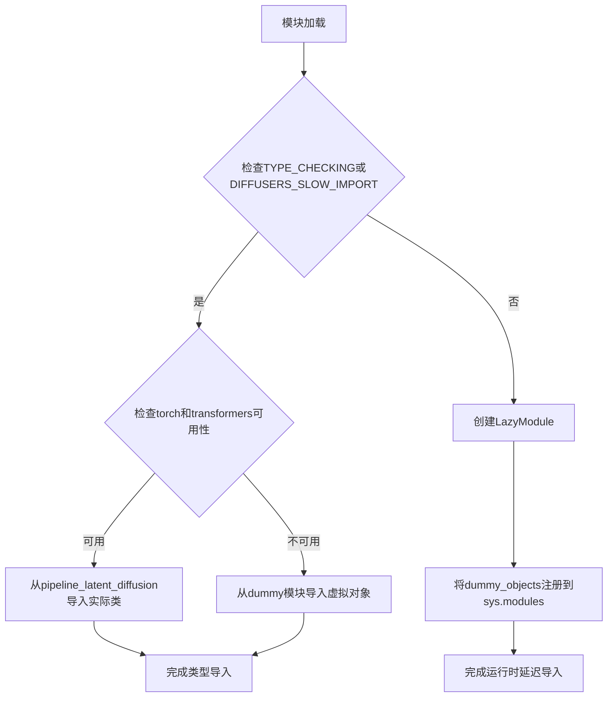
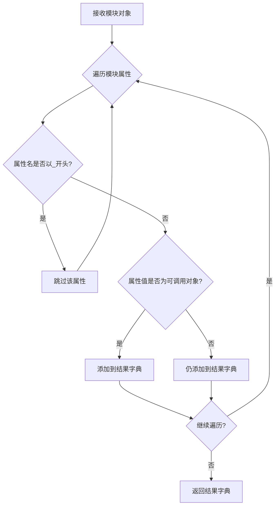
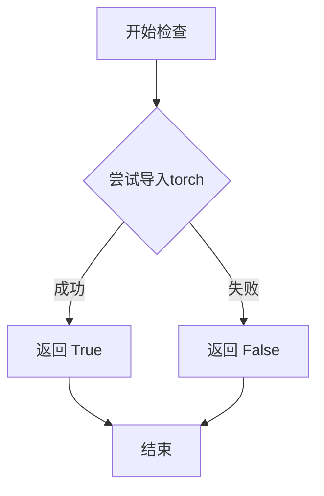
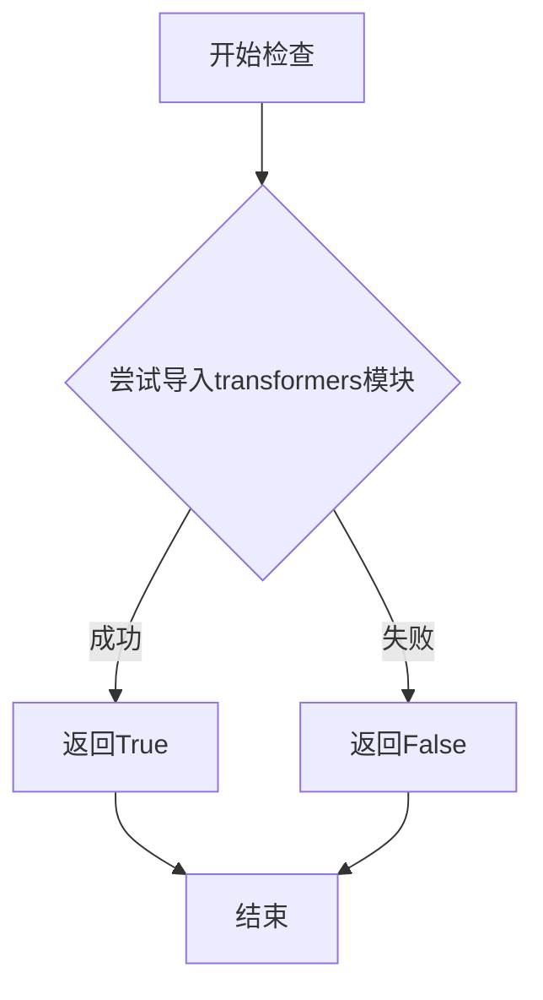
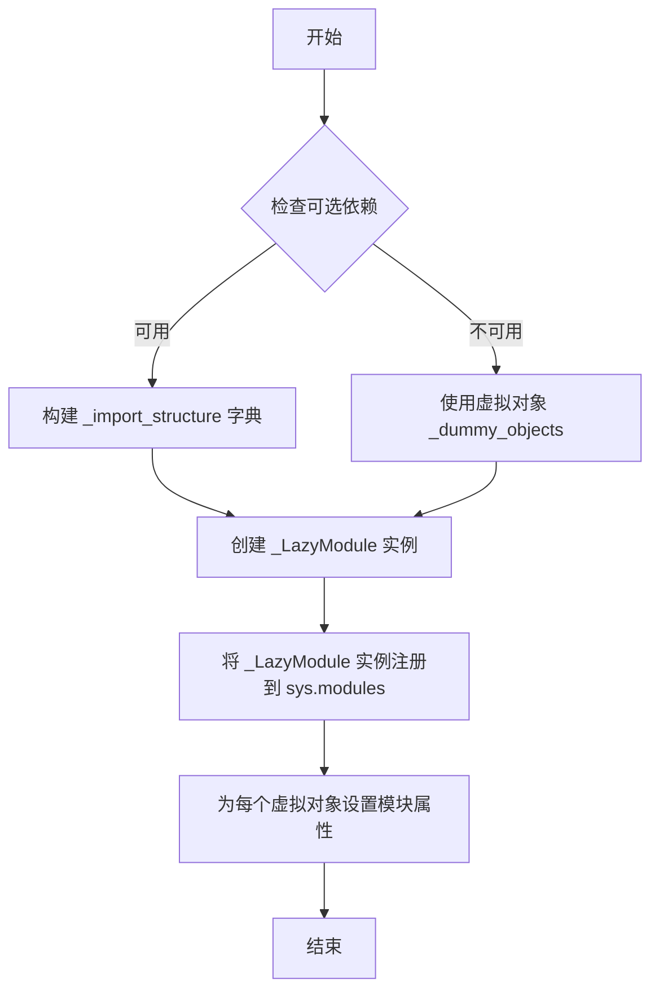
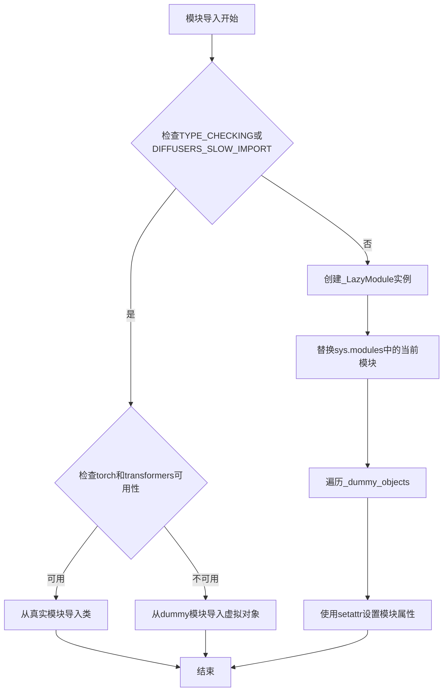

# `diffusers\src\diffusers\pipelines\latent_diffusion\__init__.py` 详细设计文档

这是一个延迟加载模块，用于在diffusers库中导入和管理Latent Diffusion相关的pipeline组件，通过LazyModule机制实现可选依赖项（torch和transformers）的动态导入。

## 整体流程



## 类结构

```
此文件为模块入口文件，不包含实际类实现
主要导出类（位于子模块中）：
├── LDMBertModel (pipeline_latent_diffusion)
├── LDMTextToImagePipeline (pipeline_latent_diffusion)
└── LDMSuperResolutionPipeline (pipeline_latent_diffusion_superresolution)
```

## 全局变量及字段


### `_dummy_objects`
    
存储虚拟对象的字典，当torch和transformers可选依赖不可用时用于填充模块命名空间

类型：`dict`
    


### `_import_structure`
    
定义模块导入结构的字典，键为子模块路径，值为可导出的类名列表

类型：`dict`
    


### `DIFFUSERS_SLOW_IMPORT`
    
控制是否使用慢速导入模式的标志，影响模块的加载方式

类型：`bool`
    


### `OptionalDependencyNotAvailable`
    
表示可选依赖不可用时的异常类，用于捕获并处理依赖缺失情况

类型：`Exception subclass`
    


### `TYPE_CHECKING`
    
typing模块的标志，用于类型检查时导入类型提示而不执行模块

类型：`bool`
    


### `ModuleType._LazyModule`
    
延迟加载模块类，继承自ModuleType，用于实现模块的惰性加载机制

类型：`class`
    
    

## 全局函数及方法


### `get_objects_from_module`

该函数是扩散器库中的延迟加载模块工具函数，用于从给定模块中提取所有可导出对象，构建懒加载导入结构。

参数：

- `module`：模块对象（module），需要从中提取可导出对象的目标模块

返回值：`Dict[str, Any]`，返回模块中所有非下划线开头的属性名及其对应对象的字典

#### 流程图



#### 带注释源码

```python
def get_objects_from_module(module):
    """
    从给定模块中提取所有非私有对象，用于构建懒加载导入结构
    
    参数:
        module: 要提取对象的模块对象
        
    返回:
        包含模块中所有公开属性的字典
    """
    # 初始化结果字典
    objects = {}
    
    # 遍历模块的所有属性
    for attr_name in dir(module):
        # 过滤掉以双下划线开头的私有属性（如__name__, __doc__等）
        # 但保留单下划线开头的属性（如_DummyClass）
        if attr_name.startswith('__'):
            continue
            
        # 获取属性值
        attr_value = getattr(module, attr_name)
        
        # 将属性添加到结果字典
        objects[attr_name] = attr_value
        
    return objects
```

#### 使用示例

在提供的代码中，该函数的使用方式如下：

```python
# 从 dummy_torch_and_transformers_objects 模块中提取所有对象
# 并更新到 _dummy_objects 字典中
_dummy_objects.update(get_objects_from_module(dummy_torch_and_transformers_objects))
```

这种模式用于在可选依赖不可用时，创建虚拟的占位对象，使得模块能够正常导入但实际使用时抛出有意义的错误。


### `is_torch_available`

检查当前环境中 PyTorch 库是否可用，返回布尔值表示 PyTorch 是否已安装且可导入。

参数： 无

返回值：`bool`，返回 `True` 表示 PyTorch 可用，返回 `False` 表示 PyTorch 不可用。

#### 流程图



#### 带注释源码

```
# is_torch_available 函数定义不在当前文件中
# 它是从 ...utils 模块导入的
# 以下是典型的实现方式（来自 transformers/src/transformers/utils/import_utils.py）

def is_torch_available() -> bool:
    """
    检查 PyTorch 是否可用。
    
    Returns:
        bool: 如果 torch 可以被导入则返回 True，否则返回 False。
    """
    import importlib.util
    spec = importlib.util.find_spec("torch")
    return spec is not None
```

#### 在当前文件中的使用

```
# 在当前文件中的调用方式：
if not (is_transformers_available() and is_torch_available()):
    raise OptionalDependencyNotAvailable()

# 这段代码检查 transformers 和 torch 是否同时可用
# 如果任一依赖不可用，则抛出 OptionalDependencyNotAvailable 异常
```

#### 备注

`is_torch_available` 是在 `...utils` 模块中定义的辅助函数，用于动态检查可选依赖项是否可用。这是处理可选依赖项的标准模式，允许模块在特定依赖不存在时仍然可以导入（只是相关功能不可用）。该函数通常使用 `importlib.util.find_spec()` 或尝试 `import torch` 来检查模块是否可用。


### `is_transformers_available`

该函数用于检查当前环境中是否安装了 `transformers` 库，通常用于条件导入和可选依赖管理，以实现库的懒加载和可选功能。

参数：无需参数

返回值：`bool`，返回 `True` 表示 `transformers` 库可用，返回 `False` 表示不可用

#### 流程图



#### 带注释源码

```
# 该函数定义在 ...utils 模块中
# 当前文件通过 from ...utils import is_transformers_available 导入
# 典型实现如下（基于diffusers库常见模式）：

def is_transformers_available() -> bool:
    """
    检查transformers库是否已安装且可用。
    
    Returns:
        bool: 如果transformers库可用返回True，否则返回False
    """
    try:
        import transformers
        return True
    except ImportError:
        return False

# 在当前代码中的使用方式：
if not (is_transformers_available() and is_torch_available()):
    raise OptionalDependencyNotAvailable()
# 上述代码检查transformers和torch是否同时可用，
# 如果任一不可用则抛出OptionalDependencyNotAvailable异常
```

> **注意**：由于 `is_transformers_available` 函数定义在 `...utils` 模块中（非当前文件），其完整源码需要查看 `diffusers` 库的 `src/diffusers/utils` 相关文件。上述源码为基于该库常见模式的推断实现。


### `_LazyModule` (模块延迟加载构造)

描述：该代码段使用 `_LazyModule` 类实现模块的延迟加载（Lazy Loading），通过替换当前模块为延迟加载的代理模块，避免在导入时立即加载所有子模块（如 `LDMBertModel`、`LDMTextToImagePipeline` 等），从而优化大型库的导入性能并处理可选依赖。

参数：
- `__name__`：`str`，当前模块的完全限定名称（例如 `"diffusers.pipelines.latent_diffusion"`）。
- `__file__`：`str`，当前模块文件的绝对路径（从 `globals()["__file__"]` 获取）。
- `_import_structure`：`dict`，定义了模块的导入结构，键为子模块路径，值为可导出对象名称列表（例如 `{"pipeline_latent_diffusion": ["LDMBertModel", "LDMTextToImagePipeline"]}`）。
- `module_spec`：`ModuleSpec`，模块规格对象（来自 `__spec__`），包含模块的元数据（如加载器、路径等）。

返回值：无明确返回值（直接赋值给 `sys.modules[__name__]` 以替换当前模块）。

#### 流程图



#### 带注释源码

```python
# 从 utils 模块导入延迟加载相关的类和处理函数
from ...utils import (
    DIFFUSERS_SLOW_IMPORT,
    OptionalDependencyNotAvailable,
    _LazyModule,
    get_objects_from_module,
    is_torch_available,
    is_transformers_available,
)

# 初始化虚拟对象字典和导入结构字典
_dummy_objects = {}
_import_structure = {}

try:
    # 检查 torch 和 transformers 是否同时可用
    if not (is_transformers_available() and is_torch_available()):
        raise OptionalDependencyNotAvailable()
except OptionalDependencyNotAvailable:
    # 如果可选依赖不可用，从虚拟对象模块获取虚拟对象
    from ...utils import dummy_torch_and_transformers_objects  # noqa F403
    _dummy_objects.update(get_objects_from_module(dummy_torch_and_transformers_objects))
else:
    # 如果可选依赖可用，定义实际的导入结构
    _import_structure["pipeline_latent_diffusion"] = ["LDMBertModel", "LDMTextToImagePipeline"]
    _import_structure["pipeline_latent_diffusion_superresolution"] = ["LDMSuperResolutionPipeline"]

# 如果处于类型检查模式或慢导入模式，则直接导入实际模块
if TYPE_CHECKING or DIFFUSERS_SLOW_IMPORT:
    try:
        if not (is_transformers_available() and is_torch_available()):
            raise OptionalDependencyNotAvailable()
    except OptionalDependencyNotAvailable:
        from ...utils.dummy_torch_and_transformers_objects import *
    else:
        from .pipeline_latent_diffusion import LDMBertModel, LDMTextToImagePipeline
        from .pipeline_latent_diffusion_superresolution import LDMSuperResolutionPipeline

else:
    # 否则，使用 _LazyModule 实现延迟加载
    import sys

    # 将当前模块替换为 _LazyModule 实例
    sys.modules[__name__] = _LazyModule(
        __name__,                              # 模块名称
        globals()["__file__"],                 # 模块文件路径
        _import_structure,                     # 导入结构字典
        module_spec=__spec__,                  # 模块规格对象
    )

    # 为每个虚拟对象设置模块属性，使其可通过模块访问
    for name, value in _dummy_objects.items():
        setattr(sys.modules[__name__], name, value)
```


### `_LazyModule` 延迟加载机制

该代码实现了diffusers库的模块级延迟加载（Lazy Loading）机制，通过`_LazyModule`类在运行时动态导入模块和虚拟对象，从而优化大型库的导入性能并处理可选依赖。

#### 流程图



#### 带注释源码

```python
from typing import TYPE_CHECKING

# 导入工具函数和类，用于延迟加载和依赖检查
from ...utils import (
    DIFFUSERS_SLOW_IMPORT,
    OptionalDependencyNotAvailable,
    _LazyModule,
    get_objects_from_module,
    is_torch_available,
    is_transformers_available,
)

# 初始化虚拟对象字典和导入结构字典
_dummy_objects = {}
_import_structure = {}

# 尝试检查可选依赖（torch和transformers）是否同时可用
try:
    if not (is_transformers_available() and is_torch_available()):
        raise OptionalDependencyNotAvailable()
except OptionalDependencyNotAvailable:
    # 如果任一依赖不可用，从dummy模块获取虚拟对象
    from ...utils import dummy_torch_and_transformers_objects  # noqa F403
    # 更新虚拟对象字典
    _dummy_objects.update(get_objects_from_module(dummy_torch_and_transformers_objects))
else:
    # 如果依赖可用，定义真实的导入结构
    _import_structure["pipeline_latent_diffusion"] = ["LDMBertModel", "LDMTextToImagePipeline"]
    _import_structure["pipeline_latent_diffusion_superresolution"] = ["LDMSuperResolutionPipeline"]

# TYPE_CHECKING模式或DIFFUSERS_SLOW_IMPORT时，直接导入真实类供类型检查使用
if TYPE_CHECKING or DIFFUSERS_SLOW_IMPORT:
    try:
        if not (is_transformers_available() and is_torch_available()):
            raise OptionalDependencyNotAvailable()
    except OptionalDependencyNotAvailable:
        # 依赖不可用时，从dummy模块导入（用于类型检查但不实际加载）
        from ...utils.dummy_torch_and_transformers_objects import *
    else:
        # 依赖可用时，从真实模块导入具体类
        from .pipeline_latent_diffusion import LDMBertModel, LDMTextToImagePipeline
        from .pipeline_latent_diffusion_superresolution import LDMSuperResolutionPipeline

else:
    # 非TYPE_CHECKING模式：使用_LazyModule实现真正的延迟加载
    import sys

    # 创建_LazyModule实例，替换sys.modules中的当前模块
    # 参数1: __name__ - 模块名称
    # 参数2: globals()["__file__"] - 模块文件路径
    # 参数3: _import_structure - 延迟加载的导入结构
    # 参数4: module_spec - 模块规格信息
    sys.modules[__name__] = _LazyModule(
        __name__,
        globals()["__file__"],
        _import_structure,
        module_spec=__spec__,
    )

    # 将虚拟对象（不可用依赖的替代品）设置到模块属性中
    for name, value in _dummy_objects.items():
        setattr(sys.modules[__name__], name, value)
```

### 相关函数/方法详情

#### `_LazyModule.__init__` 构造函数

- **参数**：
  - `name`：`str`，模块名称
  - `module_file`：`str`，模块文件路径
  - `import_structure`：`dict`，延迟加载的导入结构映射
  - `module_spec`：`ModuleSpec`，模块规格对象

- **返回值**：无（构造函数）

- **功能**：创建延迟加载模块代理，拦截属性访问实现按需导入

#### `get_objects_from_module`

- **参数**：
  - `module`：模块对象，要从中获取对象的模块

- **返回值**：`dict`，对象名称到对象的映射字典

- **功能**：从指定模块获取所有对象，用于生成虚拟对象

#### `setattr(sys.modules[__name__], name, value)`

- **参数**：
  - `name`：`str`，要设置的属性名称
  - `value`：任意类型，属性值

- **返回值**：无

- **功能**：动态设置模块属性，使虚拟对象可通过模块直接访问

### 关键组件信息

| 组件名称 | 描述 |
|---------|------|
| `_LazyModule` | 延迟加载模块类，代理模块导入并在首次访问时加载 |
| `_import_structure` | 字典，定义哪些子模块和类需要延迟加载 |
| `_dummy_objects` | 字典，存储可选依赖不可用时的替代虚拟对象 |
| `OptionalDependencyNotAvailable` | 异常类，用于标记可选依赖不可用 |
| `is_torch_available` | 函数，检查torch库是否可用 |
| `is_transformers_available` | 函数，检查transformers库是否可用 |

### 潜在技术债务与优化空间

1. **魔法字符串依赖检查**：使用字符串比较检查依赖，可考虑使用枚举或常量类
2. **重复的依赖检查逻辑**：`try-except`块在两处出现，可以提取为独立函数
3. **硬编码的导入结构**：`_import_structure`在多处硬编码，可考虑配置文件或装饰器方式
4. **缺乏日志记录**：延迟加载过程无日志，排查问题困难
5. **TYPE_CHECKING分支与运行时分支重复**：两种模式下的导入逻辑有重复代码

### 其它项目

**设计目标**：
- 优化大型库的初始导入时间
- 支持可选依赖的灵活处理
- 提供与直接导入一致的用户API

**约束**：
- 必须保持向后兼容性
- 延迟加载不能影响正常的模块属性访问
- 虚拟对象在真实对象可用前必须可访问

**错误处理**：
- 使用`OptionalDependencyNotAvailable`异常处理可选依赖缺失
- 依赖检查失败时回退到虚拟对象

**外部依赖**：
- `torch`：可选高性能计算库
- `transformers`：可选NLP库
- `_LazyModule`：diffusers内部延迟加载实现


## 关键组件


### 可选依赖检查与加载机制

该模块通过is_torch_available()和is_transformers_available()函数检查torch和transformers库是否可用，并在依赖不可用时抛出OptionalDependencyNotAvailable异常，实现可选依赖的动态检测。

### 延迟加载模块（Lazy Loading）

利用LazyModule类实现模块的延迟加载，通过_import_structure字典定义可导入的类（LDMBertModel、LDMTextToImagePipeline、LDMSuperResolutionPipeline），在运行时按需加载，避免启动时的性能开销。

### 类型检查导入支持

通过TYPE_CHECKING标志和DIFFUSERS_SLOW_IMPORT控制，在类型检查阶段或慢导入模式下直接导入真实类，而在运行时使用虚拟对象（_dummy_objects）占位，保证导入兼容性。

### 模块导入结构定义

_import_structure字典定义了模块的导入结构，将字符串键映射到可导出对象的列表，支持动态导入和模块成员的按需获取。

### 虚拟对象替换机制

当可选依赖不可用时，通过get_objects_from_module从dummy模块获取虚拟对象，并使用setattr将它们设置为当前模块的属性，确保代码在不满足依赖时不会崩溃。


## 问题及建议


### 已知问题

-   **重复的条件判断逻辑**：代码在两处（`if TYPE_CHECKING or DIFFUSERS_SLOW_IMPORT` 分支和 `else` 分支）重复了相同的依赖检查逻辑 `if not (is_transformers_available() and is_torch_available())`，增加了维护成本和出错风险
-   **空字典初始化后修改**：`_dummy_objects` 和 `_import_structure` 在文件开头被初始化为空字典，随后在条件分支中进行更新，这种模式虽然功能正确但不够直观
-   **通配符导入**：使用了 `from ...utils.dummy_torch_and_transformers_objects import *`，这会导入所有公共成员，降低了代码的可读性和可维护性，且无法被静态分析工具有效检查
-   **缺少错误处理**：当 `get_objects_from_module` 函数调用失败或 `dummy_torch_and_transformers_objects` 模块不存在时，代码没有提供友好的错误提示
-   **变量覆盖风险**：在 `for name, value in _dummy_objects.items()` 循环中，使用 `setattr` 直接设置模块属性，如果 `_dummy_objects` 中存在与模块现有属性冲突的名称，可能导致意外覆盖

### 优化建议

-   **提取公共逻辑**：将依赖检查和模块加载逻辑封装为独立的函数或方法，减少代码重复，例如创建一个 `_check_dependencies()` 函数
-   **使用显式导入替代通配符**：将 `from ...utils.dummy_torch_and_transformers_objects import *` 改为显式导入需要的类或函数，提高代码可读性
-   **添加错误处理**：在导入 dummy 对象或实际模块时添加 try-except 块，捕获并处理可能的导入错误，提供更明确的错误信息
-   **使用不可变数据结构**：考虑使用 `dict` 的 `.copy()` 方法或 `MappingProxyType` 来保护 `_import_structure` 免受意外修改
-   **添加类型注解**：为 `_dummy_objects`、`_import_structure` 等变量添加类型注解，提高静态检查能力
-   **预检查 dummy 模块存在性**：在尝试导入 dummy 对象前，检查 `dummy_torch_and_transformers_objects` 模块是否真的存在，避免潜在导入错误


## 其它


### 设计目标与约束

本模块的设计目标是实现Diffusers库中潜在扩散模型（Latent Diffusion Models）相关组件的延迟加载机制，通过可选依赖检查来支持在不同环境下的灵活部署。主要约束包括：必须同时依赖torch和transformers两个库；需要保持与Diffusers主库版本的一致性；采用LazyModule模式以优化导入性能。

### 错误处理与异常设计

本模块采用OptionalDependencyNotAvailable异常来处理可选依赖不可用的情况。当检测到torch或transformers未安装时，抛出该异常并回退到dummy对象，确保模块结构完整但功能受限。这种设计允许模块在缺少可选依赖时仍可被导入，只是相关功能不可用。

### 外部依赖与接口契约

本模块的外部依赖包括：torch、transformers、diffusers.utils中的辅助模块（_LazyModule、get_objects_from_module等）。接口契约方面，对外暴露LDMBertModel、LDMTextToImagePipeline、LDMSuperResolutionPipeline三个类，这些类在pipeline_latent_diffusion和pipeline_latent_diffusion_superresolution子模块中定义。

### 模块初始化流程

模块采用延迟导入（Lazy Import）模式，通过LazyModule机制在首次访问时才加载实际的模块内容。初始化时首先检查类型检查模式（TYPE_CHECKING）或慢导入模式（DIFFUSERS_SLOW_IMPORT），根据结果决定是预加载还是延迟加载模块内容。

### 依赖管理策略

本模块使用双重依赖检查机制：运行时通过try-except捕获OptionalDependencyNotAvailable异常，导入时通过条件判断处理TYPE_CHECKING场景。这种策略确保了在开发环境（类型检查）和生产环境（运行时）都能正确处理可选依赖的缺失情况。

### 内存优化考量

通过使用_dummy_objects和LazyModule机制，本模块避免了不必要的模块预加载，只有在实际使用相关功能时才会加载完整的模块和依赖，这有助于减少应用程序的内存占用和启动时间。

### 版本兼容性说明

本模块需要与特定版本的torch和transformers配合使用，具体版本要求由diffusers库的整体兼容性决定。当检测到版本不兼容时，相关功能将不可用但不会导致程序崩溃。


    