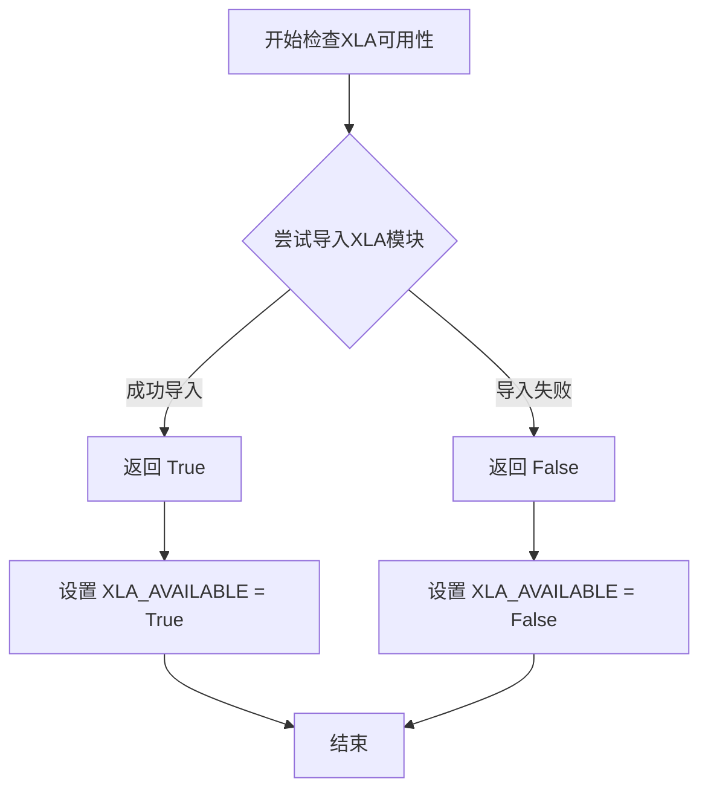
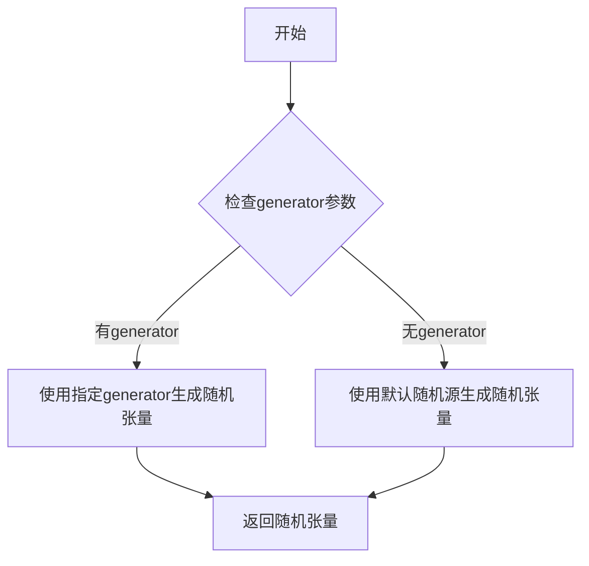
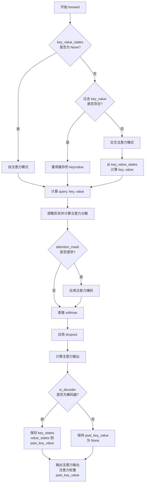
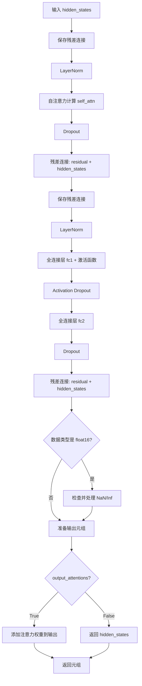
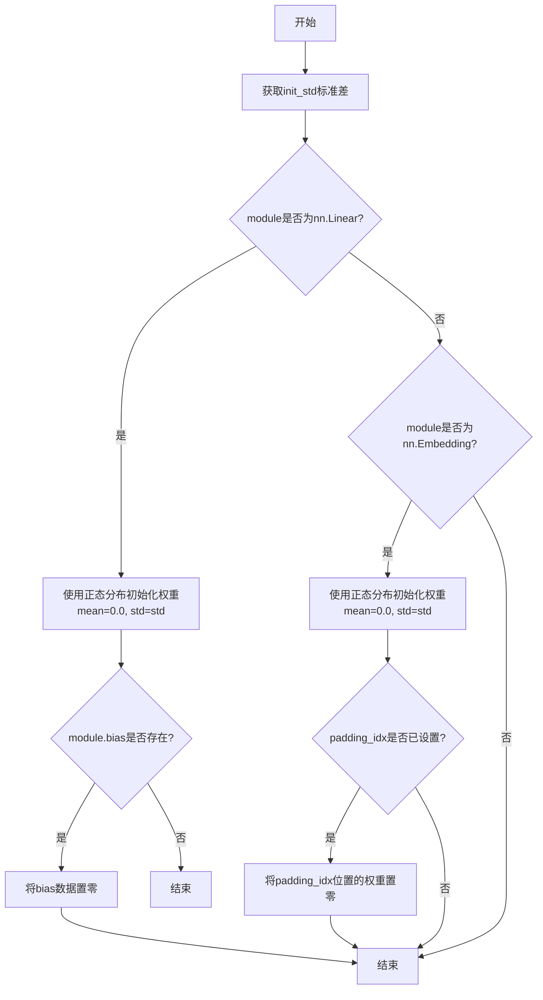
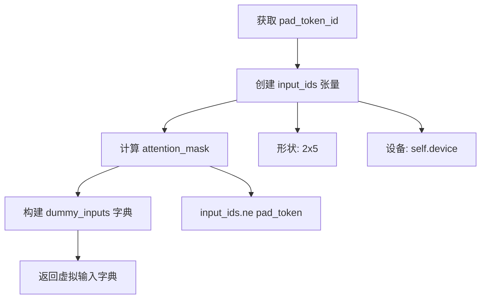
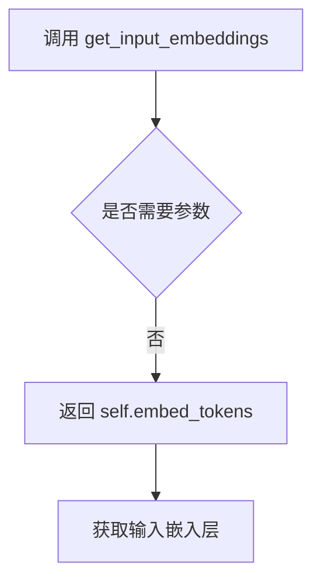
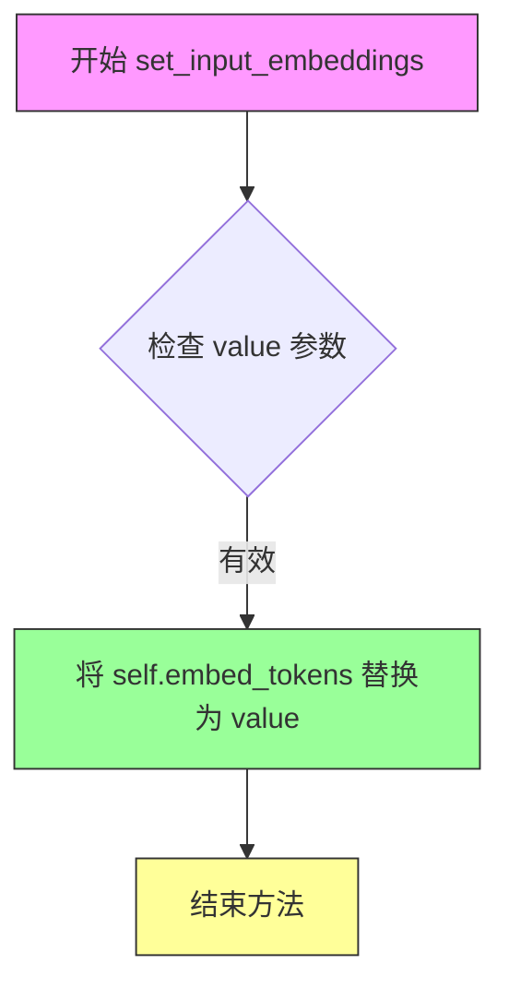
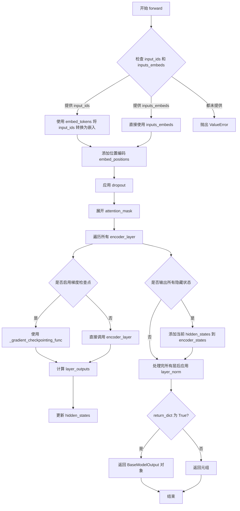

# `diffusers\src\diffusers\pipelines\latent_diffusion\pipeline_latent_diffusion.py` 详细设计文档

这是一个基于潜在扩散模型（Latent Diffusion Model）的文本到图像生成管道，通过结合VQVAE/LDM编码器、LDMBert文本编码器、UNet2D去噪网络和调度器，将文本提示转换为高质量图像。

## 整体流程

```mermaid
graph TD
A[开始: 输入文本提示] --> B{检查prompt类型}
B -- str --> C[batch_size = 1]
B -- list --> D[batch_size = len(prompt)]
B -- other --> E[抛出ValueError]
C --> F[验证height和width可被8整除]
D --> F
E --> Z[结束]
F --> G[获取无条件的文本嵌入<br/>(guidance_scale != 1.0时)]
G --> H[使用tokenizer和bert获取prompt_embeds]
H --> I[生成或验证初始随机latents]
I --> J[设置调度器时间步]
J --> K[迭代去噪过程]
K --> L{是否使用guidance}
L -- 是 --> M[拼接unconditional和text embeddings]
L -- 否 --> N[仅使用prompt_embeds]
M --> O[UNet预测噪声]
N --> O
O --> P{guidance_scale != 1.0}
P -- 是 --> Q[应用classifier-free guidance]
P -- 否 --> R[scheduler.step更新latents]
Q --> R
R --> S{XLA可用?]
S -- 是 --> T[xm.mark_step()]
S -- 否 --> U[检查是否完成所有时间步]
T --> U
U -- 否 --> K
U -- 是 --> V[使用VAE解码latents为图像]
V --> W[后处理: 归一化和转换格式]
W --> X[返回ImagePipelineOutput或tuple]
```

## 类结构

```
LDMTextToImagePipeline (主管道类)
├── DiffusionPipeline (基类)
├── VQModel/AutoencoderKL (VAE组件)
├── LDMBertModel (文本编码器)
├── PreTrainedTokenizer (分词器)
├── UNet2DConditionModel/UNet2DModel (去噪网络)
└── SchedulerMixin (调度器)

LDMBertModel (文本编码模型)
├── LDMBertPreTrainedModel (预训练模型基类)
│   ├── LDMBertConfig (配置类)
│   └── _expand_mask (工具函数)
├── LDMBertEncoder (编码器)
│   └── LDMBertEncoderLayer (编码器层)
│       └── LDMBertAttention (多头注意力)
└── nn.Linear (输出层)
```

## 全局变量及字段


### `logger`
    
模块级别的日志记录器

类型：`logging.Logger`
    


### `LDMBERT_PRETRAINED_MODEL_ARCHIVE_list`
    
预训练LDMBert模型列表

类型：`List[str]`
    


### `LDMBERT_PRETRAINED_CONFIG_ARCHIVE_MAP`
    
预训练模型配置URL映射

类型：`Dict[str, str]`
    


### `XLA_AVAILABLE`
    
指示Torch XLA是否可用

类型：`bool`
    


### `model_cpu_offload_seq`
    
CPU卸载顺序序列

类型：`str`
    


### `LDMTextToImagePipeline.vqvae`
    
用于编码和解码图像的VAE模型

类型：`VQModel | AutoencoderKL`
    


### `LDMTextToImagePipeline.bert`
    
文本编码器模型

类型：`PreTrainedModel`
    


### `LDMTextToImagePipeline.tokenizer`
    
文本分词器

类型：`PreTrainedTokenizer`
    


### `LDMTextToImagePipeline.unet`
    
去噪UNet网络

类型：`UNet2DModel | UNet2DConditionModel`
    


### `LDMTextToImagePipeline.scheduler`
    
去噪调度器

类型：`DDIMScheduler | PNDMScheduler | LMSDiscreteScheduler`
    


### `LDMTextToImagePipeline.vae_scale_factor`
    
VAE缩放因子

类型：`int`
    


### `LDMBertConfig.vocab_size`
    
词汇表大小

类型：`int`
    


### `LDMBertConfig.max_position_embeddings`
    
最大位置嵌入数量

类型：`int`
    


### `LDMBertConfig.encoder_layers`
    
编码器层数

类型：`int`
    


### `LDMBertConfig.encoder_ffn_dim`
    
前馈网络隐藏层维度

类型：`int`
    


### `LDMBertConfig.encoder_attention_heads`
    
编码器注意力头数

类型：`int`
    


### `LDMBertConfig.head_dim`
    
注意力头维度

类型：`int`
    


### `LDMBertConfig.d_model`
    
模型隐藏层维度

类型：`int`
    


### `LDMBertConfig.dropout`
    
Dropout概率

类型：`float`
    


### `LDMBertConfig.activation_function`
    
激活函数名称

类型：`str`
    


### `LDMBertConfig.use_cache`
    
是否缓存注意力键值对

类型：`bool`
    


### `LDMBertAttention.embed_dim`
    
嵌入向量维度

类型：`int`
    


### `LDMBertAttention.num_heads`
    
注意力头数量

类型：`int`
    


### `LDMBertAttention.head_dim`
    
单个注意力头维度

类型：`int`
    


### `LDMBertAttention.inner_dim`
    
内部投影维度（头数×头维度）

类型：`int`
    


### `LDMBertAttention.k_proj`
    
键值投影线性层

类型：`nn.Linear`
    


### `LDMBertAttention.v_proj`
    
值投影线性层

类型：`nn.Linear`
    


### `LDMBertAttention.q_proj`
    
查询投影线性层

类型：`nn.Linear`
    


### `LDMBertAttention.out_proj`
    
输出投影线性层

类型：`nn.Linear`
    


### `LDMBertAttention.scaling`
    
注意力缩放因子

类型：`float`
    


### `LDMBertAttention.dropout`
    
注意力Dropout概率

类型：`float`
    


### `LDMBertAttention.is_decoder`
    
是否作为解码器使用

类型：`bool`
    


### `LDMBertEncoderLayer.embed_dim`
    
嵌入向量维度

类型：`int`
    


### `LDMBertEncoderLayer.self_attn`
    
自注意力机制模块

类型：`LDMBertAttention`
    


### `LDMBertEncoderLayer.self_attn_layer_norm`
    
注意力层归一化

类型：`nn.LayerNorm`
    


### `LDMBertEncoderLayer.dropout`
    
Dropout概率

类型：`float`
    


### `LDMBertEncoderLayer.activation_fn`
    
激活函数

类型：`Callable`
    


### `LDMBertEncoderLayer.activation_dropout`
    
激活函数后Dropout概率

类型：`float`
    


### `LDMBertEncoderLayer.fc1`
    
前馈网络第一层线性变换

类型：`nn.Linear`
    


### `LDMBertEncoderLayer.fc2`
    
前馈网络第二层线性变换

类型：`nn.Linear`
    


### `LDMBertEncoderLayer.final_layer_norm`
    
最终层归一化

类型：`nn.LayerNorm`
    


### `LDMBertPreTrainedModel.config_class`
    
模型配置类

类型：`type`
    


### `LDMBertPreTrainedModel.base_model_prefix`
    
基础模型前缀标识

类型：`str`
    


### `LDMBertPreTrainedModel._supports_gradient_checkpointing`
    
是否支持梯度检查点

类型：`bool`
    


### `LDMBertPreTrainedModel._keys_to_ignore_on_load_unexpected`
    
加载时忽略的意外键

类型：`List[str]`
    


### `LDMBertEncoder.dropout`
    
Dropout概率

类型：`float`
    


### `LDMBertEncoder.padding_idx`
    
填充token索引

类型：`int`
    


### `LDMBertEncoder.max_source_positions`
    
最大源位置数

类型：`int`
    


### `LDMBertEncoder.embed_tokens`
    
词嵌入层

类型：`nn.Embedding`
    


### `LDMBertEncoder.embed_positions`
    
位置嵌入层

类型：`nn.Embedding`
    


### `LDMBertEncoder.layers`
    
编码器层模块列表

类型：`nn.ModuleList`
    


### `LDMBertEncoder.layer_norm`
    
最终层归一化

类型：`nn.LayerNorm`
    


### `LDMBertEncoder.gradient_checkpointing`
    
梯度检查点标志

类型：`bool`
    


### `LDMBertModel.model`
    
LDMBert编码器模型

类型：`LDMBertEncoder`
    


### `LDMBertModel.to_logits`
    
输出logits线性层

类型：`nn.Linear`
    
    

## 全局函数及方法


### `_expand_mask`

该函数用于将注意力掩码从 `[bsz, seq_len]` 的二维形式扩展为 `[bsz, 1, tgt_seq_len, src_seq_len]` 的四维形式，以便在多头注意力机制中使用。扩展过程中会进行掩码反转（0变1，1变0），并使用 `masked_fill` 将有效位置（0）填充为dtype的最小值，无效位置（1）保持为1.0，从而实现注意力分数的掩码控制。

参数：

- `mask`：`torch.Tensor`，输入的注意力掩码，形状为 `[bsz, seq_len]`，其中 1 表示有效token，0 表示需要掩码的padding位置
- `dtype`：`torch.dtype`，目标数据类型，用于转换掩码张量的数据类型（通常为 float16 或 float32）
- `tgt_len`：`int | None`，目标序列长度，如果为 None 则默认使用 src_len（即源序列长度）

返回值：`torch.Tensor`，扩展并反转后的注意力掩码，形状为 `[bsz, 1, tgt_seq_len, src_seq_len]`，其中有效位置为 dtype 的最小值，无效位置为 1.0

#### 流程图

```mermaid
flowchart TD
    A[开始: 输入 mask 和 dtype] --> B[获取 batch_size bsz 和 src_len]
    B --> C{判断 tgt_len 是否为 None}
    C -->|是| D[设 tgt_len = src_len]
    C -->|否| E[使用传入的 tgt_len]
    D --> F[扩展 mask 维度]
    E --> F
    F --> G[mask[:, None, None, :].expand 扩展为四维]
    G --> H[转换为目标 dtype]
    H --> I[反转掩码: inverted_mask = 1.0 - expanded_mask]
    I --> J[使用 masked_fill 将 True 替换为 dtype 最小值]
    J --> K[返回处理后的 inverted_mask]
```

#### 带注释源码

```python
def _expand_mask(mask: torch.Tensor, dtype: torch.dtype, tgt_len: int | None = None):
    """
    Expands attention_mask from `[bsz, seq_len]` to `[bsz, 1, tgt_seq_len, src_seq_len]`.
    
    参数:
        mask: 输入掩码，形状为 [bsz, seq_len]，1 表示有效位置，0 表示 padding
        dtype: 目标数据类型，用于注意力分数计算
        tgt_len: 目标序列长度，默认为 None，此时等于 src_len
        
    返回:
        扩展并反转后的掩码，形状为 [bsz, 1, tgt_seq_len, src_seq_len]
    """
    # 获取输入 mask 的 batch 大小和源序列长度
    bsz, src_len = mask.size()
    # 如果未指定目标长度，则使用源序列长度
    tgt_len = tgt_len if tgt_len is not None else src_len

    # 使用 expand 将掩码从 [bsz, seq_len] 扩展到 [bsz, 1, tgt_len, src_len]
    # expand 操作不会复制数据，只是改变视图
    expanded_mask = mask[:, None, None, :].expand(bsz, 1, tgt_len, src_len).to(dtype)

    # 反转掩码：1.0 - expanded_mask
    # 原掩码中 1（有效位置）变为 0，原掩码中 0（padding）变为 1.0
    inverted_mask = 1.0 - expanded_mask

    # 使用 masked_fill 将 bool 类型的 True 位置替换为 dtype 的最小值
    # 这在注意力机制中用于将无效位置的注意力分数设为极小值（接近负无穷）
    # inverted_mask.to(torch.bool) 将 1.0 转为 True，0.0 转为 False
    return inverted_mask.masked_fill(inverted_mask.to(torch.bool), torch.finfo(dtype).min)
```


### `is_torch_xla_available`

检查当前环境是否支持PyTorch XLA（Accelerated Linear Algebra），用于确定是否可以在TPU或IPU等加速器上运行PyTorch代码。

参数：

- 该函数无参数

返回值：`bool`，如果PyTorch XLA可用则返回 `True`，否则返回 `False`

#### 流程图



#### 带注释源码

```python
# 从diffusers库的utils模块导入is_torch_xla_available函数
# 该函数用于检测PyTorch XLA是否可用
from ...utils import is_torch_xla_available

# 使用is_torch_xla_available()检查XLA可用性
# 如果返回True，则导入torch_xla.core.xla_model模块并设置XLA_AVAILABLE为True
# 否则设置XLA_AVAILABLE为False
if is_torch_xla_available():
    import torch_xla.core.xla_model as xm
    XLA_AVAILABLE = True
else:
    XLA_AVAILABLE = False

# 后续代码可以通过检查XLA_AVAILABLE变量来决定是否执行XLA特定的优化操作
# 例如在pipeline的__call__方法中：
# if XLA_AVAILABLE:
#     xm.mark_step()  # 用于TPU上的显式同步
```


### randn_tensor

生成随机张量（从正态分布中采样），用于创建初始噪声或潜在变量。

参数：

- `shape`：`torch.Size` 或 `tuple`，要生成的随机张量的形状
- `generator`：`torch.Generator` 或 `list[torch.Generator]` 或 `None`，可选的随机数生成器，用于控制随机性
- `device`：`torch.device`，生成张量所在的设备
- `dtype`：`torch.dtype`，生成张量的数据类型

返回值：`torch.Tensor`，从正态分布中采样的随机张量

#### 流程图



#### 带注释源码

```python
# 由于randn_tensor定义在...utils.torch_utils模块中，未在当前代码段中提供
# 以下是基于使用方式的推断实现：

def randn_tensor(
    shape: torch.Size | tuple,
    generator: torch.Generator | list[torch.Generator] | None = None,
    device: torch.device | None = None,
    dtype: torch.dtype | None = None,
) -> torch.Tensor:
    """
    生成一个从正态分布中采样的随机张量。
    
    参数:
        shape: 要生成的张量的形状
        generator: 可选的torch.Generator用于控制随机性
        device: 生成张量所在的设备
        dtype: 张量的数据类型
    
    返回:
        从正态分布N(0,1)采样的随机张量
    """
    # 优先使用generator（如果提供）来生成确定性随机数
    if generator is not None:
        # 使用torch.randn生成的随机张量会受generator影响
        tensor = torch.randn(shape, generator=generator, device=device, dtype=dtype)
    else:
        # 使用默认随机源生成
        tensor = torch.randn(shape, device=device, dtype=dtype)
    
    return tensor
```

> **注意**：该函数定义在 `diffusers` 库的 `src/diffusers/utils/torch_utils.py` 文件中，上述源码为基于使用方式的推断实现。在当前提供的代码段中仅包含导入语句，未包含完整实现。


### LDMTextToImagePipeline.__call__

该方法是 LDM（Latent Diffusion Model）文本到图像生成管道的主生成方法。它接收文本提示，通过变分自编码器（VAE）编码文本语义，使用 U-Net 在潜在空间中进行去噪扩散过程，最后将潜在表示解码为最终图像。

参数：

- `prompt`：`str | list[str]`，指导图像生成的文本提示或提示列表
- `height`：`int | None`，生成图像的高度（像素），默认为 `self.unet.config.sample_size * self.vae_scale_factor`
- `width`：`int | None`，生成图像的宽度（像素），默认为 `self.unet.config.sample_size * self.vae_scale_factor`
- `num_inference_steps`：`int | None`，去噪步数，默认为 50
- `guidance_scale`：`float | None`，无分类器指导比例，值为 1.0 时禁用指导
- `eta`：`float | None`，DDIM 调度的 eta 参数，用于控制采样随机性
- `generator`：`torch.Generator | list[torch.Generator] | None`，用于生成确定性结果的随机数生成器
- `latents`：`torch.Tensor | None`，预生成的高斯噪声潜在向量，可用于复现生成结果
- `output_type`：`str | None`，输出格式，可选 "pil" 或 "np.array"
- `return_dict`：`bool | None`，是否返回 `ImagePipelineOutput` 对象
- `**kwargs`：其他未指定的参数

返回值：`tuple | ImagePipelineOutput`，当 `return_dict=True` 时返回 `ImagePipelineOutput` 对象，否则返回元组（第一个元素为图像列表）

#### 流程图

```mermaid
flowchart TD
    A[开始 __call__] --> B{检查 prompt 类型}
    B -->|str| C[batch_size = 1]
    B -->|list| D[batch_size = len(prompt)]
    B -->|其他| E[抛出 ValueError]
    C --> F[设置默认 height/width]
    D --> F
    F --> G{guidance_scale != 1.0?}
    G -->|是| H[生成空字符串的 unconditional embeddings]
    G -->|否| I[跳过 unconditional embeddings]
    H --> J[生成 prompt text embeddings]
    I --> J
    J --> K{latents 是否为 None?}
    K -->|是| L[使用 randn_tensor 生成随机潜在向量]
    K -->|否| M[验证 latents 形状]
    L --> N[设置 scheduler 时间步]
    M --> N
    N --> O[迭代每个时间步]
    O --> P{guidance_scale == 1.0?}
    P -->|是| Q[latents_input = latents, context = prompt_embeds]
    P -->|否| R[拼接 latents 和 negative_prompt_embeds]
    Q --> S[U-Net 预测噪声残差]
    R --> S
    S --> T{guidance_scale != 1.0?}
    T -->|是| U[执行 classifier-free guidance]
    T -->|否| V[跳过 guidance]
    U --> W[scheduler.step 计算前一时刻的 latents]
    V --> W
    W --> X{还有更多时间步?}
    X -->|是| O
    X -->|否| Y[latents 乘以 1/scaling_factor]
    Y --> Z[VAE decode latents 到图像]
    Z --> AA[归一化图像到 0-1 范围]
    AA --> BB{output_type == 'pil'?}
    BB -->|是| CC[转换为 PIL 图像]
    BB -->|否| DD[保持 numpy 数组]
    CC --> EE{return_dict == True?}
    DD --> EE
    EE -->|是| FF[返回 ImagePipelineOutput]
    EE -->|否| GG[返回 tuple]
```

#### 带注释源码

```python
@torch.no_grad()
def __call__(
    self,
    prompt: str | list[str],
    height: int | None = None,
    width: int | None = None,
    num_inference_steps: int | None = 50,
    guidance_scale: float | None = 1.0,
    eta: float | None = 0.0,
    generator: torch.Generator | list[torch.Generator] | None = None,
    latents: torch.Tensor | None = None,
    output_type: str | None = "pil",
    return_dict: bool = True,
    **kwargs,
) -> tuple | ImagePipelineOutput:
    # 0. 默认高度和宽度为 unet 配置的采样大小乘以 VAE 缩放因子
    height = height or self.unet.config.sample_size * self.vae_scale_factor
    width = width or self.unet.config.sample_size * self.vae_scale_factor

    # 1. 确定批处理大小
    if isinstance(prompt, str):
        batch_size = 1
    elif isinstance(prompt, list):
        batch_size = len(prompt)
    else:
        raise ValueError(f"`prompt` has to be of type `str` or `list` but is {type(prompt)}")

    # 2. 验证图像尺寸能被 8 整除（VAE 下采样因子）
    if height % 8 != 0 or width % 8 != 0:
        raise ValueError(f"`height` and `width` have to be divisible by 8 but are {height} and {width}.")

    # 3. 获取无分类器指导的无条件嵌入（当 guidance_scale > 1 时使用）
    if guidance_scale != 1.0:
        # 使用空字符串作为无条件输入
        uncond_input = self.tokenizer(
            [""] * batch_size, padding="max_length", max_length=77, truncation=True, return_tensors="pt"
        )
        # 通过 BERT 模型获取无条件嵌入
        negative_prompt_embeds = self.bert(uncond_input.input_ids.to(self._execution_device))[0]

    # 4. 获取提示词的文本嵌入
    text_input = self.tokenizer(prompt, padding="max_length", max_length=77, truncation=True, return_tensors="pt")
    prompt_embeds = self.bert(text_input.input_ids.to(self._execution_device))[0]

    # 5. 准备潜在向量的形状
    latents_shape = (batch_size, self.unet.config.in_channels, height // 8, width // 8)
    
    # 验证生成器列表长度与批处理大小匹配
    if isinstance(generator, list) and len(generator) != batch_size:
        raise ValueError(
            f"You have passed a list of generators of length {len(generator)}, but requested an effective batch"
            f" size of {batch_size}. Make sure the batch size matches the length of the generators."
        )

    # 6. 生成或验证潜在向量
    if latents is None:
        # 从随机噪声生成潜在向量
        latents = randn_tensor(
            latents_shape, generator=generator, device=self._execution_device, dtype=prompt_embeds.dtype
        )
    else:
        # 验证提供的潜在向量形状
        if latents.shape != latents_shape:
            raise ValueError(f"Unexpected latents shape, got {latents.shape}, expected {latents_shape}")
    latents = latents.to(self._execution_device)

    # 7. 设置去噪调度器的时间步
    self.scheduler.set_timesteps(num_inference_steps)

    # 8. 准备调度器步骤的额外参数（并非所有调度器都有 eta 参数）
    accepts_eta = "eta" in set(inspect.signature(self.scheduler.step).parameters.keys())

    extra_kwargs = {}
    if accepts_eta:
        extra_kwargs["eta"] = eta

    # 9. 迭代去噪过程
    for t in self.progress_bar(self.scheduler.timesteps):
        if guidance_scale == 1.0:
            # guidance_scale 为 1 表示不使用指导
            latents_input = latents
            context = prompt_embeds
        else:
            # 对于无分类器指导，需要进行两次前向传播
            # 这里将无条件嵌入和文本嵌入拼接成单个批次，避免两次前向传播
            latents_input = torch.cat([latents] * 2)
            context = torch.cat([negative_prompt_embeds, prompt_embeds])

        # 使用 U-Net 预测噪声残差
        noise_pred = self.unet(latents_input, t, encoder_hidden_states=context).sample
        
        # 执行指导
        if guidance_scale != 1.0:
            noise_pred_uncond, noise_prediction_text = noise_pred.chunk(2)
            noise_pred = noise_pred_uncond + guidance_scale * (noise_prediction_text - noise_pred_uncond)

        # 计算前一个噪声样本 x_t -> x_t-1
        latents = self.scheduler.step(noise_pred, t, latents, **extra_kwargs).prev_sample

        # 如果使用 XLA（PyTorch XLA），标记计算步骤
        if XLA_AVAILABLE:
            xm.mark_step()

    # 10. 缩放并使用 VAE 解码图像潜在向量
    latents = 1 / self.vqvae.config.scaling_factor * latents
    image = self.vqvae.decode(latents).sample

    # 11. 后处理：将图像归一化到 [0, 1] 范围
    image = (image / 2 + 0.5).clamp(0, 1)
    image = image.cpu().permute(0, 2, 3, 1).numpy()
    
    # 12. 转换为 PIL 图像（如果需要）
    if output_type == "pil":
        image = self.numpy_to_pil(image)

    # 13. 返回结果
    if not return_dict:
        return (image,)

    return ImagePipelineOutput(images=image)
```


### `LDMBertAttention._shape`

该方法用于将输入的张量重新整形为多头注意力机制所需的标准形状 `(batch_size, num_heads, seq_len, head_dim)`，以便进行后续的注意力计算。

参数：

- `self`：`LDMBertAttention`，LDMBertAttention 类实例本身
- `tensor`：`torch.Tensor`，输入的原始张量，通常是经过线性投影后的 query、key 或 value
- `seq_len`：`int`，序列长度，表示输入 token 的数量
- `bsz`：`int`，批量大小（batch size），表示同时处理的样本数量

返回值：`torch.Tensor`，重塑后的张量，形状为 `(batch_size, num_heads, seq_len, head_dim)`

#### 流程图

```mermaid
flowchart TD
    A[输入 tensor] --> B[接收参数: tensor, seq_len, bsz]
    B --> C{tensor.view<br/>(bsz, seq_len, num_heads, head_dim)}
    C --> D[重塑为四维张量]
    D --> E{tensor.transpose<br/>(1, 2)}
    E --> F[交换第2和第3维度]
    F --> G{tensor.contiguous}
    G --> H[确保内存连续]
    H --> I[返回形状为<br/>(bsz, num_heads, seq_len, head_dim)<br/>的张量]
    
    style A fill:#f9f,stroke:#333
    style I fill:#9f9,stroke:#333
```

#### 带注释源码

```python
def _shape(self, tensor: torch.Tensor, seq_len: int, bsz: int):
    """
    将输入张量重新整形为多头注意力所需的格式。
    
    参数:
        tensor: 输入的原始张量，通常是经过线性投影后的 query、key 或 value
        seq_len: 序列长度，表示输入 token 的数量
        bsz: 批量大小（batch size），表示同时处理的样本数量
    
    返回:
        重塑后的张量，形状为 (batch_size, num_heads, seq_len, head_dim)
    """
    # Step 1: 使用 view 方法将 tensor 从 (bsz, seq_len, inner_dim) 
    #         重塑为 (bsz, seq_len, num_heads, head_dim)
    #         其中 inner_dim = num_heads * head_dim
    reshaped_tensor = tensor.view(bsz, seq_len, self.num_heads, self.head_dim)
    
    # Step 2: 使用 transpose 交换第2和第3维度
    #         从 (bsz, seq_len, num_heads, head_dim) 
    #         变为 (bsz, num_heads, seq_len, head_dim)
    #         这样便于后续进行批量矩阵乘法计算注意力分数
    transposed_tensor = reshaped_tensor.transpose(1, 2)
    
    # Step 3: 调用 contiguous() 确保张量在内存中是连续存储的
    #         因为 transpose 操作只改变视角，不改变内存布局
    #         后续的 view 等操作需要连续的内存
    return transposed_tensor.contiguous()
```


### `LDMBertAttention.forward`

实现多头注意力机制，支持自注意力、交叉注意力和缓存解码器模式。

参数：

- `hidden_states`：`torch.Tensor`，输入的隐藏状态张量，形状为 (batch, tgt_len, embed_dim)
- `key_value_states`：`torch.Tensor | None`，用于交叉注意力的键值状态，如果为 None 则执行自注意力
- `past_key_value`：`tuple[torch.Tensor] | None`，用于缓存的过去键值状态元组，支持增量解码
- `attention_mask`：`torch.Tensor | None`，注意力掩码，形状为 (batch, 1, tgt_len, src_len)，用于处理填充或屏蔽特定位置
- `layer_head_mask`：`torch.Tensor | None`，单层注意力头掩码，形状为 (num_heads,)，用于屏蔽特定注意力头
- `output_attentions`：`bool`，是否返回注意力权重

返回值：`tuple[torch.Tensor, torch.Tensor | None, tuple[torch.Tensor] | None]`，包含：

- `attn_output`：注意力输出，形状为 (batch, tgt_len, embed_dim)
- `attn_weights_reshaped`：重塑后的注意力权重，形状为 (batch, num_heads, tgt_len, src_len)，仅在 output_attentions=True 时返回
- `past_key_value`：更新后的键值状态元组，供解码器后续使用

#### 流程图



#### 带注释源码

```python
def forward(
    self,
    hidden_states: torch.Tensor,
    key_value_states: torch.Tensor | None = None,
    past_key_value: tuple[torch.Tensor] | None = None,
    attention_mask: torch.Tensor | None = None,
    layer_head_mask: torch.Tensor | None = None,
    output_attentions: bool = False,
) -> tuple[torch.Tensor, torch.Tensor | None, tuple[torch.Tensor] | None]:
    """Input shape: Batch x Time x Channel"""

    # 确定是否为交叉注意力模式：如果提供了 key_value_states，则作为解码器的交叉注意力层使用
    is_cross_attention = key_value_states is not None

    bsz, tgt_len, _ = hidden_states.size()  # 获取批量大小、目标序列长度和嵌入维度

    # 获取查询投影并应用缩放因子
    query_states = self.q_proj(hidden_states) * self.scaling
    
    # 根据不同模式处理键值状态
    if is_cross_attention and past_key_value is not None:
        # 交叉注意力模式且存在缓存时，重用之前的 key/value
        key_states = past_key_value[0]
        value_states = past_key_value[1]
    elif is_cross_attention:
        # 交叉注意力模式，计算新的 key/value 投影
        key_states = self._shape(self.k_proj(key_value_states), -1, bsz)
        value_states = self._shape(self.v_proj(key_value_states), -1, bsz)
    elif past_key_value is not None:
        # 解码器自注意力模式，拼接缓存的 key/value 与当前计算的 key/value
        key_states = self._shape(self.k_proj(hidden_states), -1, bsz)
        value_states = self._shape(self.v_proj(hidden_states), -1, bsz)
        key_states = torch.cat([past_key_value[0], key_states], dim=2)
        value_states = torch.cat([past_key_value[1], value_states], dim=2)
    else:
        # 标准自注意力模式，直接计算 key/value
        key_states = self._shape(self.k_proj(hidden_states), -1, bsz)
        value_states = self._shape(self.v_proj(hidden_states), -1, bsz)

    # 如果是解码器，保存当前的 key/value 状态供后续使用
    if self.is_decoder:
        past_key_value = (key_states, value_states)

    # 调整张量形状以进行批量矩阵乘法
    proj_shape = (bsz * self.num_heads, -1, self.head_dim)
    query_states = self._shape(query_states, tgt_len, bsz).view(*proj_shape)
    key_states = key_states.view(*proj_shape)
    value_states = value_states.view(*proj_shape)

    src_len = key_states.size(1)
    
    # 计算注意力分数：query 与 key 的矩阵乘法
    attn_weights = torch.bmm(query_states, key_states.transpose(1, 2))

    # 验证注意力权重形状
    if attn_weights.size() != (bsz * self.num_heads, tgt_len, src_len):
        raise ValueError(
            f"Attention weights should be of size {(bsz * self.num_heads, tgt_len, src_len)}, but is"
            f" {attn_weights.size()}"
        )

    # 应用注意力掩码
    if attention_mask is not None:
        if attention_mask.size() != (bsz, 1, tgt_len, src_len):
            raise ValueError(
                f"Attention mask should be of size {(bsz, 1, tgt_len, src_len)}, but is {attention_mask.size()}"
            )
        attn_weights = attn_weights.view(bsz, self.num_heads, tgt_len, src_len) + attention_mask
        attn_weights = attn_weights.view(bsz * self.num_heads, tgt_len, src_len)

    # 计算注意力概率分布
    attn_weights = nn.functional.softmax(attn_weights, dim=-1)

    # 应用层头掩码（屏蔽特定注意力头）
    if layer_head_mask is not None:
        if layer_head_mask.size() != (self.num_heads,):
            raise ValueError(
                f"Head mask for a single layer should be of size {(self.num_heads,)}, but is"
                f" {layer_head_mask.size()}"
            )
        attn_weights = layer_head_mask.view(1, -1, 1, 1) * attn_weights.view(bsz, self.num_heads, tgt_len, src_len)
        attn_weights = attn_weights.view(bsz * self.num_heads, tgt_len, src_len)

    # 处理注意力权重的梯度
    if output_attentions:
        attn_weights_reshaped = attn_weights.view(bsz, self.num_heads, tgt_len, src_len)
        attn_weights = attn_weights_reshaped.view(bsz * self.num_heads, tgt_len, src_len)
    else:
        attn_weights_reshaped = None

    # 应用 dropout
    attn_probs = nn.functional.dropout(attn_weights, p=self.dropout, training=self.training)

    # 计算注意力输出：注意力概率与 value 的矩阵乘法
    attn_output = torch.bmm(attn_probs, value_states)

    # 验证注意力输出形状
    if attn_output.size() != (bsz * self.num_heads, tgt_len, self.head_dim):
        raise ValueError(
            f"`attn_output` should be of size {(bsz, self.num_heads, tgt_len, self.head_dim)}, but is"
            f" {attn_output.size()}"
        )

    # 调整输出形状：从 (batch, heads, tgt_len, head_dim) 转为 (batch, tgt_len, heads, head_dim)
    attn_output = attn_output.view(bsz, self.num_heads, tgt_len, self.head_dim)
    attn_output = attn_output.transpose(1, 2)
    
    # 合并多头维度：重塑为 (batch, tgt_len, embed_dim)
    attn_output = attn_output.reshape(bsz, tgt_len, self.inner_dim)

    # 最终线性投影
    attn_output = self.out_proj(attn_output)

    # 返回：注意力输出、重塑后的注意力权重、更新后的 past_key_value
    return attn_output, attn_weights_reshaped, past_key_value
```


### `LDMBertEncoderLayer.forward`

该方法是 LDMBertEncoderLayer 类的前向传播实现，实现了 Transformer 编码器层的前向计算，包含自注意力子层和前馈网络子层，采用残差连接和层归一化结构。

参数：

- `hidden_states`：`torch.Tensor`，输入到该层的张量，形状为 `(seq_len, batch, embed_dim)`
- `attention_mask`：`torch.Tensor`，注意力掩码，形状为 `(batch, 1, tgt_len, src_len)`，其中填充元素用非常大的负值表示
- `layer_head_mask`：`torch.Tensor`，用于掩码特定注意力头的掩码，形状为 `(encoder_attention_heads,)`
- `output_attentions`：`bool | None`，是否返回所有注意力层的注意力张量，默认为 `False`

返回值：`tuple[torch.Tensor, torch.Tensor | None]`，返回元组，第一个元素是隐藏状态，第二个元素是注意力权重（仅当 `output_attentions` 为 True 时存在）

#### 流程图



#### 带注释源码

```
def forward(
    self,
    hidden_states: torch.Tensor,
    attention_mask: torch.Tensor,
    layer_head_mask: torch.Tensor,
    output_attentions: bool | None = False,
) -> tuple[torch.Tensor, torch.Tensor | None]:
    """
    Args:
        hidden_states (`torch.Tensor`): 输入到该层的张量，形状为 (seq_len, batch, embed_dim)
        attention_mask (`torch.Tensor`): 注意力掩码，形状为 (batch, 1, tgt_len, src_len)，
            其中填充元素用非常大的负值表示
        layer_head_mask (`torch.Tensor`): 用于掩码特定注意力头的掩码，形状为 (encoder_attention_heads,)
        output_attentions (`bool`, *optional*): 是否返回所有注意力层的注意力张量
    """
    # ----- 自注意力子层 -----
    # 保存残差连接，用于后续的跳跃连接
    residual = hidden_states
    
    # 自注意力层之前的 LayerNorm
    hidden_states = self.self_attn_layer_norm(hidden_states)
    
    # 执行自注意力计算
    # 返回: (attention_output, attention_weights, past_key_value)
    hidden_states, attn_weights, _ = self.self_attn(
        hidden_states=hidden_states,
        attention_mask=attention_mask,
        layer_head_mask=layer_head_mask,
        output_attentions=output_attentions,
    )
    
    # 自注意力输出后的 Dropout
    hidden_states = nn.functional.dropout(hidden_states, p=self.dropout, training=self.training)
    
    # 残差连接: hidden_states = residual + hidden_states
    hidden_states = residual + hidden_states

    # ----- 前馈网络子层 -----
    # 保存残差连接
    residual = hidden_states
    
    # 前馈层之前的 LayerNorm
    hidden_states = self.final_layer_norm(hidden_states)
    
    # 第一个全连接层: 扩展维度 (embed_dim -> encoder_ffn_dim)
    hidden_states = self.activation_fn(self.fc1(hidden_states))
    
    # 激活函数后的 Dropout
    hidden_states = nn.functional.dropout(hidden_states, p=self.activation_dropout, training=self.training)
    
    # 第二个全连接层: 还原维度 (encoder_ffn_dim -> embed_dim)
    hidden_states = self.fc2(hidden_states)
    
    # 全连接层后的 Dropout
    hidden_states = nn.functional.dropout(hidden_states, p=self.dropout, training=self.training)
    
    # 残差连接: hidden_states = residual + hidden_states
    hidden_states = residual + hidden_states

    # ----- 数值稳定性处理 -----
    # 如果数据类型是 float16，检查并处理 NaN/Inf 值
    if hidden_states.dtype == torch.float16 and (
        torch.isinf(hidden_states).any() or torch.isnan(hidden_states).any()
    ):
        # 设置夹值以防止数值溢出
        clamp_value = torch.finfo(hidden_states.dtype).max - 1000
        hidden_states = torch.clamp(hidden_states, min=-clamp_value, max=clamp_value)

    # ----- 输出处理 -----
    outputs = (hidden_states,)
    
    # 如果需要输出注意力权重，将其添加到输出元组中
    if output_attentions:
        outputs += (attn_weights,)

    return outputs
```


### `LDMBertPreTrainedModel._init_weights`

该方法用于初始化LDMBertPreTrainedModel及其子类的权重。它根据传入的模块类型（nn.Linear或nn.Embedding），使用配置中的init_std标准差对权重进行正态分布初始化，并对偏置进行零初始化。

参数：

- `module`：`torch.nn.Module`，需要初始化的PyTorch模块（可以是nn.Linear或nn.Embedding）

返回值：无（`None`），该方法直接修改传入模块的权重数据，不返回任何值

#### 流程图



#### 带注释源码

```python
def _init_weights(self, module):
    """
    Initialize the weights of the model.

    This method is called during model initialization to set up
    the initial weights for different layer types.

    Args:
        module (nn.Module): The module to initialize. Can be either
                           nn.Linear or nn.Embedding.
    """
    # 从配置中获取初始化标准差
    std = self.config.init_std
    
    # 判断是否为线性层
    if isinstance(module, nn.Linear):
        # 使用正态分布初始化权重，均值为0，标准差为init_std
        module.weight.data.normal_(mean=0.0, std=std)
        # 如果存在偏置项，将其初始化为零
        if module.bias is not None:
            module.bias.data.zero_()
    # 判断是否为嵌入层
    elif isinstance(module, nn.Embedding):
        # 使用正态分布初始化权重，均值为0，标准差为init_std
        module.weight.data.normal_(mean=0.0, std=std)
        # 如果设置了padding_idx，将padding位置的权重置零
        if module.padding_idx is not None:
            module.weight.data[module.padding_idx].zero_()
```


### `LDMBertPreTrainedModel.dummy_inputs`

该属性用于生成虚拟输入张量，主要用于模型保存、加载或形状推断等场景。它根据模型的配置创建一个包含 `input_ids` 和 `attention_mask` 的字典，作为模型的虚拟输入。

参数：无（该方法为属性，无显式参数，`self` 为隐式参数）

返回值：`Dict[str, torch.Tensor]`，返回包含虚拟输入的字典，其中键为 `input_ids`（模型输入的 token ID 张量）和 `attention_mask`（注意力掩码张量）

#### 流程图



#### 带注释源码

```python
@property
def dummy_inputs(self):
    """
    生成虚拟输入张量，用于模型保存、加载或形状推断。
    
    Returns:
        dict: 包含 'input_ids' 和 'attention_mask' 的字典
    """
    # 获取配置中的填充 token ID
    pad_token = self.config.pad_token_id
    
    # 创建形状为 (2, 5) 的输入 ID 张量
    # 第一行: [0, 6, 10, 4, 2]
    # 第二行: [0, 8, 12, 2, pad_token]
    input_ids = torch.tensor(
        [[0, 6, 10, 4, 2], [0, 8, 12, 2, pad_token]], 
        device=self.device
    )
    
    # 构建虚拟输入字典
    dummy_inputs = {
        # 注意力掩码：通过比较 input_ids 与 pad_token 生成
        # 非填充位置为 True，填充位置为 False
        "attention_mask": input_ids.ne(pad_token),
        # 模型输入的 token ID
        "input_ids": input_ids,
    }
    
    return dummy_inputs
```


### `LDMBertEncoder.get_input_embeddings`

获取编码器的输入嵌入层（embedding layer）。该方法返回用于将输入token ID转换为嵌入向量的嵌入层实例，允许外部访问或修改输入嵌入。

参数： 无

返回值：`nn.Embedding`，返回模型的输入嵌入层（`self.embed_tokens`），用于将token IDs映射为嵌入向量。

#### 流程图



#### 带注释源码

```python
def get_input_embeddings(self):
    """
    获取编码器的输入嵌入层。
    
    Returns:
        nn.Embedding: 返回输入嵌入层 self.embed_tokens，用于将输入token IDs
                      转换为嵌入向量表示。该嵌入层在LDMBertEncoder初始化时创建，
                      维度为 (vocab_size, embed_dim)。
    """
    return self.embed_tokens
```


### `LDMBertEncoder.set_input_embeddings`

设置编码器的输入嵌入层，使用新的嵌入矩阵替换原有的 `embed_tokens`。

参数：

- `value`：`nn.Embedding`，新的嵌入层实例，用于替换模型原有的输入嵌入矩阵

返回值：`None`，该方法直接修改对象状态，无返回值

#### 流程图



#### 带注释源码

```python
def set_input_embeddings(self, value):
    """
    设置编码器的输入嵌入层。
    
    该方法允许在模型初始化后动态替换输入嵌入矩阵，
    常用于加载自定义预训练嵌入或进行迁移学习场景。
    
    Args:
        value (nn.Embedding): 新的嵌入层实例，必须与原嵌入层
                            具有相同的嵌入维度 (embed_dim) 和词汇表大小，
                            但允许使用不同的权重矩阵。
    
    Returns:
        None: 直接修改实例属性，无返回值
    
    Example:
        >>> # 加载自定义嵌入并替换
        >>> custom_embeddings = nn.Embedding(vocab_size, embed_dim)
        >>> encoder.set_input_embeddings(custom_embeddings)
    """
    self.embed_tokens = value
```


### `LDMBertEncoder.forward`

该方法是 LDMBertEncoder 的前向传播核心实现，负责将输入的 token IDs 或嵌入向量通过多层 Transformer 编码器层进行处理，最终输出编码后的隐藏状态序列。

参数：

- `input_ids`：`torch.LongTensor | None`，输入序列的 token 索引，形状为 `(batch_size, sequence_length)`，填充部分将被默认忽略
- `attention_mask`：`torch.Tensor | None`，注意力掩码，形状为 `(batch_size, sequence_length)`，用于避免对填充 token 执行注意力计算，1 表示不掩码，0 表示掩码
- `position_ids`：`torch.LongTensor | None`，位置索引，形状为 `(1, sequence_length)`，用于位置嵌入，若未提供则自动生成
- `head_mask`：`torch.Tensor | None`，多头注意力掩码，形状为 `(encoder_layers, encoder_attention_heads)`，用于掩码特定注意力头
- `inputs_embeds`：`torch.Tensor | None`，输入的嵌入表示，形状为 `(batch_size, sequence_length, hidden_size)`，可直接提供以替代 input_ids
- `output_attentions`：`bool | None`，是否返回所有层的注意力权重，默认使用配置值
- `output_hidden_states`：`bool | None`，是否返回所有层的隐藏状态，默认使用配置值
- `return_dict`：`bool | None`，是否返回 BaseModelOutput 对象而非元组，默认使用配置值

返回值：`tuple | BaseModelOutput`，编码后的输出，若 return_dict 为 True 返回 BaseModelOutput（包含 last_hidden_state、hidden_states、attentions），否则返回元组

#### 流程图

```mermaid
flowchart TD
    A[开始 forward] --> B{output_attentions 是否为 None?}
    B -->|是| C[使用 self.config.output_attentions]
    B -->|否| D[使用传入的 output_attentions]
    C --> E{output_hidden_states 是否为 None?}
    D --> E
    E -->|是| F[使用 self.config.output_hidden_states]
    E -->|否| G[使用传入的 output_hidden_states]
    F --> H{return_dict 是否为 None?}
    D --> H
    G --> H
    H -->|是| I[使用 self.config.use_return_dict]
    H -->|否| J[使用传入的 return_dict]
    I --> K{input_ids 和 inputs_embeds 都存在?}
    J --> K
    K -->|是| L[抛出 ValueError]
    K -->|否| M{input_ids 存在?}
    M -->|是| N[获取 input_ids shape 并展平]
    M -->|否| O{inputs_embeds 存在?}
    O -->|是| P[获取 inputs_embeds shape]
    O -->|否| Q[抛出 ValueError]
    N --> R[通过 embed_tokens 获取 inputs_embeds]
    P --> S[使用提供的 inputs_embeds]
    R --> T[计算 seq_len]
    S --> T
    T --> U{position_ids 存在?}
    U -->|否| V[生成 position_ids]
    U -->|是| W[使用提供的 position_ids]
    V --> X[获取 embed_positions]
    W --> X
    X --> Y[hidden_states = inputs_embeds + embed_pos]
    Y --> Z[应用 dropout 到 hidden_states]
    Z --> AA{attention_mask 存在?}
    AA -->|是| AB[调用 _expand_mask 扩展注意力掩码]
    AA -->|否| AC[attention_mask = None]
    AB --> AD[初始化 encoder_states 和 all_attentions]
    AC --> AD
    AD --> AE{head_mask 存在且层数正确?}
    AE -->|否| AF[遍历 encoder layers]
    AE -->|是| AF
    AG[encoder_layer = self.layers[idx]] --> AH{梯度检查点启用?}
    AH -->|是| AI[使用 _gradient_checkpointing_func]
    AH -->|否| AJ[直接调用 encoder_layer]
    AI --> AK[获取 layer_outputs]
    AJ --> AK
    AK --> AL[hidden_states = layer_outputs[0]]
    AL --> AM{output_attentions 为真?}
    AM -->|是| AN[all_attentions 添加 layer_outputs[1]]
    AM -->|否| AO[继续下一层]
    AN --> AO
    AO --> AP{还有更多层?}
    AP -->|是| AG
    AP -->|否| AQ[应用 layer_norm 到 hidden_states]
    AQ --> AR{output_hidden_states 为真?}
    AR -->|是| AS[encoder_states 添加 hidden_states]
    AR -->|否| AT{return_dict 为真?}
    AS --> AT
    AT -->|是| AU[返回 BaseModelOutput]
    AT -->|否| AV[返回 tuple]
```

#### 带注释源码

```python
def forward(
    self,
    input_ids: torch.LongTensor = None,
    attention_mask: torch.Tensor | None = None,
    position_ids: torch.LongTensor | None = None,
    head_mask: torch.Tensor | None = None,
    inputs_embeds: torch.Tensor | None = None,
    output_attentions: bool | None = None,
    output_hidden_states: bool | None = None,
    return_dict: bool | None = None,
) -> tuple | BaseModelOutput:
    r"""
    Args:
        input_ids (`torch.LongTensor` of shape `(batch_size, sequence_length)`):
            Indices of input sequence tokens in the vocabulary. Padding will be ignored by default should you
            provide it.

            Indices can be obtained using [`BartTokenizer`]. See [`PreTrainedTokenizer.encode`] and
            [`PreTrainedTokenizer.__call__`] for details.

            [What are input IDs?](../glossary#input-ids)
        attention_mask (`torch.Tensor` of shape `(batch_size, sequence_length)`, *optional*):
            Mask to avoid performing attention on padding token indices. Mask values selected in `[0, 1]`:

            - 1 for tokens that are **not masked**,
            - 0 for tokens that are **masked**.

            [What are attention masks?](../glossary#attention-mask)
        head_mask (`torch.Tensor` of shape `(encoder_layers, encoder_attention_heads)`, *optional*):
            Mask to nullify selected heads of the attention modules. Mask values selected in `[0, 1]`:

            - 1 indicates the head is **not masked**,
            - 0 indicates the head is **masked**.

        inputs_embeds (`torch.Tensor` of shape `(batch_size, sequence_length, hidden_size)`, *optional*):
            Optionally, instead of passing `input_ids` you can choose to directly pass an embedded representation.
            This is useful if you want more control over how to convert `input_ids` indices into associated vectors
            than the model's internal embedding lookup matrix.
        output_attentions (`bool`, *optional*):
            Whether or not to return the attentions tensors of all attention layers. See `attentions` under
            returned tensors for more detail.
        output_hidden_states (`bool`, *optional*):
            Whether or not to return the hidden states of all layers. See `hidden_states` under returned tensors
            for more detail.
        return_dict (`bool`, *optional*):
            Whether or not to return a [`~utils.BaseModelOutput`] instead of a plain tuple.
    """
    # 确定输出选项，使用配置默认值
    output_attentions = output_attentions if output_attentions is not None else self.config.output_attentions
    output_hidden_states = (
        output_hidden_states if output_hidden_states is not None else self.config.output_hidden_states
    )
    return_dict = return_dict if return_dict is not None else self.config.use_return_dict

    # 检索 input_ids 和 inputs_embeds，处理三种输入情况
    if input_ids is not None and inputs_embeds is not None:
        # 不能同时指定 input_ids 和 inputs_embeds
        raise ValueError("You cannot specify both input_ids and inputs_embeds at the same time")
    elif input_ids is not None:
        # 使用 input_ids，获取形状并展平最后维度
        input_shape = input_ids.size()
        input_ids = input_ids.view(-1, input_shape[-1])
    elif inputs_embeds is not None:
        # 使用提供的 inputs_embeds
        input_shape = inputs_embeds.size()[:-1]
    else:
        # 必须指定 input_ids 或 inputs_embeds 之一
        raise ValueError("You have to specify either input_ids or inputs_embeds")

    # 如果没有提供 inputs_embeds，则从 input_ids 通过嵌入层获取
    if inputs_embeds is None:
        inputs_embeds = self.embed_tokens(input_ids)

    # 获取序列长度
    seq_len = input_shape[1]
    # 如果没有提供位置 IDs，则自动生成从 0 开始的连续位置索引
    if position_ids is None:
        position_ids = torch.arange(seq_len, dtype=torch.long, device=inputs_embeds.device).expand((1, -1))
    # 获取位置嵌入
    embed_pos = self.embed_positions(position_ids)

    # 将 token 嵌入与位置嵌入相加，并应用 dropout
    hidden_states = inputs_embeds + embed_pos
    hidden_states = nn.functional.dropout(hidden_states, p=self.dropout, training=self.training)

    # 扩展注意力掩码：从 [bsz, seq_len] 扩展到 [bsz, 1, tgt_seq_len, src_seq_len]
    if attention_mask is not None:
        # [bsz, seq_len] -> [bsz, 1, tgt_seq_len, src_seq_len]
        attention_mask = _expand_mask(attention_mask, inputs_embeds.dtype)

    # 初始化编码器状态和注意力权重（如果需要输出）
    encoder_states = () if output_hidden_states else None
    all_attentions = () if output_attentions else None

    # 检查 head_mask 的层数是否与配置的编码器层数匹配
    if head_mask is not None:
        if head_mask.size()[0] != (len(self.layers)):
            raise ValueError(
                f"The head_mask should be specified for {len(self.layers)} layers, but it is for"
                f" {head_mask.size()[0]}."
            )

    # 遍历所有编码器层进行前向传播
    for idx, encoder_layer in enumerate(self.layers):
        # 如果需要输出隐藏状态，记录当前层的隐藏状态
        if output_hidden_states:
            encoder_states = encoder_states + (hidden_states,)
        
        # 检查是否启用梯度检查点以节省显存
        if torch.is_grad_enabled() and self.gradient_checkpointing:
            # 使用梯度检查点函数进行前向传播（仅保存输入输出以节省显存）
            layer_outputs = self._gradient_checkpointing_func(
                encoder_layer,
                hidden_states,
                attention_mask,
                (head_mask[idx] if head_mask is not None else None),
            )
        else:
            # 直接调用编码器层进行前向传播
            layer_outputs = encoder_layer(
                hidden_states,
                attention_mask,
                layer_head_mask=(head_mask[idx] if head_mask is not None else None),
                output_attentions=output_attentions,
            )

        # 更新隐藏状态为当前层的输出
        hidden_states = layer_outputs[0]

        # 如果需要输出注意力权重，记录当前层的注意力
        if output_attentions:
            all_attentions = all_attentions + (layer_outputs[1],)

    # 对最终的隐藏状态应用层归一化
    hidden_states = self.layer_norm(hidden_states)

    # 如果需要输出隐藏状态，添加最终层的隐藏状态
    if output_hidden_states:
        encoder_states = encoder_states + (hidden_states,)

    # 根据 return_dict 决定返回格式
    if not return_dict:
        # 过滤掉 None 值后返回元组
        return tuple(v for v in [hidden_states, encoder_states, all_attentions] if v is not None)
    # 返回 BaseModelOutput 对象，包含所有输出
    return BaseModelOutput(
        last_hidden_state=hidden_states, hidden_states=encoder_states, attentions=all_attentions
    )
```


### `LDMBertModel.forward`

该方法是 LDMBertModel 的前向传播方法，负责将文本 token IDs 转换为文本嵌入表示，通过内部的 Transformer 编码器处理后输出序列的隐藏状态。

参数：

- `input_ids`：`torch.LongTensor` 或 `None`，输入的文本 token 序列，形状为 (batch_size, sequence_length)
- `attention_mask`：`torch.Tensor` 或 `None`，注意力掩码，用于指示哪些位置是 padding，形状为 (batch_size, sequence_length)
- `position_ids`：`torch.LongTensor` 或 `None`，位置编码的索引，形状为 (1, sequence_length)
- `head_mask`：`torch.Tensor` 或 `None`，用于掩码特定的注意力头，形状为 (encoder_layers, encoder_attention_heads)
- `inputs_embeds`：`torch.Tensor` 或 `None`，直接提供的嵌入表示，形状为 (batch_size, sequence_length, hidden_size)
- `output_attentions`：`bool` 或 `None`，是否返回所有层的注意力权重
- `output_hidden_states`：`bool` 或 `None`，是否返回所有层的隐藏状态
- `return_dict`：`bool` 或 `None`，是否返回 BaseModelOutput 对象而不是元组

返回值：`tuple` 或 `BaseModelOutput`，包含 last_hidden_state、hidden_states（可选）和 attentions（可选）

#### 流程图



#### 带注释源码

```python
def forward(
    self,
    input_ids=None,
    attention_mask=None,
    position_ids=None,
    head_mask=None,
    inputs_embeds=None,
    output_attentions=None,
    output_hidden_states=None,
    return_dict=None,
):
    """
    LDMBertModel 的前向传播方法，将 token IDs 通过编码器转换为隐藏状态表示
    
    参数:
        input_ids: 输入的 token ID 张量，形状为 (batch_size, seq_len)
        attention_mask: 注意力掩码，1 表示有效位置，0 表示 padding
        position_ids: 位置编码的索引
        head_mask: 注意力头的掩码
        inputs_embeds: 直接提供的嵌入表示
        output_attentions: 是否返回注意力权重
        output_hidden_states: 是否返回所有层的隐藏状态
        return_dict: 是否返回字典格式的输出
    
    返回:
        编码器输出，包含 last_hidden_state，可选包含 hidden_states 和 attentions
    """
    # 将所有参数传递给内部的 encoder 模型进行处理
    # encoder 会处理嵌入、位置编码、多层 Transformer 编码器堆叠
    outputs = self.model(
        input_ids,
        attention_mask=attention_mask,
        position_ids=position_ids,
        head_mask=head_mask,
        inputs_embeds=inputs_embeds,
        output_attentions=output_attentions,
        output_hidden_states=output_hidden_states,
        return_dict=return_dict,
    )
    # 直接返回 encoder 的输出结果
    # 注意：这里没有使用 self.to_logits 线性层，可能用于其他任务（如语言建模）
    return outputs
```

## 关键组件


### 张量索引与形状处理

在`__call__`方法中，通过`latents_shape = (batch_size, self.unet.config.in_channels, height // 8, width // 8)`计算潜在空间的形状，实现对张量索引的精确控制。代码使用`torch.chunk(2)`对噪声预测进行分割，分别处理无条件和文本条件的预测结果。

### 惰性加载与设备迁移

通过`self._execution_device`实现设备惰性迁移，模型组件（bert、unet、vqvae）注册后由`model_cpu_offload_seq = "bert->unet->vqvae"`定义卸载序列。使用`XLA_AVAILABLE`标志检查是否启用XLA加速，通过`xm.mark_step()`实现TPU上的惰性求值。

### 反量化支持（VAE解码）

代码支持两种VAE模型：`VQModel`和`AutoencoderKL`。在推理结束后，通过`latents = 1 / self.vqvae.config.scaling_factor * latents`进行潜在空间缩放，然后使用`self.vqvae.decode(latents).sample`将潜在向量解码为图像，实现反量化过程。

### 量化策略

虽然代码本身未直接实现量化，但通过`randn_tensor`函数支持从外部传入预量化的潜在张量。用户可通过`latents`参数传入自定义的量化潜在向量，管道会直接使用而无需重新生成。

### 调度器抽象

支持三种调度器（`DDIMScheduler`、`PNDMScheduler`、`LMSDiscreteScheduler`），通过`inspect.signature`检查调度器的`eta`参数兼容性，实现动态调度器适配。使用`self.scheduler.set_timesteps(num_inference_steps)`和`self.scheduler.step()`实现去噪循环的时间步调度。

### 分类器无指导（Classifier-Free Guidance）

通过`guidance_scale != 1.0`条件判断是否启用无指导模式。当启用时，将无条件嵌入和文本嵌入在维度0上拼接，进行单次前向传播后通过`noise_pred.chunk(2)`分离，再应用CFG公式：`noise_pred = noise_pred_uncond + guidance_scale * (noise_prediction_text - noise_pred_uncond)`。

### 梯度检查点支持

`LDMBertEncoder`类中通过`self.gradient_checkpointing = False`和`_gradient_checkpointing_func`实现梯度检查点功能，可在`forward`方法中通过条件判断启用，以显存换取计算时间。

### 模型配置与注册机制

使用`register_modules`方法将VQVAE、BERT、tokenizer、UNet和调度器注册到管道中，通过`PretrainedConfig`子类`LDMBertConfig`定义模型架构参数，实现组件的灵活配置和序列化。


## 问题及建议


### 已知问题

- **硬编码值缺乏灵活性**：`max_length=77` 在多处硬编码，VAE缩放因子计算 (`latents = 1 / self.vqvae.config.scaling_factor * latents`) 假设特定配置，若VAE配置变更可能导致解码失败。
- **类型注解混用风格**：代码混合使用了 Python 3.10+ 的 `|` 联合类型语法（如 `VQModel | AutoencoderKL`）和传统的 `Union`/`Optional` 注解，降低了与旧版 Python 的兼容性。
- **未使用的全局变量**：`LDMBERT_PRETRAINED_MODEL_ARCHIVE_list` 和 `LDMBERT_PRETRAINED_CONFIG_ARCHIVE_MAP` 定义但未被任何代码引用，属于遗留死代码。
- **配置与实现耦合**：`_expand_mask` 函数是手动实现的，与 transformers 库中已有实现重复，增加了维护成本；`LDMBertAttention` 标注为从 BART 复制但未定期同步上游更新。
- **参数验证不完整**：`num_inference_steps`、`height`、`width` 等关键参数缺乏运行时验证（仅检查高度/宽度是否被 8 整除），负值或极端值可能导致隐性错误或 NaN 传播。
- **潜在空值处理**：代码多处使用 `if xxx is not None` 模式但未对 `None` 输入提供明确错误信息，如 `attention_mask`、`head_mask` 为 `None` 时的默认行为缺乏文档说明。
- **XLA 支持条件分支**：`if XLA_AVAILABLE:` 的运行时检查增加了代码路径复杂性，且 `xm.mark_step()` 在循环内部可能产生意外同步行为。

### 优化建议

- **参数配置化**：将 `max_length=77`、`vae_scaling_factor` 计算逻辑、默认 `num_inference_steps` 等提取为配置项或通过 `@property` 动态计算，提高代码适应性。
- **统一类型注解风格**：考虑使用 `typing.Union` / `typing.Optional` 以兼容 Python 3.9，或使用 `from __future__ import annotations` 延迟注解求值。
- **清理死代码与依赖**：移除未使用的全局变量列表；若确实需要预训练模型映射，改为从 transformers 库动态获取。
- **复用库函数**：使用 `transformers.modeling_utils` 中的 `BaseModelOutput` 和 mask 扩展函数，避免重复实现 `_expand_mask`；关注上游 BART 模型的注意力实现更新。
- **增强输入验证**：在 `__call__` 方法起始处添加 `num_inference_steps > 0`、`guidance_scale >= 0` 等显式校验，并抛出具体 `ValueError` 提示用户。
- **完善文档字符串**：为 `LDMBertEncoder.forward` 中 `input_ids` 和 `inputs_embeds` 的互斥关系、默认行为添加更清晰说明；为 XLA 加速的副作用提供注释。
- **简化设备管理**：考虑使用 `accelerate` 库统一设备处理逻辑，减少 `self._execution_device` 的显式调用，降低跨设备调试成本。

## 其它


### 设计目标与约束

本代码实现了一个基于Latent Diffusion Model（LDM）的文本到图像生成管道（LDMTextToImagePipeline），核心设计目标是将自然语言文本描述转换为对应的图像。设计约束包括：1）支持多种噪声调度器（DDIMScheduler、LMSDiscreteScheduler、PNDMScheduler）以提供不同的采样策略；2）遵循HuggingFace Diffusers库的Pipeline标准架构，便于与其他Diffusion模型集成；3）支持条件生成（Classifier-free guidance）以提升生成质量；4）遵循原始LDM论文的架构设计，使用VQ-VAE进行潜在空间编码/解码；5）需要与HuggingFace Transformers库兼容。

### 错误处理与异常设计

代码实现了多层次的输入验证和异常处理机制。在`__call__`方法中：1）对prompt类型进行检查，仅接受str或list[str]类型，否则抛出ValueError；2）验证height和width必须能被8整除，否则抛出ValueError；3）验证generator列表长度与batch_size匹配；4）验证latents维度是否符合预期。在LDMBertAttention中：验证attn_weights、attention_mask和attn_output的维度是否匹配预期。整体采用快速失败（fail-fast）策略，在流程早期检测错误以避免后续昂贵的计算资源浪费。

### 数据流与状态机

管道的数据流遵循以下状态转换：1）初始状态：接收原始文本prompt和随机噪声（或用户提供的latents）；2）编码状态：tokenizer将文本编码为token IDs，bert模型将token embeddings转换为文本embeddings；3）潜在空间状态：使用随机噪声初始化latents tensor，维度为(batch_size, in_channels, height//8, width//8)；4）去噪迭代状态：循环执行UNet预测噪声残差→根据guidance_scale计算条件/非条件噪声预测→scheduler更新latents；5）解码状态：VQGVAE解码器将去噪后的latents转换为最终图像。状态转换由scheduler的timesteps驱动，每次迭代产生一个新的latents状态。

### 外部依赖与接口契约

本代码依赖以下外部组件：1）transformers库：提供PretrainedConfig、PreTrainedModel、PreTrainedTokenizer、BERT模型实现及ACT2FN激活函数；2）diffusers库内部模块：VQModel、AutoencoderKL、UNet2DConditionModel、UNet2DModel、DDIMScheduler、LMSDiscreteScheduler、PNDMScheduler、DiffusionPipeline、ImagePipelineOutput；3）torch库：核心张量运算；4）torch_xla库（可选）：用于XLA设备加速。接口契约要求：vqvae必须实现decode方法返回sample属性；bert和unet必须遵循PreTrainedModel接口；tokenizer必须实现__call__方法返回包含input_ids的字典；scheduler必须实现set_timesteps和step方法。

### 性能优化考虑

代码包含多项性能优化：1）使用@torch.no_grad()装饰器禁用梯度计算以减少内存占用；2）支持模型CPU offload，通过model_cpu_offload_seq指定卸载顺序（bert->unet->vqvae）；3）支持梯度检查点（gradient checkpointing）以降低显存占用；4）XLA设备支持，使用xm.mark_step()进行即时编译优化；5）在classifier-free guidance中，通过torch.cat合并两个forward pass为一个以减少计算量；6）支持预生成的latents以允许结果复用和调试。潜在优化空间：可添加xformers内存注意力优化、支持torch.compile()加速、实现ONNX导出。

### 安全性与伦理考量

该模型具有生成高度逼真图像的能力，存在以下安全风险：1）可能被用于生成虚假信息、深度伪造或恶意内容；2）训练数据可能包含偏见，导致生成图像存在刻板印象；3）文本编码器（LDMBert）可能放大训练语料中的有害内容；4）缺乏内容过滤机制。建议在生产环境中添加：用户输入过滤系统、生成内容水印、输出审核机制、使用条款强制执行。

### 配置管理与参数说明

管道通过构造函数注册多个模型组件：vqvae（VQModel或AutoencoderKL）、bert（LDMBertModel）、tokenizer（BertTokenizer）、unet（UNet2DModel或UNet2DConditionModel）、scheduler。运行时参数通过__call__方法传递，包括：num_inference_steps（去噪步数，默认50）、guidance_scale（引导强度，默认1.0）、eta（DDIM的随机性参数）、generator（随机种子控制）、output_type（输出格式：pil或numpy）、return_dict（返回格式控制）。配置通过各模型的config属性访问，如unet.config.sample_size、vqvae.config.scaling_factor、vqvae.config.block_out_channels。

### 版本兼容性与依赖管理

代码针对以下版本设计：Python 3.8+、PyTorch 2.0+、Transformers 4.26+、Diffusers 0.18+。使用is_torch_xla_available()进行可选依赖检查，优雅处理XLA不可用的情况。类型注解使用Python 3.10+的union语法（str | list[str]），可能需要from __future__ import annotations以兼容旧版本。代码从transformers.models.bart.modeling_bart复制了BART注意力机制并适配为LDMBert，需要保持与BartAttention接口兼容。


    