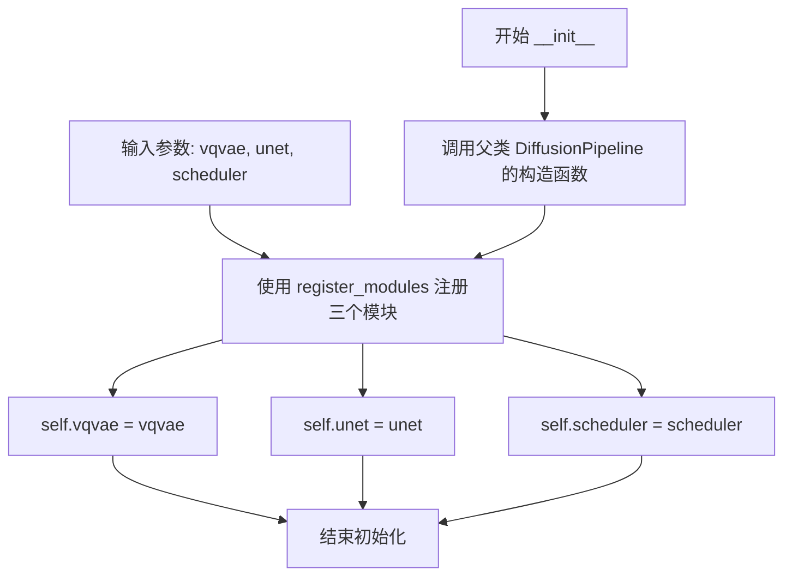
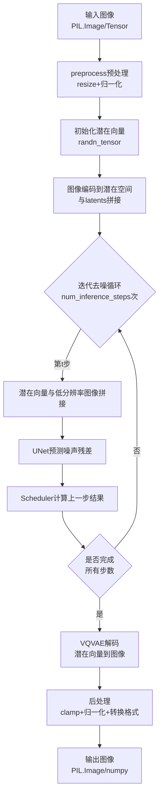

# `diffusers\src\diffusers\pipelines\latent_diffusion\pipeline_latent_diffusion_superresolution.py` 详细设计文档

这是一个基于潜在扩散模型（Latent Diffusion Model, LDM）的图像超分辨率扩散管道（Pipeline）。该代码通过VQVAE编码器将低分辨率图像转换为潜在表示，结合UNet模型在Scheduler的控制下对随机噪声进行去噪处理，最后利用VQVAE解码器将处理后的潜在表示恢复为高分辨率图像。

## 整体流程

```mermaid
graph TD
    A[开始: 接收低分辨率图像] --> B{检查图像类型}
    B -- PIL.Image --> C[调用 preprocess 函数]
    B -- torch.Tensor --> D[直接使用]
    C --> E[初始化隐变量 Latents (随机噪声)]
    D --> E
    E --> F[设置 Scheduler 时间步]
    F --> G[迭代去噪循环]
    G --> H{当前步 < 总步数?}
    H -- 是 --> I[拼接 Latents 和 Low-Res Image]
    I --> J[UNet 预测噪声]
    J --> K[Scheduler 计算上一步]
    K --> G
    H -- 否 --> L[使用 VQVAE 解码 Latents]
    L --> M[后处理: Clamp, Normalize, ToNumpy/PIL]
    M --> N[结束: 输出高分辨率图像]
```

## 类结构

```
DiffusionPipeline (基类)
└── LDMSuperResolutionPipeline (子类)
```

## 全局变量及字段


### `XLA_AVAILABLE`
    
布尔值，标识 PyTorch XLA 是否可用

类型：`bool`
    


### `LDMSuperResolutionPipeline.vqvae`
    
用于图像潜在空间编码和解码的模型

类型：`VQModel`
    


### `LDMSuperResolutionPipeline.unet`
    
用于去噪的神经网络模型

类型：`UNet2DModel`
    


### `LDMSuperResolutionPipeline.scheduler`
    
控制去噪步骤的调度器

类型：`SchedulerMixin`
    
    

## 全局函数及方法


### 1. 一句话描述

`preprocess` 是一个全局图像预处理函数，负责将 PIL 图像转换为模型所需的 PyTorch Tensor 格式，包括尺寸对齐（32的倍数）、Lanczos 重采样、归一化至 [0, 1] 并线性变换至 [-1, 1]。

### 2. 文件的整体运行流程

该文件定义了 `LDMSuperResolutionPipeline`（LDM 超分辨率管道）。
1.  **输入**：用户传入低分辨率图像（PIL Image 或 Tensor）。
2.  **预处理**：如果是 PIL Image，调用全局函数 `preprocess` 进行尺寸调整和归一化。
3.  **推理**：初始化随机潜在向量（Latents），并通过 U-Net 在调度器（Scheduler）控制下进行去噪。
4.  **解码**：将去噪后的潜在向量通过 VQVAE 解码器转换为最终图像。
5.  **后处理**：将图像转换并保存为 PIL 格式或 NumPy 数组。

---

### 3. 详细信息

#### 全局函数 `preprocess`

该函数是 `LDMSuperResolutionPipeline` 管道中的图像预处理核心模块。

**参数：**

- `image`：`PIL.Image.Image`，待处理的输入图像对象。

**返回值：** `torch.Tensor`，处理后的图像张量。
- **类型**：PyTorch Float Tensor
- **形状**：(1, C, H, W) - 包含批次维度的 CHW 格式。
- **值域**：[-1.0, 1.0]

#### 流程图

```mermaid
graph TD
    Start([输入: PIL Image]) --> B[获取尺寸 w, h]
    B --> C{调整尺寸}
    C -->|计算| D[w = w - w % 32<br>h = h - h % 32]
    D --> E[使用 Lanczos 重采样 resize]
    E --> F[转为 NumPy 数组]
    F --> G[归一化: / 255.0]
    G --> H[维度变换: [None].transpose<br>(H, W, C) -> (C, H, W)]
    H --> I[转为 Torch Tensor]
    I --> J[线性变换: 2.0 * x - 1.0]
    J --> End([输出: Tensor [-1, 1]])
```

#### 带注释源码

```python
def preprocess(image):
    """
    将 PIL 图像预处理为模型输入格式。
    
    处理流程：尺寸对齐 -> 归一化 -> 维度转换 -> 值域变换
    """
    # 1. 获取原始图像宽高
    w, h = image.size
    
    # 2. 尺寸对齐：确保宽高是 32 的倍数（向下取整）
    # 这通常是为了匹配 U-Net 的下采样倍数（如 8, 16, 32）
    w, h = (x - x % 32 for x in (w, h))  
    
    # 3. 图像缩放：使用 Lanczos 插值法（高质量重采样）
    # 常量 PIL_INTERPOLATION["lanczos"] 从 utils 导入
    image = image.resize((w, h), resample=PIL_INTERPOLATION["lanczos"])
    
    # 4. 转换为数组并归一化像素值到 [0.0, 1.0]
    image = np.array(image).astype(np.float32) / 255.0
    
    # 5. 维度调整：
    # a. [None] 添加批次维度 -> (1, H, W, C)
    # b. transpose(0, 3, 1, 2) 通道置前 -> (1, C, H, W)
    image = image[None].transpose(0, 3, 1, 2)
    
    # 6. 转换为 PyTorch 张量
    image = torch.from_numpy(image)
    
    # 7. 值域变换：将 [0, 1] 线性映射到 [-1, 1]
    # 这是许多扩散模型（如 Stable Diffusion）期望的输入范围
    return 2.0 * image - 1.0
```

---

### 4. 关键组件信息

- **PIL (Pillow)**: 图像加载和基础处理。
- **NumPy**: 数值计算与数组操作，用于格式转换。
- **Torch (PyTorch)**: 张量计算与深度学习模型输入格式。
- **Lanczos 重采样**: 一种高质量的图像缩放算法，比双线性或双三次插值能更好地保留细节。

---

### 5. 潜在的技术债务或优化空间

1.  **硬编码数值**：
    - 数字 `32` 被硬编码在代码中。如果 U-Net 的配置或下采样步长改变，这里可能导致不匹配。
    - 归一化除以 `255.0` 和线性变换 `2.0 * x - 1.0` 是固定的，缺少配置化。
2.  **图像模式假设**：
    - 代码未显式调用 `image.convert("RGB")`。如果输入图像为 RGBA（带透明度）或灰度图，`np.array` 的行为可能会导致维度错误或通道数不符（模型通常需要 3 通道）。
3.  **内存效率**：
    - 整个图像被转换为全精度 float32 数组再转为 Tensor，在处理超大分辨率图像时可能存在临时内存开销。

---

### 6. 其它项目

**设计约束与目标：**
- **目标**：将任意尺寸的输入图像适配为 U-Net 潜在空间处理前的标准格式。
- **约束**：输出必须严格符合 (Batch, Channel, Height, Width) 的 PyTorch 维度顺序，且数值范围需落在 [-1, 1] 之间以配合 VQVAE 解码器。

**错误处理与异常设计：**
- 当前函数缺乏显式的类型检查。如果传入非 PIL 图像对象（如 `None` 或 `torch.Tensor`），会在运行时抛出 `AttributeError`。
- 建议增加：`if not isinstance(image, PIL.Image.Image): raise TypeError(...)`

**数据流与状态机：**
- 此函数是无状态的纯函数（除了依赖外部常量配置），每次调用独立处理单张图像。在 Pipeline 中，它作为数据入口的“清洗”步骤。


### `LDMSuperResolutionPipeline.__init__`

构造函数，初始化 VQVAE 模型、UNet 模型和调度器，并将其注册到管道中以支持图像超分辨率处理。

参数：

- `vqvae`：`VQModel`，Vector-quantized (VQ) 模型，用于将图像编码和解码到潜在表示空间
- `unet`：`UNet2DModel`，UNet2DModel 模型，用于对编码后的图像进行去噪处理
- `scheduler`：`DDIMScheduler | PNDMScheduler | LMSDiscreteScheduler | EulerDiscreteScheduler | EulerAncestralDiscreteScheduler | DPMSolverMultistepScheduler`，调度器，用于与 unet 配合对图像潜在表示进行去噪，可从多种调度器中选择

返回值：`None`，构造函数不返回任何值

#### 流程图



#### 带注释源码

```python
def __init__(
    self,
    vqvae: VQModel,
    unet: UNet2DModel,
    scheduler: DDIMScheduler
    | PNDMScheduler
    | LMSDiscreteScheduler
    | EulerDiscreteScheduler
    | EulerAncestralDiscreteScheduler
    | DPMSolverMultistepScheduler,
):
    """
    初始化超分辨率管道
    
    参数:
        vqvae: VQModel实例，用于图像的编码和解码
        unet: UNet2DModel实例，用于去噪处理
        scheduler: 调度器实例，用于控制去噪过程
    """
    # 调用父类 DiffusionPipeline 的初始化方法
    # 父类会设置基本的管道配置和设备管理
    super().__init__()
    
    # 使用 register_modules 方法注册三个核心组件
    # 这个方法来自 DiffusionPipeline 父类，会自动处理模块的设备分配
    # 并将模块保存为实例属性
    self.register_modules(vqvae=vqvae, unet=unet, scheduler=scheduler)
```


### `LDMSuperResolutionPipeline.__call__`

这是LDM超分辨率管道的主推理方法，接收低分辨率图像作为输入，通过预训练的UNet2DModel在latent空间中进行去噪迭代处理，最后使用VQVAE解码器将处理后的latents解码为高分辨率图像输出。

参数：

- `image`：`torch.Tensor | PIL.Image.Image`，输入的低分辨率图像，作为超分辨率处理的起点
- `batch_size`：`int | None`，批量大小，默认为1
- `num_inference_steps`：`int | None`，去噪迭代步数，步数越多通常图像质量越高但推理速度越慢，默认为100
- `eta`：`float | None`，DDIM调度器的eta参数，仅对DDIMScheduler有效，范围[0,1]，默认为0.0
- `generator`：`torch.Generator | list[torch.Generator] | None`，PyTorch随机数生成器，用于确保生成的可重复性
- `output_type`：`str | None`，输出图像格式，可选"pil"或numpy数组，默认为"pil"
- `return_dict`：`bool`，是否返回ImagePipelineOutput对象，默认为True

返回值：`tuple | ImagePipelineOutput`，当return_dict为True时返回ImagePipelineOutput对象，包含生成的高分辨率图像列表；否则返回元组

#### 流程图

```mermaid
flowchart TD
    A[开始 __call__] --> B{image 类型检查}
    B -->|PIL.Image| C[batch_size = 1]
    B -->|torch.Tensor| D[batch_size = image.shape[0]]
    B -->|其他类型| E[抛出 ValueError 异常]
    C --> F{image 是 PIL.Image?}
    D --> F
    F -->|是| G[调用 preprocess 预处理]
    F -->|否| H[跳过预处理]
    G --> I[获取图像尺寸 height, width]
    H --> I
    I --> J[计算 latents_shape]
    J --> K[创建随机 latents]
    K --> L[移动 image 到设备]
    L --> M[设置调度器 timesteps]
    M --> N[使用 init_noise_sigma 缩放初始噪声]
    N --> O[遍历 timesteps]
    O --> P[连接 latents 和 low_res_image]
    P --> Q[调度器 scale_model_input]
    Q --> R[UNet 预测噪声残差]
    R --> S[调度器 step 计算上一步]
    S --> T{还有更多 timesteps?}
    T -->|是| O
    T -->|否| U[VQVAE decode latents]
    U --> V[clamp 和归一化图像]
    V --> W[转换为 numpy 数组]
    W --> X{output_type == 'pil'?}
    X -->|是| Y[转换为 PIL Image]
    X -->|否| Z[直接返回]
    Y --> AA{return_dict?}
    Z --> AA
    AA -->|是| AB[返回 ImagePipelineOutput]
    AA -->|否| AC[返回 tuple]
```

#### 带注释源码

```python
@torch.no_grad()
def __call__(
    self,
    image: torch.Tensor | PIL.Image.Image = None,
    batch_size: int | None = 1,
    num_inference_steps: int | None = 100,
    eta: float | None = 0.0,
    generator: torch.Generator | list[torch.Generator] | None = None,
    output_type: str | None = "pil",
    return_dict: bool = True,
) -> tuple | ImagePipelineOutput:
    """
    The call function to the pipeline for generation.

    Args:
        image (`torch.Tensor` or `PIL.Image.Image`):
            `Image` or tensor representing an image batch to be used as the starting point for the process.
        batch_size (`int`, *optional*, defaults to 1):
            Number of images to generate.
        num_inference_steps (`int`, *optional*, defaults to 100):
            The number of denoising steps. More denoising steps usually lead to a higher quality image at the
            expense of slower inference.
        eta (`float`, *optional*, defaults to 0.0):
            Corresponds to parameter eta (η) from the [DDIM](https://huggingface.co/papers/2010.02502) paper. Only
            applies to the [`~schedulers.DDIMScheduler`], and is ignored in other schedulers.
        generator (`torch.Generator` or `list[torch.Generator]`, *optional*):
            A [`torch.Generator`](https://pytorch.org/docs/stable/generated/torch.Generator.html) to make
            generation deterministic.
        output_type (`str`, *optional*, defaults to `"pil"`):
            The output format of the generated image. Choose between `PIL.Image` or `np.array`.
        return_dict (`bool`, *optional*, defaults to `True`):
            Whether or not to return a [`ImagePipelineOutput`] instead of a plain tuple.

    Returns:
        [`~pipelines.ImagePipelineOutput`] or `tuple`:
            If `return_dict` is `True`, [`~pipelines.ImagePipelineOutput`] is returned, otherwise a `tuple` is
            returned where the first element is a list with the generated images
    """
    # 检查输入图像类型，根据类型确定batch_size
    if isinstance(image, PIL.Image.Image):
        batch_size = 1
    elif isinstance(image, torch.Tensor):
        batch_size = image.shape[0]
    else:
        raise ValueError(f"`image` has to be of type `PIL.Image.Image` or `torch.Tensor` but is {type(image)}")

    # 如果是PIL图像，进行预处理：缩放、转换、归一化
    if isinstance(image, PIL.Image.Image):
        image = preprocess(image)

    # 获取图像的高度和宽度
    height, width = image.shape[-2:]

    # 计算latents的shape：通道数为UNet输入通道数的一半（因为需要拼接low-res图像）
    latents_shape = (batch_size, self.unet.config.in_channels // 2, height, width)
    # 获取UNet参数的数据类型
    latents_dtype = next(self.unet.parameters()).dtype

    # 生成初始随机噪声latents
    latents = randn_tensor(latents_shape, generator=generator, device=self.device, dtype=latents_dtype)

    # 将低分辨率图像移动到设备并转换为latents的数据类型
    image = image.to(device=self.device, dtype=latents_dtype)

    # 设置调度器的timesteps并移动到正确设备
    self.scheduler.set_timesteps(num_inference_steps, device=self.device)
    timesteps_tensor = self.scheduler.timesteps

    # 使用调度器的初始噪声标准差缩放初始噪声
    latents = latents * self.scheduler.init_noise_sigma

    # 准备调度器step的额外参数，因为不同调度器签名不同
    # eta仅用于DDIMScheduler，其他调度器会忽略
    accepts_eta = "eta" in set(inspect.signature(self.scheduler.step).parameters.keys())
    extra_kwargs = {}
    if accepts_eta:
        extra_kwargs["eta"] = eta

    # 遍历所有timesteps进行去噪迭代
    for t in self.progress_bar(timesteps_tensor):
        # 在通道维度上拼接latents和低分辨率图像
        latents_input = torch.cat([latents, image], dim=1)
        # 调度器缩放模型输入
        latents_input = self.scheduler.scale_model_input(latents_input, t)
        # UNet预测噪声残差
        noise_pred = self.unet(latents_input, t).sample
        # 调度器计算上一步的latents x_t -> x_t-1
        latents = self.scheduler.step(noise_pred, t, latents, **extra_kwargs).prev_sample

        # 如果使用XLA，加速执行
        if XLA_AVAILABLE:
            xm.mark_step()

    # 使用VQVAE解码latents为图像
    image = self.vqvae.decode(latents).sample
    # 将图像值clamps到[-1, 1]范围
    image = torch.clamp(image, -1.0, 1.0)
    # 将图像从[-1, 1]归一化到[0, 1]
    image = image / 2 + 0.5
    # 转换为numpy数组并调整维度顺序从CHW到HWC
    image = image.cpu().permute(0, 2, 3, 1).numpy()

    # 如果输出类型是PIL，转换为PIL图像
    if output_type == "pil":
        image = self.numpy_to_pil(image)

    # 根据return_dict决定返回格式
    if not return_dict:
        return (image,)

    return ImagePipelineOutput(images=image)
```

## 关键组件


### 核心功能概述

LDMSuperResolutionPipeline 是一个基于潜在扩散模型（Latent Diffusion Model）的图像超分辨率流水线，通过 VQVAE 将图像编码为潜在表示，使用 UNet2DModel 进行去噪处理，最后通过 VQVAE 解码器将潜在表示还原为高分辨率图像。

### 关键组件

### 张量索引与形状处理

在 `__call__` 方法中，通过 `latents_shape = (batch_size, self.unet.config.in_channels // 2, height, width)` 计算潜在张量的形状，其中 `in_channels // 2` 表示仅使用潜在表示的通道数（与低分辨率图像通道连接后为完整通道数）。张量通过 `torch.cat([latents, image], dim=1)` 在通道维度上进行拼接。

### 惰性加载与模块注册

`register_modules()` 方法来自父类 `DiffusionPipeline`，实现模块的延迟加载和注册。`self.register_modules(vqvae=vqvae, unet=unet, scheduler=scheduler)` 将 VQVAE、UNet 和调度器注册到管道中，支持后续的序列化和反序列化。

### 反量化支持

VQVAE 解码过程 (`self.vqvae.decode(latents).sample`) 包含潜在表示的反量化操作。VQModel 使用向量量化技术将连续潜在空间离散化，decode 方法执行反量化以重建图像。

### 量化策略

代码本身未直接实现量化，但 VQModel 本身即是一种基于向量量化的压缩策略。`latents_dtype = next(self.unet.parameters()).dtype` 获取模型参数的数据类型，可用于后续量化推理优化。

### 噪声调度与时间步处理

调度器通过 `self.scheduler.set_timesteps(num_inference_steps, device=self.device)` 设置去噪步骤，`latents = latents * self.scheduler.init_noise_sigma` 根据调度器要求对初始噪声进行缩放。调度器支持的类型包括 DDIMScheduler、PNDMScheduler、LMSDiscreteScheduler、EulerDiscreteScheduler、EulerAncestralDiscreteScheduler 和 DPMSolverMultistepScheduler。

### XLA/TPU 支持

通过 `is_torch_xla_available()` 检测 TPU 可用性，若可用则在每个去噪步骤后调用 `xm.mark_step()` 以实现 TPU 上的高效执行。

### 图像预处理与后处理

`preprocess()` 函数将 PIL 图像转换为符合模型输入要求的张量格式（归一化到 [-1, 1] 范围）。后处理包括clamp操作、归一化反演和格式转换（numpy 或 PIL）。

### 潜在技术债务与优化空间

1. **硬编码的通道数假设**: `self.unet.config.in_channels // 2` 假设输入通道数是潜在通道数的两倍，缺乏灵活性
2. **调度器兼容性处理**: 通过 `inspect.signature` 动态检测调度器参数是临时方案，应建立统一的调度器接口
3. **缺乏混合精度推理**: 未利用 `torch.autocast` 进行混合精度计算
4. **批处理优化不足**: 当输入为 PIL.Image 时强制 batch_size=1，未实现动态批处理

### 设计目标与约束

- 支持图像和张量两种输入格式
- 兼容多种噪声调度器实现
- 遵循 Hugging Face Diffusers 库的流水线接口规范
- 支持 TPU 加速（通过 PyTorch XLA）

### 错误处理与异常设计

- 输入类型检查: 仅接受 `PIL.Image.Image` 或 `torch.Tensor` 类型的图像输入
- 调度器参数兼容性检查: 动态检测调度器是否支持 eta 参数
- 设备管理: 统一使用 `self.device` 进行张量设备分配

### 数据流与状态机

```
输入图像 → preprocess() → 潜在张量生成 → 噪声调度循环 
→ UNet2DModel 去噪预测 → 调度器步骤更新 → VQVAE.decode() 
→ 后处理 → 输出图像
```

### 外部依赖与接口契约

- **VQModel**: 图像编码/解码接口，decode() 返回 SampleOutput
- **UNet2DModel**: 潜在空间去噪接口，接受 (latents, timestep) 返回 NoisePrediction
- **SchedulerMixin**: 噪声调度接口，必须实现 set_timesteps() 和 step() 方法
- **DiffusionPipeline**: 父类提供设备管理、模块注册、序列化等基础能力


## 问题及建议


### 已知问题

-   **类型检查效率低下**：对 `image` 类型使用多次 `isinstance` 检查（PIL.Image.Image 和 torch.Tensor），导致相同条件重复判断
-   **scheduler 参数签名检查开销**：每次调用 `__call__` 都会通过 `inspect.signature` 检查 scheduler 是否接受 `eta` 参数，应该在初始化时缓存
-   **缺少输入验证**：未对 `num_inference_steps`（需为正整数）、`eta`（需在 [0,1] 范围内）、`output_type`（有效值验证）等参数进行校验
-   **设备内存顺序问题**：先生成 latents 再将 image 移动到设备，可能导致不必要的内存复制和潜在的设备不匹配问题
-   **PIL_INTERPOLATION 字典访问风险**：直接使用 `PIL_INTERPOLATION["lanczos"]` 访问，若键不存在会抛出 KeyError 异常
-   **XLA 条件检查重复**：在每个 denoising 循环迭代中都进行 `if XLA_AVAILABLE` 检查，应在循环外预先处理
-   **图像尺寸零值未处理**：若 `height` 或 `width` 为 0，将导致后续操作出现异常或无效结果
-   **batch_size 与图像数量不一致**：当传入 PIL 图像时强制 batch_size=1，但未验证与后续处理的一致性
-   **未使用的导入**：导入了 `inspect` 模块但仅用于运行时检查，可通过缓存或其他方式优化
-   **scheduler 兼容性限制**：仅处理 `eta` 参数，其他 scheduler 特有的参数（如 DPM-Solver 的特定参数）未被支持

### 优化建议

-   **缓存 scheduler 特性检查**：在 `__init__` 方法中预先检查 scheduler 是否接受 `eta` 参数并缓存结果，避免每次调用都进行反射检查
-   **合并类型检查逻辑**：将多次 `isinstance` 检查合并为一次，使用早期返回或单一入口处理逻辑
-   **添加输入参数验证**：在 `__call__` 入口处添加参数校验，包括 `num_inference_steps > 0`、`0 <= eta <= 1`、有效 `output_type` 值等
-   **优化设备内存操作**：确保 latents 和 image 在同一设备上生成后再进行操作，避免跨设备数据传输
-   **预处理 XLA 标记**：将 XLA 相关的 `mark_step` 调用提取到循环外部或使用条件函数避免运行时判断
-   **添加默认值和边界检查**：为 `height` 和 `width` 添加零值检查，确保图像尺寸有效后再进行后续处理
-   **提取预处理函数**：将 `preprocess` 函数作为静态方法或工具函数，并添加错误处理和默认值支持
-   **使用类型提示优化**：添加更完整的类型注解，考虑使用 @overload 装饰器处理不同输入类型
-   **scheduler 参数扩展**：设计更通用的 extra_kwargs 处理机制，支持不同 scheduler 的各自参数


## 其它


### 设计目标与约束

**设计目标**：
- 实现基于Latent Diffusion Model（LDM）的图像超分辨率pipeline，将低分辨率图像4倍放大至高分辨率
- 提供灵活的多调度器支持，支持DDIM、DPMSolver、Euler系列等主流扩散调度算法
- 遵循Diffusers库的标准化pipeline设计规范，支持模型加载、保存和设备迁移

**设计约束**：
- 输入图像尺寸必须是32的整数倍（代码中通过preprocess函数强制对齐）
- 内存占用较高，需要足够的GPU显存支持高分辨率图像处理
- 仅支持RGB三通道图像输入
- 推理耗时与num_inference_steps成正比，需在质量与速度间权衡

### 错误处理与异常设计

**输入验证异常**：
- `ValueError`：当image参数类型既不是PIL.Image.Image也不是torch.Tensor时抛出，错误信息包含实际类型
- 图像尺寸验证在preprocess函数中隐式处理，自动裁剪为32的倍数

**调度器兼容性处理**：
- 使用inspect.signature动态检查调度器step方法是否接受eta参数
- 仅DDIMScheduler使用eta参数，其他调度器忽略该参数

**设备异常处理**：
- XLA设备支持通过is_torch_xla_available()检测，不可用时优雅降级
- 设备指定通过self.device统一管理，默认使用CUDA设备

**数值稳定性处理**：
- 解码后的图像通过torch.clamp限制在[-1.0, 1.0]范围
- 图像数值归一化到[0, 1]区间后转换为numpy数组

### 数据流与状态机

**数据流转过程**：



**状态机转换**：
1. INITIAL：pipeline初始化完成，等待输入
2. PREPROCESSING：图像预处理阶段
3. LATENT_INITIALIZATION：潜在向量初始化
4. DENOISING：迭代去噪主循环
5. DECODING：VQVAE解码阶段
6. POSTPROCESSING：后处理输出阶段
7. COMPLETED：输出生成完成

### 外部依赖与接口契约

**核心依赖**：
- `torch`：深度学习框架，版本≥1.9.0
- `numpy`：数值计算，版本≥1.21.0
- `PIL (Pillow)`：图像处理，版本≥8.0.0
- `diffusers`：扩散模型库，内部模块

**模型组件依赖**：
- `VQModel`：潜在空间编解码器，需实现decode方法
- `UNet2DModel`：噪声预测网络，需支持in_channels配置
- `SchedulerMixin`：调度器基类，需实现step、set_timesteps方法

**支持的调度器接口**：
- DDIMScheduler
- PNDMScheduler
- LMSDiscreteScheduler
- EulerDiscreteScheduler
- EulerAncestralDiscreteScheduler
- DPMSolverMultistepScheduler

**输入接口契约**：
- image：PIL.Image.Image或torch.Tensor，BGR不支持需转换RGB
- batch_size：int，默认1
- num_inference_steps：int，默认100
- eta：float，DDIM专用参数，有效范围[0,1]
- generator：torch.Generator或列表，可选
- output_type：str，"pil"或"numpy"
- return_dict：bool，默认True

**输出接口契约**：
- return_dict=True：返回ImagePipelineOutput对象，包含images属性
- return_dict=False：返回tuple，第一个元素为图像列表

### 性能考量与优化空间

**当前性能特征**：
- 推理时间与num_inference_steps呈线性关系
- 显存占用与图像分辨率、batch_size正相关
- UNet推理为计算瓶颈，占据主要推理时间

**优化建议**：
1. 使用更高效的调度器（如DPMSolver）减少推理步数
2. 启用torch.cuda.amp混合精度推理降低显存
3. 批量处理多张图像提高吞吐量
4. 考虑使用xformers优化UNet注意力计算
5. 预先分配latents张量避免循环内重复分配

### 安全性考虑

**潜在风险**：
- 模型可能生成受版权保护的图像内容
- 处理用户上传图像需注意隐私保护
- 恶意输入图像可能导致内存溢出

**安全建议**：
- 对输入图像尺寸进行上限限制
- 添加图像内容审核机制
- 避免在推理过程中保留原始输入图像

### 配置与参数详解

| 参数名 | 类型 | 默认值 | 说明 |
|--------|------|--------|------|
| image | torch.Tensor\|PIL.Image.Image | None | 输入图像，低分辨率 |
| batch_size | int\|None | 1 | 批处理大小 |
| num_inference_steps | int\|None | 100 | 去噪迭代步数 |
| eta | float\|None | 0.0 | DDIM调度器专用参数 |
| generator | torch.Generator\|list | None | 随机数生成器，控制可重复性 |
| output_type | str\|None | "pil" | 输出格式，pil或numpy |
| return_dict | bool | True | 是否返回结构化对象 |

### 使用示例与最佳实践

**基础用法**：
```python
from diffusers import LDMSuperResolutionPipeline
import torch

pipeline = LDMSuperResolutionPipeline.from_pretrained("CompVis/ldm-super-resolution-4x-openimages")
pipeline.to("cuda")

# PIL Image输入
upscaled = pipeline(low_res_image, num_inference_steps=50).images[0]
```

**优化建议**：
- 使用torch.float16加速推理
- 减少num_inference_steps到50以下测试效果
- 使用DPMSolver调度器替代DDIM加速

### 版本兼容性

**PyTorch兼容性**：建议使用PyTorch 1.13+以获得最佳性能
**Python版本**：支持Python 3.8+
**设备兼容性**：
- CUDA GPU：完整支持
- CPU：支持但推理缓慢
- Apple M系列：需安装PyTorch-nightly版本
- TPU：通过torch_xla支持

### 测试策略建议

**单元测试**：
- preprocess函数边界条件测试
- 图像类型转换正确性验证
- 调度器兼容性测试

**集成测试**：
- 端到端图像生成质量评估
- 不同调度器输出一致性验证
- 内存泄漏检测

**性能基准测试**：
- 不同分辨率图像推理时间
- 批量处理吞吐量测试
- 显存占用峰值监控

### 部署注意事项

**生产环境部署**：
- 模型量化以减少显存占用
- 添加请求队列和超时控制
- 实现推理结果缓存机制

**容器化部署**：
- CUDA镜像大小优化
- 多GPU推理配置
- 健康检查端点实现

**监控指标**：
- 推理延迟P99
- GPU利用率
- 内存使用率
- 错误率统计


    