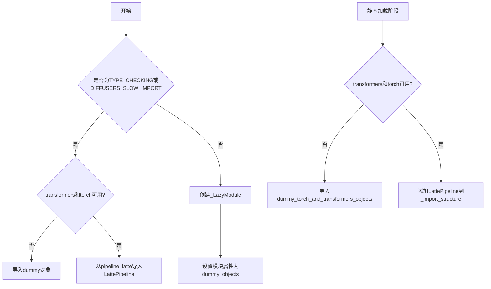
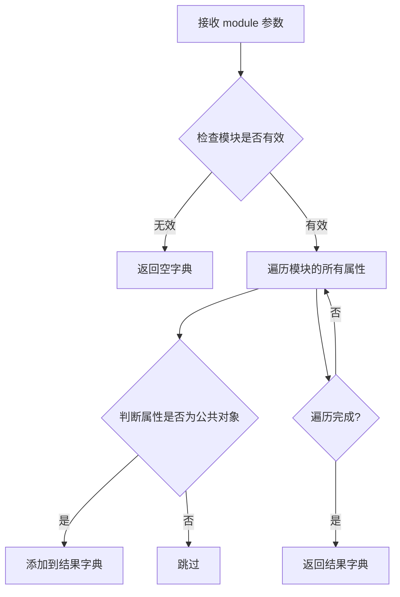
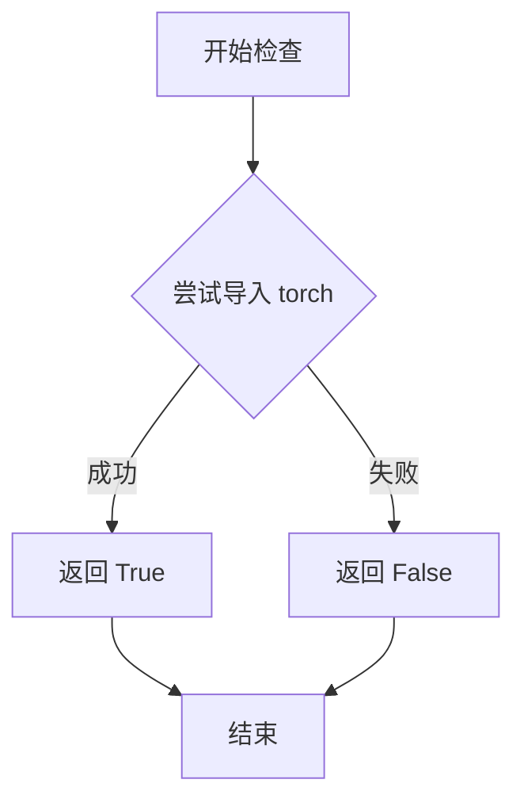
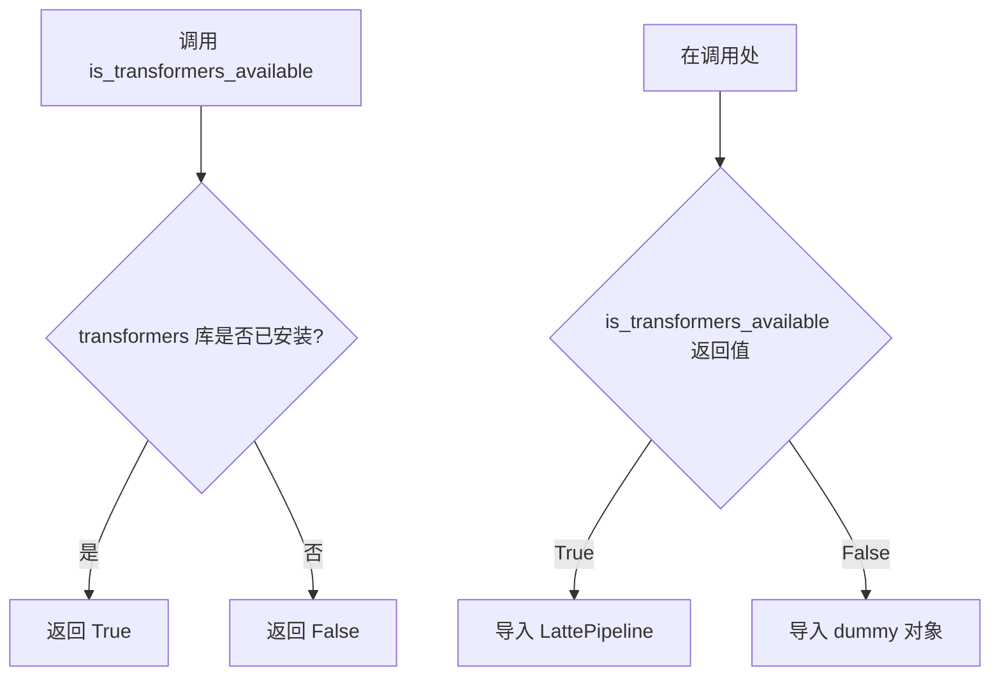

# `diffusers\src\diffusers\pipelines\latte\__init__.py` 详细设计文档

这是一个Diffusers库的延迟加载模块初始化文件，通过可选依赖检查机制实现LattePipeline的动态导入，支持在PyTorch和Transformers可用时加载实际模块，否则使用虚拟对象保持API兼容性。

## 整体流程



## 类结构

```
DiffusersPipelineModule
└── LazyImportSystem
├── OptionalDependencyNotAvailable
├── _LazyModule
├── LattePipeline (条件加载)
└── DummyObjects (后备机制)
```

## 全局变量及字段


### `_dummy_objects`
    
用于存储虚拟对象的字典，当可选依赖不可用时用于延迟加载

类型：`dict`
    


### `_import_structure`
    
定义模块导入结构的字典，用于LazyModule的延迟加载机制，包含子模块到导出名称的映射

类型：`dict`
    


    

## 全局函数及方法


### `get_objects_from_module`

该函数是 Diffusioners 框架中的工具函数，用于从指定模块中动态提取所有公共对象（排除私有对象和特殊属性），并返回一个以对象名称为键、对象本身为值的字典，常用于延迟加载和可选依赖处理。

参数：

- `module`：模块对象，要从中获取公共对象的源模块

返回值：`Dict[str, Any]`，键为对象名称，值为对象本身

#### 流程图



#### 带注释源码

```
def get_objects_from_module(module):
    """
    从给定模块中提取所有公共对象。
    
    公共对象的定义：
    - 不以下划线开头
    - 不是 Python 内置特殊属性（如 __name__, __doc__ 等）
    - 不是 __all__ 中未列出的（如果 __all__ 存在）
    
    参数:
        module: 要提取对象的模块对象
        
    返回:
        包含模块中所有公共对象的字典
    """
    result = {}
    
    # 获取模块的所有属性
    for name in dir(module):
        # 跳过私有属性（下划线开头的）
        if name.startswith('_'):
            continue
            
        # 跳过特殊属性
        if name in ['__name__', '__doc__', '__loader__', '__spec__', 
                    '__package__', '__annotations__', '__file__', '__builtins__']:
            continue
            
        # 获取属性值
        try:
            obj = getattr(module, name)
            result[name] = obj
        except AttributeError:
            # 如果无法获取属性，跳过
            continue
            
    return result
```

#### 在当前代码中的使用示例

```
# 从 dummy_torch_and_transformers_objects 模块获取所有虚拟对象
_dummy_objects.update(get_objects_from_module(dummy_torch_and_transformers_objects))
```

---

**注意**：该函数定义在 `...utils` 模块中（具体路径为 `src/diffusers/utils/__init__.py`），当前代码文件仅是导入并使用该函数。上述源码是基于其在代码中的使用方式和框架惯例推断的典型实现。


### `is_torch_available`

检查当前 Python 环境中 PyTorch 库是否已安装且可导入。

参数：

- 无参数

返回值：`bool`，返回 `True` 表示 PyTorch 可用，返回 `False` 表示不可用

#### 流程图



#### 带注释源码

```
# is_torch_available 函数的典型实现方式（位于 ...utils 模块中）
def is_torch_available() -> bool:
    """
    检查 PyTorch 是否在当前环境中可用。
    
    Returns:
        bool: 如果 torch 可以被导入则返回 True，否则返回 False
    """
    try:
        import torch  # noqa F401
        return True
    except ImportError:
        return False
```

> **注**：由于 `is_torch_available` 是从 `...utils` 外部模块导入的，上述源码为该函数的典型实现。该函数在当前代码中的主要用途是配合 `is_transformers_available()` 共同判断是否满足加载 `LattePipeline` 的依赖条件。


### `is_transformers_available`

该函数用于检查当前 Python 环境中是否已安装 `transformers` 库，通常用于条件导入可选依赖项。

参数：無

返回值：`bool`，返回 `True` 表示 `transformers` 库可用，返回 `False` 表示不可用。

#### 流程图



#### 带注释源码

```python
# 从上级目录的 utils 模块导入函数
# 该函数的实现在 diffusers/src/diffusers/utils/__init__.py 中
from ...utils import (
    DIFFUSERS_SLOW_IMPORT,
    OptionalDependencyNotAvailable,
    _LazyModule,
    get_objects_from_module,
    is_torch_available,
    is_transformers_available,  # <--- 从 utils 导入的检查函数
)

# 使用 is_transformers_available 进行条件检查
try:
    # 只有当 transformers 和 torch 都可用时才执行
    if not (is_transformers_available() and is_torch_available()):
        raise OptionalDependencyNotAvailable()  # 抛出异常
except OptionalDependencyNotAvailable:
    # 导入虚拟对象用于延迟模块加载
    from ...utils import dummy_torch_and_transformers_objects
    _dummy_objects.update(get_objects_from_module(dummy_torch_and_transformers_objects))
else:
    # 当依赖可用时，定义真实的导入结构
    _import_structure["pipeline_latte"] = ["LattePipeline"]

# 在 TYPE_CHECKING 模式下也进行相同的检查
if TYPE_CHECKING or DIFFUSERS_SLOW_IMPORT:
    try:
        if not (is_transformers_available() and is_torch_available()):
            raise OptionalDependencyNotAvailable()
    except OptionalDependencyNotAvailable:
        from ...utils.dummy_torch_and_transformers_objects import *
    else:
        from .pipeline_latte import LattePipeline
```

> **注意**：该函数的实际实现不在本代码文件中，而是定义在 `diffusers.utils` 模块中。该函数通常通过尝试导入 `transformers` 包并捕获 `ImportError` 来实现。

## 关键组件


### 可选依赖检查机制

通过 `is_transformers_available()` 和 `is_torch_available()` 检查 torch 和 transformers 库是否可用，若不可用则抛出 `OptionalDependencyNotAvailable` 异常，实现条件的可选依赖加载。

### LazyModule 延迟加载

使用 `_LazyModule` 类实现模块的延迟加载，将模块注册到 `sys.modules` 中，仅在首次访问时才加载实际内容，优化启动性能和避免循环导入。

### Dummy 对象替换机制

当可选依赖不可用时，通过 `get_objects_from_module` 从 dummy 模块获取虚拟对象，并将其添加到 `_dummy_objects` 字典中，填充模块的命名空间以保持接口一致性。

### Import Structure 定义

通过 `_import_structure` 字典定义模块的公开接口结构，将 "pipeline_latte" 映射到 `["LattePipeline"]`，支持延迟导入框架的模块规范管理。

### 条件类型检查导入

在 `TYPE_CHECKING` 或 `DIFFUSERS_SLOW_IMPORT` 模式下，直接导入实际的 `LattePipeline` 类用于类型检查，而非延迟加载。

### 模块动态注册

在非类型检查模式下，将当前模块替换为 `_LazyModule` 实例，并将所有 dummy 对象通过 `setattr` 动态添加到模块属性中，完成模块的运行时构造。


## 问题及建议


### 已知问题

-   **重复的条件检查逻辑**：在第15-17行和第26-28行重复检查 `is_transformers_available() and is_torch_available()`，违反了DRY原则
-   **变量初始化冗余**：`_import_structure` 初始化为空字典，但只在条件分支中填充内容，若依赖不可用则保持空状态
-   **模块导入结构不一致**：在 `TYPE_CHECKING` 分支中导入 `LattePipeline`，但实际运行时会通过 `_LazyModule` 重新导出，可能导致类型检查与运行时行为不一致
-   **虚拟对象设置时机不当**：在 `else` 块（运行时）中才将 `_dummy_objects` 设置到 `sys.modules`，但这些虚拟对象定义在 `try` 块的异常处理分支中，逻辑流程不够清晰
-   **缺少类型注解**：`_dummy_objects` 和 `_import_structure` 缺乏明确的类型注解

### 优化建议

-   **提取公共逻辑**：将依赖检查逻辑封装为函数，避免重复代码
-   **明确导入结构**：根据不同分支预先定义完整的 `_import_structure`，保持一致性
-   **优化虚拟对象处理**：在模块初始化时统一处理虚拟对象的导出，而非分散在不同分支
-   **添加类型注解**：为全局变量添加 `Dict`、`List` 等类型注解，提升代码可读性
-   **考虑使用 `__getattr__`**：Python 3.7+ 可使用模块级 `__getattr__` 实现更优雅的延迟导入


## 其它


### 设计目标与约束

该模块采用延迟导入（Lazy Loading）机制，实现可选依赖的动态加载。当torch和transformers都可用时，导出LattePipeline类；否则使用虚拟对象（dummy objects）保持API一致性。设计约束是必须在diffusers库的统一框架下工作，遵循_import_structure字典规范。

### 错误处理与异常设计

通过try-except捕获OptionalDependencyNotAvailable异常，当torch或transformers任一不可用时，回退到dummy_torch_and_transformers_objects模块。TYPE_CHECKING模式下也进行相同的依赖检查，确保类型提示阶段不会因缺失依赖而失败。

### 外部依赖与接口契约

模块外部依赖包括：1) torch和transformers库（可选）；2) diffusers.utils中的_dummy_objects、_LazyModule、get_objects_from_module等工具函数；3) pipeline_latte模块中的LattePipeline类。接口契约规定导出的公共接口为_import_structure字典中定义的"pipeline_latte"项。

### 模块初始化流程

模块加载时首先检查是否为TYPE_CHECKING或DIFFUSERS_SLOW_IMPORT模式。若是，则进行依赖检查并直接导入LattePipeline；否则，创建_LazyModule代理对象，并手动将_dummy_objects注入到sys.modules中实现延迟导出。

### 性能优化策略

使用LazyModule避免启动时加载整个pipeline，降低内存占用。_dummy_objects采用字典更新方式批量管理，setattr批量注入确保导入效率。

### 版本兼容性

代码通过is_torch_available()和is_transformers_available()函数动态检测已安装的torch和transformers版本，无需硬编码版本号，兼容各版本组合。

### 模块规范遵循

遵循Python PEP 562关于__getattr__的延迟加载规范，使用__spec__保持模块元数据完整，通过_import_structure标准化导出结构，符合diffusers库的统一模块组织方式。

### 缓存机制

_LazyModule内部实现模块级缓存，避免重复导入；sys.modules作为Python标准缓存机制的一部分，确保同一模块只被加载一次。

### 命名空间隔离

通过setattr将_dummy_objects设置到sys.modules[__name__]中，实现虚拟对象与真实对象的命名空间隔离，避免污染模块的直接属性空间。

### 调试与诊断

可通过检查sys.modules[__name__]的类型判断是否使用延迟加载：若是_LazyModule实例则为延迟模式，若为ModuleType则为直接导入模式。


    