# `diffusers\src\diffusers\pipelines\latte\pipeline_latte.py` 详细设计文档

LattePipeline是一个用于文本到视频生成的扩散管道，利用T5文本编码器和LatteTransformer3DModel进行视频latents的去噪，并通过VAE解码生成最终视频帧。该管道支持分类器自由引导、时间步自定义、内存优化等功能。

## 整体流程

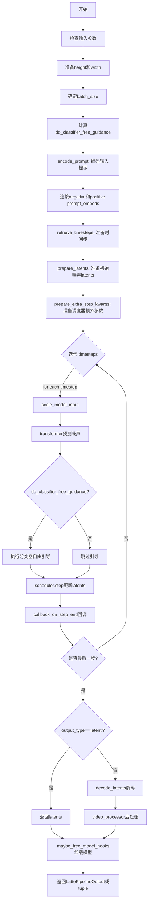

## 类结构

```
DiffusionPipeline (基类)
└── LattePipeline
    ├── LattePipelineOutput (数据类)
    └── 辅助函数: retrieve_timesteps
```

## 全局变量及字段


### `logger`
    
模块级日志记录器

类型：`logging.Logger`
    


### `XLA_AVAILABLE`
    
指示torch_xla是否可用的布尔标志

类型：`bool`
    


### `EXAMPLE_DOC_STRING`
    
包含LattePipeline使用示例的文档字符串

类型：`str`
    


### `bad_punct_regex`
    
用于清理特殊标点符号的正则表达式

类型：`re.Pattern`
    


### `LattePipelineOutput.frames`
    
生成的视频帧张量

类型：`torch.Tensor`
    


### `LattePipeline.bad_punct_regex`
    
用于清理特殊标点符号的正则表达式

类型：`re.Pattern`
    


### `LattePipeline._optional_components`
    
可选组件列表 ['tokenizer', 'text_encoder']

类型：`list`
    


### `LattePipeline.model_cpu_offload_seq`
    
模型CPU卸载顺序 'text_encoder->transformer->vae'

类型：`str`
    


### `LattePipeline._callback_tensor_inputs`
    
回调函数需要的张量输入列表

类型：`list`
    


### `LattePipeline.vae_scale_factor`
    
VAE缩放因子，基于VAE块通道数计算

类型：`int`
    


### `LattePipeline.video_processor`
    
视频处理器用于视频后处理

类型：`VideoProcessor`
    


### `LattePipeline.tokenizer`
    
T5分词器

类型：`T5Tokenizer`
    


### `LattePipeline.text_encoder`
    
T5文本编码器

类型：`T5EncoderModel`
    


### `LattePipeline.vae`
    
VAE模型

类型：`AutoencoderKL`
    


### `LattePipeline.transformer`
    
LatteTransformer3DModel去噪模型

类型：`LatteTransformer3DModel`
    


### `LattePipeline.scheduler`
    
扩散调度器

类型：`KarrasDiffusionSchedulers`
    
    

## 全局函数及方法


### `retrieve_timesteps`

该函数负责调用调度器的 `set_timesteps` 方法并从中检索时间步。它处理自定义时间步和自定义 sigma 值，支持三种模式：使用自定义时间步、使用自定义 sigma，或使用默认的推理步数。

参数：

- `scheduler`：`SchedulerMixin`，要从中获取时间步的调度器
- `num_inference_steps`：`int | None`，使用预训练模型生成样本时使用的扩散步数，如果使用此参数，则 `timesteps` 必须为 `None`
- `device`：`str | torch.device | None`，时间步应移动到的设备，如果为 `None`，则不移动时间步
- `timesteps`：`list[int] | Optional`，用于覆盖调度器时间步间隔策略的自定义时间步，如果传递 `timesteps`，则 `num_inference_steps` 和 `sigmas` 必须为 `None`
- `sigmas`：`list[float] | Optional`，用于覆盖调度器时间步间隔策略的自定义 sigma，如果传递 `sigmas`，则 `num_inference_steps` 和 `timesteps` 必须为 `None`
- `**kwargs`：任意关键字参数，将提供给 `scheduler.set_timesteps`

返回值：`tuple[torch.Tensor, int]`，元组第一个元素是调度器的时间步调度，第二个元素是推理步数

#### 流程图

```mermaid
flowchart TD
    A[开始] --> B{检查: timesteps 和 sigmas 是否同时存在?}
    B -- 是 --> C[抛出 ValueError: 只能选择一个]
    B -- 否 --> D{检查: timesteps 是否存在?}
    D -- 是 --> E[检查调度器是否支持 timesteps]
    E -- 不支持 --> F[抛出 ValueError]
    E -- 支持 --> G[调用 scheduler.set_timesteps with timesteps]
    G --> H[获取 scheduler.timesteps]
    H --> I[计算 num_inference_steps = len(timesteps)]
    D -- 否 --> J{检查: sigmas 是否存在?}
    J -- 是 --> K[检查调度器是否支持 sigmas]
    K -- 不支持 --> L[抛出 ValueError]
    K -- 支持 --> M[调用 scheduler.set_timesteps with sigmas]
    M --> N[获取 scheduler.timesteps]
    N --> O[计算 num_inference_steps = len(timesteps)]
    J -- 否 --> P[调用 scheduler.set_timesteps with num_inference_steps]
    P --> Q[获取 scheduler.timesteps]
    Q --> R[返回 timesteps, num_inference_steps]
    I --> R
    O --> R
```

#### 带注释源码

```python
# Copied from diffusers.pipelines.stable_diffusion.pipeline_stable_diffusion.retrieve_timesteps
def retrieve_timesteps(
    scheduler,
    num_inference_steps: int | None = None,
    device: str | torch.device | None = None,
    timesteps: list[int] | None = None,
    sigmas: list[float] | None = None,
    **kwargs,
):
    r"""
    Calls the scheduler's `set_timesteps` method and retrieves timesteps from the scheduler after the call. Handles
    custom timesteps. Any kwargs will be supplied to `scheduler.set_timesteps`.

    Args:
        scheduler (`SchedulerMixin`):
            The scheduler to get timesteps from.
        num_inference_steps (`int`):
            The number of diffusion steps used when generating samples with a pre-trained model. If used, `timesteps`
            must be `None`.
        device (`str` or `torch.device`, *optional*):
            The device to which the timesteps should be moved to. If `None`, the timesteps are not moved.
        timesteps (`list[int]`, *optional*):
            Custom timesteps used to override the timestep spacing strategy of the scheduler. If `timesteps` is passed,
            `num_inference_steps` and `sigmas` must be `None`.
        sigmas (`list[float]`, *optional*):
            Custom sigmas used to override the timestep spacing strategy of the scheduler. If `sigmas` is passed,
            `num_inference_steps` and `timesteps` must be `None`.

    Returns:
        `tuple[torch.Tensor, int]`: A tuple where the first element is the timestep schedule from the scheduler and the
        second element is the number of inference steps.
    """
    # 验证输入参数：timesteps 和 sigmas 不能同时提供
    if timesteps is not None and sigmas is not None:
        raise ValueError("Only one of `timesteps` or `sigmas` can be passed. Please choose one to set custom values")
    
    # 处理自定义 timesteps 的情况
    if timesteps is not None:
        # 通过检查调度器的 set_timesteps 方法签名来验证是否支持自定义 timesteps
        accepts_timesteps = "timesteps" in set(inspect.signature(scheduler.set_timesteps).parameters.keys())
        if not accepts_timesteps:
            raise ValueError(
                f"The current scheduler class {scheduler.__class__}'s `set_timesteps` does not support custom"
                f" timestep schedules. Please check whether you are using the correct scheduler."
            )
        # 调用调度器的 set_timesteps 方法，传入自定义 timesteps
        scheduler.set_timesteps(timesteps=timesteps, device=device, **kwargs)
        # 从调度器获取更新后的 timesteps
        timesteps = scheduler.timesteps
        # 计算推理步数
        num_inference_steps = len(timesteps)
    # 处理自定义 sigmas 的情况
    elif sigmas is not None:
        # 验证调度器是否支持自定义 sigmas
        accept_sigmas = "sigmas" in set(inspect.signature(scheduler.set_timesteps).parameters.keys())
        if not accept_sigmas:
            raise ValueError(
                f"The current scheduler class {scheduler.__class__}'s `set_timesteps` does not support custom"
                f" sigmas schedules. Please check whether you are using the correct scheduler."
            )
        # 调用调度器的 set_timesteps 方法，传入自定义 sigmas
        scheduler.set_timesteps(sigmas=sigmas, device=device, **kwargs)
        # 从调度器获取更新后的 timesteps
        timesteps = scheduler.timesteps
        # 计算推理步数
        num_inference_steps = len(timesteps)
    # 处理默认情况：使用 num_inference_steps
    else:
        scheduler.set_timesteps(num_inference_steps, device=device, **kwargs)
        timesteps = scheduler.timesteps
    
    # 返回 timesteps 数组和推理步数
    return timesteps, num_inference_steps
```


### `LattePipeline.__init__`

这是 `LattePipeline` 类的构造函数，用于初始化文本到视频生成管道。它接收所有必要的模型组件（tokenizer、text_encoder、vae、transformer、scheduler），并将它们注册到管道中，同时初始化视频处理器和VAE缩放因子。

参数：

- `tokenizer`：`T5Tokenizer`，T5分词器，用于将文本 prompt 转换为 token 序列
- `text_encoder`：`T5EncoderModel`，冻结的 T5 文本编码器，用于将 token 序列编码为文本嵌入
- `vae`：`AutoencoderKL`，变分自编码器（VAE），用于在潜在表示和视频之间进行编码和解码
- `transformer`：`LatteTransformer3DModel`，文本条件的 3D Transformer 模型，用于对视频潜在表示进行去噪
- `scheduler`：`KarrasDiffusionSchedulers`，Karras 扩散调度器，用于控制去噪过程的噪声调度

返回值：`None`，构造函数不返回任何值

#### 流程图

```mermaid
flowchart TD
    A[__init__ 开始] --> B[调用父类 DiffusionPipeline.__init__]
    B --> C[register_modules: 注册 tokenizer, text_encoder, vae, transformer, scheduler]
    C --> D{self.vae 是否存在?}
    D -->|是| E[计算 vae_scale_factor: 2^(len(vae.config.block_out_channels) - 1)]
    D -->|否| F[vae_scale_factor = 8]
    E --> G[创建 VideoProcessor 实例]
    F --> G
    G --> H[__init__ 结束]
```

#### 带注释源码

```python
def __init__(
    self,
    tokenizer: T5Tokenizer,              # T5 分词器，处理文本输入
    text_encoder: T5EncoderModel,        # T5 文本编码器模型
    vae: AutoencoderKL,                  # VAE 模型，用于编解码视频潜在表示
    transformer: LatteTransformer3DModel, # 3D Transformer 去噪模型
    scheduler: KarrasDiffusionSchedulers, # 扩散调度器
):
    # 调用父类 DiffusionPipeline 的初始化方法
    # 父类会设置一些基础属性如 _execution_device, _current_timestep 等
    super().__init__()

    # 将传入的模型组件注册到当前管道对象中
    # 使得这些组件可以通过 self.tokenizer, self.text_encoder 等属性访问
    # 同时也支持从检查点保存/加载这些组件
    self.register_modules(
        tokenizer=tokenizer,
        text_encoder=text_encoder,
        vae=vae,
        transformer=transformer,
        scheduler=scheduler
    )

    # 计算 VAE 的缩放因子
    # VAE 的 block_out_channels 决定了潜在空间的大小
    # 例如：[128, 256, 512, 512] -> len = 4 -> scale_factor = 2^(4-1) = 8
    # 如果 VAE 不存在，默认缩放因子为 8
    self.vae_scale_factor = 2 ** (len(self.vae.config.block_out_channels) - 1) if getattr(self, "vae", None) else 8

    # 创建视频处理器
    # VideoProcessor 负责视频的预处理和后处理
    # 例如：视频帧的归一化、格式转换等操作
    self.video_processor = VideoProcessor(vae_scale_factor=self.vae_scale_factor)
```


### `LattePipeline.mask_text_embeddings`

该方法用于根据注意力掩码对文本嵌入进行掩码处理。当批量大小为1时，通过切片保留有效token；当批量大小大于1时，使用逐元素乘法应用掩码。这用于在视频生成过程中过滤掉文本嵌入中的填充token。

参数：

-  `emb`：`torch.Tensor`，文本嵌入张量，形状为 [batch, seq_len, hidden_dim] 或 [batch, 1, seq_len, hidden_dim]
-  `mask`：`torch.Tensor`，注意力掩码张量，形状为 [batch, seq_len]

返回值：`tuple[torch.Tensor, int]`，返回包含掩码后嵌入张量的元组，以及有效token数量（keep_index）或原始序列长度

#### 流程图

```mermaid
flowchart TD
    A[开始 mask_text_embeddings] --> B{emb.shape[0] == 1?}
    B -->|Yes| C[计算 keep_index = mask.sum().item]
    B -->|No| D[计算 masked_feature = emb * mask[:, None, :, None]
    C --> E[返回 emb[:, :, :keep_index, :] 和 keep_index]
    D --> F[返回 masked_feature 和 emb.shape[2]]
    E --> G[结束]
    F --> G
```

#### 带注释源码

```
def mask_text_embeddings(self, emb, mask):
    """
    根据注意力掩码对文本嵌入进行掩码处理
    
    参数:
        emb: 文本嵌入张量，形状 [batch, seq_len, hidden_dim] 或 [batch, 1, seq_len, hidden_dim]
        mask: 注意力掩码张量，形状 [batch, seq_len]
    
    返回:
        tuple: (掩码后的嵌入张量, keep_index或序列长度)
    """
    # 判断批量大小是否为1
    if emb.shape[0] == 1:
        # 计算需要保留的token数量（mask中True/1的数量）
        keep_index = mask.sum().item()
        # 切片保留前keep_index个token的嵌入
        # 形状变换: 1, 120, 4096 -> 1, keep_index, 4096
        return emb[:, :, :keep_index, :], keep_index
    else:
        # 对批量大小>1的情况，应用掩码
        # mask[:, None, :, None] 将mask扩展到与emb相同的维度
        # 形状: [batch, 1, seq_len, 1] * [batch, 1, seq_len, hidden_dim]
        masked_feature = emb * mask[:, None, :, None]
        # 返回掩码后的特征和原始序列长度
        return masked_feature, emb.shape[2]
```


### `LattePipeline.encode_prompt`

该方法负责将文本提示（prompt）编码为文本编码器的隐藏状态（hidden states），支持分类器无关引导（Classifier-Free Guidance），并可选地对文本嵌入进行预处理和掩码操作。

参数：

- `prompt`：`str | list[str]`，要编码的提示词
- `do_classifier_free_guidance`：`bool`，是否使用分类器无关引导
- `negative_prompt`：`str`，不参与视频生成的负面提示词
- `num_images_per_prompt`：`int`，每个提示词生成的视频数量
- `device`：`torch.device | None`，用于放置生成嵌入的设备
- `prompt_embeds`：`torch.FloatTensor | None`，预生成的文本嵌入，可用于轻松调整文本输入
- `negative_prompt_embeds`：`torch.FloatTensor | None`，预生成的负面文本嵌入
- `clean_caption`：`bool`，是否在编码前预处理和清理标题
- `mask_feature`：`bool`，是否对文本嵌入进行掩码
- `dtype`：未显式类型指定的数据类型，用于确定嵌入的数据类型

返回值：`tuple`，包含处理后的 prompt_embeds 和 negative_prompt_embeds

#### 流程图

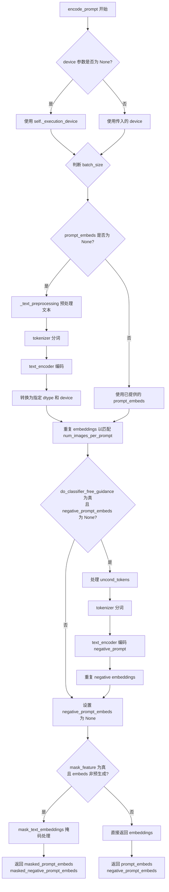

#### 带注释源码

```python
def encode_prompt(
    self,
    prompt: str | list[str],
    do_classifier_free_guidance: bool = True,
    negative_prompt: str = "",
    num_images_per_prompt: int = 1,
    device: torch.device | None = None,
    prompt_embeds: torch.FloatTensor | None = None,
    negative_prompt_embeds: torch.FloatTensor | None = None,
    clean_caption: bool = False,
    mask_feature: bool = True,
    dtype=None,
):
    # 检查 embeddings 是否已预先提供
    embeds_initially_provided = prompt_embeds is not None and negative_prompt_embeds is not None

    # 如果未指定 device，使用执行设备
    if device is None:
        device = self._execution_device

    # 确定 batch_size：基于 prompt 类型或已提供的 embeddings
    if prompt is not None and isinstance(prompt, str):
        batch_size = 1
    elif prompt is not None and isinstance(prompt, list):
        batch_size = len(prompt)
    else:
        batch_size = prompt_embeds.shape[0]

    # 设置最大序列长度
    max_length = 120
    
    # 如果未提供 prompt_embeds，则需要从 prompt 生成
    if prompt_embeds is None:
        # 文本预处理：清理 caption（可选）
        prompt = self._text_preprocessing(prompt, clean_caption=clean_caption)
        
        # 使用 tokenizer 进行分词
        text_inputs = self.tokenizer(
            prompt,
            padding="max_length",
            max_length=max_length,
            truncation=True,
            return_attention_mask=True,
            add_special_tokens=True,
            return_tensors="pt",
        )
        text_input_ids = text_inputs.input_ids
        
        # 检查是否发生了截断
        untruncated_ids = self.tokenizer(prompt, padding="longest", return_tensors="pt").input_ids
        if untruncated_ids.shape[-1] >= text_input_ids.shape[-1] and not torch.equal(
            text_input_ids, untruncated_ids
        ):
            removed_text = self.tokenizer.batch_decode(untruncated_ids[:, max_length - 1 : -1])
            logger.warning(
                "The following part of your input was truncated because CLIP can only handle sequences up to"
                f" {max_length} tokens: {removed_text}"
            )

        # 获取 attention mask 并移至指定设备
        attention_mask = text_inputs.attention_mask.to(device)
        prompt_embeds_attention_mask = attention_mask

        # 使用 text_encoder 生成 embeddings
        prompt_embeds = self.text_encoder(text_input_ids.to(device), attention_mask=attention_mask)
        prompt_embeds = prompt_embeds[0]  # 取隐藏状态
    else:
        # 如果已提供 prompt_embeds，创建默认的 attention mask
        prompt_embeds_attention_mask = torch.ones_like(prompt_embeds)

    # 确定 dtype：优先使用 text_encoder 的 dtype，其次是 transformer 的 dtype
    if self.text_encoder is not None:
        dtype = self.text_encoder.dtype
    elif self.transformer is not None:
        dtype = self.transformer.dtype
    else:
        dtype = None

    # 将 prompt_embeds 转换为指定 dtype 和 device
    prompt_embeds = prompt_embeds.to(dtype=dtype, device=device)

    # 复制 embeddings 以支持每个 prompt 生成多个视频
    bs_embed, seq_len, _ = prompt_embeds.shape
    prompt_embeds = prompt_embeds.repeat(1, num_images_per_prompt, 1)
    prompt_embeds = prompt_embeds.view(bs_embed * num_images_per_prompt, seq_len, -1)
    prompt_embeds_attention_mask = prompt_embeds_attention_mask.view(bs_embed, -1)
    prompt_embeds_attention_mask = prompt_embeds_attention_mask.repeat(num_images_per_prompt, 1)

    # 处理分类器无关引导的无条件 embeddings
    if do_classifier_free_guidance and negative_prompt_embeds is None:
        # 准备无条件 tokens
        uncond_tokens = [negative_prompt] * batch_size if isinstance(negative_prompt, str) else negative_prompt
        uncond_tokens = self._text_preprocessing(uncond_tokens, clean_caption=clean_caption)
        max_length = prompt_embeds.shape[1]
        
        # 分词
        uncond_input = self.tokenizer(
            uncond_tokens,
            padding="max_length",
            max_length=max_length,
            truncation=True,
            return_attention_mask=True,
            add_special_tokens=True,
            return_tensors="pt",
        )
        attention_mask = uncond_input.attention_mask.to(device)

        # 编码负面提示
        negative_prompt_embeds = self.text_encoder(
            uncond_input.input_ids.to(device),
            attention_mask=attention_mask,
        )
        negative_prompt_embeds = negative_prompt_embeds[0]

    # 如果启用 CFG，复制无条件 embeddings
    if do_classifier_free_guidance:
        seq_len = negative_prompt_embeds.shape[1]
        negative_prompt_embeds = negative_prompt_embeds.to(dtype=dtype, device=device)
        negative_prompt_embeds = negative_prompt_embeds.repeat(1, num_images_per_prompt, 1)
        negative_prompt_embeds = negative_prompt_embeds.view(batch_size * num_images_per_prompt, seq_len, -1)
    else:
        negative_prompt_embeds = None

    # 可选：对 embeddings 进行掩码处理
    if mask_feature and not embeds_initially_provided:
        prompt_embeds = prompt_embeds.unsqueeze(1)
        masked_prompt_embeds, keep_indices = self.mask_text_embeddings(prompt_embeds, prompt_embeds_attention_mask)
        masked_prompt_embeds = masked_prompt_embeds.squeeze(1)
        masked_negative_prompt_embeds = (
            negative_prompt_embeds[:, :keep_indices, :] if negative_prompt_embeds is not None else None
        )
        return masked_prompt_embeds, masked_negative_prompt_embeds

    return prompt_embeds, negative_prompt_embeds
```


### `LattePipeline.prepare_extra_step_kwargs`

该函数用于为调度器（scheduler）的步骤准备额外的关键字参数。由于不同的调度器有不同的签名，该函数通过检查调度器的 `step` 方法是否接受 `eta` 和 `generator` 参数来动态构建额外的参数字典。

参数：

- `generator`：`torch.Generator | list[torch.Generator] | None`，用于使生成具有确定性的随机数生成器
- `eta`：`float`，对应 DDIM 论文中的 η 参数，仅在使用 DDIMScheduler 时有效，值应介于 [0, 1] 之间

返回值：`dict`，包含可能需要传递给 scheduler.step() 的额外参数（eta 和/或 generator）

#### 流程图

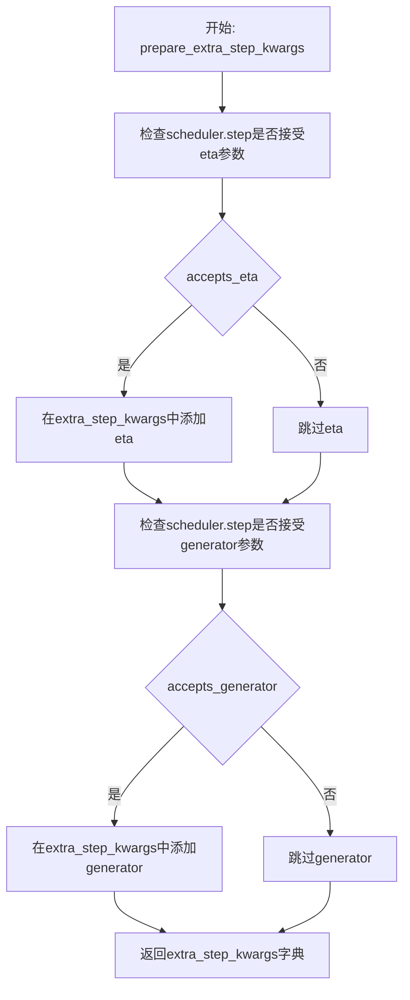

#### 带注释源码

```python
def prepare_extra_step_kwargs(self, generator, eta):
    # 准备调度器步骤的额外参数，因为并非所有调度器都具有相同的签名
    # eta (η) 仅在 DDIMScheduler 中使用，对于其他调度器将被忽略
    # eta 对应 DDIM 论文中的 η：https://huggingface.co/papers/2010.02502
    # 且应该在 [0, 1] 范围内

    # 检查调度器的 step 方法是否接受 eta 参数
    accepts_eta = "eta" in set(inspect.signature(self.scheduler.step).parameters.keys())
    
    # 初始化空字典用于存储额外参数
    extra_step_kwargs = {}
    
    # 如果调度器接受 eta，则将其添加到参数字典中
    if accepts_eta:
        extra_step_kwargs["eta"] = eta

    # 检查调度器是否接受 generator 参数
    accepts_generator = "generator" in set(inspect.signature(self.scheduler.step).parameters.keys())
    
    # 如果调度器接受 generator，则将其添加到参数字典中
    if accepts_generator:
        extra_step_kwargs["generator"] = generator
    
    # 返回构建好的参数字典
    return extra_step_kwargs
```


### `LattePipeline.check_inputs`

该方法用于验证文本到视频生成管道的输入参数是否合法，包括检查图像尺寸是否能被8整除、提示词与嵌入向量的互斥性、回调张量输入的有效性，以及提示词类型和嵌入向量形状的一致性。

参数：

- `prompt`：`str | list[str] | None`，用户提供的文本提示词，用于指导视频生成
- `height`：`int`，生成视频的高度（像素），必须能被8整除
- `width`：`int`，生成视频的宽度（像素），必须能被8整除
- `negative_prompt`：`str | list[str]`，负面提示词，用于指导模型避免生成相关内容
- `callback_on_step_end_tensor_inputs`：`list[str]`，在每个去噪步骤结束时需要传递给回调函数的张量输入列表
- `prompt_embeds`：`torch.FloatTensor | None`，预先计算的文本提示词嵌入向量，与prompt互斥
- `negative_prompt_embeds`：`torch.FloatTensor | None`，预先计算的负面文本提示词嵌入向量，与negative_prompt互斥

返回值：`None`，该方法仅进行输入验证，不返回任何值，若验证失败则抛出ValueError异常

#### 流程图

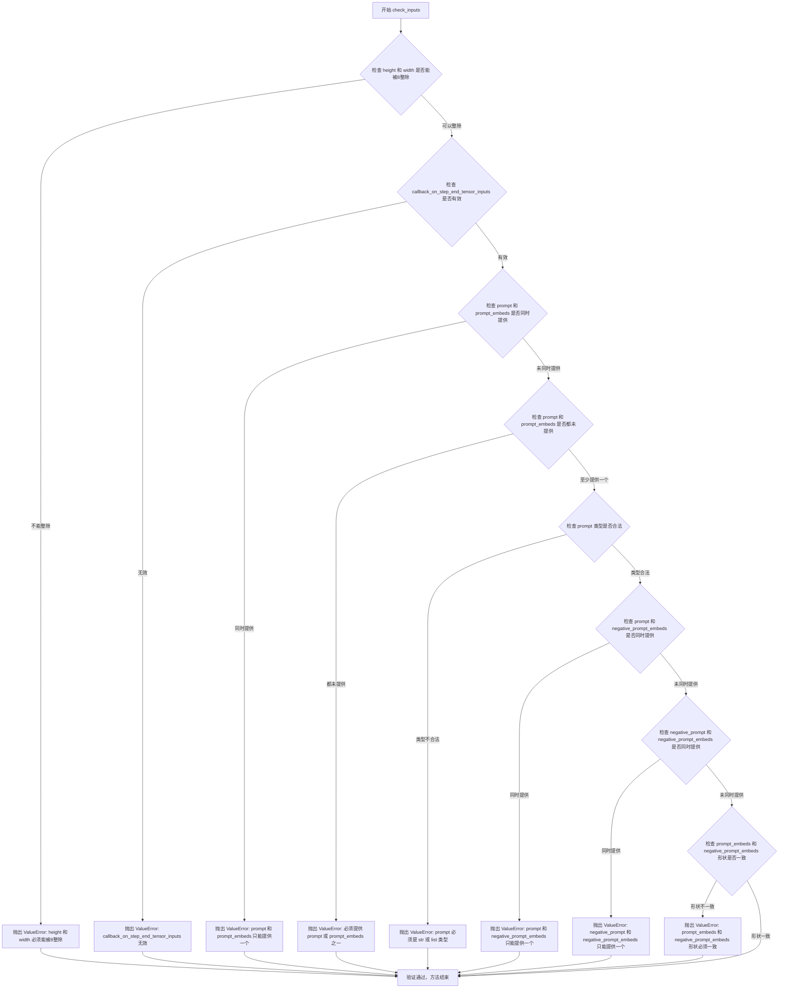

#### 带注释源码

```python
def check_inputs(
    self,
    prompt,
    height,
    width,
    negative_prompt,
    callback_on_step_end_tensor_inputs,
    prompt_embeds=None,
    negative_prompt_embeds=None,
):
    # 检查图像高度和宽度是否能够被8整除，这是VAE编码器的要求
    if height % 8 != 0 or width % 8 != 0:
        raise ValueError(f"`height` and `width` have to be divisible by 8 but are {height} and {width}.")

    # 检查回调函数所需的张量输入是否在允许的列表中
    # 允许的回调张量输入包括: latents, prompt_embeds, negative_prompt_embeds
    if callback_on_step_end_tensor_inputs is not None and not all(
        k in self._callback_tensor_inputs for k in callback_on_step_end_tensor_inputs
    ):
        raise ValueError(
            f"`callback_on_step_end_tensor_inputs` has to be in {self._callback_tensor_inputs}, but found {[k for k in callback_on_step_end_tensor_inputs if k not in self._callback_tensor_inputs]}"
        )
    
    # 检查提示词和提示词嵌入不能同时提供（互斥）
    if prompt is not None and prompt_embeds is not None:
        raise ValueError(
            f"Cannot forward both `prompt`: {prompt} and `prompt_embeds`: {prompt_embeds}. Please make sure to"
            " only forward one of the two."
        )
    # 检查至少要提供提示词或提示词嵌入之一
    elif prompt is None and prompt_embeds is None:
        raise ValueError(
            "Provide either `prompt` or `prompt_embeds`. Cannot leave both `prompt` and `prompt_embeds` undefined."
        )
    # 检查提示词类型必须是字符串或字符串列表
    elif prompt is not None and (not isinstance(prompt, str) and not isinstance(prompt, list)):
        raise ValueError(f"`prompt` has to be of type `str` or `list` but is {type(prompt)}")

    # 检查提示词和负面提示词嵌入不能同时提供（互斥）
    if prompt is not None and negative_prompt_embeds is not None:
        raise ValueError(
            f"Cannot forward both `prompt`: {prompt} and `negative_prompt_embeds`:"
            f" {negative_prompt_embeds}. Please make sure to only forward one of the two."
        )

    # 检查负面提示词和负面提示词嵌入不能同时提供（互斥）
    if negative_prompt is not None and negative_prompt_embeds is not None:
        raise ValueError(
            f"Cannot forward both `negative_prompt`: {negative_prompt} and `negative_prompt_embeds`:"
            f" {negative_prompt_embeds}. Please make sure to only forward one of the two."
        )

    # 如果同时提供了提示词嵌入和负面提示词嵌入，检查它们的形状是否一致
    # 这对于分类器自由引导（Classifier-Free Guidance）很重要
    if prompt_embeds is not None and negative_prompt_embeds is not None:
        if prompt_embeds.shape != negative_prompt_embeds.shape:
            raise ValueError(
                "`prompt_embeds` and `negative_prompt_embeds` must have the same shape when passed directly, but"
                f" got: `prompt_embeds` {prompt_embeds.shape} != `negative_prompt_embeds`"
                f" {negative_prompt_embeds.shape}."
            )
```


### `LattePipeline._text_preprocessing`

该方法用于对输入的文本提示进行预处理，支持两种模式：简单的小写转换和strip处理，或者复杂的标题清理处理（需要BeautifulSoup和ftfy库支持）。

参数：

- `text`：Union[str, list, tuple]，待处理的文本提示，可以是单个字符串或字符串列表/元组
- `clean_caption`：bool，是否进行深度清理标志，默认为False

返回值：`list`，处理后的文本列表

#### 流程图

```mermaid
flowchart TD
    A[开始 _text_preprocessing] --> B{clean_caption为True?}
    B -->|是| C{bs4库可用?}
    C -->|否| D[警告并设置clean_caption=False]
    C -->|是| E{ftfy库可用?}
    D --> F
    E -->|否| G[警告并设置clean_caption=False]
    E -->|是| H[clean_caption保持True]
    G --> F
    H --> F
    B -->|否| F
    F --> I{text是否为tuple或list?}
    I -->|否| J[将text包装为列表: text = [text]]
    I -->|是| K
    J --> K
    K[遍历text列表中的每个元素] --> L{clean_caption为True?}
    L -->|是| M[调用_clean_caption处理两次]
    L -->|否| N[text.lower().strip()]
    M --> O
    N --> O
    O[将处理结果加入结果列表] --> P[返回结果列表]
```

#### 带注释源码

```python
def _text_preprocessing(self, text, clean_caption=False):
    """
    对文本进行预处理，支持简单处理和深度清理两种模式
    
    Args:
        text: 输入的文本，可以是单个字符串或字符串列表
        clean_caption: 是否进行深度清理
    
    Returns:
        处理后的文本列表
    """
    
    # 检查BeautifulSoup4库是否可用，若clean_caption为True但库不可用则发出警告并禁用清理
    if clean_caption and not is_bs4_available():
        logger.warning(BACKENDS_MAPPING["bs4"][-1].format("Setting `clean_caption=True`"))
        logger.warning("Setting `clean_caption` to False...")
        clean_caption = False

    # 检查ftfy库是否可用，若clean_caption为True但库不可用则发出警告并禁用清理
    if clean_caption and not is_ftfy_available():
        logger.warning(BACKENDS_MAPPING["ftfy"][-1].format("Setting `clean_caption=True`"))
        logger.warning("Setting `clean_caption` to False...")
        clean_caption = False

    # 统一转换为列表格式，便于统一处理
    if not isinstance(text, (tuple, list)):
        text = [text]

    # 定义内部处理函数，对单个文本进行实际处理
    def process(text: str):
        # 如果启用深度清理，则调用_clean_caption进行两次处理以确保清理彻底
        if clean_caption:
            text = self._clean_caption(text)
            text = self._clean_caption(text)
        else:
            # 否则只进行小写转换和首尾空白去除
            text = text.lower().strip()
        return text

    # 对列表中每个文本元素应用处理函数，返回处理后的列表
    return [process(t) for t in text]
```


### `LattePipeline._clean_caption`

该方法是一个私有实例方法，用于清洗和预处理文本标题。它通过URL解码、HTML解析、特殊字符移除、正则表达式过滤等多种手段，将原始文本转换为干净、标准化的格式，便于后续的文本编码处理。

**参数：**

-  `caption`：任意类型，待清洗的文本标题，会被转换为字符串处理

**返回值：** `str`，返回清洗处理后的文本字符串

#### 流程图

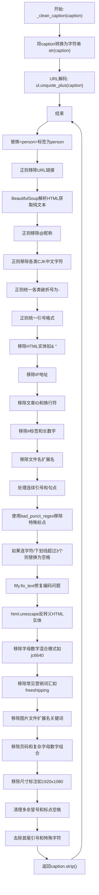

#### 带注释源码

```python
def _clean_caption(self, caption):
    # 将输入转换为字符串类型，确保后续处理的一致性
    caption = str(caption)
    
    # URL解码处理，将URL编码的文字还原（如%20转换为空格）
    caption = ul.unquote_plus(caption)
    
    # 去除首尾空白并转换为小写
    caption = caption.strip().lower()
    
    # 将&lt;person&gt;标签替换为person，处理特殊标记
    caption = re.sub("<person>", "person", caption)
    
    # URLs: 使用正则表达式移除http/https开头的URL
    # 匹配以http:或https:开头或是常见域名(com/co/ru/net/org/edu/gov/it)结尾的URL
    caption = re.sub(
        r"\b((?:https?:(?:\/{1,3}|[a-zA-Z0-9%])|[a-zA-Z0-9.\-]+[.](?:com|co|ru|net|org|edu|gov|it)[\w/-]*\b\/?(?!@)))",
        "",
        caption,
    )
    
    # URLs: 移除www.开头的URL
    caption = re.sub(
        r"\b((?:www:(?:\/{1,3}|[a-zA-Z0-9%])|[a-zA-Z0-9.\-]+[.](?:com|co|ru|net|org|edu|gov|it)[\w/-]*\b\/?(?!@)))",
        "",
        caption,
    )
    
    # html: 使用BeautifulSoup解析HTML并提取纯文本，移除HTML标签
    caption = BeautifulSoup(caption, features="html.parser").text

    # @&lt;nickname&gt;: 移除Twitter/社交媒体@用户名
    caption = re.sub(r"@[\w\d]+\b", "", caption)

    # CJK字符清理：移除各类中文字符范围
    # 31C0—31EF CJK Strokes (CJK笔画)
    caption = re.sub(r"[\u31c0-\u31ef]+", "", caption)
    # 31F0—31FF Katakana Phonetic Extensions (片假名语音扩展)
    caption = re.sub(r"[\u31f0-\u31ff]+", "", caption)
    # 3200—32FF Enclosed CJK Letters and Months (带圈CJK字母和月份)
    caption = re.sub(r"[\u3200-\u32ff]+", "", caption)
    # 3300—33FF CJK Compatibility (CJK兼容字符)
    caption = re.sub(r"[\u3300-\u33ff]+", "", caption)
    # 3400—4DBF CJK Unified Ideographs Extension A (CJK统一表意文字扩展A)
    caption = re.sub(r"[\u3400-\u4dbf]+", "", caption)
    # 4DC0—4DFF Yijing Hexagram Symbols (易经六十四卦符号)
    caption = re.sub(r"[\u4dc0-\u4dff]+", "", caption)
    # 4E00—9FFF CJK Unified Ideographs (CJK统一表意文字)
    caption = re.sub(r"[\u4e00-\u9fff]+", "", caption)

    # 所有类型的破折号统一转换为 "-"
    # 包含Unicode各种语言的破折号字符
    caption = re.sub(
        r"[\u002D\u058A\u05BE\u1400\u1806\u2010-\u2015\u2E17\u2E1A\u2E3A\u2E3B\u2E40\u301C\u3030\u30A0\uFE31\uFE32\uFE58\uFE63\uFF0D]+",
        "-",
        caption,
    )

    # 引号统一：将各种语言的单双引号统一为标准形式
    caption = re.sub(r"[`´«»""¨]", '"', caption)
    caption = re.sub(r"['']", "'", caption)

    # &quot;: 移除HTML引号实体，可选移除末尾的?
    caption = re.sub(r"&quot;?", "", caption)
    # &amp: 移除HTML的&符号实体
    caption = re.sub(r"&amp", "", caption)

    # ip addresses: 移除IPv4地址
    caption = re.sub(r"\d{1,3}\.\d{1,3}\.\d{1,3}\.\d{1,3}", " ", caption)

    # article ids: 移除文章ID格式 (如 "12:45 " 结尾)
    caption = re.sub(r"\d:\d\d\s+$", "", caption)

    # \n: 将反斜杠n转换为空格
    caption = re.sub(r"\\n", " ", caption)

    # "#123": 移除1-3位数字的hashtag
    caption = re.sub(r"#\d{1,3}\b", "", caption)
    // "#12345..": 移除5位以上数字的hashtag
    caption = re.sub(r"#\d{5,}\b", "", caption)
    // "123456..": 移除6位以上的纯数字
    caption = re.sub(r"\b\d{6,}\b", "", caption)
    // filenames: 移除常见图片/视频/文档文件名
    caption = re.sub(r"[\S]+\.(?:png|jpg|jpeg|bmp|webp|eps|pdf|apk|mp4)", "", caption)

    // 连续两个以上引号替换为单个引号 (如AUSVERKAUFT)
    caption = re.sub(r"[\"']{2,}", r'"', caption)
    // 连续两个以上句点替换为空格
    caption = re.sub(r"[\.]{2,}", r" ", caption)

    // 使用类级别定义的bad_punct_regex移除特殊符号(#®•©™&@·º½¾¿¡§~等)
    caption = re.sub(self.bad_punct_regex, r" ", caption)
    // 移除 " . " 这样的孤立句点
    caption = re.sub(r"\s+\.\s+", r" ", caption)

    // 如果连字符或下划线出现超过3次，将其替换为空格
    // 例如: this-is-my-cute-cat -> this is my cute cat
    regex2 = re.compile(r"(?:\-|\_)")
    if len(re.findall(regex2, caption)) > 3:
        caption = re.sub(regex2, " ", caption)

    // 使用ftfy库修复文本编码问题(mojibake)
    caption = ftfy.fix_text(caption)
    // 递归反转义HTML实体，处理嵌套的HTML实体
    caption = html.unescape(html.unescape(caption))

    // 移除字母+数字混合模式(如用户名jc6640)
    caption = re.sub(r"\b[a-zA-Z]{1,3}\d{3,15}\b", "", caption)  // jc6640
    caption = re.sub(r"\b[a-zA-Z]+\d+[a-zA-Z]+\b", "", caption)  // jc6640vc
    caption = re.sub(r"\b\d+[a-zA-Z]+\d+\b", "", caption)  // 6640vc231

    // 移除常见营销词汇
    caption = re.sub(r"(worldwide\s+)?(free\s+)?shipping", "", caption)
    caption = re.sub(r"(free\s)?download(\sfree)?", "", caption)
    caption = re.sub(r"\bclick\b\s(?:for|on)\s\w+", "", caption)
    // 移除图片文件扩展名关键词
    caption = re.sub(r"\b(?:png|jpg|jpeg|bmp|webp|eps|pdf|apk|mp4)(\simage[s]?)?", "", caption)
    // 移除页码
    caption = re.sub(r"\bpage\s+\d+\b", "", caption)

    // 移除复杂字母数字组合
    caption = re.sub(r"\b\d*[a-zA-Z]+\d+[a-zA-Z]+\d+[a-zA-Z\d]*\b", r" ", caption)  // j2d1a2a...

    // 移除尺寸标注(如1920x1080或1920×1080)
    caption = re.sub(r"\b\d+\.?\d*[xх×]\d+\.?\d*\b", "", caption)

    // 修复冒号周围空格
    caption = re.sub(r"\b\s+\:\s+", r": ", caption)
    // 在句点/逗号/斜杠后添加空格(如果后面不是字母数字)
    caption = re.sub(r"(\D[,\./])\b", r"\1 ", caption)
    // 合并多个空格为单个空格
    caption = re.sub(r"\s+", " ", caption)

    // 去除首尾空格
    caption.strip()

    // 去除首尾引号
    caption = re.sub(r"^[\"\']([\w\W]+)[\"\']$", r"\1", caption)
    // 去除首部的特殊字符
    caption = re.sub(r"^[\'\_,\-\:;]", r"", caption)
    // 去除尾部的特殊字符
    caption = re.sub(r"[\'\_,\-\:\-\+]$", r"", caption)
    // 去除首部以句点开头的非空格单词
    caption = re.sub(r"^\.\S+$", "", caption)

    // 返回最终清洗后的文本
    return caption.strip()
```


### `LattePipeline.prepare_latents`

该方法负责为视频生成准备初始的潜在向量（Latents）。它根据批大小、通道数、帧数以及调整大小后的高度和宽度计算潜在张量的形状。如果调用者未提供潜在向量，则使用 `randn_tensor` 生成随机噪声；否则，直接使用传入的潜在向量并将其移动到指定设备。最后，根据调度器（Scheduler）定义的初始噪声标准差（`init_noise_sigma`）对潜在向量进行缩放，以适配扩散过程的起始条件。

参数：

- `batch_size`：`int`，批处理大小，决定生成视频的数量。
- `num_channels_latents`：`int`，潜在空间的通道数，通常对应于 Transformer 模型的输入通道数。
- `num_frames`：`int`，要生成的视频帧数。
- `height`：`int`，目标视频的高度（像素）。
- `width`：`int`，目标视频的宽度（像素）。
- `dtype`：`torch.dtype`，生成潜在向量所使用的数据类型（如 `torch.float16`）。
- `device`：`torch.device`，生成潜在向量所在的设备（如 `cuda` 或 `cpu`）。
- `generator`：`torch.Generator`，可选的随机数生成器，用于确保生成的可重复性。
- `latents`：`torch.Tensor | None`，可选的预生成潜在向量。如果为 `None`，则重新生成噪声。

返回值：`torch.Tensor`，处理或生成后的潜在向量张量，形状为 `(batch_size, num_channels_latents, num_frames, height // vae_scale_factor, width // vae_scale_factor)`。

#### 流程图

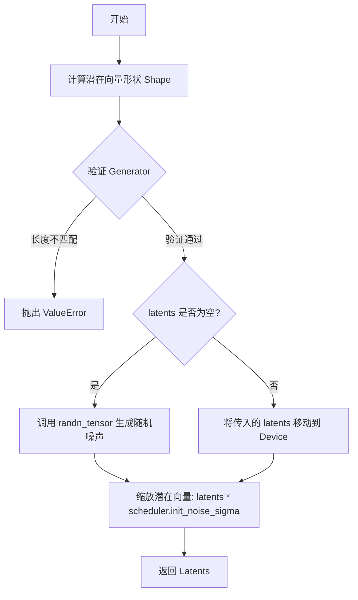

#### 带注释源码

```python
def prepare_latents(
    self, batch_size, num_channels_latents, num_frames, height, width, dtype, device, generator, latents=None
):
    # 1. 计算潜在向量的形状
    # 形状维度: [batch, channels, frames, latent_height, latent_width]
    # height 和 width 需要除以 vae_scale_factor (通常为 8) 转换为潜在空间的分辨率
    shape = (
        batch_size,
        num_channels_latents,
        num_frames,
        height // self.vae_scale_factor,
        width // self.vae_scale_factor,
    )
    
    # 2. 验证传入的生成器列表长度是否与批大小匹配
    if isinstance(generator, list) and len(generator) != batch_size:
        raise ValueError(
            f"You have passed a list of generators of length {len(generator)}, but requested an effective batch"
            f" size of {batch_size}. Make sure the batch size matches the length of the generators."
        )

    # 3. 初始化潜在向量
    if latents is None:
        # 如果没有提供潜在向量，则使用 randn_tensor 生成标准高斯噪声
        latents = randn_tensor(shape, generator=generator, device=device, dtype=dtype)
    else:
        # 如果提供了潜在向量，则确保其位于正确的设备上
        latents = latents.to(device)

    # 4. 缩放初始噪声
    # 根据调度器的配置，通过乘以初始噪声标准差来调整噪声的尺度
    # 这是扩散模型采样的关键步骤之一
    latents = latents * self.scheduler.init_noise_sigma
    
    return latents
```


### `LattePipeline.guidance_scale`

该属性方法用于获取分类器无引导（Classifier-Free Guidance）的缩放因子，该因子控制生成内容与输入文本提示的相关性强度。

参数：

- `self`：隐式参数，`LattePipeline`实例本身

返回值：`float`，返回当前配置的guidance_scale值，用于控制文本提示对生成视频的影响程度。

#### 流程图

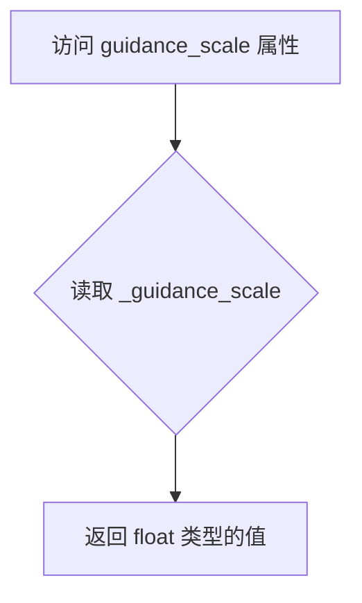

#### 带注释源码

```python
@property
def guidance_scale(self):
    """
    属性方法：获取分类器无引导比例因子
    
    该属性返回 _guidance_scale 的值，该值在 __call__ 方法中被设置为传入的 guidance_scale 参数。
    guidance_scale 控制文本提示对生成视频的影响程度：
    -值为 1.0 时：不使用分类器无引导
    -值大于 1.0 时：启用分类器无引导，生成内容更贴近文本提示
    
    Returns:
        float: 当前配置的 guidance_scale 值
    """
    return self._guidance_scale
```

#### 补充说明

| 项目 | 说明 |
|------|------|
| **定义位置** | `LattePipeline` 类中，第 447-449 行 |
| **属性类型** | 只读属性（read-only property） |
| **关联属性** | `do_classifier_free_guidance` - 根据 `guidance_scale > 1` 判断是否启用引导 |
| **赋值时机** | 在 `__call__` 方法中通过 `self._guidance_scale = guidance_scale` 赋值 |
| **默认值** | 在 `__call__` 方法签名中默认为 7.5 |
| **设计目的** | 与 Imagen 论文中的权重 w（方程2）类似，用于平衡生成质量与文本一致性 |


### `LattePipeline.do_classifier_free_guidance`

该属性用于判断当前是否启用了无分类器自由引导（Classifier-Free Guidance）机制。当引导比例（guidance_scale）大于1时，表示启用了CFG，此时模型会同时考虑条件和无条件噪声预测以增强生成效果。

参数：无

返回值：`bool`，返回 `True` 表示启用了无分类器自由引导，返回 `False` 表示未启用。

#### 流程图

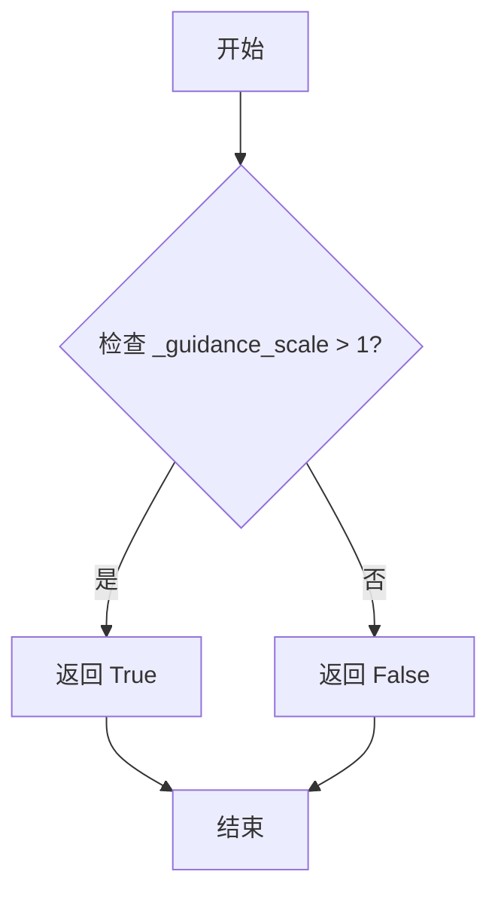

#### 带注释源码

```python
@property
def do_classifier_free_guidance(self):
    """
    属性：判断是否启用无分类器自由引导（Classifier-Free Guidance）
    
    该属性基于 Imagen 论文中的引导权重 w（方程2）进行判断。
    guidance_scale = 1 对应于不执行无分类器自由引导。
    当 guidance_scale > 1 时，模型会执行 CFG 以产生更符合文本提示的生成结果。
    
    返回:
        bool: 如果 guidance_scale 大于 1 则返回 True，否则返回 False
    """
    return self._guidance_scale > 1
```


### LattePipeline.num_timesteps

该属性是 LattePipeline 管道类的一个只读属性，用于返回扩散模型在推理过程中需要执行的去噪时间步数量。它通过返回内部私有变量 `self._num_timesteps` 来获取，该变量在管道调用时通过 `len(timesteps)` 计算并设置。

参数：无需参数

返回值：`int`，返回去噪过程中时间步的总数，即推理步骤的数量

#### 流程图

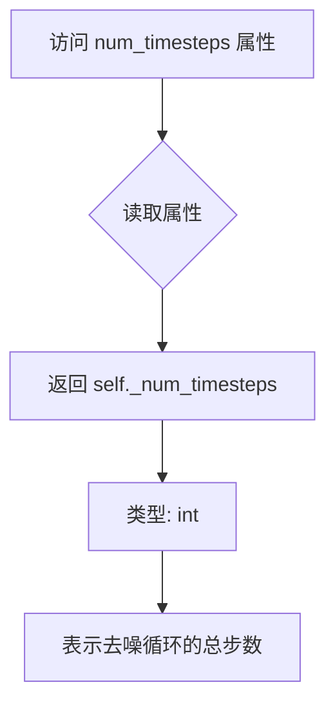

#### 带注释源码

```python
@property
def num_timesteps(self):
    """
    只读属性，返回扩散模型推理过程中的时间步总数。
    
    该属性在 __call__ 方法中被设置：
    self._num_timesteps = len(timesteps)
    
    timesteps 来自 scheduler.set_timesteps() 调用后返回的时间步张量，
    其长度等于 num_inference_steps（推理步数）。
    
    Returns:
        int: 去噪过程中需要执行的时间步数量
    """
    return self._num_timesteps
```


### `LattePipeline.current_timestep`

该属性用于返回当前去噪步骤的时间步（timestep）。在扩散模型的推理过程中，每个去噪循环迭代都会设置当前的时间步，该属性允许外部访问这个当前时间步以用于监控或调试目的。

参数： 无

返回值：`torch.Tensor`，返回当前去噪循环中设置的时间步（timestep），如果没有在进行推理则返回 `None`。

#### 流程图

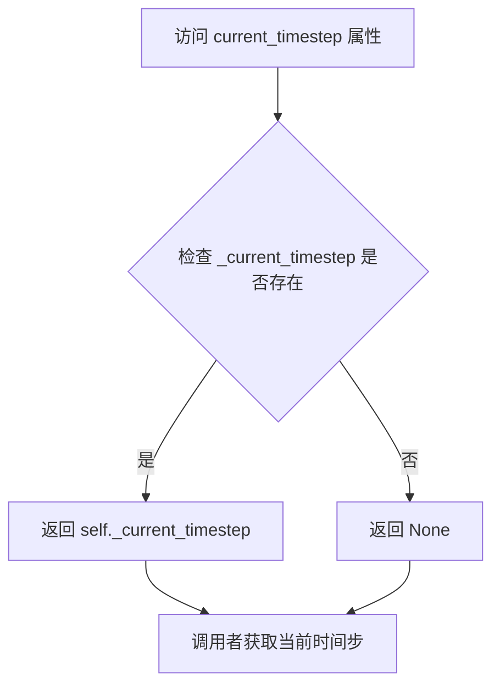

#### 带注释源码

```python
@property
def current_timestep(self):
    """
    属性方法：获取当前时间步
    
    该属性返回在去噪循环中设置的当前时间步（_current_timestep）。
    在 __call__ 方法的推理循环中，每个迭代开始时会设置此值：
        self._current_timestep = t
    
    用途：
    - 允许外部监控推理进度
    - 调试时检查当前处理的时间步
    - 与回调函数配合使用以获取实时状态
    
    返回：
        torch.Tensor 或 None: 当前时间步张量，推理循环外调用时返回 None
    """
    return self._current_timestep
```

---

**补充说明：**

| 项目 | 详情 |
|------|------|
| **类名** | `LattePipeline` |
| **定义位置** | 第 447-449 行 |
| **属性类型** | Python `@property` 装饰器 |
| **内部变量** | `self._current_timestep` |
| **设置时机** | 在 `__call__` 方法的去噪循环中设置：`self._current_timestep = t` |
| **重置时机** | 推理结束后设置为 `None`：`self._current_timestep = None` |
| **相关属性** | `num_timesteps`（总时间步数）、`guidance_scale`（引导规模）、`interrupt`（中断标志） |


### `LattePipeline.interrupt`

该属性用于获取 LattePipeline 的中断状态标志，通过返回内部变量 `_interrupt` 来控制文本到视频生成流程是否被中断。

参数：无

返回值：`bool`，返回当前的中断状态标志。当值为 `True` 时，表示生成过程已被请求中断，循环将继续但跳过推理步骤；`False` 表示正常生成状态。

#### 流程图

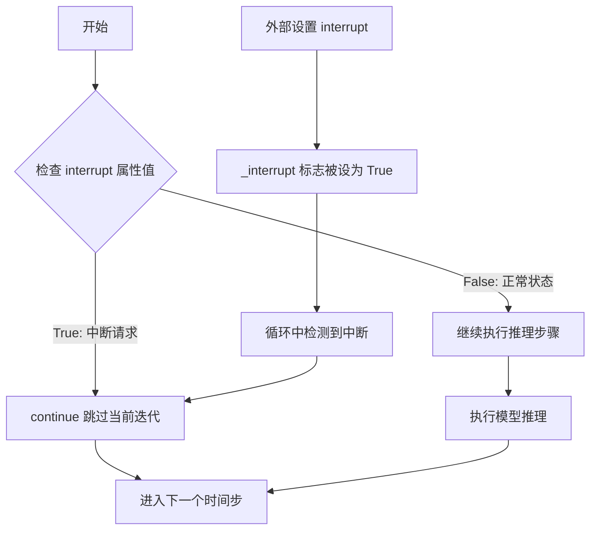

#### 带注释源码

```python
@property
def interrupt(self):
    """
    属性：interrupt
    
    用于获取生成过程的中断状态。
    该属性在 __call__ 方法的去噪循环中被检查，
    当返回 True 时，循环会跳过当前迭代，实现优雅中断。
    
    初始化位置：在 __call__ 方法中通过 self._interrupt = False 初始化
    使用位置：denoising loop 中的 `if self.interrupt: continue` 判断
    
    Returns:
        bool: 中断状态标志。True 表示请求中断，False 表示正常运行。
    """
    return self._interrupt
```

#### 关键上下文代码片段

```python
# 在 __call__ 方法中的初始化
self._interrupt = False

# 在去噪循环中的使用
with self.progress_bar(total=num_inference_steps) as progress_bar:
    for i, t in enumerate(timesteps):
        if self.interrupt:  # 检查中断状态
            continue        # 跳过当前迭代，继续下一个时间步
        
        # ... 正常的推理逻辑 ...
```


### `LattePipeline.__call__`

这是 Latte 文本到视频生成 pipeline 的主入口方法，负责执行完整的文本到视频生成流程。该方法接收文本提示词，经过编码、去噪、潜在向量解码等步骤，最终生成指定长度和分辨率的视频帧序列。

参数：

- `prompt`：`str | list[str]`，引导视频生成的提示词，如果未定义则必须传递 `prompt_embeds`
- `negative_prompt`：`str`，不引导视频生成的提示词，当不使用 guidance 时会被忽略（即 `guidance_scale < 1` 时）
- `num_inference_steps`：`int`，去噪步数，默认为 50，更多去噪步骤通常能生成更高质量的视频，但推理速度更慢
- `timesteps`：`list[int] | None`，自定义去噪过程的时间步，如果未定义则使用等间距的 `num_inference_steps` 个时间步，必须按降序排列
- `guidance_scale`：`float`，无分类器自由引导（Classifier-Free Diffusion Guidance）比例，类似于 Imagen 论文中的权重 w，值大于 1 时启用引导
- `num_images_per_prompt`：`int`，每个提示词生成的视频数量，默认为 1
- `video_length`：`int`，生成的视频帧数，默认为 16 帧
- `height`：`int`，生成视频的高度（像素），默认为 512
- `width`：`int`，生成视频的宽度（像素），默认为 512
- `eta`：`float`，DDIM 论文中的参数 eta，仅适用于 DDIMScheduler
- `generator`：`torch.Generator | list[torch.Generator] | None`，一个或多个随机生成器，用于确保生成的可确定性
- `latents`：`torch.FloatTensor | None`，预生成的噪声潜在向量，用于视频生成，可用于通过不同提示词微调相同生成
- `prompt_embeds`：`torch.FloatTensor | None`，预生成的文本嵌入，可用于轻松调整文本输入（如提示词加权）
- `negative_prompt_embeds`：`torch.FloatTensor | None`，预生成的负面文本嵌入，对于 Latte 应为空字符串 ""
- `output_type`：`str`，生成视频的输出格式，可选 "pil" 或 "latent"，默认为 "pil"
- `return_dict`：`bool`，是否返回 `LattePipelineOutput` 而不是元组，默认为 True
- `callback_on_step_end`：`Callable[[int, int], None] | PipelineCallback | MultiPipelineCallbacks | None`，每个去噪步骤结束时调用的回调函数
- `callback_on_step_end_tensor_inputs`：`list[str]`，应传递给回调函数的张量输入列表，默认为 ["latents"]
- `clean_caption`：`bool`，是否在创建嵌入前清理标题，默认为 True，需要 beautifulsoup4 和 ftfy 库
- `mask_feature`：`bool`，是否对文本嵌入进行掩码，默认为 True
- `enable_temporal_attentions`：`bool`，是否启用时间注意力机制，默认为 True
- `decode_chunk_size`：`int`，每次解码的帧数，较高的块大小可获得更好的时间一致性，但会增加内存使用，默认为 video_length

返回值：`LattePipelineOutput | tuple`，如果 `return_dict` 为 True，返回 `LattePipelineOutput`，否则返回包含生成视频的元组

#### 流程图

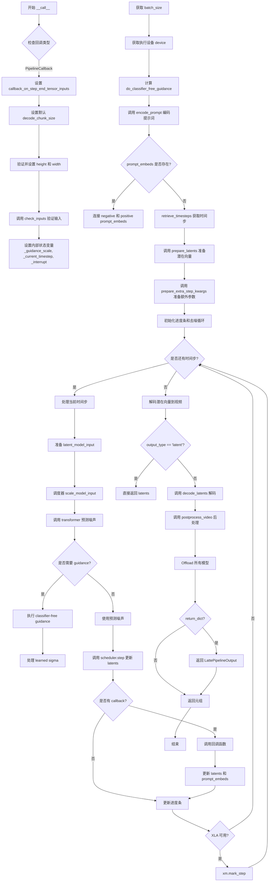

#### 带注释源码

```python
@torch.no_grad()
@replace_example_docstring(EXAMPLE_DOC_STRING)
def __call__(
    self,
    prompt: str | list[str] = None,
    negative_prompt: str = "",
    num_inference_steps: int = 50,
    timesteps: list[int] | None = None,
    guidance_scale: float = 7.5,
    num_images_per_prompt: int = 1,
    video_length: int = 16,
    height: int = 512,
    width: int = 512,
    eta: float = 0.0,
    generator: torch.Generator | list[torch.Generator] | None = None,
    latents: torch.FloatTensor | None = None,
    prompt_embeds: torch.FloatTensor | None = None,
    negative_prompt_embeds: torch.FloatTensor | None = None,
    output_type: str = "pil",
    return_dict: bool = True,
    callback_on_step_end: Callable[[int, int], None] | PipelineCallback | MultiPipelineCallbacks | None = None,
    callback_on_step_end_tensor_inputs: list[str] = ["latents"],
    clean_caption: bool = True,
    mask_feature: bool = True,
    enable_temporal_attentions: bool = True,
    decode_chunk_size: int = 14,
) -> LattePipelineOutput | tuple:
    """
    Function invoked when calling the pipeline for generation.
    """
    # 如果传入的是 PipelineCallback 或 MultiPipelineCallbacks 对象，
    # 则从中提取需要传递到回调的 tensor 输入列表
    if isinstance(callback_on_step_end, (PipelineCallback, MultiPipelineCallbacks)):
        callback_on_step_end_tensor_inputs = callback_on_step_end.tensor_inputs

    # 0. 默认值处理：如果 decode_chunk_size 未指定，则默认为 video_length
    decode_chunk_size = decode_chunk_size if decode_chunk_size is not None else video_length

    # 1. 检查输入参数的有效性，抛出错误如果不符合要求
    # 使用 transformer 的配置计算默认的 height 和 width（如果未提供）
    height = height or self.transformer.config.sample_size * self.vae_scale_factor
    width = width or self.transformer.config.sample_size * self.vae_scale_factor
    self.check_inputs(
        prompt,
        height,
        width,
        negative_prompt,
        callback_on_step_end_tensor_inputs,
        prompt_embeds,
        negative_prompt_embeds,
    )
    # 初始化内部状态变量
    self._guidance_scale = guidance_scale
    self._current_timestep = None
    self._interrupt = False

    # 2. 根据 prompt 类型确定 batch_size
    if prompt is not None and isinstance(prompt, str):
        batch_size = 1
    elif prompt is not None and isinstance(prompt, list):
        batch_size = len(prompt)
    else:
        batch_size = prompt_embeds.shape[0]

    # 获取执行设备（CPU/CUDA等）
    device = self._execution_device

    # 计算是否启用 classifier-free guidance
    # guidance_scale = 1 表示不启用引导
    do_classifier_free_guidance = guidance_scale > 1.0

    # 3. 编码输入的文本 prompt
    prompt_embeds, negative_prompt_embeds = self.encode_prompt(
        prompt,
        do_classifier_free_guidance,
        negative_prompt=negative_prompt,
        num_images_per_prompt=num_images_per_prompt,
        device=device,
        prompt_embeds=prompt_embeds,
        negative_prompt_embeds=negative_prompt_embeds,
        clean_caption=clean_caption,
        mask_feature=mask_feature,
    )
    # 如果启用 guidance，将无条件嵌入和条件嵌入拼接在一起
    if do_classifier_free_guidance:
        prompt_embeds = torch.cat([negative_prompt_embeds, prompt_embeds], dim=0)

    # 4. 准备时间步（timesteps）
    # XLA 设备需要特殊处理，使用 CPU 进行时间步计算
    if XLA_AVAILABLE:
        timestep_device = "cpu"
    else:
        timestep_device = device
    timesteps, num_inference_steps = retrieve_timesteps(
        self.scheduler, num_inference_steps, timestep_device, timesteps
    )
    self._num_timesteps = len(timesteps)

    # 5. 准备初始潜在向量（latents）
    latent_channels = self.transformer.config.in_channels
    latents = self.prepare_latents(
        batch_size * num_images_per_prompt,  # 批量大小 × 每提示词生成的视频数
        latent_channels,
        video_length,  # 视频帧数
        height,
        width,
        prompt_embeds.dtype,
        device,
        generator,
        latents,  # 如果提供则使用提供的 latents，否则随机生成
    )

    # 6. 准备调度器额外参数（如 eta 和 generator）
    extra_step_kwargs = self.prepare_extra_step_kwargs(generator, eta)

    # 7. 去噪循环
    # 计算预热步数（warmup steps），用于进度条显示
    num_warmup_steps = max(len(timesteps) - num_inference_steps * self.scheduler.order, 0)

    # 初始化进度条
    with self.progress_bar(total=num_inference_steps) as progress_bar:
        # 遍历每个时间步进行去噪
        for i, t in enumerate(timesteps):
            # 检查是否中断（可通过外部设置 _interrupt 标志中断）
            if self.interrupt:
                continue

            self._current_timestep = t
            
            # 为 classifier-free guidance 复制 latent（无条件+条件）
            latent_model_input = torch.cat([latents] * 2) if do_classifier_free_guidance else latents
            # 调度器缩放输入
            latent_model_input = self.scheduler.scale_model_input(latent_model_input, t)

            # 确保 current_timestep 是正确格式的张量
            current_timestep = t
            if not torch.is_tensor(current_timestep):
                is_mps = latent_model_input.device.type == "mps"
                is_npu = latent_model_input.device.type == "npu"
                if isinstance(current_timestep, float):
                    dtype = torch.float32 if (is_mps or is_npu) else torch.float64
                else:
                    dtype = torch.int32 if (is_mps or is_npu) else torch.int64
                current_timestep = torch.tensor([current_timestep], dtype=dtype, device=latent_model_input.device)
            elif len(current_timestep.shape) == 0:
                current_timestep = current_timestep[None].to(latent_model_input.input.device)
            # 广播到批量维度（兼容 ONNX/Core ML）
            current_timestep = current_timestep.expand(latent_model_input.shape[0])

            # 调用 transformer 模型预测噪声
            noise_pred = self.transformer(
                hidden_states=latent_model_input,
                encoder_hidden_states=prompt_embeds,
                timestep=current_timestep,
                enable_temporal_attentions=enable_temporal_attentions,
                return_dict=False,
            )[0]

            # 执行 classifier-free guidance
            if do_classifier_free_guidance:
                noise_pred_uncond, noise_pred_text = noise_pred.chunk(2)
                # guidance 计算: noise_pred = noise_pred_uncond + scale * (noise_pred_text - noise_pred_uncond)
                noise_pred = noise_pred_uncond + guidance_scale * (noise_pred_text - noise_pred_uncond)

            # 处理学习到的 sigma（如果调度器使用 learned 或 learned_range 方差类型）
            if not (
                hasattr(self.scheduler.config, "variance_type")
                and self.scheduler.config.variance_type in ["learned", "learned_range"]
            ):
                noise_pred = noise_pred.chunk(2, dim=1)[0]

            # 计算上一步视频：x_t -> x_t-1
            latents = self.scheduler.step(noise_pred, t, latents, **extra_step_kwargs, return_dict=False)[0]

            # 调用回调函数（如果提供）
            if callback_on_step_end is not None:
                callback_kwargs = {}
                for k in callback_on_step_end_tensor_inputs:
                    callback_kwargs[k] = locals()[k]
                callback_outputs = callback_on_step_end(self, i, t, callback_kwargs)

                # 从回调输出中获取更新后的值
                latents = callback_outputs.pop("latents", latents)
                prompt_embeds = callback_outputs.pop("prompt_embeds", prompt_embeds)
                negative_prompt_embeds = callback_outputs.pop("negative_prompt_embeds", negative_prompt_embeds)

            # 更新进度条（仅在最后一步或预热期后每 order 步更新）
            if i == len(timesteps) - 1 or ((i + 1) > num_warmup_steps and (i + 1) % self.scheduler.order == 0):
                progress_bar.update()

            # XLA 设备特殊处理
            if XLA_AVAILABLE:
                xm.mark_step()

    # 重置当前时间步
    self._current_timestep = None

    # 处理输出类型（兼容旧版本 'latents'）
    if output_type == "latents":
        deprecation_message = (
            "Passing `output_type='latents'` is deprecated. Please pass `output_type='latent'` instead."
        )
        deprecate("output_type_latents", "1.0.0", deprecation_message, standard_warn=False)
        output_type = "latent"

    # 解码潜在向量到视频
    if not output_type == "latent":
        video = self.decode_latents(latents, video_length, decode_chunk_size=decode_chunk_size)
        video = self.video_processor.postprocess_video(video=video, output_type=output_type)
    else:
        video = latents

    # 卸载所有模型以释放内存
    self.maybe_free_model_hooks()

    # 返回结果
    if not return_dict:
        return (video,)

    return LattePipelineOutput(frames=video)
```


### `LattePipeline.decode_latents`

该方法负责将 VAE 编码后的潜在表示（latents）解码为实际的视频帧序列。通过分块解码策略避免内存溢出，并最终将输出重构为标准视频张量格式。

参数：

- `latents`：`torch.Tensor`，输入的潜在表示张量，形状为 [batch, channels, frames, height, width]
- `video_length`：`int`，生成视频的总帧数
- `decode_chunk_size`：`int`，单次解码的帧数块大小，默认为 14，用于控制内存使用

返回值：`torch.Tensor`，解码后的视频帧张量，形状为 [batch, channels, frames, height, width]

#### 流程图

```mermaid
flowchart TD
    A[输入 latents<br/>[batch, channels, frames, h, w]] --> B[维度重排和展平<br/>permute + flatten]
    B --> C[缩放 latent<br/>latents / scaling_factor]
    C --> D{检查 VAE 是否接受<br/>num_frames 参数}
    D -->|是| E[分块遍历 latent<br/>每次处理 decode_chunk_size 帧]
    D -->|否| F[一次性处理所有帧]
    E --> G[调用 VAE.decode 解码当前块]
    F --> G
    G --> H[收集解码后的帧到列表]
    H --> I{还有更多帧未处理?}
    I -->|是| E
    I -->|否| J[拼接所有帧<br/>torch.cat]
    J --> K[重塑为批量视频格式<br/>reshape + permute]
    K --> L[转换为 float32]
    L --> M[输出 frames<br/>[batch, channels, frames, h, w]]
```

#### 带注释源码

```python
def decode_latents(self, latents: torch.Tensor, video_length: int, decode_chunk_size: int = 14):
    """
    将潜在表示解码为视频帧
    
    参数:
        latents: VAE 编码后的潜在张量，形状 [batch, channels, frames, height, width]
        video_length: 视频的总帧数
        decode_chunk_size: 每次解码的帧数，用于控制内存使用
    返回:
        解码后的视频帧张量，形状 [batch, channels, frames, height, width]
    """
    # 步骤1: 维度重排和展平
    # 将 [batch, channels, frames, height, width] 转换为 [batch*frames, channels, height, width]
    # 以便逐帧处理
    latents = latents.permute(0, 2, 1, 3, 4).flatten(0, 1)

    # 步骤2: 缩放 latent
    # 根据 VAE 的 scaling_factor 进行缩放，这是 VAE 编码时的逆操作
    latents = 1 / self.vae.config.scaling_factor * latents

    # 步骤3: 检查 VAE decode 方法是否接受 num_frames 参数
    # 用于兼容不同版本的 VAE 模型
    forward_vae_fn = self.vae._orig_mod.forward if is_compiled_module(self.vae) else self.vae.forward
    accepts_num_frames = "num_frames" in set(inspect.signature(forward_vae_fn).parameters.keys())

    # 步骤4: 分块解码以避免 OOM
    # 每次只解码 decode_chunk_size 帧，处理好内存和计算时间的平衡
    frames = []
    for i in range(0, latents.shape[0], decode_chunk_size):
        # 计算当前块的帧数
        num_frames_in = latents[i : i + decode_chunk_size].shape[0]
        decode_kwargs = {}
        if accepts_num_frames:
            # 如果 VAE 需要 num_frames 参数则传入
            decode_kwargs["num_frames"] = num_frames_in

        # 调用 VAE 解码当前块
        frame = self.vae.decode(latents[i : i + decode_chunk_size], **decode_kwargs).sample
        frames.append(frame)
    
    # 步骤5: 拼接所有解码后的帧
    frames = torch.cat(frames, dim=0)

    # 步骤6: 重塑为标准视频格式
    # 从 [batch*frames, channels, height, width] 恢复到 [batch, channels, frames, height, width]
    frames = frames.reshape(-1, video_length, *frames.shape[1:]).permute(0, 2, 1, 3, 4)

    # 步骤7: 转换为 float32
    # 确保兼容性，float32 不会导致显著性能开销且与 bfloat16 兼容
    frames = frames.float()
    return frames
```

## 关键组件


### LattePipeline

LattePipeline是用于文本到视频生成的主管道类，继承自DiffusionPipeline，实现了对T5文本编码器、VAE和LatteTransformer3DModel的集成调用，支持分类器自由引导和时间注意力机制。

### retrieve_timesteps

retrieve_timesteps是一个全局函数，用于从调度器获取时间步长。支持自定义时间步和sigma参数，并能处理不同调度器的时间步设置方式，返回时间步张量和推理步数。

### LattePipelineOutput

LattePipelineOutput是一个数据类，继承自BaseOutput，用于存储管道输出的视频帧数据，包含frames字段。

### encode_prompt

encode_prompt方法负责将文本提示编码为文本编码器的隐藏状态。支持分类器自由引导、提示嵌入的预生成、文本清洗和特征掩码等功能，能够处理负面提示嵌入和批量生成。

### prepare_latents

prepare_latents方法用于准备潜在变量张量。根据批量大小、通道数、帧数、高度和宽度构建形状，并使用随机张量或用户提供的潜在变量进行初始化，同时根据调度器要求缩放初始噪声。

### decode_latents

decode_latents方法实现了潜在变量到视频帧的解码。采用分块解码策略（decode_chunk_size），将潜在变量重新排列并分批送入VAE解码器，最后将解码后的帧重新组织为批量格式，支持避免OOM的内存优化。

### mask_text_embeddings

mask_text_embeddings方法用于掩码文本嵌入。根据注意力掩码计算需要保留的嵌入索引，对单批量和批量情况进行不同处理，返回掩码后的嵌入和保留的索引。

### __call__

__call__方法是管道的主生成方法，执行完整的文本到视频生成流程。包括输入检查、提示编码、时间步准备、潜在变量准备、去噪循环、分类器自由引导和最终视频解码，支持多种自定义选项如时间注意力启用、回调函数等。

### check_inputs

check_inputs方法用于验证输入参数的有效性。检查高度和宽度是否可被8整除、回调张量输入是否合法、提示和提示嵌入的互斥关系等，确保管道调用的参数正确性。

### _text_preprocessing

_text_preprocessing方法对输入文本进行预处理。支持文本清洗功能，包括HTML转义、URL移除、CJK字符处理、特殊符号清理等，并可选使用beautifulsoup4和ftfy库进行深度清洗。

### VideoProcessor

VideoProcessor是视频处理组件，用于视频的后处理和格式转换，与VAE的缩放因子配合工作。


## 问题及建议


### 已知问题

-   **硬编码配置值**：`max_length = 120` 在 `encode_prompt` 方法中硬编码，缺乏灵活性；`_callback_tensor_inputs` 列表作为类属性硬编码，扩展性差
-   **参数过多导致API复杂**：`__call__` 方法拥有超过25个参数，违反了大量参数原则，降低了可用性和维护性，应考虑使用配置对象或数据类进行封装
-   **代码重复与复用**：`_text_preprocessing` 和 `_clean_caption` 方法直接从其他管道复制（注释显示"Copied from diffusers.pipelines.deepfloyd_if"），未进行抽象复用
-   **类型注解不完整**：部分参数如 `dtype=None` 缺少类型注解，`prepare_extra_step_kwargs` 返回类型未明确指定
-   **文档字符串过时/错误**：文档中引用 `self.unet.config.sample_size` 但代码实际使用 `self.transformer.config.sample_size`；部分参数描述与实际默认值不符（如 `num_inference_steps` 文档说默认100，代码实际为50）
-   **潜在空指针风险**：`dtype` 参数在 `encode_prompt` 中通过条件判断获取，当 `text_encoder` 和 `transformer` 都为 `None` 时会设为 `None`，后续 `.to(dtype=dtype)` 可能导致问题
-   **循环解码性能瓶颈**：`decode_latents` 使用 Python 循环逐批解码帧，未充分利用 VAE 的向量化能力，可考虑使用 `torch.no_grad` 和更高效的批处理策略

### 优化建议

-   **引入配置类**：将 `__call__` 的大量参数封装为 `PipelineConfig` 数据类，提供默认配置，同时保持向后兼容
-   **提取公共文本预处理逻辑**：将 `_text_preprocessing` 和 `_clean_caption` 移至基类或工具模块，避免多管道间代码重复
-   **完善类型注解与类型检查**：为所有参数添加类型注解，使用 `mypy` 进行静态类型检查；明确 `prepare_extra_step_kwargs` 返回 `dict` 类型
-   **添加参数验证层**：在 `encode_prompt` 中增加 `dtype` 的默认值处理逻辑，确保始终有有效的 dtype
-   **优化解码逻辑**：考虑使用 `torch.inference_mode()` 替代 `@torch.no_grad()`，并探索基于 VAE 批处理能力的并行解码方案
-   **统一文档与实现**：修正文档字符串中的参数描述、默认值和变量引用，确保与代码实现一致
-   **添加性能监控**：在关键路径（如去噪循环、解码过程）添加性能日志或回调，便于生产环境调优

## 其它


### 设计目标与约束

**设计目标**：
- 实现文本到视频（Text-to-Video）生成功能，基于Latte模型架构
- 提供高质量的视频生成能力，支持可配置的生成参数
- 遵循diffusers库的Pipeline标准接口设计，保持与现有生态系统的一致性

**设计约束**：
- 依赖PyTorch框架，需CUDA支持以获得最佳性能
- 必须安装transformers库提供T5文本编码器支持
- 视频尺寸必须能被8整除（height和width）
- 文本prompt长度受tokenizer max_length=120限制
- 内存占用较高，需要足够的GPU显存（建议16GB以上）

### 错误处理与异常设计

**输入验证**：
- `check_inputs()`方法验证height和width能被8整除
- 验证callback_on_step_end_tensor_inputs在允许列表中
- 确保prompt和prompt_embeds不同时提供
- 确保negative_prompt和negative_prompt_embeds不同时提供
- 验证prompt_embeds和negative_prompt_embeds形状一致

**调度器兼容性检查**：
- `retrieve_timesteps()`函数检查调度器是否支持timesteps或sigmas参数
- `prepare_extra_step_kwargs()`检查调度器是否接受eta和generator参数

**资源验证**：
- 验证tokenizer输出的truncation情况，记录警告日志
- 检查XLA可用性以支持TPU加速

**异常抛出**：
- 使用ValueError进行参数校验类错误
- 使用logging.warning记录非致命性问题
- 支持通过回调机制在推理过程中处理异常

### 数据流与状态机

**主状态机（__call__方法）**：
1. **初始化状态**：检查输入参数，设置默认高度/宽度
2. **编码状态**：编码prompt和negative_prompt为embeddings
3. **调度状态**：准备timesteps和num_inference_steps
4. **潜在空间准备状态**：初始化或使用提供的latents
5. **去噪循环状态**：迭代执行denoising，包括：
   - 模型输入准备
   - 噪声预测
   - Classifier-free guidance应用
   - 调度器步骤执行
   - 回调执行
6. **解码状态**：将latents解码为视频帧
7. **完成状态**：后处理，释放模型钩子，返回结果

**关键状态变量**：
- `_guidance_scale`：分类器自由引导权重
- `_num_timesteps`：总推理步数
- `_current_timestep`：当前时间步
- `_interrupt`：中断标志

### 外部依赖与接口契约

**核心依赖**：
- `torch`：深度学习框架
- `transformers`：T5EncoderModel和T5Tokenizer
- `diffusers`：DiffusionPipeline基类、VAE、调度器
- `beautifulsoup4`（可选）：用于caption清洗
- `ftfy`（可选）：文本修复库
- `torch_xla`（可选）：TPU支持

**模块接口**：
- `DiffusionPipeline`：基类，提供模型加载、保存、设备管理功能
- `SchedulerMixin`：调度器基类，提供set_timesteps和step方法
- `AutoencoderKL`：VAE模型，提供encode和decode方法
- `LatteTransformer3DModel`：Transformer模型，接收hidden_states、encoder_hidden_states、timestep

**输出格式**：
- `LattePipelineOutput`：包含frames字段，类型为torch.Tensor
- 支持output_type: "pil", "np", "latent"

### 性能考虑

**内存优化**：
- `decode_chunk_size`参数支持分块解码，减少峰值显存
- `enable_model_cpu_offload()`支持模型CPU卸载
- 支持torch.compile编译优化

**计算优化**：
- 支持XLA设备（TPU）加速
- 使用torch.no_grad()禁用梯度计算
- Classifier-free guidance使用单次前向传播（concatenation技巧）
- VAE解码支持批量处理

**性能参数**：
- 默认num_inference_steps=50
- 默认video_length=16帧
- 默认decode_chunk_size=14

### 安全性考虑

**输入安全**：
- Caption清洗移除潜在恶意内容（URLs、特殊字符）
- 不执行用户提供的代码
- 模型输出需经过后处理

**模型安全**：
- 支持negative_prompt过滤不当内容
- guidance_scale参数可控制生成内容与prompt的匹配度

### 可扩展性设计

**模块化设计**：
- `_optional_components`支持可选组件（tokenizer, text_encoder）
- `VideoProcessor`独立处理视频后处理
- 支持自定义回调（PipelineCallback, MultiPipelineCallbacks）

**扩展点**：
- 可通过继承DiffusionPipeline扩展新功能
- 调度器可替换为KarrasDiffusionSchedulers的任何实现
- 支持自定义VAE和Transformer模型

### 配置管理

**Pipeline配置**：
- `vae_scale_factor`：从VAE配置自动计算
- `model_cpu_offload_seq`：定义模型卸载顺序"text_encoder->transformer->vae"
- `_callback_tensor_inputs`：定义回调支持的tensor输入

**运行时配置**：
- 通过__call__参数传入
- 支持通过from_pretrained加载预训练配置

### 版本兼容性

**依赖版本**：
- Python 3.8+
- PyTorch 2.0+
- transformers库兼容
- diffusers库需支持PipelineOutput dataclass

**API稳定性**：
- output_type="latents"已废弃，使用"latent"替代
- 保持与diffusers库的API一致性

### 资源管理

**显存管理**：
- 使用`maybe_free_model_hooks()`释放模型钩子
- 支持梯度检查点（通过transformer配置）
- 分块解码避免OOM

**设备管理**：
- 自动检测CUDA可用性
- 支持XLA设备（TPU）
- 支持MPS和NPU加速

### 监控与日志

**日志记录**：
- 使用logging.get_logger(__name__)获取日志器
- 记录truncation警告
- 记录可选依赖缺失警告
- 记录废弃API警告

**进度监控**：
- 使用progress_bar显示去噪进度
- 回调机制支持中间结果监控

### 测试策略建议

**单元测试**：
- 测试check_inputs各种输入组合
- 测试encode_prompt编码逻辑
- 测试prepare_latents形状和类型
- 测试decode_latents分块解码

**集成测试**：
- 端到端pipeline推理测试
- 不同output_type测试
- 内存占用测试
- 多设备兼容性测试


    