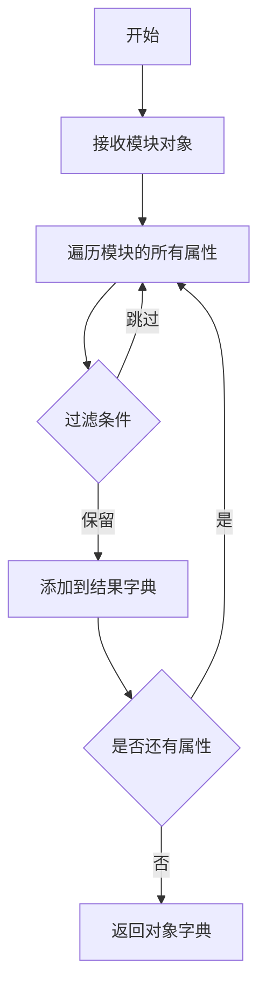
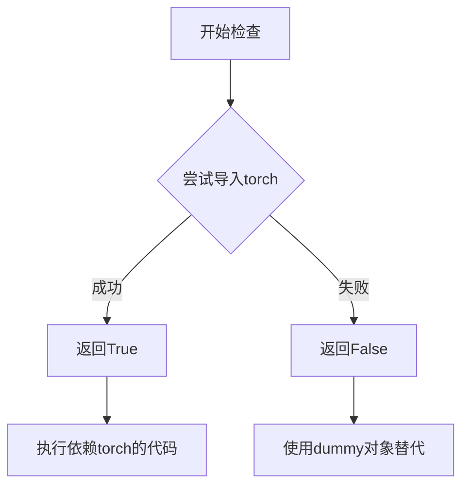

# `diffusers\src\diffusers\pipelines\ledits_pp\__init__.py` 详细设计文档

这是diffusers库中LEDits++ Pipeline的初始化模块，通过_LazyModule机制实现可选依赖（torch和transformers）的延迟加载，在运行时动态导出LEditsPPPipelineStableDiffusion、LEditsPPPipelineStableDiffusionXL及相关输出类。

## 整体流程

```mermaid
graph TD
    A[开始] --> B[初始化 _dummy_objects = {} 和 _import_structure = {}]
    B --> C{检查 is_transformers_available() && is_torch_available()}
    C -- 不可用 --> D[捕获 OptionalDependencyNotAvailable]
    D --> E[从 dummy_torch_and_transformers_objects 获取虚拟对象]
    E --> F[_dummy_objects.update(dummy_objects)]
    C -- 可用 --> G[定义 _import_structure 字典]
    G --> H{是否为 TYPE_CHECKING 或 DIFFUSERS_SLOW_IMPORT 模式?}
    H -- 是 --> I[直接导入实际 pipeline 模块]
    H -- 否 --> J[创建 _LazyModule 实例]
    J --> K[将虚拟对象注入 sys.modules]
    I --> L[模块加载完成]
```

## 类结构

```
LEditsPP Pipeline Package
└── __init__.py (Lazy Loading Wrapper)
    ├── _LazyModule (延迟加载机制)
    ├── pipeline_leditspp_stable_diffusion
    │   ├── LEditsPPPipelineStableDiffusion
    │   ├── LEditsPPDiffusionPipelineOutput
    │   └── LEditsPPInversionPipelineOutput
    └── pipeline_leditspp_stable_diffusion_xl
        └── LEditsPPPipelineStableDiffusionXL
```

## 全局变量及字段


### `_dummy_objects`
    
存储虚拟对象的字典，用于在可选依赖（torch和transformers）不可用时提供替代品，确保模块导入不报错

类型：`dict`
    


### `_import_structure`
    
定义模块导入结构的字典，键为模块路径，值为导出的类名列表，用于_LazyModule延迟加载机制

类型：`dict`
    


    

## 全局函数及方法


### `get_objects_from_module`

从模块中动态提取所有对象（类、函数、变量），并返回包含这些对象的字典。通常用于延迟加载（lazy loading）机制中，以便在模块级别批量获取可导出对象。

参数：

- `module`：`module`，要从中提取对象的模块对象（例如 `dummy_torch_and_transformers_objects`）

返回值：`dict`，返回模块中的所有对象，以对象名为键，对象本身为值

#### 流程图



#### 带注释源码

```python
# 从 utils 模块导入 get_objects_from_module 函数
from ...utils import (
    DIFFUSERS_SLOW_IMPORT,
    OptionalDependencyNotAvailable,
    _LazyModule,
    get_objects_from_module,  # <-- 目标函数：用于从模块提取对象
    is_torch_available,
    is_transformers_available,
)

# 初始化空字典用于存储虚拟对象
_dummy_objects = {}

try:
    # 检查依赖是否可用
    if not (is_transformers_available() and is_torch_available()):
        raise OptionalDependencyNotAvailable()
except OptionalDependencyNotAvailable:
    # 如果依赖不可用，从虚拟模块导入
    from ...utils import dummy_torch_and_transformers_objects

    # 调用 get_objects_from_module 提取虚拟模块中的所有对象
    # 参数：dummy_torch_and_transformers_objects 模块对象
    # 返回值：包含模块中所有对象的字典
    _dummy_objects.update(get_objects_from_module(dummy_torch_and_transformers_objects))
else:
    # 如果依赖可用，定义实际的导入结构
    _import_structure["pipeline_leditspp_stable_diffusion"] = ["LEDGitsPPPipelineStableDiffusion"]
    _import_structure["pipeline_leditspp_stable_diffusion_xl"] = ["LEDGitsPPPipelineStableDiffusionXL"]
    _import_structure["pipeline_output"] = ["LEDGitsPPDiffusionPipelineOutput", "LEDGitsPPDiffusionPipelineOutput"]
```


### `is_torch_available`

该函数用于检查当前Python环境中是否已安装PyTorch库，返回布尔值以指示PyTorch的可用性。这是diffusers库中处理可选依赖项的核心函数之一，用于条件性地导入需要PyTorch的模块。

参数：

- 该函数无参数

返回值：`bool`，返回`True`表示PyTorch已安装且可用，返回`False`表示PyTorch未安装或不可用

#### 流程图



#### 带注释源码

```
# is_torch_available 函数定义于 ...utils 模块中
# 当前文件仅导入并使用该函数，以下为其典型实现模式

def is_torch_available():
    """
    检查PyTorch是否可用
    
    返回:
        bool: PyTorch是否可用
    """
    try:
        import torch
        return True
    except ImportError:
        return False
```

---

**使用示例（在给定代码中）：**

```python
# 从上级目录的utils模块导入is_torch_available函数
from ...utils import (
    # ... 其他导入
    is_torch_available,
    is_transformers_available,
)

# 在代码中使用该函数检查依赖
try:
    if not (is_transformers_available() and is_torch_available()):
        # 如果transformers或torch任一不可用，则抛出异常
        raise OptionalDependencyNotAvailable()
except OptionalDependencyNotAvailable:
    # 导入dummy对象作为替代
    from ...utils import dummy_torch_and_transformers_objects
    _dummy_objects.update(get_objects_from_module(dummy_torch_and_transformers_objects))
else:
    # 如果两个依赖都可用，则导入实际的pipeline类
    _import_structure["pipeline_leditspp_stable_diffusion"] = ["LEDGitsPPPipelineStableDiffusion"]
    # ... 其他正常导入
```


### `is_transformers_available`

该函数用于检查 `transformers` 库是否已安装且可用。它通过尝试导入 `transformers` 模块来判断库是否可用，返回布尔值以指示依赖状态。

参数：

- 无参数

返回值：`bool`，返回 `True` 表示 `transformers` 库可用，返回 `False` 表示不可用。

#### 流程图

```mermaid
flowchart TD
    A[调用 is_transformers_available] --> B{尝试导入 transformers 模块}
    B -->|成功| C[返回 True]
    B -->|失败| D[返回 False]
    
    E[主代码流程] --> F{is_transformers_available() and is_torch_available()}
    F -->|False| G[抛出 OptionalDependencyNotAvailable]
    F -->|True| H[导入实际模块]
```

#### 带注释源码

```python
# 从上级目录的 utils 模块导入函数
# 该函数用于检测 transformers 库是否已安装
is_transformers_available

# 在当前模块中的使用方式：
# 检查 transformers 和 torch 是否都可用
if not (is_transformers_available() and is_torch_available()):
    # 如果任一依赖不可用，抛出可选依赖不可用异常
    raise OptionalDependencyNotAvailable()

# 这个检查用于条件导入：
# 1. 在 TYPE_CHECKING 或 DIFFUSERS_SLOW_IMPORT 模式下，需要检查依赖
# 2. 否则使用 _LazyModule 进行延迟加载
try:
    if not (is_transformers_available() and is_torch_available()):
        raise OptionalDependencyNotAvailable()
except OptionalDependencyNotAvailable:
    # 导入虚拟对象作为占位符
    from ...utils.dummy_torch_and_transformers_objects import *
else:
    # 导入实际的管道类
    from .pipeline_leditspp_stable_diffusion import (...)
```

## 关键组件


### 惰性加载模块 (_LazyModule)

实现延迟导入机制，允许模块在首次访问时才加载实际内容，提高导入效率并避免循环依赖问题。

### 可选依赖检查机制 (is_torch_available, is_transformers_available)

检查torch和transformers是否可用，用于条件性导入LEdit Stable Diffusion相关pipeline，确保在缺少可选依赖时不会崩溃。

### 导入结构字典 (_import_structure)

定义模块的导入映射表，记录可导出的类名和模块路径，支持LazyModule的动态导入机制。

### 虚拟对象占位符 (_dummy_objects)

当可选依赖不可用时，提供空对象填充，避免导入错误，实现优雅的降级处理。

### LEditsPPPipelineStableDiffusion 主pipeline类

LEdit Stable Diffusion的pytorch实现版本，支持图像编辑功能的扩散模型pipeline。

### LEditsPPPipelineStableDiffusionXL 主pipeline类 (XL版本)

LEdit Stable Diffusion XL版本，支持更高分辨率的图像编辑任务。

### LEditsPPDiffusionPipelineOutput 输出类

封装pipeline推理结果的输出数据结构，包含生成的图像及元数据。

### TYPE_CHECKING 条件导入块

用于类型检查阶段的完整导入，提供静态类型检查支持而不触发实际模块加载。

### 模块初始化逻辑 (sys.modules[__name__])

将当前模块替换为LazyModule实例，实现运行时惰性加载，同时设置虚拟对象属性。


## 问题及建议


### 已知问题

-   **重复的导入键**: `_import_structure` 字典中存在重复键 `"pipeline_output"`，且对应的值中类名重复（`["LEDGitsPPDiffusionPipelineOutput", "LEDGitsPPDiffusionPipelineOutput"]`），这会导致第二个条目覆盖第一个，且没有实际意义。
-   **未导出的类型**: 在 `TYPE_CHECKING` 块中导入了 `LEDGitsPPInversionPipelineOutput`，但在 `_import_structure` 中没有定义对应的导出键，会导致类型提示无法正常工作。
-   **重复的条件检查**: `if not (is_transformers_available() and is_torch_available())` 的检查逻辑在 `try` 块和 `TYPE_CHECKING` 块中重复出现，增加了代码冗余和维护成本。
-   **硬编码的模块路径**: `dummy_torch_and_transformers_objects` 作为硬编码的模块名，缺少灵活性，若依赖项结构变化需要手动修改。

### 优化建议

-   **修复重复键问题**: 将 `_import_structure["pipeline_output"]` 改为只包含唯一的类名，或根据实际功能区分不同导出。
-   **统一依赖检查逻辑**: 抽取公共的依赖检查函数，避免在多处重复相同的条件判断，提升代码可维护性。
-   **完善导出结构**: 在 `_import_structure` 中添加 `LEDGitsPPInversionPipelineOutput` 的导出定义，确保类型提示完整。
-   **动态获取模块名**: 考虑使用配置或反射机制动态获取 dummy 模块名，减少硬编码带来的耦合。
-   **添加异常日志**: 在 `OptionalDependencyNotAvailable` 捕获处添加日志记录，便于排查依赖问题。

## 其它


### 设计目标与约束

该模块是Diffusers库的延迟导入模块（Lazy Module），旨在实现LEDitsPP（LEDits++）图像编辑扩散模型的懒加载导入。核心目标是在不立即加载所有依赖的情况下，提供对LEDitsPPStableDiffusion和LEDitsPPStableDiffusionXL两个管道类的访问。约束条件是必须同时依赖torch和transformers库，否则抛出OptionalDependencyNotAvailable异常。

### 错误处理与异常设计

模块采用可选依赖检查机制，当torch或transformers任一不可用时，抛出OptionalDependencyNotAvailable异常，并从dummy模块加载空对象（_dummy_objects），确保模块导入不会失败。这种设计允许库在缺少可选依赖时仍能正常导入，但调用时会触发真正的导入错误。异常传播路径：检查is_transformers_available()和is_torch_available() → 条件不满足则raise OptionalDependencyNotAvailable → 捕获后加载dummy对象。

### 外部依赖与接口契约

主要依赖包括：torch（深度学习框架）、transformers（transformer模型库）、diffusers.utils模块（提供LazyModule、OptionalDependencyNotAvailable、get_objects_from_module等工具）。模块导出接口包含：pipeline_leditspp_stable_diffusion模块中的LEDGitsPPDiffusionPipelineOutput、LEDGitsPPInversionPipelineOutput、LEDGitsPPPipelineStableDiffusion；pipeline_leditspp_stable_diffusion_xl模块中的LEDGitsPPPipelineStableDiffusionXL。接口契约规定调用方必须确保torch和transformers可用，否则获取的为dummy对象。

### 版本兼容性考虑

该模块使用TYPE_CHECKING和DIFFUSERS_SLOW_IMPORT双模式导入机制，支持静态类型检查和运行时懒加载两种场景。TYPE_CHECKING为True时在类型检查期间导入真实对象；DIFFUSERS_SLOW_IMPORT为True时启用延迟导入模式。这种设计保证了在不同Python环境（类型检查器 vs 解释器）和不同配置下的兼容性。

### 模块化与可扩展性

_import_structure字典采用键值对结构存储模块导出信息，键为模块路径字符串，值为导出对象列表。这种结构便于扩展新的LEDits++管道变体。_dummy_objects通过get_objects_from_module从dummy模块批量获取空对象，实现了一致的扩展接口。添加新管道只需在else分支的_import_structure中添加新条目，同时在dummy模块中添加对应空对象定义即可。

### 性能考虑

采用LazyModule机制实现真正的懒加载，只有在首次访问模块属性时才触发实际导入。sys.modules[__name__]被替换为_LazyModule实例，避免了模块级全量导入带来的内存开销。setattr循环将_dummy_objects批量注入到sys.modules，确保访问dummy对象时无额外延迟。整体设计追求最小化启动时的依赖加载。

    