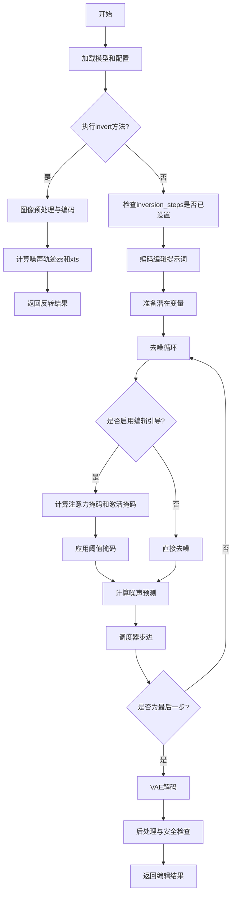
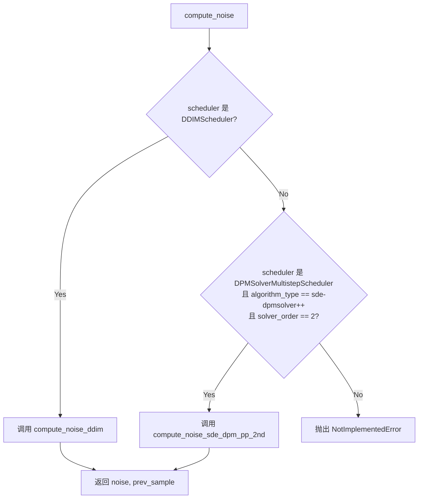
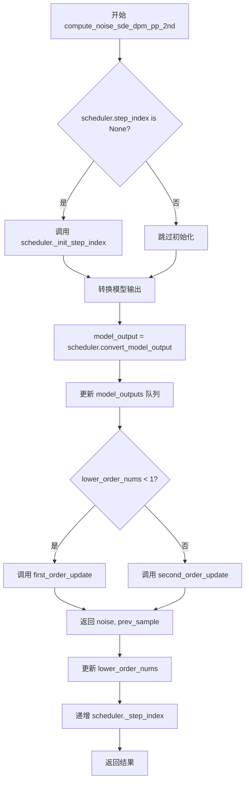
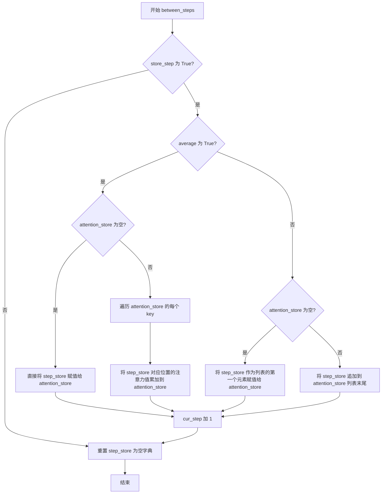
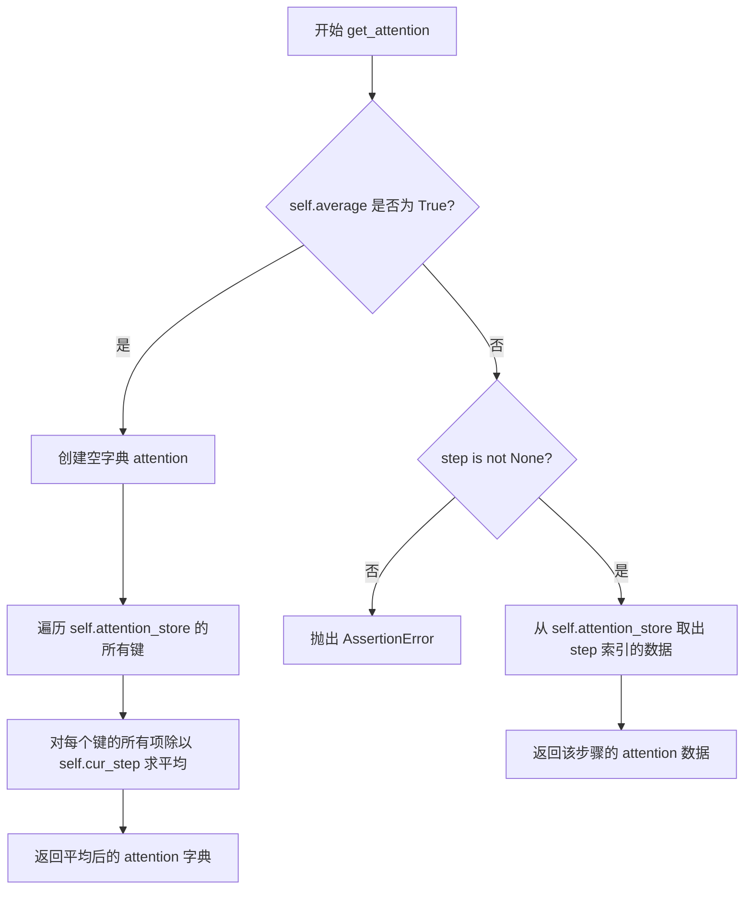
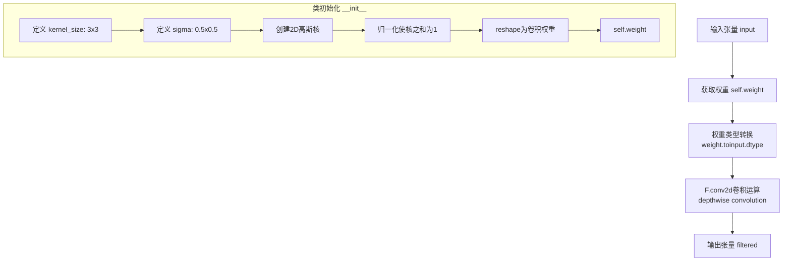
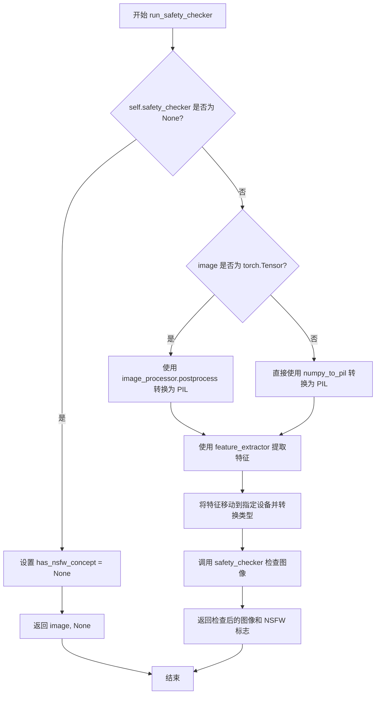
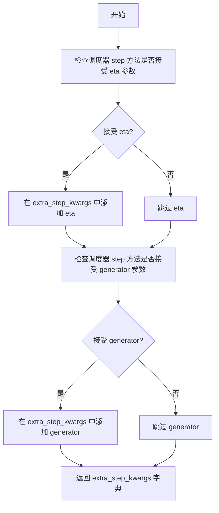
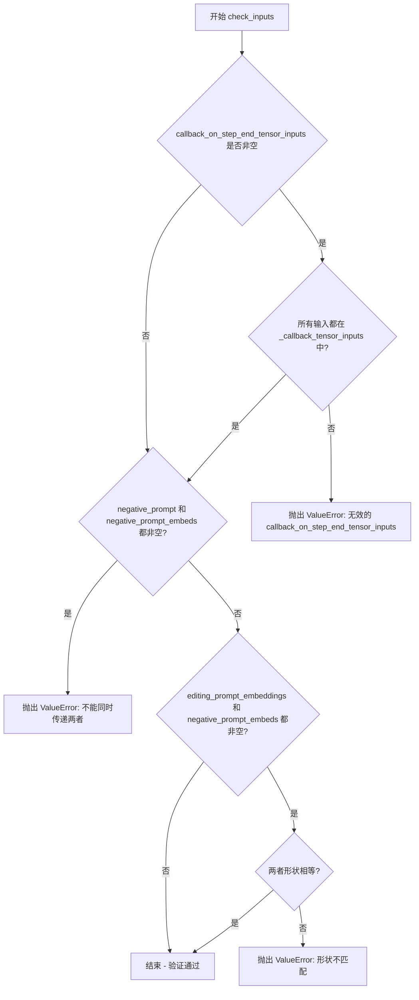
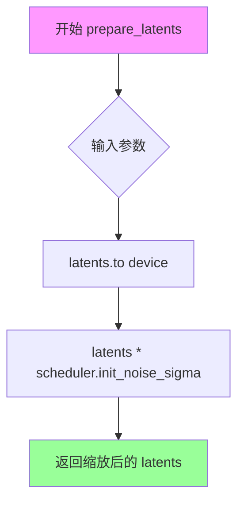

# `diffusers\src\diffusers\pipelines\ledits_pp\pipeline_leditspp_stable_diffusion.py` 详细设计文档

这是一个基于Stable Diffusion的LEDits++图像编辑Pipeline实现，提供了图像反转(inversion)和文本引导编辑(text-guided editing)功能，支持注意力图存储与操作、交叉注意力掩码、阈值掩码等高级编辑技术，可通过编辑提示词对图像进行精细化修改。

## 整体流程



## 类结构

```
LeditsAttentionStore (注意力存储类)
├── get_empty_store (静态方法)
├── __call__
├── forward
├── between_steps
├── get_attention
└── aggregate_attention
LeditsGaussianSmoothing (高斯平滑类)
├── __init__
└── __call__
LEDITSCrossAttnProcessor (交叉注意力处理器)
├── __init__
└── __call__
LEditsPPPipelineStableDiffusion (主Pipeline类)
├── 继承自: DiffusionPipeline, TextualInversionLoaderMixin, StableDiffusionLoraLoaderMixin, IPAdapterMixin, FromSingleFileMixin
├── __init__
├── run_safety_checker
├── decode_latents
├── prepare_extra_step_kwargs
├── check_inputs
├── prepare_latents
├── prepare_unet
├── encode_prompt
├── __call__
├── invert
├── encode_image
└── VAE相关方法 (enable_vae_slicing, disable_vae_slicing, enable_vae_tiling, disable_vae_tiling)
全局函数
├── rescale_noise_cfg
├── compute_noise (分发器)
├── compute_noise_ddim
└── compute_noise_sde_dpm_pp_2nd
```

## 全局变量及字段


### `logger`
    
用于记录日志的日志对象

类型：`logging.Logger`
    


### `XLA_AVAILABLE`
    
指示PyTorch XLA是否可用的布尔标志

类型：`bool`
    


### `EXAMPLE_DOC_STRING`
    
示例文档字符串，包含pipeline使用示例

类型：`str`
    


### `LeditsAttentionStore.step_store`
    
存储每步的注意力

类型：`dict`
    


### `LeditsAttentionStore.attention_store`
    
存储累积的注意力

类型：`list`
    


### `LeditsAttentionStore.cur_step`
    
当前步数

类型：`int`
    


### `LeditsAttentionStore.average`
    
是否平均

类型：`bool`
    


### `LeditsAttentionStore.batch_size`
    
批大小

类型：`int`
    


### `LeditsAttentionStore.max_size`
    
最大分辨率

类型：`int`
    


### `LeditsGaussianSmoothing.weight`
    
高斯核权重

类型：`torch.Tensor`
    


### `LEDITSCrossAttnProcessor.attnstore`
    
注意力存储引用

类型：`LeditsAttentionStore`
    


### `LEDITSCrossAttnProcessor.place_in_unet`
    
在UNet中的位置

类型：`str`
    


### `LEDITSCrossAttnProcessor.editing_prompts`
    
编辑提示词数量

类型：`int`
    


### `LEDITSCrossAttnProcessor.pnp`
    
PnP标志

类型：`bool`
    


### `LEDGitsPPPipelineStableDiffusion.vae`
    
变分自编码器

类型：`AutoencoderKL`
    


### `LEDGitsPPPipelineStableDiffusion.text_encoder`
    
文本编码器

类型：`CLIPTextModel`
    


### `LEDGitsPPPipelineStableDiffusion.tokenizer`
    
分词器

类型：`CLIPTokenizer`
    


### `LEDGitsPPPipelineStableDiffusion.unet`
    
条件U-Net

类型：`UNet2DConditionModel`
    


### `LEDGitsPPPipelineStableDiffusion.scheduler`
    
调度器

类型：`DDIMScheduler | DPMSolverMultistepScheduler`
    


### `LEDGitsPPPipelineStableDiffusion.safety_checker`
    
安全检查器

类型：`StableDiffusionSafetyChecker`
    


### `LEDGitsPPPipelineStableDiffusion.feature_extractor`
    
特征提取器

类型：`CLIPImageProcessor`
    


### `LEDGitsPPPipelineStableDiffusion.vae_scale_factor`
    
VAE缩放因子

类型：`int`
    


### `LEDGitsPPPipelineStableDiffusion.image_processor`
    
图像处理器

类型：`VaeImageProcessor`
    


### `LEDGitsPPPipelineStableDiffusion.inversion_steps`
    
反转步数

类型：`list`
    


### `LEDGitsPPPipelineStableDiffusion.init_latents`
    
初始潜在变量

类型：`torch.Tensor`
    


### `LEDGitsPPPipelineStableDiffusion.zs`
    
噪声轨迹

类型：`torch.Tensor`
    


### `LEDGitsPPPipelineStableDiffusion.batch_size`
    
批大小

类型：`int`
    


### `LEDGitsPPPipelineStableDiffusion.enabled_editing_prompts`
    
启用的编辑提示词数量

类型：`int`
    


### `LEDGitsPPPipelineStableDiffusion.sem_guidance`
    
语义引导

类型：`torch.Tensor`
    


### `LEDGitsPPPipelineStableDiffusion.activation_mask`
    
激活掩码

类型：`torch.Tensor`
    
    

## 全局函数及方法


### `rescale_noise_cfg`

该函数用于根据 guidance_rescale 参数重新缩放噪声预测张量，以提高图像质量并修复过度曝光问题。该方法基于论文 "Common Diffusion Noise Schedules and Sample Steps are Flawed" 第 3.4 节的发现，通过计算文本预测噪声和 cfg 预测噪声的标准差比率来调整噪声配置，然后按照 guidance_rescale 因子混合原始预测和重新缩放后的预测。

参数：

- `noise_cfg`：`torch.Tensor`，引导扩散过程中预测的噪声张量
- `noise_pred_text`：`torch.Tensor`，文本引导扩散过程中预测的噪声张量
- `guidance_rescale`：`float`，可选参数，默认为 0.0，应用到噪声预测的重新缩放因子

返回值：`torch.Tensor`，重新缩放后的噪声预测张量

#### 流程图

```mermaid
flowchart TD
    A[开始: rescale_noise_cfg] --> B[计算noise_pred_text的标准差 std_text]
    B --> C[计算noise_cfg的标准差 std_cfg]
    C --> D[计算缩放因子: std_text / std_cfg]
    D --> E[重新缩放噪声预测: noise_cfg * 缩放因子]
    E --> F[计算混合结果: guidance_rescale * rescaled + (1 - guidance_rescale) * original]
    F --> G[返回重新缩放后的noise_cfg]
```

#### 带注释源码

```python
# Copied from diffusers.pipelines.stable_diffusion.pipeline_stable_diffusion.rescale_noise_cfg
def rescale_noise_cfg(noise_cfg, noise_pred_text, guidance_rescale=0.0):
    r"""
    Rescales `noise_cfg` tensor based on `guidance_rescale` to improve image quality and fix overexposure. Based on
    Section 3.4 from [Common Diffusion Noise Schedules and Sample Steps are
    Flawed](https://huggingface.co/papers/2305.08891).

    Args:
        noise_cfg (`torch.Tensor`):
            The predicted noise tensor for the guided diffusion process.
        noise_pred_text (`torch.Tensor`):
            The predicted noise tensor for the text-guided diffusion process.
        guidance_rescale (`float`, *optional*, defaults to 0.0):
            A rescale factor applied to the noise predictions.

    Returns:
        noise_cfg (`torch.Tensor`): The rescaled noise prediction tensor.
    """
    # 计算文本预测噪声在所有空间维度上的标准差
    # keepdim=True 保持维度以便后续广播操作
    std_text = noise_pred_text.std(dim=list(range(1, noise_pred_text.ndim)), keepdim=True)
    
    # 计算cfg预测噪声在所有空间维度上的标准差
    std_cfg = noise_cfg.std(dim=list(range(1, noise_cfg.ndim)), keepdim=True)
    
    # 重新缩放结果以修复过度曝光问题
    # 使用文本预测的标准差与cfg预测的标准差之比作为缩放因子
    noise_pred_rescaled = noise_cfg * (std_text / std_cfg)
    
    # 通过guidance_rescale因子将原始guidance结果与重新缩放的结果混合
    # 以避免产生"plain looking"图像
    # 当guidance_rescale=0时，返回原始noise_cfg
    # 当guidance_rescale=1时，返回完全重新缩放的noise_pred_rescaled
    noise_cfg = guidance_rescale * noise_pred_rescaled + (1 - guidance_rescale) * noise_cfg
    
    return noise_cfg
```


### `compute_noise`

该函数是噪声计算的调度器，根据传入的调度器类型（DDIMScheduler 或 DPMSolverMultistepScheduler）选择对应的噪声计算方法实现。这是 LEDits++ 图像编辑pipeline中用于图像逆过程（inversion）的核心函数，负责在反向扩散过程中计算中间 latent 的噪声。

参数：

-  `scheduler`：`DDIMScheduler | DPMSolverMultistepScheduler`，调度器实例，决定使用哪种噪声计算算法
-  `*args`：可变位置参数，包含以下参数：
  - `prev_latents`：`torch.Tensor`，前一个时间步的 latent 表示
  - `latents`：`torch.Tensor`，当前时间步的 latent 表示
  - `timestep`：`int`，当前扩散时间步
  - `noise_pred`：`torch.Tensor`，UNet 预测的噪声
  - `eta`：`float`，DDIM 论文中的 η 参数，控制采样随机性

返回值：`tuple[torch.Tensor, torch.Tensor]`，返回元组 `(noise, prev_sample)`，其中：
  - `noise`：`torch.Tensor`，计算得到的噪声向量
  - `prev_sample`：`torch.Tensor`，校正后的前一个时间步的样本（用于避免误差累积）

#### 流程图



#### 带注释源码

```python
def compute_noise(scheduler, *args):
    """
    根据调度器类型分发到不同的噪声计算实现。
    
    LEDits++ 支持两种调度器：
    1. DDIMScheduler - 使用 DDIM (Denoising Diffusion Implicit Models) 逆过程
    2. DPMSolverMultistepScheduler - 使用 SDE-DPMSolver++ 逆过程
    
    参数:
        scheduler: 调度器实例，根据其类型选择算法
        *args: 包含 (prev_latents, latents, timestep, noise_pred, eta)
    
    返回:
        (noise, prev_sample): 计算的噪声和校正后的样本
    """
    # 检查是否为 DDIM 调度器
    if isinstance(scheduler, DDIMScheduler):
        # 使用 DDIM 噪声计算方法
        return compute_noise_ddim(scheduler, *args)
    # 检查是否为 DPM-Solver++ 调度器 (SDE 版本, 2阶)
    elif (
        isinstance(scheduler, DPMSolverMultistepScheduler)
        and scheduler.config.algorithm_type == "sde-dpmsolver++"
        and scheduler.config.solver_order == 2
    ):
        # 使用二阶 SDE-DPMSolver++ 噪声计算方法
        return compute_noise_sde_dpm_pp_2nd(scheduler, *args)
    else:
        # 不支持的调度器类型
        raise NotImplementedError
```


### `compute_noise_ddim`

该函数实现DDIM（Denoising Diffusion Implicit Models）调度器的噪声计算逻辑，根据当前潜在表示、预测的噪声和时间步长，计算需要返回的噪声向量和前一个时间步的潜在表示。这是LEDits++图像编辑pipeline中用于DDIM调度的核心噪声预测函数，遵循论文https://huggingface.co/papers/2010.02502中的公式推导。

参数：

- `scheduler`：`DDIMScheduler`，DDIM调度器实例，提供调度器的配置参数（如alpha_cumprod、variance等）
- `prev_latents`：`torch.Tensor`，前一个时间步的潜在表示（t-1时刻的latents）
- `latents`：`torch.Tensor`，当前时间步的潜在表示（t时刻的latents）
- `timestep`：`int`，当前扩散时间步
- `noise_pred`：`torch.Tensor`，UNet模型预测的噪声
- `eta`：`float`，DDIM论文中的η参数，控制随机性与确定性的平衡（0为完全确定性，1为完全随机）

返回值：`Tuple[torch.Tensor, torch.Tensor]`，返回元组包含：
- 第一个元素：计算得到的噪声向量`noise`，用于更新潜在表示
- 第二个元素：前一个时间步的潜在表示`prev_sample`（即t-1时刻的latents）

#### 流程图

```mermaid
flowchart TD
    A[开始: compute_noise_ddim] --> B[计算前一时间步prev_timestep<br/>prev_timestep = timestep - num_train_timesteps // num_inference_steps]
    B --> C[获取alpha_prod_t和alpha_prod_t_prev<br/>从scheduler.alphas_cumprod]
    C --> D[计算beta_prod_t<br/>beta_prod_t = 1 - alpha_prod_t]
    D --> E[计算预测原样本pred_original_sample<br/>公式: x₀ = (latents - βₜ⁰·⁵·noise_pred / αₜ⁰·⁵]
    E --> F{scheduler.config.clip_sample?}
    F -->|Yes| G[裁剪pred_original_sample到[-1, 1]]
    F -->|No| H[跳过裁剪]
    G --> I
    H --> I[计算variance和std_dev_t<br/>σ_t = η · variance⁰·⁵]
    I --> J[计算预测样本方向<br/>pred_sample_direction = (1 - αₜ₋₁ - σₜ²)⁰·⁵ · noise_pred]
    J --> K[计算mu_xt<br/>μ_xt = αₜ₋₁⁰·⁵ · x₀ + pred_sample_direction]
    K --> L{variance > 0?}
    L -->|Yes| M[计算noise = (prev_latents - μ_xt / σ_t·η]
    L -->|No| N[noise设为零张量]
    M --> O
    N --> O[计算prev_sample = μ_xt + η·variance⁰·⁵·noise]
    O --> P[返回: noise, prev_sample]
```

#### 带注释源码

```python
def compute_noise_ddim(scheduler, prev_latents, latents, timestep, noise_pred, eta):
    """
    计算DDIM调度器的噪声和前一步潜在表示。
    
    实现了DDIM去噪过程中的噪声计算，基于：
    https://huggingface.co/papers/2010.02502 中的公式(12)和(16)
    
    Args:
        scheduler: DDIMScheduler实例
        prev_latents: t-1时刻的latents
        latents: t时刻的latents  
        timestep: 当前时间步
        noise_pred: UNet预测的噪声
        eta: DDIM参数，控制随机性程度
    
    Returns:
        noise: 计算的噪声向量
        prev_sample: t-1时刻的样本（带噪声）
    """
    # 1. 获取前一个时间步的值 (=t-1)
    # 计算公式: prev_timestep = timestep - (总训练时间步数 / 推理步数)
    prev_timestep = timestep - scheduler.config.num_train_timesteps // scheduler.num_inference_steps

    # 2. 计算alpha和beta累积乘积
    # alpha_prod_t: α_t， 当前时间步的累积alpha值
    alpha_prod_t = scheduler.alphas_cumprod[timestep]
    # alpha_prod_t_prev: α_{t-1}，前一时间步的累积alpha值
    # 如果prev_timestep < 0，则使用final_alpha_cumprod（最终alpha值）
    alpha_prod_t_prev = (
        scheduler.alphas_cumprod[prev_timestep] if prev_timestep >= 0 else scheduler.final_alpha_cumprod
    )

    # beta_prod_t: β_t = 1 - α_t
    beta_prod_t = 1 - alpha_prod_t

    # 3. 从预测的噪声计算预测的原样本（predicted x_0）
    # 这是DDIM论文中公式(12)的变形：
    # x_0 = (x_t - √(1-α_t)·ε_t) / √α_t
    pred_original_sample = (latents - beta_prod_t ** (0.5) * noise_pred) / alpha_prod_t ** (0.5)

    # 4. 裁剪"predicted x_0"
    # 如果配置中启用了sample裁剪，将预测的原样本限制在[-1, 1]范围内
    if scheduler.config.clip_sample:
        pred_original_sample = torch.clamp(pred_original_sample, -1, 1)

    # 5. 计算方差: "sigma_t(η)"
    # 参考公式(16): σ_t = √((1-α_{t-1})/(1-α_t)) · √(1-α_t/α_{t-1})
    variance = scheduler._get_variance(timestep, prev_timestep)
    std_dev_t = eta * variance ** (0.5)

    # 6. 计算"指向x_t的方向"
    # DDIM论文公式(12)中的方向项
    pred_sample_direction = (1 - alpha_prod_t_prev - std_dev_t**2) ** (0.5) * noise_pred

    # 修改：同时返回更新后的xtm1以避免误差累积
    # 计算当前状态均值 μ_xt = √α_{t-1}·x_0 + 方向项
    mu_xt = alpha_prod_t_prev ** (0.5) * pred_original_sample + pred_sample_direction
    
    # 根据方差计算噪声
    if variance > 0.0:
        # noise = (prev_latents - μ_xt) / (σ_t · η)
        noise = (prev_latents - mu_xt) / (variance ** (0.5) * eta)
    else:
        # 如果方差为0，噪声设为0（确定性情况）
        noise = torch.tensor([0.0]).to(latents.device)

    # 返回噪声和带噪声的前一时刻样本
    # prev_sample = μ_xt + η·σ_t·noise
    return noise, mu_xt + (eta * variance**0.5) * noise
```


### `compute_noise_sde_dpm_pp_2nd`

该函数实现了 SDE-DPMSolver++ 的二阶求解算法，用于在扩散模型的逆扩散过程中根据噪声预测计算下一步的潜在表示。它是 LEDits++ 管道中图像编辑流程的核心组件，通过调用内部的一阶或二阶更新方法来计算噪声和前一个样本。

参数：

- `scheduler`：`DPMSolverMultistepScheduler`，调度器对象，包含求解器的配置和状态信息
- `prev_latents`：`torch.Tensor`，前一个时间步的潜在表示，用于计算噪声
- `latents`：`torch.Tensor`，当前时间步的潜在表示
- `timestep`：`int`，当前扩散时间步
- `noise_pred`：`torch.Tensor`，UNet 预测的噪声
- `eta`：`float`，DDIM 论文中的 η 参数，控制采样随机性

返回值：`Tuple[torch.Tensor, torch.Tensor]`，第一个是计算的噪声，第二个是前一个采样样本

#### 流程图



#### 带注释源码

```python
def compute_noise_sde_dpm_pp_2nd(scheduler, prev_latents, latents, timestep, noise_pred, eta):
    """
    计算 SDE-DPMSolver++ 二阶求解器的噪声和前一个样本。
    
    该函数实现了扩散模型采样中的二阶求解算法，用于根据预测的噪声
    计算前一个时间步的潜在表示。
    
    参数:
        scheduler: DPMSolverMultistepScheduler，调度器对象
        prev_latents: 前一个时间步的潜在表示
        latents: 当前时间步的潜在表示
        timestep: 当前扩散时间步
        noise_pred: UNet 预测的噪声
        eta: 控制采样随机性的参数
    
    返回:
        noise: 计算的噪声
        prev_sample: 前一个采样样本
    """
    
    def first_order_update(model_output, sample):
        """
        一阶（线性）求解器更新方法。
        使用一阶近似来计算前一个样本。
        """
        # 获取当前和前一个时间步的 sigma 值
        sigma_t, sigma_s = scheduler.sigmas[scheduler.step_index + 1], scheduler.sigmas[scheduler.step_index]
        
        # 将 sigma 转换为 alpha 和 sigma
        alpha_t, sigma_t = scheduler._sigma_to_alpha_sigma_t(sigma_t)
        alpha_s, sigma_s = scheduler._sigma_to_alpha_sigma_t(sigma_s)
        
        # 计算 log-sigma 差值（lambda）
        lambda_t = torch.log(alpha_t) - torch.log(sigma_t)
        lambda_s = torch.log(alpha_s) - torch.log(sigma_s)
        
        h = lambda_t - lambda_s
        
        # 计算前一个样本的均值（使用指数加权）
        mu_xt = (sigma_t / sigma_s * torch.exp(-h)) * sample + (alpha_t * (1 - torch.exp(-2.0 * h))) * model_output
        
        # 调用调度器的一阶更新方法
        mu_xt = scheduler.dpm_solver_first_order_update(
            model_output=model_output, sample=sample, noise=torch.zeros_like(sample)
        )
        
        # 计算标准差
        sigma = sigma_t * torch.sqrt(1.0 - torch.exp(-2 * h))
        
        # 计算噪声
        if sigma > 0.0:
            noise = (prev_latents - mu_xt) / sigma
        else:
            noise = torch.tensor([0.0]).to(sample.device)
        
        # 返回噪声和前一个样本
        prev_sample = mu_xt + sigma * noise
        return noise, prev_sample

    def second_order_update(model_output_list, sample):
        """
        二阶（高阶）求解器更新方法。
        使用二阶近似来计算前一个样本，精度更高。
        """
        # 获取三个时间步的 sigma 值（当前、前一个、前前一个）
        sigma_t, sigma_s0, sigma_s1 = (
            scheduler.sigmas[scheduler.step_index + 1],
            scheduler.sigmas[scheduler.step_index],
            scheduler.sigmas[scheduler.step_index - 1],
        )
        
        # 转换为 alpha-sigma 形式
        alpha_t, sigma_t = scheduler._sigma_to_alpha_sigma_t(sigma_t)
        alpha_s0, sigma_s0 = scheduler._sigma_to_alpha_sigma_t(sigma_s0)
        alpha_s1, sigma_s1 = scheduler._sigma_to_alpha_sigma_t(sigma_s1)
        
        # 计算 lambda 值
        lambda_t = torch.log(alpha_t) - torch.log(sigma_t)
        lambda_s0 = torch.log(alpha_s0) - torch.log(sigma_s0)
        lambda_s1 = torch.log(alpha_s1) - torch.log(sigma_s1)
        
        # 获取当前和前一个模型输出
        m0, m1 = model_output_list[-1], model_output_list[-2]
        
        # 计算步长和比率
        h, h_0 = lambda_t - lambda_s0, lambda_s0 - lambda_s1
        r0 = h_0 / h
        
        # 计算导数估计
        D0, D1 = m0, (1.0 / r0) * (m0 - m1)
        
        # 使用二阶近似计算前一个样本的均值
        mu_xt = (
            (sigma_t / sigma_s0 * torch.exp(-h)) * sample
            + (alpha_t * (1 - torch.exp(-2.0 * h))) * D0
            + 0.5 * (alpha_t * (1 - torch.exp(-2.0 * h))) * D1
        )
        
        # 计算标准差
        sigma = sigma_t * torch.sqrt(1.0 - torch.exp(-2 * h))
        
        # 计算噪声
        if sigma > 0.0:
            noise = (prev_latents - mu_xt) / sigma
        else:
            noise = torch.tensor([0.0]).to(sample.device)
        
        # 计算前一个样本
        prev_sample = mu_xt + sigma * noise
        
        return noise, prev_sample

    # 初始化步骤索引（如有必要）
    if scheduler.step_index is None:
        scheduler._init_step_index(timestep)

    # 将噪声预测转换为模型输出格式
    model_output = scheduler.convert_model_output(model_output=noise_pred, sample=latents)
    
    # 更新模型输出队列（用于多步求解）
    for i in range(scheduler.config.solver_order - 1):
        scheduler.model_outputs[i] = scheduler.model_outputs[i + 1]
    scheduler.model_outputs[-1] = model_output

    # 根据低阶数量选择一阶或二阶更新方法
    if scheduler.lower_order_nums < 1:
        noise, prev_sample = first_order_update(model_output, latents)
    else:
        noise, prev_sample = second_order_update(scheduler.model_outputs, latents)

    # 如果需要，增加低阶数量（用于动态阶数切换）
    if scheduler.lower_order_nums < scheduler.config.solver_order:
        scheduler.lower_order_nums += 1

    # 完成时递增步骤索引
    scheduler._step_index += 1

    return noise, prev_sample
```


### `LeditsAttentionStore.get_empty_store`

该静态方法用于初始化并返回一个预定义结构的空字典。该字典作为模板，用于在扩散模型的推理过程中存储不同UNet层级（down, mid, up）和不同注意力机制（cross, self）的注意力图（attention maps）。

参数：
- 无

返回值：
- `dict`，返回一个包含六个键值的字典，键名格式为 `{层级}_{类型}`（如 `down_cross`, `mid_self` 等），对应值均为空列表 `[]`，用于后续存储注意力数据。

#### 流程图

```mermaid
flowchart TD
    A([开始]) --> B{创建字典}
    B --> C[定义键: down_cross, mid_cross, up_cross, down_self, mid_self, up_self]
    C --> D[为每个键赋值空列表 []]
    D --> E([返回字典])
```

#### 带注释源码

```python
@staticmethod
def get_empty_store():
    # 创建一个字典，其中键对应UNet的不同位置(down, mid, up)
    # 和不同的注意力类型(cross, self)。
    # 每个键都初始化为一个空列表，用于在该扩散步骤中累积注意力权重。
    return {"down_cross": [], "mid_cross": [], "up_cross": [], "down_self": [], "mid_self": [], "up_self": []}
```


### LeditsAttentionStore.__call__

该方法是`LeditsAttentionStore`类的核心调用接口，用于在扩散模型的推理过程中捕获并存储注意力图。它接收注意力张量、注意力类型、UNet中的位置、编辑提示数量和PnP标志作为参数，根据这些信息对注意力张量进行批处理和切片，然后委托给`forward`方法将处理后的注意力图存储到`step_store`中，以供后续的注意力聚合和图像编辑使用。

参数：

- `attn`：`torch.Tensor`，注意力张量，其形状为`(batch_size * head_size, seq_len_query, seq_len_key)`，表示从UNet的注意力层输出的注意力概率分布
- `is_cross`：`bool`，标志位，指示当前处理的注意力是跨注意力（cross-attention）还是自注意力（self-attention）
- `place_in_unet`：`str`，字符串，表示注意力图在UNet中的位置（如"down"、"mid"、"up"），用于构建存储键
- `editing_prompts`：`int`，编辑提示的数量，用于计算批处理大小和源批次大小，以正确切片注意力张量
- `PnP`：`bool`，标志位，指示是否使用"Patch and Prompt"（PnP）技术，默认为False

返回值：`None`，该方法不返回任何值，结果通过修改`self.step_store`属性存储

#### 流程图

```mermaid
flowchart TD
    A[开始 __call__] --> B{检查 attn.shape[1] <= self.max_size}
    B -->|否| Z[直接返回，不存储]
    B -->|是| C[计算 bs = 1 + int(PnP) + editing_prompts]
    C --> D[计算 skip = 2 if PnP else 1]
    D --> E[torch.stack + permute 重组张量维度]
    E --> F[计算 source_batch_size = attn.shape[1] // bs]
    F --> G[切片: attn[:, skip * source_batch_size:]]
    G --> H[调用 self.forward 方法]
    H --> I[结束]
    
    H --> J[forward: 构建key]
    J --> K[key = f&quot;{place_in_unet}_{'cross' if is_cross else 'self'}&quot;]
    K --> L[step_store[key].append(attn)]
    L --> I
```

#### 带注释源码

```python
def __call__(self, attn, is_cross: bool, place_in_unet: str, editing_prompts, PnP=False):
    """
    注意力存储的调用接口，用于捕获并处理注意力图。
    
    参数:
        attn: 注意力张量，形状为 (batch_size * head_size, seq_len_query, seq_len_key)
        is_cross: 是否为跨注意力
        place_in_unet: 在UNet中的位置 (down/mid/up)
        editing_prompts: 编辑提示的数量
        PnP: 是否使用Patch and Prompt技术
    """
    # attn.shape = batch_size * head_size, seq_len query, seq_len_key
    # 只有当注意力序列长度不超过最大尺寸时才进行处理
    if attn.shape[1] <= self.max_size:
        # 计算总批处理大小：1(条件) + PnP(1或0) + editing_prompts(编辑提示数)
        bs = 1 + int(PnP) + editing_prompts
        # skip表示需要跳过的无条件部分：PnP需要跳过2个(无条件+PnP)，否则跳过1个(无条件)
        skip = 2 if PnP else 1  # skip PnP & unconditional
        # 将注意力张量按batch_size分割后堆叠，重新排列维度
        # 原始: (total_heads, seq, key_seq) -> 分割后每batch_size一组 -> 堆叠 -> (heads_per_batch, batch, seq, key_seq)
        # -> permute(1, 0, 2, 3) -> (batch, heads_per_batch, seq, key_seq)
        attn = torch.stack(attn.split(self.batch_size)).permute(1, 0, 2, 3)
        # 计算每个源图像的批次大小
        source_batch_size = int(attn.shape[1] // bs)
        # 跳过无条件部分和PnP部分，保留编辑提示对应的注意力图
        self.forward(attn[:, skip * source_batch_size :], is_cross, place_in_unet)
```


### `LeditsAttentionStore.forward`

该方法用于将当前步骤的注意力图（attention maps）存储到`step_store`中，是LEDits++ pipeline中注意力图收集机制的核心部分。它根据UNet中的位置（up/down/mid）和注意力类型（cross/self）构建键值，将注意力张量追加到相应的列表中进行暂存，供后续步骤聚合使用。

参数：

-  `attn`：`torch.Tensor`，注意力概率张量，通常形状为`[batch_size, seq_len_query, seq_len_key]`，表示注意力分布
-  `is_cross`：`bool`，标志位，指示是否为跨注意力（cross-attention），True表示跨注意力，False表示自注意力（self-attention）
-  `place_in_unet`：`str`，字符串，表示注意力图在UNet中的位置，可选值为"up"、"down"、"mid"

返回值：`None`，该方法无返回值，直接修改实例属性`self.step_store`

#### 流程图

```mermaid
flowchart TD
    A[开始 forward 方法] --> B[构建键名 key]
    B --> C{is_cross?}
    C -->|True| D[键名为 place_in_unet_cross]
    C -->|False| E[键名为 place_in_unet_self]
    D --> F[将 attn 追加到 step_store[key] 列表中]
    E --> F
    F --> G[结束]
```

#### 带注释源码

```python
def forward(self, attn, is_cross: bool, place_in_unet: str):
    """
    将注意力图存储到 step_store 中。
    
    参数:
        attn: 注意力张量，形状为 [batch_size, seq_len_query, seq_len_key]
        is_cross: 是否为跨注意力
        place_in_unet: UNet中的位置，可选 'up', 'down', 'mid'
    """
    # 根据位置和注意力类型构建字典键名
    # 例如: 'down_cross', 'mid_self', 'up_cross' 等
    key = f"{place_in_unet}_{'cross' if is_cross else 'self'}"
    
    # 将当前注意力张量追加到对应键的列表中
    # step_store 是一个字典，每个键对应一个列表，用于存储多个步骤的注意力图
    self.step_store[key].append(attn)
```


### `LeditsAttentionStore.between_steps`

该方法用于在扩散模型的每个推理步骤之间调用，负责将当前的注意力存储（step_store）合并到总体的注意力存储（attention_store）中，并根据配置决定是采用平均策略还是累积策略，最后重置 step_store 以便下一个步骤使用。

参数：

- `store_step`：`bool`，可选参数，默认为 `True`。指示是否在重置存储之前将当前步骤的注意力数据保存到总存储中。如果为 `False`，则仅执行重置操作。

返回值：`None`，该方法不返回任何值，仅修改类的内部状态。

#### 流程图



#### 带注释源码

```python
def between_steps(self, store_step=True):
    """
    在每个去噪步骤之间调用，用于保存当前步骤的注意力映射并重置临时存储。
    
    参数:
        store_step (bool): 默认为 True。如果为 True，则在重置 step_store 之前
                          将当前步骤的注意力数据保存到 attention_store 中。
                          如果为 False，则只执行重置操作（用于跳过某些步骤）。
    """
    # 判断是否需要保存当前步骤的注意力数据
    if store_step:
        # 根据 self.average 标志决定存储策略
        if self.average:
            # 策略1：平均模式 - 将所有步骤的注意力累加，后续再求平均
            if len(self.attention_store) == 0:
                # 第一次存储时，直接将 step_store 复制给 attention_store
                self.attention_store = self.step_store
            else:
                # 后续步骤，将每个位置的注意力值累加到已有存储中
                for key in self.attention_store:
                    for i in range(len(self.attention_store[key])):
                        # 对每个注意力张量进行累加操作
                        self.attention_store[key][i] += self.step_store[key][i]
        else:
            # 策略2：列表模式 - 将每个步骤的存储作为独立元素保存
            if len(self.attention_store) == 0:
                # 第一次存储时，将 step_store 作为列表的第一个元素
                self.attention_store = [self.step_store]
            else:
                # 后续步骤，将新的 step_store 追加到列表末尾
                self.attention_store.append(self.step_store)
        
        # 更新当前步骤计数，用于后续计算平均值
        self.cur_step += 1
    
    # 重置 step_store 为空字典，准备接收下一个步骤的注意力数据
    # 这是一个重要的清理步骤，确保每个步骤的注意力数据独立存储
    self.step_store = self.get_empty_store()
```


### `LeditsAttentionStore.get_attention`

该方法用于从注意力存储中检索指定步骤或平均后的注意力映射。如果配置为平均模式，则返回所有步骤的平均注意力；否则返回特定步骤的注意力数据。

参数：

- `step`：`int`，要检索的特定步骤索引，仅在非平均模式下使用

返回值：`dict`，返回包含注意力映射的字典，键为注意力类型（如 "down_cross"、"mid_self" 等），值为对应的注意力张量列表

#### 流程图



#### 带注释源码

```python
def get_attention(self, step: int):
    """
    从注意力存储中检索注意力映射。

    参数:
        step (int): 要检索的步骤索引，仅在非平均模式下需要。

    返回:
        dict: 包含注意力映射的字典。
              如果 average=True，值为每个键对应的平均注意力列表；
              如果 average=False，值为特定步骤的注意力数据。
    """
    # 如果配置为平均模式，计算所有步骤的平均注意力
    if self.average:
        attention = {
            # 对每个注意力键下的所有项除以当前步数，得到平均值
            key: [item / self.cur_step for item in self.attention_store[key]] 
            for key in self.attention_store
        }
    else:
        # 非平均模式：断言 step 不为 None
        assert step is not None
        # 直接返回指定步骤的注意力存储
        attention = self.attention_store[step]
    
    return attention
```


### `LeditsAttentionStore.aggregate_attention`

该方法用于聚合存储在注意力存储中的注意力图，根据位置、是否为交叉注意力等条件进行筛选、重塑和平均处理，最终输出聚合后的注意力图。

参数：

- `attention_maps`：`dict`，存储各层（down、mid、up）和类型（self、cross）注意力图的字典，键格式为`{location}_{type}`
- `prompts`：`list[str]`，编辑提示列表，用于确定注意力图的批次维度
- `res`：`int | tuple[int]`，目标分辨率，可以是单个整数表示正方形边长，或元组表示(高度, 宽度)
- `from_where`：`list[str]`，要聚合的注意力图位置列表，如["up", "down", "mid"]
- `is_cross`：`bool`，是否为交叉注意力图，True表示cross注意力，False表示self注意力
- `select`：`int`，选择批次中哪个提示对应的注意力图进行聚合

返回值：`torch.Tensor`，聚合后的注意力图，形状为`(batch_size, num_pixels, num_pixels, 1)`

#### 流程图

```mermaid
flowchart TD
    A[开始 aggregate_attention] --> B[初始化输出列表 out]
    B --> C{res 是否为整数?}
    C -->|是| D[计算 num_pixels = res², resolution = (res, res)]
    C -->|否| E[计算 num_pixels = res[0] * res[1], resolution = res[:2]]
    D --> F[遍历 from_where 中的每个位置]
    E --> F
    F --> G[构建键名: location_cross 或 location_self]
    G --> H[遍历该键对应的注意力图 bs_item]
    H --> I[遍历 bs_item 中的每个批次项 item]
    I --> J{item.shape[1] == num_pixels?}
    J -->|否| H
    J -->|是| K[重塑 item 为 [len(prompts), -1, *resolution, item.shape[-1]]]
    K --> L[根据 select 索引选取特定提示的注意力图]
    L --> M[将选取的 cross_maps 添加到 out[batch]]
    M --> H
    F --> N[堆叠并拼接输出: torch.stack([torch.cat(x, dim=0) for x in out])]
    N --> O[在 heads 维度求平均: out.sum(1) / out.shape[1]]
    O --> P[返回聚合后的注意力图]
```

#### 带注释源码

```python
def aggregate_attention(
    self, attention_maps, prompts, res: int | tuple[int], from_where: list[str], is_cross: bool, select: int
):
    """
    聚合存储的注意力图。
    
    参数:
        attention_maps: 存储各层注意力图的字典，键如 'down_cross', 'mid_self' 等
        prompts: 编辑提示列表，用于确定批次大小
        res: 目标分辨率，整数或(高度, 宽度)元组
        from_where: 要聚合的位置列表，如 ['up', 'down']
        is_cross: 是否为交叉注意力
        select: 选择哪个提示的注意力图
    """
    # 初始化输出列表，每个batch item对应一个列表
    out = [[] for x in range(self.batch_size)]
    
    # 处理分辨率参数
    if isinstance(res, int):
        num_pixels = res**2
        resolution = (res, res)
    else:
        num_pixels = res[0] * res[1]
        resolution = res[:2]

    # 遍历指定的位置（如 up, down, mid）
    for location in from_where:
        # 构建字典键：根据 is_cross 决定是 cross 还是 self
        key = f"{location}_{'cross' if is_cross else 'self'}"
        
        # 遍历该键对应的所有注意力图
        for bs_item in attention_maps[key]:
            # 遍历批次中的每个样本
            for batch, item in enumerate(bs_item):
                # 只处理形状匹配的注意力图（像素数等于目标分辨率）
                if item.shape[1] == num_pixels:
                    # 重塑为 [num_prompts, height, width, heads]
                    cross_maps = item.reshape(len(prompts), -1, *resolution, item.shape[-1])[select]
                    # 添加到对应批次的输出列表
                    out[batch].append(cross_maps)

    # 堆叠并拼接所有注意力图
    out = torch.stack([torch.cat(x, dim=0) for x in out])
    # 在 heads 维度上求平均
    out = out.sum(1) / out.shape[1]
    return out
```


### `LeditsGaussianSmoothing.__init__`

该方法是`LeditsGaussianSmoothing`类的构造函数，用于初始化高斯平滑滤波器。它根据指定的核大小和标准差生成二维高斯核，并将其转换为适合深度可分离卷积的权重格式，然后存储在实例属性中以便后续使用。

参数：

- `device`：`torch.device`，要将高斯核权重移动到的目标设备

返回值：无（`None`）

#### 流程图

```mermaid
flowchart TD
    A[开始初始化] --> B[设置kernel_size = [3, 3]]
    B --> C[设置sigma = [0.5, 0.5]]
    C --> D[初始化kernel = 1]
    D --> E[创建meshgrid网格]
    E --> F{遍历每个维度}
    F -->|size, std, mgrid| G[计算均值mean = (size - 1) / 2]
    G --> H[计算高斯值: 1/(std*sqrt(2*pi)) * exp(-((mgrid-mean)/(2*std))^2)]
    H --> I[kernel *= 高斯值]
    I --> F
    F --> J[归一化kernel: kernel / sum(kernel)]
    J --> K[调整形状为1, 1, 3, 3]
    K --> L[扩展为depthwise卷积权重格式]
    L --> M[self.weight = kernel.to(device)]
    M --> N[结束]
```

#### 带注释源码

```python
def __init__(self, device):
    # 定义高斯核的尺寸为3x3
    kernel_size = [3, 3]
    # 定义每个维度的标准差
    sigma = [0.5, 0.5]

    # 高斯核是每个维度高斯函数的乘积
    # 初始化核值为1（乘法单位元）
    kernel = 1
    # 创建网格坐标，用于计算高斯函数
    # torch.meshgrid生成坐标网格，indexing="ij"表示ij索引模式
    meshgrids = torch.meshgrid([torch.arange(size, dtype=torch.float32) for size in kernel_size], indexing="ij")
    
    # 对每个维度计算高斯核值
    # zip将kernel_size, sigma, meshgrids打包成元组进行遍历
    for size, std, mgrid in zip(kernel_size, sigma, meshgrids):
        # 计算当前维度的均值（中心点）
        mean = (size - 1) / 2
        # 计算高斯函数值：1/(σ*√(2π)) * e^(-((x-μ)/(2σ))^2)
        kernel *= 1 / (std * math.sqrt(2 * math.pi)) * torch.exp(-(((mgrid - mean) / (2 * std)) ** 2))

    # 确保高斯核的所有值之和等于1（归一化）
    kernel = kernel / torch.sum(kernel)

    # 调整形状为深度可分离卷积权重格式
    # view(1, 1, *kernel.size()) 将核调整为 [1, 1, 3, 3]
    kernel = kernel.view(1, 1, *kernel.size())
    # repeat(1, *[1] * (kernel.dim() - 1)) 扩展为深度可分离卷积格式
    # 对于单通道输入，repeat(1, 1) 保持形状；对于多通道，会自动扩展
    kernel = kernel.repeat(1, *[1] * (kernel.dim() - 1))

    # 将高斯核权重移动到指定设备（CPU或GPU）
    self.weight = kernel.to(device)
```


### `LeditsGaussianSmoothing.__call__`

对输入张量应用高斯模糊滤波，通过深度可分离卷积实现图像平滑处理。

参数：

- `input`：`torch.Tensor`，输入的要应用高斯滤波的张量，通常为图像特征图。

返回值：`torch.Tensor`，经过高斯滤波后的输出张量。

#### 流程图



#### 带注释源码

```python
class LeditsGaussianSmoothing:
    """用于对输入应用高斯滤波的类"""
    
    def __init__(self, device):
        """初始化高斯滤波器
        
        参数:
            device: torch设备，用于将卷积核移到对应设备
        """
        kernel_size = [3, 3]  # 高斯核尺寸
        sigma = [0.5, 0.5]    # 每个维度的标准差

        # 高斯核是每个维度的高斯函数的乘积
        kernel = 1
        # 创建网格坐标
        meshgrids = torch.meshgrid([torch.arange(size, dtype=torch.float32) for size in kernel_size], indexing="ij")
        for size, std, mgrid in zip(kernel_size, sigma, meshgrids):
            mean = (size - 1) / 2  # 均值
            # 计算高斯函数值: (1/(std*sqrt(2*pi))) * exp(-((x-mean)^2/(2*std^2)))
            kernel *= 1 / (std * math.sqrt(2 * math.pi)) * torch.exp(-(((mgrid - mean) / (2 * std)) ** 2))

        # 确保高斯核的值之和等于1
        kernel = kernel / torch.sum(kernel)

        # 重塑为深度可分离卷积权重格式 [out_channels, in_channels/groups, height, width]
        kernel = kernel.view(1, 1, *kernel.size())
        # 扩展到所需的输出通道数（这里保持为1，因为是深度卷积）
        kernel = kernel.repeat(1, *[1] * (kernel.dim() - 1))

        self.weight = kernel.to(device)  # 保存卷积核权重

    def __call__(self, input):
        """
        对输入应用高斯滤波器
        
        参数:
            input (torch.Tensor): 输入的要应用高斯滤波的张量
            
        返回:
            filtered (torch.Tensor): 滤波后的输出
        """
        # 使用PyTorch的F.conv2d进行2D卷积
        # input: 输入张量 [batch, channels, height, width]
        # weight: 高斯核权重 [1, 1, 3, 3]
        # 由于weight只有1个channel，使用了分组卷积实现深度可分离卷积
        return F.conv2d(input, weight=self.weight.to(input.dtype))
```


### `LEDITSCrossAttnProcessor.__call__`

这是 LEDITS++ 管道中的交叉注意力处理器，用于在图像编辑过程中执行交叉注意力计算并存储注意力图。该处理器继承自 `AttnProcessor`，作为自定义的注意力钩子被注入到 UNet 的注意力模块中，用于在扩散过程期间收集注意力信息以实现精确的图像编辑。

参数：

- `attn`：`Attention`，注意力模块实例，提供注意力计算所需的方法（如 `to_q`、`to_k`、`to_v`、`head_to_batch_dim`、`get_attention_scores` 等）
- `hidden_states`：`torch.Tensor`，隐藏状态张量，通常是 UNet 中当前层的特征表示
- `encoder_hidden_states`：`torch.Tensor`，编码器隐藏状态，即文本嵌入向量，用于交叉注意力计算
- `attention_mask`：`torch.Tensor | None`，注意力掩码，用于控制注意力计算的可视区域，默认为 `None`
- `temb`：`torch.Tensor | None`，时间嵌入向量，在某些注意力实现中可能使用，默认为 `None`

返回值：`torch.Tensor`，经过注意力处理后的隐藏状态张量，维度与输入 `hidden_states` 相同

#### 流程图

```mermaid
flowchart TD
    A[开始 __call__] --> B[获取 batch_size 和 sequence_length]
    B --> C{encoder_hidden_states 是否为 None?}
    C -->|是| D[使用 hidden_states 作为 encoder_hidden_states]
    C -->|否| E{attn.norm_cross 是否为 True?}
    E -->|是| F[对 encoder_hidden_states 进行归一化]
    E -->|否| G[直接使用 encoder_hidden_states]
    D --> G
    F --> H
    G --> H[准备注意力掩码]
    H --> I[计算 Query: attn.to_q(hidden_states)]
    I --> J[计算 Key: attn.to_k(encoder_hidden_states)]
    J --> K[计算 Value: attn.to_v(encoder_hidden_states)]
    K --> L[将 Query/Key/Value 转换到 batch 维度]
    L --> M[计算注意力分数: attn.get_attention_scores]
    M --> N[存储注意力图到 attnstore]
    N --> O[执行注意力加权: torch.bmm]
    O --> P[恢复头部维度]
    P --> Q[线性投影: to_out[0]]
    Q --> R[Dropout: to_out[1]]
    R --> S[输出缩放]
    S --> T[返回处理后的 hidden_states]
```

#### 带注释源码

```python
def __call__(
    self,
    attn: Attention,                 # Attention 模块实例，包含 to_q/to_k/to_v 等方法
    hidden_states,                   # 输入隐藏状态，形状为 (batch_size, seq_len, hidden_dim)
    encoder_hidden_states,           # 编码器隐藏状态（文本嵌入），形状为 (batch_size, seq_len, hidden_dim)
    attention_mask=None,             # 可选的注意力掩码，用于屏蔽特定位置
    temb=None,                        # 时间嵌入，某些注意力实现可能使用
):
    # 1. 确定 batch_size 和 sequence_length
    #    如果 encoder_hidden_states 为 None，则使用 hidden_states 的形状
    #    否则使用 encoder_hidden_states 的形状
    batch_size, sequence_length, _ = (
        hidden_states.shape if encoder_hidden_states is None else encoder_hidden_states.shape
    )
    
    # 2. 准备注意力掩码
    #    调用 attn 模块的方法准备适合当前 batch 和 sequence 长度的注意力掩码
    attention_mask = attn.prepare_attention_mask(attention_mask, sequence_length, batch_size)

    # 3. 计算 Query 向量
    #    将 hidden_states 通过线性变换映射到 Query 空间
    query = attn.to_q(hidden_states)

    # 4. 处理 encoder_hidden_states
    #    如果没有提供 encoder_hidden_states，则使用 hidden_states 本身
    #    如果提供了，则根据 attn.norm_cross 标志决定是否进行归一化处理
    if encoder_hidden_states is None:
        encoder_hidden_states = hidden_states
    elif attn.norm_cross:
        encoder_hidden_states = attn.norm_encoder_hidden_states(encoder_hidden_states)

    # 5. 计算 Key 和 Value 向量
    #    将 encoder_hidden_states 映射到 Key 和 Value 空间
    key = attn.to_k(encoder_hidden_states)
    value = attn.to_v(encoder_hidden_states)

    # 6. 维度转换：从头维度转换到 batch 维度
    #    将多头注意力的张量从 (batch, heads, seq, dim) 转换为 (batch*heads, seq, dim)
    query = attn.head_to_batch_dim(query)
    key = attn.head_to_batch_dim(key)
    value = attn.head_to_batch_dim(value)

    # 7. 计算注意力分数
    #    使用 Query 和 Key 计算注意力概率分布
    attention_probs = attn.get_attention_scores(query, key, attention_mask)
    
    # 8. 存储注意力图
    #    将注意力概率存储到 attention_store 中，供后续编辑guidance使用
    #    这在 LEDITS++ 的图像编辑过程中至关重要
    self.attnstore(
        attention_probs,
        is_cross=True,                # 标记为交叉注意力（而非自注意力）
        place_in_unet=self.place_in_unet,  # 在 UNet 中的位置（up/down/mid）
        editing_prompts=self.editing_prompts,  # 编辑提示词数量
        PnP=self.pnp,                  # 是否使用 PnP（Plug-and-Play）模式
    )

    # 9. 执行注意力加权
    #    将注意力概率与 Value 相乘，得到上下文相关的隐藏状态
    hidden_states = torch.bmm(attention_probs, value)
    
    # 10. 恢复头部维度：从 batch 维度转回头维度
    hidden_states = attn.batch_to_head_dim(hidden_states)

    # 11. 线性投影
    #     通过第一个输出层（通常是线性层）进行投影
    hidden_states = attn.to_out[0](hidden_states)
    
    # 12. Dropout
    #     应用 dropout 以防止过拟合
    hidden_states = attn.to_out[1](hidden_states)

    # 13. 输出缩放
    #     根据 attn.rescale_output_factor 对输出进行缩放
    hidden_states = hidden_states / attn.rescale_output_factor
    
    # 14. 返回处理后的隐藏状态
    return hidden_states
```


### `LEDitsPPPipelineStableDiffusion.__init__`

这是 LEDits++ 管道 pipeline 的初始化方法，负责配置和管理 Stable Diffusion 模型的所有核心组件，包括 VAE、文本编码器、UNet、调度器等，并进行一系列配置验证和兼容性检查。

参数：

- `vae`：`AutoencoderKL`，Variational Auto-Encoder (VAE) 模型，用于将图像编码和解码到潜在表示空间。
- `text_encoder`：`CLIPTextModel`，冻结的文本编码器，Stable Diffusion 使用 CLIP 的文本部分。
- `tokenizer`：`CLIPTokenizer`，CLIPTokenizer 类的分词器。
- `unet`：`UNet2DConditionModel`，条件 U-Net 架构，用于对编码后的图像潜在表示进行去噪。
- `scheduler`：`DDIMScheduler | DPMSolverMultistepScheduler`，与 `unet` 结合使用以对图像潜在表示进行去噪的调度器。
- `safety_checker`：`StableDiffusionSafetyChecker`，分类模块，用于评估生成的图像是否被认为是令人反感或有害的。
- `feature_extractor`：`CLIPImageProcessor`，从生成的图像中提取特征的模型，用作 `safety_checker` 的输入。
- `requires_safety_checker`：`bool`，是否需要安全检查器，默认为 True。

返回值：`None`，该方法不返回任何值，仅进行对象初始化。

#### 流程图

```mermaid
graph TD
    A[开始 __init__] --> B[调用 super().__init__]
    B --> C{scheduler 是 DDIMScheduler 或 DPMSolverMultistepScheduler?}
    C -->|否| D[将 scheduler 设置为 DPMSolverMultistepScheduler]
    C -->|是| E{scheduler.config.steps_offset != 1?}
    D --> E
    E -->|是| F[更新 scheduler.config.steps_offset 为 1]
    E -->|否| G{scheduler.config.clip_sample == True?}
    F --> G
    G -->|是| H[将 scheduler.config.clip_sample 设置为 False]
    G -->|否| I{safety_checker is None and requires_safety_checker is True?}
    H --> I
    I -->|是| J[logger.warning: 禁用安全检查器]
    I -->|否| K{safety_checker is not None and feature_extractor is None?}
    J --> K
    K -->|是| L[raise ValueError: 需要定义 feature_extractor]
    K -->|否| M{unet 版本 < 0.9.0 且 sample_size < 64?}
    L --> M
    M -->|是| N[将 unet.config.sample_size 设置为 64]
    M -->|否| O[register_modules: vae, text_encoder, tokenizer, unet, scheduler, safety_checker, feature_extractor]
    N --> O
    O --> P[计算 vae_scale_factor]
    P --> Q[创建 VaeImageProcessor]
    Q --> R[register_to_config: requires_safety_checker]
    R --> S[设置 inversion_steps = None]
    S --> T[结束 __init__]
```

#### 带注释源码

```python
def __init__(
    self,
    vae: AutoencoderKL,
    text_encoder: CLIPTextModel,
    tokenizer: CLIPTokenizer,
    unet: UNet2DConditionModel,
    scheduler: DDIMScheduler | DPMSolverMultistepScheduler,
    safety_checker: StableDiffusionSafetyChecker,
    feature_extractor: CLIPImageProcessor,
    requires_safety_checker: bool = True,
):
    # 调用父类 DiffusionPipeline 的初始化方法
    super().__init__()

    # ==========================================================================
    # 1. 调度器类型验证与配置
    # ==========================================================================
    # 检查 scheduler 是否为 DDIMScheduler 或 DPMSolverMultistepScheduler
    # 如果不是，则自动转换为 DPMSolverMultistepScheduler
    if not isinstance(scheduler, DDIMScheduler) and not isinstance(scheduler, DPMSolverMultistepScheduler):
        scheduler = DPMSolverMultistepScheduler.from_config(
            scheduler.config, algorithm_type="sde-dpmsolver++", solver_order=2
        )
        logger.warning(
            "This pipeline only supports DDIMScheduler and DPMSolverMultistepScheduler. "
            "The scheduler has been changed to DPMSolverMultistepScheduler."
        )

    # ==========================================================================
    # 2. 调度器配置更新 (steps_offset)
    # ==========================================================================
    # 检查 scheduler.config.steps_offset 是否为 1
    # 如果不是，发出弃用警告并更新配置
    if scheduler is not None and getattr(scheduler.config, "steps_offset", 1) != 1:
        deprecation_message = (
            f"The configuration file of this scheduler: {scheduler} is outdated. `steps_offset`"
            f" should be set to 1 instead of {scheduler.config.steps_offset}. Please make sure "
            "to update the config accordingly as leaving `steps_offset` might led to incorrect results"
            " in future versions. If you have downloaded this checkpoint from the Hugging Face Hub,"
            " it would be very nice if you could open a Pull request for the `scheduler/scheduler_config.json`"
            " file"
        )
        deprecate("steps_offset!=1", "1.0.0", deprecation_message, standard_warn=False)
        new_config = dict(scheduler.config)
        new_config["steps_offset"] = 1
        scheduler._internal_dict = FrozenDict(new_config)

    # ==========================================================================
    # 3. 调度器配置更新 (clip_sample)
    # ==========================================================================
    # 检查 scheduler.config.clip_sample 是否为 True
    # 如果是，发出弃用警告并设置为 False
    if scheduler is not None and getattr(scheduler.config, "clip_sample", False) is True:
        deprecation_message = (
            f"The configuration file of this scheduler: {scheduler} has not set the configuration `clip_sample`."
            " `clip_sample` should be set to False in the configuration file. Please make sure to update the"
            " config accordingly as not setting `clip_sample` in the config might lead to incorrect results in"
            " future versions. If you have downloaded this checkpoint from the Hugging Face Hub, it would be very"
            " nice if you could open a Pull request for the `scheduler/scheduler_config.json` file"
        )
        deprecate("clip_sample not set", "1.0.0", deprecation_message, standard_warn=False)
        new_config = dict(scheduler.config)
        new_config["clip_sample"] = False
        scheduler._internal_dict = FrozenDict(new_config)

    # ==========================================================================
    # 4. 安全检查器验证
    # ==========================================================================
    # 如果 safety_checker 为 None 但 requires_safety_checker 为 True，发出警告
    if safety_checker is None and requires_safety_checker:
        logger.warning(
            f"You have disabled the safety checker for {self.__class__} by passing `safety_checker=None`. Ensure"
            " that you abide to the conditions of the Stable Diffusion license and do not expose unfiltered"
            " results in services or applications open to the public. Both the diffusers team and Hugging Face"
            " strongly recommend to keep the safety filter enabled in all public facing circumstances, disabling"
            " it only for use-cases that involve analyzing network behavior or auditing its results. For more"
            " information, please have a look at https://github.com/huggingface/diffusers/pull/254 ."
        )

    # 如果 safety_checker 不为 None 但 feature_extractor 为 None，抛出错误
    if safety_checker is not None and feature_extractor is None:
        raise ValueError(
            "Make sure to define a feature extractor when loading {self.__class__} if you want to use the safety"
            " checker. If you do not want to use the safety checker, you can pass `'safety_checker=None'` instead."
        )

    # ==========================================================================
    # 5. UNet 配置验证与更新
    # ==========================================================================
    # 检查 UNet 版本和 sample_size，如果版本小于 0.9.0 且 sample_size 小于 64，则发出警告并更新配置
    is_unet_version_less_0_9_0 = (
        unet is not None
        and hasattr(unet.config, "_diffusers_version")
        and version.parse(version.parse(unet.config._diffusers_version).base_version) < version.parse("0.9.0.dev0")
    )
    is_unet_sample_size_less_64 = (
        unet is not None and hasattr(unet.config, "sample_size") and unet.config.sample_size < 64
    )
    if is_unet_version_less_0_9_0 and is_unet_sample_size_less_64:
        deprecation_message = (
            "The configuration file of the unet has set the default `sample_size` to smaller than"
            " 64 which seems highly unlikely. If your checkpoint is a fine-tuned version of any of the"
            " following: \n- CompVis/stable-diffusion-v1-4 \n- CompVis/stable-diffusion-v1-3 \n-"
            " CompVis/stable-diffusion-v1-2 \n- CompVis/stable-diffusion-v1-1 \n- stable-diffusion-v1-5/stable-diffusion-v1-5"
            " \n- stable-diffusion-v1-5/stable-diffusion-inpainting \n you should change 'sample_size' to 64 in the"
            " configuration file. Please make sure to update the config accordingly as leaving `sample_size=32`"
            " in the config might lead to incorrect results in future versions. If you have downloaded this"
            " checkpoint from the Hugging Face Hub, it would be very nice if you could open a Pull request for"
            " the `unet/config.json` file"
        )
        deprecate("sample_size<64", "1.0.0", deprecation_message, standard_warn=False)
        new_config = dict(unet.config)
        new_config["sample_size"] = 64
        unet._internal_dict = FrozenDict(new_config)

    # ==========================================================================
    # 6. 注册所有模块
    # ==========================================================================
    # 将所有核心组件注册到管道中
    self.register_modules(
        vae=vae,
        text_encoder=text_encoder,
        tokenizer=tokenizer,
        unet=unet,
        scheduler=scheduler,
        safety_checker=safety_checker,
        feature_extractor=feature_extractor,
    )

    # ==========================================================================
    # 7. 图像处理器初始化
    # ==========================================================================
    # 计算 VAE 缩放因子，基于 VAE 的 block_out_channels
    self.vae_scale_factor = 2 ** (len(self.vae.config.block_out_channels) - 1) if getattr(self, "vae", None) else 8
    # 创建 VAE 图像处理器
    self.image_processor = VaeImageProcessor(vae_scale_factor=self.vae_scale_factor)

    # ==========================================================================
    # 8. 注册配置
    # ==========================================================================
    # 将 requires_safety_checker 注册到配置中
    self.register_to_config(requires_safety_checker=requires_safety_checker)

    # ==========================================================================
    # 9. 初始化反转步骤
    # ==========================================================================
    # 设置 inversion_steps 为 None，表示尚未进行图像反转
    self.inversion_steps = None
```


### `LEdtsPPPipelineStableDiffusion.run_safety_checker`

该方法用于对生成的图像进行安全检查，检测图像是否包含不适當内容（NSFW）。如果安全检查器被启用，它会使用特征提取器处理图像，然后通过安全检查器模型判断图像是否含有不当内容。

参数：

- `image`：`torch.Tensor` 或 `numpy.ndarray`，需要检查的图像张量或数组
- `device`：`torch.device`，运行安全检查的设备
- `dtype`：`torch.dtype`，数据类型，用于将特征提取器的像素值转换为指定类型

返回值：`tuple`，包含两个元素：
- `image`：处理后的图像（torch.Tensor 或 numpy.ndarray）
- `has_nsfw_concept`：`torch.Tensor` 或 `None`，表示图像是否包含 NSFW 概念的布尔值张量，如果没有安全检查器则为 None

#### 流程图



#### 带注释源码

```python
# Copied from diffusers.pipelines.stable_diffusion.pipeline_stable_diffusion.StableDiffusionPipeline.run_safety_checker
def run_safety_checker(self, image, device, dtype):
    """
    运行安全检查器以检测 NSFW 内容。
    
    参数:
        image: 输入图像，可以是 torch.Tensor 或 numpy.ndarray 格式
        device: 运行安全检查的设备 (如 'cuda' 或 'cpu')
        dtype: 用于特征提取器输入的数据类型
        
    返回:
        tuple: (处理后的图像, NSFW检测结果)
            - image: 处理后的图像
            - has_nsfw_concept: 布尔值张量，表示图像是否包含 NSFW 内容
    """
    # 如果安全检查器未初始化，直接返回原始图像和 None
    if self.safety_checker is None:
        has_nsfw_concept = None
    else:
        # 根据图像类型进行预处理
        if torch.is_tensor(image):
            # 将张量图像转换为 PIL 图像格式供特征提取器使用
            feature_extractor_input = self.image_processor.postprocess(image, output_type="pil")
        else:
            # 直接将 numpy 数组转换为 PIL 图像
            feature_extractor_input = self.image_processor.numpy_to_pil(image)
        
        # 使用特征提取器提取图像特征并转换为张量
        safety_checker_input = self.feature_extractor(feature_extractor_input, return_tensors="pt").to(device)
        
        # 调用安全检查器进行 NSFW 检测
        # 将像素值转换为指定的数据类型以匹配模型期望
        image, has_nsfw_concept = self.safety_checker(
            images=image, clip_input=safety_checker_input.pixel_values.to(dtype)
        )
    
    # 返回处理后的图像和 NSFW 检测结果
    return image, has_nsfw_concept
```


### `LEditsPPPipelineStableDiffusion.decode_latents`

该方法用于将VAE的潜在表示（latents）解码为实际的图像数组。这是Stable Diffusion流程中的关键步骤，将经过扩散模型处理后的潜在空间数据转换回可见的图像空间。该方法已被标记为废弃，未来版本将使用`VaeImageProcessor.postprocess`替代。

参数：

- `latents`：`torch.Tensor`，待解码的VAE潜在表示张量，通常来源于扩散模型的输出

返回值：`numpy.ndarray`，解码后的图像，形状为(batch_size, height, width, channels)，像素值已归一化到[0, 1]范围

#### 流程图

```mermaid
flowchart TD
    A[输入: latents] --> B[除以scaling_factor进行缩放]
    B --> C[调用VAE decode方法]
    C --> D[像素值归一化: /2 + 0.5并clamp到[0,1]]
    D --> E[转移到CPU]
    E --> F[维度重排: NCHW -> NHWC]
    F --> G[转换为float32类型]
    G --> H[转换为numpy数组]
    H --> I[输出: 图像数组]
```

#### 带注释源码

```python
def decode_latents(self, latents):
    # 发出废弃警告，提示用户使用VaeImageProcessor.postprocess代替
    deprecation_message = "The decode_latents method is deprecated and will be removed in 1.0.0. Please use VaeImageProcessor.postprocess(...) instead"
    deprecate("decode_latents", "1.0.0", deprecation_message, standard_warn=False)

    # 第一步：将latents按VAE的scaling_factor进行缩放
    # 这是因为VAE在编码时会对latents乘以scaling_factor，解码时需要逆向操作
    latents = 1 / self.vae.config.scaling_factor * latents
    
    # 第二步：使用VAE解码器将latents转换为图像表示
    # VAE.decode返回的是一个元组，我们取第一个元素（解码后的图像）
    image = self.vae.decode(latents, return_dict=False)[0]
    
    # 第三步：将图像像素值从[-1, 1]范围归一化到[0, 1]范围
    # 原始Stable Diffusion的图像范围是[-1, 1]，这里转换回[0, 1]
    image = (image / 2 + 0.5).clamp(0, 1)
    
    # 第四步：将图像转移到CPU并转换为numpy数组
    # 原因：
    # 1. VAE解码通常在GPU上进行，需要移回CPU进行后处理
    # 2. 转换为numpy数组以便进行后续的PIL图像转换或数值操作
    # 3. 维度从(batch, channels, height, width)重排为(batch, height, width, channels)
    # 4. 转换为float32以保证兼容性（即使输入是bfloat16也不会造成显著性能开销）
    image = image.cpu().permute(0, 2, 3, 1).float().numpy()
    
    # 返回最终的图像数组
    return image
```


### `LEdtsPPPipelineStableDiffusion.prepare_extra_step_kwargs`

该方法用于准备调度器（scheduler）的额外参数。由于并非所有调度器都具有相同的签名，该方法通过检查当前调度器的 `step` 方法是否接受 `eta` 和 `generator` 参数，来动态构建需要传递给调度器的额外关键字参数。

参数：

- `eta`：`float`，对应 DDIM 论文中的 η 参数，用于控制采样过程中的随机性，仅在 DDIMScheduler 中生效，其他调度器会忽略该参数。η 的取值范围应在 [0, 1] 之间。
- `generator`：`torch.Generator | None`，可选的 PyTorch 随机数生成器，用于确保生成过程的可重复性。

返回值：`dict`，返回包含调度器 `step` 方法所需额外参数的字典，可能包含 `eta` 和/或 `generator` 键。

#### 流程图



#### 带注释源码

```python
def prepare_extra_step_kwargs(self, eta, generator=None):
    # 准备调度器步骤的额外参数，因为并非所有调度器都具有相同的签名
    # eta (η) 仅在 DDIMScheduler 中使用，其他调度器将忽略它
    # eta 对应 DDIM 论文中的 η: https://huggingface.co/papers/2010.02502
    # 取值应在 [0, 1] 之间
    
    # 使用 inspect 模块检查调度器 step 方法的签名参数
    accepts_eta = "eta" in set(inspect.signature(self.scheduler.step).parameters.keys())
    
    # 初始化空字典用于存储额外参数
    extra_step_kwargs = {}
    
    # 如果调度器接受 eta 参数，则将其添加到 extra_step_kwargs
    if accepts_eta:
        extra_step_kwargs["eta"] = eta

    # 检查调度器是否接受 generator 参数
    accepts_generator = "generator" in set(inspect.signature(self.scheduler.step).parameters.keys())
    
    # 如果调度器接受 generator 参数，则将其添加到 extra_step_kwargs
    if accepts_generator:
        extra_step_kwargs["generator"] = generator
    
    # 返回构建好的参数字典
    return extra_step_kwargs
```


### `LEditsPPPipelineStableDiffusion.check_inputs`

该方法用于验证图像编辑管道的输入参数是否合法，包括检查回调张量输入、负面提示和编辑提示嵌入的有效性和一致性，确保用户不会同时传递冲突的参数。

参数：

- `self`：隐式参数，指向 `LEditsPPPipelineStableDiffusion` 类实例
- `negative_prompt`：`str | list[str] | None`，可选的负面提示，用于指定不希望在图像生成中出现的内容
- `editing_prompt_embeddings`：`torch.Tensor | None`，预计算的编辑提示嵌入，用于指导图像编辑
- `negative_prompt_embeds`：`torch.Tensor | None`，预生成的负面文本嵌入，用于指导图像生成
- `callback_on_step_end_tensor_inputs`：`list[str] | None`，在每个去噪步骤结束时需要传递到回调函数的张量输入列表

返回值：`None`，该方法不返回任何值，仅进行参数验证和错误抛出

#### 流程图



#### 带注释源码

```python
def check_inputs(
    self,
    negative_prompt=None,
    editing_prompt_embeddings=None,
    negative_prompt_embeds=None,
    callback_on_step_end_tensor_inputs=None,
):
    """
    验证编辑管道的输入参数合法性。
    
    参数检查逻辑：
    1. 检查 callback_on_step_end_tensor_inputs 中的所有键是否都在允许的 _callback_tensor_inputs 列表中
    2. 检查不能同时传递 negative_prompt 和 negative_prompt_embeds
    3. 如果同时传递了 editing_prompt_embeddings 和 negative_prompt_embeds，则检查两者的形状是否一致
    """
    
    # 检查回调张量输入是否在允许的列表中
    if callback_on_step_end_tensor_inputs is not None and not all(
        k in self._callback_tensor_inputs for k in callback_on_step_end_tensor_inputs
    ):
        raise ValueError(
            f"`callback_on_step_end_tensor_inputs` has to be in {self._callback_tensor_inputs}, but found {[k for k in callback_on_step_end_tensor_inputs if k not in self._callback_tensor_inputs]}"
        )
    
    # 检查不能同时传递 negative_prompt 和 negative_prompt_embeds
    if negative_prompt is not None and negative_prompt_embeds is not None:
        raise ValueError(
            f"Cannot forward both `negative_prompt`: {negative_prompt} and `negative_prompt_embeds`:"
            f" {negative_prompt_embeds}. Please make sure to only forward one of the two."
        )

    # 检查 editing_prompt_embeddings 和 negative_prompt_embeds 的形状一致性
    if editing_prompt_embeddings is not None and negative_prompt_embeds is not None:
        if editing_prompt_embeddings.shape != negative_prompt_embeds.shape:
            raise ValueError(
                "`editing_prompt_embeddings` and `negative_prompt_embeds` must have the same shape when passed directly, but"
                f" got: `editing_prompt_embeddings` {editing_prompt_embeddings.shape} != `negative_prompt_embeds`"
                f" {negative_prompt_embeds.shape}."
            )
```


### `LEditsPPPipelineStableDiffusion.prepare_latents`

该方法用于准备和调整潜在向量（latents），将输入的潜在向量移动到指定设备，并根据调度器的要求对初始噪声进行缩放处理。

参数：

- `batch_size`：`int`，批次大小，用于指定处理的数据样本数量
- `num_channels_latents`：`int`，潜在变量的通道数，对应于 U-Net 的输入通道数
- `height`：`int`，高度（已废弃参数，当前实现中未使用）
- `width`：`int`，宽度（已废弃参数，当前实现中未使用）
- `dtype`：`torch.dtype`，潜在向量目标数据类型
- `device`：`torch.device`，潜在向量目标设备
- `latents`：`torch.Tensor`，输入的潜在向量张量

返回值：`torch.Tensor`，处理后的潜在向量张量

#### 流程图



#### 带注释源码

```python
def prepare_latents(self, batch_size, num_channels_latents, height, width, dtype, device, latents):
    # 计算潜在变量的目标形状：(batch_size, num_channels_latents, height // vae_scale_factor, width // vae_scale_factor)
    # shape = (batch_size, num_channels_latents, height // self.vae_scale_factor, width // self.vae_scale_factor)

    # 形状检查代码已被注释掉，原始代码用于验证latents形状是否符合预期
    # if latents.shape != shape:
    #    raise ValueError(f"Unexpected latents shape, got {latents.shape}, expected {shape}")

    # 将潜在向量移动到指定的设备上（如CUDA或CPU）
    latents = latents.to(device)

    # 根据调度器的要求对初始噪声进行缩放
    # scheduler.init_noise_sigma 包含了调度器所需的噪声标准差
    # 这一步确保潜在向量符合当前采样过程的噪声调度策略
    latents = latents * self.scheduler.init_noise_sigma
    
    # 返回经过设备和噪声缩放处理后的潜在向量
    return latents
```


### `LEditsPPPipelineStableDiffusion.prepare_unet`

该方法用于准备和配置 UNet 的注意力处理器（Attention Processors）。它遍历 UNet 中的所有注意力处理器，根据处理器名称将其替换为自定义的 `LEDITSCrossAttnProcessor`（用于跨注意力存储）或默认的 `AttnProcessor`，以支持 LEDits++ 图像编辑pipeline中的注意力图存储和编辑引导功能。

参数：

- `attention_store`：`LeditsAttentionStore`，用于存储和聚合注意力图的注意力存储对象
- `PnP`：`bool`，可选参数（默认值为 `False`），表示是否使用"Plug and Play"（PnP）技术

返回值：`None`，该方法直接修改 UNet 的注意力处理器，不返回任何值

#### 流程图

```mermaid
flowchart TD
    A[开始 prepare_unet] --> B[初始化空字典 attn_procs]
    B --> C{遍历 UNet 注意力处理器名称}
    C --> D{名称以 'mid_block' 开头?}
    D -->|是| E[place_in_unet = 'mid']
    D -->|否| F{名称以 'up_blocks' 开头?}
    F -->|是| G[place_in_unet = 'up']
    F -->|否| H{名称以 'down_blocks' 开头?}
    H -->|是| I[place_in_unet = 'down']
    H -->|否| J[跳过当前处理器]
    J --> C
    I --> K{名称包含 'attn2' 且 place_in_unet 不是 'mid'?}
    E --> K
    G --> K
    K -->|是| L[创建 LEDITSCrossAttnProcessor]
    K -->|否| M[创建默认 AttnProcessor]
    L --> N[将处理器添加到 attn_procs]
    M --> N
    N --> O{还有更多处理器?}
    O -->|是| C
    O -->|否| P[调用 set_attn_processor 应用所有处理器]
    P --> Q[结束]
```

#### 带注释源码

```python
def prepare_unet(self, attention_store, PnP: bool = False):
    """
    准备并配置 UNet 的注意力处理器。
    
    该方法遍历 UNet 中的所有注意力处理器，根据处理器名称和位置将其替换为：
    - LEDITSCrossAttnProcessor：用于跨注意力存储，支持编辑引导
    - AttnProcessor：默认处理器，保持原有功能
    
    参数:
        attention_store: LeditsAttentionStore 实例，用于存储注意力图
        PnP: bool, 是否启用 Plug and Play 模式
    
    返回:
        None: 直接修改 UNet 的注意力处理器
    """
    # 用于存储新的注意力处理器
    attn_procs = {}
    
    # 遍历 UNet 中的所有注意力处理器
    for name in self.unet.attn_processors.keys():
        # 根据处理器名称确定其在 UNet 中的位置
        if name.startswith("mid_block"):
            place_in_unet = "mid"
        elif name.startswith("up_blocks"):
            place_in_unet = "up"
        elif name.startswith("down_blocks"):
            place_in_unet = "down"
        else:
            # 跳过不属于标准块的处理器
            continue

        # 判断是否为交叉注意力处理器（attn2）且不在中间块
        if "attn2" in name and place_in_unet != "mid":
            # 使用自定义的 LEDits 交叉注意力处理器
            # 用于存储注意力图以支持编辑引导
            attn_procs[name] = LEDITSCrossAttnProcessor(
                attention_store=attention_store,  # 注意力存储对象
                place_in_unet=place_in_unet,       # 在 UNet 中的位置
                pnp=PnP,                           # 是否使用 PnP 模式
                editing_prompts=self.enabled_editing_prompts,  # 启用的编辑提示数量
            )
        else:
            # 使用默认的注意力处理器
            attn_procs[name] = AttnProcessor()

    # 将配置好的注意力处理器应用到 UNet
    self.unet.set_attn_processor(attn_procs)
```


### `LEDitsPPPipelineStableDiffusion.encode_prompt`

该方法负责将文本提示（editing prompt）和负向提示（negative prompt）编码为文本嵌入（text embeddings），以便在扩散模型的推理过程中使用。它处理 LoRA 缩放、文本标记化、文本编码器的前向传播以及嵌入的重复和形状调整，以支持批量生成和CFG（Classifier-Free Guidance）。

参数：

- `device`：`torch.device`，用于运行计算的计算设备。
- `num_images_per_prompt`：`int`，每个提示要生成的图像数量。
- `enable_edit_guidance`：`bool`，是否启用编辑引导。如果为 False，则仅执行重建。
- `negative_prompt`：`str | list[str] | None`，不参与图像生成的引导提示。如果未定义，则必须传入 `negative_prompt_embeds`。
- `editing_prompt`：`str | list[str] | None`，用于引导图像生成的编辑提示。如果未定义，则必须传入 `editing_prompt_embeds`。
- `negative_prompt_embeds`：`torch.Tensor | None`，预生成的负向文本嵌入。
- `editing_prompt_embeds`：`torch.Tensor | None`，预生成的编辑文本嵌入。
- `lora_scale`：`float | None`，如果加载了 LoRA 层，将应用于文本编码器的 LoRA 缩放因子。
- `clip_skip`：`int | None`，计算提示嵌入时从 CLIP 跳过的层数。

返回值：
- `editing_prompt_embeds`：`torch.Tensor`，编码后的编辑提示嵌入。
- `negative_prompt_embeds`：`torch.Tensor`，编码后的负向提示嵌入。
- `num_edit_tokens`：`int | None`，编辑提示中的 token 数量（不计开始和结束标记）。

#### 流程图

```mermaid
flowchart TD
    A[Start encode_prompt] --> B{LoRA Scale provided?};
    B -- Yes --> C[Set internal LoRA scale & Adjust/Scale LoRA layers];
    B --> D[Get Batch Size from Pipeline];
    
    D --> E{Negative Prompt Embeds provided?};
    E -- No --> F[Process negative_prompt<br/>Tokenize, Handle Textual Inversion];
    F --> G[Text Encoder Forward Pass];
    E -- Yes --> G;
    G --> H[Determine dtype from Text Encoder or UNet];
    H --> I[Cast & Move Negative Embeds to Device];

    I --> J{Enable Edit Guidance?};
    J -- No --> K[Set editing_prompt_embeds to None];
    J -- Yes --> L{Edit Prompt Embeds provided?};
    
    L -- No --> M[Process editing_prompt<br/>Repeat for Batch Size, Tokenize];
    M --> N[Calculate num_edit_tokens];
    N --> O[Text Encoder Forward Pass<br/>Apply clip_skip if set];
    L -- Yes --> O;
    
    O --> P[Cast Edit Embeds dtype, Repeat for num_images_per_prompt, Reshape];
    K --> Q[Repeat Negative Embeds for num_images_per_prompt, Reshape];
    P --> Q;
    
    Q --> R{Use PEFT Backend?};
    R -- Yes --> S[Unscale LoRA layers];
    R --> T[Return Edit Embeds, Negative Embeds, Num Edit Tokens];
    S --> T;
```

#### 带注释源码

```python
def encode_prompt(
    self,
    device,
    num_images_per_prompt,
    enable_edit_guidance,
    negative_prompt=None,
    editing_prompt=None,
    negative_prompt_embeds: torch.Tensor | None = None,
    editing_prompt_embeds: torch.Tensor | None = None,
    lora_scale: float | None = None,
    clip_skip: int | None = None,
):
    r"""
    Encodes the prompt into text encoder hidden states.

    Args:
        device: (`torch.device`):
            torch device
        num_images_per_prompt (`int`):
            number of images that should be generated per prompt
        enable_edit_guidance (`bool`):
            whether to perform any editing or reconstruct the input image instead
        negative_prompt (`str` or `list[str]`, *optional*):
            The prompt or prompts not to guide the image generation. If not defined, one has to pass
            `negative_prompt_embeds` instead. Ignored when not using guidance (i.e., ignored if `guidance_scale` is
            less than `1`).
        editing_prompt (`str` or `list[str]`, *optional*):
            Editing prompt(s) to be encoded. If not defined, one has to pass `editing_prompt_embeds` instead.
        editing_prompt_embeds (`torch.Tensor`, *optional*):
            Pre-generated text embeddings. Can be used to easily tweak text inputs, *e.g.* prompt weighting. If not
            provided, text embeddings will be generated from `prompt` input argument.
        negative_prompt_embeds (`torch.Tensor`, *optional*):
            Pre-generated negative text embeddings. Can be used to easily tweak text inputs, *e.g.* prompt
            weighting. If not provided, negative_prompt_embeds will be generated from `negative_prompt` input
            argument.
        lora_scale (`float`, *optional*):
            A LoRA scale that will be applied to all LoRA layers of the text encoder if LoRA layers are loaded.
        clip_skip (`int`, *optional*):
            Number of layers to be skipped from CLIP while computing the prompt embeddings. A value of 1 means that
            the output of the pre-final layer will be used for computing the prompt embeddings.
    """
    # 1. 设置 LoRA 缩放，以便 text encoder 的 monkey patched LoRA 函数可以正确访问
    if lora_scale is not None and isinstance(self, StableDiffusionLoraLoaderMixin):
        self._lora_scale = lora_scale

        # 动态调整 LoRA 缩放
        if not USE_PEFT_BACKEND:
            adjust_lora_scale_text_encoder(self.text_encoder, lora_scale)
        else:
            scale_lora_layers(self.text_encoder, lora_scale)

    # 2. 获取批次大小
    batch_size = self.batch_size
    num_edit_tokens = None

    # 3. 处理负向提示嵌入 (Negative Prompt Embeds)
    if negative_prompt_embeds is None:
        uncond_tokens: list[str]
        if negative_prompt is None:
            uncond_tokens = [""] * batch_size
        elif isinstance(negative_prompt, str):
            uncond_tokens = [negative_prompt]
        elif batch_size != len(negative_prompt):
            raise ValueError(
                f"`negative_prompt`: {negative_prompt} has batch size {len(negative_prompt)}, but exoected"
                f"{batch_size} based on the input images. Please make sure that passed `negative_prompt` matches"
                " the batch size of `prompt`."
            )
        else:
            uncond_tokens = negative_prompt

        # textual inversion: 如果需要，处理多向量 token
        if isinstance(self, TextualInversionLoaderMixin):
            uncond_tokens = self.maybe_convert_prompt(uncond_tokens, self.tokenizer)

        # 对负向提示进行 tokenize
        uncond_input = self.tokenizer(
            uncond_tokens,
            padding="max_length",
            max_length=self.tokenizer.model_max_length,
            truncation=True,
            return_tensors="pt",
        )

        # 检查是否需要 attention mask
        if hasattr(self.text_encoder.config, "use_attention_mask") and self.text_encoder.config.use_attention_mask:
            attention_mask = uncond_input.attention_mask.to(device)
        else:
            attention_mask = None

        # 编码负向提示
        negative_prompt_embeds = self.text_encoder(
            uncond_input.input_ids.to(device),
            attention_mask=attention_mask,
        )
        negative_prompt_embeds = negative_prompt_embeds[0]

    # 4. 确定数据类型 (dtype)
    if self.text_encoder is not None:
        prompt_embeds_dtype = self.text_encoder.dtype
    elif self.unet is not None:
        prompt_embeds_dtype = self.unet.dtype
    else:
        prompt_embeds_dtype = negative_prompt_embeds.dtype

    # 5. 将负向提示嵌入转移到正确的设备和数据类型
    negative_prompt_embeds = negative_prompt_embeds.to(dtype=prompt_embeds_dtype, device=device)

    # 6. 处理编辑提示嵌入 (Editing Prompt Embeds)
    if enable_edit_guidance:
        if editing_prompt_embeds is None:
            # textual inversion: 如果需要，处理多向量 token (注释掉的逻辑)
            # if isinstance(self, TextualInversionLoaderMixin):
            #    prompt = self.maybe_convert_prompt(prompt, self.tokenizer)
            
            # 如果是单个字符串，转换为列表
            if isinstance(editing_prompt, str):
                editing_prompt = [editing_prompt]

            # 获取最大长度（通常与负向提示一致）
            max_length = negative_prompt_embeds.shape[1]
            
            # 对编辑提示进行 tokenize，重复每个项目以匹配批次大小
            text_inputs = self.tokenizer(
                [x for item in editing_prompt for x in repeat(item, batch_size)],
                padding="max_length",
                max_length=max_length,
                truncation=True,
                return_tensors="pt",
                return_length=True,
            )

            # 计算编辑 token 的数量（减去 startoftext 和 endoftext）
            num_edit_tokens = text_inputs.length - 2 
            text_input_ids = text_inputs.input_ids
            
            # 检查是否发生了截断
            untruncated_ids = self.tokenizer(
                [x for item in editing_prompt for x in repeat(item, batch_size)],
                padding="longest",
                return_tensors="pt",
            ).input_ids

            if untruncated_ids.shape[-1] >= text_input_ids.shape[-1] and not torch.equal(
                text_input_ids, untruncated_ids
            ):
                removed_text = self.tokenizer.batch_decode(
                    untruncated_ids[:, self.tokenizer.model_max_length - 1 : -1]
                )
                logger.warning(
                    "The following part of your input was truncated because CLIP can only handle sequences up to"
                    f" {self.tokenizer.model_max_length} tokens: {removed_text}"
                )

            # 处理 attention mask
            if (
                hasattr(self.text_encoder.config, "use_attention_mask")
                and self.text_encoder.config.use_attention_mask
            ):
                attention_mask = text_inputs.attention_mask.to(device)
            else:
                attention_mask = None

            # 编码编辑提示
            if clip_skip is None:
                editing_prompt_embeds = self.text_encoder(text_input_ids.to(device), attention_mask=attention_mask)
                editing_prompt_embeds = editing_prompt_embeds[0]
            else:
                # 如果设置了 clip_skip，获取隐藏状态并选择对应的层
                editing_prompt_embeds = self.text_encoder(
                    text_input_ids.to(device), attention_mask=attention_mask, output_hidden_states=True
                )
                # 访问隐藏状态元组，选择所需的层
                editing_prompt_embeds = editing_prompt_embeds[-1][-(clip_skip + 1)]
                # 应用最终的 LayerNorm
                editing_prompt_embeds = self.text_encoder.text_model.final_layer_norm(editing_prompt_embeds)

        # 转换编辑提示嵌入的数据类型和设备
        editing_prompt_embeds = editing_prompt_embeds.to(dtype=negative_prompt_embeds.dtype, device=device)

        # 重复编辑嵌入以匹配生成的图像数量
        bs_embed_edit, seq_len, _ = editing_prompt_embeds.shape
        editing_prompt_embeds = editing_prompt_embeds.to(dtype=negative_prompt_embeds.dtype, device=device)
        editing_prompt_embeds = editing_prompt_embeds.repeat(1, num_images_per_prompt, 1)
        editing_prompt_embeds = editing_prompt_embeds.view(bs_embed_edit * num_images_per_prompt, seq_len, -1)

    # 7. 处理无分类器自由引导 (Classifier Free Guidance) 的无条件嵌入
    # 获取序列长度
    seq_len = negative_prompt_embeds.shape[1]

    # 确保负向嵌入在正确的设备和 dtype
    negative_prompt_embeds = negative_prompt_embeds.to(dtype=prompt_embeds_dtype, device=device)

    # 重复负向嵌入以匹配生成的图像数量
    negative_prompt_embeds = negative_prompt_embeds.repeat(1, num_images_per_prompt, 1)
    negative_prompt_embeds = negative_prompt_embeds.view(batch_size * num_images_per_prompt, seq_len, -1)

    # 8. 如果使用 PEFT 后端，则恢复 LoRA 层的原始缩放
    if isinstance(self, StableDiffusionLoraLoaderMixin) and USE_PEFT_BACKEND:
        # 通过取消缩放 LoRA 层来检索原始缩放
        unscale_lora_layers(self.text_encoder, lora_scale)

    return editing_prompt_embeds, negative_prompt_embeds, num_edit_tokens
```


### `LEdtsPPPipelineStableDiffusion.__call__`

这是 LEDITS++ 图像编辑管道的核心调用方法，执行基于反转的文本引导图像编辑。主流程包括：验证输入（检查是否已执行反转操作）、编码提示词、准备潜在变量、执行去噪循环（包含交叉注意力掩码和语义引导计算）、后处理潜在变量为最终图像。

参数：

- `negative_prompt`：`str | list[str] | None`，不引导图像生成的提示词
- `generator`：`torch.Generator | list[torch.Generator] | None`，随机生成器
- `output_type`：`str | None`，输出格式（默认"pil"）
- `return_dict`：`bool`，是否返回字典格式
- `editing_prompt`：`str | list[str] | None`，编辑引导提示词
- `editing_prompt_embeds`：`torch.Tensor | None`，预计算的编辑提示词嵌入
- `negative_prompt_embeds`：`torch.Tensor | None`，预计算的负面提示词嵌入
- `reverse_editing_direction`：`bool | list[bool] | None`，是否反转编辑方向
- `edit_guidance_scale`：`float | list[float] | None`，编辑引导比例（默认5）
- `edit_warmup_steps`：`int | list[int] | None`，编辑预热步数（默认0）
- `edit_cooldown_steps`：`int | list[int] | None`，编辑冷却步数
- `edit_threshold`：`float | list[float] | None`，掩码阈值（默认0.9）
- `user_mask`：`torch.Tensor | None`，用户提供的编辑掩码
- `sem_guidance`：`list[torch.Tensor] | None`，预生成的语义引导向量列表
- `use_cross_attn_mask`：`bool`，是否使用交叉注意力掩码（默认False）
- `use_intersect_mask`：`bool`，是否使用交叉掩码（默认True）
- `attn_store_steps`：`list[int]`，存储注意力图的步骤列表
- `store_averaged_over_steps`：`bool`，是否对步骤求平均存储注意力图（默认True）
- `cross_attention_kwargs`：`dict[str, Any] | None`，传递给注意力处理器的额外参数
- `guidance_rescale`：`float`，噪声预测重缩放因子（默认0.0）
- `clip_skip`：`int | None`，CLIP跳过的层数
- `callback_on_step_end`：`Callable[[int, int], None] | None`，每步结束时的回调函数
- `callback_on_step_end_tensor_inputs`：`list[str]`，回调函数接收的张量输入列表

返回值：`LEdtsPPDiffusionPipelineOutput | tuple`，包含生成的图像列表和NSFW检测结果列表

#### 流程图

```mermaid
flowchart TD
    A[开始 __call__] --> B{检查 inversion_steps 是否为 None}
    B -->|是| C[抛出 ValueError: 需要先调用 invert 方法]
    B -->|否| D[设置 eta, num_images_per_prompt, latents, zs]
    D --> E[检查并设置交叉注意力掩码标志]
    E --> F[调用 check_inputs 验证输入]
    F --> G[定义批次大小和编辑引导标志]
    G --> H[调用 encode_prompt 编码提示词]
    H --> I[拼接无条件嵌入和文本嵌入]
    I --> J[准备时间步 timesteps]
    J --> K{use_cross_attn_mask?}
    K -->|是| L[初始化 LeditsAttentionStore 和高斯平滑]
    K -->|否| M[跳过注意力存储初始化]
    L --> N[调用 prepare_unet 设置注意力处理器]
    M --> N
    N --> O[调用 prepare_latents 准备潜在变量]
    O --> P[调用 prepare_extra_step_kwargs 准备额外参数]
    P --> Q[初始化 sem_guidance 和 activation_mask]
    Q --> R[进入去噪循环 for i, t in enumerate timesteps]
    R --> S[扩展 latent_model_input]
    S --> T[调用 scheduler.scale_model_input]
    T --> U[调用 UNet 预测噪声]
    U --> V[分割噪声预测: uncond + edit concepts]
    V --> W{有 sem_guidance?}
    W -->|是| X[累加语义引导]
    W -->|否| Y{ enable_edit_guidance?}
    Y -->|否| Z[noise_guidance_edit 保持为0]
    Y -->|是| AA[计算 activation_mask]
    AA --> AB{use_cross_attn_mask?}
    AB -->|是| AC[聚合注意力图并计算 attn_mask]
    AC --> AD[高斯平滑处理]
    AD --> AE[计算分位数阈值生成掩码]
    AE --> AF[与 user_mask 结合]
    AF --> AG[如果 use_intersect_mask 则计算交叉掩码]
    AG --> AH[否则直接使用 attn_mask]
    AB -->|否| AI[直接计算噪声分位数阈值]
    AI --> AJ[生成 guidance 掩码]
    AJ --> AK[累加 noise_guidance_edit]
    AK --> AL[保存 sem_guidance[i]]
    Z --> AM[noise_pred = noise_pred_uncond + noise_guidance_edit]
    X --> AM
    AL --> AM
    AM --> AN{guidance_rescale > 0?}
    AN -->|是| AO[调用 rescale_noise_cfg 重缩放噪声]
    AN -->|否| AP[跳过重缩放]
    AO --> AP
    AP --> AQ[调用 scheduler.step 更新 latents]
    AQ --> AR{use_cross_attn_mask?}
    AR -->|是| AS[存储注意力图]
    AR -->|否| AT[跳过存储]
    AS --> AT
    AT --> AU{有 callback_on_step_end?}
    AU -->|是| AV[执行回调]
    AU -->|否| AW[跳过回调]
    AV --> AX[更新进度条]
    AX --> AY{循环是否结束?}
    AY -->|否| R
    AY -->|是| AZ[后处理: decode latents]
    AZ --> BA[调用 run_safety_checker 安全检查]
    BA --> BB[后处理图像]
    BB --> BC[卸载模型]
    BC --> BD{return_dict?}
    BD -->|是| BE[返回 LEditsPPDiffusionPipelineOutput]
    BD -->|否| BF[返回 tuple]
    BE --> BG[结束]
    BF --> BG
```

#### 带注释源码

```python
@torch.no_grad()
@replace_example_docstring(EXAMPLE_DOC_STRING)
def __call__(
    self,
    negative_prompt: str | list[str] | None = None,
    generator: torch.Generator | list[torch.Generator] | None = None,
    output_type: str | None = "pil",
    return_dict: bool = True,
    editing_prompt: str | list[str] | None = None,
    editing_prompt_embeds: torch.Tensor | None = None,
    negative_prompt_embeds: torch.Tensor | None = None,
    reverse_editing_direction: bool | list[bool] | None = False,
    edit_guidance_scale: float | list[float] | None = 5,
    edit_warmup_steps: int | list[int] | None = 0,
    edit_cooldown_steps: int | list[int] | None = None,
    edit_threshold: float | list[float] | None = 0.9,
    user_mask: torch.Tensor | None = None,
    sem_guidance: list[torch.Tensor] | None = None,
    use_cross_attn_mask: bool = False,
    use_intersect_mask: bool = True,
    attn_store_steps: list[int] | None = [],
    store_averaged_over_steps: bool = True,
    cross_attention_kwargs: dict[str, Any] | None = None,
    guidance_rescale: float = 0.0,
    clip_skip: int | None = None,
    callback_on_step_end: Callable[[int, int], None] | None = None,
    callback_on_step_end_tensor_inputs: list[str] = ["latents"],
    **kwargs,
):
    r"""
    执行编辑的调用函数。必须先调用 invert 方法。编辑始终针对最后反转的图像进行。

    参数包括：negative_prompt（不引导生成的提示词）、generator（随机生成器）、
    output_type（输出格式）、return_dict（是否返回字典）、editing_prompt（编辑提示词）、
    editing_prompt_embeds（预计算嵌入）、negative_prompt_embeds（负面嵌入）、
    reverse_editing_direction（反转方向）、edit_guidance_scale（引导比例）、
    edit_warmup_steps（预热步数）、edit_cooldown_steps（冷却步数）、
    edit_threshold（阈值）、user_mask（用户掩码）、sem_guidance（语义引导）、
    use_cross_attn_mask（交叉注意力掩码）、use_intersect_mask（交叉掩码）、
    attn_store_steps（存储步数）、store_averaged_over_steps（平均存储）、
    cross_attention_kwargs（注意力参数）、guidance_rescale（重缩放）、
    clip_skip（CLIP跳过）、callback_on_step_end（回调）等。

    返回 LEditsPPDiffusionPipelineOutput 或 tuple。
    """
    # 步骤1: 检查是否已执行反转操作
    if self.inversion_steps is None:
        raise ValueError(
            "You need to invert an input image first before calling the pipeline. "
            "The `invert` method has to be called beforehand."
        )

    # 初始化基本参数
    eta = self.eta
    num_images_per_prompt = 1
    latents = self.init_latents  # 从反转步骤获得的初始潜在变量

    # 设置噪声调度器的时间步
    zs = self.zs  # 反转过程中计算的噪声
    self.scheduler.set_timesteps(len(self.scheduler.timesteps))

    # 根据设置启用交叉注意力掩码
    if use_intersect_mask:
        use_cross_attn_mask = True

    # 初始化高斯平滑（用于注意力掩码处理）
    if use_cross_attn_mask:
        self.smoothing = LeditsGaussianSmoothing(self.device)

    # 处理用户提供的掩码
    if user_mask is not None:
        user_mask = user_mask.to(self.device)

    org_prompt = ""

    # 步骤1（续）: 检查输入有效性
    self.check_inputs(
        negative_prompt,
        editing_prompt_embeds,
        negative_prompt_embeds,
        callback_on_step_end_tensor_inputs,
    )

    # 设置类属性
    self._guidance_rescale = guidance_rescale
    self._clip_skip = clip_skip
    self._cross_attention_kwargs = cross_attention_kwargs

    # 步骤2: 定义调用参数
    batch_size = self.batch_size

    # 确定是否启用编辑引导
    if editing_prompt:
        enable_edit_guidance = True
        if isinstance(editing_prompt, str):
            editing_prompt = [editing_prompt]
        self.enabled_editing_prompts = len(editing_prompt)
    elif editing_prompt_embeds is not None:
        enable_edit_guidance = True
        self.enabled_editing_prompts = editing_prompt_embeds.shape[0]
    else:
        self.enabled_editing_prompts = 0
        enable_edit_guidance = False

    # 步骤3: 编码输入提示词
    lora_scale = (
        self.cross_attention_kwargs.get("scale", None) 
        if self.cross_attention_kwargs is not None else None
    )

    # 调用 encode_prompt 获取编辑概念、无条件嵌入和编辑token数量
    edit_concepts, uncond_embeddings, num_edit_tokens = self.encode_prompt(
        editing_prompt=editing_prompt,
        device=self.device,
        num_images_per_prompt=num_images_per_prompt,
        enable_edit_guidance=enable_edit_guidance,
        negative_prompt=negative_prompt,
        editing_prompt_embeds=editing_prompt_embeds,
        negative_prompt_embeds=negative_prompt_embeds,
        lora_scale=lora_scale,
        clip_skip=self.clip_skip,
    )

    # 步骤3（续）: 拼接无条件嵌入和文本嵌入（分类器自由引导）
    if enable_edit_guidance:
        text_embeddings = torch.cat([uncond_embeddings, edit_concepts])
        self.text_cross_attention_maps = (
            [editing_prompt] if isinstance(editing_prompt, str) else editing_prompt
        )
    else:
        text_embeddings = torch.cat([uncond_embeddings])

    # 步骤4: 准备时间步
    timesteps = self.inversion_steps  # 使用反转步骤的时间步
    t_to_idx = {int(v): k for k, v in enumerate(timesteps[-zs.shape[0] :])}

    # 步骤4（续）: 如果使用交叉注意力掩码，初始化注意力存储
    if use_cross_attn_mask:
        self.attention_store = LeditsAttentionStore(
            average=store_averaged_over_steps,
            batch_size=batch_size,
            max_size=(latents.shape[-2] / 4.0) * (latents.shape[-1] / 4.0),
            max_resolution=None,
        )
        self.prepare_unet(self.attention_store, PnP=False)
        resolution = latents.shape[-2:]
        att_res = (int(resolution[0] / 4), int(resolution[1] / 4))

    # 步骤5: 准备潜在变量
    num_channels_latents = self.unet.config.in_channels
    latents = self.prepare_latents(
        batch_size * num_images_per_prompt,
        num_channels_latents,
        None,  # height
        None,  # width
        text_embeddings.dtype,
        self.device,
        latents,
    )

    # 步骤6: 准备额外的调度器参数
    extra_step_kwargs = self.prepare_extra_step_kwargs(eta)

    # 初始化语义引导和激活掩码
    self.sem_guidance = None
    self.activation_mask = None

    # 步骤7: 去噪循环
    num_warmup_steps = 0
    with self.progress_bar(total=len(timesteps)) as progress_bar:
        for i, t in enumerate(timesteps):
            # 扩展潜在变量用于分类器自由引导
            if enable_edit_guidance:
                latent_model_input = torch.cat([latents] * (1 + self.enabled_editing_prompts))
            else:
                latent_model_input = latents

            # 缩放输入
            latent_model_input = self.scheduler.scale_model_input(latent_model_input, t)

            text_embed_input = text_embeddings

            # 预测噪声残差
            noise_pred = self.unet(
                latent_model_input, t, encoder_hidden_states=text_embed_input
            ).sample

            # 分割噪声预测：第一个无条件，其余为编辑概念
            noise_pred_out = noise_pred.chunk(1 + self.enabled_editing_prompts)
            noise_pred_uncond = noise_pred_out[0]
            noise_pred_edit_concepts = noise_pred_out[1:]

            # 初始化编辑噪声引导
            noise_guidance_edit = torch.zeros(
                noise_pred_uncond.shape,
                device=self.device,
                dtype=noise_pred_uncond.dtype,
            )

            # 处理语义引导或编辑引导
            if sem_guidance is not None and len(sem_guidance) > i:
                # 直接使用预提供的语义引导
                noise_guidance_edit += sem_guidance[i].to(self.device)

            elif enable_edit_guidance:
                # 初始化激活掩码
                if self.activation_mask is None:
                    self.activation_mask = torch.zeros(
                        (len(timesteps), len(noise_pred_edit_concepts), 
                         *noise_pred_edit_concepts[0].shape)
                    )

                # 初始化语义引导
                if self.sem_guidance is None:
                    self.sem_guidance = torch.zeros(
                        (len(timesteps), *noise_pred_uncond.shape)
                    )

                # 遍历每个编辑概念
                for c, noise_pred_edit_concept in enumerate(noise_pred_edit_concepts):
                    # 获取当前概念的参数
                    if isinstance(edit_warmup_steps, list):
                        edit_warmup_steps_c = edit_warmup_steps[c]
                    else:
                        edit_warmup_steps_c = edit_warmup_steps
                    
                    # 跳过预热步骤
                    if i < edit_warmup_steps_c:
                        continue

                    # 获取编辑引导比例
                    if isinstance(edit_guidance_scale, list):
                        edit_guidance_scale_c = edit_guidance_scale[c]
                    else:
                        edit_guidance_scale_c = edit_guidance_scale

                    # 获取阈值
                    if isinstance(edit_threshold, list):
                        edit_threshold_c = edit_threshold[c]
                    else:
                        edit_threshold_c = edit_threshold
                    
                    # 获取反转方向
                    if isinstance(reverse_editing_direction, list):
                        reverse_editing_direction_c = reverse_editing_direction[c]
                    else:
                        reverse_editing_direction_c = reverse_editing_direction

                    # 获取冷却步数
                    if isinstance(edit_cooldown_steps, list):
                        edit_cooldown_steps_c = edit_cooldown_steps[c]
                    elif edit_cooldown_steps is None:
                        edit_cooldown_steps_c = i + 1
                    else:
                        edit_cooldown_steps_c = edit_cooldown_steps

                    # 跳过冷却步骤
                    if i >= edit_cooldown_steps_c:
                        continue

                    # 计算编辑噪声差异
                    noise_guidance_edit_tmp = (
                        noise_pred_edit_concept - noise_pred_uncond
                    )

                    # 反转方向处理
                    if reverse_editing_direction_c:
                        noise_guidance_edit_tmp = noise_guidance_edit_tmp * -1

                    # 应用引导比例
                    noise_guidance_edit_tmp = (
                        noise_guidance_edit_tmp * edit_guidance_scale_c
                    )

                    # 应用用户掩码
                    if user_mask is not None:
                        noise_guidance_edit_tmp = (
                            noise_guidance_edit_tmp * user_mask
                        )

                    # 使用交叉注意力掩码
                    if use_cross_attn_mask:
                        # 聚合注意力图
                        out = self.attention_store.aggregate_attention(
                            attention_maps=self.attention_store.step_store,
                            prompts=self.text_cross_attention_maps,
                            res=att_res,
                            from_where=["up", "down"],
                            is_cross=True,
                            select=self.text_cross_attention_maps.index(
                                editing_prompt[c]
                            ),
                        )
                        attn_map = out[:, :, :, 1 : 1 + num_edit_tokens[c]]

                        # 验证注意力图形状
                        if attn_map.shape[3] != num_edit_tokens[c]:
                            raise ValueError(
                                f"Incorrect shape of attention_map. "
                                f"Expected size {num_edit_tokens[c]}, "
                                f"but found {attn_map.shape[3]}!"
                            )

                        # 对所有token求和
                        attn_map = torch.sum(attn_map, dim=3)

                        # 高斯平滑处理
                        attn_map = F.pad(
                            attn_map.unsqueeze(1), 
                            (1, 1, 1, 1), 
                            mode="reflect"
                        )
                        attn_map = self.smoothing(attn_map).squeeze(1)

                        # 计算分位数阈值
                        if attn_map.dtype == torch.float32:
                            tmp = torch.quantile(
                                attn_map.flatten(start_dim=1), 
                                edit_threshold_c, 
                                dim=1
                            )
                        else:
                            tmp = torch.quantile(
                                attn_map.flatten(start_dim=1).to(torch.float32),
                                edit_threshold_c, 
                                dim=1
                            ).to(attn_map.dtype)
                        
                        # 生成注意力掩码
                        attn_mask = torch.where(
                            attn_map >= tmp.unsqueeze(1).unsqueeze(1).repeat(
                                1, *att_res
                            ),
                            1.0, 
                            0.0
                        )

                        # 调整分辨率以匹配潜在空间
                        attn_mask = F.interpolate(
                            attn_mask.unsqueeze(1),
                            noise_guidance_edit_tmp.shape[-2:],
                        ).repeat(1, 4, 1, 1)
                        
                        self.activation_mask[i, c] = attn_mask.detach().cpu()

                        # 如果不使用交叉掩码，直接应用注意力掩码
                        if not use_intersect_mask:
                            noise_guidance_edit_tmp = (
                                noise_guidance_edit_tmp * attn_mask
                            )

                    # 使用交叉掩码处理
                    if use_intersect_mask:
                        if t <= 800:
                            # 计算噪声差异的分位数
                            noise_guidance_edit_tmp_quantile = torch.abs(
                                noise_guidance_edit_tmp
                            )
                            noise_guidance_edit_tmp_quantile = torch.sum(
                                noise_guidance_edit_tmp_quantile, 
                                dim=1, 
                                keepdim=True
                            )
                            noise_guidance_edit_tmp_quantile = (
                                noise_guidance_edit_tmp_quantile.repeat(
                                    1, 
                                    self.unet.config.in_channels, 
                                    1, 
                                    1
                                )
                            )

                            # 计算分位数阈值
                            if noise_guidance_edit_tmp_quantile.dtype == torch.float32:
                                tmp = torch.quantile(
                                    noise_guidance_edit_tmp_quantile.flatten(
                                        start_dim=2
                                    ),
                                    edit_threshold_c,
                                    dim=2,
                                    keepdim=False,
                                )
                            else:
                                tmp = torch.quantile(
                                    noise_guidance_edit_tmp_quantile.flatten(
                                        start_dim=2
                                    ).to(torch.float32),
                                    edit_threshold_c,
                                    dim=2,
                                    keepdim=False,
                                ).to(noise_guidance_edit_tmp_quantile.dtype)

                            # 计算交叉掩码
                            intersect_mask = (
                                torch.where(
                                    noise_guidance_edit_tmp_quantile >= 
                                    tmp[:, :, None, None],
                                    torch.ones_like(noise_guidance_edit_tmp),
                                    torch.zeros_like(noise_guidance_edit_tmp),
                                )
                                * attn_mask
                            )

                            self.activation_mask[i, c] = (
                                intersect_mask.detach().cpu()
                            )

                            # 应用交叉掩码
                            noise_guidance_edit_tmp = (
                                noise_guidance_edit_tmp * intersect_mask
                            )
                        else:
                            # 仅使用注意力掩码
                            noise_guidance_edit_tmp = (
                                noise_guidance_edit_tmp * attn_mask
                            )

                    elif not use_cross_attn_mask:
                        # 计算分位数（不使用注意力掩码）
                        noise_guidance_edit_tmp_quantile = torch.abs(
                            noise_guidance_edit_tmp
                        )
                        noise_guidance_edit_tmp_quantile = torch.sum(
                            noise_guidance_edit_tmp_quantile, 
                            dim=1, 
                            keepdim=True
                        )
                        noise_guidance_edit_tmp_quantile = (
                            noise_guidance_edit_tmp_quantile.repeat(
                                1, 4, 1, 1
                            )
                        )

                        # 计算分位数阈值
                        if noise_guidance_edit_tmp_quantile.dtype == torch.float32:
                            tmp = torch.quantile(
                                noise_guidance_edit_tmp_quantile.flatten(
                                    start_dim=2
                                ),
                                edit_threshold_c,
                                dim=2,
                                keepdim=False,
                            )
                        else:
                            tmp = torch.quantile(
                                noise_guidance_edit_tmp_quantile.flatten(
                                    start_dim=2
                                ).to(torch.float32),
                                edit_threshold_c,
                                dim=2,
                                keepdim=False,
                            ).to(noise_guidance_edit_tmp_quantile.dtype)

                        self.activation_mask[i, c] = (
                            torch.where(
                                noise_guidance_edit_tmp_quantile >= 
                                tmp[:, :, None, None],
                                torch.ones_like(noise_guidance_edit_tmp),
                                torch.zeros_like(noise_guidance_edit_tmp),
                            )
                            .detach()
                            .cpu()
                        )

                        # 应用阈值掩码
                        noise_guidance_edit_tmp = torch.where(
                            noise_guidance_edit_tmp_quantile >= tmp[:, :, None, None],
                            noise_guidance_edit_tmp,
                            torch.zeros_like(noise_guidance_edit_tmp),
                        )

                    # 累加编辑噪声引导
                    noise_guidance_edit += noise_guidance_edit_tmp

                # 保存语义引导
                self.sem_guidance[i] = noise_guidance_edit.detach().cpu()

            # 最终噪声预测 = 无条件预测 + 编辑引导
            noise_pred = noise_pred_uncond + noise_guidance_edit

            # 应用引导重缩放
            if enable_edit_guidance and self.guidance_rescale > 0.0:
                noise_pred = rescale_noise_cfg(
                    noise_pred,
                    noise_pred_edit_concepts.mean(dim=0, keepdim=False),
                    guidance_rescale=self.guidance_rescale,
                )

            # 获取时间步索引并执行调度器步骤
            idx = t_to_idx[int(t)]
            latents = self.scheduler.step(
                noise_pred, t, latents, variance_noise=zs[idx], 
                **extra_step_kwargs
            ).prev_sample

            # 存储注意力图（如果需要）
            if use_cross_attn_mask:
                store_step = i in attn_store_steps
                self.attention_store.between_steps(store_step)

            # 执行步骤结束回调
            if callback_on_step_end is not None:
                callback_kwargs = {}
                for k in callback_on_step_end_tensor_inputs:
                    callback_kwargs[k] = locals()[k]
                callback_outputs = callback_on_step_end(
                    self, i, t, callback_kwargs
                )

                latents = callback_outputs.pop("latents", latents)
                negative_prompt_embeds = callback_outputs.pop(
                    "negative_prompt_embeds", negative_prompt_embeds
                )

            # 更新进度条
            if i == len(timesteps) - 1 or (
                (i + 1) > num_warmup_steps and 
                (i + 1) % self.scheduler.order == 0
            ):
                progress_bar.update()

            # XLA 设备支持
            if XLA_AVAILABLE:
                xm.mark_step()

    # 步骤8: 后处理
    if not output_type == "latent":
        # 解码潜在变量到图像
        image = self.vae.decode(
            latents / self.vae.config.scaling_factor, 
            return_dict=False, 
            generator=generator
        )[0]
        
        # 运行安全检查器
        image, has_nsfw_concept = self.run_safety_checker(
            image, self.device, text_embeddings.dtype
        )
    else:
        # 直接返回潜在变量
        image = latents
        has_nsfw_concept = None

    # 准备反归一化标志
    if has_nsfw_concept is None:
        do_denormalize = [True] * image.shape[0]
    else:
        do_denormalize = [not has_nsfw for has_nsfw in has_nsfw_concept]

    # 后处理图像
    image = self.image_processor.postprocess(
        image, output_type=output_type, do_denormalize=do_denormalize
    )

    # 卸载所有模型
    self.maybe_free_model_hooks()

    # 返回结果
    if not return_dict:
        return (image, has_nsfw_concept)

    return LEditsPPDiffusionPipelineOutput(
        images=image, nsfw_content_detected=has_nsfw_concept
    )
```


### `LEditsPPPipelineStableDiffusion.invert`

该函数执行图像反演（inversion），将输入图像转换为潜在空间表示，作为LEDITS++图像编辑pipeline的第一步。如果scheduler设置为DDIMScheduler，则执行edit-friendly DPDM反演；否则执行标准反演。

参数：

- `image`：`PipelineImageInput`，输入的待编辑图像，支持多个输入图像但需保持相同宽高比
- `source_prompt`：`str`，默认为空字符串，描述输入图像的提示词，用于反演期间的指导
- `source_guidance_scale`：`float`，默认为3.5，反演期间的指导强度
- `num_inversion_steps`：`int`，默认为30，跳过初始skip步骤后执行的总反演步骤数
- `skip`：`float`，默认为0.15，初始步骤中被忽略的比例，值越低对输入图像的改变越强
- `generator`：`torch.Generator | None`，可选的torch生成器，用于使反演过程确定性
- `cross_attention_kwargs`：`dict[str, Any] | None`，可选的kwargs字典，用于传递给AttentionProcessor
- `clip_skip`：`int | None`，CLIP计算提示词嵌入时跳过的层数
- `height`：`int | None`，预处理图像的高度，若为None则使用默认高度
- `width`：`int | None`，预处理图像的宽度，若为None则使用默认宽度
- `resize_mode`：`str | None`，默认为"default"，图像调整大小模式（default/fill/crop）
- `crops_coords`：`tuple[int, int, int, int] | None`，批次中每个图像的裁剪坐标

返回值：`LEditsPPInversionPipelineOutput`，包含调整大小后的输入图像和相应的VAE重建图像

#### 流程图

```mermaid
flowchart TD
    A[开始 invert] --> B[验证 height 和 width 是否为32的倍数]
    B --> C[重置UNet注意力处理器为AttnProcessor]
    C --> D[设置scheduler timestep spacing为leading]
    D --> E[设置scheduler总步骤数: num_inversion_steps * (1 + skip)]
    E --> F[提取最后num_inversion_steps个timesteps作为inversion_steps]
    F --> G[encode_image: 编码输入图像到潜在空间x0]
    G --> H[VAE解码重建图像image_rec]
    H --> I[判断是否启用classifier free guidance]
    I --> J{source_guidance_scale > 1.0?}
    J -->|是| K[调用encode_prompt获取uncond_embedding和text_embeddings]
    J -->|否| L[仅获取uncond_embedding]
    K --> M
    L --> M[初始化variance_noise_shape和xts]
    M --> N[为每个timestep从x0添加噪声生成xts中间潜在变量]
    N --> O[重置scheduler的timesteps]
    O --> P[初始化zs为零张量]
    P --> Q{遍历timesteps}
    Q -->|每次迭代| R[预测噪声残差noise_pred]
    R --> S{source_prompt非空?}
    S -->|是| T[计算带条件的noise_pred_cond并加权组合]
    S -->|否| U[使用uncond_embedding预测的noise_pred]
    T --> V
    U --> V[调用compute_noise计算噪声z和修正后的xtm1]
    V --> W[保存z到zs数组]
    W --> X[修正xts以避免误差累积]
    X --> Y{继续下一timestep?}
    Y -->|是| R
    Y -->|否| Z[设置init_latents为最后一个xts]
    Z --> AA[反转zs顺序并保存到self.zs]
    AA --> AB[返回LEditsPPInversionPipelineOutput]
    
    style A fill:#f9f,color:#000
    style AB fill:#9f9,color:#000
```

#### 带注释源码

```python
@torch.no_grad()
def invert(
    self,
    image: PipelineImageInput,
    source_prompt: str = "",
    source_guidance_scale: float = 3.5,
    num_inversion_steps: int = 30,
    skip: float = 0.15,
    generator: torch.Generator | None = None,
    cross_attention_kwargs: dict[str, Any] | None = None,
    clip_skip: int | None = None,
    height: int | None = None,
    width: int | None = None,
    resize_mode: str | None = "default",
    crops_coords: tuple[int, int, int, int] | None = None,
):
    r"""
    The function to the pipeline for image inversion as described by the [LEDITS++
    Paper](https://huggingface.co/papers/2301.12247). If the scheduler is set to [`~schedulers.DDIMScheduler`] the
    inversion proposed by [edit-friendly DPDM](https://huggingface.co/papers/2304.06140) will be performed instead.

    Args:
        image (`PipelineImageInput`):
            Input for the image(s) that are to be edited. Multiple input images have to default to the same aspect
            ratio.
        source_prompt (`str`, defaults to `""`):
            Prompt describing the input image that will be used for guidance during inversion. Guidance is disabled
            if the `source_prompt` is `""`.
        source_guidance_scale (`float`, defaults to `3.5`):
            Strength of guidance during inversion.
        num_inversion_steps (`int`, defaults to `30`):
            Number of total performed inversion steps after discarding the initial `skip` steps.
        skip (`float`, defaults to `0.15`):
            Portion of initial steps that will be ignored for inversion and subsequent generation. Lower values
            will lead to stronger changes to the input image. `skip` has to be between `0` and `1`.
        generator (`torch.Generator`, *optional*):
            A [`torch.Generator`](https://pytorch.org/docs/stable/generated/torch.Generator.html) to make inversion
            deterministic.
        cross_attention_kwargs (`dict`, *optional*):
            A kwargs dictionary that if specified is passed along to the [`AttentionProcessor`] as defined in
            [`self.processor`](https://github.com/huggingface/diffusers/blob/main/src/diffusers/models/attention_processor.py).
        clip_skip (`int`, *optional*):
            Number of layers to be skipped from CLIP while computing the prompt embeddings. A value of 1 means that
            the output of the pre-final layer will be used for computing the prompt embeddings.
        height (`int`, *optional*, defaults to `None`):
            The height in preprocessed image. If `None`, will use the `get_default_height_width()` to get default
            height.
        width (`int`, *optional*`, defaults to `None`):
            The width in preprocessed. If `None`, will use get_default_height_width()` to get the default width.
        resize_mode (`str`, *optional*, defaults to `default`):
            The resize mode, can be one of `default` or `fill`. If `default`, will resize the image to fit within
            the specified width and height, and it may not maintaining the original aspect ratio. If `fill`, will
            resize the image to fit within the specified width and height, maintaining the aspect ratio, and then
            center the image within the dimensions, filling empty with data from image. If `crop`, will resize the
            image to fit within the specified width and height, maintaining the aspect ratio, and then center the
            image within the dimensions, cropping the excess. Note that resize_mode `fill` and `crop` are only
            supported for PIL image input.
        crops_coords (`list[tuple[int, int, int, int]]`, *optional*, defaults to `None`):
            The crop coordinates for each image in the batch. If `None`, will not crop the image.

    Returns:
        [`~pipelines.ledits_pp.LEditsPPInversionPipelineOutput`]: Output will contain the resized input image(s)
        and respective VAE reconstruction(s).
    """
    # 验证高度和宽度是否为32的倍数
    if height is not None and height % 32 != 0 or width is not None and width % 32 != 0:
        raise ValueError("height and width must be a factor of 32.")
    
    # 重置注意力处理器，反演期间不需要存储注意力图
    self.unet.set_attn_processor(AttnProcessor())

    self.eta = 1.0

    # 设置timestep间隔为leading模式
    self.scheduler.config.timestep_spacing = "leading"
    # 设置总步骤数（包含被skip的部分）
    self.scheduler.set_timesteps(int(num_inversion_steps * (1 + skip)))
    # 保存实际用于反演的timesteps（最后num_inversion_steps个）
    self.inversion_steps = self.scheduler.timesteps[-num_inversion_steps:]
    timesteps = self.inversion_steps

    # 1. 编码图像到潜在空间
    x0, resized = self.encode_image(
        image,
        dtype=self.text_encoder.dtype,
        height=height,
        width=width,
        resize_mode=resize_mode,
        crops_coords=crops_coords,
    )
    self.batch_size = x0.shape[0]

    # 使用VAE重建图像用于后续比较
    image_rec = self.vae.decode(x0 / self.vae.config.scaling_factor, return_dict=False, generator=generator)[0]
    image_rec = self.image_processor.postprocess(image_rec, output_type="pil")

    # 2. 获取文本嵌入
    do_classifier_free_guidance = source_guidance_scale > 1.0

    lora_scale = cross_attention_kwargs.get("scale", None) if cross_attention_kwargs is not None else None

    uncond_embedding, text_embeddings, _ = self.encode_prompt(
        num_images_per_prompt=1,
        device=self.device,
        negative_prompt=None,
        enable_edit_guidance=do_classifier_free_guidance,
        editing_prompt=source_prompt,
        lora_scale=lora_scale,
        clip_skip=clip_skip,
    )

    # 3. 计算zs和xts（中间潜在变量）
    variance_noise_shape = (num_inversion_steps, *x0.shape)

    # 创建timestep到索引的映射
    t_to_idx = {int(v): k for k, v in enumerate(timesteps)}
    # 初始化xts：存储从x0到最终噪声的中间状态
    xts = torch.zeros(size=variance_noise_shape, device=self.device, dtype=uncond_embedding.dtype)

    # 从x0开始，通过逐步添加噪声生成xts
    for t in reversed(timesteps):
        idx = num_inversion_steps - t_to_idx[int(t)] - 1
        noise = randn_tensor(shape=x0.shape, generator=generator, device=self.device, dtype=x0.dtype)
        # 在timestep t下向x0添加噪声
        xts[idx] = self.scheduler.add_noise(x0, noise, torch.Tensor([t]))
    # 将x0作为初始状态添加到xts开头
    xts = torch.cat([x0.unsqueeze(0), xts], dim=0)

    # 重置scheduler的timesteps
    self.scheduler.set_timesteps(len(self.scheduler.timesteps))
    # 初始化zs：存储每一步的噪声
    zs = torch.zeros(size=variance_noise_shape, device=self.device, dtype=uncond_embedding.dtype)

    # 4. 反演循环：从噪声状态逐步反向推导到原始图像
    with self.progress_bar(total=len(timesteps)) as progress_bar:
        for t in timesteps:
            idx = num_inversion_steps - t_to_idx[int(t)] - 1
            # 获取当前步骤的潜在变量
            xt = xts[idx + 1]

            # 预测噪声残差（使用无条件嵌入）
            noise_pred = self.unet(xt, timestep=t, encoder_hidden_states=uncond_embedding).sample

            # 如果有source_prompt，则添加有条件引导的噪声预测
            if not source_prompt == "":
                noise_pred_cond = self.unet(xt, timestep=t, encoder_hidden_states=text_embeddings).sample
                noise_pred = noise_pred + source_guidance_scale * (noise_pred_cond - noise_pred)

            # 获取前一个时间步的潜在变量
            xtm1 = xts[idx]
            # 计算当前步骤的噪声z和修正后的xtm1
            z, xtm1_corrected = compute_noise(self.scheduler, xtm1, xt, t, noise_pred, self.eta)
            zs[idx] = z

            # 修正以避免误差累积
            xts[idx] = xtm1_corrected

            progress_bar.update()

            if XLA_AVAILABLE:
                xm.mark_step()

    # 保存初始潜在变量（用于后续生成）
    self.init_latents = xts[-1].expand(self.batch_size, -1, -1, -1)
    # 反转zs顺序（使其与timesteps顺序一致）
    zs = zs.flip(0)
    self.zs = zs

    # 返回反演结果：调整大小后的图像和VAE重建图像
    return LEditsPPInversionPipelineOutput(images=resized, vae_reconstruction_images=image_rec)
```


### `LEdtsPPPipelineStableDiffusion.encode_image`

该方法负责将输入图像编码为潜在表示（latent representation）。它首先对图像进行预处理（调整大小、裁剪等），验证图像尺寸是否符合要求，然后通过VAE编码器将图像转换为潜在空间中的张量，最后返回编码后的潜在表示和调整大小后的图像。

参数：

- `self`：当前管道实例的引用
- `image`：`PipelineImageInput`，输入的要编码的图像，支持多种格式（PIL Image、numpy 数组、torch Tensor 等）
- `dtype`：可选的 `torch.dtype`，编码后图像张量的目标数据类型，默认为 None
- `height`：可选的 `int`，预处理后图像的目标高度，如果为 None 则使用图像原始高度
- `width`：可选的 `int`，预处理后图像的目标宽度，如果为 None 则使用图像原始宽度
- `resize_mode`：可选的 `str`，图像调整大小模式，默认为 "default"，还可以是 "fill" 或 "crop"
- `crops_coords`：可选的 `tuple[int, int, int, int]`，裁剪坐标 (left, top, right, bottom)，默认为 None

返回值：`tuple[torch.Tensor, Any]`，返回一个元组，包含：
- `x0`：`torch.Tensor`，编码后的图像潜在表示，形状为 (batch_size, latent_channels, latent_height, latent_width)
- `resized`：预处理后调整大小/裁剪过的图像（ PIL Image 或 numpy 数组）

#### 流程图

```mermaid
flowchart TD
    A[开始: encode_image] --> B[图像预处理]
    B --> C{检查尺寸是否为32的倍数}
    C -->|否| D[抛出ValueError异常]
    C -->|是| E[后处理图像为PIL格式]
    E --> F{检查图像分辨率是否过高}
    F -->|是| G[输出警告信息]
    F -->|否| H[转换图像数据类型]
    H --> I[使用VAE编码图像]
    I --> J[提取潜在分布的mode]
    J --> K[应用VAE缩放因子]
    K --> L[返回潜在表示和调整大小后的图像]
    
    D --> L
    G --> H
```

#### 带注释源码

```python
@torch.no_grad()
def encode_image(self, image, dtype=None, height=None, width=None, resize_mode="default", crops_coords=None):
    """
    将输入图像编码为潜在表示（latent representation）。
    
    该方法执行以下步骤：
    1. 预处理图像（调整大小、裁剪等）
    2. 验证图像尺寸是否符合要求（必须为32的倍数）
    3. 通过VAE编码器将图像转换为潜在空间表示
    4. 返回编码后的潜在表示和调整大小后的图像
    
    Args:
        image: 输入图像，支持多种格式（PIL Image、numpy 数组、torch Tensor等）
        dtype: 编码后图像张量的目标数据类型
        height: 预处理后图像的目标高度
        width: 预处理后图像的目标宽度
        resize_mode: 图像调整大小模式（"default", "fill", "crop"）
        crops_coords: 裁剪坐标 (left, top, right, bottom)
    
    Returns:
        tuple: (编码后的潜在表示, 调整大小后的图像)
    """
    # 步骤1: 使用图像处理器预处理图像
    # 包括调整大小、归一化、裁剪等操作
    image = self.image_processor.preprocess(
        image=image, height=height, width=width, resize_mode=resize_mode, crops_coords=crops_coords
    )
    
    # 获取预处理后的图像尺寸
    height, width = image.shape[-2:]
    
    # 步骤2: 验证图像尺寸是否符合扩散模型的要求
    # 扩散模型通常要求图像尺寸为8的倍数（VAE下采样4倍，再乘以2）
    # 这里要求32的倍数以确保兼容性
    if height % 32 != 0 or width % 32 != 0:
        raise ValueError(
            "Image height and width must be a factor of 32. "
            "Consider down-sampling the input using the `height` and `width` parameters"
        )
    
    # 步骤3: 后处理图像为PIL格式用于返回
    resized = self.image_processor.postprocess(image=image, output_type="pil")
    
    # 步骤4: 检查图像分辨率是否超过模型默认分辨率的1.5倍
    # 如果超过，输出警告信息提醒用户可能产生伪影
    if max(image.shape[-2:]) > self.vae.config["sample_size"] * 1.5:
        logger.warning(
            "Your input images far exceed the default resolution of the underlying diffusion model. "
            "The output images may contain severe artifacts! "
            "Consider down-sampling the input using the `height` and `width` parameters"
        )
    
    # 步骤5: 转换图像数据类型
    image = image.to(dtype)
    
    # 步骤6: 使用VAE编码器将图像编码为潜在表示
    # .mode() 获取潜在分布的众数（最可能的潜在表示）
    x0 = self.vae.encode(image.to(self.device)).latent_dist.mode()
    
    # 确保数据类型一致
    x0 = x0.to(dtype)
    
    # 步骤7: 应用VAE缩放因子
    # 这是将潜在表示转换到与扩散模型兼容的范围
    x0 = self.vae.config.scaling_factor * x0
    
    # 返回编码后的潜在表示和调整大小后的图像
    return x0, resized
```


### `LEditsPPPipelineStableDiffusion.enable_vae_slicing`

该方法用于启用VAE切片解码功能。当启用此选项时，VAE会将输入张量切分为多个切片分步计算解码，从而节省内存并允许处理更大的批量大小。该方法已被弃用，推荐直接调用 `pipe.vae.enable_slicing()`。

参数：

- （无显式参数，仅包含隐式参数 `self`）

返回值：`None`，无返回值

#### 流程图

```mermaid
flowchart TD
    A[开始 enable_vae_slicing] --> B[构建弃用警告消息]
    B --> C[调用 deprecate 函数记录弃用信息]
    C --> D[调用 self.vae.enable_slicing 启用VAE切片]
    D --> E[结束]
    
    style A fill:#f9f,color:#000
    style D fill:#9f9,color:#000
    style E fill:#9cf,color:#000
```

#### 带注释源码

```python
def enable_vae_slicing(self):
    r"""
    Enable sliced VAE decoding. When this option is enabled, the VAE will split the input tensor in slices to
    compute decoding in several steps. This is useful to save some memory and allow larger batch sizes.
    """
    # 构建弃用警告消息，提示用户该方法已弃用
    depr_message = f"Calling `enable_vae_slicing()` on a `{self.__class__.__name__}` is deprecated and this method will be removed in a future version. Please use `pipe.vae.enable_slicing()`."
    
    # 调用 deprecate 函数记录弃用信息，版本号为 0.40.0
    deprecate(
        "enable_vae_slicing",
        "0.40.0",
        depr_message,
    )
    
    # 委托给 VAE 模型的 enable_slicing 方法来启用切片解码
    self.vae.enable_slicing()
```


### `LEditsPPPipelineStableDiffusion.disable_vae_slicing`

该方法用于禁用VAE切片解码功能。如果之前启用了`enable_vae_slicing`，调用此方法后将恢复为单步解码。该方法已被弃用，建议直接使用`pipe.vae.disable_slicing()`。

参数：无（仅包含`self`参数）

返回值：`None`，无返回值

#### 流程图

```mermaid
flowchart TD
    A[开始 disable_vae_slicing] --> B[构建弃用警告消息]
    B --> C{调用 deprecate 函数}
    C --> D[显示弃用警告]
    D --> E[调用 self.vae.disable_slicing]
    E --> F[结束]
```

#### 带注释源码

```python
def disable_vae_slicing(self):
    r"""
    Disable sliced VAE decoding. If `enable_vae_slicing` was previously enabled, this method will go back to
    computing decoding in one step.
    """
    # 构建弃用警告消息，提示用户该方法已被弃用，建议使用新的API
    depr_message = f"Calling `disable_vae_slicing()` on a `{self.__class__.__name__}` is deprecated and this method will be removed in a future version. Please use `pipe.vae.disable_slicing()`."
    
    # 调用 deprecate 函数记录弃用信息，在未来版本中移除此方法
    deprecate(
        "disable_vae_slicing",      # 弃用的方法名
        "0.40.0",                    # 弃用版本号
        depr_message,                # 警告消息内容
    )
    
    # 实际调用VAE模型的disable_slicing方法，禁用切片解码功能
    self.vae.disable_slicing()
```


### `LEditsPPPipelineStableDiffusion.enable_vae_tiling`

启用瓦片式VAE解码。当启用此选项时，VAE会将输入张量分割成瓦片，以多个步骤计算解码和编码。这对于节省大量内存和处理更大的图像非常有用。

参数： 无

返回值：`None`，无返回值（该方法直接作用于VAE模型本身）

#### 流程图

```mermaid
flowchart TD
    A[开始 enable_vae_tiling] --> B[显示弃用警告消息]
    B --> C{检查VAE对象是否存在}
    C -->|是| D[调用 self.vae.enable_tiling 启用瓦片模式]
    C -->|否| E[可能引发AttributeError]
    D --> F[结束]
    E --> F
```

#### 带注释源码

```python
def enable_vae_tiling(self):
    r"""
    Enable tiled VAE decoding. When this option is enabled, the VAE will split the input tensor into tiles to
    compute decoding and encoding in several steps. This is useful for saving a large amount of memory and to allow
    processing larger images.
    """
    # 构建弃用警告消息，提示用户使用新的API
    depr_message = f"Calling `enable_vae_tiling()` on a `{self.__class__.__name__}` is deprecated and this method will be removed in a future version. Please use `pipe.vae.enable_tiling()`."
    
    # 调用deprecate函数记录弃用信息，版本号0.40.0
    deprecate(
        "enable_vae_tiling",
        "0.40.0",
        depr_message,
    )
    
    # 委托给VAE模型本身的enable_tiling方法，执行实际的瓦片启用逻辑
    self.vae.enable_tiling()
```


### `LEditsPPPipelineStableDiffusion.disable_vae_tiling`

该方法用于禁用瓦片式VAE解码。如果之前通过`enable_vae_tiling`启用了瓦片式VAE解码，调用此方法后将恢复为单步计算解码。注意：此方法已废弃，建议直接使用`pipe.vae.disable_tiling()`。

参数： 无

返回值：`None`，无返回值

#### 流程图

```mermaid
flowchart TD
    A[开始 disable_vae_tiling] --> B[生成废弃警告信息]
    B --> C[调用 deprecate 函数记录废弃信息]
    C --> D[调用 self.vae.disable_tiling 禁用VAE瓦片]
    D --> E[结束]
```

#### 带注释源码

```python
def disable_vae_tiling(self):
    r"""
    Disable tiled VAE decoding. If `enable_vae_tiling` was previously enabled, this method will go back to
    computing decoding in one step.
    """
    # 构建废弃警告消息，提示用户使用新的API
    depr_message = f"Calling `disable_vae_tiling()` on a `{self.__class__.__name__}` is deprecated and this method will be removed in a future version. Please use `pipe.vae.disable_tiling()`."
    
    # 调用deprecate函数记录废弃信息，用于版本兼容性和日志追踪
    deprecate(
        "disable_vae_tiling",      # 废弃的方法名称
        "0.40.0",                  # 废弃的版本号
        depr_message,              # 废弃警告消息
    )
    
    # 实际执行禁用VAE瓦片操作，委托给VAE模型本身的方法
    self.vae.disable_tiling()
```


### `LEDitsPPPipelineStableDiffusion.guidance_rescale`

属性，用于获取guidance_rescale的值，用于在扩散过程中重新缩放噪声预测，以提高图像质量并修复过度曝光问题。

参数： 无（这是一个属性 getter）

返回值：`float`，返回guidance_rescale的值，默认为0.0

#### 流程图

```mermaid
flowchart TD
    A[访问 guidance_rescale 属性] --> B[返回 self._guidance_rescale]
    
    B --> C{在 __call__ 中使用}
    C --> D[enable_edit_guidance 为 True 且 self.guidance_rescale > 0.0]
    D --> E[调用 rescale_noise_cfg 函数]
    E --> F[重新缩放噪声预测]
    F --> G[避免图像过度曝光]
```

#### 带注释源码

```python
@property
def guidance_rescale(self):
    """
    属性 getter: 获取 guidance_rescale 的值
    
    guidance_rescale 用于在 Stable Diffusion 推理过程中对噪声预测进行重新缩放。
    该技术基于论文 Common Diffusion Noise Schedules and Sample Steps are Flawed (Section 3.4)
    的研究成果，用于改善图像质量并修复过度曝光问题。
    
    当 guidance_rescale > 0 时，会将重新缩放后的噪声预测与原始预测进行混合，
    以避免产生"平淡无奇"的图像效果。
    
    返回值:
        float: guidance_rescale 的值，默认为 0.0
    """
    return self._guidance_rescale
```

**补充说明**：

在 `__call__` 方法中，`guidance_rescale` 作为参数传入并存储在 `self._guidance_rescale` 中：

```python
# 在 __call__ 方法中设置
self._guidance_rescale = guidance_rescale

# 在去噪循环中使用
if enable_edit_guidance and self.guidance_rescale > 0.0:
    # Based on 3.4. in https://huggingface.co/papers/2305.08891
    noise_pred = rescale_noise_cfg(
        noise_pred,
        noise_pred_edit_concepts.mean(dim=0, keepdim=False),
        guidance_rescale=self.guidance_rescale,
    )
```

实际的噪声重新缩放逻辑由独立的函数 `rescale_noise_cfg` 实现，该函数定义在类外部：

```python
def rescale_noise_cfg(noise_cfg, noise_pred_text, guidance_rescale=0.0):
    """
    基于 guidance_rescale 重新缩放 noise_cfg 张量，以提高图像质量并修复过度曝光。
    """
    std_text = noise_pred_text.std(dim=list(range(1, noise_pred_text.ndim)), keepdim=True)
    std_cfg = noise_cfg.std(dim=list(range(1, noise_cfg.ndim)), keepdim=True)
    # rescale the results from guidance (fixes overexposure)
    noise_pred_rescaled = noise_cfg * (std_text / std_cfg)
    # mix with the original results from guidance by factor guidance_rescale to avoid "plain looking" images
    noise_cfg = guidance_rescale * noise_pred_rescaled + (1 - guidance_rescale) * noise_cfg
    return noise_cfg
```


### `LEditsPPPipelineStableDiffusion.clip_skip`

`clip_skip` 是一个属性访问器（property），用于获取在文本编码过程中从 CLIP 模型跳过的层数。该属性允许用户控制使用 CLIP 模型的哪一层隐藏状态来计算提示嵌入。当设置 `clip_skip` 时，模型将从指定的层（而非最后一层）获取文本嵌入，这可以用于调整生成图像的质量和风格。

参数：

- （无参数 - 这是一个属性 getter）

返回值：`int | None`，返回从 CLIP 模型跳过的层数。如果未设置，则返回 `None`。

#### 流程图

```mermaid
graph TD
    A[访问 clip_skip 属性] --> B{self._clip_skip 是否已设置?}
    B -->|是| C[返回 self._clip_skip 值]
    B -->|否| D[返回 None]
    
    E[_clip_skip 被设置] --> F[在 __call__ 方法中设置 self._clip_skip]
    F --> G[在 encode_prompt 中使用 clip_skip 值]
    
    G --> H{clip_skip 是否为 None?}
    H -->|是| I[使用 CLIP 最后一层隐藏状态]
    H -->|否| J[跳过 clip_skip 层获取隐藏状态]
    J --> K[应用 final_layer_norm]
```

#### 带注释源码

```python
@property
def clip_skip(self):
    """
    属性 getter: 返回从 CLIP 模型跳过的层数。
    
    该属性用于控制文本编码时使用的隐藏状态层级。
    如果设置为 None，则使用 CLIP 的最后一层。
    如果设置为一个正整数，则跳过相应数量的层，使用更浅层的表示。
    
    返回:
        int | None: 跳过的层数，如果未设置则为 None
    """
    return self._clip_skip
```

#### 相关的 `_clip_skip` 设置和使用源码

**在 `__call__` 方法中设置：**

```python
# 在 __call__ 方法的参数列表中
clip_skip: int | None = None,

# 在 __call__ 方法内部设置属性
self._clip_skip = clip_skip

# 传递给 encode_prompt 方法
edit_concepts, uncond_embeddings, num_edit_tokens = self.encode_prompt(
    editing_prompt=editing_prompt,
    device=self.device,
    num_images_per_prompt=num_images_per_prompt,
    enable_edit_guidance=enable_edit_guidance,
    negative_prompt=negative_prompt,
    editing_prompt_embeds=editing_prompt_embeds,
    negative_prompt_embeds=negative_prompt_embeds,
    lora_scale=lora_scale,
    clip_skip=self.clip_skip,  # 使用属性访问器获取值
)
```

**在 `encode_prompt` 方法中使用：**

```python
def encode_prompt(
    self,
    device,
    num_images_per_prompt,
    enable_edit_guidance,
    negative_prompt=None,
    editing_prompt=None,
    negative_prompt_embeds: torch.Tensor | None = None,
    editing_prompt_embeds: torch.Tensor | None = None,
    lora_scale: float | None = None,
    clip_skip: int | None = None,  # 参数定义
):
    # ... 省略部分代码 ...
    
    if clip_skip is None:
        # 不跳过层，使用默认的最后一层
        editing_prompt_embeds = self.text_encoder(text_input_ids.to(device), attention_mask=attention_mask)
        editing_prompt_embeds = editing_prompt_embeds[0]
    else:
        # 跳过 clip_skip 层，获取指定层的隐藏状态
        editing_prompt_embeds = self.text_encoder(
            text_input_ids.to(device), attention_mask=attention_mask, output_hidden_states=True
        )
        # hidden_states 是一个元组，包含所有编码器层的输出
        # 通过负索引访问想要的层：-(clip_skip + 1)
        # 例如 clip_skip=1 时，获取倒数第二层
        editing_prompt_embeds = editing_prompt_embeds[-1][-(clip_skip + 1)]
        # 应用最终的 LayerNorm 以保持表示的一致性
        editing_prompt_embeds = self.text_encoder.text_model.final_layer_norm(editing_prompt_embeds)
```

#### 设计意图与用途

| 特性 | 描述 |
|------|------|
| **用途** | 控制 CLIP 文本编码器使用的隐藏状态层级 |
| **作用** | 跳过最后几层，使用更深层的语义特征 |
| **效果** | 可以调整生成图像的细节层次和语义一致性 |
| **默认值** | `None`（使用 CLIP 的标准最后一层） |


### `LEdtsPPPipelineStableDiffusion.cross_attention_kwargs`

该属性是一个 getter 方法，用于获取在图像编辑过程中传递给注意力处理器（AttentionProcessor）的额外关键字参数（kwargs），这些参数用于控制交叉注意力机制的行为。

参数： 无

返回值：`dict[str, Any] | None`，返回存储在实例中的交叉注意力关键字参数字典，如果未设置则为 `None`。

#### 流程图

```mermaid
flowchart TD
    A[开始] --> B{检查 self._cross_attention_kwargs 是否存在}
    B -->|存在| C[返回 self._cross_attention_kwargs]
    B -->|不存在| D[返回 None]
    C --> E[结束]
    D --> E
```

#### 带注释源码

```python
@property
def cross_attention_kwargs(self):
    """
    属性getter方法，用于获取交叉注意力关键字参数。
    
    该属性在 pipeline 的 __call__ 方法中被设置：
    self._cross_attention_kwargs = cross_attention_kwargs
    
    这些参数会在去噪循环中传递给 UNet 的注意力处理器，
    用于控制注意力机制的各种行为，例如：
    - scale: LoRA 权重缩放因子
    - 其他自定义的注意力控制参数
    """
    return self._cross_attention_kwargs
```

## 关键组件


### LeditsAttentionStore

注意力存储与聚合组件，用于在扩散模型的去噪过程中收集和聚合交叉注意力图，支持平均存储和分步存储两种模式，为LEDits++的编辑引导提供注意力掩码。

### LeditsGaussianSmoothing

高斯平滑滤波器组件，对注意力图进行2D高斯平滑处理，以减少噪声并生成更连续的编辑掩码，使用可配置的内核大小和标准差。

### LEDITSCrossAttnProcessor

自定义交叉注意力处理器，继承自标准注意力处理器，在执行注意力计算时将注意力概率存储到AttentionStore中，支持PnP（Plug-and-Play）模式。

### rescale_noise_cfg

噪声预测重缩放函数，基于Classifier-Free Guidance原理，通过计算文本和CFG预测的标准差比率来重缩放噪声预测，解决图像过度曝光问题，源自Common Diffusion Noise Schedules论文。

### LEditsPPPipelineStableDiffusion

LEDits++ Stable Diffusion主Pipeline类，继承自DiffusionPipeline，支持文本反演、LoRA加载、IP-Adapter和单文件加载。该Pipeline实现了图像反演（invert）和编辑（__call__）两个核心功能，通过注意力引导和阈值掩码实现对生成图像的精确控制。

### compute_noise_ddim

DDIM调度器的噪声计算函数，根据DDIM反向过程公式计算前一时刻的潜在变量和噪声项，支持eta参数控制随机性，并返回修正后的潜在变量以避免误差累积。

### compute_noise_sde_dpm_pp_2nd

SDE DPMSolver++二阶求解器的噪声计算函数，实现DPM-Solver++算法的两步更新（一阶和二阶），通过自动微分和sigma-theta转换来计算噪声预测和前向采样。

### compute_noise

噪声计算路由器函数，根据调度器类型自动选择对应的噪声计算实现，支持DDIMScheduler和DPMSolverMultistepScheduler（SDE-DPMSolver++）两种调度器。

### 关键组件信息

- **VaeImageProcessor**: VAE图像预处理和后处理器，用于图像的编码和解码
- **LeditsAttentionStore.aggregate_attention**: 注意力聚合方法，从多个位置收集注意力图并重塑为指定分辨率
- **encode_prompt**: 提示编码方法，支持编辑提示和负提示的嵌入，支持LoRA和clip_skip
- **invert**: 图像反演方法，执行DDIM或DPMSolver++反向过程，生成潜在变量序列
- **prepare_latents**: 潜在变量准备方法，初始化噪声并应用调度器的初始噪声sigma
- **prepare_unet**: UNet注意力处理器准备方法，为交叉注意力层注入自定义处理器以存储注意力图

### 潜在技术债务

1. **硬编码阈值**: edit_threshold、edit_guidance_scale等参数使用固定默认值，缺乏自适应机制
2. **内存优化不足**: attention_store在每步存储完整注意力图，大分辨率下可能内存压力大
3. **弃用方法兼容**: decode_latents、enable_vae_slicing等方法标记为deprecated但仍保留，增加维护成本
4. **类型注解不完整**: 部分方法使用|运算符混合类型（如tuple[int] | None），兼容性依赖Python 3.10+
5. **XLA支持条件编译**: torch_xla的标记步骤在循环内部，可能影响TPU执行效率

### 其它设计要点

- **设计目标**: 实现无需重新训练即可编辑Stable Diffusion生成图像的LEDits++算法，支持精确的区域控制和方向引导
- **约束**: 图像尺寸必须为32的倍数，调度器仅支持DDIM和DPMSolverMultistepScheduler
- **错误处理**: 输入验证检查提示嵌入形状、图像尺寸、调度器配置等，抛出详细的ValueError
- **数据流**: 反演阶段生成zs和xts序列，编辑阶段使用存储的潜在变量和噪声进行条件去噪
- **外部依赖**: 依赖transformers的CLIP模型、diffusers的Stable Diffusion组件以及torch_xla（TPU支持）


## 问题及建议


### 已知问题

-   **API设计过于复杂**: `encode_prompt` 方法包含14个参数，参数过多导致难以维护和理解，应考虑使用配置对象或分拆成更小的方法
-   **硬编码值缺乏灵活性**: `LeditsGaussianSmoothing` 中的 `kernel_size=[3,3]` 和 `sigma=[0.5,0.5]` 是硬编码的，无法根据不同场景调整
-   **注释掉的代码未清理**: `prepare_latents` 方法中有多行被注释掉的代码（shape检查），这些死代码应删除以提高代码可读性
-   **类型提示不一致**: 代码混合使用了 Python 3.10+ 的 `|` 联合类型语法（如 `int | None`）和 `typing` 模块的 `Union`，且部分参数缺少类型注解
-   **潜在的初始化顺序问题**: `LeditsAttentionStore` 在 `__call__` 方法中直接使用 `self.batch_size` 和 `self.max_size`，但这些属性在 `__init__` 中设置，调用顺序依赖外部保证
-   **重复的设备/类型转换**: `encode_prompt` 方法中多次调用 `.to(device)` 和 `.to(dtype=...)`，造成不必要的张量复制
-   **异常处理不完整**: `compute_noise_sde_dpm_pp_2nd` 函数中的内部函数 `first_order_update` 和 `second_order_update` 在 `sigma` 为0时创建的空张量未指定正确的设备和dtype
-   **废弃API使用不规范**: 使用了 `deprecate` 函数但未遵循最新的废弃警告模式，废弃方法 `enable_vae_slicing` 等仍然存在
-   **内存泄漏风险**: `attention_store` 和相关数据在pipeline执行后未显式清理，大批量处理时可能导致内存累积
-   **文档字符串与实现不一致**: `encode_prompt` 方法的参数 `editing_prompt` 在文档中描述为可选，但代码逻辑上可能产生空值问题

### 优化建议

-   **重构 `encode_prompt` 方法**: 将其拆分为更小的辅助方法或使用配置对象，减少参数数量，提高可维护性
-   **添加配置选项**: 为 `LeditsGaussianSmoothing` 引入构造函数参数，允许自定义 kernel_size 和 sigma
-   **清理死代码**: 删除 `prepare_latents` 中所有被注释的代码段
-   **统一类型提示风格**: 统一使用 `typing` 模块或 Python 3.10+ 语法，确保所有参数都有类型注解
-   **优化张量操作**: 合并重复的设备/类型转换调用，使用原地操作或缓存转换结果
-   **完善错误处理**: 为 `compute_noise_sde_dpm_pp_2nd` 中的边界情况添加设备 dtype 匹配检查
-   **实现资源清理**: 在 pipeline 中添加 `cleanup()` 方法，显式释放注意力存储等大型中间结果
-   **添加输入验证**: 在 `invert` 方法开始处添加更严格的图像尺寸和类型验证
-   **考虑使用 dataclass**: 定义配置 dataclass 来组织大量可选参数，提高代码结构化程度

## 其它


### 设计目标与约束

设计目标：本Pipeline实现基于LEDits++的文本引导图像编辑功能，支持图像反转(Inversion)和编辑(Editing)两个核心阶段，通过注意力机制掩码和阈值控制实现精确的局部编辑，同时保持与Stable Diffusion生态系统的兼容性。约束条件：仅支持DDIMScheduler和DPMSolverMultistepScheduler；输入图像尺寸必须为32的倍数；编辑前必须先执行invert方法进行图像反转；推理时必须使用相同的inversion_steps。

### 错误处理与异常设计

主要异常场景包括：1)未执行invert直接调用__call__会抛出ValueError("You need to invert an input image first...")；2)scheduler类型不符合要求时自动转换为DPMSolverMultistepScheduler并输出警告；3)图像尺寸不是32倍数时在encode_image和invert方法中抛出ValueError；4)safety_checker为None但requires_safety_checker为True时会输出警告；5)attention_map维度不匹配时抛出ValueError；6)scheduler配置参数不符合要求(steps_offset≠1或clip_sample=True)时会进行修正并警告。

### 数据流与状态机

Pipeline整体数据流：输入图像→encode_image编码到潜空间→invert执行反转获取zs噪声序列和init_latents初始潜变量→__call__执行去噪编辑。状态转换：初始化状态(inversion_steps=None)→反转完成状态(inversion_steps已设置,zs和init_latents已存储)→编辑完成状态(生成最终图像)。关键数据存储：self.zs存储各时间步的噪声，self.init_latents存储反转后的初始潜变量，self.inversion_steps存储使用的时间步，self.sem_guidance存储每步的语义引导向量，self.activation_mask存储每步的激活掩码。

### 外部依赖与接口契约

核心依赖：transformers库提供CLIPTextModel和CLIPTokenizer进行文本编码；diffusers库提供DiffusionPipeline基类、AutoencoderKL、UNet2DConditionModel、DDIMScheduler、DPMSolverMultistepScheduler等组件；torch提供张量运算；packaging用于版本解析。接口契约：encode_image返回(x0潜变量, resized调整大小后的PIL图像)；invert返回LEditsPPInversionPipelineOutput(images, vae_reconstruction_images)；__call__返回LEditsPPDiffusionPipelineOutput(images, nsfw_content_detected)。

### 配置参数说明

关键配置参数：vae_scale_factor由VAE块输出通道数决定(默认8)；batch_size在invert时从输入图像推断；eta用于DDIMscheduler的噪声参数；enabled_editing_prompts启用的编辑提示数量；guidance_rescale噪声cfg重缩放因子(默认0.0)；clip_skipCLIP跳过的层数。方法参数：num_inversion_steps反转步数(默认30)；skip初始跳过比例(默认0.15)；edit_guidance_scale编辑引导尺度(默认5)；edit_threshold掩码阈值(默认0.9)；edit_warmup_steps引导预热步数(默认0)。

### 性能考虑与优化

性能优化点：1)enable_vae_slicing和enable_vae_tiling支持VAE切片解码以节省显存；2)model_cpu_offload_seq指定模型卸载顺序(text_encoder→unet→vae)；3)XLA支持通过torch_xla加速(当XLA_AVAILABLE=True时)；4)attention_store的max_size参数限制注意力图存储大小；5)store_averaged_over_steps控制是否对注意力图取平均以减少存储。潜在性能瓶颈：注意力图聚合操作、跨注意力掩码计算、高分辨率图像处理。

### 安全性考虑

安全机制：1)StableDiffusionSafetyChecker进行NSFW内容检测；2)has_nsfw_concept标记可能的不安全内容；3)可以通过safety_checker=None禁用安全检查(但不推荐)；4)image_processor对输出进行后处理和归一化。安全建议：公共场景保持safety_checker启用；仅在分析网络行为或审计结果时禁用；遵守Stable Diffusion许可证条款。

### 版本兼容性

版本检查逻辑：检查unet.config._diffusers_version是否小于0.9.0；检查unet.config.sample_size是否小于64；不符合时自动修正配置并警告。依赖版本：需要diffusers库支持_FrozenDict、AttentionProcessor、USE_PEFT_BACKEND等特性；需要transformers库支持CLIPImageProcessor。弃用处理：对enable_vae_slicing、enable_vae_tiling等方法标记弃用并重定向到vae自身方法。

### 使用示例与注意事项

使用注意事项：1)必须先调用invert再调用__call__；2)editing_prompt和editing_prompt_embeds不能同时提供；3)negative_prompt和negative_prompt_embeds不能同时提供；4)user_mask需要与图像尺寸匹配；5)sem_guidance列表长度需等于推理步数；6)使用DDIMScheduler时执行基于DPDM的编辑友好反转。高级用法：可通过attn_store_steps指定保存注意力图的步骤；可通过store_averaged_over_steps控制是否对多步注意力取平均；可通过use_cross_attn_mask和use_intersect_mask控制掩码策略。


    