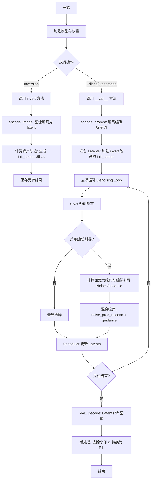
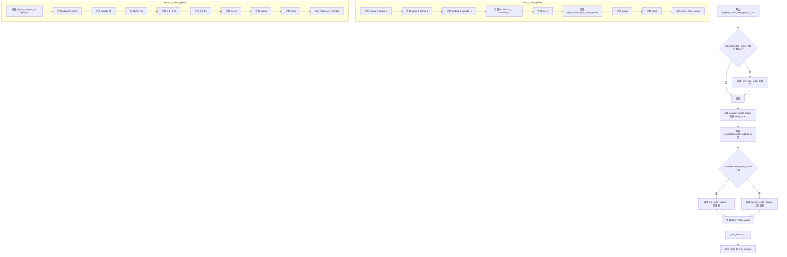
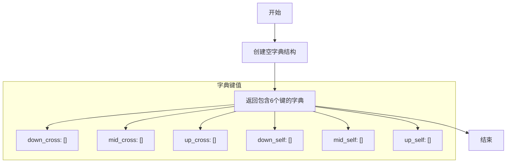
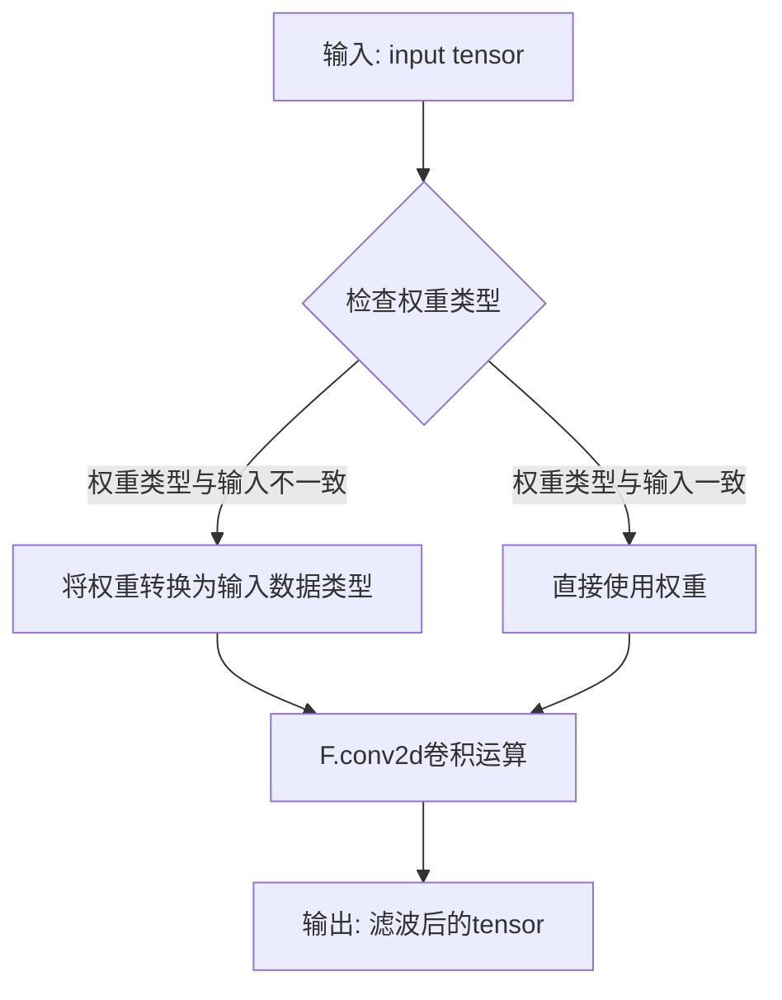
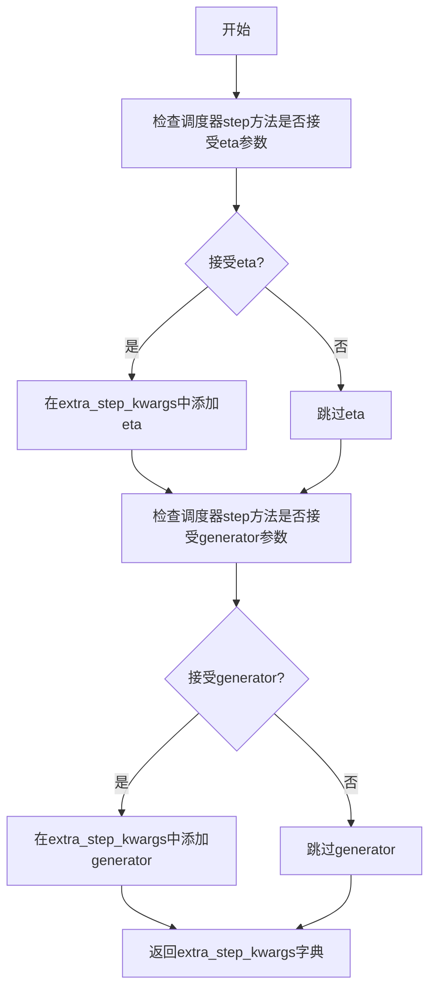
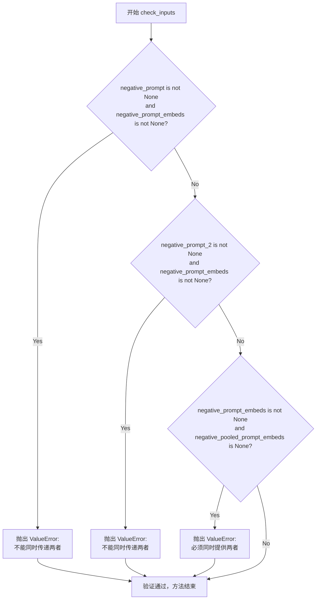
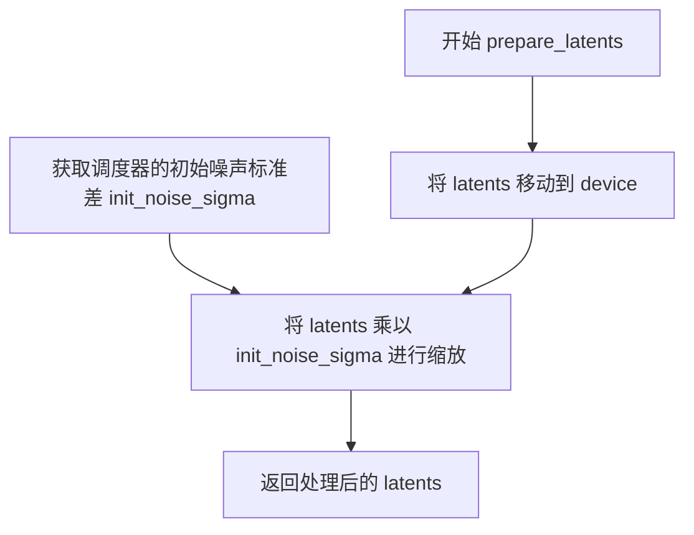

# `diffusers\src\diffusers\pipelines\ledits_pp\pipeline_leditspp_stable_diffusion_xl.py` 详细设计文档

这是一个基于 Stable Diffusion XL (SDXL) 模型的图像编辑管道，实现了 LEDITS++ 算法。该管道支持对图像进行文本引导的编辑操作，核心流程包含两步：首先通过 `invert` 方法对输入图像进行编码和反转，计算出潜在的噪声向量；然后通过 `__call__` 方法利用这些潜在向量和编辑提示词进行去噪生成，从而实现对图像特定区域的修改。

## 整体流程



## 类结构

```
DiffusionPipeline (基类)
├── FromSingleFileMixin
├── StableDiffusionXLLoraLoaderMixin
├── TextualInversionLoaderMixin
├── IPAdapterMixin
└── LEditsPPPipelineStableDiffusionXL (主类)
    ├── 辅助类: LeditsAttentionStore (注意力图存储与聚合)
    ├── 辅助类: LeditsGaussianSmoothing (高斯平滑处理)
    ├── 辅助类: LEDITSCrossAttnProcessor (UNet 交叉注意力钩子)
    └── 工具函数: rescale_noise_cfg, compute_noise (DDIM/DPMSolver)
```

## 全局变量及字段


### `logger`
    
模块级日志记录器，用于输出调试和信息日志

类型：`logging.Logger`
    


### `EXAMPLE_DOC_STRING`
    
示例文档字符串，包含pipeline使用示例的Python代码

类型：`str`
    


### `XLA_AVAILABLE`
    
标志位，表示torch_xla是否可用以支持XLA设备加速

类型：`bool`
    


### `LeditsAttentionStore.step_store`
    
存储每一步推理过程中的注意力图

类型：`dict`
    


### `LeditsAttentionStore.attention_store`
    
累积存储多个步骤的注意力图，可选择是否取平均

类型：`list | dict`
    


### `LeditsAttentionStore.cur_step`
    
当前推理步骤的计数器

类型：`int`
    


### `LeditsAttentionStore.average`
    
标志位，决定是否对多步注意力图取平均

类型：`bool`
    


### `LeditsAttentionStore.batch_size`
    
处理批次的大小

类型：`int`
    


### `LeditsAttentionStore.max_size`
    
注意力图的最大分辨率限制

类型：`int`
    


### `LeditsGaussianSmoothing.weight`
    
高斯平滑核的权重参数，用于卷积操作

类型：`torch.Tensor`
    


### `LEDITSCrossAttnProcessor.attnstore`
    
注意力存储对象的引用，用于保存注意力图

类型：`LeditsAttentionStore`
    


### `LEDITSCrossAttnProcessor.place_in_unet`
    
指示注意力层在UNet中的位置(mid/up/down)

类型：`str`
    


### `LEDITSCrossAttnProcessor.editing_prompts`
    
编辑提示的数量，用于确定批次维度

类型：`int`
    


### `LEDITSCrossAttnProcessor.pnp`
    
标志位，指示是否使用PnP(Plug-and-Play)方法

类型：`bool`
    


### `LEDGitsPPPipelineStableDiffusionXL.vae`
    
变分自编码器，用于图像与潜在表示之间的编码和解码

类型：`AutoencoderKL`
    


### `LEDGitsPPPipelineStableDiffusionXL.text_encoder`
    
第一个冻结的文本编码器，提取文本特征

类型：`CLIPTextModel`
    


### `LEDGitsPPPipelineStableDiffusionXL.text_encoder_2`
    
第二个冻结的文本编码器，带有投影层

类型：`CLIPTextModelWithProjection`
    


### `LEDGitsPPPipelineStableDiffusionXL.tokenizer`
    
第一个分词器，将文本转换为token IDs

类型：`CLIPTokenizer`
    


### `LEDGitsPPPipelineStableDiffusionXL.tokenizer_2`
    
第二个分词器，用于双文本编码器架构

类型：`CLIPTokenizer`
    


### `LEDGitsPPPipelineStableDiffusionXL.unet`
    
条件U-Net模型，用于去噪潜在表示

类型：`UNet2DConditionModel`
    


### `LEDGitsPPPipelineStableDiffusionXL.scheduler`
    
扩散调度器，控制去噪过程的噪声调度

类型：`DPMSolverMultistepScheduler | DDIMScheduler`
    


### `LEDGitsPPPipelineStableDiffusionXL.image_encoder`
    
CLIP视觉编码器，用于IP-Adapter图像条件

类型：`CLIPVisionModelWithProjection`
    


### `LEDGitsPPPipelineStableDiffusionXL.feature_extractor`
    
CLIP图像预处理模块

类型：`CLIPImageProcessor`
    


### `LEDGitsPPPipelineStableDiffusionXL.vae_scale_factor`
    
VAE的缩放因子，用于调整潜在空间维度

类型：`int`
    


### `LEDGitsPPPipelineStableDiffusionXL.image_processor`
    
VAE图像前后处理器，处理图像格式转换

类型：`VaeImageProcessor`
    


### `LEDGitsPPPipelineStableDiffusionXL.watermark`
    
水印处理器，用于添加不可见水印

类型：`StableDiffusionXLWatermarker | None`
    


### `LEDGitsPPPipelineStableDiffusionXL.inversion_steps`
    
图像反转使用的时间步列表

类型：`list[torch.Tensor] | None`
    


### `LEDGitsPPPipelineStableDiffusionXL.init_latents`
    
反转后的初始潜在表示

类型：`torch.Tensor | None`
    


### `LEDGitsPPPipelineStableDiffusionXL.zs`
    
存储每步添加的噪声，用于DDIM反演重构

类型：`torch.Tensor | None`
    


### `LEDGitsPPPipelineStableDiffusionXL.enabled_editing_prompts`
    
当前启用的编辑提示数量

类型：`int`
    


### `LEDGitsPPPipelineStableDiffusionXL.sem_guidance`
    
语义指导向量，用于控制编辑区域

类型：`torch.Tensor | None`
    


### `LEDGitsPPPipelineStableDiffusionXL.activation_mask`
    
激活掩码，指示需要编辑的图像区域

类型：`torch.Tensor | None`
    


### `LEDGitsPPPipelineStableDiffusionXL.attention_store`
    
注意力存储对象，用于保存交叉注意力图

类型：`LeditsAttentionStore | None`
    


### `LEDGitsPPPipelineStableDiffusionXL.size`
    
输入图像的尺寸(高度, 宽度)

类型：`tuple[int, int] | None`
    


### `LEDGitsPPPipelineStableDiffusionXL.default_sample_size`
    
UNet默认采样尺寸

类型：`int`
    
    

## 全局函数及方法


### `rescale_noise_cfg`

该函数用于根据 `guidance_rescale` 参数重新缩放噪声预测张量，以提高图像质量并修复过度曝光问题。基于论文 Common Diffusion Noise Schedules and Sample Steps are Flawed (Section 3.4)。

参数：

- `noise_cfg`：`torch.Tensor`，引导扩散过程中预测的噪声张量
- `noise_pred_text`：`torch.Tensor`，文本引导扩散过程中预测的噪声张量
- `guidance_rescale`：`float`，可选，默认为 0.0，应用到噪声预测的重新缩放因子

返回值：`torch.Tensor`，重新缩放后的噪声预测张量

#### 流程图

```mermaid
flowchart TD
    A[开始] --> B[计算noise_pred_text的标准差<br/>std_text]
    B --> C[计算noise_cfg的标准差<br/>std_cfg]
    C --> D[计算重新缩放的噪声预测<br/>noise_pred_rescaled = noise_cfg \* (std_text / std_cfg)]
    D --> E[混合原始和重新缩放的结果<br/>noise_cfg = guidance_rescale \* noise_pred_rescaled + (1 - guidance_rescale) \* noise_cfg]
    E --> F[返回重新缩放后的noise_cfg]
```

#### 带注释源码

```python
def rescale_noise_cfg(noise_cfg, noise_pred_text, guidance_rescale=0.0):
    r"""
    Rescales `noise_cfg` tensor based on `guidance_rescale` to improve image quality and fix overexposure. Based on
    Section 3.4 from [Common Diffusion Noise Schedules and Sample Steps are
    Flawed](https://huggingface.co/papers/2305.08891).

    Args:
        noise_cfg (`torch.Tensor`):
            The predicted noise tensor for the guided diffusion process.
        noise_pred_text (`torch.Tensor`):
            The predicted noise tensor for the text-guided diffusion process.
        guidance_rescale (`float`, *optional*, defaults to 0.0):
            A rescale factor applied to the noise predictions.

    Returns:
        noise_cfg (`torch.Tensor`): The rescaled noise prediction tensor.
    """
    # 计算文本引导噪声预测的标准差（保留维度用于广播）
    std_text = noise_pred_text.std(dim=list(range(1, noise_pred_text.ndim)), keepdim=True)
    
    # 计算噪声配置的标准差（保留维度用于广播）
    std_cfg = noise_cfg.std(dim=list(range(1, noise_cfg.ndim)), keepdim=True)
    
    # 重新缩放引导结果（修复过度曝光）
    # 通过将noise_cfg乘以std_text/std_cfg来调整噪声的标准差
    noise_pred_rescaled = noise_cfg * (std_text / std_cfg)
    
    # 通过guidance_rescale因子混合原始引导结果，避免图像看起来"平淡"
    # guidance_rescale为0时返回原始noise_cfg，为1时返回完全重新缩放的noise_pred_rescaled
    noise_cfg = guidance_rescale * noise_pred_rescaled + (1 - guidance_rescale) * noise_cfg
    
    return noise_cfg
```


### `compute_noise`

该函数是 LEDits++ 管道中的噪声计算调度函数，根据传入的调度器类型（DDIMScheduler 或 DPMSolverMultistepScheduler）分发到对应的噪声计算实现，用于图像反演过程中计算中间潜变量的噪声和前一步样本。

参数：

- `scheduler`：调度器对象（DDIMScheduler 或 DPMSolverMultistepScheduler），用于判断类型并路由到具体的噪声计算实现
- `*args`：可变位置参数，包含 prev_latents、latents、timestep、noise_pred、eta，这些参数将传递给底层的噪声计算函数

返回值：`tuple`，返回一个元组，包含计算得到的噪声（noise）和前一个样本（prev_sample），具体类型为 `torch.Tensor`

#### 流程图

```mermaid
flowchart TD
    A[compute_noise 被调用] --> B{scheduler 是 DDIMScheduler?}
    B -->|Yes| C[调用 compute_noise_ddim]
    B -->|No| D{scheduler 是 DPMSolverMultistepScheduler<br/>且 algorithm_type == sde-dpmsolver++<br/>且 solver_order == 2?}
    D -->|Yes| E[调用 compute_noise_sde_dpm_pp_2nd]
    D -->|No| F[抛出 NotImplementedError]
    C --> G[返回 (noise, prev_sample) 元组]
    E --> G
```

#### 带注释源码

```python
# Copied from diffusers.pipelines.ledits_pp.pipeline_leditspp_stable_diffusion.compute_noise
def compute_noise(scheduler, *args):
    """
    根据调度器类型分发到对应的噪声计算函数。
    
    参数:
        scheduler: 调度器实例，用于判断类型
        *args: 可变参数，传递给底层噪声计算函数
               包含: prev_latents, latents, timestep, noise_pred, eta
    """
    # 检查是否为 DDIM 调度器
    if isinstance(scheduler, DDIMScheduler):
        # 使用 DDIM 噪声计算方法
        return compute_noise_ddim(scheduler, *args)
    # 检查是否为 DPM++ SDE 调度器且配置匹配
    elif (
        isinstance(scheduler, DPMSolverMultistepScheduler)
        and scheduler.config.algorithm_type == "sde-dpmsolver++"
        and scheduler.config.solver_order == 2
    ):
        # 使用二阶 DPM++ SDE 噪声计算方法
        return compute_noise_sde_dpm_pp_2nd(scheduler, *args)
    else:
        # 不支持的调度器类型
        raise NotImplementedError
```


### `compute_noise_ddim`

该函数是DDIM（Denoising Diffusion Implicit Models）采样算法的核心实现，用于根据预测的噪声和调度器参数计算前一个潜在样本及噪声项。这是扩散模型逆向过程中的关键步骤，基于DDIM采样公式12和16进行计算。

参数：

-  `scheduler`：`DDIMScheduler`，DDIM调度器对象，包含alphas_cumprod等累积乘积配置
-  `prev_latents`：`torch.Tensor`，前一个时间步的潜在变量（latents）
-  `latents`：`torch.Tensor`，当前时间步的潜在变量
-  `timestep`：`int`，当前扩散时间步
-  `noise_pred`：`torch.Tensor`，UNet预测的噪声
-  `eta`：`float`，DDIM公式中的η参数，控制采样随机性（0为确定性）

返回值：`tuple[torch.Tensor, torch.Tensor]`，包含：
-  `noise`：`torch.Tensor`，计算得到的噪声项
-  `mu_xt`：`torch.Tensor`，加噪后的前一个潜在样本（用于下一步）

#### 流程图

```mermaid
flowchart TD
    A[开始 compute_noise_ddim] --> B[计算前一时间步prev_timestep]
    B --> C[获取alpha_prod_t和alpha_prod_t_prev]
    C --> D[计算beta_prod_t]
    D --> E[计算预测原样本pred_original_sample]
    E --> F{是否clip_sample?}
    F -->|Yes| G[将pred_original_sample限制在-1到1之间]
    F -->|No| H[继续]
    G --> I[计算方差variance和标准差std_dev_t]
    H --> I
    I --> J[计算预测样本方向pred_sample_direction]
    J --> K[计算mu_xt均值]
    K --> L{variance > 0?}
    L -->|Yes| M[计算noise = (prev_latents - mu_xt) / (std_dev_t * eta)]
    L -->|No| N[noise设为0]
    M --> O[返回noise和mu_xt + eta * variance^0.5 * noise]
    N --> O
```

#### 带注释源码

```
def compute_noise_ddim(scheduler, prev_latents, latents, timestep, noise_pred, eta):
    # 1. 获取前一步的值 (=t-1)
    # 计算前一个时间步的索引
    prev_timestep = timestep - scheduler.config.num_train_timesteps // scheduler.num_inference_steps

    # 2. 计算alphas和betas
    # 获取当前时间步的累积alpha值
    alpha_prod_t = scheduler.alphas_cumprod[timestep]
    # 获取前一个时间步的累积alpha值，若越界则使用最终alpha值
    alpha_prod_t_prev = (
        scheduler.alphas_cumprod[prev_timestep] if prev_timestep >= 0 else scheduler.final_alpha_cumprod
    )

    # 计算beta值
    beta_prod_t = 1 - alpha_prod_t

    # 3. 从预测的噪声计算预测的原样本
    # 也称为公式(12)中的"predicted x_0"
    # 来自 https://huggingface.co/papers/2010.02502
    # x_0 = (x_t - sqrt(1-α_t) * ε_θ(x_t,t)) / sqrt(α_t)
    pred_original_sample = (latents - beta_prod_t ** (0.5) * noise_pred) / alpha_prod_t ** (0.5)

    # 4. 对"predicted x_0"进行裁剪
    # 根据调度器配置决定是否裁剪
    if scheduler.config.clip_sample:
        pred_original_sample = torch.clamp(pred_original_sample, -1, 1)

    # 5. 计算方差: "sigma_t(η)"
    # 参考公式(16)
    # σ_t = sqrt((1 − α_t−1)/(1 − α_t)) * sqrt(1 − α_t/α_t−1)
    variance = scheduler._get_variance(timestep, prev_timestep)
    std_dev_t = eta * variance ** (0.5)

    # 6. 计算"指向x_t的方向"
    # 公式(12)中的方向项
    # pred_sample_direction = sqrt(1 - α_t-1 - σ_t²) * ε_θ(x_t,t)
    pred_sample_direction = (1 - alpha_prod_t_prev - std_dev_t**2) ** (0.5) * noise_pred

    # 计算更新后的均值mu_xt，同时返回以避免误差累积
    # μ_t = sqrt(α_t-1) * x_0 + direction
    mu_xt = alpha_prod_t_prev ** (0.5) * pred_original_sample + pred_sample_direction
    
    # 根据方差计算噪声
    if variance > 0.0:
        # noise = (x_t-1 - μ_t) / (σ_t * η)
        noise = (prev_latents - mu_xt) / (variance ** (0.5) * eta)
    else:
        # 若方差为0，则噪声为0（确定性采样）
        noise = torch.tensor([0.0]).to(latents.device)

    # 返回噪声和前一个样本
    # x_t-1 = μ_t + η * σ_t * noise
    return noise, mu_xt + (eta * variance**0.5) * noise
```


### `compute_noise_sde_dpm_pp_2nd`

该函数实现了 DPM-Solver++ 的二阶求解器（second-order solver），用于在 LEDits++ 图像编辑 pipeline 中根据预测的噪声和调度器状态计算逆扩散过程中的噪声和前一个样本。该函数是 `compute_noise` 函数的调度分支，仅在调度器为 `DPMSolverMultistepScheduler` 且算法类型为 `sde-dpmsolver++`、求解器阶数为 2 时被调用。

参数：

-  `scheduler`：`DPMSolverMultistepScheduler`，DPM-Solver 调度器实例，包含求解器配置和状态
-  `prev_latents`：`torch.Tensor`，逆扩散过程中前一个时间步的潜在变量 $x_{t-1}$
-  `latents`：`torch.Tensor`，当前时间步的潜在变量 $x_t$
-  `timestep`：`int` 或 `torch.Tensor`，当前扩散时间步 $t$
-  `noise_pred`：`torch.Tensor`，UNet 预测的噪声 $\epsilon_\theta(x_t, t)$
-  `eta`：`float`，DDIM 噪声调度参数，控制方差大小（0 表示确定性）

返回值：`Tuple[torch.Tensor, torch.Tensor]`，第一个元素是计算的噪声 $z$，第二个元素是逆扩散后的前一个样本 $\tilde{x}_{t-1}$

#### 流程图



#### 带注释源码

```python
# Copied from diffusers.pipelines.ledits_pp.pipeline_leditspp_stable_diffusion.compute_noise_sde_dpm_pp_2nd
def compute_noise_sde_dpm_pp_2nd(scheduler, prev_latents, latents, timestep, noise_pred, eta):
    """
    实现 DPM-Solver++ 二阶求解器的噪声计算函数
    
    参数:
        scheduler: DPMSolverMultistepScheduler 调度器实例
        prev_latents: 前一个时间步的潜在变量 x_{t-1}
        latents: 当前时间步的潜在变量 x_t
        timestep: 当前扩散时间步 t
        noise_pred: UNet 预测的噪声
        eta: DDIM 参数，控制方差
    """
    
    def first_order_update(model_output, sample):
        """
        一阶更新（Euler 方法）
        
        参数:
            model_output: 预测的噪声
            sample: 当前样本 x_t
        返回:
            noise: 计算的噪声
            prev_sample: 前一个样本 x_{t-1}
        """
        # 获取当前和前一个 sigma 值
        sigma_t, sigma_s = scheduler.sigmas[scheduler.step_index + 1], scheduler.sigmas[scheduler.step_index]
        
        # 将 sigma 转换为 alpha 和 sigma 对
        alpha_t, sigma_t = scheduler._sigma_to_alpha_sigma_t(sigma_t)
        alpha_s, sigma_s = scheduler._sigma_to_alpha_sigma_t(sigma_s)
        
        # 计算 log-alpha - log-sigma (log-SNR)
        lambda_t = torch.log(alpha_t) - torch.log(sigma_t)
        lambda_s = torch.log(alpha_s) - torch.log(sigma_s)

        # 计算时间步间隔 h
        h = lambda_t - lambda_s

        # 计算均值 mu_xt (扩散过程的反向采样)
        mu_xt = (sigma_t / sigma_s * torch.exp(-h)) * sample + (alpha_t * (1 - torch.exp(-2.0 * h))) * model_output

        # 调用调度器的一阶更新方法
        mu_xt = scheduler.dpm_solver_first_order_update(
            model_output=model_output, sample=sample, noise=torch.zeros_like(sample)
        )

        # 计算标准差 sigma
        sigma = sigma_t * torch.sqrt(1.0 - torch.exp(-2 * h))
        
        # 计算噪声
        if sigma > 0.0:
            noise = (prev_latents - mu_xt) / sigma
        else:
            noise = torch.tensor([0.0]).to(sample.device)

        # 计算前一个样本
        prev_sample = mu_xt + sigma * noise
        return noise, prev_sample

    def second_order_update(model_output_list, sample):
        """
        二阶更新（Heun 方法 / DPM-Solver++ 二阶）
        
        参数:
            model_output_list: 包含前两个预测的列表
            sample: 当前样本 x_t
        返回:
            noise: 计算的噪声
            prev_sample: 前一个样本 x_{t-1}
        """
        # 获取当前和前两个 sigma 值
        sigma_t, sigma_s0, sigma_s1 = (
            scheduler.sigmas[scheduler.step_index + 1],
            scheduler.sigmas[scheduler.step_index],
            scheduler.sigmas[scheduler.step_index - 1],
        )

        # 转换为 alpha-sigma 对
        alpha_t, sigma_t = scheduler._sigma_to_alpha_sigma_t(sigma_t)
        alpha_s0, sigma_s0 = scheduler._sigma_to_alpha_sigma_t(sigma_s0)
        alpha_s1, sigma_s1 = scheduler._sigma_to_alpha_sigma_t(sigma_s1)

        # 计算 log-SNR
        lambda_t = torch.log(alpha_t) - torch.log(sigma_t)
        lambda_s0 = torch.log(alpha_s0) - torch.log(sigma_s0)
        lambda_s1 = torch.log(alpha_s1) - torch.log(sigma_s1)

        # 获取两个预测输出
        m0, m1 = model_output_list[-1], model_output_list[-2]

        # 计算时间步间隔
        h, h_0 = lambda_t - lambda_s0, lambda_s0 - lambda_s1
        r0 = h_0 / h
        
        # 计算 D0 和 D1 (梯度估计)
        D0, D1 = m0, (1.0 / r0) * (m0 - m1)

        # 计算二阶均值
        mu_xt = (
            (sigma_t / sigma_s0 * torch.exp(-h)) * sample
            + (alpha_t * (1 - torch.exp(-2.0 * h))) * D0
            + 0.5 * (alpha_t * (1 - torch.exp(-2.0 * h))) * D1
        )

        # 计算标准差
        sigma = sigma_t * torch.sqrt(1.0 - torch.exp(-2 * h))
        
        # 计算噪声
        if sigma > 0.0:
            noise = (prev_latents - mu_xt) / sigma
        else:
            noise = torch.tensor([0.0]).to(sample.device)

        # 计算前一个样本
        prev_sample = mu_xt + sigma * noise

        return noise, prev_sample

    # 初始化 step_index（如果尚未初始化）
    if scheduler.step_index is None:
        scheduler._init_step_index(timestep)

    # 将预测的噪声转换为模型输出格式
    model_output = scheduler.convert_model_output(model_output=noise_pred, sample=latents)
    
    # 更新模型输出队列（用于多步求解器）
    for i in range(scheduler.config.solver_order - 1):
        scheduler.model_outputs[i] = scheduler.model_outputs[i + 1]
    scheduler.model_outputs[-1] = model_output

    # 根据阶数选择一阶或二阶更新
    if scheduler.lower_order_nums < 1:
        noise, prev_sample = first_order_update(model_output, latents)
    else:
        noise, prev_sample = second_order_update(scheduler.model_outputs, latents)

    # 如果使用低阶近似，增加 lower_order_nums
    if scheduler.lower_order_nums < scheduler.config.solver_order:
        scheduler.lower_order_nums += 1

    # 完成更新后增加 step_index
    scheduler._step_index += 1

    return noise, prev_sample
```


### `LeditsAttentionStore.get_empty_store`

该函数是一个静态方法，用于初始化并返回一个空的注意力存储字典结构。该字典包含六个键，分别对应UNet中不同位置（down、mid、up）和不同类型（cross、self）的注意力图，用于在LEDits++图像编辑过程中存储和聚合注意力图。

参数：

- 该函数没有参数

返回值：`dict`，返回一个包含六个空列表的字典，键名为 `{位置}_{类型}` 的形式，位置包括 down、mid、up，类型包括 cross 和 self，用于分类存储不同层和类型的注意力图。

#### 流程图



#### 带注释源码

```python
@staticmethod
def get_empty_store():
    """
    创建一个空的注意力存储结构，用于初始化注意力图存储。
    
    该方法返回一个字典，包含六个键，对应UNet中不同位置的注意力图：
    - down_cross: 下采样层的交叉注意力图
    - mid_cross: 中间层的交叉注意力图
    - up_cross: 上采样层的交叉注意力图
    - down_self: 下采样层的自注意力图
    - mid_self: 中间层的自注意力图
    - up_self: 上采样层的自注意力图
    
    Returns:
        dict: 包含六个空列表的字典，每个键对应一种注意力图类型
    """
    return {
        "down_cross": [],  # 下采样层交叉注意力存储
        "mid_cross": [],    # 中间层交叉注意力存储
        "up_cross": [],    # 上采样层交叉注意力存储
        "down_self": [],   # 下采样层自注意力存储
        "mid_self": [],    # 中间层自注意力存储
        "up_self": []      # 上采样层自注意力存储
    }
```


### LeditsAttentionStore.__call__

该方法是 `LeditsAttentionStore` 类的核心调用接口，用于在扩散模型的推理过程中捕获和存储交叉注意力（cross-attention）或自注意力（self-attention）图，以便后续进行图像编辑处理。该方法接收注意力张量，并根据是否启用 PnP（Plug-and-Play）模式和编辑提示数量来过滤和重组注意力图，最后调用内部方法将处理后的注意力图存储到对应的结构中。

参数：

- `self`：`LeditsAttentionStore` 实例本身，包含注意力存储所需的配置和状态
- `attn`：`torch.Tensor`，注意力张量，其形状为 `batch_size * head_size, seq_len_query, seq_len_key`，其中包含了来自 U-Net 的注意力分数
- `is_cross`：`bool`，布尔标志，用于区分交叉注意力（True）和自注意力（False），交叉注意力用于建模文本与图像之间的关联，自注意力用于建模图像内部的空间关联
- `place_in_unet`：`str`，字符串，表示注意力图在 U-Net 中的位置，可选值包括 `"down"`（下采样阶段）、`"mid"`（中间阶段）和 `"up"`（上采样阶段），用于标识注意力来源的模块
- `editing_prompts`：`int`，编辑提示的数量，用于计算批次大小和确定需要存储的注意力图范围
- `PnP`：`bool`，可选参数，默认为 `False`，表示是否启用 Plug-and-Play 模式，启用时会额外处理 PnP 相关的无条件注意力图

返回值：无返回值（`None`），该方法通过修改 `self.step_store` 字典来间接存储注意力数据

#### 流程图

```mermaid
flowchart TD
    A[开始 __call__] --> B{检查 attn.shape[1] <= self.max_size}
    B -->|否| C[直接返回，不存储]
    B -->|是| D[计算批次配置]
    D --> E[bs = 1 + int(PnP) + editing_prompts]
    E --> F[skip = 2 if PnP else 1]
    F --> G[重组注意力张量]
    G --> H[attn = torch.stack<br/>.split(self.batch_size<br/>.permute(1, 0, 2, 3)]
    H --> I[计算源批次大小]
    I --> J[source_batch_size = int<br/>(attn.shape[1] // bs)]
    J --> K[调用 forward 方法]
    K --> L[key = f'{place_in_unet}_{'cross' if is_cross else 'self'}']
    L --> M[self.step_store[key].append<br/>(attn[:, skip*source_batch_size:])]
    M --> N[结束]
```

#### 带注释源码

```python
def __call__(self, attn, is_cross: bool, place_in_unet: str, editing_prompts, PnP=False):
    """
    捕获并存储注意力图的主入口方法。
    
    参数:
        attn: 来自 U-Net 的注意力张量，形状为 (batch_size * head_size, seq_len_query, seq_len_key)
        is_cross: 区分交叉注意力和自注意力
        place_in_unet: 注意力在 U-Net 中的位置 (down/mid/up)
        editing_prompts: 编辑提示的数量
        PnP: 是否启用 Plug-and-Play 模式
    """
    # attn.shape = batch_size * head_size, seq_len query, seq_len_key
    
    # 检查注意力图的序列长度是否在允许的范围内
    # max_size 默认为 max_resolution**2，用于控制存储的注意力图大小
    if attn.shape[1] <= self.max_size:
        # 计算总批次大小：1（原始图像）+ PnP标志（0或1）+ 编辑提示数量
        bs = 1 + int(PnP) + editing_prompts
        
        # 计算需要跳过的批次数量：
        # 如果启用PnP模式，需要跳过2个批次（PnP条件和无条件）
        # 否则只跳过1个批次（无条件）
        skip = 2 if PnP else 1
        
        # 重组注意力张量以便后续处理
        # 将原始张量按 batch_size 分割并重新排列维度
        # 从 (batch*heads, seq_q, seq_k) 转换为 (heads, batch, seq_q, seq_k)
        attn = torch.stack(attn.split(self.batch_size)).permute(1, 0, 2, 3)
        
        # 计算每个编辑提示对应的批次大小
        # 用于确定需要提取的注意力图范围
        source_batch_size = int(attn.shape[1] // bs)
        
        # 调用 forward 方法存储处理后的注意力图
        # 只保留从 skip*source_batch_size 开始的部分（跳过无条件部分）
        self.forward(attn[:, skip * source_batch_size :], is_cross, place_in_unet)
```

#### 关键技术细节

该方法是 LEDits++ 图像编辑 pipeline 中的关键组件，其核心功能是在扩散模型的去噪过程中有选择性地捕获注意力图。具体实现上，该方法首先检查注意力图的尺寸是否在预设的 `max_size` 范围内，以避免存储过大的注意力图导致内存溢出。然后根据是否启用 PnP 模式以及编辑提示的数量来计算需要跳过的批次索引，这是因为在推理过程中通常会包含无条件（unconditional）和条件（conditional）的注意力图，而编辑操作只需要关注条件部分的注意力。通过调用 `forward` 方法，最终将处理后的注意力图按照 U-Net 位置和注意力类型（cross/self）存储到 `step_store` 字典中，供后续的 `aggregate_attention` 方法进行聚合处理，以生成用于指导图像编辑的注意力掩码。


### `LeditsAttentionStore.forward`

该方法将给定注意力张量存储到内部存储器中，使用UNet中的位置（down/mid/up）和注意力类型（cross/self）作为键进行索引，以便后续在图像编辑过程中检索和分析注意力图。

参数：

- `attn`：`torch.Tensor`，注意力张量，通常是注意力概率分布，形状为 (batch_size, seq_len_query, seq_len_key)
- `is_cross`：`bool`，指示是否为跨注意力（cross-attention），否则为自注意力（self-attention）
- `place_in_unet`：`str`，表示注意力图在UNet中的位置，可选值为 "down"、"mid"、"up"

返回值：`None`，该方法直接修改 `self.step_store` 字典，不返回任何值

#### 流程图

```mermaid
flowchart TD
    A[开始 forward 方法] --> B[构建存储键 key]
    B --> C{is_cross == True?}
    C -->|是| D[key = place_in_unet + '_cross'] 
    C -->|否| E[key = place_in_unet + '_self']
    D --> F[将 attn 追加到 step_store[key] 列表中]
    E --> F
    F --> G[结束]
```

#### 带注释源码

```python
def forward(self, attn, is_cross: bool, place_in_unet: str):
    """
    将注意力张量存储到 step_store 中。
    
    参数:
        attn: 注意力张量，形状为 (batch, seq_len_query, seq_len_key)
        is_cross: 是否为跨注意力（True=跨注意力，False=自注意力）
        place_in_unet: 在UNet中的位置 ('down', 'mid', 'up')
    """
    # 根据 is_cross 和 place_in_unet 构建存储键
    # 例如: 'down_cross', 'mid_self', 'up_cross' 等
    key = f"{place_in_unet}_{'cross' if is_cross else 'self'}"
    
    # 将注意力张量追加到对应键的列表中
    # step_store 结构: {"down_cross": [], "mid_cross": [], "up_cross": [], 
    #                   "down_self": [], "mid_self": [], "up_self": []}
    self.step_store[key].append(attn)
```


### `LeditsAttentionStore.between_steps`

该方法用于在扩散模型的每个推理步骤之间调用，负责将当前步骤收集的注意力图（`step_store`）合并到总体的注意力存储（`attention_store`）中。根据 `average` 标志，它会累积并平均所有步骤的注意力图，或者将每一步的注意力图作为独立条目存储，以便后续进行聚合分析。

参数：

- `store_step`：`bool`，一个布尔标志，指示是否将当前步骤的注意力图存储到总体存储中。如果为 `True`，则执行存储逻辑；如果为 `False`，则仅重置 `step_store` 并递增步骤计数器。

返回值：`None`，该方法不返回任何值，仅更新对象的内部状态。

#### 流程图

```mermaid
flowchart TD
    A[开始: between_steps] --> B{store_step == True?}
    B -->|Yes| C{average == True?}
    B -->|No| I[cur_step += 1]
    I --> J[step_store = get_empty_store]
    J --> K[结束]
    
    C -->|Yes| D{len(attention_store) == 0?}
    C -->|No| F{len(attention_store) == 0?}
    
    D -->|Yes| E[attention_store = step_store]
    D -->|No| G[遍历attention_store的每个key]
    G --> H[累加step_store[key]到attention_store[key]]
    H --> I
    
    F -->|Yes| L[attention_store = [step_store]]
    F -->|No| M[attention_store.append(step_store)]
    M --> I
    E --> I
```

#### 带注释源码

```
    def between_steps(self, store_step=True):
        """
        在扩散模型的推理步骤之间调用，用于将当前步骤的注意力图存储到总体存储中。
        
        参数:
            store_step (bool): 是否将当前步骤的注意力图存储到总体存储中。默认为True。
        """
        if store_step:
            if self.average:
                # 如果需要平均所有步骤的注意力图
                if len(self.attention_store) == 0:
                    # 首次调用时，直接将step_store赋值给attention_store
                    self.attention_store = self.step_store
                else:
                    # 后续调用时，将step_store中的每个注意力图累加到attention_store中
                    for key in self.attention_store:
                        for i in range(len(self.attention_store[key])):
                            # 累加注意力图（用于后续求平均）
                            self.attention_store[key][i] += self.step_store[key][i]
            else:
                # 如果不平均，则将每一步的注意力图作为独立列表元素存储
                if len(self.attention_store) == 0:
                    # 首次调用时，将step_store作为列表的第一个元素
                    self.attention_store = [self.step_store]
                else:
                    # 后续调用时，将step_store追加到列表末尾
                    self.attention_store.append(self.step_store)

            # 更新当前步骤计数
            self.cur_step += 1
        
        # 重置step_store，为下一个推理步骤做准备
        self.step_store = self.get_empty_store()
```


### `LeditsAttentionStore.get_attention`

该方法用于从注意力存储中检索注意力图。根据配置，它返回所有步骤的平均注意力或特定步骤的注意力。

参数：

- `step`：`int`，扩散过程中的步骤索引，仅在非平均模式（average=False）时需要提供

返回值：`dict`，包含不同位置（down/mid/up）和类型（cross/self）的注意力图字典，值为张量列表

#### 流程图

```mermaid
flowchart TD
    A[开始 get_attention] --> B{average?}
    B -->|True| C[遍历 attention_store]
    B -->|False| D{step is not None?}
    D -->|False| E[断言错误]
    D -->|True| F[获取 attention_store[step]]
    C --> G[每个key的item除以cur_step]
    G --> H[构建平均注意力字典]
    F --> I[构建步骤注意力字典]
    H --> J[返回注意力字典]
    I --> J
```

#### 带注释源码

```python
def get_attention(self, step: int):
    """
    Retrieve attention maps from the store.
    
    This method returns attention maps either averaged across all steps
    or for a specific step, depending on the 'average' configuration
    set during initialization.
    
    Args:
        step (int): The diffusion step index to retrieve attention for.
                   Only used when average=False.
    
    Returns:
        dict: A dictionary containing attention maps organized by:
              - Location: 'down_cross', 'mid_cross', 'up_cross', 
                         'down_self', 'mid_self', 'up_self'
              - Values: List of attention tensors
              When average=True, values are averaged by cur_step.
              When average=False, returns the raw attention for the given step.
    """
    # If averaging is enabled, compute average attention across all steps
    if self.average:
        # Divide each attention item by the current step count to get average
        attention = {
            key: [item / self.cur_step for item in self.attention_store[key]] 
            for key in self.attention_store
        }
    else:
        # Ensure step is provided when not using average mode
        assert step is not None
        # Retrieve attention for the specific step
        attention = self.attention_store[step]
    
    return attention
```


### `LeditsAttentionStore.aggregate_attention`

该方法用于从存储的注意力图中聚合指定条件下的注意力权重，根据位置、是否为交叉注意力等条件筛选并整合注意力图，最后对注意力头取平均，返回聚合后的注意力张量。

参数：

- `self`：`LeditsAttentionStore`，注意力存储对象的实例，包含批大小、存储的注意力图等属性
- `attention_maps`：`dict`，存储注意力图的字典，键为 `"{location}_{cross/self}"` 格式，值为注意力张量列表
- `prompts`：`list[str]`，提示词列表，用于确定注意力图的批次维度
- `res`：`int | tuple[int]`，目标分辨率，可以是整数（表示正方形分辨率）或元组（宽高）
- `from_where`：`list[str]`，要聚合的注意力图位置列表，如 `["up", "down"]`
- `is_cross`：`bool`，是否为交叉注意力图，`True` 表示交叉注意力，`False` 表示自注意力
- `select`：`int`，从批次中选择的索引，用于选取特定提示词对应的注意力图

返回值：`torch.Tensor`，聚合后的注意力张量，形状为 `[batch_size, height, width, seq_len]`，已对注意力头维度求平均

#### 流程图

```mermaid
flowchart TD
    A[开始聚合注意力] --> B[初始化输出列表 out]
    B --> C{res 是整数?}
    C -->|Yes| D[计算 num_pixels = res²<br/>resolution = (res, res)]
    C -->|No| E[计算 num_pixels = res[0] * res[1]<br/>resolution = res[:2]]
    D --> F[遍历 from_where 中的每个位置]
    E --> F
    F --> G[获取对应位置的注意力图]
    G --> H[遍历该位置的每个批次项]
    H --> I{item.shape[1] == num_pixels?}
    I -->|No| H
    I -->|Yes| J[重塑注意力图为 [len(prompts), -1, *resolution, item.shape[-1]]
    J --> K[根据 select 索引选择特定提示词的注意力图]
    K --> L[将选中的注意力图添加到对应批次的 out 列表中]
    L --> H
    F --> M[检查是否还有未处理的位置]
    M -->|Yes| F
    M -->|No| N[堆叠并拼接 out 中的注意力图]
    N --> O[对注意力头维度求平均: out.sum(1) / out.shape[1]]
    O --> P[返回聚合后的注意力张量]
```

#### 带注释源码

```python
def aggregate_attention(
    self, attention_maps, prompts, res: int | tuple[int], from_where: list[str], is_cross: bool, select: int
):
    # 初始化输出列表，每个batch对应一个空列表
    out = [[] for x in range(self.batch_size)]
    
    # 解析分辨率参数，确定目标像素数和分辨率元组
    if isinstance(res, int):
        num_pixels = res**2  # 如果是整数，计算像素总数（如16x16=256）
        resolution = (res, res)
    else:
        num_pixels = res[0] * res[1]  # 如果是元组，计算像素总数
        resolution = res[:2]  # 取前两个元素作为分辨率
    
    # 遍历指定的位置（如 "up", "down", "mid"）
    for location in from_where:
        # 构建键名：location_cross 或 location_self
        key = f"{location}_{'cross' if is_cross else 'self'}"
        
        # 遍历该键对应的所有注意力图批次项
        for bs_item in attention_maps[key]:
            # 遍历批次中的每个样本
            for batch, item in enumerate(bs_item):
                # 检查注意力图的序列长度是否与目标像素数匹配
                if item.shape[1] == num_pixels:
                    # 重塑注意力图：[batch, seq_len, heads] -> [prompts, -1, height, width, heads]
                    cross_maps = item.reshape(len(prompts), -1, *resolution, item.shape[-1])[select]
                    # 将选中的注意力图添加到对应批次的输出列表中
                    out[batch].append(cross_maps)
    
    # 将每个批次的注意力图列表堆叠并拼接成一个张量
    # 先对每个batch内的列表进行torch.cat，再对batch维度进行torch.stack
    out = torch.stack([torch.cat(x, dim=0) for x in out])
    
    # 对注意力头维度求平均（dim=1是heads维度）
    out = out.sum(1) / out.shape[1]
    
    return out
```


### `LeditsGaussianSmoothing.__init__`

该方法是 `LeditsGaussianSmoothing` 类的初始化方法，负责构建高斯卷积核并将其转换为可在指定设备上执行卷积操作的权重张量。该类用于在 LEDits++ 图像编辑pipeline中执行注意力图的高斯平滑处理。

参数：

- `device`：`torch.device`，指定计算设备（CPU/CUDA），用于将生成的高斯核权重移动到该设备上

返回值：无（`None`），该方法为构造函数，仅初始化实例属性 `self.weight`

#### 流程图

```mermaid
graph TD
    A[开始 __init__] --> B[设置 kernel_size = [3, 3]]
    B --> C[设置 sigma = [0.5, 0.5]]
    C --> D[初始化 kernel = 1]
    D --> E[创建 meshgrid 网格坐标]
    E --> F[循环计算高斯核值]
    F --> G[归一化使核值和为1]
    G --> H[reshape 为卷积权重形状]
    H --> I[repeat 扩展为深度卷积权重]
    I --> J[self.weight = kernel.to device]
    J --> K[结束]
```

#### 带注释源码

```python
def __init__(self, device):
    # 定义高斯核的尺寸为 3x3
    kernel_size = [3, 3]
    # 定义高斯核在每个维度上的标准差
    sigma = [0.5, 0.5]

    # The gaussian kernel is the product of the gaussian function of each dimension.
    # 初始化核值为1（将累乘）
    kernel = 1
    # 创建2D网格坐标，用于计算每个位置到中心点的距离
    # torch.meshgrid 生成两个 3x3 的坐标矩阵（i索引和j索引）
    meshgrids = torch.meshgrid(
        [torch.arange(size, dtype=torch.float32) for size in kernel_size], 
        indexing="ij"
    )
    # 对每个维度计算高斯函数值并累乘
    # 高斯公式: G(x) = 1/(σ*√(2π)) * exp(-(x-mean)²/(2σ²))
    for size, std, mgrid in zip(kernel_size, sigma, meshgrids):
        # 计算当前维度的中心点位置
        mean = (size - 1) / 2
        # 计算高斯核在该维度上的值并累乘到 kernel 上
        kernel *= 1 / (std * math.sqrt(2 * math.pi)) * torch.exp(-(((mgrid - mean) / (2 * std)) ** 2))

    # Make sure sum of values in gaussian kernel equals 1.
    # 归一化高斯核，使其所有值之和为1（确保不改变图像整体亮度）
    kernel = kernel / torch.sum(kernel)

    # Reshape to depthwise convolutional weight
    # 将高斯核reshape为卷积权重格式 [1, 1, height, width]
    kernel = kernel.view(1, 1, *kernel.size())
    # 扩展为深度卷积权重格式，repeat 第一个维度保持为1
    # 第二个维度扩展以适应深度卷积（in_channels 维度）
    kernel = kernel.repeat(1, *[1] * (kernel.dim() - 1))

    # 将高斯核权重移动到指定设备（CPU/CUDA）并保存为实例属性
    self.weight = kernel.to(device)
```


### `LeditsGaussianSmoothing.__call__`

对输入图像应用高斯平滑滤波，使用预计算的高斯卷积核进行二维卷积操作，用于LEDits++图像编辑中的注意力图后处理。

参数：

- `self`：LeditsGaussianSmoothing 类实例本身
- `input`：`torch.Tensor`，输入张量，通常为经过填充的注意力图，形状为 (B, 1, H, W)

返回值：`torch.Tensor`，滤波后的输出，形状与输入相同 (B, 1, H, W)

#### 流程图



#### 带注释源码

```python
def __call__(self, input):
    """
    Apply gaussian filter to input.
    
    Arguments:
        input (torch.Tensor): Input to apply gaussian filter on.
        
    Returns:
        filtered (torch.Tensor): Filtered output.
    """
    # 使用 PyTorch 的二维卷积函数 F.conv2d 进行高斯滤波
    # input: 输入张量，形状通常为 (batch_size, channels, height, width)
    # weight: 初始化时创建的高斯核权重，形状为 (1, 1, kernel_size[0], kernel_size[1])
    # 将权重转换为与输入相同的数据类型，以确保兼容性
    return F.conv2d(input, weight=self.weight.to(input.dtype))
```

---

### `LeditsGaussianSmoothing.__init__`

初始化高斯平滑滤波器，创建并预计算高斯卷积核权重。

参数：

- `self`：LeditsGaussianSmoothing 类实例本身
- `device`：`torch.device`，指定将高斯核权重移动到的目标设备（CPU 或 CUDA）

返回值：无

#### 流程图

```mermaid
flowchart TD
    A[输入: device] --> B[定义kernel_size=[3,3]和sigma=[0.5,0.5]]
    B --> C[创建网格坐标meshgrid]
    C --> D[计算高斯核值: 1/(std*sqrt(2*pi)) * exp(-((x-mean)/(2*std))^2)]
    D --> E[归一化核使其总和为1]
    E --> F[ reshape为(1,1,kernel_h,kernel_w)]
    F --> G[repeat扩展为深度可分离卷积权重]
    G --> H[将权重移动到指定device]
    H --> I[保存为self.weight]
```

#### 带注释源码

```python
def __init__(self, device):
    # 定义高斯核的尺寸为 3x3
    kernel_size = [3, 3]
    # 定义高斯核在 x 和 y 方向上的标准差
    sigma = [0.5, 0.5]

    # 初始化核值为 1（将累乘）
    kernel = 1
    # 创建二维网格坐标，用于计算高斯函数
    # meshgrids[0] 包含 x 坐标，meshgrids[1] 包含 y 坐标
    meshgrids = torch.meshgrid(
        [torch.arange(size, dtype=torch.float32) for size in kernel_size], 
        indexing="ij"
    )
    
    # 对每个维度计算高斯核值并累乘
    # 高斯函数: G(x) = 1/(σ*√(2π)) * exp(-((x-μ)/(2σ))^2)
    for size, std, mgrid in zip(kernel_size, sigma, meshgrids):
        mean = (size - 1) / 2  # 计算均值（中心点）
        # 累乘各维度的高斯值，得到二维高斯核
        kernel *= 1 / (std * math.sqrt(2 * math.pi)) * torch.exp(-(((mgrid - mean) / (2 * std)) ** 2))

    # 确保高斯核的总和为 1（归一化）
    kernel = kernel / torch.sum(kernel)

    # 将核reshape为 (1, 1, 3, 3) 形状，符合 PyTorch conv2d 权重格式
    kernel = kernel.view(1, 1, *kernel.size())
    # 扩展为深度可分离卷积权重格式：(out_channels=1, in_channels=1, kH, kW)
    kernel = kernel.repeat(1, *[1] * (kernel.dim() - 1))

    # 将核权重移动到指定设备（CPU 或 CUDA）
    self.weight = kernel.to(device)
```

---

### 全局变量/类字段

| 名称 | 类型 | 描述 |
|------|------|------|
| `LeditsGaussianSmoothing.weight` | `torch.Tensor` | 预计算的高斯卷积核权重，形状为 (1, 1, 3, 3) |

---

### 关键组件信息

| 组件名称 | 一句话描述 |
|----------|------------|
| `LeditsGaussianSmoothing` | 用于LEDits++图像编辑流程中高斯平滑滤波的类，通过预计算核权重对注意力图进行模糊处理以生成更好的编辑掩码 |
| `F.conv2d` | PyTorch二维卷积函数，执行实际的高斯滤波操作 |

---

### 潜在技术债务/优化空间

1. **硬编码参数**：kernel_size 和 sigma 是硬编码的，无法通过参数自定义，建议添加构造函数参数支持
2. **设备管理**：每次调用 __call__ 都执行 `.to(input.dtype)` 类型转换，可考虑缓存或预计算
3. **多通道支持**：当前仅支持单通道输入，若需处理多通道注意力图需扩展


### `LEDITSCrossAttnProcessor.__call__`

该方法是 LEDITS++ 文本到图像扩散模型中自定义交叉注意力处理器的核心实现，负责在 U-Net 的交叉注意力层执行标准注意力计算的同时，将注意力概率存储到注意力存储对象中，以便后续编辑指导使用。

参数：

- `self`：类实例本身，包含注意力存储引用（`attnstore`）、U-Net 位置标识（`place_in_unet`）、编辑提示数量（`editing_prompts`）和 PnP 标志（`pnp`）
- `attn`：`Attention`，注意力模块实例，提供查询/键/值投影、注意力掩码准备、维度转换和注意力分数计算方法
- `hidden_states`：`torch.Tensor`，隐藏状态张量，通常形状为 (batch_size, sequence_length, hidden_dim)，是注意力计算的查询来源
- `encoder_hidden_states`：`torch.Tensor`，编码器隐藏状态张量，通常为文本条件嵌入，形状为 (batch_size, encoder_seq_length, hidden_dim)，如果为 None 则使用 hidden_states 自身
- `attention_mask`：`torch.Tensor | None`，可选的注意力掩码，用于屏蔽特定位置参与注意力计算
- `temb`：`torch.Tensor | None`，可选的时间嵌入，在某些注意力实现中可能用到

返回值：`torch.Tensor`，经过注意力计算和输出投影处理后的隐藏状态张量，形状与输入 hidden_states 相同，维度已从批处理维度恢复为原始维度

#### 流程图

```mermaid
flowchart TD
    A[开始 __call__] --> B[获取 batch_size 和 sequence_length]
    B --> C{encoder_hidden_states<br>是否为 None?}
    C -->|是| D[使用 hidden_states 作为 encoder_hidden_states]
    C -->|否| E{attn.norm_cross<br>是否为 True?}
    E -->|是| F[对 encoder_hidden_states 进行归一化]
    E -->|否| G[保持原样]
    F --> H
    D --> H[准备注意力掩码]
    G --> H
    H --> I[计算 query: to_q(hidden_states)]
    I --> J[计算 key: to_k(encoder_hidden_states)]
    J --> K[计算 value: to_v(encoder_hidden_states)]
    K --> L[将 query/key/value 从多头维度转换为批次维度]
    L --> M[计算注意力分数 attention_probs]
    M --> N[存储注意力概率到 attnstore]
    N --> O[执行注意力加权: torch.bmm<br>attention_probs × value]
    O --> P[恢复头部维度]
    P --> Q[线性投影: to_out[0]]
    Q --> R[Dropout: to_out[1]]
    R --> S[输出缩放除法<br>/attn.rescale_output_factor]
    S --> T[返回处理后的 hidden_states]
```

#### 带注释源码

```
def __call__(
    self,
    attn: Attention,              # Attention 模块实例，提供注意力计算的所有方法
    hidden_states,                 # 输入隐藏状态 (batch, seq_len, dim)
    encoder_hidden_states,         # 编码器隐藏状态，通常为文本嵌入 (batch, encoder_seq_len, dim)
    attention_mask=None,           # 可选注意力掩码，用于屏蔽特定位置
    temb=None,                     # 时间嵌入，某些实现中可能使用
):
    # 1. 确定批次大小和序列长度
    #    如果提供了 encoder_hidden_states 则使用其形状，否则使用 hidden_states
    batch_size, sequence_length, _ = (
        hidden_states.shape if encoder_hidden_states is None else encoder_hidden_states.shape
    )
    
    # 2. 准备注意力掩码
    #    Attention.prepare_attention_mask 处理掩码以适配多头注意力的格式
    attention_mask = attn.prepare_attention_mask(attention_mask, sequence_length, batch_size)

    # 3. 计算查询向量 Q
    #    将 hidden_states 投影到 Query 空间
    query = attn.to_q(hidden_states)

    # 4. 处理编码器隐藏状态
    #    如果没有提供 encoder_hidden_states，则使用 hidden_states 自身（自注意力情况）
    if encoder_hidden_states is None:
        encoder_hidden_states = hidden_states
    #    如果需要归一化（在某些 SDXL 配置中），则对 encoder_hidden_states 进行层归一化
    elif attn.norm_cross:
        encoder_hidden_states = attn.norm_encoder_hidden_states(encoder_hidden_states)

    # 5. 计算键向量 K 和值向量 V
    #    将 encoder_hidden_states 投影到 Key 和 Value 空间
    key = attn.to_k(encoder_hidden_states)
    value = attn.to_v(encoder_hidden_states)

    # 6. 维度转换：将多头注意力维度转换为批次维度
    #    从 (batch, heads, seq, head_dim) 转换为 (batch * heads, seq, head_dim)
    #    这允许使用批量矩阵乘法进行高效的注意力计算
    query = attn.head_to_batch_dim(query)
    key = attn.head_to_batch_dim(key)
    value = attn.head_to_batch_dim(value)

    # 7. 计算注意力概率分数
    #    使用缩放点积注意力: softmax(QK^T / sqrt(d_k)) * V
    attention_probs = attn.get_attention_scores(query, key, attention_mask)
    
    # 8. 存储注意力概率用于后续编辑指导
    #    这是 LEDITS++ 的核心：将交叉注意力图保存到存储对象中
    #    后续在图像编辑过程中，这些注意力图将用于计算编辑掩码
    self.attnstore(
        attention_probs,
        is_cross=True,                          # 标记为交叉注意力（而非自注意力）
        place_in_unet=self.place_in_unet,        # 标记在 U-Net 中的位置（up/down/mid）
        editing_prompts=self.editing_prompts,   # 编辑提示的数量
        PnP=self.pnp,                            # PnP（Plug-and-Play）模式标志
    )

    # 9. 应用注意力：注意力概率加权值向量
    #    输出 = attention_probs × value
    hidden_states = torch.bmm(attention_probs, value)
    
    # 10. 恢复头部维度：从批次维度转回多头格式
    hidden_states = attn.batch_to_head_dim(hidden_states)

    # 11. 输出投影：线性层 + Dropout
    #     to_out 是一个 ModuleList，包含 [线性投影, Dropout]
    hidden_states = attn.to_out[0](hidden_states)  # 线性投影到输出维度
    hidden_states = attn.to_out[1](hidden_states)  # Dropout 正则化

    # 12. 输出缩放因子
    #     根据注意力模块的配置进行输出缩放，用于数值稳定性
    hidden_states = hidden_states / attn.rescale_output_factor
    
    return hidden_states  # 返回处理后的隐藏状态
```


### `LEDGitsPPPipelineStableDiffusionXL.__init__`

这是 `LEDGitsPPPipelineStableDiffusionXL` 类的初始化方法，负责构建 LEDits++ 图像编辑管道。该方法接收多个预训练模型组件（VAE、文本编码器、UNet、调度器等），完成模块注册、配置初始化、图像处理器设置以及水印组件的初始化工作。

参数：

- `vae`：`AutoencoderKL`，Variational Auto-Encoder (VAE) 模型，用于编码和解码图像与潜在表示
- `text_encoder`：`CLIPTextModel`，冻结的文本编码器，SDXL 使用 CLIP 文本部分
- `text_encoder_2`：`CLIPTextModelWithProjection`，第二个冻结的文本编码器，包含文本和池化部分
- `tokenizer`：`CLIPTokenizer`，第一个分词器
- `tokenizer_2`：`CLIPTokenizer`，第二个分词器
- `unet`：`UNet2DConditionModel`，条件 U-Net 架构，用于去噪潜在表示
- `scheduler`：`DPMSolverMultistepScheduler | DDIMScheduler`，去噪调度器
- `image_encoder`：`CLIPVisionModelWithProjection`（可选），图像编码器，用于 IP Adapter
- `feature_extractor`：`CLIPImageProcessor`（可选），图像特征提取器
- `force_zeros_for_empty_prompt`：`bool`，是否将空提示的嵌入强制设为零
- `add_watermarker`：`bool | None`（可选），是否添加不可见水印

返回值：无（`None`）

#### 流程图

```mermaid
flowchart TD
    A[开始 __init__] --> B[调用 super().__init__]
    B --> C[register_modules 注册所有模型组件]
    C --> D[register_to_config 注册配置参数]
    D --> E[计算 vae_scale_factor]
    E --> F[创建 VaeImageProcessor]
    F --> G{检查 scheduler 类型}
    G -->|非 DDIMScheduler 且非 DPMSolverMultistepScheduler| H[替换为 DPMSolverMultistepScheduler]
    G -->|其他| I[保持原 scheduler]
    H --> J[记录警告日志]
    I --> K[设置 default_sample_size]
    J --> K
    K --> L{add_watermarker 是否为 None}
    L -->|是| M[检查 is_invisible_watermark_available]
    L -->|否| N[使用传入的 add_watermarker 值]
    M --> O[判断是否添加水印]
    N --> O
    O --> P{需要添加水印}
    P -->|是| Q[创建 StableDiffusionXLWatermarker]
    P -->|否| R[设置 watermark 为 None]
    Q --> S[初始化 inversion_steps 为 None]
    R --> S
    S --> T[结束 __init__]
```

#### 带注释源码

```python
def __init__(
    self,
    vae: AutoencoderKL,
    text_encoder: CLIPTextModel,
    text_encoder_2: CLIPTextModelWithProjection,
    tokenizer: CLIPTokenizer,
    tokenizer_2: CLIPTokenizer,
    unet: UNet2DConditionModel,
    scheduler: DPMSolverMultistepScheduler | DDIMScheduler,
    image_encoder: CLIPVisionModelWithProjection = None,
    feature_extractor: CLIPImageProcessor = None,
    force_zeros_for_empty_prompt: bool = True,
    add_watermarker: bool | None = None,
):
    # 调用父类 DiffusionPipeline 的初始化方法
    super().__init__()

    # 注册所有模型组件到管道中，使其可以通过 self.xxx 访问
    self.register_modules(
        vae=vae,
        text_encoder=text_encoder,
        text_encoder_2=text_encoder_2,
        tokenizer=tokenizer,
        tokenizer_2=tokenizer_2,
        unet=unet,
        scheduler=scheduler,
        image_encoder=image_encoder,
        feature_extractor=feature_extractor,
    )
    
    # 将 force_zeros_for_empty_prompt 配置注册到 config 中
    self.register_to_config(force_zeros_for_empty_prompt=force_zeros_for_empty_prompt)
    
    # 计算 VAE 缩放因子，基于 VAE 的 block_out_channels 数量
    # 默认值为 8 (2^(3-1) = 4, 但实际使用 max(8, 2^(len-1)))
    self.vae_scale_factor = 2 ** (len(self.vae.config.block_out_channels) - 1) if getattr(self, "vae", None) else 8
    
    # 创建图像处理器，用于图像的预处理和后处理
    self.image_processor = VaeImageProcessor(vae_scale_factor=self.vae_scale_factor)

    # 检查调度器类型，只支持 DDIMScheduler 和 DPMSolverMultistepScheduler
    if not isinstance(scheduler, DDIMScheduler) and not isinstance(scheduler, DPMSolverMultistepScheduler):
        # 如果传入的调度器不支持，则自动替换为 DPMSolverMultistepScheduler
        self.scheduler = DPMSolverMultistepScheduler.from_config(
            scheduler.config, algorithm_type="sde-dpmsolver++", solver_order=2
        )
        logger.warning(
            "This pipeline only supports DDIMScheduler and DPMSolverMultistepScheduler. "
            "The scheduler has been changed to DPMSolverMultistepScheduler."
        )

    # 设置默认样本大小，从 UNet 配置中获取，否则使用默认值 128
    self.default_sample_size = (
        self.unet.config.sample_size
        if hasattr(self, "unet") and self.unet is not None and hasattr(self.unet.config, "sample_size")
        else 128
    )

    # 如果 add_watermarker 未指定，则根据水印库是否可用来决定
    add_watermarker = add_watermarker if add_watermarker is not None else is_invisible_watermark_available()

    # 根据 add_watermarker 决定是否创建水印组件
    if add_watermarker:
        self.watermark = StableDiffusionXLWatermarker()
    else:
        self.watermark = None
    
    # 初始化 inversion_steps，用于存储图像反转的步骤
    self.inversion_steps = None
```


### `LEDGitsPPPipelineStableDiffusionXL.encode_prompt`

该方法负责将文本提示（包括负面提示和编辑提示）编码为文本编码器的隐藏状态，用于LEDits++图像编辑pipeline。它处理双文本编码器（CLIP Text Encoder和CLIP Text Encoder with Projection）的tokenization和encoding，并支持LoRA权重的动态调整以及classifier-free guidance所需的embeddings复制。

参数：

- `self`：`LEDGitsPPPipelineStableDiffusionXL`类实例
- `device`：`torch.device | None`，执行设备，若为None则使用self._execution_device
- `num_images_per_prompt`：`int`，每个提示生成的图像数量，默认为1
- `negative_prompt`：`str | None`，不引导图像生成的负面提示，若未定义则需传递negative_prompt_embeds
- `negative_prompt_2`：`str | None`，发送给tokenizer_2和text_encoder_2的负面提示，若未定义则使用negative_prompt
- `negative_prompt_embeds`：`torch.Tensor | None`，预生成的负面文本嵌入，用于轻松调整文本输入
- `negative_pooled_prompt_embeds`：`torch.Tensor | None`，预生成的负面池化文本嵌入
- `lora_scale`：`float | None`，应用于文本编码器所有LoRA层的LoRA比例
- `clip_skip`：`int | optional`，计算提示嵌入时从CLIP跳过的层数
- `enable_edit_guidance`：`bool`，是否引导向编辑提示
- `editing_prompt`：`str | None`，要编码的编辑提示，若enable_edit_guidance为True且未定义则需传递editing_prompt_embeds
- `editing_prompt_embeds`：`torch.Tensor | None`，预生成的编辑文本嵌入
- `editing_pooled_prompt_embeds`：`torch.Tensor | None`，预生成的编辑池化文本嵌入

返回值：`object`，返回包含以下元素的元组：
- `negative_prompt_embeds`：负面提示嵌入
- `edit_concepts_embeds`：编辑概念嵌入
- `negative_pooled_prompt_embeds`：负面池化提示嵌入
- `editing_pooled_prompt_embeds`：编辑池化提示嵌入
- `num_edit_tokens`：编辑令牌数量

#### 流程图

```mermaid
flowchart TD
    A[开始 encode_prompt] --> B{device是否为None}
    B -->|是| C[使用self._execution_device]
    B -->|否| D[使用传入的device]
    C --> E[设置LoRA比例]
    D --> E
    E --> F[获取batch_size]
    F --> G[获取tokenizers和text_encoders列表]
    G --> H{negative_prompt_embeds是否为None}
    H -->|是| I[处理负面提示]
    H -->|否| J[使用传入的negative_prompt_embeds]
    I --> K{zero_out_negative_prompt条件}
    K -->|是| L[将negative_prompt_embeds置零]
    K -->|否| M[继续处理]
    J --> N{enable_edit_guidance为True且editing_prompt_embeds为None}
    N -->|是| O[处理编辑提示]
    N -->|否| P[设置edit_concepts_embeds为None]
    L --> Q[复制embeddings以匹配num_images_per_prompt]
    M --> Q
    O --> Q
    P --> Q
    Q --> R{使用PEFT_BACKEND]
    R -->|是| S[取消LoRA层缩放]
    R -->|否| T[不进行操作]
    S --> U[返回embeddings元组和num_edit_tokens]
    T --> U
```

#### 带注释源码

```python
def encode_prompt(
    self,
    device: torch.device | None = None,
    num_images_per_prompt: int = 1,
    negative_prompt: str | None = None,
    negative_prompt_2: str | None = None,
    negative_prompt_embeds: torch.Tensor | None = None,
    negative_pooled_prompt_embeds: torch.Tensor | None = None,
    lora_scale: float | None = None,
    clip_skip: int | None = None,
    enable_edit_guidance: bool = True,
    editing_prompt: str | None = None,
    editing_prompt_embeds: torch.Tensor | None = None,
    editing_pooled_prompt_embeds: torch.Tensor | None = None,
) -> object:
    r"""
    Encodes the prompt into text encoder hidden states.

    Args:
        device: (`torch.device`):
            torch device
        num_images_per_prompt (`int`):
            number of images that should be generated per prompt
        negative_prompt (`str` or `list[str]`, *optional*):
            The prompt or prompts not to guide the image generation. If not defined, one has to pass
            `negative_prompt_embeds` instead.
        negative_prompt_2 (`str` or `list[str]`, *optional*):
            The prompt or prompts not to guide the image generation to be sent to `tokenizer_2` and
            `text_encoder_2`. If not defined, `negative_prompt` is used in both text-encoders
        negative_prompt_embeds (`torch.Tensor`, *optional*):
            Pre-generated negative text embeddings. Can be used to easily tweak text inputs, *e.g.* prompt
            weighting. If not provided, negative_prompt_embeds will be generated from `negative_prompt` input
            argument.
        negative_pooled_prompt_embeds (`torch.Tensor`, *optional*):
            Pre-generated negative pooled text embeddings. Can be used to easily tweak text inputs, *e.g.* prompt
            weighting. If not provided, pooled negative_prompt_embeds will be generated from `negative_prompt`
            input argument.
        lora_scale (`float`, *optional*):
            A lora scale that will be applied to all LoRA layers of the text encoder if LoRA layers are loaded.
        clip_skip (`int`, *optional*):
            Number of layers to be skipped from CLIP while computing the prompt embeddings. A value of 1 means that
            the output of the pre-final layer will be used for computing the prompt embeddings.
        enable_edit_guidance (`bool`):
            Whether to guide towards an editing prompt or not.
        editing_prompt (`str` or `list[str]`, *optional*):
            Editing prompt(s) to be encoded. If not defined and 'enable_edit_guidance' is True, one has to pass
            `editing_prompt_embeds` instead.
        editing_prompt_embeds (`torch.Tensor`, *optional*):
            Pre-generated edit text embeddings. Can be used to easily tweak text inputs, *e.g.* prompt weighting.
            If not provided and 'enable_edit_guidance' is True, editing_prompt_embeds will be generated from
            `editing_prompt` input argument.
        editing_pooled_prompt_embeds (`torch.Tensor`, *optional*):
            Pre-generated edit pooled text embeddings. Can be used to easily tweak text inputs, *e.g.* prompt
            weighting. If not provided, pooled editing_pooled_prompt_embeds will be generated from `editing_prompt`
            input argument.
    """
    # 确定执行设备，如果未指定则使用默认设备
    device = device or self._execution_device

    # 设置lora比例，以便text encoder的LoRA函数可以正确访问
    # 如果lora_scale不为None且实例是StableDiffusionXLLoraLoaderMixin类型
    if lora_scale is not None and isinstance(self, StableDiffusionXLLoraLoaderMixin):
        self._lora_scale = lora_scale

        # 动态调整LoRA比例
        if self.text_encoder is not None:
            if not USE_PEFT_BACKEND:
                adjust_lora_scale_text_encoder(self.text_encoder, lora_scale)
            else:
                scale_lora_layers(self.text_encoder, lora_scale)

        if self.text_encoder_2 is not None:
            if not USE_PEFT_BACKEND:
                adjust_lora_scale_text_encoder(self.text_encoder_2, lora_scale)
            else:
                scale_lora_layers(self.text_encoder_2, lora_scale)

    # 获取batch_size
    batch_size = self.batch_size

    # 定义tokenizers和text encoders列表
    # 如果tokenizer不为None，则使用两个tokenizer，否则只使用tokenizer_2
    tokenizers = [self.tokenizer, self.tokenizer_2] if self.tokenizer is not None else [self.tokenizer_2]
    text_encoders = (
        [self.text_encoder, self.text_encoder_2] if self.text_encoder is not None else [self.text_encoder_2]
    )
    num_edit_tokens = 0

    # 获取无条件嵌入用于classifier free guidance
    # 如果negative_prompt为None且force_zeros_for_empty_prompt为True，则将negative_prompt_embeds置零
    zero_out_negative_prompt = negative_prompt is None and self.config.force_zeros_for_empty_prompt

    # 如果negative_prompt_embeds为None，则从negative_prompt生成
    if negative_prompt_embeds is None:
        # 设置默认空字符串
        negative_prompt = negative_prompt or ""
        negative_prompt_2 = negative_prompt_2 or negative_prompt

        # 将字符串normalize为列表
        negative_prompt = batch_size * [negative_prompt] if isinstance(negative_prompt, str) else negative_prompt
        negative_prompt_2 = (
            batch_size * [negative_prompt_2] if isinstance(negative_prompt_2, str) else negative_prompt_2
        )

        uncond_tokens: list[str]

        # 检查batch_size是否匹配
        if batch_size != len(negative_prompt):
            raise ValueError(
                f"`negative_prompt`: {negative_prompt} has batch size {len(negative_prompt)}, but image inversion "
                f" has batch size {batch_size}. Please make sure that passed `negative_prompt` matches"
                " the batch size of the input images."
            )
        else:
            uncond_tokens = [negative_prompt, negative_prompt_2]

        # 对每个tokenizer和text_encoder生成negative_prompt_embeds
        negative_prompt_embeds_list = []
        for negative_prompt, tokenizer, text_encoder in zip(uncond_tokens, tokenizers, text_encoders):
            # 如果是TextualInversionLoaderMixin，转换prompt
            if isinstance(self, TextualInversionLoaderMixin):
                negative_prompt = self.maybe_convert_prompt(negative_prompt, tokenizer)

            # tokenize
            uncond_input = tokenizer(
                negative_prompt,
                padding="max_length",
                max_length=tokenizer.model_max_length,
                truncation=True,
                return_tensors="pt",
            )

            # 编码
            negative_prompt_embeds = text_encoder(
                uncond_input.input_ids.to(device),
                output_hidden_states=True,
            )
            # 我们总是对最终的text encoder的pooled输出感兴趣
            negative_pooled_prompt_embeds = negative_prompt_embeds[0]
            # 使用倒数第二层的hidden states
            negative_prompt_embeds = negative_prompt_embeds.hidden_states[-2]

            negative_prompt_embeds_list.append(negative_prompt_embeds)

        # 拼接negative_prompt_embeds
        negative_prompt_embeds = torch.concat(negative_prompt_embeds_list, dim=-1)

        # 如果zero_out_negative_prompt为True，将embeddings置零
        if zero_out_negative_prompt:
            negative_prompt_embeds = torch.zeros_like(negative_prompt_embeds)
            negative_pooled_prompt_embeds = torch.zeros_like(negative_pooled_prompt_embeds)

    # 如果启用编辑指导且没有提供editing_prompt_embeds，则生成编辑提示嵌入
    if enable_edit_guidance and editing_prompt_embeds is None:
        editing_prompt_2 = editing_prompt

        editing_prompts = [editing_prompt, editing_prompt_2]
        edit_prompt_embeds_list = []

        for editing_prompt, tokenizer, text_encoder in zip(editing_prompts, tokenizers, text_encoders):
            # 如果是TextualInversionLoaderMixin，转换prompt
            if isinstance(self, TextualInversionLoaderMixin):
                editing_prompt = self.maybe_convert_prompt(editing_prompt, tokenizer)

            max_length = negative_prompt_embeds.shape[1]
            # tokenize编辑提示
            edit_concepts_input = tokenizer(
                editing_prompt,
                padding="max_length",
                max_length=max_length,
                truncation=True,
                return_tensors="pt",
                return_length=True,
            )
            # 计算编辑令牌数量（减去起始和结束令牌）
            num_edit_tokens = edit_concepts_input.length - 2

            # 编码编辑提示
            edit_concepts_embeds = text_encoder(
                edit_concepts_input.input_ids.to(device),
                output_hidden_states=True,
            )
            # 获取pooled输出
            editing_pooled_prompt_embeds = edit_concepts_embeds[0]
            # 根据clip_skip决定使用哪层hidden states
            if clip_skip is None:
                edit_concepts_embeds = edit_concepts_embeds.hidden_states[-2]
            else:
                # "2" 因为SDXL总是从倒数第二层索引
                edit_concepts_embeds = edit_concepts_embeds.hidden_states[-(clip_skip + 2)]

            edit_prompt_embeds_list.append(edit_concepts_embeds)

        # 拼接编辑概念嵌入
        edit_concepts_embeds = torch.concat(edit_prompt_embeds_list, dim=-1)
    # 如果未启用编辑指导
    elif not enable_edit_guidance:
        edit_concepts_embeds = None
        editing_pooled_prompt_embeds = None

    # 转换negative_prompt_embeds到正确的dtype和device
    negative_prompt_embeds = negative_prompt_embeds.to(dtype=self.text_encoder_2.dtype, device=device)
    bs_embed, seq_len, _ = negative_prompt_embeds.shape
    # 复制无条件嵌入以匹配每个提示的生成数量，使用mps友好的方法
    seq_len = negative_prompt_embeds.shape[1]
    negative_prompt_embeds = negative_prompt_embeds.to(dtype=self.text_encoder_2.dtype, device=device)
    negative_prompt_embeds = negative_prompt_embeds.repeat(1, num_images_per_prompt, 1)
    negative_prompt_embeds = negative_prompt_embeds.view(batch_size * num_images_per_prompt, seq_len, -1)

    # 如果启用编辑指导，同样处理编辑嵌入
    if enable_edit_guidance:
        bs_embed_edit, seq_len, _ = edit_concepts_embeds.shape
        edit_concepts_embeds = edit_concepts_embeds.to(dtype=self.text_encoder_2.dtype, device=device)
        edit_concepts_embeds = edit_concepts_embeds.repeat(1, num_images_per_prompt, 1)
        edit_concepts_embeds = edit_concepts_embeds.view(bs_embed_edit * num_images_per_prompt, seq_len, -1)

    # 处理pooled embeddings的复制
    negative_pooled_prompt_embeds = negative_pooled_prompt_embeds.repeat(1, num_images_per_prompt).view(
        bs_embed * num_images_per_prompt, -1
    )

    if enable_edit_guidance:
        editing_pooled_prompt_embeds = editing_pooled_prompt_embeds.repeat(1, num_images_per_prompt).view(
            bs_embed_edit * num_images_per_prompt, -1
        )

    # 如果使用PEFT BACKEND，恢复LoRA层的原始比例
    if self.text_encoder is not None:
        if isinstance(self, StableDiffusionXLLoraLoaderMixin) and USE_PEFT_BACKEND:
            # 通过取消LoRA层缩放来检索原始比例
            unscale_lora_layers(self.text_encoder, lora_scale)

    if self.text_encoder_2 is not None:
        if isinstance(self, StableDiffusionXLLoraLoaderMixin) and USE_PEFT_BACKEND:
            # 通过取消LoRA层缩放来检索原始比例
            unscale_lora_layers(self.text_encoder_2, lora_scale)

    # 返回embeddings元组
    return (
        negative_prompt_embeds,
        edit_concepts_embeds,
        negative_pooled_prompt_embeds,
        editing_pooled_prompt_embeds,
        num_edit_tokens,
    )
```


### `LEDGitsPPPipelineStableDiffusionXL.prepare_extra_step_kwargs`

该方法是一个工具函数，用于为调度器（scheduler）的 `step` 方法准备额外的关键字参数。由于不同的调度器可能接受不同的参数（例如 DDIMScheduler 接受 `eta` 参数，而 DPMSolverMultistepScheduler 可能不接受），该方法通过反射机制检查目标调度器的签名，动态构建需要传递的参数字典。

参数：

- `eta`：`float`，DDIM 调度器的噪声因子（η），取值范围应在 [0, 1] 之间。对于其他调度器此参数将被忽略。
- `generator`：`torch.Generator | None`，用于控制随机数生成器的可选参数，使推理过程具有确定性。如果调度器支持此参数则传递，否则忽略。

返回值：`dict`，包含调度器 `step` 方法所需额外参数的字典，可能包含 `eta` 和/或 `generator` 键值对。

#### 流程图



#### 带注释源码

```
def prepare_extra_step_kwargs(self, eta, generator=None):
    # 准备调度器步骤所需的额外参数，因为并非所有调度器都具有相同的签名
    # eta (η) 仅在与 DDIMScheduler 一起使用时被忽略，其他调度器将忽略它
    # eta 对应于 DDIM 论文中的 η：https://huggingface.co/papers/2010.02502
    # 取值应在 [0, 1] 之间

    # 使用 inspect 模块检查调度器的 step 方法签名，判断是否接受 eta 参数
    accepts_eta = "eta" in set(inspect.signature(self.scheduler.step).parameters.keys())
    
    # 初始化空字典用于存储额外的关键字参数
    extra_step_kwargs = {}
    
    # 如果调度器接受 eta 参数，则将其添加到参数字典中
    if accepts_eta:
        extra_step_kwargs["eta"] = eta

    # 检查调度器是否接受 generator 参数
    accepts_generator = "generator" in set(inspect.signature(self.scheduler.step).parameters.keys())
    
    # 如果调度器接受 generator 参数，则将其添加到参数字典中
    if accepts_generator:
        extra_step_kwargs["generator"] = generator
    
    # 返回构建好的参数字典，供调度器的 step 方法使用
    return extra_step_kwargs
```


### `LEDGitsPPPipelineStableDiffusionXL.check_inputs`

该方法用于验证图像编辑管道的输入参数是否有效，确保用户不会同时传递冲突的负向提示词参数（如同时传递 `negative_prompt` 和 `negative_prompt_embeds`），以及确保当提供嵌入向量时必须同时提供对应的池化嵌入向量。

参数：

-  `self`：`LEDGitsPPPipelineStableDiffusionXL` 实例，管道对象本身
-  `negative_prompt`：`str` 或 `list[str]` 或 `None`，可选，用于指导图像生成的负向提示词，若不定义则需传入 `negative_prompt_embeds`
-  `negative_prompt_2`：`str` 或 `list[str]` 或 `None`，可选，用于发送给 `tokenizer_2` 和 `text_encoder_2` 的第二负向提示词，若不定义则使用 `negative_prompt`
-  `negative_prompt_embeds`：`torch.Tensor` 或 `None`，可选，预生成的负向文本嵌入向量，可用于轻松调整文本输入（如提示词权重）
-  `negative_pooled_prompt_embeds`：`torch.Tensor` 或 `None`，可选，预生成的负向池化文本嵌入向量

返回值：`None`，该方法不返回任何值，仅通过抛出 `ValueError` 来处理验证失败的情况

#### 流程图



#### 带注释源码

```python
def check_inputs(
    self,
    negative_prompt=None,
    negative_prompt_2=None,
    negative_prompt_embeds=None,
    negative_pooled_prompt_embeds=None,
):
    """
    检查输入参数的合法性，确保不会同时传递冲突的参数。
    
    Args:
        negative_prompt: 负向提示词字符串或列表
        negative_prompt_2: 第二负向提示词（用于双文本编码器）
        negative_prompt_embeds: 预生成的负向提示词嵌入
        negative_pooled_prompt_embeds: 预生成的负向池化提示词嵌入
    """
    # 检查是否同时传递了 negative_prompt 和 negative_prompt_embeds
    if negative_prompt is not None and negative_prompt_embeds is not None:
        raise ValueError(
            f"Cannot forward both `negative_prompt`: {negative_prompt} and `negative_prompt_embeds`:"
            f" {negative_prompt_embeds}. Please make sure to only forward one of the two."
        )
    # 检查是否同时传递了 negative_prompt_2 和 negative_prompt_embeds
    elif negative_prompt_2 is not None and negative_prompt_embeds is not None:
        raise ValueError(
            f"Cannot forward both `negative_prompt_2`: {negative_prompt_2} and `negative_prompt_embeds`:"
            f" {negative_prompt_embeds}. Please make sure to only forward one of the two."
        )

    # 检查当提供负向嵌入时，是否也提供了池化嵌入
    if negative_prompt_embeds is not None and negative_pooled_prompt_embeds is None:
        raise ValueError(
            "If `negative_prompt_embeds` are provided, `negative_pooled_prompt_embeds` also have to be passed. Make sure to generate `negative_pooled_prompt_embeds` from the same text encoder that was used to generate `negative_prompt_embeds`."
        )
```


### `LEDGitsPPPipelineStableDiffusionXL.prepare_latents`

该方法用于准备潜在变量（latents），将潜在变量移动到指定设备，并根据调度器的初始噪声标准差对其进行缩放。

参数：

- `device`：`torch.device`，目标设备，用于将潜在变量移动到该设备上
- `latents`：`torch.Tensor`，输入的潜在变量张量

返回值：`torch.Tensor`，处理后的潜在变量张量

#### 流程图



#### 带注释源码

```python
# Modified from diffusers.pipelines.stable_diffusion.pipeline_stable_diffusion.StableDiffusionPipeline.prepare_latents
def prepare_latents(self, device, latents):
    """
    准备潜在变量用于扩散模型的去噪过程。
    
    参数:
        device: torch.device - 目标设备
        latents: torch.Tensor - 输入的潜在变量
    
    返回:
        torch.Tensor - 处理后的潜在变量
    """
    # 将潜在变量移动到指定的设备（如GPU）
    latents = latents.to(device)

    # 根据调度器要求的初始噪声标准差对潜在变量进行缩放
    # 这是扩散模型采样的标准做法，确保噪声水平与调度器期望的一致
    latents = latents * self.scheduler.init_noise_sigma
    return latents
```


### `LEDGitsPPPipelineStableDiffusionXL._get_add_time_ids`

该方法用于生成 Stable Diffusion XL 模型的附加时间标识（time IDs），这些标识包含图像尺寸信息，用于条件扩散模型的微条件（micro-conditioning）。

参数：

- `self`：类的实例本身。
- `original_size`：`tuple[int, int]`，原始图像的尺寸 (height, width)。
- `crops_coords_top_left`：`tuple[int, int]`，裁剪坐标的左上角位置。
- `target_size`：`tuple[int, int]`，目标图像的尺寸 (height, width)。
- `dtype`：`torch.dtype`，返回张量的数据类型。
- `text_encoder_projection_dim`：`int`，文本编码器的投影维度，默认为 None。

返回值：`torch.Tensor`，包含时间标识的张量，形状为 (1, n)，其中 n 是时间嵌入的维度。

#### 流程图

```mermaid
flowchart TD
    A[开始] --> B[拼接原始尺寸、裁剪坐标和目标尺寸]
    B --> C[计算传入的嵌入维度]
    C --> D{验证嵌入维度}
    D -->|不匹配| E[抛出 ValueError 异常]
    D -->|匹配| F[转换为 PyTorch 张量]
    F --> G[返回时间标识张量]
```

#### 带注释源码

```python
def _get_add_time_ids(
    self, original_size, crops_coords_top_left, target_size, dtype, text_encoder_projection_dim=None
):
    # 将原始尺寸、裁剪左上角坐标和目标尺寸合并为一个列表
    # original_size 和 target_size 都是 (height, width) 元组
    # crops_coords_top_left 是 (y, x) 元组
    add_time_ids = list(original_size + crops_coords_top_left + target_size)

    # 计算传入的时间嵌入维度：
    # addition_time_embed_dim * 参数数量 + 文本编码器投影维度
    passed_add_embed_dim = (
        self.unet.config.addition_time_embed_dim * len(add_time_ids) + text_encoder_projection_dim
    )
    
    # 从 UNet 配置中获取期望的时间嵌入维度
    expected_add_embed_dim = self.unet.add_embedding.linear_1.in_features

    # 验证维度是否匹配，如果不匹配则抛出详细的错误信息
    if expected_add_embed_dim != passed_add_embed_dim:
        raise ValueError(
            f"Model expects an added time embedding vector of length {expected_add_embed_dim}, but a vector of {passed_add_embed_dim} was created. The model has an incorrect config. Please check `unet.config.time_embedding_type` and `text_encoder_2.config.projection_dim`."
        )

    # 将列表转换为 PyTorch 张量，指定数据类型
    add_time_ids = torch.tensor([add_time_ids], dtype=dtype)
    return add_time_ids
```


### `LEDGitsPPPipelineStableDiffusionXL.upcast_vae`

该方法用于将 VAE（变分自编码器）模型的数据类型转换为 float32，已被弃用，建议直接使用 `pipe.vae.to(torch.float32)` 替代。

参数： 无

返回值：无返回值（`None`），该方法直接修改 VAE 模型的状态

#### 流程图

```mermaid
flowchart TD
    A[开始] --> B[调用 deprecate 发出弃用警告]
    B --> C[将 self.vae 转换为 torch.float32 类型]
    C --> D[结束]
```

#### 带注释源码

```python
def upcast_vae(self):
    """
    将 VAE 模型的数据类型上转换为 float32。
    此方法已被弃用，建议直接使用 pipe.vae.to(torch.float32) 代替。
    """
    # 发出弃用警告，提示用户该方法将在版本 1.0.0 被移除
    deprecate(
        "upcast_vae",                           # 被弃用的方法名
        "1.0.0",                                # 弃用版本
        "`upcast_vae` is deprecated. Please use `pipe.vae.to(torch.float32)`. For more details, please refer to: https://github.com/huggingface/diffusers/pull/12619#issue-3606633695.",
    )
    # 将 VAE 模型转换为 float32 类型，以避免在解码过程中出现溢出问题
    self.vae.to(dtype=torch.float32)
```


### `LEDGitsPPPipelineStableDiffusionXL.get_guidance_scale_embedding`

该方法用于生成指导比例（guidance scale）的嵌入向量，将标量指导比例值映射到高维向量空间，以便后续丰富时间步嵌入（timestep embeddings）。其实现参考了 Google Research 的 VDM 论文。

参数：

- `w`：`torch.Tensor`，输入的指导比例标量值，用于生成嵌入向量
- `embedding_dim`：`int`，嵌入向量的维度，默认为 512
- `dtype`：`torch.dtype`，生成嵌入向量的数据类型，默认为 torch.float32

返回值：`torch.Tensor`，形状为 `(len(w), embedding_dim)` 的嵌入向量

#### 流程图

```mermaid
flowchart TD
    A[开始] --> B[断言 w 是一维张量]
    B --> C[将 w 乘以 1000.0]
    C --> D[计算半维长度: half_dim = embedding_dim // 2]
    D --> E[计算频率: emb = log(10000.0) / (half_dim - 1)]
    E --> F[生成指数衰减频率: emb = exp -arange half_dim * -emb]
    F --> G[计算外积: emb = w * emb]
    G --> H[拼接 sin 和 cos: emb = sin emb + cos emb]
    H --> I{embedding_dim 是奇数?}
    I -->|是| J[补零填充到偶数]
    I -->|否| K[跳过填充]
    J --> L[断言形状正确]
    K --> L
    L --> M[返回嵌入向量]
```

#### 带注释源码

```python
def get_guidance_scale_embedding(
    self, w: torch.Tensor, embedding_dim: int = 512, dtype: torch.dtype = torch.float32
) -> torch.Tensor:
    """
    See https://github.com/google-research/vdm/blob/dc27b98a554f65cdc654b800da5aa1846545d41b/model_vdm.py#L298

    Args:
        w (`torch.Tensor`):
            Generate embedding vectors with a specified guidance scale to subsequently enrich timestep embeddings.
        embedding_dim (`int`, *optional*, defaults to 512):
            Dimension of the embeddings to generate.
        dtype (`torch.dtype`, *optional*, defaults to `torch.float32`):
            Data type of the generated embeddings.

    Returns:
        `torch.Tensor`: Embedding vectors with shape `(len(w), embedding_dim)`.
    """
    # 断言输入 w 是一维张量，确保输入维度正确
    assert len(w.shape) == 1
    # 将指导 scale 缩放 1000 倍，这与原始 VDM 论文中的实现一致
    w = w * 1000.0

    # 计算嵌入向量的一半维度，用于同时生成 sin 和 cos 两种频率的嵌入
    half_dim = embedding_dim // 2
    # 计算频率的基数，使用对数空间生成指数级衰减的频率
    emb = torch.log(torch.tensor(10000.0)) / (half_dim - 1)
    # 生成从 0 到 half_dim-1 的指数衰减频率向量
    emb = torch.exp(torch.arange(half_dim, dtype=dtype) * -emb)
    # 将指导 scale 与频率进行外积运算，得到每个指导 scale 对应的频率响应
    emb = w.to(dtype)[:, None] * emb[None, :]
    # 拼接 sin 和 cos 两种相位信息，形成完整的频率域嵌入
    emb = torch.cat([torch.sin(emb), torch.cos(emb)], dim=1)
    # 如果 embedding_dim 是奇数，需要在最后补零以达到指定的维度
    if embedding_dim % 2 == 1:  # zero pad
        emb = torch.nn.functional.pad(emb, (0, 1))
    # 断言最终嵌入向量的形状正确：(batch_size, embedding_dim)
    assert emb.shape == (w.shape[0], embedding_dim)
    return emb
```


### `LEDGitsPPPipelineStableDiffusionXL.enable_vae_slicing`

该方法用于启用VAE分片解码功能。通过该选项，VAE会将输入张量分割成多个切片进行分步解码计算，从而节省内存并支持更大的批处理大小。需要注意的是，该方法已被弃用，未来版本将移除，建议直接使用 `pipe.vae.enable_slicing()`。

参数： 无

返回值：无（`None`）

#### 流程图

```mermaid
flowchart TD
    A[开始] --> B[调用deprecate警告方法]
    B --> C[输出弃用警告信息]
    C --> D[调用self.vae.enable_slicing启用VAE分片]
    D --> E[结束]
```

#### 带注释源码

```
def enable_vae_slicing(self):
    r"""
    Enable sliced VAE decoding. When this option is enabled, the VAE will split the input tensor in slices to
    compute decoding in several steps. This is useful to save some memory and allow larger batch sizes.
    """
    # 构建弃用警告消息，包含类名以帮助用户识别问题
    depr_message = f"Calling `enable_vae_slicing()` on a `{self.__class__.__name__}` is deprecated and this method will be removed in a future version. Please use `pipe.vae.enable_slicing()`."
    
    # 调用deprecate函数记录弃用信息
    deprecate(
        "enable_vae_slicing",  # 被弃用的功能名称
        "0.40.0",              # 弃用版本号
        depr_message,          # 弃用警告消息
    )
    
    # 委托给底层VAE模型的enable_slicing方法执行实际的启用操作
    self.vae.enable_slicing()
```


### `LEDGitsPPPipelineStableDiffusionXL.disable_vae_slicing`

该方法用于禁用 VAE 切片解码。如果之前启用了 `enable_vae_slicing`，调用此方法后将恢复为单步计算解码。此方法已弃用，建议直接使用 `pipe.vae.disable_slicing()`。

参数： 无（仅包含 `self`）

返回值：`None`，无返回值

#### 流程图

```mermaid
graph TD
    A[开始] --> B{调用 deprecate 函数}
    B -->|发出弃用警告| C[调用 self.vae.disable_slicing]
    C --> D[结束]
```

#### 带注释源码

```python
def disable_vae_slicing(self):
    r"""
    Disable sliced VAE decoding. If `enable_vae_slicing` was previously enabled, this method will go back to
    computing decoding in one step.
    """
    # 构建弃用消息，提醒用户该方法已弃用，应使用 pipe.vae.disable_slicing()
    depr_message = f"Calling `disable_vae_slicing()` on a `{self.__class__.__name__}` is deprecated and this method will be removed in a future version. Please use `pipe.vae.disable_slicing()`."
    # 调用 deprecate 函数发出弃用警告
    deprecate(
        "disable_vae_slicing",
        "0.40.0",
        depr_message,
    )
    # 调用 VAE 模型的 disable_slicing 方法来禁用切片解码
    self.vae.disable_slicing()
```


### `LEDGitsPPPipelineStableDiffusionXL.enable_vae_tiling`

启用瓦片式VAE解码。当启用此选项时，VAE会将输入张量分割成瓦片，以多个步骤计算解码和编码。这对于节省大量内存和处理更大的图像非常有用。

参数： 无

返回值： 无

#### 流程图

```mermaid
flowchart TD
    A[开始 enable_vae_tiling] --> B[生成弃用警告信息]
    B --> C{检查是否为弃用版本}
    C -->|是| D[调用 deprecate 显示警告]
    C -->|否| E[继续执行]
    D --> E
    E --> F[调用 self.vae.enable_tiling]
    F --> G[结束]
```

#### 带注释源码

```python
def enable_vae_tiling(self):
    r"""
    Enable tiled VAE decoding. When this option is enabled, the VAE will split the input tensor into tiles to
    compute decoding and encoding in several steps. This is useful for saving a large amount of memory and to allow
    processing larger images.
    """
    # 构建弃用警告消息，提示用户使用新的API
    depr_message = f"Calling `enable_vae_tiling()` on a `{self.__class__.__name__}` is deprecated and this method will be removed in a future version. Please use `pipe.vae.enable_tiling()`."
    
    # 调用deprecate函数显示弃用警告
    deprecate(
        "enable_vae_tiling",      # 弃用功能的名称
        "0.40.0",                  # 弃用版本号
        depr_message,              # 警告消息内容
    )
    
    # 实际启用VAE瓦片功能，调用VAE模型的enable_tiling方法
    self.vae.enable_tiling()
```


### `LEDGitsPPPipelineStableDiffusionXL.disable_vae_tiling`

禁用VAE分块解码功能。如果之前启用了`enable_vae_tiling`，则此方法将恢复为一步计算解码。

参数：
- 无

返回值：`None`，无返回值

#### 流程图

```mermaid
graph TD
    A[开始 disable_vae_tiling] --> B[构建弃用警告消息]
    B --> C[调用 deprecate 函数]
    C --> D[调用 self.vae.disable_tiling]
    D --> E[结束]
```

#### 带注释源码

```
def disable_vae_tiling(self):
    r"""
    Disable tiled VAE decoding. If `enable_vae_tiling` was previously enabled, this method will go back to
    computing decoding in one step.
    """
    # 构建弃用警告消息，提示用户该方法将在未来版本中移除
    # 建议使用 pipe.vae.disable_tiling() 替代
    depr_message = f"Calling `disable_vae_tiling()` on a `{self.__class__.__name__}` is deprecated and this method will be removed in a future version. Please use `pipe.vae.disable_tiling()`."
    
    # 调用 deprecate 函数记录弃用信息
    deprecate(
        "disable_vae_tiling",      # 被弃用的功能名称
        "0.40.0",                  # 弃用版本号
        depr_message,              # 弃用警告消息
    )
    
    # 实际调用VAE对象的disable_tiling方法来禁用分块解码
    self.vae.disable_tiling()
```


### `LEDGitsPPPipelineStableDiffusionXL.prepare_unet`

该方法用于准备 UNet 的注意力处理器（Attention Processors），根据注意力层的名称和位置，将特定的交叉注意力层替换为自定义的 `LEDITSCrossAttnProcessor`，以支持 LEDits++ 图像编辑过程中的注意力存储和操作，其他层则保持默认的 `AttnProcessor`。

参数：

- `attention_store`：`LeditsAttentionStore`，用于存储编辑过程中的注意力图
- `PnP`：`bool`，可选参数（默认为 `False`），表示是否使用 Plug-and-Play (PnP) 模式

返回值：`None`，该方法直接修改 `self.unet` 的注意力处理器，不返回任何值

#### 流程图

```mermaid
flowchart TD
    A[开始准备UNet] --> B[初始化空字典 attn_procs]
    B --> C{遍历 self.unet.attn_processors.keys}
    C --> D{层名称以 'mid_block' 开头?}
    D -->|是| E[place_in_unet = 'mid']
    D -->|否| F{层名称以 'up_blocks' 开头?}
    F -->|是| G[place_in_unet = 'up']
    F -->|否| H{层名称以 'down_blocks' 开头?}
    H -->|是| I[place_in_unet = 'down']
    H -->|否| J[跳过当前层]
    J --> C
    I --> K{层名称包含 'attn2' 且 place_in_unet 不为 'mid'?}
    K -->|是| L[创建 LEDITSCrossAttnProcessor]
    K -->|否| M[创建默认 AttnProcessor]
    L --> N[将处理器添加到 attn_procs]
    M --> N
    N --> O{还有更多层?}
    O -->|是| C
    O -->|否| P[调用 self.unet.set_attn_processorattn_procs]
    P --> Q[结束]
```

#### 带注释源码

```
def prepare_unet(self, attention_store, PnP: bool = False):
    """
    准备 UNet 的注意力处理器。
    
    该方法遍历 UNet 的所有注意力处理器，根据层的位置和名称，
    将需要编辑引导的交叉注意力层（attn2）替换为自定义的 LEDITSCrossAttnProcessor，
    以支持在编辑过程中存储和操作注意力图。
    
    参数:
        attention_store: 用于存储注意力图的 LeditsAttentionStore 实例
        PnP: 是否使用 Plug-and-Play 模式
    """
    # 初始化空的注意力处理器字典
    attn_procs = {}
    
    # 遍历 UNet 中的所有注意力处理器名称
    for name in self.unet.attn_processors.keys():
        # 根据层名称确定在 UNet 中的位置
        if name.startswith("mid_block"):
            place_in_unet = "mid"
        elif name.startswith("up_blocks"):
            place_in_unet = "up"
        elif name.startswith("down_blocks"):
            place_in_unet = "down"
        else:
            # 跳过不属于标准块的层
            continue

        # 对于包含 'attn2'（交叉注意力）且不在中间块的层
        # 使用自定义的 LEDITSCrossAttnProcessor
        if "attn2" in name and place_in_unet != "mid":
            attn_procs[name] = LEDITSCrossAttnProcessor(
                attention_store=attention_store,  # 注意力存储实例
                place_in_unet=place_in_unet,       # 在 UNet 中的位置
                pnp=PnP,                           # PnP 模式标志
                editing_prompts=self.enabled_editing_prompts,  # 编辑提示数量
            )
        else:
            # 其他层使用默认的 AttnProcessor
            attn_procs[name] = AttnProcessor()

    # 将配置好的注意力处理器应用到 UNet
    self.unet.set_attn_processor(attn_procs)
```


### `LEDGitsPPPipelineStableDiffusionXL.__call__`

执行 LEDITS++ 图像编辑管道的主方法，执行去噪过程以根据编辑提示修改反转的图像。

参数：

-   `self`：实例本身
-   `denoising_end`：`float | None`，可选，指定在总去噪过程的哪一部分完成时终止（分数介于 0.0 和 1.0 之间）
-   `negative_prompt`：`str | list[str] | None`，可选，不引导图像生成的提示
-   `negative_prompt_2`：`str | list[str] | None`，可选，发送到第二个分词器和文本编码器的负面提示
-   `negative_prompt_embeds`：`torch.Tensor | None`，可选，预生成的负面文本嵌入
-   `negative_pooled_prompt_embeds`：`torch.Tensor | None`，可选，预生成的负面池化文本嵌入
-   `ip_adapter_image`：`PipelineImageInput | None`，可选，用于 IP Adapter 的可选图像输入
-   `output_type`：`str | None`，可选，默认为 "pil"，生成图像的输出格式
-   `return_dict`：`bool`，可选，默认为 True，是否返回管道输出对象
-   `cross_attention_kwargs`：`dict[str, Any] | None`，可选，传递给注意力处理器的 kwargs 字典
-   `guidance_rescale`：`float`，可选，默认为 0.0，用于重新调整噪声配置以改善图像质量的因子
-   `crops_coords_top_left`：`tuple[int, int]`，可选，默认为 (0, 0)，裁剪坐标
-   `target_size`：`tuple[int, int] | None`，可选，生成图像的目标高度和宽度
-   `editing_prompt`：`str | list[str] | None`，可选，引导图像生成的编辑提示
-   `editing_prompt_embeddings`：`torch.Tensor | None`，可选，预生成的编辑文本嵌入
-   `editing_pooled_prompt_embeds`：`torch.Tensor | None`，可选，预生成的池化编辑文本嵌入
-   `reverse_editing_direction`：`bool | list[bool] | None`，可选，默认为 False，是否反转编辑方向
-   `edit_guidance_scale`：`float | list[float] | None`，可选，默认为 5，引导图像生成的指导比例
-   `edit_warmup_steps`：`int | list[int] | None`，可选，默认为 0，应用编辑引导的扩散步数
-   `edit_cooldown_steps`：`int | list[int] | None`，可选，不再应用引导的扩散步数
-   `edit_threshold`：`float | list[float] | None`，可选，默认为 0.9，引导的掩码阈值
-   `sem_guidance`：`list[torch.Tensor] | None`，可选，要应用的预生成引导向量列表
-   `use_cross_attn_mask`：`bool`，可选，是否使用交叉注意力掩码
-   `use_intersect_mask`：`bool`，可选，是否使用交叉注意力掩码和噪声估计掩码的交集
-   `user_mask`：`torch.Tensor | None`，可选，用户提供的掩码
-   `attn_store_steps`：`list[int] | None`，可选，要存储注意力图的步骤
-   `store_averaged_over_steps`：`bool`，可选，是否在扩散步骤上存储注意力图的平均值
-   `clip_skip`：`int | None`，可选，跳过的 CLIP 层数
-   `callback_on_step_end`：`Callable | None`，可选，每步结束时调用的回调函数
-   `callback_on_step_end_tensor_inputs`：`list[str]`，可选，回调函数要接收的张量输入列表
-   `**kwargs`：其他关键字参数

返回值：`LEDGitsPPDiffusionPipelineOutput | tuple`，返回编辑后的图像

#### 流程图

```mermaid
flowchart TD
    A[开始 __call__] --> B{检查 inversion_steps 是否为 None}
    B -->|是| C[抛出 ValueError: 需要先调用 invert 方法]
    B -->|否| D[设置管道参数和配置]
    D --> E[编码输入提示]
    E --> F[准备时间步]
    F --> G[准备潜在变量]
    G --> H[准备额外步骤参数]
    H --> I[准备添加的时间 ID 和嵌入]
    I --> J{denoising_end 是否设置}
    J -->|是| K[计算离散时间截断]
    J -->|否| L[获取指导比例嵌入]
    L --> M[开始去噪循环]
    M --> N[展开潜在变量用于无分类器引导]
    N --> O[通过调度器缩放潜在变量]
    O --> P[预测噪声残差]
    P --> Q[计算噪声引导编辑]
    Q --> R{启用编辑引导}
    R -->|是| S[计算激活掩码和语义引导]
    R -->|否| T[跳过编辑引导计算]
    S --> U[组合噪声预测]
    T --> U
    U --> V[重新调整噪声配置]
    V --> W[执行调度器步骤]
    W --> X{是否存储注意力图}
    X -->|是| Y[在步骤之间存储]
    X -->|否| Z[更新进度条]
    Y --> Z
    Z --> AA{是否完成所有时间步}
    AA -->|否| M
    AA -->|是| AB[解码潜在变量]
    AB --> AC[后处理图像]
    AC --> AD[应用水印]
    AD --> AE[Offload 模型]
    AE --> AF[返回结果]
```

#### 带注释源码

```python
@torch.no_grad()
@replace_example_docstring(EXAMPLE_DOC_STRING)
def __call__(
    self,
    denoising_end: float | None = None,
    negative_prompt: str | list[str] | None = None,
    negative_prompt_2: str | list[str] | None = None,
    negative_prompt_embeds: torch.Tensor | None = None,
    negative_pooled_prompt_embeds: torch.Tensor | None = None,
    ip_adapter_image: PipelineImageInput | None = None,
    output_type: str | None = "pil",
    return_dict: bool = True,
    cross_attention_kwargs: dict[str, Any] | None = None,
    guidance_rescale: float = 0.0,
    crops_coords_top_left: tuple[int, int] = (0, 0),
    target_size: tuple[int, int] | None = None,
    editing_prompt: str | list[str] | None = None,
    editing_prompt_embeddings: torch.Tensor | None = None,
    editing_pooled_prompt_embeds: torch.Tensor | None = None,
    reverse_editing_direction: bool | list[bool] | None = False,
    edit_guidance_scale: float | list[float] | None = 5,
    edit_warmup_steps: int | list[int] | None = 0,
    edit_cooldown_steps: int | list[int] | None = None,
    edit_threshold: float | list[float] | None = 0.9,
    sem_guidance: list[torch.Tensor] | None = None,
    use_cross_attn_mask: bool = False,
    use_intersect_mask: bool = False,
    user_mask: torch.Tensor | None = None,
    attn_store_steps: list[int] | None = [],
    store_averaged_over_steps: bool = True,
    clip_skip: int | None = None,
    callback_on_step_end: Callable[[int, int], None] | None = None,
    callback_on_step_end_tensor_inputs: list[str] = ["latents"],
    **kwargs,
):
    # 检查是否已执行反转操作
    if self.inversion_steps is None:
        raise ValueError(
            "You need to invert an input image first before calling the pipeline. "
            "The `invert` method has to be called beforehand. "
            "Edits will always be performed for the last inverted image(s)."
        )

    # 初始化参数
    eta = self.eta
    num_images_per_prompt = 1
    latents = self.init_latents
    zs = self.zs
    
    # 设置调度器时间步
    self.scheduler.set_timesteps(len(self.scheduler.timesteps))

    # 处理交叉注意力掩码配置
    if use_intersect_mask:
        use_cross_attn_mask = True

    if use_cross_attn_mask:
        self.smoothing = LeditsGaussianSmoothing(self.device)

    if user_mask is not None:
        user_mask = user_mask.to(self.device)

    # 设置指导相关属性
    self._guidance_rescale = guidance_rescale
    self._clip_skip = clip_skip
    self._cross_attention_kwargs = cross_attention_kwargs
    self._denoising_end = denoising_end

    # 确定批次大小和设备
    batch_size = self.batch_size
    device = self._execution_device

    # 处理编辑提示
    if editing_prompt:
        enable_edit_guidance = True
        if isinstance(editing_prompt, str):
            editing_prompt = [editing_prompt]
        self.enabled_editing_prompts = len(editing_prompt)
    elif editing_prompt_embeddings is not None:
        enable_edit_guidance = True
        self.enabled_editing_prompts = editing_prompt_embeddings.shape[0]
    else:
        self.enabled_editing_prompts = 0
        enable_edit_guidance = False

    # 编码提示
    text_encoder_lora_scale = (
        cross_attention_kwargs.get("scale", None) if cross_attention_kwargs is not None else None
    )
    (
        prompt_embeds,
        edit_prompt_embeds,
        negative_pooled_prompt_embeds,
        pooled_edit_embeds,
        num_edit_tokens,
    ) = self.encode_prompt(
        device=device,
        num_images_per_prompt=num_images_per_prompt,
        negative_prompt=negative_prompt,
        negative_prompt_2=negative_prompt_2,
        negative_prompt_embeds=negative_prompt_embeds,
        negative_pooled_prompt_embeds=negative_pooled_prompt_embeds,
        lora_scale=text_encoder_lora_scale,
        clip_skip=self.clip_skip,
        enable_edit_guidance=enable_edit_guidance,
        editing_prompt=editing_prompt,
        editing_prompt_embeds=editing_prompt_embeddings,
        editing_pooled_prompt_embeds=editing_pooled_prompt_embeds,
    )

    # 准备时间步
    timesteps = self.inversion_steps
    t_to_idx = {int(v): k for k, v in enumerate(timesteps)}

    # 准备交叉注意力掩码
    if use_cross_attn_mask:
        self.attention_store = LeditsAttentionStore(
            average=store_averaged_over_steps,
            batch_size=batch_size,
            max_size=(latents.shape[-2] / 4.0) * (latents.shape[-1] / 4.0),
            max_resolution=None,
        )
        self.prepare_unet(self.attention_store)
        resolution = latents.shape[-2:]
        att_res = (int(resolution[0] / 4), int(resolution[1] / 4))

    # 准备潜在变量
    latents = self.prepare_latents(device=device, latents=latents)

    # 准备额外步骤参数
    extra_step_kwargs = self.prepare_extra_step_kwargs(eta)

    # 获取文本编码器投影维度
    if self.text_encoder_2 is None:
        text_encoder_projection_dim = int(negative_pooled_prompt_embeds.shape[-1])
    else:
        text_encoder_projection_dim = self.text_encoder_2.config.projection_dim

    # 准备添加的时间 ID 和嵌入
    add_text_embeds = negative_pooled_prompt_embeds
    add_time_ids = self._get_add_time_ids(
        self.size,
        crops_coords_top_left,
        self.size,
        dtype=negative_pooled_prompt_embeds.dtype,
        text_encoder_projection_dim=text_encoder_projection_dim,
    )

    # 合并编辑提示嵌入
    if enable_edit_guidance:
        prompt_embeds = torch.cat([prompt_embeds, edit_prompt_embeds], dim=0)
        add_text_embeds = torch.cat([add_text_embeds, pooled_edit_embeds], dim=0)
        edit_concepts_time_ids = add_time_ids.repeat(edit_prompt_embeds.shape[0], 1)
        add_time_ids = torch.cat([add_time_ids, edit_concepts_time_ids], dim=0)
        self.text_cross_attention_maps = [editing_prompt] if isinstance(editing_prompt, str) else editing_prompt

    # 将张量移动到设备
    prompt_embeds = prompt_embeds.to(device)
    add_text_embeds = add_text_embeds.to(device)
    add_time_ids = add_time_ids.to(device).repeat(batch_size * num_images_per_prompt, 1)

    # 处理 IP Adapter 图像
    if ip_adapter_image is not None:
        image_embeds, negative_image_embeds = self.encode_image(ip_adapter_image, device, num_images_per_prompt)
        if self.do_classifier_free_guidance:
            image_embeds = torch.cat([negative_image_embeds, image_embeds])
            image_embeds = image_embeds.to(device)

    # 初始化引导变量
    self.sem_guidance = None
    self.activation_mask = None

    # 处理 denoising_end
    if (
        self.denoising_end is not None
        and isinstance(self.denoising_end, float)
        self.denoising_end > 0
        and self.denoising_end < 1
    ):
        discrete_timestep_cutoff = int(
            round(
                self.scheduler.config.num_train_timesteps
                - (self.denoising_end * self.scheduler.config.num_train_timesteps)
            )
        )
        num_inference_steps = len(list(filter(lambda ts: ts >= discrete_timestep_cutoff, timesteps)))
        timesteps = timesteps[:num_inference_steps]

    # 获取时间步条件嵌入
    timestep_cond = None
    if self.unet.config.time_cond_proj_dim is not None:
        guidance_scale_tensor = torch.tensor(self.guidance_scale - 1).repeat(batch_size * num_images_per_prompt)
        timestep_cond = self.get_guidance_scale_embedding(
            guidance_scale_tensor, embedding_dim=self.unet.config.time_cond_proj_dim
        ).to(device=device, dtype=latents.dtype)

    self._num_timesteps = len(timesteps)
    
    # 开始去噪循环
    with self.progress_bar(total=self._num_timesteps) as progress_bar:
        for i, t in enumerate(timesteps):
            # 展开潜在变量用于无分类器引导
            latent_model_input = torch.cat([latents] * (1 + self.enabled_editing_prompts))
            latent_model_input = self.scheduler.scale_model_input(latent_model_input, t)
            
            # 预测噪声残差
            added_cond_kwargs = {"text_embeds": add_text_embeds, "time_ids": add_time_ids}
            if ip_adapter_image is not None:
                added_cond_kwargs["image_embeds"] = image_embeds
            noise_pred = self.unet(
                latent_model_input,
                t,
                encoder_hidden_states=prompt_embeds,
                cross_attention_kwargs=cross_attention_kwargs,
                added_cond_kwargs=added_cond_kwargs,
                return_dict=False,
            )[0]

            # 分离噪声预测
            noise_pred_out = noise_pred.chunk(1 + self.enabled_editing_prompts)
            noise_pred_uncond = noise_pred_out[0]
            noise_pred_edit_concepts = noise_pred_out[1:]

            # 初始化编辑噪声引导
            noise_guidance_edit = torch.zeros(
                noise_pred_uncond.shape,
                device=self.device,
                dtype=noise_pred_uncond.dtype,
            )

            # 处理语义引导或编辑引导
            if sem_guidance is not None and len(sem_guidance) > i:
                noise_guidance_edit += sem_guidance[i].to(self.device)
            elif enable_edit_guidance:
                # 初始化掩码
                if self.activation_mask is None:
                    self.activation_mask = torch.zeros(
                        (len(timesteps), self.enabled_editing_prompts, *noise_pred_edit_concepts[0].shape)
                    )
                if self.sem_guidance is None:
                    self.sem_guidance = torch.zeros((len(timesteps), *noise_pred_uncond.shape))

                # 对每个编辑概念处理噪声引导
                for c, noise_pred_edit_concept in enumerate(noise_pred_edit_concepts):
                    # 获取当前概念的参数
                    if isinstance(edit_warmup_steps, list):
                        edit_warmup_steps_c = edit_warmup_steps[c]
                    else:
                        edit_warmup_steps_c = edit_warmup_steps
                    if i < edit_warmup_steps_c:
                        continue

                    if isinstance(edit_guidance_scale, list):
                        edit_guidance_scale_c = edit_guidance_scale[c]
                    else:
                        edit_guidance_scale_c = edit_guidance_scale

                    if isinstance(edit_threshold, list):
                        edit_threshold_c = edit_threshold[c]
                    else:
                        edit_threshold_c = edit_threshold
                    if isinstance(reverse_editing_direction, list):
                        reverse_editing_direction_c = reverse_editing_direction[c]
                    else:
                        reverse_editing_direction_c = reverse_editing_direction

                    if isinstance(edit_cooldown_steps, list):
                        edit_cooldown_steps_c = edit_cooldown_steps[c]
                    elif edit_cooldown_steps is None:
                        edit_cooldown_steps_c = i + 1
                    else:
                        edit_cooldown_steps_c = edit_cooldown_steps

                    if i >= edit_cooldown_steps_c:
                        continue

                    # 计算噪声引导
                    noise_guidance_edit_tmp = noise_pred_edit_concept - noise_pred_uncond

                    if reverse_editing_direction_c:
                        noise_guidance_edit_tmp = noise_guidance_edit_tmp * -1

                    noise_guidance_edit_tmp = noise_guidance_edit_tmp * edit_guidance_scale_c

                    # 应用用户掩码
                    if user_mask is not None:
                        noise_guidance_edit_tmp = noise_guidance_edit_tmp * user_mask

                    # 使用交叉注意力掩码
                    if use_cross_attn_mask:
                        out = self.attention_store.aggregate_attention(
                            attention_maps=self.attention_store.step_store,
                            prompts=self.text_cross_attention_maps,
                            res=att_res,
                            from_where=["up", "down"],
                            is_cross=True,
                            select=self.text_cross_attention_maps.index(editing_prompt[c]),
                        )
                        attn_map = out[:, :, :, 1 : 1 + num_edit_tokens[c]]

                        # 平均所有 token
                        if attn_map.shape[3] != num_edit_tokens[c]:
                            raise ValueError(
                                f"Incorrect shape of attention_map. Expected size {num_edit_tokens[c]}, but found {attn_map.shape[3]}!"
                            )
                        attn_map = torch.sum(attn_map, dim=3)

                        # 高斯平滑
                        attn_map = F.pad(attn_map.unsqueeze(1), (1, 1, 1, 1), mode="reflect")
                        attn_map = self.smoothing(attn_map).squeeze(1)

                        # 计算分位数阈值
                        if attn_map.dtype == torch.float32:
                            tmp = torch.quantile(attn_map.flatten(start_dim=1), edit_threshold_c, dim=1)
                        else:
                            tmp = torch.quantile(
                                attn_map.flatten(start_dim=1).to(torch.float32), edit_threshold_c, dim=1
                            ).to(attn_map.dtype)
                        attn_mask = torch.where(
                            attn_map >= tmp.unsqueeze(1).unsqueeze(1).repeat(1, *att_res), 1.0, 0.0
                        )

                        # 调整分辨率
                        attn_mask = F.interpolate(
                            attn_mask.unsqueeze(1),
                            noise_guidance_edit_tmp.shape[-2:],
                        ).repeat(1, 4, 1, 1)
                        self.activation_mask[i, c] = attn_mask.detach().cpu()
                        if not use_intersect_mask:
                            noise_guidance_edit_tmp = noise_guidance_edit_tmp * attn_mask

                    # 使用交集掩码
                    if use_intersect_mask:
                        noise_guidance_edit_tmp_quantile = torch.abs(noise_guidance_edit_tmp)
                        noise_guidance_edit_tmp_quantile = torch.sum(
                            noise_guidance_edit_tmp_quantile, dim=1, keepdim=True
                        )
                        noise_guidance_edit_tmp_quantile = noise_guidance_edit_tmp_quantile.repeat(
                            1, self.unet.config.in_channels, 1, 1
                        )

                        # 计算分位数
                        if noise_guidance_edit_tmp_quantile.dtype == torch.float32:
                            tmp = torch.quantile(
                                noise_guidance_edit_tmp_quantile.flatten(start_dim=2),
                                edit_threshold_c,
                                dim=2,
                                keepdim=False,
                            )
                        else:
                            tmp = torch.quantile(
                                noise_guidance_edit_tmp_quantile.flatten(start_dim=2).to(torch.float32),
                                edit_threshold_c,
                                dim=2,
                                keepdim=False,
                            ).to(noise_guidance_edit_tmp_quantile.dtype)

                        intersect_mask = (
                            torch.where(
                                noise_guidance_edit_tmp_quantile >= tmp[:, :, None, None],
                                torch.ones_like(noise_guidance_edit_tmp),
                                torch.zeros_like(noise_guidance_edit_tmp),
                            )
                            * attn_mask
                        )

                        self.activation_mask[i, c] = intersect_mask.detach().cpu()
                        noise_guidance_edit_tmp = noise_guidance_edit_tmp * intersect_mask

                    # 不使用掩码时的分位数处理
                    elif not use_cross_attn_mask:
                        noise_guidance_edit_tmp_quantile = torch.abs(noise_guidance_edit_tmp)
                        noise_guidance_edit_tmp_quantile = torch.sum(
                            noise_guidance_edit_tmp_quantile, dim=1, keepdim=True
                        )
                        noise_guidance_edit_tmp_quantile = noise_guidance_edit_tmp_quantile.repeat(1, 4, 1, 1)

                        if noise_guidance_edit_tmp_quantile.dtype == torch.float32:
                            tmp = torch.quantile(
                                noise_guidance_edit_tmp_quantile.flatten(start_dim=2),
                                edit_threshold_c,
                                dim=2,
                                keepdim=False,
                            )
                        else:
                            tmp = torch.quantile(
                                noise_guidance_edit_tmp_quantile.flatten(start_dim=2).to(torch.float32),
                                edit_threshold_c,
                                dim=2,
                                keepdim=False,
                            ).to(noise_guidance_edit_tmp_quantile.dtype)

                        self.activation_mask[i, c] = (
                            torch.where(
                                noise_guidance_edit_tmp_quantile >= tmp[:, :, None, None],
                                torch.ones_like(noise_guidance_edit_tmp),
                                torch.zeros_like(noise_guidance_edit_tmp),
                            )
                            .detach()
                            .cpu()
                        )

                        noise_guidance_edit_tmp = torch.where(
                            noise_guidance_edit_tmp_quantile >= tmp[:, :, None, None],
                            noise_guidance_edit_tmp,
                            torch.zeros_like(noise_guidance_edit_tmp),
                        )

                    noise_guidance_edit += noise_guidance_edit_tmp

                self.sem_guidance[i] = noise_guidance_edit.detach().cpu()

            # 组合最终噪声预测
            noise_pred = noise_pred_uncond + noise_guidance_edit

            # 重新调整噪声配置
            if enable_edit_guidance and self.guidance_rescale > 0.0:
                noise_pred = rescale_noise_cfg(
                    noise_pred,
                    noise_pred_edit_concepts.mean(dim=0, keepdim=False),
                    guidance_rescale=self.guidance_rescale,
                )

            # 执行调度器步骤
            idx = t_to_idx[int(t)]
            latents = self.scheduler.step(
                noise_pred, t, latents, variance_noise=zs[idx], **extra_step_kwargs, return_dict=False
            )[0]

            # 存储注意力图
            if use_cross_attn_mask:
                store_step = i in attn_store_steps
                self.attention_store.between_steps(store_step)

            # 步骤结束回调
            if callback_on_step_end is not None:
                callback_kwargs = {}
                for k in callback_on_step_end_tensor_inputs:
                    callback_kwargs[k] = locals()[k]
                callback_outputs = callback_on_step_end(self, i, t, callback_kwargs)

                latents = callback_outputs.pop("latents", latents)
                prompt_embeds = callback_outputs.pop("prompt_embeds", prompt_embeds)
                negative_prompt_embeds = callback_outputs.pop("negative_prompt_embeds", negative_prompt_embeds)
                add_text_embeds = callback_outputs.pop("add_text_embeds", add_text_embeds)
                negative_pooled_prompt_embeds = callback_outputs.pop(
                    "negative_pooled_prompt_embeds", negative_pooled_prompt_embeds
                )
                add_time_ids = callback_outputs.pop("add_time_ids", add_time_ids)

            # 更新进度条
            if i == len(timesteps) - 1 or ((i + 1) > 0 and (i + 1) % self.scheduler.order == 0):
                progress_bar.update()

            if XLA_AVAILABLE:
                xm.mark_step()

    # 解码潜在变量
    if not output_type == "latent":
        # 确保 VAE 在 float32 模式
        needs_upcasting = self.vae.dtype == torch.float16 and self.vae.config.force_upcast

        if needs_upcasting:
            self.upcast_vae()
            latents = latents.to(next(iter(self.vae.post_quant_conv.parameters())).dtype)

        image = self.vae.decode(latents / self.vae.config.scaling_factor, return_dict=False)[0]

        # 转换回 fp16
        if needs_upcasting:
            self.vae.to(dtype=torch.float16)
    else:
        image = latents

    # 后处理图像
    if not output_type == "latent":
        # 应用水印
        if self.watermark is not None:
            image = self.watermark.apply_watermark(image)

        image = self.image_processor.postprocess(image, output_type=output_type)

    # Offload 所有模型
    self.maybe_free_model_hooks()

    if not return_dict:
        return (image,)

    return LEditsPPDiffusionPipelineOutput(images=image, nsfw_content_detected=None)
```


### `LEDGitsPPPipelineStableDiffusionXL.encode_image`

该方法用于将输入图像编码为潜在表示（latent representation），是LEDits++图像编辑pipeline的核心组件之一。首先对输入图像进行预处理（包括调整大小、裁剪等），然后通过VAE编码器将图像转换为潜在空间表示，同时处理数据类型转换和上采样需求，最终返回编码后的潜在向量和调整大小后的图像。

参数：

- `self`：`LEDGitsPPPipelineStableDiffusionXL`，方法所属的pipeline实例
- `image`：`PipelineImageInput`，待编码的输入图像，支持多种格式（PIL Image、numpy数组、torch Tensor等）
- `dtype`：可选的数据类型，指定编码时使用的数据类型，默认为None（使用pipeline设备的数据类型）
- `height`：可选整数，目标图像高度，用于预处理时的图像缩放
- `width`：可选整数，目标图像宽度，用于预处理时的图像缩放
- `resize_mode`：字符串，调整大小模式，默认为"default"
- `crops_coords`：可选的裁剪坐标，用于指定图像裁剪的位置

返回值：`(torch.Tensor, list[PIL.Image])` 元组，包含两个元素——第一个是编码后的潜在表示（shape为[batch, 4, latent_height, latent_width]），第二个是经过预处理和调整大小后的PIL图像列表

#### 流程图

```mermaid
flowchart TD
    A[开始 encode_image] --> B[图像预处理]
    B --> C{检查尺寸是否为32的倍数}
    C -->|否| D[抛出ValueError异常]
    C -->|是| E[后处理为PIL图像]
    E --> F{检查图像分辨率是否过高}
    F -->|是| G[输出警告信息]
    F -->|否| H[继续执行]
    G --> H
    H --> I[将图像移动到设备并转换dtype]
    J{VAE需要上采样?}
    I --> J
    J -->|是| K[转换为float32并上采样VAE]
    J -->|否| L[直接编码]
    K --> L
    L --> M[VAE编码获取latent分布]
    M --> N[取分布的mode作为确定性输出]
    N --> O[转换回指定dtype]
    P{之前进行了上采样?}
    O --> P
    P -->|是| Q[VAE转回float16]
    P -->|否| R[继续执行]
    Q --> R
    R --> S[应用scaling_factor缩放latent]
    S --> T[返回latent和resized图像]
```

#### 带注释源码

```python
@torch.no_grad()
# Modified from diffusers.pipelines.ledits_pp.pipeline_leditspp_stable_diffusion.LEDGitsPPPipelineStableDiffusion.encode_image
def encode_image(self, image, dtype=None, height=None, width=None, resize_mode="default", crops_coords=None):
    # 步骤1: 图像预处理
    # 使用image_processor将各种格式的输入图像统一处理为tensor格式
    # 包括: 调整大小到指定尺寸、归一化到[0,1]、转换为channel-first格式等
    image = self.image_processor.preprocess(
        image=image, height=height, width=width, resize_mode=resize_mode, crops_coords=crops_coords
    )
    
    # 步骤2: 获取处理后的图像尺寸
    height, width = image.shape[-2:]
    
    # 步骤3: 验证图像尺寸
    # VAE要求图像尺寸必须是32的倍数,否则无法正确编码到潜在空间
    if height % 32 != 0 or width % 32 != 0:
        raise ValueError(
            "Image height and width must be a factor of 32. "
            "Consider down-sampling the input using the `height` and `width` parameters"
        )
    
    # 步骤4: 后处理为PIL图像
    # 用于后续返回给调用者,记录原始输入的尺寸信息
    resized = self.image_processor.postprocess(image=image, output_type="pil")

    # 步骤5: 检查分辨率是否过高
    # 如果图像尺寸超过VAE默认分辨率的1.5倍,发出警告
    # 过高的分辨率可能导致输出图像产生严重伪影
    if max(image.shape[-2:]) > self.vae.config["sample_size"] * 1.5:
        logger.warning(
            "Your input images far exceed the default resolution of the underlying diffusion model. "
            "The output images may contain severe artifacts! "
            "Consider down-sampling the input using the `height` and `width` parameters"
        )
    
    # 步骤6: 将图像移动到计算设备并转换数据类型
    # 如果dtype为None,则使用self.device的默认数据类型
    image = image.to(self.device, dtype=dtype)
    
    # 步骤7: 检查是否需要VAE上采样
    # 当VAE为float16且配置了force_upcast时,需要先转换为float32以避免溢出
    needs_upcasting = self.vae.dtype == torch.float16 and self.vae.config.force_upcast

    if needs_upcasting:
        # 将输入图像转换为float32
        image = image.float()
        # 上采样VAE到float32以支持高精度编码
        self.upcast_vae()

    # 步骤8: 使用VAE编码器将图像编码到潜在空间
    # .latent_dist.mode() 获取潜在分布的众数(最可能的值)
    # 这是一个确定性映射,将图像从像素空间转换到潜在空间
    x0 = self.vae.encode(image).latent_dist.mode()
    
    # 步骤9: 转换回指定的数据类型
    x0 = x0.to(dtype)
    
    # 步骤10: 如果之前进行了上采样,将VAE转回float16
    # 恢复VAE的原始数据类型以节省显存
    if needs_upcasting:
        self.vae.to(dtype=torch.float16)

    # 步骤11: 应用scaling factor
    # VAE在编码和解码时使用scaling_factor来归一化潜在表示
    # 这里需要对编码后的latent进行缩放以保持一致性
    x0 = self.vae.config.scaling_factor * x0
    
    # 步骤12: 返回编码后的潜在表示和调整大小后的图像
    # x0: 用于后续diffusion过程的潜在向量
    # resized: 用于记录和返回的图像尺寸信息
    return x0, resized
```


### LEditsPPPipelineStableDiffusionXL.invert

该函数执行图像反转（inversion），根据LEDITS++论文的描述，将输入图像反转为其潜在的噪声表示，为后续的图像编辑做准备。如果调度器是DDIMScheduler，则执行edit-friendly DPDM的反转。

参数：

- `self`：`LEDGitsPPPipelineStableDiffusionXL`，Pipeline实例本身
- `image`：`PipelineImageInput`，输入的要编辑的图像(s)，多个输入图像必须具有相同的纵横比
- `source_prompt`：`str`，默认为空字符串，描述输入图像的提示词，用于反转期间的引导
- `source_guidance_scale`：默认为3.5，反转期间的引导强度
- `negative_prompt`：`str | None`，负面提示词，用于引导图像生成
- `negative_prompt_2`：`str | None`，第二个负面提示词，用于tokenizer_2和text_encoder_2
- `num_inversion_steps`：`int`，默认为50，跳过初始步骤后执行的总反转步骤数
- `skip`：`float`，默认为0.15，将忽略的初始步骤比例，较低的值会导致对输入图像更强的修改
- `generator`：`torch.Generator | None`，用于使反转具有确定性
- `crops_coords_top_left`：`tuple[int, int]`，默认为(0, 0)，裁剪坐标的左上角
- `num_zero_noise_steps`：`int`，默认为3，将不对当前图像进行重新噪声化的最终扩散步骤数
- `cross_attention_kwargs`：`dict[str, Any] | None`，交叉注意力 kwargs
- `height`：`int | None`，图像高度，必须是32的倍数
- `width`：`int | None`，图像宽度，必须是32的倍数
- `resize_mode`：`str | None`，默认为"default"，调整大小模式
- `crops_coords`：`tuple[int, int, int, int] | None`，裁剪坐标

返回值：`LEDGitsPPInversionPipelineOutput`，包含重新调整大小的输入图像和相应的VAE重建

#### 流程图

```mermaid
flowchart TD
    A[开始 invert] --> B{检查 height 和 width 是否为32的倍数}
    B -->|否| C[抛出 ValueError]
    B -->|是| D[重置 attn processor, 不存储注意力图]
    D --> E[设置 eta = 1.0]
    E --> F[配置 scheduler 时间间隔为 leading]
    F --> G[设置时间步: int(num_inversion_steps * (1 + skip))]
    G --> H[获取反转步骤: inversion_steps = timesteps[-num_inversion_steps:]
    timesteps = inversion_steps]
    H --> I[编码图像: encode_image]
    I --> J[获取提示词嵌入: encode_prompt]
    J --> K[准备添加的时间 ID 和嵌入]
    K --> L[VAE 重建图像]
    L --> M[计算中间潜在变量 xts]
    M --> N{遍历 timesteps}
    N -->|否| O[设置 init_latents = xts[-1]]
    O --> P[翻转 zs 数组]
    P --> Q{num_zero_noise_steps > 0?}
    Q -->|是| R[将最后 num_zero_noise_steps 步设为零]
    Q -->|否| S[返回 LEditsPPInversionPipelineOutput]
    R --> S
    N -->|是| T[预测噪声残差]
    T --> U{执行分类器自由引导?}
    U -->|是| V[计算引导噪声预测]
    U -->|否| W[计算噪声和 xtm1_corrected]
    V --> W
    W --> X[存储噪声 z]
    X --> Y[修正 xts 避免误差积累]
    Y --> N
```

#### 带注释源码

```python
@torch.no_grad()
def invert(
    self,
    image: PipelineImageInput,
    source_prompt: str = "",
    source_guidance_scale=3.5,
    negative_prompt: str = None,
    negative_prompt_2: str = None,
    num_inversion_steps: int = 50,
    skip: float = 0.15,
    generator: torch.Generator | None = None,
    crops_coords_top_left: tuple[int, int] = (0, 0),
    num_zero_noise_steps: int = 3,
    cross_attention_kwargs: dict[str, Any] | None = None,
    height: int | None = None,
    width: int | None = None,
    resize_mode: str | None = "default",
    crops_coords: tuple[int, int, int, int] | None = None,
):
    r"""
    The function to the pipeline for image inversion as described by the [LEDITS++
    Paper](https://huggingface.co/papers/2301.12247). If the scheduler is set to [`~schedulers.DDIMScheduler`] the
    inversion proposed by [edit-friendly DPDM](https://huggingface.co/papers/2304.06140) will be performed instead.

    Args:
        image (`PipelineImageInput`):
            Input for the image(s) that are to be edited. Multiple input images have to default to the same aspect
            ratio.
        source_prompt (`str`, defaults to `""`):
            Prompt describing the input image that will be used for guidance during inversion. Guidance is disabled
            if the `source_prompt` is `""`.
        source_guidance_scale (`float`, defaults to `3.5`):
            Strength of guidance during inversion.
        negative_prompt (`str` or `list[str]`, *optional*):
            The prompt or prompts not to guide the image generation. If not defined, one has to pass
            `negative_prompt_embeds` instead. Ignored when not using guidance (i.e., ignored if `guidance_scale` is
            less than `1`).
        negative_prompt_2 (`str` or `list[str]`, *optional*):
            The prompt or prompts not to guide the image generation to be sent to `tokenizer_2` and
            `text_encoder_2`. If not defined, `negative_prompt` is used in both text-encoders
        num_inversion_steps (`int`, defaults to `50`):
            Number of total performed inversion steps after discarding the initial `skip` steps.
        skip (`float`, defaults to `0.15`):
            Portion of initial steps that will be ignored for inversion and subsequent generation. Lower values
            will lead to stronger changes to the input image. `skip` has to be between `0` and `1`.
        generator (`torch.Generator`, *optional*):
            A [`torch.Generator`](https://pytorch.org/docs/stable/generated/torch.Generator.html) to make inversion
            deterministic.
        crops_coords_top_left (`tuple[int]`, *optional*, defaults to (0, 0)):
            `crops_coords_top_left` can be used to generate an image that appears to be "cropped" from the position
            `crops_coords_top_left` downwards. Favorable, well-centered images are usually achieved by setting
            `crops_coords_top_left` to (0, 0). Part of SDXL's micro-conditioning as explained in section 2.2 of
            [https://huggingface.co/papers/2307.01952](https://huggingface.co/papers/2307.01952).
        num_zero_noise_steps (`int`, defaults to `3`):
            Number of final diffusion steps that will not renoise the current image. If no steps are set to zero
            SD-XL in combination with [`DPMSolverMultistepScheduler`] will produce noise artifacts.
        cross_attention_kwargs (`dict`, *optional*):
            A kwargs dictionary that if specified is passed along to the `AttentionProcessor` as defined under
            `self.processor` in
            [diffusers.models.attention_processor](https://github.com/huggingface/diffusers/blob/main/src/diffusers/models/attention_processor.py).

    Returns:
        [`~pipelines.ledits_pp.LEDGitsPPInversionPipelineOutput`]: Output will contain the resized input image(s)
        and respective VAE reconstruction(s).
    """
    # 检查高度和宽度是否为32的倍数
    if height is not None and height % 32 != 0 or width is not None and width % 32 != 0:
        raise ValueError("height and width must be a factor of 32.")

    # 重置 attn processor，不希望在反转过程中存储注意力图
    self.unet.set_attn_processor(AttnProcessor())

    # 设置 eta 值
    self.eta = 1.0

    # 配置 scheduler 的时间间隔为 leading
    self.scheduler.config.timestep_spacing = "leading"
    # 设置时间步，包含跳过步骤
    self.scheduler.set_timesteps(int(num_inversion_steps * (1 + skip)))
    # 获取反转步骤
    self.inversion_steps = self.scheduler.timesteps[-num_inversion_steps:]
    timesteps = self.inversion_steps

    num_images_per_prompt = 1

    device = self._execution_device

    # 0. 确保如果 prompt 为空字符串，则只使用无条件嵌入
    if source_prompt == "":
        # 噪声预测应该只是 noise_pred_uncond
        source_guidance_scale = 0.0
        do_classifier_free_guidance = False
    else:
        do_classifier_free_guidance = source_guidance_scale > 1.0

    # 1. 准备图像
    x0, resized = self.encode_image(
        image,
        dtype=self.text_encoder_2.dtype,
        height=height,
        width=width,
        resize_mode=resize_mode,
        crops_coords=crops_coords,
    )
    width = x0.shape[2] * self.vae_scale_factor
    height = x0.shape[3] * self.vae_scale_factor
    self.size = (height, width)

    self.batch_size = x0.shape[0]

    # 2. 获取嵌入
    text_encoder_lora_scale = (
        cross_attention_kwargs.get("scale", None) if cross_attention_kwargs is not None else None
    )

    if isinstance(source_prompt, str):
        source_prompt = [source_prompt] * self.batch_size

    (
        negative_prompt_embeds,
        prompt_embeds,
        negative_pooled_prompt_embeds,
        edit_pooled_prompt_embeds,
        _,
    ) = self.encode_prompt(
        device=device,
        num_images_per_prompt=num_images_per_prompt,
        negative_prompt=negative_prompt,
        negative_prompt_2=negative_prompt_2,
        editing_prompt=source_prompt,
        lora_scale=text_encoder_lora_scale,
        enable_edit_guidance=do_classifier_free_guidance,
    )
    if self.text_encoder_2 is None:
        text_encoder_projection_dim = int(negative_pooled_prompt_embeds.shape[-1])
    else:
        text_encoder_projection_dim = self.text_encoder_2.config.projection_dim

    # 3. 准备添加的时间 ID 和嵌入
    add_text_embeds = negative_pooled_prompt_embeds
    add_time_ids = self._get_add_time_ids(
        self.size,
        crops_coords_top_left,
        self.size,
        dtype=negative_prompt_embeds.dtype,
        text_encoder_projection_dim=text_encoder_projection_dim,
    )

    if do_classifier_free_guidance:
        negative_prompt_embeds = torch.cat([negative_prompt_embeds, prompt_embeds], dim=0)
        add_text_embeds = torch.cat([add_text_embeds, edit_pooled_prompt_embeds], dim=0)
        add_time_ids = torch.cat([add_time_ids, add_time_ids], dim=0)

    negative_prompt_embeds = negative_prompt_embeds.to(device)

    add_text_embeds = add_text_embeds.to(device)
    add_time_ids = add_time_ids.to(device).repeat(self.batch_size * num_images_per_prompt, 1)

    # 4. 自编码器重建
    if self.vae.dtype == torch.float16 and self.vae.config.force_upcast:
        self.upcast_vae()
        x0_tmp = x0.to(next(iter(self.vae.post_quant_conv.parameters())).dtype)
        image_rec = self.vae.decode(
            x0_tmp / self.vae.config.scaling_factor, return_dict=False, generator=generator
        )[0]
    elif self.vae.config.force_upcast:
        x0_tmp = x0.to(next(iter(self.vae.post_quant_conv.parameters())).dtype)
        image_rec = self.vae.decode(
            x0_tmp / self.vae.config.scaling_factor, return_dict=False, generator=generator
        )[0]
    else:
        image_rec = self.vae.decode(x0 / self.vae.config.scaling_factor, return_dict=False, generator=generator)[0]

    image_rec = self.image_processor.postprocess(image_rec, output_type="pil")

    # 5. 查找 zs 和 xts
    variance_noise_shape = (num_inversion_steps, *x0.shape)

    # 中间潜在变量
    t_to_idx = {int(v): k for k, v in enumerate(timesteps)}
    xts = torch.zeros(size=variance_noise_shape, device=self.device, dtype=negative_prompt_embeds.dtype)

    # 从 x0 开始，向前添加噪声到各个时间步
    for t in reversed(timesteps):
        idx = num_inversion_steps - t_to_idx[int(t)] - 1
        noise = randn_tensor(shape=x0.shape, generator=generator, device=self.device, dtype=x0.dtype)
        xts[idx] = self.scheduler.add_noise(x0, noise, t.unsqueeze(0))
    # 将 x0 放在最前面
    xts = torch.cat([x0.unsqueeze(0), xts], dim=0)

    # 噪声图
    zs = torch.zeros(size=variance_noise_shape, device=self.device, dtype=negative_prompt_embeds.dtype)

    self.scheduler.set_timesteps(len(self.scheduler.timesteps))

    # 6. 反向遍历时间步进行反转
    for t in self.progress_bar(timesteps):
        idx = num_inversion_steps - t_to_idx[int(t)] - 1
        # 1. 预测噪声残差
        xt = xts[idx + 1]

        latent_model_input = torch.cat([xt] * 2) if do_classifier_free_guidance else xt
        latent_model_input = self.scheduler.scale_model_input(latent_model_input, t)

        added_cond_kwargs = {"text_embeds": add_text_embeds, "time_ids": add_time_ids}

        noise_pred = self.unet(
            latent_model_input,
            t,
            encoder_hidden_states=negative_prompt_embeds,
            cross_attention_kwargs=cross_attention_kwargs,
            added_cond_kwargs=added_cond_kwargs,
            return_dict=False,
        )[0]

        # 2. 执行引导
        if do_classifier_free_guidance:
            noise_pred_out = noise_pred.chunk(2)
            noise_pred_uncond, noise_pred_text = noise_pred_out[0], noise_pred_out[1]
            noise_pred = noise_pred_uncond + source_guidance_scale * (noise_pred_text - noise_pred_uncond)

        xtm1 = xts[idx]
        # 计算噪声和修正后的 xtm1
        z, xtm1_corrected = compute_noise(self.scheduler, xtm1, xt, t, noise_pred, self.eta)
        zs[idx] = z

        # 修正以避免误差积累
        xts[idx] = xtm1_corrected

    # 设置初始潜在变量为最后一个 xts
    self.init_latents = xts[-1]
    # 翻转 zs 数组（从 [z0, z1, ..., zn-1] 变为 [zn-1, ..., z1, z0]）
    zs = zs.flip(0)

    # 如果设置了 num_zero_noise_steps，将最后几步设为零
    if num_zero_noise_steps > 0:
        zs[-num_zero_noise_steps:] = torch.zeros_like(zs[-num_zero_noise_steps:])
    self.zs = zs
    # 返回反转结果
    return LEditsPPInversionPipelineOutput(images=resized, vae_reconstruction_images=image_rec)
```

## 关键组件


### LeditsAttentionStore

用于在LEDits++图像编辑过程中存储和检索注意力图的类，支持注意力聚合和高斯平滑处理。

### LeditsGaussianSmoothing

高斯平滑过滤器，用于对注意力图进行平滑处理，以减少噪声并提高编辑质量。

### LEDITSCrossAttnProcessor

自定义交叉注意力处理器，拦截并存储UNet中的交叉注意力图，用于生成编辑掩码。

### LEditsPPPipelineStableDiffusionXL

主pipeline类，实现基于LEDits++算法的Stable Diffusion XL图像编辑功能，包含图像反转（invert）和编辑（__call__）两大核心方法。

### encode_prompt

编码文本提示为embedding向量，支持编辑提示和负面提示的双文本编码器处理。

### invert

图像反转方法，将输入图像编码到潜在空间并生成噪声序列，用于后续的图像编辑。

### __call__

主推理方法，执行图像编辑，支持多种编辑引导策略，包括注意力掩码、交叉掩码和用户自定义掩码。

### compute_noise_ddim

DDIM调度器的噪声计算函数，用于图像反转过程中的噪声预测。

### compute_noise_sde_dpm_pp_2nd

SDE-DPMSolver++调度器的二阶噪声计算函数，用于更高质量的图像生成。

### compute_noise

调度器适配器，根据调度器类型自动选择正确的噪声计算方法。

### rescale_noise_cfg

噪声配置重缩放函数，用于改善图像质量并修复过度曝光问题。


## 问题及建议


### 已知问题

-   **代码重复**：多个辅助类（`LeditsAttentionStore`、`LeditsGaussianSmoothing`、`LEDITSCrossAttnProcessor`）注释标明是"Copied from"，存在跨文件的代码重复，增加了维护成本
-   **过度使用assert**：代码中多处使用`assert`进行参数验证（如`assert len(w.shape) == 1`、`assert emb.shape == (w.shape[0], embedding_dim)`），而不是抛出适当的异常，这在生产环境中可能被优化掉
-   **魔法数字和硬编码值**：存在大量硬编码值如`skip=0.2`、`num_inversion_steps=50`、`edit_guidance_scale=5`等，缺乏统一的配置管理
-   **参数数量过多**：`__call__`方法有超过30个参数，导致API复杂且难以使用，应考虑使用配置对象或 dataclass 进行封装
-   **输入验证不完善**：代码中有大段被注释掉的输入检查（`# TODO: Check inputs`），关键的参数验证缺失
-   **循环内重复操作**：在去噪循环中多次调用`.to(device)`和`.to(torch.float32)`，这些操作可以在循环外预先处理
-   **类型提示不完整**：部分方法参数缺少类型提示，如`__call__`中的`eta`参数
-   **异常处理不足**：`compute_noise`函数对不支持的scheduler类型只抛出`NotImplementedError`，缺乏有意义的错误信息

### 优化建议

-   **重构辅助类**：将这些辅助类提取到独立的模块中，通过继承或组合的方式复用，避免代码重复
-   **用异常替代assert**：将关键的参数验证改为显式的异常抛出，使用`ValueError`或`TypeError`并提供清晰的错误信息
-   **配置对象封装**：创建一个配置类（如`LEDitsPipelineConfig`）来封装相关参数，减少方法签名中的参数数量
-   **预先计算设备转换**：在去噪循环前预先完成tensor的设备转换，避免在循环内部重复调用`.to(device)`
-   **完善输入验证**：取消注释并完善输入检查逻辑，确保所有关键参数在使用前都经过验证
-   **提取魔法数字**：将硬编码的默认值提取为类常量或配置文件，提高代码可读性和可配置性
-   **类型提示补全**：为所有方法参数和返回值补充完整的类型提示
-   **改进错误信息**：在抛出异常时提供更多上下文信息，便于调试和问题定位

## 其它


### 设计目标与约束

本Pipeline的设计目标是实现基于LEDits++算法的Stable Diffusion XL图像编辑功能，允许用户对输入图像进行语义编辑，同时保持图像结构和内容的整体完整性。核心约束包括：1) 必须先执行invert方法进行图像反转才能执行编辑；2) 支持DDIMScheduler和DPMSolverMultistepScheduler两种调度器，其他调度器会自动转换；3) 输入图像尺寸必须是32的倍数；4) 支持LoRA、Textual Inversion、IP-Adapter等多种加载器扩展。

### 错误处理与异常设计

Pipeline采用多种错误处理机制：1) 输入验证错误（如图像尺寸不符合要求、batch size不匹配、调度器类型不支持）会抛出ValueError并附带详细错误信息；2) 设备相关错误通过try-except捕获XLA设备错误；3) 弃用警告使用deprecate函数提示方法将在未来版本移除；4) 空值检查确保必需参数已提供；5) 类型检查确保参数类型符合要求。关键异常包括：ValueError用于参数校验、NotImplementedError用于不支持的调度器类型、RuntimeError用于CUDA相关错误。

### 数据流与状态机

Pipeline的核心数据流包括三个主要阶段：初始化阶段（加载模型、配置调度器、注册模块）、反转阶段（invert方法执行图像到潜空间的转换，生成init_latents和zs噪声序列）、生成阶段（__call__方法执行去噪编辑，生成最终图像）。状态机转换：Ready -> Inverted（执行invert后）-> Editing（执行__call__后）。关键状态变量包括：inversion_steps存储反转时间步、init_latents存储初始潜空间、zs存储噪声序列、enabled_editing_prompts存储启用的编辑提示数量。

### 外部依赖与接口契约

主要外部依赖包括：transformers库提供CLIPTextModel、CLIPTextModelWithProjection、CLIPTokenizer、CLIPVisionModelWithProjection；diffusers库提供DiffusionPipeline、AutoencoderKL、UNet2DConditionModel及各类调度器；torch和torch.nn.functional提供核心计算；可选依赖包括invisible_watermark用于水印、torch_xla用于XLA加速。接口契约要求：encode_prompt返回包含negative_prompt_embeds、edit_concepts_embeds、negative_pooled_prompt_embeds、editing_pooled_prompt_embeds、num_edit_tokens的元组；invert方法返回LEditsPPInversionPipelineOutput；__call__方法返回LEditsPPDiffusionPipelineOutput。

### 配置参数说明

关键配置参数包括：force_zeros_for_empty_prompt控制空提示的负嵌入处理；vae_scale_factor由VAE块输出通道数决定；default_sample_size默认128；model_cpu_offload_seq定义模型卸载顺序"text_encoder->text_encoder_2->unet->vae"；optional_components列出可选组件；callback_tensor_inputs定义回调支持的张量输入。运行时参数包括：edit_guidance_scale控制编辑引导强度；edit_threshold控制掩码阈值；edit_warmup_steps和edit_cooldown_steps控制引导的预热和冷却步数；reverse_editing_direction控制编辑方向。

### 性能考虑与优化空间

性能优化措施包括：1) VAE切片解码（enable_vae_slicing）用于节省内存；2) VAE平铺解码（enable_vae_tiling）用于处理大图像；3) 模型CPU卸载（model_cpu_offload_seq）管理内存；4) XLA设备支持加速；5) 可选的注意力图存储和聚合减少内存占用。优化空间：1) 当前attention store在每步存储完整注意力图，可考虑稀疏存储；2) 批处理支持有限，多图像编辑可优化；3) 调度器配置可以缓存避免重复计算；4) 可以添加ONNX导出支持。

### 安全性考虑

安全措施包括：1) NSFW内容检测（nsfw_content_detected）集成；2) 可选 invisible watermark 防止图像被滥用；3) 模型下载验证；4) 内存管理防止OOM；5) 输入验证防止恶意输入。潜在安全风险：1) 图像编辑可能被用于深度伪造；2) 文本编码器可能产生有害内容；3) 模型权重来源需要验证。建议添加：1) 输出图像元数据标记；2) 内容过滤集成；3) 使用审计日志。

### 兼容性说明

向后兼容性：1) 弃用方法通过deprecate函数标记并提供替代方案；2) 调度器自动转换机制保持兼容性；3) 配置参数使用register_to_config保存。版本兼容性：1) 需要transformers>=4.21.0；2) 需要diffusers>=0.19.0；3) torch>=1.9.0推荐；4) XLA支持可选。平台兼容性：1) CUDA设备支持；2) CPU支持；3) Apple Silicon MPS支持（通过PyTorch版本）；4) XLA TPU支持可选。

### 测试与验证要点

关键测试场景包括：1) 图像inversion和reconstruction质量验证；2) 不同编辑提示的编辑效果测试；3) 多种调度器（DDIM/DPM）输出对比；4) LoRA权重加载和编辑效果；5) IP-Adapter图像提示编辑；6) 大图像处理的内存使用；7) 批处理多图像编辑；8) 边界条件（空提示、无编辑提示）处理。验证指标：1) PSNR/SSIM用于重建质量；2) 编辑相关性分数；3) 推理时间和内存占用；4) 输出图像分辨率和格式正确性。

    