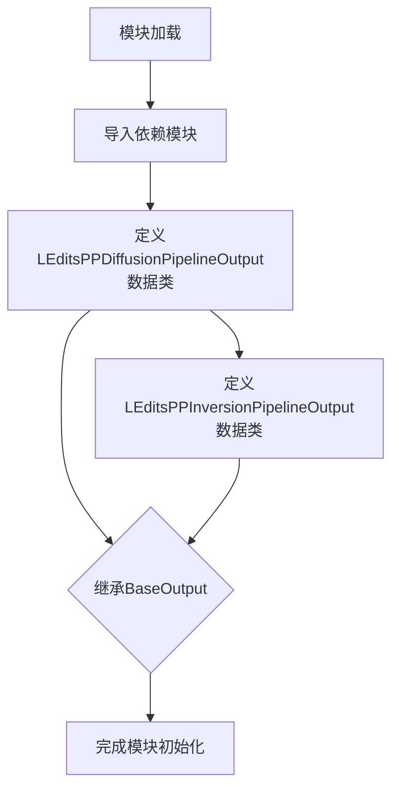
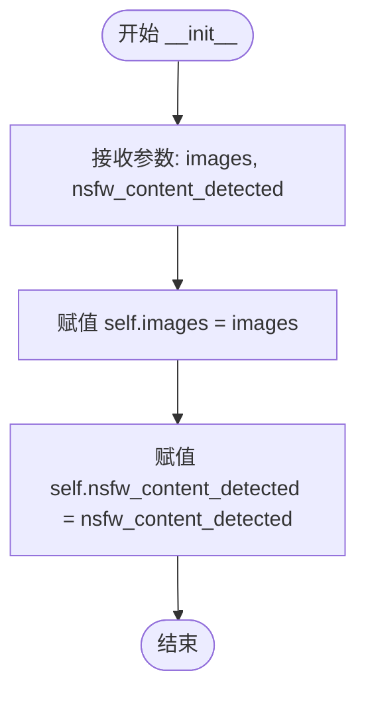
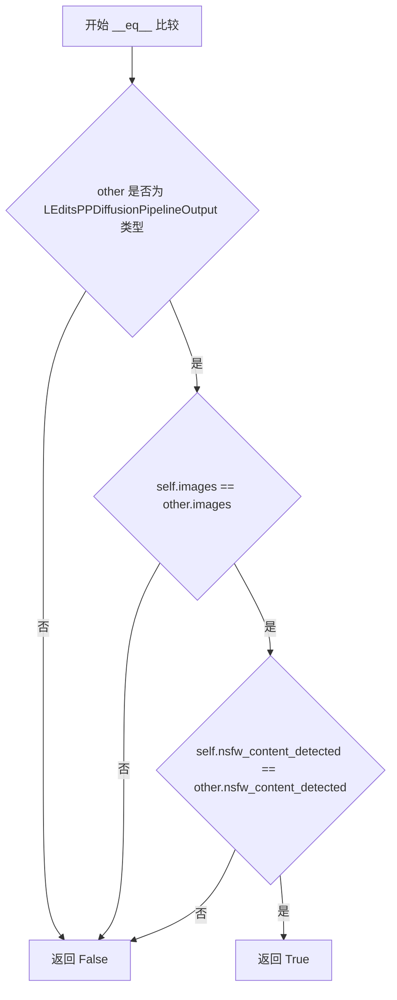
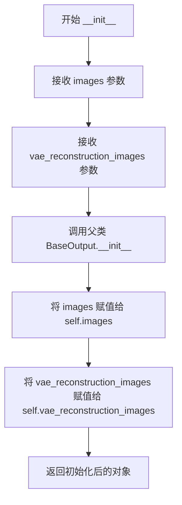
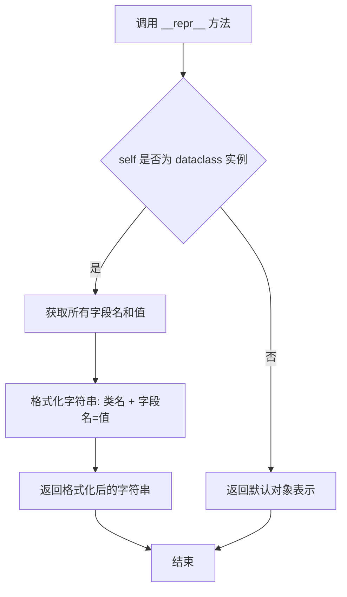
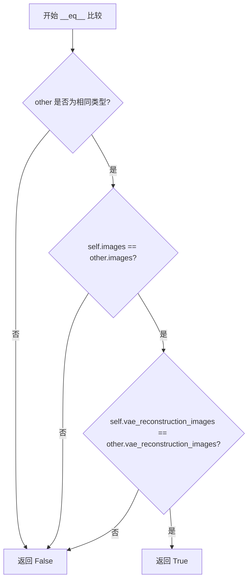

# `diffusers\src\diffusers\pipelines\ledits_pp\pipeline_output.py` 详细设计文档

该代码定义了LEdit++ Diffusion模型管道的输出数据结构，包含两个数据类：LEditsPPDiffusionPipelineOutput用于存储扩散管道生成的图像及NSFW检测结果，LEditsPPInversionPipelineOutput用于存储反演管道的输入图像及其VAE重建图像，两者都支持PIL.Image或numpy array格式的图像数据。

## 整体流程



## 类结构

```
BaseOutput (基类)
├── LEditsPPDiffusionPipelineOutput
└── LEditsPPInversionPipelineOutput
```

## 全局变量及字段


### `LEDGitsPPDiffusionPipelineOutput.images`
    
去噪后的PIL图像列表（长度为batch_size）或NumPy数组，形状为(batch_size, height, width, num_channels)

类型：`list[PIL.Image.Image] | np.ndarray`
    


### `LEDGitsPPDiffusionPipelineOutput.nsfw_content_detected`
    
指示相应生成的图像是否包含'不适合工作'(nsfw)内容的列表，或如果无法执行安全检查则为None

类型：`list[bool] | None`
    


### `LEDGitsPPInversionPipelineOutput.images`
    
裁剪并调整大小后的输入图像列表（长度为batch_size）或NumPy数组，形状为(batch_size, height, width, num_channels)

类型：`list[PIL.Image.Image] | np.ndarray`
    


### `LEDGitsPPInversionPipelineOutput.vae_reconstruction_images`
    
所有输入图像的VAE重建结果列表（长度为batch_size）或NumPy数组，形状为(batch_size, height, width, num_channels)

类型：`list[PIL.Image.Image] | np.ndarray`
    
    

## 全局函数及方法


### `LEditsPPDiffusionPipelineOutput.__init__`

这是 `LEditsPPDiffusionPipelineOutput` 类的构造函数。由于该类使用了 Python 的 `@dataclass` 装饰器，`__init__` 方法由解释器自动生成。构造函数接收生成的图像数据和安全内容检测标志，并将它们存储为实例属性，以便管道输出。

参数：

- `self`：`LEditsPPDiffusionPipelineOutput`，类的实例对象。
- `images`：`list[PIL.Image.Image] | np.ndarray`，去噪后的图像列表（PIL Image 列表）或 NumPy 数组，形状为 `(batch_size, height, width, num_channels)`。
- `nsfw_content_detected`：`list[bool] | None`，标识对应生成图像是否包含 NSFW（不适合在工作场所查看）内容的布尔列表，若无法执行安全检查则为 `None`。

返回值：`None`，Python 的 `__init__` 方法不返回值。

#### 流程图



#### 带注释源码

```python
from dataclasses import dataclass

import numpy as np
import PIL.Image

from ...utils import BaseOutput


@dataclass
class LEditsPPDiffusionPipelineOutput(BaseOutput):
    """
    Output class for LEdits++ Diffusion pipelines.

    Args:
        images (`list[PIL.Image.Image]` or `np.ndarray`)
            list of denoised PIL images of length `batch_size` or NumPy array of shape `(batch_size, height, width,
            num_channels)`.
        nsfw_content_detected (`list[bool]`)
            list indicating whether the corresponding generated image contains "not-safe-for-work" (nsfw) content or
            `None` if safety checking could not be performed.
    """

    # 定义类字段，这些字段直接作为 __init__ 方法的参数
    images: list[PIL.Image.Image] | np.ndarray
    nsfw_content_detected: list[bool] | None

    # 注意：__init__ 方法由 @dataclass 装饰器自动生成，无需手动编写。
    # 自动生成的 __init__ 方法签名类似于：
    # def __init__(self, images: list[PIL.Image.Image] | np.ndarray, nsfw_content_detected: list[bool] | None):
    #     self.images = images
    #     self.nsfw_content_detected = nsfw_content_detected
```


### `LEditsPPDiffusionPipelineOutput.__repr__`

该方法是 `LEditsPPDiffusionPipelineOutput` 数据类的默认字符串表示方法，用于返回对象的可读字符串描述。在 Python dataclass 中，如果没有显式定义 `__repr__` 方法，会自动生成一个默认实现。

参数：无（不接受额外参数，`self` 为隐式参数）

返回值：`str`，返回该数据类对象的字符串表示，包含类名和所有字段的名称及值

#### 流程图

```mermaid
graph TD
    A[调用 __repr__ 方法] --> B{是否显式定义 __repr__}
    B -- 是 --> C[使用显式定义的 __repr__]
    B -- 否 --> D[使用 dataclass 自动生成的默认 __repr__]
    D --> E[返回格式: ClassName(field1=value1, field2=value2, ...)]
    C --> E
```

#### 带注释源码

```python
# 由于代码中未显式定义 __repr__ 方法，Python dataclass 会自动生成默认实现
# 默认实现返回类的名称以及所有字段的名称和值的表示

# 假设的默认 __repr__ 方法实现（由 dataclass 自动生成）：
def __repr__(self):
    """
    返回 LEditsPPDiffusionPipelineOutput 对象的字符串表示。
    
    返回格式示例：
    'LEditsPPDiffusionPipelineOutput(images=[...], nsfw_content_detected=[...])'
    """
    return (
        f"{self.__class__.__name__}("
        f"images={self.images!r}, "
        f"nsfw_content_detected={self.nsfw_content_detected!r})"
    )

# 对应的实际 dataclass 定义：
@dataclass
class LEditsPPDiffusionPipelineOutput(BaseOutput):
    """
    Output class for LEdits++ Diffusion pipelines.

    Args:
        images (`list[PIL.Image.Image]` or `np.ndarray`)
            list of denoised PIL images of length `batch_size` or NumPy array of shape `(batch_size, height, width,
            num_channels)`.
        nsfw_content_detected (`list[bool]`)
            list indicating whether the corresponding generated image contains "not-safe-for-work" (nsfw) content or
            `None` if safety checking could not be performed.
    """

    images: list[PIL.Image.Image] | np.ndarray
    nsfw_content_detected: list[bool] | None
```

#### 说明

由于原始代码中未显式定义 `__repr__` 方法，这里描述的是 Python dataclass 自动生成的默认实现。该默认实现满足以下设计目标：

- **可读性**：输出格式清晰，易于调试和日志记录
- **完整性**：显示所有字段的名称和值
- **一致性**：与 Python 标准库的 dataclass 行为保持一致


### `LEditsPPDiffusionPipelineOutput.__eq__`

该方法是 `LEditsPPDiffusionPipelineOutput` 数据类由 `@dataclass` 装饰器自动生成的相等性比较方法，用于比较两个 `LEditsPPDiffusionPipelineOutput` 实例是否相等（基于所有字段的值比较）。

参数：

- `self`：`LEditsPPDiffusionPipelineOutput`，当前实例（隐式参数）
- `other`：`任意类型`，用于与当前实例进行比较的对象

返回值：`bool`，如果两个实例相等则返回 `True`，否则返回 `False`

#### 流程图



#### 带注释源码

```python
def __eq__(self, other: object) -> bool:
    """
    自动生成的数据类相等性比较方法。
    比较两个 LEditsPPDiffusionPipelineOutput 实例的所有字段是否相等。
    
    该方法由 @dataclass 装饰器自动生成，无需手动定义。
    当且仅当两个实例的 images 和 nsfw_content_detected 字段都相等时返回 True。
    
    参数:
        self: 当前 LEditsPPDiffusionPipelineOutput 实例
        other: 用于比较的任意类型对象
        
    返回:
        bool: 如果两个实例相等返回 True，否则返回 False
    """
    # dataclass 自动生成的 __eq__ 方法源码大致如下：
    if not isinstance(other, LEditsPPDiffusionPipelineOutput):
        return NotImplemented
    return (self.images == other.images and 
            self.nsfw_content_detected == other.nsfw_content_detected)
```


### `LEditsPPInversionPipelineOutput.__init__`

这是 LEdits++ 扩散模型反演管道的输出类构造函数，用于初始化包含输入图像和 VAE 重建图像的数据结构。

参数：

- `self`：隐式参数，类的实例本身
- `images`：`list[PIL.Image.Image] | np.ndarray`，输入图像列表，包含裁剪和调整大小后的输入图像，长度为 batch_size，或者是形状为 (batch_size, height, width, num_channels) 的 NumPy 数组
- `vae_reconstruction_images`：`list[PIL.Image.Image] | np.ndarray`，VAE 重建图像列表，包含所有输入图像的 VAE 重建结果，长度为 batch_size，或者是形状为 (batch_size, height, width, num_channels) 的 NumPy 数组

返回值：`None`，构造函数无返回值，用于初始化对象状态

#### 流程图



#### 带注释源码

```python
@dataclass  # 装饰器，自动生成 __init__, __repr__, __eq__ 等方法
class LEditsPPInversionPipelineOutput(BaseOutput):
    """
    Output class for LEdits++ Diffusion pipelines.
    LEdits++ 扩散管道的输出类

    Args:
        input_images (`list[PIL.Image.Image]` or `np.ndarray`)
            list of the cropped and resized input images as PIL images of length `batch_size` or NumPy array of shape `
            (batch_size, height, width, num_channels)`.
            输入图像列表，包含裁剪和调整大小后的图像
        vae_reconstruction_images (`list[PIL.Image.Image]` or `np.ndarray`)
            list of VAE reconstruction of all input images as PIL images of length `batch_size` or NumPy array of shape
            ` (batch_size, height, width, num_channels)`.
            VAE 重建图像列表，包含所有输入图像的 VAE 重建结果
    """

    # 类字段声明
    images: list[PIL.Image.Image] | np.ndarray  # 输入图像数据
    vae_reconstruction_images: list[PIL.Image.Image] | np.ndarray  # VAE 重建图像数据
```

#### 补充说明

由于使用了 `@dataclass` 装饰器，`__init__` 方法是由 Python 自动生成的。实际生成的 `__init__` 方法源码类似于：

```python
def __init__(self, images: list[PIL.Image.Image] | np.ndarray, vae_reconstruction_images: list[PIL.Image.Image] | np.ndarray):
    self.images = images
    self.vae_reconstruction_images = vae_reconstruction_images
```


### `LEditsPPInversionPipelineOutput.__repr__`

该方法为 `LEditsPPInversionPipelineOutput` 数据类的默认字符串表示方法，由 Python 的 `dataclass` 装饰器自动生成，用于返回对象的字符串表示形式，包含类名及所有字段的名称和值。

参数：此方法无显式参数（使用 Python 默认的 `self` 参数）

返回值：`str`，返回该数据类对象的字符串表示，包含类名以及 `images` 和 `vae_reconstruction_images` 两个字段的名称和值。

#### 流程图



#### 带注释源码

```python
# LEditsPPInversionPipelineOutput 类的 __repr__ 方法
# 由于使用 @dataclass 装饰器且未显式定义 __repr__，
# Python 自动生成以下形式的默认实现：

def __repr__(self):
    """
    返回数据类的字符串表示。
    
    自动生成的实现，等同于:
    return f'LEditsPPInversionPipelineOutput(images={self.images!r}, vae_reconstruction_images={self.vae_reconstruction_images!r})'
    """
    # dataclass 自动生成的标准 repr 格式
    # 包含类名和所有字段的名称与值的repr表示
    return (
        f"LEditsPPInversionPipelineOutput("
        f"images={self.images!r}, "
        f"vae_reconstruction_images={self.vae_reconstruction_images!r})"
    )
```


### `LEditsPPInversionPipelineOutput.__eq__`

该方法是 dataclass 自动生成的相等性比较方法，用于比较两个 `LEditsPPInversionPipelineOutput` 对象的所有字段是否相等。

参数：

- `self`：`LEditsPPInversionPipelineOutput`，当前对象（隐式参数）
- `other`：`Any`，要比较的其他对象

返回值：`bool`，如果两个对象的所有字段（`images` 和 `vae_reconstruction_images`）都相等则返回 `True`，否则返回 `False`

#### 流程图



#### 带注释源码

```python
def __eq__(self, other: object) -> bool:
    """
    比较两个 LEditsPPInversionPipelineOutput 对象是否相等。
    
    如果 other 不是 LEditsPPInversionPipelineOutput 类型，返回 False。
    如果 self 和 other 的所有字段（images, vae_reconstruction_images）都相等，返回 True。
    
    Args:
        self: 当前对象
        other: 要比较的对象
        
    Returns:
        bool: 两个对象是否相等
    """
    if not isinstance(other, LEditsPPInversionPipelineOutput):
        return NotImplemented
    return (
        self.images == other.images 
        and self.vae_reconstruction_images == other.vae_reconstruction_images
    )
```

**注意**：此方法是 dataclass 装饰器自动生成的隐式方法，未在代码中显式定义。上述源码是基于 dataclass 默认行为推导的等效实现。


## 关键组件


### LEditsPPDiffusionPipelineOutput

扩散管道的输出类，用于封装去噪后的图像和NSFW内容检测结果

### LEditsPPInversionPipelineOutput

反演管道的输出类，用于封装输入图像和VAE重建图像

### images 字段

输出图像列表或NumPy数组，包含生成的图像数据

### nsfw_content_detected 字段

NSFW内容检测结果列表，标识对应生成图像是否包含不当内容

### vae_reconstruction_images 字段

VAE重建图像列表或NumPy数组，用于存储VAE对输入图像的重构结果


## 问题及建议


### 已知问题

-   **文档与实现不一致**：`LEditsPPInversionPipelineOutput` 类的文档字符串中描述参数为 `input_images`，但实际字段名为 `images`，这会导致使用者在查阅文档时产生困惑。
-   **命名不够直观**：`nsfw_content_detected` 使用了缩写形式（nsfw），在某些代码审查或企业环境中可能要求使用完整命名 "not_safe_for_work_content_detected" 或 "has_nsfw_content"。
-   **类型提示重复**：多处使用 `list[PIL.Image.Image] | np.ndarray` 这样的复合类型，但没有定义类型别名，导致代码冗余且不易维护。
-   **缺少默认值说明**：`nsfw_content_detected` 字段可以为 `None`，但数据类定义中没有明确指定默认值或 default_factory，可能导致序列化/反序列化时的行为不明确。

### 优化建议

-   **统一文档与实现**：将 `LEditsPPInversionPipelineOutput` 的字段名从 `images` 改为 `input_images`，或更新文档字符串以匹配当前实现，确保文档与代码一致。
-   **使用类型别名**：定义类型别名如 `ImageOutput = list[PIL.Image.Image] | np.ndarray`，并在类中使用别名，提高可读性和可维护性。
-   **显式定义默认值**：为 `nsfw_content_detected` 字段添加 `field(default=None)` 或在文档中明确说明可选性和默认值处理逻辑。
-   **考虑扩展性**：当前使用 `@dataclass` 装饰器，如后续需要更复杂的序列化行为，可考虑添加 `__post_init__` 验证或使用 Pydantic 替代。


## 其它


### 设计目标与约束

本模块旨在为LEdits++ Diffusion Pipeline提供标准化的输出数据结构，定义图像生成结果及安全检查结果的统一格式。约束条件包括：images字段必须为PIL.Image列表或numpy数组，nsfw_content_detected为布尔列表或None，两者长度需一致。

### 错误处理与异常设计

本模块为纯数据类定义，不涉及业务逻辑处理。潜在异常主要包括类型检查失败（如传入非图像类型数据）和空值处理。调用方需在数据传入前确保类型正确性和数据完整性。BaseOutput基类可能定义了额外的验证逻辑。

### 数据流与状态机

数据流方向：Pipeline执行完成后生成原始图像数据 → 经过NSFW安全检查 → 封装为LEditsPPDiffusionPipelineOutput对象 → 返回给调用方。LEditsPPInversionPipelineOutput包含输入图像和VAE重建图像两条数据流。

### 外部依赖与接口契约

主要依赖包括：(1) dataclass装饰器来自Python标准库；(2) numpy库用于数值数组操作；(3) PIL.Image用于图像处理；(4) BaseOutput来自项目内部...utils模块。接口契约要求调用方传入符合类型注解的数据，并遵循batch_size一致性原则。

### 类型约束与边界条件

images字段支持PIL.Image列表或numpy数组两种形式，nsfw_content_detected支持布尔列表或None。当safety checking未执行时应返回None而非空列表。VAE重建图像与输入图像的尺寸和通道数应保持一致。

### 序列化与反序列化考虑

由于继承自BaseOutput，该类可能支持to_dict()和from_dict()方法。numpy数组在序列化时需注意转换逻辑，PIL.Image对象可能需要额外的图像编码步骤。

    