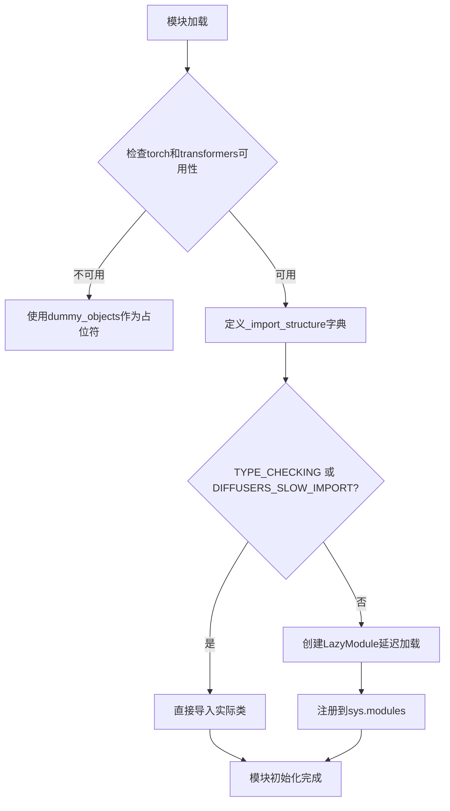
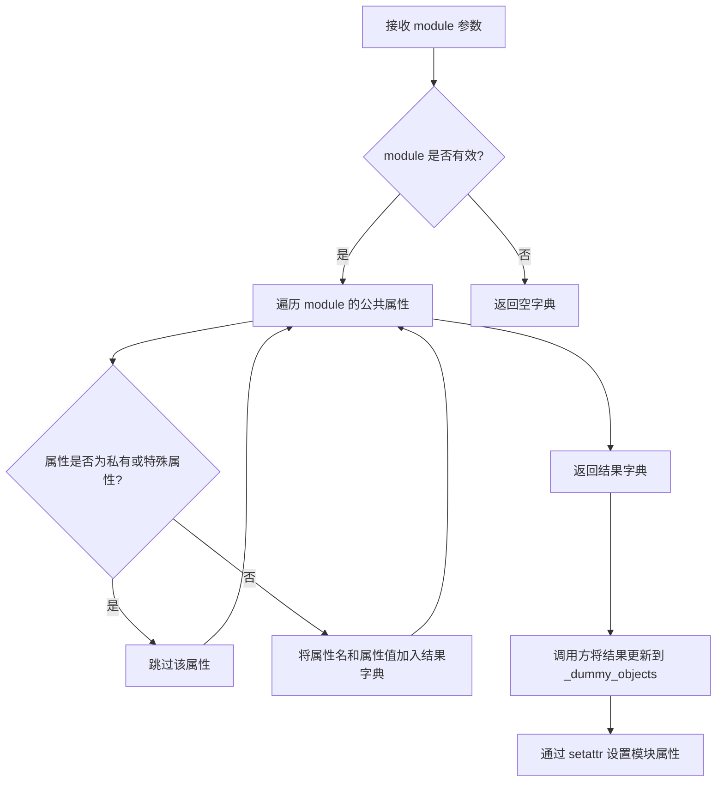
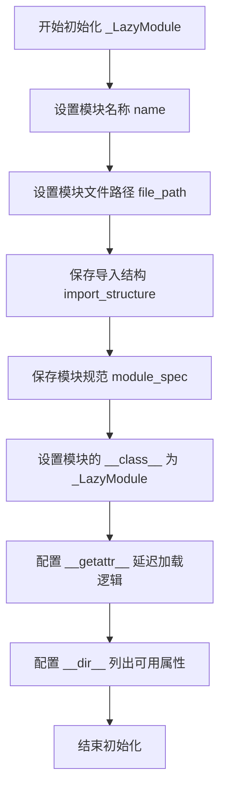

# `diffusers\src\diffusers\pipelines\longcat_image\__init__.py` 详细设计文档

这是一个Diffusers库的延迟加载模块初始化文件，通过_lazy_module机制动态导入LongCat图像处理管道（LongCatImagePipeline、LongCatImageEditPipeline及其输出类），在保持轻量级导入的同时处理可选依赖（torch和transformers）的存在性检查。

## 整体流程



## 类结构

```
Pipeline Module (模块包)
└── LongCat Pipelines
    ├── LongCatImagePipeline (图像生成管道)
    ├── LongCatImageEditPipeline (图像编辑管道)
    └── LongCatImagePipelineOutput (输出结构)
```

## 全局变量及字段


### `_dummy_objects`
    
存储当可选依赖不可用时的虚拟/空对象，用于保持模块接口完整性

类型：`dict`
    


### `_import_structure`
    
定义模块的导入结构，映射字符串到具体的类或对象名称

类型：`dict`
    


### `DIFFUSERS_SLOW_IMPORT`
    
标识符，控制是否启用慢速导入模式（完整导入而非惰性导入）

类型：`bool`
    


### `TYPE_CHECKING`
    
标识符，指示当前是否处于类型检查阶段，用于条件导入避免循环依赖

类型：`bool`
    


### `is_torch_available`
    
检查PyTorch库是否已安装并可用的函数

类型：`function`
    


### `is_transformers_available`
    
检查Transformers库是否已安装并可用的函数

类型：`function`
    


### `OptionalDependencyNotAvailable`
    
自定义异常类，用于表示可选依赖项不可用的情况

类型：`class`
    


    

## 全局函数及方法


### `get_objects_from_module`

从给定模块中提取所有公共对象（类、函数等），并返回一个以对象名为键、对象为值的字典，常用于延迟加载和动态导入场景。

参数：

- `module`：`Module` 类型，要获取对象的模块（示例中为 `dummy_torch_and_transformers_objects`）

返回值：`dict`，返回模块中的公共对象字典，键为对象名称，值为对象本身

#### 流程图



#### 带注释源码

```python
# 从 utils 模块导入的函数，用于从模块中提取对象
# 以下是调用方的使用方式，展示了函数的典型用法：

# 1. 导入函数
from ...utils import get_objects_from_module

# 2. 初始化空字典用于存储虚拟对象
_dummy_objects = {}

# 3. 在 try-except 块中调用，当可选依赖不可用时使用
try:
    # 检查依赖是否可用
    if not (is_transformers_available() and is_torch_available()):
        raise OptionalDependencyNotAvailable()
except OptionalDependencyNotAvailable:
    # 依赖不可用时，从虚拟对象模块获取所有对象
    from ...utils import dummy_torch_and_transformers_objects
    
    # 获取模块中的所有虚拟对象并存储
    _dummy_objects.update(get_objects_from_module(dummy_torch_and_transformers_objects))
else:
    # 依赖可用时，定义实际的导入结构
    _import_structure["pipeline_longcat_image"] = ["LongCatImagePipeline"]
    _import_structure["pipeline_longcat_image_edit"] = ["LongCatImageEditPipeline"]
    _import_structure["pipeline_output"] = ["LongCatImagePipelineOutput"]

# ... 后续代码将 _dummy_objects 的内容设置为模块属性
for name, value in _dummy_objects.items():
    setattr(sys.modules[__name__], name, value)
```

---

**补充说明：**

由于 `get_objects_from_module` 是从 `...utils` 导入的外部函数，上述源码展示的是该函数在当前文件中的**调用方式**，而非函数定义。该函数的核心逻辑通常包括：

1. 接收一个模块对象作为参数
2. 遍历模块的 `__dict__` 或使用 `dir()` 获取属性列表
3. 过滤掉以 `_` 开头的私有属性和特殊属性（如 `__name__`, `__doc__` 等）
4. 将剩余的公共对象收集到字典中返回


### `_LazyModule.__init__`

这是 `_LazyModule` 类的构造函数，用于初始化一个延迟加载模块。该模块实现了 Python 模块的延迟加载机制，允许在导入时仅加载必要的对象，从而优化大型库的导入性能。

参数：

- `name`：`str`，模块的名称，对应 `__name__`
- `file_path`：`str`，模块文件的路径，对应 `globals()["__file__"]`
- `import_structure`：`dict`，定义了模块的导入结构，键为子模块名称，值为该模块中可导出的对象列表
- `module_spec`：`ModuleSpec`，模块的规范对象，包含了模块的元数据信息

返回值：无（构造函数）

#### 流程图



#### 带注释源码

```python
# 这是 _LazyModule 类的使用示例（来自代码第44-48行）
# 注意：__init__ 方法定义在 ...utils._LazyModule 中，这里展示的是调用方式
sys.modules[__name__] = _LazyModule(
    __name__,                       # 模块名称（如 'diffusers.pipelines.longcat'）
    globals()["__file__"],          # 模块文件路径
    _import_structure,              # 导入结构字典，定义延迟加载的子模块和类
    module_spec=__spec__,           # 模块规范对象（importlib.util.module_from_spec）
)

# _import_structure 示例内容：
# {
#     "pipeline_longcat_image": ["LongCatImagePipeline"],
#     "pipeline_longcat_image_edit": ["LongCatImageEditPipeline"],
#     "pipeline_output": ["LongCatImagePipelineOutput"]
# }
```

> **注意**：`_LazyModule` 类本身定义在 `diffusers.utils` 模块中，上述代码展示了该类在当前文件中的使用方式及其 `__init__` 方法被调用时接收的参数。


### `setattr` (在 `__init__.py` 上下文中使用)

该函数是 Python 内置的 `setattr`，在此代码中用于动态地将虚拟对象（dummy objects）设置为模块的属性，使得在可选依赖不可用时，这些对象仍然可以被导入。

参数：

- `obj`：`module`，目标模块对象，此处为 `sys.modules[__name__]`，表示当前模块
- `name`：`str`，要设置的属性名称，此处为 `_dummy_objects` 字典的键（字符串）
- `value`：`any`，要设置的属性值，此处为 `_dummy_objects` 字典的值（虚拟对象）

返回值：`None`，无返回值（该操作直接修改对象属性）

#### 流程图

```mermaid
flowchart TD
    A[开始遍历 _dummy_objects.items] --> B{还有未处理的键值对?}
    B -->|是| C[获取 name 和 value]
    C --> D[调用 setattr sys.modules[__name__], name, value]
    D --> E[将虚拟对象设置为模块属性]
    E --> B
    B -->|否| F[结束]
```

#### 带注释源码

```python
# 遍历所有虚拟对象（当可选依赖不可用时创建的替代对象）
for name, value in _dummy_objects.items():
    # 使用内置 setattr 函数动态设置模块属性
    # 参数1: sys.modules[__name__] - 当前模块对象
    # 参数2: name - 属性名称（字符串），来自 _dummy_objects 的键
    # 参数3: value - 属性值，来自 _dummy_objects 的值
    setattr(sys.modules[__name__], name, value)
```

#### 上下文说明

这段代码是 `diffusers` 库中针对 `LongCat` 可选依赖的处理逻辑：

- **Lazy Loading 模式**：使用 `_LazyModule` 实现延迟加载
- **可选依赖处理**：当 `torch` 和 `transformers` 都不可用时，导入虚拟对象
- **动态属性绑定**：通过 `setattr` 将虚拟对象直接挂载到模块命名空间，使客户端代码可以正常导入（如 `from diffusers import LongCatImagePipeline`）


## 关键组件


### 惰性加载模块 (_LazyModule)

使用 `_LazyModule` 实现延迟加载机制，避免在导入时立即加载所有子模块，提高初始导入速度。只有在实际使用管道时才会加载具体的实现模块。

### 可选依赖检查机制

通过 `is_torch_available()` 和 `is_transformers_available()` 检查 torch 和 transformers 库是否可用，只有两个库都可用时才暴露实际的管道类，否则使用虚拟对象。

### 虚拟对象模式 (_dummy_objects)

当可选依赖不可用时，使用 `_dummy_objects` 存储从 `dummy_torch_and_transformers_objects` 获取的虚拟对象，并通过 `setattr` 将其设置到模块中，确保代码在缺少依赖时仍可导入而不报错。

### 导入结构定义 (_import_structure)

定义模块的公共接口，包括 `LongCatImagePipeline`、`LongCatImageEditPipeline` 和 `LongCatImagePipelineOutput` 三个可导出类，形成模块的导入契约。

### 条件导入逻辑

支持三种导入模式：TYPE_CHECKING 模式（类型检查时完整导入）、DIFFUSERS_SLOW_IMPORT 模式（慢导入完整加载）、运行时模式（使用惰性加载），提供灵活的导入策略。


## 问题及建议


### 已知问题

-   **重复的条件判断逻辑**：`if not (is_transformers_available() and is_torch_available())` 的检查在代码中出现了两次（分别在填充 `_import_structure` 的 try 块和 `TYPE_CHECKING` 分支中），违反了 DRY 原则
-   **通配符导入**：`from ...utils.dummy_torch_and_transformers_objects import *` 使用了通配符导入，降低了代码的可维护性和 IDE 支持
-   **未使用的变量**：`_dummy_objects` 在 try 块开始时被更新，但实际上只有在 else 分支中才会被使用，逻辑顺序略显混乱
-   **魔法字符串依赖**：模块导入通过字符串字典 `_import_structure` 进行，缺乏编译时类型检查支持
- **异常处理冗余**：两个 try-except 块执行完全相同的依赖检查，导致代码冗余

### 优化建议

-   **提取公共逻辑**：将可选依赖检查封装为单独的函数或常量，避免重复代码
-   **显式导入替代通配符**：明确列出需要导入的对象，提高代码可读性和可维护性
-   **重构模块加载逻辑**：考虑使用更现代的延迟加载机制，如 `importlib.util` 或 PEP 562 `__getattr__`
-   **添加类型注解**：为全局变量和函数添加完整的类型注解，提升类型安全
- **错误日志记录**：在可选依赖不可用时添加日志记录，便于调试和问题排查


## 其它


### 一段话描述

这是一个Diffusers库的模块初始化文件，通过LazyModule实现延迟导入机制，动态检查torch和transformers可选依赖的可用性，并据此决定导入真实的LongCatImagePipeline、LongCatImageEditPipeline和LongCatImagePipelineOutput类，还是导入对应的dummy对象以保持接口一致性。

### 文件的整体运行流程

当模块被首次导入时，首先检查是否在TYPE_CHECKING模式或DIFFUSERS_SLOW_IMPORT标志为真。若是，则尝试导入依赖并加载真实的pipeline类；若否，则创建_LazyModule对象替换当前模块，实现延迟导入。同时，根据torch和transformers的可用性，在_import_structure中注册可用的类名，并在_import_structure中维护dummy对象以便在依赖不可用时提供替代实现。

### 全局变量信息

#### _dummy_objects

- 类型: dict
- 描述: 存储当可选依赖不可用时的替代（dummy）对象，用于保持模块接口一致性

#### _import_structure

- 类型: dict
- 描述: 定义模块的导入结构映射，键为子模块名，值为对应的类名列表

#### DIFFUSERS_SLOW_IMPORT

- 类型: bool
- 描述: 标志位，控制是否启用慢速导入模式（立即导入而非延迟导入）

### 关键组件信息

#### _LazyModule

- 描述: 来自diffusers.utils的延迟加载模块类，用于实现按需导入，减少启动时间

#### OptionalDependencyNotAvailable

- 描述: 异常类，用于标记可选依赖不可用的情况

#### get_objects_from_module

- 描述: 工具函数，从指定模块获取所有对象

#### is_torch_available / is_transformers_available

- 描述: 工具函数，用于检查torch和transformers库是否已安装

### 设计目标与约束

#### 设计目标

- 实现可选依赖的动态处理，在依赖缺失时仍保持模块可导入
- 通过延迟导入优化库的整体加载性能
- 提供一致的公共API接口，无论依赖是否满足

#### 设计约束

- 依赖diffusers.utils中的_LazyModule和相关工具函数
- 需要与dummy_torch_and_transformers_objects模块配合使用
- 仅支持Python 3.7+的类型检查和延迟导入机制

### 错误处理与异常设计

- 使用OptionalDependencyNotAvailable异常捕获依赖检查失败的情况
- 当依赖不可用时，通过更新_dummy_objects字典导入替代对象，避免ImportError
- 异常处理采用try-except结构，在except块中导入dummy对象，在else块中导入真实对象

### 外部依赖与接口契约

#### 外部依赖

- torch: 可选依赖，用于pipeline的实际执行
- transformers: 可选依赖，提供模型支持
- diffusers.utils: 必须依赖，提供LazyModule和工具函数

#### 接口契约

- 模块导出LongCatImagePipeline、LongCatImageEditPipeline和LongCatImagePipelineOutput三个类
- 无论依赖可用性如何，这些类名始终可通过from ... import ...方式获取
- TYPE_CHECKING模式下可直接导入类型用于类型注解

### 潜在的技术债务或优化空间

- 重复的依赖检查逻辑在两处出现（try-except和if TYPE_CHECKING块），可以考虑提取为独立函数
- dummy对象的获取依赖于特定命名的dummy模块，耦合度较高
- 缺少对其他可能依赖（如accelerate、diffusers其他模块）的检查支持
- _import_structure字典的构建是静态的，无法动态扩展

### 数据流与状态机

模块的导入行为由两个布尔条件决定：DIFFUSERS_SLOW_IMPORT标志和TYPE_CHECKING常量。当任一条件为真时，执行完整导入流程（快速导入模式）；否则进入延迟导入模式，使用_LazyModule代理。这种设计实际上构建了一个两状态的状态机：快速导入状态和延迟导入状态，状态转换由导入时的上下文决定。


    