# `diffusers\src\diffusers\pipelines\longcat_image\pipeline_longcat_image.py` 详细设计文档

LongCatImagePipeline是一个基于Diffusers库实现的文本到图像生成管道，使用Qwen2-VL作为文本编码器，LongCatImageTransformer2DModel作为变换器，AutoencoderKL作为VAE解码器，FlowMatchEulerDiscreteScheduler作为调度器，实现高质量的文本到图像生成功能。该管道支持提示词重写、CFG-renorm增强、图像打包和解包等高级特性。

## 整体流程

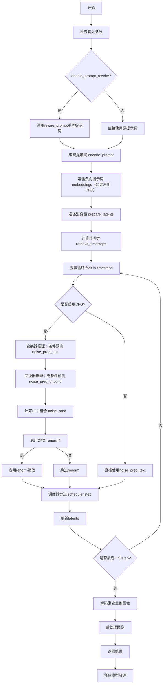

## 类结构

```
DiffusionPipeline (基类)
└── LongCatImagePipeline (主类)
    ├── FromSingleFileMixin (混合类)
    └── 依赖组件:
        ├── Qwen2_5_VLForConditionalGeneration (文本编码器)
        ├── Qwen2Tokenizer (分词器)
        ├── Qwen2VLProcessor (文本处理器)
        ├── LongCatImageTransformer2DModel (图像变换器)
        ├── AutoencoderKL (VAE)
        ├── FlowMatchEulerDiscreteScheduler (调度器)
        └── VaeImageProcessor (图像处理器)
```

## 全局变量及字段


### `XLA_AVAILABLE`
    
是否支持XLA加速

类型：`bool`
    


### `logger`
    
日志记录器

类型：`logging.Logger`
    


### `EXAMPLE_DOC_STRING`
    
示例文档字符串

类型：`str`
    


### `SYSTEM_PROMPT_EN`
    
英文系统提示词

类型：`str`
    


### `SYSTEM_PROMPT_ZH`
    
中文系统提示词

类型：`str`
    


### `LongCatImagePipeline.vae`
    
VAE模型

类型：`AutoencoderKL`
    


### `LongCatImagePipeline.text_encoder`
    
文本编码器

类型：`Qwen2_5_VLForConditionalGeneration`
    


### `LongCatImagePipeline.tokenizer`
    
分词器

类型：`Qwen2Tokenizer`
    


### `LongCatImagePipeline.text_processor`
    
文本处理器

类型：`Qwen2VLProcessor`
    


### `LongCatImagePipeline.transformer`
    
图像变换器模型

类型：`LongCatImageTransformer2DModel`
    


### `LongCatImagePipeline.scheduler`
    
扩散调度器

类型：`FlowMatchEulerDiscreteScheduler`
    


### `LongCatImagePipeline.vae_scale_factor`
    
VAE缩放因子

类型：`int`
    


### `LongCatImagePipeline.image_processor`
    
图像后处理器

类型：`VaeImageProcessor`
    


### `LongCatImagePipeline.prompt_template_encode_prefix`
    
提示词编码前缀模板

类型：`str`
    


### `LongCatImagePipeline.prompt_template_encode_suffix`
    
提示词编码后缀模板

类型：`str`
    


### `LongCatImagePipeline.default_sample_size`
    
默认采样尺寸

类型：`int`
    


### `LongCatImagePipeline.tokenizer_max_length`
    
分词器最大长度

类型：`int`
    


### `LongCatImagePipeline._guidance_scale`
    
CFG引导 scale

类型：`float`
    


### `LongCatImagePipeline._joint_attention_kwargs`
    
联合注意力参数

类型：`dict`
    


### `LongCatImagePipeline._num_timesteps`
    
时间步数量

类型：`int`
    


### `LongCatImagePipeline._current_timestep`
    
当前时间步

类型：`int`
    


### `LongCatImagePipeline._interrupt`
    
中断标志

类型：`bool`
    
    

## 全局函数及方法


### `get_prompt_language`

该函数是一个轻量级的语言检测工具，通过正则表达式匹配中文字符 Unicode 范围来快速判断输入提示词属于中文（zh）还是英文（en），常用于根据用户输入语言选择对应的系统提示词模板。

参数：

- `prompt`：`str`，需要检测语言类型的提示词文本

返回值：`str`，语言类型标识符，"zh" 表示中文，"en" 表示英文

#### 流程图

```mermaid
flowchart TD
    A[开始: get_prompt_language] --> B[编译正则表达式模式<br/>r&quot;[\u4e00-\u9fff]&quot;]
    B --> C{在prompt中搜索中文}
    C -->|找到中文| D[返回 &quot;zh&quot;]
    C -->|未找到中文| E[返回 &quot;en&quot;]
    D --> F[结束]
    E --> F
```

#### 带注释源码

```python
def get_prompt_language(prompt):
    """
    检测提示词的语言类型（中文或英文）。
    
    该函数通过正则表达式检查输入字符串是否包含中文字符。
    中文字符的 Unicode 范围为 \\u4e00-\\u9fff。
    
    Args:
        prompt (str): 需要检测语言类型的提示词文本
        
    Returns:
        str: 语言类型标识符，"zh" 表示中文，"en" 表示英文
    """
    # 编译正则表达式：匹配中文字符（Unicode范围 \u4e00-\u9fff）
    pattern = re.compile(r"[\u4e00-\u9fff]")
    
    # 使用 search 方法检查字符串中是否包含中文字符
    # search 会在找到第一个匹配后立即返回，无需遍历整个字符串
    if bool(pattern.search(prompt)):
        return "zh"  # 检测到中文字符，返回 "zh"
    
    # 未检测到中文字符，默认返回 "en"
    return "en"
```

### 关键组件信息

| 组件名称 | 一句话描述 |
|---------|-----------|
| `re.compile(r"[\u4e00-\u9fff]")` | 编译匹配中文汉字的正则表达式模式 |
| `pattern.search(prompt)` | 在提示词中搜索是否包含中文字符 |

### 潜在的技术债务或优化空间

1. **语言检测精度不足**：当前实现仅通过是否包含中文字符来判断语言，对于纯数字、符号或空字符串会默认返回 "en"，可能不符合预期。建议增加对多种语言的检测支持（如日文、韩文等）。

2. **正则表达式重复编译**：函数每次调用都会重新编译正则表达式 pattern，建议将 pattern 提升为模块级常量以提高性能。

3. **缺少输入验证**：未对输入参数 `prompt` 进行类型检查，如果传入非字符串类型可能抛出异常。

4. **混合语言处理缺失**：对于中英文混合的提示词，当前实现无法正确处理，会统一返回 "zh"。

### 其它项目

**设计目标与约束**：
- 目标：快速判断提示词的主要语言类型，用于后续选择对应的系统提示词模板
- 约束：仅支持中文（zh）和英文（en）的二分类

**错误处理与异常设计**：
- 未进行显式的异常处理，依赖 Python 内置的类型检查
- 建议添加类型检查：`if not isinstance(prompt, str): raise TypeError("prompt must be a string")`

**数据流与状态机**：
- 该函数为纯函数，无状态依赖，输入确定则输出确定
- 在 `LongCatImagePipeline.rewire_prompt` 方法中被调用，根据返回的语言类型选择 `SYSTEM_PROMPT_ZH` 或 `SYSTEM_PROMPT_EN`

**外部依赖与接口契约**：
- 依赖标准库 `re` 模块
- 接口简单：输入字符串，返回语言标识字符串，无外部状态依赖


### `split_quotation`

该函数是一个基于正则表达式的字符串分割算法，用于识别由单引号或双引号定义的定界符，将提示词字符串分割成多个片段，并标记每个片段是否为引号内容。

参数：

- `prompt`：`str`，要分割的提示词字符串
- `quote_pairs`：`list[tuple[str, str]] | None`，引号对列表，默认为 `[("'", "'"), ('"', '"'), ("‘", "’"), ("“", "”")]`

返回值：`list[tuple[str, bool]]`，文本片段列表，每个元素是一个元组，包含文本内容和一个布尔值（`True` 表示该文本是被引号包裹的内容，`False` 表示普通文本）

#### 流程图

```mermaid
flowchart TD
    A[开始: split_quotation] --> B{检查 quote_pairs 是否为 None}
    B -->|是| C[设置默认引号对: <br/>[(&#39;, &#39;), <br/>(&quot;, &quot;), <br/>(&#39;‘, &#39;’), <br/>(&quot;, &quot;)]]
    B -->|否| D[使用传入的 quote_pairs]
    C --> E[构建单词内嵌引号正则: <br/>r&quot;[a-zA-Z]+&#39;[a-zA-Z]+&quot;]
    D --> E
    E --> F[查找所有匹配的单词内嵌引号]
    F --> G{找到匹配项?}
    G -->|否| H[构建引号分割正则模式]
    G -->|是| I[遍历匹配项进行替换]
    I --> J[记录替换映射关系]
    J --> H
    H --> K[使用正则分割字符串]
    K --> L[遍历分割后的每个部分]
    L --> M[还原被替换的单词内嵌引号]
    M --> N{当前部分是否匹配引号模式?}
    N -->|是| O[添加到结果列表<br/>并标记为 True]
    N -->|否| P[添加到结果列表<br/>并标记为 False]
    O --> Q{还有未处理的部分?}
    P --> Q
    Q -->|是| L
    Q -->|否| R[返回结果列表]
    
    style A fill:#f9f,color:#000
    style R fill:#9f9,color:#000
```

#### 带注释源码

```python
def split_quotation(prompt, quote_pairs=None):
    """
    实现基于正则表达式的字符串分割算法，识别由单引号或双引号定义的定界符。
    示例:
        >>> prompt_en = "Please write 'Hello' on the blackboard for me."
        >>> print(split_quotation(prompt_en))
        >>> # 输出: [('Please write ', False), ("'Hello'", True), (' on the blackboard for me.', False)]
    
    参数:
        prompt: 要分割的提示词字符串
        quote_pairs: 引号对列表，默认为 [("'", "'"), ('"', '"'), ("‘", "’"), ("“", "”")]
    
    返回:
        文本片段列表，每个元素是(文本, 是否为引号内容)的元组
    """
    # 定义正则表达式，匹配单词内嵌的引号（如 "don't", "can't"）
    word_internal_quote_pattern = re.compile(r"[a-zA-Z]+'[a-zA-Z]+")
    
    # 查找所有匹配的单词内嵌引号
    matches_word_internal_quote_pattern = word_internal_quote_pattern.findall(prompt)
    mapping_word_internal_quote = []

    # 遍历所有唯一的匹配项，进行替换处理以避免误分割
    for i, word_src in enumerate(set(matches_word_internal_quote_pattern)):
        # 生成唯一的替换标记
        word_tgt = "longcat_$##$_longcat" * (i + 1)
        # 在原字符串中进行替换
        prompt = prompt.replace(word_src, word_tgt)
        # 记录原始词和替换词的映射关系
        mapping_word_internal_quote.append([word_src, word_tgt])

    # 设置默认的引号对（如果未提供）
    if quote_pairs is None:
        quote_pairs = [("'", "'"), ('"', '"'), ("‘", "’"), ("“", "”")]
    
    # 构建正则表达式模式，匹配引号对及其内部的内容
    # 格式: q1[^q1q2]*?q2，其中 q1 是开始引号，q2 是结束引号
    pattern = "|".join([
        re.escape(q1) + r"[^" + re.escape(q1 + q2) + r"]*?" + re.escape(q2) 
        for q1, q2 in quote_pairs
    ])
    
    # 使用正则表达式分割字符串
    parts = re.split(f"({pattern})", prompt)

    result = []
    # 遍历分割后的每个部分
    for part in parts:
        # 还原之前被替换的单词内嵌引号
        for word_src, word_tgt in mapping_word_internal_quote:
            part = part.replace(word_tgt, word_src)
        
        # 判断当前部分是否为引号内容
        if re.match(pattern, part):
            if len(part):
                result.append((part, True))  # 标记为引号内容
        else:
            if len(part):
                result.append((part, False))  # 标记为普通文本
    
    return result
```


### `prepare_pos_ids`

该函数用于根据不同的模态类型（文本或图像）生成位置ID张量。对于文本类型，根据token数量生成位置编码；对于图像类型，根据高度和宽度生成2D位置编码，并将其展平为1维。

参数：

- `modality_id`：`int`，模态标识符，用于区分不同模态（默认值为0）
- `type`：`str`，位置ID的类型，支持"text"或"image"（默认值为"text"）
- `start`：`tuple`，起始偏移量，用于设置位置ID的起始坐标（默认值为(0, 0)）
- `num_token`：`int | None`，文本类型所需的token数量
- `height`：`int | None`，图像类型所需的高度
- `width`：`int | None`，图像类型所需的宽度

返回值：`torch.Tensor`，位置ID张量，形状为(num_token, 3)用于文本类型，或(height*width, 3)用于图像类型

#### 流程图

```mermaid
flowchart TD
    A[开始 prepare_pos_ids] --> B{type == 'text'?}
    B -->|Yes| C{num_token is provided?}
    C -->|No| D[print Warning: height and width will be ignored]
    C -->|Yes| E[创建形状为 (num_token, 3) 的零张量]
    E --> F[设置 modality_id 到第一维]
    F --> G[设置位置编码到第二维: torch.arange + start[0]]
    G --> H[设置位置编码到第三维: torch.arange + start[1]]
    H --> I[返回 pos_ids]
    
    B -->|No| J{type == 'image'?}
    J -->|No| K[raise KeyError: Unknown type]
    J -->|Yes| L{height and width provided?}
    L -->|No| M[print Warning: num_token will be ignored]
    L -->|Yes| N[创建形状为 (height, width, 3) 的零张量]
    N --> O[设置 modality_id 到第一维]
    O --> P[设置位置编码到第二维: torch.arange(height)[:, None] + start[0]]
    P --> Q[设置位置编码到第三维: torch.arange(width)[None, :] + start[1]]
    Q --> R[reshape 为 (height*width, 3)]
    R --> I
    
    I --> Z[结束]
```

#### 带注释源码

```python
def prepare_pos_ids(modality_id=0, type="text", start=(0, 0), num_token=None, height=None, width=None):
    """
    准备位置ID张量，用于区分文本和图像模态的token位置。
    
    参数:
        modality_id: 模态标识符，0表示文本，1表示图像
        type: 类型，"text"或"image"
        start: 起始偏移量元组 (row_offset, col_offset)
        num_token: 文本模式下的token数量
        height: 图像模式下的高度
        width: 图像模式下的宽度
    
    返回:
        torch.Tensor: 位置ID张量
    """
    # 处理文本类型的位置ID
    if type == "text":
        # 文本模式需要指定num_token
        assert num_token
        if height or width:
            print('Warning: The parameters of height and width will be ignored in "text" type.')
        
        # 创建 (num_token, 3) 的零张量，三维分别表示: [modality_id, row_pos, col_pos]
        pos_ids = torch.zeros(num_token, 3)
        # 第一维: 模态ID
        pos_ids[..., 0] = modality_id
        # 第二维: 行位置，从start[0]开始递增
        pos_ids[..., 1] = torch.arange(num_token) + start[0]
        # 第三维: 列位置，从start[1]开始递增
        pos_ids[..., 2] = torch.arange(num_token) + start[1]
    
    # 处理图像类型的位置ID
    elif type == "image":
        # 图像模式需要指定height和width
        assert height and width
        if num_token:
            print('Warning: The parameter of num_token will be ignored in "image" type.')
        
        # 创建 (height, width, 3) 的零张量
        pos_ids = torch.zeros(height, width, 3)
        # 第一维: 模态ID
        pos_ids[..., 0] = modality_id
        # 第二维: 行位置，使用广播机制生成2D位置矩阵
        # torch.arange(height)[:, None] 形状为 (height, 1)，广播后与 start[0] 相加
        pos_ids[..., 1] = pos_ids[..., 1] + torch.arange(height)[:, None] + start[0]
        # 第三维: 列位置，使用广播机制生成2D位置矩阵
        # torch.arange(width)[None, :] 形状为 (1, width)，广播后与 start[1] 相加
        pos_ids[..., 2] = pos_ids[..., 2] + torch.arange(width)[None, :] + start[1]
        # 展平为 (height*width, 3) 的2D张量，便于与文本token连接
        pos_ids = pos_ids.reshape(height * width, 3)
    
    # 不支持的类型
    else:
        raise KeyError(f'Unknow type {type}, only support "text" or "image".')
    
    return pos_ids
```


### `calculate_shift`

该函数实现了一个线性插值算法，用于根据图像序列长度（image_seq_len）在预定义的基础偏移量（base_shift）和最大偏移量（max_shift）之间计算平滑的偏移值。该偏移量通常用于调整扩散模型的采样时间步调度，以适应不同分辨率或序列长度的输入图像。

参数：

- `image_seq_len`：`int` 或 `float`，输入图像的序列长度，决定最终偏移量的关键输入参数
- `base_seq_len`：`int`，基础序列长度阈值，默认为 256，用于线性方程的基准点
- `max_seq_len`：`int`，最大序列长度阈值，默认为 4096，用于线性方程的上限
- `base_shift`：`float`，基础偏移量，默认为 0.5，表示最小序列长度对应的偏移值
- `max_shift`：`float`，最大偏移量，默认为 1.15，表示最大序列长度对应的偏移值

返回值：`float`，计算得到的偏移量（mu），表示根据当前图像序列长度线性插值后的偏移值

#### 流程图

```mermaid
flowchart TD
    A[开始 calculate_shift] --> B[计算斜率 m<br/>m = (max_shift - base_shift) / (max_seq_len - base_seq_len)]
    B --> C[计算截距 b<br/>b = base_shift - m * base_seq_len]
    C --> D[计算偏移量 mu<br/>mu = image_seq_len * m + b]
    D --> E[返回 mu]
    
    B --> B1[使用两点式线性插值]
    C --> C1[确保直线经过基准点]
    D --> D1[线性映射到目标范围]
```

#### 带注释源码

```python
def calculate_shift(
    image_seq_len,            # 当前图像的序列长度，决定最终偏移量
    base_seq_len: int = 256,   # 基准序列长度，对应最小偏移量
    max_seq_len: int = 4096,   # 最大序列长度，对应最大偏移量
    base_shift: float = 0.5,   # 最小序列长度时的偏移量（线性区间下界）
    max_shift: float = 1.15,   # 最大序列长度时的偏移量（线性区间上界）
):
    """
    计算序列长度偏移量
    
    使用线性插值公式 y = mx + b，根据输入的图像序列长度，
    在 base_shift 和 max_shift 之间进行平滑过渡。
    这种技术在扩散模型中用于调整时间步调度，使模型能够更好地
    处理不同分辨率和宽高比的图像。
    
    参数:
        image_seq_len: 输入图像经VAE编码后的序列长度
        base_seq_len: 基准序列长度，默认为256
        max_seq_len: 最大序列长度，默认为4096
        base_shift: 基准偏移量，默认为0.5
        max_shift: 最大偏移量，默认为1.15
    
    返回:
        float: 线性插值计算得到的偏移量mu
    """
    # 计算线性插值的斜率 m（两点式）
    # m = (y2 - y1) / (x2 - x1)
    m = (max_shift - base_shift) / (max_seq_len - base_seq_len)
    
    # 计算截距 b，使直线经过基准点 (base_seq_len, base_shift)
    # b = y - mx
    b = base_shift - m * base_seq_len
    
    # 根据输入序列长度计算最终的偏移量
    # 线性方程：y = mx + b
    mu = image_seq_len * m + b
    
    return mu
```


### `retrieve_timesteps`

该函数是扩散模型推理管线中的核心工具函数，负责根据传入的调度器配置获取正确的时间步序列。它支持三种模式：使用 `num_inference_steps` 自动计算时间步、使用自定义 `timesteps` 列表、或使用自定义 `sigmas` 列表。函数内部通过检查调度器的 `set_timesteps` 方法签名来验证是否支持自定义参数，并最终返回时间步张量及实际推理步数。

参数：

- `scheduler`：`SchedulerMixin`，调度器对象，用于获取时间步的调度器实例
- `num_inference_steps`：`int | None`，扩散模型推理步数，当使用此参数时 `timesteps` 必须为 `None`
- `device`：`str | torch.device | None`，时间步要移动到的目标设备，若为 `None` 则不移动
- `timesteps`：`list[int] | None`，自定义时间步列表，用于覆盖调度器的时间步间隔策略，若传入此参数则 `num_inference_steps` 和 `sigmas` 必须为 `None`
- `sigmas`：`list[float] | None`，自定义 sigma 值列表，用于覆盖调度器的 sigma 间隔策略，若传入此参数则 `num_inference_steps` 和 `timesteps` 必须为 `None`
- `**kwargs`：任意关键字参数，将传递给调度器的 `set_timesteps` 方法

返回值：`tuple[torch.Tensor, int]`，元组包含两个元素：第一个是调度器的时间步张量，第二个是实际的推理步数

#### 流程图

```mermaid
flowchart TD
    A[开始 retrieve_timesteps] --> B{检查 timesteps 和 sigmas 同时存在?}
    B -->|是| C[抛出 ValueError: 只能选择一种自定义方式]
    B -->|否| D{检查 timesteps 是否存在?}
    D -->|是| E{调度器是否支持自定义 timesteps?}
    E -->|否| F[抛出 ValueError: 调度器不支持自定义 timesteps]
    E -->|是| G[调用 scheduler.set_timesteps<br/>timesteps=timesteps, device=device, **kwargs]
    D -->|否| H{检查 sigmas 是否存在?}
    H -->|是| I{调度器是否支持自定义 sigmas?}
    I -->|否| J[抛出 ValueError: 调度器不支持自定义 sigmas]
    I -->|是| K[调用 scheduler.set_timesteps<br/>sigmas=sigmas, device=device, **kwargs]
    H -->|否| L[调用 scheduler.set_timesteps<br/>num_inference_steps, device=device, **kwargs]
    
    G --> M[获取 scheduler.timesteps]
    K --> M
    L --> M
    
    M --> N[计算 num_inference_steps = len(timesteps)]
    N --> O[返回 timesteps, num_inference_steps]
    O --> P[结束]
    
    style F fill:#ffcccc
    style J fill:#ffcccc
    style C fill:#ffcccc
```

#### 带注释源码

```python
# 从 diffusers 库复制而来，用于稳定扩散 Pipeline
def retrieve_timesteps(
    scheduler,  # 调度器对象（SchedulerMixin 类型）
    num_inference_steps: int | None = None,  # 推理步数，如果使用则 timesteps 必须为 None
    device: str | torch.device | None = None,  # 目标设备，None 表示不移动
    timesteps: list[int] | None = None,  # 自定义时间步列表
    sigmas: list[float] | None = None,  # 自定义 sigma 列表
    **kwargs,  # 额外参数，传递给 scheduler.set_timesteps
):
    r"""
    调用调度器的 `set_timesteps` 方法并在调用后从调度器获取时间步。
    处理自定义时间步。任何 kwargs 都将传递给 `scheduler.set_timesteps`。

    参数:
        scheduler (`SchedulerMixin`):
            用于获取时间步的调度器。
        num_inference_steps (`int`):
            使用预训练模型生成样本时使用的扩散步数。如果使用此参数，`timesteps` 必须为 `None`。
        device (`str` 或 `torch.device`, *可选*):
            时间步应移动到的设备。如果为 `None`，则不移动时间步。
        timesteps (`list[int]`, *可选*):
            用于覆盖调度器时间步间隔策略的自定义时间步。如果传入 `timesteps`，
            则 `num_inference_steps` 和 `sigmas` 必须为 `None`。
        sigmas (`list[float]`, *可选*):
            用于覆盖调度器 sigma 间隔策略的自定义 sigmas。如果传入 `sigmas`，
            则 `num_inference_steps` 和 `timesteps` 必须为 `None`。

    返回:
        `tuple[torch.Tensor, int]`: 元组，第一个元素是调度器的时间步计划，第二个元素是推理步数。
    """
    # 校验：timesteps 和 sigmas 不能同时传入，只能选择一种自定义方式
    if timesteps is not None and sigmas is not None:
        raise ValueError("Only one of `timesteps` or `sigmas` can be passed. Please choose one to set custom values")
    
    # 处理自定义时间步模式
    if timesteps is not None:
        # 检查调度器的 set_timesteps 方法是否支持 timesteps 参数
        accepts_timesteps = "timesteps" in set(inspect.signature(scheduler.set_timesteps).parameters.keys())
        if not accepts_timesteps:
            raise ValueError(
                f"The current scheduler class {scheduler.__class__}'s `set_timesteps` does not support custom"
                f" timestep schedules. Please check whether you are using the correct scheduler."
            )
        # 调用调度器的 set_timesteps 方法设置自定义时间步
        scheduler.set_timesteps(timesteps=timesteps, device=device, **kwargs)
        # 从调度器获取实际的时间步张量
        timesteps = scheduler.timesteps
        # 计算实际的推理步数
        num_inference_steps = len(timesteps)
    
    # 处理自定义 sigmas 模式
    elif sigmas is not None:
        # 检查调度器的 set_timesteps 方法是否支持 sigmas 参数
        accept_sigmas = "sigmas" in set(inspect.signature(scheduler.set_timesteps).parameters.keys())
        if not accept_sigmas:
            raise ValueError(
                f"The current scheduler class {scheduler.__class__}'s `set_timesteps` does not support custom"
                f" sigmas schedules. Please check whether you are using the correct scheduler."
            )
        # 调用调度器的 set_timesteps 方法设置自定义 sigmas
        scheduler.set_timesteps(sigmas=sigmas, device=device, **kwargs)
        # 从调度器获取实际的时间步张量
        timesteps = scheduler.timesteps
        # 计算实际的推理步数
        num_inference_steps = len(timesteps)
    
    # 处理默认模式：根据 num_inference_steps 自动计算时间步
    else:
        scheduler.set_timesteps(num_inference_steps, device=device, **kwargs)
        timesteps = scheduler.timesteps
    
    # 返回时间步张量和推理步数
    return timesteps, num_inference_steps
```


### `LongCatImagePipeline.__init__`

初始化 LongCatImagePipeline 图像生成管道，接收调度器、VAE 模型、文本编码器、分词器、文本处理器和图像变换器等核心组件，并完成各模块的注册与配置参数的初始化。

参数：

- `scheduler`：`FlowMatchEulerDiscreteScheduler`，用于图像生成的去噪调度器
- `vae`：`AutoencoderKL`，用于将潜在表示解码为图像的变分自编码器模型
- `text_encoder`：`Qwen2_5_VLForConditionalGeneration`，用于将文本提示编码为嵌入向量的文本编码器模型
- `tokenizer`：`Qwen2Tokenizer`，用于将文本分词为 token ID 的分词器
- `text_processor`：`Qwen2VLProcessor`，用于处理聊天模板和文本编码的处理器
- `transformer`：`LongCatImageTransformer2DModel`，执行图像潜在空间去噪的核心变换器模型

返回值：`None`，该方法为构造函数，不返回任何值

#### 流程图

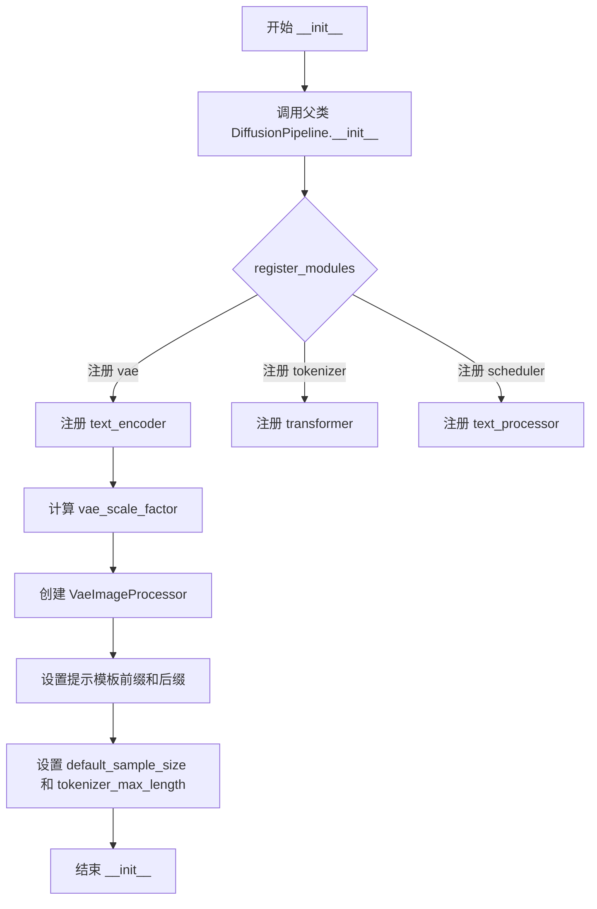

#### 带注释源码

```
def __init__(
    self,
    scheduler: FlowMatchEulerDiscreteScheduler,  # 流匹配欧拉离散调度器
    vae: AutoencoderKL,                           # 变分自编码器模型
    text_encoder: Qwen2_5_VLForConditionalGeneration,  # Qwen2.5 VL文本编码器
    tokenizer: Qwen2Tokenizer,                   # Qwen2分词器
    text_processor: Qwen2VLProcessor,             # Qwen2 VL文本处理器
    transformer: LongCatImageTransformer2DModel,  # LongCat图像变换器
):
    # 调用父类 DiffusionPipeline 的初始化方法
    super().__init__()

    # 将所有核心模块注册到管道中，便于后续管理和访问
    self.register_modules(
        vae=vae,
        text_encoder=text_encoder,
        tokenizer=tokenizer,
        transformer=transformer,
        scheduler=scheduler,
        text_processor=text_processor,
    )

    # 计算VAE的缩放因子，基于VAE块输出通道数目的深度
    # 例如：通道数为 [128, 256, 512, 512]，则 len=4, scale_factor = 2^(4-1) = 8
    self.vae_scale_factor = 2 ** (len(self.vae.config.block_out_channels) - 1) if getattr(self, "vae", None) else 8
    
    # 创建图像后处理器，VAE缩放因子乘以2以适配不同的处理需求
    self.image_processor = VaeImageProcessor(vae_scale_factor=self.vae_scale_factor * 2)

    # 设置提示模板编码的前缀，使用系统消息格式引导模型生成描述性文本提示
    self.prompt_template_encode_prefix = "<|im_start|>system\nAs an image captioning expert, generate a descriptive text prompt based on an image content, suitable for input to a text-to-image model.<|im_end|>\n<|im_start|>user\n"
    
    # 设置提示模板编码的后缀，指定助手角色的开始标记
    self.prompt_template_encode_suffix = "<|im_end|>\n<|im_start|>assistant\n"
    
    # 默认采样尺寸，基于VAE缩放因子的基础大小
    self.default_sample_size = 128
    
    # 分词器的最大序列长度限制
    self.tokenizer_max_length = 512
```


### `LongCatImagePipeline.rewire_prompt`

该方法用于将用户输入的原始提示词（prompt）进行改写，利用内置的语言模型（text_encoder）对提示词进行增强和优化，使其更适合文本到图像生成任务。

参数：

- `prompt`：`str | list[str]`，用户输入的原始提示词，可以是单个字符串或字符串列表
- `device`：`torch.device`，用于指定生成过程中张量所在的设备（如 CUDA 或 CPU）

返回值：`list[str]`，改写后的提示词列表，与输入的提示词一一对应

#### 流程图

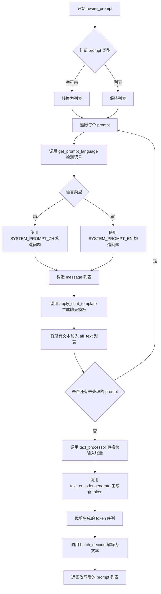

#### 带注释源码

```
def rewire_prompt(self, prompt, device):
    # 将单个字符串转换为列表，统一处理方式
    prompt = [prompt] if isinstance(prompt, str) else prompt
    
    # 存储所有处理后的文本
    all_text = []
    
    # 遍历每个提示词进行处理
    for each_prompt in prompt:
        # 检测当前提示词的语言类型（中文或英文）
        language = get_prompt_language(each_prompt)
        
        # 根据语言选择对应的系统提示模板并构造问题
        if language == "zh":
            # 中文：使用中文系统提示
            question = SYSTEM_PROMPT_ZH + f"\n用户输入为：{each_prompt}\n改写后的prompt为："
        else:
            # 英文：使用英文系统提示
            question = SYSTEM_PROMPT_EN + f"\nUser Input: {each_prompt}\nRewritten prompt:"
        
        # 构造符合聊天模板格式的消息结构
        message = [
            {
                "role": "user",
                "content": [
                    {"type": "text", "text": question},
                ],
            }
        ]
        
        # 使用文本处理器应用聊天模板，生成推理用的文本
        # tokenize=False 表示不进行分词，add_generation_prompt=True 添加生成提示
        text = self.text_processor.apply_chat_template(message, tokenize=False, add_generation_prompt=True)
        
        # 将处理后的文本添加到列表
        all_text.append(text)

    # 使用文本处理器将所有文本转换为 PyTorch 张量
    # padding=True 填充到相同长度，return_tensors="pt" 返回 PyTorch 张量
    inputs = self.text_processor(text=all_text, padding=True, return_tensors="pt").to(self.text_encoder.device)

    # 调用文本编码器生成新的 token 序列
    # max_new_tokens 限制生成的最大 token 数量
    generated_ids = self.text_encoder.generate(**inputs, max_new_tokens=self.tokenizer_max_length)
    
    # 确保生成的 token 在指定的设备上
    generated_ids.to(device)
    
    # 裁剪掉输入部分的 token，只保留新生成的部分
    # zip 将输入和输出配对，len(in_ids) 获取输入长度
    generated_ids_trimmed = [out_ids[len(in_ids) :] for in_ids, out_ids in zip(inputs.input_ids, generated_ids)]
    
    # 批量解码生成的 token 为文本
    # skip_special_tokens=True 跳过特殊 token
    # clean_up_tokenization_spaces=False 不清理分词空格
    output_text = self.text_processor.batch_decode(
        generated_ids_trimmed, skip_special_tokens=True, clean_up_tokenization_spaces=False
    )
    
    # 获取改写后的提示词
    rewrite_prompt = output_text
    
    # 返回改写后的提示词列表
    return rewrite_prompt
```


### `LongCatImagePipeline._encode_prompt`

该方法负责将输入的文本提示词列表转换为模型可用的嵌入向量（prompt embeddings）。它通过分词器将文本token化，添加特定的提示模板前缀和后缀，然后利用文本编码器生成隐藏状态，最后提取并返回纯提示词部分的嵌入表示。

参数：

- `prompt`：`list[str]`，需要编码的文本提示词列表

返回值：`torch.Tensor`，形状为 `[batch_size, seq_len, hidden_size]` 的提示词嵌入向量

#### 流程图

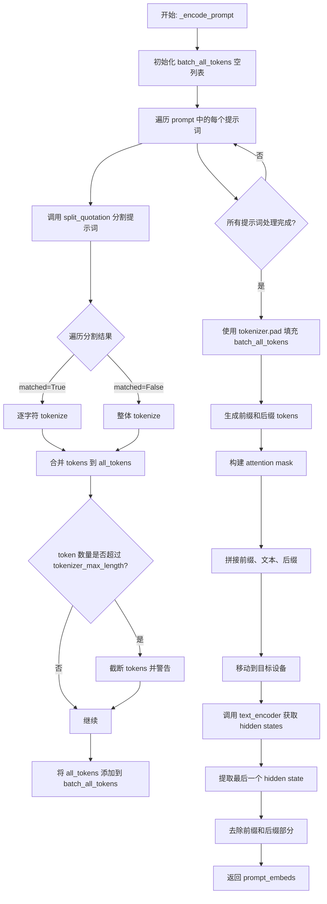

#### 带注释源码

```python
def _encode_prompt(self, prompt: list[str]):
    """
    将文本提示词列表编码为嵌入向量
    
    处理流程:
    1. 对每个提示词进行分词(区分引号内外)
    2. 添加提示模板前缀和后缀
    3. 使用 text_encoder 编码
    4. 提取纯提示词部分的嵌入
    """
    # 用于存储所有批次的 tokens
    batch_all_tokens = []

    # 遍历每个提示词
    for each_prompt in prompt:
        # 存储当前提示词的所有 tokens
        all_tokens = []
        
        # 使用 split_quotation 分割字符串,区分引号内外的文本
        # matched=True 表示在引号内,False 表示在引号外
        for clean_prompt_sub, matched in split_quotation(each_prompt):
            if matched:
                # 如果在引号内,逐字符进行 tokenize(保持引号内格式)
                for sub_word in clean_prompt_sub:
                    tokens = self.tokenizer(sub_word, add_special_tokens=False)["input_ids"]
                    all_tokens.extend(tokens)
            else:
                # 如果在引号外,整体进行 tokenize
                tokens = self.tokenizer(clean_prompt_sub, add_special_tokens=False)["input_ids"]
                all_tokens.extend(tokens)

        # 检查 token 数量是否超过最大长度限制
        if len(all_tokens) > self.tokenizer_max_length:
            logger.warning(
                "Your input was truncated because `max_sequence_length` is set to "
                f" {self.tokenizer_max_length} input token nums : {len(all_tokens)}"
            )
            # 截断超长的 tokens
            all_tokens = all_tokens[: self.tokenizer_max_length]
        
        # 将当前提示词的 tokens 添加到批次列表
        batch_all_tokens.append(all_tokens)

    # 使用 tokenizer 的 pad 方法进行填充,使所有序列长度一致
    text_tokens_and_mask = self.tokenizer.pad(
        {"input_ids": batch_all_tokens},
        max_length=self.tokenizer_max_length,
        padding="max_length",
        return_attention_mask=True,
        return_tensors="pt",
    )

    # 获取提示模板的前缀和后缀 tokens
    # 前缀: 引导模型作为图像描述专家
    # 后缀: 引导模型生成回复
    prefix_tokens = self.tokenizer(self.prompt_template_encode_prefix, add_special_tokens=False)["input_ids"]
    suffix_tokens = self.tokenizer(self.prompt_template_encode_suffix, add_special_tokens=False)["input_ids"]
    
    # 记录前缀和后缀的长度,用于后续提取纯提示词嵌入
    prefix_len = len(prefix_tokens)
    suffix_len = len(suffix_tokens)

    # 创建与 text_tokens_and_mask 相同 dtype 的 mask
    prefix_tokens_mask = torch.tensor([1] * len(prefix_tokens), dtype=text_tokens_and_mask.attention_mask[0].dtype)
    suffix_tokens_mask = torch.tensor([1] * len(suffix_tokens), dtype=text_tokens_and_mask.attention_mask[0].dtype)

    # 转换 prefix 和 suffix tokens 为 tensor
    prefix_tokens = torch.tensor(prefix_tokens, dtype=text_tokens_and_mask.input_ids.dtype)
    suffix_tokens = torch.tensor(suffix_tokens, dtype=text_tokens_and_mask.input_ids.dtype)

    # 获取批次大小
    batch_size = text_tokens_and_mask.input_ids.size(0)

    # 扩展前缀和后缀 tokens 以匹配批次大小
    prefix_tokens_batch = prefix_tokens.unsqueeze(0).expand(batch_size, -1)
    suffix_tokens_batch = suffix_tokens.unsqueeze(0).expand(batch_size, -1)
    prefix_mask_batch = prefix_tokens_mask.unsqueeze(0).expand(batch_size, -1)
    suffix_mask_batch = suffix_tokens_mask.unsqueeze(0).expand(batch_size, -1)

    # 拼接: [prefix, input_ids, suffix]
    input_ids = torch.cat((prefix_tokens_batch, text_tokens_and_mask.input_ids, suffix_tokens_batch), dim=-1)
    attention_mask = torch.cat((prefix_mask_batch, text_tokens_and_mask.attention_mask, suffix_mask_batch), dim=-1)

    # 移动到目标设备
    input_ids = input_ids.to(self.device)
    attention_mask = attention_mask.to(self.device)

    # 调用 text_encoder 获取 hidden states
    # output_hidden_states=True 确保返回所有层的 hidden states
    text_output = self.text_encoder(
        input_ids=input_ids, 
        attention_mask=attention_mask, 
        output_hidden_states=True
    )
    
    # 获取最后一层的 hidden states: [max_sequence_length, batch, hidden_size]
    # clone() 用于创建连续内存的 tensor
    # transpose: [max_sequence_length, batch, hidden_size] -> [batch, max_sequence_length, hidden_size]
    prompt_embeds = text_output.hidden_states[-1].detach()
    
    # 提取纯提示词部分(去掉前缀和后缀)
    # prefix_len: 跳过前缀
    # -suffix_len: 从末尾去掉后缀
    prompt_embeds = prompt_embeds[:, prefix_len:-suffix_len, :]
    
    return prompt_embeds
```


### `LongCatImagePipeline.encode_prompt`

该方法负责将文本提示（prompt）编码为文本嵌入（prompt embeddings），并生成相应的文本位置ID，以便后续在扩散模型的去噪过程中使用。它处理单个或多个提示，并根据`num_images_per_prompt`参数复制嵌入以支持批量图像生成。

参数：

- `self`：隐式参数，指向`LongCatImagePipeline`实例本身
- `prompt`：`str | list[str]`，待编码的文本提示，可以是单个字符串或字符串列表
- `num_images_per_prompt`：`int | None`，每个提示要生成的图像数量，用于复制embeddings以匹配批量生成，默认为1
- `prompt_embeds`：`torch.Tensor | None`，可选的预计算文本嵌入，如果提供则直接使用而跳过编码过程

返回值：`tuple[torch.Tensor, torch.Tensor]`，返回两个张量——第一个是编码后的文本嵌入（prompt_embeds），第二个是文本的位置ID（text_ids），两者都已移动到设备上

#### 流程图

```mermaid
flowchart TD
    A[开始 encode_prompt] --> B{prompt 是否为字符串?}
    B -->|是| C[将 prompt 转换为列表]
    B -->|否| D[保持原样]
    C --> E[计算 batch_size]
    D --> E
    E --> F{prompt_embeds 是否为 None?}
    F -->|是| G[调用 _encode_prompt 编码 prompt]
    F -->|否| H[跳过编码，使用提供的 prompt_embeds]
    G --> I[获取 prompt_embeds 的形状]
    H --> I
    I --> J[根据 num_images_per_prompt 重复 prompt_embeds]
    J --> K[重塑 prompt_embeds 为 batch_size * num_images_per_prompt]
    K --> L[调用 prepare_pos_ids 生成文本位置ID]
    L --> M[将 prompt_embeds 和 text_ids 移至设备]
    M --> N[返回 tuple: (prompt_embeds, text_ids)]
```

#### 带注释源码

```python
def encode_prompt(
    self,
    prompt: str | list[str] = None,
    num_images_per_prompt: int | None = 1,
    prompt_embeds: torch.Tensor | None = None,
):
    """
    Encode text prompts into embeddings for the diffusion model.
    
    处理流程：
    1. 标准化输入：将单个字符串转换为列表
    2. 编码提示词：如果未提供预计算的embeddings，则调用内部方法_encode_prompt
    3. 复制embeddings：根据num_images_per_prompt参数复制以支持批量生成
    4. 生成位置编码：为文本创建位置ID用于自注意力机制
    
    Args:
        prompt: 输入的文本提示，支持单个字符串或字符串列表
        num_images_per_prompt: 每个提示要生成的图像数量
        prompt_embeds: 可选的预计算embeddings，用于避免重复编码
    
    Returns:
        tuple: (编码后的embeddings, 文本位置IDs)
    """
    # 步骤1: 标准化prompt输入
    # 如果prompt是单个字符串，转换为列表；如果是列表则保持不变
    prompt = [prompt] if isinstance(prompt, str) else prompt
    
    # 获取批次大小
    batch_size = len(prompt)
    
    # 步骤2: 编码prompt（如果未提供预计算的embeddings）
    # 如果prompt_embeds为None，则调用内部_encode_prompt方法进行编码
    # 如果已提供，则跳过编码步骤，直接使用提供的embeddings
    if prompt_embeds is None:
        prompt_embeds = self._encode_prompt(prompt)
    
    # 获取embeddings的序列长度维度信息
    # shape: [batch_size, seq_len, hidden_size]
    _, seq_len, _ = prompt_embeds.shape
    
    # 步骤3: 根据num_images_per_prompt复制embeddings
    # 对每个prompt生成多个图像时，需要复制对应的embeddings
    # 使用repeat和view操作进行复制，比循环更高效
    # repeat(1, num_images_per_prompt, 1) 在序列维度复制
    prompt_embeds = prompt_embeds.repeat(1, num_images_per_prompt, 1)
    # view操作重塑张量以匹配新的批次大小
    # 从 [batch_size, seq_len, hidden] 变为 [batch_size * num_images_per_prompt, seq_len, hidden]
    prompt_embeds = prompt_embeds.view(batch_size * num_images_per_prompt, seq_len, -1)
    
    # 步骤4: 生成文本位置编码
    # 使用prepare_pos_ids函数生成文本的位置ID
    # modality_id=0 表示文本模态
    # type="text" 指定为文本类型
    # start=(0, 0) 表示起始位置
    # num_token=prompt_embeds.shape[1] 为token数量
    text_ids = prepare_pos_ids(
        modality_id=0, 
        type="text", 
        start=(0, 0), 
        num_token=prompt_embeds.shape[1]
    ).to(self.device)
    
    # 步骤5: 返回结果
    # 将embeddings和位置ID都移动到执行设备上
    return prompt_embeds.to(self.device), text_ids
```


### `LongCatImagePipeline._pack_latents`

该方法是一个静态方法，用于将 VAE 输出的潜在表示（latents）进行打包重塑，以便适配 transformer 模型的输入格式。其核心操作包括维度重排和形状变换，将原始的 4D 张量转换为适合长宽比保持的 3D 序列张量。

参数：

- `latents`：`torch.Tensor`，输入的潜在表示，形状为 [batch_size, num_channels_latents, height, width]
- `batch_size`：`int`，批次大小
- `num_channels_latents`：`int`，潜在通道数（通常为 16）
- `height`：`int`，潜在表示的高度（已考虑 VAE 压缩和 packing 要求的 2 倍缩放）
- `width`：`int`，潜在表示的宽度（已考虑 VAE 压缩和 packing 要求的 2 倍缩放）

返回值：`torch.Tensor`，打包后的潜在表示，形状为 [batch_size, (height//2)*(width//2), num_channels_latents*4]

#### 流程图

```mermaid
flowchart TD
    A[输入 latents: (batch_size, num_channels_latents, height, width)] --> B[view 操作重塑维度]
    B --> C[将 height 和 width 各划分为 2x2 的块]
    C --> D[新形状: batch_size, num_channels_latents, height//2, 2, width//2, 2]
    D --> E[permute 操作置换维度]
    E --> F[新维度顺序: 0, 2, 4, 1, 3, 5]
    F --> G[对应含义: batch, height//2, width//2, num_channels_latents, 2, 2]
    G --> H[reshape 操作合并最后两维]
    H --> I[输出 latents: batch_size, height//2*width//2, num_channels_latents*4]
```

#### 带注释源码

```python
@staticmethod
def _pack_latents(latents, batch_size, num_channels_latents, height, width):
    """
    将潜在表示打包为适合 transformer 输入的格式
    
    目的：保持长宽比的同时，将 4D latent 张量转换为序列形式的 3D 张量
    每个 2x2 的 latent 块被展平为一个包含 4 个通道信息的 token
    """
    # Step 1: view 操作 - 将 height 和 width 各划分为 2 个块
    # 原始形状: (batch_size, num_channels_latents, height, width)
    # 变换后:   (batch_size, num_channels_latents, height//2, 2, width//2, 2)
    # 这样将图像分割成 2x2 的小块，每个小块将作为 transformer 的一个 token
    latents = latents.view(batch_size, num_channels_latents, height // 2, 2, width // 2, 2)
    
    # Step 2: permute 操作 - 重新排列维度顺序
    # 原维度顺序: 0(batch), 1(channels), 2(h//2), 3(2), 4(w//2), 5(2)
    # 新维度顺序: 0(batch), 2(h//2), 4(w//2), 1(channels), 3(2), 5(2)
    # 这样将空间维度(batch, h//2, w//2)放到前面，通道维度放到后面
    latents = latents.permute(0, 2, 4, 1, 3, 5)
    
    # Step 3: reshape 操作 - 将最后两维(2,2)合并，并合并通道数
    # 原始: (batch_size, height//2, width//2, num_channels_latents, 2, 2)
    # 变换后: (batch_size, height//2*width//2, num_channels_latents*4)
    # 每个 2x2 块对应一个 token，通道数从 num_channels_latents 扩展到 num_channels_latents*4
    # 这种方式保持了原始的 2x2 空间结构信息，同时将每个块展平为更长的序列
    latents = latents.reshape(batch_size, (height // 2) * (width // 2), num_channels_latents * 4)

    return latents
```


### `LongCatImagePipeline._unpack_latents`

该函数是一个静态方法，用于将打包（packed）后的latent张量解包（unpack）回标准的4D张量形状，以便后续送入VAE解码器进行图像重建。该操作是 `_pack_latents` 的逆过程，涉及维度重排和形状变换。

参数：

- `latents`：`torch.Tensor`，输入的打包后latent张量，形状为 (batch_size, num_patches, channels)
- `height`：`int`，原始图像的高度（像素空间）
- `width`：`int`，原始图像的宽度（像素空间）
- `vae_scale_factor`：`int`，VAE的缩放因子，用于计算latent空间的实际尺寸

返回值：`torch.Tensor`，解包后的latent张量，形状为 (batch_size, channels // (2 * 2), height, width)

#### 流程图

```mermaid
flowchart TD
    A[输入: latents (batch, num_patches, channels)] --> B[获取batch_size, num_patches, channels]
    B --> C[计算实际latent高度和宽度<br/>height = 2 * (height // (vae_scale_factor * 2))<br/>width = 2 * (width // (vae_scale_factor * 2))]
    C --> D[view: (batch, h//2, w//2, c//4, 2, 2)]
    D --> E[permute: (batch, c//4, h//2, 2, w//2, 2)]
    E --> F[reshape: (batch, c//4, h, w)]
    F --> G[输出: latents (batch, c//4, height, width)]
```

#### 带注释源码

```python
@staticmethod
def _unpack_latents(latents, height, width, vae_scale_factor):
    # 从输入的打包latent张量中获取批量大小、patch数量和通道数
    batch_size, num_patches, channels = latents.shape

    # VAE对图像应用8x压缩，但打包操作要求latent的高度和宽度可被2整除
    # 因此需要根据vae_scale_factor计算实际的latent空间尺寸
    # 乘以2是因为打包时将2x2的patch合并为一个token
    height = 2 * (int(height) // (vae_scale_factor * 2))
    width = 2 * (int(width) // (vae_scale_factor * 2))

    # 使用view将打包的latent重塑为6维张量
    # (batch, num_patches, channels) -> (batch, height//2, width//2, channels//4, 2, 2)
    # 其中最后两个维度2x2表示打包前的空间结构
    latents = latents.view(batch_size, height // 2, width // 2, channels // 4, 2, 2)

    # 使用permute重新排列维度，将空间维度移到最后
    # (batch, h//2, w//2, c//4, 2, 2) -> (batch, c//4, h//2, 2, w//2, 2)
    latents = latents.permute(0, 3, 1, 4, 2, 5)

    # 最终reshape为标准的4D latent张量
    # (batch, c//4, h//2*2, w//2*2) = (batch, c//4, h, w)
    latents = latents.reshape(batch_size, channels // (2 * 2), height, width)

    return latents
```


### `LongCatImagePipeline.prepare_latents`

该方法负责为扩散模型准备潜在变量（latents）和对应的图像位置编码信息。它根据输入的图像尺寸计算经过VAE压缩和打包后的潜在空间维度，如果提供了预定义潜在变量则直接使用，否则使用随机张量初始化，并通过`_pack_latents`方法对潜在变量进行空间打包以适应Transformer的输入格式。

参数：

- `batch_size`：`int`，批量大小，表示一次生成多少张图像
- `num_channels_latents`：`int`，潜在变量的通道数，通常为16
- `height`：`int`，目标图像的高度（像素）
- `width`：`int`，目标图像的宽度（像素）
- `dtype`：`torch.dtype`，潜在变量的数据类型，通常与prompt_embeds的数据类型一致
- `device`：`torch.device`，计算设备（CPU或GPU）
- `generator`：`torch.Generator | list[torch.Generator] | None`，随机数生成器，用于控制潜在变量的随机性
- `latents`：`torch.FloatTensor | None`，可选参数，如果提供则直接使用该潜在变量而非随机生成

返回值：`tuple[torch.Tensor, torch.Tensor]`，返回两个张量——第一个是经过打包处理的潜在变量（shape为`[batch_size, (height//4)*(width//4), num_channels_latents*4]`），第二个是图像的位置编码信息（shape为`[height*width//4, 3]`）

#### 流程图

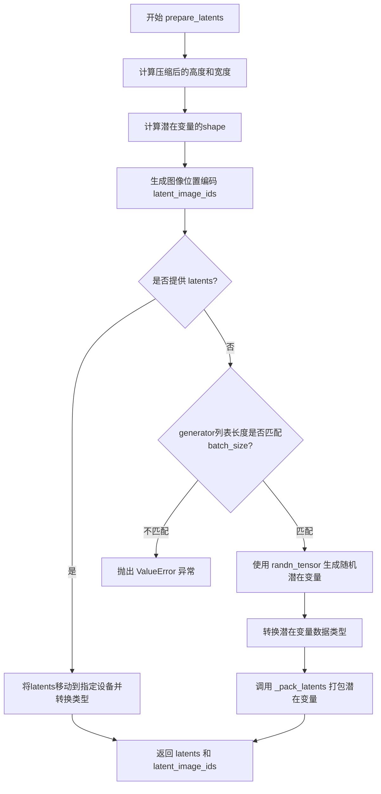

#### 带注释源码

```
def prepare_latents(
    self,
    batch_size: int,                    # 批量大小
    num_channels_latents: int,          # 潜在通道数，通常为16
    height: int,                        # 目标图像高度
    width: int,                         # 目标图像宽度
    dtype: torch.dtype,                 # 潜在变量的数据类型
    device: torch.device,               # 计算设备
    generator: torch.Generator | list[torch.Generator] | None,  # 随机数生成器
    latents: torch.FloatTensor | None = None,  # 可选的预定义潜在变量
):
    # VAE applies 8x compression on images but we must also account for packing which requires
    # latent height and width to be divisible by 2.
    # 计算经过VAE压缩和打包后的潜在空间高度和宽度
    # VAE进行8x压缩，同时打包需要高度和宽度能被2整除
    height = 2 * (int(height) // (self.vae_scale_factor * 2))
    width = 2 * (int(width) // (self.vae_scale_factor * 2))

    # 构造潜在变量的shape：[batch_size, num_channels_latents, height, width]
    shape = (batch_size, num_channels_latents, height, width)
    
    # 生成图像位置编码信息，用于Transformer的图像位置ID
    # modality_id=1 表示图像模态
    # start=(self.tokenizer_max_length, self.tokenizer_max_length) 避免与文本位置ID冲突
    latent_image_ids = prepare_pos_ids(
        modality_id=1,
        type="image",
        start=(self.tokenizer_max_length, self.tokenizer_max_length),
        height=height // 2,    # 打包后高度减半
        width=width // 2,      # 打包后宽度减半
    ).to(device)

    # 如果调用者已经提供了潜在变量，直接使用并返回
    if latents is not None:
        return latents.to(device=device, dtype=dtype), latent_image_ids

    # 检查generator列表长度是否与batch_size匹配
    if isinstance(generator, list) and len(generator) != batch_size:
        raise ValueError(
            f"You have passed a list of generators of length {len(generator)}, but requested an effective batch"
            f" size of {batch_size}. Make sure the batch size matches the length of the generators."
        )

    # 使用随机张量初始化潜在变量（符合标准正态分布）
    latents = randn_tensor(shape, generator=generator, device=device)
    
    # 转换数据类型
    latents = latents.to(dtype=dtype)
    
    # 对潜在变量进行空间打包，将2x2的空间区域打包成一个token
    # 打包后shape从 [B, C, H, W] 变为 [B, H*W//4, C*4]
    latents = self._pack_latents(latents, batch_size, num_channels_latents, height, width)

    # 返回打包后的潜在变量和对应的图像位置编码
    return latents, latent_image_ids
```


### `LongCatImagePipeline.check_inputs`

该方法用于验证图像生成管道的输入参数是否合法，确保 `prompt` 和 `prompt_embeds` 不能同时提供，且高度和宽度必须能被 VAE 缩放因子的两倍整除，同时检查负向提示的相关参数互斥性。

参数：

- `self`：`LongCatImagePipeline` 实例，管道对象自身
- `prompt`：`str | list[str] | None`，用户输入的文本提示，可以是单个字符串或字符串列表
- `height`：`int`，生成的图像高度
- `width`：`int`，生成的图像宽度
- `negative_prompt`：`str | list[str] | None`，可选的反向提示词，用于指导模型避免生成相关内容
- `prompt_embeds`：`torch.FloatTensor | None`，可选的预计算文本嵌入向量
- `negative_prompt_embeds`：`torch.FloatTensor | None`，可选的预计算反向文本嵌入向量

返回值：`None`，该方法仅进行参数验证，不返回任何值

#### 流程图

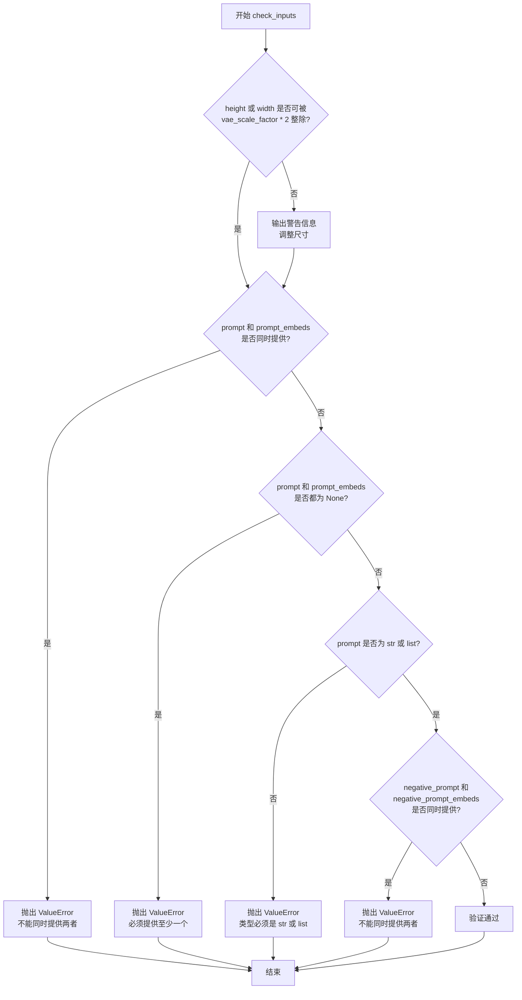

#### 带注释源码

```python
def check_inputs(
    self, prompt, height, width, negative_prompt=None, prompt_embeds=None, negative_prompt_embeds=None
):
    # 检查图像尺寸是否满足 VAE 压缩要求
    # VAE 会对图像进行 8x 压缩，同时需要考虑 packing 带来的额外 2x 压缩
    # 因此总压缩倍数为 vae_scale_factor * 2
    if height % (self.vae_scale_factor * 2) != 0 or width % (self.vae_scale_factor * 2) != 0:
        logger.warning(
            f"`height` and `width` have to be divisible by {self.vae_scale_factor * 2} but are {height} and {width}. Dimensions will be resized accordingly"
        )

    # 验证 prompt 和 prompt_embeds 的互斥关系
    # 两者不能同时提供，但至少需要提供一个
    if prompt is not None and prompt_embeds is not None:
        raise ValueError(
            f"Cannot forward both `prompt`: {prompt} and `prompt_embeds`: {prompt_embeds}. Please make sure to"
            " only forward one of the two."
        )
    elif prompt is None and prompt_embeds is None:
        raise ValueError(
            "Provide either `prompt` or `prompt_embeds`. Cannot leave both `prompt` and `prompt_embeds` undefined."
        )
    # 验证 prompt 的类型必须是字符串或列表
    elif prompt is not None and (not isinstance(prompt, str) and not isinstance(prompt, list)):
        raise ValueError(f"`prompt` has to be of type `str` or `list` but is {type(prompt)}")

    # 验证 negative_prompt 和 negative_prompt_embeds 的互斥关系
    # 两者不能同时提供
    if negative_prompt is not None and negative_prompt_embeds is not None:
        raise ValueError(
            f"Cannot forward both `negative_prompt`: {negative_prompt} and `negative_prompt_embeds`:"
            f" {negative_prompt_embeds}. Please make sure to only forward one of the two."
        )
```


### `LongCatImagePipeline.__call__`

该方法是LongCatImagePipeline管道的主入口，封装了文本到图像的生成流程。它接收文本提示词和其他生成参数，经过提示词编码、潜在变量准备、去噪循环（包含可选的提示词重写和CFG重归一化）、VAE解码等步骤，最终返回生成的图像。

参数：

- `prompt`：`str | list[str] | None`，输入的文本提示词，支持单个字符串或字符串列表
- `negative_prompt`：`str | list[str] | None`，负面提示词，用于引导模型避免生成相关内容
- `height`：`int | None`，生成图像的高度，默认为`default_sample_size * vae_scale_factor`
- `width`：`int | None`，生成图像的宽度，默认为`default_sample_size * vae_scale_factor`
- `num_inference_steps`：`int`，去噪推理的步数，默认值为50
- `sigmas`：`list[float] | None`，自定义的sigma值，用于覆盖默认的时间步调度
- `guidance_scale`：`float`，分类器自由引导（CFG）的比例因子，默认值为4.5
- `num_images_per_prompt`：`int | None`，每个提示词生成的图像数量，默认值为1
- `generator`：`torch.Generator | list[torch.Generator] | None`，用于控制随机性的PyTorch生成器
- `latents`：`torch.FloatTensor | None`，预先准备的初始潜在变量，若为None则随机生成
- `prompt_embeds`：`torch.FloatTensor | None`，预先计算的提示词嵌入向量，若提供则跳过提示词编码
- `negative_prompt_embeds`：`torch.FloatTensor | None`，预先计算的负面提示词嵌入向量
- `output_type`：`str | None`，输出图像的格式类型，默认值为"pil"（PIL图像）
- `return_dict`：`bool`，是否返回字典格式的输出，默认值为True
- `joint_attention_kwargs`：`dict[str, Any] | None`，传递给transformer的联合注意力额外参数
- `enable_cfg_renorm`：`bool | None`，是否启用CFG重归一化以提升图像质量，默认值为True
- `cfg_renorm_min`：`float | None`，CFG重归一化的最小比例值，范围0-1，默认值为0.0
- `enable_prompt_rewrite`：`bool | None`，是否启用提示词重写功能，默认值为True

返回值：`LongCatImagePipelineOutput`，包含生成图像的管道输出对象；若`return_dict`为False，则返回元组`(image,)`

#### 流程图

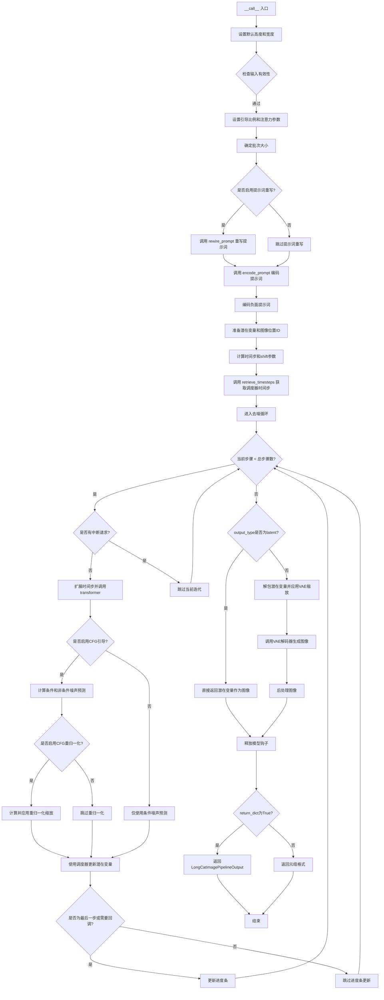

#### 带注释源码

```python
@replace_example_docstring(EXAMPLE_DOC_STRING)
@torch.no_grad()
def __call__(
    self,
    prompt: str | list[str] = None,
    negative_prompt: str | list[str] = None,
    height: int | None = None,
    width: int | None = None,
    num_inference_steps: int = 50,
    sigmas: list[float] | None = None,
    guidance_scale: float = 4.5,
    num_images_per_prompt: int | None = 1,
    generator: torch.Generator | list[torch.Generator] | None = None,
    latents: torch.FloatTensor | None = None,
    prompt_embeds: torch.FloatTensor | None = None,
    negative_prompt_embeds: torch.FloatTensor | None = None,
    output_type: str | None = "pil",
    return_dict: bool = True,
    joint_attention_kwargs: dict[str, Any] | None = None,
    enable_cfg_renorm: bool | None = True,
    cfg_renorm_min: float | None = 0.0,
    enable_prompt_rewrite: bool | None = True,
):
    r"""
    Function invoked when calling the pipeline for generation.

    Args:
        enable_cfg_renorm: Whether to enable cfg_renorm. Enabling cfg_renorm will improve image quality,
            but it may lead to a decrease in the stability of some image outputs..
        cfg_renorm_min: The minimum value of the cfg_renorm_scale range (0-1).
            cfg_renorm_min = 1.0, renorm has no effect, while cfg_renorm_min=0.0, the renorm range is larger.
        enable_prompt_rewrite: whether to enable prompt rewrite.
    Examples:

    Returns:
        [`~pipelines.LongCatImagePipelineOutput`] or `tuple`: [`~pipelines.LongCatImagePipelineOutput`] if
        `return_dict` is True, otherwise a `tuple`. When returning a tuple, the first element is a list with the
        generated images.
    """

    # 步骤1: 设置默认的图像尺寸，基于VAE的缩放因子
    height = height or self.default_sample_size * self.vae_scale_factor
    width = width or self.default_sample_size * self.vae_scale_factor

    # 步骤2: 检查输入参数的合法性
    self.check_inputs(
        prompt,
        height,
        width,
        negative_prompt=negative_prompt,
        prompt_embeds=prompt_embeds,
        negative_prompt_embeds=negative_prompt_embeds,
    )

    # 步骤3: 初始化内部状态变量
    self._guidance_scale = guidance_scale
    self._joint_attention_kwargs = joint_attention_kwargs
    self._current_timestep = None
    self._interrupt = False

    # 步骤4: 确定批次大小，根据输入的prompt或已计算的prompt_embeds
    if prompt is not None and isinstance(prompt, str):
        batch_size = 1
    elif prompt is not None and isinstance(prompt, list):
        batch_size = len(prompt)
    else:
        batch_size = prompt_embeds.shape[0]

    # 获取执行设备
    device = self._execution_device
    
    # 步骤5: 可选 - 使用LLM重写提示词以提升生成质量
    if enable_prompt_rewrite:
        prompt = self.rewire_prompt(prompt, device)
        logger.info(f"Rewrite prompt {prompt}!")

    # 处理负面提示词为空的情况
    negative_prompt = "" if negative_prompt is None else negative_prompt
    
    # 步骤6: 编码提示词获取文本嵌入和位置ID
    (prompt_embeds, text_ids) = self.encode_prompt(
        prompt=prompt, prompt_embeds=prompt_embeds, num_images_per_prompt=num_images_per_prompt
    )
    
    # 步骤7: 如果启用CFG引导，则编码负面提示词
    if self.do_classifier_free_guidance:
        (negative_prompt_embeds, negative_text_ids) = self.encode_prompt(
            prompt=negative_prompt,
            prompt_embeds=negative_prompt_embeds,
            num_images_per_prompt=num_images_per_prompt,
        )

    # 步骤8: 准备潜在变量和图像位置ID
    num_channels_latents = 16  # 潜在变量的通道数
    latents, latent_image_ids = self.prepare_latents(
        batch_size * num_images_per_prompt,
        num_channels_latents,
        height,
        width,
        prompt_embeds.dtype,
        device,
        generator,
        latents,
    )

    # 步骤9: 计算时间步调度参数
    # 生成sigma值序列，从1.0线性递减到1.0/num_inference_steps
    sigmas = np.linspace(1.0, 1.0 / num_inference_steps, num_inference_steps) if sigmas is None else sigmas
    image_seq_len = latents.shape[1]
    # 计算shift参数以调整不同序列长度的噪声调度
    mu = calculate_shift(
        image_seq_len,
        self.scheduler.config.get("base_image_seq_len", 256),
        self.scheduler.config.get("max_image_seq_len", 4096),
        self.scheduler.config.get("base_shift", 0.5),
        self.scheduler.config.get("max_shift", 1.15),
    )
    # 从调度器获取时间步序列
    timesteps, num_inference_steps = retrieve_timesteps(
        self.scheduler,
        num_inference_steps,
        device,
        sigmas=sigmas,
        mu=mu,
    )
    # 计算预热步数
    num_warmup_steps = max(len(timesteps) - num_inference_steps * self.scheduler.order, 0)
    self._num_timesteps = len(timesteps)

    # 初始化引导变量
    guidance = None

    if self.joint_attention_kwargs is None:
        self._joint_attention_kwargs = {}

    # 步骤10: 去噪主循环
    with self.progress_bar(total=num_inference_steps) as progress_bar:
        for i, t in enumerate(timesteps):
            # 检查是否有中断请求
            if self.interrupt:
                continue

            self._current_timestep = t
            # 扩展时间步以匹配批次大小
            timestep = t.expand(latents.shape[0]).to(latents.dtype)
            
            # 使用条件提示词进行前向传播
            with self.transformer.cache_context("cond"):
                noise_pred_text = self.transformer(
                    hidden_states=latents,
                    timestep=timestep / 1000,  # 将时间步归一化到0-1范围
                    guidance=guidance,
                    encoder_hidden_states=prompt_embeds,
                    txt_ids=text_ids,
                    img_ids=latent_image_ids,
                    return_dict=False,
                )[0]
            
            # 如果启用CFG引导，计算非条件预测并组合
            if self.do_classifier_free_guidance:
                with self.transformer.cache_context("uncond"):
                    noise_pred_uncond = self.transformer(
                        hidden_states=latents,
                        timestep=timestep / 1000,
                        encoder_hidden_states=negative_prompt_embeds,
                        txt_ids=negative_text_ids,
                        img_ids=latent_image_ids,
                        return_dict=False,
                    )[0]
                
                # 应用CFG引导：uncond + scale * (cond - uncond)
                noise_pred = noise_pred_uncond + self.guidance_scale * (noise_pred_text - noise_pred_uncond)

                # 可选：应用CFG重归一化以稳定生成
                if enable_cfg_renorm:
                    # 计算条件预测的范数
                    cond_norm = torch.norm(noise_pred_text, dim=-1, keepdim=True)
                    # 计算组合预测的范数
                    noise_norm = torch.norm(noise_pred, dim=-1, keepdim=True)
                    # 计算缩放因子并限制在[cfg_renorm_min, 1.0]范围内
                    scale = (cond_norm / (noise_norm + 1e-8)).clamp(min=cfg_renorm_min, max=1.0)
                    # 应用缩放以归一化噪声预测
                    noise_pred = noise_pred * scale
            else:
                noise_pred = noise_pred_text

            # 记录潜在变量的原始数据类型
            latents_dtype = latents.dtype
            # 使用调度器执行去噪步骤：x_t -> x_{t-1}
            latents = self.scheduler.step(noise_pred, t, latents, return_dict=False)[0]

            # 如果数据类型发生变化（某些MPS设备的bug），转回原始类型
            if latents.dtype != latents_dtype:
                if torch.backends.mps.is_available():
                    # some platforms (eg. apple mps) misbehave due to a pytorch bug: https://github.com/pytorch/pytorch/pull/99272
                    latents = latents.to(latents_dtype)

            # 步骤11: 进度回调 - 在最后一步或预热完成后定期更新
            if i == len(timesteps) - 1 or ((i + 1) > num_warmup_steps and (i + 1) % self.scheduler.order == 0):
                progress_bar.update()

            # 如果使用XLA设备，进行标记以优化执行
            if XLA_AVAILABLE:
                xm.mark_step()

    # 重置当前时间步
    self._current_timestep = None

    # 步骤12: 根据output_type处理输出
    if output_type == "latent":
        # 直接返回潜在变量
        image = latents
    else:
        # 解包潜在变量并应用VAE的缩放和偏移
        latents = self._unpack_latents(latents, height, width, self.vae_scale_factor)
        latents = (latents / self.vae.config.scaling_factor) + self.vae.config.shift_factor

        # 确保数据类型匹配VAE
        if latents.dtype != self.vae.dtype:
            latents = latents.to(dtype=self.vae.dtype)

        # 使用VAE解码器将潜在变量解码为图像
        image = self.vae.decode(latents, return_dict=False)[0]
        # 后处理图像到指定的输出格式
        image = self.image_processor.postprocess(image, output_type=output_type)

    # 步骤13: 释放所有模型的钩子以节省内存
    self.maybe_free_model_hooks()

    # 步骤14: 返回结果
    if not return_dict:
        return (image,)

    return LongCatImagePipelineOutput(images=image)
```


### `LongCatImagePipeline.do_classifier_free_guidance`

该属性用于判断当前管线是否启用无分类器指导（Classifier-Free Guidance，CFG）。当引导系数 `_guidance_scale` 大于 1 时，表示启用 CFG，此时管线会在推理过程中同时计算条件预测和无条件预测，以增强生成结果对文本提示的遵循度。

参数： 无

返回值：`bool`，如果 `self._guidance_scale > 1` 则返回 `True`（启用 CFG），否则返回 `False`（禁用 CFG）。

#### 流程图

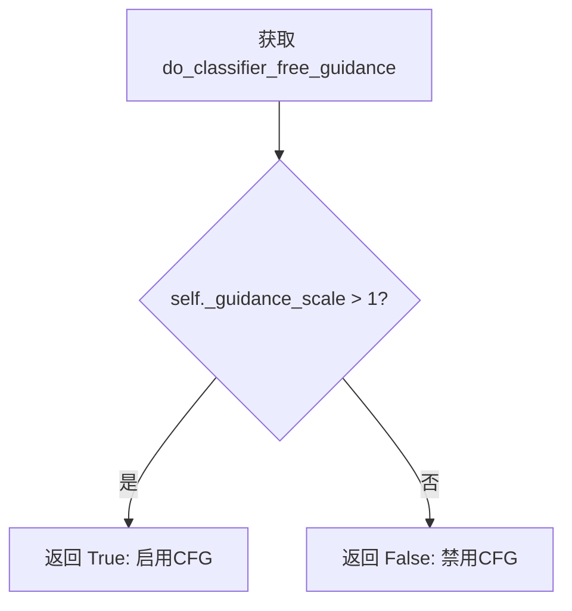

#### 带注释源码

```python
@property
def do_classifier_free_guidance(self):
    """
    判断是否启用无分类器指导（Classifier-Free Guidance）。

    该属性检查内部属性 _guidance_scale 是否大于 1。
    当 guidance_scale > 1 时，推理过程会执行 CFG 策略：
    - 同时生成条件预测（基于正向提示词）
    - 和无条件预测（基于空提示词或负向提示词）
    - 最终噪声预测 = 无条件预测 + guidance_scale * (条件预测 - 无条件预测)

    Returns:
        bool: 如果 guidance_scale > 1 返回 True，表示启用 CFG；否则返回 False。

    Example:
        >>> pipeline = LongCatImagePipeline.from_pretrained(...)
        >>> pipeline._guidance_scale = 4.5
        >>> pipeline.do_classifier_free_guidance
        True
    """
    return self._guidance_scale > 1
```


### `LongCatImagePipeline.guidance_scale`

该属性是 `LongCatImagePipeline` 类的只读属性，用于获取当前管线运行时的引导缩放因子（guidance scale）。该因子在分类器自由引导（Classifier-Free Guidance）过程中用于调整条件和非条件预测的权重，从而影响生成图像与提示词的相关程度。

参数：

- 无参数（property getter）

返回值：`float`，返回用于分类器自由引导的缩放因子，默认值为用户在调用管线时传入的 `guidance_scale` 参数值（默认为 4.5）。

#### 流程图

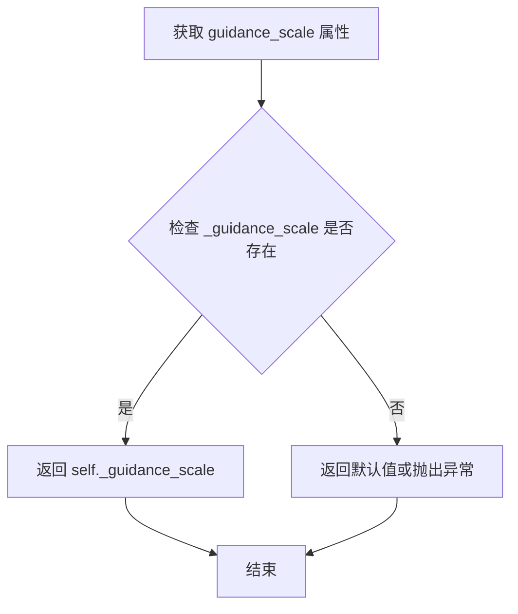

#### 带注释源码

```python
@property
def guidance_scale(self):
    """
    获取分类器自由引导（Classifier-Free Guidance）的缩放因子。
    
    该属性返回一个浮点数，表示在文本到图像生成过程中
    用于调整条件预测和非条件预测之间权重的缩放因子。
    较高的值会使生成的图像更紧密地遵循提示词，但可能导致
    图像质量下降或出现伪影。
    
    Returns:
        float: 引导缩放因子，通常在 1.0 到 20.0 之间，
              值为 1.0 表示不使用引导（等同于纯概率采样）。
    """
    return self._guidance_scale
```

#### 相关上下文说明

`guidance_scale` 属性与 `do_classifier_free_guidance` 属性配合使用：

```python
@property
def do_classifier_free_guidance(self):
    """判断是否启用分类器自由引导"""
    return self._guidance_scale > 1
```

在管线的去噪循环中，使用该属性计算最终的噪声预测：

```python
# 伪代码示意
noise_pred = noise_pred_uncond + self.guidance_scale * (noise_pred_text - noise_pred_uncond)
```


### `LongCatImagePipeline.joint_attention_kwargs`

该属性是 `LongCatImagePipeline` 类的只读属性，用于获取在调用管道生成图像时传入的联合注意力关键字参数。它封装了内部变量 `_joint_attention_kwargs`，提供了对扩散模型推理过程中额外参数的访问通道。

参数：无（这是一个属性 getter，不接受任何参数）

返回值：`dict[str, Any] | None`，返回联合注意力相关的参数字典，可能为 `None`。

#### 流程图

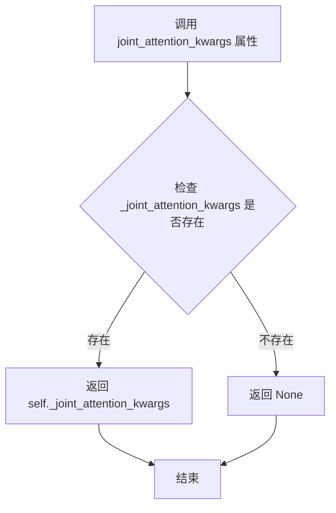

#### 带注释源码

```python
@property
def joint_attention_kwargs(self):
    """
    只读属性，用于获取联合注意力关键字参数。
    
    该属性在管道调用时通过 __call__ 方法的 joint_attention_kwargs 参数设置，
    用于向扩散变换器传递额外的推理参数，例如注意力掩码、特殊控制标志等。
    
    Returns:
        dict[str, Any] | None: 联合注意力参数字典，如果未设置则返回 None。
    """
    return self._joint_attention_kwargs
```


### `LongCatImagePipeline.num_timesteps` (property)

该属性是一个只读属性，用于返回扩散模型在实际推理过程中所使用的时间步（timesteps）的数量。这个值通常在 pipeline 的 `__call__` 方法中根据调度器生成的时间步列表长度进行设置，反映了推理过程中实际执行的去噪步数。

参数：

- （无参数）

返回值：`int`，返回推理过程中实际使用的时间步数量，即 `len(timesteps)`。

#### 流程图

```mermaid
flowchart TD
    A[调用 num_timesteps 属性] --> B{检查 _num_timesteps 是否已设置}
    B -->|是| C[返回 self._num_timesteps]
    B -->|否| D[返回默认值或 0]
    
    E[Pipeline __call__ 方法] --> F[retrieve_timesteps 生成时间步列表]
    F --> G[设置 self._num_timesteps = len(timesteps)]
    G --> H[后续可通过属性访问]
```

#### 带注释源码

```python
@property
def num_timesteps(self):
    """
    返回扩散模型推理过程中实际使用的时间步数量。
    
    该属性是一个只读属性，通过返回内部变量 _num_timesteps 来获取
    推理过程中实际执行的去噪步数。这个值是在 __call__ 方法中
    通过 retrieve_timesteps 函数生成时间步列表后设置的。
    
    Returns:
        int: 推理过程中实际使用的时间步数量
    """
    return self._num_timesteps
```


### `LongCatImagePipeline.current_timestep`

该属性是一个只读属性，用于获取当前扩散模型推理过程中的时间步（timestep）。在去噪循环中，每次迭代会更新此值，从而允许外部代码监控推理进度。

参数：无（这是一个属性 getter，不接受任何参数）

返回值：`torch.Tensor | None`，返回当前推理循环中的时间步张量。如果当前不在推理过程中（例如在推理开始前或结束后），则返回 `None`。

#### 流程图

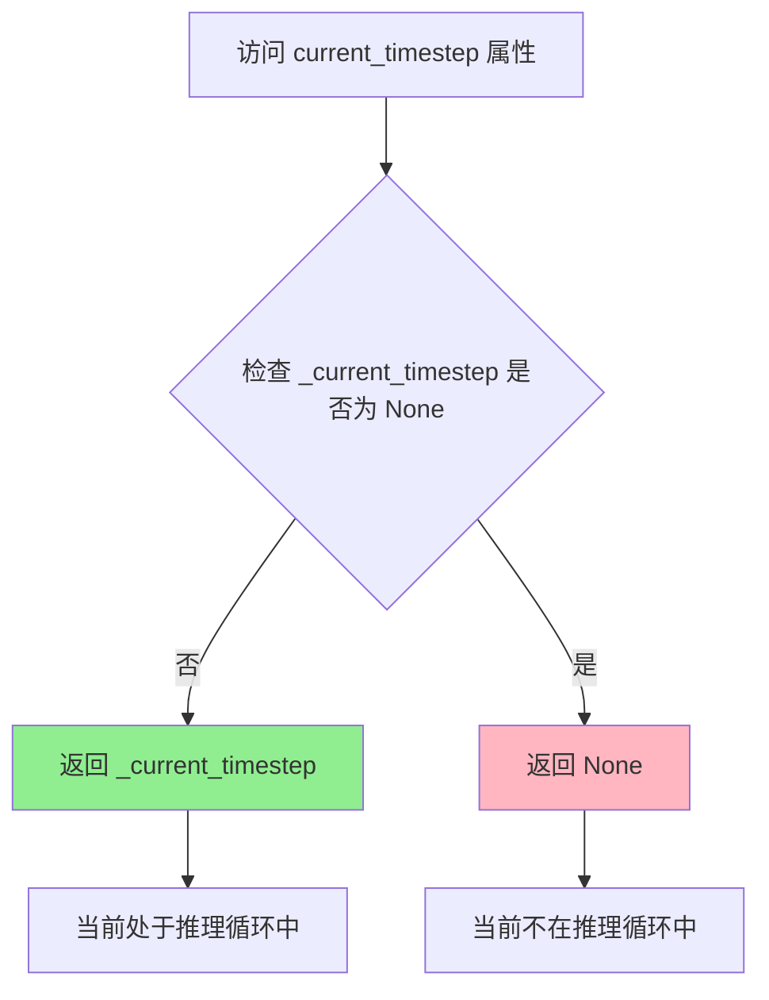

#### 带注释源码

```python
@property
def current_timestep(self):
    """
    返回当前扩散推理过程中的时间步（timestep）。
    
    该属性在去噪循环中被动态更新：
    - 推理开始前初始化为 None
    - 每次迭代更新为当前的时间步值 t
    - 推理完成后重置为 None
    
    返回值:
        torch.Tensor | None: 当前推理循环中的时间步张量，
                           如果不在推理过程中则返回 None
    """
    return self._current_timestep
```


### `LongCatImagePipeline.interrupt`

该属性用于获取当前管道的中断状态，控制在去噪循环执行过程中是否中断图像生成流程。

参数：
- （无参数）

返回值：`bool`，返回当前的中断标志状态。当返回 `True` 时，表示生成过程已被请求中断；当返回 `False` 时，表示继续正常生成。

#### 流程图

```mermaid
flowchart TD
    A[访问 interrupt 属性] --> B{获取 self._interrupt}
    B --> C[返回布尔值]
    
    subgraph 状态说明
        D[True: 中断请求已发出]
        E[False: 继续正常生成]
    end
    
    C --> D
    C --> E
```

#### 带注释源码

```python
@property
def interrupt(self):
    """
    属性 getter，用于获取当前管道的中断状态。
    
    该属性在去噪循环中被检查：
        for i, t in enumerate(timesteps):
            if self.interrupt:
                continue  # 如果中断标志为True，跳过当前迭代
    
    初始化时在 __call__ 方法中设置为 False：
        self._interrupt = False
    
    Returns:
        bool: 返回当前的中断标志状态。
              True 表示请求中断生成过程，
              False 表示继续正常生成。
    """
    return self._interrupt
```

## 关键组件


### LongCatImagePipeline

主pipeline类，继承自DiffusionPipeline和FromSingleFileMixin，负责文本到图像的生成流程，集成了VAE、文本编码器、Transformer模型和调度器。

### 张量索引与打包机制

`_pack_latents`和`_unpack_latents`静态方法实现latent张量的打包与解包操作，支持2x2分块重排以适应长宽比变化的图像处理，实现高效的空间索引。

### 位置编码生成器

`prepare_pos_ids`函数生成文本和图像模态的位置ID，支持modality_id区分不同模态，通过torch.arange生成行/列坐标，支持起始偏移量配置。

### 提示词重写模块

`rewire_prompt`方法使用Qwen2_5_VLForConditionalGeneration模型对用户输入的原始提示词进行重写，根据语言类型选择SYSTEM_PROMPT_ZH或SYSTEM_PROMPT_EN，生成更优化的描述性提示词。

### 提示词编码器

`_encode_prompt`方法实现精细的token处理，通过`split_quotation`函数识别引号内的文本，对引号内文本逐字符tokenize以保留精确格式，最终添加prompt模板前缀后缀并编码。

### CFG Renorm机制

`__call__`方法中的enable_cfg_renorm功能实现分类器自由引导的归一化修正，通过计算条件预测和噪声预测的范数比例，对合并后的噪声预测进行尺度调整以提升图像质量。

### 潜在变量准备

`prepare_latents`方法准备去噪循环所需的latent变量和图像位置ID，处理VAE的8x压缩比和packing要求的2x倍数关系，支持随机生成或用户提供的latent输入。

### 时间步检索

`retrieve_timesteps`函数从调度器获取时间步序列，支持自定义timesteps或sigmas参数，处理不同调度器的接口差异，返回标准化的timestep张量和推理步数。

### 提示词语言检测

`get_prompt_language`函数通过正则表达式检测提示词是否包含中文字符（\\u4e00-\\u9fff），返回"zh"或"en"语言标识。

### 引号分割算法

`split_quotation`函数实现基于正则的字符串分割，识别单引号、双引号、中英文引号对包围的文本块，返回(文本片段, 是否为引号内容)的元组列表，特别处理单词内部撇号（如don't）。


## 问题及建议


### 已知问题

-   `rewire_prompt`方法中存在设备转移bug：`generated_ids.to(device)`没有实际效果，因为torch.Tensor的`.to()`方法返回新tensor而不是就地修改，应改为`generated_ids = generated_ids.to(device)`
-   `split_quotation`函数中的正则表达式`r"[a-zA-Z]+'[a-zA-Z]+"`不够完善，无法正确处理缩写词（如"don't"、"I'm"）的边界情况，可能导致误分割
-   `check_inputs`方法未对`negative_prompt_embeds`和`negative_prompt`同时为None的情况进行校验
-   `encode_prompt`方法中存在逻辑缺陷：传入的`prompt_embeds`参数没有被正确使用，当`prompt_embeds`不为None时仍可能执行编码逻辑
-   使用assert进行参数验证（如`prepare_pos_ids`函数中），不适合生产环境，应使用raise ValueError
-   `num_channels_latents = 16`硬编码在`__call__`方法中，缺少文档说明其含义和来源

### 优化建议

-   修复设备转移bug：将`generated_ids.to(device)`改为赋值形式，确保tensor正确传输到指定设备
-   改进正则表达式以更好地处理英文缩写词，或添加更全面的测试用例覆盖边界情况
-   完善`check_inputs`方法，增加对negative_prompt相关参数的验证逻辑
-   修复`encode_prompt`方法的逻辑，确保当`prompt_embeds`已提供时跳过编码步骤
-   将assert替换为显式的参数验证和错误抛出，提高代码健壮性
-   提取硬编码的magic number为类常量或配置参数，提高可维护性
-   考虑添加更详细的类型提示和文档字符串，特别是对于复杂参数如`joint_attention_kwargs`
-   在循环中多次调用`.to(self.device)`可能导致性能开销，建议预先统一设备管理
-   增加对XLA可用性的更优雅处理，减少平台特定的代码分支


## 其它


### 设计目标与约束

**设计目标**：
- 实现基于LongCat-Image Transformer的文本到图像生成管道
- 支持中英文双语提示词处理和提示词重写
- 提供Classifier-Free Guidance (CFG) 和 CFG Renormalization 以提升图像质量
- 支持图像尺寸灵活设置（高度和宽度需能被vae_scale_factor * 2整除）

**约束条件**：
- 输入提示词长度限制：max_sequence_length = 512 tokens
- 输出图像尺寸需满足：height % (vae_scale_factor * 2) == 0 且 width % (vae_scale_factor * 2) == 0
- 默认采样步数：50步
- 默认引导系数：4.5
- 仅支持PyTorch框架，支持XLA加速（如TPU）

### 错误处理与异常设计

**输入验证**：
- check_inputs方法负责验证prompt和prompt_embeds的互斥关系
- 提示词类型检查：仅接受str或list类型
- 尺寸验证：高度和宽度必须能被vae_scale_factor * 2整除，否则自动调整并发出警告

**生成器验证**：
- 当传入generator列表时，其长度必须等于batch_size
- 否则抛出ValueError异常

**调度器兼容性检查**：
- retrieve_timesteps函数检查调度器是否支持自定义timesteps或sigmas参数
- 不支持时抛出ValueError并给出明确错误信息

**设备兼容性处理**：
- MPS设备（Apple Silicon）存在dtype转换bug，代码中已做特殊处理
- 使用.detach()创建连续张量以避免潜在问题

**异常信息示例**：
- "Cannot forward both `prompt` and `prompt_embeds`. Please make sure to only forward one of the two."
- "Your input was truncated because `max_sequence_length` is set to..."
- "`height` and `width` have to be divisible by...but are...Dimensions will be resized accordingly"

### 数据流与状态机

**整体数据流**：

```
用户输入(prompt) 
    ↓
[可选] Prompt重写(rewire_prompt) - 使用Qwen2-VL文本编码器
    ↓
提示词编码(_encode_prompt) - 使用Qwen2.5-VL文本编码器
    ↓
位置ID准备(prepare_pos_ids) - text_ids和latent_image_ids
    ↓
潜在变量初始化(prepare_latents) - 随机噪声或用户指定
    ↓
去噪循环(denoising loop)
    ├── 条件预测(noise_pred_text) - 使用prompt_embeds
    ├── 无条件预测(noise_pred_uncond) - 使用negative_prompt_embeds
    ├── CFG组合 + [可选] CFG Renormalization
    └── 调度器步进(scheduler.step)
    ↓
VAE解码(latents → image)
    ↓
后处理(image_processor.postprocess)
    ↓
输出(LongCatImagePipelineOutput)
```

**状态机转换**：

| 状态 | 说明 |
|------|------|
| IDLE | 初始状态，管道已加载但未执行生成 |
| ENCODING | 正在编码提示词 |
| PREPARING_LATENTS | 准备潜在变量 |
| DENOISING | 正在去噪循环中 |
| DECODING | 正在使用VAE解码 |
| COMPLETED | 生成完成 |
| INTERRUPTED | 用户中断 |

**关键属性状态**：
- `_guidance_scale`: CFG强度
- `_joint_attention_kwargs`: 联合注意力参数
- `_num_timesteps`: 总时间步数
- `_current_timestep`: 当前时间步
- `_interrupt`: 中断标志

### 外部依赖与接口契约

**核心依赖**：

| 依赖项 | 版本要求 | 用途 |
|--------|----------|------|
| torch | - | 深度学习框架 |
| transformers | Qwen2_5_VLForConditionalGeneration, Qwen2Tokenizer, Qwen2VLProcessor | 文本编码与处理 |
| diffusers | DiffusionPipeline基类 | 管道基础设施 |
| numpy | - | 数值计算(sigmas) |
| transformers | - | 正则表达式处理 |

**内部模块依赖**：

| 模块 | 路径 | 用途 |
|------|------|------|
| VaeImageProcessor | .../image_processor.py | 图像后处理 |
| FromSingleFileMixin | .../loaders.py | 单文件加载 |
| AutoencoderKL | .../models/autoencoders.py | VAE变分自编码器 |
| LongCatImageTransformer2DModel | .../models/transformers.py | 图像变换器 |
| FlowMatchEulerDiscreteScheduler | .../schedulers.py | 扩散调度器 |
| randn_tensor | .../utils/torch_utils.py | 随机张量生成 |
| LongCatImagePipelineOutput | ./pipeline_output.py | 输出格式定义 |
| SYSTEM_PROMPT_EN, SYSTEM_PROMPT_ZH | ./system_messages.py | 提示词重写系统消息 |

**接口契约**：

**__call__方法签名**：
```python
def __call__(
    self,
    prompt: str | list[str] = None,
    negative_prompt: str | list[str] = None,
    height: int | None = None,
    width: int | None = None,
    num_inference_steps: int = 50,
    sigmas: list[float] | None = None,
    guidance_scale: float = 4.5,
    num_images_per_prompt: int | None = 1,
    generator: torch.Generator | list[torch.Generator] | None = None,
    latents: torch.FloatTensor | None = None,
    prompt_embeds: torch.FloatTensor | None = None,
    negative_prompt_embeds: torch.FloatTensor | None = None,
    output_type: str | None = "pil",
    return_dict: bool = True,
    joint_attention_kwargs: dict[str, Any] | None = None,
    enable_cfg_renorm: bool | None = True,
    cfg_renorm_min: float | None = 0.0,
    enable_prompt_rewrite: bool | None = True,
) -> LongCatImagePipelineOutput | tuple
```

**encode_prompt方法签名**：
```python
def encode_prompt(
    self,
    prompt: str | list[str] = None,
    num_images_per_prompt: int | None = 1,
    prompt_embeds: torch.Tensor | None = None,
) -> tuple[torch.Tensor, torch.Tensor]  # (prompt_embeds, text_ids)
```

### 性能优化与资源管理

**内存优化**：
- 使用model_cpu_offload_seq指定模型卸载顺序："text_encoder->transformer->vae"
- 可能时调用maybe_free_model_hooks()释放模型钩子
- 使用.detach()创建非梯度张量以节省显存

**计算优化**：
- 使用torch.no_grad()装饰器禁用梯度计算
- 支持XLA加速（torch_xla）
- 潜在变量打包(_pack_latents)以优化注意力计算

**批处理支持**：
- 支持num_images_per_prompt参数实现单提示词生成多图
- 支持批量提示词输入

### 版本兼容性与平台支持

**支持平台**：
- CUDA GPU
- Apple Silicon (MPS) - 存在已知dtype转换bug需特殊处理
- CPU - 仅支持推理
- TPU (via PyTorch XLA) - 支持但需安装torch_xla

**已知限制**：
- MPS设备在dtype转换时存在pytorch bug (#99272)
- 图像尺寸必须是vae_scale_factor * 2的倍数

### 配置与扩展性

**可选组件**：
- _optional_components = [] - 当前无可选组件
- 支持自定义调度器（需实现set_timesteps方法）
- 支持自定义joint_attention_kwargs传递到transformer

**回调机制**：
- 支持通过progress_bar回调进度
- 支持通过XLA的mark_step()进行设备同步

### 安全性与合规性

**内容安全**：
- 依赖用户提供的negative_prompt进行负面引导
- CFG Renormalization可帮助减少不良输出

**许可信息**：
- Apache License 2.0
- 基于Meituan LongCat-Image模型和HuggingFace Transformers库

    