# `diffusers\src\diffusers\pipelines\longcat_image\pipeline_longcat_image_edit.py` 详细设计文档

这是一个用于图像编辑的扩散管道（Diffusion Pipeline），通过结合视觉语言模型（Qwen2-VL）编码的文本提示和输入图像，利用长颈鹿图像Transformer（LongCatImageTransformer）进行去噪处理，最终生成编辑后的图像。

## 整体流程

```mermaid
graph TD
    Start([开始]) --> CalcDim[计算图像尺寸]
    CalcDim --> CheckInputs[检查输入参数]
    CheckInputs --> Preprocess[预处理图像 & 编码提示词]
    Preprocess --> PrepareLatents[准备潜在变量 (Latents)]
    PrepareLatents --> PrepareTimesteps[计算并获取时间步]
    PrepareTimesteps --> DenoiseLoop{去噪循环}
    DenoiseLoop -->|是| ForwardTrans[调用 Transformer 进行前向传播]
    ForwardTrans --> SchedulerStep[调度器步进 (Denoising)]
    SchedulerStep --> CheckLastStep{是否最后一步?}
    CheckLastStep -->|否| DenoiseLoop
    CheckLastStep -->|是| DecodeLatents[VAE 解码潜在变量]
    DecodeLatents --> PostProcess[后处理 (转换为 PIL)]
    PostProcess --> End([结束])
    DenoiseLoop -->|中断| End
```

## 类结构

```
DiffusionPipeline (基类)
└── LongCatImageEditPipeline (主类)
```

## 全局变量及字段


### `logger`
    
模块级日志记录器，用于输出调试和信息日志

类型：`logging.Logger`
    


### `EXAMPLE_DOC_STRING`
    
包含pipeline使用示例的文档字符串，展示如何调用图像编辑功能

类型：`str`
    


### `XLA_AVAILABLE`
    
标志位，表示PyTorch XLA是否可用，用于支持TPU/XLA设备加速

类型：`bool`
    


### `LongCatImageEditPipeline.vae`
    
变分自编码器模型，用于将图像编码到潜在空间和解码回图像

类型：`AutoencoderKL`
    


### `LongCatImageEditPipeline.text_encoder`
    
Qwen2.5多模态文本编码器，用于编码文本提示和图像像素值生成文本嵌入

类型：`Qwen2_5_VLForConditionalGeneration`
    


### `LongCatImageEditPipeline.tokenizer`
    
Qwen2分词器，用于将文本字符串转换为token ID序列

类型：`Qwen2Tokenizer`
    


### `LongCatImageEditPipeline.transformer`
    
LongCat图像变换器模型，执行去噪扩散过程生成图像

类型：`LongCatImageTransformer2DModel`
    


### `LongCatImageEditPipeline.scheduler`
    
流匹配欧拉离散调度器，控制去噪过程中的时间步衰减

类型：`FlowMatchEulerDiscreteScheduler`
    


### `LongCatImageEditPipeline.text_processor`
    
Qwen2 VL处理器，用于预处理图像和文本数据

类型：`Qwen2VLProcessor`
    


### `LongCatImageEditPipeline.image_processor`
    
VAE图像处理器，用于图像的预处理和后处理操作

类型：`VaeImageProcessor`
    


### `LongCatImageEditPipeline.image_processor_vl`
    
Qwen2 VL专用图像处理器，处理图像的像素值和网格

类型：`Qwen2VLImageProcessor`
    


### `LongCatImageEditPipeline.vae_scale_factor`
    
VAE缩放因子，用于计算潜在空间的尺寸

类型：`int`
    


### `LongCatImageEditPipeline.default_sample_size`
    
默认采样尺寸，作为图像处理的基准大小

类型：`int`
    


### `LongCatImageEditPipeline.tokenizer_max_length`
    
分词器最大序列长度，限制输入文本token的数量

类型：`int`
    


### `LongCatImageEditPipeline._guidance_scale`
    
无分类器引导比例，控制文本提示对生成图像的影响强度

类型：`float`
    


### `LongCatImageEditPipeline._num_timesteps`
    
记录扩散过程的总时间步数

类型：`int`
    


### `LongCatImageEditPipeline._current_timestep`
    
当前执行的时间步，用于追踪扩散过程进度

类型：`Any`
    


### `LongCatImageEditPipeline._interrupt`
    
中断标志，用于控制扩散循环的提前终止

类型：`bool`
    
    

## 全局函数及方法


### `split_quotation`

该函数是一个基于正则表达式的字符串分割工具，其核心功能是识别并保留用户提示词（prompt）中的引号包围内容，同时将非引号内容分割开来。它特别处理了英文缩写（如don't）以避免误判，并支持自定义引号对。

参数：

-  `prompt`：`str`，待处理的原始文本字符串。
-  `quote_pairs`：`list[tuple[str, str]] | None`，可选参数，指定用于识别引号内容的开闭引号对列表。默认为 `[("'", "'"), ('"', '"'), ("‘", "’"), ("“", "”")]`。

返回值：`list[tuple[str, bool]]`，返回由元组组成的列表。每个元组包含一个字符串片段和布尔值：若片段为引号包围的内容，布尔值为 `True`；否则为 `False`。

#### 流程图

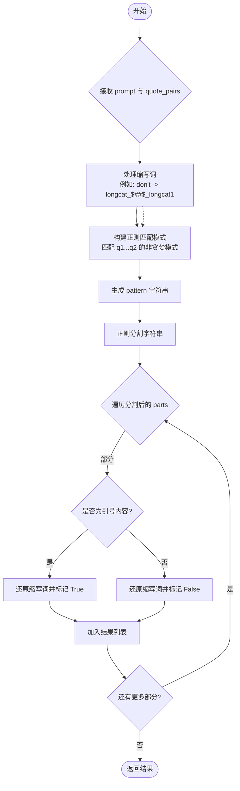

#### 带注释源码

```python
def split_quotation(prompt, quote_pairs=None):
    """
    实现基于正则的字符串分割算法，识别由单引号或双引号定义的定界符。
    例如:
        >>> prompt_en = "Please write 'Hello' on the blackboard for me."
        >>> print(split_quotation(prompt_en))
        >>> # 输出: [('Please write ', False), ("'Hello'", True), (' on the blackboard for me.', False)]
    """
    # 1. 处理英文撇号 (Apostrophe) 构成的缩写，避免被误判为引号
    # 匹配如 "don't", "it's" 等模式
    word_internal_quote_pattern = re.compile(r"[a-zA-Z]+'[a-zA-Z]+")
    matches_word_internal_quote_pattern = word_internal_quote_pattern.findall(prompt)
    mapping_word_internal_quote = []

    # 将所有找到的缩写词替换为临时占位符
    for i, word_src in enumerate(set(matches_word_internal_quote_pattern)):
        word_tgt = "longcat_$##$_longcat" * (i + 1)  # 生成唯一占位符
        prompt = prompt.replace(word_src, word_tgt)
        mapping_word_internal_quote.append([word_src, word_tgt])

    # 2. 设置默认引号对（如果未提供）
    if quote_pairs is None:
        quote_pairs = [("'", "'"), ('"', '"'), ("‘", "’"), ("“", "”")]
    
    # 3. 构建正则表达式模式，匹配任意引号对及其内部内容
    # 逻辑：re.escape(q1) + 非q1或q2的任意字符 + re.escape(q2)
    pattern = "|".join([re.escape(q1) + r"[^" + re.escape(q1 + q2) + r"]*?" + re.escape(q2) for q1, q2 in quote_pairs])
    
    # 4. 使用正则分割字符串
    parts = re.split(f"({pattern})", prompt)

    # 5. 还原缩写词并判断属性
    result = []
    for part in parts:
        # 还原临时占位符为原来的缩写
        for word_src, word_tgt in mapping_word_internal_quote:
            part = part.replace(word_tgt, word_src)
        
        # 判断当前片段是否符合引号模式
        if re.match(pattern, part):
            if len(part):
                result.append((part, True))  # True 表示该部分被引号包围
        else:
            if len(part):
                result.append((part, False)) # False 表示普通文本
    
    return result
```


### `prepare_pos_ids`

该函数用于生成不同模态（文本或图像）的位置标识符（position IDs），返回一个包含 modality_id、y 坐标和 x 坐标的 3D 张量，支持文本序列位置和图像空间位置的编码。

参数：

- `modality_id`：`int`，模态标识符，用于区分不同模态（如文本=0、图像latent=1、图像输入=2）
- `type`：`str`，类型标识，可选值为 `"text"` 或 `"image"`，默认为 `"text"`
- `start`：`tuple[int, int]`，起始坐标，默认为 `(0, 0)`
- `num_token`：`int | None`，文本类型的 token 数量，当 type 为 "text" 时必需
- `height`：`int | None`，图像高度，当 type 为 "image" 时必需
- `width`：`int | None`，图像宽度，当 type 为 "image" 时必需

返回值：`torch.Tensor`，形状为 `(num_token, 3)`（文本类型）或 `(height*width, 3)`（图像类型）的位置标识符张量，每行包含 `[modality_id, y, x]`

#### 流程图

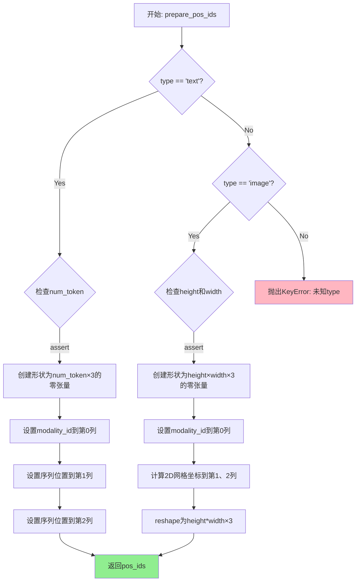

#### 带注释源码

```python
# Copied from diffusers.pipelines.longcat_image.pipeline_longcat_image.prepare_pos_ids
def prepare_pos_ids(modality_id=0, type="text", start=(0, 0), num_token=None, height=None, width=None):
    """
    生成不同模态的位置标识符（position IDs）
    
    Args:
        modality_id: 模态标识符，用于区分不同数据类型（文本/图像latent/图像输入）
        type: 类型，"text"或"image"
        start: 起始坐标偏移量
        num_token: 文本token数量（type="text"时必需）
        height: 图像高度（type="image"时必需）
        width: 图像宽度（type="image"时必需）
    
    Returns:
        torch.Tensor: 位置标识符张量，形状为(num_token, 3)或(height*width, 3)
    """
    if type == "text":
        # 文本类型：生成1D序列位置
        assert num_token  # 必须提供token数量
        if height or width:
            print('Warning: The parameters of height and width will be ignored in "text" type.')
        
        # 创建[num_token, 3]形状的张量，每行存储[modality_id, y, x]
        pos_ids = torch.zeros(num_token, 3)
        pos_ids[..., 0] = modality_id  # 第0列：模态ID
        pos_ids[..., 1] = torch.arange(num_token) + start[0]  # 第1列：行索引（这里实际是序列位置）
        pos_ids[..., 2] = torch.arange(num_token) + start[1]  # 第2列：列索引（这里实际是序列位置）
    
    elif type == "image":
        # 图像类型：生成2D空间位置
        assert height and width  # 必须提供高度和宽度
        if num_token:
            print('Warning: The parameter of num_token will be ignored in "image" type.')
        
        # 创建[height, width, 3]形状的张量
        pos_ids = torch.zeros(height, width, 3)
        pos_ids[..., 0] = modality_id  # 第0列：模态ID
        
        # 计算2D网格坐标：torch.arange(height)[:, None]创建列向量，torch.arange(width)[None, :]创建行向量
        # broadcasting自动产生height×width的网格
        pos_ids[..., 1] = pos_ids[..., 1] + torch.arange(height)[:, None] + start[0]  # 第1列：y坐标（行）
        pos_ids[..., 2] = pos_ids[..., 2] + torch.arange(width)[None, :] + start[1]   # 第2列：x坐标（列）
        
        # 展平为[height*width, 3]形状，便于与文本token连接
        pos_ids = pos_ids.reshape(height * width, 3)
    else:
        raise KeyError(f'Unknow type {type}, only support "text" or "image".')
    
    return pos_ids
```


### `calculate_shift`

该函数用于计算图像序列长度的偏移量（shift），通过线性插值方法基于给定的基准序列长度、最大序列长度、基准偏移量和最大偏移量，计算出与当前图像序列长度对应的偏移量值。该函数主要应用于扩散模型的调度器配置中，用于动态调整噪声调度参数。

参数：

- `image_seq_len`：`int`，图像序列长度，表示输入图像经处理后的序列长度
- `base_seq_len`：`int = 256`，基准序列长度，用于线性插值的起始点
- `max_seq_len`：`int = 4096`，最大序列长度，用于线性插值的终点
- `base_shift`：`float = 0.5`，基准偏移量，对应基准序列长度的偏移值
- `max_shift`：`float = 1.15`，最大偏移量，对应最大序列长度的偏移值

返回值：`float`，计算得到的偏移量 mu，表示根据图像序列长度线性插值计算出的偏移值

#### 流程图

```mermaid
flowchart TD
    A[开始] --> B[计算斜率 m = (max_shift - base_shift) / (max_seq_len - base_seq_len)]
    B --> C[计算截距 b = base_shift - m * base_seq_len]
    C --> D[计算偏移量 mu = image_seq_len * m + b]
    D --> E[返回 mu]
```

#### 带注释源码

```python
# Copied from diffusers.pipelines.longcat_image.pipeline_longcat_image.calculate_shift
def calculate_shift(
    image_seq_len,          # 输入的图像序列长度
    base_seq_len: int = 256,    # 基准序列长度，默认256
    max_seq_len: int = 4096,    # 最大序列长度，默认4096
    base_shift: float = 0.5,    # 基准偏移量，默认0.5
    max_shift: float = 1.15,    # 最大偏移量，默认1.15
):
    # 计算线性插值的斜率 m
    # 斜率 = (最大偏移量 - 基准偏移量) / (最大序列长度 - 基准序列长度)
    m = (max_shift - base_shift) / (max_seq_len - base_seq_len)
    
    # 计算线性插值的截距 b
    # 截距 = 基准偏移量 - 斜率 * 基准序列长度
    b = base_shift - m * base_seq_len
    
    # 根据图像序列长度计算偏移量 mu
    # 使用线性方程: mu = image_seq_len * m + b
    mu = image_seq_len * m + b
    
    # 返回计算得到的偏移量
    return mu
```


### `retrieve_timesteps`

该函数是扩散模型管道中的辅助函数，用于调用调度器的 `set_timesteps` 方法并从调度器中检索时间步。它支持自定义时间步和自定义信噪比（sigmas），并提供参数校验和错误处理。

参数：

- `scheduler`：`SchedulerMixin`，要获取时间步的调度器对象
- `num_inference_steps`：`int | None`，生成样本时使用的扩散步数，如果使用此参数则 `timesteps` 必须为 `None`
- `device`：`str | torch.device | None`，时间步要移动到的设备，如果为 `None` 则不移动
- `timesteps`：`list[int] | None`，用于覆盖调度器时间步间隔策略的自定义时间步，如果传递此参数则 `num_inference_steps` 和 `sigmas` 必须为 `None`
- `sigmas`：`list[float] | None`，用于覆盖调度器时间步间隔策略的自定义信噪比，如果传递此参数则 `num_inference_steps` 和 `timesteps` 必须为 `None`
- `**kwargs`：任意关键字参数，将传递给 `scheduler.set_timesteps`

返回值：`tuple[torch.Tensor, int]`，元组包含调度器的时间步调度和推理步数

#### 流程图

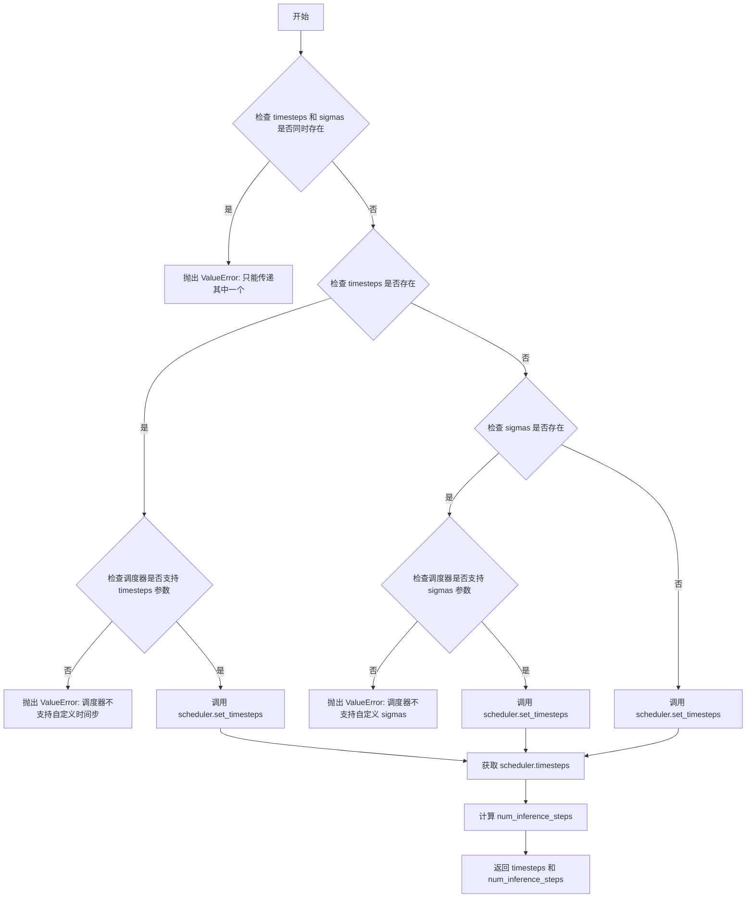

#### 带注释源码

```python
# Copied from diffusers.pipelines.stable_diffusion.pipeline_stable_diffusion.retrieve_timesteps
def retrieve_timesteps(
    scheduler,
    num_inference_steps: int | None = None,
    device: str | torch.device | None = None,
    timesteps: list[int] | None = None,
    sigmas: list[float] | None = None,
    **kwargs,
):
    r"""
    Calls the scheduler's `set_timesteps` method and retrieves timesteps from the scheduler after the call. Handles
    custom timesteps. Any kwargs will be supplied to `scheduler.set_timesteps`.

    Args:
        scheduler (`SchedulerMixin`):
            The scheduler to get timesteps from.
        num_inference_steps (`int`):
            The number of diffusion steps used when generating samples with a pre-trained model. If used, `timesteps`
            must be `None`.
        device (`str` or `torch.device`, *optional*):
            The device to which the timesteps should be moved to. If `None`, the timesteps are not moved.
        timesteps (`list[int]`, *optional*):
            Custom timesteps used to override the timestep spacing strategy of the scheduler. If `timesteps` is passed,
            `num_inference_steps` and `sigmas` must be `None`.
        sigmas (`list[float]`, *optional*):
            Custom sigmas used to override the timestep spacing strategy of the scheduler. If `sigmas` is passed,
            `num_inference_steps` and `timesteps` must be `None`.

    Returns:
        `tuple[torch.Tensor, int]`: A tuple where the first element is the timestep schedule from the scheduler and the
        second element is the number of inference steps.
    """
    # 校验：timesteps 和 sigmas 不能同时传递
    if timesteps is not None and sigmas is not None:
        raise ValueError("Only one of `timesteps` or `sigmas` can be passed. Please choose one to set custom values")
    
    # 分支1：使用自定义 timesteps
    if timesteps is not None:
        # 检查调度器的 set_timesteps 方法是否接受 timesteps 参数
        accepts_timesteps = "timesteps" in set(inspect.signature(scheduler.set_timesteps).parameters.keys())
        if not accepts_timesteps:
            raise ValueError(
                f"The current scheduler class {scheduler.__class__}'s `set_timesteps` does not support custom"
                f" timestep schedules. Please check whether you are using the correct scheduler."
            )
        # 调用调度器的 set_timesteps 方法设置自定义时间步
        scheduler.set_timesteps(timesteps=timesteps, device=device, **kwargs)
        # 从调度器获取时间步
        timesteps = scheduler.timesteps
        # 计算推理步数
        num_inference_steps = len(timesteps)
    
    # 分支2：使用自定义 sigmas
    elif sigmas is not None:
        # 检查调度器的 set_timesteps 方法是否接受 sigmas 参数
        accept_sigmas = "sigmas" in set(inspect.signature(scheduler.set_timesteps).parameters.keys())
        if not accept_sigmas:
            raise ValueError(
                f"The current scheduler class {scheduler.__class__}'s `set_timesteps` does not support custom"
                f" sigmas schedules. Please check whether you are using the correct scheduler."
            )
        # 调用调度器的 set_timesteps 方法设置自定义信噪比
        scheduler.set_timesteps(sigmas=sigmas, device=device, **kwargs)
        # 从调度器获取时间步
        timesteps = scheduler.timesteps
        # 计算推理步数
        num_inference_steps = len(timesteps)
    
    # 分支3：使用默认的 num_inference_steps
    else:
        # 调用调度器的 set_timesteps 方法设置推理步数
        scheduler.set_timesteps(num_inference_steps, device=device, **kwargs)
        # 从调度器获取时间步
        timesteps = scheduler.timesteps
    
    # 返回时间步和推理步数
    return timesteps, num_inference_steps
```


### `retrieve_latents`

从编码器输出中提取潜在表示（latents）的工具函数，根据 `sample_mode` 参数采用不同的采样策略（随机采样或确定性取模）。

参数：

- `encoder_output`：`torch.Tensor`，编码器输出对象，必须包含 `latent_dist` 属性或 `latents` 属性
- `generator`：`torch.Generator | None`，可选的随机数生成器，用于随机采样模式下的复现性
- `sample_mode`：`str`，采样模式，"sample" 表示从分布中随机采样，"argmax" 表示取分布的均值/众数，默认为 "sample"

返回值：`torch.Tensor`，提取出的潜在表示向量

#### 流程图

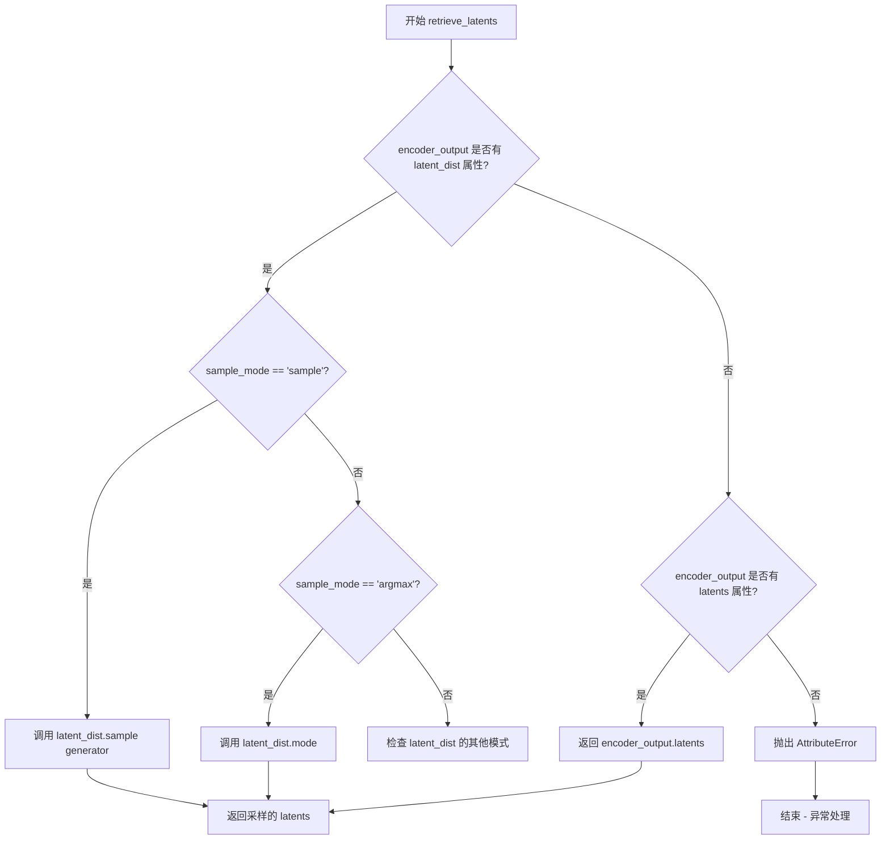

#### 带注释源码

```python
# Copied from diffusers.pipelines.stable_diffusion.pipeline_stable_diffusion_img2img.retrieve_latents
def retrieve_latents(
    encoder_output: torch.Tensor, generator: torch.Generator | None = None, sample_mode: str = "sample"
):
    """
    从编码器输出中提取潜在表示（latents）。
    
    该函数支持三种提取模式：
    1. 从 latent_dist 分布中随机采样（sample_mode="sample"）
    2. 从 latent_dist 分布中取均值/众数（sample_mode="argmax"）
    3. 直接返回预计算的 latents 属性
    
    Args:
        encoder_output: 编码器输出对象，通常包含 latent_dist（潜在分布）或 latents（预计算潜在向量）
        generator: 可选的 PyTorch 随机数生成器，用于确保采样过程的可复现性
        sample_mode: 字符串，指定采样模式，"sample" 或 "argmax"，默认为 "sample"
    
    Returns:
        torch.Tensor: 提取出的潜在表示向量
    
    Raises:
        AttributeError: 当 encoder_output 既没有 latent_dist 属性也没有 latents 属性时抛出
    """
    # 情况1：编码器输出包含 latent_dist 属性，且要求随机采样
    if hasattr(encoder_output, "latent_dist") and sample_mode == "sample":
        # 从潜在分布中随机采样，可使用 generator 确保可复现性
        return encoder_output.latent_dist.sample(generator)
    # 情况2：编码器输出包含 latent_dist 属性，且要求确定性取模（取分布的均值/众数）
    elif hasattr(encoder_output, "latent_dist") and sample_mode == "argmax":
        # 取潜在分布的模式（通常是均值），返回确定性结果
        return encoder_output.latent_dist.mode()
    # 情况3：编码器输出直接包含预计算的 latents 属性
    elif hasattr(encoder_output, "latents"):
        # 直接返回预计算的潜在向量
        return encoder_output.latents
    # 异常情况：无法从编码器输出中提取潜在表示
    else:
        raise AttributeError("Could not access latents of provided encoder_output")
```


### `calculate_dimensions`

该函数根据目标面积和宽高比计算图像的宽度和高度，并确保尺寸满足16位对齐要求（常见于深度学习模型的潜空间表示要求），返回整型化的宽度和高度值。

参数：

- `target_area`：`int` 或 `float`，目标面积，用于计算图像的总像素数
- `ratio`：`float`，宽高比（width/height），用于确定宽度和高度的比例关系

返回值：`tuple[int, int]`，返回整型化的宽度和高度，均已对齐到16的倍数

#### 流程图

```mermaid
flowchart TD
    A[开始: calculate_dimensions] --> B[计算宽度<br>width = sqrt(target_area × ratio)]
    B --> C[计算高度<br>height = width / ratio]
    C --> D{width % 16 == 0?}
    D -->|是| E[保留原 width]
    D -->|否| F[对齐到16倍数<br>width = (width // 16 + 1) × 16]
    E --> G{height % 16 == 0?}
    F --> G
    G -->|是| H[保留原 height]
    G -->|否| I[对齐到16倍数<br>height = (height // 16 + 1) × 16]
    H --> J[转换为整型<br>width = int(width)<br>height = int(height)]
    I --> J
    J --> K[返回 (width, height)]
```

#### 带注释源码

```python
def calculate_dimensions(target_area, ratio):
    """
    根据目标面积和宽高比计算图像尺寸，并确保尺寸对齐到16的倍数。
    
    该函数主要用于图像生成pipeline中，确保生成的图像尺寸符合
    VAE和Transformer模型的潜在空间表示要求（通常需要8x或16x对齐）。
    
    Args:
        target_area: 目标面积（像素总数），例如 1024*1024=1048576
        ratio: 宽高比 (width/height)，用于确定宽度和高度的比例
    
    Returns:
        tuple: (width, height) 整型化的宽度和高度，均已对齐到16的倍数
    """
    # 根据面积和比例计算宽度: width = sqrt(target_area * ratio)
    # 推导: area = width * height, ratio = width/height
    #       => height = width/ratio => area = width * (width/ratio)
    #       => area = width²/ratio => width = sqrt(area * ratio)
    width = math.sqrt(target_area * ratio)
    
    # 根据宽度和比例计算高度: height = width / ratio
    height = width / ratio

    # 确保宽度是16的倍数，不足则向上取整到16的倍数
    # 这是因为VAE通常有8x压缩，Transformer可能需要16x下采样
    width = width if width % 16 == 0 else (width // 16 + 1) * 16
    
    # 确保高度是16的倍数，不足则向上取整到16的倍数
    height = height if height % 16 == 0 else (height // 16 + 1) * 16

    # 转换为整型返回，符合图像尺寸的整数要求
    width = int(width)
    height = int(height)

    return width, height
```


### `LongCatImageEditPipeline.__init__`

该方法是 `LongCatImageEditPipeline` 类的构造函数，负责初始化图像编辑管道所需的所有组件，包括调度器、VAE模型、文本编码器、分词器、图像处理器和Transformer模型，并注册这些模块以及设置图像处理的配置参数。

参数：

- `scheduler`：`FlowMatchEulerDiscreteScheduler`，用于扩散模型的调度器
- `vae`：`AutoencoderKL`，用于编码和解码图像的变分自编码器模型
- `text_encoder`：`Qwen2_5_VLForConditionalGeneration`，用于编码文本提示和图像的多模态编码器
- `tokenizer`：`Qwen2Tokenizer`，用于分词文本输入
- `text_processor`：`Qwen2VLProcessor`，用于处理视觉语言任务的图像处理器
- `transformer`：`LongCatImageTransformer2DModel`，用于去噪的Transformer模型

返回值：`None`，该方法为构造函数，不返回任何值

#### 流程图

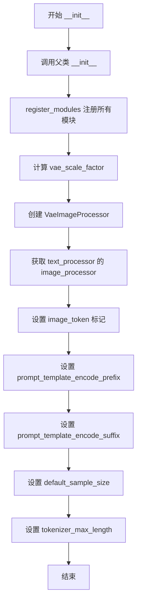

#### 带注释源码

```python
def __init__(
    self,
    scheduler: FlowMatchEulerDiscreteScheduler,
    vae: AutoencoderKL,
    text_encoder: Qwen2_5_VLForConditionalGeneration,
    tokenizer: Qwen2Tokenizer,
    text_processor: Qwen2VLProcessor,
    transformer: LongCatImageTransformer2DModel,
):
    """
    初始化 LongCatImageEditPipeline 管道
    
    参数:
        scheduler: FlowMatchEulerDiscreteScheduler 调度器实例
        vae: AutoencoderKL VAE模型实例
        text_encoder: Qwen2_5_VLForConditionalGeneration 文本编码器实例
        tokenizer: Qwen2Tokenizer 分词器实例
        text_processor: Qwen2VLProcessor 文本处理器实例
        transformer: LongCatImageTransformer2DModel Transformer模型实例
    """
    # 调用父类 DiffusionPipeline 的初始化方法
    super().__init__()

    # 注册所有模块到管道中，便于后续管理和访问
    self.register_modules(
        vae=vae,
        text_encoder=text_encoder,
        tokenizer=tokenizer,
        transformer=transformer,
        scheduler=scheduler,
        text_processor=text_processor,
    )

    # 计算 VAE 的缩放因子，基于 VAE 的 block_out_channels 配置
    # 如果 VAE 存在则计算，否则默认为 8
    self.vae_scale_factor = 2 ** (len(self.vae.config.block_out_channels) - 1) if getattr(self, "vae", None) else 8
    
    # 创建图像处理器，使用 2 倍的 vae_scale_factor
    self.image_processor = VaeImageProcessor(vae_scale_factor=self.vae_scale_factor * 2)
    
    # 从 text_processor 获取视觉语言图像处理器
    self.image_processor_vl = text_processor.image_processor

    # 定义图像 token 标记，用于在提示模板中占位
    self.image_token = "<|image_pad|>"
    
    # 定义编码前缀模板，包含系统指令和用户输入格式
    self.prompt_template_encode_prefix = "<|im_start|>system\nAs an image editing expert, first analyze the content and attributes of the input image(s). Then, based on the user's editing instructions, clearly and precisely determine how to modify the given image(s), ensuring that only the specified parts are altered and all other aspects remain consistent with the original(s).<|im_end|>\n<|im_start|>user\n<|vision_start|><|image_pad|><|vision_end|>"
    
    # 定义编码后缀模板，用于助手回复格式
    self.prompt_template_encode_suffix = "<|im_end|>\n<|im_start|>assistant\n"
    
    # 设置默认采样尺寸
    self.default_sample_size = 128
    
    # 设置分词器最大长度限制
    self.tokenizer_max_length = 512
```


### `LongCatImageEditPipeline._encode_prompt`

该方法负责将用户输入的提示词（prompt）和输入图像编码为文本嵌入（text embeddings），以供后续的图像编辑扩散模型使用。它首先对图像进行视觉处理，然后通过分词器和文本编码器（Qwen2.5-VL）生成包含视觉信息的文本嵌入表示。

参数：

- `prompt`：`list[str]`，用户输入的提示词列表，通常为单个元素的列表
- `image`：`torch.Tensor`，输入的图像张量

返回值：`torch.Tensor`，形状为 `[batch, seq_len, hidden_size]` 的文本嵌入张量，包含已编码的提示词信息和图像特征

#### 流程图

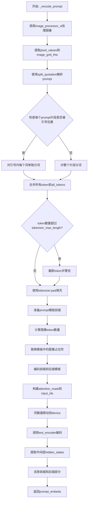

#### 带注释源码

```python
def _encode_prompt(self, prompt, image):
    """
    将提示词和图像编码为文本嵌入向量
    
    参数:
        prompt: 用户提示词列表，通常为单元素列表 [prompt_str]
        image: 输入图像张量
    返回:
        prompt_embeds: 编码后的文本嵌入，形状为 [batch, seq_len, hidden_dim]
    """
    # Step 1: 使用图像处理器提取视觉特征
    # 返回包含pixel_values（像素值）和image_grid_thw（图像网格时间高度宽度）
    raw_vl_input = self.image_processor_vl(images=image, return_tensors="pt")
    pixel_values = raw_vl_input["pixel_values"]
    image_grid_thw = raw_vl_input["image_grid_thw"]
    
    # Step 2: 解析提示词，处理引号内的文本
    # split_quotation会将文本按引号分割，返回(文本片段, 是否被引号包裹)的元组列表
    all_tokens = []
    for clean_prompt_sub, matched in split_quotation(prompt[0]):
        if matched:
            # 如果片段被引号包裹，对每个单词单独分词
            for sub_word in clean_prompt_sub:
                tokens = self.tokenizer(sub_word, add_special_tokens=False)["input_ids"]
                all_tokens.extend(tokens)
        else:
            # 正常分词
            tokens = self.tokenizer(clean_prompt_sub, add_special_tokens=False)["input_ids"]
            all_tokens.extend(tokens)
    
    # Step 3: 检查token长度是否超限，如果超限则截断
    if len(all_tokens) > self.tokenizer_max_length:
        logger.warning(
            "Your input was truncated because `max_sequence_length` is set to "
            f" {self.tokenizer_max_length} input token nums : {len(len(all_tokens))}"
        )
        all_tokens = all_tokens[: self.tokenizer_max_length]
    
    # Step 4: 使用tokenizer.pad将token序列填充到固定长度
    text_tokens_and_mask = self.tokenizer.pad(
        {"input_ids": [all_tokens]},
        max_length=self.tokenizer_max_length,
        padding="max_length",
        return_attention_mask=True,
        return_tensors="pt",
    )
    
    # Step 5: 处理prompt模板，替换图像占位符
    # 模板前缀包含系统指令和视觉起始标记
    text = self.prompt_template_encode_prefix
    
    # 计算需要替换的图像token数量
    # merge_size的平方表示每个图像patch对应的token数
    merge_length = self.image_processor_vl.merge_size**2
    while self.image_token in text:
        num_image_tokens = image_grid_thw.prod() // merge_length
        # 临时用<|placeholder|>替换，用于计算数量
        text = text.replace(self.image_token, "<|placeholder|>" * num_image_tokens, 1)
    # 最后将所有<|placeholder|>替换回实际的图像token标记
    text = text.replace("<|placeholder|>", self.image_token)
    
    # Step 6: 编码前缀和后缀模板
    prefix_tokens = self.tokenizer(text, add_special_tokens=False)["input_ids"]
    suffix_tokens = self.tokenizer(self.prompt_template_encode_suffix, add_special_tokens=False)["input_ids"]
    
    # Step 7: 找到视觉起始标记的位置，用于后续提取嵌入
    vision_start_token_id = self.tokenizer.convert_tokens_to_ids("<|vision_start|>")
    prefix_len = prefix_tokens.index(vision_start_token_id)
    suffix_len = len(suffix_tokens)
    
    # Step 8: 创建前缀和后缀的attention mask（全1，因为都重要）
    prefix_tokens_mask = torch.tensor([1] * len(prefix_tokens), dtype=text_tokens_and_mask.attention_mask[0].dtype)
    suffix_tokens_mask = torch.tensor([1] * len(suffix_tokens), dtype=text_tokens_and_mask.attention_mask[0].dtype)
    
    # Step 9: 转换为torch tensor
    prefix_tokens = torch.tensor(prefix_tokens, dtype=text_tokens_and_mask.input_ids.dtype)
    suffix_tokens = torch.tensor(suffix_tokens, dtype=text_tokens_and_mask.input_ids.dtype)
    
    # Step 10: 拼接所有部分：前缀 + 提示词tokens + 后缀
    input_ids = torch.cat((prefix_tokens, text_tokens_and_mask.input_ids[0], suffix_tokens), dim=-1)
    attention_mask = torch.cat(
        (prefix_tokens_mask, text_tokens_and_mask.attention_mask[0], suffix_tokens_mask), dim=-1
    )
    
    # Step 11: 添加batch维度并移动到设备
    input_ids = input_ids.unsqueeze(0).to(self.device)
    attention_mask = attention_mask.unsqueeze(0).to(self.device)
    
    pixel_values = pixel_values.to(self.device)
    image_grid_thw = image_grid_thw.to(self.device)
    
    # Step 12: 调用Qwen2.5-VL文本编码器
    text_output = self.text_encoder(
        input_ids=input_ids,
        attention_mask=attention_mask,
        pixel_values=pixel_values,
        image_grid_thw=image_grid_thw,
        output_hidden_states=True,
    )
    
    # Step 13: 提取最后一层隐藏状态并去除前缀和后缀
    # shape: [max_sequence_length, batch, hidden_size] -> [batch, max_sequence_length, hidden_size]
    # clone创建连续张量，detach脱离计算图
    prompt_embeds = text_output.hidden_states[-1].detach()
    # 去除系统前缀和助手后缀，只保留用户提示词对应的嵌入
    prompt_embeds = prompt_embeds[:, prefix_len:-suffix_len, :]
    
    return prompt_embeds
```


### `LongCatImageEditPipeline.encode_prompt`

该方法是LongCat-Image-EditPipeline的核心组成部分，负责将文本提示和图像编码为模型可处理的嵌入向量（prompt_embeds）和位置ID（text_ids），支持批量生成和每个提示生成多张图像的功能。

参数：

- `prompt`：`list[str] | str | None`，用户输入的文本提示，可以是单个字符串或字符串列表，用于描述期望的图像编辑操作
- `image`：`torch.Tensor | None`，输入的图像张量，作为图像编辑的参考和条件
- `num_images_per_prompt`：`int | None = 1`，每个提示词生成的图像数量，用于批量生成
- `prompt_embeds`：`torch.Tensor | None`，可选的预计算文本嵌入，如果提供则跳过编码过程

返回值：`tuple[torch.Tensor, torch.Tensor]`，返回包含文本嵌入向量和对应位置ID的元组，其中第一个元素是`prompt_embeds`（形状为`[batch_size * num_images_per_prompt, seq_len, hidden_dim]`的文本嵌入张量），第二个元素是`text_ids`（用于表示文本位置信息的张量）

#### 流程图

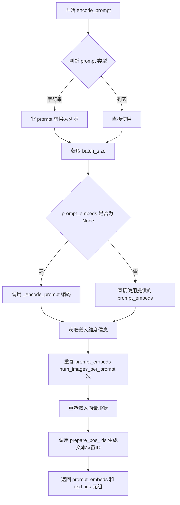

#### 带注释源码

```python
def encode_prompt(
    self,
    prompt: list[str] = None,
    image: torch.Tensor | None = None,
    num_images_per_prompt: int | None = 1,
    prompt_embeds: torch.Tensor | None = None,
):
    """
    编码文本提示和可选图像为模型可处理的嵌入向量。
    
    该方法支持两种工作模式：
    1. 当 prompt_embeds 为 None 时，调用内部方法 _encode_prompt 进行编码
    2. 当 prompt_embeds 已提供时，直接使用提供的嵌入而跳过编码过程
    
    参数:
        prompt: 用户输入的文本提示，支持字符串或字符串列表
        image: 可选的输入图像张量，用于图像编辑任务
        num_images_per_prompt: 每个提示生成的图像数量，默认为1
        prompt_embeds: 可选的预计算文本嵌入，用于复用已编码的结果
        
    返回:
        包含文本嵌入和位置ID的元组
    """
    # 标准化prompt为列表格式：如果输入是字符串则转换为单元素列表
    prompt = [prompt] if isinstance(prompt, str) else prompt
    # 计算批处理大小
    batch_size = len(prompt)
    
    # 如果未提供预计算的prompt_embeds，则调用内部编码方法进行编码
    if prompt_embeds is None:
        prompt_embeds = self._encode_prompt(prompt, image)

    # 获取嵌入向量的序列长度维度信息
    _, seq_len, _ = prompt_embeds.shape
    
    # 为每个提示复制对应的嵌入向量，支持批量生成多张图像
    # 使用repeat和view操作以兼容MPS（Apple Silicon）设备
    prompt_embeds = prompt_embeds.repeat(1, num_images_per_prompt, 1)
    # 重塑嵌入向量形状：[batch, num_images_per_prompt, seq_len, hidden] -> [batch * num_images_per_prompt, seq_len, hidden]
    prompt_embeds = prompt_embeds.view(batch_size * num_images_per_prompt, seq_len, -1)

    # 生成文本位置ID，用于transformer模型中的位置编码
    # modality_id=0 表示文本模态，type="text" 指定为文本类型
    text_ids = prepare_pos_ids(
        modality_id=0, 
        type="text", 
        start=(0, 0), 
        num_token=prompt_embeds.shape[1]
    ).to(self.device)
    
    # 返回编码后的文本嵌入和对应的位置ID
    return prompt_embeds, text_ids
```


### `LongCatImageEditPipeline._pack_latents`

该函数是一个静态方法，用于将 latent 张量进行空间打包（packing），将 2×2 的空间块合并为序列维度，以便于后续 Vision Transformer 的处理。

参数：

- `latents`：`torch.Tensor`，输入的 latent 张量，形状为 (batch_size, num_channels_latents, height, width)
- `batch_size`：`int`，批次大小
- `num_channels_latents`：`int`，latent 通道数
- `height`：`int`，latent 空间高度
- `width`：`int`，latent 空间宽度

返回值：`torch.Tensor`，打包后的 latent 张量，形状为 (batch_size, (height // 2) * (width // 2), num_channels_latents * 4)

#### 流程图

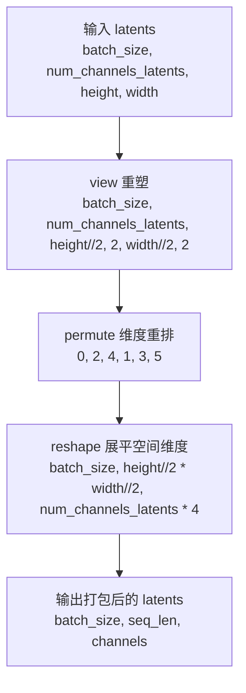

#### 带注释源码

```python
@staticmethod
def _pack_latents(latents, batch_size, num_channels_latents, height, width):
    """
    将 latent 张量进行空间打包，将 2x2 的空间块合并为序列维度。
    
    这是 Vision Transformer 架构中常用的技术，将空间信息编码到序列维度中。
    打包后每个 2x2 块被合并为一个 token，通道数变为原来的 4 倍。
    
    参数:
        latents: 输入张量，形状为 (batch_size, num_channels_latents, height, width)
        batch_size: 批次大小
        num_channels_latents: latent 通道数
        height: 空间高度
        width: 空间宽度
    
    返回:
        打包后的张量，形状为 (batch_size, (height//2)*(width//2), num_channels_latents*4)
    """
    # 第一步：重塑张量，将 height 和 width 各分为两部分，并在中间插入维度 2
    # 将 (B, C, H, W) -> (B, C, H//2, 2, W//2, 2)
    latents = latents.view(batch_size, num_channels_latents, height // 2, 2, width // 2, 2)
    
    # 第二步：置换维度顺序，将空间维度移到前面
    # (B, C, H//2, 2, W//2, 2) -> (B, H//2, W//2, C, 2, 2)
    latents = latents.permute(0, 2, 4, 1, 3, 5)
    
    # 第三步：重塑为最终的打包形式
    # 将 2x2 的空间块展平为序列长度，通道数乘以 4
    # (B, H//2, W//2, C, 2, 2) -> (B, H//2*W//2, C*4)
    latents = latents.reshape(batch_size, (height // 2) * (width // 2), num_channels_latents * 4)

    return latents
```


### `LongCatImageEditPipeline._unpack_latents`

该函数是`LongCatImageEditPipeline`管道类中的一个静态方法，主要用于将打包（packed）后的latent张量解包（unpack）回标准的4D张量格式。由于VAE对图像进行了8倍压缩，且打包操作要求latent的高度和宽度能被2整除，因此该方法需要逆向执行`_pack_latents`的操作，恢复原始的通道数和空间维度，以便后续进行VAE解码。

参数：

- `latents`：`torch.Tensor`，打包后的latent张量，形状为(batch_size, num_patches, channels)，其中num_patches = (height // 2) * (width // 2)，channels = num_channels_latents * 4
- `height`：`int`，原始图像的高度（像素空间）
- `width`：`int`，原始图像的宽度（像素空间）
- `vae_scale_factor`：`int`，VAE的缩放因子，用于计算latent空间的实际尺寸

返回值：`torch.Tensor`，解包后的latent张量，形状为(batch_size, channels // 4, latent_height, latent_width)，即标准的多通道潜在表示

#### 流程图

```mermaid
flowchart TD
    A[输入打包latents: (batch_size, num_patches, channels)] --> B[计算实际latent高度和宽度<br/>height = 2 * (height // (vae_scale_factor * 2))<br/>width = 2 * (width // (vae_scale_factor * 2))]
    B --> C[View操作: reshape为<br/>(batch_size, height//2, width//2, channels//4, 2, 2)]
    C --> D[Permute维度重排: (0, 3, 1, 4, 2, 5)]
    D --> E[Reshape最终输出: (batch_size, channels//4, height, width)]
    E --> F[返回解包后的latents]
    
    style A fill:#e1f5fe
    style F fill:#e8f5e8
```

#### 带注释源码

```python
@staticmethod
def _unpack_latents(latents, height, width, vae_scale_factor):
    """
    将打包的latent张量解包回标准4D张量格式。
    
    打包(packing)操作将标准latent从 (batch, channels, h, w) 压缩为 (batch, h*w, channels*4)，
    本函数执行逆操作以恢复原始形状用于VAE解码。
    
    Args:
        latents: 打包后的latent张量，形状为 (batch_size, num_patches, channels)
        height: 原始图像高度（像素空间）
        width: 原始图像宽度（像素空间）
        vae_scale_factor: VAE缩放因子，通常为8
    
    Returns:
        解包后的latent张量，形状为 (batch_size, channels//4, height, width)
    """
    batch_size, num_patches, channels = latents.shape

    # VAE对图像应用8倍压缩，但还需要考虑packing操作要求
    # latent高度和宽度能被2整除，因此需要额外乘以2
    # 例如：原始图像1024x1024 -> latent 128x128 (8x压缩) -> packing后需要64x64
    height = 2 * (int(height) // (vae_scale_factor * 2))
    width = 2 * (int(width) // (vae_scale_factor * 2))

    # 第一步：view操作将 (batch, num_patches, channels) 还原为
    # (batch, height//2, width//2, channels//4, 2, 2)
    # 这里height//2和width//2是packing前的空间维度
    # channels//4是packing前的通道数，2x2是每个patch内的分解
    latents = latents.view(batch_size, height // 2, width // 2, channels // 4, 2, 2)
    
    # 第二步：permute操作重新排列维度顺序
    # 从 (batch, h//2, w//2, c//4, 2, 2) -> (batch, c//4, h//2, 2, w//2, 2)
    # 将空间维度与patch维度分离
    latents = latents.permute(0, 3, 1, 4, 2, 5)

    # 第三步：reshape将张量展平为标准4D格式
    # (batch, c//4, h//2, 2, w//2, 2) -> (batch, c//4, h, w)
    latents = latents.reshape(batch_size, channels // (2 * 2), height, width)

    return latents
```


### `LongCatImageEditPipeline._encode_vae_image`

该方法负责将输入的图像张量通过 VAE 编码器转换为潜在空间表示（latents），并进行必要的缩放和偏移处理，以适配后续的扩散模型处理流程。

参数：

- `image`：`torch.Tensor`，输入的图像张量，形状通常为 (batch_size, channels, height, width)
- `generator`：`torch.Generator`，用于随机数生成的 PyTorch 生成器，支持单个生成器或生成器列表，以控制编码过程中的随机性

返回值：`torch.Tensor`，编码后的图像潜在表示，形状为 (batch_size, latent_channels, latent_height, latent_width)

#### 流程图

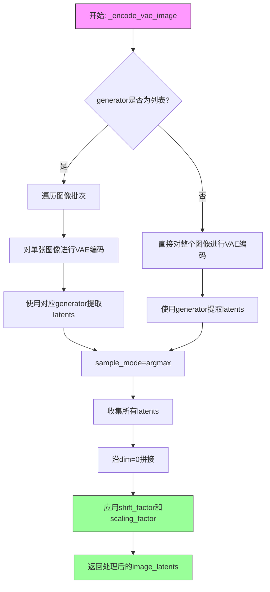

#### 带注释源码

```
def _encode_vae_image(self, image: torch.Tensor, generator: torch.Generator):
    """
    将输入图像编码为VAE潜在表示，并进行缩放处理
    
    参数:
        image: 输入图像张量，形状为 (batch_size, channels, height, width)
        generator: PyTorch随机生成器，用于控制编码过程的随机性
    
    返回:
        编码并缩放后的图像潜在表示张量
    """
    # 判断generator是否为列表（每个样本可能有不同的生成器）
    if isinstance(generator, list):
        # 批量处理：逐个图像编码
        image_latents = [
            # 对单张图像进行VAE编码
            retrieve_latents(
                self.vae.encode(image[i : i + 1]),  # VAE编码器处理单张图像
                generator=generator[i],             # 使用对应的生成器
                sample_mode="argmax"                # 使用argmax模式取最可能的潜在表示
            )
            for i in range(image.shape[0])          # 遍历批次中的每个图像
        ]
        # 将所有图像的latents沿batch维度拼接
        image_latents = torch.cat(image_latents, dim=0)
    else:
        # 单生成器模式：直接对整个图像批次进行编码
        image_latents = retrieve_latents(
            self.vae.encode(image),
            generator=generator,
            sample_mode="argmax"
        )
    
    # 应用VAE的配置参数进行缩放和偏移
    # 这是为了将latents调整到适合扩散模型的数值范围
    image_latents = (image_latents - self.vae.config.shift_factor) * self.vae.config.scaling_factor

    return image_latents
```


### `LongCatImageEditPipeline.prepare_latents`

该方法负责为图像编辑管道准备潜在变量（latents）和图像潜在变量，包括对输入图像进行VAE编码、调整尺寸、填充批次，以及生成位置ID用于Transformer的联合注意力机制。

参数：

- `self`：`LongCatImageEditPipeline` 实例方法的标准隐式参数
- `image`：`torch.Tensor | None`，输入的图像张量，如果为None则不进行图像编码
- `batch_size`：`int`，批次大小，用于确定生成的潜在变量数量
- `num_channels_latents`：`int`，潜在变量的通道数，通常为16
- `height`：`int`，目标图像高度（像素空间）
- `width`：`int`，目标图像宽度（像素空间）
- `dtype`：`torch.dtype`，潜在变量的数据类型
- `prompt_embeds_length`：`int`，文本嵌入序列的长度，用于计算位置ID的起始偏移
- `device`：`torch.device`，计算设备（CPU/CUDA）
- `generator`：`torch.Generator | list[torch.Generator] | None`，随机数生成器，用于复现生成结果
- `latents`：`torch.FloatTensor | None`，可选的预定义潜在变量，如果为None则随机生成

返回值：`tuple[torch.Tensor, torch.Tensor, torch.Tensor, torch.Tensor]`，返回一个包含四个元素的元组：
- `latents`：`torch.Tensor`，处理后的主潜在变量
- `image_latents`：`torch.Tensor | None`，编码后的图像潜在变量（如果提供了图像）
- `latents_ids`：`torch.Tensor`，主潜在变量的位置ID
- `image_latents_ids`：`torch.Tensor | None`，图像潜在变量的位置ID

#### 流程图

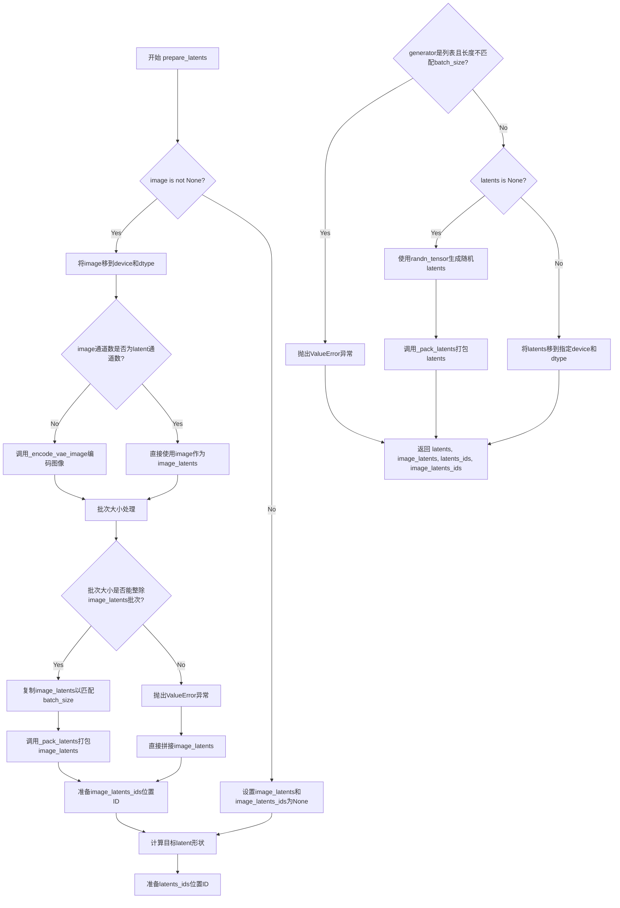

#### 带注释源码

```python
def prepare_latents(
    self,
    image,                      # 输入图像张量或None
    batch_size,                 # 批次大小
    num_channels_latents,       # 潜在通道数（通常为16）
    height,                     # 目标高度（像素空间）
    width,                      # 目标宽度（像素空间）
    dtype,                      # 数据类型
    prompt_embeds_length,       # 文本嵌入序列长度
    device,                     # 计算设备
    generator,                  # 随机数生成器
    latents=None,               # 可选的预定义潜在变量
):
    # VAE对图像应用8x压缩，但我们还需要考虑packing要求
    # latent的高度和宽度需要能被2整除
    # 计算latent空间的高度和宽度
    height = 2 * (int(height) // (self.vae_scale_factor * 2))
    width = 2 * (int(width) // (self.vae_scale_factor * 2))

    # 初始化图像潜在变量及其位置ID为None
    image_latents, image_latents_ids = None, None

    # 如果提供了图像，则进行编码处理
    if image is not None:
        # 将图像移动到指定设备和数据类型
        image = image.to(device=self.device, dtype=dtype)

        # 检查图像通道数是否已经是latent空间的通道数
        if image.shape[1] != self.vae.config.latent_channels:
            # 如果不是，使用VAE编码图像获取潜在变量
            image_latents = self._encode_vae_image(image=image, generator=generator)
        else:
            # 如果已经是latent格式，直接使用
            image_latents = image

        # 处理批次大小不匹配的情况
        if batch_size > image_latents.shape[0] and batch_size % image_latents.shape[0] == 0:
            # 可以整除时，复制图像潜在变量以匹配批次大小
            additional_image_per_prompt = batch_size // image_latents.shape[0]
            image_latents = torch.cat([image_latents] * additional_image_per_prompt, dim=0)
        elif batch_size > image_latents.shape[0] and batch_size % image_latents.shape[0] != 0:
            # 不能整除时抛出错误
            raise ValueError(
                f"Cannot duplicate `image` of batch size {image_latents.shape[0]} to {batch_size} text prompts."
            )
        else:
            # 批次大小匹配或小于图像潜在变量批次，直接拼接
            image_latents = torch.cat([image_latents], dim=0)

        # 打包图像潜在变量（用于Transformer处理）
        image_latents = self._pack_latents(image_latents, batch_size, num_channels_latents, height, width)

        # 准备图像潜在变量的位置ID（modality_id=2表示图像模态）
        image_latents_ids = prepare_pos_ids(
            modality_id=2,
            type="image",
            start=(prompt_embeds_length, prompt_embeds_length),
            height=height // 2,
            width=width // 2,
        ).to(device, dtype=torch.float64)

    # 计算目标潜在变量的形状
    shape = (batch_size, num_channels_latents, height, width)
    
    # 准备主潜在变量的位置ID（modality_id=1表示latent/噪声模态）
    latents_ids = prepare_pos_ids(
        modality_id=1,
        type="image",
        start=(prompt_embeds_length, prompt_embeds_length),
        height=height // 2,
        width=width // 2,
    ).to(device)

    # 验证generator列表长度与批次大小是否匹配
    if isinstance(generator, list) and len(generator) != batch_size:
        raise ValueError(
            f"You have passed a list of generators of length {len(generator)}, but requested an effective batch"
            f" size of {batch_size}. Make sure the batch size matches the length of the generators."
        )

    # 如果没有提供latents，则随机生成
    if latents is None:
        # 使用randn_tensor生成符合正态分布的随机潜在变量
        latents = randn_tensor(shape, generator=generator, device=device, dtype=dtype)
        # 打包生成的随机潜在变量
        latents = self._pack_latents(latents, batch_size, num_channels_latents, height, width)
    else:
        # 使用提供的latents，仅需移动到指定设备和数据类型
        latents = latents.to(device=device, dtype=dtype)

    # 返回：主潜在变量、图像潜在变量、主位置ID、图像位置ID
    return latents, image_latents, latents_ids, image_latents_ids
```


### `LongCatImageEditPipeline.check_inputs`

该方法用于验证图像编辑管道的输入参数合法性，包括检查高度/宽度维度、prompt 与 prompt_embeds 的互斥关系、negative_prompt 与 negative_prompt_embeds 的互斥关系，以及 prompt 的类型和长度是否符合要求。

参数：

- `self`：`LongCatImageEditPipeline`，管道实例本身
- `prompt`：`str | list[str] | None`，编辑指令文本，可以是字符串或长度为 1 的列表
- `height`：`int`，生成图像的高度
- `width`：`int`，生成图像的宽度
- `negative_prompt`：`str | list[str] | None`，可选的反向提示词
- `prompt_embeds`：`torch.FloatTensor | None`，可选的预编码提示词嵌入
- `negative_prompt_embeds`：`torch.FloatTensor | None`，可选的预编码反向提示词嵌入

返回值：`None`，该方法不返回任何值，仅进行参数校验并可能抛出 ValueError 异常

#### 流程图

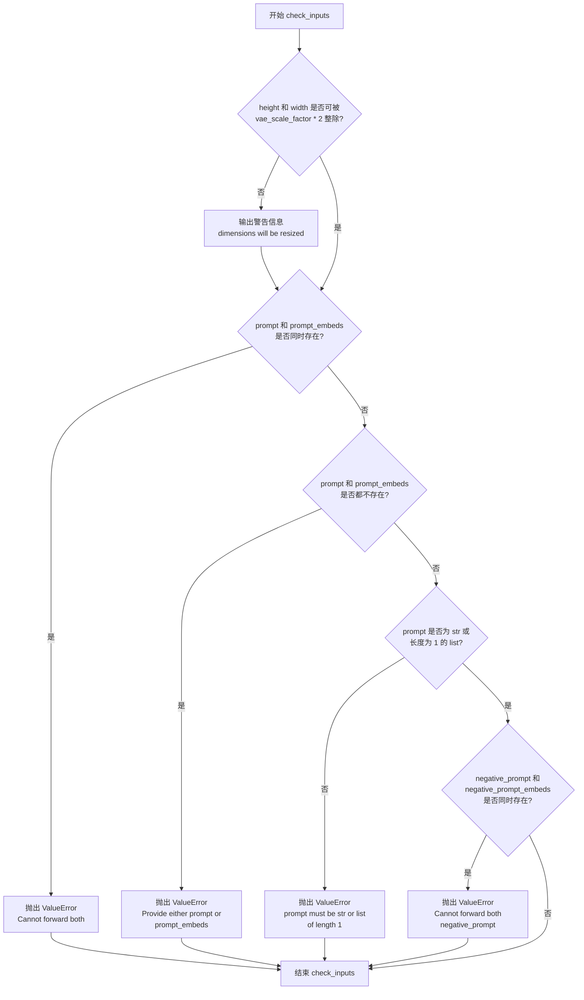

#### 带注释源码

```python
def check_inputs(
    self, prompt, height, width, negative_prompt=None, prompt_embeds=None, negative_prompt_embeds=None
):
    # 检查生成图像的高度和宽度是否能够被 vae_scale_factor * 2 整除
    # 这是因为 VAE 会对图像进行 8x 压缩，而 packing 还需要额外除以 2
    if height % (self.vae_scale_factor * 2) != 0 or width % (self.vae_scale_factor * 2) != 0:
        logger.warning(
            f"`height` and `width` have to be divisible by {self.vae_scale_factor * 2} but are {height} and {width}. Dimensions will be resized accordingly"
        )

    # 校验 prompt 和 prompt_embeds 只能二选一，不能同时提供
    if prompt is not None and prompt_embeds is not None:
        raise ValueError(
            f"Cannot forward both `prompt`: {prompt} and `prompt_embeds`: {prompt_embeds}. Please make sure to"
            " only forward one of the two."
        )
    # 校验 prompt 和 prompt_embeds 至少要提供一个
    elif prompt is None and prompt_embeds is None:
        raise ValueError(
            "Provide either `prompt` or `prompt_embeds`. Cannot leave both `prompt` and `prompt_embeds` undefined."
        )
    # 当提供了 prompt 时，验证其类型必须是字符串或长度为 1 的列表
    elif prompt is not None:
        if isinstance(prompt, str):
            pass
        elif isinstance(prompt, list) and len(prompt) == 1:
            pass
        else:
            raise ValueError(
                f"`prompt` must be a `str` or a `list` of length 1, but is {prompt} (type: {type(prompt)})"
            )

    # 校验 negative_prompt 和 negative_prompt_embeds 只能二选一，不能同时提供
    if negative_prompt is not None and negative_prompt_embeds is not None:
        raise ValueError(
            f"Cannot forward both `negative_prompt`: {negative_prompt} and `negative_prompt_embeds`:"
            f" {negative_prompt_embeds}. Please make sure to only forward one of the two."
        )
```


### `LongCatImageEditPipeline.__call__`

这是图像编辑管道的主入口方法，通过接收输入图像和编辑提示词，利用预训练的扩散模型执行图像编辑任务。该方法实现了完整的推理流程，包括输入验证、提示词编码、潜在变量准备、去噪循环和图像解码。

参数：

- `image`：`PIL.Image.Image | None`，输入的要编辑的图像
- `prompt`：`str | list[str] | None`，编辑指令文本提示词
- `negative_prompt`：`str | list[str] | None`，负面提示词，用于指导不应该生成的内容
- `num_inference_steps`：`int`，扩散模型的推理步数，默认50步
- `sigmas`：`list[float] | None`，自定义的sigma调度序列
- `guidance_scale`：`float`，分类器自由引导比例，默认4.5
- `num_images_per_prompt`：`int`，每个提示词生成的图像数量，默认1
- `generator`：`torch.Generator | list[torch.Generator] | None`，随机数生成器，用于结果复现
- `latents`：`torch.FloatTensor | None`，初始潜在向量，可用于自定义噪声
- `prompt_embeds`：`torch.FloatTensor | None`，预计算的提示词嵌入向量
- `negative_prompt_embeds`：`torch.FloatTensor | None`，预计算的负面提示词嵌入向量
- `output_type`：`str | None`，输出图像的类型，默认"pil"（PIL图像）
- `return_dict`：`bool`，是否返回字典格式的输出，默认True
- `joint_attention_kwargs`：`dict[str, Any] | None`，传递给transformer的联合注意力参数

返回值：`LongCatImagePipelineOutput | tuple`，包含生成的图像，如果return_dict为True返回LongCatImagePipelineOutput对象，否则返回元组

#### 流程图

```mermaid
flowchart TD
    A[__call__ 入口] --> B[计算图像尺寸]
    B --> C[check_inputs 验证输入参数]
    C --> D[设置guidance_scale和joint_attention_kwargs]
    D --> E{判断batch_size}
    E -->|prompt是str| F[batch_size = 1]
    E -->|prompt是list| G[batch_size = len(prompt)]
    E -->|否则| H[batch_size = prompt_embeds.shape[0]]
    F --> I[图像预处理]
    G --> I
    H --> I
    I --> J[encode_prompt 编码提示词]
    J --> K{是否使用CFG}
    K -->|是| L[同时编码negative_prompt]
    K -->|否| M[跳过negative_prompt编码]
    L --> N[prepare_latents 准备潜在变量]
    M --> N
    N --> O[计算timesteps和shift]
    O --> P[去噪循环 for each timestep]
    P --> Q{执行transformer前向}
    Q --> R[条件分支: 使用CFG]
    R --> S[计算noise_pred_uncond]
    R --> T[计算noise_pred_text]
    S --> U[组合noise_pred]
    T --> U
    Q --> V[scheduler.step更新latents]
    V --> W{是否是最后一个step}
    W -->|否| P
    W -->|是| X{output_type == latent?}
    X -->|是| Y[直接返回latents]
    X -->|否| Z[_unpack_latents 解包潜在向量]
    Z --> AA[VAE decode解码图像]
    AA --> AB[postprocess后处理]
    AB --> AC[maybe_free_model_hooks 释放模型]
    AC --> AD[返回LongCatImagePipelineOutput]
```

#### 带注释源码

```python
@replace_example_docstring(EXAMPLE_DOC_STRING)
@torch.no_grad()
def __call__(
    self,
    image: PIL.Image.Image | None = None,
    prompt: str | list[str] = None,
    negative_prompt: str | list[str] = None,
    num_inference_steps: int = 50,
    sigmas: list[float] | None = None,
    guidance_scale: float = 4.5,
    num_images_per_prompt: int | None = 1,
    generator: torch.Generator | list[torch.Generator] | None = None,
    latents: torch.FloatTensor | None = None,
    prompt_embeds: torch.FloatTensor | None = None,
    negative_prompt_embeds: torch.FloatTensor | None = None,
    output_type: str | None = "pil",
    return_dict: bool = True,
    joint_attention_kwargs: dict[str, Any] | None = None,
):
    r"""
    Function invoked when calling the pipeline for generation.

    Examples:

    Returns:
        [`~pipelines.LongCatImagePipelineOutput`] or `tuple`: [`~pipelines.LongCatImagePipelineOutput`] if
        `return_dict` is True, otherwise a `tuple`. When returning a tuple, the first element is a list with the
        generated images.
    """

    # 步骤1: 计算输入图像的目标尺寸
    # 获取图像尺寸并根据目标区域(1024*1024)和宽高比计算目标宽高
    image_size = image[0].size if isinstance(image, list) else image.size
    calculated_width, calculated_height = calculate_dimensions(1024 * 1024, image_size[0] * 1.0 / image_size[1])

    # 步骤2: 检查输入参数有效性
    # 验证prompt、height、width、negative_prompt和embeddings的一致性
    self.check_inputs(
        prompt,
        calculated_height,
        calculated_width,
        negative_prompt=negative_prompt,
        prompt_embeds=prompt_embeds,
        negative_prompt_embeds=negative_prompt_embeds,
    )

    # 设置内部状态变量
    self._guidance_scale = guidance_scale  # CFG引导比例
    self._joint_attention_kwargs = joint_attention_kwargs  # 联合注意力参数
    self._current_timestep = None  # 当前时间步
    self._interrupt = False  # 中断标志

    # 步骤3: 确定批次大小
    # 根据prompt类型确定批次大小
    if prompt is not None and isinstance(prompt, str):
        batch_size = 1
    elif prompt is not None and isinstance(prompt, list):
        batch_size = len(prompt)
    else:
        batch_size = prompt_embeds.shape[0]

    device = self._execution_device  # 获取执行设备

    # 步骤4: 图像预处理
    # 检查图像是否需要预处理（resize和normalize）
    if image is not None and not (isinstance(image, torch.Tensor) and image.size(1) == self.latent_channels):
        # 调整图像大小到目标尺寸
        image = self.image_processor.resize(image, calculated_height, calculated_width)
        # 为prompt准备较小尺寸的图像
        prompt_image = self.image_processor.resize(image, calculated_height // 2, calculated_width // 2)
        # 预处理图像（归一化等）
        image = self.image_processor.preprocess(image, calculated_height, calculated_width)

    # 步骤5: 编码提示词
    # 处理负面提示词为空的情况
    negative_prompt = "" if negative_prompt is None else negative_prompt
    # 编码正向提示词得到embeddings和位置编码
    (prompt_embeds, text_ids) = self.encode_prompt(
        prompt=prompt, image=prompt_image, prompt_embeds=prompt_embeds, num_images_per_prompt=num_images_per_prompt
    )
    # 如果使用分类器自由引导，同时编码负面提示词
    if self.do_classifier_free_guidance:
        (negative_prompt_embeds, negative_text_ids) = self.encode_prompt(
            prompt=negative_prompt,
            image=prompt_image,
            prompt_embeds=negative_prompt_embeds,
            num_images_per_prompt=num_images_per_prompt,
        )

    # 步骤6: 准备潜在变量
    # 设置潜在通道数（通常是16）
    num_channels_latents = 16
    # 准备latents、image_latents及其位置编码
    latents, image_latents, latents_ids, image_latents_ids = self.prepare_latents(
        image,
        batch_size * num_images_per_prompt,
        num_channels_latents,
        calculated_height,
        calculated_width,
        prompt_embeds.dtype,
        prompt_embeds.shape[1],
        device,
        generator,
        latents,
    )

    # 步骤7: 准备时间步
    # 使用线性sigmas或自定义sigmas
    sigmas = np.linspace(1.0, 1.0 / num_inference_steps, num_inference_steps) if sigmas is None else sigmas
    # 计算图像序列长度用于shift计算
    image_seq_len = latents.shape[1]
    # 计算mu值用于scheduler的shift调整
    mu = calculate_shift(
        image_seq_len,
        self.scheduler.config.get("base_image_seq_len", 256),
        self.scheduler.config.get("max_image_seq_len", 4096),
        self.scheduler.config.get("base_shift", 0.5),
        self.scheduler.config.get("max_shift", 1.15),
    )
    # 从scheduler获取timesteps
    timesteps, num_inference_steps = retrieve_timesteps(
        self.scheduler,
        num_inference_steps,
        device,
        sigmas=sigmas,
        mu=mu,
    )
    # 计算预热步数
    num_warmup_steps = max(len(timesteps) - num_inference_steps * self.scheduler.order, 0)
    self._num_timesteps = len(timesteps)

    # 处理guidance参数
    guidance = None

    # 初始化joint_attention_kwargs
    if self.joint_attention_kwargs is None:
        self._joint_attention_kwargs = {}

    # 准备图像位置编码
    if image is not None:
        # 合并latents_ids和image_latents_ids
        latent_image_ids = torch.cat([latents_ids, image_latents_ids], dim=0)
    else:
        latent_image_ids = latents_ids

    # 步骤8: 去噪循环
    # 遍历每个时间步进行去噪
    with self.progress_bar(total=num_inference_steps) as progress_bar:
        for i, t in enumerate(timesteps):
            # 检查是否中断
            if self.interrupt:
                continue

            # 更新当前时间步
            self._current_timestep = t

            # 准备模型输入：如果有image_latents则拼接
            latent_model_input = latents
            if image_latents is not None:
                latent_model_input = torch.cat([latents, image_latents], dim=1)

            # 扩展timestep到批次大小
            timestep = t.expand(latent_model_input.shape[0]).to(latents.dtype)
            
            # 条件分支：使用transformer进行前向传播（带缓存上下文）
            with self.transformer.cache_context("cond"):
                # 执行transformer前向得到条件预测
                noise_pred_text = self.transformer(
                    hidden_states=latent_model_input,
                    timestep=timestep / 1000,  # 归一化timestep
                    guidance=guidance,
                    encoder_hidden_states=prompt_embeds,
                    txt_ids=text_ids,
                    img_ids=latent_image_ids,
                    return_dict=False,
                )[0]
                # 只保留图像序列长度的预测
                noise_pred_text = noise_pred_text[:, :image_seq_len]
            
            # 如果使用分类器自由引导
            if self.do_classifier_free_guidance:
                with self.transformer.cache_context("uncond"):
                    # 执行无条件transformer前向
                    noise_pred_uncond = self.transformer(
                        hidden_states=latent_model_input,
                        timestep=timestep / 1000,
                        encoder_hidden_states=negative_prompt_embeds,
                        txt_ids=negative_text_ids,
                        img_ids=latent_image_ids,
                        return_dict=False,
                    )[0]
                    noise_pred_uncond = noise_pred_uncond[:, :image_seq_len]
                
                # 根据guidance_scale组合预测
                noise_pred = noise_pred_uncond + self.guidance_scale * (noise_pred_text - noise_pred_uncond)
            else:
                noise_pred = noise_pred_text
            
            # 使用scheduler计算上一步的latents（去噪一步）
            latents_dtype = latents.dtype
            latents = self.scheduler.step(noise_pred, t, latents, return_dict=False)[0]

            # 处理MPS设备的dtype转换问题
            if latents.dtype != latents_dtype:
                if torch.backends.mps.is_available():
                    # 某些平台（如Apple MPS）存在pytorch bug，需要手动转换dtype
                    latents = latents.to(latents_dtype)

            # 调用回调函数（如果有）
            # 在最后一步或warmup完成后每scheduler.order步更新进度条
            if i == len(timesteps) - 1 or ((i + 1) > num_warmup_steps and (i + 1) % self.scheduler.order == 0):
                progress_bar.update()

            # 如果使用XLA（TensorFlow to PyTorch），标记执行步骤
            if XLA_AVAILABLE:
                xm.mark_step()

    # 清除当前时间步
    self._current_timestep = None

    # 步骤9: 后处理
    # 根据output_type决定如何处理最终latents
    if output_type == "latent":
        # 直接返回latents（潜在空间）
        image = latents
    else:
        # 解包latents到原始空间分辨率
        latents = self._unpack_latents(latents, calculated_height, calculated_width, self.vae_scale_factor)
        # 反归一化latents
        latents = (latents / self.vae.config.scaling_factor) + self.vae.config.shift_factor

        # 确保latents dtype与vae dtype一致
        if latents.dtype != self.vae.dtype:
            latents = latents.to(dtype=self.vae.dtype)

        # 使用VAE解码latents到图像空间
        image = self.vae.decode(latents, return_dict=False)[0]
        # 后处理图像（转换格式等）
        image = self.image_processor.postprocess(image, output_type=output_type)

    # 释放所有模型的钩子（内存管理）
    self.maybe_free_model_hooks()

    # 返回结果
    if not return_dict:
        return (image,)

    # 返回结构化输出对象
    return LongCatImagePipelineOutput(images=image)
```


### `LongCatImageEditPipeline.do_classifier_free_guidance`

该属性用于判断当前管道是否启用分类器无指导（Classifier-Free Guidance）模式。通过比较内部存储的引导强度参数 `_guidance_scale` 是否大于1来返回布尔值，决定是否在去噪循环中执行无条件和条件预测的组合计算。

参数：

- `self`：`LongCatImageEditPipeline` 实例，隐式参数，表示当前管道对象本身

返回值：`bool`，返回是否启用分类器无指导。当 `_guidance_scale > 1` 时返回 `True`，表示需要进行 CFG 引导；当 `_guidance_scale <= 1` 时返回 `False`，表示不需要 CFG 引导。

#### 流程图

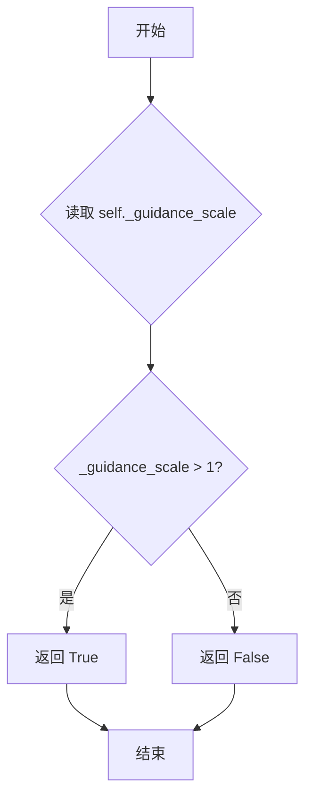

#### 带注释源码

```python
@property
def do_classifier_free_guidance(self):
    """
    属性：判断是否启用分类器无指导（Classifier-Free Guidance）
    
    该属性检查内部存储的引导强度参数 _guidance_scale 是否大于1。
    当 guidance_scale > 1 时，表示需要进行分类器无指导引导，
    这在扩散模型的推理过程中会同时计算条件预测和无条件预测，
    并通过加权组合来提高生成质量。
    
    Returns:
        bool: 如果 _guidance_scale > 1 返回 True，表示启用 CFG；
              否则返回 False，表示不启用 CFG
    """
    return self._guidance_scale > 1
```


### `LongCatImageEditPipeline.guidance_scale`

该属性是 `LongCatImageEditPipeline` 类的 getter 访问器，用于获取当前实例的 guidance_scale（引导强度）值，该值控制 classifier-free guidance 在图像编辑推理过程中的强度。

参数：无

返回值：`float`，返回当前 pipeline 的 guidance_scale 值，用于控制图像生成/编辑过程中无分类器引导的强度。当值大于 1 时启用 classifier-free guidance。

#### 流程图

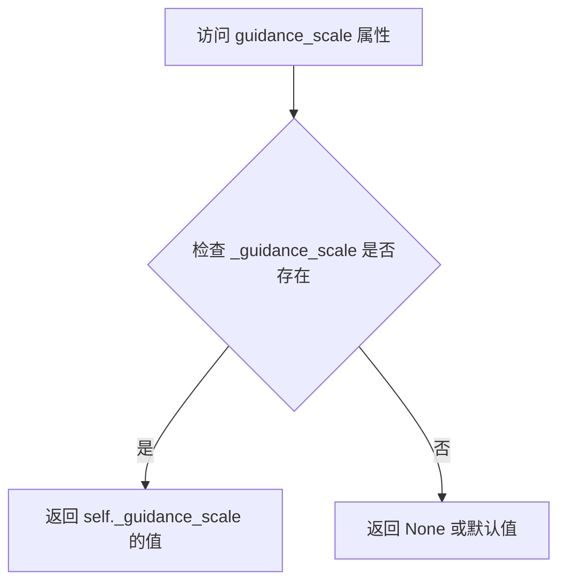

#### 带注释源码

```python
@property
def guidance_scale(self):
    """
    属性 getter：获取 guidance_scale 值
    
    guidance_scale 是一个浮点数参数，用于控制 classifier-free guidance (CFG) 的强度。
    在扩散模型的图像编辑/生成过程中，CFG 通过结合条件和无条件预测来提高生成质量。
    当 guidance_scale > 1 时启用 CFG，值越大，生成结果越倾向于符合 prompt 的描述。
    
    返回值:
        float: 当前设置的 guidance_scale 值
    """
    return self._guidance_scale
```


### `LongCatImageEditPipeline.num_timesteps`

这是一个属性方法，用于返回图像编辑管道在推理过程中所使用的时间步数量。该属性通过返回内部变量 `_num_timesteps` 来获取时间步总数，这个值在 `__call__` 方法执行期间被设置为时间步列表的长度。

参数：

- （无参数，这是属性访问器）

返回值：`int`，返回推理过程中所使用的时间步总数。

#### 流程图

```mermaid
flowchart TD
    A[访问 num_timesteps 属性] --> B{检查属性是否存在}
    B -->|是| C[返回 self._num_timesteps]
    B -->|否| D[返回默认值或报错]
    
    C --> E[返回 int 类型的时间步数量]
    
    F[在 __call__ 中设置] --> G[调用 retrieve_timesteps 获取时间步]
    G --> H[设置 self._num_timesteps = len(timesteps)]
```

#### 带注释源码

```python
@property
def num_timesteps(self):
    """
    返回推理过程中的时间步数量。
    
    该属性返回内部变量 _num_timesteps，该变量在调用 __call__ 方法时
    根据生成样本所需的时间步数进行设置。通常等于 num_inference_steps 的值。
    
    Returns:
        int: 推理过程中所使用的时间步总数
    """
    return self._num_timesteps
```


### `LongCatImageEditPipeline.current_timestep`

这是一个属性方法，用于获取当前扩散推理过程中的时间步（timestep），通常在去噪循环中使用以跟踪推理进度。

参数：无（属性访问无需参数）

返回值：`torch.Tensor | None`，返回当前推理循环中的时间步值，推理开始前和结束后为 `None`。

#### 流程图

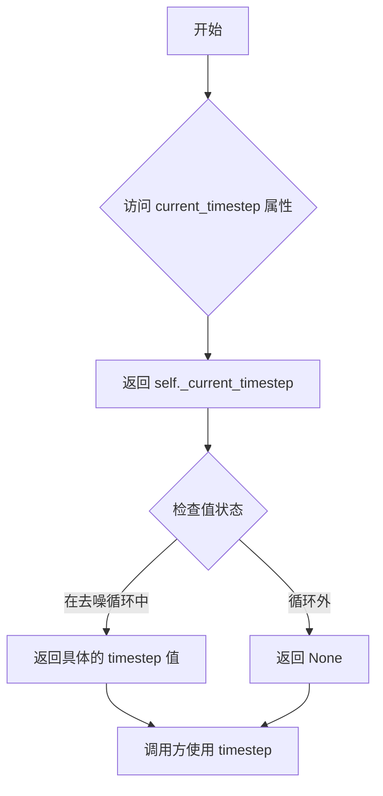

#### 带注释源码

```python
@property
def current_timestep(self):
    """
    属性：当前时间步
    
    用于获取当前扩散推理过程中的时间步（timestep）值。
    在去噪循环（denoising loop）开始时被设置为当前的时间步张量，
    循环开始前和结束后被设置为 None。
    
    该属性在 __call__ 方法的去噪循环中被动态更新：
    - 初始值：self._current_timestep = None
    - 循环中：self._current_timestep = t  # t 为当前 timestep
    - 循环结束后：self._current_timestep = None
    
    Returns:
        torch.Tensor | None: 当前推理步骤的时间步。
                            在去噪循环中返回具体的 timestep 值，
                            循环外返回 None。
    """
    return self._current_timestep
```


### `LongCatImageEditPipeline.interrupt`

该属性是 `LongCatImageEditPipeline` 管道类的一个布尔型只读属性，用于获取当前管道的中断状态标志。当该标志被设置为 `True` 时，管道在去噪循环的每次迭代开始时会跳过当前步骤的执行，实现即时的流程中断控制。

参数： 无

返回值：`bool`，返回当前的中断标志状态。当返回 `True` 时表示管道已收到中断请求，应停止或跳过当前推理步骤；当返回 `False` 时表示管道正常运行。

#### 流程图

```mermaid
flowchart TD
    A[获取 interrupt 属性] --> B{返回 self._interrupt}
    
    B -->|True| C[管道在 __call__ 中跳过当前去噪步骤]
    B -->|False| D[管道继续正常执行]
    
    C --> E[执行 continue 跳过本次循环]
    D --> F[继续执行去噪逻辑]
    
    style A fill:#f9f,color:#333
    style C fill:#9f9,color:#333
    style E fill:#9f9,color:#333
```

#### 带注释源码

```python
@property
def interrupt(self):
    """
    属性：interrupt
    
    用于获取管道的中断状态标志。该属性允许外部调用者
    在管道执行过程中请求中断推理流程。
    
    在 __call__ 方法的去噪循环中被检查：
        if self.interrupt:
            continue  # 跳过当前推理步骤
    
    Returns:
        bool: 返回 self._interrupt 的当前值。
              - True: 表示已请求中断，管道应停止当前操作
              - False: 表示管道正常运行
    """
    return self._interrupt
```

## 关键组件


### LongCatImageEditPipeline

核心图像编辑管道类，集成了Qwen2.5-VL视觉语言模型、VAE自动编码器和Transformer模型，实现基于文本提示的图像编辑功能。

### split_quotation

基于正则表达式的字符串分割函数，用于识别单引号、双引号等配对分隔符，将提示词分割为引号内外的文本片段。

### prepare_pos_ids

位置ID准备函数，为文本和图像模态生成三维位置编码（模态ID、空间位置），支持文本和图像两种类型的位置信息生成。

### calculate_shift

计算序列长度偏移量的函数，基于图像序列长度、基础序列长度、最大序列长度和基础/最大偏移值进行线性插值计算。

### retrieve_timesteps

从调度器获取时间步的通用函数，支持自定义时间步和sigma值，处理不同调度器的参数设置并返回时间步序列。

### retrieve_latents

从编码器输出中提取潜在变量的函数，支持从latent_dist采样或直接获取latents，处理不同的编码器输出格式。

### calculate_dimensions

根据目标面积和宽高比计算图像尺寸的函数，确保输出尺寸能被16整除以满足VAE和Transformer的要求。

### _encode_prompt

内部提示编码方法，集成Qwen2.5-VL视觉语言模型，将文本提示和图像转换为嵌入向量，处理图像网格和位置编码。

### _pack_latents

潜在变量打包方法，将四维潜在张量重塑为二维补丁序列，用于Transformer的序列输入处理。

### _unpack_latents

潜在变量解包方法，将打包的二维潜在序列还原为四维张量，用于VAE解码。

### _encode_vae_image

VAE图像编码方法，将输入图像编码为潜在变量，并应用缩放因子和偏移因子进行归一化处理。

### prepare_latents

潜在变量准备方法，整合图像潜在变量、噪声潜在变量和位置ID，处理批量大小和潜在变量填充逻辑。

### __call__

管道主调用方法，执行完整的图像编辑流程：输入验证、提示编码、潜在变量准备、去噪循环、VAE解码，输出最终图像。

### check_inputs

输入验证方法，检查提示词、尺寸和嵌入向量的有效性，确保输入参数符合管道要求。

### VaeImageProcessor

图像处理器，负责图像的预处理（resize、normalize）和后处理（decode输出转换）。

### FlowMatchEulerDiscreteScheduler

流匹配欧拉离散调度器，用于去噪过程中的时间步进和噪声预测。


## 问题及建议


### 已知问题

-   `_encode_prompt` 方法存在语法错误：`len(len(all_tokens))` 应该是 `len(all_tokens)`
-   `prepare_pos_ids` 函数创建tensor时未指定dtype，可能导致后续运算时类型不匹配或精度问题
-   `check_inputs` 方法未对 `negative_prompt_embeds` 进行有效性验证，且未检查 `num_images_per_prompt` 与batch_size的匹配性
-   `__call__` 方法过长（约200行），违反单一职责原则，包含过多业务逻辑
-   `encode_prompt` 方法中对于 `num_images_per_prompt > 1` 的处理逻辑与标准diffusers pipeline不一致，未正确生成多个prompt对应的text_ids
-   缺少对 `transformer` 输出结构的验证，如果返回格式改变会导致索引越界
-   `_encode_prompt` 中循环处理token时使用字符串迭代，对于中文字符会按字节拆分导致编码错误

### 优化建议

-   修复语法错误 `len(len(all_tokens))` 为 `len(all_tokens)`
-   为 `prepare_pos_ids` 中的 `torch.zeros` 添加明确的dtype参数
-   将 `__call__` 方法拆分为多个私有方法（如 `_prepare_images`, `_encode_prompts`, `_prepare_latents`, `_denoise`, `_decode`）
-   完善 `check_inputs` 方法，增加对 `negative_prompt_embeds`、`num_images_per_prompt` 和 `generator` 列表长度的验证
-   提取 `num_channels_latents = 16` 为类属性或配置参数
-   优化 `_encode_prompt` 中的token处理逻辑，使用tokenizer而非字符串迭代来处理特殊字符
-   添加完整的类型注解到所有函数和方法的参数、返回值
-   将硬编码的配置值（如 `default_sample_size`, `tokenizer_max_length`, `vae_scale_factor * 2`）提取为可配置属性
-   增加对 `transformer` 返回值的防御性检查，防止索引越界
-   考虑使用 `@torch.compiler` 或其他优化手段提升推理性能

## 其它


### 设计目标与约束

本项目旨在实现一个基于LongCat-Image-Transformer的图像编辑扩散流水线，核心目标是将用户提供的输入图像根据文本提示进行智能编辑。设计约束包括：使用Qwen2.5-VL作为文本编码器，支持文本与图像的多模态联合理解；采用FlowMatchEulerDiscreteScheduler实现高效的去噪过程；模型遵循diffusers库的DiffusionPipeline标准架构；支持CPU和CUDA设备，优先支持XLA加速；输入图像尺寸需为16的倍数以满足VAE编码要求；推理步数默认50步，guidance_scale默认为4.5。

### 错误处理与异常设计

代码采用分层错误处理策略。输入验证阶段在`check_inputs`方法中检查：图像尺寸是否为vae_scale_factor*2的倍数、prompt和prompt_embeds互斥性、负向提示与负向嵌入的互斥性、prompt类型合法性。参数一致性检查在`prepare_latents`中验证：batch_size与generator列表长度匹配、图像batch复制倍数关系合理性。调度器兼容性检查在`retrieve_timesteps`中执行：验证timesteps和sigmas的互斥性、确认调度器支持自定义timesteps或sigmas。潜在变量访问错误在`retrieve_latents`中处理：检查encoder_output是否包含latent_dist或latents属性。设备兼容性处理针对MPS后端的特殊bug进行float32类型转换。

### 数据流与状态机

数据流遵循以下主要路径：首先进行图像预处理，包括resize到计算尺寸、归一化处理；然后进行提示编码，将文本和图像通过Qwen2.5-VL编码为prompt_embeds；接着准备潜在变量，对输入图像编码为latent或生成随机latent；之后进入去噪循环，Transformer模型执行条件和非条件预测，scheduler执行去噪步骤；最后进行解码输出，将latent通过VAE解码为图像。状态机包含以下状态：初始状态、编码完成状态、潜在变量准备完成状态、去噪进行中状态、去噪完成状态、输出生成状态。

### 外部依赖与接口契约

核心依赖包括：transformers库提供Qwen2_5_VLForConditionalGeneration和Qwen2Tokenizer、Qwen2VLProcessor；diffusers库提供DiffusionPipeline基类、FlowMatchEulerDiscreteScheduler、VaeImageProcessor、AutoencoderKL、LongCatImageTransformer2DModel；torch库提供张量操作和模型推理；numpy和PIL用于图像处理；re和inspect库用于反射和字符串处理。接口契约方面：pipeline接收PIL.Image或torch.Tensor类型的image参数、str或list类型的prompt参数、可选的negative_prompt和guidance_scale参数；输出返回LongCatImagePipelineOutput对象或tuple，支持pil、latent、np等多种output_type。

### 配置与参数设计

关键配置参数包括：vae_scale_factor根据vae.config.block_out_channels动态计算；image_processor使用VaeImageProcessor，scale_factor乘以2；tokenizer_max_length默认512；default_sample_size默认128；model_cpu_offload_seq定义模型卸载顺序为"text_encoder->image_encoder->transformer->vae"；_optional_components为空列表；_callback_tensor_inputs包含latents和prompt_embeds。提示模板配置：image_token为"<|image_pad|>"，prompt_template_encode_prefix包含系统指令和图像占位符，prompt_template_encode_suffix定义助手回复起始标记。

### 性能考虑与优化空间

性能优化策略包括：模型CPU卸载使用model_cpu_offload_seq实现分阶段卸载；XLA加速支持在tpu设备上使用xm.mark_step()；批量处理支持通过num_images_per_prompt参数生成多张图像；MPS后端特殊处理针对apple mps设备的类型转换bug进行修复。潜在优化空间：当前去噪循环中每次迭代都创建新的tensor，可考虑tensor复用；cache_context的使用可以进一步优化以减少重复计算；图像预处理可以增加缓存机制；支持启用的模型并行或分布式推理。

### 安全性考虑

代码遵循Apache 2.0许可证。敏感信息处理：模型权重来自HuggingFace Hub，需要验证来源可靠性；用户输入的prompt和image应视为不受信任数据。内存安全：使用detach()创建prompt_embeds的副本避免梯度追踪；tensor.device和dtype显式指定避免隐式转换。资源限制：tokenizer_max_length限制输入长度防止资源耗尽；图像尺寸检查确保内存可控。

### 测试策略

单元测试应覆盖：split_quotation函数的引号分割逻辑；prepare_pos_ids的位置ID生成；calculate_shift的序列长度计算；retrieve_timesteps和retrieve_latents的调度器交互；各个类的初始化和注册机制。集成测试应覆盖：完整pipeline推理流程；不同输入类型（PIL Image、torch.Tensor）的兼容性；多种output_type的输出正确性；guidance_scale和num_inference_steps参数的影响。边界测试应覆盖：空prompt处理；极大图像尺寸；batch_size与num_images_per_prompt的组合；XLA可用性检测。

### 版本兼容性

代码需要torch 2.0+支持；transformers库需要支持Qwen2-VL系列模型；diffusers库需要0.28+版本以支持FlowMatchEulerDiscreteScheduler；numpy版本需要支持float16操作；PIL版本需要支持最新的图像格式。设备兼容性：CUDA设备完整支持；CPU设备支持但性能受限；MPS设备有已知bug需要特殊处理；XLA设备需要torch_xla库。

### 部署与运维

部署要求：需要安装torch、transformers、diffusers、accelerate库；模型权重需要从HuggingFace下载或从本地加载；CUDA版本需要11.8+或等效ROCm版本。监控指标：num_timesteps记录推理步数；current_timestep记录当前去噪阶段；interrupt标志支持中断控制。日志记录：使用diffusers的logging模块；warning级别记录可恢复错误；info级别记录推理进度。缓存策略：模型使用from_pretrained的默认缓存；可配置HF_HOME环境变量自定义缓存路径。

    