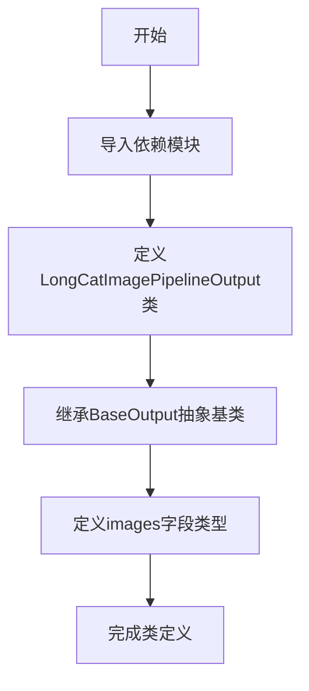

# `diffusers\src\diffusers\pipelines\longcat_image\pipeline_output.py` 详细设计文档

这是一个Stable Diffusion管道的输出类，用于封装去噪后的图像数据，支持PIL.Image列表或numpy数组格式的图像输出。

## 整体流程



## 类结构

```
BaseOutput (diffusers.utils 抽象基类)
└── LongCatImagePipelineOutput (数据类)
```

## 全局变量及字段


### `LongCatImagePipelineOutput.images`
    
去噪后的图像列表或numpy数组，长度为batch_size

类型：`list[PIL.Image.Image, np.ndarray]`
    
    

## 全局函数及方法


## 关键组件


### LongCatImagePipelineOutput

数据类，继承自 diffusers 库的 BaseOutput，用于封装 Stable Diffusion 图像生成管道的输出结果。该类定义了一个 images 字段，支持存储去噪后的 PIL 图像列表或 numpy 数组，提供了灵活的数据格式兼容性。

### images 字段

类型为 `list[PIL.Image.Image, np.ndarray]`，用于存储批量生成的图像数据。字段可以接受 PIL 图像列表或 numpy 数组两种格式，兼容不同下游任务的处理需求。

### BaseOutput 继承

继承自 diffusers.utils 库的 BaseOutput 基类，确保输出类符合库的统一接口规范，便于与现有 pipeline 架构集成。


## 问题及建议


### 已知问题

-   **类型提示错误**: `list[PIL.Image.Image, np.ndarray]` 这种写法在 Python 3.9+ 中语义错误。`list` 只接受单一类型参数，该写法实际表示的是包含两个类型元素的列表，而不是"列表或numpy数组"的联合类型。正确写法应为 `list[PIL.Image.Image] | np.ndarray` 或 `Union[list[PIL.Image.Image], np.ndarray]`。
-   **文档字符串内容不匹配**: 文档字符串提到 "Stable Diffusion pipelines"，但类名是 `LongCatImagePipelineOutput`，存在明显的复制粘贴错误或遗留问题。
-   **缺少默认值配置**: `images` 字段没有默认值，在 dataclass 中实例化时必须传入参数，若后续需要创建空输出或默认输出会不够灵活。
-   **类型注解与实际用途可能存在歧义**: 文档描述该字段可以是 `list` 或 `np.ndarray`，但联合类型的正确表达方式缺失，可能导致类型检查工具无法正确识别，降低静态分析有效性。

### 优化建议

-   **修正类型注解**: 将 `images: list[PIL.Image.Image, np.ndarray]` 修改为 `images: list[PIL.Image.Image] | np.ndarray`（Python 3.10+）或 `Union[list[PIL.Image.Image], np.ndarray]`（Python 3.9 兼容）。
-   **更新文档字符串**: 修正文档字符串中的描述，使其与类名 `LongCatImage` 的实际用途保持一致，或移除 "Stable Diffusion" 的引用以避免误导。
-   **考虑添加默认值**: 根据实际使用场景，为 `images` 字段添加默认值（如 `None` 或空列表），或在类中添加 `__post_init__` 方法进行校验，增强类的可用性。
-   **添加 field 验证**: 可使用 `field(default=None)` 并在 `__post_init__` 中验证类型，提升实例化的健壮性。
-   **补充类型守卫**: 若需要处理多种类型分支，建议添加运行时类型检查或使用 `TypeGuard` 增强代码可维护性。


## 其它


### 设计目标与约束

设计目标：该类是Diffusers库的图像管道输出数据结构，用于标准化封装扩散模型生成的图像结果，支持PIL图像和NumPy数组两种格式的批量返回，确保与Diffusers框架其他管道输出类的一致性和互操作性。约束条件：类型注解需兼容Python 3.9+的泛型语法，字段必须可序列化以支持持久化场景，类定义需遵循Diffusers库的BaseOutput基类约定。

### 错误处理与异常设计

该类为纯数据容器，不涉及业务逻辑处理，无运行时异常抛出机制。类型检查由调用方在数据填充时负责，预期传入list类型且元素为PIL.Image.Image或np.ndarray。若类型不匹配，将在后续管道处理环节引发TypeError或AttributeError。设计建议：在文档中明确声明类型约束，添加运行时类型验证方法（如is_valid()）以提升鲁棒性。

### 数据流与状态机

数据流：输入数据来自扩散管道（Diffusion Pipeline）的推理结果，经过去噪处理后的图像数组或PIL图像列表，通过该输出类封装后返回给调用方。状态机：不涉及状态管理，该类为无状态数据结构，仅负责数据承载和传递。输入侧为扩散模型的denoising过程，输出侧对接后续的图像处理、存储或展示模块。

### 外部依赖与接口契约

外部依赖：1）BaseOutput基类，来自diffusers.utils，提供基础输出类的接口约定；2）PIL.Image.Image，来自PIL库，用于图像对象封装；3）numpy.ndarray，来自numpy库，用于图像数组表示。接口契约：images字段为必填字段，类型为list且元素类型限于PIL.Image.Image或np.ndarray，返回值需保持原始图像的尺寸、通道数和数值范围。调用方需自行处理空列表或None值的边界情况。

### 性能考虑

由于该类仅为数据容器，性能开销主要体现在内存占用方面。images字段存储原始图像数据，大批量生成时内存消耗显著。优化建议：1）对于大规模批处理场景，考虑支持生成器（Generator）模式以流式返回图像；2）可添加图像懒加载机制，在需要时才进行反序列化；3）对于不需要原始分辨率的场景，可支持输出缩略图或低分辨率预览。

### 安全性考虑

该类本身不涉及安全敏感操作。潜在安全风险：1）若images字段被注入恶意构造的np.ndarray，可能导致内存溢出或缓冲区读取异常，建议添加图像尺寸和类型的前置校验；2）若通过反序列化路径加载，需防范pickle反序列化攻击。设计建议：添加类方法from_bytes()和to_bytes()时实现安全校验逻辑。

### 兼容性考虑

Python版本兼容性：类型注解list[PIL.Image.Image, np.ndarray]使用Python 3.9+语法，需在项目requirements中声明最低Python版本。框架兼容性：该类设计为与Diffusers库强耦合，依赖于BaseOutput基类，迁移至其他框架需重构继承关系。序列化兼容性：dataclass自动生成的__repr__和__eq__方法确保了基本的序列化能力，但深拷贝大图像列表时需注意内存开销。

### 测试策略

单元测试：1）验证类实例化时字段赋值正确性；2）测试不同类型输入（PIL/numpy/混合格）的兼容性；3）验证与BaseOutput基类的继承关系；4）测试dataclass自动生成的方法（__repr__、__eq__、__init__）。集成测试：1）在实际Diffusion Pipeline中验证输出类的流转正确性；2）测试批量大小边界条件（batch_size=1、batch_size=0）。性能测试：大批量图像存储时的内存占用和响应时间。

### 版本管理

当前版本：1.0.0（基于Diffusers库v0.x系列）。版本演进策略：1）若新增字段，需添加向后兼容的默认值；2）废弃字段需标记deprecated并保留至少两个大版本；3）重大变更需通过继承新基类实现而非修改当前类。建议：随着Diffusers库演进，考虑将该类迁移至独立的diffusers.pipelines.output模块。

### 配置管理

该类为静态数据结构，无运行时配置需求。类定义级别的配置通过dataclass装饰器参数控制（如frozen=True实现不可变对象）。若需扩展配置能力，建议通过工厂方法或配置类注入，而非修改该核心输出类。

    