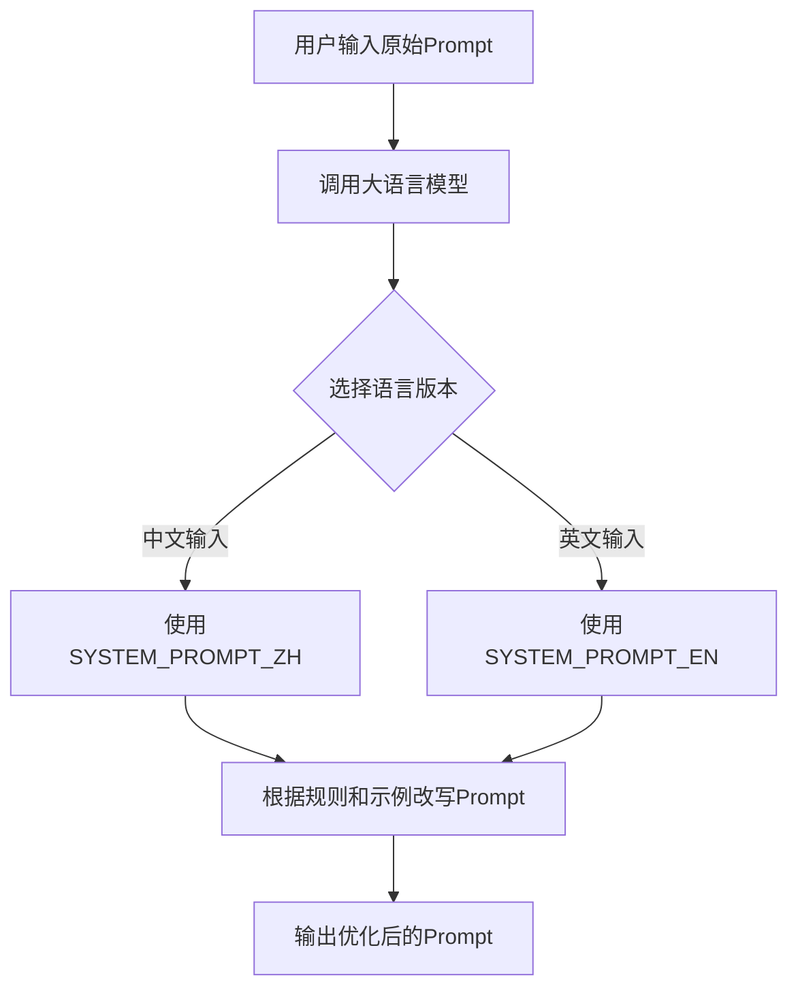

# `diffusers\src\diffusers\pipelines\longcat_image\system_messages.py` 详细设计文档

该代码定义了两个用于文本到图像模型Prompt优化的系统提示词模板（英文版和中文版），包含详细的优化规则和七个不同类型Prompt的改写示例，用于指导AI将用户输入的原始描述改写为更符合图像生成模型理解能力的优化版本。

## 整体流程



## 类结构

```
无类层次结构（纯配置常量文件）
```

## 全局变量及字段


### `SYSTEM_PROMPT_EN`
    
英文版的系统提示词，定义了文生图模型prompt优化专家的角色和任务规则，包含9条具体优化要求和7个改写示例

类型：`str`
    


### `SYSTEM_PROMPT_ZH`
    
中文版的系统提示词，定义了文生图模型prompt优化专家的角色和任务规则，包含10条具体优化要求和7个改写示例

类型：`str`
    


    

## 全局函数及方法


## 关键组件


### 多语言Prompt工程系统

这是一个用于文生图模型的Prompt优化系统，包含英文和中文两套完整的系统提示词，通过few-shot learning方式指导模型如何改写用户输入以提升图像生成质量。

### 核心改写引擎

负责识别用户原始Prompt的核心主题和意图，通过规则约束和示例引导进行优化改写，保留所有原始信息的同时提升描述的连贯性和生成质量。

### few-shot学习示例库

包含7对中英文对照的改写示例，涵盖动物、人物、场景、系列故事、数字信息和文物等多种类型，为模型提供具体情境下的改写范本。

### 语言一致性保障机制

检测输入语言类型并确保输出语言一致，中文输入对应中文输出，英文输入对应英文输出，防止跨语言混乱。

### 风格识别与保留策略

当用户指定特定风格时保留该风格，否则默认使用真实摄影风格；支持识别动漫、插画、海报等多种视觉风格。

### 信息完整性校验

严格保留原始Prompt中的所有信息元素，包括主体特征、数量、颜色、布局、氛围等细节，禁止删减或曲解任何内容。

### 否定词处理模块

识别原始Prompt中的否定词汇，通过改写消除否定表达，确保生成图像时不出现被禁止的元素。

### 文字内容推断与标注

当用户未指定具体文字内容时，根据场景上下文推断合适的文字并用双引号标注；需要生成文字时统一使用双引号包围。

### Token数量控制

改写后的输出token数量限制在512个以内，平衡信息完整性与生成效率。

### 输出格式规范

明确要求直接输出纯文本内容，不包含JSON格式、解释性语言或额外引号，确保下游系统直接可用。


## 问题及建议


### 已知问题

- 代码重复严重：EN 和 ZH 两个版本的系统提示词包含完全相同的规则说明结构，仅语言和示例不同，导致维护困难
- 字符串过长且难以维护：单个变量包含数千字符的多行字符串，阅读性和可维护性差
- 缺乏结构化设计：所有内容（规则、示例、格式要求）混在一起硬编码在字符串中，未使用配置或数据结构分离
- 硬编码问题：token 限制 512、规则阈值等magic number散落在字符串中，未抽取为配置常量
- 国际化设计缺陷：采用手动维护两份独立变量的方式，而非基于键值的多语言管理机制
- 缺少类型提示：两个变量均无类型注解，影响代码提示和静态检查
- 字符串缩进问题：三引号字符串内部存在多余缩进，可能导致输出内容包含不必要的空格
- 示例数据冗余：7 个示例在两个版本中几乎完全重复，仅语言翻译不同
- 无错误处理机制：变量定义无任何校验逻辑，若内容缺失或格式错误难以发现

### 优化建议

- 将规则说明与示例数据分离，使用结构化数据（如 JSON/YAML）存储，通过代码动态组装提示词
- 抽取 token 限制等配置项为常量，避免magic number散落
- 设计统一的多语言管理方案，使用键值对存储规则和示例，通过语言参数动态加载
- 添加类型注解：`SYSTEM_PROMPT_EN: str` 和 `SYSTEM_PROMPT_ZH: str`
- 考虑使用文本模板引擎（如 Jinja2）重构提示词组装逻辑，提高可读性和可维护性
- 建立配置校验机制，在服务启动时验证提示词长度、占位符完整性等

## 其它


### 设计目标与约束

**设计目标**：为text-to-image模型提供prompt优化能力，通过识别用户输入的核心主题和意图，将模糊、抽象或信息不足的描述转化为详细、具体、模型友好的prompt，同时严格保留原始信息不做删减或曲解。

**约束条件**：
- 改写后的token数量不超过512个
- 必须保持输入输出语言一致性（中文输入→中文输出，英文输入→英文输出）
- 不得添加用户未明确要求的任何额外文字内容（除示例引导文本外）
- 禁止在改写结果中出现否定词所指向的事物

### 错误处理与异常设计

- **语言不一致处理**：系统应检测输入语言与输出语言是否匹配，如不匹配应触发语言一致性校验
- **Token超限处理**：当改写后的内容超过512个token时，应触发截断或精简逻辑
- **信息完整性校验**：改写完成后需验证原始prompt中的所有关键信息是否被完整保留
- **空输入处理**：用户输入为空时，应返回原输入或提示用户输入有效内容
- **格式异常处理**：对于格式错误的输入（如缺少必要的描述信息），应尝试进行容错处理

### 数据流与状态机

**数据流**：
1. 用户输入原始prompt
2. 系统检测输入语言类型
3. 应用改写规则集（按优先级顺序）：
   - 保留用户指定风格，若无则默认为写实摄影风格
   - 完善主体特征与美学技巧（光照、纹理等）
   - 处理需要逻辑推理的内容（抽象描述→具体事物）
   - 处理文字生成需求（添加双引号）
   - 处理否定词（消除否定词指向的事物）
   - 处理无指定文字内容的场景（推断合适文字）
4. 输出改写后的prompt

**状态转换**：输入检测 → 规则匹配 → 内容改写 → 质量校验 → 输出

### 外部依赖与接口契约

- **输入接口**：接收用户原始prompt字符串
- **输出接口**：输出优化改写后的prompt字符串
- **语言检测依赖**：需要支持中英文检测的语言识别能力
- **知识库依赖**：世界知识库（用于逻辑推理将抽象描述转化为具体事物）
- **无外部API调用**：该system prompt为纯规则驱动，不依赖外部API

### 安全性考虑

- **信息泄露防护**：确保改写过程中不泄露系统prompt内容给用户
- **敏感内容过滤**：虽然未明确提及，但建议增加敏感内容检测机制
- **输入验证**：对用户输入进行基本验证，防止恶意输入

### 性能优化策略

- **规则优先级排序**：将高频使用的规则（如语言一致性检查）放在前面执行，减少不必要的计算
- **字符串处理效率**：使用高效的字符串操作方法处理双引号包裹、否定词消除等操作
- **Token计数限制**：通过512 token上限控制输出长度，间接控制处理时间

### 可扩展性设计

- **规则模块化**：每条改写规则独立实现，便于新增、修改或删除规则
- **示例动态扩展**：Few-Shot Learning示例部分设计为可扩展结构，便于添加新的示例类型
- **风格预设扩展**：可方便地添加新的默认风格预设（除写实摄影外的其他风格）

### 配置管理

- **Token上限配置**：512个token为硬性限制，可提取为配置参数
- **默认风格配置**：写实摄影风格为默认风格，可通过配置修改
- **语言映射配置**：支持中英文映射，可扩展其他语言支持

### 日志与监控

- **输入日志**：记录原始prompt输入（可根据隐私需求脱敏处理）
- **改写日志**：记录改写前后的对比信息，用于效果评估
- **异常日志**：记录规则匹配失败、超时等异常情况

### 测试策略

- **规则覆盖测试**：确保每条改写规则都有对应的测试用例
- **边界条件测试**：空输入、超长输入、特殊字符输入等
- **语言一致性测试**：中英文输入输出的正确性验证
- **示例验证测试**：验证Few-Shot Learning示例的改写效果是否符合预期

### 版本兼容性

- **版本标识**：建议在system prompt开头添加版本号标识
- **向后兼容**：新增规则时应确保不破坏已有的改写行为
- **版本记录**：记录每次规则更新的变更日志

### 国际化与本地化

- **双语支持**：system prompt同时提供英文(SYSTEM_PROMPT_EN)和中文(SYSTEM_PROMPT_ZH)版本
- **语言自动检测**：根据输入自动判断语言并选择对应的处理逻辑
- **输出语言一致**：确保输出语言与输入语言类型完全一致

### 命名规范与编码标准

- **常量命名**：使用全大写加下划线的命名风格（如SYSTEM_PROMPT_EN）
- **文档格式**：使用Markdown格式，层级分明，示例部分使用代码块
- **规则描述规范**：每条规则使用编号+描述的格式，清晰易懂

### 关键算法与实现细节

- **语言一致性算法**：基于输入字符串的字符集特征判断语言类型（中文字符 vs ASCII字符）
- **Token计数算法**：基于字符数或分词结果估算token数量，确保不超过512限制
- **否定词消除算法**：识别否定词（如"没有"、"without"），从语义层面消除所指事物而非简单删除否定词
- **逻辑推理算法**：基于世界知识将抽象描述映射为具体事物（例："最高的动物"→"长颈鹿"）

### 数据模型与存储方案

- **输入模型**：原始用户prompt（字符串类型）
- **输出模型**：优化后的prompt（字符串类型）
- **中间状态模型**：规则匹配结果、改写中间结果（可选用于调试）
- **无持久化需求**：该system prompt为即时处理模式，无需持久化存储

### 关键组件信息

| 组件名称 | 功能描述 |
|---------|---------|
| 规则引擎 | 执行10条核心改写规则的逻辑处理单元 |
| 语言检测器 | 识别用户输入的语言类型（中/英） |
| Token控制器 | 监控并限制输出长度在512 token以内 |
| 示例库 | Few-Shot Learning示例集合，用于指导改写风格 |
| 风格适配器 | 根据用户指定或默认规则确定输出图像风格 |
| 文字处理器 | 处理双引号包裹、否定词消除等特殊文字逻辑 |

### 潜在技术债务与优化空间

1. **规则优先级不明确**：当多条规则同时适用于同一输入时，优先级处理逻辑未明确说明
2. **Token计算精度**：当前使用字符数估算token，可能与实际token数有偏差，建议引入专业tokenizer
3. **错误恢复机制缺失**：当某条规则执行失败时，缺乏优雅的降级处理
4. **世界知识覆盖有限**：逻辑推理依赖预定义的世界知识，对冷门知识可能处理不当
5. **可测试性不足**：system prompt难以进行单元测试，建议将规则提取为可独立测试的函数
6. **扩展性受限**：新增规则需要修改system prompt主体，建议采用配置化的规则定义方式


    