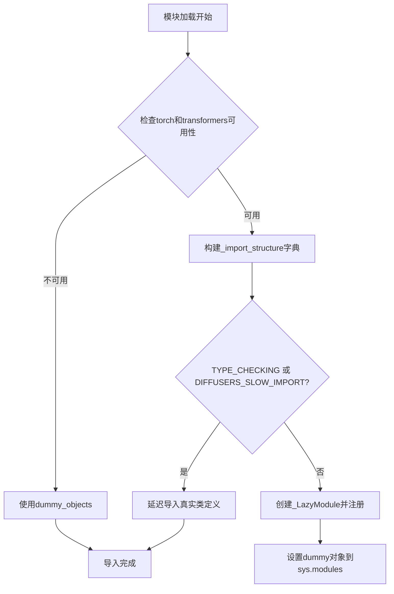
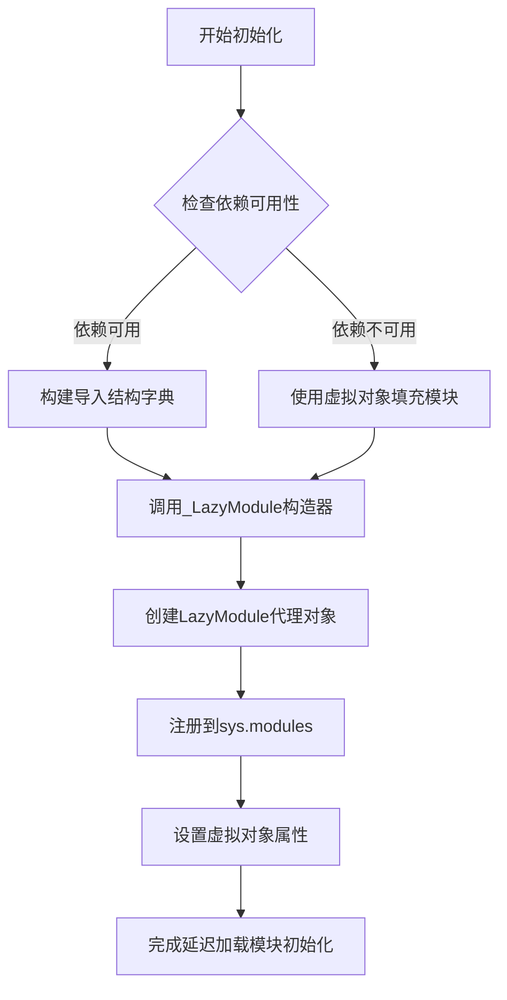
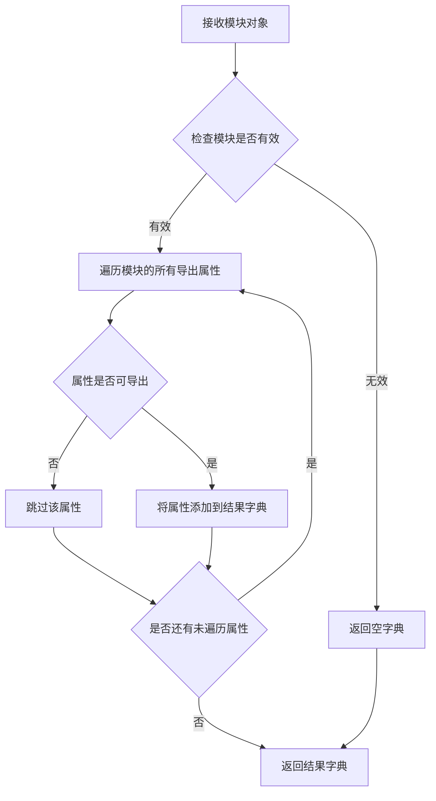
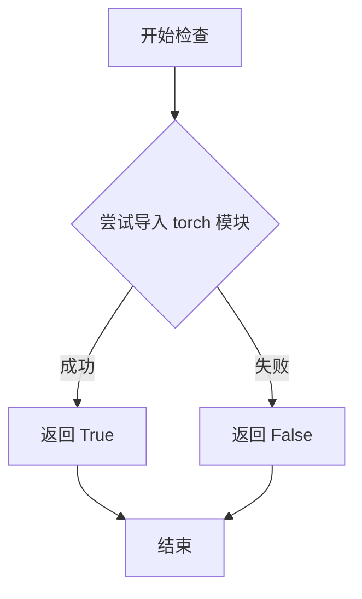
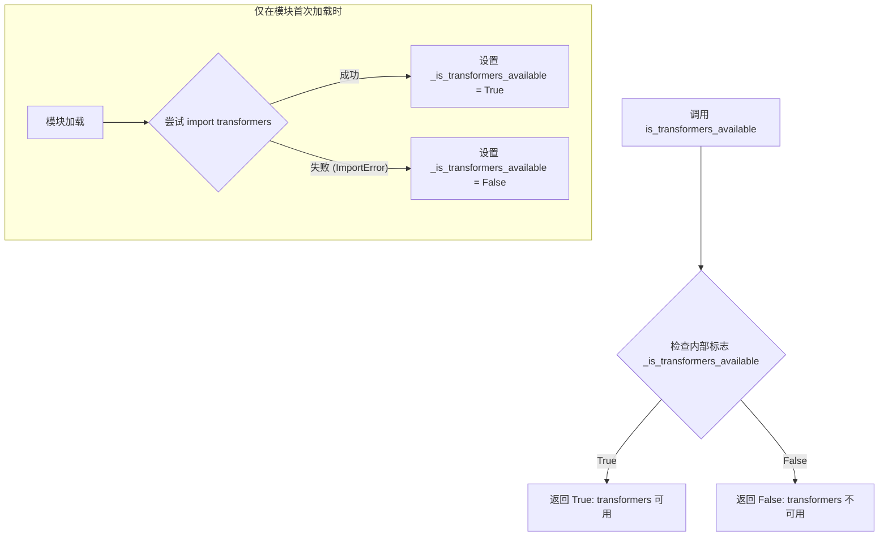

# `diffusers\src\diffusers\pipelines\ltx\__init__.py` 详细设计文档

这是一个Diffusers库的LTX模型模块初始化文件，采用延迟导入（Lazy Import）模式，根据torch和transformers可选依赖的可用性动态加载LTXVideoTransformer、LTXLatentUpsamplerModel及多个Pipeline类，确保在缺少可选依赖时仍能以dummy对象形式导入。

## 整体流程



## 类结构

```
LTXModuleInit (模块初始化)
├── _import_structure (导入结构字典)
├── _dummy_objects (dummy对象字典)
└── 导出类:
    ├── LTXLatentUpsamplerModel
    ├── LTXPipeline
    ├── LTXConditionPipeline
    ├── LTXI2VLongMultiPromptPipeline
    ├── LTXImageToVideoPipeline
    └── LTXLatentUpsamplePipeline
```

## 全局变量及字段


### `_dummy_objects`
    
存储可选依赖不可用时的虚拟对象，用于延迟导入时的回退机制

类型：`dict`
    


### `_import_structure`
    
定义模块的导出结构，映射字符串到可导入的类名

类型：`dict`
    


### `DIFFUSERS_SLOW_IMPORT`
    
标志位，控制是否启用慢速导入模式（TYPE_CHECKING时为True）

类型：`bool`
    


### `OptionalDependencyNotAvailable`
    
自定义异常类，用于标识torch或transformers等可选依赖不可用的情况

类型：`Exception class`
    


    

## 全局函数及方法


### `_LazyModule` (类构造)

该函数是延迟模块加载机制的核心，用于实现 Diffusers 库中可选依赖（如 torch 和 transformers）的延迟导入。它在模块无法立即加载所需依赖时创建一个代理模块对象，后续访问模块属性时才触发实际的导入操作。

参数：

- `name`：`str`，模块的完全限定名称（`__name__`），用于标识模块
- `file_path`：`str`，模块文件的物理路径（`globals()["__file__"]`），用于定位模块位置
- `import_structure`：`dict`，延迟导入的结构字典，键为子模块名，值为需要导出的对象列表
- `module_spec`：`ModuleSpec`，模块规格对象（`__spec__`），包含模块的元数据和导入信息

返回值：`LazyModule`，返回延迟加载的模块代理对象，用于在运行时按需导入实际的模块和对象

#### 流程图



#### 带注释源码

```python
# 判断是否为类型检查模式或慢速导入模式
if TYPE_CHECKING or DIFFUSERS_SLOW_IMPORT:
    try:
        # 再次检查 torch 和 transformers 是否同时可用
        if not (is_transformers_available() and is_torch_available()):
            raise OptionalDependencyNotAvailable()
    except OptionalDependencyNotAvailable:
        # 如果依赖不可用，从虚拟对象模块导入所有内容
        from ...utils.dummy_torch_and_transformers_objects import *
    else:
        # 依赖可用时，执行实际的模块导入
        from .modeling_latent_upsampler import LTXLatentUpsamplerModel
        from .pipeline_ltx import LTXPipeline
        from .pipeline_ltx_condition import LTXConditionPipeline
        from .pipeline_ltx_i2v_long_multi_prompt import LTXI2VLongMultiPromptPipeline
        from .pipeline_ltx_image2video import LTXImageToVideoPipeline
        from .pipeline_ltx_latent_upsample import LTXLatentUpsamplePipeline
else:
    # 延迟导入模式：使用 _LazyModule 实现按需加载
    import sys

    # 将当前模块替换为 LazyModule 代理对象
    # 参数1: 模块名 - 当前模块的完整名称
    # 参数2: 文件路径 - 模块文件的物理位置
    # 参数3: 导入结构 - 定义了需要延迟导入的子模块和类
    # 参数4: 模块规格 - 包含模块的完整元数据信息
    sys.modules[__name__] = _LazyModule(
        __name__,
        globals()["__file__"],
        _import_structure,
        module_spec=__spec__,
    )

    # 为模块设置虚拟对象属性
    # 这些对象在真实依赖不可用时提供替代品
    # 避免 AttributeError 等运行时错误
    for name, value in _dummy_objects.items():
        setattr(sys.modules[__name__], name, value)
```


### `get_objects_from_module`

该函数是一个工具函数，用于从指定模块中动态提取所有可导出对象（类、函数、变量等），并将其转换为字典格式返回。通常用于懒加载模块时，将虚拟对象（dummy objects）批量注册到当前模块的命名空间中。

参数：

- `module`：模块对象，要从中提取对象的目标模块（例如 `dummy_torch_and_transformers_objects`）

返回值：`dict`，返回键为对象名称、值为对象本身的字典

#### 流程图



#### 带注释源码

```python
def get_objects_from_module(module):
    """
    从给定模块中提取所有可导出对象并返回字典。
    
    该函数通常用于懒加载机制中，将 dummy 模块中的所有对象
    复制到当前模块的 _dummy_objects 字典中，以便在依赖不可用时
    提供替代的虚拟对象。
    
    参数:
        module: 模块对象，要提取对象的目标模块
        
    返回:
        dict: 包含模块中所有可导出对象的字典，键为对象名称
    """
    # 初始化结果字典
    objects = {}
    
    # 检查模块是否为 None
    if module is None:
        return objects
    
    # 遍历模块的所有属性
    for attr_name in dir(module):
        # 跳过私有属性和特殊属性
        if attr_name.startswith('_'):
            continue
        
        try:
            # 获取属性值
            attr_value = getattr(module, attr_name)
            # 将属性添加到结果字典
            objects[attr_name] = attr_value
        except AttributeError:
            # 如果获取属性失败，跳过
            continue
    
    return objects
```

#### 使用示例

在给定代码中的实际使用方式：

```python
# 导入函数
from ...utils import get_objects_from_module

# 定义 dummy 对象字典
_dummy_objects = {}

# 从 dummy 模块获取所有对象并更新到 _dummy_objects
_dummy_objects.update(get_objects_from_module(dummy_torch_and_transformers_objects))

# 之后可以将这些对象设置到 sys.modules 中
for name, value in _dummy_objects.items():
    setattr(sys.modules[__name__], name, value)
```


### `is_torch_available`

该函数用于在运行时检查当前环境是否安装了 PyTorch 库，返回布尔值以指示 PyTorch 的可用性，从而决定是否加载相关的模块和对象。

参数：无

返回值：`bool`，返回 `True` 表示 PyTorch 已安装且可用，返回 `False` 表示不可用。

#### 流程图



#### 带注释源码

```python
# is_torch_available 函数的实现逻辑（位于 ...utils 模块中）
# 以下为推断的源码实现

def is_torch_available() -> bool:
    """
    检查 PyTorch 是否可用。
    
    Returns:
        bool: 如果 torch 可以被导入则返回 True，否则返回 False。
    """
    try:
        # 尝试导入 torch 模块，如果成功则表示可用
        import torch
        return True
    except ImportError:
        # 如果导入失败，说明未安装 PyTorch
        return False
```

> **注**：该函数定义在 `...utils` 模块中，未在本代码文件中直接实现。本文件中通过导入语句 `from ...utils import is_torch_available` 引入并使用。


### `is_transformers_available`

该函数是 `diffusers` 库中的一个实用工具函数，用于检查 `transformers` 库（由 Hugging Face 开发）是否已安装并且可以在当前 Python 环境中成功导入。它通常用于条件导入，以处理可选依赖项。

参数：
- (无)

返回值：`bool`，如果 `transformers` 库可用（例如已通过 `pip install transformers` 安装），则返回 `True`；否则返回 `False`。

#### 流程图

该函数采用懒加载（Lazy Loading）机制，在模块初始化时尝试导入 `transformers`，如果失败则标记为不可用，后续调用直接返回该状态。



#### 带注释源码

以下是 `is_transformers_available` 函数在 `diffusers` 库中的典型实现模式（位于 `src/diffusers/utils/import_utils.py` 或 `__init__.py`）。

```python
# 导入类型检查（如果需要）
from typing import TYPE_CHECKING

# 定义内部标志，初始值为 False
_is_transformers_available = False

# 尝试导入检查
try:
    # 尝试导入 transformers 库
    # 如果未安装，这里会抛出 ImportError
    import transformers
    
    # 如果导入成功，标记为可用
    _is_transformers_available = True
except ImportError:
    # 如果导入失败，标记为不可用
    # 捕获异常，但不打印输出，静默失败
    _is_transformers_available = False


def is_transformers_available() -> bool:
    """
    检查 transformers 库是否可用。

    这是一个轻量级检查，用于确定可选依赖项是否存在，
    以便在 OptionalDependencyNotAvailable 的情况下
    优雅地处理导入回退。

    返回值:
        bool: 如果 transformers 已安装且可导入，则为 True，否则为 False。
    """
    return _is_transformers_available
```


### `setattr`

设置指定模块的属性，将虚拟对象（dummy objects）动态绑定到当前模块，以便在依赖不可用时提供替代对象。

参数：

- `obj`：`object`，要设置属性的对象，此处为 `sys.modules[__name__]`（当前模块）
- `name`：`str`，要设置的属性名称，此处为 `_dummy_objects` 字典的键（即虚拟对象名称）
- `value`：任意类型，要设置的属性值，此处为 `_dummy_objects` 字典的值（即虚拟对象实例）

返回值：`None`，无返回值

#### 流程图

```mermaid
flowchart TD
    A[开始] --> B[遍历 _dummy_objects 字典]
    B --> C[获取键值对 name, value]
    D[调用 setattr] --> E[将 name 作为属性名, value 作为属性值]
    E --> F[设置到 sys.modules[__name__] 模块对象上]
    F --> G[继续下一个键值对]
    G --> B
    B --> H[结束循环]
```

#### 带注释源码

```python
# 遍历所有虚拟对象（这些对象在依赖不可用时作为占位符）
for name, value in _dummy_objects.items():
    # 使用 setattr 将每个虚拟对象动态设置为当前模块的属性
    # 参数1: sys.modules[__name__] - 当前模块对象
    # 参数2: name - 属性名（虚拟对象的名称）
    # 参数3: value - 属性值（虚拟对象实例）
    setattr(sys.modules[__name__], name, value)
```

## 关键组件


### 懒加载模块（Lazy Loading Module）

使用 `_LazyModule` 实现模块的延迟加载，只有在实际使用时才加载类定义，提升导入速度和内存效率。

### 可选依赖处理（Optional Dependency Handling）

通过 `OptionalDependencyNotAvailable` 异常和条件检查处理 `torch` 与 `transformers` 的可选依赖，在依赖不可用时使用虚拟对象替代。

### 导入结构定义（Import Structure Definition）

`_import_structure` 字典定义了模块的公共API，包含6个管道类和模型类，映射字符串名称到实际的类引用。

### Dummy对象模式（Dummy Object Pattern）

`_dummy_objects` 字典在依赖不可用时存储虚拟对象，通过 `get_objects_from_module` 从dummy模块获取，确保模块在缺少依赖时仍可导入。

### 类型检查支持（TYPE_CHECKING Support）

使用 `TYPE_CHECKING` 标志在类型检查时导入真实类型，在运行时使用懒加载，避免循环导入和性能开销。

### LTX 视频/图像生成管道组件

包含6个核心类：LTXLatentUpsamplerModel（潜在上采样模型）、LTXPipeline（主管道）、LTXConditionPipeline（条件管道）、LTXI2VLongMultiPromptPipeline（长视频多提示管道）、LTXImageToVideoPipeline（图像到视频管道）、LTXLatentUpsamplePipeline（潜在上采样管道）。


## 问题及建议


### 已知问题

-   **重复的条件检查**：代码在两处（try-except 块和 TYPE_CHECKING 块）重复检查 `is_transformers_available() and is_torch_available()`，违反了 DRY 原则，增加了维护成本
-   **魔法字符串未集中定义**：`_import_structure` 的键（如 "modeling_latent_upsampler", "pipeline_ltx" 等）以硬编码字符串形式分散在代码中，缺乏统一常量定义
-   **缺乏类型注解**：全局变量 `_import_structure` 和 `_dummy_objects` 缺少类型注解，影响代码可读性和静态分析
-   **模块导入路径硬编码**：相对导入路径（如 `.modeling_latent_upsampler`）假设特定的文件名，耦合度过高
-   **sys.modules 修改操作缺乏保护**：直接修改 `sys.modules[__name__]` 并遍历设置属性，可能存在线程安全隐患
-   **重复的导入结构定义逻辑**：TYPE_CHECKING 分支和运行时分支的导入结构定义逻辑高度相似，可抽取为独立函数

### 优化建议

-   将条件检查逻辑抽取为独立函数或常量，避免重复代码
-   定义模块级常量类或枚举来集中管理 `_import_structure` 的键名
-   为字典变量添加类型注解，如 `_import_structure: Dict[str, List[str]] = {}`
-   考虑使用 `functools.lru_cache` 或其他缓存机制优化重复导入的性能开销
-   在修改 `sys.modules` 前考虑添加线程锁（threading.Lock）以保证线程安全
-   将导入结构定义抽取为独立函数，接受参数以区分 TYPE_CHECKING 和运行时场景
-   为模块添加文档字符串，说明其作为 LTX 模型懒加载入口的职责
-   考虑将 dummy object 的处理逻辑封装为独立的工具函数，提高代码复用性


## 其它


### 设计目标与约束

本模块的设计目标是实现一个延迟加载的模块导入系统，支持可选依赖（torch和transformers）的动态导入，并为LTX视频生成管道提供统一的导入接口。设计约束包括：1）必须同时满足torch和transformers两个依赖才可导入实际模块；2）使用_LazyModule实现延迟加载以提高导入速度；3）保持与diffusers框架的dummy对象机制兼容。

### 错误处理与异常设计

本模块主要通过OptionalDependencyNotAvailable异常处理可选依赖不可用的情况。当torch或transformers任一不可用时，抛出OptionalDependencyNotAvailable异常，并从dummy模块导入替代对象（_dummy_objects），确保模块结构完整但功能受限。在TYPE_CHECKING或DIFFUSERS_SLOW_IMPORT模式下，同样进行依赖检查并处理导入逻辑。

### 数据流与依赖关系

模块初始化时首先定义_import_structure字典和_dummy_objects字典用于存储可导入对象的结构。然后尝试检查is_transformers_available()和is_torch_available()，如果都可用则填充_import_structure，否则从dummy模块获取_dummy_objects。在非TYPE_CHECKING模式下，使用_LazyModule替换当前模块，实现真正的延迟加载，最后将_dummy_objects设置到sys.modules中。

### 外部依赖与接口契约

本模块依赖以下外部组件：1）typing.TYPE_CHECKING用于类型检查时的导入；2）diffusers框架的_LazyModule、get_objects_from_module等工具；3）is_torch_available和is_transformers_available用于检测依赖可用性；4）OptionalDependencyNotAvailable异常类。导出的公共接口包括：LTXLatentUpsamplerModel、LTXPipeline、LTXConditionPipeline、LTXI2VLongMultiPromptPipeline、LTXImageToVideoPipeline、LTXLatentUpsamplePipeline。

### 模块加载机制

本模块采用延迟加载机制（Lazy Loading），通过_LazyModule实现。_import_structure定义了模块的导出结构，包括modeling_latent_upsampler和pipeline_ltx等子模块。当实际使用这些类时，_LazyModule才会动态加载对应的模块文件，这种设计显著减少了初始导入时间并避免了不必要的依赖加载。

### 兼容性考虑

模块设计考虑了多种导入场景：1）生产环境下的延迟加载；2）类型检查时的完整导入；3）DIFFUSERS_SLOW_IMPORT模式下的完整导入；4）依赖不可用时的降级处理。通过dummy_objects机制，即使依赖不可用，模块结构依然完整，可以进行基本的类型检查和代码补全。

    