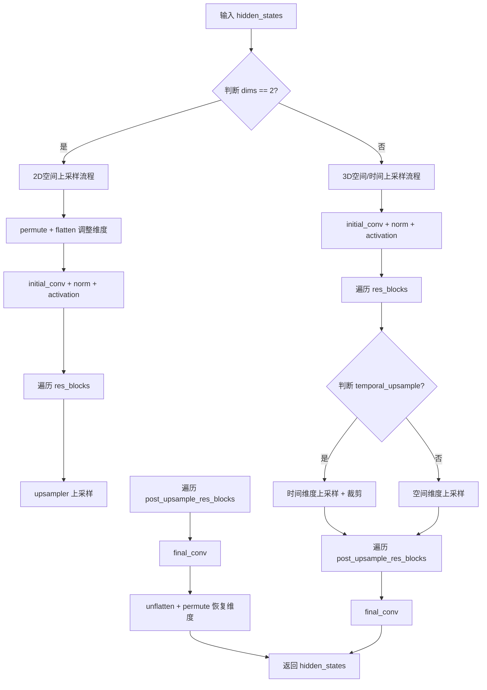
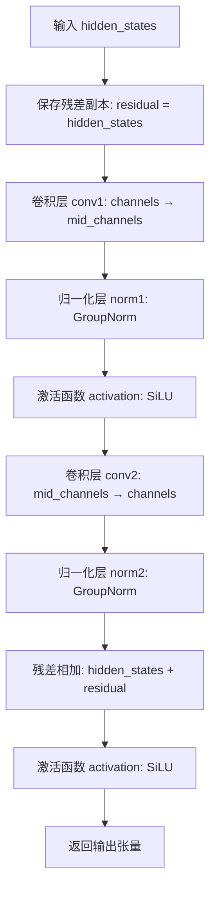
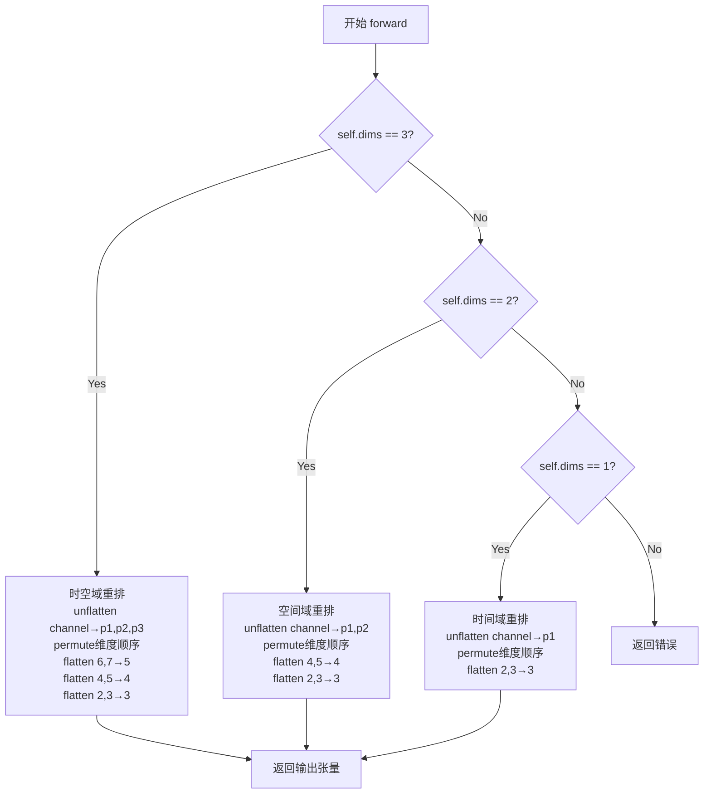

# `diffusers\src\diffusers\pipelines\ltx\modeling_latent_upsampler.py` 详细设计文档

该代码实现了一个用于VAE潜在空间上采样的神经网络模型（LTXLatentUpsamplerModel），支持2D/3D空间上采样和时间维度上采样，包含残差块（ResBlock）和像素重排（PixelShuffleND）两个核心组件，可将低分辨率的VAE潜在表示升采样到更高分辨率。

## 整体流程



## 类结构

```
torch.nn.Module (PyTorch基类)
├── ResBlock (残差块)
├── PixelShuffleND (像素重排模块)
└── LTXLatentUpsamplerModel (主模型类, 继承 ModelMixin, ConfigMixin)
```

## 全局变量及字段


### `ResBlock.conv1`
    
第一个卷积层

类型：`Conv2d/Conv3d`
    


### `ResBlock.norm1`
    
第一个归一化层

类型：`GroupNorm`
    


### `ResBlock.conv2`
    
第二个卷积层

类型：`Conv2d/Conv3d`
    


### `ResBlock.norm2`
    
第二个归一化层

类型：`GroupNorm`
    


### `ResBlock.activation`
    
激活函数

类型：`SiLU`
    


### `PixelShuffleND.dims`
    
维度数(1/2/3)

类型：`int`
    


### `PixelShuffleND.upscale_factors`
    
上采样因子

类型：`tuple`
    


### `LTXLatentUpsamplerModel.in_channels`
    
输入通道数

类型：`int`
    


### `LTXLatentUpsamplerModel.mid_channels`
    
中间层通道数

类型：`int`
    


### `LTXLatentUpsamplerModel.num_blocks_per_stage`
    
每阶段残差块数量

类型：`int`
    


### `LTXLatentUpsamplerModel.dims`
    
卷积维度

类型：`int`
    


### `LTXLatentUpsamplerModel.spatial_upsample`
    
是否空间上采样

类型：`bool`
    


### `LTXLatentUpsamplerModel.temporal_upsample`
    
是否时间上采样

类型：`bool`
    


### `LTXLatentUpsamplerModel.initial_conv`
    
初始卷积层

类型：`Conv2d/Conv3d`
    


### `LTXLatentUpsamplerModel.initial_norm`
    
初始归一化层

类型：`GroupNorm`
    


### `LTXLatentUpsamplerModel.initial_activation`
    
初始激活函数

类型：`SiLU`
    


### `LTXLatentUpsamplerModel.res_blocks`
    
残差块列表

类型：`ModuleList`
    


### `LTXLatentUpsamplerModel.upsampler`
    
上采样器

类型：`Sequential`
    


### `LTXLatentUpsamplerModel.post_upsample_res_blocks`
    
上采样后残差块列表

类型：`ModuleList`
    


### `LTXLatentUpsamplerModel.final_conv`
    
最终卷积层

类型：`Conv2d/Conv3d`
    
    

## 全局函数及方法


### `ResBlock.__init__`

初始化残差块（Residual Block），用于构建深度神经网络中的残差连接结构。该方法根据指定的维度参数创建 2D 或 3D 卷积层、GroupNorm 归一化层和 SiLU 激活函数，构成一个包含跳跃连接的基础残差单元。

参数：

- `channels`：`int`，输入和输出特征的通道数，残差块保持该维度不变
- `mid_channels`：`int | None`，中间层通道数，默认为 `None`（此时等于 `channels`），用于控制残差块内部隐藏层的宽度
- `dims`：`int`，卷积维度，值为 2 时使用 `Conv2d`，值为 3 时使用 `Conv3d`，默认为 3

返回值：`None`，`__init__` 方法不返回值，仅初始化对象属性

#### 流程图

```mermaid
flowchart TD
    A[开始 __init__] --> B[调用 super().__init__]
    B --> C{mid_channels is None?}
    C -->|是| D[设置 mid_channels = channels]
    C -->|否| E[保持 mid_channels 不变]
    D --> F{dims == 2?}
    E --> F
    F -->|是| G[Conv = torch.nn.Conv2d]
    F -->|否| H[Conv = torch.nn.Conv3d]
    G --> I[创建 conv1: Conv(channels, mid_channels, 3x3, padding=1)]
    H --> I
    I --> J[创建 norm1: GroupNorm(32, mid_channels)]
    J --> K[创建 conv2: Conv(mid_channels, channels, 3x3, padding=1)]
    K --> L[创建 norm2: GroupNorm(32, channels)]
    L --> M[创建 activation: SiLU]
    M --> N[结束 __init__]
```

#### 带注释源码

```python
def __init__(self, channels: int, mid_channels: int | None = None, dims: int = 3):
    """
    初始化残差块
    
    参数:
        channels: 输入输出通道数
        mid_channels: 中间层通道数，默认为 channels
        dims: 卷积维度，2 或 3
    """
    # 调用父类 Module 的初始化方法
    super().__init__()
    
    # 如果未指定中间通道数，则使用与输入相同的通道数
    if mid_channels is None:
        mid_channels = channels

    # 根据维度选择卷积类型：2D 或 3D
    Conv = torch.nn.Conv2d if dims == 2 else torch.nn.Conv3d

    # 第一个卷积层：channels -> mid_channels
    self.conv1 = Conv(channels, mid_channels, kernel_size=3, padding=1)
    # 第一个 GroupNorm 归一化层，对 mid_channels 个通道进行分组归一化
    self.norm1 = torch.nn.GroupNorm(32, mid_channels)
    
    # 第二个卷积层：mid_channels -> channels（残差连接回到原始通道数）
    self.conv2 = Conv(mid_channels, channels, kernel_size=3, padding=1)
    # 第二个 GroupNorm 归一化层，对 channels 个通道进行分组归一化
    self.norm2 = torch.nn.GroupNorm(32, channels)
    
    # SiLU 激活函数（Sigmoid Linear Unit），即 Swish 激活函数
    self.activation = torch.nn.SiLU()
```


### `ResBlock.forward`

执行残差块的前向传播，对输入张量进行两次卷积、归一化和激活操作，并通过残差连接将原始输入与输出相加，以实现特征融合与梯度流动。

参数：

- `hidden_states`：`torch.Tensor`，输入的隐藏状态张量，通常为特征图，形状为 (batch, channels, depth/frames, height, width) 或 (batch, channels, height, width)

返回值：`torch.Tensor`，经过残差块处理后的输出张量，与输入形状相同

#### 流程图



#### 带注释源码

```python
def forward(self, hidden_states: torch.Tensor) -> torch.Tensor:
    """
    ResBlock的前向传播方法
    
    参数:
        hidden_states: 输入张量，形状为 (batch, channels, depth/frames, height, width) 
                      或 (batch, channels, height, width)
    
    返回:
        经过残差块处理后的张量，形状与输入相同
    """
    # Step 1: 保存原始输入作为残差连接
    # residual 用于后续的残差连接，帮助梯度流动
    residual = hidden_states
    
    # Step 2: 第一次卷积: 将通道数从 channels 转换为 mid_channels
    hidden_states = self.conv1(hidden_states)
    
    # Step 3: 第一次归一化: GroupNorm，归一化通道维度
    hidden_states = self.norm1(hidden_states)
    
    # Step 4: 第一次激活: SiLU (Sigmoid Linear Unit) 非线性变换
    hidden_states = self.activation(hidden_states)
    
    # Step 5: 第二次卷积: 将通道数从 mid_channels 转换回 channels
    hidden_states = self.conv2(hidden_states)
    
    # Step 6: 第二次归一化: GroupNorm
    hidden_states = self.norm2(hidden_states)
    
    # Step 7: 残差连接: 将原始输入与当前特征相加
    # 这是残差网络的核心设计: output = F(x) + x
    hidden_states = self.activation(hidden_states + residual)
    
    # Step 8: 返回处理后的张量
    return hidden_states
```


### `PixelShuffleND.__init__`

初始化 PixelShuffleND 模块，用于实现 N 维像素重排（Pixel Shuffle）操作，支持 1D（时序）、2D（空间）和 3D（时空）上采样。

参数：

- `dims`：`int`，维度参数，取值范围为 1、2 或 3，分别对应时序上采样、空间上采样和时空联合上采样
- `upscale_factors`：`tuple[int, ...]`，上采样因子元组，默认为 (2, 2, 2)，用于指定各维度的上采样倍数

返回值：`None`，该方法为初始化方法，不返回任何值，仅设置实例属性

#### 流程图

```mermaid
flowchart TD
    A[开始 __init__] --> B[调用父类初始化 super().__init__]
    B --> C[设置 self.dims = dims]
    C --> D[设置 self.upscale_factors = upscale_factors]
    D --> E{检查 dims 是否在 [1, 2, 3] 中}
    E -->|是| F[初始化完成，返回]
    E -->|否| G[抛出 ValueError: dims must be 1, 2, or 3]
```

#### 带注释源码

```python
class PixelShuffleND(torch.nn.Module):
    def __init__(self, dims, upscale_factors=(2, 2, 2)):
        """
        初始化 PixelShuffleND 模块。
        
        参数:
            dims: 整数，取值范围 [1, 2, 3]，表示处理的维度
            upscale_factors: 元组，表示各维度的上采样因子，默认为 (2, 2, 2)
        """
        # 调用父类 torch.nn.Module 的初始化方法
        super().__init__()

        # 将维度参数存储为实例属性，供 forward 方法中使用
        self.dims = dims
        
        # 将上采样因子存储为实例属性，用于控制各维度的上采样倍数
        self.upscale_factors = upscale_factors

        # 参数校验：dims 必须是 1、2 或 3 之一
        # 1D: 时序上采样 (temporal)
        # 2D: 空间上采样 (spatial) 
        # 3D: 时空联合上采样 (spatiotemporal)
        if dims not in [1, 2, 3]:
            raise ValueError("dims must be 1, 2, or 3")
```


### `PixelShuffleND.forward(x)`

执行 N 维像素重排（Pixel Shuffle）操作，根据指定的维度数（1D、2D 或 3D）对输入张量进行上采样重排，将通道维度的像素重新排列到空间/时间维度。

参数：

- `x`：`torch.Tensor`，输入张量，形状因 `dims` 而异：
  - dims=3: 形状为 `(batch, channels * p1 * p2 * p3, depth, height, width)`
  - dims=2: 形状为 `(batch, channels * p1 * p2, height, width)`
  - dims=1: 形状为 `(batch, channels * p1, frames, height, width)`

返回值：`torch.Tensor`，重排后的输出张量，尺寸根据 `upscale_factors` 放大：
- dims=3: 形状变为 `(batch, channels, depth * p1, height * p2, width * p3)`
- dims=2: 形状变为 `(batch, channels, height * p1, width * p2)`
- dims=1: 形状变为 `(batch, channels, frames * p1, height, width)`

#### 流程图



#### 带注释源码

```python
def forward(self, x):
    """
    前向传播，执行像素重排上采样
    
    参数:
        x: 输入张量，通道维度包含上采样因子
           - dims=3: b (c*p1*p2*p3) d h w
           - dims=2: b (c*p1*p2) h w  
           - dims=1: b (c*p1) f h w
    
    返回:
        重排后的张量，空间/时间维度被放大
           - dims=3: b c (d*p1) (h*p2) (w*p3)
           - dims=2: b c (h*p1) (w*p2)
           - dims=1: b c (f*p1) h w
    """
    if self.dims == 3:
        # 时空域重排：处理视频/3D数据
        # 输入: b (c p1 p2 p3) d h w → 输出: b c (d p1) (h p2) (w p3)
        return (
            x.unflatten(1, (-1, *self.upscale_factors[:3]))  # 将通道维展开为(p1,p2,p3)和剩余通道
            .permute(0, 1, 5, 2, 6, 3, 7, 4)                  # 重新排列维度顺序，将p3移到深度维，p2移到高度维，p1移到宽度维
            .flatten(6, 7)                                    # 合并最后两个维度 (w p3) → w
            .flatten(4, 5)                                    # 合并维度 (h p2) → h
            .flatten(2, 3)                                    # 合并维度 (d p1) → d
        )
    elif self.dims == 2:
        # 空间域重排：处理图像/2D数据
        # 输入: b (c p1 p2) h w → 输出: b c (h p1) (w p2)
        return (
            x.unflatten(1, (-1, *self.upscale_factors[:2]))   # 将通道维展开为(p1,p2)和剩余通道
            .permute(0, 1, 4, 2, 5, 3)                        # 重新排列维度顺序，将p2移到宽度维，p1移到高度维
            .flatten(4, 5)                                    # 合并最后两个维度 (w p2) → w
            .flatten(2, 3)                                    # 合并维度 (h p1) → h
        )
    elif self.dims == 1:
        # 时间域重排：处理序列/1D数据
        # 输入: b (c p1) f h w → 输出: b c (f p1) h w
        return x.unflatten(1, (-1, *self.upscale_factors[:1]))  # 将通道维展开为(p1)和剩余通道
               .permute(0, 1, 3, 2, 4, 5)                         # 重新排列维度顺序，将p1移到帧维度
               .flatten(2, 3)                                    # 合并维度 (f p1) → f
```


### `LTXLatentUpsamplerModel.__init__`

该方法是 `LTXLatentUpsamplerModel` 类的初始化方法，用于构建一个用于空间上采样 VAE 潜变量的深度学习模型。它配置模型的通道数、维度、残差块数量以及上采样模式，并根据参数构建完整的网络架构，包括初始卷积层、残差块组、上采样器和后处理卷积层。

参数：

- `in_channels`：`int`，默认值 `128`，输入潜变量的通道数
- `mid_channels`：`int`，默认值 `512`，中间层的通道数
- `num_blocks_per_stage`：`int`，默认值 `4`，每个阶段（上采样前/后）使用的 ResBlock 数量
- `dims`：`int`，默认值 `3`，卷积的维度（2 或 3，对应 2D 或 3D 卷积）
- `spatial_upsample`：`bool`，默认值 `True`，是否进行空间上采样
- `temporal_upsample`：`bool`，默认值 `False`，是否进行时间上采样

返回值：`None`，初始化方法不返回任何值，仅构建模型结构

#### 流程图

```mermaid
flowchart TD
    A[开始 __init__] --> B[调用 super().__init__]
    B --> C[保存配置参数<br/>in_channels, mid_channels, num_blocks_per_stage<br/>dims, spatial_upsample, temporal_upsample]
    C --> D{确定 ConvNd 类型}
    D -->|dims == 2| E[使用 torch.nn.Conv2d]
    D -->|dims == 3| F[使用 torch.nn.Conv3d]
    E --> G[创建初始卷积层 initial_conv]
    F --> G
    G --> H[创建初始归一化 initial_norm<br/>和激活函数 initial_activation]
    H --> I[创建残差块列表 res_blocks<br/>数量为 num_blocks_per_stage]
    I --> J{确定上采样模式}
    J -->|spatial_upsample && temporal_upsample| K[创建3D上采样器<br/>upsampler = Conv3d + PixelShuffleND]
    J -->|spatial_upsample only| L[创建2D上采样器<br/>upsampler = Conv2d + PixelShuffleND]
    J -->|temporal_upsample only| M[创建1D上采样器<br/>upsampler = Conv3d + PixelShuffleND]
    K --> N[创建后处理残差块列表<br/>post_upsample_res_blocks]
    L --> N
    M --> N
    N --> O[创建最终卷积层 final_conv]
    O --> P[结束 __init__]
```

#### 带注释源码

```python
@register_to_config
def __init__(
    self,
    in_channels: int = 128,          # 输入潜变量的通道数，默认128
    mid_channels: int = 512,          # 中间层通道数，默认512
    num_blocks_per_stage: int = 4,    # 每个阶段的ResBlock数量，默认4
    dims: int = 3,                    # 卷积维度，2表示2D，3表示3D，默认3
    spatial_upsample: bool = True,    # 是否启用空间上采样，默认True
    temporal_upsample: bool = False,  # 是否启用时间上采样，默认False
):
    # 调用父类初始化方法，完成基础模型初始化
    super().__init__()

    # 保存配置参数到实例属性
    self.in_channels = in_channels
    self.mid_channels = mid_channels
    self.num_blocks_per_stage = num_blocks_per_stage
    self.dims = dims
    self.spatial_upsample = spatial_upsample
    self.temporal_upsample = temporal_upsample

    # 根据dims选择正确的卷积类：2D卷积或3D卷积
    ConvNd = torch.nn.Conv2d if dims == 2 else torch.nn.Conv3d

    # ========== 初始卷积阶段 ==========
    # 创建初始卷积层：将输入通道映射到中间通道
    self.initial_conv = ConvNd(in_channels, mid_channels, kernel_size=3, padding=1)
    # 创建群归一化层，用于稳定训练
    self.initial_norm = torch.nn.GroupNorm(32, mid_channels)
    # 创建SiLU激活函数
    self.initial_activation = torch.nn.SiLU()

    # ========== 残差块阶段 ==========
    # 创建多个ResBlock组成的模块列表，用于特征提取
    self.res_blocks = torch.nn.ModuleList([
        ResBlock(mid_channels, dims=dims) 
        for _ in range(num_blocks_per_stage)
    ])

    # ========== 上采样阶段 ==========
    # 根据spatial_upsample和temporal_upsample的配置选择对应的上采样器
    if spatial_upsample and temporal_upsample:
        # 空间和时间同时上采样：使用3D卷积+3D像素打乱
        self.upsampler = torch.nn.Sequential(
            torch.nn.Conv3d(mid_channels, 8 * mid_channels, kernel_size=3, padding=1),
            PixelShuffleND(3),
        )
    elif spatial_upsample:
        # 仅空间上采样：使用2D卷积+2D像素打乱
        self.upsampler = torch.nn.Sequential(
            torch.nn.Conv2d(mid_channels, 4 * mid_channels, kernel_size=3, padding=1),
            PixelShuffleND(2),
        )
    elif temporal_upsample:
        # 仅时间上采样：使用3D卷积+1D像素打乱
        self.upsampler = torch.nn.Sequential(
            torch.nn.Conv3d(mid_channels, 2 * mid_channels, kernel_size=3, padding=1),
            PixelShuffleND(1),
        )
    else:
        # 错误处理：必须至少选择一种上采样方式
        raise ValueError("Either spatial_upsample or temporal_upsample must be True")

    # ========== 后处理阶段 ==========
    # 创建上采样后的残差块列表
    self.post_upsample_res_blocks = torch.nn.ModuleList([
        ResBlock(mid_channels, dims=dims) 
        for _ in range(num_blocks_per_stage)
    ])

    # 创建最终卷积层：将中间通道映射回输入通道
    self.final_conv = ConvNd(mid_channels, in_channels, kernel_size=3, padding=1)
```


### `LTXLatentUpsamplerModel.forward`

该方法实现了VAE潜在空间的上采样功能，通过初始卷积、残差块、上采样模块和后处理残差块对输入的隐藏状态进行空间或时间维度的上采样，支持2D和3D卷积操作。

参数：

- `hidden_states`：`torch.Tensor`，输入的隐藏状态张量，形状为 `(batch_size, num_channels, num_frames, height, width)`

返回值：`torch.Tensor`，上采样后的隐藏状态张量，尺寸相对于输入在空间（height, width）或时间（num_frames）维度上放大

#### 流程图

```mermaid
flowchart TD
    A[开始 forward] --> B[获取 hidden_states 形状: batch_size, num_channels, num_frames, height, width]
    B --> C{dims == 2?}
    
    %% 2D 分支
    C -->|Yes| D[2D处理分支]
    D --> D1[permute: (0,2,1,3,4) -> flatten(0,1) 合并batch和frame]
    D1 --> D2[initial_conv]
    D2 --> D3[initial_norm]
    D3 --> D4[initial_activation]
    D4 --> D5{遍历 res_blocks}
    D5 -->|每 block| D6[block.forward]
    D5 --> D7[upsampler]
    D7 --> D8{遍历 post_upsample_res_blocks}
    D8 -->|每 block| D9[block.forward]
    D9 --> D10[final_conv]
    D10 --> D11[unflatten(0, (batch_size,-1))]
    D11 --> D12[permute: (0,2,1,3,4) 恢复形状]
    D12 --> Z[返回 hidden_states]
    
    %% 3D 分支
    C -->|No| E[3D处理分支]
    E --> E1[initial_conv]
    E1 --> E2[initial_norm]
    E2 --> E3[initial_activation]
    E3 --> E4{遍历 res_blocks}
    E4 -->|每 block| E5[block.forward]
    E5 --> E6{temporal_upsample?}
    
    %% 时间上采样
    E6 -->|Yes| E7[upsampler]
    E7 --> E8[切片: [:, :, 1:, :, :] 移除首帧]
    E8 --> E9{遍历 post_upsample_res_blocks}
    
    %% 空间上采样
    E6 -->|No| E10[permute + flatten 合并batch和channel]
    E10 --> E11[upsampler]
    E11 --> E12[unflatten + permute 恢复形状]
    E12 --> E9
    
    E9 -->|每 block| E13[block.forward]
    E13 --> E14[final_conv]
    E14 --> Z
```

#### 带注释源码

```python
def forward(self, hidden_states: torch.Tensor) -> torch.Tensor:
    """
    前向传播：对 VAE latent 进行上采样
    
    参数:
        hidden_states: 输入张量，形状为 (batch_size, num_channels, num_frames, height, width)
        
    返回:
        上采样后的张量，在空间或时间维度上放大
    """
    # 获取输入张量的维度信息
    batch_size, num_channels, num_frames, height, width = hidden_states.shape

    # 根据维度选择不同的处理路径
    if self.dims == 2:
        # ===== 2D 处理分支 (仅空间上采样) =====
        
        # 维度重排: (b, c, f, h, w) -> (b*f, c, h, w)
        # 合并 batch 和 frame 维度，以便使用 2D 卷积
        hidden_states = hidden_states.permute(0, 2, 1, 3, 4).flatten(0, 1)
        
        # 初始卷积块：通道转换和特征提取
        hidden_states = self.initial_conv(hidden_states)
        hidden_states = self.initial_norm(hidden_states)
        hidden_states = self.initial_activation(hidden_states)

        # 通过多个残差块进行特征处理
        for block in self.res_blocks:
            hidden_states = block(hidden_states)

        # 上采样操作 (空间2倍上采样)
        hidden_states = self.upsampler(hidden_states)

        # 后处理残差块
        for block in self.post_upsample_res_blocks:
            hidden_states = block(hidden_states)

        # 最终卷积输出
        hidden_states = self.final_conv(hidden_states)
        
        # 恢复原始维度布局: (b*f, c, h, w) -> (b, c, f, h, w)
        hidden_states = hidden_states.unflatten(0, (batch_size, -1)).permute(0, 2, 1, 3, 4)
    else:
        # ===== 3D 处理分支 (支持空间或时间上采样) =====
        
        # 初始卷积块：保持时空结构
        hidden_states = self.initial_conv(hidden_states)
        hidden_states = self.initial_norm(hidden_states)
        hidden_states = self.initial_activation(hidden_states)

        # 预上采样残差块
        for block in self.res_blocks:
            hidden_states = block(hidden_states)

        if self.temporal_upsample:
            # 时间上采样路径
            hidden_states = self.upsampler(hidden_states)
            # 切片移除因 PixelShuffle 产生的首帧（避免重复）
            hidden_states = hidden_states[:, :, 1:, :, :]
        else:
            # 空间上采样路径
            # 维度重排: (b, c, f, h, w) -> (b, f, c, h, w) -> (b*f, c, h, w)
            hidden_states = hidden_states.permute(0, 2, 1, 3, 4).flatten(0, 1)
            hidden_states = self.upsampler(hidden_states)
            # 恢复维度: (b*f, c, h*2, w*2) -> (b, f, c, h*2, w*2) -> (b, c, f, h*2, w*2)
            hidden_states = hidden_states.unflatten(0, (batch_size, -1)).permute(0, 2, 1, 3, 4)

        # 后处理残差块
        for block in self.post_upsample_res_blocks:
            hidden_states = block(hidden_states)

        # 最终卷积输出
        hidden_states = self.final_conv(hidden_states)

    return hidden_states
```

## 关键组件


### ResBlock

残差块组件，包含两个卷积层、GroupNorm归一化和SiLU激活函数，用于在潜在空间中执行特征提取和残差连接。

### PixelShuffleND

N维像素重排上采样组件，支持1D、2D和3D维度，通过unflatten和permute操作实现空间或时间维度的上采样。

### LTXLatentUpsamplerModel

VAE潜在空间上采样主模型，支持空间上采样和时间上采样，包含初始卷积、多个ResBlock、上采样器和后处理残差块，负责将低分辨率的VAE latent转换为高分辨率表示。

### 初始卷积模块

包含ConvNd卷积、GroupNorm归一化和SiLU激活，用于将输入latent通道映射到中间通道空间。

### 上采样器模块

根据spatial_upsample和temporal_upsample配置选择不同的上采样策略（2D Conv + PixelShuffleND 或 3D Conv + PixelShuffleND）。

### 张量维度处理

针对2D和3D输入的维度重排逻辑，包括permute、flatten、unflatten等操作，确保不同维度下的张量形状正确变换。


## 问题及建议


### 已知问题

- **PixelShuffleND维度处理不一致**：对于dims=3的情况，代码使用`upscale_factors[:3]`，但对于dims=2使用`upscale_factors[:2]`，dims=1使用`upscale_factors[:1]`，这种切片方式在上采样因子数量不同时会产生不可预测的行为
- **temporal_upsample的特殊裁剪逻辑不透明**：`hidden_states[:, :, 1:, :, :]`这一操作在temporal_upsample时丢弃了第一帧，没有明确的文档说明为何要这样做，可能导致潜在的信息丢失或与其它模块集成时的兼容性问题
- **forward方法中dims=2和dims=3的处理分支差异过大**：两个分支的逻辑有大量重复但实现细节不同（如permute、flatten、unflatten操作），难以维护且容易引入bug
- **缺少输入验证**：没有对hidden_states的shape进行运行时检查，如果输入维度不符合预期（如dims=2但hidden_states是5D），会产生难以追踪的调试错误
- **mid_channels在upsampler中保持不变**：上采样后通道数增加（*8或*4或*2），但中间通道数未做相应调整，可能导致参数效率不佳

### 优化建议

- **统一维度处理逻辑**：提取公共的上采样和维度变换逻辑，使用策略模式或工厂方法减少分支代码
- **添加输入验证**：在forward方法开始时添加shape验证，确保输入符合dims配置的预期（如dims=2时应该是4D，dims=3时应该是5D）
- **文档化裁剪行为**：如果`[:, :, 1:, :, :]`的裁剪是有意为之，应在文档和注释中明确说明其目的；如果是bug，应修复
- **考虑使用更高效的Upsample实现**：可考虑使用torch.nn.functional.interpolate结合ChannelsLast内存格式提升性能
- **提取上采样配置为独立类**：将spatial_upsample和temporal_upsample的组合逻辑封装成配置类，减少主类中的条件分支

## 其它


### 设计目标与约束

该模块旨在对VAE latent进行高效的空间或时间上采样，采用残差块结构保证训练稳定性，支持2D/3D卷积以及空间/时间维度的独立或组合上采样。设计约束包括：dims参数仅支持1/2/3，spatial_upsample和temporal_upsample至少有一个为True，输入输出通道数保持一致以便于残差连接。

### 错误处理与异常设计

PixelShuffleND在初始化时检查dims参数是否为1/2/3，若否则抛出ValueError。LTXLatentUpsamplerModel在upsampler构建时检查spatial_upsample和temporal_upsample，至少一个为True否则抛出ValueError。forward方法假设输入hidden_states为5D张量(b,c,f,h,w)，对于2D模式需要特定形状处理。

### 数据流与状态机

数据流主要经历：初始卷积(normalize activation) -> 多个ResBlock -> 上采样 -> 多个Post-ResBlock -> 最终卷积。2D模式下会对时间维度进行展开处理后再上采样，3D模式下根据temporal_upsample标志选择不同的上采样路径。输入输出形状变化：空间上采样使h,w变为2倍，时间上采样使f变为2倍，通道数保持不变。

### 外部依赖与接口契约

依赖torch、configuration_utils(ConfigMixin, register_to_config)、models.modeling_utils(ModelMixin)。输入hidden_states要求为5D张量(batch_size, channels, num_frames, height, width)。输出与输入形状一致，仅尺寸按上采样因子变化。ModelMixin和ConfigMixin提供from_pretrained和save_pretrained支持。

### 配置参数详解

in_channels: 输入latent通道数，默认128，需与VAE编码器输出匹配。mid_channels: 中间层通道数，默认512，控制模型容量。num_blocks_per_stage: 每阶段ResBlock数量，默认4，平衡性能与参数量。dims: 卷积维度，2或3，默认3。spatial_upsample: 空间上采样开关，默认True。temporal_upsample: 时间上采样开关，默认False。

### 性能考虑与优化点

GroupNorm使用32个group，对通道数有要求(需能被32整除)。2D模式下时间维度展开可能导致显存峰值增加。PixelShuffle实现使用unflatten和permute，避免了手动reshape可能带来的对齐问题。ModuleList相比Sequential提供更细粒度的前向传播控制。

### 兼容性考虑

该模块设计用于LTXVideo相关模型，需与LTXVideoEncoder/Decoder配合使用。ConfigMixin和ModelMixin的继承确保了与HuggingFace Diffusers框架的兼容性。权重可通过save_pretrained保存并通过from_pretrained加载。

### 使用示例

```python
from ltx_video.models.upsample import LTXLatentUpsamplerModel

# 创建上采样器
model = LTXLatentUpsamplerModel(
    in_channels=128,
    mid_channels=512,
    num_blocks_per_stage=4,
    dims=3,
    spatial_upsample=True,
    temporal_upsample=False
)

# 前向传播
import torch
x = torch.randn(1, 128, 1, 32, 32)
output = model(x)  # (1, 128, 1, 64, 64)
```

    