# `diffusers\src\diffusers\pipelines\ltx\pipeline_ltx.py` 详细设计文档

LTXPipeline是一个用于文本到视频生成的Diffusion Pipeline，基于T5文本编码器、LTXVideoTransformer3DModel Transformer和AutoencoderKLLTXVideo VAE实现高质量视频生成。

## 整体流程

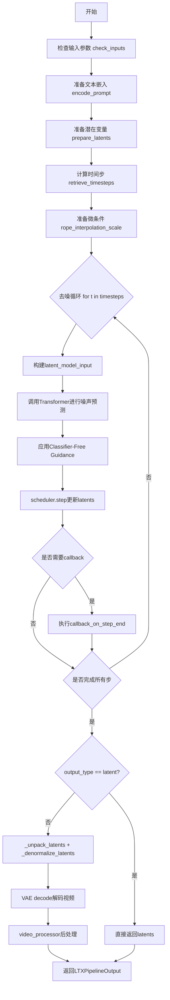

## 类结构

```
DiffusionPipeline (基类)
├── FromSingleFileMixin (混入类)
├── LTXVideoLoraLoaderMixin (混入类)
└── LTXPipeline (主类)
```

## 全局变量及字段


### `logger`
    
模块级日志记录器，用于输出警告和信息

类型：`logging.Logger`
    


### `EXAMPLE_DOC_STRING`
    
包含LTXPipeline使用示例的文档字符串

类型：`str`
    


### `XLA_AVAILABLE`
    
标识Torch XLA是否可用的布尔标志

类型：`bool`
    


### `LTXPipeline.model_cpu_offload_seq`
    
模型CPU卸载顺序序列，指定text_encoder->transformer->vae的卸载顺序

类型：`str`
    


### `LTXPipeline._optional_components`
    
可选组件列表，当前为空列表

类型：`list`
    


### `LTXPipeline._callback_tensor_inputs`
    
回调张量输入列表，定义可传递给回调的张量键

类型：`list`
    


### `LTXPipeline.vae_spatial_compression_ratio`
    
VAE空间压缩比率，用于将像素空间转换为潜在空间的压缩比例

类型：`int`
    


### `LTXPipeline.vae_temporal_compression_ratio`
    
VAE时间压缩比率，用于将帧数转换为潜在时间维度的压缩比例

类型：`int`
    


### `LTXPipeline.transformer_spatial_patch_size`
    
Transformer空间补丁大小，定义空间维度上的分块大小

类型：`int`
    


### `LTXPipeline.transformer_temporal_patch_size`
    
Transformer时间补丁大小，定义时间维度上的分块大小

类型：`int`
    


### `LTXPipeline.video_processor`
    
视频处理器，用于视频的后处理和格式转换

类型：`VideoProcessor`
    


### `LTXPipeline.tokenizer_max_length`
    
分词器最大长度，定义文本输入的最大token数

类型：`int`
    


### `LTXPipeline._guidance_scale`
    
无分类器引导尺度，控制文本提示对生成结果的影响程度

类型：`float`
    


### `LTXPipeline._guidance_rescale`
    
无分类器引导重缩放因子，用于修复过度曝光问题

类型：`float`
    


### `LTXPipeline._attention_kwargs`
    
注意力机制关键字参数字典，用于传递注意力处理的额外参数

类型：`dict`
    


### `LTXPipeline._interrupt`
    
中断标志，用于在去噪循环中控制是否中断生成过程

类型：`bool`
    


### `LTXPipeline._num_timesteps`
    
总时间步数，记录扩散过程的总去噪步数

类型：`int`
    


### `LTXPipeline._current_timestep`
    
当前时间步，记录去噪循环中当前执行的时间步

类型：`int`
    
    

## 全局函数及方法


### `calculate_shift`

计算基于图像序列长度的噪声调度偏移量，用于在扩散模型中调整时间步长schedule。

参数：

- `image_seq_len`：`int`，图像序列长度（即latent空间中视频帧数×高度×宽度）
- `base_seq_len`：`int`，默认值256，基础序列长度
- `max_seq_len`：`int`，默认值4096，最大序列长度
- `base_shift`：`float`，默认值0.5，基础偏移值
- `max_shift`：`float`，默认值1.15，最大偏移值

返回值：`float`，根据图像序列长度计算的偏移量 mu

#### 流程图

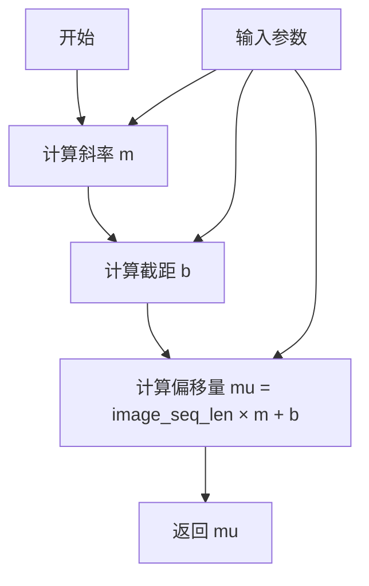

#### 带注释源码

```python
def calculate_shift(
    image_seq_len,
    base_seq_len: int = 256,
    max_seq_len: int = 4096,
    base_shift: float = 0.5,
    max_shift: float = 1.15,
):
    """
    计算基于图像序列长度的噪声调度偏移量。
    
    该函数通过线性插值，根据当前的图像序列长度计算对应的偏移值。
    这在处理不同分辨率或帧数的视频时，用于调整噪声调度的起始点。
    
    Args:
        image_seq_len: 图像序列长度，对应latent空间中的有效序列长度
        base_seq_len: 基础序列长度，默认256
        max_seq_len: 最大序列长度，默认4096
        base_shift: 基础偏移值，默认0.5
        max_shift: 最大偏移值，默认1.15
    
    Returns:
        float: 计算得到的偏移量mu，用于噪声调度器
    """
    # 计算线性斜率：最大偏移差 / 最大序列差
    m = (max_shift - base_shift) / (max_seq_len - base_seq_len)
    # 计算截距：使线性函数经过(base_seq_len, base_shift)点
    b = base_shift - m * base_seq_len
    # 计算最终的偏移量：线性函数 y = mx + b
    mu = image_seq_len * m + b
    return mu
```


### `retrieve_timesteps`

该函数是扩散模型管道中的核心工具函数，负责调用调度器的`set_timesteps`方法并从中获取时间步序列。它支持自定义时间步和sigma值，能够灵活处理不同的采样策略，同时通过参数检查确保调度器支持所请求的功能。

参数：

- `scheduler`：`SchedulerMixin`，要获取时间步的调度器对象
- `num_inference_steps`：`int | None`，生成样本时使用的扩散步数，若使用则`timesteps`必须为`None`
- `device`：`str | torch.device | None`，时间步应移动到的设备，若为`None`则不移动
- `timesteps`：`list[int] | None`，用于覆盖调度器时间步间隔策略的自定义时间步，若传入此参数则`num_inference_steps`和`sigmas`必须为`None`
- `sigmas`：`list[float] | None`，用于覆盖调度器时间步间隔策略的自定义sigma值，若传入此参数则`num_inference_steps`和`timesteps`必须为`None`
- `**kwargs`：任意关键字参数，将传递给调度器的`set_timesteps`方法

返回值：`tuple[torch.Tensor, int]`，元组第一个元素是调度器的时间步调度张量，第二个元素是推理步数

#### 流程图

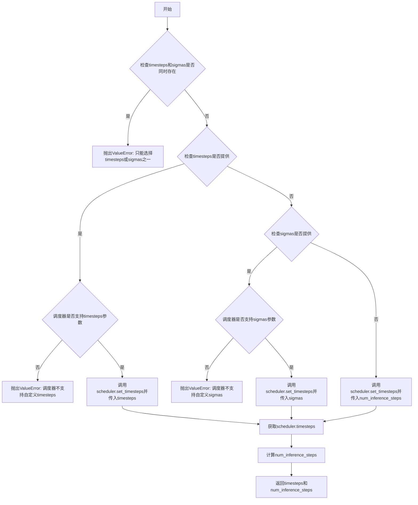

#### 带注释源码

```python
# Copied from diffusers.pipelines.stable_diffusion.pipeline_stable_diffusion.retrieve_timesteps
def retrieve_timesteps(
    scheduler,
    num_inference_steps: int | None = None,
    device: str | torch.device | None = None,
    timesteps: list[int] | None = None,
    sigmas: list[float] | None = None,
    **kwargs,
):
    r"""
    Calls the scheduler's `set_timesteps` method and retrieves timesteps from the scheduler after the call. Handles
    custom timesteps. Any kwargs will be supplied to `scheduler.set_timesteps`.

    Args:
        scheduler (`SchedulerMixin`):
            The scheduler to get timesteps from.
        num_inference_steps (`int`):
            The number of diffusion steps used when generating samples with a pre-trained model. If used, `timesteps`
            must be `None`.
        device (`str` or `torch.device`, *optional*):
            The device to which the timesteps should be moved to. If `None`, the timesteps are not moved.
        timesteps (`list[int]`, *optional*):
            Custom timesteps used to override the timestep spacing strategy of the scheduler. If `timesteps` is passed,
            `num_inference_steps` and `sigmas` must be `None`.
        sigmas (`list[float]`, *optional*):
            Custom sigmas used to override the timestep spacing strategy of the scheduler. If `sigmas` is passed,
            `num_inference_steps` and `timesteps` must be `None`.

    Returns:
        `tuple[torch.Tensor, int]`: A tuple where the first element is the timestep schedule from the scheduler and the
        second element is the number of inference steps.
    """
    # 检查是否同时传入了timesteps和sigmas，这是不允许的
    if timesteps is not None and sigmas is not None:
        raise ValueError("Only one of `timesteps` or `sigmas` can be passed. Please choose one to set custom values")
    
    # 处理自定义timesteps的情况
    if timesteps is not None:
        # 检查调度器的set_timesteps方法是否支持timesteps参数
        accepts_timesteps = "timesteps" in set(inspect.signature(scheduler.set_timesteps).parameters.keys())
        if not accepts_timesteps:
            raise ValueError(
                f"The current scheduler class {scheduler.__class__}'s `set_timesteps` does not support custom"
                f" timestep schedules. Please check whether you are using the correct scheduler."
            )
        # 调用调度器的set_timesteps方法并传入自定义timesteps
        scheduler.set_timesteps(timesteps=timesteps, device=device, **kwargs)
        # 从调度器获取更新后的timesteps
        timesteps = scheduler.timesteps
        # 计算推理步数
        num_inference_steps = len(timesteps)
    # 处理自定义sigmas的情况
    elif sigmas is not None:
        # 检查调度器的set_timesteps方法是否支持sigmas参数
        accept_sigmas = "sigmas" in set(inspect.signature(scheduler.set_timesteps).parameters.keys())
        if not accept_sigmas:
            raise ValueError(
                f"The current scheduler class {scheduler.__class__}'s `set_timesteps` does not support custom"
                f" sigmas schedules. Please check whether you are using the correct scheduler."
            )
        # 调用调度器的set_timesteps方法并传入自定义sigmas
        scheduler.set_timesteps(sigmas=sigmas, device=device, **kwargs)
        # 从调度器获取更新后的timesteps
        timesteps = scheduler.timesteps
        # 计算推理步数
        num_inference_steps = len(timesteps)
    # 处理默认情况，使用num_inference_steps设置时间步
    else:
        scheduler.set_timesteps(num_inference_steps, device=device, **kwargs)
        timesteps = scheduler.timesteps
    
    # 返回时间步序列和推理步数
    return timesteps, num_inference_steps
```

### 关键组件信息

| 组件名称 | 一句话描述 |
|---------|-----------|
| `inspect.signature` | 用于动态检查调度器`set_timesteps`方法支持的参数 |
| `scheduler.set_timesteps` | 调度器的核心方法，用于配置时间步/sigma序列 |
| `scheduler.timesteps` | 调度器内部存储的时间步张量 |

### 潜在技术债务或优化空间

1. **参数检查冗余**：使用`inspect.signature`进行参数检查的方式较为繁琐，可以考虑在调度器接口中显式声明支持的能力标志
2. **错误处理不够精确**：当前错误信息仅提示"请检查是否使用正确的调度器"，可以提供更具体的调度器兼容性列表
3. **缺少缓存机制**：对于相同的`num_inference_steps`和调度器配置，可以考虑缓存时间步结果以避免重复计算

### 其它项目

**设计目标与约束**：
- 该函数是"无状态"的工具函数，不维护任何内部状态
- 遵循开闭原则，通过`**kwargs`支持调度器的扩展参数
- 保持了与原有stable_diffusion pipeline的兼容性

**错误处理与异常设计**：
- 当`timesteps`和`sigs`同时存在时抛出`ValueError`
- 当调度器不支持自定义参数时抛出`ValueError`并给出清晰的错误提示
- 错误信息包含调度器类名，便于定位问题

**数据流与状态机**：
- 输入：调度器配置参数（num_inference_steps/timesteps/sigmas）
- 输出：时间步张量和推理步数
- 状态转换：调度器内部状态通过`set_timesteps`调用被更新

**外部依赖与接口契约**：
- 依赖`SchedulerMixin`接口（需实现`set_timesteps`方法和`timesteps`属性）
- 依赖Python标准库`inspect`模块
- 不直接依赖特定调度器实现，保持了良好的解耦性


### `rescale_noise_cfg`

该函数是一个全局工具函数，用于对噪声预测张量进行重新缩放，以改善图像质量并修复过度曝光问题。该方法基于论文 "Common Diffusion Noise Schedules and Sample Steps are Flawed" (Section 3.4)，通过计算文本引导噪声预测的标准差与配置噪声预测的标准差之比来重新缩放噪声预测，然后根据 guidance_rescale 参数混合原始噪声预测和重新缩放后的噪声预测。

参数：

- `noise_cfg`：`torch.Tensor`，引导扩散过程中预测的噪声张量
- `noise_pred_text`：`torch.Tensor`，文本引导扩散过程中预测的噪声张量
- `guidance_rescale`：`float`，可选，默认为 0.0，应用到噪声预测的重缩放因子

返回值：`torch.Tensor`，重新缩放后的噪声预测张量

#### 流程图

```mermaid
flowchart TD
    A[开始] --> B[计算 noise_pred_text 的标准差 std_text]
    B --> C[计算 noise_cfg 的标准差 std_cfg]
    C --> D[计算重缩放后的噪声预测 noise_pred_rescaled = noise_cfg × (std_text / std_cfg)]
    D --> E[计算混合后的噪声预测<br/>noise_cfg = guidance_rescale × noise_pred_rescaled + (1 - guidance_rescale) × noise_cfg]
    E --> F[返回重新缩放后的 noise_cfg]
```

#### 带注释源码

```python
# Copied from diffusers.pipelines.stable_diffusion.pipeline_stable_diffusion.rescale_noise_cfg
def rescale_noise_cfg(noise_cfg, noise_pred_text, guidance_rescale=0.0):
    r"""
    Rescales `noise_cfg` tensor based on `guidance_rescale` to improve image quality and fix overexposure. Based on
    Section 3.4 from [Common Diffusion Noise Schedules and Sample Steps are
    Flawed](https://huggingface.co/papers/2305.08891).

    Args:
        noise_cfg (`torch.Tensor`):
            The predicted noise tensor for the guided diffusion process.
        noise_pred_text (`torch.Tensor`):
            The predicted noise tensor for the text-guided diffusion process.
        guidance_rescale (`float`, *optional*, defaults to 0.0):
            A rescale factor applied to the noise predictions.

    Returns:
        noise_cfg (`torch.Tensor`): The rescaled noise prediction tensor.
    """
    # 计算文本预测噪声在所有空间/时间维度（保留批次维度）上的标准差
    # std_text 表示文本引导噪声预测的标准差，用于确定目标分布的尺度
    std_text = noise_pred_text.std(dim=list(range(1, noise_pred_text.ndim)), keepdim=True)
    
    # 计算配置噪声预测在所有空间/时间维度（保留批次维度）上的标准差
    # std_cfg 表示当前引导噪声预测的标准差
    std_cfg = noise_cfg.std(dim=list(range(1, noise_cfg.ndim)), keepdim=True)
    
    # rescale the results from guidance (fixes overexposure)
    # 通过将噪声预测乘以标准差之比来重新缩放噪声预测
    # 这一步将 noise_cfg 的尺度调整到与 noise_pred_text 相同的分布
    noise_pred_rescaled = noise_cfg * (std_text / std_cfg)
    
    # mix with the original results from guidance by factor guidance_rescale to avoid "plain looking" images
    # 使用 guidance_rescale 作为混合因子，在重新缩放的结果和原始结果之间进行线性插值
    # guidance_rescale=0.0 时完全使用原始 noise_cfg，guidance_rescale=1.0 时完全使用重新缩放的结果
    # 这种混合可以避免图像看起来"平淡无奇"
    noise_cfg = guidance_rescale * noise_pred_rescaled + (1 - guidance_rescale) * noise_cfg
    
    return noise_cfg
```


### `LTXPipeline.__init__`

这是LTXPipeline类的构造函数，用于初始化文本转视频生成管道。该方法接收调度器、VAE模型、文本编码器、分词器和变换器等核心组件，并通过注册模块、配置压缩比和补丁大小等参数来设置管道的运行环境。

参数：

- `scheduler`：`FlowMatchEulerDiscreteScheduler`，用于去噪过程的调度器
- `vae`：`AutoencoderKLLTXVideo`，用于编码和解码视频潜在表示的变分自编码器模型
- `text_encoder`：`T5EncoderModel`，用于将文本提示编码为嵌入的T5编码器模型
- `tokenizer`：`T5TokenizerFast`，用于将文本提示分词为token的T5快速分词器
- `transformer`：`LTXVideoTransformer3DModel`，用于对编码视频潜在表示进行去噪的条件变换器架构

返回值：`None`，构造函数不返回任何值，仅初始化实例属性

#### 流程图

```mermaid
flowchart TD
    A[开始 __init__] --> B[调用 super().__init__ 初始化基类]
    B --> C[使用 register_modules 注册 vae, text_encoder, tokenizer, transformer, scheduler]
    C --> D{检查 vae 是否存在}
    D -->|是| E[获取 vae.spatial_compression_ratio]
    D -->|否| F[使用默认值 32]
    E --> G[获取 vae.temporal_compression_ratio 或默认值 8]
    G --> H{检查 transformer 是否存在}
    H -->|是| I[获取 transformer.config.patch_size]
    H -->|否| J[使用默认值 1]
    I --> K[获取 transformer.config.patch_size_t 或默认值 1]
    K --> L[创建 VideoProcessor 使用 vae_spatial_compression_ratio]
    L --> M[获取 tokenizer.model_max_length 或默认值 128]
    M --> N[结束 __init__]
```

#### 带注释源码

```python
def __init__(
    self,
    scheduler: FlowMatchEulerDiscreteScheduler,
    vae: AutoencoderKLLTXVideo,
    text_encoder: T5EncoderModel,
    tokenizer: T5TokenizerFast,
    transformer: LTXVideoTransformer3DModel,
):
    """
    初始化LTXPipeline管道实例。
    
    参数:
        scheduler: FlowMatchEulerDiscreteScheduler调度器，用于去噪过程
        vae: AutoencoderKLLTXVideo VAE模型，用于视频编解码
        text_encoder: T5EncoderModel T5文本编码器
        tokenizer: T5TokenizerFast T5分词器
        transformer: LTXVideoTransformer3DModel 3D变换器模型
    """
    # 调用父类DiffusionPipeline的初始化方法
    super().__init__()

    # 注册所有模块到管道中，使其可通过self访问
    self.register_modules(
        vae=vae,
        text_encoder=text_encoder,
        tokenizer=tokenizer,
        transformer=transformer,
        scheduler=scheduler,
    )

    # 配置VAE的空间压缩比（默认32），用于将像素空间映射到潜在空间
    self.vae_spatial_compression_ratio = (
        self.vae.spatial_compression_ratio if getattr(self, "vae", None) is not None else 32
    )
    
    # 配置VAE的时间压缩比（默认8），用于处理视频帧的时间维度
    self.vae_temporal_compression_ratio = (
        self.vae.temporal_compression_ratio if getattr(self, "vae", None) is not None else 8
    )
    
    # 配置变换器的空间补丁大小，用于将潜在表示分块处理
    self.transformer_spatial_patch_size = (
        self.transformer.config.patch_size if getattr(self, "transformer", None) is not None else 1
    )
    
    # 配置变换器的时间补丁大小，用于处理时间维度
    self.transformer_temporal_patch_size = (
        self.transformer.config.patch_size_t if getattr(self, "transformer") is not None else 1
    )

    # 创建视频处理器，用于视频的后处理（如格式转换、归一化等）
    self.video_processor = VideoProcessor(vae_scale_factor=self.vae_spatial_compression_ratio)
    
    # 配置分词器的最大序列长度（默认128），用于文本编码
    self.tokenizer_max_length = (
        self.tokenizer.model_max_length if getattr(self, "tokenizer", None) is not None else 128
    )
```


### `LTXPipeline._get_t5_prompt_embeds`

该方法用于将文本提示（prompt）通过T5编码器转换为嵌入向量（embeddings），支持批量处理和每个提示生成多个视频的场景，同时处理注意力掩码并对嵌入进行复制以匹配生成数量。

参数：

- `prompt`：`str | list[str]`，待编码的文本提示，可以是单个字符串或字符串列表
- `num_videos_per_prompt`：`int`，每个提示要生成的视频数量，默认为1
- `max_sequence_length`：`int`，文本序列的最大长度，默认为128
- `device`：`torch.device | None`，指定计算设备，默认为None（使用执行设备）
- `dtype`：`torch.dtype | None`，指定数据类型，默认为None（使用文本编码器的dtype）

返回值：`tuple[torch.Tensor, torch.Tensor]`，返回两个张量——第一个是文本提示的嵌入向量（prompt_embeds），形状为 `[batch_size * num_videos_per_prompt, seq_len, hidden_dim]`；第二个是注意力掩码（prompt_attention_mask），形状为 `[batch_size * num_videos_per_prompt, seq_len]`

#### 流程图

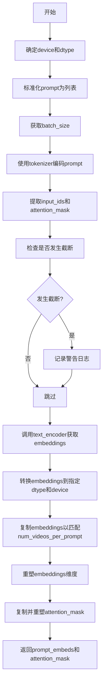

#### 带注释源码

```python
def _get_t5_prompt_embeds(
    self,
    prompt: str | list[str] = None,
    num_videos_per_prompt: int = 1,
    max_sequence_length: int = 128,
    device: torch.device | None = None,
    dtype: torch.dtype | None = None,
):
    """
    将文本提示编码为T5嵌入向量
    
    参数:
        prompt: 输入的文本提示，字符串或字符串列表
        num_videos_per_prompt: 每个提示生成的视频数量
        max_sequence_length: 最大序列长度
        device: 计算设备
        dtype: 数据类型
    
    返回:
        (prompt_embeds, prompt_attention_mask): 嵌入向量和注意力掩码
    """
    # 如果未指定device，则使用管道的执行设备
    device = device or self._execution_device
    # 如果未指定dtype，则使用文本编码器的数据类型
    dtype = dtype or self.text_encoder.dtype

    # 将单个字符串转换为列表，便于批量处理
    prompt = [prompt] if isinstance(prompt, str) else prompt
    # 获取批次大小
    batch_size = len(prompt)

    # 使用T5 tokenizer对prompt进行编码
    # padding="max_length": 填充到最大长度
    # truncation=True: 截断超过最大长度的序列
    # add_special_tokens=True: 添加特殊 tokens (如 EOS)
    # return_tensors="pt": 返回PyTorch张量
    text_inputs = self.tokenizer(
        prompt,
        padding="max_length",
        max_length=max_sequence_length,
        truncation=True,
        add_special_tokens=True,
        return_tensors="pt",
    )
    # 提取输入IDs和注意力掩码
    text_input_ids = text_inputs.input_ids
    prompt_attention_mask = text_inputs.attention_mask
    # 将注意力掩码转换为布尔值并移动到指定设备
    prompt_attention_mask = prompt_attention_mask.bool().to(device)

    # 使用最长填充获取未截断的输入ID，用于检测截断
    untruncated_ids = self.tokenizer(prompt, padding="longest", return_tensors="pt").input_ids

    # 检查是否发生了截断
    if untruncated_ids.shape[-1] >= text_input_ids.shape[-1] and not torch.equal(text_input_ids, untruncated_ids):
        # 解码被截断的部分并记录警告
        removed_text = self.tokenizer.batch_decode(untruncated_ids[:, max_sequence_length - 1 : -1])
        logger.warning(
            "The following part of your input was truncated because `max_sequence_length` is set to "
            f" {max_sequence_length} tokens: {removed_text}"
        )

    # 使用T5文本编码器获取嵌入向量
    # text_encoder返回包含hidden states的元组，取第一个元素
    prompt_embeds = self.text_encoder(text_input_ids.to(device))[0]
    # 将嵌入转换到指定的dtype和device
    prompt_embeds = prompt_embeds.to(dtype=dtype, device=device)

    # 为每个提示生成的多个视频复制文本嵌入
    # 使用mps友好的方法进行复制
    _, seq_len, _ = prompt_embeds.shape
    # 在seq_len维度上重复num_videos_per_prompt次
    prompt_embeds = prompt_embeds.repeat(1, num_videos_per_prompt, 1)
    # 重塑为 [batch_size * num_videos_per_prompt, seq_len, hidden_dim]
    prompt_embeds = prompt_embeds.view(batch_size * num_videos_per_prompt, seq_len, -1)

    # 同样处理注意力掩码
    prompt_attention_mask = prompt_attention_mask.view(batch_size, -1)
    prompt_attention_mask = prompt_attention_mask.repeat(num_videos_per_prompt, 1)

    # 返回嵌入向量和注意力掩码
    return prompt_embeds, prompt_attention_mask
```


### `LTXPipeline.encode_prompt`

该方法负责将文本提示词（prompt）编码为文本编码器（T5）的隐藏状态向量，同时生成对应的注意力掩码。当启用无分类器引导时，还会生成负面提示词的嵌入向量，以便在后续的扩散过程中实现条件生成。

参数：

- `prompt`：`str | list[str]`，要编码的提示词，可以是单个字符串或字符串列表
- `negative_prompt`：`str | list[str] | None`，不引导生成的负面提示词，当不使用引导时可传入None
- `do_classifier_free_guidance`：`bool`，是否启用无分类器引导，默认为True
- `num_videos_per_prompt`：`int`，每个提示词生成的视频数量，默认为1
- `prompt_embeds`：`torch.Tensor | None`，预生成的提示词嵌入，若提供则直接使用而不从prompt生成
- `negative_prompt_embeds`：`torch.Tensor | None`，预生成的负面提示词嵌入
- `prompt_attention_mask`：`torch.Tensor | None`，提示词的注意力掩码
- `negative_prompt_attention_mask`：`torch.Tensor | None`，负面提示词的注意力掩码
- `max_sequence_length`：`int`，最大序列长度，默认为128
- `device`：`torch.device | None`，指定计算设备，若为None则使用默认执行设备
- `dtype`：`torch.dtype | None`，指定数据类型，若为None则使用文本编码器的默认数据类型

返回值：`tuple[torch.Tensor, torch.Tensor, torch.Tensor, torch.Tensor]`，返回四个张量——提示词嵌入、提示词注意力掩码、负面提示词嵌入、负面提示词注意力掩码，用于后续的扩散模型推理过程。

#### 流程图

```mermaid
flowchart TD
    A[开始 encode_prompt] --> B{是否提供 device?}
    B -->|Yes| C[使用提供的 device]
    B -->|No| D[使用 _execution_device]
    C --> E{是否提供 prompt_embeds?}
    D --> E
    E -->|Yes| F[直接使用提供的 embeds]
    E -->|No| G{调用 _get_t5_prompt_embeds]
    G --> H[调用 tokenizer 处理 prompt]
    H --> I[调用 text_encoder 生成嵌入]
    J[重复嵌入以匹配 num_videos_per_prompt]
    J --> K{do_classifier_free_guidance?}
    F --> K
    K -->|Yes| L{是否提供 negative_prompt_embeds?}
    K -->|No| O[返回四个嵌入张量]
    L -->|Yes| M[使用提供的 negative_prompt_embeds]
    L -->|No| N[调用 _get_t5_prompt_embeds 生成负面嵌入]
    N --> O
    M --> O
```

#### 带注释源码

```python
def encode_prompt(
    self,
    prompt: str | list[str],
    negative_prompt: str | list[str] | None = None,
    do_classifier_free_guidance: bool = True,
    num_videos_per_prompt: int = 1,
    prompt_embeds: torch.Tensor | None = None,
    negative_prompt_embeds: torch.Tensor | None = None,
    prompt_attention_mask: torch.Tensor | None = None,
    negative_prompt_attention_mask: torch.Tensor | None = None,
    max_sequence_length: int = 128,
    device: torch.device | None = None,
    dtype: torch.dtype | None = None,
):
    r"""
    Encodes the prompt into text encoder hidden states.

    Args:
        prompt (`str` or `list[str]`, *optional*):
            prompt to be encoded
        negative_prompt (`str` or `list[str]`, *optional*):
            The prompt or prompts not to guide the image generation. If not defined, one has to pass
            `negative_prompt_embeds` instead. Ignored when not using guidance (i.e., ignored if `guidance_scale` is
            less than `1`).
        do_classifier_free_guidance (`bool`, *optional*, defaults to `True`):
            Whether to use classifier free guidance or not.
        num_videos_per_prompt (`int`, *optional*, defaults to 1):
            Number of videos that should be generated per prompt. torch device to place the resulting embeddings on
        prompt_embeds (`torch.Tensor`, *optional*):
            Pre-generated text embeddings. Can be used to easily tweak text inputs, *e.g.* prompt weighting. If not
            provided, text embeddings will be generated from `prompt` input argument.
        negative_prompt_embeds (`torch.Tensor`, *optional*):
            Pre-generated negative text embeddings. Can be used to easily tweak text inputs, *e.g.* prompt
            weighting. If not provided, negative_prompt_embeds will be generated from `negative_prompt` input
            argument.
        device: (`torch.device`, *optional*):
            torch device
        dtype: (`torch.dtype`, *optional*):
            torch dtype
    """
    # 确定设备，如果未提供则使用管道的默认执行设备
    device = device or self._execution_device

    # 将单个字符串prompt转换为列表，统一处理逻辑
    prompt = [prompt] if isinstance(prompt, str) else prompt
    
    # 根据prompt或已提供的prompt_embeds确定batch大小
    if prompt is not None:
        batch_size = len(prompt)
    else:
        batch_size = prompt_embeds.shape[0]

    # 如果未提供prompt_embeds，则从prompt生成
    if prompt_embeds is None:
        # 调用内部方法_get_t5_prompt_embeds生成文本嵌入和注意力掩码
        prompt_embeds, prompt_attention_mask = self._get_t5_prompt_embeds(
            prompt=prompt,
            num_videos_per_prompt=num_videos_per_prompt,
            max_sequence_length=max_sequence_length,
            device=device,
            dtype=dtype,
        )

    # 如果启用无分类器引导且未提供负面嵌入，则生成负面嵌入
    if do_classifier_free_guidance and negative_prompt_embeds is None:
        # 如果未提供negative_prompt，则使用空字符串
        negative_prompt = negative_prompt or ""
        # 将negative_prompt扩展为与batch大小匹配的列表
        negative_prompt = batch_size * [negative_prompt] if isinstance(negative_prompt, str) else negative_prompt

        # 类型检查：negative_prompt与prompt类型必须一致
        if prompt is not None and type(prompt) is not type(negative_prompt):
            raise TypeError(
                f"`negative_prompt` should be the same type to `prompt`, but got {type(negative_prompt)} !="
                f" {type(prompt)}."
            )
        # 检查batch大小是否匹配
        elif batch_size != len(negative_prompt):
            raise ValueError(
                f"`negative_prompt`: {negative_prompt} has batch size {len(negative_prompt)}, but `prompt`:"
                f" {prompt} has batch size {batch_size}. Please make sure that passed `negative_prompt` matches"
                " the batch size of `prompt`."
            )

        # 调用_get_t5_prompt_embeds生成负面提示词的嵌入和注意力掩码
        negative_prompt_embeds, negative_prompt_attention_mask = self._get_t5_prompt_embeds(
            prompt=negative_prompt,
            num_videos_per_prompt=num_videos_per_prompt,
            max_sequence_length=max_sequence_length,
            device=device,
            dtype=dtype,
        )

    # 返回四个张量：prompt嵌入、prompt注意力掩码、negative_prompt嵌入、negative_prompt注意力掩码
    return prompt_embeds, prompt_attention_mask, negative_prompt_embeds, negative_prompt_attention_mask
```


### `LTXPipeline.check_inputs`

该方法用于验证 LTXPipeline 生成视频的输入参数是否合法，包括检查分辨率维度、提示词与提示词嵌入的一致性、注意力掩码的存在性以及形状匹配等，确保在执行生成前能够捕获并抛出潜在的输入错误。

参数：

- `prompt`：`str | list[str] | None`，用户提供的文本提示词，用于指导视频生成
- `height`：`int`，生成视频的高度（像素），必须能被 32 整除
- `width`：`int`，生成视频的宽度（像素），必须能被 32 整除
- `callback_on_step_end_tensor_inputs`：`list | None`，在推理步骤结束时回调函数可访问的张量输入列表
- `prompt_embeds`：`torch.Tensor | None`，预计算的文本提示词嵌入向量
- `negative_prompt_embeds`：`torch.Tensor | None`，预计算的负面提示词嵌入向量
- `prompt_attention_mask`：`torch.Tensor | None`，文本提示词的注意力掩码
- `negative_prompt_attention_mask`：`torch.Tensor | None`，负面提示词的注意力掩码

返回值：`None`，该方法仅进行参数验证，若验证失败则抛出 ValueError 异常

#### 流程图

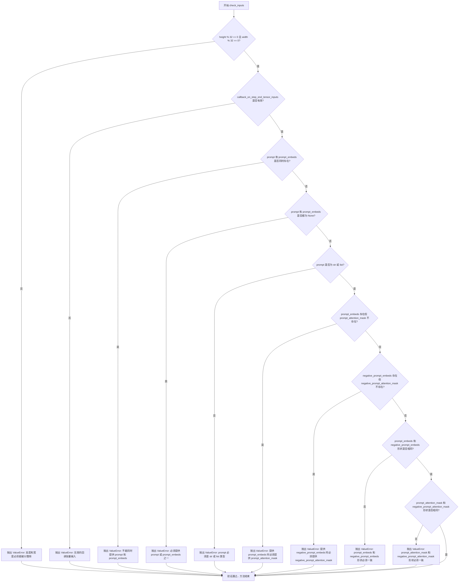

#### 带注释源码

```python
def check_inputs(
    self,
    prompt,
    height,
    width,
    callback_on_step_end_tensor_inputs=None,
    prompt_embeds=None,
    negative_prompt_embeds=None,
    prompt_attention_mask=None,
    negative_prompt_attention_mask=None,
):
    # 检查高度和宽度是否能被32整除，这是VAE和Transformer的压缩比要求
    if height % 32 != 0 or width % 32 != 0:
        raise ValueError(f"`height` and `width` have to be divisible by 32 but are {height} and {width}.")

    # 验证回调函数中使用的张量输入是否在允许的列表中
    if callback_on_step_end_tensor_inputs is not None and not all(
        k in self._callback_tensor_inputs for k in callback_on_step_end_tensor_inputs
    ):
        raise ValueError(
            f"`callback_on_step_end_tensor_inputs` has to be in {self._callback_tensor_inputs}, but found {[k for k in callback_on_step_end_tensor_inputs if k not in self._callback_tensor_inputs]}"
        )

    # 互斥检查：prompt和prompt_embeds不能同时提供
    if prompt is not None and prompt_embeds is not None:
        raise ValueError(
            f"Cannot forward both `prompt`: {prompt} and `prompt_embeds`: {prompt_embeds}. Please make sure to"
            " only forward one of the two."
        )
    # 至少需要提供prompt或prompt_embeds之一
    elif prompt is None and prompt_embeds is None:
        raise ValueError(
            "Provide either `prompt` or `prompt_embeds`. Cannot leave both `prompt` and `prompt_embeds` undefined."
        )
    # 验证prompt的类型必须是str或list
    elif prompt is not None and (not isinstance(prompt, str) and not isinstance(prompt, list)):
        raise ValueError(f"`prompt` has to be of type `str` or `list` but is {type(prompt)}")

    # 如果提供了prompt_embeds，必须同时提供对应的attention_mask
    if prompt_embeds is not None and prompt_attention_mask is None:
        raise ValueError("Must provide `prompt_attention_mask` when specifying `prompt_embeds`.")

    # 如果提供了negative_prompt_embeds，必须同时提供对应的attention_mask
    if negative_prompt_embeds is not None and negative_prompt_attention_mask is None:
        raise ValueError("Must provide `negative_prompt_attention_mask` when specifying `negative_prompt_embeds`.")

    # 如果同时提供了prompt_embeds和negative_prompt_embeds，验证它们的形状是否一致
    if prompt_embeds is not None and negative_prompt_embeds is not None:
        if prompt_embeds.shape != negative_prompt_embeds.shape:
            raise ValueError(
                "`prompt_embeds` and `negative_prompt_embeds` must have the same shape when passed directly, but"
                f" got: `prompt_embeds` {prompt_embeds.shape} != `negative_prompt_embeds`"
                f" {negative_prompt_embeds.shape}."
            )
        if prompt_attention_mask.shape != negative_prompt_attention_mask.shape:
            raise ValueError(
                "`prompt_attention_mask` and `negative_prompt_attention_mask` must have the same shape when passed directly, but"
                f" got: `prompt_attention_mask` {prompt_attention_mask.shape} != `negative_prompt_attention_mask`"
                f" {negative_prompt_attention_mask.shape}."
            )
```


### `LTXPipeline._pack_latents`

该方法是一个静态函数，负责将 VAE 编码后的原始潜在向量（Latents）张量重新整形为 Transformer 模型期望的“打包”（Packed）序列格式。它通过空间和时间维度上的“分块”（Patching）操作，将 5 维视频张量 `[B, C, F, H, W]` 转换为 3 维序列张量 `[B, S, D]`，其中 S 是有效的视频序列长度，D 是每个 token 的特征维度。这是 LTX-Video 管道中准备潜在变量的关键步骤。

参数：

-   `latents`：`torch.Tensor`，输入的潜在向量，形状为 `[B, C, F, H, W]`（B: 批次大小, C: 通道数, F: 帧数, H: 高度, W: 宽度）。
-   `patch_size`：`int`，空间分块大小，默认为 1。用于将高度和宽度分割成更小的 patch。
-   `patch_size_t`：`int`，时间分块大小，默认为 1。用于将帧数分割成更小的 temporal patch。

返回值：`torch.Tensor`，返回打包后的潜在向量，形状为 `[B, F // p_t * H // p * W // p, C * p_t * p * p]`（即 `[B, Sequence Length, Feature Dimension]`）。

#### 流程图

```mermaid
flowchart TD
    A[输入 Latents<br/>Shape: [B, C, F, H, W]] --> B[解包张量维度<br/>获取 B, C, F, H, W]
    B --> C{计算分块后维度}
    C --> D[post_patch_num_frames = F / p_t]
    C --> E[post_patch_height = H / p]
    C --> F[post_patch_width = W / p]
    D --> G[Reshape 重塑张量]
    E --> G
    F --> G
    G --> H[插入分块维度<br/>Shape: [B, C, F', p_t, H', p, W', p]]
    H --> I[Permute 维度重排]
    I --> J[重新排序为: [B, F', H', W', C, p_t, p, p]]
    J --> K[Flatten 特征维度]
    K --> L[合并 C * p_t * p * p]
    L --> M[Flatten 序列维度]
    M --> N[合并 F' * H' * W']
    N --> O[输出 Packed Latents<br/>Shape: [B, S, D]]
```

#### 带注释源码

```python
@staticmethod
def _pack_latents(latents: torch.Tensor, patch_size: int = 1, patch_size_t: int = 1) -> torch.Tensor:
    # 输入的 latents 形状为 [B, C, F, H, W]
    # B: 批次大小, C: 通道数, F: 帧数, H: 高度, W: 宽度
    
    # 1. 解包输入张量的形状
    batch_size, num_channels, num_frames, height, width = latents.shape
    
    # 2. 计算分块（patching）后的空间和时间维度大小
    # 例如：如果原始 F=16, patch_size_t=2，则 post_patch_num_frames=8
    post_patch_num_frames = num_frames // patch_size_t
    post_patch_height = height // patch_size
    post_patch_width = width // patch_size
    
    # 3. Reshape: 插入 patch 维度
    # 将 [B, C, F, H, W] 变为 [B, C, F', p_t, H', p, W', p]
    # -1 位置被 num_channels 填充
    latents = latents.reshape(
        batch_size,
        -1,
        post_patch_num_frames,
        patch_size_t,
        post_patch_height,
        patch_size,
        post_patch_width,
        patch_size,
    )
    
    # 4. Permute: 调整维度顺序以合并序列维度
    # 从 [B, C, F', p_t, H', p, W', p] 
    # 到   [B, F', H', W', C, p_t, p, p]
    # 这样可以方便地将 F', H', W' 合并为一个序列维度，将 C, p_t, p, p 合并为特征维度
    latents = latents.permute(0, 2, 4, 6, 1, 3, 5, 7).flatten(4, 7).flatten(1, 3)
    
    # 5. Flatten: 两次降维操作
    # 第一次 flatten(4, 7): 将末尾的特征维度 [C, p_t, p, p] 展平为 [C * p_t * p * p]
    # 第二次 flatten(1, 3): 将中间的序列维度 [F', H', W'] 展平为 [F' * H' * W']
    
    # 最终输出形状: [B, F' * H' * W', C * p_t * p * p]
    # 这是一个 3D 张量，类似于标准 Transformer 的输入 [Batch, SeqLen, Features]
    return latents
```


### `LTXPipeline._unpack_latents`

该方法是将打包后的潜在表示（latents）解包回原始的视频张量形状。它是 `_pack_latents` 方法的逆操作，将形状为 [B, S, D]（B 为批次大小，S 为有效视频序列长度，D 为有效特征维度）的打包潜在表示解包并重塑为形状为 [B, C, F, H, W]（B 为批次大小，C 为通道数，F 为帧数，H 为高度，W 为宽度）的视频张量。

参数：

- `latents`：`torch.Tensor`，打包后的潜在表示张量，形状为 [B, S, D]
- `num_frames`：`int`，视频帧数
- `height`：`int`，视频高度（潜在表示的空间维度）
- `width`：`int`，视频宽度（潜在表示的空间维度）
- `patch_size`：`int = 1`，空间补丁大小
- `patch_size_t`：`int = 1`，时间补丁大小

返回值：`torch.Tensor`，解包后的视频张量，形状为 [B, C, F, H, W]

#### 流程图

```mermaid
flowchart TD
    A[开始: 输入打包的latents [B, S, D]] --> B[获取batch_size]
    B --> C[使用reshape重塑latents为 [B, num_frames, height, width, -1, patch_size_t, patch_size, patch_size]]
    C --> D[使用permute重新排列维度顺序为 [0, 4, 1, 5, 2, 6, 3, 7]]
    D --> E[使用flatten压缩维度: 先压缩后两个维度]
    E --> F[继续flatten: 压缩中间维度]
    F --> G[最后flatten: 合并帧和空间维度]
    G --> H[返回解包后的latents [B, C, F, H, W]]
```

#### 带注释源码

```python
@staticmethod
def _unpack_latents(
    latents: torch.Tensor, num_frames: int, height: int, width: int, patch_size: int = 1, patch_size_t: int = 1
) -> torch.Tensor:
    # 注释: 打包后的latents形状为 [B, S, D]（S是有效视频序列长度，D是有效特征维度）
    # 注释: 被解包并重塑为视频张量形状 [B, C, F, H, W]。这是_pack_latents方法的逆操作。
    
    # 获取批次大小
    batch_size = latents.size(0)
    
    # 注释: 将latents从 [B, S, D] 重塑为 [B, num_frames, height, width, -1, patch_size_t, patch_size, patch_size]
    # 注释: 其中 -1 会自动计算通道数 C * D / (patch_size_t * patch_size * patch_size)
    latents = latents.reshape(batch_size, num_frames, height, width, -1, patch_size_t, patch_size, patch_size)
    
    # 注释: 使用permute重新排列维度顺序，从 [B, F, H, W, C, p_t, p, p] 排列为需要的顺序
    # 注释: 将通道维度移到前面，保留帧和空间维度信息
    latents = latents.permute(0, 4, 1, 5, 2, 6, 3, 7).flatten(6, 7).flatten(4, 5).flatten(2, 3)
    
    # 注释: 连续使用三次flatten操作:
    # 1. flatten(6, 7): 将最后两个patch维度 [p, p] 合并
    # 2. flatten(4, 5): 将通道和patch_t维度合并
    # 3. flatten(2, 3): 将时间维度和空间维度合并，得到最终的 [B, C, F, H, W]
    
    return latents
```


### `LTXPipeline._normalize_latents`

该方法是一个静态方法，用于对latents张量进行标准化处理。它通过减去均值并除以标准差（乘以缩放因子）来规范化输入的latents数据。这一操作在通道维度上执行，确保latents值的分布符合模型预期的范围。

参数：

- `latents`：`torch.Tensor`，需要标准化的latents张量，形状为 [B, C, F, H, W]，其中B是批量大小，C是通道数，F是帧数，H和W是空间维度
- `latents_mean`：`torch.Tensor`，用于标准化的均值张量，通常是从VAE模型中获取的统计数据
- `latents_std`：`torch.Tensor`，用于标准化的标准差张量，通常是从VAE模型中获取的统计数据
- `scaling_factor`：`float` = 1.0，可选的缩放因子，用于在标准化后调整latents的尺度，默认为1.0

返回值：`torch.Tensor`，返回标准化处理后的latents张量，形状与输入相同

#### 流程图

```mermaid
flowchart TD
    A[开始: _normalize_latents] --> B[将 latents_mean reshape 为 [1, C, 1, 1, 1]]
    B --> C[将 latents_std reshape 为 [1, C, 1, 1, 1]]
    C --> D[将 latents_mean 移动到 latents 相同的设备和数据类型]
    D --> E[将 latents_std 移动到 latents 相同的设备和数据类型]
    E --> F[计算标准化: latents = (latents - latents_mean) × scaling_factor / latents_std]
    F --> G[返回标准化后的 latents]
```

#### 带注释源码

```python
@staticmethod
def _normalize_latents(
    latents: torch.Tensor, latents_mean: torch.Tensor, latents_std: torch.Tensor, scaling_factor: float = 1.0
) -> torch.Tensor:
    # Normalize latents across the channel dimension [B, C, F, H, W]
    # 将 latents_mean 从 [C] 形状reshape为 [1, C, 1, 1, 1]，以便广播到latents的通道维度
    latents_mean = latents_mean.view(1, -1, 1, 1, 1).to(latents.device, latents.dtype)
    # 将 latents_std 从 [C] 形状reshape为 [1, C, 1, 1, 1]，以便广播到latents的通道维度
    latents_std = latents_std.view(1, -1, 1, 1, 1).to(latents.device, latents.dtype)
    # 执行标准化：(latents - mean) * scaling_factor / std
    # 减去均值使得数据以0为中心，乘以scaling_factor进行缩放，再除以标准差进行归一化
    latents = (latents - latents_mean) * scaling_factor / latents_std
    return latents
```


### `LTXPipeline._denormalize_latents`

该方法用于将标准化后的latents张量反标准化到原始数据分布。在扩散模型的推理过程中，经过去噪处理的latents需要通过反标准化操作恢复其原始的数值范围，以便后续通过VAE解码器进行视频生成。

参数：

- `latents`：`torch.Tensor`，需要去标准化的latents张量，形状为[B, C, F, H, W]
- `latents_mean`：`torch.Tensor`，用于去标准化的均值向量，对应latents的通道维度
- `latents_std`：`torch.Tensor`，用于去标准化的标准差向量，对应latents的通道维度
- `scaling_factor`：`float`，缩放因子，默认为1.0，用于调整反标准化的尺度

返回值：`torch.Tensor`，反标准化后的latents张量，形状为[B, C, F, H, W]

#### 流程图

```mermaid
flowchart TD
    A[开始 _denormalize_latents] --> B{检查输入参数}
    B -->|参数有效| C[将 latents_mean reshape 为 [1, C, 1, 1, 1]]
    C --> D[将 latents_std reshape 为 [1, C, 1, 1, 1]]
    D --> E[将 mean 和 std 移动到 latents 相同设备和数据类型]
    E --> F[计算: latents = latents * latents_std / scaling_factor + latents_mean]
    F --> G[返回反标准化后的 latents]
```

#### 带注释源码

```python
@staticmethod
def _denormalize_latents(
    latents: torch.Tensor, latents_mean: torch.Tensor, latents_std: torch.Tensor, scaling_factor: float = 1.0
) -> torch.Tensor:
    # Denormalize latents across the channel dimension [B, C, F, H, W]
    # 对latents的通道维度进行去标准化处理
    
    # 将均值向量reshape为[1, C, 1, 1, 1]以匹配latents的[B, C, F, H, W]形状
    latents_mean = latents_mean.view(1, -1, 1, 1, 1).to(latents.device, latents.dtype)
    
    # 将标准差向量reshape为[1, C, 1, 1, 1]以匹配latents的[B, C, F, H, W]形状
    latents_std = latents_std.view(1, -1, 1, 1, 1).to(latents.device, latents.dtype)
    
    # 执行去标准化操作: x_denorm = x * std / scaling_factor + mean
    # 这是标准化操作: x_norm = (x - mean) * scaling_factor / std 的逆运算
    latents = latents * latents_std / scaling_factor + latents_mean
    
    return latents
```


### `LTXPipeline.prepare_latents`

该方法负责为视频生成准备初始的潜在表示（latents）。如果用户未提供预计算的latents，则根据VAE的压缩比调整输入的空间和时间维度，生成随机噪声latents，并使用_transformer的patch尺寸对其进行打包，以便于后续的去噪处理。

参数：

- `batch_size`：`int`，生成视频的批次大小，默认为1
- `num_channels_latents`：`int`，潜在表示的通道数，默认为128，对应于transformer的输入通道数
- `height`：`int`，生成视频的原始高度（像素），默认为512
- `width`：`int`，生成视频的原始宽度（像素），默认为704
- `num_frames`：`int`，生成视频的帧数，默认为161
- `dtype`：`torch.dtype | None`，latents的数据类型，默认为None
- `device`：`torch.device | None`，latents所在的设备，默认为None
- `generator`：`torch.Generator | None`，用于生成确定性随机数的PyTorch生成器，默认为None
- `latents`：`torch.Tensor | None`，用户预提供的潜在表示，如果为None则自动生成，默认为None

返回值：`torch.Tensor`，打包后的潜在表示张量，形状为[B, S, D]，其中B为批次大小，S为有效视频序列长度，D为有效特征维度

#### 流程图

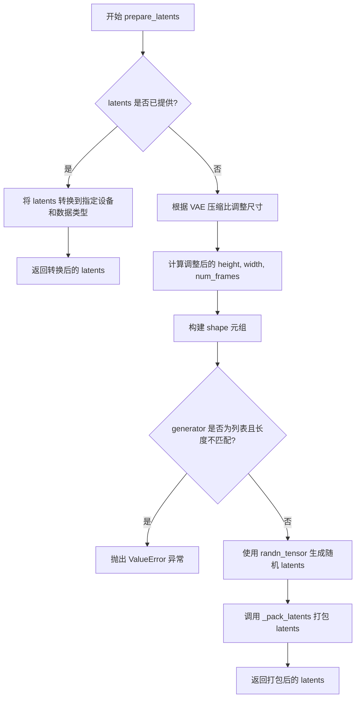

#### 带注释源码

```python
def prepare_latents(
    self,
    batch_size: int = 1,
    num_channels_latents: int = 128,
    height: int = 512,
    width: int = 704,
    num_frames: int = 161,
    dtype: torch.dtype | None = None,
    device: torch.device | None = None,
    generator: torch.Generator | None = None,
    latents: torch.Tensor | None = None,
) -> torch.Tensor:
    """
    为视频生成准备初始的潜在表示（latents）。
    
    如果用户已经提供了 latents，则直接进行设备和数据类型转换。
    否则，根据 VAE 的空间和时间压缩比调整输入尺寸，生成随机噪声，
    并使用 transformer 的 patch 尺寸对其进行打包处理。
    
    参数:
        batch_size: 批次大小
        num_channels_latents: latent 通道数
        height: 原始高度（像素）
        width: 原始宽度（像素）
        num_frames: 原始帧数
        dtype: 数据类型
        device: 目标设备
        generator: 随机生成器
        latents: 可选的预计算 latents
    
    返回:
        打包后的 latents 张量
    """
    # 如果提供了 latents，直接返回转换后的结果
    if latents is not None:
        return latents.to(device=device, dtype=dtype)

    # 根据 VAE 压缩比调整空间维度
    # VAE 空间压缩将像素空间映射到 latent 空间
    height = height // self.vae_spatial_compression_ratio
    width = width // self.vae_spatial_compression_ratio
    
    # 根据 VAE 压缩比调整时间维度
    # 使用 (num_frames - 1) // compression + 1 确保正确向上取整
    num_frames = (num_frames - 1) // self.vae_temporal_compression_ratio + 1

    # 构建完整的 latents 形状: [B, C, F, H, W]
    # B: batch_size, C: num_channels_latents, F: frames, H: height, W: width
    shape = (batch_size, num_channels_latents, num_frames, height, width)

    # 验证 generator 列表长度与批次大小的一致性
    if isinstance(generator, list) and len(generator) != batch_size:
        raise ValueError(
            f"You have passed a list of generators of length {len(generator)}, but requested an effective batch"
            f" size of {batch_size}. Make sure the batch size matches the length of the generators."
        )

    # 生成随机噪声 latents，使用指定的数据类型、设备和生成器
    latents = randn_tensor(shape, generator=generator, device=device, dtype=dtype)
    
    # 使用 transformer 的 patch 尺寸对 latents 进行打包
    # 将 [B, C, F, H, W] 转换为 [B, S, D] 格式
    # 其中 S = F//p_t * H//p * W//p, D = C * p_t * p * p
    latents = self._pack_latents(
        latents, self.transformer_spatial_patch_size, self.transformer_temporal_patch_size
    )
    
    return latents
```


### `LTXPipeline.guidance_scale`

该属性是一个只读的 getter 属性，用于获取 classifier-free guidance 的缩放因子（guidance scale），该因子控制生成内容与文本提示的相关程度。

参数： 无

返回值：`float`，返回当前设置的 guidance_scale 值，用于控制分类器无关引导的强度。

#### 流程图

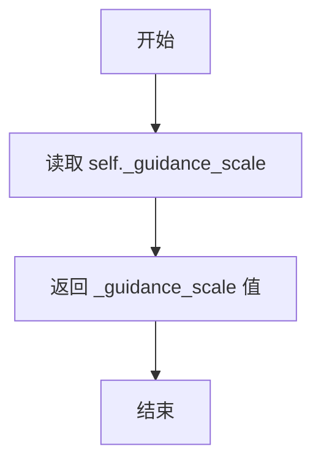

#### 带注释源码

```python
@property
def guidance_scale(self):
    """
    属性 getter：获取 guidance_scale 值
    
    guidance_scale 是分类器无关扩散引导（Classifier-Free Diffusion Guidance）
    中的缩放因子，用于在推理时控制文本提示对生成结果的影响程度。
    较高的值会使生成内容更紧密地跟随提示，但可能导致质量下降。
    
    Returns:
        float: 当前的 guidance_scale 缩放因子值
    """
    return self._guidance_scale
```


### `LTXPipeline.guidance_rescale`

这是一个只读属性（property），用于返回用于重新缩放噪声配置的 guidance_rescale 值。该值基于 Common Diffusion Noise Schedules and Sample Steps are Flawed 论文（https://huggingface.co/papers/2305.08891）中的方法，用于改进生成视频的质量并修复过度曝光问题。

参数：此属性不接受任何参数（只读属性）

返回值：`float`，返回 guidance_rescale 的值，该值用于在去噪过程中重新缩放噪声预测结果

#### 流程图

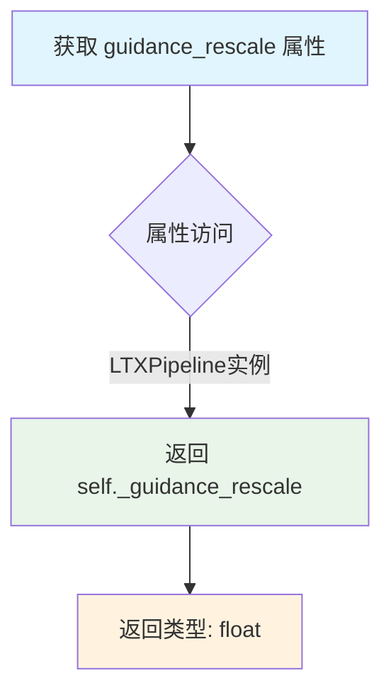

#### 带注释源码

```python
@property
def guidance_rescale(self):
    """
    只读属性，返回用于重新缩放噪声配置的 guidance_rescale 值。
    
    根据论文 Common Diffusion Noise Schedules and Sample Steps are Flawed 
    (https://huggingface.co/papers/2305.08891) 中的 Section 3.4，
    guidance_rescale 用于修复使用零终端SNR时的过度曝光问题。
    
    该值在 __call__ 方法中被设置为:
    self._guidance_rescale = guidance_rescale  # 默认值为 0.0
    
    在去噪循环中，如果 guidance_rescale > 0，则会调用 rescale_noise_cfg 
    函数来重新缩放噪声预测结果。
    
    Returns:
        float: guidance_rescale 值，用于控制噪声预测的重新缩放程度
    """
    return self._guidance_rescale
```


### `LTXPipeline.do_classifier_free_guidance`

该属性用于判断当前管道是否启用了无分类器自由引导（Classifier-Free Guidance, CFG）。当 `guidance_scale` 参数大于 1.0 时，返回 `True` 表示启用 CFG；否则返回 `False`。

参数：无

返回值：`bool`，返回是否启用无分类器自由引导

#### 流程图

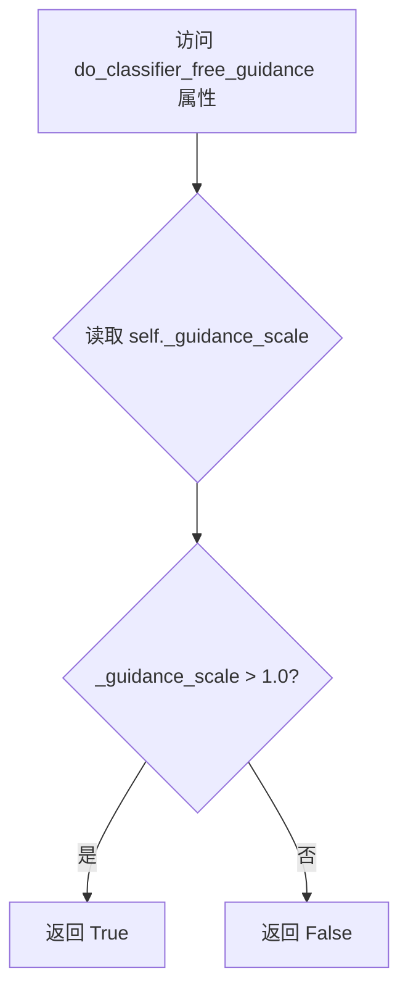

#### 带注释源码

```python
@property
def do_classifier_free_guidance(self):
    """
    属性：判断是否启用无分类器自由引导（Classifier-Free Guidance）
    
    无分类器引导是一种提高生成质量的技巧，通过在推理时同时考虑条件输入和无条件输入来引导生成过程。
    当 guidance_scale > 1.0 时，引导强度足够，启用 CFG 可以获得更好的生成效果。
    
    Returns:
        bool: 如果 guidance_scale > 1.0 则返回 True（启用 CFG），否则返回 False
    """
    return self._guidance_scale > 1.0
```


### `LTXPipeline.num_timesteps` (property)

该属性是一个只读的Python property，用于返回当前管道的去噪过程所使用的timesteps数量。它在管道执行去噪循环之前被设置，用于追踪整个生成过程需要的推理步数。

参数：无（属性不接受任何参数）

返回值：`int`，返回去噪过程中 timesteps 的数量，即推理步数。

#### 流程图

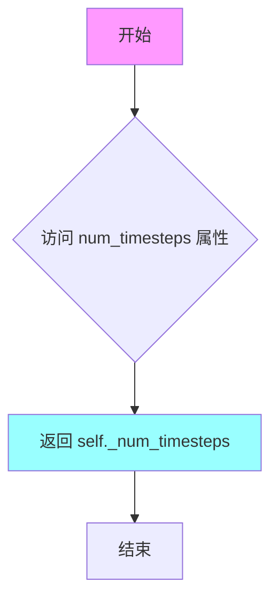

#### 带注释源码

```python
@property
def num_timesteps(self):
    """
    返回当前管道的去噪推理步数。
    
    该属性在 __call__ 方法中被赋值：
    self._num_timesteps = len(timesteps)
    
    其中 timesteps 是通过调度器 (scheduler) 的 set_timesteps 方法生成的，
    数量由 num_inference_steps 参数决定。
    
    Returns:
        int: 去噪过程的总步数
    """
    return self._num_timesteps
```


### `LTXPipeline.current_timestep`

该属性是一个只读属性，用于返回当前扩散模型在去噪过程中的时间步（timestep）。在去噪循环的每次迭代中，该属性会被更新为当前处理的时间步值，可用于外部回调函数或监控当前推理进度。

参数： 无

返回值：`torch.Tensor`，当前去噪循环中正在处理的时间步值。在每次去噪迭代开始时，该属性会被更新为对应的 timestep。

#### 流程图

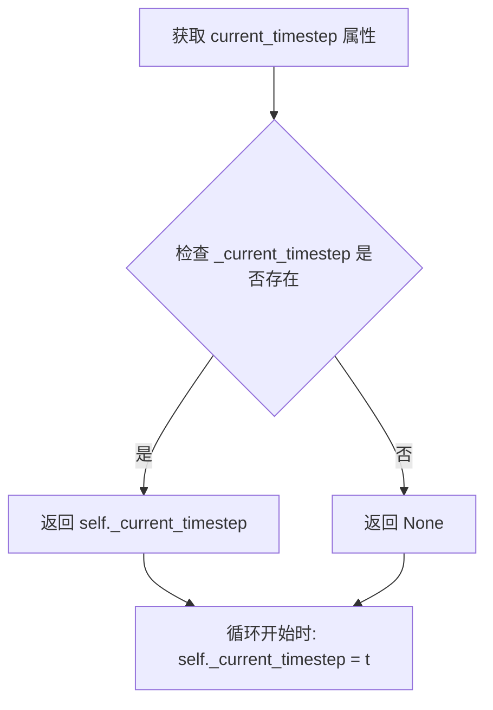

#### 带注释源码

```python
@property
def current_timestep(self):
    """
    返回当前扩散去噪过程的时间步。
    
    该属性在 __call__ 方法的去噪循环中每次迭代开始时被更新：
    self._current_timestep = t
    
    返回值:
        torch.Tensor: 当前处理的时间步。在循环开始前为 None，
        循环中为当前迭代的 timestep 值。
    """
    return self._current_timestep
```


### `LTXPipeline.attention_kwargs`

这是一个属性（Property）方法，用于获取在管道调用（`__call__`）时传入的注意力机制相关关键字参数（`attention_kwargs`）。这些参数通常用于控制 Transformer 模型中的注意力处理器（AttentionProcessor）。

参数：

- `self`：`LTXPipeline`，属性所属的实例对象。

返回值：`dict[str, Any] | None`，返回存储在实例中的 `_attention_kwargs` 字典。如果在调用管道前访问，可能未初始化。

#### 流程图

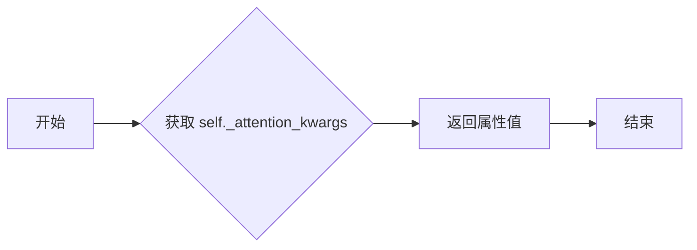

#### 带注释源码

```python
@property
def attention_kwargs(self):
    """
    返回在调用管道生成视频时传递的额外注意力参数。
    该参数在 __call__ 方法中被赋值给 self._attention_kwargs，
    并最终传递给 Transformer 模型的 attention_kwargs 参数。
    """
    return self._attention_kwargs
```


### `LTXPipeline.interrupt`

这是一个属性 getter 方法，用于获取管道的中断状态标志。当在推理过程中需要提前终止生成时，可以通过设置此标志来实现。

参数：无

返回值：`bool`，返回管道的中断状态标志。如果为 `True`，表示管道已被请求中断，当前推理循环将跳过剩余步骤。

#### 流程图

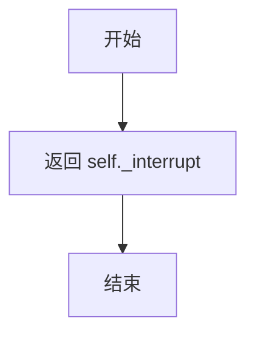

#### 带注释源码

```python
@property
def interrupt(self):
    """
    属性 getter：获取管道的中断状态标志。
    
    该属性用于检查当前管道是否被请求中断。在 __call__ 方法的
    去噪循环中，会检查此标志以决定是否跳过剩余的推理步骤。
    
    返回值:
        bool: 中断标志。如果为 True，表示外部已请求中断管道，
             推理循环将提前终止。
    """
    return self._interrupt
```


### `LTXPipeline.__call__`

这是 LTXPipeline 的核心推理方法，用于根据文本提示生成视频。该方法实现了完整的文本到视频扩散推理流程，包括输入验证、文本编码、潜在变量准备、去噪循环、潜在变量解码和后处理。

参数：

- `prompt`：`str | list[str]`，要引导视频生成的提示词。如果未定义，则必须传递 `prompt_embeds`
- `negative_prompt`：`str | list[str] | None`，不希望出现在生成视频中的内容提示
- `height`：`int`，生成视频的高度（像素），默认 512
- `width`：`int`，生成视频的宽度（像素），默认 704
- `num_frames`：`int`，要生成的视频帧数，默认 161
- `frame_rate`：`int`，视频帧率，默认 25
- `num_inference_steps`：`int`，去噪步数，默认 50
- `timesteps`：`list[int]`，自定义时间步，用于支持时间步的调度器
- `guidance_scale`：`float`，分类器自由引导（CFG）比例，默认 3
- `guidance_rescale`：`float`，引导重缩放因子，用于修复过度曝光，默认 0.0
- `num_videos_per_prompt`：`int`，每个提示词生成视频的数量，默认 1
- `generator`：`torch.Generator | list[torch.Generator]`，随机数生成器，用于确定性生成
- `latents`：`torch.Tensor | None`，预生成的噪声潜在变量
- `prompt_embeds`：`torch.Tensor | None`，预生成的文本嵌入
- `prompt_attention_mask`：`torch.Tensor | None`，文本嵌入的注意力掩码
- `negative_prompt_embeds`：`torch.Tensor | None`，负向提示的预生成嵌入
- `negative_prompt_attention_mask`：`torch.Tensor | None`，负向提示的注意力掩码
- `decode_timestep`：`float | list[float]`，解码视频时使用的时间步，默认 0.0
- `decode_noise_scale`：`float | list[float]`，解码时噪声与去噪潜在变量之间的插值因子
- `output_type`：`str`，输出格式，可选 "pil" 或 "latent"，默认 "pil"
- `return_dict`：`bool`，是否返回 LTXPipelineOutput，默认 True
- `attention_kwargs`：`dict[str, Any] | None`，传递给注意力处理器的额外参数
- `callback_on_step_end`：`Callable`，每个去噪步骤结束时调用的回调函数
- `callback_on_step_end_tensor_inputs`：`list[str]`，回调函数接收的张量输入列表
- `max_sequence_length`：`int`，最大序列长度，默认 128

返回值：`LTXPipelineOutput | tuple`，返回生成的视频帧（若 return_dict 为 True 则返回 LTXPipelineOutput，否则返回元组）

#### 流程图

```mermaid
flowchart TD
    A[开始 __call__] --> B[检查回调类型并设置 tensor_inputs]
    B --> C[验证输入参数 check_inputs]
    C --> D[设置引导比例、重缩放因子、注意力参数]
    D --> E[确定批次大小]
    E --> F[编码提示词 encode_prompt]
    F --> G[准备潜在变量 prepare_latents]
    G --> H[计算时间步和调度器设置]
    H --> I[准备微调条件 rope_interpolation_scale]
    I --> J[进入去噪循环]
    
    J --> K{是否还有时间步}
    K -->|是| L[检查中断标志]
    K -->|否| M[检查输出类型]
    
    L --> N[准备模型输入]
    N --> O[执行 Transformer 前向传播]
    O --> P[计算噪声预测]
    P --> Q[应用分类器自由引导 CFG]
    Q --> R[调度器步进计算上一步潜在变量]
    R --> S[执行回调函数]
    S --> T[更新进度条]
    T --> K
    
    M --> U{output_type == 'latent'}
    U -->|是| V[直接使用潜在变量作为视频]
    U -->|否| W[解包和解码潜在变量]
    W --> X[VAE 解码]
    X --> Y[后处理视频]
    Y --> V
    
    V --> Z[释放模型钩子]
    Z --> AA[返回结果]
```

#### 带注释源码

```python
@torch.no_grad()
@replace_example_docstring(EXAMPLE_DOC_STRING)
def __call__(
    self,
    prompt: str | list[str] = None,
    negative_prompt: str | list[str] | None = None,
    height: int = 512,
    width: int = 704,
    num_frames: int = 161,
    frame_rate: int = 25,
    num_inference_steps: int = 50,
    timesteps: list[int] = None,
    guidance_scale: float = 3,
    guidance_rescale: float = 0.0,
    num_videos_per_prompt: int | None = 1,
    generator: torch.Generator | list[torch.Generator] | None = None,
    latents: torch.Tensor | None = None,
    prompt_embeds: torch.Tensor | None = None,
    prompt_attention_mask: torch.Tensor | None = None,
    negative_prompt_embeds: torch.Tensor | None = None,
    negative_prompt_attention_mask: torch.Tensor | None = None,
    decode_timestep: float | list[float] = 0.0,
    decode_noise_scale: float | list[float] | None = None,
    output_type: str | None = "pil",
    return_dict: bool = True,
    attention_kwargs: dict[str, Any] | None = None,
    callback_on_step_end: Callable[[int, int], None] | None = None,
    callback_on_step_end_tensor_inputs: list[str] = ["latents"],
    max_sequence_length: int = 128,
):
    r"""
    Function invoked when calling the pipeline for generation.

    Args:
        prompt (`str` or `list[str]`, *optional*):
            The prompt or prompts to guide the image generation. If not defined, one has to pass `prompt_embeds`.
            instead.
        ... (其他参数说明见上文)
    """

    # 1. 处理回调函数配置，设置 tensor_inputs
    if isinstance(callback_on_step_end, (PipelineCallback, MultiPipelineCallbacks)):
        callback_on_step_end_tensor_inputs = callback_on_step_end.tensor_inputs

    # 2. 检查输入参数有效性
    self.check_inputs(
        prompt=prompt,
        height=height,
        width=width,
        callback_on_step_end_tensor_inputs=callback_on_step_end_tensor_inputs,
        prompt_embeds=prompt_embeds,
        negative_prompt_embeds=negative_prompt_embeds,
        prompt_attention_mask=prompt_attention_mask,
        negative_prompt_attention_mask=negative_prompt_attention_mask,
    )

    # 3. 初始化内部状态
    self._guidance_scale = guidance_scale
    self._guidance_rescale = guidance_rescale
    self._attention_kwargs = attention_kwargs
    self._interrupt = False
    self._current_timestep = None

    # 4. 确定批次大小
    if prompt is not None and isinstance(prompt, str):
        batch_size = 1
    elif prompt is not None and isinstance(prompt, list):
        batch_size = len(prompt)
    else:
        batch_size = prompt_embeds.shape[0]

    device = self._execution_device

    # 5. 编码文本提示为嵌入向量
    (
        prompt_embeds,
        prompt_attention_mask,
        negative_prompt_embeds,
        negative_prompt_attention_mask,
    ) = self.encode_prompt(
        prompt=prompt,
        negative_prompt=negative_prompt,
        do_classifier_free_guidance=self.do_classifier_free_guidance,
        num_videos_per_prompt=num_videos_per_prompt,
        prompt_embeds=prompt_embeds,
        negative_prompt_embeds=negative_prompt_embeds,
        prompt_attention_mask=prompt_attention_mask,
        negative_prompt_attention_mask=negative_prompt_attention_mask,
        max_sequence_length=max_sequence_length,
        device=device,
    )
    # 6. 合并负向和正向嵌入用于 CFG
    if self.do_classifier_free_guidance:
        prompt_embeds = torch.cat([negative_prompt_embeds, prompt_embeds], dim=0)
        prompt_attention_mask = torch.cat([negative_prompt_attention_mask, prompt_attention_mask], dim=0)

    # 7. 准备初始噪声潜在变量
    num_channels_latents = self.transformer.config.in_channels
    latents = self.prepare_latents(
        batch_size * num_videos_per_prompt,
        num_channels_latents,
        height,
        width,
        num_frames,
        torch.float32,
        device,
        generator,
        latents,
    )

    # 8. 计算时间步调度
    latent_num_frames = (num_frames - 1) // self.vae_temporal_compression_ratio + 1
    latent_height = height // self.vae_spatial_compression_ratio
    latent_width = width // self.vae_spatial_compression_ratio
    video_sequence_length = latent_num_frames * latent_height * latent_width
    sigmas = np.linspace(1.0, 1 / num_inference_steps, num_inference_steps)
    mu = calculate_shift(
        video_sequence_length,
        self.scheduler.config.get("base_image_seq_len", 256),
        self.scheduler.config.get("max_image_seq_len", 4096),
        self.scheduler.config.get("base_shift", 0.5),
        self.scheduler.config.get("max_shift", 1.15),
    )
    # XLA 设备特殊处理
    if XLA_AVAILABLE:
        timestep_device = "cpu"
    else:
        timestep_device = device
    timesteps, num_inference_steps = retrieve_timesteps(
        self.scheduler,
        num_inference_steps,
        timestep_device,
        timesteps,
        sigmas=sigmas,
        mu=mu,
    )
    num_warmup_steps = max(len(timesteps) - num_inference_steps * self.scheduler.order, 0)
    self._num_timesteps = len(timesteps)

    # 9. 准备位置编码插值比例
    rope_interpolation_scale = (
        self.vae_temporal_compression_ratio / frame_rate,
        self.vae_spatial_compression_ratio,
        self.vae_spatial_compression_ratio,
    )

    # 10. 去噪循环
    with self.progress_bar(total=num_inference_steps) as progress_bar:
        for i, t in enumerate(timesteps):
            # 检查中断信号
            if self.interrupt:
                continue

            self._current_timestep = t

            # 为 CFG 准备输入（复制潜在变量）
            latent_model_input = torch.cat([latents] * 2) if self.do_classifier_free_guidance else latents
            latent_model_input = latent_model_input.to(prompt_embeds.dtype)

            # 广播时间步到批次维度
            timestep = t.expand(latent_model_input.shape[0])

            # Transformer 前向传播
            with self.transformer.cache_context("cond_uncond"):
                noise_pred = self.transformer(
                    hidden_states=latent_model_input,
                    encoder_hidden_states=prompt_embeds,
                    timestep=timestep,
                    encoder_attention_mask=prompt_attention_mask,
                    num_frames=latent_num_frames,
                    height=latent_height,
                    width=latent_width,
                    rope_interpolation_scale=rope_interpolation_scale,
                    attention_kwargs=attention_kwargs,
                    return_dict=False,
                )[0]
            noise_pred = noise_pred.float()

            # 应用 CFG 引导
            if self.do_classifier_free_guidance:
                noise_pred_uncond, noise_pred_text = noise_pred.chunk(2)
                noise_pred = noise_pred_uncond + self.guidance_scale * (noise_pred_text - noise_pred_uncond)

                # 应用引导重缩放
                if self.guidance_rescale > 0:
                    noise_pred = rescale_noise_cfg(
                        noise_pred, noise_pred_text, guidance_rescale=self.guidance_rescale
                    )

            # 调度器步进：计算上一步的潜在变量
            latents = self.scheduler.step(noise_pred, t, latents, return_dict=False)[0]

            # 步骤结束回调
            if callback_on_step_end is not None:
                callback_kwargs = {}
                for k in callback_on_step_end_tensor_inputs:
                    callback_kwargs[k] = locals()[k]
                callback_outputs = callback_on_step_end(self, i, t, callback_kwargs)

                latents = callback_outputs.pop("latents", latents)
                prompt_embeds = callback_outputs.pop("prompt_embeds", prompt_embeds)

            # 更新进度条
            if i == len(timesteps) - 1 or ((i + 1) > num_warmup_steps and (i + 1) % self.scheduler.order == 0):
                progress_bar.update()

            # XLA 设备同步
            if XLA_AVAILABLE:
                xm.mark_step()

    # 11. 输出处理
    if output_type == "latent":
        video = latents
    else:
        # 解包潜在变量
        latents = self._unpack_latents(
            latents,
            latent_num_frames,
            latent_height,
            latent_width,
            self.transformer_spatial_patch_size,
            self.transformer_temporal_patch_size,
        )
        # 反归一化潜在变量
        latents = self._denormalize_latents(
            latents, self.vae.latents_mean, self.vae.latents_std, self.vae.config.scaling_factor
        )
        latents = latents.to(prompt_embeds.dtype)

        # 时间步条件处理
        if not self.vae.config.timestep_conditioning:
            timestep = None
        else:
            # 噪声插值解码
            noise = randn_tensor(latents.shape, generator=generator, device=device, dtype=latents.dtype)
            if not isinstance(decode_timestep, list):
                decode_timestep = [decode_timestep] * batch_size
            if decode_noise_scale is None:
                decode_noise_scale = decode_timestep
            elif not isinstance(decode_noise_scale, list):
                decode_noise_scale = [decode_noise_scale] * batch_size

            timestep = torch.tensor(decode_timestep, device=device, dtype=latents.dtype)
            decode_noise_scale = torch.tensor(decode_noise_scale, device=device, dtype=latents.dtype)[
                :, None, None, None, None
            ]
            latents = (1 - decode_noise_scale) * latents + decode_noise_scale * noise

        # VAE 解码潜在变量到视频
        latents = latents.to(self.vae.dtype)
        video = self.vae.decode(latents, timestep, return_dict=False)[0]
        # 后处理视频
        video = self.video_processor.postprocess_video(video, output_type=output_type)

    # 12. 释放模型内存
    self.maybe_free_model_hooks()

    # 13. 返回结果
    if not return_dict:
        return (video,)

    return LTXPipelineOutput(frames=video)
```

## 关键组件


### 张量打包与解包（Tensor Packing/Unpacking）

将[B, C, F, H, W]形状的latent张量打包成[B, S, D]形状的序列令牌，以及逆向操作，支持transformer的空间和时间patchify处理。

### 潜在变量归一化与反归一化（Latent Normalization/Denormalization）

根据vae的均值和标准差对latent进行归一化和反归一化，配合scaling_factor实现数据预处理和后处理。

### T5文本编码与提示词嵌入（T5 Prompt Encoding）

使用T5EncoderModel和T5TokenizerFast将文本提示词编码为嵌入向量，支持批量生成和多提示词处理。

### 分类器自由引导（Classifier-Free Guidance）

通过concat正负提示词嵌入，在推理时实现无分类器的条件生成，提高生成质量。

### 潜在变量准备与噪声采样（Latent Preparation）

根据输入尺寸和压缩比计算latent空间尺寸，使用randn_tensor生成高斯噪声作为初始latent。

### 时间步调度与偏移计算（Timestep Scheduling）

使用FlowMatchEulerDiscreteScheduler配合calculate_shift函数，根据序列长度动态调整噪声调度策略。

### VAE解码与视频后处理（VAE Decoding）

将去噪后的latent通过VAE解码为实际视频帧，支持可选的时间步条件解码和噪声插值。

### 模型钩子与内存管理（Model Hooks）

通过DiffusionPipeline基类实现模型的CPU/GPU卸载和内存管理，优化推理过程中的显存使用。


## 问题及建议


### 已知问题

- **属性未初始化**: `_guidance_scale`、`_guidance_rescale`、`_attention_kwargs`、`_interrupt`、`_current_timestep` 等属性在 `__call__` 方法中被直接赋值，但未在 `__init__` 方法中初始化，可能导致属性访问错误
- **类型注解兼容性问题**: 代码中大量使用 `|` 联合类型注解（如 `str | list[str]`），仅支持 Python 3.10+，降低了代码的可移植性
- **参数校验缺失**: `check_inputs` 方法未对 `num_frames` 参数进行校验，且 `__call__` 方法中未对 `decode_timestep` 和 `decode_noise_scale` 列表长度与 `batch_size` 的一致性进行验证
- **文档字符串错误**: 类文档字符串中重复定义了 `tokenizer` 参数两次（CLIPTokenizer 和 T5TokenizerFast），且 tokenizer 类型描述不准确
- **重复计算**: 在 `retrieve_timesteps` 中每次调用都使用 `inspect.signature` 检查调度器参数，可以缓存结果以提升性能
- **设备管理冗余**: `timestep_device` 的条件判断逻辑可简化，当前代码在 XLA 可用时设置设备为 "cpu"，但后续仍需转换

### 优化建议

- 在 `__init__` 方法中初始化所有 Pipeline 属性（`self._guidance_scale = None`、`self._guidance_rescale = 0.0` 等）
- 将 `|` 联合类型注解替换为 `Optional[]` 或 `Union[]` 以兼容 Python 3.9-
- 在 `check_inputs` 中添加 `num_frames` 正值校验，并验证 `decode_timestep`/`decode_noise_scale` 与 `batch_size` 匹配
- 修正类文档字符串中的 tokenizer 参数描述
- 使用 `functools.lru_cache` 缓存调度器的参数检查结果
- 合并 XLA 设备处理逻辑，统一使用 `device` 参数而非单独创建 `timestep_device`

## 其它


### 设计目标与约束

本管道的设计目标是实现高效的文本到视频生成，采用LTXVideoTransformer3DModel作为核心去噪模型，配合T5文本编码器和VAE实现高质量视频输出。设计约束包括：输入分辨率必须能被32整除，支持的最大序列长度为128 tokens，支持T5EncoderModel和T5TokenizerFast作为文本编码组件必须可配置，支持classifier-free guidance机制，推理步数默认为50步，支持自定义timesteps和sigmas调度。

### 错误处理与异常设计

代码实现了多层次错误处理机制。在check_inputs方法中进行了完整的输入验证：height和width必须能被32整除，callback_on_step_end_tensor_inputs必须在允许的列表中，prompt和prompt_embeds不能同时提供，negative_prompt_embeds必须配合prompt_attention_mask使用，prompt_embeds和negative_prompt_embeds的shape必须匹配。retrieve_timesteps函数中检查scheduler是否支持自定义timesteps或sigmas，不支持时抛出ValueError。prepare_latents方法验证generator列表长度与batch_size匹配。encode_prompt方法检查negative_prompt与prompt的类型一致性以及batch_size匹配性。所有外部依赖模块均通过try-except进行导入检查，如is_torch_xla_available的XLA支持检测。

### 数据流与状态机

管道的数据流遵循以下状态转换：初始化状态(管道创建) -> 输入验证状态(check_inputs) -> 文本编码状态(encode_prompt) -> 潜在变量准备状态(prepare_latents) -> 时间步准备状态(retrieve_timesteps) -> 去噪循环状态(denoising loop) -> 解码状态(VAE decode) -> 输出状态(return)。去噪循环内部状态：latent_model_input准备 -> transformer前向传播 -> classifier-free guidance计算 -> scheduler步进 -> callback执行 -> 进度更新。管道维护内部状态变量_guidance_scale、_guidance_rescale、_attention_kwargs、_interrupt、_num_timesteps、_current_timestep用于跟踪执行状态。

### 外部依赖与接口契约

核心依赖包括：transformers库提供T5EncoderModel和T5TokenizerFast，numpy用于sigmas数组生成，torch用于张量操作，diffusers内部模块包括DiffusionPipeline基类、FromSingleFileMixin单文件加载混入、LTXVideoLoraLoaderMixin LoRA加载混入、AutoencoderKLLTXVideo VAE模型、LTXVideoTransformer3DModel Transformer模型、FlowMatchEulerDiscreteScheduler调度器、VideoProcessor视频处理器、LTXPipelineOutput输出类。接口契约要求：transformer必须包含config.in_channels属性，vae必须包含spatial_compression_ratio、temporal_compression_ratio、latents_mean、latents_std和config.scaling_factor属性，tokenizer必须包含model_max_length属性。

### 性能考虑与优化空间

管道实现了多项性能优化：使用torch.no_grad()装饰器禁用梯度计算，transformer支持cache_context缓存机制，支持XLA设备加速(xm.mark_step())，支持模型CPU卸载(model_cpu_offload_seq)，支持VAE分块解码(潜在)，支持attention_kwargs传递处理器参数。潜在优化方向包括：更积极的显存管理、推理过程中的批量处理优化、混合精度计算的细粒度控制、分布式推理支持、transformer和VAE的异步执行调度。

### 安全性考虑

代码遵循安全最佳实践：所有外部输入都经过验证和类型检查，不直接执行用户提供的代码，使用torch.no_grad()防止梯度泄露，模型卸载机制确保敏感中间结果被释放。需要注意的安全风险：prompt_embeds和latents作为张量可能包含敏感信息，建议在生产环境中实施适当的内存清理机制。

### 版本兼容性与依赖管理

代码针对以下版本进行测试和优化：Python 3.8+，PyTorch 2.0+，transformers库最新稳定版本，diffusers库保持同步更新。XLA支持通过可选导入实现(is_torch_xla_available)，不支持时优雅降级。代码从其他pipeline复制了多个辅助函数(calculate_shift、retrieve_timesteps、rescale_noise_cfg)，确保与stable_diffusion和flux pipeline的接口一致性。

### 配置管理与参数说明

管道配置通过构造函数注册模块(self.register_modules)，支持动态配置以下参数：vae_spatial_compression_ratio(默认32)、vae_temporal_compression_ratio(默认8)、transformer_spatial_patch_size(默认1)、transformer_temporal_patch_size(默认1)、tokenizer_max_length(默认128)、video_processor(视频后处理器)。推理参数通过__call__方法传递，包括guidance_scale(默认3)、guidance_rescale(默认0.0)、num_videos_per_prompt(默认1)、decode_timestep(默认0.0)、decode_noise_scale(默认None)、output_type(默认"pil")。

### 监控与日志

代码使用diffusers统一的logging模块(logger = logging.get_logger(__name__))，在以下关键点输出日志：文本截断警告(当max_sequence_length导致输入被截断时)。进度通过progress_bar展示，支持Tqdm进度条集成。callback机制允许外部监控推理过程中的中间状态(timestep、latents、prompt_embeds等)。

### 资源清理与生命周期管理

管道实现了自动资源管理：maybe_free_model_hooks()在推理结束后卸载所有模型，torch.no_grad()上下文管理器确保推理过程不使用显存存储梯度，XLA设备通过mark_step()同步操作。生命周期管理：管道对象创建(初始化) -> 单次推理调用(__call__) -> 资源释放。

### 测试策略建议

建议针对以下场景编写测试：输入验证测试(各种无效输入的错误处理)、文本编码测试(不同长度prompt的embeddings生成)、潜在变量准备测试(shape和dtype正确性)、去噪循环测试(输出shape和数值稳定性)、VAE解码测试(视频质量评估)、端到端测试(完整pipeline输出验证)、性能基准测试(推理时间和显存占用)、边界条件测试(最大分辨率、最大帧数等)。

### 部署注意事项

生产环境部署需考虑：模型下载和缓存策略(建议预下载Lightricks/LTX-Video权重)、GPU显存评估(建议16GB+显存用于标准分辨率)、批量生成时的内存管理、推理服务的并发控制、XLA环境的额外配置(如果使用)、模型版本管理和回滚策略、监控指标收集(推理时间、显存使用、生成成功率)。

    