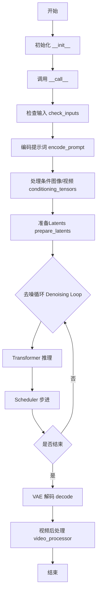
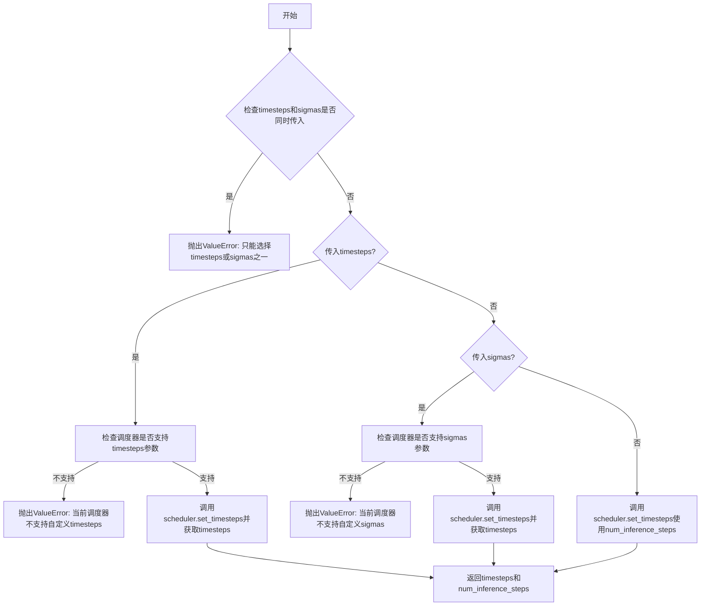
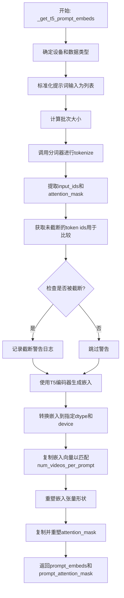
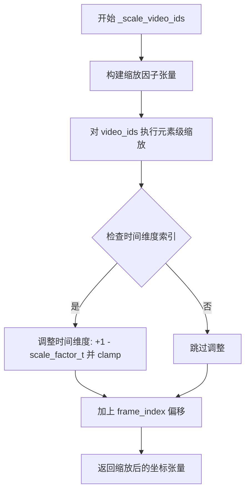
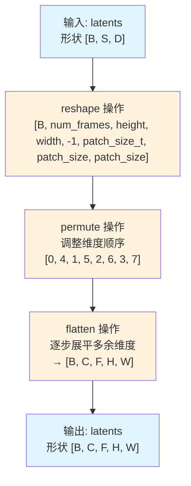
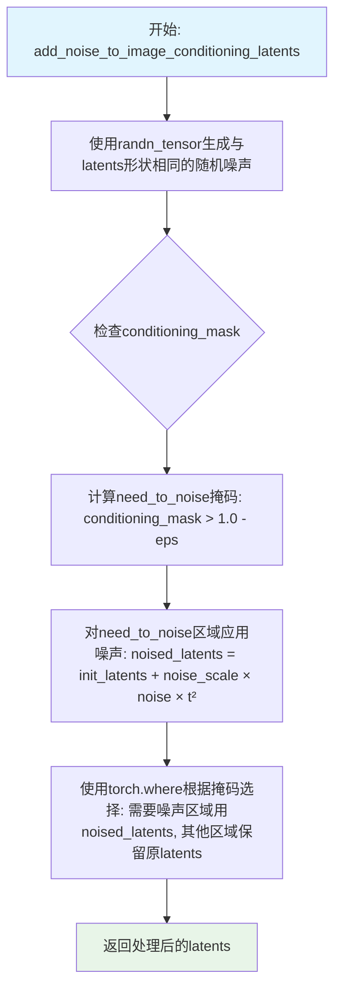
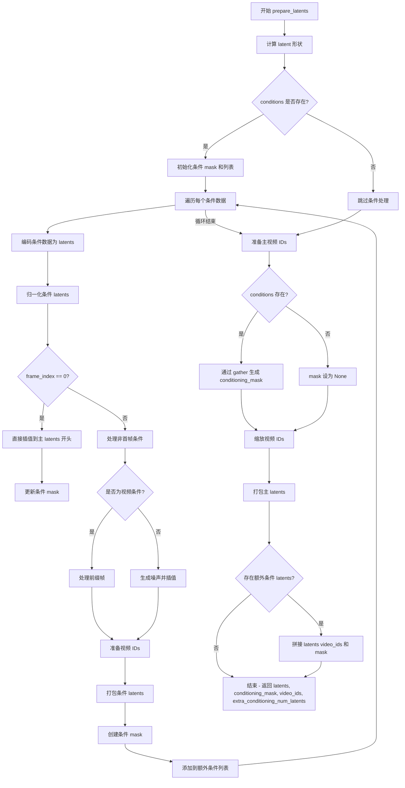

# `diffusers\src\diffusers\pipelines\ltx\pipeline_ltx_condition.py` 详细设计文档

LTXConditionPipeline 是一个基于扩散模型的视频生成 Pipeline，它结合了 T5 文本编码器、LTXVideoTransformer3DModel 和 VAE，能够根据文本提示（prompt）以及可选的图像或视频条件（conditions）生成相应的视频序列。

## 整体流程



## 类结构

```
DiffusionPipeline (基类)
├── LTXConditionPipeline (主 Pipeline 类)
│   ├── FromSingleFileMixin (单文件加载混入)
│   ├── LTXVideoLoraLoaderMixin (LoRA 加载混入)
│   └── LTXVideoCondition (数据类: 条件定义)
```

## 全局变量及字段


### `logger`
    
模块级日志记录器，用于输出调试和运行信息

类型：`logging.Logger`
    


### `EXAMPLE_DOC_STRING`
    
包含使用示例的文档字符串，展示pipeline的基本用法

类型：`str`
    


### `XLA_AVAILABLE`
    
布尔标志，指示PyTorch XLA是否可用以支持加速计算

类型：`bool`
    


### `LTXVideoCondition.LTXVideoCondition.image`
    
用于条件生成的图像，可选输入

类型：`PIL.Image.Image | None`
    


### `LTXVideoCondition.LTXVideoCondition.video`
    
用于条件生成的视频帧列表，可选输入

类型：`list[PIL.Image.Image] | None`
    


### `LTXVideoCondition.LTXVideoCondition.frame_index`
    
条件生效的起始帧索引，决定条件在视频的哪个位置起作用

类型：`int`
    


### `LTXVideoCondition.LTXVideoCondition.strength`
    
条件影响的强度，范围0.0-1.0，控制条件对生成结果的影响程度

类型：`float`
    


### `LTXConditionPipeline.LTXConditionPipeline.scheduler`
    
控制去噪过程的调度器，决定噪声去除的时间步策略

类型：`FlowMatchEulerDiscreteScheduler`
    


### `LTXConditionPipeline.LTXConditionPipeline.vae`
    
编码/解码视频的变分自编码器，负责将视频转换为潜在表示并重建

类型：`AutoencoderKLLTXVideo`
    


### `LTXConditionPipeline.LTXConditionPipeline.text_encoder`
    
编码文本提示的T5模型，将自然语言转换为模型可理解的向量表示

类型：`T5EncoderModel`
    


### `LTXConditionPipeline.LTXConditionPipeline.tokenizer`
    
T5文本分词器，将输入文本分割成token序列供模型使用

类型：`T5TokenizerFast`
    


### `LTXConditionPipeline.LTXConditionPipeline.transformer`
    
执行去噪的核心Transformer模型，基于文本和条件生成目标视频 latent

类型：`LTXVideoTransformer3DModel`
    


### `LTXConditionPipeline.LTXConditionPipeline.video_processor`
    
处理视频/图像输入输出的工具类，负责预处理和后处理视频数据

类型：`VideoProcessor`
    


### `LTXConditionPipeline.LTXConditionPipeline.vae_spatial_compression_ratio`
    
VAE空间压缩比率，默认32，表示潜在空间与像素空间的大小比例

类型：`int`
    


### `LTXConditionPipeline.LTXConditionPipeline.vae_temporal_compression_ratio`
    
VAE时间压缩比率，默认8，用于压缩视频的帧数维度

类型：`int`
    


### `LTXConditionPipeline.LTXConditionPipeline.transformer_spatial_patch_size`
    
Transformer空间patch大小，决定空间维度上的分块处理粒度

类型：`int`
    


### `LTXConditionPipeline.LTXConditionPipeline.transformer_temporal_patch_size`
    
Transformer时间patch大小，决定时间维度上的分块处理粒度

类型：`int`
    


### `LTXConditionPipeline.LTXConditionPipeline.default_height`
    
默认生成视频高度512像素

类型：`int`
    


### `LTXConditionPipeline.LTXConditionPipeline.default_width`
    
默认生成视频宽度704像素

类型：`int`
    


### `LTXConditionPipeline.LTXConditionPipeline.default_frames`
    
默认生成视频帧数121帧

类型：`int`
    
    

## 全局函数及方法


### `linear_quadratic_schedule`

该函数生成用于扩散模型（Diffusion Models）的 Sigma（噪声）调度表（Schedule）。它将调度过程分为两个阶段：在前半部分（默认为总步数的一半）使用线性插值达到指定的噪声阈值，随后在后半部分使用二次（Quadratic）函数平滑过渡到最大噪声水平（1.0）。最后，该函数对结果进行反转并裁剪，生成符合扩散采样要求的噪声调度张量。

参数：

- `num_steps`：`int`，总推理步数（The number of diffusion steps）。
- `threshold_noise`：`float`，默认值 `0.025`。线性阶段结束时的目标噪声水平（The target noise level at the end of the linear phase）。
- `linear_steps`：`int | None`，默认值 `None`。线性阶段的步数。如果为 `None`，则默认为 `num_steps // 2`（Number of steps for the linear phase）。

返回值：`torch.Tensor`，返回一个包含噪声调度值的 1 维张量（The calculated sigma schedule）。

#### 流程图

```mermaid
flowchart TD
    A[Start: linear_quadratic_schedule] --> B{linear_steps is None?}
    B -- Yes --> C[linear_steps = num_steps // 2]
    B -- No --> D{num_steps < 2?}
    C --> D
    D -- Yes --> E[Return torch.tensor([1.0])]
    D -- No --> F[Generate linear_sigma_schedule for i in range(linear_steps)]
    F --> G[Calculate quadratic coefficients based on threshold_noise and linear_steps]
    G --> H[Generate quadratic_sigma_schedule for i in range(linear_steps, num_steps)]
    H --> I[Concatenate: linear + quadratic + [1.0]]
    I --> J[Invert values: 1.0 - x]
    J --> K[Remove last element: sigma_schedule[:-1]]
    K --> L[Return torch.tensor(sigma_schedule)]
```

#### 带注释源码

```python
def linear_quadratic_schedule(num_steps, threshold_noise=0.025, linear_steps=None):
    # 如果未指定线性步数，则默认为总步数的一半
    if linear_steps is None:
        linear_steps = num_steps // 2
    
    # 处理边界情况：如果步数少于2，直接返回纯噪声张量[1.0]
    if num_steps < 2:
        return torch.tensor([1.0])
    
    # 1. 生成线性阶段的噪声调度表
    # 线性增加噪声直到达到 threshold_noise
    linear_sigma_schedule = [i * threshold_noise / linear_steps for i in range(linear_steps)]
    
    # 2. 计算二次阶段的参数
    # 计算从线性阶段过渡到终点的差值
    threshold_noise_step_diff = linear_steps - threshold_noise * num_steps
    # 剩余的二次步数
    quadratic_steps = num_steps - linear_steps
    
    # 计算二次多项式系数：ax^2 + bx + c
    # 确保在 linear_steps 处连续，并在 num_steps 处达到 1.0
    quadratic_coef = threshold_noise_step_diff / (linear_steps * quadratic_steps**2)
    linear_coef = threshold_noise / linear_steps - 2 * threshold_noise_step_diff / (quadratic_steps**2)
    const = quadratic_coef * (linear_steps**2)
    
    # 3. 生成二次阶段的噪声调度表
    quadratic_sigma_schedule = [
        quadratic_coef * (i**2) + linear_coef * i + const for i in range(linear_steps, num_steps)
    ]
    
    # 4. 合并调度表，并在末尾加上 1.0 (最大噪声)
    sigma_schedule = linear_sigma_schedule + quadratic_sigma_schedule + [1.0]
    
    # 5. 反转调度表：通常 Sigma 调度表表示从噪声到信号的混合比例，或者反过来
    # 这里 1.0 - x 意味着将噪声水平转换为信号保留水平（或反向调度）
    sigma_schedule = [1.0 - x for x in sigma_schedule]
    
    # 6. 去除最后一个元素 (即 1.0 减去最后一个元素，结果为 0)
    # 返回长度通常为 num_steps 的张量
    return torch.tensor(sigma_schedule[:-1])
```


### `calculate_shift`

计算图像序列长度的偏移量，用于调整调度器（scheduler）的参数。该函数通过线性插值，根据输入的图像序列长度计算出一个偏移量 `mu`，以适应不同分辨率或序列长度的生成任务。

参数：

- `image_seq_len`：`int` 或 `float`，输入图像的序列长度，用于计算偏移量
- `base_seq_len`：`int`，默认值为 `256`，基础序列长度，用于线性插值的起点
- `max_seq_len`：`int`，默认值为 `4096`，最大序列长度，用于线性插值的终点
- `base_shift`：`float`，默认值为 `0.5`，基础偏移量，对应 base_seq_len 时的偏移值
- `max_shift`：`float`，默认值为 `1.15`，最大偏移量，对应 max_seq_len 时的偏移值

返回值：`float`，计算得到的偏移量 mu，用于调整调度器参数

#### 流程图

```mermaid
flowchart TD
    A[开始] --> B[输入 image_seq_len, base_seq_len, max_seq_len, base_shift, max_shift]
    B --> C[计算斜率 m = (max_shift - base_shift) / (max_seq_len - base_seq_len)]
    C --> D[计算截距 b = base_shift - m * base_seq_len]
    D --> E[计算偏移量 mu = image_seq_len * m + b]
    E --> F[返回 mu]
```

#### 带注释源码

```python
def calculate_shift(
    image_seq_len,
    base_seq_len: int = 256,
    max_seq_len: int = 4096,
    base_shift: float = 0.5,
    max_shift: float = 1.15,
):
    """
    计算图像序列长度的偏移量，用于调整调度器参数。
    
    这是一个线性插值函数，根据输入的图像序列长度计算出一个偏移量。
    用于在不同分辨率或序列长度的场景下调整噪声调度器的参数。
    
    Args:
        image_seq_len: 输入图像的序列长度
        base_seq_len: 基础序列长度，默认256
        max_seq_len: 最大序列长度，默认4096
        base_shift: 基础偏移量，默认0.5
        max_shift: 最大偏移量，默认1.15
    
    Returns:
        float: 计算得到的偏移量mu
    """
    # 计算线性插值的斜率 m
    # 斜率表示偏移量随序列长度变化的速率
    m = (max_shift - base_shift) / (max_seq_len - base_seq_len)
    
    # 计算线性截距 b
    # 确保当序列长度为 base_seq_len 时，偏移量等于 base_shift
    b = base_shift - m * base_seq_len
    
    # 根据输入序列长度计算最终的偏移量 mu
    # 使用线性方程: mu = m * image_seq_len + b
    mu = image_seq_len * m + b
    
    return mu
```


### `retrieve_timesteps`

该函数是 LTX Video 管道中的时间步检索工具函数，用于从调度器获取自定义或默认的时间步序列。它调用调度器的 `set_timesteps` 方法，根据传入的参数（自定义时间步、自定义 sigmas 或推理步数）生成时间步列表，并返回时间步张量和推理步数。

参数：

- `scheduler`：`SchedulerMixin`，调度器对象，用于生成时间步
- `num_inference_steps`：`int | None`，推理步数，用于生成时间步（当 `timesteps` 为 `None` 时使用）
- `device`：`str | torch.device | None`，时间步要移动到的设备
- `timesteps`：`list[int] | None`，自定义时间步列表，用于覆盖调度器的时间步策略
- `sigmas`：`list[float] | None`，自定义 sigmas 列表，用于覆盖调度器的 sigma 策略
- `**kwargs`：任意关键字参数，将传递给调度器的 `set_timesteps` 方法

返回值：`tuple[torch.Tensor, int]`，返回元组，第一个元素是调度器的时间步张量，第二个元素是推理步数

#### 流程图



#### 带注释源码

```python
def retrieve_timesteps(
    scheduler,
    num_inference_steps: int | None = None,
    device: str | torch.device | None = None,
    timesteps: list[int] | None = None,
    sigmas: list[float] | None = None,
    **kwargs,
):
    r"""
    调用调度器的 `set_timesteps` 方法并在调用后从调度器检索时间步。
    处理自定义时间步。任何 kwargs 都将传递给 `scheduler.set_timesteps`。

    参数:
        scheduler (`SchedulerMixin`):
            要获取时间步的调度器。
        num_inference_steps (`int`):
            使用预训练模型生成样本时使用的扩散步数。如果使用此参数，`timesteps` 必须为 `None`。
        device (`str` 或 `torch.device`, *可选*):
            时间步应该移动到的设备。如果为 `None`，时间步不会被移动。
        timesteps (`list[int]`, *可选*):
            用于覆盖调度器时间步间隔策略的自定义时间步。如果传入 `timesteps`，
            则 `num_inference_steps` 和 `sigmas` 必须为 `None`。
        sigmas (`list[float]`, *可选*):
            用于覆盖调度器 sigma 间隔策略的自定义 sigmas。如果传入 `sigmas`，
            则 `num_inference_steps` 和 `timesteps` 必须为 `None`。

    返回值:
        `tuple[torch.Tensor, int]`: 元组，其中第一个元素是调度器的时间步计划，
        第二个元素是推理步数。
    """
    # 检查是否同时传入了 timesteps 和 sigmas，这是不允许的
    if timesteps is not None and sigmas is not None:
        raise ValueError("Only one of `timesteps` or `sigmas` can be passed. Please choose one to set custom values")
    
    # 处理自定义 timesteps 的情况
    if timesteps is not None:
        # 检查调度器的 set_timesteps 方法是否接受 timesteps 参数
        accepts_timesteps = "timesteps" in set(inspect.signature(scheduler.set_timesteps).parameters.keys())
        if not accepts_timesteps:
            raise ValueError(
                f"The current scheduler class {scheduler.__class__}'s `set_timesteps` does not support custom"
                f" timestep schedules. Please check whether you are using the correct scheduler."
            )
        # 调用调度器的 set_timesteps 方法设置自定义时间步
        scheduler.set_timesteps(timesteps=timesteps, device=device, **kwargs)
        # 从调度器获取设置后的时间步
        timesteps = scheduler.timesteps
        # 推理步数等于时间步的数量
        num_inference_steps = len(timesteps)
    # 处理自定义 sigmas 的情况
    elif sigmas is not None:
        # 检查调度器的 set_timesteps 方法是否接受 sigmas 参数
        accept_sigmas = "sigmas" in set(inspect.signature(scheduler.set_timesteps).parameters.keys())
        if not accept_sigmas:
            raise ValueError(
                f"The current scheduler class {scheduler.__class__}'s `set_timesteps` does not support custom"
                f" sigmas schedules. Please check whether you are using the correct scheduler."
            )
        # 调用调度器的 set_timesteps 方法设置自定义 sigmas
        scheduler.set_timesteps(sigmas=sigmas, device=device, **kwargs)
        # 从调度器获取设置后的时间步
        timesteps = scheduler.timesteps
        # 推理步数等于时间步的数量
        num_inference_steps = len(timesteps)
    # 处理默认情况，使用 num_inference_steps 生成时间步
    else:
        scheduler.set_timesteps(num_inference_steps, device=device, **kwargs)
        timesteps = scheduler.timesteps
    
    # 返回时间步张量和推理步数
    return timesteps, num_inference_steps
```


### `retrieve_latents`

从编码器输出中提取 latent 分布的样本或模式，支持随机采样（sample）或取模（argmax）模式，也可以直接返回预计算的 latents。

参数：

- `encoder_output`：`torch.Tensor`，编码器输出对象，通常包含 `latent_dist` 或 `latents` 属性
- `generator`：`torch.Generator | None`，可选的随机数生成器，用于采样时的确定性生成
- `sample_mode`：`str`，采样模式，默认为 `"sample"`（随机采样），可选 `"argmax"`（取分布的众数）

返回值：`torch.Tensor`，提取的 latent 张量

#### 流程图

```mermaid
flowchart TD
    A[开始: retrieve_latents] --> B{encoder_output 是否有 latent_dist 属性?}
    B -->|是| C{sample_mode == "sample"?}
    B -->|否| D{encoder_output 是否有 latents 属性?}
    C -->|是| E[返回 encoder_output.latent_dist.sample generator]
    C -->|否| F[返回 encoder_output.latent_dist.mode]
    D -->|是| G[返回 encoder_output.latents]
    D -->|否| H[抛出 AttributeError]
    
    E --> I[结束]
    F --> I
    G --> I
    H --> I
```

#### 带注释源码

```python
# Copied from diffusers.pipelines.stable_diffusion.pipeline_stable_diffusion_img2img.retrieve_latents
def retrieve_latents(
    encoder_output: torch.Tensor, generator: torch.Generator | None = None, sample_mode: str = "sample"
):
    """
    从编码器输出中提取 latent 分布的样本或模式。
    
    Args:
        encoder_output: 编码器输出对象，包含 latent_dist 或 latents 属性
        generator: 可选的随机数生成器，用于采样时的确定性生成
        sample_mode: 采样模式，"sample" 表示随机采样，"argmax" 表示取分布的众数
    
    Returns:
        提取的 latent 张量
    
    Raises:
        AttributeError: 当 encoder_output 既没有 latent_dist 也没有 latents 属性时抛出
    """
    # 如果编码器输出包含 latent_dist 属性且采样模式为 "sample"，则从分布中采样
    if hasattr(encoder_output, "latent_dist") and sample_mode == "sample":
        return encoder_output.latent_dist.sample(generator)
    # 如果编码器输出包含 latent_dist 属性且采样模式为 "argmax"，则取分布的众数（模式）
    elif hasattr(encoder_output, "latent_dist") and sample_mode == "argmax":
        return encoder_output.latent_dist.mode()
    # 如果编码器输出直接包含 latents 属性，则直接返回
    elif hasattr(encoder_output, "latents"):
        return encoder_output.latents
    # 如果无法访问 latents，则抛出属性错误
    else:
        raise AttributeError("Could not access latents of provided encoder_output")
```


### `rescale_noise_cfg`

根据 guidance_rescale 重缩放噪声预测以改善图像质量并修复过度曝光问题。该函数基于论文 Common Diffusion Noise Schedules and Sample Steps are Flawed (Section 3.4) 实现了噪声预测的标准差重缩放和混合策略。

参数：

- `noise_cfg`：`torch.Tensor`，引导扩散过程中预测的噪声张量
- `noise_pred_text`：`torch.Tensor`，文本引导扩散过程中预测的噪声张量
- `guidance_rescale`：`float`，可选，默认值为 0.0，用于重缩放噪声预测的因子

返回值：`torch.Tensor`，重缩放后的噪声预测张量

#### 流程图

```mermaid
flowchart TD
    A[开始: rescale_noise_cfg] --> B[计算 noise_pred_text 的标准差 std_text]
    B --> C[计算 noise_cfg 的标准差 std_cfg]
    C --> D[重缩放噪声预测: noise_pred_rescaled = noise_cfg × (std_text / std_cfg)]
    D --> E[混合原始和重缩放结果: noise_cfg = guidance_rescale × noise_pred_rescaled + (1 - guidance_rescale) × noise_cfg]
    E --> F[返回重缩放的 noise_cfg]
    
    B -.->|保持维度| B
    C -.->|保持维度| C
```

#### 带注释源码

```python
# Copied from diffusers.pipelines.stable_diffusion.pipeline_stable_diffusion.rescale_noise_cfg
def rescale_noise_cfg(noise_cfg, noise_pred_text, guidance_rescale=0.0):
    r"""
    Rescales `noise_cfg` tensor based on `guidance_rescale` to improve image quality and fix overexposure. Based on
    Section 3.4 from [Common Diffusion Noise Schedules and Sample Steps are
    Flawed](https://huggingface.co/papers/2305.08891).

    Args:
        noise_cfg (`torch.Tensor`):
            The predicted noise tensor for the guided diffusion process.
        noise_pred_text (`torch.Tensor`):
            The predicted noise tensor for the text-guided diffusion process.
        guidance_rescale (`float`, *optional*, defaults to 0.0):
            A rescale factor applied to the noise predictions.

    Returns:
        noise_cfg (`torch.Tensor`): The rescaled noise prediction tensor.
    """
    # 计算文本引导噪声预测的标准差，保留除批次维度外的所有维度
    std_text = noise_pred_text.std(dim=list(range(1, noise_pred_text.ndim)), keepdim=True)
    # 计算引导噪声预测的标准差，保留除批次维度外的所有维度
    std_cfg = noise_cfg.std(dim=list(range(1, noise_cfg.ndim)), keepdim=True)
    
    # 重缩放引导结果（修复过度曝光问题）
    # 通过将 noise_cfg 的标准差缩放到与 text 预测相同的水平
    noise_pred_rescaled = noise_cfg * (std_text / std_cfg)
    
    # 通过 guidance_rescale 因子混合原始引导结果，避免生成"平淡"的图像
    # guidance_rescale=0 时返回原始 noise_cfg，guidance_rescale=1 时返回完全重缩放的结果
    noise_cfg = guidance_rescale * noise_pred_rescaled + (1 - guidance_rescale) * noise_cfg
    
    return noise_cfg
```


### `LTXConditionPipeline.__init__`

该方法负责初始化 `LTXConditionPipeline` 类实例。它接收预训练模型（VAE、Transformer、Text Encoder）和调度器作为参数，注册这些模块，提取模型配置中的关键参数（如压缩比、patch大小），并初始化视频处理器和默认的生成参数。

参数：

- `scheduler`：`FlowMatchEulerDiscreteScheduler`，用于控制扩散过程的时间步调度。
- `vae`：`AutoencoderKLLTXVideo`，视频变分自编码器，用于潜空间的编码和解码。
- `text_encoder`：`T5EncoderModel`，文本编码模型，用于将文本提示转换为嵌入向量。
- `tokenizer`：`T5TokenizerFast`，与文本编码器配合使用的分词器。
- `transformer`：`LTXVideoTransformer3DModel`，核心的去噪 Transformer 模型。

返回值：`None`，`__init__` 方法不返回值，仅修改对象内部状态。

#### 流程图

```mermaid
flowchart TD
    A([Start __init__]) --> B[调用 super().__init__ 初始化基础属性]
    B --> C[register_modules: 注册 vae, text_encoder, tokenizer, transformer, scheduler]
    C --> D{获取配置信息}
    D --> E[提取 VAE 配置: spatial/temporal compression ratio]
    D --> F[提取 Transformer 配置: patch_size, patch_size_t]
    E --> G[初始化 VideoProcessor]
    F --> G
    G --> H[设置默认值: height=512, width=704, frames=121]
    H --> I([End])
```

#### 带注释源码

```python
def __init__(
    self,
    scheduler: FlowMatchEulerDiscreteScheduler,
    vae: AutoencoderKLLTXVideo,
    text_encoder: T5EncoderModel,
    tokenizer: T5TokenizerFast,
    transformer: LTXVideoTransformer3DModel,
):
    # 调用父类 DiffusionPipeline 的初始化方法
    super().__init__()

    # 将传入的模型和调度器注册到 Pipeline 内部，便于后续管理和缓存
    self.register_modules(
        vae=vae,
        text_encoder=text_encoder,
        tokenizer=tokenizer,
        transformer=transformer,
        scheduler=scheduler,
    )

    # 从 VAE 模型配置中提取空间和时间压缩比，用于后续计算潜像维度
    # 使用 getattr 防止模型未正确加载时出错
    self.vae_spatial_compression_ratio = (
        self.vae.spatial_compression_ratio if getattr(self, "vae", None) is not None else 32
    )
    self.vae_temporal_compression_ratio = (
        self.vae.temporal_compression_ratio if getattr(self, "vae", None) is not None else 8
    )
    
    # 从 Transformer 模型配置中提取 patch 大小，用于潜像的打包与解包
    self.transformer_spatial_patch_size = (
        self.transformer.config.patch_size if getattr(self, "transformer", None) is not None else 1
    )
    self.transformer_temporal_patch_size = (
        self.transformer.config.patch_size_t if getattr(self, "transformer") is not None else 1
    )

    # 初始化视频处理器，用于预处理输入图像/视频和后处理输出视频
    self.video_processor = VideoProcessor(vae_scale_factor=self.vae_spatial_compression_ratio)
    
    # 设置分词器最大长度
    self.tokenizer_max_length = (
        self.tokenizer.model_max_length if getattr(self, "tokenizer", None) is not None else 128
    )

    # 定义默认的视频生成参数
    self.default_height = 512
    self.default_width = 704
    self.default_frames = 121
```


### `LTXConditionPipeline._get_t5_prompt_embeds`

该方法是一个内部方法，用于获取 T5 文本编码器生成的文本嵌入向量。它接收提示词文本，通过 T5 分词器进行编码，然后使用 T5 编码器模型生成文本嵌入表示，最后根据每个提示词生成的视频数量复制嵌入向量以支持批量生成。

参数：

- `self`：`LTXConditionPipeline`，Pipeline 实例本身，包含分词器和文本编码器等组件
- `prompt`：`str | list[str]`，要编码的提示词文本，可以是单个字符串或字符串列表
- `num_videos_per_prompt`：`int`，每个提示词要生成的视频数量，默认为 1
- `max_sequence_length`：`int`，文本序列的最大长度，默认为 256
- `device`：`torch.device | None`，指定计算设备，默认为 None（使用执行设备）
- `dtype`：`torch.dtype | None`，指定数据类型，默认为 None（使用文本编码器的数据类型）

返回值：`tuple[torch.Tensor, torch.Tensor]`，返回两个张量——第一个是提示词嵌入（prompt_embeds），形状为 `(batch_size * num_videos_per_prompt, seq_len, hidden_dim)`；第二个是提示词注意力掩码（prompt_attention_mask），形状为 `(batch_size * num_videos_per_prompt, seq_len)`

#### 流程图



#### 带注释源码

```python
def _get_t5_prompt_embeds(
    self,
    prompt: str | list[str] = None,
    num_videos_per_prompt: int = 1,
    max_sequence_length: int = 256,
    device: torch.device | None = None,
    dtype: torch.dtype | None = None,
):
    # 如果未指定设备，则使用 Pipeline 的执行设备
    device = device or self._execution_device
    # 如果未指定数据类型，则使用文本编码器的数据类型
    dtype = dtype or self.text_encoder.dtype

    # 将单个字符串转换为列表，统一处理方式
    prompt = [prompt] if isinstance(prompt, str) else prompt
    # 计算批次大小
    batch_size = len(prompt)

    # 使用 T5 分词器对提示词进行编码
    # padding="max_length": 填充到最大长度
    # max_length: 设置的最大序列长度
    # truncation=True: 截断超过最大长度的序列
    # add_special_tokens=True: 添加特殊_tokens（如 [CLS], [SEP] 等）
    # return_tensors="pt": 返回 PyTorch 张量
    text_inputs = self.tokenizer(
        prompt,
        padding="max_length",
        max_length=max_sequence_length,
        truncation=True,
        add_special_tokens=True,
        return_tensors="pt",
    )
    # 提取输入 IDs 和注意力掩码
    text_input_ids = text_inputs.input_ids
    prompt_attention_mask = text_inputs.attention_mask
    # 将注意力掩码转换为布尔值并移动到指定设备
    prompt_attention_mask = prompt_attention_mask.bool().to(device)

    # 获取未截断的 token IDs（使用最长填充）用于比较
    untruncated_ids = self.tokenizer(prompt, padding="longest", return_tensors="pt").input_ids

    # 检查是否发生了截断
    if untruncated_ids.shape[-1] >= text_input_ids.shape[-1] and not torch.equal(text_input_ids, untruncated_ids):
        # 解码被截断的部分并记录警告
        removed_text = self.tokenizer.batch_decode(untruncated_ids[:, max_sequence_length - 1 : -1])
        logger.warning(
            "The following part of your input was truncated because `max_sequence_length` is set to "
            f" {max_sequence_length} tokens: {removed_text}"
        )

    # 使用 T5 文本编码器生成文本嵌入
    # [0] 表示取返回的第一个元素（hidden states）
    prompt_embeds = self.text_encoder(text_input_ids.to(device), attention_mask=prompt_attention_mask)[0]
    # 将嵌入转换为指定的 dtype 和 device
    prompt_embeds = prompt_embeds.to(dtype=dtype, device=device)

    # 为每个提示词生成的视频数量复制文本嵌入
    # 使用 MPS 友好的方法进行复制
    _, seq_len, _ = prompt_embeds.shape
    # 重复嵌入向量以匹配 num_videos_per_prompt
    prompt_embeds = prompt_embeds.repeat(1, num_videos_per_prompt, 1)
    # 重塑为 (batch_size * num_videos_per_prompt, seq_len, hidden_dim)
    prompt_embeds = prompt_embeds.view(batch_size * num_videos_per_prompt, seq_len, -1)

    # 同样复制并重塑注意力掩码
    prompt_attention_mask = prompt_attention_mask.view(batch_size, -1)
    prompt_attention_mask = prompt_attention_mask.repeat(num_videos_per_prompt, 1)

    # 返回提示词嵌入和注意力掩码
    return prompt_embeds, prompt_attention_mask
```


### `LTXConditionPipeline.encode_prompt`

该方法负责将正负提示词编码为文本嵌入（embeddings），支持分类器自由引导（Classifier-Free Guidance），返回正负提示词的嵌入向量及其注意力掩码，供后续扩散模型生成视频使用。

参数：

-  `self`：`LTXConditionPipeline`，Pipeline 实例本身
-  `prompt`：`str | list[str]`，要编码的正向提示词，可以是单字符串或字符串列表
-  `negative_prompt`：`str | list[str] | None`，可选的反向提示词，用于引导生成时排除某些内容
-  `do_classifier_free_guidance`：`bool`，是否启用分类器自由引导，默认为 True
-  `num_videos_per_prompt`：`int`，每个提示词生成的视频数量，默认为 1
-  `prompt_embeds`：`torch.Tensor | None`，可选的预生成正向文本嵌入，若提供则直接使用
-  `negative_prompt_embeds`：`torch.Tensor | None`，可选的预生成负向文本嵌入
-  `prompt_attention_mask`：`torch.Tensor | None`，正向文本嵌入的注意力掩码
-  `negative_prompt_attention_mask`：`torch.Tensor | None`，负向文本嵌入的注意力掩码
-  `max_sequence_length`：`int`，文本序列最大长度，默认为 256
-  `device`：`torch.device | None`，计算设备，若为 None 则使用 pipeline 的执行设备
-  `dtype`：`torch.dtype | None`，计算数据类型，若为 None 则使用 text_encoder 的数据类型

返回值：`tuple[torch.Tensor, torch.Tensor, torch.Tensor, torch.Tensor]`，返回四个元素的元组——正向提示词嵌入、正向注意力掩码、负向提示词嵌入、负向注意力掩码，均为 PyTorch 张量

#### 流程图

```mermaid
flowchart TD
    A[开始 encode_prompt] --> B{device 参数是否为空?}
    B -->|是| C[使用 self._execution_device]
    B -->|否| D[使用传入的 device]
    C --> E{negative_prompt_embeds<br/>是否为 None<br/>且 do_classifier_free_guidance 为 True?}
    D --> E
    E -->|是| F{negative_prompt<br/>是否为 None?}
    E -->|否| G[直接返回结果]
    F -->|是| H[negative_prompt = '']
    F -->|否| I[保持原值]
    H --> J{prompt_embeds<br/>是否为 None?}
    I --> J
    J -->|是| K[调用 _get_t5_prompt_embeds<br/>生成 prompt_embeds 和<br/>prompt_attention_mask]
    J -->|否| L[使用传入的<br/>prompt_embeds 和<br/>prompt_attention_mask]
    K --> M{do_classifier_free_guidance<br/>且 negative_prompt_embeds<br/>为 None?}
    L --> M
    M -->|是| N{prompt 和 negative_prompt<br/>类型是否一致?}
    M -->|否| G
    N -->|否| O[抛出 TypeError]
    N -->|是| P{batch_size 是否与<br/>len(negative_prompt) 相等?}
    P -->|否| Q[抛出 ValueError]
    P -->|是| R[调用 _get_t5_prompt_embeds<br/>生成 negative_prompt_embeds 和<br/>negative_prompt_attention_mask]
    O --> S[结束]
    Q --> S
    R --> G
    G --> T[返回<br/>prompt_embeds,<br/>prompt_attention_mask,<br/>negative_prompt_embeds,<br/>negative_prompt_attention_mask]
    T --> U[结束 encode_prompt]
```

#### 带注释源码

```python
def encode_prompt(
    self,
    prompt: str | list[str],
    negative_prompt: str | list[str] | None = None,
    do_classifier_free_guidance: bool = True,
    num_videos_per_prompt: int = 1,
    prompt_embeds: torch.Tensor | None = None,
    negative_prompt_embeds: torch.Tensor | None = None,
    prompt_attention_mask: torch.Tensor | None = None,
    negative_prompt_attention_mask: torch.Tensor | None = None,
    max_sequence_length: int = 256,
    device: torch.device | None = None,
    dtype: torch.dtype | None = None,
):
    r"""
    Encodes the prompt into text encoder hidden states.

    Args:
        prompt (`str` or `list[str]`, *optional*):
            prompt to be encoded
        negative_prompt (`str` or `list[str]`, *optional*):
            The prompt or prompts not to guide the image generation. If not defined, one has to pass
            `negative_prompt_embeds` instead. Ignored when not using guidance (i.e., ignored if `guidance_scale` is
            less than `1`).
        do_classifier_free_guidance (`bool`, *optional*, defaults to `True`):
            Whether to use classifier free guidance or not.
        num_videos_per_prompt (`int`, *optional*, defaults to 1):
            Number of videos that should be generated per prompt. torch device to place the resulting embeddings on
        prompt_embeds (`torch.Tensor`, *optional*):
            Pre-generated text embeddings. Can be used to easily tweak text inputs, *e.g.* prompt weighting. If not
            provided, text embeddings will be generated from `prompt` input argument.
        negative_prompt_embeds (`torch.Tensor`, *optional*):
            Pre-generated negative text embeddings. Can be used to easily tweak text inputs, *e.g.* prompt
            weighting. If not provided, negative_prompt_embeds will be generated from `negative_prompt` input
            argument.
        device: (`torch.device`, *optional*):
            torch device
        dtype: (`torch.dtype`, *optional*):
            torch dtype
    """
    # 确定设备：如果未指定，则使用 pipeline 的执行设备
    device = device or self._execution_device

    # 标准化 prompt 格式：如果是单个字符串则转为列表，便于批量处理
    prompt = [prompt] if isinstance(prompt, str) else prompt
    if prompt is not None:
        batch_size = len(prompt)  # 获取批处理大小
    else:
        # 如果 prompt 为 None，则从已提供的 prompt_embeds 中推断 batch_size
        batch_size = prompt_embeds.shape[0]

    # 如果未提供 prompt_embeds，则通过 T5 编码器生成
    if prompt_embeds is None:
        prompt_embeds, prompt_attention_mask = self._get_t5_prompt_embeds(
            prompt=prompt,
            num_videos_per_prompt=num_videos_per_prompt,
            max_sequence_length=max_sequence_length,
            device=device,
            dtype=dtype,
        )

    # 如果启用分类器自由引导且未提供负向嵌入，则生成负向嵌入
    if do_classifier_free_guidance and negative_prompt_embeds is None:
        # 默认负向提示词为空字符串
        negative_prompt = negative_prompt or ""
        # 负向提示词标准化为列表格式，确保与批处理大小一致
        negative_prompt = batch_size * [negative_prompt] if isinstance(negative_prompt, str) else negative_prompt

        # 类型检查：确保 prompt 和 negative_prompt 类型一致
        if prompt is not None and type(prompt) is not type(negative_prompt):
            raise TypeError(
                f"`negative_prompt` should be the same type to `prompt`, but got {type(negative_prompt)} !="
                f" {type(prompt)}."
            )
        # 批处理大小检查：确保负向提示词数量与正向提示词一致
        elif batch_size != len(negative_prompt):
            raise ValueError(
                f"`negative_prompt`: {negative_prompt} has batch size {len(negative_prompt)}, but `prompt`:"
                f" {prompt} has batch size {batch_size}. Please make sure that passed `negative_prompt` matches"
                " the batch size of `prompt`."
            )

        # 生成负向提示词的嵌入和注意力掩码
        negative_prompt_embeds, negative_prompt_attention_mask = self._get_t5_prompt_embeds(
            prompt=negative_prompt,
            num_videos_per_prompt=num_videos_per_prompt,
            max_sequence_length=max_sequence_length,
            device=device,
            dtype=dtype,
        )

    # 返回四个张量：正向嵌入、正向掩码、负向嵌入、负向掩码
    return prompt_embeds, prompt_attention_mask, negative_prompt_embeds, negative_prompt_attention_mask
```


### `LTXConditionPipeline.check_inputs`

校验输入参数的有效性，确保传入的参数符合pipeline的调用要求，如果不符合则抛出相应的ValueError异常。

参数：

- `self`：`LTXConditionPipeline` 实例本身
- `prompt`：`str | list[str] | None`，用户输入的文本提示，用于引导视频生成
- `conditions`：`list[LTXVideoCondition] | None`，条件输入列表，用于视频帧条件
- `image`：`PipelineImageInput | list[PipelineImageInput] | None`，用于条件处理的图像输入
- `video`：`list[PipelineImageInput] | None`，用于条件处理的视频输入
- `frame_index`：`int | list[int]`，条件帧的索引位置
- `strength`：`float | list[float]`，条件影响的强度值
- `denoise_strength`：`float`，去噪强度，值应在 [0.0, 1.0] 范围内
- `height`：`int`，生成视频的高度（像素），必须是32的倍数
- `width`：`int`，生成视频的宽度（像素），必须是32的倍数
- `callback_on_step_end_tensor_inputs`：`list[str] | None`，回调函数在每个步骤结束时需要的张量输入
- `prompt_embeds`：`torch.Tensor | None`，预生成的文本嵌入向量
- `negative_prompt_embeds`：`torch.Tensor | None`，预生成的负面文本嵌入向量
- `prompt_attention_mask`：`torch.Tensor | None`，文本嵌入的注意力掩码
- `negative_prompt_attention_mask`：`torch.Tensor | None`，负面文本嵌入的注意力掩码

返回值：`None`，该方法不返回任何值，仅进行参数校验

#### 流程图

```mermaid
flowchart TD
    A[开始 check_inputs] --> B{height % 32 == 0<br/>width % 32 == 0?}
    B -->|否| B1[抛出 ValueError]
    B -->|是| C{callback_on_step_end_tensor_inputs<br/>是否在允许列表中?}
    C -->|否| C1[抛出 ValueError]
    C -->|是| D{prompt 和 prompt_embeds<br/>是否同时提供?}
    D -->|是| D1[抛出 ValueError]
    D -->|否| E{prompt 和 prompt_embeds<br/>是否都为空?}
    E -->|是| E1[抛出 ValueError]
    E -->|否| F{prompt 类型<br/>是否为 str 或 list?}
    F -->|否| F1[抛出 ValueError]
    F -->|是| G{prompt_embeds 已提供<br/>但 prompt_attention_mask 未提供?}
    G -->|是| G1[抛出 ValueError]
    G -->|否| H{negative_prompt_embeds 已提供<br/>但 negative_prompt_attention_mask 未提供?}
    H -->|是| H1[抛出 ValueError]
    H -->|否| I{prompt_embeds 和 negative_prompt_embeds<br/>形状是否匹配?}
    I -->|否| I1[抛出 ValueError]
    I -->|是| J{prompt_attention_mask 和<br/>negative_prompt_attention_mask 形状匹配?}
    J -->|否| J1[抛出 ValueError]
    J -->|是| K{conditions 已提供<br/>同时 image 或 video 也提供?}
    K -->|是| K1[抛出 ValueError]
    K -->|否| L{conditions 为空<br/>检查列表长度一致性?}
    L -->|不一致| L1[抛出 ValueError]
    L -->|一致| M{denoise_strength<br/>在 [0.0, 1.0] 范围内?}
    M -->|否| M1[抛出 ValueError]
    M -->|是| N[校验通过]
```

#### 带注释源码

```python
def check_inputs(
    self,
    prompt,
    conditions,
    image,
    video,
    frame_index,
    strength,
    denoise_strength,
    height,
    width,
    callback_on_step_end_tensor_inputs=None,
    prompt_embeds=None,
    negative_prompt_embeds=None,
    prompt_attention_mask=None,
    negative_prompt_attention_mask=None,
):
    # 校验高度和宽度是否为32的倍数
    if height % 32 != 0 or width % 32 != 0:
        raise ValueError(f"`height` and `width` have to be divisible by 32 but are {height} and {width}.")

    # 校验回调函数张量输入是否在允许列表中
    if callback_on_step_end_tensor_inputs is not None and not all(
        k in self._callback_tensor_inputs for k in callback_on_step_end_tensor_inputs
    ):
        raise ValueError(
            f"`callback_on_step_end_tensor_inputs` has to be in {self._callback_tensor_inputs}, but found {[k for k in callback_on_step_end_tensor_inputs if k not in self._callback_tensor_inputs]}"
        )

    # 校验prompt和prompt_embeds不能同时提供
    if prompt is not None and prompt_embeds is not None:
        raise ValueError(
            f"Cannot forward both `prompt`: {prompt} and `prompt_embeds`: {prompt_embeds}. Please make sure to"
            " only forward one of the two."
        )
    # 校验prompt和prompt_embeds不能同时为空
    elif prompt is None and prompt_embeds is None:
        raise ValueError(
            "Provide either `prompt` or `prompt_embeds`. Cannot leave both `prompt` and `prompt_embeds` undefined."
        )
    # 校验prompt类型
    elif prompt is not None and (not isinstance(prompt, str) and not isinstance(prompt, list)):
        raise ValueError(f"`prompt` has to be of type `str` or `list` but is {type(prompt)}")

    # 校验prompt_embeds和prompt_attention_mask必须配对提供
    if prompt_embeds is not None and prompt_attention_mask is None:
        raise ValueError("Must provide `prompt_attention_mask` when specifying `prompt_embeds`.")

    # 校验negative_prompt_embeds和negative_prompt_attention_mask必须配对提供
    if negative_prompt_embeds is not None and negative_prompt_attention_mask is None:
        raise ValueError("Must provide `negative_prompt_attention_mask` when specifying `negative_prompt_embeds`.")

    # 校验prompt_embeds和negative_prompt_embeds形状必须匹配
    if prompt_embeds is not None and negative_prompt_embeds is not None:
        if prompt_embeds.shape != negative_prompt_embeds.shape:
            raise ValueError(
                "`prompt_embeds` and `negative_prompt_embeds` must have the same shape when passed directly, but"
                f" got: `prompt_embeds` {prompt_embeds.shape} != `negative_prompt_embeds`"
                f" {negative_prompt_embeds.shape}."
            )
        # 校验prompt_attention_mask和negative_prompt_attention_mask形状必须匹配
        if prompt_attention_mask.shape != negative_prompt_attention_mask.shape:
            raise ValueError(
                "`prompt_attention_mask` and `negative_prompt_attention_mask` must have the same shape when passed directly, but"
                f" got: `prompt_attention_mask` {prompt_attention_mask.shape} != `negative_prompt_attention_mask`"
                f" {negative_prompt_attention_mask.shape}."
            )

    # 校验conditions和image/video不能同时提供
    if conditions is not None and (image is not None or video is not None):
        raise ValueError("If `conditions` is provided, `image` and `video` must not be provided.")

    # 校验conditions为空时，image/video与frame_index/strength的长度一致性
    if conditions is None:
        if isinstance(image, list) and isinstance(frame_index, list) and len(image) != len(frame_index):
            raise ValueError(
                "If `conditions` is not provided, `image` and `frame_index` must be of the same length."
            )
        elif isinstance(image, list) and isinstance(strength, list) and len(image) != len(strength):
            raise ValueError("If `conditions` is not provided, `image` and `strength` must be of the same length.")
        elif isinstance(video, list) and isinstance(frame_index, list) and len(video) != len(frame_index):
            raise ValueError(
                "If `conditions` is not provided, `video` and `frame_index` must be of the same length."
            )
        elif isinstance(video, list) and isinstance(strength, list) and len(video) != len(strength):
            raise ValueError("If `conditions` is not provided, `video` and `strength` must be of the same length.")

    # 校验denoise_strength的值必须在[0.0, 1.0]范围内
    if denoise_strength < 0 or denoise_strength > 1:
        raise ValueError(f"The value of strength should in [0.0, 1.0] but is {denoise_strength}")
```


### `LTXConditionPipeline._prepare_video_ids`

生成视频 latent 坐标网格 ID，用于 Transformer 的位置编码。该方法根据视频帧数、高度和宽度生成三维坐标网格，并根据 patch 大小进行下采样，最后将坐标张量reshape为适用于Transformer输入的形状。

参数：

- `batch_size`：`int`，批处理大小，决定生成的坐标张量的批次维度
- `num_frames`：`int`，视频帧数，生成时间维度的坐标
- `height`：`int`，视频高度，生成高度维度的坐标
- `width`：`int`，视频宽度，生成宽度维度的坐标
- `patch_size`：`int`，空间 patch 大小，默认为1，用于空间维度的下采样
- `patch_size_t`：`int`，时间 patch 大小，默认为1，用于时间维度的下采样
- `device`：`torch.device`，计算设备，用于指定张量创建的位置

返回值：`torch.Tensor`，形状为 `[batch_size, 3, num_frames * height * width]` 的坐标张量，用于视频生成的位置编码

#### 流程图

```mermaid
flowchart TD
    A[开始 _prepare_video_ids] --> B[使用 torch.meshgrid 生成 3D 坐标网格]
    B --> C[时间维度: torch.arange 0 到 num_frames 步长 patch_size_t]
    C --> D[高度维度: torch.arange 0 到 height 步长 patch_size]
    D --> E[宽度维度: torch.arange 0 到 width 步长 patch_size]
    E --> F[torch.stack 组合坐标维度到 [3, T, H, W]]
    F --> G[unsqueeze 添加批次维度并 repeat 到 batch_size]
    G --> H[reshape 为 [batch_size, 3, T*H*W] 形状]
    H --> I[返回 latent_coords]
```

#### 带注释源码

```python
@staticmethod
def _prepare_video_ids(
    batch_size: int,
    num_frames: int,
    height: int,
    width: int,
    patch_size: int = 1,
    patch_size_t: int = 1,
    device: torch.device = None,
) -> torch.Tensor:
    # 使用 meshgrid 生成三维坐标网格（时间、高度、宽度）
    # indexing="ij" 表示使用矩阵索引方式（而非cartesian），即 [i, j, k] 对应 [t, h, w]
    latent_sample_coords = torch.meshgrid(
        torch.arange(0, num_frames, patch_size_t, device=device),  # 时间坐标：0, patch_size_t, 2*patch_size_t, ...
        torch.arange(0, height, patch_size, device=device),          # 高度坐标：0, patch_size, 2*patch_size, ...
        torch.arange(0, width, patch_size, device=device),           # 宽度坐标：0, patch_size, 2*patch_size, ...
        indexing="ij",
    )
    # 将三个坐标张量堆叠在一起，形成 [3, T, H, W] 形状的张量
    # dim=0 表示在第一个维度堆叠，结果为 [3, num_frames/patch_size_t, height/patch_size, width/patch_size]
    latent_sample_coords = torch.stack(latent_sample_coords, dim=0)
    
    # 扩展批次维度：从 [3, T, H, W] -> [1, 3, T, H, W]，然后 repeat 到 [batch_size, 3, T, H, W]
    latent_coords = latent_sample_coords.unsqueeze(0).repeat(batch_size, 1, 1, 1, 1)
    
    # 重塑为 Transformer 所需的形状：[batch_size, 3, T*H*W]
    # 这里的 3 代表三维坐标（时间、高度、宽度）
    latent_coords = latent_coords.reshape(batch_size, -1, num_frames * height * width)

    return latent_coords
```


### `LTXConditionPipeline._scale_video_ids`

该方法是一个静态工具函数，用于根据变分自编码器（VAE）的时空压缩比，将视频坐标从潜在空间（latent space）缩放映射到像素空间（pixel space），同时支持通过帧索引进行偏移调整，确保条件视频帧能够正确对齐到生成视频的指定位置。

参数：

- `video_ids`：`torch.Tensor`，原始视频坐标张量，通常由 `_prepare_video_ids` 方法生成，形状为 `[batch_size, 3, num_frames, height, width]`（或展开后的形式）
- `scale_factor`：`int`，空间压缩比，默认为 32，表示潜在空间与像素空间在高度和宽度维度上的缩放倍数
- `scale_factor_t`：`int`，时间压缩比，默认为 8，表示潜在空间与像素空间在时间维度上的缩放倍数
- `frame_index`：`int`，帧索引偏移量，默认为 0，用于将条件视频帧对齐到生成视频的特定帧位置
- `device`：`torch.device`，计算设备，可选参数，当前实现中未直接使用（设备信息从 `video_ids` 张量中获取）

返回值：`torch.Tensor`，缩放并偏移后的视频坐标张量，用于后续 Transformer 模型的时空位置编码

#### 流程图



#### 带注释源码

```python
@staticmethod
def _scale_video_ids(
    video_ids: torch.Tensor,
    scale_factor: int = 32,
    scale_factor_t: int = 8,
    frame_index: int = 0,
    device: torch.device = None,
) -> torch.Tensor:
    """
    根据VAE的时空压缩比缩放视频坐标。

    Args:
        video_ids: 原始视频坐标张量，形状为 [batch, 3, num_frames, height, width]
        scale_factor: 空间压缩比（高度/宽度维度），默认为32
        scale_factor_t: 时间压缩比（帧维度），默认为8
        frame_index: 帧索引偏移量，用于条件帧的位置对齐
        device: 计算设备（可选，当前未直接使用）

    Returns:
        缩放并偏移后的视频坐标张量
    """
    # 构建缩放因子向量 [scale_factor_t, scale_factor, scale_factor]
    # 对应时间(T)、高度(H)、宽度(W)三个维度
    # 使用 [None, :, None] 进行广播，使其能够与 video_ids 的形状 [B, 3, F, H, W] 正确相乘
    scaled_latent_coords = (
        video_ids
        * torch.tensor([scale_factor_t, scale_factor, scale_factor], device=video_ids.device)[None, :, None]
    )
    
    # 处理时间维度边界情况：确保时间索引不小于0
    # +1 - scale_factor_t 的操作是为了处理潜在空间与像素空间的边界对齐
    # clamp(min=0) 防止负索引
    scaled_latent_coords[:, 0] = (scaled_latent_coords[:, 0] + 1 - scale_factor_t).clamp(min=0)
    
    # 加上帧索引偏移，使条件视频帧能够对齐到生成视频的指定位置
    scaled_latent_coords[:, 0] += frame_index

    return scaled_latent_coords
```


### `LTXConditionPipeline._pack_latents`

该方法是一个静态方法，用于将原始的 latents 张量（形状为 [B, C, F, H, W]）进行打包处理，以适配 Transformer 模型的输入形状要求。通过reshape和permute操作，将latents转换为形状为 [B, S, D] 的3维张量，其中S是有效的视频序列长度，D是有效的特征维度。

参数：
- `latents`：`torch.Tensor`，输入的未打包latents张量，形状为 [B, C, F, H, W]，其中B是批次大小，C是通道数，F是帧数，H是高度，W是宽度
- `patch_size`：`int`，空间方向上的补丁大小，默认为1
- `patch_size_t`：`int`，时间方向上的补丁大小，默认为1

返回值：`torch.Tensor`，打包后的latents张量，形状为 [B, F // p_t * H // p * W // p, C * p_t * p * p]（即 [B, S, D]）

#### 流程图

```mermaid
flowchart TD
    A[输入: latents [B, C, F, H, W]] --> B[获取batch_size, num_channels, num_frames, height, width]
    B --> C[计算post_patch参数: post_patch_num_frames, post_patch_height, post_patch_width]
    C --> D[reshape: [B, C, F/p_t, p_t, H/p, p, W/p, p]]
    D --> E[permute: [B, F/p_t, H/p, W/p, C, p_t, p, p]]
    E --> F[flatten: [B, F/p_t*H/p*W/p, C*p_t*p*p]]
    F --> G[输出: latents [B, S, D]]
```

#### 带注释源码

```python
@staticmethod
# Copied from diffusers.pipelines.ltx.pipeline_ltx.LTXPipeline._pack_latents
def _pack_latents(latents: torch.Tensor, patch_size: int = 1, patch_size_t: int = 1) -> torch.Tensor:
    # 注释说明：
    # 输入未打包的latents形状为 [B, C, F, H, W]
    # 被 patching 成形状为 [B, C, F // p_t, p_t, H // p, p, W // p, p] 的token
    # 然后patch维度被置换并折叠到通道维度，形状为：
    # [B, F // p_t * H // p * W // p, C * p_t * p * p] (一个ndim=3的张量)
    # dim=0 是批次大小，dim=1 是有效的视频序列长度，dim=2 是有效的输入特征数量
    
    # 1. 从输入张量中解包出各个维度的尺寸
    batch_size, num_channels, num_frames, height, width = latents.shape
    
    # 2. 计算patch之后的各维度大小
    # 将帧数、高度、宽度分别除以对应的patch大小
    post_patch_num_frames = num_frames // patch_size_t
    post_patch_height = height // patch_size
    post_patch_width = width // patch_size
    
    # 3. reshape操作：将latents重新整形为包含patch维度的形状
    # 从 [B, C, F, H, W] 变为 [B, C, F//p_t, p_t, H//p, p, W//p, p]
    latents = latents.reshape(
        batch_size,
        -1,  # num_channels
        post_patch_num_frames,
        patch_size_t,
        post_patch_height,
        patch_size,
        post_patch_width,
        patch_size,
    )
    
    # 4. permute操作：重新排列维度顺序
    # 从 [B, C, F//p_t, p_t, H//p, p, W//p, p] 
    # 变为 [B, F//p_t, H//p, W//p, C, p_t, p, p]
    # 这样可以把所有的patch维度移到最后，以便后续折叠到通道维度
    latents = latents.permute(0, 2, 4, 6, 1, 3, 5, 7).flatten(4, 7).flatten(1, 3)
    
    # 5. 返回打包后的latents，形状为 [B, S, D]
    # S = F//p_t * H//p * W//p (有效的视频序列长度)
    # D = C * p_t * p * p (有效的特征维度)
    return latents
```


### `LTXConditionPipeline._unpack_latents`

该方法为静态方法，用于将打包后的 latents 张量从 Transformer 处理的形状 [B, S, D]（其中 S 是有效视频序列长度，D 是有效特征维度）解包并重新整形为视频张量形状 [B, C, F, H, W]，即恢复到适合 VAE 解码的格式。这是 `_pack_latents` 方法的逆操作。

参数：

- `latents`：`torch.Tensor`，打包后的 latents 张量，形状为 [B, S, D]
- `num_frames`：`int`，视频的帧数（对应潜在空间的帧数）
- `height`：`int`，潜在空间的高度
- `width`：`int`，潜在空间的宽度
- `patch_size`：`int`，空间补丁大小，默认为 1
- `patch_size_t`：`int`，时间补丁大小，默认为 1

返回值：`torch.Tensor`，解包后的 latents 张量，形状为 [B, C, F, H, W]

#### 流程图



#### 带注释源码

```python
@staticmethod
# Copied from diffusers.pipelines.ltx.pipeline_ltx.LTXPipeline._unpack_latents
def _unpack_latents(
    latents: torch.Tensor, num_frames: int, height: int, width: int, patch_size: int = 1, patch_size_t: int = 1
) -> torch.Tensor:
    # Packed latents of shape [B, S, D] (S is the effective video sequence length, D is the effective feature dimensions)
    # are unpacked and reshaped into a video tensor of shape [B, C, F, H, W]. This is the inverse operation of
    # what happens in the `_pack_latents` method.
    
    # 获取批次大小
    batch_size = latents.size(0)
    
    # 第一步 reshape：将 [B, S, D] 转换为 [B, num_frames, height, width, C, patch_size_t, patch_size, patch_size]
    # 其中 -1 自动计算通道数 C * patch_size_t * patch_size * patch_size
    latents = latents.reshape(batch_size, num_frames, height, width, -1, patch_size_t, patch_size, patch_size)
    
    # 第二步 permute：调整维度顺序从 [B, F, H, W, C, p_t, p, p] 到 [B, C, F, p_t, H, p, W, p]
    # 索引 [0, 4, 1, 5, 2, 6, 3, 7] 表示新的维度顺序
    latents = latents.permute(0, 4, 1, 5, 2, 6, 3, 7).flatten(6, 7).flatten(4, 5).flatten(2, 3)
    
    # 第三步 flatten：逐步展平最后三个维度（patch 维度）
    # 展平后得到最终形状 [B, C, F, H, W]
    return latents
```


### `LTXConditionPipeline._normalize_latents`

该函数是一个静态方法，用于使用预计算的均值和标准差对 latents 进行标准化处理。它通过将输入的 latents 减去均值并除以标准差（乘以缩放因子）来归一化数据，这种归一化是跨通道维度进行的，通常用于视频生成流水线中以确保 latent 表示的数值稳定性。

参数：

- `latents`：`torch.Tensor`，需要归一化的 latents 张量，形状为 [B, C, F, H, W]
- `latents_mean`：`torch.Tensor`，用于归一化的均值向量，形状为 [C]
- `latents_std`：`torch.Tensor`，用于归一化的标准差向量，形状为 [C]
- `scaling_factor`：`float`，可选参数，默认为 1.0，用于缩放归一化后的值

返回值：`torch.Tensor`，返回归一化后的 latents 张量，形状与输入相同

#### 流程图

```mermaid
graph TD
    A[开始] --> B[接收输入: latents, latents_mean, latents_std, scaling_factor]
    B --> C{检查输入类型}
    C -->|是| D[将 latents_mean 视图化为 [1, C, 1, 1, 1]]
    C -->|否| E[抛出异常]
    D --> F[将 latents_std 视图化为 [1, C, 1, 1, 1]]
    F --> G[将 latents_mean 转移到 latents 相同设备和数据类型]
    G --> H[将 latents_std 转移到 latents 相同设备和数据类型]
    H --> I[计算: latents = (latents - latents_mean) * scaling_factor / latents_std]
    I --> J[返回归一化后的 latents]
    J --> K[结束]
```

#### 带注释源码

```python
@staticmethod
# Copied from diffusers.pipelines.ltx.pipeline_ltx.LTXPipeline._normalize_latents
def _normalize_latents(
    latents: torch.Tensor, latents_mean: torch.Tensor, latents_std: torch.Tensor, scaling_factor: float = 1.0
) -> torch.Tensor:
    # Normalize latents across the channel dimension [B, C, F, H, W]
    # 参数:
    #   latents: 输入的潜在变量，形状为 [B, C, F, H, W]，其中 B 是批次大小，C 是通道数，F 是帧数，H 和 W 是空间维度
    #   latents_mean: 预计算的均值向量，形状为 [C]，用于归一化
    #   latents_std: 预计算的标准差向量，形状为 [C]，用于归一化
    #   scaling_factor: 缩放因子，用于调整归一化后的数值范围
    
    # 将均值向量重塑为 [1, C, 1, 1, 1] 以便广播到 latents 的形状
    latents_mean = latents_mean.view(1, -1, 1, 1, 1).to(latents.device, latents.dtype)
    # 将标准差向量重塑为 [1, C, 1, 1, 1] 以便广播到 latents 的形状
    latents_std = latents_std.view(1, -1, 1, 1, 1).to(latents.device, latents.dtype)
    # 执行归一化: (latents - mean) * scaling_factor / std
    latents = (latents - latents_mean) * scaling_factor / latents_std
    return latents
```


### `LTXConditionPipeline._denormalize_latents`

反归一化 latents，将标准化后的潜在表示恢复到原始数值范围。该方法是 `_normalize_latents` 的逆操作，通过乘以标准差并加上均值来还原 latents。

参数：

- `latents`：`torch.Tensor`，待反归一化的 latents 张量，形状为 [B, C, F, H, W]
- `latents_mean`：`torch.Tensor`，用于反归一化的均值向量
- `latents_std`：`torch.Tensor`，用于反归一化的标准差向量
- `scaling_factor`：`float`，缩放因子，默认为 1.0，应与归一化时使用的 scaling_factor 一致

返回值：`torch.Tensor`，反归一化后的 latents 张量

#### 流程图

```mermaid
flowchart TD
    A[开始反归一化] --> B[将 latents_mean reshape 为 [1, C, 1, 1, 1]]
    B --> C[将 latents_std reshape 为 [1, C, 1, 1, 1]]
    C --> D[将 latents_mean 移动到 latents 相同设备和数据类型]
    D --> E[将 latents_std 移动到 latents 相同设备和数据类型]
    E --> F[计算: latents = latents * latents_std / scaling_factor + latents_mean]
    F --> G[返回反归一化后的 latents]
```

#### 带注释源码

```python
@staticmethod
# Copied from diffusers.pipelines.ltx.pipeline_ltx.LTXPipeline._denormalize_latents
def _denormalize_latents(
    latents: torch.Tensor, latents_mean: torch.Tensor, latents_std: torch.Tensor, scaling_factor: float = 1.0
) -> torch.Tensor:
    # Denormalize latents across the channel dimension [B, C, F, H, W]
    # 此方法是 _normalize_latents 的逆操作
    # 归一化公式: latents = (latents - latents_mean) * scaling_factor / latents_std
    # 反归一化公式: latents = latents * latents_std / scaling_factor + latents_mean
    
    # 将均值向量 reshape 为 [1, C, 1, 1, 1] 以便广播到 latents 的通道维度
    latents_mean = latents_mean.view(1, -1, 1, 1, 1).to(latents.device, latents.dtype)
    
    # 将标准差向量 reshape 为 [1, C, 1, 1, 1] 以便广播到 latents 的通道维度
    latents_std = latents_std.view(1, -1, 1, 1, 1).to(latents.device, latents.dtype)
    
    # 执行反归一化: 先乘以标准差并除以缩放因子，再加上均值
    # 这会将归一化的 latent 恢复到原始数值范围
    latents = latents * latents_std / scaling_factor + latents_mean
    
    return latents
```


### `LTXConditionPipeline.trim_conditioning_sequence`

该方法用于裁剪条件序列（conditioning sequence），确保 conditioning 视频/图像的帧数不超过目标生成视频的帧数范围，并将其调整为 VAE 时间压缩比的整数倍加 1，以满足模型的时空采样要求。

参数：

- `self`：`LTXConditionPipeline` 实例，隐式参数
- `start_frame`：`int`，目标帧号，表示条件序列第一帧在生成视频中的位置
- `sequence_num_frames`：`int`，条件序列中的帧数
- `target_num_frames`：`int`，目标生成视频的总帧数

返回值：`int`，裁剪后的条件序列帧数

#### 流程图

```mermaid
flowchart TD
    A[开始 trim_conditioning_sequence] --> B[获取 scale_factor = self.vae_temporal_compression_ratio]
    B --> C[计算 num_frames = min(sequence_num_frames, target_num_frames - start_frame)]
    C --> D[裁剪为 scale_factor 的整数倍加1: num_frames = (num_frames - 1) // scale_factor * scale_factor + 1]
    D --> E[返回 num_frames]
```

#### 带注释源码

```python
def trim_conditioning_sequence(self, start_frame: int, sequence_num_frames: int, target_num_frames: int):
    """
    Trim a conditioning sequence to the allowed number of frames.

    Args:
        start_frame (int): The target frame number of the first frame in the sequence.
        sequence_num_frames (int): The number of frames in the sequence.
        target_num_frames (int): The target number of frames in the generated video.
    Returns:
        int: updated sequence length
    """
    # 获取 VAE 的时间压缩比（例如 8），用于确保输出帧数符合模型要求
    scale_factor = self.vae_temporal_compression_ratio
    
    # 计算允许的最大帧数：不能超过目标帧数减去起始帧的位置
    # 例如：目标 161 帧，起始帧 80，则允许的最大条件帧数为 81
    num_frames = min(sequence_num_frames, target_num_frames - start_frame)
    
    # 裁剪为 temporal_scale_factor 的整数倍加 1
    # LTXVideo 模型要求帧数为 k * scale_factor + 1（例如 9, 17, 25...）
    # 公式：(num_frames - 1) // scale_factor * scale_factor + 1
    # 示例：scale_factor=8, num_frames=15 -> (15-1)//8*8+1 = 14//8*8+1 = 1*8+1 = 9
    num_frames = (num_frames - 1) // scale_factor * scale_factor + 1
    
    return num_frames
```


### `LTXConditionPipeline.add_noise_to_image_conditioning_latents`

该静态方法用于对硬编码条件 latents 添加时间步依赖噪声，通过条件掩码选择性对特定帧添加噪声，以增强运动连续性，特别适用于单帧条件场景。

参数：

- `t`：`float`，当前扩散时间步（0-1之间的归一化值）
- `init_latents`：`torch.Tensor`，初始条件 latents（未被噪声污染的原始条件 latent）
- `latents`：`torch.Tensor`，当前含有噪声的 latents（会作为输出基础）
- `noise_scale`：`float`，噪声强度系数，控制添加到条件 latents 上的噪声量
- `conditioning_mask`：`torch.Tensor`，条件掩码，值为0-1之间，1表示该位置需要添加噪声
- `generator`：`torch.Generator | None`，随机数生成器，用于确保可复现性
- `eps`：`float`，浮点数比较容差，默认为1e-6

返回值：`torch.Tensor`，添加噪声后的 latents，其中硬编码条件区域（conditioning_mask接近1.0的位置）被添加了时间步依赖噪声，非条件区域保持原样

#### 流程图



#### 带注释源码

```python
@staticmethod
def add_noise_to_image_conditioning_latents(
    t: float,
    init_latents: torch.Tensor,
    latents: torch.Tensor,
    noise_scale: float,
    conditioning_mask: torch.Tensor,
    generator,
    eps=1e-6,
):
    """
    Add timestep-dependent noise to the hard-conditioning latents. This helps with motion continuity, especially
    when conditioned on a single frame.
    
    核心功能：对硬编码条件 latents 添加时间步依赖噪声，以增强运动连续性
    """
    # 步骤1: 生成与latents形状相同的随机噪声张量
    # 使用与latents相同的device和dtype，确保兼容性
    noise = randn_tensor(
        latents.shape,
        generator=generator,
        device=latents.device,
        dtype=latents.dtype,
    )
    
    # 步骤2: 确定需要添加噪声的位置
    # 只有硬编码条件（conditioning_mask = 1.0）需要添加噪声
    # 使用unsqueeze(-1)扩展维度以支持广播操作
    need_to_noise = (conditioning_mask > 1.0 - eps).unsqueeze(-1)
    
    # 步骤3: 计算添加噪声后的latents
    # 噪声强度与时间步t的平方成正比（t²使噪声在后期更明显）
    noised_latents = init_latents + noise_scale * noise * (t**2)
    
    # 步骤4: 根据掩码选择性替换
    # 需要噪声的区域用noised_latents替换，保持其他区域不变
    latents = torch.where(need_to_noise, noised_latents, latents)
    
    return latents
```

#### 设计说明

| 项目 | 描述 |
|------|------|
| **设计目标** | 在扩散去噪过程中，对硬编码条件帧添加时间步依赖的噪声，以实现更平滑的运动连续性 |
| **噪声策略** | 使用 t² 作为噪声强度因子，使噪声效应在时间步后期更显著，符合扩散模型的去噪规律 |
| **条件选择** | 通过 `conditioning_mask > 1.0 - eps` 精确识别硬编码条件区域，使用 eps 避免浮点比较误差 |
| **调用位置** | 在 `LTXConditionPipeline.__call__` 方法的去噪循环中被调用（第856-864行左右） |


### `LTXConditionPipeline.prepare_latents`

准备初始噪声 latents 和条件 mask，用于视频生成。该方法计算潜在空间的形状，生成或处理噪声，处理条件输入（如图像或视频条件），并返回打包后的 latents、conditioning mask、video IDs 和额外条件 latent 的数量。

参数：

- `conditions`：`list[torch.Tensor] | None`，条件数据列表，每个元素是经过预处理的图像或视频张量
- `condition_strength`：`list[float] | None`，每个条件的强度值，用于控制条件影响的程度
- `condition_frame_index`：`list[int] | None`，每个条件对应的帧索引，指定条件在生成视频中的位置
- `batch_size`：`int = 1`，批量大小
- `num_channels_latents`：`int = 128`，潜在通道数
- `height`：`int = 512`，生成视频的高度（像素）
- `width`：`int = 704`，生成视频的宽度（像素）
- `num_frames`：`int = 161`，生成视频的总帧数
- `num_prefix_latent_frames`：`int = 2`，前缀 latent 帧数量，用于硬条件编码
- `sigma`：`torch.Tensor | None`，噪声调度 sigma 值，用于混合噪声和 latents
- `latents`：`torch.Tensor | None`，可选的预生成 latents
- `generator`：`torch.Generator | None`，随机数生成器，用于确保可重复性
- `device`：`torch.device | None`，目标设备
- `dtype`：`torch.dtype | None`，目标数据类型

返回值：`tuple[torch.Tensor, torch.Tensor, torch.Tensor, int]`

- 第一个元素：`torch.Tensor`，打包后的 latents
- 第二个元素：`torch.Tensor`，条件 mask，用于指示哪些位置受条件影响
- 第三个元素：`torch.Tensor`，视频坐标/位置 IDs
- 第四个元素：`int`，额外条件 latent 的数量

#### 流程图



#### 带注释源码

```python
def prepare_latents(
    self,
    conditions: list[torch.Tensor] | None = None,
    condition_strength: list[float] | None = None,
    condition_frame_index: list[int] | None = None,
    batch_size: int = 1,
    num_channels_latents: int = 128,
    height: int = 512,
    width: int = 704,
    num_frames: int = 161,
    num_prefix_latent_frames: int = 2,
    sigma: torch.Tensor | None = None,
    latents: torch.Tensor | None = None,
    generator: torch.Generator | None = None,
    device: torch.device | None = None,
    dtype: torch.dtype | None = None,
) -> tuple[torch.Tensor, torch.Tensor, torch.Tensor, int]:
    # 计算 latent 空间的帧数和尺寸
    # VAE 的时序压缩比用于将视频帧数转换为 latent 帧数
    num_latent_frames = (num_frames - 1) // self.vae_temporal_compression_ratio + 1
    # 计算 latent 空间的高度和宽度（基于 VAE 空间压缩比）
    latent_height = height // self.vae_spatial_compression_ratio
    latent_width = width // self.vae_spatial_compression_ratio

    # 构建完整的 latent 形状 [B, C, F, H, W]
    shape = (batch_size, num_channels_latents, num_latent_frames, latent_height, latent_width)

    # 生成随机噪声作为初始 latents
    noise = randn_tensor(shape, generator=generator, device=device, dtype=dtype)
    
    # 如果提供了预生成的 latents 和 sigma，根据 sigma 混合噪声和 latents
    if latents is not None and sigma is not None:
        if latents.shape != shape:
            raise ValueError(
                f"Latents shape {latents.shape} does not match expected shape {shape}. Please check the input."
            )
        latents = latents.to(device=device, dtype=dtype)
        sigma = sigma.to(device=device, dtype=dtype)
        # 线性插值: latents = sigma * noise + (1 - sigma) * latents
        latents = sigma * noise + (1 - sigma) * latents
    else:
        # 未提供 latents 时，直接使用噪声
        latents = noise

    # 处理条件数据（图像或视频条件）
    if len(conditions) > 0:
        # 初始化条件帧掩码 [B, F_latent]
        condition_latent_frames_mask = torch.zeros(
            (batch_size, num_latent_frames), device=device, dtype=torch.float32
        )

        # 初始化额外条件列表
        extra_conditioning_latents = []
        extra_conditioning_video_ids = []
        extra_conditioning_mask = []
        extra_conditioning_num_latents = 0
        
        # 遍历每个条件
        for data, strength, frame_index in zip(conditions, condition_strength, condition_frame_index):
            # 使用 VAE 编码条件数据为 latent
            condition_latents = retrieve_latents(self.vae.encode(data), generator=generator)
            # 归一化 latent（使用 VAE 的均值和标准差）
            condition_latents = self._normalize_latents(
                condition_latents, self.vae.latents_mean, self.vae.latents_std
            ).to(device, dtype=dtype)

            # 获取原始数据帧数和条件 latent 帧数
            num_data_frames = data.size(2)
            num_cond_frames = condition_latents.size(2)

            # 处理第一帧条件（硬编码到生成视频的开头）
            if frame_index == 0:
                # 使用 lerp 线性插值混合初始 latents 和条件 latents
                latents[:, :, :num_cond_frames] = torch.lerp(
                    latents[:, :, :num_cond_frames], condition_latents, strength
                )
                # 更新条件帧 mask
                condition_latent_frames_mask[:, :num_cond_frames] = strength

            else:
                # 处理非首帧条件（条件视频）
                if num_data_frames > 1:
                    # 验证 latent 帧数足够
                    if num_cond_frames < num_prefix_latent_frames:
                        raise ValueError(
                            f"Number of latent frames must be at least {num_prefix_latent_frames} but got {num_data_frames}."
                        )

                    # 如果条件帧数大于前缀帧数，插入中间帧
                    if num_cond_frames > num_prefix_latent_frames:
                        # 计算在主 latents 中的起始和结束帧位置
                        start_frame = frame_index // self.vae_temporal_compression_ratio + num_prefix_latent_frames
                        end_frame = start_frame + num_cond_frames - num_prefix_latent_frames
                        # 插值到主 latents 的中间位置
                        latents[:, :, start_frame:end_frame] = torch.lerp(
                            latents[:, :, start_frame:end_frame],
                            condition_latents[:, :, num_prefix_latent_frames:],
                            strength,
                        )
                        # 更新 mask
                        condition_latent_frames_mask[:, start_frame:end_frame] = strength
                        # 只保留前缀帧作为硬条件
                        condition_latents = condition_latents[:, :, :num_prefix_latent_frames]

                # 对条件 latents 添加噪声（用于软条件）
                noise = randn_tensor(condition_latents.shape, generator=generator, device=device, dtype=dtype)
                # 混合噪声和条件 latents（基于 strength）
                condition_latents = torch.lerp(noise, condition_latents, strength)

                # 准备条件视频 IDs（用于 transformer 的位置编码）
                condition_video_ids = self._prepare_video_ids(
                    batch_size,
                    condition_latents.size(2),
                    latent_height,
                    latent_width,
                    patch_size=self.transformer_spatial_patch_size,
                    patch_size_t=self.transformer_temporal_patch_size,
                    device=device,
                )
                # 缩放视频 IDs 到像素空间坐标
                condition_video_ids = self._scale_video_ids(
                    condition_video_ids,
                    scale_factor=self.vae_spatial_compression_ratio,
                    scale_factor_t=self.vae_temporal_compression_ratio,
                    frame_index=frame_index,
                    device=device,
                )
                # 打包条件 latents（转换为 transformer 格式）
                condition_latents = self._pack_latents(
                    condition_latents,
                    self.transformer_spatial_patch_size,
                    self.transformer_temporal_patch_size,
                )
                # 创建条件自身的 mask
                condition_conditioning_mask = torch.full(
                    condition_latents.shape[:2], strength, device=device, dtype=dtype
                )

                # 添加到额外条件列表
                extra_conditioning_latents.append(condition_latents)
                extra_conditioning_video_ids.append(condition_video_ids)
                extra_conditioning_mask.append(condition_conditioning_mask)
                # 累计额外条件 latent 数量
                extra_conditioning_num_latents += condition_latents.size(1)

    # 准备主视频的 IDs（用于位置编码）
    video_ids = self._prepare_video_ids(
        batch_size,
        num_latent_frames,
        latent_height,
        latent_width,
        patch_size_t=self.transformer_temporal_patch_size,
        patch_size=self.transformer_spatial_patch_size,
        device=device,
    )
    
    # 如果有条件，通过 gather 操作从 latent 帧 mask 生成 token 级别的 mask
    if len(conditions) > 0:
        conditioning_mask = condition_latent_frames_mask.gather(1, video_ids[:, 0])
    else:
        conditioning_mask, extra_conditioning_num_latents = None, 0
    
    # 缩放视频 IDs 到像素空间坐标
    video_ids = self._scale_video_ids(
        video_ids,
        scale_factor=self.vae_spatial_compression_ratio,
        scale_factor_t=self.vae_temporal_compression_ratio,
        frame_index=0,
        device=device,
    )
    
    # 打包主 latents（转换为 transformer 期望的格式）
    latents = self._pack_latents(
        latents, self.transformer_spatial_patch_size, self.transformer_temporal_patch_size
    )

    # 如果有额外条件，将额外条件的 latents、视频 IDs 和 mask 拼接到主 latents 前面
    if len(conditions) > 0 and len(extra_conditioning_latents) > 0:
        latents = torch.cat([*extra_conditioning_latents, latents], dim=1)
        video_ids = torch.cat([*extra_conditioning_video_ids, video_ids], dim=2)
        conditioning_mask = torch.cat([*extra_conditioning_mask, conditioning_mask], dim=1)

    # 返回：打包后的 latents、条件 mask、视频 IDs、额外条件数量
    return latents, conditioning_mask, video_ids, extra_conditioning_num_latents
```


### `LTXConditionPipeline.get_timesteps`

根据去噪强度调整推理时间步，返回调整后的噪声调度值（sigmas）、时间步调度值（timesteps）以及实际的推理步数。当 `denoise_strength < 1` 时，通过截断原始调度序列来实现加速去噪或部分去噪的效果。

参数：

- `sigmas`：`torch.Tensor`，噪声调度值数组，来自于调度器的 sigma 序列
- `timesteps`：`torch.Tensor`，时间步调度值数组，来自于调度器的时间步序列
- `num_inference_steps`：`int`，原始推理步数，表示总的去噪步数
- `strength`：`float`，去噪强度，范围在 0 到 1 之间，用于控制实际执行的推理步数

返回值：`tuple[torch.Tensor, torch.Tensor, int]`，返回一个包含三个元素的元组：
- 第一个元素：调整后的噪声调度值 `torch.Tensor`
- 第二个元素：调整后的时间步调度值 `torch.Tensor`
- 第三个元素：调整后的实际推理步数 `int`

#### 流程图

```mermaid
flowchart TD
    A[开始 get_timesteps] --> B[计算实际步数<br/>num_steps = min(int(num_inference_steps * strength), num_inference_steps)]
    B --> C[计算起始索引<br/>start_index = max(num_inference_steps - num_steps, 0)]
    C --> D[截取 sigmas 数组<br/>sigmas = sigmas[start_index:]]
    D --> E[截取 timesteps 数组<br/>timesteps = timesteps[start_index:]]
    E --> F[计算调整后的推理步数<br/>actual_steps = num_inference_steps - start_index]
    F --> G[返回调整后的 sigmas, timesteps, actual_steps]
```

#### 带注释源码

```python
def get_timesteps(self, sigmas, timesteps, num_inference_steps, strength):
    """
    根据去噪强度调整推理时间步。
    
    当 denoise_strength < 1 时，实际上是减少推理步数来实现更快的去噪或部分去噪效果。
    例如：如果 num_inference_steps=50, strength=0.5，则实际只执行 25 步，
    通过从完整的调度序列中截取最后 25 步来实现。
    
    参数:
        sigmas: 噪声调度值数组，来自 scheduler.sigmas
        timesteps: 时间步调度值数组，来自 scheduler.timesteps
        num_inference_steps: 总的推理步数
        strength: 去噪强度，范围 0-1
        
    返回:
        (sigmas, timesteps, actual_steps): 调整后的调度值和实际步数
    """
    # 计算实际需要执行的步数，受 strength 和 num_inference_steps 共同限制
    num_steps = min(int(num_inference_steps * strength), num_inference_steps)
    
    # 计算起始索引，从完整序列的末尾开始截取
    # 例如：num_inference_steps=50, num_steps=25，则 start_index=25
    start_index = max(num_inference_steps - num_steps, 0)
    
    # 从起始索引开始截取 sigmas 和 timesteps
    sigmas = sigmas[start_index:]
    timesteps = timesteps[start_index:]
    
    # 返回调整后的调度值和实际推理步数
    return sigmas, timesteps, num_inference_steps - start_index
```


### `LTXConditionPipeline.__call__`

执行完整的文本到视频生成流程，包括输入验证、文本编码、条件预处理、时间步调度、潜在变量准备、去噪循环（包含分类器自由引导）和VAE解码，最终输出生成的视频帧。

参数：

- `conditions`：`LTXVideoCondition | list[LTXVideoCondition]`，可选，帧条件项列表，用于视频生成的条件控制
- `image`：`PipelineImageInput | list[PipelineImageInput]`，可选，用于条件视频生成的图像
- `video`：`list[PipelineImageInput]`，可选，用于条件视频生成的视频
- `frame_index`：`int | list[int]`，可选，图像或视频影响视频生成的帧索引
- `strength`：`float | list[float]`，可选，条件效应的强度
- `denoise_strength`：`float`，默认为1.0，添加到潜在变量的噪声强度，用于视频到视频编辑
- `prompt`：`str | list[str]`，可选，引导图像生成的提示词
- `negative_prompt`：`str | list[str] | None`，可选，不引导图像生成的提示词
- `height`：`int`，默认为512，生成图像的高度（像素）
- `width`：`int`，默认为704，生成图像的宽度（像素）
- `num_frames`：`int`，默认为161，要生成的视频帧数
- `frame_rate`：`int`，默认为25，视频帧率
- `num_inference_steps`：`int`，默认为50，去噪步数
- `timesteps`：`list[int]`，可选，自定义时间步
- `guidance_scale`：`float`，默认为3，分类器自由扩散引导比例
- `guidance_rescale`：`float`，默认为0.0，引导重缩放因子
- `image_cond_noise_scale`：`float`，默认为0.15，图像条件噪声比例
- `num_videos_per_prompt`：`int | None`，默认为1，每个提示词生成的视频数
- `generator`：`torch.Generator | list[torch.Generator] | None`，可选，使生成确定性的随机生成器
- `latents`：`torch.Tensor | None`，可选，预生成的噪声潜在变量
- `prompt_embeds`：`torch.Tensor | None`，可选，预生成的文本嵌入
- `prompt_attention_mask`：`torch.Tensor | None`，可选，文本嵌入的注意力掩码
- `negative_prompt_embeds`：`torch.Tensor | None`，可选，预生成的负文本嵌入
- `negative_prompt_attention_mask`：`torch.Tensor | None`，可选，负文本嵌入的注意力掩码
- `decode_timestep`：`float | list[float]`，默认为0.0，解码生成视频的时间步
- `decode_noise_scale`：`float | list[float] | None`，可选，解码时间步的噪声插值因子
- `output_type`：`str | None`，默认为"pil"，输出格式
- `return_dict`：`bool`，默认为True，是否返回LTXPipelineOutput
- `attention_kwargs`：`dict[str, Any] | None`，可选，传递给注意力处理器的参数字典
- `callback_on_step_end`：`Callable[[int, int], None] | None`，可选，每个去噪步骤结束时调用的函数
- `callback_on_step_end_tensor_inputs`：`list[str]`，默认为["latents"]，回调函数的张量输入列表
- `max_sequence_length`：`int`，默认为256，最大序列长度

返回值：`LTXPipelineOutput | tuple`，生成的视频帧（如果return_dict为True返回LTXPipelineOutput，否则返回tuple）

#### 流程图

```mermaid
flowchart TD
    A[开始 __call__] --> B[检查回调张量输入]
    B --> C{验证输入参数}
    C -->|失败| D[抛出异常]
    C -->|成功| E[设置引导参数和中断标志]
    E --> F[确定批次大小]
    F --> G{conditions是否存在?}
    G -->|是| H[从conditions提取strength, frame_index, image, video]
    G -->|否| I{image或video是否存在?}
    I -->|是| J[规范化image, video, frame_index, strength为列表]
    I -->|否| K[设置num_conditions=0]
    H --> L
    J --> L
    K --> L
    L[获取执行设备和VAE数据类型] --> M[编码提示词]
    M --> N{是否有条件图像或视频?}
    N -->|是| O[预处理条件张量]
    N -->|否| P
    O --> Q[验证条件张量帧数]
    Q --> P
    P[准备时间步和调度器] --> R[计算潜在帧数、高度、宽度]
    R --> S[获取时间步]
    S --> T{denoise_strength < 1?}
    T -->|是| U[调整时间步和sigmas]
    T -->|否| V
    U --> V[准备潜在变量]
    V --> W[准备视频坐标]
    W --> X[克隆初始潜在变量用于条件处理]
    X --> Y{是否使用分类器自由引导?}
    Y -->|是| Z[复制视频坐标]
    Y -->|否| AA
    Z --> AA[进入去噪循环]
    AA --> AB{当前时间步 < 总推理步数?}
    AB -->|是| AC[添加时间步依赖噪声到条件潜在变量]
    AC --> AD[准备模型输入]
    AD --> AE{是否使用分类器自由引导?}
    AE -->|是| AF[复制潜在变量和条件掩码]
    AE -->|否| AG
    AF --> AG[广播时间步]
    AH{是否有条件?} --> AH
    AH -->|是| AI[限制时间步基于条件掩码]
    AH -->|否| AJ
    AI --> AJ[调用transformer进行去噪预测]
    AJ --> AK{是否使用分类器自由引导?}
    AK -->|是| AL[分离并组合噪声预测]
    AK -->|否| AM
    AL --> AN{guidance_rescale > 0?}
    AN -->|是| AO[重缩放噪声配置]
    AN -->|否| AP
    AO --> AP[调度器步骤去噪]
    AP --> AQ{是否有条件?}
    AQ -->|是| AR[基于条件掩码混合去噪潜在变量]
    AQ -->|否| AS
    AR --> AT
    AS --> AT[执行回调函数]
    AT --> AU[更新进度条]
    AU --> AV{XLA可用?}
    AV -->|是| AW[标记步骤]
    AV -->|否| AX
    AW --> AB
    AX --> AB
    AB -->|否| AY[移除额外条件潜在变量]
    AY --> AZ[解包潜在变量]
    AZ --> BA{output_type == 'latent'?}
    BA -->|是| BB[直接输出潜在变量]
    BA -->|否| BC[反规范化潜在变量]
    BC --> BD{是否使用时间步条件?}
    BD -->|是| BE[添加噪声到潜在变量]
    BD -->|否| BF
    BE --> BF[VAE解码]
    BF --> BG[后处理视频]
    BB --> BH
    BG --> BH[释放模型钩子]
    BH --> BI{return_dict为True?}
    BI -->|是| BJ[返回LTXPipelineOutput]
    BI -->|否| BK[返回tuple]
    BJ --> BL[结束]
    BK --> BL
```

#### 带注释源码

```python
@torch.no_grad()
@replace_example_docstring(EXAMPLE_DOC_STRING)
def __call__(
    self,
    conditions: LTXVideoCondition | list[LTXVideoCondition] = None,
    image: PipelineImageInput | list[PipelineImageInput] = None,
    video: list[PipelineImageInput] = None,
    frame_index: int | list[int] = 0,
    strength: float | list[float] = 1.0,
    denoise_strength: float = 1.0,
    prompt: str | list[str] = None,
    negative_prompt: str | list[str] | None = None,
    height: int = 512,
    width: int = 704,
    num_frames: int = 161,
    frame_rate: int = 25,
    num_inference_steps: int = 50,
    timesteps: list[int] = None,
    guidance_scale: float = 3,
    guidance_rescale: float = 0.0,
    image_cond_noise_scale: float = 0.15,
    num_videos_per_prompt: int | None = 1,
    generator: torch.Generator | list[torch.Generator] | None = None,
    latents: torch.Tensor | None = None,
    prompt_embeds: torch.Tensor | None = None,
    prompt_attention_mask: torch.Tensor | None = None,
    negative_prompt_embeds: torch.Tensor | None = None,
    negative_prompt_attention_mask: torch.Tensor | None = None,
    decode_timestep: float | list[float] = 0.0,
    decode_noise_scale: float | list[float] | None = None,
    output_type: str | None = "pil",
    return_dict: bool = True,
    attention_kwargs: dict[str, Any] | None = None,
    callback_on_step_end: Callable[[int, int], None] | None = None,
    callback_on_step_end_tensor_inputs: list[str] = ["latents"],
    max_sequence_length: int = 256,
):
    # 1. 检查回调张量输入，处理PipelineCallback或MultiPipelineCallbacks
    if isinstance(callback_on_step_end, (PipelineCallback, MultiPipelineCallbacks)):
        callback_on_step_end_tensor_inputs = callback_on_step_end.tensor_inputs

    # 2. 检查输入参数，验证高度和宽度是否可被32整除
    self.check_inputs(
        prompt=prompt,
        conditions=conditions,
        image=image,
        video=video,
        frame_index=frame_index,
        strength=strength,
        denoise_strength=denoise_strength,
        height=height,
        width=width,
        callback_on_step_end_tensor_inputs=callback_on_step_end_tensor_inputs,
        prompt_embeds=prompt_embeds,
        negative_prompt_embeds=negative_prompt_embeds,
        prompt_attention_mask=prompt_attention_mask,
        negative_prompt_attention_mask=negative_prompt_attention_mask,
    )

    # 3. 设置引导参数和中断标志
    self._guidance_scale = guidance_scale
    self._guidance_rescale = guidance_rescale
    self._attention_kwargs = attention_kwargs
    self._interrupt = False
    self._current_timestep = None

    # 4. 根据prompt或prompt_embeds确定批次大小
    if prompt is not None and isinstance(prompt, str):
        batch_size = 1
    elif prompt is not None and isinstance(prompt, list):
        batch_size = len(prompt)
    else:
        batch_size = prompt_embeds.shape[0]

    # 5. 处理条件列表，从conditions中提取属性
    if conditions is not None:
        if not isinstance(conditions, list):
            conditions = [conditions]

        strength = [condition.strength for condition in conditions]
        frame_index = [condition.frame_index for condition in conditions]
        image = [condition.image for condition in conditions]
        video = [condition.video for condition in conditions]
    # 如果没有conditions但有image或video，则规范化为列表
    elif image is not None or video is not None:
        if not isinstance(image, list):
            image = [image]
            num_conditions = 1
        elif isinstance(image, list):
            num_conditions = len(image)
        if not isinstance(video, list):
            video = [video]
            num_conditions = 1
        elif isinstance(video, list):
            num_conditions = len(video)

        if not isinstance(frame_index, list):
            frame_index = [frame_index] * num_conditions
        if not isinstance(strength, list):
            strength = [strength] * num_conditions

    # 6. 获取执行设备和VAE数据类型
    device = self._execution_device
    vae_dtype = self.vae.dtype

    # 7. 编码提示词为文本嵌入
    (
        prompt_embeds,
        prompt_attention_mask,
        negative_prompt_embeds,
        negative_prompt_attention_mask,
    ) = self.encode_prompt(
        prompt=prompt,
        negative_prompt=negative_prompt,
        do_classifier_free_guidance=self.do_classifier_free_guidance,
        num_videos_per_prompt=num_videos_per_prompt,
        prompt_embeds=prompt_embeds,
        negative_prompt_embeds=negative_prompt_embeds,
        prompt_attention_mask=prompt_attention_mask,
        negative_prompt_attention_mask=negative_prompt_attention_mask,
        max_sequence_length=max_sequence_length,
        device=device,
    )
    
    # 8. 如果使用分类器自由引导，连接负向和正向提示词嵌入
    if self.do_classifier_free_guidance:
        prompt_embeds = torch.cat([negative_prompt_embeds, prompt_embeds], dim=0)
        prompt_attention_mask = torch.cat([negative_prompt_attention_mask, prompt_attention_mask], dim=0)

    # 9. 预处理条件图像或视频
    conditioning_tensors = []
    is_conditioning_image_or_video = image is not None or video is not None
    if is_conditioning_image_or_video:
        for condition_image, condition_video, condition_frame_index, condition_strength in zip(
            image, video, frame_index, strength
        ):
            if condition_image is not None:
                # 预处理图像并添加帧维度
                condition_tensor = (
                    self.video_processor.preprocess(condition_image, height, width)
                    .unsqueeze(2)
                    .to(device, dtype=vae_dtype)
                )
            elif condition_video is not None:
                # 预处理视频并调整帧数
                condition_tensor = self.video_processor.preprocess_video(condition_video, height, width)
                num_frames_input = condition_tensor.size(2)
                num_frames_output = self.trim_conditioning_sequence(
                    condition_frame_index, num_frames_input, num_frames
                )
                condition_tensor = condition_tensor[:, :, :num_frames_output]
                condition_tensor = condition_tensor.to(device, dtype=vae_dtype)
            else:
                raise ValueError("Either `image` or `video` must be provided for conditioning.")

            # 验证条件帧数是否符合VAE时间压缩比要求
            if condition_tensor.size(2) % self.vae_temporal_compression_ratio != 1:
                raise ValueError(
                    f"Number of frames in the video must be of the form (k * {self.vae_temporal_compression_ratio} + 1) "
                    f"but got {condition_tensor.size(2)} frames."
                )
            conditioning_tensors.append(condition_tensor)

    # 10. 计算潜在空间的帧数、高度和宽度
    latent_num_frames = (num_frames - 1) // self.vae_temporal_compression_ratio + 1
    latent_height = height // self.vae_spatial_compression_ratio
    latent_width = width // self.vae_spatial_compression_ratio

    # 11. 如果未提供timesteps，则使用线性二次调度生成sigmas
    if timesteps is None:
        sigmas = linear_quadratic_schedule(num_inference_steps)
        timesteps = sigmas * 1000

    # 12. 设置XLA设备
    if XLA_AVAILABLE:
        timestep_device = "cpu"
    else:
        timestep_device = device

    # 13. 从调度器获取时间步
    timesteps, num_inference_steps = retrieve_timesteps(
        self.scheduler,
        num_inference_steps,
        timestep_device,
        timesteps,
    )
    sigmas = self.scheduler.sigmas

    # 14. 计算预热步数
    num_warmup_steps = max(len(timesteps) - num_inference_steps * self.scheduler.order, 0)

    # 15. 如果denoise_strength < 1，调整时间步
    latent_sigma = None
    if denoise_strength < 1:
        sigmas, timesteps, num_inference_steps = self.get_timesteps(
            sigmas, timesteps, num_inference_steps, denoise_strength
        )
        latent_sigma = sigmas[:1].repeat(batch_size * num_videos_per_prompt)

    self._num_timesteps = len(timesteps)

    # 16. 准备潜在变量、条件掩码和视频坐标
    num_channels_latents = self.transformer.config.in_channels
    latents, conditioning_mask, video_coords, extra_conditioning_num_latents = self.prepare_latents(
        conditioning_tensors,
        strength,
        frame_index,
        batch_size=batch_size * num_videos_per_prompt,
        num_channels_latents=num_channels_latents,
        height=height,
        width=width,
        num_frames=num_frames,
        sigma=latent_sigma,
        latents=latents,
        generator=generator,
        device=device,
        dtype=torch.float32,
    )

    # 17. 缩放视频坐标并应用帧率
    video_coords = video_coords.float()
    video_coords[:, 0] = video_coords[:, 0] * (1.0 / frame_rate)

    # 18. 保存初始潜在变量用于条件处理
    init_latents = latents.clone() if is_conditioning_image_or_video else None

    # 19. 如果使用分类器自由引导，复制视频坐标
    if self.do_classifier_free_guidance:
        video_coords = torch.cat([video_coords, video_coords], dim=0)

    # 20. 去噪循环
    with self.progress_bar(total=num_inference_steps) as progress_bar:
        for i, t in enumerate(timesteps):
            # 检查是否中断
            if self.interrupt:
                continue

            self._current_timestep = t

            # 21. 如果启用了图像条件噪声，添加时间步依赖噪声
            if image_cond_noise_scale > 0 and init_latents is not None:
                latents = self.add_noise_to_image_conditioning_latents(
                    t / 1000.0,
                    init_latents,
                    latents,
                    image_cond_noise_scale,
                    conditioning_mask,
                    generator,
                )

            # 22. 准备模型输入，处理分类器自由引导
            latent_model_input = torch.cat([latents] * 2) if self.do_classifier_free_guidance else latents
            if is_conditioning_image_or_video:
                conditioning_mask_model_input = (
                    torch.cat([conditioning_mask, conditioning_mask])
                    if self.do_classifier_free_guidance
                    else conditioning_mask
                )
            latent_model_input = latent_model_input.to(prompt_embeds.dtype)

            # 23. 广播时间步以匹配批次维度
            timestep = t.expand(latent_model_input.shape[0]).unsqueeze(-1).float()
            if is_conditioning_image_or_video:
                # 限制时间步基于条件掩码
                timestep = torch.min(timestep, (1 - conditioning_mask_model_input) * 1000.0)

            # 24. 调用transformer进行去噪预测
            with self.transformer.cache_context("cond_uncond"):
                noise_pred = self.transformer(
                    hidden_states=latent_model_input,
                    encoder_hidden_states=prompt_embeds,
                    timestep=timestep,
                    encoder_attention_mask=prompt_attention_mask,
                    video_coords=video_coords,
                    attention_kwargs=attention_kwargs,
                    return_dict=False,
                )[0]

            # 25. 应用分类器自由引导
            if self.do_classifier_free_guidance:
                noise_pred_uncond, noise_pred_text = noise_pred.chunk(2)
                noise_pred = noise_pred_uncond + self.guidance_scale * (noise_pred_text - noise_pred_uncond)
                timestep, _ = timestep.chunk(2)

                # 26. 应用引导重缩放
                if self.guidance_rescale > 0:
                    noise_pred = rescale_noise_cfg(
                        noise_pred, noise_pred_text, guidance_rescale=self.guidance_rescale
                    )

            # 27. 调度器步骤进行去噪
            denoised_latents = self.scheduler.step(
                -noise_pred, t, latents, per_token_timesteps=timestep, return_dict=False
            )[0]
            
            # 28. 根据条件掩码混合去噪和原始潜在变量
            if is_conditioning_image_or_video:
                tokens_to_denoise_mask = (t / 1000 - 1e-6 < (1.0 - conditioning_mask)).unsqueeze(-1)
                latents = torch.where(tokens_to_denoise_mask, denoised_latents, latents)
            else:
                latents = denoised_latents

            # 29. 执行回调函数
            if callback_on_step_end is not None:
                callback_kwargs = {}
                for k in callback_on_step_end_tensor_inputs:
                    callback_kwargs[k] = locals()[k]
                callback_outputs = callback_on_step_end(self, i, t, callback_kwargs)

                latents = callback_outputs.pop("latents", latents)
                prompt_embeds = callback_outputs.pop("prompt_embeds", prompt_embeds)

            # 30. 更新进度条
            if i == len(timesteps) - 1 or ((i + 1) > num_warmup_steps and (i + 1) % self.scheduler.order == 0):
                progress_bar.update()

            # 31. XLA设备标记步骤
            if XLA_AVAILABLE:
                xm.mark_step()

    # 32. 移除额外的条件潜在变量
    if is_conditioning_image_or_video:
        latents = latents[:, extra_conditioning_num_latents:]

    # 33. 解包潜在变量回原始形状
    latents = self._unpack_latents(
        latents,
        latent_num_frames,
        latent_height,
        latent_width,
        self.transformer_spatial_patch_size,
        self.transformer_temporal_patch_size,
    )

    # 34. 根据输出类型处理
    if output_type == "latent":
        video = latents
    else:
        # 35. 反规范化潜在变量
        latents = self._denormalize_latents(
            latents, self.vae.latents_mean, self.vae.latents_std, self.vae.config.scaling_factor
        )
        latents = latents.to(prompt_embeds.dtype)

        # 36. 处理时间步条件
        if not self.vae.config.timestep_conditioning:
            timestep = None
        else:
            # 添加噪声到潜在变量用于解码
            noise = randn_tensor(latents.shape, generator=generator, device=device, dtype=latents.dtype)
            if not isinstance(decode_timestep, list):
                decode_timestep = [decode_timestep] * batch_size
            if decode_noise_scale is None:
                decode_noise_scale = decode_timestep
            elif not isinstance(decode_noise_scale, list):
                decode_noise_scale = [decode_noise_scale] * batch_size

            timestep = torch.tensor(decode_timestep, device=device, dtype=latents.dtype)
            decode_noise_scale = torch.tensor(decode_noise_scale, device=device, dtype=latents.dtype)[
                :, None, None, None, None
            ]
            latents = (1 - decode_noise_scale) * latents + decode_noise_scale * noise

        # 37. VAE解码潜在变量为视频
        video = self.vae.decode(latents, timestep, return_dict=False)[0]
        video = self.video_processor.postprocess_video(video, output_type=output_type)

    # 38. 释放所有模型
    self.maybe_free_model_hooks()

    # 39. 返回结果
    if not return_dict:
        return (video,)

    return LTXPipelineOutput(frames=video)
```

## 关键组件


### 张量索引与坐标管理

负责生成和管理视频潜在空间的坐标索引，支持空间和时间维度上的缩放，用于transformer模型的输入。

### 潜在空间打包与解包

_pack_latents将[B, C, F, H, W]形状的张量打包为transformer所需的token格式，_unpack_latents执行相反操作恢复原始形状。

### 潜在空间归一化与反归一化

_normalize_latents和_denormalize_latents使用预计算的均值和标准差对潜在向量进行标准化和反标准化，配合VAE的量化参数使用。

### 条件帧处理与遮罩管理

prepare_latents方法处理图像/视频条件输入，生成条件潜在向量、条件坐标和条件遮罩，支持硬条件和软条件两种 conditioning 策略。

### 噪声调度与时间步检索

linear_quadraticSchedule生成线性-二次混合的噪声调度曲线，retrieve_timesteps从调度器获取自定义或默认的时间步序列。

### 去噪循环与引导推理

__call__方法中的主循环执行分类器-free引导推理，支持图像条件噪声注入、噪声预测重缩放、潜在向量掩码处理等高级功能。

### VAE编码与解码

使用AutoencoderKLLTXVideo进行视频潜在空间的编码和解码，支持时间步条件解码和噪声插值。

### 文本编码与提示处理

使用T5EncoderModel和T5TokenizerFast对文本提示进行编码，支持提示嵌入的重复和注意力掩码管理。


## 问题及建议


### 已知问题

-   **类型注解不一致**：`check_inputs` 方法的多个参数（`prompt`, `conditions`, `image`, `video`, `frame_index`, `strength`, `denoise_strength` 等）缺少类型注解，与代码其他部分使用 `int | None` 风格的类型注解不一致
-   **硬编码的魔法数字**：`num_prefix_latent_frames = 2` 在 `prepare_latents` 中被硬编码，无法通过配置调整；同样 `image_cond_noise_scale = 0.15` 的默认值也未在参数中明确
-   **未使用的默认值**：`default_height`、`default_width`、`default_frames` 属性已定义但在 `__call__` 方法中未被使用，造成代码冗余
-   **条件处理逻辑复杂度过高**：`__call__` 方法中处理 `conditions` 直接传入与 `image/video` 分别传入的逻辑存在重复代码，且分支嵌套较深（从约720行开始），增加了维护难度
-   **类型混合使用**：代码混合使用了 `int | None`（Python 3.10+联合类型）和传统的 `Optional[int]` 注解风格，例如 `generator: torch.Generator | list[torch.Generator] | None` 与 `device: str | torch.device | None` 不统一
-   **缺失返回值类型注解**：`trim_conditioning_sequence` 方法有文档说明返回值但方法签名中缺少 `-> int` 返回类型注解；`add_noise_to_image_conditioning_latents` 也是静态方法但缺少返回值类型
- **冗余的类型检查**：在 `__call__` 方法中多次使用 `isinstance(x, list)` 检查并手动设置默认值（如 `frame_index` 和 `strength`），这些逻辑可提取为辅助方法
- **属性设计问题**：`guidance_scale`、`guidance_rescale`、`attention_kwargs` 等属性通过 `@property` 装饰器暴露，但底层只是简单存储和返回私有属性（`self._guidance_scale` 等），这种设计增加了代码复杂度

### 优化建议

-   统一所有方法签名的类型注解风格，使用 Python 3.10+ 的联合类型或统一使用 `Optional` 形式
-   将 `num_prefix_latent_frames` 和 `image_cond_noise_scale` 提取为管道初始化参数或 `__call__` 方法的默认参数，提高可配置性
-   重构 `__call__` 方法中的条件处理逻辑，将 `conditions` 的处理与 `image/video` 的处理合并，减少代码重复；可考虑提取 `prepare_conditions` 辅助方法
-   删除未使用的 `default_height`、`default_width`、`default_frames` 属性，或在 `__call__` 中作为默认值使用
-   为所有方法补充完整的返回值类型注解，特别是 `prepare_latents`、`trim_conditioning_sequence` 等复杂逻辑的方法
-   将 `frame_index` 和 `strength` 的列表规范化逻辑提取为独立的辅助方法，如 `_normalize_list_args`
-   考虑将属性方法简化，直接通过实例属性访问或使用 dataclass 管理配置对象


## 其它


### 设计目标与约束

该管道旨在实现基于文本提示和图像/视频条件的视频生成功能，支持视频到视频的编辑和转换。主要约束包括：输入图像/视频分辨率需为32的倍数，帧数需满足(k * 8 + 1)的格式要求，最大序列长度为256 tokens， Guidance Scale 默认值为3.0，支持分类器自由引导(CFG)技术。

### 错误处理与异常设计

代码采用分层错误处理策略：输入验证在check_inputs方法中集中进行，包括参数类型检查、维度验证、数值范围校验；模型加载错误通过try-except捕获并转换为ValueError；调度器设置错误在retrieve_timesteps中明确区分timesteps和sigmas参数冲突；潜在变量形状不匹配时抛出详细的错误信息。异常设计遵循fail-fast原则，在早期阶段捕获大多数配置错误。

### 数据流与状态机

数据流遵循以下路径：用户输入(prompt/conditions) → 文本编码器(T5)生成embeddings → 条件图像/视频编码(VAE) → 潜在变量初始化 → 去噪循环(transformer推理) → VAE解码 → 后处理输出视频。状态机包含：初始化态(准备embeddings和条件) → 去噪态(多步迭代) → 完成态(解码输出)，支持中断(interrupt)标志实现提前终止。

### 外部依赖与接口契约

核心依赖包括：transformers库(T5EncoderModel、T5TokenizerFast)、diffusers库(DiffusionPipeline及相关组件)、PIL图像处理、PyTorch张量运算、可选torch_xla用于TPU加速。接口契约方面，管道接收LTXVideoCondition对象或直接传递image/video/frame_index/strength参数，输出LTXPipelineOutput包含frames属性，支持"pil"、"latent"、"np"等多种输出格式。

### 配置参数详解

关键配置参数包括：vae_spatial_compression_ratio(默认32)和vae_temporal_compression_ratio(默认8)控制潜在空间压缩；transformer_patch_size和patch_size_t控制时空_patch化；guidance_scale(默认3)控制文本引导强度；guidance_rescale(默认0)用于修复过度曝光；image_cond_noise_scale(默认0.15)为条件潜在变量添加时变噪声以改善运动连续性；decode_timestep和decode_noise_scale控制解码阶段的噪声混合。

### 内存管理与资源释放

管道使用model_cpu_offload_seq = "text_encoder->transformer->vae"指定模型卸载顺序，支持GPU内存优化。maybe_free_model_hooks()在推理完成后自动释放模型权重。XLA环境下使用xm.mark_step()进行计算图优化。潜在变量在去噪循环中通过torch.where实现条件更新，避免不必要的内存分配。

### 并发与异步考虑

当前实现为同步执行，num_videos_per_prompt参数支持批量生成多个视频。通过callback_on_step_end和callback_on_step_end_tensor_inputs支持推理过程中的回调机制，允许外部系统在每个去噪步骤后介入。torch_xla环境下使用mark_step()进行异步计算图求值。

### 版本兼容性与依赖管理

代码依赖diffusers库的核心组件(DiffusionPipeline、SchedulerMixin)，与transformers库的T5模型紧密耦合。XLA支持通过is_torch_xla_available()动态检测，优雅降级为纯CPU/GPU执行。LTXVideoCondition数据类采用Python 3.10+的联合类型语法。

### 可观测性与日志

使用diffusers的logging.get_logger(__name__)获取模块级日志记录器，支持WARNING级别输出截断提示信息。progress_bar提供去噪进度可视化。回调机制允许外部系统访问中间状态(latents、prompt_embeds等)用于监控或自定义处理。

### 测试策略建议

应包含：输入验证测试(check_inputs覆盖各类非法参数组合)、端到端推理测试(验证输出视频维度)、条件编码测试(验证图像/视频条件正确应用)、去噪质量测试(对比不同参数配置的效果)、内存泄漏测试(验证模型卸载完整性)。

    