# `diffusers\src\diffusers\pipelines\ltx\pipeline_ltx_i2v_long_multi_prompt.py` 详细设计文档

这是一个用于LTX-Video模型的长时序图像到视频（I2V）扩散管道，采用时间滑动窗口策略处理长视频生成，支持多提示词分段、AdaIN窗口归一化、VAE平铺解码以及ComfyUI兼容的推理特性（如特定调度器和潜在帧注入）。

## 整体流程

```mermaid
graph TD
    Start([输入: Prompt, cond_image, num_frames]) --> EncodeText[编码文本提示: encode_prompt]
    EncodeText --> EncodeImg{是否有条件图像?}
    EncodeImg -- 是 --> VAEEncode[VAE编码条件图像: vae.encode]
    EncodeImg -- 否 --> PrepLatents[准备初始潜在向量: prepare_latents]
    VAEEncode --> PrepLatents
    PrepLatents --> SplitWindows[计算时间滑动窗口: split_into_temporal_windows]
    SplitWindows --> WindowLoop{遍历每个时间窗口}
    WindowLoop -- For each window --> InjectTails[注入上一窗口尾部潜在帧: inject_prev_tail_latents]
    InjectTails --> BuildMask[构建条件掩码与坐标: build_video_coords_for_window]
    BuildMask --> Pack[打包潜在帧: _pack_latents]
    Pack --> DenoiseLoop{去噪循环 (Denoising Steps)}
    DenoiseLoop -- For each step --> ModelForward[Transformer前向传播]
    ModelForward --> CFG[Classifier-Free Guidance]
    CFG --> SchedulerStep[调度器步进: scheduler.step]
    DenoiseLoop --> Unpack[解包潜在帧: _unpack_latents]
    Unpack --> FuseWindows{窗口融合?}
    FuseWindows -- 第一个窗口 --> StoreFirst[存储为AdaIN参考]
    FuseWindows -- 后续窗口 --> LinearFuse[线性融合: linear_overlap_fuse]
    LinearFuse --> AdaIN[AdaIN归一化: adain_normalize_latents]
    StoreFirst --> NextWindow[下一窗口]
    LinearFuse --> NextWindow
    NextWindow --> WindowLoop
    WindowLoop -- 结束 --> Decode[VAE平铺解码: vae_decode_tiled]
    Decode --> Output([输出: Video Frames / Latents])
```

## 类结构

```
DiffusionPipeline (基类)
├── FromSingleFileMixin
├── LTXVideoLoraLoaderMixin
└── LTXI2VLongMultiPromptPipeline (核心类)
    ├── 辅助函数 (Global Helpers)
    │   ├── get_latent_coords
    │   ├── rescale_noise_cfg
    │   ├── adain_normalize_latents
    │   ├── split_into_temporal_windows
    │   ├── linear_overlap_fuse
    │   ├── inject_prev_tail_latents
    │   ├── build_video_coords_for_window
    │   ├── parse_prompt_segments
    │   └── batch_normalize
    └── 核心逻辑 (Pipeline Methods)
        ├── __init__
        ├── encode_prompt
        ├── prepare_latents
        ├── vae_decode_tiled
        └── __call__
```

## 全局变量及字段


### `logger`
    
Logger instance for pipeline warnings and info.

类型：`logging.Logger`
    


### `EXAMPLE_DOC_STRING`
    
Example usage docstring for the pipeline.

类型：`str`
    


### `XLA_AVAILABLE`
    
Flag indicating whether PyTorch XLA is available.

类型：`bool`
    


### `LTXI2VLongMultiPromptPipeline.vae`
    
VAE model for encoding and decoding video latents.

类型：`AutoencoderKLLTXVideo`
    


### `LTXI2VLongMultiPromptPipeline.transformer`
    
Transformer model for denoising video latents.

类型：`LTXVideoTransformer3DModel`
    


### `LTXI2VLongMultiPromptPipeline.scheduler`
    
Scheduler for controlling the diffusion denoising process.

类型：`FlowMatchEulerDiscreteScheduler | LTXEulerAncestralRFScheduler`
    


### `LTXI2VLongMultiPromptPipeline.text_encoder`
    
T5 text encoder for generating prompt embeddings.

类型：`T5EncoderModel`
    


### `LTXI2VLongMultiPromptPipeline.tokenizer`
    
Tokenizer for converting text prompts to token IDs.

类型：`T5TokenizerFast`
    


### `LTXI2VLongMultiPromptPipeline.video_processor`
    
Processor for converting between PIL images, tensors, and video frames.

类型：`VideoProcessor`
    


### `LTXI2VLongMultiPromptPipeline.vae_spatial_compression_ratio`
    
Compression ratio of VAE for spatial dimensions.

类型：`int`
    


### `LTXI2VLongMultiPromptPipeline.vae_temporal_compression_ratio`
    
Compression ratio of VAE for temporal dimension.

类型：`int`
    


### `LTXI2VLongMultiPromptPipeline.transformer_spatial_patch_size`
    
Patch size used by transformer for spatial tokenization.

类型：`int`
    


### `LTXI2VLongMultiPromptPipeline.transformer_temporal_patch_size`
    
Patch size used by transformer for temporal tokenization.

类型：`int`
    


### `LTXI2VLongMultiPromptPipeline.default_height`
    
Default output height in pixels.

类型：`int`
    


### `LTXI2VLongMultiPromptPipeline.default_width`
    
Default output width in pixels.

类型：`int`
    


### `LTXI2VLongMultiPromptPipeline.default_frames`
    
Default number of output frames.

类型：`int`
    


### `LTXI2VLongMultiPromptPipeline.tokenizer_max_length`
    
Maximum length of tokenized prompts.

类型：`int`
    
    

## 全局函数及方法


### `get_latent_coords`

该函数用于计算潜在空间中每个_patch_的左上角像素坐标（以(t, y, x)顺序），支持批处理和基于RoPE插值缩放的坐标变换，并可选地根据时间窗口索引调整时间坐标以实现分段对齐。

参数：

- `latent_num_frames`：`int`，潜在帧数量（T_lat）
- `latent_height`：`int`，潜在高度（H_lat）
- `latent_width`：`int`，潜在宽度（W_lat）
- `batch_size`：`int`，批处理维度（B）
- `device`：`torch.device`，结果张量所在设备
- `rope_interpolation_scale`：`tuple[int|float, int|float, int|float]`，(t, y, x)每个潜在步长到像素坐标的缩放比例
- `latent_idx`：`int | None`，当不为None时，用于偏移时间坐标以对齐分段

返回值：`torch.Tensor`，形状为[B, 3, T_lat * H_lat * W_lat]的张量，包含每个潜在patch的左上角坐标，为每个批处理元素重复

#### 流程图

```mermaid
flowchart TD
    A[开始] --> B[使用torch.meshgrid生成3D网格索引]
    B --> C[堆叠坐标到[3, T, H, W]张量]
    C --> D[扩展批处理维度并重复]
    D --> E[展平为[B, 3, T*H*W]]
    E --> F[乘以rope_interpolation_scale得到像素坐标]
    F --> G{latent_idx是否为None?}
    G -->|是| H[直接返回pixel_coords]
    G -->|否| I{latent_idx <= 0?}
    I -->|是| J[frame_idx = latent_idx × scale[0]]
    I -->|否| K[frame_idx = 1 + latent_idx-1 × scale[0]]
    J --> L{frame_idx == 0?}
    K --> L
    L -->|是| M[调整时间坐标: +1 - scale[0], 然后clamp min=0]
    L -->|否| N[跳过调整]
    M --> O[时间坐标 += frame_idx]
    N --> O
    O --> H
```

#### 带注释源码

```
def get_latent_coords(
    latent_num_frames, latent_height, latent_width, batch_size, device, rope_interpolation_scale, latent_idx
):
    """
    Compute latent patch top-left coordinates in (t, y, x) order.

    Args:
      latent_num_frames: int. Number of latent frames (T_lat).
      latent_height: int. Latent height (H_lat).
      latent_width: int. Latent width (W_lat).
      batch_size: int. Batch dimension (B).
      device: torch.device for the resulting tensor.
      rope_interpolation_scale:
          tuple[int|float, int|float, int|float]. Scale per (t, y, x) latent step to pixel coords.
      latent_idx: int | None. When not None, shifts the time coordinate to align segments:
        - <= 0 uses step multiples of rope_interpolation_scale[0]
        - > 0 starts at 1 then increments by rope_interpolation_scale[0]

    Returns:
      Tensor of shape [B, 3, T_lat * H_lat * W_lat] containing top-left coordinates per latent patch, repeated for each
      batch element.
    """
    # 步骤1: 使用meshgrid生成潜在空间中的3D网格索引
    # 输出形状: [T, H, W] 每个维度一个
    latent_sample_coords = torch.meshgrid(
        torch.arange(0, latent_num_frames, 1, device=device),  # 时间维度索引 0到T_lat-1
        torch.arange(0, latent_height, 1, device=device),    # 高度维度索引 0到H_lat-1
        torch.arange(0, latent_width, 1, device=device),     # 宽度维度索引 0到W_lat-1
        indexing="ij",  # 使用ij索引(行优先)而非xy(列优先)
    )
    
    # 步骤2: 将堆叠后的坐标张量形状从[3, T, H, W]展平为[B, 3, T*H*W]
    # 先堆叠成[3, T, H, W]
    latent_sample_coords = torch.stack(latent_sample_coords, dim=0)
    
    # 添加批处理维度并重复: [3, T, H, W] -> [1, 3, T, H, W] -> [B, 3, T, H, W]
    latent_coords = latent_sample_coords.unsqueeze(0).repeat(batch_size, 1, 1, 1, 1)
    
    # 展平空间维度: [B, 3, T, H, W] -> [B, 3, T*H*W]
    latent_coords = latent_coords.flatten(2)
    
    # 步骤3: 将潜在坐标转换为像素坐标，乘以RoPE插值缩放因子
    # rope_interpolation_scale通常是(VAE时间压缩比, VAE空间压缩比, VAE空间压缩比)
    # 例如: (8, 32, 32)
    pixel_coords = latent_coords * torch.tensor(rope_interpolation_scale, device=latent_coords.device)[None, :, None]
    
    # 步骤4(可选): 根据latent_idx调整时间坐标，用于分段对齐
    # 当处理非首片段时，需要偏移时间坐标以保持时间连续性
    if latent_idx is not None:
        if latent_idx <= 0:
            # 负索引或零: 使用缩放倍数的负倍数
            frame_idx = latent_idx * rope_interpolation_scale[0]
        else:
            # 正索引: 从1开始，然后按缩放增量递增
            frame_idx = 1 + (latent_idx - 1) * rope_interpolation_scale[0]
        
        # 特殊处理: 当frame_idx为0时，需要调整以避免时间坐标为负
        if frame_idx == 0:
            # 将时间坐标偏移 +1-scale[0]，然后限制最小值为0
            pixel_coords[:, 0] = (pixel_coords[:, 0] + 1 - rope_interpolation_scale[0]).clamp(min=0)
        
        # 应用时间坐标偏移
        pixel_coords[:, 0] += frame_idx
    
    return pixel_coords
```


### `rescale_noise_cfg`

该函数用于根据`guidance_rescale`参数对噪声预测张量进行重新缩放，以改善图像质量并修复过度曝光问题。该方法基于论文"Common Diffusion Noise Schedules and Sample Steps are Flawed"第3.4节的理论，通过计算文本引导噪声预测的标准差来调整噪声配置，然后与原始配置进行加权混合，从而避免生成过于平淡的图像。

参数：

- `noise_cfg`：`torch.Tensor`，引导扩散过程中预测的噪声张量
- `noise_pred_text`：`torch.Tensor`，文本引导扩散过程中预测的噪声张量
- `guidance_rescale`：`float`，可选参数，默认为0.0，应用到噪声预测的重新缩放因子

返回值：`torch.Tensor`，重新缩放后的噪声预测张量

#### 流程图

```mermaid
flowchart TD
    A[开始] --> B[计算noise_pred_text的标准差<br/>std_text = noise_pred_text.std]
    B --> C[计算noise_cfg的标准差<br/>std_cfg = noise_cfg.std]
    C --> D[计算重新缩放的噪声预测<br/>noise_pred_rescaled = noise_cfg * (std_text / std_cfg)]
    D --> E[根据guidance_rescale混合<br/>noise_cfg = guidance_rescale * noise_pred_rescaled + (1 - guidance_rescale) * noise_cfg]
    E --> F[返回重新缩放后的noise_cfg]
```

#### 带注释源码

```
def rescale_noise_cfg(noise_cfg, noise_pred_text, guidance_rescale=0.0):
    r"""
    Rescales `noise_cfg` tensor based on `guidance_rescale` to improve image quality and fix overexposure. Based on
    Section 3.4 from [Common Diffusion Noise Schedules and Sample Steps are
    Flawed](https://huggingface.co/papers/2305.08891).

    Args:
        noise_cfg (`torch.Tensor`):
            The predicted noise tensor for the guided diffusion process.
        noise_pred_text (`torch.Tensor`):
            The predicted noise tensor for the text-guided diffusion process.
        guidance_rescale (`float`, *optional*, defaults to 0.0):
            A rescale factor applied to the noise predictions.

    Returns:
        noise_cfg (`torch.Tensor`): The rescaled noise prediction tensor.
    """
    # 计算文本引导噪声预测在所有空间维度上的标准差
    # 保留维度以便后续广播操作
    std_text = noise_pred_text.std(dim=list(range(1, noise_pred_text.ndim)), keepdim=True)
    
    # 计算配置噪声预测在所有空间维度上的标准差
    # 保留维度以便后续广播操作
    std_cfg = noise_cfg.std(dim=list(range(1, noise_cfg.ndim)), keepdim=True)
    
    # 重新缩放引导结果（修复过度曝光）
    # 通过将noise_cfg乘以文本和配置标准差的比值来实现
    noise_pred_rescaled = noise_cfg * (std_text / std_cfg)
    
    # 通过guidance_rescale因子与原始引导结果混合，避免生成"平淡"的图像
    # 当guidance_rescale=0时，返回原始noise_cfg（无变化）
    # 当guidance_rescale=1时，完全使用重新缩放的结果
    noise_cfg = guidance_rescale * noise_pred_rescaled + (1 - guidance_rescale) * noise_cfg
    
    return noise_cfg
```


### `adain_normalize_latents`

该函数执行 AdaIN（自适应实例归一化）操作，通过通道级均值/方差匹配对当前窗口的潜在表示进行规范化，以实现跨时间窗口的统计特性一致性。

参数：

- `curr_latents`：`torch.Tensor`，当前窗口的潜在表示张量，形状为 [B, C, T, H, W]
- `ref_latents`：`torch.Tensor | None`，参考潜在表示（例如第一个窗口），用于计算目标统计信息，形状为 [B, C, T_ref, H, W]
- `factor`：`float`，混合因子，范围 [0, 1]，0 保持当前统计特性，1 匹配参考统计特性

返回值：`torch.Tensor`，经过归一化并混合了参考统计特性的潜在表示张量

#### 流程图

```mermaid
flowchart TD
    A[开始] --> B{检查条件: ref_latents is None or factor <= 0?}
    B -->|是| C[直接返回 curr_latents]
    B -->|否| D[创建 eps = 1e-6]
    D --> E[计算 curr_latents 的均值和标准差]
    E --> F[计算 ref_latents 的均值和标准差]
    F --> G[混合均值: mu_blend = (1-factor) * mu_curr + factor * mu_ref]
    G --> H[混合标准差: sigma_blend = (1-factor) * sigma_curr + factor * sigma_ref]
    H --> I[确保 sigma_blend 最小值为 eps]
    I --> J[归一化当前: curr_norm = (curr_latents - mu_curr) / (sigma_curr + eps)]
    J --> K[应用 AdaIN: result = curr_norm * sigma_blend + mu_blend]
    K --> L[返回结果]
    C --> L
```

#### 带注释源码

```python
def adain_normalize_latents(
    curr_latents: torch.Tensor, ref_latents: torch.Tensor | None, factor: float
) -> torch.Tensor:
    """
    Optional AdaIN normalization: channel-wise mean/variance matching of curr_latents to ref_latents, controlled by
    factor.

    Args:
      curr_latents: Tensor [B, C, T, H, W]. Current window latents.
      ref_latents:
          Tensor | None [B, C, T_ref, H, W]. Reference latents (e.g., first window) used to compute target stats.
      factor: float in [0, 1]. 0 keeps current stats; 1 matches reference stats.

    Returns:
      Tensor with per-channel mean/std blended towards the reference.
    """
    # 如果没有参考或因子无效，直接返回原始latents，不进行归一化
    if ref_latents is None or factor is None or factor <= 0:
        return curr_latents

    # 创建极小值epsilon，用于防止除零错误
    eps = torch.tensor(1e-6, device=curr_latents.device, dtype=curr_latents.dtype)

    # 计算当前latents在时空维度(T, H, W)上的通道级均值和标准差
    # 保持维度以便后续广播操作
    mu_curr = curr_latents.mean(dim=(2, 3, 4), keepdim=True)
    sigma_curr = curr_latents.std(dim=(2, 3, 4), keepdim=True)

    # 计算参考latents的均值和标准差，并转换到当前设备和数据类型
    mu_ref = ref_latents.mean(dim=(2, 3, 4), keepdim=True).to(device=curr_latents.device, dtype=curr_latents.dtype)
    sigma_ref = ref_latents.std(dim=(2, 3, 4), keepdim=True).to(device=curr_latents.device, dtype=curr_latents.dtype)

    # 根据factor混合当前和参考的均值/标准差
    # factor=0时保留当前统计特性，factor=1时完全使用参考统计特性
    mu_blend = (1.0 - float(factor)) * mu_curr + float(factor) * mu_ref
    sigma_blend = (1.0 - float(factor)) * sigma_curr + float(factor) * sigma_ref
    
    # 确保混合后的标准差不会太小，防止数值不稳定
    sigma_blend = torch.clamp(sigma_blend, min=float(eps))

    # 应用AdaIN归一化：先标准化当前latents，再使用混合后的统计特性进行缩放和平移
    curr_norm = (curr_latents - mu_curr) / (sigma_curr + eps)
    return curr_norm * sigma_blend + mu_blend
```


### `split_into_temporal_windows`

该函数用于将潜在帧分割为滑动窗口，通过计算步长和迭代生成每个窗口的起始和结束索引，返回窗口索引对列表。

参数：

-  `latent_len`：`int`，潜在帧的数量（T_lat）
-  `temporal_tile_size`：`int`，潜在帧中的窗口大小（> 0）
-  `temporal_overlap`：`int`，窗口之间的潜在帧重叠数量（>= 0）
-  `compression`：`int`，VAE 时间压缩比（此处未使用；为保持接口一致性而保留）

返回值：`list[tuple[int, int]]`，每个窗口的包含起始索引、排除结束索引的 (start, end) 元组列表

#### 流程图

```mermaid
flowchart TD
    A[开始 split_into_temporal_windows] --> B{检查 temporal_tile_size <= 0?}
    B -->|是| C[抛出 ValueError: temporal_tile_size must be > 0]
    B -->|否| D[计算 stride = max(temporal_tile_size - temporal_overlap, 1)]
    D --> E[初始化 windows = [], start = 0]
    E --> F{start < latent_len?}
    F -->|否| G[返回 windows 列表]
    F -->|是| H[计算 end = min(start + temporal_tile_size, latent_len)]
    H --> I[将 (start, end) 添加到 windows]
    I --> J{end == latent_len?}
    J -->|是| G
    J -->|否| K[start = start + stride]
    K --> F
```

#### 带注释源码

```
def split_into_temporal_windows(
    latent_len: int, temporal_tile_size: int, temporal_overlap: int, compression: int
) -> list[tuple[int, int]]:
    """
    Split latent frames into sliding windows.

    Args:
      latent_len: int. Number of latent frames (T_lat).
      temporal_tile_size: int. Window size in latent frames (> 0).
      temporal_overlap: int. Overlap between windows in latent frames (>= 0).
      compression: int. VAE temporal compression ratio (unused here; kept for parity).

    Returns:
      list[tuple[int, int]]: inclusive-exclusive (start, end) indices per window.
    """
    # 验证 temporal_tile_size 必须大于 0
    if temporal_tile_size <= 0:
        raise ValueError("temporal_tile_size must be > 0")
    
    # 计算步长：窗口大小减去重叠部分，确保至少为 1
    # 这决定了每次滑动窗口后 start 的增量
    stride = max(temporal_tile_size - temporal_overlap, 1)
    
    # 初始化结果列表和起始索引
    windows = []
    start = 0
    
    # 滑动窗口迭代：直到 start 达到 latent_len
    while start < latent_len:
        # 计算当前窗口的结束位置（不超过 latent_len）
        end = min(start + temporal_tile_size, latent_len)
        
        # 添加当前窗口的 (start, end) 索引对
        windows.append((start, end))
        
        # 如果已到达末尾，则退出循环
        if end == latent_len:
            break
        
        # 移动起始位置到下一个窗口
        start = start + stride
    
    # 返回窗口索引列表
    return windows
```


### `linear_overlap_fuse`

该函数实现时间维度上的线性交叉淡入淡出（linear crossfade），用于在滑动窗口视频生成中平滑融合两个相邻的潜在帧片段。它通过计算线性衰减权重对重叠区域的帧进行加权混合，消除窗口拼接处的视觉伪影。

参数：

- `prev`：`torch.Tensor`，形状 [B, C, F, H, W]，表示之前生成的输出片段
- `new`：`torch.Tensor`，形状 [B, C, F, H, W]，表示新生成的待追加片段
- `overlap`：`int`，重叠帧数量，当 overlap <= 1 时不进行混合直接拼接

返回值：`torch.Tensor`，形状 [B, C, F_prev + F_new - overlap, H, W]，交叉淡入淡出后的融合张量

#### 流程图

```mermaid
flowchart TD
    A[开始: linear_overlap_fuse] --> B{overlap <= 1?}
    B -->|Yes| C[直接拼接: torch.cat([prev, new], dim=2)]
    B -->|No| D[计算alpha权重向量: torch.linspace1, 0, overlap+2]
    D --> E[截取中间元素: alpha[1:-1]]
    E --> F[重塑alpha为匹配张量维度: shape[2] = overlap]
    F --> G[计算混合区域: blended = alpha * prev[:, :, -overlap:] + (1-alpha) * new[:, :, :overlap]]
    G --> H[分段拼接: prev[:, :, :-overlap] + blended + new[:, :, overlap:]]
    C --> I[返回结果Tensor]
    H --> I
```

#### 带注释源码

```python
def linear_overlap_fuse(prev: torch.Tensor, new: torch.Tensor, overlap: int) -> torch.Tensor:
    """
    Temporal linear crossfade between two latent clips over the overlap region.

    Args:
      prev: Tensor [B, C, F, H, W]. Previous output segment.
      new: Tensor [B, C, F, H, W]. New segment to be appended.
      overlap: int. Number of frames to crossfade (overlap <= 1 concatenates without blend).

    Returns:
      Tensor [B, C, F_prev + F_new - overlap, H, W] after crossfade at the seam.
    """
    # 边界情况：重叠帧数不足时直接拼接，不进行混合
    if overlap <= 1:
        return torch.cat([prev, new], dim=2)
    
    # 计算线性衰减权重：从1渐变到0
    # 生成overlap+2个点后截取中间overlap个，避免边界突变
    # 例如overlap=3时，alpha = [0.25, 0.5, 0.75]（对应从new到prev的过渡）
    alpha = torch.linspace(1, 0, overlap + 2, device=prev.device, dtype=prev.dtype)[1:-1]
    
    # 将1D权重向量reshape为5D张量形状 [1, 1, overlap, 1, 1]，用于广播运算
    shape = [1] * prev.ndim
    shape[2] = alpha.size(0)
    alpha = alpha.reshape(shape)
    
    # 在重叠区域进行线性混合：prev侧权重从1->0，new侧权重从0->1
    blended = alpha * prev[:, :, -overlap:] + (1 - alpha) * new[:, :, :overlap]
    
    # 拼接三部分：prev的非重叠部分 + 混合后的重叠区域 + new的非重叠部分
    # 结果帧数 = F_prev + F_new - overlap
    return torch.cat([prev[:, :, :-overlap], blended, new[:, :, overlap:]], dim=2)
```


### `inject_prev_tail_latents`

将前一个窗口的尾部latents注入到当前窗口的开头，实现滑动窗口之间的平滑过渡。

参数：

- `window_latents`：`torch.Tensor`，当前窗口的latents，形状为 [B, C, T, H, W]
- `prev_tail_latents`：`torch.Tensor | None`，来自前一个窗口的尾部片段，形状为 [B, C, T_prev, H, W]
- `window_cond_mask_5d`：`torch.Tensor`，每个token的条件掩码（1=自由，0=硬条件），形状为 [B, 1, T, H, W]
- `overlap_lat`：`int`，要从前一个尾部注入的latent帧数
- `strength`：`float | None`，混合强度；1.0替换，0.0保持原样
- `prev_overlap_len`：`int`，到目前为止累积的重叠长度（用于后续裁剪）

返回值：`tuple[torch.Tensor, torch.Tensor, int]`，(更新后的window_latents, 更新后的cond_mask, 更新后的prev_overlap_len)

#### 流程图

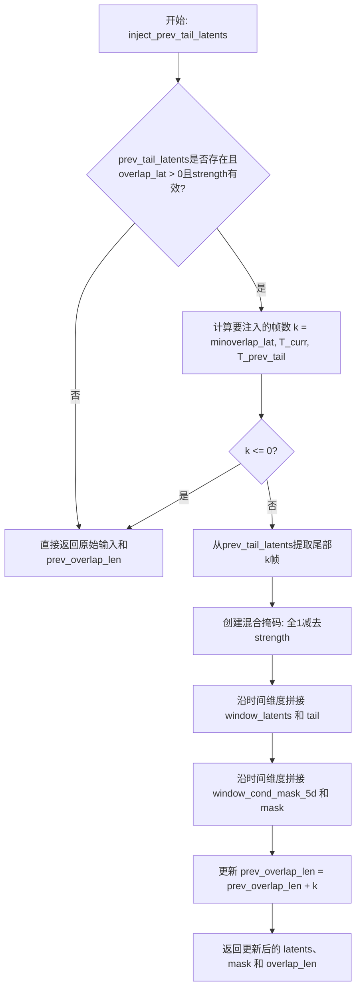

#### 带注释源码

```python
def inject_prev_tail_latents(
    window_latents: torch.Tensor,
    prev_tail_latents: torch.Tensor | None,
    window_cond_mask_5d: torch.Tensor,
    overlap_lat: int,
    strength: float | None,
    prev_overlap_len: int,
) -> tuple[torch.Tensor, torch.Tensor, int]:
    """
    Inject the tail latents from the previous window at the beginning of the current window (first k frames), where k =
    min(overlap_lat, T_curr, T_prev_tail).

    Args:
      window_latents: Tensor [B, C, T, H, W]. Current window latents.
      prev_tail_latents: Tensor | None [B, C, T_prev, H, W]. Tail segment from the previous window.
      window_cond_mask_5d: Tensor [B, 1, T, H, W]. Per-token conditioning mask (1 = free, 0 = hard condition).
      overlap_lat: int. Number of latent frames to inject from the previous tail.
      strength: float | None in [0, 1]. Blend strength; 1.0 replaces, 0.0 keeps original.
      prev_overlap_len: int. Accumulated overlap length so far (used for trimming later).

    Returns:
      tuple[Tensor, Tensor, int]: (updated_window_latents, updated_cond_mask, updated_prev_overlap_len)
    """
    # 快速路径：无需注入的情况
    if prev_tail_latents is None or overlap_lat <= 0 or strength is None or strength <= 0:
        return window_latents, window_cond_mask_5d, prev_overlap_len

    # 获取当前窗口的时间维度 T
    T = int(window_latents.shape[2])
    # 计算实际注入的帧数：取三者最小值
    k = min(int(overlap_lat), T, int(prev_tail_latents.shape[2]))
    if k <= 0:
        return window_latents, window_cond_mask_5d, prev_overlap_len

    # 提取前一个窗口尾部的最后 k 帧
    tail = prev_tail_latents[:, :, -k:]
    
    # 创建混合掩码：用于控制注入强度
    # 值为 (1 - strength)，表示保留原内容的比例
    mask = torch.full(
        (window_cond_mask_5d.shape[0], 1, tail.shape[2], window_cond_mask_5d.shape[3], window_cond_mask_5d.shape[4]),
        1.0 - strength,
        dtype=window_cond_mask_5d.dtype,
        device=window_cond_mask_5d.device,
    )

    # 沿时间维度(dim=2)拼接：当前窗口 + 尾部帧
    window_latents = torch.cat([window_latents, tail], dim=2)
    # 沿时间维度拼接对应的条件掩码
    window_cond_mask_5d = torch.cat([window_cond_mask_5d, mask], dim=2)
    # 返回更新后的latents、掩码和累积的重叠长度
    return window_latents, window_cond_mask_5d, prev_overlap_len + k
```


### `build_video_coords_for_window`

构建用于视频窗口的坐标张量，生成包含时间(t)、垂直(y)、水平(x)坐标的分数像素坐标，用于 RoPE 位置编码。

参数：

-  `latents`：`torch.Tensor`，形状为 [B, C, T, H, W]，当前窗口的潜在表示（任何裁剪之前）
-  `overlap_len`：`int`，注入头部的来自上一窗口尾部的帧数量
-  `guiding_len`：`int`，头部追加的引导帧数量
-  `negative_len`：`int`，头部追加的负索引帧数量（通常为 1 或 0）
-  `rope_interpolation_scale`：`torch.Tensor`，(t, y, x) 三个维度的缩放因子元组
-  `frame_rate`：`int`，用于将时间索引转换为秒的帧率

返回值：`torch.Tensor`，形状为 [B, 3, T*H*W] 的分数像素坐标张量

#### 流程图

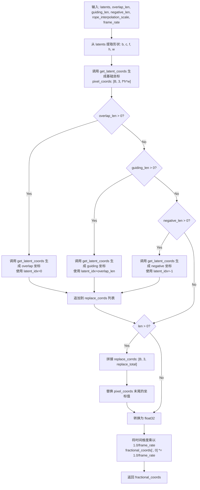

#### 带注释源码

```python
def build_video_coords_for_window(
    latents: torch.Tensor,
    overlap_len: int,
    guiding_len: int,
    negative_len: int,
    rope_interpolation_scale: torch.Tensor,
    frame_rate: int,
) -> torch.Tensor:
    """
    Build video_coords: [B, 3, S] with order [t, y, x].

    Args:
      latents: Tensor [B, C, T, H, W]. Current window latents (before any trimming).
      overlap_len: int. Number of frames from previous tail injected at the head.
      guiding_len: int. Number of guidance frames appended at the head.
      negative_len: int. Number of negative-index frames appended at the head (typically 1 or 0).
      rope_interpolation_scale: tuple[int|float, int|float, int|float]. Scale for (t, y, x).
      frame_rate: int. Used to convert time indices into seconds (t /= frame_rate).

    Returns:
      Tensor [B, 3, T*H*W] of fractional pixel coordinates per latent patch.
    """

    # 从输入张量形状中提取批量大小、通道数、帧数、高度和宽度
    b, c, f, h, w = latents.shape
    
    # 生成基础潜在坐标：使用 f（帧数）、h（高度）、w（宽度）和 batch_size
    # 调用辅助函数 get_latent_coords 生成 [B, 3, f*h*w] 形状的坐标张量
    # latent_idx=0 表示使用标准的时间索引步进
    pixel_coords = get_latent_coords(f, h, w, b, latents.device, rope_interpolation_scale, 0)
    
    # 初始化替换坐标列表，用于存储需要替换的坐标段
    replace_corrds = []
    
    # 如果存在重叠帧（来自上一窗口），生成对应的坐标
    # latent_idx=0 保持从 0 开始的时间索引
    if overlap_len > 0:
        replace_corrds.append(get_latent_coords(overlap_len, h, w, b, latents.device, rope_interpolation_scale, 0))
    
    # 如果存在引导帧，生成对应的坐标
    # latent_idx=overlap_len 将时间索引偏移，以接续重叠帧
    if guiding_len > 0:
        replace_corrds.append(
            get_latent_coords(guiding_len, h, w, b, latents.device, rope_interpolation_scale, overlap_len)
        )
    
    # 如果存在负索引帧，生成对应的坐标
    # latent_idx=-1 表示使用负时间索引（用于某些特殊的条件机制）
    if negative_len > 0:
        replace_corrds.append(get_latent_coords(negative_len, h, w, b, latents.device, rope_interpolation_scale, -1))
    
    # 如果存在任何需要替换的坐标段
    if len(replace_corrds) > 0:
        # 沿着通道维度（axis=2）拼接所有替换坐标
        replace_corrds = torch.cat(replace_corrds, axis=2)
        # 将 pixel_coords 末尾的坐标替换为新生成的替换坐标
        # 这确保了重叠/引导/负索引区域具有正确的坐标
        pixel_coords[:, :, -replace_corrds.shape[2] :] = replace_corrds
    
    # 转换为 float32 以支持分数坐标计算
    fractional_coords = pixel_coords.to(torch.float32)
    
    # 将时间维度（索引 0）乘以 1.0/frame_rate
    # 这将帧索引转换为以秒为单位的时间戳
    fractional_coords[:, 0] = fractional_coords[:, 0] * (1.0 / frame_rate)
    
    # 返回最终的分数坐标张量，形状为 [B, 3, T*H*W]
    return fractional_coords
```


### `parse_prompt_segments`

该函数负责解析输入的提示词（prompt）和提示词分段配置（prompt_segments），将其转换为按时间窗口索引顺序排列的提示词列表，以支持多阶段、多提示的视频生成任务。当未提供分段配置时，它支持通过管道符 `|` 对字符串进行分割。

参数：

-  `prompt`：`str | list[str]`，输入的提示词。如果为字符串且包含 '|'，则按竖线分割并去除首尾空格；如果为列表，则直接使用。
-  `prompt_segments`：`list[dict[str, Any]] | None`，可选。指定每个窗口索引范围的提示词内容，字典需包含 `start_window`（起始窗口）、`end_window`（结束窗口）和 `text`（提示词文本）。

返回值：`list[str]`，返回按窗口索引（0, 1, 2...）排列的提示词字符串列表。如果 `prompt` 为 `None` 或 `prompt_segments` 解析后为空，则返回空列表。

#### 流程图

```mermaid
flowchart TD
    Start([开始 parse_prompt_segments]) --> IsPromptNone{prompt is None?}
    IsPromptNone -- Yes --> ReturnEmpty[返回空列表 []]
    ReturnEmpty --> End([结束])
    
    IsPromptNone -- No --> HasPromptSegments{prompt_segments 存在且非空?}
    
    HasPromptSegments -- Yes --> CalcMaxWindow[计算最大窗口索引 max_w]
    CalcMaxWindow --> InitTextList[初始化列表 texts = [\"\"] * (max_w + 1)]
    InitTextList --> LoopSegs{遍历 prompt_segments}
    LoopSegs --> FillText[根据 start/end 填充 texts[w]]
    LoopSegs --> ForwardFill{前向填充空值}
    ForwardFill --> ReturnSegs[返回 texts 列表]
    ReturnSegs --> End
    
    HasPromptSegments -- No --> IsStrType{prompt 是字符串类型?}
    
    IsStrType -- Yes --> SplitBar[按 '|' 分割字符串并 strip]
    IsStrType -- No --> UseAsList[直接作为列表处理]
    
    SplitBar --> FilterNone[过滤 None 值]
    UseAsList --> FilterNone
    
    FilterNone --> ReturnParts[返回处理后的列表]
    ReturnParts --> End
```

#### 带注释源码

```python
def parse_prompt_segments(prompt: str | list[str], prompt_segments: list[dict[str, Any]] | None) -> list[str]:
    """
    Return a list of positive prompts per window index.

    Args:
      prompt: str | list[str]. If str contains '|', parts are split by bars and trimmed.
      prompt_segments:
          list[dict], optional. Each dict with {"start_window", "end_window", "text"} overrides prompts per window.

    Returns:
      list[str] containing the positive prompt for each window index.
    """
    # 1. 处理 prompt 为 None 的情况
    if prompt is None:
        return []
    
    # 2. 如果提供了 prompt_segments，优先使用分段配置模式
    if prompt_segments:
        # 2.1 计算需要的最长列表长度
        max_w = 0
        for seg in prompt_segments:
            max_w = max(max_w, int(seg.get("end_window", 0)))
        
        # 2.2 初始化一个空字符串列表，长度为最大窗口索引 + 1
        texts = [""] * (max_w + 1)
        
        # 2.3 根据分段配置填充列表
        for seg in prompt_segments:
            s = int(seg.get("start_window", 0))
            e = int(seg.get("end_window", s))
            txt = seg.get("text", "")
            for w in range(s, e + 1):
                texts[w] = txt
        
        # 2.4 前向填充：对于未指定的窗口，使用上一个有效窗口的提示词
        last = ""
        for i in range(len(texts)):
            if texts[i] == "":
                texts[i] = last
            else:
                last = texts[i]
        return texts

    # 3. 管道符分割模式 (Bar-split mode)
    # 如果 prompt 是字符串，按 '|' 分割；如果是列表，直接使用
    if isinstance(prompt, str):
        parts = [p.strip() for p in prompt.split("|")]
    else:
        parts = prompt
        
    # 4. 过滤掉 None 值
    parts = [p for p in parts if p is not None]
    return parts
```


### `batch_normalize`

对 latents 字典进行类 AdaIN 的批归一化处理，通过匹配 reference 字典中样本的通道均值和标准差来规范化当前 latents，并使用 factor 控制归一化强度（ComfyUI 兼容格式）。

参数：

- `latents`：`dict`，包含 "samples" 键的张量字典，形状为 [B, C, F, H, W]，表示待归一化的潜在表示
- `reference`：`dict`，包含 "samples" 键的张量字典，用于计算目标统计信息（均值和标准差）
- `factor`：`float`，归一化强度因子，取值范围 [0, 1]；0 表示保持不变，1 表示完全匹配 reference 的统计特性

返回值：`tuple[dict]`，包含更新后的 latents 字典的单一元素元组

#### 流程图

```mermaid
flowchart TD
    A[开始 batch_normalize] --> B[深拷贝输入 latents 字典]
    B --> C[提取 latents_copy['samples'] 到变量 t]
    C --> D[外层循环: 遍历批次维度 i]
    D --> E[内层循环: 遍历通道维度 c]
    E --> F[计算 reference 样本在通道 c 上的标准差 r_sd 和均值 r_mean]
    F --> G[计算当前 latents 在通道 c 上的标准差 i_sd 和均值 i_mean]
    G --> H[归一化当前通道: t[i, c] = ((t[i, c] - i_mean) / i_sd) * r_sd + r_mean]
    H --> I{通道 c 是否遍历完毕?}
    I -->|否| E
    I --> J{批次 i 是否遍历完毕?}
    J -->|否| E
    J --> K[使用 lerp 混合原始样本和归一化后的样本: latents_copy['samples'] = torch.lerp(latents['samples'], t, factor)]
    K --> L[返回单元素元组 (latents_copy,)]
    L --> M[结束]
```

#### 带注释源码

```python
def batch_normalize(latents, reference, factor):
    """
    Batch AdaIN-like normalization for latents in dict format (ComfyUI-compatible).

    Args:
        latents: dict containing "samples" shaped [B, C, F, H, W]
        reference: dict containing "samples" used to compute target stats
        factor: float in [0, 1]; 0 = no change, 1 = full match to reference
    Returns:
        tuple[dict]: a single-element tuple with the updated latents dict.
    """
    # 深拷贝输入字典，避免修改原始数据
    latents_copy = copy.deepcopy(latents)
    
    # 提取样本张量，形状为 [B, C, F, H, W]
    t = latents_copy["samples"]  #  B x C x F x H x W

    # 遍历批次维度
    for i in range(t.size(0)):  # batch
        # 遍历通道维度
        for c in range(t.size(1)):  # channel
            # 计算参考样本在当前通道上的标准差和均值
            # 使用 dim=None 对整个通道进行全局统计
            r_sd, r_mean = torch.std_mean(reference["samples"][i, c], dim=None)  # index by original dim order
            
            # 计算当前 latents 在当前通道上的标准差和均值
            i_sd, i_mean = torch.std_mean(t[i, c], dim=None)

            # 应用 AdaIN 归一化：将当前分布转换为参考分布
            # 公式：normalized = (x - mean) / std，然后乘以目标 std 并加上目标 mean
            t[i, c] = ((t[i, c] - i_mean) / i_sd) * r_sd + r_mean

    # 使用 lerp 在原始样本和归一化样本之间进行线性插值
    # factor 控制归一化强度：0=保持原样，1=完全使用归一化结果
    latents_copy["samples"] = torch.lerp(latents["samples"], t, factor)
    
    # 返回单元素元组，符合某些调用约定的格式要求
    return (latents_copy,)
```


### LTXI2VLongMultiPromptPipeline.__init__

该方法是LTXI2VLongMultiPromptPipeline类的构造函数，负责初始化视频生成管道所需的所有核心组件，包括调度器、VAE模型、文本编码器、分词器和Transformer模型，并配置相关的压缩比、默认分辨率和视频处理器等参数。

参数：

- `scheduler`：`FlowMatchEulerDiscreteScheduler`，用于视频去噪的调度器
- `vae`：`AutoencoderKLLTXVideo`，用于编码和解码视频的变分自编码器
- `text_encoder`：`T5EncoderModel`，用于编码文本提示的T5编码器模型
- `tokenizer`：`T5TokenizerFast`，用于分词文本输入的T5快速分词器
- `transformer`：`LTXVideoTransformer3DModel`，用于去噪视频潜在表示的条件Transformer架构

返回值：`None`，构造函数不返回任何值

#### 流程图

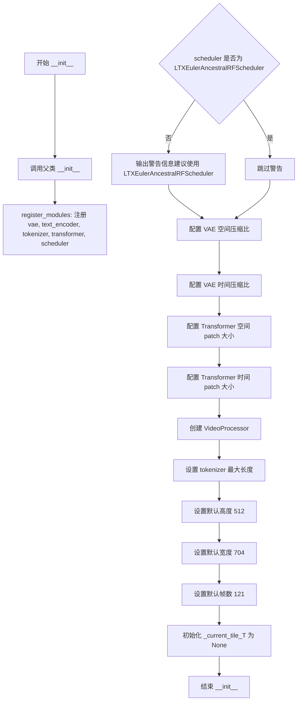

#### 带注释源码

```python
def __init__(
    self,
    scheduler: FlowMatchEulerDiscreteScheduler,  # 调度器：控制去噪过程中的噪声调度
    vae: AutoencoderKLLTXVideo,                  # VAE：变分自编码器，用于编码/解码视频潜在表示
    text_encoder: T5EncoderModel,                # T5文本编码器：将文本提示转换为嵌入向量
    tokenizer: T5TokenizerFast,                  # T5分词器：文本分词工具
    transformer: LTXVideoTransformer3DModel,     # 3D Transformer：核心的去噪Transformer模型
):
    # 调用父类DiffusionPipeline的初始化方法
    super().__init__()

    # 注册所有模块，使它们成为管道的可访问属性
    self.register_modules(
        vae=vae,
        text_encoder=text_encoder,
        tokenizer=tokenizer,
        transformer=transformer,
        scheduler=scheduler,
    )
    
    # 检查调度器类型，若不是LTXEulerAncestralRFScheduler则发出警告（ComfyUI兼容性）
    if not isinstance(scheduler, LTXEulerAncestralRFScheduler):
        logger.warning(
            "For ComfyUI parity, `LTXI2VLongMultiPromptPipeline` is typically run with "
            "`LTXEulerAncestralRFScheduler`. Got %s.",
            scheduler.__class__.__name__,
        )

    # 获取VAE的空间压缩比（默认为32）
    self.vae_spatial_compression_ratio = (
        self.vae.spatial_compression_ratio if getattr(self, "vae", None) is not None else 32
    )
    
    # 获取VAE的时间压缩比（默认为8）
    self.vae_temporal_compression_ratio = (
        self.vae.temporal_compression_ratio if getattr(self, "vae", None) is not None else 8
    )
    
    # 获取Transformer的空间patch大小（默认为1）
    self.transformer_spatial_patch_size = (
        self.transformer.config.patch_size if getattr(self, "transformer", None) is not None else 1
    )
    
    # 获取Transformer的时间patch大小（默认为1）
    self.transformer_temporal_patch_size = (
        self.transformer.config.patch_size_t if getattr(self, "transformer", None) is not None else 1
    )

    # 创建视频处理器，使用VAE空间压缩比作为缩放因子
    self.video_processor = VideoProcessor(vae_scale_factor=self.vae_spatial_compression_ratio)
    
    # 获取tokenizer的最大长度（默认为128）
    self.tokenizer_max_length = (
        self.tokenizer.model_max_length if getattr(self, "tokenizer", None) is not None else 128
    )

    # 设置默认输出参数
    self.default_height = 512    # 默认高度（像素）
    self.default_width = 704     # 默认宽度（像素）
    self.default_frames = 121   # 默认帧数
    
    # 内部状态：当前时间瓦片的大小
    self._current_tile_T = None
```


### `LTXI2VLongMultiPromptPipeline.guidance_scale`

该属性是一个只读的访问器（getter），用于获取在管道执行过程中设置的无分类器指导（Classifier-Free Guidance, CFG）缩放因子。该因子决定了条件噪声预测（conditional noise prediction）在整体噪声预测中的权重，从而控制生成结果对提示词的遵循程度。

参数：

- `self`：`LTXI2VLongMultiPromptPipeline`，实例本身，无实际输入参数，仅供属性方法访问内部状态。

返回值：`float`，返回当前配置的无分类器指导强度系数（Guidance Scale）。该值通常在 `__call__` 方法中被初始化为 `guidance_scale` 参数。

#### 流程图

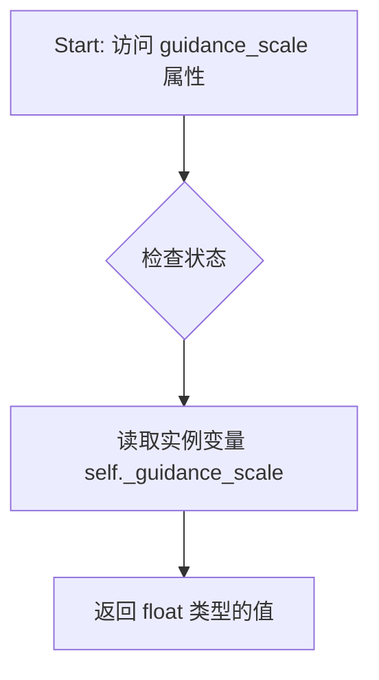

#### 带注释源码

```python
@property
# Copied from diffusers.pipelines.ltx.pipeline_ltx.LTXPipeline.guidance_scale
def guidance_scale(self):
    """
    获取当前的 guidance_scale 值。
    
    此属性通常在 Pipeline 的 __call__ 方法开始时被初始化 (self._guidance_scale = guidance_scale)，
    并在去噪循环中用于计算最终的噪声预测: noise_pred = uncond + scale * (cond - uncond)。
    """
    return self._guidance_scale
```


### `LTXI2VLongMultiPromptPipeline.guidance_rescale`

该属性用于获取 `guidance_rescale` 参数的值，该值用于重缩放噪声预测以改善图像质量并修复过度曝光问题（基于 Common Diffusion Noise Schedules and Sample Steps are Flawed 论文的第 3.4 节）。

参数： 无（属性访问器不接受参数）

返回值：`float`，返回 guidance_rescale 的值，用于在 classifier-free guidance 过程中重缩放噪声预测。

#### 流程图

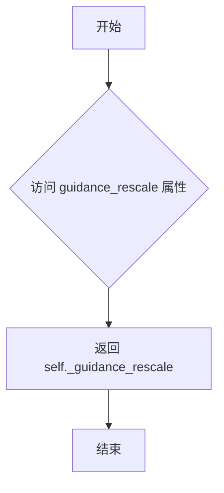

#### 带注释源码

```python
@property
# Copied from diffusers.pipelines.ltx.pipeline_ltx.LTXPipeline.guidance_rescale
def guidance_rescale(self):
    """
    属性访问器：返回 guidance_rescale 值。
    
    guidance_rescale 是一个可选的重缩放因子，用于在 classifier-free guidance (CFG) 过程中
    改善图像质量并修复过度曝光问题。该值通常在 0.0 到 1.0 之间，0.0 表示不进行重缩放。
    
    返回值:
        float: guidance_rescale 的当前值
    """
    return self._guidance_rescale
```


### `LTXI2VLongMultiPromptPipeline.do_classifier_free_guidance`

该属性用于判断当前管道是否启用了无分类器自由引导（Classifier-Free Guidance，CFG）。它通过检查 `guidance_scale` 是否大于 1.0 来决定是否启用 CFG。当 `guidance_scale > 1.0` 时，模型会在推理过程中同时考虑条件和无条件预测，从而提高生成质量。

参数：无需参数（属性方法，仅隐式接收 `self`）

返回值：`bool`，返回 `True` 表示启用 CFG（guidance_scale > 1.0），返回 `False` 表示禁用 CFG。

#### 流程图

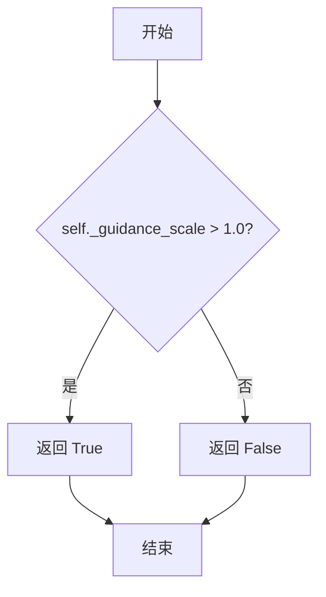

#### 带注释源码

```python
@property
# Copied from diffusers.pipelines.ltx.pipeline_ltx.LTXPipeline.do_classifier_free_guidance
def do_classifier_free_guidance(self):
    """
    属性：判断是否启用无分类器自由引导（CFG）

    该属性检查 guidance_scale 是否大于 1.0，以确定是否在去噪过程中
    同时考虑条件预测和无条件预测。当 guidance_scale > 1.0 时，
    噪声预测公式为：noise_pred = uncond + guidance_scale * (text - uncond)

    Returns:
        bool: 如果 guidance_scale > 1.0 则返回 True（启用 CFG），否则返回 False
    """
    return self._guidance_scale > 1.0
```


### `LTXI2VLongMultiPromptPipeline.num_timesteps`

这是一个属性（property）方法，用于获取当前扩散管道执行的总时间步数。该属性直接返回内部变量 `_num_timesteps`，该变量在管道执行期间由调度器（scheduler）的 `set_timesteps` 方法设置。它反映了为当前去噪过程配置的时间步总数。

参数：

- 无显式参数（property 方法，隐式接收 `self` 参数）

返回值：`int`，返回配置的时间步总数，即扩散模型去噪过程中要执行的总迭代次数。

#### 流程图

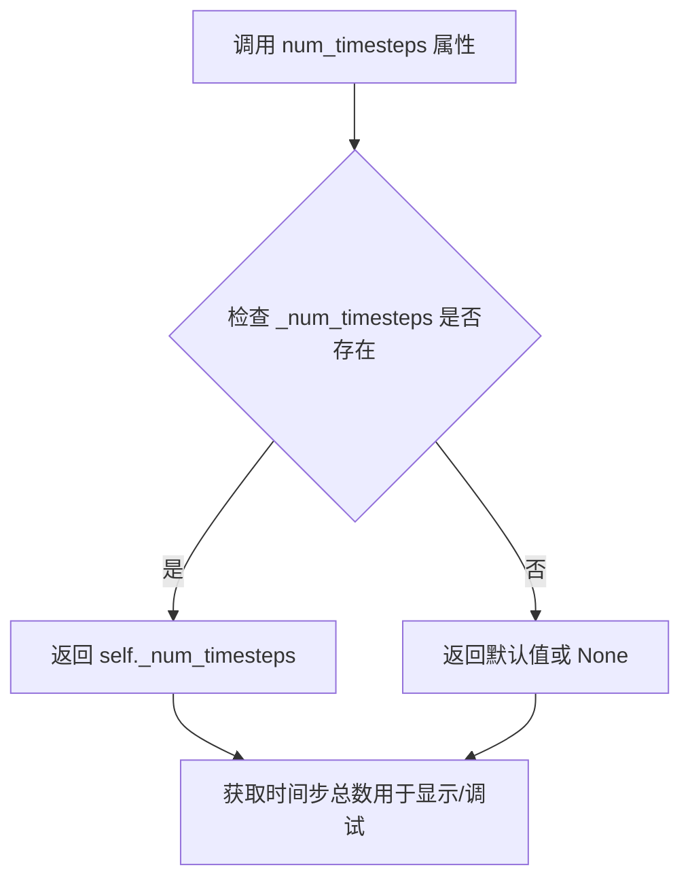

#### 带注释源码

```python
@property
# Copied from diffusers.pipelines.ltx.pipeline_ltx.LTXPipeline.num_timesteps
def num_timesteps(self):
    """
    返回当前管道的时间步总数。

    此属性提供了对扩散过程总步数的访问权限。
    _num_timesteps 在调用 scheduler.set_timesteps() 时被设置，
    并在管道的 __call__ 方法中根据 num_inference_steps 或 sigmas 参数更新。

    Returns:
        int: 扩散去噪过程中要执行的总时间步数。
    """
    return self._num_timesteps
```


### `LTXI2VLongMultiPromptPipeline.current_timestep`

这是一个只读属性（property），用于获取当前去噪过程的时间步（timestep）值。该属性从 `LTXPipeline` 类复制而来，在扩散模型的推理过程中用于跟踪当前的采样步骤。

参数： 无（属性不接受显式参数）

返回值：`int` 或 `torch.Tensor`，返回当前扩散过程的时间步。在去噪循环中，该值会被更新为当前迭代的时间步索引。

#### 流程图

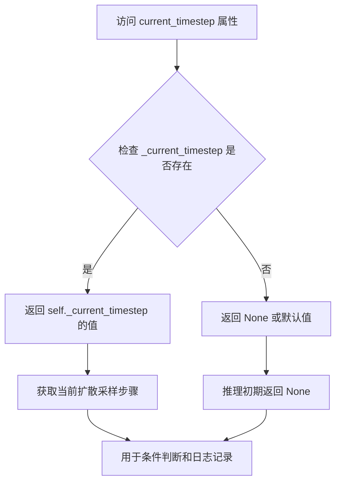

#### 带注释源码

```python
@property
# Copied from diffusers.pipelines.ltx.pipeline_ltx.LTXPipeline.current_timestep
def current_timestep(self):
    """
    获取当前扩散过程的时间步（timestep）。
    
    在去噪循环中，此属性返回当前迭代所处的时间步索引。
    该值由 scheduler 在每次迭代开始时设置，并通过此属性暴露给外部调用者。
    
    返回值类型:
        int 或 torch.Tensor: 当前时间步，取决于 scheduler 的实现。
        在初始化或中断时可能为 None。
    
    使用场景:
        - 进度监控和回调函数
        - 条件渲染控制
        - 调试和日志输出
    """
    return self._current_timestep
```


### `LTXI2VLongMultiPromptPipeline.attention_kwargs`

该属性用于获取传递给 Transformer 模型的额外注意力参数（attention kwargs）。这些参数允许在推理过程中动态调整 Transformer 的注意力行为，例如自定义注意力掩码、位置编码等。

参数：无（属性 getter 不接受参数）

返回值：`dict[str, Any] | None`，传递给 Transformer 的额外注意力参数字典，可能为 None

#### 流程图

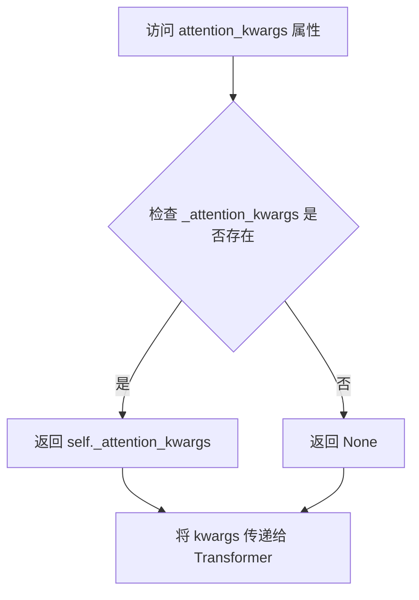

#### 带注释源码

```python
@property
# Copied from diffusers.pipelines.ltx.pipeline_ltx.LTXPipeline.attention_kwargs
def attention_kwargs(self):
    """
    获取传递给 Transformer 模型的额外注意力参数。
    
    这些参数在 __call__ 方法中被设置（self._attention_kwargs = attention_kwargs），
    并在 Transformer 推理时通过 attention_kwargs 参数传递给模型。
    
    Returns:
        dict[str, Any] | None: 额外的注意力参数字典，可能包含自定义注意力掩码、
                               位置编码参数或其他 Transformer 特定配置。
    """
    return self._attention_kwargs
```


### `LTXI2VLongMultiPromptPipeline.interrupt`

该属性用于获取生成管道的中断状态标志，允许外部调用者检查当前的去噪循环是否被请求中断。

参数：

- 无

返回值：`bool`，返回当前的中断状态标志。当值为 `True` 时，表示生成过程已被请求中断；当值为 `False` 时，表示生成过程继续正常运行。

#### 流程图

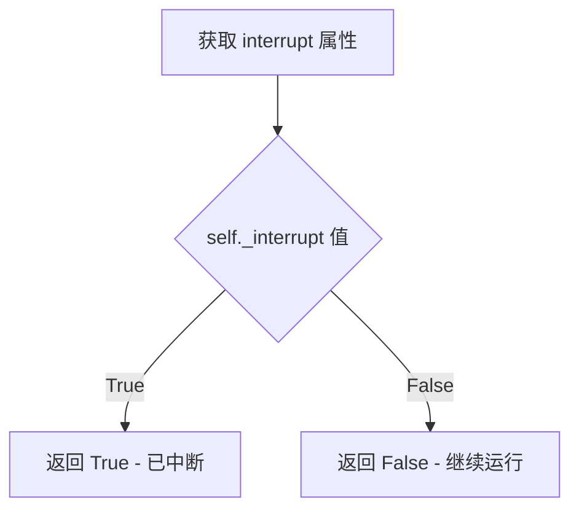

#### 带注释源码

```python
@property
# Copied from diffusers.pipelines.ltx.pipeline_ltx.LTXPipeline.interrupt
def interrupt(self):
    """
    属性 getter：获取生成管道的中断状态标志。
    
    该属性从 LTXPipeline 复制而来，用于支持在去噪循环中检查外部中断请求。
    当外部调用者设置 self._interrupt = True 时，当前的 __call__ 方法中的
    滑动窗口处理循环会检测到该标志并提前退出（break）。
    
    Returns:
        bool: 中断标志状态。True 表示请求中断，False 表示正常运行。
    """
    return self._interrupt
```


### `LTXI2VLongMultiPromptPipeline._get_t5_prompt_embeds`

该方法是非公开的内部方法，负责将文本提示（prompt）转换为 T5 编码器的隐藏状态嵌入（hidden state embeddings）。它首先使用分词器（tokenizer）将文本转换为 token IDs，随后通过 T5 文本编码器生成嵌入向量，并根据 `num_videos_per_prompt` 参数复制 embeddings 以支持批量生成，同时处理设备（device）和数据类型（dtype）的转换。

参数：

-  `self`：实例本身。
-  `prompt`：`str | list[str]`，待编码的文本提示，可以是单个字符串或字符串列表。
-  `num_videos_per_prompt`：`int`，默认为 1，每个提示生成的视频数量，用于复制 embeddings 以匹配批量大小。
-  `max_sequence_length`：`int`，默认为 128，分词器的最大序列长度。
-  `device`：`torch.device | None`，计算设备，如果为 None 则使用执行设备。
-  `dtype`：`torch.dtype | None`，计算数据类型，如果为 None 则使用文本编码器的 dtype。

返回值：`tuple[torch.Tensor, torch.Tensor]`，包含两个张量：
-  `prompt_embeds`：`torch.Tensor`，文本嵌入，形状为 `[batch_size * num_videos_per_prompt, seq_len, embed_dim]`。
-  `prompt_attention_mask`：`torch.Tensor`，注意力掩码，形状为 `[batch_size * num_videos_per_prompt, seq_len]`。

#### 流程图

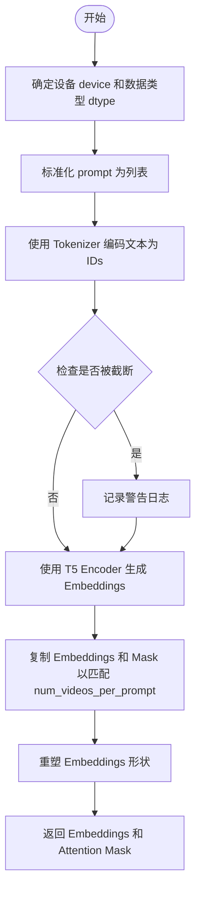

#### 带注释源码

```python
def _get_t5_prompt_embeds(
    self,
    prompt: str | list[str] = None,
    num_videos_per_prompt: int = 1,
    max_sequence_length: int = 128,
    device: torch.device | None = None,
    dtype: torch.dtype | None = None,
):
    """
    将文本提示编码为 T5 隐藏状态。

    参数:
        prompt: 要编码的文本。
        num_videos_per_prompt: 每个提示生成的视频数量。
        max_sequence_length: 分词器的最大序列长度。
        device: torch 设备。
        dtype: torch 数据类型。

    返回:
        prompt_embeds 和 prompt_attention_mask。
    """
    # 1. 确定设备：如果未指定，则使用当前执行设备
    device = device or self._execution_device
    # 2. 确定 dtype：如果未指定，则使用文本编码器的 dtype
    dtype = dtype or self.text_encoder.dtype

    # 3. 标准化输入：如果是单个字符串，则包装为列表，以便统一处理批量数据
    prompt = [prompt] if isinstance(prompt, str) else prompt
    batch_size = len(prompt)

    # 4. 分词（Tokenization）：将文本转换为 token IDs
    text_inputs = self.tokenizer(
        prompt,
        padding="max_length",           # 填充到最大长度
        max_length=max_sequence_length, # 截断超过最大长度的序列
        truncation=True,
        add_special_tokens=True,        # 添加特殊 tokens (如 EOS)
        return_tensors="pt",            # 返回 PyTorch 张量
    )
    text_input_ids = text_inputs.input_ids
    prompt_attention_mask = text_inputs.attention_mask
    # 确保掩码是布尔类型并移动到指定设备
    prompt_attention_mask = prompt_attention_mask.bool().to(device)

    # 5. 截断检查：检查是否有文本因超过 max_sequence_length 而被截断
    # 使用 padding="longest" 重新编码以比较长度
    untruncated_ids = self.tokenizer(prompt, padding="longest", return_tensors="pt").input_ids

    # 如果未截断的序列长度大于截断后的长度，并且两者不相等，说明发生了截断
    if untruncated_ids.shape[-1] >= text_input_ids.shape[-1] and not torch.equal(text_input_ids, untruncated_ids):
        # 解码被截断的部分以供日志记录
        removed_text = self.tokenizer.batch_decode(untruncated_ids[:, max_sequence_length - 1 : -1])
        logger.warning(
            "The following part of your input was truncated because `max_sequence_length` is set to "
            f" {max_sequence_length} tokens: {removed_text}"
        )

    # 6. 编码（Forward Pass）：使用 T5 文本编码器生成嵌入
    # [batch_size, seq_len, hidden_dim]
    prompt_embeds = self.text_encoder(text_input_ids.to(device))[0]
    # 转换嵌入的数据类型和设备
    prompt_embeds = prompt_embeds.to(dtype=dtype, device=device)

    # 7. 批量处理与复制：
    # 如果需要为每个提示生成多个视频（num_videos_per_prompt > 1），则复制 embeddings
    _, seq_len, _ = prompt_embeds.shape
    # repeat(1, num_videos_per_prompt, 1) 在序列维度之前扩展 batch 维度
    prompt_embeds = prompt_embeds.repeat(1, num_videos_per_prompt, 1)
    # view 重塑为 [batch_size * num_videos_per_prompt, seq_len, hidden_dim]
    prompt_embeds = prompt_embeds.view(batch_size * num_videos_per_prompt, seq_len, -1)

    # 8. 处理注意力掩码：同样进行复制和重塑
    prompt_attention_mask = prompt_attention_mask.view(batch_size, -1)
    prompt_attention_mask = prompt_attention_mask.repeat(num_videos_per_prompt, 1)

    # 9. 返回处理好的 embeddings 和注意力掩码
    return prompt_embeds, prompt_attention_mask
```


### `LTXI2VLongMultiPromptPipeline.encode_prompt`

该方法用于将文本提示编码为文本编码器的隐藏状态（embedding），支持正向提示和负向提示的生成，并在需要时执行无分类器引导（CFG）。

参数：

- `self`：`LTXI2VLongMultiPromptPipeline` 实例本身
- `prompt`：`str | list[str]`，要编码的文本提示
- `negative_prompt`：`str | list[str] | None`，可选的负向提示，用于引导不生成的内容
- `do_classifier_free_guidance`：`bool`，是否使用无分类器引导（默认为 True）
- `num_videos_per_prompt`：`int`，每个提示生成的视频数量（默认为 1）
- `prompt_embeds`：`torch.Tensor | None`，预生成的文本嵌入，若不提供则从 prompt 生成
- `negative_prompt_embeds`：`torch.Tensor | None`，预生成的负向文本嵌入
- `prompt_attention_mask`：`torch.Tensor | None`，提示的注意力掩码
- `negative_prompt_attention_mask`：`torch.Tensor | None`，负向提示的注意力掩码
- `max_sequence_length`：`int`，tokenizer 最大序列长度（默认为 128）
- `device`：`torch.device | None`，用于放置结果嵌入的设备
- `dtype`：`torch.dtype | None`，结果嵌入的数据类型

返回值：`tuple[torch.Tensor, torch.Tensor, torch.Tensor, torch.Tensor]`，返回四个张量：正向提示嵌入、正向提示注意力掩码、负向提示嵌入、负向提示注意力掩码

#### 流程图

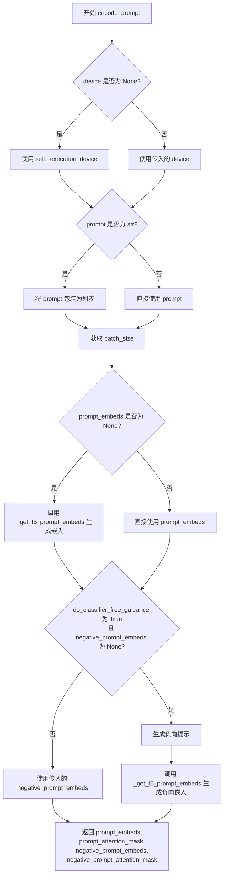

#### 带注释源码

```python
def encode_prompt(
    self,
    prompt: str | list[str],
    negative_prompt: str | list[str] | None = None,
    do_classifier_free_guidance: bool = True,
    num_videos_per_prompt: int = 1,
    prompt_embeds: torch.Tensor | None = None,
    negative_prompt_embeds: torch.Tensor | None = None,
    prompt_attention_mask: torch.Tensor | None = None,
    negative_prompt_attention_mask: torch.Tensor | None = None,
    max_sequence_length: int = 128,
    device: torch.device | None = None,
    dtype: torch.dtype | None = None,
):
    r"""
    Encodes the prompt into text encoder hidden states.

    Args:
        prompt (`str` or `list[str]`, *optional*):
            prompt to be encoded
        negative_prompt (`str` or `list[str]`, *optional*):
            The prompt or prompts not to guide the image generation. If not defined, one has to pass
            `negative_prompt_embeds` instead. Ignored when not using guidance (i.e., ignored if `guidance_scale` is
            less than `1`).
        do_classifier_free_guidance (`bool`, *optional*, defaults to `True`):
            Whether to use classifier free guidance or not.
        num_videos_per_prompt (`int`, *optional*, defaults to 1):
            Number of videos that should be generated per prompt. torch device to place the resulting embeddings on
        prompt_embeds (`torch.Tensor`, *optional*):
            Pre-generated text embeddings. Can be used to easily tweak text inputs, *e.g.* prompt weighting. If not
            provided, text embeddings will be generated from `prompt` input argument.
        negative_prompt_embeds (`torch.Tensor`, *optional*):
            Pre-generated negative text embeddings. Can be used to easily tweak text inputs, *e.g.* prompt
            weighting. If not provided, negative_prompt_embeds will be generated from `negative_prompt` input
            argument.
        device: (`torch.device`, *optional*):
            torch device
        dtype: (`torch.dtype`, *optional*):
            torch dtype
    """
    # 确定设备，默认为执行设备
    device = device or self._execution_device

    # 将 prompt 转换为列表（如果是字符串）
    prompt = [prompt] if isinstance(prompt, str) else prompt
    # 根据 prompt 或 prompt_embeds 确定 batch_size
    if prompt is not None:
        batch_size = len(prompt)
    else:
        batch_size = prompt_embeds.shape[0]

    # 如果没有提供 prompt_embeds，则从 prompt 生成
    if prompt_embeds is None:
        prompt_embeds, prompt_attention_mask = self._get_t5_prompt_embeds(
            prompt=prompt,
            num_videos_per_prompt=num_videos_per_prompt,
            max_sequence_length=max_sequence_length,
            device=device,
            dtype=dtype,
        )

    # 如果启用 CFG 且没有提供负向嵌入，则生成负向嵌入
    if do_classifier_free_guidance and negative_prompt_embeds is None:
        # 默认负向提示为空字符串
        negative_prompt = negative_prompt or ""
        # 将负向提示扩展为与 batch_size 相同的长度
        negative_prompt = batch_size * [negative_prompt] if isinstance(negative_prompt, str) else negative_prompt

        # 类型检查：负向提示类型应与正向提示类型一致
        if prompt is not None and type(prompt) is not type(negative_prompt):
            raise TypeError(
                f"`negative_prompt` should be the same type to `prompt`, but got {type(negative_prompt)} !="
                f" {type(prompt)}."
            )
        # batch_size 检查
        elif batch_size != len(negative_prompt):
            raise ValueError(
                f"`negative_prompt`: {negative_prompt} has batch size {len(negative_prompt)}, but `prompt`:"
                f" {prompt} has batch size {batch_size}. Please make sure that passed `negative_prompt` matches"
                " the batch size of `prompt`."
            )

        # 生成负向提示嵌入
        negative_prompt_embeds, negative_prompt_attention_mask = self._get_t5_prompt_embeds(
            prompt=negative_prompt,
            num_videos_per_prompt=num_videos_per_prompt,
            max_sequence_length=max_sequence_length,
            device=device,
            dtype=dtype,
        )

    # 返回正向嵌入、注意力掩码、负向嵌入、注意力掩码
    return prompt_embeds, prompt_attention_mask, negative_prompt_embeds, negative_prompt_attention_mask
```


### `LTXI2VLongMultiPromptPipeline._pack_latents`

将形状为 [B, C, F, H, W] 的未打包潜在张量打包成形状为 [B, S, D] 的 3D 张量，其中 S 是有效视频序列长度，D 是有效特征维度，以便于 Transformer 处理。

参数：

- `latents`：`torch.Tensor`，输入的潜在张量，形状为 [B, C, F, H, W]，其中 B 是批量大小，C 是通道数，F 是帧数，H 是高度，W 是宽度
- `patch_size`：`int`，空间分块大小，默认为 1
- `patch_size_t`：`int`，时间分块大小，默认为 1

返回值：`torch.Tensor`，打包后的潜在张量，形状为 [B, F // p_t * H // p * W // p, C * p_t * p * p]（即 [B, S, D]）

#### 流程图

```mermaid
flowchart TD
    A[输入 latents: B, C, F, H, W] --> B[提取形状信息]
    B --> C[计算分块后尺寸]
    C --> D{post_patch_num_frames}
    C --> E{post_patch_height}
    C --> F{post_patch_width}
    D --> G[reshape: B, -1, F//p_t, p_t, H//p, p, W//p, p]
    E --> G
    F --> G
    G --> H[permute: 0, 2, 4, 6, 1, 3, 5, 7]
    H --> I[flatten: 4, 7]
    I --> J[flatten: 1, 3]
    J --> K[输出: B, S, D]
```

#### 带注释源码

```python
@staticmethod
# Copied from diffusers.pipelines.ltx.pipeline_ltx.LTXPipeline._pack_latents
def _pack_latents(latents: torch.Tensor, patch_size: int = 1, patch_size_t: int = 1) -> torch.Tensor:
    """
    将未打包的潜在张量 [B, C, F, H, W] 打包成 [B, S, D] 形状的 3D 张量。
    
    参数:
        latents: 形状为 [B, C, F, H, W] 的未打包潜在张量
        patch_size: 空间分块大小 (默认 1)
        patch_size_t: 时间分块大小 (默认 1)
    
    返回:
        形状为 [B, F // p_t * H // p * W // p, C * p_t * p * p] 的打包潜在张量
    """
    # 从输入张量中提取批量大小、通道数、帧数、高度和宽度
    batch_size, num_channels, num_frames, height, width = latents.shape
    
    # 计算分块后的帧数、高度和宽度
    post_patch_num_frames = num_frames // patch_size_t
    post_patch_height = height // patch_size
    post_patch_width = width // patch_size
    
    # 重塑张量以进行分块: [B, C, F, H, W] -> [B, C, F//p_t, p_t, H//p, p, W//p, p]
    latents = latents.reshape(
        batch_size,
        -1,
        post_patch_num_frames,
        patch_size_t,
        post_patch_height,
        patch_size,
        post_patch_width,
        patch_size,
    )
    
    # 置换维度以重新排列分块: [B, C, F//p_t, p_t, H//p, p, W//p, p] -> [B, F//p_t, H//p, W//p, C, p_t, p, p]
    latents = latents.permute(0, 2, 4, 6, 1, 3, 5, 7)
    
    # 展平分块维度到通道维度: [B, F//p_t, H//p, W//p, C*p_t*p*p]
    latents = latents.flatten(4, 7)
    
    # 展平空间和时间序列维度: [B, F//p_t*H//p*W//p, C*p_t*p*p]
    latents = latents.flatten(1, 3)
    
    return latents
```


### `LTXI2VLongMultiPromptPipeline._unpack_latents`

将打包后的潜在表示张量从 [B, S, D] 形状解包并重塑为视频张量 [B, C, F, H, W]，是 `_pack_latents` 方法的逆操作。

参数：

- `latents`：`torch.Tensor`，打包后的潜在表示，形状为 [B, S, D]，其中 S 是有效视频序列长度，D 是有效特征维度
- `num_frames`：`int`，潜在表示中的帧数
- `height`：`int`，潜在表示的高度
- `width`：`int`，潜在表示的宽度
- `patch_size`：`int`，空间补丁大小，默认为 1
- `patch_size_t`：`int`，时间补丁大小，默认为 1

返回值：`torch.Tensor`，解包后的视频张量，形状为 [B, C, F, H, W]

#### 流程图

```mermaid
flowchart TD
    A[输入: latents [B, S, D]] --> B[获取 batch_size]
    B --> C[reshape: [B, num_frames, height, width, -1, patch_size_t, patch_size, patch_size]]
    C --> D[permute: [0, 4, 1, 5, 2, 6, 3, 7] 重新排列维度]
    D --> E[flatten 6, 7 合并最后两个维度]
    E --> F[flatten 4, 5 合并中间维度]
    F --> G[flatten 2, 3 合并帧和空间维度]
    G --> H[输出: latents [B, C, F, H, W]]
```

#### 带注释源码

```python
@staticmethod
# Copied from diffusers.pipelines.ltx.pipeline_ltx.LTXPipeline._unpack_latents
def _unpack_latents(
    latents: torch.Tensor, num_frames: int, height: int, width: int, patch_size: int = 1, patch_size_t: int = 1
) -> torch.Tensor:
    # 打包后的潜在表示形状为 [B, S, D]（S 是有效视频序列长度，D 是有效特征维度）
    # 被解包并重塑为形状为 [B, C, F, H, W] 的视频张量。
    # 这是 `_pack_latents` 方法的逆操作。
    
    # 获取批次大小
    batch_size = latents.size(0)
    
    # 将 [B, S, D] 重塑为 [B, num_frames, height, width, -1, patch_size_t, patch_size, patch_size]
    # 其中 -1 会自动推断通道数 C * patch_size * patch_size
    latents = latents.reshape(batch_size, num_frames, height, width, -1, patch_size_t, patch_size, patch_size)
    
    # 调整维度顺序：从 [B, F, H, W, C, p_t, p, p] 转换为 [B, C, F, p_t, H, p, W, p]
    latents = latents.permute(0, 4, 1, 5, 2, 6, 3, 7).flatten(6, 7).flatten(4, 5).flatten(2, 3)
    
    # 连续三次 flatten 操作：
    # 1. flatten(6, 7): 合并最后两个补丁维度 [B, C, F, p_t, H, p, W, p] -> [B, C, F, p_t, H, p, W*p]
    # 2. flatten(4, 5): 合并空间补丁维度 -> [B, C, F, p_t, H*p, W*p]
    # 3. flatten(2, 3): 合并时间补丁维度 -> [B, C, F*p_t, H*p, W*p]
    # 最终得到 [B, C, F, H, W] 形状的视频张量
    
    return latents
```


### `LTXI2VLongMultiPromptPipeline._normalize_latents`

对latents进行标准化处理，通过减去均值并除以标准差（乘以缩放因子），在通道维度[B, C, F, H, W]上进行归一化。

参数：

-  `latents`：`torch.Tensor`，待归一化的latent张量，形状为 [B, C, F, H, W]
-  `latents_mean`：`torch.Tensor`，用于归一化的均值张量
-  `latents_std`：`torch.Tensor`，用于归一化的标准差张量
-  `scaling_factor`：`float`，缩放因子，默认为 1.0

返回值：`torch.Tensor`，归一化后的latent张量

#### 流程图

```mermaid
flowchart TD
    A[开始 _normalize_latents] --> B[输入: latents, latents_mean, latents_std, scaling_factor]
    B --> C{latents_mean 形状处理}
    C --> D[latents_mean.view(1, -1, 1, 1, 1).to latents.device & dtype]
    C --> E{latents_std 形状处理}
    E --> F[latents_std.view(1, -1, 1, 1, 1).to latents.device & dtype]
    D --> G[归一化计算: (latents - latents_mean) * scaling_factor / latents_std]
    F --> G
    G --> H[返回归一化后的 latents]
    H --> I[结束]
```

#### 带注释源码

```python
@staticmethod
# Copied from diffusers.pipelines.ltx.pipeline_ltx.LTXPipeline._normalize_latents
def _normalize_latents(
    latents: torch.Tensor, latents_mean: torch.Tensor, latents_std: torch.Tensor, scaling_factor: float = 1.0
) -> torch.Tensor:
    # Normalize latents across the channel dimension [B, C, F, H, W]
    # 将 mean 张量reshape为 [1, C, 1, 1, 1] 以便沿 B, F, H, W 维度广播
    latents_mean = latents_mean.view(1, -1, 1, 1, 1).to(latents.device, latents.dtype)
    # 将 std 张量reshape为 [1, C, 1, 1, 1] 以便沿 B, F, H, W 维度广播
    latents_std = latents_std.view(1, -1, 1, 1, 1).to(latents.device, latents.dtype)
    # 标准化公式: (x - mean) * scaling_factor / std
    # 这与常见的 z-score 标准化类似，但增加了一个 scaling_factor 缩放因子
    latents = (latents - latents_mean) * scaling_factor / latents_std
    return latents
```


### `LTXI2VLongMultiPromptPipeline._denormalize_latents`

该静态方法用于将标准化（归一化）后的latent张量进行去标准化（反归一化）操作，恢复到原始的latent空间。这是LTXVideo Pipeline中latent处理的关键步骤，通常在VAE解码前调用。

参数：

- `latents`：`torch.Tensor`，输入的标准化latent张量，形状为 [B, C, F, H, W]，其中B为批量大小，C为通道数，F为帧数，H和W为空间维度
- `latents_mean`：`torch.Tensor`，用于去标准化的均值向量，形状应与latents的通道维度匹配
- `latents_std`：`torch.Tensor`，用于去标准化的标准差向量，形状应与latents的通道维度匹配
- `scaling_factor`：`float`，可选参数，默认值为1.0，缩放因子，用于调整去标准化过程中的缩放比例

返回值：`torch.Tensor`，去标准化后的latent张量，形状与输入相同 [B, C, F, H, W]

#### 流程图

```mermaid
flowchart TD
    A[开始 _denormalize_latents] --> B[输入: latents, latents_mean, latents_std, scaling_factor]
    B --> C{检查输入有效性}
    C -->|是| D[将 latents_mean reshape 为 [1, -1, 1, 1, 1]]
    C -->|否| E[抛出异常或返回原始latents]
    D --> F[将 latents_mean 移动到 latents 的设备和数据类型]
    F --> G[将 latents_std reshape 为 [1, -1, 1, 1, 1]]
    G --> H[将 latents_std 移动到 latents 的设备和数据类型]
    H --> I[计算: latents = latents * latents_std / scaling_factor + latents_mean]
    I --> J[返回去标准化后的 latents]
    J --> K[结束]
```

#### 带注释源码

```python
@staticmethod
# Copied from diffusers.pipelines.ltx.pipeline_ltx.LTXPipeline._denormalize_latents
def _denormalize_latents(
    latents: torch.Tensor, 
    latents_mean: torch.Tensor, 
    latents_std: torch.Tensor, 
    scaling_factor: float = 1.0
) -> torch.Tensor:
    """
    对latent张量进行去标准化（反归一化）操作。
    
    这是标准化过程的逆操作，将标准化后的latent值转换回原始的latent空间。
    标准化公式: latents_normalized = (latents - mean) * scaling_factor / std
    去标准化公式: latents = latents_normalized * std / scaling_factor + mean
    
    Args:
        latents: 标准化后的latent张量，形状 [B, C, F, H, W]
        latents_mean: 用于去标准化的均值向量
        latents_std: 用于去标准化的标准差向量
        scaling_factor: 缩放因子，默认值为1.0
    
    Returns:
        去标准化后的latent张量，形状与输入相同 [B, C, F, H, W]
    """
    # 获取latent的设备和数据类型，用于确保mean和std在同一设备上
    device = latents.device
    dtype = latents.dtype
    
    # 将均值向量reshape为 [1, -1, 1, 1, 1]
    # -1 表示自动计算通道维度的大小，使其与latents的C维度匹配
    # 这样可以将1D的mean/std向量广播到完整的5D张量形状
    latents_mean = latents_mean.view(1, -1, 1, 1, 1)
    
    # 将reshape后的均值张量移动到latents所在的设备和数据类型
    latents_mean = latents_mean.to(device, dtype)
    
    # 对标准差进行相同的reshape操作
    latents_std = latents_std.view(1, -1, 1, 1, 1)
    latents_std = latents_std.to(device, dtype)
    
    # 执行去标准化操作：
    # 1. latents * latents_std: 乘以标准差
    # 2. / scaling_factor: 除以缩放因子
    # 3. + latents_mean: 加上均值
    # 这个操作是标准化过程的逆操作
    latents = latents * latents_std / scaling_factor + latents_mean
    
    return latents
```


### `LTXI2VLongMultiPromptPipeline.prepare_latents`

准备基础潜在变量（latents）并可选地注入第一帧条件潜在变量。

参数：

- `self`：调用该方法的对象实例。
- `batch_size`：`int`，批量大小。
- `num_channels_latents`：`int`，潜在变量的通道数。
- `height`：`int`，目标高度（像素）。
- `width`：`int`，目标宽度（像素）。
- `num_frames`：`int`，帧数。
- `device`：`torch.device`，设备对象。
- `generator`：`torch.Generator | None`，随机数生成器。
- `dtype`：`torch.dtype`，数据类型，默认为 `torch.float32`。
- `latents`：`torch.Tensor | None`，初始潜在变量，默认为 `None`。
- `cond_latents`：`torch.Tensor | None`，条件潜在变量（例如第一帧），默认为 `None`。
- `cond_strength`：`float`，条件强度，默认为 `0.0`。
- `negative_index_latents`：`torch.Tensor | None`，负索引潜在变量，默认为 `None`。

返回值：`tuple[torch.Tensor, torch.Tensor | None, int, int, int]`，返回处理后的 `latents`、`negative_index_latents`、`latent_num_frames`（潜在帧数）、`latent_height`（潜在高度）、`latent_width`（潜在宽度）。

#### 流程图

```mermaid
flowchart TD
    A[开始 prepare_latents] --> B{latents 是否为 None?}
    B -- 是 --> C[计算 latent_num_frames = (num_frames - 1) // vae_temporal_compression_ratio + 1]
    C --> D[latent_height = height // vae_spatial_compression_ratio]
    D --> E[latent_width = width // vae_spatial_compression_ratio]
    E --> F[使用 torch.zeros 初始化 latents]
    B -- 否 --> G[从 latents.shape 获取 latent_num_frames, height, width]
    G --> H[移动 latents 到指定 device 和 dtype]
    H --> I{cond_latents 不为 None 且 cond_strength > 0?}
    I -- 是 --> J{negative_index_latents 为 None?}
    J -- 是 --> K[negative_index_latents = cond_latents]
    J -- 否 --> L[跳过]
    K --> M[latents[:, :, :1, :, :] = cond_latents]
    I -- 否 --> N[跳过]
    M --> O[返回 latents, negative_index_latents, latent_num_frames, latent_height, latent_width]
    N --> O
```

#### 带注释源码

```python
def prepare_latents(
    self,
    batch_size: int,
    num_channels_latents: int,
    height: int,
    width: int,
    num_frames: int,
    device: torch.device,
    generator: torch.Generator | None,
    dtype: torch.dtype = torch.float32,
    latents: torch.Tensor | None = None,
    cond_latents: torch.Tensor | None = None,
    cond_strength: float = 0.0,
    negative_index_latents: torch.Tensor | None = None,
) -> tuple[torch.Tensor, torch.Tensor | None, int, int, int]:
    """
    Prepare base latents and optionally inject first-frame conditioning latents.

    Returns:
      latents, negative_index_latents, latent_num_frames, latent_height, latent_width
    """
    # 如果没有提供 latents，则根据视频参数初始化为零张量
    if latents is None:
        # 计算潜在空间中的帧数、宽度和高度，考虑时序和空间压缩比
        latent_num_frames = (num_frames - 1) // self.vae_temporal_compression_ratio + 1
        latent_height = height // self.vae_spatial_compression_ratio
        latent_width = width // self.vae_spatial_compression_ratio
        
        # 创建形状为 [B, C, T, H, W] 的零张量
        latents = torch.zeros(
            (batch_size, num_channels_latents, latent_num_frames, latent_height, latent_width),
            device=device,
            dtype=dtype,
        )
    else:
        # 如果提供了 latents，则提取其维度信息
        latent_num_frames = latents.shape[2]
        latent_height = latents.shape[3]
        latent_width = latents.shape[4]
        # 确保 latents 在正确的设备上
        latents = latents.to(device=device, dtype=dtype)

    # 如果存在条件 latents（例如第一帧图像的潜在表示）且条件强度大于 0
    if cond_latents is not None and cond_strength > 0:
        # 如果负索引 latents 为空，则使用条件 latents
        if negative_index_latents is None:
            negative_index_latents = cond_latents
        # 将第一帧替换为条件 latents，实现图像到视频的初始化
        latents[:, :, :1, :, :] = cond_latents

    # 返回处理后的 latents 及其维度信息
    return latents, negative_index_latents, latent_num_frames, latent_height, latent_width
```


### `LTXI2VLongMultiPromptPipeline.vae_decode_tiled`

VAE分块解码方法，用于将潜在变量（latents）解码为视频帧。该方法通过空间分块（tiling）技术处理大尺寸潜在变量，避免内存溢出，并使用线性羽化（feathering）实现块之间的平滑融合。

参数：

- `latents`：`torch.Tensor`，输入潜在变量，形状为 [B, C_latent, F_latent, H_latent, W_latent]
- `decode_timestep`：`float | None`，可选的解码时间步，仅当VAE支持timestep_conditioning时有效
- `decode_noise_scale`：`float | None`，可选的解码噪声缩放，仅当VAE支持timestep_conditioning时有效
- `horizontal_tiles`：`int`，水平分块数量，必须 >= 1
- `vertical_tiles`：`int`，垂直分块数量，必须 >= 1
- `overlap`：`int`，潜在空间中的重叠像素数，必须 >= 0
- `last_frame_fix`：`bool`，是否启用"重复最后帧"修复以解决时间边界问题
- `generator`：`torch.Generator | None`，随机生成器，用于decode_noise_scale噪声
- `output_type`：`str`，输出格式："latent" | "pt" | "np" | "pil"
- `auto_denormalize`：`bool`，是否自动对latents进行去归一化（推荐启用）
- `compute_dtype`：`torch.dtype`，分块融合计算精度，默认为float32以减少融合模糊
- `enable_vae_tiling`：`bool`，是否启用VAE内置的tiling机制

返回值：根据`output_type`不同而变化：
- `"latent"`：返回输入的latents（未改变）
- `"pt"`：返回torch.Tensor [B, C, F, H, W]，值域约在[-1, 1]
- `"np"`/`"pil"`：通过VideoProcessor后处理后的numpy数组或PIL图像列表

#### 流程图

```mermaid
flowchart TD
    A[开始 vae_decode_tiled] --> B{output_type == 'latent'?}
    B -->|Yes| B1[直接返回latents]
    B -->|No| C{参数验证}
    C --> D[设备转移 & dtype转换]
    D --> E{auto_denormalize?}
    E -->|Yes| E1[_denormalize_latents]
    E -->|No| F
    E1 --> F
    F[计算输出尺寸: f_out, h_out, w_out] --> G{last_frame_fix?}
    G -->|Yes| G1[连接最后一个帧副本]
    G -->|No| H
    G1 --> H
    H{timestep_conditioning?} -->|Yes| H1[计算dt & dns]
    H -->|No| I
    H1 --> I
    I{enable_vae_tiling?} -->|Yes| I1[VAE.decode with tiling]
    I1 --> I2{last_frame_fix?}
    I2 -->|Yes| I3[去除最后tsf帧]
    I2 -->|No| I4
    I3 --> I4
    I4 --> I5{output_type in ('np', 'pil')?}
    I5 -->|Yes| I6[postprocess_video]
    I5 -->|No| I7[返回decoded]
    I -->|No| J[计算base_tile_h/w]
    J --> K[初始化output和weights张量]
    K --> L[遍历vertical_tiles]
    L --> M[遍历horizontal_tiles]
    M --> N[计算tile边界]
    N --> O[VAE.decode tile]
    O --> P[转换到compute_dtype]
    P --> Q[计算tile在output中的位置]
    Q --> R[计算羽化权重]
    R --> S[水平羽化]
    S --> T[垂直羽化]
    T --> U[累积tile到output和weights]
    U --> V{还有更多tile?}
    V -->|Yes| M
    V -->|No| W[归一化: output / weights]
    W --> X[clamp到[-1, 1]]
    X --> Y{last_frame_fix?}
    Y -->|Yes| Z[去除最后tsf帧]
    Y -->|No| AA
    Z --> AA
    AA{output_type in ('np', 'pil')?}
    AA -->|Yes| AB[postprocess_video]
    AA -->|No| AC[返回output]
```

#### 带注释源码

```python
@torch.no_grad()
def vae_decode_tiled(
    self,
    latents: torch.Tensor,
    decode_timestep: float | None = None,
    decode_noise_scale: float | None = None,
    horizontal_tiles: int = 4,
    vertical_tiles: int = 4,
    overlap: int = 3,
    last_frame_fix: bool = True,
    generator: torch.Generator | None = None,
    output_type: str = "pt",
    auto_denormalize: bool = True,
    compute_dtype: torch.dtype = torch.float32,
    enable_vae_tiling: bool = False,
) -> torch.Tensor | np.ndarray | list[PIL.Image.Image]:
    """
    VAE-based spatial tiled decoding (ComfyUI parity) implemented in Diffusers style.
    - Linearly feather and blend overlapping tiles to avoid seams.
    - Optional last_frame_fix: duplicate the last latent frame before decoding, then drop time_scale_factor frames
      at the end.
    - Supports timestep_conditioning and decode_noise_scale injection.
    - By default, "normalized latents" (the denoising output) are de-normalized internally (auto_denormalize=True).
    - Tile fusion is computed in compute_dtype (float32 by default) to reduce blur and color shifts.

    Args:
      latents: [B, C_latent, F_latent, H_latent, W_latent]
      decode_timestep: Optional decode timestep (effective only if VAE supports timestep_conditioning)
      decode_noise_scale:
          Optional decode noise interpolation (effective only if VAE supports timestep_conditioning)
      horizontal_tiles, vertical_tiles: Number of tiles horizontally/vertically (>= 1)
      overlap: Overlap in latent space (in latent pixels, >= 0)
      last_frame_fix: Whether to enable the "repeat last frame" fix
      generator: Random generator (used for decode_noise_scale noise)
      output_type: "latent" | "pt" | "np" | "pil"
        - "latent": return latents unchanged (useful for downstream processing)
        - "pt": return tensor in VAE output space
        - "np"/"pil": post-processed outputs via VideoProcessor.postprocess_video
      auto_denormalize: If True, apply LTX de-normalization to `latents` internally (recommended)
      compute_dtype: Precision used during tile fusion (float32 default; significantly reduces seam blur)
      enable_vae_tiling: If True, delegate tiling to VAE's built-in `tiled_decode` (sets `vae.use_tiling`).

    Returns:
      - If output_type="latent": returns input `latents` unchanged
      - If output_type="pt": returns [B, C, F, H, W] (values roughly in [-1, 1])
      - If output_type="np"/"pil": returns post-processed outputs via postprocess_video
    """
    # 快速路径：直接返回latents（用于流水线中间步骤）
    if output_type == "latent":
        return latents
    
    # 参数验证：确保瓦片数量有效
    if horizontal_tiles < 1 or vertical_tiles < 1:
        raise ValueError("horizontal_tiles and vertical_tiles must be >= 1")
    overlap = max(int(overlap), 0)

    # Device and precision: 获取执行设备并将latents转移到该设备
    device = self._execution_device
    latents = latents.to(device=device, dtype=compute_dtype)

    # De-normalize to VAE space (avoid color artifacts)
    # 关键：去归一化到VAE空间，避免颜色伪影
    if auto_denormalize:
        latents = self._denormalize_latents(
            latents, self.vae.latents_mean, self.vae.latents_std, self.vae.config.scaling_factor
        )
    # dtype required for VAE forward pass: 转换为VAE所需的数据类型
    latents = latents.to(dtype=self.vae.dtype)

    # Temporal/spatial upscaling ratios (parity with ComfyUI's downscale_index_formula)
    # 获取VAE的时序和空间压缩比
    tsf = int(self.vae_temporal_compression_ratio)
    sf = int(self.vae_spatial_compression_ratio)

    # Optional: last_frame_fix (repeat last latent frame)
    # 修复：复制最后一个潜在帧以解决边界问题
    if last_frame_fix:
        latents = torch.cat([latents, latents[:, :, -1:].contiguous()], dim=2)

    b, c_lat, f_lat, h_lat, w_lat = latents.shape
    # 计算输出帧/图像尺寸
    f_out = 1 + (f_lat - 1) * tsf
    h_out = h_lat * sf
    w_out = w_lat * sf

    # timestep_conditioning + decode-time noise injection (aligned with pipeline)
    # 支持VAE的时间步条件注入和噪声混合
    if getattr(self.vae.config, "timestep_conditioning", False):
        dt = float(decode_timestep) if decode_timestep is not None else 0.0
        vt = torch.tensor([dt], device=device, dtype=latents.dtype)
        if decode_noise_scale is not None:
            dns = torch.tensor([float(decode_noise_scale)], device=device, dtype=latents.dtype)[
                :, None, None, None, None
            ]
            noise = randn_tensor(latents.shape, generator=generator, device=device, dtype=latents.dtype)
            latents = (1 - dns) * latents + dns * noise
    else:
        vt = None

    # 使用VAE内置tiling的快速路径
    if enable_vae_tiling and hasattr(self.vae, "enable_tiling"):
        self.vae.enable_tiling()
        decoded = self.vae.decode(latents, vt, return_dict=False)[0]
        if last_frame_fix:
            decoded = decoded[:, :, :-tsf, :, :]
        if output_type in ("np", "pil"):
            return self.video_processor.postprocess_video(decoded, output_type=output_type)
        return decoded

    # Compute base tile sizes (in latent space)
    # 计算每个瓦片的基础尺寸（潜在空间）
    base_tile_h = (h_lat + (vertical_tiles - 1) * overlap) // vertical_tiles
    base_tile_w = (w_lat + (horizontal_tiles - 1) * overlap) // horizontal_tiles

    output: torch.Tensor | None = None  # [B, C_img, F, H, W], fused using compute_dtype
    weights: torch.Tensor | None = None  # [B, 1, F, H, W], fused using compute_dtype

    # Iterate tiles in latent space (no temporal tiling)
    # 遍历所有空间瓦片（无时序瓦片）
    for v in range(vertical_tiles):
        for h in range(horizontal_tiles):
            # 计算当前瓦片的边界
            h_start = h * (base_tile_w - overlap)
            v_start = v * (base_tile_h - overlap)

            h_end = min(h_start + base_tile_w, w_lat) if h < horizontal_tiles - 1 else w_lat
            v_end = min(v_start + base_tile_h, h_lat) if v < vertical_tiles - 1 else h_lat

            # Slice latent tile and decode
            # 切片潜在瓦片并解码
            tile_latents = latents[:, :, :, v_start:v_end, h_start:h_end]
            decoded_tile = self.vae.decode(tile_latents, vt, return_dict=False)[0]  # [B, C, F, Ht, Wt]
            # Cast to high precision to reduce blending blur
            # 转换为高精度以减少融合模糊
            decoded_tile = decoded_tile.to(dtype=compute_dtype)

            # Initialize output buffers (compute_dtype)
            if output is None:
                output = torch.zeros(
                    (b, decoded_tile.shape[1], f_out, h_out, w_out),
                    device=decoded_tile.device,
                    dtype=compute_dtype,
                )
                weights = torch.zeros(
                    (b, 1, f_out, h_out, w_out),
                    device=decoded_tile.device,
                    dtype=compute_dtype,
                )

            # Tile placement in output pixel space
            # 计算瓦片在输出像素空间中的位置
            out_h_start = v_start * sf
            out_h_end = v_end * sf
            out_w_start = h_start * sf
            out_w_end = h_end * sf

            tile_out_h = out_h_end - out_h_start
            tile_out_w = out_w_end - out_w_start

            # Linear feathering weights [B, 1, F, Ht, Wt] (compute_dtype)
            # 线性羽化权重
            tile_weights = torch.ones(
                (b, 1, decoded_tile.shape[2], tile_out_h, tile_out_w),
                device=decoded_tile.device,
                dtype=compute_dtype,
            )

            overlap_out_h = overlap * sf
            overlap_out_w = overlap * sf

            # Horizontal feathering: left/right overlaps
            # 水平方向羽化：处理左右重叠区域
            if overlap_out_w > 0:
                if h > 0:
                    h_blend = torch.linspace(
                        0, 1, steps=overlap_out_w, device=decoded_tile.device, dtype=compute_dtype
                    )
                    tile_weights[:, :, :, :, :overlap_out_w] *= h_blend.view(1, 1, 1, 1, -1)
                if h < horizontal_tiles - 1:
                    h_blend = torch.linspace(
                        1, 0, steps=overlap_out_w, device=decoded_tile.device, dtype=compute_dtype
                    )
                    tile_weights[:, :, :, :, -overlap_out_w:] *= h_blend.view(1, 1, 1, 1, -1)

            # Vertical feathering: top/bottom overlaps
            # 垂直方向羽化：处理上下重叠区域
            if overlap_out_h > 0:
                if v > 0:
                    v_blend = torch.linspace(
                        0, 1, steps=overlap_out_h, device=decoded_tile.device, dtype=compute_dtype
                    )
                    tile_weights[:, :, :, :overlap_out_h, :] *= v_blend.view(1, 1, 1, -1, 1)
                if v < vertical_tiles - 1:
                    v_blend = torch.linspace(
                        1, 0, steps=overlap_out_h, device=decoded_tile.device, dtype=compute_dtype
                    )
                    tile_weights[:, :, :, -overlap_out_h:, :] *= v_blend.view(1, 1, 1, -1, 1)

            # Accumulate blended tile
            # 累积融合后的瓦片
            output[:, :, :, out_h_start:out_h_end, out_w_start:out_w_end] += decoded_tile * tile_weights
            weights[:, :, :, out_h_start:out_h_end, out_w_start:out_w_end] += tile_weights

    # Normalize, then clamp to [-1, 1] in compute_dtype to avoid color artifacts
    # 归一化并clamp到[-1, 1]以避免颜色伪影
    output = output / (weights + 1e-8)
    output = output.clamp(-1.0, 1.0)
    output = output.to(dtype=self.vae.dtype)

    # Optional: drop the last tsf frames after last_frame_fix
    # 如果启用了last_frame_fix，则去除最后的重复帧
    if last_frame_fix:
        output = output[:, :, :-tsf, :, :]

    if output_type in ("np", "pil"):
        return self.video_processor.postprocess_video(output, output_type=output_type)
    return output
```


### `LTXI2VLongMultiPromptPipeline.__call__`

通过时间滑动窗口和多提示调度生成图像到视频序列的核心方法。该方法支持多窗口时序处理、跨窗口融合、首次帧硬条件（I2V）、AdaIN归一化以及瓦片式VAE解码，以实现长视频生成并控制VRAM使用。

参数：

- `prompt`：`str | list[str]`，正向文本提示，若字符串包含'|'，则按'|'分割
- `negative_prompt`：`str | list[str] | None`，负向提示，用于抑制不想要的内容
- `prompt_segments`：`list[dict[str, Any]] | None`，提示分段映射，结构为{"start_window", "end_window", "text"}
- `height`：`int`，输出图像高度，必须能被32整除，默认为512
- `width`：`int`，输出图像宽度，必须能被32整除，默认为704
- `num_frames`：`int`，输出帧数，默认为161
- `frame_rate`：`float`，帧率，用于归一化video_coords中的时间坐标，默认为25
- `guidance_scale`：`float`，CFG比例，>1时启用无分类器自由引导，默认为1.0
- `guidance_rescale`：`float`，CFG重缩放因子，用于缓解过曝，默认为0.0
- `num_inference_steps`：`int | None`，每个窗口的去噪步数，若提供sigmas则忽略，默认为8
- `sigmas`：`list[float, torch.Tensor] | None`，显式的sigma调度，若设置则覆盖num_inference_steps
- `generator`：`torch.Generator | list[torch.Generator] | None`，随机数生成器，控制随机性
- `seed`：`int | None`，种子值，若提供则设置共享生成器，每个时间窗口使用seed+w_start作为本地种子
- `cond_image`：`PIL.Image.Image | torch.Tensor | None`，条件图像，用于I2V首帧修复
- `cond_strength`：`float`，首帧硬条件强度，默认为0.5
- `latents`：`torch.Tensor | None`，初始潜在向量[B, C_lat, F_lat, H_lat, W_lat]
- `temporal_tile_size`：`int`，时间窗口大小（解码帧），内部按VAE时间压缩比缩放，默认为80
- `temporal_overlap`：`int`，连续窗口重叠（解码帧），内部按压缩比缩放，默认为24
- `temporal_overlap_cond_strength`：`float`，注入前一窗口尾部的强度，默认为0.5
- `adain_factor`：`float`，AdaIN归一化强度，用于跨窗口一致性，0则禁用，默认为0.25
- `guidance_latents`：`torch.Tensor | None`，注入窗口头部的参考潜在向量
- `guiding_strength`：`float`，guidance_latents的注入强度，默认为1.0
- `negative_index_latents`：`torch.Tensor | None`，用于"负索引"语义的单一帧潜在向量
- `negative_index_strength`：`float`，negative_index_latents的注入强度，默认为1.0
- `skip_steps_sigma_threshold`：`float | None`，跳过sigma超过此阈值的步骤，默认为1
- `decode_timestep`：`float | None`，解码时间步（若VAE支持timestep_conditioning），默认为0.05
- `decode_noise_scale`：`float | None`，解码时噪声混合比例，默认为0.025
- `decode_horizontal_tiles`：`int`，VAE解码水平瓦片数，默认为4
- `decode_vertical_tiles`：`int`，VAE解码垂直瓦片数，默认为4
- `decode_overlap`：`int`，瓦片间重叠（潜在像素），默认为3
- `output_type`：`str | None`，输出格式："latent"、"pt"、"np"或"pil"，默认为"latent"
- `return_dict`：`bool`，是否返回LTXPipelineOutput，默认为True
- `attention_kwargs`：`dict[str, Any] | None`，额外的注意力参数
- `callback_on_step_end`：`Callable | None`，每步回调钩子
- `callback_on_step_end_tensor_inputs`：`list[str]`，传递给回调的本地变量键列表，默认为["latents"]
- `max_sequence_length`：`int`，分词器最大长度，默认为128

返回值：`LTXPipelineOutput | tuple`，若return_dict为True返回LTXPipelineOutput，否则返回元组。输出格式取决于output_type：
- "latent"/"pt"：torch.Tensor [B, C, F, H, W]；"latent"为归一化潜在空间，"pt"为VAE输出空间
- "np"：np.ndarray后处理结果
- "pil"：list[PIL.Image.Image]图像列表

#### 流程图

```mermaid
flowchart TD
    A[开始 __call__] --> B{验证 height/width 是否能被32整除}
    B -->|否| B1[抛出 ValueError]
    B -->|是| C[设置内部状态 _guidance_scale, _guidance_rescale, _attention_kwargs, _interrupt]
    C --> D[处理 generator 和 seed]
    D --> E{cond_image 是否存在且 cond_strength > 0?}
    E -->|是| E1[使用 VAE 编码 cond_image 生成 cond_latents]
    E1 --> E2[调用 prepare_latents 生成初始 latents]
    E -->|否| E2
    E2 --> F[计算时间窗口参数: tile_size_lat, overlap_lat]
    F --> G[调用 split_into_temporal_windows 分割窗口]
    G --> H[调用 parse_prompt_segments 解析多提示]
    H --> I{遍历每个时间窗口 w_idx}
    I -->|w_idx=0| J1[首窗口处理]
    I -->|w_idx>0| J2[非首窗口处理]
    
    J1 --> K[编码提示词 embeddings]
    J2 --> K
    K --> L[设置 scheduler timesteps]
    L --> M[提取窗口 latents]
    M --> N{构建窗口条件掩码}
    N --> O[注入前一窗口尾部 latent]
    O --> P[注入 guidance_latents]
    P --> Q[注入 negative_index_latents]
    Q --> R[处理首帧 I2V 条件掩码]
    R --> S[打包 latents 和 mask]
    S --> T{去噪循环 for each timestep}
    T -->|未中断| U[执行 transformer 前向传播]
    U --> V[应用 CFG]
    V --> W[调用 scheduler.step]
    W --> X[应用 inpainting 后混合]
    X --> Y{callback_on_step_end?}
    Y -->|是| Z[执行回调]
    Y -->|否| T
    T -->|完成| AA[解包 latents]
    AA --> BB{处理重叠和融合}
    BB --> CC{AdaIN 归一化?}
    CC -->|是| DD[应用 AdaIN]
    CC -->|否| EE[线性重叠融合]
    DD --> EE
    EE --> FF[更新 out_latents]
    FF --> I
    
    I -->|所有窗口完成| GG{output_type == 'latent'?}
    GG -->|是| HH[返回 out_latents]
    GG -->|否| II[调用 vae_decode_tiled 解码]
    II --> JJ[返回解码后的视频]
    
    J1 --> K
    style Z fill:#f9f,stroke:#333
    style HH fill:#9f9,stroke:#333
    style JJ fill:#9f9,stroke:#333
```

#### 带注释源码

```python
@torch.no_grad()
@replace_example_docstring(EXAMPLE_DOC_STRING)
def __call__(
    self,
    prompt: str | list[str] = None,
    negative_prompt: str | list[str] | None = None,
    prompt_segments: list[dict[str, Any]] | None = None,
    height: int = 512,
    width: int = 704,
    num_frames: int = 161,
    frame_rate: float = 25,
    guidance_scale: float = 1.0,
    guidance_rescale: float = 0.0,
    num_inference_steps: int | None = 8,
    sigmas: list[float, torch.Tensor] | None = None,
    generator: torch.Generator | list[torch.Generator] | None = None,
    seed: int | None = 0,
    cond_image: "PIL.Image.Image" | torch.Tensor | None = None,
    cond_strength: float = 0.5,
    latents: torch.Tensor | None = None,
    temporal_tile_size: int = 80,
    temporal_overlap: int = 24,
    temporal_overlap_cond_strength: float = 0.5,
    adain_factor: float = 0.25,
    guidance_latents: torch.Tensor | None = None,
    guiding_strength: float = 1.0,
    negative_index_latents: torch.Tensor | None = None,
    negative_index_strength: float = 1.0,
    skip_steps_sigma_threshold: float | None = 1,
    decode_timestep: float | None = 0.05,
    decode_noise_scale: float | None = 0.025,
    decode_horizontal_tiles: int = 4,
    decode_vertical_tiles: int = 4,
    decode_overlap: int = 3,
    output_type: str | None = "latent",
    return_dict: bool = True,
    attention_kwargs: dict[str, Any] | None = None,
    callback_on_step_end: Callable[[int, int], None] | None = None,
    callback_on_step_end_tensor_inputs: list[str] = ["latents"],
    max_sequence_length: int = 128,
):
    # 0. 输入验证：height/width必须能被32整除
    if height % 32 != 0 or width % 32 != 0:
        raise ValueError(f"`height` and `width` have to be divisible by 32 but are {height} and {width}.")

    # 设置内部状态
    self._guidance_scale = guidance_scale
    self._guidance_rescale = guidance_rescale
    self._attention_kwargs = attention_kwargs
    self._interrupt = False
    self._current_timestep = None

    # 1. 设备获取与生成器处理
    device = self._execution_device
    # 标准化生成器输入：接受列表但使用第一个（batch_size=1）
    if isinstance(generator, list):
        generator = generator[0]
    # 若提供seed则初始化共享生成器
    if seed is not None and generator is None:
        generator = torch.Generator(device=device).manual_seed(seed)

    # 2. 可选的I2V首帧条件：编码cond_image并通过prepare_latents注入到第0帧
    cond_latents = None
    if cond_image is not None and cond_strength > 0:
        img = self.video_processor.preprocess(cond_image, height=height, width=width)
        img = img.to(device=device, dtype=self.vae.dtype)
        # VAE编码：[B, C, 1, h, w]
        enc = self.vae.encode(img.unsqueeze(2))
        cond_latents = enc.latent_dist.mode() if hasattr(enc, "latent_dist") else enc.latents
        cond_latents = cond_latents.to(torch.float32)
        # 归一化latents
        cond_latents = self._normalize_latents(
            cond_latents, self.vae.latents_mean, self.vae.latents_std, self.vae.config.scaling_factor
        )

    # 3. 全局初始latents [B,C,F,H,W]，可选地使用种子/条件
    latents, negative_index_latents, latent_num_frames, latent_height, latent_width = self.prepare_latents(
        batch_size=1,
        num_channels_latents=self.transformer.config.in_channels,
        height=height,
        width=width,
        num_frames=num_frames,
        device=device,
        generator=generator,
        dtype=torch.float32,
        latents=latents,
        cond_latents=cond_latents,
        cond_strength=cond_strength,
        negative_index_latents=negative_index_latents,
    )
    # 验证guidance_latents帧数
    if guidance_latents is not None:
        guidance_latents = guidance_latents.to(device=device, dtype=torch.float32)
        if latents.shape[2] != guidance_latents.shape[2]:
            raise ValueError("The number of frames in `latents` and `guidance_latents` must be the same")

    # 4. 计算潜在帧中的滑动窗口参数
    tile_size_lat = max(1, temporal_tile_size // self.vae_temporal_compression_ratio)
    overlap_lat = max(0, temporal_overlap // self.vae_temporal_compression_ratio)
    windows = split_into_temporal_windows(
        latent_num_frames, tile_size_lat, overlap_lat, self.vae_temporal_compression_ratio
    )

    # 5. 解析多提示分段
    segment_texts = parse_prompt_segments(prompt, prompt_segments)

    out_latents = None
    first_window_latents = None

    # 6. 处理每个时间窗口
    for w_idx, (w_start, w_end) in enumerate(windows):
        if self.interrupt:
            break

        # 6.1 编码每个窗口段的提示embeddings
        seg_index = min(w_idx, len(segment_texts) - 1) if segment_texts else 0
        pos_text = segment_texts[seg_index] if segment_texts else (prompt if isinstance(prompt, str) else "")
        (
            prompt_embeds,
            prompt_attention_mask,
            negative_prompt_embeds,
            negative_prompt_attention_mask,
        ) = self.encode_prompt(
            prompt=[pos_text],
            negative_prompt=negative_prompt,
            do_classifier_free_guidance=self.do_classifier_free_guidance,
            num_videos_per_prompt=1,
            prompt_embeds=None,
            negative_prompt_embeds=None,
            prompt_attention_mask=None,
            negative_prompt_attention_mask=None,
            max_sequence_length=max_sequence_length,
            device=device,
            dtype=None,
        )
        # CFG：连接负向和正向embeddings
        if self.do_classifier_free_guidance:
            prompt_embeds = torch.cat([negative_prompt_embeds, prompt_embeds], dim=0)
            prompt_attention_mask = torch.cat([negative_prompt_attention_mask, prompt_attention_mask], dim=0)

        # 6.2 窗口级timesteps重置：每个时间窗口独立采样
        if sigmas is not None:
            s = torch.tensor(sigmas, dtype=torch.float32) if not isinstance(sigmas, torch.Tensor) else sigmas
            self.scheduler.set_timesteps(sigmas=s, device=device)
            self._num_timesteps = len(sigmas)
        else:
            self.scheduler.set_timesteps(num_inference_steps=num_inference_steps, device=device)
            self._num_timesteps = num_inference_steps

        # 6.3 提取窗口latents [B,C,T,H,W]
        window_latents = latents[:, :, w_start:w_end]
        window_guidance_latents = guidance_latents[:, :, w_start:w_end] if guidance_latents is not None else None
        window_T = window_latents.shape[2]

        # 6.4 构建每窗口条件掩码并注入前一个尾部/参考
        window_cond_mask_5d = torch.ones(
            (1, 1, window_T, latent_height, latent_width), device=device, dtype=torch.float32
        )
        self._current_tile_T = window_T
        prev_overlap_len = 0
        # 窗口间尾部潜在向量注入（扩展）
        if w_idx > 0 and overlap_lat > 0 and out_latents is not None:
            k = min(overlap_lat, out_latents.shape[2])
            prev_tail = out_latents[:, :, -k:]
            window_latents, window_cond_mask_5d, prev_overlap_len = inject_prev_tail_latents(
                window_latents,
                prev_tail,
                window_cond_mask_5d,
                overlap_lat,
                temporal_overlap_cond_strength,
                prev_overlap_len,
            )
        # 参考/负索引潜在向量注入（在窗口头部追加1帧）
        if window_guidance_latents is not None:
            guiding_len = (
                window_guidance_latents.shape[2] if w_idx == 0 else window_guidance_latents.shape[2] - overlap_lat
            )
            window_latents, window_cond_mask_5d, prev_overlap_len = inject_prev_tail_latents(
                window_latents,
                window_guidance_latents[:, :, -guiding_len:],
                window_cond_mask_5d,
                guiding_len,
                guiding_strength,
                prev_overlap_len,
            )
        else:
            guiding_len = 0
        # 注入negative_index_latents
        window_latents, window_cond_mask_5d, prev_overlap_len = inject_prev_tail_latents(
            window_latents,
            negative_index_latents,
            window_cond_mask_5d,
            1,
            negative_index_strength,
            prev_overlap_len,
        )
        # 首帧I2V：较小的掩码意味着更强地保留原始潜在向量
        if w_idx == 0 and cond_image is not None and cond_strength > 0:
            window_cond_mask_5d[:, :, 0] = 1.0 - cond_strength

        # 更新有效窗口潜在向量大小（考虑T/H/W注入）
        w_B, w_C, w_T_eff, w_H_eff, w_W_eff = window_latents.shape
        p = self.transformer_spatial_patch_size
        pt = self.transformer_temporal_patch_size

        # 6.5 打包完整窗口latents/mask一次
        # 种子策略：派生窗口本地生成器以解耦跨窗口RNG
        if seed is not None:
            tile_seed = int(seed) + int(w_start)
            local_gen = torch.Generator(device=device).manual_seed(tile_seed)
        else:
            local_gen = generator
        # randn*mask + (1-mask)*latents 实现硬条件初始化
        init_rand = randn_tensor(window_latents.shape, generator=local_gen, device=device, dtype=torch.float32)
        mixed_latents = init_rand * window_cond_mask_5d + (1 - window_cond_mask_5d) * window_latents
        window_latents_packed = self._pack_latents(
            window_latents, self.transformer_spatial_patch_size, self.transformer_temporal_patch_size
        )
        latents_packed = self._pack_latents(
            mixed_latents, self.transformer_spatial_patch_size, self.transformer_temporal_patch_size
        )
        cond_mask_tokens = self._pack_latents(
            window_cond_mask_5d, self.transformer_spatial_patch_size, self.transformer_temporal_patch_size
        )
        if self.do_classifier_free_guidance:
            cond_mask = torch.cat([cond_mask_tokens, cond_mask_tokens], dim=0)
        else:
            cond_mask = cond_mask_tokens

        # 6.6 每个完整窗口的去噪循环（无空间瓦片）
        sigmas_current = self.scheduler.sigmas.to(device=latents_packed.device)
        if sigmas_current.shape[0] >= 2:
            for i, t in enumerate(self.progress_bar(self.scheduler.timesteps[:-1])):
                if self.interrupt:
                    break
                # 跳过语义：若sigma超过阈值则跳过此步骤
                sigma_val = float(sigmas_current[i].item())
                if skip_steps_sigma_threshold is not None and float(skip_steps_sigma_threshold) > 0.0:
                    if sigma_val > float(skip_steps_sigma_threshold):
                        continue

                self._current_timestep = t

                # 模型输入（CFG下堆叠2份）
                latent_model_input = (
                    torch.cat([latents_packed] * 2) if self.do_classifier_free_guidance else latents_packed
                )
                # 广播timesteps，结合每token条件掩码（窗口头部I2V）
                timestep = t.expand(latent_model_input.shape[0])
                if cond_mask is not None:
                    # 在CFG下将timestep广播到每token掩码：[B] -> [B, S, 1]
                    timestep = timestep[:, None, None] * cond_mask

                # 微条件：仅提供video_coords（num_frames/height/width设为1）
                rope_interpolation_scale = (
                    self.vae_temporal_compression_ratio,
                    self.vae_spatial_compression_ratio,
                    self.vae_spatial_compression_ratio,
                )
                # 修复前混合（ComfyUI parity: KSamplerX0Inpaint:400）
                if cond_mask_tokens is not None:
                    latents_packed = latents_packed * cond_mask_tokens + window_latents_packed * (
                        1.0 - cond_mask_tokens
                    )

                # 负索引/重叠长度（用于分割时间坐标；RoPE兼容）
                k_negative_count = (
                    1 if (negative_index_latents is not None and float(negative_index_strength) > 0.0) else 0
                )
                k_overlap_count = overlap_lat if (w_idx > 0 and overlap_lat > 0) else 0
                video_coords = build_video_coords_for_window(
                    latents=window_latents,
                    overlap_len=int(k_overlap_count),
                    guiding_len=int(guiding_len),
                    negative_len=int(k_negative_count),
                    rope_interpolation_scale=rope_interpolation_scale,
                    frame_rate=frame_rate,
                )
                with self.transformer.cache_context("cond_uncond"):
                    noise_pred = self.transformer(
                        hidden_states=latent_model_input.to(dtype=self.transformer.dtype),
                        encoder_hidden_states=prompt_embeds,
                        timestep=timestep,
                        encoder_attention_mask=prompt_attention_mask,
                        num_frames=1,
                        height=1,
                        width=1,
                        rope_interpolation_scale=rope_interpolation_scale,
                        video_coords=video_coords,
                        attention_kwargs=attention_kwargs,
                        return_dict=False,
                    )[0]

                # 统一CFG
                if self.do_classifier_free_guidance:
                    noise_pred_uncond, noise_pred_text = noise_pred.chunk(2)
                    noise_pred = noise_pred_uncond + self.guidance_scale * (noise_pred_text - noise_pred_uncond)
                    if self.guidance_rescale > 0:
                        noise_pred = rescale_noise_cfg(
                            noise_pred, noise_pred_text, guidance_rescale=self.guidance_rescale
                        )

                # 使用全局timestep进行调度，但在步骤后应用抑制性混合以避免硬条件区域的闪烁
                latents_packed = self.scheduler.step(
                    noise_pred, t, latents_packed, generator=local_gen, return_dict=False
                )[0]
                # 修复后混合（ComfyUI parity：更新后恢复硬条件区域）
                if cond_mask_tokens is not None:
                    latents_packed = latents_packed * cond_mask_tokens + window_latents_packed * (
                        1.0 - cond_mask_tokens
                    )
                # 回调处理
                if callback_on_step_end is not None:
                    callback_kwargs = {}
                    for k in callback_on_step_end_tensor_inputs:
                        callback_kwargs[k] = locals()[k]
                    callback_outputs = callback_on_step_end(self, i, t, callback_kwargs)

                    latents_packed = callback_outputs.pop("latents", latents_packed)
                    prompt_embeds = callback_outputs.pop("prompt_embeds", prompt_embeds)

                if XLA_AVAILABLE:
                    xm.mark_step()
        else:
            # sigmas不足以执行有效步骤；安全地跳过此窗口
            pass

        # 6.7 解包回[B,C,T,H,W]一次
        window_out = self._unpack_latents(
            latents_packed,
            w_T_eff,
            w_H_eff,
            w_W_eff,
            p,
            pt,
        )
        if prev_overlap_len > 0:
            window_out = window_out[:, :, :-prev_overlap_len]

        # 6.8 重叠处理和融合
        if out_latents is None:
            # 首窗口：保留所有潜在帧并缓存作为AdaIN参考
            out_latents = window_out
            first_window_latents = out_latents
        else:
            window_out = window_out[:, :, 1:]  # 丢弃新窗口的第一帧
            if adain_factor > 0 and first_window_latents is not None:
                window_out = adain_normalize_latents(window_out, first_window_latents, adain_factor)
            overlap_len = max(overlap_lat - 1, 1)
            prev_tail_chunk = out_latents[:, :, -window_out.shape[2] :]
            fused = linear_overlap_fuse(prev_tail_chunk, window_out, overlap_len)
            out_latents = torch.cat([out_latents[:, :, : -window_out.shape[2]], fused], dim=2)

    # 7. 解码或返回latent
    if output_type == "latent":
        video = out_latents
    else:
        # 通过瓦片解码以避免OOM；latents已去归一化，因此禁用auto_denormalize
        video = self.vae_decode_tiled(
            out_latents,
            decode_timestep=decode_timestep,
            decode_noise_scale=decode_noise_scale,
            horizontal_tiles=int(decode_horizontal_tiles),
            vertical_tiles=int(decode_vertical_tiles),
            overlap=int(decode_overlap),
            generator=generator,
            output_type=output_type,
        )
    # 卸载所有模型
    self.maybe_free_model_hooks()

    if not return_dict:
        return (video,)

    return LTXPipelineOutput(frames=video)
```

## 关键组件


### LTXI2VLongMultiPromptPipeline

主管道类，实现了长时长图像到视频（I2V）的多提示词扩散模型，支持时间滑动窗口采样、跨窗口融合和条件帧注入。

### Temporal Sliding Window（时间滑动窗口）

通过split_into_temporal_windows函数将潜在帧分割为重叠的滑动窗口，实现长视频生成时的显存控制和分段处理。

### Multi-Prompt Segmentation（多提示词分割）

支持通过prompt中的"|"分隔符或prompt_segments参数为每个时间窗口分配不同的文本提示，实现多场景视频生成。

### First-Frame Conditioning（第一帧条件）

通过cond_image和cond_strength参数实现图像到视频的首帧硬条件注入，使用per-token掩码控制条件强度。

### VAE Tiled Decoding（VAE瓦片解码）

vae_decode_tiled方法实现空间瓦片式解码，通过线性羽化融合避免接缝 artifact，支持last_frame_fix和时间步条件。

### AdaIN Normalization（AdaIN归一化）

adain_normalize_latents函数实现跨窗口的通道级均值/方差匹配，通过factor参数控制归一化强度，确保窗口间一致性。

### Linear Overlap Fusion（线性重叠融合）

linear_overlap_fuse函数实现时间维度的线性交叉淡入淡出，将前一个窗口的尾帧与新窗口的头帧平滑过渡。

### get_latent_coords

计算潜在补丁的像素坐标，支持latent_idx参数实现时间坐标对齐，用于RoPE位置编码插值。

### _pack_latents / _unpack_latents

将[B,C,F,H,W]形状的潜在张量打包为[B,S,D]形状的token序列，以及反向解包操作。

### prepare_latents

准备基础潜在变量，支持cond_latents注入实现首帧条件，支持negative_index_latents实现负索引语义。

### rescale_noise_cfg

根据guidance_rescale参数重新缩放噪声预测，改善CFG下的过曝问题，源自Common Diffusion Noise Schedules论文。

### inject_prev_tail_latents

将前一窗口的尾帧潜在变量注入当前窗口头部，实现窗口间的潜在变量传递和混合。

### parse_prompt_segments

解析提示词分段配置，支持字典格式的start_window/end_window/text映射或"|"分隔的字符串格式。

### batch_normalize

批量AdaIN归一化，实现ComfyUI兼容的潜在变量统计匹配。

### build_video_coords_for_window

构建每个窗口的视频坐标张量[B,3,S]，包含时间、垂直、水平坐标，用于RoPE插值。


## 问题及建议


### 已知问题

-   **死代码（Unused Code）**: `batch_normalize` 函数被定义但在代码中从未被调用，属于冗余代码。
-   **重复代码（Duplicated Code）**: 多个方法（`_get_t5_prompt_embeds`、`encode_prompt`、`_pack_latents`、`_unpack_latents`、`_normalize_latents`、`_denormalize_latents`）从其他Pipeline复制而来，违反DRY原则，增加维护成本。
-   **XLA代码位置异常**: `xm.mark_step()` 调用被放置在 `else` 分支（处理 "sigmas不足" 的情况）内部的循环中，当 `sigmas_current.shape[0] >= 2` 时不会执行，位置逻辑混乱。
-   **方法参数过多**: `__call__` 方法包含超过40个参数，违反"参数过多"的设计原则，导致难以使用和维护。
-   **硬编码的魔法数字**: 多个关键参数使用硬编码默认值（如 `temporal_tile_size=80`, `temporal_overlap=24`, `decode_horizontal_tiles=4`），缺乏配置说明文档。
-   **类型注解不一致**: 部分函数返回类型标注不完整或缺失，如 `split_into_temporal_windows` 返回 `list[tuple[int, int]]` 但内部实现使用动态类型处理。
-   **条件分支过多**: `vae_decode_tiled` 方法包含大量 `if-else` 分支进行配置判断，导致代码可读性下降。

### 优化建议

-   **重构重复代码**: 将复用的方法提取到基类或工具模块中，通过继承或组合方式复用，减少代码重复。
-   **提取配置对象**: 将 `__call__` 方法的多个参数封装为配置类（e.g., `PipelineConfig`），使用数据类或Pydantic模型进行参数校验和文档化。
-   **移除死代码**: 删除 `batch_normalize` 函数，或将其功能整合到 `adain_normalize_latents` 中。
-   **修复XLA逻辑**: 将 `xm.mark_step()` 移到正确的循环位置，并添加注释说明其用途。
-   **提取常量配置**: 将魔法数字提取为类常量或配置文件，并添加文档说明各参数的含义和调优建议。
-   **简化条件逻辑**: 使用策略模式或配置对象替换 `vae_decode_tiled` 中的大量条件分支，提高可扩展性。
-   **增强类型注解**: 完善所有函数和方法的类型注解，特别是返回值类型和泛型类型参数。
-   **优化张量操作**: 合并重复的 `.to(device=device, dtype=...)` 调用，减少中间张量的创建开销。

## 其它


### 设计目标与约束

本管道的设计目标是实现长时长图像到视频（I2V）的生成，支持多提示词分割和时间窗口滑动采样。主要约束包括：1）高度和宽度必须能被32整除；2） temporal_tile_size必须大于0；3）temporal_overlap必须小于temporal_tile_size；4）输出帧数受VAE时间压缩比影响；5）仅支持T5文本编码器；6）仅支持LTXEulerAncestralRFScheduler或FlowMatchEulerDiscreteScheduler。

### 错误处理与异常设计

代码包含多个输入验证和错误处理机制：1）高度/宽度必须被32整除，否则抛出ValueError；2）temporal_tile_size必须大于0；3）latents和guidance_latents的帧数必须匹配；4）horizontal_tiles和vertical_tiles必须>=1；5）overlap必须>=0；6）当sigmas数量不足2时跳过该窗口；7）XLA设备支持时使用xm.mark_step()进行异步执行；8）支持interrupt属性用于中断处理；9）使用logger.warning提示非标准scheduler配置。

### 数据流与状态机

管道的数据流如下：1）初始化阶段：编码条件图像、准备初始latents；2）时间窗口划分：将latent帧分割为滑动窗口；3）窗口处理循环：对每个窗口执行提示词编码、去噪、窗口融合；4）重叠融合：使用线性交叉淡入淡出连接相邻窗口；5）VAE解码：使用空间平铺解码生成最终视频；6）状态管理：通过guidance_scale、guidance_rescale、attention_kwargs、interrupt等属性维护状态。

### 外部依赖与接口契约

主要依赖包括：1）transformers库的T5EncoderModel和T5TokenizerFast；2）diffusers库的DiffusionPipeline基类；3）LTXVideoTransformer3DModel变换器模型；4）AutoencoderKLLTXVideo VAE模型；5）FlowMatchEulerDiscreteScheduler或LTXEulerAncestralRFScheduler调度器；6）VideoProcessor视频处理工具；7）可选的LoRA加载支持（LTXVideoLoraLoaderMixin）；8）支持单文件加载（FromSingleFileMixin）。

### 配置参数详细说明

管道包含多个关键配置参数：1）vae_spatial_compression_ratio和vae_temporal_compression_ratio用于计算潜在空间维度；2）transformer_spatial_patch_size和transformer_temporal_patch_size用于latent打包；3）default_height=512、default_width=704、default_frames=121作为默认值；4）tokenizer_max_length默认128；5）model_cpu_offload_seq定义模型卸载顺序为"text_encoder->transformer->vae"。

### 性能优化与内存管理

性能优化措施包括：1）时间滑动窗口减少VRAM使用；2）VAE平铺解码避免OOM；3）使用compute_dtype（float32）减少混合时的模糊和色偏；4）支持XLA加速；5）支持模型CPU/GPU卸载（maybe_free_model_hooks）；6）窗口级随机种子实现RNG解耦；7）支持梯度禁用（@torch.no_grad）；8）条件掩码实现I2V硬条件初始化。

### 安全性与合规性

代码包含Apache 2.0许可证声明，保留了Lightricks和HuggingFace团队的版权。代码不包含用户数据收集或外部网络通信（除模型下载外）。所有模型组件均通过安全的模块注册机制加载。

### 测试与验证考量

代码包含示例文档字符串（EXAMPLE_DOC_STRING）展示两种使用模式：1）直接输出PIL图像；2）先输出latent再解码（节省VRAM）。建议测试场景包括：不同分辨率、不同帧数、不同时间窗口大小、重叠融合质量、多提示词分割、条件图像强度影响等。

### 版本兼容性与依赖要求

代码要求：1）Python版本支持__future__注解；2）PyTorch设备支持；3）可选的torch_xla支持；4）numpy、PIL、Pillow依赖；5）transformers库版本需支持T5EncoderModel和T5TokenizerFast；6）diffusers库版本需包含相关基类和工具。

    