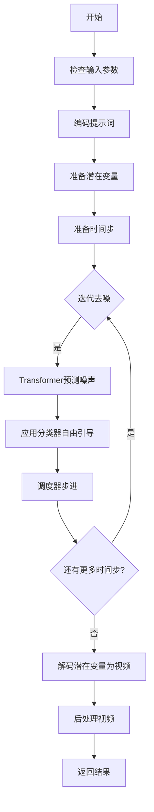
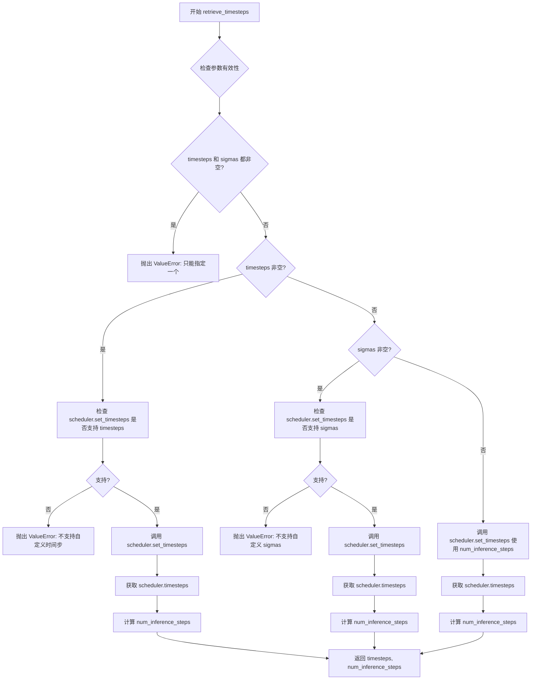
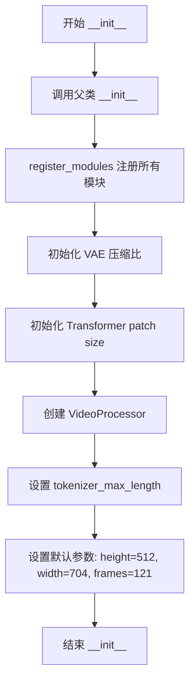
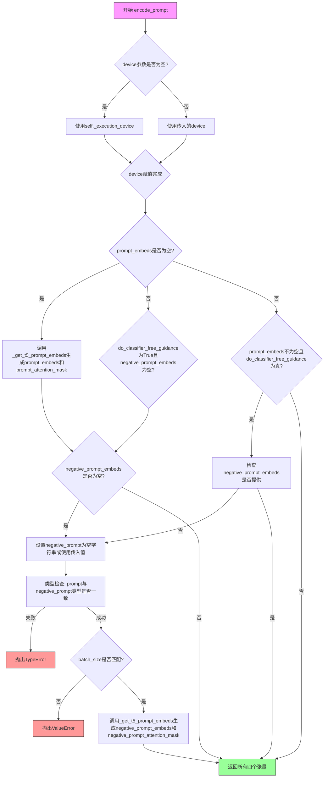
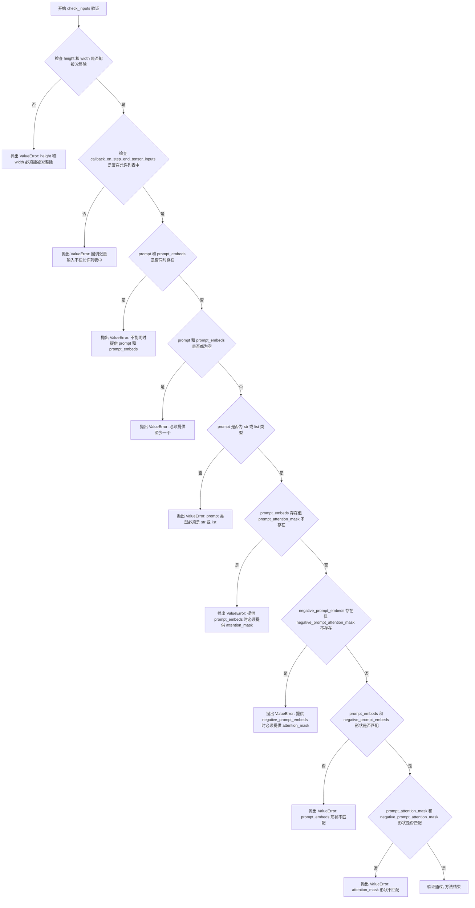
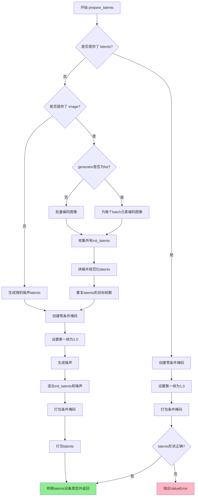
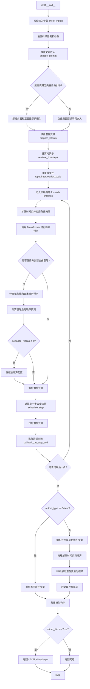

# `diffusers\src\diffusers\pipelines\ltx\pipeline_ltx_image2video.py` 详细设计文档

LTXImageToVideoPipeline是一个基于扩散模型的图像到视频生成管道，使用T5文本编码器、LTXVideoTransformer3DModel变换器和AutoencoderKLLTXVideo VAE将静态图像转换为视频，支持文本提示引导和分类器自由引导。

## 整体流程



## 类结构

```
DiffusionPipeline (基类)
├── FromSingleFileMixin (混入类)
├── LTXVideoLoraLoaderMixin (混入类)
└── LTXImageToVideoPipeline (主类)
```

## 全局变量及字段


### `XLA_AVAILABLE`
    
标识是否安装了PyTorch XLA库用于TPU加速

类型：`bool`
    


### `logger`
    
用于记录该模块运行日志的Logger对象

类型：`logging.Logger`
    


### `EXAMPLE_DOC_STRING`
    
包含LTXImageToVideoPipeline使用示例的文档字符串

类型：`str`
    


### `LTXImageToVideoPipeline.model_cpu_offload_seq`
    
定义模型组件CPU卸载顺序的字符串

类型：`str`
    


### `LTXImageToVideoPipeline._optional_components`
    
可选组件列表，用于标识哪些组件可以省略

类型：`list`
    


### `LTXImageToVideoPipeline._callback_tensor_inputs`
    
回调函数可接收的张量输入名称列表

类型：`list`
    


### `LTXImageToVideoPipeline.vae`
    
变分自编码器，用于编码和解码视频潜在表示

类型：`AutoencoderKLLTXVideo`
    


### `LTXImageToVideoPipeline.text_encoder`
    
T5文本编码器，用于将文本提示编码为嵌入向量

类型：`T5EncoderModel`
    


### `LTXImageToVideoPipeline.tokenizer`
    
T5快速分词器，用于将文本转换为token序列

类型：`T5TokenizerFast`
    


### `LTXImageToVideoPipeline.transformer`
    
3D变换器模型，用于去噪视频潜在变量

类型：`LTXVideoTransformer3DModel`
    


### `LTXImageToVideoPipeline.scheduler`
    
流匹配欧拉离散调度器，用于控制去噪过程

类型：`FlowMatchEulerDiscreteScheduler`
    


### `LTXImageToVideoPipeline.vae_spatial_compression_ratio`
    
VAE空间压缩比，用于将像素空间映射到潜在空间

类型：`int`
    


### `LTXImageToVideoPipeline.vae_temporal_compression_ratio`
    
VAE时间压缩比，用于压缩视频帧维度

类型：`int`
    


### `LTXImageToVideoPipeline.transformer_spatial_patch_size`
    
变换器空间patch大小，用于空间维度的分块处理

类型：`int`
    


### `LTXImageToVideoPipeline.transformer_temporal_patch_size`
    
变换器时间patch大小，用于时间维度的分块处理

类型：`int`
    


### `LTXImageToVideoPipeline.video_processor`
    
视频处理器，用于预处理输入图像和后处理输出视频

类型：`VideoProcessor`
    


### `LTXImageToVideoPipeline.tokenizer_max_length`
    
分词器最大长度，定义文本输入的最大token数

类型：`int`
    


### `LTXImageToVideoPipeline.default_height`
    
默认生成图像高度（像素）

类型：`int`
    


### `LTXImageToVideoPipeline.default_width`
    
默认生成图像宽度（像素）

类型：`int`
    


### `LTXImageToVideoPipeline.default_frames`
    
默认生成视频的帧数

类型：`int`
    
    

## 全局函数及方法


### `calculate_shift`

该函数实现基于图像序列长度的线性插值计算，用于调整扩散模型的噪声调度参数。通过计算斜率和截距，根据输入的图像序列长度在基础偏移量和最大偏移量之间进行线性映射。

参数：

- `image_seq_len`：`int`，图像序列长度，用于计算目标偏移量
- `base_seq_len`：`int = 256`，基础序列长度，默认为256
- `max_seq_len`：`int = 4096`，最大序列长度，默认为4096
- `base_shift`：`float = 0.5`，基础偏移量，默认为0.5
- `max_shift`：`float = 1.15`，最大偏移量，默认为1.15

返回值：`float`，计算得到的偏移量 mu

#### 流程图

```mermaid
flowchart TD
    A[开始] --> B[计算斜率 m]
    B --> C[计算截距 b]
    C --> D[计算 mu]
    D --> E[返回 mu]
    
    B --> B1[m = (max_shift - base_shift) / (max_seq_len - base_seq_len)]
    C --> C1[b = base_shift - m * base_seq_len]
    D --> D1[mu = image_seq_len * m + b]
```

#### 带注释源码

```python
def calculate_shift(
    image_seq_len,
    base_seq_len: int = 256,
    max_seq_len: int = 4096,
    base_shift: float = 0.5,
    max_shift: float = 1.15,
):
    """
    计算基于图像序列长度的线性偏移量，用于扩散模型的噪声调度。
    
    该函数实现线性插值，根据输入的图像序列长度计算对应的偏移量。
    当序列长度接近 base_seq_len 时返回 base_shift，接近 max_seq_len 时返回 max_shift。
    
    参数:
        image_seq_len: 输入图像的序列长度
        base_seq_len: 基础序列长度，默认为256
        max_seq_len: 最大序列长度，默认为4096
        base_shift: 基础偏移量，默认为0.5
        max_shift: 最大偏移量，默认为1.15
        
    返回:
        计算得到的偏移量 mu
    """
    # 计算斜率 m：表示偏移量随序列长度变化的速率
    m = (max_shift - base_shift) / (max_seq_len - base_seq_len)
    
    # 计算截距 b：使直线通过点 (base_seq_len, base_shift)
    b = base_shift - m * base_seq_len
    
    # 计算最终的偏移量 mu：使用线性方程 mu = m * x + b
    mu = image_seq_len * m + b
    
    return mu
```


### `retrieve_timesteps`

该函数是扩散pipeline中的时间步生成工具函数，用于根据给定的调度器配置生成或获取推理过程中的时间步序列。它支持三种模式：使用指定的推理步数、使用自定义时间步列表或使用自定义sigma值。函数会调用调度器的`set_timesteps`方法并返回生成的时间步张量及实际的推理步数。

参数：

- `scheduler`：`SchedulerMixin`，调度器对象，用于生成时间步序列
- `num_inference_steps`：`int | None`，推理过程中使用的去噪步数，如果使用此参数则`timesteps`必须为`None`
- `device`：`str | torch.device | None`，时间步要移动到的设备，如果为`None`则不移动
- `timesteps`：`list[int] | None`，自定义时间步，用于覆盖调度器的时间步间距策略，传入此参数时`num_inference_steps`和`sigmas`必须为`None`
- `sigmas`：`list[float] | None`，自定义sigma值，用于覆盖调度器的sigma间距策略，传入此参数时`num_inference_steps`和`timesteps`必须为`None`
- `**kwargs`：任意关键字参数，会传递给调度器的`set_timesteps`方法

返回值：`tuple[torch.Tensor, int]`，元组包含两个元素：第一个是调度器的时间步张量，第二个是实际的推理步数

#### 流程图



#### 带注释源码

```python
def retrieve_timesteps(
    scheduler,
    num_inference_steps: int | None = None,
    device: str | torch.device | None = None,
    timesteps: list[int] | None = None,
    sigmas: list[float] | None = None,
    **kwargs,
):
    r"""
    Calls the scheduler's `set_timesteps` method and retrieves timesteps from the scheduler after the call. Handles
    custom timesteps. Any kwargs will be supplied to `scheduler.set_timesteps`.

    Args:
        scheduler (`SchedulerMixin`):
            The scheduler to get timesteps from.
        num_inference_steps (`int`):
            The number of diffusion steps used when generating samples with a pre-trained model. If used, `timesteps`
            must be `None`.
        device (`str` or `torch.device`, *optional*):
            The device to which the timesteps should be moved to. If `None`, the timesteps are not moved.
        timesteps (`list[int]`, *optional*):
            Custom timesteps used to override the timestep spacing strategy of the scheduler. If `timesteps` is passed,
            `num_inference_steps` and `sigmas` must be `None`.
        sigmas (`list[float]`, *optional*):
            Custom sigmas used to override the timestep spacing strategy of the scheduler. If `sigmas` is passed,
            `num_inference_steps` and `timesteps` must be `None`.

    Returns:
        `tuple[torch.Tensor, int]`: A tuple where the first element is the timestep schedule from the scheduler and the
        second element is the number of inference steps.
    """
    # 参数校验：timesteps 和 sigmas 不能同时指定
    if timesteps is not None and sigmas is not None:
        raise ValueError("Only one of `timesteps` or `sigmas` can be passed. Please choose one to set custom values")
    
    # 模式1：使用自定义 timesteps
    if timesteps is not None:
        # 检查调度器的 set_timesteps 方法是否接受 timesteps 参数
        accepts_timesteps = "timesteps" in set(inspect.signature(scheduler.set_timesteps).parameters.keys())
        if not accepts_timesteps:
            raise ValueError(
                f"The current scheduler class {scheduler.__class__}'s `set_timesteps` does not support custom"
                f" timestep schedules. Please check whether you are using the correct scheduler."
            )
        # 设置自定义时间步
        scheduler.set_timesteps(timesteps=timesteps, device=device, **kwargs)
        # 从调度器获取实际的时间步
        timesteps = scheduler.timesteps
        # 计算实际推理步数
        num_inference_steps = len(timesteps)
    
    # 模式2：使用自定义 sigmas
    elif sigmas is not None:
        # 检查调度器的 set_timesteps 方法是否接受 sigmas 参数
        accept_sigmas = "sigmas" in set(inspect.signature(scheduler.set_timesteps).parameters.keys())
        if not accept_sigmas:
            raise ValueError(
                f"The current scheduler class {scheduler.__class__}'s `set_timesteps` does not support custom"
                f" sigmas schedules. Please check whether you are using the correct scheduler."
            )
        # 设置自定义 sigma 值
        scheduler.set_timesteps(sigmas=sigmas, device=device, **kwargs)
        # 从调度器获取时间步
        timesteps = scheduler.timesteps
        # 计算实际推理步数
        num_inference_steps = len(timesteps)
    
    # 模式3：使用 num_inference_steps 默认模式
    else:
        # 使用推理步数设置时间步
        scheduler.set_timesteps(num_inference_steps, device=device, **kwargs)
        # 从调度器获取时间步
        timesteps = scheduler.timesteps
    
    # 返回时间步张量和实际推理步数
    return timesteps, num_inference_steps
```


### `retrieve_latents`

该函数是一个工具函数，用于从 VAE 编码器的输出中提取潜在向量（latents）。它支持三种模式：从潜在分布中采样（sample）、从潜在分布中取最可能的值（argmax）、或直接返回预计算的潜在向量。

参数：

- `encoder_output`：`torch.Tensor`，编码器输出对象，通常包含 `latent_dist` 或 `latents` 属性
- `generator`：`torch.Generator | None`，可选的随机数生成器，用于确保采样过程的可重复性
- `sample_mode`：`str`，采样模式，默认为 "sample"，可选值为 "sample"（从分布采样）或 "argmax"（取分布的众数）

返回值：`torch.Tensor`，提取出的潜在向量

#### 流程图

```mermaid
flowchart TD
    A[开始: retrieve_latents] --> B{encoder_output 是否有 latent_dist 属性?}
    B -- 是 --> C{sample_mode == 'sample'?}
    C -- 是 --> D[返回 encoder_output.latent_dist.sample<br/>(generator)]
    C -- 否 --> E{sample_mode == 'argmax'?}
    E -- 是 --> F[返回 encoder_output.latent_dist.mode]
    E -- 否 --> G{encoder_output 是否有 latents 属性?}
    G -- 是 --> H[返回 encoder_output.latents]
    G -- 否 --> I[抛出 AttributeError]
    B -- 否 --> G
    D --> J[结束]
    F --> J
    H --> J
    I --> J
```

#### 带注释源码

```python
# Copied from diffusers.pipelines.stable_diffusion.pipeline_stable_diffusion_img2img.retrieve_latents
def retrieve_latents(
    encoder_output: torch.Tensor, generator: torch.Generator | None = None, sample_mode: str = "sample"
):
    """
    从 VAE 编码器输出中提取潜在向量。
    
    支持三种提取模式：
    1. 从 latent_dist 分布中采样（sample mode）
    2. 从 latent_dist 分布中取众数/最可能值（argmax mode）
    3. 直接返回预计算的 latents 属性
    
    Args:
        encoder_output: VAE 编码器的输出对象，包含 latent_dist 或 latents 属性
        generator: 可选的随机数生成器，用于采样时的确定性生成
        sample_mode: 采样模式，'sample' 或 'argmax'
    
    Returns:
        torch.Tensor: 提取出的潜在向量
    
    Raises:
        AttributeError: 当无法从 encoder_output 中获取潜在向量时抛出
    """
    # 模式1: 检查是否有 latent_dist 属性，且要求采样模式
    if hasattr(encoder_output, "latent_dist") and sample_mode == "sample":
        # 从潜在分布中采样，支持通过 generator 控制随机性
        return encoder_output.latent_dist.sample(generator)
    # 模式2: 检查是否有 latent_dist 属性，且要求取众数模式
    elif hasattr(encoder_output, "latent_dist") and sample_mode == "argmax":
        # 返回潜在分布的众数（即概率最大的潜在向量）
        return encoder_output.latent_dist.mode()
    # 模式3: 直接返回预计算的 latents 属性
    elif hasattr(encoder_output, "latents"):
        return encoder_output.latents
    # 错误处理: 无法识别有效的潜在向量格式
    else:
        raise AttributeError("Could not access latents of provided encoder_output")
```


### `rescale_noise_cfg`

该函数用于根据 guidance_rescale 参数重新缩放噪声预测张量，以改善图像质量并修复过度曝光问题。其基于论文 Common Diffusion Noise Schedules and Sample Steps are Flawed (Section 3.4) 实现，通过计算文本预测噪声和cfg预测噪声的标准差比率进行重新缩放，并与原始cfg预测进行线性混合。

参数：

- `noise_cfg`：`torch.Tensor`，引导扩散过程中预测的噪声张量
- `noise_pred_text`：`torch.Tensor`，文本引导扩散过程中预测的噪声张量
- `guidance_rescale`：`float`，可选，默认值为 0.0应用于噪声预测的重新缩放因子

返回值：`torch.Tensor`，重新缩放后的噪声预测张量

#### 流程图

```mermaid
flowchart TD
    A[开始] --> B[计算 noise_pred_text 的标准差 std_text]
    B --> C[计算 noise_cfg 的标准差 std_cfg]
    C --> D[计算重新缩放的噪声预测 noise_pred_rescaled = noise_cfg × (std_text / std_cfg)]
    D --> E[计算混合噪声预测 noise_cfg = guidance_rescale × noise_pred_rescaled + (1 - guidance_rescale) × noise_cfg]
    E --> F[返回重新缩放后的 noise_cfg]
```

#### 带注释源码

```
def rescale_noise_cfg(noise_cfg, noise_pred_text, guidance_rescale=0.0):
    r"""
    Rescales `noise_cfg` tensor based on `guidance_rescale` to improve image quality and fix overexposure. Based on
    Section 3.4 from [Common Diffusion Noise Schedules and Sample Steps are
    Flawed](https://huggingface.co/papers/2305.08891).

    Args:
        noise_cfg (`torch.Tensor`):
            The predicted noise tensor for the guided diffusion process.
        noise_pred_text (`torch.Tensor`):
            The predicted noise tensor for the text-guided diffusion process.
        guidance_rescale (`float`, *optional*, defaults to 0.0):
            A rescale factor applied to the noise predictions.

    Returns:
        noise_cfg (`torch.Tensor`): The rescaled noise prediction tensor.
    """
    # 计算文本预测噪声在除批次维度外所有维度上的标准差
    # keepdim=True 保持维度以便后续广播运算
    std_text = noise_pred_text.std(dim=list(range(1, noise_pred_text.ndim)), keepdim=True)
    
    # 计算cfg预测噪声在除批次维度外所有维度上的标准差
    std_cfg = noise_cfg.std(dim=list(range(1, noise_cfg.ndim)), keepdim=True)
    
    # 使用文本预测的标准差与cfg预测标准差的比率重新缩放噪声预测
    # 这一步修复了过度曝光问题
    noise_pred_rescaled = noise_cfg * (std_text / std_cfg)
    
    # 将重新缩放后的噪声预测与原始cfg预测按 guidance_rescale 因子混合
    # 这样可以避免生成"平淡无奇"的图像
    noise_cfg = guidance_rescale * noise_pred_rescaled + (1 - guidance_rescale) * noise_cfg
    
    return noise_cfg
```


### LTXImageToVideoPipeline.__init__

这是LTXImageToVideoPipeline类的初始化方法，负责接收并注册各种模型组件（VAE、文本编码器、分词器、Transformer和调度器），并初始化视频处理相关的参数和处理器。

参数：

- `scheduler`：`FlowMatchEulerDiscreteScheduler`，用于去噪的调度器
- `vae`：`AutoencoderKLLTXVideo`，用于编码和解码图像的变分自编码器模型
- `text_encoder`：`T5EncoderModel`，用于编码文本提示的T5编码器模型
- `tokenizer`：`T5TokenizerFast`，用于将文本转换为token的T5分词器
- `transformer`：`LTXVideoTransformer3DModel`，用于去噪视频潜在表示的条件Transformer架构

返回值：无（`None`），构造函数不返回任何值

#### 流程图



#### 带注释源码

```python
def __init__(
    self,
    scheduler: FlowMatchEulerDiscreteScheduler,
    vae: AutoencoderKLLTXVideo,
    text_encoder: T5EncoderModel,
    tokenizer: T5TokenizerFast,
    transformer: LTXVideoTransformer3DModel,
):
    """
    初始化 LTXImageToVideoPipeline 管道。
    
    参数:
        scheduler: 用于去噪的调度器
        vae: 变分自编码器模型，用于编码和解码图像
        text_encoder: T5文本编码器模型
        tokenizer: T5分词器
        transformer: 3D视频Transformer模型
    """
    # 调用父类 DiffusionPipeline 的初始化方法
    super().__init__()

    # 注册所有模块到管道中，便于后续管理和访问
    self.register_modules(
        vae=vae,
        text_encoder=text_encoder,
        tokenizer=tokenizer,
        transformer=transformer,
        scheduler=scheduler,
    )

    # 初始化 VAE 空间压缩比（默认为32）
    self.vae_spatial_compression_ratio = (
        self.vae.spatial_compression_ratio if getattr(self, "vae", None) is not None else 32
    )
    # 初始化 VAE 时间压缩比（默认为8）
    self.vae_temporal_compression_ratio = (
        self.vae.temporal_compression_ratio if getattr(self, "vae", None) is not None else 8
    )
    # 初始化 Transformer 空间 patch 大小（默认为1）
    self.transformer_spatial_patch_size = (
        self.transformer.config.patch_size if getattr(self, "transformer", None) is not None else 1
    )
    # 初始化 Transformer 时间 patch 大小（默认为1）
    self.transformer_temporal_patch_size = (
        self.transformer.config.patch_size_t if getattr(self, "transformer") is not None else 1
    )

    # 创建视频处理器，使用VAE空间压缩比作为缩放因子
    self.video_processor = VideoProcessor(vae_scale_factor=self.vae_spatial_compression_ratio)
    # 设置分词器最大长度（默认为128）
    self.tokenizer_max_length = (
        self.tokenizer.model_max_length if getattr(self, "tokenizer", None) is not None else 128
    )

    # 设置默认输出参数
    self.default_height = 512      # 默认高度
    self.default_width = 704        # 默认宽度
    self.default_frames = 121      # 默认帧数
```


### `LTXImageToVideoPipeline._get_t5_prompt_embeds`

该方法负责将文本提示（prompt）编码为T5文本 encoder的嵌入向量（embeddings），支持批量处理和每个提示生成多个视频，同时处理文本分词、截断警告和嵌入的复制，以适应分类器自由引导（Classifier-Free Guidance）的需求。

参数：

- `self`：`LTXImageToVideoPipeline`，Pipeline实例本身
- `prompt`：`str | list[str]`，要编码的文本提示，可以是单个字符串或字符串列表
- `num_videos_per_prompt`：`int = 1`，每个提示要生成的视频数量，用于复制嵌入向量
- `max_sequence_length`：`int = 128`，文本编码的最大序列长度，超过该长度将被截断
- `device`：`torch.device | None = None`，指定计算设备，默认为执行设备
- `dtype`：`torch.dtype | None = None`，指定数据类型，默认为text_encoder的数据类型

返回值：`tuple[torch.Tensor, torch.Tensor]`，返回两个张量——`prompt_embeds`（形状为 `[batch_size * num_videos_per_prompt, seq_len, hidden_dim]` 的文本嵌入）和 `prompt_attention_mask`（形状为 `[batch_size * num_videos_per_prompt, seq_len]` 的注意力掩码）

#### 流程图

```mermaid
flowchart TD
    A[开始 _get_t5_prompt_embeds] --> B{device 为空?}
    B -- 是 --> C[使用 self._execution_device]
    B -- 否 --> D[使用传入的 device]
    C --> E{dtype 为空?}
    D --> E
    E -- 是 --> F[使用 self.text_encoder.dtype]
    E -- 否 --> G[使用传入的 dtype]
    F --> G
    G --> H{prompt 是字符串?}
    H -- 是 --> I[转换为列表: [prompt]]
    H -- 否 --> J[直接使用 prompt 列表]
    I --> K[获取 batch_size]
    J --> K
    K --> L[调用 tokenizer 编码文本]
    L --> M[提取 input_ids 和 attention_mask]
    M --> N[将 attention_mask 转换为 bool 并移到 device]
    O[使用 tokenizer 处理未截断版本] --> P{untruncated_ids 长度 >= text_input_ids 且不相等?}
    P -- 是 --> Q[发出截断警告]
    P -- 否 --> R[继续]
    Q --> R
    R --> S[调用 text_encoder 获取 embeddings]
    S --> T[将 embeddings 移到指定 dtype 和 device]
    T --> U[复制 embeddings 以适配 num_videos_per_prompt]
    U --> V[调整 embeddings 形状]
    V --> W[调整 attention_mask 形状并复制]
    W --> X[返回 prompt_embeds 和 prompt_attention_mask]
```

#### 带注释源码

```python
def _get_t5_prompt_embeds(
    self,
    prompt: str | list[str] = None,
    num_videos_per_prompt: int = 1,
    max_sequence_length: int = 128,
    device: torch.device | None = None,
    dtype: torch.dtype | None = None,
):
    """
    将文本提示编码为T5 encoder的嵌入向量。
    
    参数:
        prompt: 输入文本，可以是单字符串或字符串列表
        num_videos_per_prompt: 每个提示生成的视频数量
        max_sequence_length: 最大序列长度
        device: 计算设备
        dtype: 数据类型
    返回:
        (prompt_embeds, prompt_attention_mask) 元组
    """
    # 如果未指定device，则使用pipeline的执行设备
    device = device or self._execution_device
    # 如果未指定dtype，则使用text_encoder的数据类型
    dtype = dtype or self.text_encoder.dtype

    # 统一将prompt转为列表处理，便于批量操作
    prompt = [prompt] if isinstance(prompt, str) else prompt
    batch_size = len(prompt)

    # 使用T5 tokenizer将文本转换为token IDs
    # padding="max_length" 填充到最大长度
    # truncation=True 截断超过最大长度的序列
    # add_special_tokens=True 添加特殊 tokens（如 EOS）
    # return_tensors="pt" 返回PyTorch张量
    text_inputs = self.tokenizer(
        prompt,
        padding="max_length",
        max_length=max_sequence_length,
        truncation=True,
        add_special_tokens=True,
        return_tensors="pt",
    )
    text_input_ids = text_inputs.input_ids
    prompt_attention_mask = text_inputs.attention_mask
    # 将attention_mask转换为bool并移到指定设备
    prompt_attention_mask = prompt_attention_mask.bool().to(device)

    # 检查是否有文本被截断
    # 使用padding="longest"获取未截断的版本进行比较
    untruncated_ids = self.tokenizer(prompt, padding="longest", return_tensors="pt").input_ids

    # 如果未截断的序列长度大于截断后的长度，且两者不相等，说明有内容被截断
    if untruncated_ids.shape[-1] >= text_input_ids.shape[-1] and not torch.equal(text_input_ids, untruncated_ids):
        # 解码被截断的部分用于警告信息
        removed_text = self.tokenizer.batch_decode(untruncated_ids[:, max_sequence_length - 1 : -1])
        logger.warning(
            "The following part of your input was truncated because `max_sequence_length` is set to "
            f" {max_sequence_length} tokens: {removed_text}"
        )

    # 调用T5 text_encoder获取文本嵌入
    # text_encoder返回包含hidden_states的输出对象，[0]取第一个元素即hidden states
    prompt_embeds = self.text_encoder(text_input_ids.to(device))[0]
    # 将嵌入转换为指定的数据类型和设备
    prompt_embeds = prompt_embeds.to(dtype=dtype, device=device)

    # 为每个提示生成多个视频复制嵌入向量
    # 这在Classifier-Free Guidance中需要用到
    # 获取序列长度和隐藏维度
    _, seq_len, _ = prompt_embeds.shape
    # 重复嵌入向量：沿batch维度复制num_videos_per_prompt次
    prompt_embeds = prompt_embeds.repeat(1, num_videos_per_prompt, 1)
    # 重新调整形状：[batch_size, num_videos_per_prompt, seq_len, hidden_dim]
    # 最终形状：[batch_size * num_videos_per_prompt, seq_len, hidden_dim]
    prompt_embeds = prompt_embeds.view(batch_size * num_videos_per_prompt, seq_len, -1)

    # 同样处理attention mask
    prompt_attention_mask = prompt_attention_mask.view(batch_size, -1)
    # 复制attention mask以匹配复制后的embeddings
    prompt_attention_mask = prompt_attention_mask.repeat(num_videos_per_prompt, 1)

    # 返回编码后的embeddings和对应的attention mask
    return prompt_embeds, prompt_attention_mask
```


### `LTXImageToVideoPipeline.encode_prompt`

该方法负责将文本提示（prompt）和负向提示（negative_prompt）编码为文本编码器的隐藏状态（embeddings），并生成相应的注意力掩码。如果启用了无分类器引导（classifier-free guidance），还会自动处理负向提示的嵌入。

参数：

- `self`：`LTXImageToVideoPipeline`，管道实例本身
- `prompt`：`str | list[str]`，要编码的文本提示，可以是单个字符串或字符串列表
- `negative_prompt`：`str | list[str] | None`，不用于引导图像生成的负向提示，若不提供且启用引导则为空字符串
- `do_classifier_free_guidance`：`bool`，是否使用无分类器引导，默认为 True
- `num_videos_per_prompt`：`int`，每个提示要生成的视频数量，默认为 1
- `prompt_embeds`：`torch.Tensor | None`，预生成的文本嵌入，若提供则直接从提示生成
- `negative_prompt_embeds`：`torch.Tensor | None`，预生成的负向文本嵌入
- `prompt_attention_mask`：`torch.Tensor | None`，文本嵌入的注意力掩码
- `negative_prompt_attention_mask`：`torch.Tensor | None`，负向文本嵌入的注意力掩码
- `max_sequence_length`：`int`，最大序列长度，默认为 128
- `device`：`torch.device | None`，执行设备，若不提供则使用管道默认设备
- `dtype`：`torch.dtype | None`，数据类型，若不提供则使用文本编码器默认类型

返回值：`tuple[torch.Tensor, torch.Tensor, torch.Tensor, torch.Tensor]`，返回四个张量组成的元组：
- `prompt_embeds`：编码后的文本嵌入
- `prompt_attention_mask`：文本嵌入的注意力掩码
- `negative_prompt_embeds`：编码后的负向文本嵌入
- `negative_prompt_attention_mask`：负向文本嵌入的注意力掩码

#### 流程图



#### 带注释源码

```python
def encode_prompt(
    self,
    prompt: str | list[str],
    negative_prompt: str | list[str] | None = None,
    do_classifier_free_guidance: bool = True,
    num_videos_per_prompt: int = 1,
    prompt_embeds: torch.Tensor | None = None,
    negative_prompt_embeds: torch.Tensor | None = None,
    prompt_attention_mask: torch.Tensor | None = None,
    negative_prompt_attention_mask: torch.Tensor | None = None,
    max_sequence_length: int = 128,
    device: torch.device | None = None,
    dtype: torch.dtype | None = None,
):
    r"""
    Encodes the prompt into text encoder hidden states.

    Args:
        prompt (`str` or `list[str]`, *optional*):
            prompt to be encoded
        negative_prompt (`str` or `list[str]`, *optional*):
            The prompt or prompts not to guide the image generation. If not defined, one has to pass
            `negative_prompt_embeds` instead. Ignored when not using guidance (i.e., ignored if `guidance_scale` is
            less than `1`).
        do_classifier_free_guidance (`bool`, *optional*, defaults to `True`):
            Whether to use classifier free guidance or not.
        num_videos_per_prompt (`int`, *optional*, defaults to 1):
            Number of videos that should be generated per prompt. torch device to place the resulting embeddings on
        prompt_embeds (`torch.Tensor`, *optional*):
            Pre-generated text embeddings. Can be used to easily tweak text inputs, *e.g.* prompt weighting. If not
            provided, text embeddings will be generated from `prompt` input argument.
        negative_prompt_embeds (`torch.Tensor`, *optional*):
            Pre-generated negative text embeddings. Can be used to easily tweak text inputs, *e.g.* prompt
            weighting. If not provided, negative_prompt_embeds will be generated from `negative_prompt` input
            argument.
        device: (`torch.device`, *optional*):
            torch device
        dtype: (`torch.dtype`, *optional*):
            torch dtype
    """
    # 确定设备：如果未提供，则使用管道的执行设备
    device = device or self._execution_device

    # 将单个字符串转换为列表，统一处理方式
    prompt = [prompt] if isinstance(prompt, str) else prompt
    
    # 确定批次大小：如果有prompt则根据其长度，否则根据已提供的prompt_embeds形状
    if prompt is not None:
        batch_size = len(prompt)
    else:
        batch_size = prompt_embeds.shape[0]

    # 如果未提供prompt_embeds，则调用_get_t5_prompt_embeds方法生成
    if prompt_embeds is None:
        prompt_embeds, prompt_attention_mask = self._get_t5_prompt_embeds(
            prompt=prompt,
            num_videos_per_prompt=num_videos_per_prompt,
            max_sequence_length=max_sequence_length,
            device=device,
            dtype=dtype,
        )

    # 如果启用无分类器引导且未提供negative_prompt_embeds，则需要生成负向嵌入
    if do_classifier_free_guidance and negative_prompt_embeds is None:
        # 默认使用空字符串作为负向提示
        negative_prompt = negative_prompt or ""
        # 将负向提示扩展为批次大小
        negative_prompt = batch_size * [negative_prompt] if isinstance(negative_prompt, str) else negative_prompt

        # 类型检查：确保prompt和negative_prompt类型一致
        if prompt is not None and type(prompt) is not type(negative_prompt):
            raise TypeError(
                f"`negative_prompt` should be the same type to `prompt`, but got {type(negative_prompt)} !="
                f" {type(prompt)}."
            )
        # 批次大小检查：确保两者批次大小一致
        elif batch_size != len(negative_prompt):
            raise ValueError(
                f"`negative_prompt`: {negative_prompt} has batch size {len(negative_prompt)}, but `prompt`:"
                f" {prompt} has batch size {batch_size}. Please make sure that passed `negative_prompt` matches"
                " the batch size of `prompt`."
            )

        # 生成负向提示的嵌入和注意力掩码
        negative_prompt_embeds, negative_prompt_attention_mask = self._get_t5_prompt_embeds(
            prompt=negative_prompt,
            num_videos_per_prompt=num_videos_per_prompt,
            max_sequence_length=max_sequence_length,
            device=device,
            dtype=dtype,
        )

    # 返回四个张量：prompt嵌入、prompt注意力掩码、negative_prompt嵌入、negative_prompt注意力掩码
    return prompt_embeds, prompt_attention_mask, negative_prompt_embeds, negative_prompt_attention_mask
```


### LTXImageToVideoPipeline.check_inputs

该方法用于验证图像转视频管道的输入参数是否合法，包括检查高度和宽度是否能被32整除、prompt和prompt_embeds的互斥关系、attention mask的完整性等关键约束。

参数：

- `self`：`LTXImageToVideoPipeline`实例，管道对象本身
- `prompt`：`str | list[str] | None`，用于引导视频生成的文本提示，可以是单个字符串或字符串列表
- `height`：`int`，生成视频的高度（像素），必须能被32整除
- `width`：`int`，生成视频的宽度（像素），必须能被32整除
- `callback_on_step_end_tensor_inputs`：`list[str] | None`，在推理步骤结束时需要回调的张量输入列表
- `prompt_embeds`：`torch.Tensor | None`，预生成的文本嵌入向量，与prompt二选一使用
- `negative_prompt_embeds`：`torch.Tensor | None`，预生成的负面文本嵌入向量
- `prompt_attention_mask`：`torch.Tensor | None`，文本嵌入的注意力掩码
- `negative_prompt_attention_mask`：`torch.Tensor | None`，负面文本嵌入的注意力掩码

返回值：`None`，该方法不返回任何值，仅通过抛出ValueError来指示输入验证失败

#### 流程图



#### 带注释源码

```python
def check_inputs(
    self,
    prompt,
    height,
    width,
    callback_on_step_end_tensor_inputs=None,
    prompt_embeds=None,
    negative_prompt_embeds=None,
    prompt_attention_mask=None,
    negative_prompt_attention_mask=None,
):
    # 检查高度和宽度是否能够被32整除，这是VAE和Transformer的压缩比要求
    if height % 32 != 0 or width % 32 != 0:
        raise ValueError(f"`height` and `width` have to be divisible by 32 but are {height} and {width}.")

    # 验证回调张量输入是否在允许的列表中，防止传入不支持的张量导致后续处理失败
    if callback_on_step_end_tensor_inputs is not None and not all(
        k in self._callback_tensor_inputs for k in callback_on_step_end_tensor_inputs
    ):
        raise ValueError(
            f"`callback_on_step_end_tensor_inputs` has to be in {self._callback_tensor_inputs}, but found {[k for k in callback_on_step_end_tensor_inputs if k not in self._callback_tensor_inputs]}"
        )

    # prompt和prompt_embeds是互斥的，不能同时提供，避免语义混淆
    if prompt is not None and prompt_embeds is not None:
        raise ValueError(
            f"Cannot forward both `prompt`: {prompt} and `prompt_embeds`: {prompt_embeds}. Please make sure to"
            " only forward one of the two."
        )
    # 至少需要提供prompt或prompt_embeds之一，否则无法进行条件生成
    elif prompt is None and prompt_embeds is None:
        raise ValueError(
            "Provide either `prompt` or `prompt_embeds`. Cannot leave both `prompt` and `prompt_embeds` undefined."
        )
    # 验证prompt的类型必须是字符串或字符串列表
    elif prompt is not None and (not isinstance(prompt, str) and not isinstance(prompt, list)):
        raise ValueError(f"`prompt` has to be of type `str` or `list` but is {type(prompt)}")

    # 如果提供了prompt_embeds，必须同时提供对应的attention mask，否则Transformer无法正确处理
    if prompt_embeds is not None and prompt_attention_mask is None:
        raise ValueError("Must provide `prompt_attention_mask` when specifying `prompt_embeds`.")

    # 负面prompt_embeds也需要对应的attention mask，保持接口一致性
    if negative_prompt_embeds is not None and negative_prompt_attention_mask is None:
        raise ValueError("Must provide `negative_prompt_attention_mask` when specifying `negative_prompt_embeds`.")

    # 确保正向和负向prompt_embeds的形状一致，以便正确进行classifier-free guidance
    if prompt_embeds is not None and negative_prompt_embeds is not None:
        if prompt_embeds.shape != negative_prompt_embeds.shape:
            raise ValueError(
                "`prompt_embeds` and `negative_prompt_embeds` must have the same shape when passed directly, but"
                f" got: `prompt_embeds` {prompt_embeds.shape} != `negative_prompt_embeds`"
                f" {negative_prompt_embeds.shape}."
            )
        # attention mask也需要形状匹配，确保在CFG过程中能够正确对齐
        if prompt_attention_mask.shape != negative_prompt_attention_mask.shape:
            raise ValueError(
                "`prompt_attention_mask` and `negative_prompt_attention_mask` must have the same shape when passed directly, but"
                f" got: `prompt_attention_mask` {prompt_attention_mask.shape} != `negative_prompt_attention_mask`"
                f" {negative_prompt_attention_mask.shape}."
            )
```


### LTXImageToVideoPipeline._pack_latents

该函数是一个静态方法，用于将形状为 `[B, C, F, H, W]`（批量大小、通道数、帧数、高度、宽度）的未打包潜在表示进行空间和时间维度上的分块（patching）操作，转换为变换器模型所需的 `[B, S, D]` 形状的三维张量，其中 S 是有效的视频序列长度，D 是有效的特征维度。这是 LTX 视频生成管道中将潜在表示适配到 Transformer3D 模型输入格式的关键步骤。

参数：

- `latents`：`torch.Tensor`，输入的未打包潜在表示，形状为 `[B, C, F, H, W]`，其中 B 是批量大小，C 是通道数，F 是帧数，H 是高度，W 是宽度
- `patch_size`：`int`，空间分块大小，默认为 1，表示每个空间维度（高度和宽度）被分割成的分块数量
- `patch_size_t`：`int`，时间分块大小，默认为 1，表示时间维度（帧数）被分割成的分块数量

返回值：`torch.Tensor`，打包后的潜在表示，形状为 `[B, F // p_t * H // p * W // p, C * p_t * p * p]`，其中 p = patch_size，p_t = patch_size_t，这是一个三维张量（ndim=3），dim=0 是批量大小，dim=1 是有效的视频序列长度，dim=2 是有效的输入特征数量

#### 流程图

```mermaid
flowchart TD
    A[输入 latents: 形状 [B, C, F, H, W]] --> B[解包形状获取 B, C, F, H, W]
    B --> C[计算分块后维度<br/>post_patch_num_frames = F // patch_size_t<br/>post_patch_height = H // patch_size<br/>post_patch_width = W // patch_size]
    C --> D[Reshape 操作<br/>重塑为 [B, C, F/p_t, p_t, H/p, p, W/p, p]]
    D --> E[Permute 操作<br/>维度重排为 [B, F/p_t, H/p, W/p, C, p_t, p, p]]
    E --> F[Flatten 操作<br/>将最后三个维度flatten为 [B, F/p_t*H/p*W/p, C*p_t*p*p]]
    F --> G[再次Flatten操作<br/>合并前两个维度得到最终形状 [B, S, D]]
    G --> H[输出: 形状 [B, F//p_t*H//p*W//p, C*p_t*p*p] 的 3D 张量]
    
    style A fill:#e1f5fe
    style H fill:#e8f5e8
```

#### 带注释源码

```
@staticmethod
# Copied from diffusers.pipelines.ltx.pipeline_ltx.LTXPipeline._pack_latents
def _pack_latents(latents: torch.Tensor, patch_size: int = 1, patch_size_t: int = 1) -> torch.Tensor:
    # 功能说明：
    # 将形状为 [B, C, F, H, W] 的未打包 latents 转换为形状为 [B, S, D] 的打包形式
    # 其中：
    #   - S = F // p_t * H // p * W // p (有效的视频序列长度)
    #   - D = C * p_t * p * p (有效的特征维度)
    # 这是一种空间和时间维度的 token 化操作，使 Transformer 能够处理视频数据
    
    # 步骤1: 解包输入张量的形状
    # batch_size: 批量大小
    # num_channels: 潜在表示的通道数
    # num_frames: 视频帧数
    # height: 潜在表示的高度
    # width: 潜在表示的宽度
    batch_size, num_channels, num_frames, height, width = latents.shape
    
    # 步骤2: 计算分块后的维度
    # 将时间维度按 patch_size_t 分块
    post_patch_num_frames = num_frames // patch_size_t
    # 将高度维度按 patch_size 分块
    post_patch_height = height // patch_size
    # 将宽度维度按 patch_size 分块
    post_patch_width = width // patch_size
    
    # 步骤3: Reshape 操作
    # 将原始 [B, C, F, H, W] 重塑为 [B, C, F//p_t, p_t, H//p, p, W//p, p]
    # 插入分块维度，便于后续的维 度置换和 flatten 操作
    latents = latents.reshape(
        batch_size,
        -1,  # 通道维度保持不变 (C)
        post_patch_num_frames,  # 分割后的帧数
        patch_size_t,  # 时间分块大小
        post_patch_height,  # 分割后的高度
        patch_size,  # 空间分块大小（高度）
        post_patch_width,  # 分割后的宽度
        patch_size,  # 空间分块大小（宽度）
    )
    
    # 步骤4: Permute 操作 - 调整维度顺序
    # 从 [B, C, F//p_t, p_t, H//p, p, W//p, p] 
    # 重排为 [B, F//p_t, H//p, W//p, C, p_t, p, p]
    # 这样可以将所有分块维度（p_t, p, p）排列在一起
    latents = latents.permute(0, 2, 4, 6, 1, 3, 5, 7).flatten(4, 7).flatten(1, 3)
    
    # 步骤5: Flatten 操作
    # 第一次 flatten(4, 7): 将最后的 4 个维度 [C, p_t, p, p] 合并为 [C * p_t * p * p]
    # 第二次 flatten(1, 3): 将中间的 3 个维度 [F//p_t, H//p, W//p] 合并为 [F//p_t * H//p * W//p]
    # 最终得到形状 [B, F//p_t * H//p * W//p, C * p_t * p * p]
    
    # 返回打包后的潜在表示
    # 这是 Transformer 模型期望的输入格式
    return latents
```


### `LTXImageToVideoPipeline._unpack_latents`

该方法是一个静态方法，用于将打包后的latent张量从压缩的序列形式解包回视频张量形式（形状从[B, S, D]转换为[B, C, F, H, W]）。它是 `_pack_latents` 方法的逆操作，常用于去噪循环中将Transformer输出的打包latents解包以便进行后续处理。

参数：

- `latents`：`torch.Tensor`，输入的打包latent张量，形状为[B, S, D]，其中S是有效视频序列长度，D是有效特征维度
- `num_frames`：`int`，视频的帧数（解包后的时间维度）
- `height`：`int`，解包后的高度维度
- `width`：`int`，解包后的宽度维度
- `patch_size`：`int`，空间patch大小，默认为1
- `patch_size_t`：`int`，时间patch大小，默认为1

返回值：`torch.Tensor`，解包后的视频张量，形状为[B, C, F, H, W]，其中C是通道数

#### 流程图

```mermaid
flowchart TD
    A[输入: 打包latents [B, S, D]] --> B[获取batch_size]
    B --> C[reshape操作: [B, num_frames, height, width, -, patch_size_t, patch_size, patch_size]]
    C --> D[permute重排: [B, C, num_frames, patch_size_t, height, patch_size, width, patch_size]]
    D --> E[flatten操作: 依次压平最后的patch维度、patch_size维度等]
    E --> F[输出: 解包latents [B, C, F, H, W]]
    
    C -->|S = num_frames × height × width × C × patch_size_t × patch_size × patch_size| C
```

#### 带注释源码

```python
@staticmethod
# Copied from diffusers.pipelines.ltx.pipeline_ltx.LTXPipeline._unpack_latents
def _unpack_latents(
    latents: torch.Tensor, 
    num_frames: int, 
    height: int, 
    width: int, 
    patch_size: int = 1, 
    patch_size_t: int = 1
) -> torch.Tensor:
    """
    将打包的latent张量解包回视频张量形状[B, C, F, H, W]
    
    打包latents形状说明:
    - 输入: [B, S, D] - B是批次大小, S是有效视频序列长度, D是有效特征维度
    - 输出: [B, C, F, H, W] - B是批次大小, C是通道数, F是帧数, H是高度, W是宽度
    
    这是_pack_latents方法的逆操作:
    _pack_latents: [B, C, F, H, W] -> [B, S, D]
    _unpack_latents: [B, S, D] -> [B, C, F, H, W]
    """
    # 获取批次大小
    batch_size = latents.size(0)
    
    # 第一步reshape: 将[B, S, D]reshape为[B, num_frames, height, width, C, patch_size_t, patch_size, patch_size]
    # 其中D = C * patch_size_t * patch_size * patch_size，-1自动计算出C
    latents = latents.reshape(
        batch_size, 
        num_frames, 
        height, 
        width, 
        -1,  # 自动计算通道数 C
        patch_size_t, 
        patch_size, 
        patch_size
    )
    
    # 第二步permute: 调整维度顺序从[batch, frames, height, width, channels, patch_t, patch_h, patch_w]
    # 转换为[batch, channels, frames, patch_t, height, patch_h, width, patch_w]
    latents = latents.permute(0, 4, 1, 5, 2, 6, 3, 7)
    
    # 第三步flatten: 依次压平维度
    # flatten(6,7): 合并最后两个patch维度 [B, C, F, p_t, H, p, W, p] -> [B, C, F, p_t, H, p, W*p]
    latents = latents.flatten(6, 7)
    # flatten(4,5): 合并patch_t和patch_h维度 -> [B, C, F, p_t*H*p, W*p]
    latents = latents.flatten(4, 5)
    # flatten(2,3): 合并F和p_t*H*p维度 -> [B, C, F*H*W, W*p] -> 最终 [B, C, F, H, W]
    latents = latents.flatten(2, 3)
    
    return latents
```


### `LTXImageToVideoPipeline._normalize_latents`

该函数是一个静态方法，用于对输入的latent张量进行归一化处理。它通过减去均值并除以标准差来标准化latents，同时应用一个可选的缩放因子。这个方法确保latent表示具有零均值和单位方差（经过缩放后），从而提高模型训练的稳定性和收敛速度。

参数：

- `latents`：`torch.Tensor`，输入的latent张量，形状为 [B, C, F, H, W]，其中B是批量大小，C是通道数，F是帧数，H是高度，W是宽度
- `latents_mean`：`torch.Tensor`，用于归一化的均值张量，代表latent的统计平均值
- `latents_std`：`torch.Tensor`，用于归一化的标准差张量，代表latent的统计标准差
- `scaling_factor`：`float`，可选的缩放因子，默认为1.0，用于调整归一化后数据的尺度

返回值：`torch.Tensor`，归一化后的latent张量，形状与输入相同

#### 流程图

```mermaid
flowchart TD
    A[开始: _normalize_latents] --> B[接收输入参数: latents, latents_mean, latents_std, scaling_factor]
    B --> C{检查输入类型}
    C -->|有效| D[将 latents_mean 重塑为 [1, -1, 1, 1, 1]]
    C -->|无效| E[抛出异常]
    D --> F[将 latents_std 重塑为 [1, -1, 1, 1, 1]]
    F --> G[将均值和标准差转移到 latents 相同的设备和数据类型]
    G --> H[计算归一化: (latents - latents_mean) * scaling_factor / latents_std]
    H --> I[返回归一化后的 latents]
    I --> J[结束]
```

#### 带注释源码

```python
@staticmethod
# Copied from diffusers.pipelines.ltx.pipeline_ltx.LTXPipeline._normalize_latents
def _normalize_latents(
    latents: torch.Tensor, latents_mean: torch.Tensor, latents_std: torch.Tensor, scaling_factor: float = 1.0
) -> torch.Tensor:
    # Normalize latents across the channel dimension [B, C, F, H, W]
    # 将均值张量重塑为广播友好的形状 [1, -1, 1, 1, 1]
    # -1 表示保持原有的通道维度大小，这样可以对每个通道分别进行归一化
    latents_mean = latents_mean.view(1, -1, 1, 1, 1).to(latents.device, latents.dtype)
    
    # 将标准差张量重塑为广播友好的形状 [1, -1, 1, 1, 1]
    # 确保标准差与均值在相同的维度上进行操作
    latents_std = latents_std.view(1, -1, 1, 1, 1).to(latents.device, latents.dtype)
    
    # 执行归一化操作：
    # 1. (latents - latents_mean): 减去均值，实现零均值化
    # 2. * scaling_factor: 应用缩放因子，可用于调整数据范围
    # 3. / latents_std: 除以标准差，实现单位方差化
    # 整个过程通过广播机制对批量、帧、高度、宽度维度进行广播操作
    latents = (latents - latents_mean) * scaling_factor / latents_std
    
    # 返回归一化后的latent张量
    return latents
```


### `LTXImageToVideoPipeline._denormalize_latents`

该方法是一个静态方法，用于将经过归一化处理的潜在表示（latents）反归一化回原始分布。它通过接收潜在表示、均值、标准差和缩放因子，按照反归一化公式 `latents * latents_std / scaling_factor + latents_mean` 将数据恢复到原始尺度，主要用于图像到视频生成流程中，在去噪过程完成后将潜在表示还原为可用于 VAE 解码的格式。

参数：

- `latents`：`torch.Tensor`，需要反归一化的潜在表示张量，形状为 `[B, C, F, H, W]`（B=批次大小，C=通道数，F=帧数，H=高度，W=宽度）
- `latents_mean`：`torch.Tensor`，用于反归一化的均值向量，通常对应 VAE 的潜在空间均值
- `latents_std`：`torch.Tensor`，用于反归一化的标准差向量，通常对应 VAE 的潜在空间标准差
- `scaling_factor`：`float`，可选参数，默认为 `1.0`，归一化时使用的缩放因子

返回值：`torch.Tensor`，反归一化后的潜在表示张量，形状与输入 `latents` 相同

#### 流程图

```mermaid
flowchart TD
    A[开始 _denormalize_latents] --> B[将 latents_mean reshape 为 [1, -1, 1, 1, 1]]
    B --> C[将 latents_std reshape 为 [1, -1, 1, 1, 1]]
    C --> D[将 latents_mean 移动到 latents 的设备并转换 dtype]
    D --> E[将 latents_std 移动到 latents 的设备并转换 dtype]
    E --> F[计算: latents = latents × latents_std / scaling_factor + latents_mean]
    F --> G[返回反归一化后的 latents]
```

#### 带注释源码

```python
@staticmethod
# Copied from diffusers.pipelines.ltx.pipeline_ltx.LTXPipeline._denormalize_latents
def _denormalize_latents(
    latents: torch.Tensor, latents_mean: torch.Tensor, latents_std: torch.Tensor, scaling_factor: float = 1.0
) -> torch.Tensor:
    # Denormalize latents across the channel dimension [B, C, F, H, W]
    # 将均值向量 reshape 为 [1, C, 1, 1, 1]，以便与 latents 的通道维度广播
    latents_mean = latents_mean.view(1, -1, 1, 1, 1).to(latents.device, latents.dtype)
    # 将标准差向量 reshape 为 [1, C, 1, 1, 1]，以便与 latents 的通道维度广播
    latents_std = latents_std.view(1, -1, 1, 1, 1).to(latents.device, latents.dtype)
    # 反归一化公式: 先乘以标准差并除以缩放因子，再加上均值
    # 这是 _normalize_latents 的逆操作
    latents = latents * latents_std / scaling_factor + latents_mean
    return latents
```


### `LTXImageToVideoPipeline.prepare_latents`

该方法负责为图像到视频生成管道准备初始潜在变量（latents）和条件掩码（conditioning mask）。它通过VAE编码输入图像生成初始潜在表示，或使用预提供的潜在变量，并创建用于标记第一帧（条件帧）的掩码，最后将潜在变量和掩码打包成Transformer模型所需的格式。

参数：

- `self`：隐式参数，指向LTXImageToVideoPipeline实例本身
- `image`：`torch.Tensor | None`，输入图像张量，用于通过VAE编码生成初始潜在变量
- `batch_size`：`int`，批量大小，默认为1
- `num_channels_latents`：`int`，潜在变量的通道数，默认为128
- `height`：`int`，输入图像的高度，默认为512
- `width`：`int`，输入图像的宽度，默认为704
- `num_frames`：`int`，生成的视频帧数，默认为161
- `dtype`：`torch.dtype | None`，潜在变量的数据类型
- `device`：`torch.device | None`，计算设备
- `generator`：`torch.Generator | None`，随机数生成器，用于确保可重复性
- `latents`：`torch.Tensor | None`，预提供的潜在变量张量

返回值：`torch.Tensor`，返回处理后的潜在变量和条件掩码组成的元组

#### 流程图



#### 带注释源码

```python
def prepare_latents(
    self,
    image: torch.Tensor | None = None,
    batch_size: int = 1,
    num_channels_latents: int = 128,
    height: int = 512,
    width: int = 704,
    num_frames: int = 161,
    dtype: torch.dtype | None = None,
    device: torch.device | None = None,
    generator: torch.Generator | None = None,
    latents: torch.Tensor | None = None,
) -> torch.Tensor:
    # 根据VAE的空间压缩比调整高度和宽度
    height = height // self.vae_spatial_compression_ratio
    width = width // self.vae_spatial_compression_ratio
    # 根据VAE的时间压缩比调整帧数
    num_frames = (num_frames - 1) // self.vae_temporal_compression_ratio + 1

    # 计算潜在变量的形状: [batch, channels, frames, height, width]
    shape = (batch_size, num_channels_latents, num_frames, height, width)
    # 计算条件掩码的形状: [batch, 1, frames, height, width]
    mask_shape = (batch_size, 1, num_frames, height, width)

    # 如果直接提供了latents，直接使用
    if latents is not None:
        # 创建零条件掩码，用于标记非条件帧
        conditioning_mask = latents.new_zeros(mask_shape)
        # 第一帧设为1.0，作为条件帧（已知图像）
        conditioning_mask[:, :, 0] = 1.0
        # 打包条件掩码以适应Transformer的输入格式
        conditioning_mask = self._pack_latents(
            conditioning_mask, self.transformer_spatial_patch_size, self.transformer_temporal_patch_size
        ).squeeze(-1)
        # 验证latents形状是否匹配预期
        if latents.ndim != 3 or latents.shape[:2] != conditioning_mask.shape:
            raise ValueError(
                f"Provided `latents` tensor has shape {latents.shape}, but the expected shape is {conditioning_mask.shape + (num_channels_latents,)}."
            )
        # 转换设备并返回
        return latents.to(device=device, dtype=dtype), conditioning_mask

    # 如果没有提供latents但提供了image，使用VAE编码图像
    if isinstance(generator, list):
        # 多个generator对应多个batch元素
        if len(generator) != batch_size:
            raise ValueError(
                f"You have passed a list of generators of length {len(generator)}, but requested an effective batch"
                f" size of {batch_size}. Make sure the batch size matches the length of the generators."
            )

        # 为每个batch元素使用对应的generator编码图像
        init_latents = [
            retrieve_latents(self.vae.encode(image[i].unsqueeze(0).unsqueeze(2)), generator[i])
            for i in range(batch_size)
        ]
    else:
        # 批量编码所有图像
        init_latents = [
            retrieve_latents(self.vae.encode(img.unsqueeze(0).unsqueeze(2)), generator) for img in image
        ]

    # 拼接所有init_latents并转换类型
    init_latents = torch.cat(init_latents, dim=0).to(dtype)
    # 使用VAE的均值和标准差规范化latents
    init_latents = self._normalize_latents(init_latents, self.vae.latents_mean, self.vae.latents_std)
    # 重复latents以匹配目标帧数（第一帧被重复）
    init_latents = init_latents.repeat(1, 1, num_frames, 1, 1)
    
    # 创建条件掩码，第一帧为1.0（条件帧），其余为0
    conditioning_mask = torch.zeros(mask_shape, device=device, dtype=dtype)
    conditioning_mask[:, :, 0] = 1.0

    # 生成随机噪声
    noise = randn_tensor(shape, generator=generator, device=device, dtype=dtype)
    # 使用init_latents作为第一帧的初始值，噪声填充其余帧
    latents = init_latents * conditioning_mask + noise * (1 - conditioning_mask)

    # 打包条件掩码以适应Transformer输入
    conditioning_mask = self._pack_latents(
        conditioning_mask, self.transformer_spatial_patch_size, self.transformer_temporal_patch_size
    ).squeeze(-1)
    # 打包latents以适应Transformer输入
    latents = self._pack_latents(
        latents, self.transformer_spatial_patch_size, self.transformer_temporal_patch_size
    )

    return latents, conditioning_mask
```


### `LTXImageToVideoPipeline.__call__`

该方法是 LTXImageToVideoPipeline 类的核心调用接口，实现图像到视频（Image-to-Video）的扩散模型生成流程。方法接收图像和文本提示词，经过编码、潜在变量准备、去噪循环、解码等步骤，最终生成视频帧序列。

参数：

- `image`：`PipelineImageInput`，输入图像，用于条件生成视频
- `prompt`：`str | list[str]`，文本提示词，引导视频生成方向
- `negative_prompt`：`str | list[str] | None`，负面提示词，避免生成不想要的内容
- `height`：`int`，生成视频的高度，默认 512 像素
- `width`：`int`，生成视频的宽度，默认 704 像素
- `num_frames`：`int`，生成视频的帧数，默认 161 帧
- `frame_rate`：`int`，视频帧率，默认 25 fps
- `num_inference_steps`：`int`，去噪推理步数，默认 50 步
- `timesteps`：`list[int]`，自定义时间步序列
- `guidance_scale`：`float`，分类器自由引导比例，默认 3.0
- `guidance_rescale`：`float`，引导重缩放因子，默认 0.0
- `num_videos_per_prompt`：`int | None`，每个提示词生成的视频数量，默认 1
- `generator`：`torch.Generator | list[torch.Generator] | None`，随机数生成器，确保可复现性
- `latents`：`torch.Tensor | None`，预生成的噪声潜在向量
- `prompt_embeds`：`torch.Tensor | None`，预生成的文本嵌入向量
- `prompt_attention_mask`：`torch.Tensor | None`，文本嵌入的注意力掩码
- `negative_prompt_embeds`：`torch.Tensor | None`，预生成的负面文本嵌入
- `negative_prompt_attention_mask`：`torch.Tensor | None`，负面文本嵌入的注意力掩码
- `decode_timestep`：`float | list[float]`，解码时的时间步，默认 0.0
- `decode_noise_scale`：`float | list[float] | None`，解码噪声缩放因子
- `output_type`：`str | None`，输出格式，默认 "pil"
- `return_dict`：`bool`，是否返回字典格式，默认 True
- `attention_kwargs`：`dict[str, Any] | None`，注意力处理器额外参数
- `callback_on_step_end`：`Callable[[int, int], None] | None`，每步结束时的回调函数
- `callback_on_step_end_tensor_inputs`：`list[str]`，回调函数接收的张量输入列表
- `max_sequence_length`：`int`，最大序列长度，默认 128

返回值：`LTXPipelineOutput | tuple`，生成的视频帧序列，如果 return_dict 为 True 返回 LTXPipelineOutput，否则返回元组

#### 流程图



#### 带注释源码

```python
@torch.no_grad()
@replace_example_docstring(EXAMPLE_DOC_STRING)
def __call__(
    self,
    image: PipelineImageInput = None,
    prompt: str | list[str] = None,
    negative_prompt: str | list[str] | None = None,
    height: int = 512,
    width: int = 704,
    num_frames: int = 161,
    frame_rate: int = 25,
    num_inference_steps: int = 50,
    timesteps: list[int] = None,
    guidance_scale: float = 3,
    guidance_rescale: float = 0.0,
    num_videos_per_prompt: int | None = 1,
    generator: torch.Generator | list[torch.Generator] | None = None,
    latents: torch.Tensor | None = None,
    prompt_embeds: torch.Tensor | None = None,
    prompt_attention_mask: torch.Tensor | None = None,
    negative_prompt_embeds: torch.Tensor | None = None,
    negative_prompt_attention_mask: torch.Tensor | None = None,
    decode_timestep: float | list[float] = 0.0,
    decode_noise_scale: float | list[float] | None = None,
    output_type: str | None = "pil",
    return_dict: bool = True,
    attention_kwargs: dict[str, Any] | None = None,
    callback_on_step_end: Callable[[int, int], None] | None = None,
    callback_on_step_end_tensor_inputs: list[str] = ["latents"],
    max_sequence_length: int = 128,
):
    # 如果使用了管道回调则更新张量输入列表
    if isinstance(callback_on_step_end, (PipelineCallback, MultiPipelineCallbacks)):
        callback_on_step_end_tensor_inputs = callback_on_step_end.tensor_inputs

    # 1. 检查输入参数合法性，不合法则抛出异常
    self.check_inputs(
        prompt=prompt,
        height=height,
        width=width,
        callback_on_step_end_tensor_inputs=callback_on_step_end_tensor_inputs,
        prompt_embeds=prompt_embeds,
        negative_prompt_embeds=negative_prompt_embeds,
        prompt_attention_mask=prompt_attention_mask,
        negative_prompt_attention_mask=negative_prompt_attention_mask,
    )

    # 设置引导比例、重缩放因子、注意力参数和中断标志
    self._guidance_scale = guidance_scale
    self._guidance_rescale = guidance_rescale
    self._attention_kwargs = attention_kwargs
    self._interrupt = False
    self._current_timestep = None

    # 2. 确定批处理大小
    if prompt is not None and isinstance(prompt, str):
        batch_size = 1
    elif prompt is not None and isinstance(prompt, list):
        batch_size = len(prompt)
    else:
        batch_size = prompt_embeds.shape[0]

    device = self._execution_device

    # 3. 编码提示词获取文本嵌入
    (
        prompt_embeds,
        prompt_attention_mask,
        negative_prompt_embeds,
        negative_prompt_attention_mask,
    ) = self.encode_prompt(
        prompt=prompt,
        negative_prompt=negative_prompt,
        do_classifier_free_guidance=self.do_classifier_free_guidance,
        num_videos_per_prompt=num_videos_per_prompt,
        prompt_embeds=prompt_embeds,
        negative_prompt_embeds=negative_prompt_embeds,
        prompt_attention_mask=prompt_attention_mask,
        negative_prompt_attention_mask=negative_prompt_attention_mask,
        max_sequence_length=max_sequence_length,
        device=device,
    )
    # 分类器自由引导：拼接负面和正面提示词嵌入
    if self.do_classifier_free_guidance:
        prompt_embeds = torch.cat([negative_prompt_embeds, prompt_embeds], dim=0)
        prompt_attention_mask = torch.cat([negative_prompt_attention_mask, prompt_attention_mask], dim=0)

    # 4. 准备潜在变量
    if latents is None:
        # 预处理输入图像
        image = self.video_processor.preprocess(image, height=height, width=width)
        image = image.to(device=device, dtype=prompt_embeds.dtype)

    # 获取Transformer的输入通道数
    num_channels_latents = self.transformer.config.in_channels
    # 准备初始潜在变量和条件掩码
    latents, conditioning_mask = self.prepare_latents(
        image,
        batch_size * num_videos_per_prompt,
        num_channels_latents,
        height,
        width,
        num_frames,
        torch.float32,
        device,
        generator,
        latents,
    )

    # 分类器自由引导时复制条件掩码
    if self.do_classifier_free_guidance:
        conditioning_mask = torch.cat([conditioning_mask, conditioning_mask])

    # 5. 计算潜在空间的帧数、高度和宽度
    latent_num_frames = (num_frames - 1) // self.vae_temporal_compression_ratio + 1
    latent_height = height // self.vae_spatial_compression_ratio
    latent_width = width // self.vae_spatial_compression_ratio
    video_sequence_length = latent_num_frames * latent_height * latent_width
    
    # 生成噪声调度sigmas
    sigmas = np.linspace(1.0, 1 / num_inference_steps, num_inference_steps)
    # 计算时间步偏移
    mu = calculate_shift(
        video_sequence_length,
        self.scheduler.config.get("base_image_seq_len", 256),
        self.scheduler.config.get("max_image_seq_len", 4096),
        self.scheduler.config.get("base_shift", 0.5),
        self.scheduler.config.get("max_shift", 1.15),
    )
    # 确定时间步设备
    if XLA_AVAILABLE:
        timestep_device = "cpu"
    else:
        timestep_device = device
    # 获取调度器的时间步
    timesteps, num_inference_steps = retrieve_timesteps(
        self.scheduler,
        num_inference_steps,
        timestep_device,
        timesteps,
        sigmas=sigmas,
        mu=mu,
    )
    # 计算预热步数
    num_warmup_steps = max(len(timesteps) - num_inference_steps * self.scheduler.order, 0)
    self._num_timesteps = len(timesteps)

    # 6. 准备RoPE插值缩放因子用于位置编码
    rope_interpolation_scale = (
        self.vae_temporal_compression_ratio / frame_rate,
        self.vae_spatial_compression_ratio,
        self.vae_spatial_compression_ratio,
    )

    # 7. 去噪循环
    with self.progress_bar(total=num_inference_steps) as progress_bar:
        for i, t in enumerate(timesteps):
            # 检查中断标志
            if self.interrupt:
                continue

            self._current_timestep = t

            # 复制潜在变量用于分类器自由引导
            latent_model_input = torch.cat([latents] * 2) if self.do_classifier_free_guidance else latents
            latent_model_input = latent_model_input.to(prompt_embeds.dtype)

            # 扩展时间步以匹配批处理维度
            timestep = t.expand(latent_model_input.shape[0])
            # 应用条件掩码，使第一帧保持不变
            timestep = timestep.unsqueeze(-1) * (1 - conditioning_mask)

            # 使用缓存上下文调用Transformer进行噪声预测
            with self.transformer.cache_context("cond_uncond"):
                noise_pred = self.transformer(
                    hidden_states=latent_model_input,
                    encoder_hidden_states=prompt_embeds,
                    timestep=timestep,
                    encoder_attention_mask=prompt_attention_mask,
                    num_frames=latent_num_frames,
                    height=latent_height,
                    width=latent_width,
                    rope_interpolation_scale=rope_interpolation_scale,
                    attention_kwargs=attention_kwargs,
                    return_dict=False,
                )[0]
            noise_pred = noise_pred.float()

            # 分类器自由引导处理
            if self.do_classifier_free_guidance:
                # 分离无条件和文本引导的噪声预测
                noise_pred_uncond, noise_pred_text = noise_pred.chunk(2)
                # 应用引导比例
                noise_pred = noise_pred_uncond + self.guidance_scale * (noise_pred_text - noise_pred_uncond)
                timestep, _ = timestep.chunk(2)

                # 应用引导重缩放
                if self.guidance_rescale > 0.0:
                    noise_pred = rescale_noise_cfg(
                        noise_pred, noise_pred_text, guidance_rescale=self.guidance_rescale
                    )

            # 解包潜在变量以进行调度器步骤计算
            noise_pred = self._unpack_latents(
                noise_pred,
                latent_num_frames,
                latent_height,
                latent_width,
                self.transformer_spatial_patch_size,
                self.transformer_temporal_patch_size,
            )
            latents = self._unpack_latents(
                latents,
                latent_num_frames,
                latent_height,
                latent_width,
                self.transformer_spatial_patch_size,
                self.transformer_temporal_patch_size,
            )

            # 移除第一帧（条件帧），仅对后续帧进行去噪
            noise_pred = noise_pred[:, :, 1:]
            noise_latents = latents[:, :, 1:]
            # 调度器计算上一步的去噪结果
            pred_latents = self.scheduler.step(noise_pred, t, noise_latents, return_dict=False)[0]

            # 重新组合第一帧（保持不变）和预测的后续帧
            latents = torch.cat([latents[:, :, :1], pred_latents], dim=2)
            # 重新打包潜在变量
            latents = self._pack_latents(
                latents, self.transformer_spatial_patch_size, self.transformer_temporal_patch_size
            )

            # 执行每步结束时的回调函数
            if callback_on_step_end is not None:
                callback_kwargs = {}
                for k in callback_on_step_end_tensor_inputs:
                    callback_kwargs[k] = locals()[k]
                callback_outputs = callback_on_step_end(self, i, t, callback_kwargs)

                # 更新回调返回的潜在变量和提示词嵌入
                latents = callback_outputs.pop("latents", latents)
                prompt_embeds = callback_outputs.pop("prompt_embeds", prompt_embeds)

            # 更新进度条
            if i == len(timesteps) - 1 or ((i + 1) > num_warmup_steps and (i + 1) % self.scheduler.order == 0):
                progress_bar.update()

            # XLA 设备同步
            if XLA_AVAILABLE:
                xm.mark_step()

    # 8. 最终处理：根据输出类型处理潜在变量
    if output_type == "latent":
        video = latents
    else:
        # 解包潜在变量
        latents = self._unpack_latents(
            latents,
            latent_num_frames,
            latent_height,
            latent_width,
            self.transformer_spatial_patch_size,
            self.transformer_temporal_patch_size,
        )
        # 反规范化潜在变量
        latents = self._denormalize_latents(
            latents, self.vae.latents_mean, self.vae.latents_std, self.vae.config.scaling_factor
        )
        latents = latents.to(prompt_embeds.dtype)

        # 根据VAE配置决定是否使用时间步条件
        if not self.vae.config.timestep_conditioning:
            timestep = None
        else:
            # 生成随机噪声用于解码
            noise = torch.randn(latents.shape, generator=generator, device=device, dtype=latents.dtype)
            if not isinstance(decode_timestep, list):
                decode_timestep = [decode_timestep] * batch_size
            if decode_noise_scale is None:
                decode_noise_scale = decode_timestep
            elif not isinstance(decode_noise_scale, list):
                decode_noise_scale = [decode_noise_scale] * batch_size

            # 插值噪声和去噪潜在变量
            timestep = torch.tensor(decode_timestep, device=device, dtype=latents.dtype)
            decode_noise_scale = torch.tensor(decode_noise_scale, device=device, dtype=latents.dtype)[
                :, None, None, None, None
            ]
            latents = (1 - decode_noise_scale) * latents + decode_noise_scale * noise

        # VAE 解码潜在变量得到视频
        video = self.vae.decode(latents, timestep, return_dict=False)[0]
        # 后处理视频格式
        video = self.video_processor.postprocess_video(video, output_type=output_type)

    # 9. 释放所有模型的钩子
    self.maybe_free_model_hooks()

    # 10. 返回结果
    if not return_dict:
        return (video,)

    return LTXPipelineOutput(frames=video)
```

## 关键组件


### LTXImageToVideoPipeline

主类，负责图像到视频的生成流程，集成了T5文本编码器、VAE模型、Transformer模型和调度器。

### 张量索引与惰性加载

通过_pack_latents和_unpack_latents方法实现潜在表示的打包与解包，支持高效的3D张量处理和条件掩码生成。

### 反量化支持

通过_normalize_latents和_denormalize_latents静态方法实现潜在表示的标准化和反标准化，配合VAE的latents_mean和latents_std参数。

### 量化策略

虽然没有显式的量化模块，但通过dtype参数和视频处理器实现数据类型管理和潜在空间缩放。

### T5文本编码

_get_t5_prompt_embeds和encode_prompt方法实现T5EncoderModel的文本编码，支持批处理和多视频生成。

### VAE编解码

AutoencoderKLLTXVideo模型用于图像编码和视频解码，配合video_processor进行预处理和后处理。

### Transformer去噪

LTXVideoTransformer3DModel执行潜在空间的去噪过程，支持条件和非条件生成。

### 调度器

FlowMatchEulerDiscreteScheduler控制扩散过程的噪声调度，支持自定义时间步和sigma参数。

### 潜在值准备

prepare_latents方法负责初始化潜在变量，包括噪声采样、图像编码和条件掩码构建。

### 微条件处理

rope_interpolation_scale计算和timestep扩展实现位置编码插值和条件传播。

### 分类器自由指导

通过guidance_scale和guidance_rescale参数实现无分类器指导，提高生成质量。

### 回调机制

callback_on_step_end支持在每个去噪步骤后执行自定义回调，实现中间结果监控。


## 问题及建议


### 已知问题

- **`retrieve_latents`函数参数未使用**：函数定义了`sample_mode`参数，但在代码中没有被实际调用方传递，可能导致功能不完整或设计意图不明确。
- **`prepare_latents`中`image`参数处理逻辑复杂**：当`latents`为None但`image`传入时，代码假设`image`是列表并遍历处理，但没有处理`image`本身为None的情况，可能导致运行时错误。
- **`encode_prompt`中batch_size计算逻辑冗余**：先检查`prompt`是否为None，再检查`prompt_embeds`，两次判断可以合并简化。
- **类型注解不一致**：如`decode_timestep: float | list[float]`应该是`float | list[float] | None`，当前类型注解与实际使用不完全匹配。
- **硬编码的默认值分散**：默认高度、宽度、帧数等默认值分散在类中，建议统一管理或使用配置对象。
- **重复的tensor操作未优化**：在去噪循环中多次进行`chunk`、`cat`操作，可以考虑合并减少中间tensor创建。
- **`check_inputs`方法中prompt类型检查不完整**：仅检查了str和list，未覆盖其他Iterable类型。
- **潜在的张量设备转移开销**：在循环中多次调用`.to(device, dtype)`，可以在循环外预先统一设备。
- **复制粘贴的代码未提取到共享模块**：多个静态方法标记为"Copied from"，说明存在代码重复，应提取到基类或工具模块。

### 优化建议

- **重构`prepare_latents`方法**：增加对`image`为None的显式检查和错误提示，提高鲁棒性。
- **统一类型注解**：使用Python 3.10+的联合类型注解，并确保与实际参数默认值一致。
- **提取共享方法**：将`_pack_latents`、`_unpack_latents`、`_normalize_latents`、`_denormalize_latents`等方法移至基类或混入类中，减少代码重复。
- **优化去噪循环性能**：预先分配tensor空间，合并分散的tensor操作，使用`torch.no_grad()`上下文管理器确保无梯度计算。
- **增强输入验证**：扩展`check_inputs`对更多输入类型的验证，添加详细的错误信息。
- **配置管理**：引入配置对象或 dataclass 统一管理默认参数，提高可维护性和可测试性。
- **添加性能标记**：对关键路径代码添加性能分析支持，如torch profiler兼容的标记。
- **完善文档字符串**：为部分方法补充更详细的参数说明和返回值描述。

## 其它


### 设计目标与约束

本Pipeline的设计目标是实现高质量的图像到视频生成任务，基于LTX-Video模型架构，通过T5文本编码器、Transformer去噪网络和VAE解码器的协同工作，将静态图像转换为动态视频序列。核心约束包括：输入图像尺寸必须为32的倍数以满足VAE编码要求；生成的视频帧数受限于VAE的时间压缩比；文本提示长度限制在128个token以内以保证T5编码效率；推理过程中需要支持分类器自由引导（CFG）以提升生成质量；同时需要兼容PyTorch XLA分布式训练框架以支持大规模推理部署。

### 错误处理与异常设计

Pipeline在多个关键节点实现了完善的错误处理机制。在`check_inputs`方法中验证输入参数的合法性：检查高度和宽度是否为32的倍数、回调张量输入是否在允许列表中、prompt和prompt_embeds的互斥关系、attention_mask的必要性以及正负提示嵌入的形状一致性。在`retrieve_timesteps`函数中处理自定义时间步和sigma的冲突检查，并验证调度器是否支持相应参数。在`prepare_latents`方法中检查生成器列表长度与批处理大小的匹配，以及提供的latents张量形状是否符合预期。异常处理采用明确的错误信息抛出，帮助开发者快速定位问题。

### 数据流与状态机

Pipeline的数据流遵循严格的顺序：输入图像首先通过VideoProcessor预处理并由VAE编码为潜在表示 → 文本提示通过T5Tokenizer分词并由T5Encoder编码为文本嵌入 → 初始化噪声与图像潜在表示混合形成条件潜在张量 → 在去噪循环中，Transformer根据时间步和文本嵌入逐步预测噪声并由Scheduler更新潜在表示 → 最后VAE解码潜在表示生成视频帧。状态机表现为：初始化状态（模型加载完成）→ 准备状态（输入编码完成）→ 推理状态（去噪循环进行中）→ 完成状态（视频生成完毕）→ 清理状态（模型卸载）。

### 外部依赖与接口契约

本Pipeline依赖以下核心外部组件：Transformers库的T5EncoderModel和T5TokenizerFast用于文本编码；Diffusers库的DiffusionPipeline基类、FlowMatchEulerDiscreteScheduler调度器、AutoencoderKLLTXVideo变分自编码器、LTXVideoTransformer3DModel变换器模型；自定义工具包括VideoProcessor视频处理器、PipelineImageInput图像输入类型、MultiPipelineCallbacks回调机制。接口契约要求：VAE必须实现encode和decode方法且包含latents_mean、latents_std、spatial_compression_ratio、temporal_compression_ratio、config属性；Transformer必须实现__call__方法且支持cache_context管理器；Scheduler必须实现set_timesteps和step方法。

### 性能考虑与优化空间

当前实现存在以下性能优化空间：去噪循环中每次迭代都执行pack和unpack操作，可考虑批量处理以减少转换开销；VAE解码阶段支持可选的timestep条件化，当前实现会根据配置决定是否传入timestep，可进一步优化噪声插值逻辑；Transformer调用使用了cache_context但未充分利用其缓存机制；支持PyTorch XLA但实际使用时将timestep移至CPU可能引入数据传输开销。推荐优化方向包括：实现潜在表示的批量打包以减少reshape操作次数、添加混合精度推理支持、考虑使用ONNX或Core ML导出以提升推理效率。

### 配置参数详解

Pipeline涉及多个关键配置参数：guidance_scale（默认3.0）控制分类器自由引导强度，值越大生成的视频与文本提示相关性越高但质量可能下降；guidance_rescale（默认0.0）用于修复过度曝光问题，基于Common Diffusion Noise Schedules论文建议值为0.7左右；decode_timestep（默认0.0）控制解码时噪声混合比例，0表示完全使用去噪潜在表示；num_inference_steps（默认50）决定去噪迭代次数，更多步数通常带来更高质量；vae_spatial_compression_ratio和vae_temporal_compression_ratio分别控制空间和时间压缩比，默认分别为32和8；transformer_spatial_patch_size和transformer_temporal_patch_size定义变换器的分块大小。

### 安全性考虑

Pipeline在以下方面涉及安全考量：文本编码过程可能包含恶意提示词，当前实现未对提示内容进行过滤；模型加载和推理需要大量计算资源，存在潜在的拒绝服务风险；VAE解码阶段支持自定义timestep和noise_scale参数，可能被滥用生成不当内容。建议在生产环境中添加提示词过滤机制、推理速率限制、输出内容审核等安全层。

### 版本兼容性

本Pipeline基于Diffusers框架设计，兼容以下版本要求：Python 3.8+、PyTorch 2.0+、Transformers库版本需支持T5EncoderModel和T5TokenizerFast、Numpy版本需支持np.linspace函数。特定依赖包括diffusers库需包含LTXVideo相关模块、自定义模块如PipelineCallback和MultiPipelineCallbacks需要正确实现。代码中使用了Python 3.10+的类型联合语法（如int | None），需确保Python版本支持。

### 测试策略建议

建议为该Pipeline建立以下测试体系：单元测试覆盖各个独立方法如_pack_latents、_unpack_latents、_normalize_latents、_denormalize_latents的数据变换正确性；集成测试验证端到端的图像到视频生成流程，使用标准测试图像和提示词验证输出维度；参数敏感性测试验证不同guidance_scale、num_inference_steps参数对输出质量的影响；边界条件测试验证最小/最大分辨率、极端帧数等边界情况下的行为；性能基准测试建立推理时间、内存占用的基准线以检测性能退化。


    